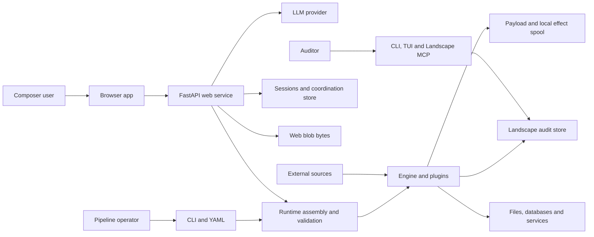
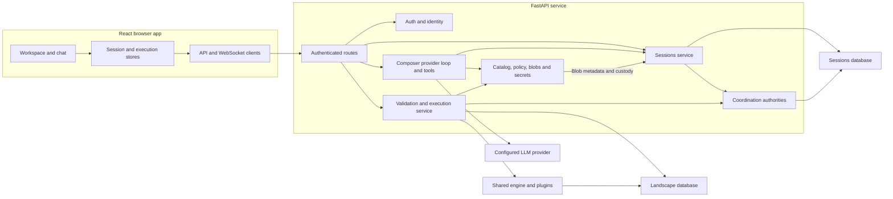
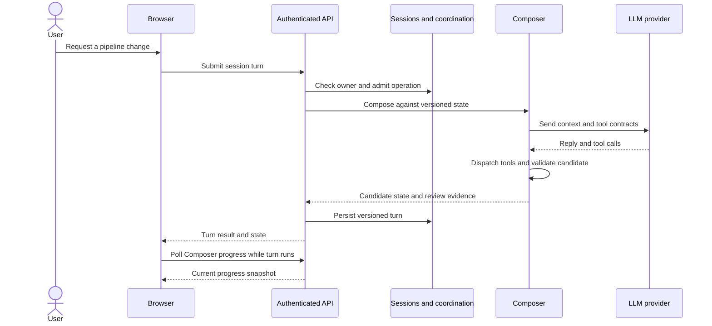
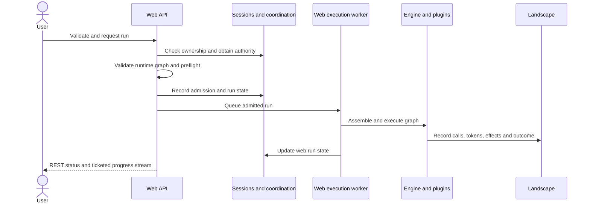

# ELSPETH Architecture

This document maps the implemented system for developers and operators. It
describes ownership and data flow without treating a dated source count or test
result as a permanent architecture fact. The [deployment platform reference](docs/reference/deployment-platforms.md)
is the authority for supported deployment profiles and their acceptance limits;
the [ADR index](docs/architecture/adr/README.md) records design decisions.

## System context

ELSPETH has two authoring surfaces. The CLI loads version-controlled YAML. The
authenticated Web Composer uses a model provider and audited tools to edit
versioned session state. Both paths assemble runtime plugins and a validated
execution graph, then invoke the engine and write run evidence to Landscape.
This is runtime convergence, not a single persisted compiler artifact.

The optional [LLM compatibility gateway](gateway/README.md) is a separate
service. ELSPETH reaches it through an HTTP provider integration; it is not
part of the `elspeth` package.
Its independent frozen dependency lock and image qualification checks govern
the gateway release; see the [gateway build contract](gateway/README.md#the-container-image).

## Code boundaries

| Area | Ownership | Starting point |
| --- | --- | --- |
| `contracts` | Shared data types, enums, and protocols | [`src/elspeth/contracts/`](src/elspeth/contracts/) |
| `core` | Settings, graph, canonical data, payload and Landscape persistence | [`src/elspeth/core/`](src/elspeth/core/) |
| `engine` | Run lifecycle, durable work scheduling, row processing, barriers, and effect coordination | [`src/elspeth/engine/`](src/elspeth/engine/) |
| `plugins` | Sources, transforms, sinks, external clients, and provider adapters | [`src/elspeth/plugins/`](src/elspeth/plugins/) |
| `web` | Authenticated API, Composer, sessions, coordination, execution, and browser frontend | [`src/elspeth/web/`](src/elspeth/web/) |
| Other interfaces | CLI, Textual lineage explorer, read-only Landscape MCP, and Composer MCP | [`src/elspeth/cli.py`](src/elspeth/cli.py), [`src/elspeth/tui/`](src/elspeth/tui/), [`src/elspeth/mcp/`](src/elspeth/mcp/), [`src/elspeth/composer_mcp/`](src/elspeth/composer_mcp/) |

The intended import layering places `contracts` at the leaf, `core` above it,
`engine` above core, and plugins and interfaces above the engine. Runtime
composition belongs at the edges; a plugin must not create an alternate
executor. The exact enforced import rules and known exceptions live in
[ADR-006](docs/architecture/adr/006-layer-dependency-remediation.md) and the
[contributor gates](CONTRIBUTING.md#whole-tree-gates-and-conventions-you-will-hit).

## Pipeline path

1. A YAML file or persisted Composer state supplies an authored pipeline.
2. Settings and plugin policy are checked at their respective boundaries.
   Runtime assembly instantiates plugins and builds an `ExecutionGraph`.
3. Graph and schema validation check edges, routes, required fields, and
   declared contracts before the run proceeds. The web also validates
   Composer state before runtime preflight.
4. The engine registers a run in Landscape, schedules token work, executes
   plugins, and records lineage and external-call evidence.
5. Sinks publish through the effect protocol. Landscape records terminal
   outcomes, artifact evidence, and run accounting. Checkpoints and durable
   work records support eligible recovery and resume.

Finite CSV/JSON sources can opt into a sealed emission snapshot. The engine
parses and validates the complete single-source input before downstream work,
records the snapshot through the source-load operation, and resumes from those
retained bytes rather than reopening a mutable file. This preserves source
identity and quarantine evidence; it does not make uncertain external effects
safe to retry. The [resume runbook](docs/runbooks/resume-failed-run.md) gives
configuration, bounds, and refusal conditions.

HTTP enrichment belongs to the shared audited client. `web_scrape` handles
bounded request bodies, response admission, structured extraction, provenance,
and GET pagination; each fetched destination passes origin and SSRF checks.
POST retrieval has no automatic retry or redirect and blocks automatic resume.
Authenticated fetches remain disabled pending a protected response-evidence
boundary. Browser admission/archive contracts exist in
[`core/browser`](src/elspeth/core/browser/), but no live browser plugin or
enforcing worker is available. Configuration and limits live in the
[web scrape reference](docs/reference/web-scrape-transform.md); the
[browser egress gate](docs/design/2026-09-29-web-browser-egress-gate.md) records
the isolation required before live browser admission.

The [graph validation ADR](docs/architecture/adr/003-schema-validation-lifecycle.md),
[token lifecycle](docs/architecture/token-lifecycle.md), and
[barrier machinery](docs/architecture/barrier-machinery.md) explain the detailed
contracts. Terminal rows use an outcome and a path, rather than one combined
status; see [ADR-019](docs/architecture/adr/019-two-axis-terminal-model.md).

## Web component view

The browser and API deploy together in the standard web package, but they have
separate responsibilities. The browser owns interaction and local display
state. The server owns authentication, policy, persistence, model calls,
validation, and execution admission.

### Browser and HTTP edge

[`App.tsx`](src/elspeth/web/frontend/src/App.tsx) composes the workspace;
[`api/client.ts`](src/elspeth/web/frontend/src/api/client.ts) carries REST
requests. The [session store](src/elspeth/web/frontend/src/stores/sessionStore.ts)
and [execution store](src/elspeth/web/frontend/src/stores/executionStore.ts)
hold browser state; the [WebSocket client](src/elspeth/web/frontend/src/api/websocket.ts)
handles run streams and reconnects. Browser state is a projection of server
authority, not an audit record. [`create_app`](src/elspeth/web/app.py) wires
services and mounts the built frontend after API and WebSocket routes.

The [auth middleware](src/elspeth/web/auth/middleware.py) admits ELSPETH bearer
tokens. The backend exchanges external identity-provider credentials when SSO
is configured; session routes and execution check ownership before protected
work. Route modules stay grouped by domain, including
[sessions](src/elspeth/web/sessions/routes/),
[execution](src/elspeth/web/execution/routes.py), and
[auth](src/elspeth/web/auth/routes.py).

Authentication establishes identity; the Sessions-backed identity authority
establishes current permission. Pipeline operations require an active human
from the configured browser provider with a live deployment-wide `user` grant,
checked at routes and again at durable run admission and WebSocket ticket
consumption. Administrative and workload roles remain separate. Administrators
can purge never-activated pending identities under the retention policy, with
an audit record of the deletion. The [identity guide](docs/guides/identity-providers.md) defines
role admission and the reserved machine/role surfaces.

### Composer and session authority

[`ComposerServiceImpl`](src/elspeth/web/composer/service.py) coordinates a
bounded provider-driven turn. Provider transport and audit are owned by
[`provider_gateway.py`](src/elspeth/web/composer/provider_gateway.py);
planning and staging by
[`planning_application.py`](src/elspeth/web/composer/planning_application.py);
advisor checkpoints by
[`advisor_checkpoint.py`](src/elspeth/web/composer/advisor_checkpoint.py);
and completion and review by
[`composition_completion.py`](src/elspeth/web/composer/composition_completion.py).
The model authors candidate pipeline structure through the Composer tool
surface. Server code validates, rejects, redacts, gates, and persists it; it
does not replace the planner with a server-authored proposal. The first-run
tutorial uses the same authoring backend.

The shared [credential guard](src/elspeth/web/credential_guard.py) rejects
recognized credential material in control content before persistence or tool
dispatch, including provider-authored metadata that becomes audit evidence.
It admits supported secret references and excludes blob data-plane bodies
from this detector. Separate audit scrubbing provides a safe persisted view;
neither boundary replaces data retention and access policy.

The [session service](src/elspeth/web/sessions/service.py) persists versioned
conversations, composition state, proposal and review evidence, and web run
state. [Coordination authorities](src/elspeth/web/coordination/) own leases,
fences, membership, tickets, and admission decisions. PostgreSQL deployments
use database-backed authorities across replicas; SQLite is the local and
single-host alternative. Those choices are wired in
[`web/app.py`](src/elspeth/web/app.py). Session writes and Landscape writes are
separate transactions, so the run-start path uses explicit coordination
rather than assuming an atomic commit across stores.

Interpretation mutations capture immutable plugin schemas, policy snapshots,
and profile lowering facts before acquiring session mutation authority.
Validation under locked rows uses those detached inputs, not live catalog or
profile services. Blob-backed source edits reconcile authoritative reviews,
so approval state follows the changed source. Runtime assembly and Composer
both derive generated LLM outputs from the same plugin contract; schema
declarations do not themselves extract fields from a provider response.

### Validation, launch, and progress

The [web validation service](src/elspeth/web/execution/validation.py) checks
authored state and invokes runtime preflight. The
[execution service](src/elspeth/web/execution/service.py) re-reads persisted
state, checks blob and secret authority, admits a run, and invokes the shared
engine in a background worker. A web process has one pipeline execution
worker, so admitted runs on that process may wait for it. The
[execution routes](src/elspeth/web/execution/routes.py) expose status,
diagnostics, artifacts, cancellation, and an authenticated WebSocket stream
using short-lived tickets. The browser can recover state from the API after a
stream disconnect.

Catalog, plugin policy, blobs, user secrets, approvals, library, preferences,
reviews, and audit readiness are separate supporting web domains wired by
[`web/app.py`](src/elspeth/web/app.py). The diagram groups them so the
authoring and execution authorities remain visible.

## Persistence and evidence

| Store | Owner and contents | Boundary |
| --- | --- | --- |
| Landscape database | [`core/landscape`](src/elspeth/core/landscape/): run, token, call, effect, artifact, and audit evidence | SQLite, SQLCipher, or PostgreSQL according to deployment |
| Sessions database | [`web/sessions`](src/elspeth/web/sessions/) and [`web/coordination`](src/elspeth/web/coordination/): conversations, composition, proposals, web run state, and coordination records | Separate from Landscape, even when both use PostgreSQL |
| Local authentication database | [`web/auth/local.py`](src/elspeth/web/auth/local.py): local credentials | A separate `auth.db` for local auth; external identity providers use their own credential authority |
| Web blob bytes and metadata | [`web/blobs`](src/elspeth/web/blobs/): uploaded and session-scoped input blobs | Bytes live on the filesystem; ownership and custody metadata live in the Sessions database |
| Payload store and local effect spool | [`core/payload_store.py`](src/elspeth/core/payload_store.py) and sink effect machinery | Filesystem data whose persistence depends on the deployment profile; effect lifecycle records live in Landscape and publication targets can be external |

Landscape is the canonical run evidence store. The Sessions database also
contains authoring and coordination evidence; a portable Landscape export
must not be assumed to include every web record. Consult the
[release guarantees](docs/release/guarantees.md) for export scope and the
[Landscape guide](docs/architecture/landscape.md) for repository detail.

## Trust and operations

ELSPETH distinguishes engine-owned audit/control records (Tier 1), validated
pipeline data (Tier 2), and external input, including source rows and model
responses (Tier 3). External values are parsed at admission boundaries;
engine-owned types are checked nominally. A structural `Protocol` is an
interface description, not an authentication or trust decision. See
[ADR-032](docs/architecture/adr/032-validate-by-trust-domain.md) and the
[trust guide](docs/guides/data-trust-and-error-handling.md).

Operational telemetry follows audit writes and can be filtered or dropped by
its configured exporter policy. It helps diagnose live behaviour but does not
establish lineage. The [telemetry guide](docs/guides/telemetry.md) and
[Landscape MCP guide](docs/guides/landscape-mcp-analysis.md) cover inspection.

Web deployments use one process per replica. A multi-replica target needs
external PostgreSQL for Sessions and Landscape, persistent payload storage,
and target-specific acceptance. SQLite is suitable for local and supported
single-host shapes; sharing a SQLite file does not create a web replica
coordination substrate. See the [deployment platform matrix](docs/reference/deployment-platforms.md)
for current platform status, limitations, and runbooks.

## Further reading

- [Architecture decision records](docs/architecture/adr/README.md)
- [Engine and subsystem map](docs/architecture/subsystems.md)
- [Plugin author guide](PLUGIN.md)
- [Configuration reference](docs/reference/configuration.md)
- [Deployment security assurance](docs/security-assurance/README.md)
- [README and quick start](README.md)
