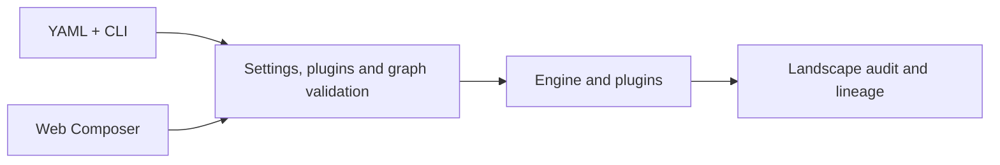

# ELSPETH

**E**xtensible **L**ayered **S**ecure **P**ipeline **E**ngine for **T**ransformation and **H**andling

[](LICENSE)
[](https://www.python.org/downloads/)


ELSPETH builds, validates, runs, and audits data and LLM workflows whose
outputs need to be reviewed and explained. You can author a pipeline in
version-controlled YAML or through the authenticated Web Composer. Both paths
use the same plugin contracts, graph validation, execution engine, and
Landscape audit trail.

> **Pre-release status:** ELSPETH may be suitable for carefully evaluated,
> use-case-specific applications, but it is not yet ready for general production use.
> Before relying on it, validate ELSPETH against your requirements and risk controls.
>
> **AI-generated code:** ELSPETH is a rapid prototype, generated and reviewed by AI,
> that is in active development with major systems subject to change. Limited user
> testing has been conducted on a small set of use cases.

## What it does

- **Builds explicit pipelines.** Sources, transforms, gates, barriers, and sinks
  form a directed graph with named edges and declared data contracts.
- **Validates before execution.** ELSPETH checks settings, plugin declarations,
  graph structure, routes, and compatible schemas. Runtime checks also hold
  plugins to declarations that validation relied on.
- **Records what happened.** Landscape stores source and token lineage,
  external calls, routing, terminal outcomes, and output evidence. Logs and
  telemetry support operations; they do not replace the audit record.
- **Supports recovery.** Durable work records, checkpoints, and sink effect
  protocols support interrupted runs within their documented limits.
- **Offers two authoring paths.** YAML supports direct review and version
  control. The Web Composer uses a provider-driven tool loop to propose changes
  to versioned session state, with validation and review before execution.



The web and CLI paths converge at runtime assembly and execution. They do not
yet run a shared, persisted compiled-pipeline artifact. The
[architecture guide](ARCHITECTURE.md) describes the current boundaries.

## Try a YAML pipeline

You need Python 3.12 or newer and [uv](https://docs.astral.sh/uv/). From a
source checkout:

```bash
git clone https://github.com/dta-au/elspeth.git
cd elspeth
uv sync --frozen
uv run elspeth validate --settings examples/threshold_gate/settings.yaml
uv run elspeth run --settings examples/threshold_gate/settings.yaml --execute
```

The example writes its output under `examples/threshold_gate/output/` and its
Landscape database at the path configured in its settings file. The
[first-pipeline guide](docs/guides/your-first-pipeline.md) walks through the
configuration, results, and lineage. Use `uv run elspeth plugins list` to see
the registered plugins in your checkout.

## Try the Web Composer

The Web Composer adds a FastAPI service and React frontend for authenticated
authoring, validation, review, execution, and run inspection. Its LLM planner
needs a configured model provider; a local login alone does not configure one.
Follow the [local web setup guide](docs/guides/web-local-development.md) for
dependencies, development credentials, model settings, and startup. For a
user walkthrough, see the [Composer guide](docs/release/composer-guide.md).

## Audit and trust

Landscape is the runtime evidence store. ELSPETH distinguishes engine-owned
audit and control records, validated pipeline rows, and untrusted external
input. Source data and provider responses are validated at their entry
boundaries; corruption of audit records fails closed. See
[data trust and error handling](docs/guides/data-trust-and-error-handling.md)
and the [current audit and lineage guarantees](docs/release/guarantees.md).

ELSPETH supports audit export and optional signing. The
[export settings and limits](docs/reference/configuration.md#export-settings)
describe what is exported and how to configure it.

## What changed in 0.8.1

This release changes recovery and audit storage. For SQLite installations,
the cutover is from session epoch 53 to 71 and Landscape epoch 38 to 48;
archive or export evidence you need, stop the old service, recreate both stale
databases in the same service-stop window, and install 0.8.1. See the
[release notes](CHANGELOG.md) and [deployment runbooks](docs/runbooks/index.md)
before upgrading.

## Recovery and deployment

To resume an interrupted run, replace the ID in
`elspeth resume <run_id> --execute` with the run you intend to resume, for
example `elspeth resume abc123 --execute`. Without `--execute`,
`elspeth resume <run_id>` checks whether the run can be resumed without
changing it. See the [recovery runbook](docs/runbooks/resume-failed-run.md)
for the eligibility checks and operator procedure.

Set `IMAGE_TAG` only after confirming that the intended container tag was
published; the [Docker guide](docs/guides/docker.md) shows how to inspect it.
The [AWS ECS cold-install runbook](docs/runbooks/aws-ecs-cold-install.md)
describes the tracked Terraform package. Azure Container Apps has
Single/sticky desktop acceptance; live cloud acceptance is a separate gate.
See the [deployment platform reference](docs/reference/deployment-platforms.md)
for the precise support limits.

## Documentation

| Start here | For |
| --- | --- |
| [First pipeline](docs/guides/your-first-pipeline.md) | YAML walkthrough and result inspection |
| [Local web setup](docs/guides/web-local-development.md) | Web Composer development setup |
| [User manual](docs/guides/user-manual.md) | Product workflows and commands |
| [Architecture](ARCHITECTURE.md) | Components, boundaries, stores, and execution paths |
| [Plugin guide](PLUGIN.md) | Writing and testing plugins |
| [Configuration](docs/reference/configuration.md) and [environment variables](docs/reference/environment-variables.md) | Settings and deployment options |
| [Deployment platforms](docs/reference/deployment-platforms.md) | Supported profiles and acceptance limits |
| [Release notes](CHANGELOG.md) and [roadmap](ROADMAP.md) | Changes and planned work |

ELSPETH includes a separate [LLM compatibility gateway](gateway/README.md)
for certain provider integrations. It deploys independently from the engine.

## Contributing and support

See [CONTRIBUTING.md](CONTRIBUTING.md) for development checks and pull request
guidance, [GOVERNANCE.md](GOVERNANCE.md) and
[CODE_OF_CONDUCT.md](CODE_OF_CONDUCT.md) for project participation,
[SECURITY.md](SECURITY.md) for private vulnerability reporting, and
[SUPPORT.md](SUPPORT.md) for help channels and current support limits.

ELSPETH is available under the [MIT License](LICENSE).
