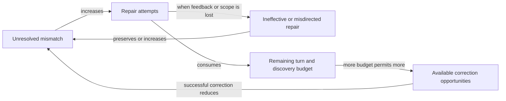

# Composer recovery pattern review — 2026-10-02

Eight bounded usability findings were reproduced outside the immediate CSV recovery repair. They share three structural problems: recovery decisions lose the identity of the operation being repaired; inspection summaries become stronger claims than their evidence permits; and progress shortcuts erase information that later actions still need.

The initial read-only review examined `release/0.8.1`, HEAD `e0051236b9b18d80d22a4e17a0b0db1305891595`, with the concurrent CSV incident changes present. The maintainer then authorized repairs to all eight findings directly on that release branch. The findings and controlled outputs below describe the pre-repair behavior; historical line references locate that snapshot. The systems-thinking skill informed the feedback analysis. The review and repairs did not access or repair the original user session, call a live external provider, change deployment, or publish issue-tracker records.

## Repair implementation

| Finding | Implemented correction | Persistent regression coverage |
|---|---|---|
| F1 | Resolve configured CSV headers in the runtime namespace and detect every missing nonoptional source field; preserve optional-field and incomplete-sample abstention. | [Configured source proof tests](../../tests/unit/web/composer/test_configured_source_shape_proof.py), compared with actual CSV source emissions. |
| F2 | Parse JSON with the configured format, encoding, selected collection and field mapping after removing Composer metadata from plugin options. | The same source proof tests cover selected collection order, mapping, encodings and metadata-bearing options. |
| F3 | Preserve per-record resolved key sets and full-artifact coverage; only complete all-invalid evidence supports universal loss. | Sparse, reversed, malformed and bounded-prefix JSON/JSONL controls in the same source proof tests. |
| F4 | Carry existing closed batch-placement and input-field error codes through every authoring guard and safe repair feedback. | [Guard parity tests](../../tests/unit/web/composer/test_transform_tools_review_and_guard_parity.py). |
| F5 | Track model discovery provider, limit and completeness from the admitted response; retain useful expansion and suppress covered repetitions. | [Sequential discovery tests](../../tests/unit/web/composer/test_model_discovery_scope.py), including contradictory superseded/admitted response controls. |
| F6 | Condition upload, proof, runtime-preflight, interpretation and advisor recovery guidance on the unchanged active request. Upload availability supplies facts; the provider continues to author all graph changes. | [Actual compose-loop authority tests](../../tests/unit/web/composer/test_upload_recovery_authority.py), with explanation and authorized mutation controls. |
| F7 | Share one store-owned cancellation controller per session across composer entry surfaces, retaining ownership through abort settlement. | [Checks Apply to Chat Stop integration](../../src/elspeth/web/frontend/src/test/composerOwnership.integration.test.tsx) and hook/store race controls. |
| F8 | Derive active busy state from the selected session's owner, initialize new sessions coherently, and fence stale publication and cleanup. | [Session store tests](../../src/elspeth/web/frontend/src/stores/sessionStore.test.ts) cover old success/failure, navigation, concurrent sessions and resynchronization. |

Configured CSV data-contract review sampling also uses runtime field names, columns, skip count, mapping and encoding. It abstains when a header cannot be certified. User acknowledgement remains required for an observed guarantee; runtime contracts remain the supported alternative.

Independent reviewers and Astra's final systems review found no remaining blocker in their bounded repair scopes. Source verification completed with 284 enclosing checks, followed by 56 focused controls and seven final codec parity controls. The decoder repair converts a registry-known nontext codec failure into structured proof rejection; it does not change plugin runtime validation. Discovery/feedback completed with 32 final focused controls, and the final request-authority matrix completed with 63 checks. Frontend verification completed with 4,008 tests across 247 files. All these final processes exited 0. These deterministic tests replace the external model/network boundary; they establish protocol and state behavior, not live Azure convergence. Python whole-tree, PostgreSQL and operator signature results belong to the final release verification record, rather than these original reproducer results.

The request-authority controls distinguish a valid acknowledgement handoff from an orphan. A saved well-formed requirement may receive real backend-generated review cards without a graph change: completion can hand off to the user while execution remains blocked. An unresolvable missing-wiring orphan blocks both. The authorized counterpart uses real tool acceptance and canonical server-owned requirement IDs; dispatch completion alone is insufficient evidence of repair.

The broad Python run exposed three compound CSV assistance hints exceeding the existing short-hint contract. They were separated at sentence boundaries by subject, preserving their exact ordered text and every repair qualification. The 128 discovery and CSV guidance checks passed without changing the limit. The source fingerprint, 15 corpus provenance literals, production-observed resume projection and derived registry digest were regenerated from the resulting source; these bindings are consequences of the edit rather than constraints on its wording.

The keyless trust-tier comparison measured 1,428 unique baseline diagnostics and 1,442 after repair, ignoring source-position shifts. The added patterns include external-data parsing boundaries, an admitted-response encoder invariant and three stale header-sampling entries. Eleven new uncovered sites have site-specific rationale drafts in the key-free `composer-all-findings-20261002` worklist. Operator adjudication and signatures remain pending; the worklist also contains the standing repository backlog and is not blanket signing clearance.

## Findings

### F1 — Partial missing CSV requirements escape the empty-output blocker (P2)

The source declares required fields `a` and `b`, but the complete CSV is `a\n1\n`. Composer emits only an informational warning; real `CSVSource.load()` emits zero rows with `on_validation_failure='discard'`.

[The required-header check](../../src/elspeth/web/composer/source_inspection.py) at lines 1182–1185 returns no risk as soon as **any** required name overlaps the header. [The proof caller](../../src/elspeth/web/composer/tools/generation.py), lines 3587–3605, therefore misses a source that necessarily drops every row. Runtime validation requires every nonoptional field, not merely one overlap. This is a bounded gap in the proof gate, not a claim that preview guarantees nonempty output for arbitrary data.

Controlled output:

```text
csv_complete:       blocking=false, runtime_rows=[{"a":"1","b":"2"}]
csv_none_present:   blocking=true,  runtime_rows=[]
csv_partial_missing:blocking=false, runtime_rows=[]
```

The complete-schema control proves success is possible; the zero-overlap control proves the blocker is exercised. Correct the predicate to identify required fields absent from a resolved header, with explicit-column and optional-field controls.

### F2 — JSON proof ignores runtime source options (P2)

Two inputs that run correctly are blocked because proof inspects a different interpretation of the same bytes.

* **Field mapping:** `[{"External ID":1}]`, fixed schema `id: int`, mapping `external_id → id`. Runtime emits `{"id":1}`. Proof reports blocking `csv_fixed_schema_omits_observed_columns`. Removing the mapping and declaring `external_id: int` clears the blocker and still emits a row. [generation.py](../../src/elspeth/web/composer/tools/generation.py), lines 3572–3576 and 3640–3644, reads and forwards mappings only for CSV; [JSONSource](../../src/elspeth/plugins/sources/json_source.py), lines 499–506, applies the mapping during runtime normalization.
* **Selected collection:** `{"metadata":[{"version":1}],"records":[{"id":5}]}`, `data_key='records'`, fixed schema `id: int`. Runtime emits `{"id":5}` but proof blocks. Reordering the two object properties clears the blocker while runtime output remains identical. [Inspection](../../src/elspeth/web/composer/source_inspection.py), lines 718–726, chooses the first list of objects. [Runtime](../../src/elspeth/plugins/sources/json_source.py), lines 408–450, selects the configured key. The proof caller at generation.py:3485–3522 specializes CSV options but never applies JSON `data_key`.

These are false blockers in actual proof computation. [Preview](../../src/elspeth/web/composer/tools/generation.py), lines 4119–4141, converts any blocking proof diagnostic into `preview_is_valid=false`; [completion](../../src/elspeth/web/composer/composition_completion.py), around lines 965–1005, also consumes these blockers for forced repair. The measured defect is not merely a misleading standalone inspection label.

Make configured source interpretation an explicit input to proof. Exercise the actual plugin's bounded parsing/normalization policy where possible. Keep unconfigured upload discovery separate from configured execution proof.

### F3 — Sparse JSON keys are treated as columns present in every row (P2)

Input `[{"id":1},{"id":2,"extra":3}]` with fixed schema `id: int` and discard routing produces the first valid row at runtime. Composer blocks it and says every row will be dropped because each contains an undeclared column.

[Inspection](../../src/elspeth/web/composer/source_inspection.py), line 784, builds the union of all sampled keys. [The proof predicate](../../src/elspeth/web/composer/tools/generation.py), lines 3534 and 3636–3663, applies the CSV fixed-header rule to JSON/JSONL and treats that union as universal row coverage. The control `[{"External ID":1}]` with matching normalized schema emits a row and receives no blocker.

A union establishes that an extra key occurs somewhere, not that it occurs everywhere. Preserve per-row support or a conservative intersection when making universal claims. Report partial rejection as a warning when supported; block all-row loss only when evidence supports that conclusion. Test mixed-validity JSON/JSONL in both row orders and compare against runtime emissions.

### F4 — Batch-placement rejections lose their actionable classification (P2)

`set_pipeline` rejects a `batch_stats` transform that should be an aggregation, and separately rejects `required_input_fields` on its aggregation form. Both guards omit stable error codes. Candidate feedback consequently drops the specific repair message and returns the same generic `validation_error` classification.

The reproduced correction is concrete: change the node to aggregation and remove the forbidden field; the candidate is accepted. This is recovery blindness rather than an admission bypass. Existing closed codes already describe these failures, so the minimal correction is to carry the validator classification through rejection, candidate projection, and explanation. Keep raw options and arbitrary validator text private; stable classification can preserve repairability without exposing them.

[sessions.py](../../src/elspeth/web/composer/tools/sessions.py), lines 1470–1476, omits codes on early failures. [state.py](../../src/elspeth/web/composer/state.py), lines 8493 and 8497, already has `batch_transform_misplaced` and `batch_required_fields_invalid`; [pipeline_planner.py](../../src/elspeth/web/composer/pipeline_planner.py), lines 2343–2379, projects the codeless error as `validation_error`. The explanation tool has guidance for the two specific codes, but `explain_validation_code('validation_error')` returns `None`. The fixture-based candidate probe used the real builder and feedback projector, exited 0, and observed `acceptable=false` for each bad candidate versus `acceptable=true, errors=[]` for each correction. The existing guard-parity test at `tests/unit/web/composer/test_transform_tools_review_and_guard_parity.py:364–372` explicitly expects the missing code; it preserves the defect rather than disproving it.

### F5 — A partial model listing is recorded as complete discovery (P2)

When the authoring aid defers an oversized model catalog, a filtered or limited `list_models` call may return `truncated=true`. [The planner information key](../../src/elspeth/web/composer/pipeline_planner.py), lines 393–394, nevertheless represents every provider and limit as the same `model.catalog` fact. A successful first listing marks it supplied, removes the discovery tool, and classifies a larger limit or another provider as `DISCOVERY_NO_GAIN`.

The controlled probe used the real listing handler and planner manifest, with only catalog retrieval replaced by `anthropic/model-a`, `anthropic/model-b`, and `openai/model-c`. A first request for Anthropic with limit 1 returned `count=2, truncated=true`. After that listing, `list_models_retained=false`; both Anthropic limit 2 and OpenAI limit 1 were classified as no gain. A different plugin-schema request remained gainful. The command exited 0. This proves a discovery restriction and an efficiency/recovery trap. It does **not** prove that every affected plan fails: a provider may already have enough information, or an escape hatch may recover.

Track request scope and completeness, not just the tool family. Retain expansion when a response is truncated or only covers a provider subset; reject exact repeated discovery separately. Test the advertised tool surface as well as the internal no-gain predicate.

### F6 — A ready upload causes forced build steering on a no-build request (P2)

With an empty saved pipeline and a ready uploaded CSV, the ordinary compose loop injects `Continue by calling a build/edit tool` after a prose answer to `Do not build anything. Just explain what a CSV source is.` It also injects this instruction after `Hello!`.

[composition_completion.py](../../src/elspeth/web/composer/composition_completion.py), lines 914–951 and 1373–1379, checks upload presence and structural emptiness without carrying the original request's intent. The directive is at lines 699–708. The upload branch runs before a separate neutral retry that preserves explanatory/revoked intent. [service.py](../../src/elspeth/web/composer/service.py), lines 971–987 and 2104–2125, confirms these ordinary no-tool responses reach that branch.

A full compose-loop probe used temporary SQLite sessions, real uploaded blobs and real COMPOSE fences. Scripted provider responses always declined to mutate:

| Request | Upload | Provider calls | Forced build instructions |
|---|---|---:|---:|
| Explicit no-build explanation | yes | 3 | 2 |
| Same explanation | no | 2 | 0 |
| Greeting | yes | 3 | 2 |
| Greeting | no | 1 | 0 |
| Build from uploaded CSV | yes | 3 | 2 |

The authorized build is the positive control; the no-upload greeting is the negative control. Saved state stayed at version 1 in every case. The confirmed defect is misleading steering and extra scripted provider calls. Actual unauthorized mutation, billing impact, and approval bypass were **not** demonstrated.

Carry the user's active goal into recovery eligibility and wording. Upload presence is available data, not a construction request. Keep the LLM in the authoring path.

### F7 — Chat Stop does not own composition started from Checks (P2)

[SideRailValidationBanner](../../src/elspeth/web/frontend/src/components/sidebar/SideRailValidationBanner.tsx), lines 32 and 55, creates its own `useComposer` sender for Apply in Checks. [ChatPanel](../../src/elspeth/web/frontend/src/components/chat/ChatPanel.tsx), lines 318 and 1509, uses a different hook instance for visible Stop. [useComposer](../../src/elspeth/web/frontend/src/hooks/useComposer.ts), lines 27 and 57, stores and aborts an instance-local controller. Busy state is global, so Chat shows Stop for a request whose controller it does not hold.

A bounded two-hook probe observed:

```text
CHECKS_SEND_CHAT_STOP: aborted=false, isComposing=true
SAME_OWNER_CONTROL: aborted=true, reason=compose_user_cancel
```

The backend receives cancellation via the request signal/disconnect; this click creates neither. Give all send surfaces and Stop the same active session/turn cancellation owner. Test the Checks Apply → Chat Stop sequence, not just send and cancel within one hook.

### F8 — Creating a new session during composition inherits permanent busy state (P2)

[sessionStore](../../src/elspeth/web/frontend/src/stores/sessionStore.ts), lines 1259–1288, activates a newly created session without resetting `isComposing`. The old send set it true at line 1516. After activation, the old request correctly loses publication rights at lines 451–455 and returns at 1535–1536; its `finally` does not clear the inherited busy flag. [HeaderSessionSwitcher](../../src/elspeth/web/frontend/src/components/sessions/HeaderSessionSwitcher.tsx), lines 103–106 and 339–348, allows New session while composition is pending.

A probe using real store actions and deferred API promises observed:

```text
CREATE_DURING_SEND: active=new-session, old POST settled, isComposing=true
SELECT_CONTROL: same new session isComposing=false
```

The new chat remains disabled after the old request finishes. Initialize compose-derived state coherently on every activation path; keep request ownership scoped to session/turn. Test creation during both successful and failed old requests, with old responses forbidden from changing the new session.

## System structure and intervention priorities

The intended balancing loop is: an unmet authorized request causes provider work; useful feedback corrects the candidate; an accepted graph reduces the remaining gap. Recovery has to preserve the request identity, candidate identity, source interpretation, and evidence scope for that loop to close.

The findings break those connections in different places:

| Lost distinction | Observed result | Findings |
|---|---|---|
| Required set versus any overlap; key union versus every row | False negative or false positive proof | F1, F3 |
| Generic file inspection versus configured runtime interpretation | Correct source triggers repair | F2 |
| Specific rejected candidate versus generic validation failure | Corrective information disappears | F4 |
| Partial result versus complete knowledge | Useful discovery becomes unavailable | F5 |
| Available upload versus active construction request | Recovery contradicts user intent | F6 |
| Shared busy flag versus owning request/controller | Stop fails or a fresh session stays busy | F7, F8 |

A conditional reinforcing failure loop is also supported structurally:



The upper loop is reinforcing only when feedback is defective and the provider follows it; the probes establish the defective links, not a live-model convergence rate. The lower budget path makes repeated failure harder to recover from. No latency, wall-clock, or model-quality causal conclusion follows from this review.

“Fixes that fail” is a useful, limited archetype here: an anti-stall rule can help an authorized build while producing a new problem for a greeting; anti-repetition discovery can reduce duplicate work while suppressing useful expansion. The evidence does not justify claims about organizational incentives, deliberate corner-cutting, or a universal Composer death spiral.

Prioritize the smallest interventions at the shared boundaries:

1. **Restore operation ownership:** one active request/cancellation owner; one coherent activation reset; recovery carries the current authorized goal. F6–F8 have direct user-control effects.
2. **Make proof match execution:** configured parser options, required-field semantics, and per-row evidence scope. Fix F1–F3 with differential controls against actual source plugins; do not broaden proof claims from sample presence.
3. **Keep repair information precise and private:** stable typed rejection codes with a safe projection; completeness/scope-aware discovery identity. F4–F5 need better information flow, not larger retry budgets.

Acceptance should measure a corrected action's effect on the same request and state. A tool returning success, a file being uploaded, a catalog being sampled, or a provider returning prose is not interchangeable with the user reaching the intended outcome.

## Evidence and limits

The lane is `.claude/lanes/csv-recovery-20261002/astra/`. It contains the complete scratch probes and logs; it is deliberately ignored. Reproducer inputs and observed outcomes are preserved above so the findings remain understandable independently of those local files.

* `probe_source_proof.py` / `.log`: runs the real per-source proof helper with verified bounded bytes and the real CSV/JSON source loaders; only the audit-recording context is mocked. Eight fixture cases and explicit positive/negative assertions completed with process exit **0**, ending `CONTROL_ASSERTIONS=PASS`. Command from repository root: `PYTHONPATH=.:src:elspeth-lints/src .venv/bin/python .claude/lanes/csv-recovery-20261002/astra/probe_source_proof.py`.
* `async-probe.test.tsx`, `async-probe.config.mjs`, `async-probe.log`: real hooks/store with mocked network promises, **2 tests passed**, process exit **0**. Run from frontend root with `node_modules/.bin/vitest run --config <repo>/.claude/lanes/csv-recovery-20261002/astra/async-probe.config.mjs --reporter verbose`. Source hash checks passed after the probe.
* `state_feedback_probe.py` / `.log`: full compose loop with scripted provider replies, five request/upload combinations, process exit **0**. Run from repository root with `PYTHONPATH=.:src:elspeth-lints/src .venv/bin/python .claude/lanes/csv-recovery-20261002/astra/state_feedback_probe.py`.
* `probe_batch_rejection.py` and `probe_model_discovery.py`, each with `.log` and `.exit`: real candidate validation/feedback and discovery handler/policy controls respectively; both exit records are **0**. Run each from repository root with `PYTHONPATH=.:src:elspeth-lints/src .venv/bin/python .claude/lanes/csv-recovery-20261002/astra/<script>.py`. The discovery probe replaces only the external catalog list; the batch probe uses existing fixture builders without mocking validation.

Passing reproducer assertions mean the defects were observed; they are not a green product gate. These are bounded local probes, not end-to-end browser/provider acceptance or a complete Composer audit. The working tree was under concurrent repair, so no whole-tree frozen-gate claim is made.

Counterevidence: rejected `prevalidated_unapplied_result` values are excluded from saved-state/preflight accumulator updates in [tool_batch.py](../../src/elspeth/web/composer/tool_batch.py), lines 2816–2819; a saved-state mutation triggers fresh preflight. The review did not establish a general rejected-candidate verdict contaminating saved-state finalization. Completion explicitly returns failure after proof-repair exhaustion and checks orphaned reviews. No general fail-open completion claim is supported. Subsequent ownership controls exercised navigation, concurrent sessions, cancelled-request settlement and resynchronization; those results are distinct from the original two ownership probes.
