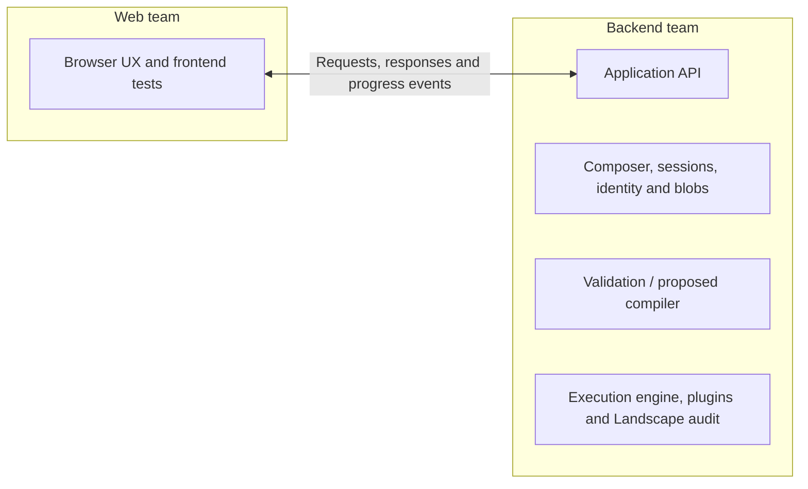

# Proposed ownership boundary

This diagram shows team responsibilities, not a requirement for separate processes or deployments. The compiler is proposed; current validation/execution remains the initial backend implementation.

