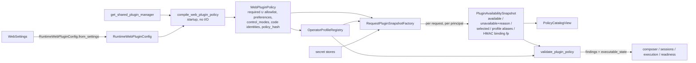
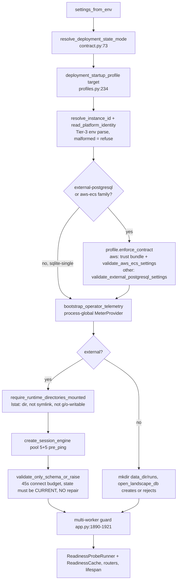
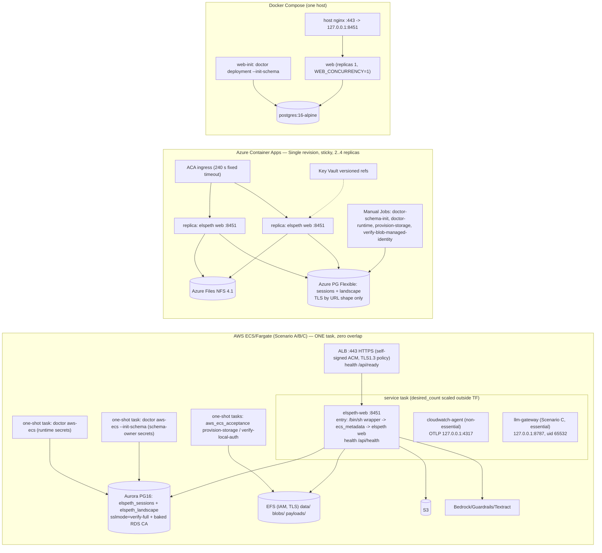
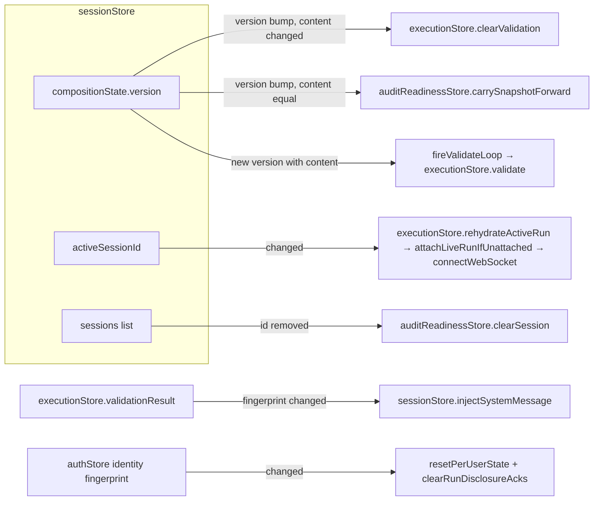
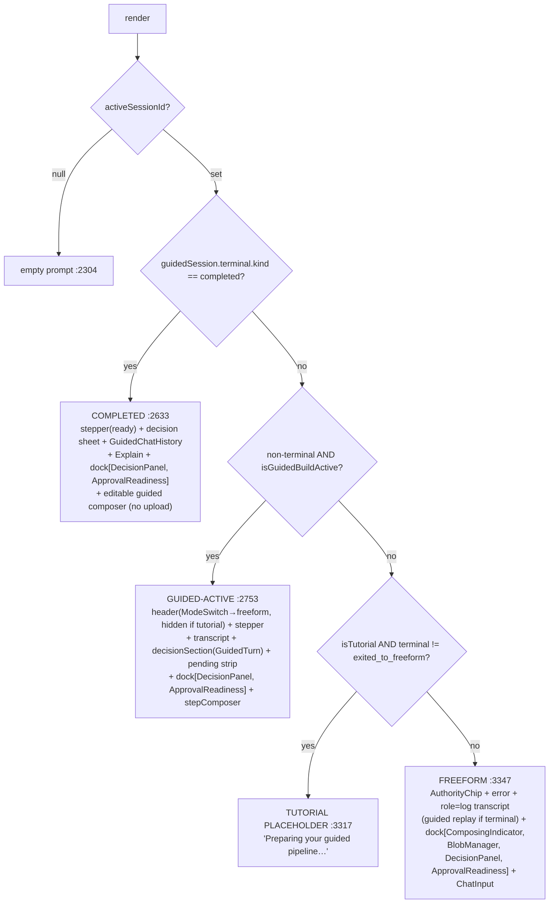
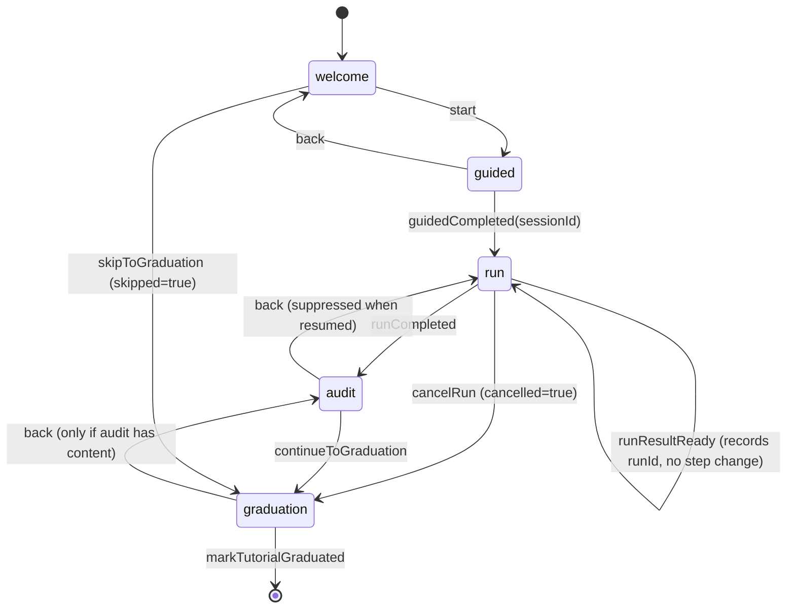
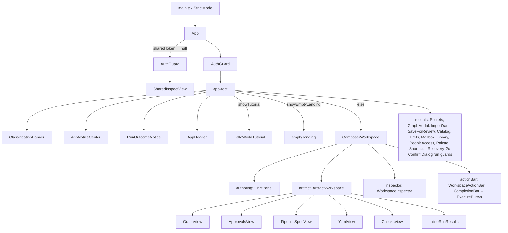
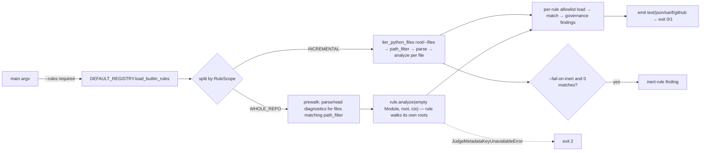
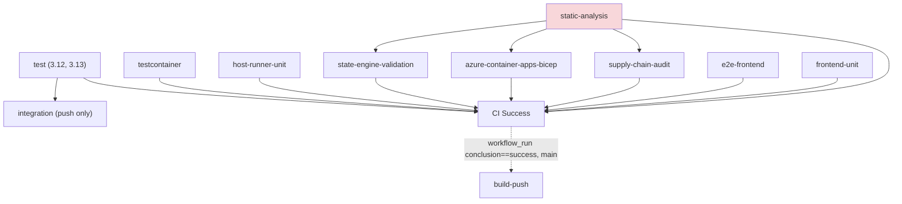

# 02 — Subsystem Catalog, S19–S25

This companion contains entries S19–S25 from the [primary subsystem catalog](02-subsystem-catalog.md). The split keeps both Markdown files within the repository size gate; the catalog content is otherwise unchanged.

# S19 — Web supporting domains (blobs, plugin policy, catalog, shareable reviews, audit readiness)

**Location:** pinned worktree `.claude/worktrees/arch-analysis-pin` (`release/0.8.1` @ `85ebf2739`, `git rev-parse HEAD` verified):
`src/elspeth/web/blobs/`, `src/elspeth/web/plugin_policy/`, `src/elspeth/web/catalog/`,
`src/elspeth/web/shareable_reviews/`, `src/elspeth/web/audit_readiness/`, `src/elspeth/web/validation.py`,
`src/elspeth/web/provider_config_policy.py`, `src/elspeth/web/landscape_access.py`.

The computed task list for this slice omits `landscape_access.py`. The partition table
(`00-coordination.md:59`) includes it, so this entry covers it too.

**Measured size:** **15,823 lines in 36 files** (33 package files plus 3 root modules).
Instrument: `find blobs plugin_policy catalog shareable_reviews audit_readiness validation.py provider_config_policy.py -name '*.py' | xargs wc -l`
gives 15,782 lines. `wc -l landscape_access.py` gives 41. `find <5 pkgs> -name '*.py' | wc -l` gives 33.
`blobs/service.py` alone is 4,455 lines (28 % of the slice).

**Responsibility:** These are the web tier's domain services around the composer. They provide:
- fenced, quota-accounted filesystem custody of session blobs;
- per-deployment compilation of the plugin allowlist, with per-principal availability snapshots and operator-profile lowering;
- the plugin catalog projection that the composer, the HTTP API, the CLI and the composer-MCP all read;
- HMAC capability tokens for frozen review snapshots (ADR-022);
- a read-only audit-readiness panel;
- shared text/secret-name validators and web-only provider-option policy gates.

---

## Key components

Every file over 300 lines has its own row. The others are grouped.

| File | Lines | Role |
|---|---:|---|
| `blobs/service.py` | 4,455 | `BlobServiceImpl` (class spans 2,013 lines, :2443-4455) plus about 90 module-level helpers. It handles create (reserve → atomic write → mark ready), fenced reads, the deletion ledger (intent/staged/purge_pending), inline-custody staging/publication for composer-authored content, run-output finalisation, and fork copy/cleanup with lease checkpoints. |
| `plugin_policy/profiles.py` | 1,712 | Operator-profile settings models (`AWSS3SourceProfileSettings`, `AWSTextractProfileSettings`, `AzureSearchProfileSettings`) and `RuntimeWebPluginConfig`. Six resolvers implement `OperatorProfileResolver`: LLM for source and transform, Bedrock guardrail, S3 source, Textract, and Azure Search. `OperatorProfileRegistry` dispatches to them. Each resolver projects a public schema, lowers options, and reports availability. |
| `audit_readiness/service.py` | 1,297 | `ReadinessService.compute_snapshot` (six-row panel), `build_plugin_policy_readiness` / `build_boot_plugin_policy_readiness`, the plugin-trust boundary classification, and `load_sink_effect_diagnostic` (Landscape projection). |
| `plugin_policy/coverage.py` | 979 | Queue-aware stream graph over `CompositionState`. It runs dominator/post-dominator checks that required PROMPT_SHIELD / CONTENT_SAFETY controls cover every LLM input and output path, and it works out prompt field-scope from Jinja templates. |
| `plugin_policy/validation.py` | 781 | `validate_plugin_policy` (enablement → endpoint/alias diagnostics → profile lowering → required-control availability/coverage) and `validate_authored_composition_state`, which is the single "authored vs executable" validation projection. |
| `catalog/knob_schema.py` | 715 | Lowers pydantic config models (and discriminated unions) to the composer's one-knob wire shape (`KnobField`/`KnobSchema`, tiers, `visible_when`, `required_when`). Sampled: header and outline only. |
| `shareable_reviews/service.py` | 711 | `ShareableReviewService`: the mark-ready gate chain, the audit-first completion event, the content-addressed snapshot in `FilesystemPayloadStore`, token mint and resolve. |
| `catalog/service.py` | 593 | `CatalogServiceImpl` wraps `PluginManager`. It caches the per-plugin `PluginSchemaInfo` at construction and builds `PluginSummary` (with derived audit characteristics and secret requirements) on every `list_*`. |
| `blobs/routes.py` | 538 | 7 routes under `/api/sessions/{session_id}/blobs`: upload, inline, list, metadata, content, preview, delete. |
| `blobs/replacement.py` | 332 | `BlobReplacementCoordinator`: staged/backup replacement plans with crash recovery. It imports 7 private helpers from `service.py`. |
| `plugin_policy/availability.py` (282), `models.py` (222), `compiler.py` (166), `__init__.py` (14) | 684 | Per-principal `build_plugin_snapshot` with HMAC binding fingerprints, `RequestPluginSnapshotFactory`, the immutable `PluginId`/`WebPluginPolicy`/`PluginAvailabilitySnapshot` values, and the `compile_web_plugin_policy` startup compiler plus `REQUIRED_WEB_PLUGIN_IDS`. |
| `catalog/policy_view.py` (280), `routes.py` (148), `schemas.py` (144), `schema_parse.py` (101), `protocol.py` (57), `__init__.py` (0) | 730 | `PolicyCatalogView`, the principal-constrained projection. 5 GET routes under `/api/catalog`. Strict response DTOs, typed JSON-Schema views, and the `CatalogService` Protocol. |
| `shareable_reviews/signer.py` (235), `models.py` (239), `routes.py` (189), `__init__.py` (39) | 702 | `ShareTokenSigner` (length-prefixed canonical JSON plus a raw HMAC-SHA256 tag), strict wire mirrors, and 3 routes. |
| `audit_readiness/boundary_expectations.py` (248), `routes.py` (171), `explain.py` (166), `models.py` (151), `__init__.py` (7) | 743 | Catalog-partition pins (read only by tests), 2 GET routes, the narrative builder, and the strict readiness DTOs. |
| `blobs/sniff.py` (163), `schemas.py` (113), `protocol.py` (48), `__init__.py` (1) | 325 | BOM-aware MIME sniffing, response/request models, and re-exports of the L0 `contracts.blobs` types. |
| `web/validation.py` | 284 | Visibility check, secret-name contract, credential/PII regexes, redaction, and the interpretation-value content validator. |
| `web/provider_config_policy.py` | 201 | Static, web-only author-option denials: OpenRouter `base_url`, LLM `tracing`, the multi-query retry budget, S3 `endpoint_url`, and S3 source without a profile. |
| `web/landscape_access.py` | 41 | `open_landscape_db` / `landscape_create_tables_allowed`. Only `sqlite-single` may create Landscape schema. |

---

## Public interface / entry points

**HTTP routes (MEASURED from the router files):**

| Router | Routes | Authority |
|---|---|---|
| `catalog_router` (`catalog/routes.py`, mounted at `/api/catalog`, `app.py:1590`) | `GET /sources`, `/transforms`, `/sinks`, `/policy`, `/{plugin_type}/{name}/schema` | `get_current_user`. A fresh `PluginAvailabilitySnapshot` is built per request (`routes.py:93`). The response carries `Cache-Control: private, no-store`, `Vary: Authorization, Cookie` and `X-ELSPETH-Plugin-Snapshot: <snapshot_hash>` (`:102-107`). An unknown or unauthorized schema returns 404 `plugin_not_enabled` (`:200-205`). |
| `create_blobs_router()` (`blobs/routes.py:131`, prefix `/api/sessions/{session_id}/blobs`) | `POST ""` (multipart), `POST /inline`, `GET ""`, `GET /{blob_id}`, `GET /{blob_id}/content`, `GET /{blob_id}/preview`, `DELETE /{blob_id}` | Session ownership (404 on mismatch, anti-IDOR `:95`) plus a `SessionOperationLease`: CREATE for create, BLOB_READ for read, ARCHIVE for delete. **`GET ""` (list) takes no lease** (`:353-364`). |
| `create_shareable_reviews_router()` | `POST /api/sessions/{sid}/mark-ready-for-review` (COMPOSE lease, write rate bucket), `GET /api/sessions/{sid}/shareable-link` (no lease, write bucket), `GET /api/sessions/shared/{token}` (authenticated, strict bucket, **no ownership check by design**) | ADR-022 D6 |
| `create_audit_readiness_router()` | `GET /api/sessions/{sid}/audit-readiness` (BLOB_READ lease), `GET …/audit-readiness/explain` (**no lease**) | ownership. No rate limit, by design (`routes.py:18-23`). |
| `app.py:2268` `GET /api/system/status` | calls `build_boot_plugin_policy_readiness` on every request | unauthenticated (per the comment at `app.py:2280`) |

**Python entry points consumed by other slices (MEASURED by grep of non-S19 importers):**
- `validate_authored_composition_state` is consumed by `web/composer/error_codes.py`, `web/sessions/{pending_interpretation,service}.py` and `web/sessions/routes/_helpers.py`.
- `validate_plugin_policy` is consumed by `web/execution/{_validation_authoring,service}.py`, `web/composer/tutorial_service.py` and `audit_readiness/service.py`.
- `PolicyCatalogView(...)` is constructed in `web/composer/service.py`, `sessions/routes/_helpers.py`, `sessions/routes/composer/{pipeline_settlement,proposals}.py`, and via `for_trained_operator` in `composer_mcp/server.py:398`.
- `control_coverage_findings` / `node_has_blocking_control` are consumed by `web/composer/required_controls.py` and `web/interpretation_state.py`.
- Blob effects: `copy_blobs_for_fork` ← `composer/tools/blobs.py`, `sessions/routes/sessions.py`. `finalize_run_output_blobs` ← `execution/{service,recovery}.py`. `reserve_inline_custody` ← `composer/pipeline_custody.py`, `sessions/routes/composer/guided_chat_atomic.py`. `persist_inline_custody_blob_on_connection` / `prepare_inline_custody_blob` ← `composer/pipeline_custody.py`, `composer/tools/sources.py`.
- `web_aws_s3_endpoint_url_policy_error` is called from **16 sites** in 8 modules: `plugin_policy/validation.py:88`; `composer/tools/{sources ×4, secrets ×2, blobs ×2, sessions ×3, outputs ×2}`; `execution/_validation_materialization.py ×2`. The other four policy helpers are called from `execution/_validation_materialization.py`, `execution/service.py`, `composer/tools/_common.py` and `plugin_policy/profiles.py:550`.
- `lower_operator_profile_options` has **one** caller, `sessions/routes/composer/guided.py` (the guided lane, which is being retired).

**Why `cli_plugins` and `composer_mcp` import catalog and plugin_policy (the special-focus question, MEASURED):**
- `cli_plugins.py:12-13` imports `PluginKind, PluginSummary` and `CatalogServiceImpl`. `plugins list/inspect` reuse the web catalog because it is the only implementation that turns plugin classes into reference content (`usage_when_to_use`, `example_use`, `capability_tags`, derived `audit_characteristics`, `secret_requirements`, `catalog/service.py:376-418`). The catalog is a general plugin-introspection library that happens to live under `web/`.
- `composer_mcp/server.py:48,78,397-398,1027` calls `PluginAvailabilitySnapshot.for_trained_operator(catalog)` (`models.py:152-181`) and `PolicyCatalogView.for_trained_operator` (`policy_view.py:32-46`). The resulting snapshot has `authority=TRAINED_OPERATOR`, `available = every installed plugin`, and no profile registry (`_profiles=None`). `validate_authored_composition_state` then short-circuits to plain `state.validate()` (`validation.py:675-681`). "MCP sees all, WEB authorizes" is therefore a **named constructor** whose docstring says "Web requests must never reach this constructor". It is not an implicit `None`-means-allow-all. Both imports are the UI → web inversion already flagged in `01-discovery-findings.md §5.1`.

---

## Internal architecture

### Plugin policy: compile once, snapshot per principal, lower per validation



1. **Compile (startup, `app.py:1579-1589`).** `compile_web_plugin_policy` (`compiler.py:147-202`) authorizes `REQUIRED_WEB_PLUGIN_IDS` (14 hard-coded ids, `:17-40`) together with the parsed `plugin_allowlist`. It fails closed with `ValueError("web plugin policy invalid: <code>")` in these cases:
   - an authorized plugin is not installed;
   - `check_web_local_requirements()` is false;
   - `plugin_version` / `source_file_hash` do not match their exact type and regex (`:96-108`);
   - the capability declarations are not exact `frozenset[CapabilityDeclaration]`;
   - a preference order is incomplete, unauthorized, or does not match the capability;
   - a REQUIRED control mode has no implementation.

   `WebPluginPolicy.create` hashes a sorted JSON canonical form with sha256 (`models.py:21-23,97-130`). This is `json.dumps(sort_keys)`, not the project's RFC 8785 `canonical_json`.
2. **Snapshot (per request).** `build_plugin_snapshot` (`availability.py:77-184`) walks `policy.authorized`. Each plugin ends up `NOT_INSTALLED`, `PROFILE_UNAVAILABLE` (operator-profiled with no usable alias), `CREDENTIAL_MISSING` (schema secret requirements not satisfiable from the inventory), or available. `selected` per capability is the first available plugin in the preference order, falling back to sorted declarations. `binding_generation_fingerprint` is an HMAC (key = `derive_binding_generation_key(settings.secret_key)`, `app.py:1751`) over aliases, profile bindings and availability. `_BoundSecretInventory.user_generation` **decrypts** the user secret to read its fingerprint (`availability.py:226-236`). The factory's docstring states it "never caches across principals", so every catalog, policy or readiness request re-reads the secret stores (INFERRED cost; code path MEASURED).
3. **Project.** `PolicyCatalogView` filters `list_*` to `snapshot.available`. For operator-profiled plugins with usable aliases it replaces the summary, schema and assistance with the resolver's public projection (`policy_view.py:101-120,196-222`). Public schemas carry a synthesised `profile` enum, remove private binding options, set `additionalProperties: false`, and rebuild `$defs` closure and knob fields with tiers (`profiles.py:348-526` and siblings).
4. **Validate and lower.** `validate_plugin_policy` (`validation.py:131-218`) produces `PluginPolicyFinding`s in four stages:
   - `plugin_enablement` and `operator_profile_options` **block**;
   - `required_control_availability` and `required_control_coverage` are passed as `medium`-severity evidence warnings by `validate_authored_composition_state` (`:664-705`).

   Lowering (`_lower_profiled_components`, `:423-620`) validates `{"profile": alias, **authored}` against the public schema (Draft 2020-12). It then calls the resolver's `lower_options`, which injects the private binding (bucket/region, endpoint/credential ref, guardrail id) into an **executable-only** `CompositionState`. The authored state is never mutated, and the S3 and Textract audit identities ride out alongside it.
5. **Required-control coverage (`coverage.py`).** It builds producer, queue-predecessor and consumer indexes keyed by authored stream names (`build_output_stream_graph`, `:98-140`). For every LLM node or source it proves:
   - that a registered, *effective* blocking control (`plugin_cls.is_effective_blocking_control`, resolved through `get_shared_plugin_manager()`, `:143-167`) dominates the input (PROMPT_SHIELD); or
   - that it post-dominates every output stream (CONTENT_SAFETY).

   Field-scoped controls earn credit only when the prompt's field set is statically provable (`_llm_input_fields`, `:223`). Coverage findings are diagnoses with keyed remediation text (`validation.py:229-263`).

### Blob custody

This is a filesystem-plus-DB two-phase protocol. Every effect needs an exact `SessionOperationContext` of an admitted kind (`service.py:139-180`):

| Effect | Admitted operation kinds |
|---|---|
| create | CREATE, COMPOSE, PROPOSAL |
| read | BLOB_READ, COMPOSE, PROPOSAL, EXECUTE, SESSION_FORK |
| delete | ARCHIVE, COMPOSE |
| run-output finalise | EXECUTE |

Create works as follows:
1. Take the per-session custody lock (`_blob_custody_session_lock`: a SQLite process lock or a PG advisory lock, `:1294-1304`).
2. Reconcile deletion and replacement ledgers and abandoned reservations.
3. `authority.mutate(... reserve_blob ...)`. The session quota (`max_storage_per_session`) and identity storage admission are checked inside the coordination repository.
4. `_atomic_write_blob` with a write guard that re-runs compare-and-swap on the fence.
5. `mark_blob_ready`.

On failure, `reconcile_blob_reservation` decides whether to keep a committed ready row or discard the pending row and bytes (`:2742-2858`). Reads compare-and-swap the fence and read the row through the authority, so a foreign blob is indistinguishable from a missing one (`:2483-2502`). ENOENT and ESTALE on read are mapped to `BlobContentMissingError` (NFS multi-replica case, `:162-167,2504-2517`). Upload admission (`routes.py:176-233`) works like this:
- a declared binary-document MIME type selects a signature rule and a 5 MiB ceiling (`BINARY_DOCUMENT_MAX_BYTES = 5 * 1024 * 1024`, `contracts/binary_documents.py:27`);
- a text MIME type is sniffed (`sniff.py`);
- a binary signature on the text path is rejected ("reject, never reclassify").

### Shareable reviews (ADR-022)

`mark_ready_for_review` (`service.py:385-544`) runs these steps:
1. `validate_state`, including completion gates (the `review_pending` / `validation_failed` / `completion_not_ready` refusals).
2. `ReadinessService.compute_snapshot`, refusing on any `error` row or on version drift.
3. `_build_snapshot`: the public YAML and composition, the readiness with its `secrets` row detail stripped and `checked_at` pinned to `state.created_at` (D4a), plus the username and compartment. A closed key-set guard applies, then `canonical_json`, then sha256.
4. **Audit first:** `transaction.composer_completion.mark_ready_for_review(...)` under the COMPOSE fence.
5. A telemetry counter increment.
6. `payload_store.store`, cross-checked against the digest.
7. Signing.

`resolve_token` (`:598-649`) verifies the token (signature, then shape, then version, then expiry), retrieves the blob by digest, checks it against the closed key set, and **re-projects** the public composition and YAML in memory through the *current* `generate_public_*`.

### Audit readiness

`compute_snapshot` (`service.py:533-639`) builds 6 rows: validation, plugin trust, provenance, retention, LLM interpretations, and secrets. The optional `plugin_policy_readiness` block (`build_plugin_policy_readiness`, `:131-304`) has 6 policy rows. One of them is a tutorial required-control coverage row that is computed only when `_tutorial_candidate(state)` recognises the composition's shape (`:115-128`).

**Concurrency model:** everything is async-over-sync. Blob, readiness and share work runs in `run_sync_in_worker` threads (`blobs/service.py:2480-2481`). Cross-process safety comes from session-operation fences plus the custody lock, not from in-process locks. Catalog and plugin-policy objects are immutable after startup (frozen dataclasses, cached catalog lists).

---

## Data & persistence

| Store | Owner (schema) | Written by (MEASURED) | Notes |
|---|---|---|---|
| `blobs` table | `web/sessions/models.py` | **Two writers.** `blobs/service.py` has 5 insert/update/delete sites (fork, inline, output paths). `coordination/repository.py` has 12 sites (`reserve_blob` :2682, `mark_blob_ready` :2838, deletion and replacement verbs). Instrument: `grep -cE "(insert|update|delete)\(blobs_table\)\|blobs_table\.(insert|update|delete)\("` over every module naming `blobs_table`. Only those two modules are non-zero. Control: the method-style-only grep first returned 0 for `repository.py`, and the function-style form found its 12. | Status CHECK and creator/MIME CHECK are mirrored by the Tier-1 read guard `_guard_blob_row_literals` (`:2249`) and `_row_to_link_record` (`:2655-2669`). |
| `blob_run_links`, `blob_deletion_cleanups` | sessions models | blobs service plus the repository | direction CHECK mirrored in code |
| `composer_completion_events` | sessions models | shareable_reviews, via the `transaction.composer_completion` facet (write) and a direct SELECT in `_latest_mark_ready_event` (`service.py:653-666`) | ADR-022 D1 |
| Blob bytes | filesystem `data_dir/blobs/<session_id>/<blob_id>_<filename>` (`service.py:296-305,2526-2530`) | blobs service and replacement | Temp, tombstone, stage and backup names are derived from operation tokens. Directory-fd stability checks (`_require_stable_custody_root/_session`) guard against a swapped directory. |
| Share snapshots | `FilesystemPayloadStore(payload_store_path)` (`app.py:705-712`), **shared with `RepositoryLibraryAuthority`** | shareable_reviews | Subject to payload-store retention (ADR-022 D4). The comment at `app.py:698-701` says BlobServiceImpl "owns its own internal payload store". It does not: it writes plain files under `data_dir/blobs`. The comment is stale (MEASURED: no `PayloadStore` import in `blobs/service.py`). |
| Landscape DB | core | `landscape_access.open_landscape_db`; readiness reads `sink_effect_diagnostics` | `create_tables` only for `sqlite-single` (`landscape_access.py:15-41`) |

**Schema epochs:** this slice owns no epoch. It depends on the session DB epoch (`SESSION_SCHEMA_EPOCH = 66` at the pin, `web/sessions/models.py:362`; R02 describes the earlier epoch-65 window). Share blobs have **no version field**, so older blob shapes are refused through `_BLOB_KEYS` (`service.py:215-225,704-705`). A nested-model shape change surfaces as a 500 instead (R52).

**Invariants in DB constraints vs code:** blob status, creator, MIME and link-direction closed sets live in DB CHECKs *and* in Tier-1 read guards. Quota is code-only (`_enforce_session_blob_quota` does `SUM(size_bytes)` under the session quota lock, `:1312-1338`). Custody-path confinement is code-only (`_validated_blob_deletion_paths`, `replacement._validated_paths`).

---

## Dependencies

All rows are quoted verbatim from `temp/import-matrix.md` as module-level / lazy / TYPE_CHECKING.

- **Inbound (MEASURED):**
  - **catalog:** `web.composer → web.catalog 31/0/3`, `web.sessions 10/1/2`, `web.execution 2/0/2`, `web.(root) 1/1/1`, `web.audit_readiness 1/0/1`, `web.plugin_policy 4/7/2`, `cli_plugins 2/0/0`, `composer_mcp 2/0/0`.
  - **plugin_policy:** `web.composer 24/0/1`, `web.execution 18/0/0`, `web.sessions 8/7/4`, `web.acceptance 5/0/0`, `web.audit_readiness 4/0/0`, `web.catalog 3/2/1`, `web.(root) 4/4/1`, `composer_mcp 1/0/0`.
  - **blobs:** `web.composer 7/1/0`, `web.sessions 4/0/0`, `web.execution 2/0/1`, `web.(root) 2/0/0`.
  - **shareable_reviews:** `web.sessions 1/0/0`, `web.(root) 3/0/0`.
  - **audit_readiness:** `web.(root) 2/0/0`, `web.shareable_reviews 2/0/0`, `web.acceptance 1/0/0`, `web.composer 1/0/0`.
- **Outbound (MEASURED):**
  - `web.blobs → contracts 48, web.sessions 7, web.coordination 3/7 lazy, web.auth 2, web.composer 1, web.(root) 1`.
  - `web.plugin_policy → contracts 20/0/1, web.catalog 4/7/2, web.composer 3, web.(root) 3/1/1, plugins.infrastructure 3, plugins.transforms 2, core 2, core.security 1`.
  - `web.catalog → contracts 6/0/1, web.plugin_policy 3/2/1, core 2, plugins.infrastructure 2, web.auth 2, web.composer 0/0/1`.
  - `web.shareable_reviews → web.sessions 6, web.composer 4, web.coordination 3, web.execution 2, web.audit_readiness 2, web.auth 2, web.(root) 2, core 2, contracts 2, web.middleware 1`.
  - `web.audit_readiness → contracts 7, web.sessions 5, web.plugin_policy 4, web.composer 3, web.execution 3, web.coordination 2, web.auth 2, core.landscape 2, web.catalog 1/0/1, web.(root) 1, plugins.infrastructure 0/1/0`.
- **Cycle-carrying symbols (MEASURED by an AST walk of this slice's `ImportFrom` nodes into composer/sessions/execution/coordination):**
  - **catalog ↔ plugin_policy** is a direct two-package cycle.
    - `catalog/policy_view.py:11-12` → `plugin_policy.models` / `profiles` (module level).
    - `catalog/routes.py:23` → `plugin_policy.models`.
    - `plugin_policy/availability.py:13-14` and `validation.py:15-16` → `catalog.protocol` / `catalog.schemas` (module level).
    - `profiles.py` makes 7 lazy imports of `catalog.schemas` / `schema_parse` inside method bodies (`:349,656,828,1025,1215,1537-1538`).
  - **plugin_policy → composer:** `coverage.py:17` (`_producer_resolver.published_success_connection, source_producer_id`), `coverage.py:18` (`composer.state.CompositionState, NodeSpec, SourceSpec, _coalesce_branch_connections`), `validation.py:17` (`composer.state.CompositionState … ValidationSummary`). The reverse arm is `web.composer → web.plugin_policy 24`.
  - **blobs → composer / sessions:** `blobs/service.py:68` (`composer.yaml_generator.LoweredPipelineDocument`), `:74-98` (sessions `converters`, `locking` including the private `_run_lock_cleanup`, `models` with 8 tables, `proposal_blob_refs`, `protocol`, `state_envelope`). The reverse arm is `web.sessions → web.blobs 4`. `web.coordination` is lazily imported at 7 sites to break the `coordination.repository → contracts.blobs` cycle (the comment at `:2492-2493`).
  - **shareable_reviews / audit_readiness → execution/composer/sessions**, with `audit_readiness ← shareable_reviews` (models plus service).
  - **Private-symbol crossings:** `_coalesce_branch_connections` (composer.state → `plugin_policy/coverage.py:18`); `_StrictResponse` (execution.schemas → `audit_readiness/models.py:10`, `shareable_reviews/models.py:42`); `_SessionsTelemetry` (sessions.telemetry → `audit_readiness/routes.py:48`); `_run_lock_cleanup` (sessions.locking → `blobs/service.py:75-80`); and 7 `_`-prefixed helpers from `blobs/service.py` → `blobs/replacement.py:21-29` (intra-package).
  - `web/validation.py` exports two `_`-prefixed helpers consumed cross-package: `_redact_sensitive_content` (`composer/service.py:287`, `sessions/_auto_title.py:44`) and `_validate_accepted_value_content` (`composer/tools/sessions.py:169`, `sessions/schemas.py:49`, `sessions/service.py:342`).

---

## Patterns observed

- **Named authority constructors instead of `None`-as-allow-all.** `PluginAvailabilitySnapshot.for_trained_operator` and `PolicyCatalogView.for_trained_operator` exist, and `for_trained_operator` raises `trained_operator_snapshot_required` on a restricted snapshot (`policy_view.py:39-40`). The latter builds the instance with `cls.__new__` and bypasses `__init__` (`:41-46`).
- **Authored vs executable state split.** Private operator bindings exist only in an in-memory executable `CompositionState`. The persisted and audited state keeps the opaque `profile` alias (`validation.py:138-142`; `LoweredPluginConfig.audit_safe_options`).
- **Exact-type admission (ADR-032 "nominal for what we own")** runs throughout: `type(x) is str`, `type(context) is SessionOperationContext`, `type(write_fence) is BlobForkWriteFence`, and the resolver arms dispatch on `type(resolver) is _S3SourceProfileResolver` (`profiles.py:1568-1602,1631-1664`).
- **Tier-3 boundary metadata.** `@trust_boundary` / `@observation_boundary` decorators with invariants, `test_ref` and `test_fingerprint` on every `public_schema` and on the S3, LLM and tracing policy helpers.
- **Fenced effects everywhere in blobs.** Compare-and-swap before and after each filesystem mutation, ledgers for delete and replace, and Tier-1 `AuditIntegrityError` on any custody escape.
- **Value-free diagnostics.** Findings echo option *names*, never values (`validation.py:481-503,546-550`), and invalid-token messages are generic (`signer.py:118-125`).
- **Audit-first ordering with telemetry after commit** (`shareable_reviews/service.py:492-528`).
- **Production code read only by tests, deliberately.** `boundary_expectations.py` has zero importers in `src` (MEASURED: `service.py:709,804` mention it only in comments; the tests `test_boundary_predicate_parity.py` and `test_service.py` import it). Its docstring says this makes a new Tier-3 crossing produce a production-code diff.
- **Policy enforced at many call sites instead of one gate.** `web_aws_s3_endpoint_url_policy_error` is called from 16 sites. Each tool and materialisation path re-asks the same predicate: defence in depth, with drift risk.

## Invariants & how they are enforced

| Invariant | Enforcement |
|---|---|
| Required web core (14 ids) is always authorized | code: `compiler.py:17-40,116-118`, re-checked in readiness `service.py:155-162` |
| Authorized plugins are installed, locally ready, and version/hash identified | code (`compiler.py` `_fail`) at startup; the app fails to boot |
| Operator-private binding options are never author-visible or authorable | code: public schema `additionalProperties: false` plus `lower_options` private-set checks (`profiles.py:529-530,729-739,930-933,1316-1317`). Test: `@trust_boundary test_ref` entries. |
| Unprofiled plugins never receive an alias | code: `policy_view._usable_profile_aliases` returns `()` on absence. Test: `test_unprofiled_plugin_is_granted_no_operator_profile_alias` (cited `:94`). |
| MCP-only unrestricted authority | code: `PluginSnapshotAuthority.TRAINED_OPERATOR` plus a named constructor. **Prose** says web requests never reach it (`models.py:155-158`); no test was located (not searched). |
| Blob effects only under an exact admitted fence kind | code: `_require_blob_operation_context` (`service.py:170-179`) |
| Blob bytes stay inside `data_dir/blobs/<session>/` | code: path re-derivation plus `AuditIntegrityError` (`:2549-2551,2937-2942`; `replacement.py:69-73`) |
| Stored bytes match the recorded hash | code: `hmac.compare_digest` on every reuse/reconcile path (`:2561,2797,2820,2834`) |
| Blob status/creator/MIME closed sets | DB CHECK plus Tier-1 read guards |
| A share token can't be forged or altered and expires | code: HMAC-SHA256 with `compare_digest`, a closed version, expiry, and a 32-byte key floor in both the signer and settings (`signer.py:115,206-208`) |
| Share snapshot evidence is immutable | payload-store content addressing plus the `_BLOB_KEYS` closed shape on write and read |
| Only `sqlite-single` creates Landscape schema | code: `landscape_access.py:15-31`. Test: `tests/unit/web/test_landscape_access{,_guard}.py`. |
| Web authors cannot redirect server credentials (base_url, endpoint_url, tracing) | code: `provider_config_policy.py`, re-asked at 16+ sites. Test: `tests/unit/web/test_provider_config_policy.py`. |

---

## Baseline delta — ARCHITECTURE.md says / tree says

| Claim in ARCHITECTURE.md (or ADR) | What the pinned tree shows | Evidence |
|---|---|---|
| "Payload Store — Filesystem — Large blob storage"; `Rel(core, payloads, "Stores blobs")` (ARCHITECTURE.md:135,159,184) | There are **two** unrelated filesystem stores. The core content-addressed `FilesystemPayloadStore` (share snapshots, library) is one. The **web blob custody store** (`data_dir/blobs/<session>/<id>_<name>`, quota, deletion/replacement ledgers, fences) is the other, and the baseline does not mention it. | `blobs/service.py:296-305`; `app.py:705-712` |
| `Rel(web, plugins, "Builds policy-bound catalogs and runtime configurations")` (:148) | Confirmed. But the baseline has no component for the plugin-policy compiler, per-principal snapshots, operator-profile lowering (6 resolvers), or required-control coverage analysis (979 lines). | `plugin_policy/*` |
| Web app + Composer is one container (~231,700 lines, :171) | This slice alone is 15,823 lines across 5 domain packages and 3 root modules, with its own routers and tables. | measured above |
| ADR-022 D6: the token "authorizes a *specific authenticated user*" (`022-shareable-reviews.md:128`) | **Any** authenticated user holding the token can resolve it. `requesting_user_id` is accepted and never read, and the envelope carries no recipient. D6's own rationale ("single-deployment shared-organization") matches the code, so the prose overstates it. | `shareable_reviews/service.py:598-649`; `routes.py:176` |
| ADR-022 D2 records "both new audit events", mark-ready and export_yaml | Confirmed. The **recipient view is not audited**: `resolve_token` writes no row. D2 is silent on views. | `service.py:598-649` (no `mutate` / `insert`) |
| ADR-022 D4 "the reviewer sees exactly what the owner saw at mark-time" | The blob bytes are frozen, but `resolve_token` **re-projects** the composition and YAML through the *current* `generate_public_composition_dict` / `generate_public_yaml` and the current readiness sanitiser. Rendered output can differ after an upgrade (the module docstring says so at `:33-40`), and R52 is one consequence. | `service.py:627-635` |
| ADR-031:14-15 "no tutorial-only backend path, no tutorial-only normalisation" | `audit_readiness` recognises a tutorial by **composition shape** (one csv/json source, transforms exactly `{web_scrape, llm, field_mapper}`, one json output) and adds a tutorial coverage row. It is a read-only readiness projection, not an authoring path (AGENTS.md scopes the invariant to the authoring path), so it is recorded as a delta rather than a violation. | `audit_readiness/service.py:62,115-128,613-621` |
| `availability.build_plugin_snapshot` docstring: "also declines … `WEB_SURFACE_PROHIBITED`" | **No producer exists.** The 3 `PluginAvailability(` construction sites emit only NOT_INSTALLED, PROFILE_UNAVAILABLE and CREDENTIAL_MISSING. The producer was removed in `e7f6f1521` ("add operator-profiled S3 sources"). `list_prohibited_*` always returns `[]`. | `availability.py:88-91,102,140,144`; `git log -S WEB_SURFACE_PROHIBITED` |
| Baseline omits | the HMAC share-link signing key (a second per-deployment secret, `settings.shareable_link_signing_key`), the binding-generation key derivation, the web-only provider option denials, and the unauthenticated `/api/system/status` readiness disclosure | `app.py:716,1751,2268` |
| `catalog/protocol.py` docstring: "When the Catalog module is later extracted to a microservice, this protocol stays" | The catalog is imported by `cli_plugins` and `composer_mcp` as an in-process library, and catalog ↔ plugin_policy form a direct cycle. Extraction would need that cycle broken first. | Dependencies § above |

---

## Concerns

| ID | Sev | Concern | Evidence (file:line at pin) | New / previously reported |
|---|---|---|---|---|
| S19-C1 | High | Profile-only `azure_ai_search` nodes always fail Stage 1: the resolver joins the profiled roster, and only `llm` has a validation-probe stub. | `plugin_policy/profiles.py:1514-1515` | PREVIOUSLY-REPORTED (R01; cited files unchanged per X4 §A.2; GitHub "Composer Stage-1 construction probes may fail for operator-profiled plugins beyond llm") |
| S19-C2 | Medium | **Vestigial `WEB_SURFACE_PROHIBITED`.** No producer since `e7f6f1521`. Yet `PolicyCatalogView._prohibited` / `list_prohibited_*` (`policy_view.py:131-161`), `composer/plugin_policy_disclosure.py:24`, `composer/inventory_response_contracts.py:254`, `composer/tools/generation.py:431,445`, `composer/tools/_common.py:1948-1960` and `sessions/routes/_helpers.py:2877-2887` all still dispatch on it, and the `build_plugin_snapshot` docstring claims it. Discovery code and wire contracts carry a disclosure path that can never fire. This is intent vs debt, to adjudicate with the maintainer (per the "debt removal ≠ deleting unfinished intent" ruling): either re-wire a producer or retire the path. | MEASURED: `grep -rn "PluginAvailability(" src` gives 3 sites (`availability.py:102,140,144`), none of them WEB_SURFACE_PROHIBITED | NEW |
| S19-C3 | Medium | **`blobs_table` has two writers in two packages.** 5 write sites in `blobs/service.py` (fork, inline, output) and 12 in `coordination/repository.py` (reserve, ready, delete, replace). The table is owned by `sessions/models.py`. Custody invariants must therefore be kept in step across three packages. Quota admission is also split three ways: `operation="blob_create"` in `repository.py:2777`, `"inline_custody"` at `blobs/service.py:2094`, and `"session_fork"` at `:1412`. | MEASURED grep, both call styles (see Data & persistence) | NEW |
| S19-C4 | Medium | **The credential regex rejects ordinary dotted identifiers.** The `jwt` pattern (`validation.py:114-117`) matches any 3 dot-separated 4+ character tokens. `reject_credential_shaped_content("customer.address.city")` and `("report.final.json")` both raise "That looks like a credential". `_redact_sensitive_content` turns them into `<redacted-sensitive:jwt>`. This hits user interpretation amendments (`sessions/schemas.py:1102`), LLM drafts (`composer/tools/sessions.py:343`), composer advisor/summary egress (`composer/service.py:9703-9752`) and auto-titles (`sessions/_auto_title.py:160`). In a data-pipeline product, dotted field paths and filenames are normal input. | MEASURED: `python -c` probe at the pin (`elspeth.__file__` inside the pin) printed `REJECTED customer.address.city`, `REJECTED report.final.json` and `check <redacted-sensitive:jwt> and <redacted-sensitive:jwt>` | NEW |
| S19-C5 | Medium | **Share-link recipient views are not audited, and there is no recipient binding.** `resolve_token(token, requesting_user_id)` never uses `requesting_user_id`. No completion or access event is written, so there is no record of *who* inspected a frozen snapshot, in a product whose selling point is auditability. It is also combined with no revocation (D5, by design) and no check that the minting user or session still exists or is unarchived. | `shareable_reviews/service.py:598-649`; `routes.py:176`; ADR-022 D2/D5/D6 | NEW (R52 covers only the 500-vs-401 on old blobs) |
| S19-C6 | Low | Old share blobs return 500 instead of 401 after a nested-model change (`ValidationCheckName` literal and the required `note`). `_parse_blob` checks only the top-level keys. | `shareable_reviews/service.py:635,692-711` | PREVIOUSLY-REPORTED (R52) |
| S19-C7 | Low | `completion_gates` v2 parse sites in readiness and share would 500 on early-epoch-65 stores. | `audit_readiness/service.py:564`; `shareable_reviews/service.py:434` | PREVIOUSLY-REPORTED (R02) |
| S19-C8 | Low | Azure Search profiled assistance replaces the plugin's hints; the rejection text uses LLM-repair wording; `example_use` hard-codes an index. | `profiles.py:1653`; `validation.py:545`; `profiles.py:1617` | PREVIOUSLY-REPORTED (R45, R46, R47); R44 is the contract-comment side |
| S19-C9 | Low | **A third plugin registry.** `audit_readiness._plugin_catalog_snapshot` builds its own `PluginManager()` plus `register_builtin_plugins()` behind `lru_cache` (`service.py:364-388`), while the catalog (`dependencies.py:41-52`), the compiler (`app.py:1580-1582`) and coverage (`coverage.py:153-156,362`) use `get_shared_plugin_manager()`. Boundary classification and boot readiness can disagree with the catalog if registration ever becomes configuration-dependent. | MEASURED | NEW |
| S19-C10 | Low | **Three different "selected plugin per capability" algorithms.** Request snapshot: first *available* in the preference order, else sorted declarations (`availability.py:159-163`). Boot readiness: preference[0], else sole implementation, else None (`audit_readiness/service.py:327-339`). Trained operator: `min(declared)` regardless of availability (`models.py:170`). With two implementations of a capability that has no preference and no mode, boot reports None while requests report one. | MEASURED (code read) | NEW |
| S19-C11 | Low | Tutorial-shape recognition in the shared backend readiness path (see the baseline delta). Recorded for ADR-031 adjudication, not as a violation. | `audit_readiness/service.py:115-128` | NEW |
| S19-C12 | Low | `sanitize_filename` removes only directory components. NUL, bidi-override (U+202E) and other control characters pass (MEASURED probe: `'a\x00b.csv' -> 'a\x00b.csv'`, `'‮gnp.csv'` kept; `CreateInlineBlobRequest` accepts a NUL filename). Downstream a NUL probably fails at the DB (PostgreSQL text) or at `open()` as a 500 rather than a 422 (INFERRED; route not exercised). U+202E enables filename spoofing in the UI. | `blobs/service.py:323-339`; `blobs/schemas.py:159-162` | NEW |
| S19-C13 | Low | **Inconsistent fencing on reads.** `GET …/blobs` (list) reads `blobs_table` directly with no lease and returns pending/error rows (`routes.py:353-364`, `service.py:2915-2935`). `GET …/audit-readiness/explain` reads state with no lease (`audit_readiness/routes.py:131-148`). `GET …/shareable-link` has no lease. Every sibling read takes BLOB_READ. | MEASURED | NEW |
| S19-C14 | Low | `CatalogService` is `@runtime_checkable` (`catalog/protocol.py:13`) but nothing in `src` calls `isinstance` against it (MEASURED: the only matches are `MagicMock(spec=CatalogService)` in tests and a subclass in `tests/integration/web/test_plugin_policy_end_to_end.py:148`). The decorator invites the ADR-032-prohibited use. | grep with control | NEW |
| S19-C15 | Low | **Stale or incorrect comments.** `app.py:698-701` says BlobServiceImpl has an internal payload store (it does not). `signer.py:61-62,103` says `blobs/service.py` does "content-hash verification on share-link consume" (it does not). R44 is the same class. | as cited | NEW (R44 class) |
| S19-C16 | Low | **Per-request secret decryption.** Every catalog, policy or readiness request rebuilds the snapshot and, for each user-scoped LLM profile, calls `has_secret` then `get_secret`, which decrypts and fingerprints twice (`availability.py:206-236`). This is the correctness-first "never caches across principals" design; the cost is INFERRED. | `availability.py:239-282` | NEW |

---

## Complexity & tech-debt hotspots

Instrument: an AST span of each def/class (`end_lineno - lineno + 1`) over every slice file.

| Entity | Span | Note |
|---|---:|---|
| `blobs/service.py:2443 BlobServiceImpl` | 2,013 | Fuses create, read, delete ledger, replacement recovery, run-output finalisation, and fork copy/cleanup. Module-level functions add about 2,400 more lines of custody primitives. |
| `blobs/routes.py:131 create_blobs_router` | 408 | 7 closures. The 413/503 error mapping for quota errors is duplicated between upload and inline (`:256-271` vs `:333-348`), as is the lease-acquire boilerplate (×6). |
| `catalog/service.py:203 CatalogServiceImpl` | 391 | `_knob_schema` has **identical branches** under `if not callable(discriminated_variants)` (`:335-345`), a dead distinction. |
| `shareable_reviews/service.py:348 ShareableReviewService` | 364 | `mark_ready_for_review` is 160 lines |
| `plugin_policy/profiles.py:294 _LLMProfileResolver` | 319 | `public_schema` is 179 lines |
| `blobs/service.py:4254 _cleanup_blobs_for_fork_sync` | 202 | |
| `plugin_policy/validation.py:423 _lower_profiled_components` | 198 | |
| `blobs/service.py:1504 _persist_blob_content` | 195 | |
| `audit_readiness/service.py:131 build_plugin_policy_readiness` | 174 | |

- **Duplication:** the `$defs` reference-closure walk is copied **5 times** in `profiles.py` (MEASURED: `grep -c "pending = _schema_refs(public_json_schema)"` = 5). The bucket validator is duplicated between `AWSS3SourceProfileSettings` and `AWSTextractProfileSettings` (`:73-80` vs `:108-115`).
- **Fused responsibility:** `web/validation.py` mixes a secret-name contract, Unicode visibility, credential/PII detection, egress redaction, and the interpretation-value grammar. Five of its consumers import `_`-private names from it.
- **Guided-lane coupling (retirement inventory):** `PolicyCatalogView.lower_operator_profile_options` (`policy_view.py:224-241`) has one caller, in `sessions/routes/composer/guided.py`. The long `_usable_profile_aliases` docstring (`:69-95`) reasons about the guided schema-form path. `blobs/service.py:111` hard-codes `_GUIDED_INLINE_CUSTODY_OPERATION_KINDS = ("guided_plan", "guided_respond")`, and `BlobGuidedOperationWriteFence` is threaded through create/reserve.
- **Production `assert`s** (stripped under `-O`): `profiles.py:576,1499,1509`, `validation.py:515`, `landscape_access.py:33`, and `app.py:707` (outside the slice).
- **TODO/FIXME/XXX/HACK:** 0 in the slice. The control grep found `TODO` elsewhere in `src/elspeth`, so the instrument works.

## Test map

MEASURED with `find <dir> -name 'test_*.py' | wc -l` and total `.py` lines per directory.

| Directory | test files | lines |
|---|---:|---:|
| `tests/unit/web/blobs/` | 19 | 11,451 |
| `tests/unit/web/plugin_policy/` | 7 | 6,458 |
| `tests/unit/web/catalog/` | 16 | 3,062 |
| `tests/unit/web/shareable_reviews/` | 5 | 3,145 |
| `tests/unit/web/audit_readiness/` | 6 | 3,097 |
| `tests/integration/web/` (top-level files for this slice) | `test_audit_readiness_routes.py`, `test_blob_replacement_process_death.py`, `test_blobs_ready_hash_postgres.py`, `test_catalog_discovery.py`, `test_plugin_policy_end_to_end.py`, `test_shareable_reviews_routes.py`, `test_bedrock_guardrail_policy.py`, `test_completion_flow_e2e.py` | — |
| `tests/testcontainer/web/` | 17 of 43 files mention "blob" | 17,565 total |
| root-module tests | `tests/unit/web/test_provider_config_policy.py`, `test_landscape_access.py`, `test_landscape_access_guard.py`, `test_readiness_shareable_session_operation_context.py`, `test_config_shareable_link.py` | — |

**Gaps:**
- `web/validation.py` has **no dedicated unit test file**. Its regexes are exercised only incidentally through `tests/unit/web/sessions/test_interpretation_schemas.py` and `integration/web/composer/guided/test_step_chat.py` (MEASURED grep for the helper names). No test pins the dotted-identifier negative case behind S19-C4.
- No test was located for `list_prohibited_*` returning non-empty. It cannot, per S19-C2.
- No test pins a recipient-access audit (S19-C5), because none exists.

---

## Confidence

**Medium.**

**Read fully:**
- `plugin_policy/{__init__, models, compiler, availability, validation}.py`;
- `plugin_policy/profiles.py`, except most of the Textract resolver (`:1019-1180`, sampled by grep);
- `plugin_policy/coverage.py` lines 1-230 and 356-545;
- `catalog/{protocol, routes, schemas, schema_parse, service, policy_view}.py`;
- `blobs/{__init__, protocol, schemas, sniff, routes}.py`;
- `blobs/service.py` lines 1-340, 1251-1510, 2443-2942, 3585-3660 and 3975-4010 (about 1,100 of 4,455 lines), with the whole-file outline;
- `blobs/replacement.py` lines 1-80 plus its outline;
- `shareable_reviews/*` in full;
- `audit_readiness/{__init__, routes}.py`, `service.py` lines 1-645, and the `models.py` field outline;
- `web/validation.py`, `provider_config_policy.py` and `landscape_access.py` in full;
- ADR-022 D1-D6 and the ADR-031 decision lines;
- the relevant `app.py` wiring;
- R01, R02, R44 and R52 in the 09-23 review.

**Not read:**
- `blobs/service.py` lines 340-1250, 1510-2443, 2942-3585, 3660-3975 and 4010-4455 (the deletion ledger, inline custody publication, fork cleanup and output tombstone bodies);
- the `blobs/replacement.py` body;
- the `catalog/knob_schema.py` body (header and outline only);
- `coverage.py` lines 230-356 and 545-979;
- `audit_readiness/service.py` lines 645-1297 (the row builders);
- the `audit_readiness/explain.py` body;
- the `boundary_expectations.py` body after the docstring.

**Source of claims:** dependency claims come from `temp/import-matrix.md` plus my own AST walk of this slice's imports. Cross-package caller claims come from grep over the pin with controls noted. retired code index was not queried; its index is stale, and grep over the pin was used instead. No tests were run. Two cheap `python -c` probes were run with `PYTHONPATH` set to the pin, and `elspeth.__file__` was verified inside the pin.

---

## Risk Assessment

- **Implementation risk: Medium.**
  - The custody code (blobs) is defensive and heavily fenced, but its ownership is split (S19-C3) and I read only about 25 % of it.
  - The policy and catalog stack is clean and fail-closed at compile time. It carries one dead disclosure path (C2) and three selection algorithms (C10).
  - Shareable reviews have a real audit-evidence gap (C5).
- **Reversibility: Moderate.** Every fix is local code. C5 would need a new audited event type (a schema cohort and a session epoch bump), and C3 consolidation touches the coordination repository.
- **Material risks:**
  - **Audit/compliance: an unaudited share view (C5).** Medium severity, certain on every share resolve. Mitigation: an access-event row keyed on the digest and the viewer.
  - **Correctness/UX: a credential false positive (C4).** Medium severity, likely whenever users type field paths. Mitigation: tighten the JWT shape (base64url segments of minimum length, with a leading `eyJ` header check).
  - **Maintenance: drift between blob writers (C3).** Medium severity. Mitigation: route all `blobs_table` writes through the repository facet.
  - **Security: filename control characters (C12).** Low severity. Mitigation: reject Cc/Cf categories in `sanitize_filename`.

## Information Gaps

- The full bodies of the deletion ledger, inline-custody publication and fork cleanup in `blobs/service.py`. These could hide custody defects that this entry cannot rule out.
- Whether the absence of a recipient-view audit is an intentional product ruling. ADR-022 is silent on it.
- Whether `WEB_SURFACE_PROHIBITED` is meant to return (for example, for a future web-banned source) or should be retired. This needs the maintainer.
- The runtime cost of per-request snapshot decryption (C16). It was not profiled.
- The actual HTTP status for a NUL filename upload (C12). The route was not exercised.

## Caveats & Required Follow-ups

1. Before acting on C2, C5 or C11, get a maintainer ruling: intent vs debt for C2, audit scope for C5, and the ADR-031 scope for C11.
2. Re-verify C3's writer counts against `coordination/repository.py` in the S17 slice. The S17 author may attribute those verbs differently.
3. C4's fix must keep the F-32 negative case ("appealing, well-organized, and easy to use.") passing, and should add dotted-path negatives.
4. The line numbers here are at `85ebf2739`. `composer/*` citations may move under sibling sessions.
5. This entry does not assess the frontend consumers of these routes (S21-S23), nor `composer/tutorial_service.py`'s use of readiness as a launch gate (S10/S12). That use is an allowed required-control admission gate per AGENTS.md.

## Validation corrections

- [validator] Data & persistence "`SESSION_SCHEMA_EPOCH = 65`, per R02" -> 66 at the pin (evidence: `web/sessions/models.py:362`; metadata probe with `PYTHONPATH=<pin>/src` printed `66`, `elspeth.__file__` inside the pin; R02 was written against the earlier epoch-65 tree)


---

# S20 — Deployment & Operations (deployment contract, startup profiles, doctor/readiness, schema probe, operator telemetry, acceptance harnesses, deploy bundles)

**Location:** `src/elspeth/web/{deployment_contract,deployment_profiles,external_state_startup,aws_ecs_startup,aws_rds_trust,doctor,readiness,schema_probe,operator_telemetry}.py`; the acceptance code `src/elspeth/web/{aws_ecs_acceptance,azure_container_apps_acceptance,azure_container_apps_observations,azure_container_apps_single_revision,azure_blob_acceptance_job}.py` plus `web/_aws_ecs_acceptance/`, `web/_azure_container_apps_acceptance/`, `web/_acceptance_common/`; repo-root `deploy/`, `Dockerfile`, `docker-compose.yaml`. `web/async_workers.py` and `web/process_recovery.py` are in the `00-coordination.md` S20 row but not in this task's path list. They get one row below.
**Pin:** `release/0.8.1` @ `85ebf2739`, read from `.claude/worktrees/arch-analysis-pin` (`git rev-parse --short HEAD` → `85ebf2739`).

**Measured size** (MEASURED; `cat <glob> | wc -l` at the pin):

| Group | Files | Lines |
|---|---:|---:|
| Runtime deployment modules (9: doctor, readiness, deployment_contract, deployment_profiles, schema_probe, operator_telemetry, external_state_startup, aws_ecs_startup, aws_rds_trust) | 9 | **3,512** |
| `_aws_ecs_acceptance/*.py` | 23 | **12,315** |
| `_azure_container_apps_acceptance/*.py` (+ `README.md`) | 4 | 2,261 |
| `_acceptance_common/*.py` | 10 | 2,574 |
| Root acceptance facades (5 files) | 5 | 2,750 |
| **Acceptance total** | 42 | **19,900** (7.7 % of `web/`'s 259,872) |
| **Python slice total** (`wc -l` over all of the above) | 51 | **23,412** (9.0 % of `web/`) |
| `async_workers.py` + `process_recovery.py` | 2 | 322 |
| `deploy/` (`git ls-files deploy \| xargs wc -l`) | 89 | 17,418, including the 2,736-line RDS CA PEM |
| `Dockerfile` / `docker-compose.yaml` / `.dockerignore` | 3 | 207 / 43 / 143 |

**Responsibility:** Turn a `WebSettings` + deployment target into a boot decision that fails closed: refuse a deployment whose state mode, database targets, TLS trust root, directories or schemas cannot be proved. Expose liveness (`/api/health`) and a bounded, redacted readiness gate (`/api/ready`). Provide the operator's one-shot preflight and schema initialiser (`elspeth doctor …`). Project audited run facts into best-effort operator metrics. Ship per-provider acceptance harnesses (ECS thick, ACA thin) that run **inside the candidate image** to produce bounded, hash-bound receipts.

---

## Key components

### Runtime path (read in full)

| File | Lines | Role |
|---|---:|---|
| `web/readiness.py` | 669 | `/api/ready` engine. Nine closed checks (`READINESS_CHECK_NAMES` :33-43). `ReadinessProbeRunner` (:461) is a 5-thread pool with one in-flight future per label and a 2 s per-probe deadline. `ReadinessCache` (:562) is single-flight with a 2 s success TTL (:619). Overall budget is 5 s (:396). Auth readiness is driven by the profile registry (:334-370), and `instance_membership` reads the draining event (:651-669) |
| `web/doctor.py` | 675 | `elspeth doctor deployment` / `aws-ecs`: redacted `ContractCheck` lists. Private-dir write probe via an unlinked temp file (:57-109). Plugin/provider discovery checks, AWS only (:117-249). The RDS trust-root check (:260). Live `pg_stat_ssl` TLS proof (:347-368), gated to AWS (:602,608). The `--init-schema` eligibility table (:613-649) |
| `web/operator_telemetry.py` | 596 | Process-global OTel `MeterProvider` (`_runtime` singleton :316). Prometheus reader always; a task-local OTLP gRPC reader to `127.0.0.1:4317` only in `aws-otlp` mode (:445-462). Attribute allow-list sanitiser for CloudWatch (:53-81, :194-220). Health gauges (:339-365). Fixed AWS pipeline-telemetry policy that overrides web-authored telemetry (:501-539) |
| `web/deployment_contract.py` | 416 | Pure contract. `resolve_deployment_state_mode` (:73-115). The provider-neutral `validate_external_postgresql_settings` (:356-416). `validate_aws_ecs_settings` = neutral checks + `sslmode=verify-full` pinned to the baked RDS bundle + 7 operator-identity checks (:276-353) |
| `web/schema_probe.py` | 398 | `SchemaState` {MISSING, PARTIAL, CURRENT, STALE} (:48). `postgres_logical_target_key` Tier-3 URL parser that proves the session and Landscape DBs distinct (:100-160). Session/Landscape probes (:163-187). Advisory-lock-serialised `init_*_schema` with cleanup proof (:240-373). Pool-counter admission (:376-398) |
| `web/deployment_profiles.py` | 278 | Closed `DEPLOYMENT_STARTUP_PROFILES` registry, one per `DeploymentTarget` literal (:202-230). Membership-identity source: package / task-definition / platform-revision (:134-160). `resolve_instance_id` (:249). Tier-3 `read_platform_identity` for ACA `CONTAINER_APP_REPLICA_NAME`/`_REVISION` (:256-278) |
| `web/external_state_startup.py` | 199 | Provider-neutral boot enforcement: contract → mounted private dirs (:84-97) → validate-only schema probe with a 45 s connection-retry budget (:100-139, :156-199). **Never repairs** |
| `web/aws_rds_trust.py` | 169 | Immutable trust root: `/etc/elspeth/rds/global-bundle.pem`, sha256 pin, 108 CA certs, uid 0, mode 0444, `O_NOFOLLOW` read, PEM walk (:17-22, :104-169) |
| `web/aws_ecs_startup.py` | 112 | ECS specialisation that re-wraps the neutral errors with ECS wording and verifies the trust bundle first (:40-66) |
| `web/async_workers.py` / `process_recovery.py` | 291 / 31 | Process-wide bounded thread pool (16 workers + 16 queued, 1 s admission wait) plus a reserved auth-audit pool. `ProcessRecovery` escalates a dead required worker to SIGTERM on its own pid (sampled; S18 territory) |

### Acceptance code (facades read in full; private ECS modules outlined by docstring, def list and imports)

| File | Lines | Role |
|---|---:|---|
| `web/aws_ecs_acceptance.py` | 806 | `python -m` facade with a closed argparse surface of about 30 commands (:305-519). `main` dispatch (:533-801) is 270 lines. Lines 17-303 re-export private names so the tests keep binding |
| `web/azure_container_apps_acceptance.py` | 768 | ACA facade. `az` subprocess seam limited to `argv[0]=="az"` (:180-190). SQLAlchemy reader seam (:165-177). P1 guided-fence trials (:296-316, :564) |
| `web/azure_container_apps_observations.py` | 647 | P3/P4 evidence collection from authenticated replicas and PostgreSQL |
| `web/azure_container_apps_single_revision.py` | 353 | P1/P4a against the **production** Single/sticky topology via real cookie affinity. Strict pydantic admission pins `activeRevisionsMode: Single`, `minReplicas: Literal[2]`, `maxReplicas: Literal[2]` (:76-84) |
| `web/azure_blob_acceptance_job.py` | 176 | ACA Job: runs `python -m elspeth.cli run` twice (sink then source) with managed identity (:37-50) |
| `_aws_ecs_acceptance/operator_telemetry.py` | 1,263 | Operator-metric round trip and connection-budget verifier (`verify_connection_budget_live` 144 lines) |
| `_aws_ecs_acceptance/scenario_inventory.py` | 1,199 | Scenario A/B inventory validation (`_validate_scenario_inventory` 273 lines) |
| `_aws_ecs_acceptance/orphan_sweep.py` | 1,165 | 14-surface AWS orphan discovery and ECR tag deletion. **`orphan_sweep()` is one 576-line function** (:590) |
| `_aws_ecs_acceptance/receipt_contracts.py` | 939 | Receipt schemas and binding validation |
| `_aws_ecs_acceptance/bedrock.py` | 912 | Bedrock/guardrail lane. Imports engine, composer, execution and plugin_policy internals (:40-60) |
| `_aws_ecs_acceptance/capture.py` | 891 | Pipeline capture and local verification |
| `_aws_ecs_acceptance/control_service.py` | 821 | Control-manifest services (`control_manifest_update` 463 lines) |
| `_aws_ecs_acceptance/{task_definition,contracts,gate_ledger,evidence,manifest,manifest_schema,s3}.py` | 576/571/529/477/476/460/408 | Task-def policy admission; shared helpers; replay-safe gate ledger; evidence projection; control manifest + schema; S3 lane |
| `_aws_ecs_acceptance/{cleanup,approvals,state,receipt_store,textract,ecs_metadata,secure_documents,http_client,__init__}.py` | 271…1 | Cleanup, HMAC approvals, protected state and receipt store, Textract lane. **`ecs_metadata` (193) is on the production web boot path** (see Concerns C2) |
| `_azure_container_apps_acceptance/{receipt_contracts,evidence,controller}.py` | 1,007 / 897 / 333 | ACA receipt kinds bound to `replica_binding_sha256`; Tier-3 `az`/KQL projections and the receipt store; `ReplicaController` via role revocation (`NOLOGIN`) and grace-0 revision deactivate |
| `_acceptance_common/{replica_probes,testcontainer_run,http_client,receipt_validation,compatibility_gate,errors,schema_facts,secure_documents,identity}.py` | 656/616/446/367/168/129/59/57/46 | Provider-neutral core. P1–P4b probe driver and decision tables with a closed `mechanism` vocabulary. The testcontainer-run receipt pins the CI selection token for token (:61). Bounded same-origin HTTP client. Rollback-gate predicate. The single `schema_facts` derivation |

### Deploy bundles (read: Dockerfile, compose ×3, nginx.conf, `ecs.tf` 1-270 & 565-619, `network.tf` rules, workload.bicep 50-80 & 395-677, `workload.production.bicepparam`; the rest sampled or grepped)

| Area | Files >300 lines | Role |
|---|---|---|
| `Dockerfile` (207) | — | Three stages: node 24.18 SPA build → python:3.13-slim + uv `--frozen` (INSTALL_EXTRAS default `all`) → **distroless `python3-debian13:debug-nonroot`**, where BusyBox is kept for the ECS launch wrapper. RDS bundle baked root-owned 0444 with a build-time sha256 gate. UID/GID 1654. `ENTRYPOINT elspeth`, `CMD --help`, no HEALTHCHECK |
| `docker-compose.yaml` + `deploy/compose/` | — | CLI-first base on SQLite. The PostgreSQL overlay provisions `postgres:16-alpine` + bootstrap. The web overlay: `state-init` (install -d 0700) → `web-init` = `doctor deployment --init-schema` → `web` (replicas 1, `WEB_CONCURRENCY=1`, healthcheck `/api/ready`). Host nginx on 443 proxies to 127.0.0.1:8451 with a 360 s read timeout |
| `deploy/aws-ecs/terraform/` | `README.md` 1,419; `modules/scenario/{variables 965, iam_observability 722, ecs 619, locals 612, storage_identity 357, image_provenance 345}.tf`; `scenario-{a,b,c}/variables.tf` 345/386/401; `bootstrap/main.tf` 302 | Scenario A (cold install), B (Cognito/OIDC + upgrade/rollback acceptance), C (A + loopback LLM gateway sidecar). One module. `aws_ecs_service.web` has `desired_count=0` (scaled outside TF), min 0 / max 100 % → **zero-overlap single task**, circuit breaker with rollback off, `enable_execute_command=true`, ALB health `/api/ready` (`network.tf:182`), container health `/api/health` (`ecs.tf:175`) |
| `deploy/azure-container-apps/` | `scripts/acceptance.sh` 829; `workload.bicep` 677; `environment.bicep` 598 | Web app (AVM container-app 0.23.0) with Single/sticky and **2–4 replicas** in production params, NFS Azure Files, versioned Key Vault references, and Startup/Liveness on `/api/health`, Readiness on `/api/ready` (:405-438). Manual Jobs run the doctors, provision-storage and the blob acceptance job. KQL queries for fence-409, replica lifecycle, doctor report |
| `deploy/linux-systemd/` | — | `elspeth-web.service` (`WEB_CONCURRENCY=1`, `ExecStart … elspeth web --host 0.0.0.0 --port 8451`) + env example |

---

## Public interface / entry points

| Surface | Where | Consumer |
|---|---|---|
| `GET /api/health` → `{"status":"ok"}` (liveness, no dependency checks) | `app.py:2234` | ECS container healthCheck, ACA Startup/Liveness, Compose (none) |
| `GET /api/ready` → 200/503 `{ready, checks[9]}` behind a 5 s route timeout and the 2 s cache | `app.py:2244-2262` → `readiness.readiness_report` | ALB target group, ACA Readiness probe, Compose healthcheck, ECS runbook traffic cutover |
| `elspeth doctor deployment [--init-schema] [--json]` | `cli.py:209-225` → `doctor.collect_deployment_checks` | Compose `web-init`, ACA doctor Jobs, systemd operators |
| `elspeth doctor aws-ecs [--init-schema] [--json]` | `cli.py:228-244` → `doctor.collect_checks` | ECS `schema_init_doctor` / `runtime_doctor` task definitions (`ecs.tf:184-215`) |
| `elspeth web` (uvicorn factory, `access_log=False`, no `workers`, no `proxy_headers`) | `cli.py:4744-4798` | every bundle |
| `python -m elspeth.web.aws_ecs_acceptance <cmd>` | facade `main` | ECS `payload`/`local_auth` task defs (`ecs.tf:224,238`), ECS Exec in-task verifiers (TF `README.md:854-878`), operator `docker run --entrypoint python` (`README.md:795-816`) |
| `python -m elspeth.web._aws_ecs_acceptance.ecs_metadata` | `ecs_metadata.main` :175 | **Every ECS web and doctor container's entrypoint wrapper** (`ecs.tf:15-25`, :160, :189, :206) |
| `python -m elspeth.web.azure_container_apps_{acceptance,observations,single_revision}`, `…_acceptance_common.testcontainer_run` | facades | `deploy/azure-container-apps/scripts/acceptance.sh:77,220,557,561,575` |
| `python -m elspeth.web.azure_blob_acceptance_job` | :176 | ACA Job (`workload.bicep:641`) |
| Library API used by web/app | `deployment_startup_profile`, `read_platform_identity`, `resolve_instance_id`, `resolve_deployment_state_mode`, `bootstrap_operator_telemetry`, `ReadinessProbeRunner/Cache`, `postgres_engine_kwargs`, `database_sqlstate`, `admit_pool_diagnostics` | `app.py:116-148, 1286-1310, 1539-1557, 1843-1846` |
| `record_operator_pipeline_event` / `_queue_drops` | `operator_telemetry.py:481, 402` | `web/execution/service.py` (4 lazy imports) |
| `X-Elspeth-Instance` response header (value from `resolve_instance_id`) | `middleware/instance_identity.py` | ACA probes learn which replica answered (`_acceptance_common/http_client.py` docstring) |

---

## Internal architecture

### Boot sequence (`create_app`, MEASURED from `app.py:1286-1557`)



Schema **creation** for external state happens only out of band in `doctor … --init-schema`, which runs `_run_locked` under `pg_advisory_lock(ELSPETH_SCHEMA_INIT_LOCK_CLASSID, hashtext('elspeth_schema_init'))` with `lock_timeout=5s` (`schema_probe.py:240-315`). A busy lock gives `SchemaInitBusyError`. Doctor init is eligibility-gated: the session DB only from MISSING, Landscape from MISSING or PARTIAL, and only when *every* other check passed (`doctor.py:617-632`). STALE is never repaired. The operator is told to "drop and recreate" (`doctor.py:328`). This is the project's pre-1.0 "no migrations" posture made executable.

### Readiness concurrency model (MEASURED, `readiness.py`)

The route awaits `ReadinessCache.get_or_compute` (asyncio lock, shielded single-flight task, 2 s TTL). That fans out five `runner.run(label, …)` tasks: session, landscape, data_dir, payload_store, blob_dir. Each label admits at most one unresolved worker future ("probe already in flight" otherwise, :488-489). Each has a 2 s deadline and cancels its future on timeout. `auth_mode` and `instance_membership` are computed inline. Every failure path returns a complete named tuple, so a missing name is treated as a first-party bug and becomes the fail-closed "readiness evaluation failed (KeyError)" (:433-458). Database probes under external state build a **fresh engine per probe** (`pool_size=1, max_overflow=0, pool_timeout=0.5, connect_timeout=1`, `SET LOCAL statement_timeout=1000ms`) and dispose it (:155-180).

### Lifespan teardown order (MEASURED, `app.py:891-935`)

`process_recovery.begin_shutdown` → `membership.begin_drain()` (sets the draining Event first, so readiness goes 503 at once) → cancel orphan sweeper → `readiness_probe_runner.close()` → `execution_service.shutdown()` → `membership.stop()` (lease expired now, so peers take over) → `operator_telemetry.shutdown()` (bounded 5 s) → `shutdown_async_workers()`. A heartbeat-task death (`coordination/membership_lifecycle.py:142-144`) or an orphan-sweeper death (`app.py:883-886`) sets draining and SIGTERMs the process.

### Deployment view (for the C4 deployment diagram)



Also present, with no bundle: `linux-systemd` (one host, SQLite or external PG, host nginx) and `kubernetes` (a profile exists in `deployment_profiles.py:228`, but K4–K7 are unimplemented: `_acceptance_common/postgres_observer.py`, which the K5 plan names, is absent at the pin; MEASURED `ls _acceptance_common/`).

---

## Data & persistence

- **Owns no tables.** The slice probes and initialises two stores it does not define:
  - the Sessions schema (`web/sessions/models.py` metadata, **`SESSION_SCHEMA_EPOCH = 66`**, `models.py:362`);
  - the Landscape schema (`core/landscape/schema.py`, **`SQLITE_SCHEMA_EPOCH = 43`**, `schema.py:449`, stamped into PostgreSQL as well, `schema_probe.py:357-362`).
- **Epoch checks:** `probe_session_schema` needs the exact table-set equality `existing == expected`, and `probe_current_schema` must pass, else STALE (`schema_probe.py:163-177`). Landscape maps `probe_schema_shape` {EMPTY, INCOMPLETE, MATCHES, FOREIGN, DIVERGENT} → {MISSING, PARTIAL, CURRENT, STALE, STALE} (:180-187). The identity row comes from `insert_schema_identity(..., store_kind="landscape", schema_epoch=…)`.
- **Advisory lock**: classid `0x53434845` (`contracts/advisory_locks.py:58`). One lock target serves both stores.
- **Filesystem writes:** readiness and doctor create unlinked temp probes in `data_dir`, `payload_store` and `data/blobs` (fsync + readback). The ACA single-revision probe writes `binding.json` with `O_EXCL`, mode 0600. The acceptance receipt stores are owner-only files with `lstat`/`fstat` identity checks (`_acceptance_common/secure_documents.py`).
- **Release facts baked in code:** `_acceptance_common/schema_facts.py:15-21` pins candidate `0.8.1`, rollback `0.7.1`, and baseline epochs session 35 / landscape 29, and derives the `structural_changes` label from the live epochs.
- **Invariants DB vs code:** the distinct session/Landscape targets are **code-only** and static-URL based (`require_distinct_postgres_targets`). Two URLs that differ in host alias but hit the same server are not caught. The rule "startup never repairs" is code-only (`external_state_startup` has no init path). Advisory-lock serialisation is a DB primitive.

---

## Dependencies

**Instruments:** (a) the matrix `temp/import-matrix.md`. It folds `_aws_ecs_acceptance`, `_azure_container_apps_acceptance` and `_acceptance_common` into the bucket `web.acceptance`, and counts the 14 root-level slice files inside the 29-file grab-bag `web.(root)` (validation-01 §4). (b) My own AST walk (`scratchpad/s20_imports.py`: absolute + relative imports, module/lazy/TYPE_CHECKING, intra-slice edges dropped). Control: it reports the known lazy `cli → web.doctor` edges (3) and `web.execution.service → operator_telemetry` (4 lazy).

- **Inbound (MEASURED, instrument b)**, non-slice importers of slice modules:
  - `app.py` → readiness (5), schema_probe (3), deployment_profiles (3), deployment_contract, external_state_startup, operator_telemetry (1 each);
  - `cli.py` → doctor (3 lazy), deployment_contract (1 lazy), schema_probe (1 lazy);
  - `web/auth/audit.py` → deployment_contract, schema_probe;
  - `web/landscape_access.py` → deployment_contract, schema_probe;
  - `web/middleware/instance_identity.py` → deployment_profiles (2);
  - `web/coordination/membership_authority.py:37` → deployment_profiles;
  - `web/execution/service.py` → operator_telemetry (4 lazy).
  - **Zero non-slice modules import any acceptance module or package.** Positive control for this negative: the same matrix sees acceptance imports (`web.(root) → web.acceptance` = 11 module-level), and that row is attributable to the slice's own root facades. The matrix drops relative imports, so the 11 cannot be reconciled exactly with my walk. The acceptance code is reached **only** through `python -m` (terraform, bicep, runbooks, tests). The import matrix cannot see that runtime dependency.
- **Outbound, runtime modules (instrument b):** contracts; `core.landscape` (database, schema, schema_identity); `web.sessions` (schema, models, engine) is one-way; `web.auth.providers` (`readiness.py:20`); `web.config`, `web.paths`; telemetry; plugins.infrastructure (3 lazy, doctor plugin discovery).
- **Outbound, acceptance (matrix rows for `web.acceptance`):** contracts 41, core 3, core.landscape 9, **engine 2**, plugins 1, plugins.infrastructure 3, plugins.sinks 1, plugins.sources 1, plugins.transforms 5, telemetry 3, web.(root) 8, web.audit_readiness 1, **web.composer 6**, web.execution 1, **web.plugin_policy 5**, web.sessions 1. Nothing imports back from core/engine, so acceptance is a leaf consumer of almost every layer.
- **Cycle carriers touching this slice:** `web.auth.audit → schema_probe / deployment_contract` together with `readiness → web.auth.providers.PROFILE_REGISTRY` close an S18↔S20 loop inside the web SCC. `web.coordination.membership_authority → deployment_profiles → (aws_ecs_startup, external_state_startup) → web.sessions.schema`, while sessions import coordination 40× (matrix), so S20 sits inside the 15-bucket web SCC through `deployment_profiles`.
- **Private cross-module reaches (MEASURED AST scan of `from elspeth… import _name`; control: the `__version__` dunder hits in `app.py`/`deployment_profiles.py` show the scan works):**
  - `schema_probe.py:30` imports `_assert_schema_sentinels`, `_create_session_tables` and `_stamp_schema_sentinels` from `web.sessions.schema`;
  - `_aws_ecs_acceptance/bedrock.py:51` imports `_litellm_acompletion` from `web.composer.service`, and `:54` imports `_build_web_plugin_policy_evidence` from `web.execution.service`;
  - attribute-level reads: `aws_ecs_startup.py:15,36,87` (`external_state_startup._CONNECT_TIMEOUT_SECONDS/_DOCTOR_GUIDANCE/_probe_with_connection_budget`) and `doctor.py:155` (`llm.transform._PROVIDERS`).

---

## Patterns observed

1. **Closed registry keyed by a Literal, and pinned by test.** `DEPLOYMENT_STARTUP_PROFILES` must equal the `DeploymentTarget` literal (`tests/unit/web/test_deployment_profiles.py`, per the docstring at `deployment_profiles.py:13-16`). `app.py` never branches on the target (`app.py:1288-1292`). The patch seam is attribute access at call time (:18-22).
2. **Redacted `ContractCheck` everywhere.** Detail strings are static or exception-class-only (`doctor.sanitize_error` :52). They never contain a URL, path or secret. The one exception is deliberate: the RDS trust-root failure prints path and digests (:264-271).
3. **Fail-closed by construction.**
   - Any readiness exception becomes a 503 with named checks.
   - Startup never repairs.
   - Doctor init needs a *complete* passing preflight.
   - Platform identity present but malformed refuses to boot (`deployment_profiles.py:261-268`).
   - An AWS-mode web task with no trust bundle refuses to boot.
4. **Tier-3 boundaries are declared with `@trust_boundary`/`@observation_boundary` plus a test fingerprint:** `schema_probe.py:100,190,376`, `doctor.py:347`, `ecs_metadata.py:65`.
5. **Two acceptance methodologies on one shared core.** Recorded in `_azure_container_apps_acceptance/README.md:3-17`: ECS is "thick Python" (scenario engine, manifest, gate ledger, HMAC approvals, orphan sweep); ACA is "thin Python over `az`/`psql`/KQL". The v3 receipt consolidation is explicitly deferred (:21-37).
6. **Overclaim-proof receipts.** The closed `mechanism` vocabulary means P4b can only be constructed as `cannot_pass`. A P3 whose owner row reads `stopped`/`draining` is downgraded to `graceful_stop` (`replica_probes.py:1-45`).
7. **Evidence runs in the artefact under test.** The acceptance verifiers run inside the candidate image and task role: through ECS Exec (`terraform/README.md:854-878`), through dedicated task definitions (`ecs.tf:216-243`), and as ACA Jobs (`workload.bicep:641`). **This is why the harness ships in the wheel.** `pyproject.toml:274-275` packages all of `src/elspeth` with no exclude. The Dockerfile's `INSTALL_EXTRAS="all"` and label `io.elspeth.aws-ecs-config-contract="elspeth.aws-ecs.runtime.v1"` bind image and acceptance together.
8. **Audit primacy in telemetry.** Operator metrics are projected only from already-audited events and never raise into the run (`operator_telemetry.py:481-498`). Telemetry shutdown is ordered after the executor drains (`app.py:922-928`).

---

## Invariants & how they are enforced

| Invariant | Enforcement |
|---|---|
| One `DeploymentStartupProfile` per `DeploymentTarget` | **test** (`test_deployment_profiles.py`) + `MappingProxyType` immutability |
| External targets (aws-ecs, ACA, k8s) can never run `sqlite-single` | **code** `deployment_contract.py:77-80` |
| Session DB and Landscape DB are distinct logical targets | **code** (static URL proof, `schema_probe.py:152-160`); unprovable = refuse |
| AWS PostgreSQL uses `sslmode=verify-full` + the baked bundle path | **code** `deployment_contract.py:118-128`, and the doctor live-proves it via `pg_stat_ssl` (`doctor.py:354-368`) |
| Trust bundle digest/count/owner/mode | **build** (`Dockerfile` sha256 `test`) + **boot** (`aws_rds_trust.py:104-169`) + **test** (`test_aws_rds_trust.py`); checked-in `.sha256` = constant = 108 certs (MEASURED `sha256sum`, `grep -c BEGIN`) |
| Web startup never creates or repairs an external schema | **code** (no init path in `external_state_startup`) + **test** (`tests/testcontainer/web/test_aws_ecs_validate_only_startup.py`) |
| Schema init is serialised | **DB** advisory lock + `lock_timeout` (`schema_probe.py:253-273`) |
| One worker per process | **code** refuses boot on `WEB_CONCURRENCY>1` or `--workers>1` (`app.py:1890-1921`); bundles set `WEB_CONCURRENCY=1` (compose :22, systemd :13, bicep :306); ECS omits it and relies on the default |
| ECS web runs one task, no overlap | **infra only** (`ecs.tf:572,577-578`) + prose (ADR-041, ARCHITECTURE.md:726) |
| ACA ≥2 replicas only in Single/sticky | **infra/prose** (`workload.bicep:55-67`; `deployment-platforms.md` "Qualifying a multi-replica web target"). Runtime correctness comes from DB fences/leases (S17) |
| Acceptance packages never import each other, and follow their internal layer table | **test** `tests/unit/architecture/test_{aws_ecs,azure_container_apps}_acceptance_dependencies.py` (LAYERS / FORBIDDEN_EDGES) |
| Production code never imports acceptance code | **measured only** (instrument b: 0 edges); **no test pins it** |
| Receipts cannot overclaim a mechanism | **code/type** (`replica_probes.py` closed Literal sets) + tests under `tests/unit/web/acceptance_common/` |
| Release facts track live epochs | **code derivation** (`schema_facts.py:25-29`) + **test** `tests/unit/docs/test_release_version_surfaces.py` (per docstring) |

---

## Baseline delta — ARCHITECTURE.md / ADRs say vs tree says

| Baseline claim | Pinned tree | Evidence |
|---|---|---|
| "Azure Container Apps support is **deferred** pending cross-instance admission and fencing" (ARCHITECTURE.md:732-735) | ACA is a first-class profile with platform identity and membership source `platform-revision`. Production bicep runs Single/sticky with **2–4 replicas**. ADR-041's 2026-09-10 amendment permits bounded multi-replica. `deployment-platforms.md` lists it as "Implemented; desktop acceptance" | `deployment_profiles.py:218-227`; `workload.production.bicepparam` (min 2, max 4); ADR-041 §Amendment 2026-09-10 |
| Deployment View shows only "Developer Machine" and "AWS ECS / Single Web Task" (ARCHITECTURE.md:683-716) | Missing: the ACA, Compose, systemd and Kubernetes-profile nodes; the ALB, cloudwatch-agent sidecar and Scenario-C gateway sidecar; one-shot doctor/acceptance task definitions; ACA Jobs; host nginx | `ecs.tf:64-243`, `network.tf:153-240`, `workload.bicep:395-677`, `deploy/compose/*` |
| AWS ECS profile includes Cognito for authentication (ARCHITECTURE.md:704) | Scenario A/C boot **local** auth. Cognito only exists in Scenario B, `upgrade` mode | `terraform/README.md:44-49`; `locals.tf:512` |
| Audit DB "SQLite schema epoch 38" (ARCHITECTURE.md:183,267,300) | `SQLITE_SCHEMA_EPOCH = 43`, and it is also the PostgreSQL Landscape epoch | `core/landscape/schema.py:449`; `schema_probe.py:357-362` |
| Sessions schema epoch | Absent from ARCHITECTURE.md; tree = **66** | `web/sessions/models.py:362` |
| "Validate-only startup, the deployment doctor, readiness checks, and schema-owner separation are part of the deployment contract" (ARCHITECTURE.md:726-728) | Holds. It is also generalised beyond AWS to every external-state target via `external_state_startup` + `doctor deployment` | `deployment_profiles.py:191-199`, `cli.py:209` |
| ADR-030/041: one web worker, one scheduler leader | Holds and is code-enforced (worker guard). ACA multi-replica relies on DB fences, not on this slice | `app.py:1890-1921` |
| (omitted) Operator telemetry | The Prometheus + AWS-only OTLP operator-metric plane with a CloudWatch attribute allow-list is not in the Telemetry Flow section's AWS mention at this level of detail. **ACA has no operator-metric exporter** (the README "Not reproduced from ECS" lists the operator-metric round trip) | `operator_telemetry.py:435-468`; `_azure_container_apps_acceptance/README.md:99-104` |
| (omitted) ~20K lines of acceptance harness ship in the production wheel and image | Not mentioned in ARCHITECTURE.md | size table above; `pyproject.toml:274-275` |
| `_azure_container_apps_acceptance/README.md:4` "AWS ECS harness (~15,000 lines)" | 12,315 (+806 facade). The ~15K figure predates the `_acceptance_common` extraction (12,315 + 2,574 = 14,889) | `wc -l` |
| `docs/guides/identity-providers.md:208` "Every setting is supplied as an environment variable named `ELSPETH_WEB__…`" | Not true for `auth_provider` under `elspeth web`: the CLI flag default overwrites the env var (C1) | `cli.py:4747,4789` |

---

## Concerns

| ID | Sev | Concern | Evidence (pin) | Provenance |
|---|---|---|---|---|
| C1 | **High** | **`elspeth web` overwrites `ELSPETH_WEB__AUTH_PROVIDER` with its `--auth` default `"local"`, so every shipped SSO deployment refuses to boot.** The option has no `envvar=` binding (`cli.py:4747`), and the command unconditionally sets `os.environ["ELSPETH_WEB__AUTH_PROVIDER"] = auth` (`:4789`). Every bundle launches `web --host 0.0.0.0 --port 8451` without `--auth`: ACA (`workload.bicep:481-486`, env `:371` = `entra` in the production params), ECS (`ecs.tf:161` via the wrapper; env `locals.tf:512` = `oidc` for Scenario B) and systemd (`elspeth-web.service:20`). MEASURED with a CliRunner probe: env `entra` became `local` at `uvicorn.run`. `settings_from_env` then refuses with "Local auth does not use entra_tenant_id" (MEASURED probe). **Operational tell:** the doctor Jobs and tasks call `settings_from_env()` directly (`cli.py:189`) and never clobber, so `doctor deployment --json` passes under `entra`/`oidc` while the web container crash-loops. That is also why the 09-20 ACA review's "both doctors exited 0" does not refute this. The failure is closed (no silent downgrade to local auth), but ACA-Entra and ECS-Scenario-B cannot start as shipped. The tests assert only flag→env, never env-without-flag (`tests/unit/cli/test_web_command.py:149-182`) | cli.py:4747,4789; workload.bicep:371,481; locals.tf:512; ecs.tf:161 | **NEW** (S09 catalogues the bridge at `:4744-4798` but not the defect). The line was introduced by `b418c6156` (2026-03-30) as the fix for closed `elspeth-3256854862` ("--auth dropped"). The maintainer's live box runs local auth, which would hide it (INFERRED) |
| C2 | Medium | **The production ECS boot path depends on a module in the "private acceptance" package.** Every web/doctor container entrypoint runs `python -m elspeth.web._aws_ecs_acceptance.ecs_metadata` (`ecs.tf:15-25,160,189,206`). That package's `__init__` calls itself "Private implementation modules for the AWS ECS acceptance facade". `ecs_metadata.main` also needs `ELSPETH_ACCEPTANCE_AWS_ACCOUNT_ID` and hardcodes `expected_partition="aws"` (:178-180), so GovCloud/China task identities are refused at boot. The dependency is invisible to the import matrix because 0 static edges exist. Removing or "cleaning up" acceptance code would break production boot with no static signal | ecs_metadata.py:175-189; ecs.tf:15-25 | NEW |
| C3 | Medium | **The replica fence probe P1 is built on the guided lane, which is being retired.** `/api/sessions/{id}/guided/respond` is the contended operation (`azure_container_apps_acceptance.py:564`, `azure_container_apps_single_revision.py:251`). The observer counts `guided_operations` rows (`_azure_container_apps_acceptance/controller.py:57,299`; `replica_probes.py:15,206-212,314,523,634`). `schema_facts.py:30,51` labels reference guided. When guided is removed (ruling 2026-09-22) the ACA multi-replica evidence loses its driving endpoint and table | as cited | NEW (S13's inventory lists the route, not this consumer) |
| C4 | Medium | **The probed ACA topology is never the production topology.** The single-revision admission pins `minReplicas: Literal[2]`, `maxReplicas: Literal[2]` (`azure_container_apps_single_revision.py:81-83`). `acceptance.sh:237` deploys 2/2. The production params are 2/**4** (`workload.production.bicepparam`). Scale-out and scale-in above 2, sticky reroute after scale-in, and the drain order under autoscale have no receipt. The README says no live cloud acceptance is claimed (`README.md:74-78`) | as cited | NEW |
| C5 | Medium | **PostgreSQL TLS is an AWS special case, not a contract property.** The neutral contract never checks `sslmode` (`deployment_contract.py:373,379`: `require_aws_authenticated_tls` only for aws-ecs). The doctor's live TLS proof is gated on `include_aws_checks` (`doctor.py:602,608`). ACA/k8s/compose TLS rests on URL shape written by `bootstrap-acceptance.sh:95,126,190` | as cited | Doctor half PREVIOUSLY-REPORTED (`docs/reviews/2026-09-20-aca-cold-start-review.md` R7); contract half NEW |
| C6 | Medium | Compose + nginx: uvicorn is launched with no `proxy_headers`/`forwarded_allow_ips` (`cli.py:4791-4798`), so `X-Forwarded-For` (`nginx.conf:30`) is ignored. All clients share one auth rate-limit bucket, and audit rows record the bridge IP | cli.py:4791; nginx.conf:30 | PREVIOUSLY-REPORTED (09-23 web review **R11**) |
| C7 | Low | Compose publishes `"8451:8451"` on all interfaces, and the guide's firewall advice is bypassed by Docker DNAT | web-postgres.yaml:67 | PREVIOUSLY-REPORTED (**R73**) |
| C8 | Low | Doc/example drift: the systemd env example cites nginx 240 s (the shipped value is 360 s); the env-var reference is stale for the Docker timeout, the transport ceiling and `EXECUTION_RATE_LIMIT` | `deploy/linux-systemd/elspeth-web.env.example:21` | PREVIOUSLY-REPORTED (**R71**, **R72**) |
| C9 | Low | **Acceptance reaches private production internals**: `bedrock.py:51` (`composer.service._litellm_acompletion`), `:54` (`execution.service._build_web_plugin_policy_evidence`), `:43` (`engine._error_hash`). A private rename in S10/S16 breaks the ECS Bedrock lane, and only the acceptance unit tests would notice. Same pattern in the runtime: `schema_probe.py:30` imports three private `sessions.schema` helpers; `doctor.py:155` reads `_PROVIDERS` | as cited | NEW |
| C10 | Low | Readiness under external state opens a **new TCP (+TLS) connection per DB per compute**: a fresh engine with `pool_size=1` is built and disposed (`readiness.py:155-180`). The 2 s cache TTL (:619) meets ALB polling and ACA readiness (`periodSeconds: 10`) per replica. INFERRED cost against the connection budget that `verify-connection-budget` polices. Cross-ref the PG readiness-deadline red `test_aws_ecs_readiness_postgres.py::test_ready_returns_200_for_current_postgres` (X4 row, later green) | readiness.py:155-180,619 | NEW (INFERRED) |
| C11 | Low | `instance_membership` readiness reads only the local draining Event (`readiness.py:651-669`). The heartbeat renews every lease/3 (`membership_lifecycle.py:45-46`). It tolerates up to `_HEARTBEAT_MAX_CONSECUTIVE_FAILURES = 5` consecutive `OperationalError`s before it escalates (:34, :157-174), and only that escalation (task death) sets draining (:142-144). Five missed beats at lease/3 is about 1.7 leases, so the lease can expire and a peer can take over while this replica still reports `instance not draining`, for roughly two intervals | as cited | NEW (window INFERRED from MEASURED constants; S17 owns the lease semantics) |
| C12 | Low | Naming and duplication debt: `SQLITE_SCHEMA_EPOCH` is the PostgreSQL Landscape epoch too (`schema_probe.py:361`). `EXTERNAL_POSTGRES_POOL_KWARGS`/`AWS_ECS_POOL_KWARGS` (`schema_probe.py:79-80`) are consumed only by tests, while production `postgres_engine_kwargs` returns a duplicate literal (:93), so the two can drift. `doctor.py:1-7` docstring is stale ("added by the second Plan 03 task"). `doctor.py:309` carries `# type: ignore[arg-type]` | as cited | NEW |
| C13 | Low | Hardcoded release facts: `_CANDIDATE_PACKAGE_VERSION = "0.8.1"`, rollback `0.7.1`, baselines 35/29 (`schema_facts.py:15-21`) must be hand-rotated each release (test-guarded per docstring) | schema_facts.py:15-21 | NEW (by design; noted for release checklist) |
| C14 | Low | Image and infra hardening asymmetries (INFERRED risk, MEASURED config): the runtime is distroless **debug** (BusyBox shell kept for the ECS wrapper, `Dockerfile:122-125`); `enable_execute_command=true` on the web service (`ecs.tf:575`), which is required by the in-task verifiers; the candidate web container lacks the `readonlyRootFilesystem` that the doctor/acceptance containers set (`ecs.tf:156-181` vs `:187-238`); the task has a public IP with SG ingress limited to the ALB (`ecs.tf:599`, `network.tf:89-97`); the ALB cert is Terraform-generated self-signed (`network.tf:194-213`), which fits a "disposable" package but is not a production edge | as cited | NEW |

---

## Complexity & tech-debt hotspots

- **Largest functions** (MEASURED AST end−start over the slice):
  - `_aws_ecs_acceptance/orphan_sweep.py:590 orphan_sweep` **576**
  - `control_service.py:95 control_manifest_update` **463**
  - `scenario_inventory.py:796 _validate_scenario_inventory` 273
  - `aws_ecs_acceptance.py:533 main` 270
  - `task_definition.py:307 validate_task_definition_policy_binding` 270
  - `manifest_schema.py:102 _validate_control_manifest` 255
  - `bedrock.py:686 run_bedrock_guardrails_live` 227
  - `aws_ecs_acceptance.py:305 build_parser` 214
  - All the top 15 are acceptance code. The largest runtime function is well under 150 lines (doctor `_collect_deployment_checks` :543-649 ≈ 107).
- **Fused responsibilities:** the ECS facade `aws_ecs_acceptance.py` is about 290 lines of re-exports (`:17-303`, many `_private as _private`) that keep tests binding to the facade, plus the argparse surface and dispatch. `_aws_ecs_acceptance` alone is **47 % of all S20 Python**.
- **Duplicated methodology:** ECS thick vs ACA thin. The v3 consolidation is deferred with named triggers (`_azure_container_apps_acceptance/README.md:21-37`). "Not reproduced from ECS" lists metadata identity, the operator-metric round trip, gate ledger, approvals, orphan sweep, Textract/Bedrock, Scenario B and the multi-arch smoke (:99-104).
- **Unfinished intent (not debt):** the Kubernetes target has a profile but no bundle. `_acceptance_common/postgres_observer.py` (plan K5) is absent. `deployment_profiles.kubernetes` membership source is `package`, so every k8s replica would share one `elspeth-<version>` generation.
- **TODO/FIXME:** 0 in slice Python (MEASURED; control: the same grep finds a hit in `web/frontend/src/components/settings/ComposerPreferencesPanel.tsx`).

---

## Test map (MEASURED `find … | wc -l`)

| Tests | Files | Lines | Covers |
|---|---:|---:|---|
| `tests/unit/web/aws_ecs_acceptance/` | 17 | 15,144 | ECS private modules (test lines exceed the 12,315 source lines) |
| `tests/unit/web/azure_container_apps_acceptance/` | 8 | 4,100 | ACA driver, single-revision, live observations |
| `tests/unit/web/acceptance_common/` | 7 | 1,760 | shared core incl. testcontainer_run |
| `tests/unit/web/test_{doctor,readiness,readiness_shareable_…,schema_probe,deployment_contract,deployment_profiles,external_state_startup,aws_ecs_startup,aws_rds_trust,operator_telemetry,aws_ecs_acceptance,aws_ecs_runbook_contract,azure_container_apps_runbook_contract}.py` | 13 | 8,869 | runtime modules + runbook contracts |
| `tests/unit/deployment/` | 16 | 8,062 | Terraform/bicep/compose/systemd/nginx bundle shape, IAM oracles, settings-export resolution |
| `tests/unit/architecture/test_{aws_ecs,azure_container_apps}_acceptance_dependencies.py` | 2 | — | acceptance layering and no cross-provider imports |
| `tests/testcontainer/web/test_{aws_ecs_readiness,aws_ecs_validate_only_startup,doctor_aws_ecs,external_deployment,schema_probe,membership_authority}_postgres.py` | 6 | 4,217 | real PostgreSQL proofs (serial, not in default `pytest tests/`) |

**Gaps:**
- No test pins the env-only `auth_provider` path through `elspeth web` (C1).
- No test forbids production modules from importing acceptance modules.
- No neutral-contract TLS test for non-AWS targets (C5).
- No live-cloud receipts for either provider (README:74-78; ECS package "disposable").
- The single-revision topology Literal[2] is unit-tested against itself, not against the production params (C4).

---

## Confidence

**Medium-High.**
- **Read in full:** the 9 runtime modules (3,512 lines), `azure_container_apps_single_revision.py`, `_aws_ecs_acceptance/ecs_metadata.py`, `_acceptance_common/{schema_facts,__init__}.py`, the `_azure_container_apps_acceptance` README and `__init__`, `replica_probes.py:1-60`, the facade `aws_ecs_acceptance.py:240-806`, `Dockerfile`, all compose files, `nginx.conf`, the relevant `app.py` startup, lifespan, readiness-route and worker-guard sections, and `cli.py` doctor and web commands.
- **Sampled:** `ecs.tf` (1-270, 565-619), `network.tf` rules, `workload.bicep` (50-80, 395-677), `workload.production.bicepparam`, TF `README.md` (1-60, 780-880), ADR-041 (36-120), `deployment-platforms.md`, and the `bedrock.py`/`orphan_sweep.py` headers.
- **Outlined only (docstring + def list + imports), not read:** 19 of the 23 `_aws_ecs_acceptance` modules, `_azure_container_apps_acceptance/{receipt_contracts,evidence,controller}.py` beyond the grepped lines, `azure_container_apps_{acceptance,observations}.py` beyond the cited ranges, and all Terraform/bicep files not listed above (IAM templates, variables, environment.bicep).
- **Measurements:** dependency claims come from the provided matrix plus my AST walk (controlled). C1 was confirmed by two runtime probes against the pin (`PYTHONPATH=<pin>/src`, `elspeth.__file__` verified in the pin). retired code index was not used; its index is stale and the AST walk superseded it.
- **Not verified:** any live-cloud behaviour, and whether an out-of-tree runbook step passes `--auth` for SSO deployments. If one does, C1 drops to a documentation defect.


---

# S21 — Frontend data layer (API client, wire decoders, Zustand stores, hooks, types)

**Location:** `src/elspeth/web/frontend/src/{api,stores,hooks,types,contexts,lib,utils,config}/` plus `main.tsx`, `package.json`, `vite.config.ts`. All paths below are relative to `src/elspeth/web/frontend/src/` unless otherwise stated. Read at pin `85ebf2739` in `.claude/worktrees/arch-analysis-pin`.

**Measured size (MEASURED):**

```
$ cd <pin>/src/elspeth/web/frontend/src
$ for d in api stores hooks types contexts lib utils config; do \
    find $d -type f -name '*.ts*' ! -name '*.test.*' | xargs cat | wc -l; \
    find $d -type f -name '*.test.*' | xargs cat | wc -l; done
```

| dir | files (all) | non-test lines | test files | test lines |
|---|---:|---:|---:|---:|
| api | 41 | 5,622 | 28 | 6,636 |
| stores | 32 | 9,986 | 16 | 19,433 |
| hooks | 22 | 1,349 | 10 | 1,962 |
| types | 13 | 3,277 | 4 | 841 |
| lib | 14 | 1,134 | 6 | 1,014 |
| utils | 15 | 869 | 6 | 808 |
| config | 2 | 129 | 1 | 115 |
| contexts | 2 | 52 | 1 | 34 |
| **slice total** | **141** | **22,894** (incl. 2 JSON fixtures = 476) | **72** | **30,843** |

`main.tsx` has 17 lines, `package.json` 78 and `vite.config.ts` 64. The brief's "29K lines" for stores holds only if tests are included: stores are 9,986 production lines plus 19,433 test lines, which is 29,419.

**Responsibility:** This slice is the browser-side contract with the FastAPI backend. It covers typed `fetch` wrappers and runtime wire decoders at the Tier-3 browser boundary, the run-progress WebSocket client, twelve Zustand stores that hold all client state (sessions/composition, execution/runs, auth, catalog, preferences, audit-readiness, interpretation events, blobs, secrets, mailbox, shareable reviews, inline sources), the cross-store subscription bus, and the hand-written TypeScript mirrors of backend Pydantic schemas that components render from.

## Key components

Every non-test file over 300 lines is listed. The rest are grouped.

| file | lines | role |
|---|---:|---|
| `stores/sessionStore.ts` | 4,809 | The god store: sessions list, active session, chat messages, `compositionState`, proposals, composer progress, recovery, versions and **all guided-mode protocol state**. 80 state members, 45 of them actions (MEASURED from the `SessionState` interface at :1356–1705). Lines 1–1733 are helpers and module-level poll/generation state; `create<SessionState>` is at :1734 |
| `api/guidedDecoder.ts` | 2,368 | Strict exact-key structural decoders for the guided envelopes. **Also hosts `decodeCompositionState` (:2030–2266) and `decodeCompositionStateVersions` (:2268), which the freeform `/state`, `/state/versions`, `/state/revert` and `/state/yaml` paths use** |
| `api/client.ts` | 1,977 | 85 exported fetch wrappers. `parseResponse<T>` (:243–490) holds the global error-envelope normaliser and 401 interceptor; the success path is an unchecked `response.json() as Promise<T>` (:489) |
| `types/index.ts` | 1,500 | Hand-written mirrors of backend schemas: 113 exported types/consts, including `ApiError` (:1164) and `ValidationReadiness` (:606–618) |
| `stores/executionStore.ts` | 1,205 | Validation result, run launch (fanout/secret ack guards), live progress, WebSocket ownership, REST recovery poll and diagnostics |
| `types/guided.ts` | 850 | Guided wire types (62 exports) |
| `stores/subscriptions.ts` | 651 | Cross-store subscription bus: version-change validation clear, auto-validate loop, run rehydration, validation-to-chat injection, per-user reset on auth change |
| `stores/interpretationEventsStore.ts` | 564 | Per-session interpretation review projection (pending / resolved / opted-out) with a refresh fence |
| `lib/validationHumaniser.ts` | 555 | Turns backend validation findings into novice-register prose (not read in full) |
| `stores/preferencesStore.ts` | 496 | Account composer preferences plus a module-load `storage` listener for cross-tab intro dismissal (:462–482) |
| `stores/auditReadinessStore.ts` | 414 | Six-row readiness snapshot cache per session/version, `carrySnapshotForward` |
| `utils/contentStructure.ts` | 413 | Content-structure helpers (not read) |
| `stores/guidedOperationRetry.ts` | 383 | Guided operation-id retry custody (module-level map) |
| `hooks/useInterpretationResolver.ts` | 383 | Hook around interpretation resolve (sampled only) |
| `hooks/useHashRouter.ts` | 328 | Fragment router (not read in full) |
| `lib/graphTopology.ts` | 317 | The frontend's one model of connection producers and fan-in, mirroring named backend authorities. Python parity test |
| `api/websocket.ts` | 315 | `connectToRun`: ticketed WS, close-code dispatch, 1s→30s backoff, sequence dedupe |
| `types/interpretation.ts` | 304 | Interpretation wire types |
| Other `stores/*` (8 files) | 1,264 | `pluginCatalogStore` 288 (factory `createPluginCatalogStore`, principal+fingerprint keyed), `shareableReviewStore` 250, `blobStore` 250, `mailboxStore` 213 (30 s poll), `inlineSourceStore` 196, `authStore` 159, `secretsStore` 62, `guidedReviewedComponents` 46 |
| Other `api/*` (9 files) | 962 | `auditReadiness` 230 and `shareableReviews` 218 (both decoded); `identityAdmin` 119, `people` 117, `workflow` 75, `library` 30 (all unchecked generic `get<T>`/`post<T>`); `preferencesDecoder` 118 (strict); `authSession` 30; `validationReadiness` 25 |
| Other `types/*` (7 files) | 623 | `api.ts` 239 (re-export facade plus preferences/tutorial/shareable types), `workflow` 148, `people` 90, `identityAdmin` 84, `library` 32, `recovery` 30 |
| Other `hooks/*` (11 files) | 638 | `useTheme` 150, `useNarrativeMode` 95, `useFocusTrap` 93, `useComposer` 78, `useSharedToken` 56, `useAutoResumeSession` 51, `useSession` 40 (`useSessionLifecycle`), `useDocumentTitle` 28, `useAuth` 24, `useWebSocket` 23 |
| Other `lib/*`, `utils/*`, `config/*`, `contexts/*` | ~1,300 | `config/composer.ts` 129 (compose-timeout ceiling and the shared `runComposeWithTimeout`), `lib/composer-events.ts` 58 (window CustomEvent bus plus intent sequence), `contexts/ReadOnlyContext.tsx` 52, `utils/redactedArguments.ts` 209, `lib/compositionContent.ts` 91 (content-equality for version bumps), small formatters |

## Public interface / entry points

- **Bootstrap:** `main.tsx` renders `<App/>` under `StrictMode` (:13–17). `App.tsx` is S23 and calls `initStoreSubscriptions()` once. Measured edges: `App.tsx → stores` 6 runtime imports, `→ hooks` 6, `→ api` 2.
- **Consumers (MEASURED: TS import walk over non-test files, script in the Dependencies section).** `components/` imports `stores` at 119 runtime sites, `types` at 125 type-only sites, `utils` 43, `lib` 38, `api` 37, `hooks` 31, `contexts` 3 and `config` 3. The data layer is the whole of the app's state and I/O surface. Components call `useXStore(selector)` and store actions. They also call `api/*` directly at 37 sites, so components are not fully insulated from HTTP.
- **HTTP surface consumed.** `client.ts` has 85 exported functions over `/api/auth/*`, `/api/sessions/*` (messages, state, proposals, guided/*, fork, recompose, validate, execute, blobs, interpretations, composer-progress, composer/preferences, yaml), `/api/runs/*` (status, cancel, ws-ticket, results, diagnostics, outputs), `/api/catalog/*`, `/api/secrets`, `/api/tutorial/*`, `/api/system/status` and `/api/composer-preferences`. Side modules cover `/api/workflow/*` and approvals/reviews (`workflow.ts`, 14 exports), `/api/auth/admin/*` (`identityAdmin.ts`, 10 endpoints), `/api/auth/admin/people` (`people.ts`, 4 endpoints), `/api/library*` (`library.ts`, 4), shareable reviews and audit-readiness.
- **WebSocket:** `/ws/runs/{runId}?ticket=…&after_sequence=N` (`websocket.ts:132–136`). The ticket comes from `POST /api/runs/{id}/ws-ticket` (`client.ts:1451`), so the JWT never appears in a WS URL.
- **Window event bus, exposed to components (MEASURED names):** `elspeth-open-graph-modal`, `elspeth-open-import-yaml-modal`, `open-catalog`, `elspeth-request-run`, `elspeth:request-artifact-view`, `elspeth:focus-authoring` (`lib/composer-events.ts:3–8`), `elspeth:plugin-catalog-invalidated` (defined twice, see C8) and `elspeth-theme-change`.
- **Dev/build:** Vite proxies `/api` and `/ws` to `127.0.0.1:${PLAYWRIGHT_BACKEND_PORT ?? 8451}` (`vite.config.ts:6,49–58`). The build sets `emptyOutDir:false` and prunes stale assets after the build (`:11–21`), so an old tab can still lazy-load its chunks.

## Internal architecture

### Layering (MEASURED import matrix, non-test `.ts/.tsx`)

The intended direction is `types ← api ← stores ← hooks ← components`, with `lib/utils/config` as leaves. Measured cross-directory edges:

| from → to | runtime | lazy `import()` | type-only |
|---|---:|---:|---:|
| api → types | 1 | 0 | 17 |
| api → lib | 1 | 0 | 0 |
| **api → stores** | 0 | **1** (`client.ts:252`, authStore) | 0 |
| stores → api | 13 | 0 | 0 |
| stores → types / lib / utils / config | 3 / 3 / 3 / 1 | 0 | 18 / – / – / – |
| **stores → components** | **3** | 0 | 0 |
| hooks → stores | 12 | 0 | 0 |
| **hooks → components** | 0 | 0 | **1** |
| **lib → components** | **3** | 0 | **1** |
| **types → components** | 0 | 0 | **1** |

The data layer imports **upward into `components/` at 9 sites** (MEASURED, `grep -rnE "from ['\"](@/components|\.\./components)"` over the eight slice dirs):
`stores/subscriptions.ts:24` (`chat/acknowledgementLabels`), `stores/sessionStore.ts:48` (`chat/guided/wiringApproval`), `stores/sessionStore.ts:51` (`chat/guided/completedChatToken`), `lib/validationHumaniser.ts:34,38,39` (`chat/guided/pipelineGloss`, `chat/interpretationStepLabel`, `catalog/pluginDisplayName`), `hooks/useHashRouter.ts:29` (type), `lib/composer-events.ts:1` (type), `types/index.ts:9` (type `AuditCharacteristicFlag`). The imported modules are annotated as "pure leaf" at the store sites. The dependency direction is still inverted: shared domain rules live under `components/` and the store layer reaches up to them.

### State management

- **Library:** Zustand `^5.0.3` (`package.json`) with **no middleware**. `grep "persist(|devtools(|immer|subscribeWithSelector"` over the non-test stores returns 0. The positive control `create<` returns 12 stores: `auditReadiness`, `auth`, `inlineSource`, `interpretationEvents`, `blob`, `shareableReview`, `mailbox`, `secrets`, `preferences`, `execution`, `pluginCatalog` (built by the factory `createPluginCatalogStore` at `pluginCatalogStore.ts:65`) and `session`. No state is persisted except the `auth_token` and preference keys in `localStorage`.
- **Store boundaries.** One large aggregate (`sessionStore`) sits among smaller domain stores. Intra-store imports (MEASURED):
  `sessionStore → {blobStore, executionStore, interpretationEventsStore, preferencesStore, guidedOperationRetry, guidedReviewedComponents}`; `executionStore → {authStore, blobStore, interpretationEventsStore, sessionStore}`; `authStore → {pluginCatalogStore, preferencesStore}` + lazy `import()` of six stores in `logout()` (`authStore.ts:96–118`); `mailboxStore → authStore`; `subscriptions → {auditReadiness, auth, execution, interpretationEvents, session}`.
  **`sessionStore ↔ executionStore` is a module-level import cycle** (`sessionStore.ts:41`, `executionStore.ts:40`). It is tolerated because each side only calls `getState()` at action time (`getExecutionStore()` indirection at `sessionStore.ts:80`). `subscriptions.ts:1–5` says it was "extracted to break circular imports", which is true for the auditReadiness wiring but not for this pair. `api/client.ts ↔ stores/authStore` is broken with a dynamic import (`client.ts:249–252`).
- **Concurrency model: hand-rolled monotone fences, no framework.** Across the non-test stores there are 43 module-level `let` bindings (subscriptions 16, sessionStore 14, executionStore 5, others ≤2). There are 15 named generation/ticket/sequence counters (MEASURED list): `authSession.generation`, `mailboxStore.generation`, `pluginCatalogStore.generation`, `blobStore.blobLoadRequestSeq`, `executionStore.{validationRequestSeq, executionRequestSeq}`, `sessionStore.{composerProgressPollGeneration, inflightMessagesPollGeneration, composerProgressReadTicket/AppliedTicket, inflightMessagesReadTicket/AppliedTicket, guidedPublicationGeneration, guidedResponsePendingOwnerGeneration, proposalSnapshotSequence}`, plus `lib/composer-events.workspaceIntentSequence`. Two orthogonal fences are layered deliberately. An *ownership generation* is checked on stop and apply. A *read ticket* orders in-flight replies (`sessionStore.ts:543–561`; polling audit 2026-09-22 findings 2 and 3). The session-identity guard (`get().activeSessionId !== sessionId → return`) appears after every await in the actions read, for example `sessionStore.ts:2216, 2227`, `executionStore.ts:236–261`.
- **Cross-store orchestration** (`stores/subscriptions.ts`): four `useSessionStore.subscribe` listeners plus one each on the execution and auth stores.



  The auto-validate loop (`subscriptions.ts:554–595`) is a single-flight queue with a "latest target wins" slot (`pendingValidateTarget`), and it is labelled FRAGILE in its own comment (:576). Content-only version bumps are detected with `compositionContentEqual`. Each subscriber keeps its **own** snapshot because Zustand fires listeners in registration order (:39–48).
- **Two independent triggers on `activeSessionId`.** A synchronous Zustand subscription (`subscriptions.ts:347–355`) fires `rehydrateActiveRun`. A React effect in `hooks/useSession.ts:34–39` then calls `executionStore.reset()` + `loadRuns()`. Both fetch `/runs` and both call `attachLiveRunIfUnattached`. The result converges because attach is idempotent on `activeRunId` (`executionStore.ts:1073`), but correctness depends on that idempotence and on effect ordering (INFERRED; not exercised end to end here).

### Composer turn data flow (freeform)

`useComposer.sendMessage` (`hooks/useComposer.ts:49–55`) runs `runComposeWithTimeout` (`config/composer.ts`), which uses an AbortController and a server-derived ceiling, and calls `sessionStore.sendMessage` (:2174). That action admits synchronously on `isComposing`, adds an optimistic `local-*` user row, and starts **two 1.5 s pollers** (composer progress and in-flight messages). It then POSTs `/messages` and reconciles the message list against the DB with `loadInflightMessages`. Finally it applies `result.state` straight into `compositionState` (:2230–2280), and fire-and-forgets the blob list, session list and interpretation refresh. Errors are classified on `ApiError.status` plus `error_type` (convergence 422, llm_unavailable/llm_auth 502, audit_integrity).

### Run progress: WebSocket plus polling

`executionStore.connectWebSocket` (`:804–931`) wraps `connectToRun` (`api/websocket.ts:121`). Close-code policy (`websocket.ts:229–283`):

| code | meaning | client action |
|---|---|---|
| 1000 | normal | stop; `onStreamEnded` → store arms a 3 s REST recovery poll if the run still looks live |
| 1006 | browser-synthesised drop | reconnect, backoff 1→2→4…→30 s |
| 1011 | server defect | stop; `onStreamEnded` → REST recovery poll |
| 4001 | auth | stop; `authStore.logout()` |
| 4004 | run unavailable | stop; error banner |
| 4503 | backend transiently unavailable | reconnect like 1006 |
| other | – | reconnect (the default arm) |

Messages are deduplicated by `event_sequence` (`:206–211`), and reconnect resumes from `after_sequence`. The recovery poll has a single-in-flight claim with a 30 s staleness bound (`executionStore.ts:207–223, 860–883`). **Poller inventory (MEASURED `grep setInterval`):** composer progress 1.5 s (`sessionStore.ts:2688`), in-flight messages 1.5 s (`:2797`), run recovery 3 s (`executionStore.ts:860`), mailbox 30 s (`mailboxStore.ts:197`), plus 2 `setInterval`s in `components/` (InlineRunResults' 3 s `loadRuns` loop, per the comments at `executionStore.ts:996`).

### Auth and credential custody

The token lives in `localStorage["auth_token"]` (`client.ts:89–93`, `authStore.ts:8`). `authFetch` (`api/authSession.ts:14–23`) records in a `WeakMap<Response>` which bearer token and auth generation each request carried. `parseResponse` logs out on a 401 only when `responseOwnsCredential` holds, meaning the token matches both the store and localStorage and the generation is current (`authSession.ts:25–30`; `client.ts:251–256`). `logout()` bumps the generation and runs a single shared cleanup barrier that resets six stores through dynamic import. New logins await that barrier (`authStore.ts:92–125`).

## Data & persistence

- **No server-side persistence is owned here.** The only durable browser state is in `localStorage`: `auth_token`, the freeform-intro-dismissed key (`preferencesStore`), and the theme (`useTheme`). No IndexedDB, no Zustand `persist`.
- **In-memory stores keyed by session id:** `interpretationEventsStore.{pendingBySession,resolvedBySession,…}`, `auditReadinessStore` snapshot per (session, version), `inlineSourceStore.summariesBySession` (holds `contentPreview` of blob text, `inlineSourceStore.ts:137`), `executionStore.diagnostics*ByRunId`, `runDisclosureAckBySession`.
- **Per-user reset is spread over three mechanisms** (MEASURED): (1) `authStore.logout()` resets session, execution, blob, secrets, shareableReview, interpretationEvents and preferences stores (`authStore.ts:96–118`); (2) `mailboxStore.ts:211–212` subscribes to authStore token changes itself; (3) `subscriptions.resetPerUserState()` (`:229–242`) clears the module-level snapshots and disclosure acks. `auditReadinessStore` is cleared only indirectly, because `sessionStore.reset()` empties `sessions` and the removal subscriber runs `clearSession` for each. **`auditReadinessStore.reset()` and `inlineSourceStore` have no production reset caller**: `grep` for `useAuditReadinessStore.getState().reset` / `useInlineSourceStore.getState().reset|setState` finds 0 non-test hits, while the positive control `useBlobStore.getState().reset` finds `authStore.ts:113`. `inlineSourceStore` is written only from `ChatPanel.tsx:1673–1675` (`setSummary`/`retainSummaries` per active session).
- **Schema epochs:** none on the client. The frontend reads backend composition-state `version`, `plugin snapshot fingerprint` (the `X-ELSPETH-Plugin-Snapshot` header, required by `parsePluginSnapshotResponse` at `client.ts:1306–1317`) and run `event_sequence`.

## Dependencies

- **Inbound (MEASURED, TS import walk above):** `components/*` (119 store and 37 api runtime imports, 125 type-only type imports), `App.tsx` (6 stores, 6 hooks, 2 api, 1 config, 2 lib, 2 utils), `test/` (1 store). **Python:** 9 test files read slice files as parity oracles (next section). `temp/import-matrix.md` excludes the frontend explicitly ("frontend excluded", line 3), so no Python package imports the slice. retired code index indexes Python only: `entity_find parseResponse` returned only Python test entities, so it offers no TS call-graph evidence.
- **Outbound runtime:** the backend over HTTP/WS (the FastAPI routes in S15/S16/S17/S18/S19), `zustand`, `react` (hooks, contexts), `yaml`. The npm deps `@xyflow/react`, `dagre`, `mermaid`, `react-markdown`, `dompurify` and `prism` are consumed by `components/` (S22/S23), not by this slice (INFERRED from the import matrix: slice dirs have no runtime edges to those except via components).
- **Outbound into `components/`:** 9 sites (listed under Layering).
- **Cycles touching this slice (MEASURED):** `sessionStore ↔ executionStore` (module-level), `api/client ↔ stores/authStore` (static one way, lazy `import()` back at `client.ts:252`), `authStore → {sessionStore, executionStore, …}` (lazy at `authStore.ts:97–102`) while `executionStore → authStore` is static. `stores → components → stores` exists transitively, because `components/chat/*` import `sessionStore` and `sessionStore` imports `components/chat/guided/wiringApproval`. The imported leaves are annotated as React-free, so it is not a module-evaluation cycle (INFERRED from the header comments at `sessionStore.ts:44–51`).

## Patterns observed

1. **Two decode regimes side by side. The unchecked one is the default.** In `client.ts` the string `parseResponse<` occurs 77 times (1 definition and 76 call sites). MEASURED classification: 13 `parseResponse<unknown>` then a decoder or guard, 10 `parseResponse<never>` (error path only, casts no data), and **53 bare typed casts**. One of those is the generic in `parsePluginSnapshotResponse<T>` (`:1309`), which covers the policy, source, transform, sink and schema endpoints. The open GH issue reports "13 vs ~63" because it lumps `never` in with the casts. Outside `client.ts`, `auditReadiness.ts` (2) and `shareableReviews.ts` (3) decode. **`workflow.ts` (14 endpoints), `identityAdmin.ts` (10), `people.ts` (4) and `library.ts` (4) route every call through a private generic `get<T>`/`post<T>` wrapper whose body is `return parseResponse<T>(response)`** (`workflow.ts:19–31`, `library.ts:7–19`, `identityAdmin.ts:21–42`, `people.ts:19–23`). That is four copies of the same wrapper, and the whole identity/governance API surface is unchecked.
2. **Strict exact-record decoders where they exist.** `guidedDecoder.ts`, `preferencesDecoder.ts`, the fork-locator decoder (`client.ts:229–241`) and `decodeGuidedStartOperationReconciliation` reject unknown keys and missing keys, check closed enums against `Record<Union,true>` tables so a new union member fails to compile (`preferencesDecoder.ts:27–55`), and cross-check redundant projections (`guidedDecoder.ts:2278`, "terminal projections disagree"). Decoder primitives are duplicated across four files with divergent error types (plain `Error` vs `ApiError`), as the GH issue records.
3. **Committed-response error classes.** `ForkCommittedResponseError` and `GuidedResponseReceiptError` (`client.ts:201–225`) separate "the server committed, but I couldn't read the reply" from "the request failed", so retry UI does not replay a committed side effect.
4. **Tolerant error-envelope normalisation.** `parseResponse` reads fields from both `body` and `body.detail` with `ownField` (own-property only), accepts the aliases `error_type|error_code|refusal|code|kind` (`:293–296`), maps FastAPI's array `detail` into structured errors (`:153–169`), and range-checks numerics (`timeout_seconds` finite >0, `storage_quota` safe ints). `fanout_guard`, `secret_guard`, `validation_errors`, `partial_state` and `failed_turn` are still passed through unchecked (`:378–385, 419–431`).
5. **Hand-written types with named backend authorities.** `types/index.ts:1–7` says the types are hand-written until openapi generation lands. `grep -ciE mirror` per file gives index 16, guided 8, interpretation 10, api 4, and **workflow/people/identityAdmin/library/recovery 0**. Backend `.py` citations: index 20, guided 20, interpretation 5, api 4, the other five 0.
6. **Cross-tree parity tests pin selected mirrors** (MEASURED, `grep -rlE "frontend/src/(api|stores|…)"` over `tests/*.py` returns 9 files; control: 15 files mention `frontend/src` at all):
   `tests/unit/web/execution/test_run_stream_close_codes.py` (websocket.ts close codes plus a named `case` arm per code), `tests/unit/web/composer/test_preferences_decoder_parity.py` (decoder `KEYS` vs `model_fields`), `test_graph_topology_parity.py` (graphTopology.ts), `test_semantic_edge_contract_parity.py` and `test_progress.py` (types/index.ts unions), `tests/unit/web/auth/test_provider_type_contract.py` (`AuthConfig.provider`), `tests/unit/web/catalog/test_audit_characteristic_vocabulary_parity.py`, `tests/unit/web/composer/guided/test_gate_projection_fixture.py` (`api/__fixtures__/gateProposalProjection.json`), `tests/integration/web/test_plugin_policy_end_to_end.py` (`stores/__fixtures__/pluginPolicyMatrix.json`).
7. **Window CustomEvent bus plus intent sequence** for view intents that cross component trees (`lib/composer-events.ts`). It carries 8 distinct event names.
8. **Server-authoritative values, never re-derived.** Run terminal status is read verbatim from `data.status` (`executionStore.ts:302–333`, ADR-019). The compose timeout comes from `/api/system/status` plus a grace constant, and nothing is sent until readiness latches (`config/composer.ts`). Blob modality mapping has an exhaustive `never` arm (`client.ts:1616–1635`).
9. **Comment-as-incident-log.** Nearly every guard carries a ticket id and a rationale paragraph. This is valuable provenance, but the density is high: `subscriptions.ts` is about 60 % comments by eye (INFERRED).

## Invariants & how they are enforced

| invariant | enforcement |
|---|---|
| WS close-code set matches backend `RunStreamCloseCode`, and each code has a named arm | Python test `test_run_stream_close_codes.py` (reads `websocket.ts`) |
| Account-preferences payload keys match backend `model_fields` | Python test `test_preferences_decoder_parity.py`; runtime exact-record decoder |
| Closed-enum additions break the build | TS `Record<Union,true>` tables and `never` exhaustive arms (`preferencesDecoder.ts:49–55`, `client.ts:1628–1633`, `executionStore.ts:328–331`) |
| Composition state from GET/revert/import/versions/guided envelopes is well-formed | Runtime `decodeCompositionState` (exact keys, closed node/edge types, policy reason set). **Not applied** to POST `/messages`, `/recompose` or interpretation-resolve `new_state` (C2) |
| Readiness shape on `/validate` and audit-readiness | Runtime `isValidationReadiness` (`validationReadiness.ts:8–25`), now including `note` |
| A 401 logs out only the credential that received it | Code (`authSession.ts:25–30`) plus vitest `client.auth-races.test.ts` (8 same-tab cases per R10) |
| One freeform compose in flight | Synchronous `isComposing` gate (`sessionStore.ts:2184`) plus pre-check in `useComposer.ts:51,59` |
| A stale reply never overwrites a newer one | Hand-rolled generation/ticket fences (15 counters); vitest per store. **Prose/test only**, no shared primitive |
| No compose timer before a server ceiling is known | `runComposeWithTimeout(ready=false) → return` (`config/composer.ts`) |
| Plugin catalog data is bound to a snapshot fingerprint | Runtime throw when the header is missing (`client.ts:1313–1315`) |
| The data layer does not import components | **None.** The graphTopology header states a "leaf" contract (`lib/graphTopology.ts:8–15`), and 9 sites violate the layer direction |
| Per-user state cleared on identity change | Three dispersed mechanisms (Data & persistence). Not enforced for `inlineSourceStore` |

## Baseline delta — ARCHITECTURE.md says / tree says

| claim in ARCHITECTURE.md / ADR | what the pinned tree shows | evidence |
|---|---|---|
| Web tier is one container, "FastAPI + React" (`ARCHITECTURE.md:120, 171, 690`) | A 22.9K-line production data layer with 12 stores, 85+ client endpoints plus 32 side-module endpoints, a WS protocol and a cross-store event bus. No component view exists in the baseline | this document; the size table above |
| Production LOC excludes frontend TSX/CSS (`ARCHITECTURE.md:20, 191, 1156`) | Frontend TS/TSX is 202,658 lines / 597 files (01-discovery §2), of which 69,903 production and 132,755 test (critic G1); this slice is 22,894 production + 30,843 test | measured instrument above |
| ADR-018:144,180: L0, L3 and frontend predicate-role counter names kept identical "as the mechanical guard" | The frontend side is hand-written. The guard for run accounting is naming discipline plus selective Python parity tests, not codegen | `types/index.ts:1–7`, `types/api.ts:1–5` |
| ADR-022:22: frontend consumes shareable-review wire shapes; `types/api.ts` calls them "Tier-1 inbound (typed parse; shape drift crashes)" | True: `shareableReviews.ts` decodes all 3 responses (`parseResponse<unknown>` ×3) | MEASURED count |
| 09-07 web-split recommendation: export an authoritative schema, reconcile hand-written types and decoders | Not started. `package.json` has `generate-types` (openapi-typescript against `localhost:8000`, while the dev proxy defaults to 8451), `openapi-typescript ^6.7.6` is a devDependency with an `undici` override, `types/api.generated.ts` does not exist, and nothing imports it | `package.json` scripts/devDeps; `ls types/api.generated.ts` fails; `grep api.generated` hits only the comment at `types/api.ts:4` |
| (missing) state-management architecture | Zustand with no middleware, hand-rolled fence concurrency, `subscriptions.ts` bus, `sessionStore ↔ executionStore` cycle | Internal architecture section |
| (missing) run-progress transport | Ticketed WS with a 7-arm close policy, sequence resume, REST recovery poll, 4 store pollers | `websocket.ts`, `executionStore.ts:186–223, 804–931` |
| (missing) browser trust boundary | Mixed: strict decoders on about 20 endpoints; unchecked casts on 53 `client.ts` sites plus 32 side-module endpoints plus all WS frames | Pattern 1, C1–C3 |
| (missing) retirement of guided mode (maintainer ruling 09-22) | The guided lane is deeply embedded in this slice: see C6 | `sessionStore.ts` measurements |

## Concerns

| ID | severity | concern | evidence (at pin) | status |
|---|---|---|---|---|
| C1 | Medium | **Unchecked-cast default at the browser Tier-3 boundary.** 53 typed `parseResponse<T>` casts in `client.ts` (plus the catalog generic covering 5 endpoints) and 32 endpoints in `workflow/identityAdmin/people/library.ts` through four duplicated `get<T>`/`post<T>` wrappers accept any JSON as the declared type. The newest surface (identity/governance programme) is 100 % unchecked and its types carry 0 backend-mirror comments and 0 parity tests, so it has the highest drift risk | `client.ts:489`; `workflow.ts:19–31`; `identityAdmin.ts:21–42`; `people.ts:19–23`; `library.ts:7–19` | PREVIOUSLY-REPORTED (`docs/github-issues/issues/frontend-api-client-trusts-most-responses-through-an-unche.md`, P3; 09-07 web-split §B). The identity-module fan-out and the finer 13/10/53 split are NEW |
| C2 | Medium | **The strict `CompositionState` decoder exists but is bypassed on the highest-traffic writes.** `sendMessage`/`recompose` return `MessageWithStateResponse.state` through a bare cast (`client.ts:912, 926`), and `sessionStore.sendMessage` writes it straight into `compositionState` (`sessionStore.ts:2229–2269`). `resolveInterpretation` returns `new_state` unchecked (`client.ts:1849`; `types/interpretation.ts:263–266`) and `applyResolvedInterpretation` writes it (`sessionStore.ts:4730`). The same shape is exact-key decoded on GET/revert/import (`client.ts:1197, 1228, 1301`). `interpretationEventsStore.ts` states "Wire validation belongs at the API boundary", and that boundary does not validate its list/resolve responses (`client.ts:1818, 1849, 1902`) | as cited | NEW (a specific instance of C1 that the GH issue does not name) |
| C3 | Low–Medium | **WebSocket frames are trusted without decoding.** `const event: RunEvent = JSON.parse(messageEvent.data as string)` has no try/catch, and `event.data` is cast per `event_type` (`websocket.ts:149–163, 205`). Only `event_sequence` is range-checked (:206–209). A malformed frame throws inside `onmessage` (an uncaught error, sequence not advanced), and an unknown `event_type` is silently dropped by the switch without a `default` arm (:147–165). `deriveStatus` in the store does have a `never` arm (`executionStore.ts:328`) | as cited | NEW. Checked absent from `docs/reviews/2026-09-22-related-polling-audit.md` (grep `JSON.parse|onmessage|decode` = 0) and from the GH unchecked-cast issue (grep `websocket|JSON.parse` = 0) |
| C4 | Medium | **Cross-tab logout is broken.** A 401 on a request sent after another tab cleared `auth_token` is treated as "not ours". There is no `storage` listener for `auth_token`: the only `storage` listeners are `preferencesStore.ts:470` and `hooks/useTheme.ts:127`, against 42 non-test `addEventListener(` sites as control | `api/authSession.ts:25–30`; `client.ts:251–256` | PREVIOUSLY-REPORTED (web-review **R10**, medium). Still present at pin. The `parseResponse` docblock (`client.ts:186–190`) still promises logout on any 401 |
| C5 | Low | **Layering inversion: the data layer imports `components/`** at 9 sites (3 runtime from stores, 3 runtime from lib, 3 type-only). Shared domain rules (acknowledgement labels, wiring approval, pipeline gloss, plugin display names, `AuditCharacteristicFlag`) live under `components/`, so the lib/store "leaf" contract is enforced by comment only | `stores/subscriptions.ts:24`; `stores/sessionStore.ts:48,51`; `lib/validationHumaniser.ts:34,38,39`; `types/index.ts:9`; `hooks/useHashRouter.ts:29`; `lib/composer-events.ts:1` | NEW |
| C6 | Medium (structural) | **Guided-retirement blast radius inside the data layer.** `sessionStore.ts`: 744 of 4,809 lines mention "guided" (case-insensitive); 18 of 80 state members; `respondGuided` 602 lines and `chatGuided` 380 are the two largest actions; the guided actions sum to about 1,430 lines. Guided-only files: `guidedDecoder.ts` 2,368, `types/guided.ts` 850, `guidedOperationRetry.ts` 383, `guidedReviewedComponents.ts` 46. **`decodeCompositionState`, which freeform depends on, lives inside `guidedDecoder.ts:2030–2272`** and imports `lib/graphTopology`, so it must be extracted before the file is deleted. `types/index.ts:10` imports `FieldTier`/`VisibilityPredicate` from `types/guided`. 35 non-test files import a guided module (`grep -rln "types/guided\|guidedDecoder\|guidedOperationRetry\|guidedReviewedComponents"`) | as cited | NEW (quantified here; ruling context in 01-discovery §7; cross-slice to S13) |
| C7 | Low | **Per-user state reset is dispersed and incomplete.** Three mechanisms exist (logout list, mailbox's own subscription, `resetPerUserState`). `inlineSourceStore.summariesBySession`, which holds up to `INLINE_SOURCE_PREVIEW_CHARS` of the user's blob text, is never cleared on logout or user switch. `auditReadinessStore.reset()` has no production caller. The impact is memory residency in a same-tab user switch; the data is not reachable through the next user's UI unless a session id is reused (INFERRED) | `authStore.ts:96–118`; `mailboxStore.ts:211`; `subscriptions.ts:229–242`; `inlineSourceStore.ts:137,162–190` | NEW |
| C8 | Low | `PLUGIN_CATALOG_INVALIDATED_EVENT` is defined twice with the same literal. The emitter (`client.ts:1727`) and the listener (`pluginCatalogStore.ts:11,277`) use separate constants, so there are two sources of truth for one bus name | as cited | NEW |
| C9 | Low | The `sessionStore ↔ executionStore` module cycle persists despite `subscriptions.ts` being described as the cycle break. It works only because every cross-access goes through `getState()` at call time, and a top-level read on either side would evaluate against an uninitialised binding | `sessionStore.ts:41,80`; `executionStore.ts:40`; `subscriptions.ts:1–5` | NEW |
| C10 | Low | Stale self-citation: `preferencesDecoder.ts:3` cites "`parseResponse` (api/client.ts:208) ends in an unchecked `as T` cast", but the cast is at `client.ts:489` (`parseResponse` starts at :243) | as cited | NEW (nit) |
| C11 | Low | The "pending" run phase is not treated as live by the auto-validate and run gates. `subscriptions.ts:500, 560, 616` and `ExecuteButton` check only `progress?.status === "running"`, while `attachLiveRunIfUnattached` seeds `status: "pending"` (`executionStore.ts:1068–1069, 1092`) | as cited | PREVIOUSLY-REPORTED (web-review **R48**, low, for the Run gates). The three `subscriptions.ts` sites showing the same predicate are NEW |
| C12 | Low | Other open web-review items in this slice at pin (not re-verified line by line beyond spot checks): G1 guided busy flag (`sessionStore.ts` ~2510), R37 dead inline-receipt/`addPendingEvent` paths, R38 refresh fence discards a successful older snapshot (the fence is visible at `interpretationEventsStore.ts:343`), R60 orphaned doc comments (`api/people.ts:97`), R68 `compositionStateLoaded` stuck false, R69 409 detail dropped, R70 empty `statusText` blob-delete error (the site is visible at `blobStore.ts:200`) | per X4 appendix | PREVIOUSLY-REPORTED (09-23 web review) |
| C13 | — (resolved) | R54 "readiness decoder does not check `note`" is **fixed at pin**: `validationReadiness.ts:22` checks `(typeof blocker.note === "string" \|\| blocker.note === null)`. X4 had only INFERRED this from a commit subject | `api/validationReadiness.ts:22` | PREVIOUSLY-REPORTED (R54), now MEASURED closed |

## Complexity & tech-debt hotspots

- **`stores/sessionStore.ts` (4,809 lines)** fuses the session list, chat transcript, composition state, proposals, progress polling, compose recovery, fork, version history and the whole guided protocol. Largest actions (MEASURED with an awk span over the store body): `respondGuided` 602, `chatGuided` 380, `sendMessage` 248, `retryMessage` 190, `selectSession` 189, `forkFromMessage` 141, `acceptProposal` 106, `enterGuided` 90, `loadInflightMessages` 76, `createSession` 75. The 1,733-line preamble holds 14 module-level mutable bindings and resync helpers (`resyncAfterAbortedComposeTurn`, `resyncAfterAmbiguousComposeFailure`, `resyncAfterAbortedGuidedTurn`, `reconcileGuidedStartRetry`, …). Its test files are the two largest in the slice: `sessionStore.guided.test.ts` 5,412 lines and `sessionStore.test.ts` 4,833.
- **`api/client.ts` (1,977 lines):** one flat module of 85 wrappers. `parseResponse` alone is 248 lines, mostly error-envelope field extraction with alias handling.
- **`api/guidedDecoder.ts` (2,368 lines):** the largest non-store file; almost entirely retiring guided code except the freeform composition decoder (C6).
- **`stores/subscriptions.ts`:** 16 module-level mutable bindings and a self-described FRAGILE validate loop (:576).
- **Duplication:** four `get<T>`/`post<T>` wrapper copies (C1), four decoder-primitive copies (GH issue), two catalog-invalidation constants (C8), `TOKEN_KEY = "auth_token"` repeated in `client.ts:89` and `authStore.ts:8` plus the literal in `authSession.ts:28`.
- **Vestigial / misleading:** `hooks/useWebSocket.ts` returns store fields (`wsDisconnected`, `progress`, `activeRunId`) and not `wsStreamEnded`, and owns no socket despite its name. It has 1 production consumer (`ProgressView.tsx:17`). The `generate-types` pipeline is dormant. `types/api.ts` is a re-export facade of `types/index.ts` that consumers use inconsistently (`sessionStore` imports from `@/types/api`, `executionStore` from `@/types/index`).
- **TODO/FIXME:** `grep -rnE "TODO|FIXME|XXX"` was not run over the slice. Debt is recorded in prose comments with ticket ids rather than TODO markers (INFERRED from the files read).

## Test map

- **Vitest (in-slice):** 72 test files, 30,843 lines, against 22,894 production lines (ratio ≈1.35). By dir: api 28 files / 6,636; stores 16 / 19,433; hooks 10 / 1,962; types 4 / 841; lib 6 / 1,014; utils 6 / 808; config 1 / 115; contexts 1 / 34. `client.ts` is tested across 17 topic files (`client.{auth,auth-races,blobs,catalog,composition-state,execution,execution-errors,guided,interpretation,preferences,provenance,recovery,secrets,storage-quota,tutorial,workflow-errors,yaml}.test.ts`) plus `compositionStateBoundary.test.ts`.
- **Python cross-tree parity:** 9 files (pattern 6 above). 12 test files join paths with `"frontend"` (the other 3 target components or other files).
- **E2E:** Playwright under `frontend/tests/e2e` (S23) exercises the data layer only indirectly.
- **Gaps (MEASURED: files with no sibling `*.test.*`):** `api/authSession.ts` and `api/validationReadiness.ts` have **0 test files referencing them by basename**, and these are exactly the R10 and R54 sites. `api/people.ts`, `stores/secretsStore.ts`, `hooks/useAuth.ts`, `hooks/useWebSocket.ts`, `lib/composer-events.ts` and `lib/llmBindingLabel.ts` have no sibling test (some are covered transitively). No test exercises cross-tab `localStorage` changes (R10 verifier note). No test was found for malformed WS frames: `websocket.test.ts` is 264 lines and was not read in full, so this is INFERRED. No parity test covers `types/{workflow,people,identityAdmin,library}.ts`.

## Confidence

**Medium-High.**
- **Read fully:** `api/client.ts`, `api/websocket.ts`, `api/authSession.ts`, `api/validationReadiness.ts`, `api/preferencesDecoder.ts`, `api/workflow.ts`, `api/library.ts`, `stores/subscriptions.ts`, `stores/authStore.ts`, `hooks/{useComposer,useSession,useAuth,useWebSocket}.ts`, `lib/composer-events.ts`, `contexts/ReadOnlyContext.tsx`, `types/api.ts`, `main.tsx`, `package.json`, `vite.config.ts`.
- **Read in part:** `sessionStore.ts` (header/imports, the poll/fence preamble 525–580, the `SessionState` member list, `sendMessage` 2174–2330, `loadComposerProgress`/pollers 2611–2720, `reset`); `executionStore.ts` (1–120, 180–509, 800–1098, 1186–1205); `guidedDecoder.ts` (header, function index, 2025–2369); `types/index.ts` (1–40, `ApiError`, readiness block); `auditReadiness.ts` (1–80); `identityAdmin.ts`/`people.ts` (endpoint routing); `pluginCatalogStore.ts`, `preferencesStore.ts`, `interpretationEventsStore.ts`, `mailboxStore.ts`, `inlineSourceStore.ts`, `blobStore.ts`, `lib/graphTopology.ts`, `config/composer.ts` (headers and key sections).
- **Not read:** `lib/validationHumaniser.ts`, `utils/contentStructure.ts`, `utils/redactedArguments.ts`, `hooks/useHashRouter.ts`, `hooks/useInterpretationResolver.ts`, `hooks/useTheme.ts`, `auditReadinessStore.ts` body, `shareableReviewStore.ts`, `guidedOperationRetry.ts`, `types/guided.ts`, and most test files.
- **Instruments:** Directory sizes and the TS import matrix are MEASURED. The regex-based TS import walk was controlled by known positives (`api → stores` lazy = `client.ts:252`; `stores → components` = `subscriptions.ts:24`). Negative greps were controlled (`storage` listeners against 42 non-test `addEventListener`; the reset caller against the `useBlobStore` reset hit). Cast counts come from `grep -c` per pattern. `sessionStore` action spans are an awk heuristic over 2-space-indented method starts, so they are approximate to within a few lines.

## Risk Assessment

**Implementation Risk:** Medium. **Reversibility:** Moderate. The findings describe the as-built state; no change is proposed here.

| risk | severity | likelihood | mitigation |
|---|---|---|---|
| Version skew between a cached SPA bundle and a redeployed backend drives unchecked casts (C1–C3) into render-time failures with no field attribution. `emptyOutDir:false` deliberately keeps old bundles alive, which widens this window | Medium | Medium (the deploy beacon exists, but tabs stay open) | Extend exact-record decoding to composition-state writes first (C2), then the WS frames, then the identity modules |
| Guided removal deletes `guidedDecoder.ts` wholesale and takes the freeform composition decoder with it | High if it happens | Low–Medium | Extract `decodeCompositionState` and its primitives into a neutral module before removal |
| A cross-tab stale authenticated shell (R10) | Medium | High in multi-tab use | Already specified in R10 |
| A fence regression in hand-rolled concurrency, where a new async path forgets its generation or ticket check | Medium | Medium, since new actions keep being added to `sessionStore` | A shared fence primitive, or a lint on post-await `set()` without a guard |
| Drift in identity/governance types with no parity pin | Medium | Medium, since that surface is under active development (09-13 sprint) | Parity tests or OpenAPI generation |

## Information Gaps

- Runtime behaviour (actual WS frame shapes, ordering between the React effect and the Zustand subscription on session switch) was inferred statically. No browser run was made.
- retired code index does not index TypeScript. Caller and route evidence for TS rests on grep plus reading.
- Whether `websocket.test.ts` covers malformed frames: not read. That would change C3's test-gap note.
- Whether the backend's OpenAPI schema is complete enough to drive `generate-types` (the endpoint was not fetched) determines whether codegen is a viable fix for C1.
- The line anchors in the review items cited in C12 were not re-verified individually. Status is taken from the X4 consolidation plus two spot checks.
- `lib/validationHumaniser.ts` (555 lines) was not read. It is the largest `lib` file and a component-importing site.

## Caveats & Required Follow-ups

1. Before acting on C2, confirm that the backend `/messages` and `/recompose` `state` payload is the same `CompositionStateResponse` shape `decodeCompositionState` expects, including `plugin_policy_findings` being required.
2. C6 (guided blast radius) must be reconciled with S13's removal inventory; this slice gives the frontend numbers only.
3. The cast counts are per-occurrence greps, not per-endpoint semantics. A `parseResponse<X>` followed by a guard (`validatePipeline` at `client.ts:1390–1393`) is counted as a typed cast although it is partly checked.
4. Next steps in order: (a) S22/S23 should cite C5 for component-owned domain rules; (b) S13 should consume C6; (c) X2 (invariants vs ADRs) should take the ADR-018 "mechanical guard" row; (d) X3 should take the test-gap list.

## Validation corrections

- [validator] C13 and the Invariants row cited the R54 `note` check at `validationReadiness.ts:52` and `isValidationReadiness` at `:38–55`, but the file has 25 lines -> the check is at `:22` and the function spans `:8–25` (`wc -l` = 25; `grep -n note` = line 22 at pin). The conclusion (R54 fixed) holds.
- [validator] C4 and Confidence gave the `addEventListener(` control count as 41 -> 42 non-test sites (`grep -rn "addEventListener(" --include='*.ts*' | grep -v .test. | wc -l` = 42). The negative result (only 2 `storage` listeners, neither for `auth_token`) is unchanged.
- [validator] C3 quoted the WS parse as `JSON.parse(...) as RunEvent` -> the code is a type annotation, `const event: RunEvent = JSON.parse(messageEvent.data as string)` (`websocket.ts:205`). No try/catch and no `default` arm, both confirmed; the concern stands.


---

# S22 — Frontend Chat Surface, Tutorial and Completion Components

**Location:** `src/elspeth/web/frontend/src/components/chat/` (including `chat/guided/`), `components/tutorial/`, `components/composer/`. All paths below are relative to `src/elspeth/web/frontend/src/` unless they start with `tests/`, `docs/` or `src/elspeth/`.

**Pin:** `release/0.8.1` @ `85ebf2739`, read from the detached worktree `.claude/worktrees/arch-analysis-pin`.

**Measured size:** 64,663 lines in 146 files. That is 20,745 production TS/TSX (73 files), 37,092 test TS/TSX (69 files) and 6,826 CSS (4 files). The test:prod ratio is 1.79:1.

The brief's "49K" figure is the TS/TSX-only count under `chat/`, including tests. `find chat -name '*.ts' -o -name '*.tsx' | xargs wc -l` returns 49,105, which matches.

Instrument (MEASURED), run with `find … -type f | xargs cat | wc -l` per bucket:

| Bucket | Prod TS/TSX | Test TS/TSX | CSS | Total |
|---|---:|---:|---:|---:|
| `chat/` (top level, `-maxdepth 1`) | 10,720 (28 files) | 20,905 (28) | 3,229 | 34,854 |
| `chat/guided/` | 6,660 (31) | 10,820 (27) | 2,644 | 20,124 |
| `tutorial/` | 2,584 (11) | 3,848 (10) | 819 | 7,251 |
| `composer/` | 781 (3) | 1,519 (4) | 134 | 2,434 |
| **Slice** | **20,745** | **37,092** | **6,826** | **64,663** |

Cross-check: `find chat -type f | xargs wc -l` gives 54,978, which equals the chat top-level row plus the guided row. The guided figures match S13 (9,304 prod including CSS, 10,820 test). The largest file in the slice is a test, `chat/ChatPanel.test.tsx` (10,755 lines, 2.76× its subject).

**Responsibility:** This slice is the Web Composer's authoring surface. It renders the freeform chat transcript, the guided wizard (retiring) and the frozen-script first-run tutorial. It also renders the single top-level "Awaiting your decision" panel, where blocking readiness, review cards and proposals are shown and cleared, and the completion-bar and share-link dialogs. All of it is a view over the zustand stores (S21) and never an authority over pipeline structure.

## Key components

Every production file over 300 lines is listed. Smaller files are grouped at the end.

| File | Lines | Role |
|---|---:|---|
| `chat/ChatPanel.tsx` | 3,897 | **The god component.** One exported function, `ChatPanel` (583–3676), is 3,094 lines. It contains a 5-way top-level render discriminator: empty, guided-completed, guided-active, tutorial placeholder and freeform. It hosts the freeform transcript, the guided wizard, the tutorial locked-prompt box, DecisionPanel composition, inline-source blob projection (network I/O at :1849-1878), upload ownership fences and interpretation-approval anchoring, and it applies the scroll/focus rules. Also defines `GuidedWorkflowStepper` (:3743), `GuidedErrorBanner` (:3861), `InterpretationConfirmation` (:179), `looksLikeData` (:373) and `withSessionDraftSlot` (:3681). Read in full. |
| `chat/chat.css` | 3,229 | Chat, dock and decision-panel styling. Only sampled (:2296-2340, the decision-panel rows). |
| `chat/guided/guided.css` | 2,644 | Guided wizard styling. Not read. |
| `chat/AcknowledgementCard.tsx` | 867 | One pending LLM-authored interpretation, shown as an acknowledgement card. Resolve and amend go through `useInterpretationResolver`. It carries the prompt-template "View prompt" gate (`approveGated`, :419) and a versioned parser for the server-computed data-contract draft (`parseDataContractDraft`, :112, `DATA_CONTRACT_DRAFT_VERSION = 2`, :85). Read :1-120 and :410-425. |
| `tutorial/tutorial.css` | 819 | Tutorial layout. Not read. |
| `chat/guided/WireStageTurn.tsx` | 829 | The `confirm_wiring` turn: the named-blocker panel, correction and exit-to-freeform. It also owns `wireStagePlaceholder`, which gives the composer caption as a function of blocker state. Exports only. |
| `chat/ProposalDiff.tsx` | 820 | Before/after display for mutating proposals. It is a display-only projection, per its "honesty contract" (header :9-15), with a `TOOL_PROJECTORS` map (:557). Header read. |
| `chat/guided/SchemaFormTurn.tsx` | 816 | The `schema_form` turn. It imports tutorial copy (:5) and has 7 `isTutorial` branches. Grepped only. |
| `chat/ChatInput.tsx` | 690 | The composer textarea (one 486-line function). It handles upload with the four lifecycle callbacks, the compose-readiness gate, the interpretation cue and the `PREFILL_CHAT_INPUT_EVENT` window-event listener (:349). Sampled. |
| `tutorial/HelloWorldTutorial.tsx` | 578 | The tutorial host. It runs `tutorialReducer` and persists and resumes via `preferencesStore`. It also handles orphan cleanup, dead-session recovery, the `pagehide` abandon beacon, the start/skip/exit flows and the macro progress dots. Read in full. |
| `chat/guided/ProposePipelineTurn.tsx` | 563 | The `propose_pipeline` turn (434-line component), with the Approve-wiring shortcut. Exports and `isTutorial` sites only. |
| `tutorial/TutorialTurn4Run.tsx` | 509 | The tutorial run card. It holds a module-level `tutorialRunCache` (:64) for StrictMode coalescing, and `abandonTutorialRun` (:100) aborts the fetch and fires the server cancel. Timed narration phases. Read :1-140. |
| `chat/guided/MultiSelectWithCustomTurn.tsx` | 469 | Guided turn widget. Not read. |
| `tutorial/TutorialGuidedShell.tsx` | 447 | The tutorial bridge. It seeds a TUTORIAL-profile guided session with the frozen prompt as its root intent (:192), fetches sample URLs, embeds `<ChatPanel isTutorial lockedChatPrompt=…>` (:304-307) and hands off exactly once on an observed terminal. It also contains a second, store-bypassing guided-exit implementation (`exitStartedGuidedSession`, :367-447). Read in full. |
| `composer/NarrativeResults.tsx` | 415 | Narrative-mode run results. It renders the plugin `summary` field through `MarkdownRenderer` (:352) and overlays interpretation events filtered to the run's wall-clock window. Header read. |
| `chat/MessageBubble.tsx` | 388 | One transcript bubble: segments, `trusted_system_notice`, tool-call disclosure, sources created, copy/edit/fork and Retry. Read in full. |
| `chat/DecisionPanel.tsx` | 387 | The one "Awaiting your decision" surface. It is a dumb render of `decisionPanelRows`: blocker rows with the reviewer note shown as text, optional suggestions with Apply, proposals with Accept/Reject, a reject ConfirmDialog, "Open checks" and a persistent live region. Read in full. |
| `chat/ComposingIndicator.tsx` | 385 | Freeform progress, elapsed time, live tool log and terminal outcome badge. Exports only. |
| `chat/guided/ReadOnlyPipelineGraph.tsx` | 383 | Read-only graph. **It is also consumed by `inspector/GuidedGraphPane.tsx:13`.** Not read. |
| `chat/promptTemplateDisplay.ts` | 338 | Pure re-render of an LLM prompt from live `prompt_template_parts` and `interpretation_requirements`. The client re-derives the backend semantics here, and R06 is a consequence. Header read. |
| `chat/guided/guidedGraphProjection.ts` | 333 | Guided graph projection. **Consumed by `inspector/GraphView.tsx:42` and `GuidedGraphPane.tsx:12`.** Not read. |
| `chat/CodeBlock.tsx` | 325 | Shared Prism JSON/value renderer. Consumed by `AcknowledgementCard`, `ui/StructuredJsonPreview.tsx:2` and `inspector/OptionRows.tsx:24`. Header read. |
| `chat/guided/SingleSelectTurn.tsx` | 317 | Guided turn widget. `isTutorial` sites only. |
| `tutorial/tutorialMachine.ts` | 303 | Pure reducer, `previousStep`, `isAbandonOnPageHide`, `resumeTutorialState` and `progressForTutorialState`, plus the four frozen prompts. Read in full. |
| `chat/turns.ts` 235 · `decisionPanelRows.ts` 195 · `AcknowledgementStack.tsx` 278 · `MarkdownRenderer.tsx` 264 · `interpretationStepLabel.ts` 237 · `toolCallDescriptions.ts` 244 · `completionOutcome.ts` 102 · `guidedReplay.ts` 61 · `actionableProposals.ts` 19 · `pendingReviewNotice.ts` 9 · `ModelChip.tsx` 55 · `AuthorityChip.tsx` 50 | 1,749 | Freeform transcript and decision core. All read in full, except `interpretationStepLabel.ts` and `toolCallDescriptions.ts` (headers and exports only). |
| `chat/{ToolCallCard, InlineSourceCreatedTurn, InlineSourceFallbackPrompt, FreeformIntroduction, acknowledgementLabels, modelDisplayName, proposalEffectLabel}` | 874 | Headers and exports read. |
| `chat/guided/*` (the other 24 prod files) | 2,950 | `GuidedTurn.tsx` (the 7-kind turn dispatcher) was read in full. The others are sampled or grepped: `GuidedChatHistory`, `CompletionSummary`, `ModeSwitchButton`, `GuidedDecisionSheet`, `guidedDecisionStages`, `pipelineGloss`, `wiringApproval`, `completedChatToken`, `guidedBuildActive` (read) and others. |
| `tutorial/{TutorialTurn5AuditStory 234, TutorialTurn7Graduation 171, copy 176, TutorialTurn1Welcome 61, TutorialWorkspaceFrame 51, tutorialDeparture 47, index 7}` | 747 | `tutorialDeparture` and `index` were read in full. The others were grepped. |
| `composer/{CompletionBar 108, SaveForReviewDialog 258}` | 366 | `CompletionBar` was read in full and `SaveForReviewDialog` :1-80. |

## Public interface / entry points

The slice exposes **no HTTP routes, CLI commands or protocols**. It is mounted by the app shell and consumed as a component library.

**Mount points** (MEASURED, `App.tsx`):
- `:30` `ChatPanel`, mounted at `:852` as `ComposerWorkspace authoring=`.
- `:40` `HelloWorldTutorial`, mounted at `:803` when `showTutorial` (`:233`) is true.
- `:50` `isGuidedBuildActive`, which App uses (`:205`) to suppress the freeform SideRail while a guided build is on screen.
- `:66` `SaveForReviewDialog`, mounted app-root at `:886`.

**Symbols consumed by other frontend packages.** This is the inbound surface. The slice doubles as a shared library:

| Symbol | Defined in | Consumers (MEASURED, import lines) |
|---|---|---|
| `MarkdownRenderer` | `chat/MarkdownRenderer.tsx` | `catalog/PluginCard.tsx:30`, `audit/ExplainDialog.tsx:17`, `composer/NarrativeResults.tsx:78` |
| `CodeBlock`, `hasLossyNumberLiteral` | `chat/CodeBlock.tsx` | `ui/StructuredJsonPreview.tsx:2`, `inspector/OptionRows.tsx:24` |
| `stepLabelForNodeId` and the other step labels | `chat/interpretationStepLabel.ts` | `sidebar/SideRailValidationBanner.tsx:4`, `execution/ValidationResult.tsx:23`, `workspace/specRouting.ts:35`, `lib/validationHumaniser.ts:38` |
| `pipelineGloss`, `UNKNOWN_COMPONENT_PHRASE`, `PipelineGloss` | `chat/guided/` | `lib/validationHumaniser.ts:34`, `execution/RunsHistoryDrawer.tsx:15`, `execution/ValidationResult.tsx:22`, `workspace/PipelineSpecView.tsx:6` |
| `projectGuidedGraph`, `ReadOnlyPipelineGraph` | `chat/guided/` | `inspector/GraphView.tsx:42`, `inspector/GuidedGraphPane.tsx:12-13` |
| `projectCompletedGuidedHistory`, `GuidedHistory` | `chat/guided/GuidedHistory.tsx` | `workspace/ArtifactWorkspace.tsx:13`, `workspace/WorkspaceInspector.tsx:13` |
| `approvalStopReason`, `completedGuidedChatToken` | `chat/guided/wiringApproval.ts`, `completedChatToken.ts` | **`stores/sessionStore.ts:48,51`** |
| acknowledgement control labels | `chat/acknowledgementLabels.ts` | **`stores/subscriptions.ts:24`** |
| `usePendingAcknowledgements` | `chat/AcknowledgementStack.tsx` | `workspace/useCollapsedAuthoringStatus.ts:3` |
| `ModelChip`, `modelDisplayName`, `TOOL_CALL_DESCRIPTIONS` | `chat/` | `common/AppHeader.tsx:14`, `sidebar/ExecuteButton.tsx:11`, `header/versionLabels.ts:1` |
| `CompletionBar`, `NarrativeResults` | `composer/` | `workspace/WorkspaceActionBar.tsx:2`, `execution/InlineRunResults.tsx:17` |
| `PipelineValidationSummary` | `chat/guided/` | `tutorial/TutorialWorkspaceFrame.tsx:2` (inside the slice) |

**Window-event bus.**
- The slice listens for `PREFILL_CHAT_INPUT_EVENT` (`ChatInput.tsx:349`). The constant is defined in `catalog/PluginCard.tsx`.
- The slice dispatches `dispatchArtifactViewIntent({tab:"checks"})` (`ChatPanel.tsx:2091`, via `lib/composer-events.ts:31-57`).

**Backend I/O issued from components, bypassing the stores.** The pattern is that the tutorial owns its own I/O, and everything else goes through the stores. MEASURED imports of `@/api/client`:
- `ChatPanel.tsx:32-36` imports `getBlobMetadata`, `previewBlobContent` and `toInlineSourceProvenance`, which are used in the effect at :1849-1878.
- `HelloWorldTutorial.tsx:2-8` imports `createSession`, `deleteTutorialOrphans`, `fetchSessions`, `renameSession` and `sendTutorialAbandonBeacon`.
- `TutorialGuidedShell.tsx:2-6` imports `getGuided`, `getTutorialSample` and a **raw** `respondGuided`.
- `TutorialTurn4Run.tsx:2` imports `runTutorialPipeline`, `cancelTutorialRun` and `fetchPluginPolicy`.
- `composer/NarrativeResults.tsx:77` imports the run output fetchers.

The backend endpoints these reach are catalogued by S13 (guided routes) and S12 (tutorial service).

## Internal architecture

### ChatPanel render discriminator

ChatPanel is mounted unkeyed and survives session switches. All hooks are hoisted above the discriminator to satisfy the Rules of Hooks, so every render evaluates the full hook set: 11 `useState`, 11 `useEffect`, 1 `useLayoutEffect`, 22 `useMemo`, 32 `useCallback` and 18 `useRef`. Instrument: `grep -oE '\bX(<|\()'` over lines 583-3676.

After the hooks, ChatPanel returns exactly one of five surfaces. The precedence is documented at :2607-2632.



The two guided branches share markup through two builder **functions**, not components: `buildGuidedComposer` (:2411) and `buildGuidedWorkspaceScroller` (:2530). The comment at :2395-2397 gives the reason: a component identity declared in the render body would remount the composer on every keystroke. Three contracts are attached to that shared markup (:2388-2394):
- the pending-focus contract;
- the chat-growth reveal effect;
- the "Describe what you want" landmark that the staging e2e specs locate.

### Freeform data flow

1. `messages` from the store pass through `dedupeGuidedUserMessages` (`guidedReplay.ts:63`) and then `groupIntoTurns` (`turns.ts:82`).
2. The result goes through the atomic-reveal filter `renderedTurns` (:1796-1803). An agent turn is hidden until a genuine-reply row (one with no tool_calls) lands, unless composing has stopped.
3. Each turn renders as `MessageBubble` plus any anchored `InterpretationConfirmation`, keyed by `tool_call_id` (:1762-1790). Unanchorable approvals fall into a labelled tail section (:1812-1838, :3582-3601).

`turns.ts` is a pure projection. The audit rows (one per LLM round-trip, Tier-1) are never mutated. `turnRepresentativeMessage` (:228) synthesises the display message.

Send path: `useComposer().sendMessage` → `runComposeWithTimeout` (`config/composer`) → `sessionStore.sendMessage`.

### Decision panel: the top-level blocking surface

`projectDecisionRows` (`decisionPanelRows.ts:117`) is a pure projection over four existing store facts. It uses a closed row-kind union (:53-89): `blocker | suggestion | pending_interpretation | pending_proposal | inline_source_fallback`.
- The blocked verbs come from the readiness **axes** (`execution_ready`, `completion_ready`), never from blocker codes (:107-115).
- Suggestions render only while something is blocked (:170).
- The `interpretation_review_pending` blocker collapses into pointer rows when cards exist (:151-156).
- Row ids are content-derived plus an occurrence counter, so a reorder does not re-announce (:139-147).

`DecisionPanel` renders the rows. `AcknowledgementStack` is injected as `interpretationContent`, so review cards live inside the panel. The panel returns null when `count === 0` (:195). `DecisionPanelLiveRegion` stays mounted permanently so that announcements are content mutations (:117-145).

**Placement ruling compliance (MEASURED).** The operator ruling of 2026-09-13 (`DecisionPanel.tsx:5-12`) puts the panel inside `.chat-panel-dock`, directly above the composer input, in all three live surfaces: completed :2721-2724, guided-active :3277-3286 and freeform :3636-3658. None of them puts it behind the Checks tab.

`ApprovalReadinessRow` (from `workflow/`) is rendered beside it in every dock (:2330-2337). This landed in `af75be99a` on 2026-09-23 ("move the approval controls out of the Checks sub-tab", +19 ChatPanel lines and `workflow/approvalPlacement.test.ts`). X4 listed tracker item `elspeth-cb0d4b8dba` as "probably addressed (INFERRED)"; at the pin it is now MEASURED as addressed. "Open checks" remains only as a secondary navigation button (`DecisionPanel.tsx:307-311`).

In guided mode the panel shows state, but its only fix affordance is "Open checks":
- `onAskAboutBlocker` is withheld (:2353);
- Apply is disabled with the reason "Pipeline suggestions can be applied in the freeform editor." (:2062-2064).

### Tutorial state machine (`tutorialMachine.ts`)



- `previousStep(run) = null`: the guided wizard cannot be returned to once it completes (:127-140).
- Resume: `resumeTutorialState` maps the four server-persisted `tutorial_*` preference fields onto a state, and `run` with a run identity resumes at `audit` so nothing re-executes (:254-286).
- `HelloWorldTutorial` persists `progressForTutorialState` on every state change (:173-190).
- Inside the `guided` step, `TutorialGuidedShell` does four things:
  - calls `resetForTutorialSession`, then `seedGuided(sessionId,"tutorial",TUTORIAL_TRANSFORMS_PROMPT)`, then `getTutorialSample`;
  - mounts `ChatPanel` with per-stage locked prompts, source and sink only; steps 3 and 4 are confirm-only (:44-51);
  - hands off exactly once, and only on a terminal it **observed** transitioning (`sawActiveRef`, :244-272);
  - holds the completion handoff while any pending review remains (:126-128, :265).

### Concurrency model

- **Browser single thread with async I/O.** Correctness depends on session- and turn-keyed fences, not locks:
  - per-session draft slots (`guidedDraftsBySession` :873, `freeformDraftsBySession` :1076);
  - the freeform upload ownership fence (:1096-1124);
  - guided upload fences keyed on session, `activationEpoch`, step, `turn_token` and plugin (:1127-1154, :1415-1431);
  - a `cancelled` flag in the blob-projection effect (:1853-1874);
  - `startAttemptRef` in the tutorial start (:245, :254).
- **Aborts.** Guided chat has an `AbortController` on a ref (:842). Freeform's is inside `useComposer`. Both share `runComposeWithTimeout`, which no-ops until `composeTimeoutReady` (bootstrap race gate). The tutorial run uses a module-level `AbortController` cache (`TutorialTurn4Run.tsx:64-91`).
- **StrictMode double-invoke** is handled with refs (`startedRef` in `TutorialGuidedShell.tsx:152-156`) and by caching (the tutorial run cache).
- **Fresh reads.** Callbacks that must see state after an await read `useSessionStore.getState()` directly: 6 sites in ChatPanel (e.g. :828, :910, :921, :2908) and 6 in HelloWorldTutorial.

### How components consume the stores (MEASURED selector counts)

Counts are `grep -o 'useXStore('` for selector subscriptions and `grep -o 'useXStore.getState()'` for imperative reads. The instrument was controlled on `useSessionStore((s) => s.messages)` (1 hit).

| File | sessionStore | interpretationEvents | execution | blob | inlineSource | preferences |
|---|---|---|---|---|---|---|
| `ChatPanel.tsx` | 26 selectors / 6 getState | 2 / 1 | 2 / 0 | 2 / 0 | 5 / 0 | — |
| `ChatInput.tsx` | 5 / 0 | 1 / 0 | — | 1 / 0 | — | — |
| `AcknowledgementStack.tsx` | 2 / 0 | 3 / 0 | — | — | — | — |
| `TutorialGuidedShell.tsx` | 3 / 4 | 1 / 0 | — | — | — | — |
| `HelloWorldTutorial.tsx` | 0 / 6 | — | — | — | — | 0 / 2 |

The selectors are fine-grained, one per field. Where a selector could return a fresh empty value, the file uses stable-empty sentinels so that zustand's `Object.is` bail-out still holds: `NO_RESOLVED_INTERPRETATIONS` (:137) and `EMPTY_GUIDED_REPLAY_HISTORY` (:575). ChatPanel therefore re-renders on about 37 subscriptions. Whether that costs anything was not measured (INFERRED only).

## Data & persistence

- **The slice owns no tables, stores or schema epochs** (MEASURED). There are 0 `localStorage` or `sessionStorage` hits in the slice's production files. The grep was controlled on `api/authSession.ts`, `api/client.ts` and `workspace/useWorkspacePaneState.ts`, which do hit.
- **Durable writes go through stores or API calls:**
  - tutorial progress (`preferencesStore.saveTutorialProgress`, persisted server-side in the `tutorial_*` composer-preference fields);
  - tutorial graduation (`markTutorialGraduated`, `tutorialDeparture.ts:351`);
  - tutorial session title (`renameSession(…, HELLO_WORLD_PENDING_SESSION_TITLE)`, which lets the backend orphan sweep match it; `HelloWorldTutorial.tsx:250`);
  - inline-source summaries projected into `inlineSourceStore`.
- **Ephemeral state is deliberately component-local.** This covers drafts, the open decision sheet, blob candidate sets and the revision scope. Interpretation confirmations used to be local too, but are now **derived from `resolvedBySession`** so they survive a reload (:1711-1729).
- **Module-level state:** `tutorialRunCache` (`TutorialTurn4Run.tsx:64`), which is a process-lifetime Map outside every store.
- **Wire contracts the slice parses itself:**
  - `parseDataContractDraft` (`AcknowledgementCard.tsx:112`) checks `contract_version == 2` and the exact keys against `source_demand.py::build_source_data_contract_draft`;
  - `PENDING_REVIEW_NOTICE` must match `no_tool_policy.py::_INTERPRETATION_REVIEW_HANDOFF_NOTICE`;
  - `INTERPRETATION_REVIEW_PENDING_CODE` (`decisionPanelRows.ts:49`) must match `web/interpretation_state.py`.

## Dependencies

`temp/import-matrix.md` is Python-only; its instrument line says "every `.py` under `src/elspeth` (frontend excluded)". Every edge below therefore comes from **my own instrument**: `fe_edges.py` in the session scratchpad.
- It parses `import … from` / `export … from` / dynamic `import()`.
- It resolves `@/` and relative specifiers, and buckets by `components/<dir>` with `chat/guided` split out.
- Positive control: `App.tsx:30 → components/chat` is found. Every file-level edge cited below was confirmed by `grep -n` on the import line.

**Outbound (production edges, count of import statements):**

| From | To (count) |
|---|---|
| `chat` | types 29, stores 15, chat/guided 15, ui 13, utils 8, hooks 6, lib 4, catalog 3, common 2, config 2, api 1, blobs 1, recovery 1, workflow 1 |
| `chat/guided` | types 26, ui 13, **chat 11**, stores 9, utils 4, lib 3, catalog 2, **tutorial 1** |
| `tutorial` | stores 10, ui 6, api 4, workspace 4, types 3, catalog 1, **chat 1**, **chat/guided 1** |
| `composer` | stores 9, ui 3, sidebar 2, api 1, chat 1, hooks 1, types 1 |

**Inbound (production edges):**
- `(root)/App.tsx` → chat, chat/guided, composer and tutorial (1 each).
- `workspace` → chat 2, chat/guided 3, composer 1.
- `inspector` → chat 1, chat/guided 3.
- `execution` → chat 1, chat/guided 2, composer 1.
- `audit` → chat 2, chat/guided 1.
- `sidebar` → chat 2.
- **`stores` → chat 1, chat/guided 2.**
- **`lib` → chat 1, chat/guided 1.**
- `catalog`, `common`, `header` and `ui` → chat 1 each.

Test-only inbound: `test/` → chat 9, guided 7, tutorial 6, composer 1.

**Cycles and the symbols that carry them:**
1. **`chat ↔ chat/guided`** (15 / 11). `ChatPanel` imports 15 guided modules (:50-78, :104-105). Guided imports `interpretationStepLabel` (`guidedGraphProjection.ts:26`, `ProposePipelineTurn.tsx:4`, `guidedDecisionStages.ts:34`).
2. **`tutorial → chat → chat/guided → tutorial`**:
   - `TutorialGuidedShell.tsx:7` imports `ChatPanel`;
   - `TutorialWorkspaceFrame.tsx:2` imports `guided/PipelineValidationSummary`;
   - `guided/SchemaFormTurn.tsx:5` imports `TUTORIAL_VALIDATION_FAILURE_CAVEAT` from `tutorial/copy`.
   Because of this cycle, deleting `guided/` and migrating the tutorial cannot be done as independent steps.
3. **`stores ↔ components/chat`**:
   - `stores/sessionStore.ts:48` imports `guided/wiringApproval`;
   - `stores/sessionStore.ts:51` imports `guided/completedChatToken`;
   - `stores/subscriptions.ts:24` imports `acknowledgementLabels`;
   - in the other direction, 15 + 9 chat → stores edges.
   The three reverse edges are declared "pure leaf" modules. That is enforced only by comments (see Invariants).
4. **`lib → components`**: `lib/validationHumaniser.ts:34,38` imports `guided/pipelineGloss` and `chat/interpretationStepLabel`. Both are React-free, but they pull in `utils/compositionState` and `catalog/pluginDisplayName` (MEASURED from the import lines at `pipelineGloss.ts:25-35` and `interpretationStepLabel.ts:25-29`).

**Backend coupling:** the slice has no build-time dependency on Python. At runtime it depends on the session, guided, blob, tutorial, preferences and validation endpoints through `api/client.ts` (S21), and on cross-tree string or shape parity (see Invariants).

## Patterns observed

- **Pure projection plus dumb render.** Examples: `decisionPanelRows.ts` feeding `DecisionPanel`, `turns.ts` feeding `MessageBubble`, `completionOutcome.ts` (a single derivation for three completion surfaces) and `tutorialMachine.ts`. Pure modules carry the logic and are unit-tested directly.
- **"One derivation, many surfaces" as an anti-drift rule.** Examples: `usePendingAcknowledgements`, which is shared by the stack, the wire-stage blocker list (:776-797) and `workspace/useCollapsedAuthoringStatus`; `isGuidedBuildActive`, shared by ChatPanel and App's SideRail gate; `actionableProposals`, shared by the rows and the banner reveal.
- **Closed unions with TypeScript exhaustiveness:**
  - `DecisionRow.kind`;
  - `GuidedTurn`'s 7 turn kinds (`GuidedTurn.tsx:225` `never`), which match the backend `TurnType` 7 kinds per S13;
  - `AcknowledgementCard` `assertNever` (:69);
  - the `tutorialReducer` default `never`;
  - `GUIDED_CHAT_PLACEHOLDERS: Record<Exclude<GuidedStep,"step_4_wire">,…>` (:440).
- **Accessibility rules applied throughout:**
  - persistent live regions that mount silent;
  - move focus on explicit action, announce on arrival instead of stealing focus;
  - `role="region"` so an `aria-label` is exposed;
  - focusable scroll containers (`tabIndex=0`);
  - scroll a named container instead of calling `scrollIntoView` (:1179-1206).
  Most comments cite the defect ticket that motivated them.
- **Offensive render-time throws** on impossible states. There are 14 `throw new Error` sites in slice production files. The render-path ones are `GuidedTurn.tsx:151,225`, `ComponentReviewTurn.tsx:44`, `ReadOnlyPipelineGraph.tsx:304`, `MultiSelectWithCustomTurn.tsx:295` and `AcknowledgementCard.tsx:70`.
- **Trust-register separation in rendering:**
  - assistant prose goes through `MarkdownRenderer`: ReactMarkdown 10 with no raw-HTML plugin and a `SafeLink` override; mermaid SVG is re-sanitised with DOMPurify (:239);
  - the advisor reviewer note is rendered **as text only** with an "unverified" label (`DecisionPanel.tsx:232-243`);
  - `trusted_system_notice` segments have their own `role=status` register (`MessageBubble.tsx:243-251`);
  - approvals render in a "system attestation" register rather than as assistant speech (:159-171).
- **Heavy inline design-rationale comments.** Most non-trivial branches cite a ticket id and a measured defect. Roughly 40% of ChatPanel's lines are comments (INFERRED from reading, not counted).

## Invariants & how they are enforced

| Invariant | Enforcement |
|---|---|
| Blocking state and its fix affordance sit at the top level above the input, never only in the Checks sub-tab (ruling 2026-09-13) | **Code + test.** DecisionPanel and ApprovalReadinessRow are mounted in all three docks (:2721-2724, :3277-3286, :3636-3658). Tests: `DecisionPanel.test.tsx` (497 lines), `workflow/approvalPlacement.test.ts` (52 lines, af75be99a). There is **no ADR** (MEASURED: `grep -rlE 'Checks sub-tab\|cb0d4b8dba'` over `docs/architecture`, `ARCHITECTURE.md` and `AGENTS.md` returns nothing; the ruling exists only in `DecisionPanel.tsx:5-12`, reviews and plans). |
| The client never authors pipeline structure (composer invariant 1) | **By construction plus comments.** Every mutation affordance sends provider chat (Apply `:2068-2073`, fallback accept `:2103-2108`, edit inline source `:2134-2148`, Ask drafts only `:2080-2087`) or calls an existing approval API (accept/reject proposal, resolve interpretation). No `setPipeline` store action exists (:2126-2132). `ProposalDiff` is display-only (header :9-15). No lint or test guards this in general. |
| Advisor/provider note is never rendered as markdown | Code (`DecisionPanel.tsx:232-243`) and tests in `DecisionPanel.test.tsx`. Enforced by convention; no lint. |
| Remote image or script exfiltration from LLM markdown is blocked | **Not in the renderer.** `MarkdownRenderer` overrides only `a` and `code`, so `` becomes ``. The actual guard is the backend CSP `img-src 'self' data:` and `script-src 'self'` (`src/elspeth/web/app.py:1015-1020`), applied to HTML documents (:1032). Unprotected under `vite dev` (INFERRED). |
| Store → component edges import only pure leaves (no React, no store) | **Prose only.** Header comments in `acknowledgementLabels.ts:5-15`, `wiringApproval.ts:14-19` and `completedChatToken.ts:15`. `eslint.config.js` (49 lines) enables only `react-hooks/*` rules and has no `no-restricted-imports` or `import/no-cycle` (MEASURED). |
| Pending-acknowledgement predicate is single-sourced | Partly. `isPendingAcknowledgement` (`AcknowledgementStack.tsx:46`) is shared by the stack, the announcer and the guided gate. However `completionOutcome.ts:92-95` and `TutorialGuidedShell.tsx:126-128` count raw `pendingBySession` keys. They agree today only because `interpretationEventsStore.refreshAll` puts every `choice==="pending"` row into the map (:330-331), and the backend CHECK makes pending rows `user_approved` (INFERRED). |
| Tool-call descriptions cover every registered composer tool, with read-only/mutating halves matching `ToolKind` | **Cross-tree test.** `tests/unit/web/composer/test_tool_call_description_parity.py` reads `chat/toolCallDescriptions.ts`. |
| The pending-review notice string matches the backend producer | **Cross-tree test.** `chat/pendingReviewNotice.test.ts:7` reads `../composer/no_tool_policy.py`. |
| `prompt_template` review surface matches the backend's acceptance rule | **Not enforced.** No parity test between `promptTemplateDisplay.ts` and `interpretation_state.py`, which is how R06 shipped. |
| CSS layout contracts (bubble gutter, tool-card, dock) | Tests read CSS files: `chatBubbleGutter.test.ts:36-96`, `ToolCallCard.test.tsx:304`, `ChatPanel.test.tsx:2412`. |
| Tutorial hands off only on an observed terminal, and only once | Code (`sawActiveRef` and `handedOffRef`, `TutorialGuidedShell.tsx:129-137, 244-272`) and `TutorialGuidedShell.test.tsx` (988 lines). |
| Tutorial never re-executes on reload | Pure `resumeTutorialState` (run + identity → audit), with `tutorialMachine.test.ts` (345 lines). |

## Baseline delta — ARCHITECTURE.md says / tree says

| Claim (baseline) | Pinned tree | Evidence |
|---|---|---|
| ARCHITECTURE.md:20 and :1156: LOC excludes "frontend TSX/CSS" | 202,658 TS/TSX lines exist (01-discovery §2), of which 69,903 production and 132,755 test (critic G1). This slice alone is 64,663 lines including CSS and tests (20,745 prod TS). The baseline has no frontend component view at all | `find` counts above |
| ARCHITECTURE.md:171: Web app + Composer = "guided/freeform authoring" | Guided is retiring. The only production `ModeSwitchButton` mount is `target="freeform"` (ChatPanel:3198), so its freeform→guided arm is unreachable. The guided surfaces remain for the tutorial and for completed or legacy sessions | ChatPanel.tsx:3198. S13 §frontend call graph |
| ADR-031: the tutorial's "only privilege is a frozen prompt" (backend parity) | The backend parity claim is not tested here. The **frontend**, however, has 68 `isTutorial` grep lines across 13 production files in the slice (validator re-measure; the original 34 lines / 10 files undercounted by about half). They include comments, prop destructures (e.g. `CompletionSummary.tsx:35,53`) and prop-pass sites (`TutorialGuidedShell.tsx:305`, `TutorialWorkspaceFrame.tsx:37`); the conditional-branch subset was not re-counted. They suppress amend and opt-out (`AcknowledgementStack:203,224`), the revision scope (ChatPanel:2882), approve-wiring (:3047, `ProposePipelineTurn:445`), the source single-select before Send (:2805-2808), mode switch (:3195) and schema-form editing (`SchemaFormTurn:276-303,766`), and add a tutorial placeholder surface (:3317) and step-2 substeps (:3266). AGENTS.md scopes the invariant to the composer **authoring path** ("No tutorial-only normalization, short-circuit, prompt, or code branch"). Neither the baseline nor the ADR says whether client presentation branches count. This is a tension, not an adjudicated violation | `grep -rn isTutorial` (control: `AcknowledgementStack.tsx:203` positive). G3 treats the dead prop as "suggests tutorial-only behaviour, which the invariants forbid" |
| X4: `elspeth-cb0d4b8dba` "probably addressed by af75be99a (INFERRED)" | **Addressed at the pin (MEASURED).** `ApprovalReadinessRow` is in all three chat docks (ChatPanel:2330-2337 plus the three mounts), removed from `AuditReadinessPanel.tsx` (−4 lines), with `approvalPlacement.test.ts` added | `git show --stat af75be99a` |
| X4: R54 "probably fixed by b6945b49c (INFERRED)" | **Fixed (MEASURED).** `api/validationReadiness.ts:22` now checks `typeof blocker.note === "string" \|\| blocker.note === null` | read at pin |
| 09-07 web-split §"domain interpretation" (graphTopology only) | The slice re-derives several more backend semantics client-side: `promptTemplateDisplay.ts` (the backend multi-query surface), `parseDataContractDraft`, `looksLikeData` (the inline-source heuristic, :373), `dedupeGuidedUserMessages` (matches trimmed content because no shared key exists, `guidedReplay.ts:46-49`) and `turns.isGenuineReply` (relies on backend persistence guarantees, `turns.ts:154-171`) | files cited |
| Missing from baseline | (a) The DecisionPanel as the canonical blocking surface. (b) The chat/guided folder as a shared library for inspector, workspace, execution and lib. (c) The three store→component edges. (d) The tutorial's direct API usage and module-level run cache. (e) "Save for review" renamed to "Share inspect link" in visible copy only (6d8f7f729), while the identifiers `SaveForReviewDialog`, `completion-bar-save-for-review` and `BlockedVerb "save_for_review"` keep the old name | CompletionBar.tsx:86,100,102. decisionPanelRows.ts:51 |
| `acknowledgementLabels.ts:11` says "That was the only store→components edge in the tree" | There are **three** store→components edges. `completedChatToken` was added to sessionStore in d25a1fc64 (2026-09-03), and `wiringApproval.ts:16` acknowledges the second edge. The first comment is stale | fe_edges.py. `git log -S` |

## Concerns

| ID | Severity | Concern | Evidence (file:line at pin) | New / previously reported |
|---|---|---|---|---|
| S22-C1 | Medium | **ChatPanel is a 3,094-line single function fusing 8+ responsibilities.** These are the freeform transcript, guided wizard host, tutorial locked-prompt host, DecisionPanel composition, inline-source blob network projection, upload fences, approval anchoring and scroll/focus rules. Every render evaluates 95 React hooks, plus about 37 store selectors. The builder-function workaround (:2395-2397) shows it cannot be split cheaply. Guided removal (S13-C5) lands mostly in this file: 599 `guided` references | ChatPanel.tsx:583-3676; hook counts above | PREVIOUSLY-REPORTED in part (S13-C5 as the guided-embedding count). The fused-responsibility and size finding is NEW |
| S22-C2 | Medium | **`tutorial ↔ chat ↔ chat/guided` import cycle.** Tutorial-specific copy is compiled into a guided widget (`SchemaFormTurn:5`), and the tutorial embeds `ChatPanel` whole. Guided removal and tutorial migration therefore cannot be sequenced independently at the frontend level | TutorialGuidedShell.tsx:7; SchemaFormTurn.tsx:5; TutorialWorkspaceFrame.tsx:2 | NEW (complements S13-C2) |
| S22-C3 | Medium | **Guided-named modules are shared infrastructure for non-guided surfaces**, which is a removal hazard. Deleting `chat/guided/` "by name" breaks `lib/validationHumaniser.ts` (and so every validation message), `execution/ValidationResult.tsx`, `RunsHistoryDrawer.tsx`, `inspector/GraphView.tsx`/`GuidedGraphPane.tsx`, `workspace/ArtifactWorkspace.tsx`/`WorkspaceInspector.tsx`/`PipelineSpecView.tsx`, and `stores/sessionStore.ts`. This is the frontend analogue of S13-C1's shared ledger | inbound table: validationHumaniser.ts:34; GraphView.tsx:42; ArtifactWorkspace.tsx:13; sessionStore.ts:48,51 | NEW (S13 lists `guided/` as "not read") |
| S22-C4 | Medium | **R06: a multi-query `llm` prompt review with no node-level template cannot be approved, which blocks execution.** Still present: `approveGated` at :419 is unchanged, and no FE/BE parity test exists for the prompt surface | AcknowledgementCard.tsx:419; promptTemplateDisplay.ts | PREVIOUSLY-REPORTED (WR R06) |
| S22-C5 | Low (original claim refuted; rewritten by validator) | **~~ChatPanel and the tutorial have no ErrorBoundary.~~ Corrected: ChatPanel is contained by the pane-level boundary, but nothing above the pane is.** `ComposerWorkspace.tsx:352` wraps `{authoring}` in `<ErrorBoundary label="Authoring pane">`. App passes `<ChatPanel/>` as `authoring` (`App.tsx:852`), and the tutorial passes its `ChatPanel` through `TutorialWorkspaceFrame` → `ComposerWorkspace authoring={children}` (`TutorialWorkspaceFrame.tsx:33-34`, `TutorialGuidedShell.tsx:277-319`). A render-path throw in the slice (`GuidedTurn.tsx:151,225`, `ComponentReviewTurn.tsx:44`, `ReadOnlyPipelineGraph.tsx:304`) therefore replaces the authoring pane, not the whole React root. What remains unwrapped is the `HelloWorldTutorial` host's own non-workspace steps and the App root (no boundary in `App.tsx` or `main.tsx`), which is S23-C2's scope. No reachable trigger was found: at every sampled store site, `guidedProposalReview` is written as `proposalReviewForTurn(next_turn)` or nulled together with `guidedNextTurn` (sessionStore.ts:485-494, :3600/:3624) | ComposerWorkspace.tsx:352; App.tsx:852; TutorialWorkspaceFrame.tsx:33-34; GuidedTurn.tsx:151,225; ComponentReviewTurn.tsx:44; ReadOnlyPipelineGraph.tsx:304 | NEW |
| S22-C6 | Low | **The store→component "pure leaf" rule is prose-only, and one header is stale.** No import-boundary lint exists. `acknowledgementLabels.ts:11` claims one edge; there are three | eslint.config.js:44-47; acknowledgementLabels.ts:11; sessionStore.ts:48,51 | NEW |
| S22-C7 | Low | **In guided and tutorial mode the DecisionPanel shows blockers with no in-panel fix.** Ask is withheld and Apply is disabled, so the only action is "Open checks", which is the sub-tab the 2026-09-13 ruling moved the affordance out of. This is deliberate (:2060-2061, :2076-2079), and guided is retiring, but the tutorial learner still meets it | ChatPanel.tsx:2062-2067, :2353 | NEW |
| S22-C8 | Low | **Client presentation branches for the tutorial (68 grep lines across 13 production files, of which the conditional-branch subset was not re-counted) are undocumented relative to ADR-031 and AGENTS invariant 2.** One of them is dead (G3) | see baseline delta row | PREVIOUSLY-REPORTED in part (WR G3); the inventory is NEW |
| S22-C9 | Low | **The tutorial reimplements a guided respond outside the store.** `exitStartedGuidedSession` calls the raw `respondGuided` API with its own retry-ledger acquisition and resync (:367-447) and funnels into `applyGuidedResponse`. That is a second copy of the store's exit path that must track store changes | TutorialGuidedShell.tsx:367-447 | NEW |
| S22-C10 | Low | **Two definitions of "pending review".** The raw key count in `completionOutcome.ts:92-95` and `TutorialGuidedShell.tsx:126-128` differs from the filter `isPendingAcknowledgement` (AcknowledgementStack.tsx:46), which the stack's header says is the single predicate | cited | NEW |
| S22-C11 | Low | **`AuthorityChip` puts `aria-label` on a role-less `<span>`**, which is the ARIA 1.2 prohibited-attribute defect that its sibling `ModelChip` documents fixing (ModelChip.tsx:29-37) | AuthorityChip.tsx:42-46 | NEW |
| S22-C12 | Low | R39: `cost_unavailable` still offers Retry. MessageBubble gates only `policy_blocked` and `admission_refused` | MessageBubble.tsx:284 | PREVIOUSLY-REPORTED (WR R39) |
| S22-C13 | Low | R61: `flex-wrap` on blocker rows drops Ask to its own line; the stale comment says nothing wraps | chat.css:2325-2336 | PREVIOUSLY-REPORTED (WR R61) |
| S22-C14 | Low | G3/G4/G5: dead `isTutorial` prop on `InspectAndConfirmTurn`; JSON textarea not pretty-printed; unreachable `fieldHasError` arms. All still present | InspectAndConfirmTurn.tsx:10; SchemaFormTurn.tsx:388,461 | PREVIOUSLY-REPORTED (WR G3–G5) |
| S22-C15 | Low | **[Refuted at the pin — see K181; do not cite]** R16 (frontend half): the Ask draft carries the backend's "ELSPETH withheld the composer's summary" blocker detail verbatim. The fix is backend wording (S12) | DecisionPanel.tsx:250; ChatPanel.tsx:2080-2087 | PREVIOUSLY-REPORTED (WR R16) |
| S22-C16 | Low | Store-side defects surfacing in this slice, owned by S21: G1 (Accept/Reject stuck busy after a guided respond, which disables DecisionPanel proposal buttons), R38 (a pending card is lost when a newer refresh fails; ChatPanel `reviewEventsLoaded` :779-781 stays false), R69 (409 detail dropped), R04 (a decision-only save is invisible to readiness, so the DecisionPanel shows a stale blocker) | sessionStore.ts:2510; interpretationEventsStore.ts:275-282; ChatPanel.tsx:779-781 | PREVIOUSLY-REPORTED (WR G1, R38, R69, R04) |
| S22-C17 | Low | **Naming drift after the "Share inspect link" rename**: identifiers, test ids and the `save_for_review` verb keep the old name | CompletionBar.tsx:86,100; decisionPanelRows.ts:51; SaveForReviewDialog.tsx | NEW |

Status of review items at the pin (MEASURED by reading the cited lines):
- **R54 is fixed** (b6945b49c).
- Still present: R06, R39, R61, G3, G4 and G5.
- R16 depends on backend wording.

`git log 74c0ce0db..85ebf2739` over the slice paths shows exactly 3 commits: af75be99a, 6d8f7f729 and 1e9cafa9d. (b6945b49c, the R54 fix, touches only `api/`, which is S21.)

## Complexity & tech-debt hotspots

Largest functions, from a TypeScript-AST walk (`fnsize.cjs` using the main checkout's `typescript` package, applied to pin files, production only):

| Lines | Function |
|---:|---|
| 3,094 | `ChatPanel` (ChatPanel.tsx:583) |
| 518 | `AcknowledgementCard` (:350) |
| 486 | `ChatInput` (:205) |
| 475 | `HelloWorldTutorial` (:50) |
| 434 | `ProposePipelineTurn` (:130) |
| 431 | `WireStageTurn` (:399) |
| 346 | `MessageBubble` (:43) |
| 339 | `MultiSelectWithCustomTurn` (:131) |
| 283 | `TutorialTurn4Run` (:135) |
| 271 | `KnobFieldRenderer` (SchemaFormTurn.tsx:518) |
| 260 | `SchemaFormTurn` (:65) |

- **Fused responsibilities:** see C1. Inside ChatPanel, the guided upload/candidate machinery alone (:1125-1645) is about 520 lines of session/turn/epoch fencing that only step 1 of a retiring mode uses.
- **Component doing network I/O:** the inline-source projection effect (ChatPanel.tsx:1849-1878) fetches blob metadata and preview inside a view component. `console.error` is its only telemetry.
- **Vestigial or near-dead code:**
  - the `ModeSwitchButton` freeform→guided arm, unmounted (S13-C3);
  - the dead `isTutorial` prop (G3);
  - `CANONICAL_TUTORIAL_PROMPT`, kept "only as the descriptive seed" (`tutorial/index.ts:8-22`);
  - `GUIDED_CHAT_PLACEHOLDERS.step_3_transforms`, although step 3 is now confirm-only in the tutorial;
  - the tutorial's step-2 substep indicator (ChatPanel.tsx:247-275), tied to backend phase names.
- **Tutorial-specific constants inside general components:** `TUTORIAL_STEP_2_COMPOSING_SUBSTEPS` in ChatPanel.tsx:247, and `TUTORIAL_VALIDATION_FAILURE_CAVEAT` imported into SchemaFormTurn.
- **Misindented JSX** at ChatPanel.tsx:3285 and :3657 (`{approvalReadiness}`) from the af75be99a insertion. Cosmetic.
- **TODO/FIXME/XXX:** 0 across all 146 slice files, production and test (MEASURED with `grep -rln`). Positive control: the same grep hits `components/settings/ComposerPreferencesPanel.tsx`.

## Test map

Instrument: `grep -cE '^\s*(it|test)(\.each\([^)]*\))?\('` summed over `*.test.*`. Controlled on `ModelChip.test.tsx`: 4 hits, which matches 4 `it(` cases read by eye.

| Directory | Test files | ~Cases | Largest |
|---|---:|---:|---|
| `chat/` (top level) | 28 | 759 | ChatPanel.test.tsx 10,755; ChatInput 1,464; AcknowledgementCard 1,372 |
| `chat/guided/` | 27 | 448 | WireStageTurn 1,282; SchemaFormTurn 1,210; ProposePipelineTurn 1,104 |
| `tutorial/` | 10 | 150 | HelloWorldTutorial 1,072; TutorialGuidedShell 988 |
| `composer/` | 4 | 57 | NarrativeResults 491; `CompletionFlow.integration.test.tsx` 291 |

- **E2E** (`frontend/tests/e2e/`, 31 specs: 22 default plus 9 `*.staging.spec.ts`): 16 specs mention tutorial or guided, including `tutorial.spec.ts`, `tutorial-probe.staging.spec.ts`, `tutorial-reliability.staging.spec.ts` (the ADR-031 canary), `guided-collector.spec.ts` and `composer-guided*.spec.ts`. **Only one spec touches the DecisionPanel**: `composer-proposals.spec.ts:277` locates `region "Awaiting your decision"`. The panel's blocker, Ask and advisor-note paths therefore have unit coverage only.
- **Cross-tree:** `tests/unit/web/composer/test_tool_call_description_parity.py` (Python reads TS); `chat/pendingReviewNotice.test.ts` (TS reads Python); `tests/integration/web/composer/guided/test_sink_discovery_loop.py` references the slice path.
- **Gaps:**
  - no FE/BE parity for the `promptTemplateDisplay` surface (R06) or for `parseDataContractDraft` against `source_demand.py`;
  - no test of ErrorBoundary behaviour for the chat surface;
  - no e2e test of blocker → Ask → draft or of the reviewer-note rendering;
  - no lint for the store→component leaf rule.
- These tests were not run; coverage is counted, not executed.

## Confidence

**High.** Every central file the brief named was read in full, dependencies were measured with a controlled instrument, and the unread guided widgets belong to S13 under the brief's own scoping. Evidence behind that rating:

**Read in full:** `ChatPanel.tsx` (all 3,897 lines), `DecisionPanel.tsx`, `decisionPanelRows.ts`, `AcknowledgementStack.tsx`, `MessageBubble.tsx`, `MarkdownRenderer.tsx`, `turns.ts`, `guidedReplay.ts`, `actionableProposals.ts`, `pendingReviewNotice.ts`, `completionOutcome.ts`, `ModelChip.tsx`, `AuthorityChip.tsx`, `guided/GuidedTurn.tsx`, `guided/guidedBuildActive.ts`, `tutorial/tutorialMachine.ts`, `HelloWorldTutorial.tsx`, `TutorialGuidedShell.tsx`, `tutorialDeparture.ts`, `index.ts` and `composer/CompletionBar.tsx`.

**Sampled** (headers, exports or specific ranges): `AcknowledgementCard.tsx` (:1-120, :410-425), `ChatInput.tsx`, `ProposalDiff.tsx`, `ComposingIndicator.tsx`, `ToolCallCard.tsx`, `CodeBlock.tsx`, `promptTemplateDisplay.ts`, `interpretationStepLabel.ts`, `toolCallDescriptions.ts`, `acknowledgementLabels.ts`, `InlineSource*`, `TutorialTurn4Run.tsx` (:1-140), `SaveForReviewDialog.tsx` (:1-80), `NarrativeResults.tsx` (header) and `chat.css` (:2296-2340).

**Not read:**
- `guided.css`, `tutorial.css` and most of `chat.css`;
- `WireStageTurn.tsx`, `SchemaFormTurn.tsx`, `ProposePipelineTurn.tsx`, `MultiSelectWithCustomTurn.tsx` and `SingleSelectTurn.tsx` (only grepped);
- `ReadOnlyPipelineGraph.tsx`, `guidedGraphProjection.ts` and the other guided helpers;
- `TutorialTurn5AuditStory`, `TutorialTurn7Graduation` and `copy.ts`;
- all test bodies.

**Measurement basis.** Dependency claims rest on my own frontend import instrument, because the Python import matrix excludes the frontend. It was positively controlled on App.tsx, and the specific edges were grep-confirmed. retired code index was not used; its index is stale, and TS coverage was not verified.

**Gaps that would change conclusions:**
1. Runtime render cost of ChatPanel's about 37 subscriptions (a profiler run).
2. Whether any reachable store state yields `propose_pipeline` with a null review binding (C5 severity).
3. Whether the maintainer treats client presentation branches as covered by invariant 2 (C8).
4. The guided CSS and turn widgets' internal a11y and correctness, which were not reviewed.

## Validation corrections

- [validator] S22-C5 claimed ChatPanel and the tutorial have no ErrorBoundary, and that `ErrorBoundary` wraps only `ArtifactWorkspace.tsx:629` and `WorkspaceInspector.tsx:116` -> `ComposerWorkspace.tsx:352` wraps the authoring pane, which holds ChatPanel in both freeform (`App.tsx:852`) and tutorial (`TutorialWorkspaceFrame.tsx:33-34`) mounts. Boundary use sites are 5 files (ArtifactWorkspace, ApprovalsView, WorkspaceInspector, ComposerWorkspace, GraphView). The concern is rewritten: a slice render throw is contained to the pane, and the remaining App-root gap belongs to S23-C2. Severity is unchanged (Low); the concern is marked as a refuted original claim. `grep -n '{authoring}' ComposerWorkspace.tsx` = 1 hit (:352), so the narrow and wide layouts share the one wrapped mount.
- [validator] The `isTutorial` inventory (baseline row and C8) said 34 grep lines / 32 non-comment / 10 files -> 68 grep lines across 13 production files (`grep -rc isTutorial` over chat, tutorial and composer, non-test). The "about 28 conditional branches" figure was not re-verified and has been removed.
- [validator] S22-C11 cited `AuthorityChip.tsx:97-101`, but the file has 50 lines -> the `<span aria-label>` is at `:42-46`. The defect itself is confirmed.
- [validator] "exactly 4 commits" over the slice paths since 74c0ce0db -> 3 (af75be99a, 6d8f7f729, 1e9cafa9d). b6945b49c touches only `api/validationReadiness.ts` plus tests (`git show --stat`).
- [validator] Test map: "37 specs" -> 31 `*.spec.ts` files: 22 default and 9 staging (`ls tests/e2e/*.spec.ts`).


---

# S23 — Frontend Workspace Shell (App shell, workspace/inspector, run monitoring, admin, design system, E2E harness)

**Location:** `src/elspeth/web/frontend/` at pin `85ebf2739` (worktree `.claude/worktrees/arch-analysis-pin`):
`src/App.tsx`, `src/components/{inspector,workspace,sidebar,execution,catalog,audit,common,admin,header,settings,ui,recovery,blobs,auth,sessions,shared,workflow,library}/`,
`src/styles/`, `src/test/`, `tests/e2e/` (specs, `harness/`, `helpers/`, `page-objects/`, `setup/`), plus the Playwright/Vite/ESLint configs.
Not in this slice: `components/{chat,tutorial,composer}`, `stores/`, `api/`, `lib/`, `hooks/` (read only where the shell's control flow runs through them).

**Measured size.** Instrument: `git ls-files <slice paths> | grep -E '\.(ts|tsx|css|js|mjs)$' | xargs cat | wc -l`, run from the frontend root at the pin.

| Area | Files | Lines | of which `*.test.*` files / lines |
|---|---:|---:|---|
| `App.tsx` + `App.test.tsx` | 2 | 957 + 2,122 | 1 / 2,122 |
| `components/workspace` | 31 | 12,472 | 15 / 7,781 |
| `components/inspector` | 20 | 12,317 | 9 / 7,297 |
| `components/sidebar` | 16 | 7,762 | 8 / 4,785 |
| `components/execution` | 15 | 6,067 | 7 / 3,414 |
| `components/catalog` | 18 | 5,163 | 9 / 2,783 |
| `components/audit` | 11 | 4,582 | 5 / 2,764 |
| `components/common` | 19 | 3,660 | 10 / 2,065 |
| `components/admin` | 21 | 3,526 | 5 / 1,218 |
| `components/header` | 8 | 3,181 | 4 / 1,328 |
| `components/settings` | 6 | 2,186 | 3 / 1,135 |
| `components/recovery` | 8 | 1,992 | 4 / 914 |
| `components/ui` | 21 | 1,837 | 10 / 892 |
| `components/blobs` | 8 | 1,780 | 4 / 982 |
| `components/auth` | 4 | 1,470 | 2 / 724 |
| `components/sessions` | 3 | 1,307 | 2 / 787 |
| `components/shared` | 4 | 1,236 | 2 / 744 |
| `components/workflow` | 17 | 1,014 | 8 / 430 |
| `components/library` | 3 | 455 | 1 / 160 |
| `src/styles` | 21 | 5,675 | 12 / 2,881 |
| `src/test` | 16 | 3,915 | 7 / 3,361 |
| `tests/e2e` (60 `.ts` + 1 `.mjs`, incl. harness) | 61 | 15,741 | 31 `*.spec.ts` = 9,476 |
| **Slice total** | **333** | **100,417** | |

About half the slice is tests. Production TS/TSX/CSS in the component directories is ~49K lines.

**Responsibility:** the single-page React 18 shell that authenticates the user, routes by URL hash, lays out the three-pane composer workspace (authoring | artifact tabs | inspector drawer + bottom action bar), renders the pipeline as a React Flow graph plus Spec/YAML/Checks/Approvals/Run artifacts, launches and monitors runs, hosts every modal surface (catalog, secrets, preferences, People & access, mailbox, library, import YAML, recovery), supplies the `ui/` primitive library and global CSS token cascade, and carries the Playwright E2E harness that drives all of it.

## Key components

Production files over 300 lines (all read or sampled; see Confidence), then grouped clusters.

| File | Lines | Role |
|---|---:|---|
| `inspector/GraphView.tsx` | 2,272 | React Flow + dagre rendering of `CompositionState`. Derives edges **client-side** from named connections (`buildProducerRegistry` :157, queue/row_union/fan-in rules). Includes the node config panel, validation rings, minimap, a11y list and fit-once logic. The `GraphView` component alone runs :841–2272 (1,432 lines), and its `{nodes, edges}` `useMemo` runs :1056–1998 (943 lines) |
| `App.tsx` | 957 | Composition root. Owns AuthGuard gating, the shared-inspect short-circuit, the 30 s `/api/system/status` poll (composer timeout latch, model chips, deploy beacon), 8 global shortcuts, 5 notice kinds, 9 modal toggles, and the fanout and secret run-guard confirm dialogs. `App()` spans :108–955 (848 lines) |
| `sidebar/ImportYamlModal.tsx` | 1,195 | Client-side YAML draft analysis (the `yaml` package) for preview and source-blob binding. Submission goes to the server's import route. Component :643–1168 |
| `sidebar/ExecuteButton.tsx` | 857 | **Single policy owner of `REQUEST_RUN_EVENT`.** Owns the run gating predicate (`canExecute` ~:600), block-reason legibility and the **egress-disclosure consent dialog**, which is derived client-side from composition + catalog (`buildRunEgressSummary`, the fallback set `NETWORK_FETCH_PLUGINS` :47). Mounted inside `composer/CompletionBar` |
| `inspector/RunOutputsPanel.tsx` | 803 | Per-run sink-artefact inventory from `GET /api/runs/{rid}/outputs`, with download and lazy preview. Imports `api/client` directly |
| `catalog/CatalogDrawer.tsx` | 674 | Plugin catalog drawer with fuzzy search and tag filters (sampled) |
| `audit/AuditReadinessPanel.tsx` | 667 | Six-row audit-readiness panel inside the Checks tab (sampled; header comment still says "Inspector Audit-tab") |
| `execution/RunsHistoryDrawer.tsx` | 642 | Run history drawer. Offers a REST Cancel fallback for unattached live runs (sampled) |
| `workspace/ArtifactWorkspace.tsx` | 641 | Artifact tablist (graph/approvals/spec/yaml/checks/run), untrusted-event admission, Run/Checks badges, focus management, and one `ErrorBoundary` per tab |
| `auth/LoginPage.tsx` | 625 | Provider-adaptive login (local form / register / SSO button) (sampled) |
| `header/HeaderVersionSelector.tsx` | 566 | Composition version picker in the header (not read beyond its imports) |
| `sessions/HeaderSessionSwitcher.tsx` | 520 | Session dropdown + New session (sampled) |
| `common/CommandPalette.tsx` | 514 | Ctrl+K palette. Commands include `new-session`, `validate`, `execute`, `focus-chat`, `reenter-guided`, `show-graph` and `open-yaml-export` (:91–189) |
| `workspace/ComposerWorkspace.tsx` | 496 | Pane layout. A ResizeObserver sets breakpoints (narrow <960, compact <1000). Handles the narrow Compose/Pipeline tab swap, collapse/restore, `inert` hiding and the single bottom action-bar row |
| `execution/InlineRunResults.tsx` | 487 | Run artifact: progress or outputs for the active or latest run, discard warnings, the history drawer, and a **component-owned 3 s `loadRuns` poll** (:295–301) |
| `workspace/useWorkspacePaneState.ts` | 447 | Pane-state reducer. Persisted width/collapse in `localStorage` (v1 schema, exact-key validation :160–192) plus per-session ephemeral tab state |
| `settings/SecretsPanel.tsx` | 431 | User secret inventory/add (sampled) |
| `workspace/specRouting.ts` | 421 | Reader-register phrasing for Spec-tab routing. `componentPhrase` also feeds the run-consent dialog (header :13–19) |
| `execution/ValidationResult.tsx` | 402 | Validation banner (sampled) |
| `execution/ProgressView.tsx` | 374 | Live run progress, the WebSocket drop/stream-ended banner, Cancel confirm, and the single terminal live region |
| `recovery/RecoveryDiff.tsx` | 348 | Recovery diff rows, reused by chat proposal cards |
| `workspace/PipelineSpecView.tsx` | 338 | Spec tab (not fully read) |
| `shared/SharedInspectView.tsx` | 331 | `#/shared/{token}` read-only inspect route (ADR-022) |
| `catalog/PluginCard.tsx`, `inspector/OptionRows.tsx`, `blobs/BlobRow.tsx` | 316 / 311 / 306 | Catalog card, option rows, blob row (sampled or not read) |
| CSS: `workspace.css` 1,223, `styles/shared.css` 1,012, `header.css` 832, `inspector.css` 808, `catalog.css` 775, `styles/common.css` 626, `styles/tokens.css` 574, `audit.css` 531, + 8 area sheets | ~7.5K | Global cascade, barrelled by `styles/index.css` (46 lines, explicit order, `themes.css` last) |
| **Grouped:** `admin/` (15 non-test TS files incl. `peopleTestFixtures.ts`, 1,930 lines, measured) | | People & access modal: `PeopleAccessDialog` 276, `PersonDetail` 247, `peoplePanel.ts` 219 (services context, `usePersonMutation` with saved/saved_stale/rejected/uncertain outcomes), roles/relationships/quotas/sign-in sections |
| **Grouped:** `ui/` (10 prod files) | ~1,000 | Primitives: `Button`, `Input`, `TypeBadge`, `StatusBadge`, `AlertBanner`, `WordMark`, `Icon`, `StructuredJsonPreview`, `PreviewTable`. Barrel `ui/index.ts` documents the full-migration policy |
| **Grouped:** `common/` (9 prod files) | ~1,600 | Shell chrome: `AuthGuard`, `AppHeader`, `UserMenu`, `AppNoticeCenter`, `ConfirmDialog`, `ShortcutsHelp`, `ClassificationBanner`, `ErrorBoundary`, `CommandPalette` |
| **Grouped:** `workflow/` + `library/` | ~710 | Identity-sprint mailbox/approval-request/inspect panes and the pipeline library dialog |
| **Grouped tests:** `GraphView.test.tsx` 4,152, `a11y/components.a11y.test.tsx` 2,181, `ExecuteButton.test.tsx` 2,134, `App.test.tsx` 2,122, `ArtifactWorkspace.test.tsx` 1,813, `AuditReadinessPanel.test.tsx` 1,550, `ImportYamlModal.test.tsx` 1,518, `RunOutputsPanel.test.tsx` 1,424 … | ~47K | Vitest + jsdom + jest-axe |
| **Grouped CSS-contract tests:** `styles/colorContrast` 904, `classNames` 441, `overlayChrome` 311, `primitiveGeometry` 301, `surfaceElevation` 284, `tokenContracts` 252, `buttonCascade`, `tokenReferences`, … | ~2.9K | Whole-tree gates that read CSS text (vitest runs `css: false`) |
| **Grouped E2E:** 31 specs (9,476 lines), `helpers/` (7 files: `tutorial-harness` 734, `workspace-fixtures` 732, `workspace-assertions` 568 …), `harness/` (staging battery, transition ledger, OIDC evidence), `page-objects/` (2), `setup/` (2) | 15,741 | Playwright |

## Public interface / entry points

The shell has no HTTP routes of its own. Its contracts are with the browser, the backend API and the rest of the SPA.

1. **Mount:** `main.tsx` → `<StrictMode><App/></StrictMode>` → `App` default export (`App.tsx:957`). `initStoreSubscriptions()` runs at module load (`App.tsx:85`).
2. **URL hash grammar** (`hooks/useHashRouter.ts:1-17`, just outside the slice but owned by the shell). The canonical form is `#/{sessionId}`. The arrival-action verbs `/graph`, `/spec`, `/yaml` and `/runs` select a tab, and the hash is then rewritten back to canonical. `#composer-main` belongs to the skip link, and `#/shared/{token}` belongs to `useSharedToken` → `SharedInspectView`. **There is no router library** (the `package.json` dependency list has no react-router or equivalent). This contradicts the `App.tsx:92` comment "No router in v1", which is stale.
3. **Window CustomEvent bus** (`lib/composer-events.ts:3-8`, consumed and emitted throughout the slice):
   | Event | Emitters | Sole listener |
   |---|---|---|
   | `elspeth:request-artifact-view` | App shortcuts, hash router, ChecksView, ExecuteButton, confirm handlers | `ArtifactWorkspace.tsx:406-426` |
   | `elspeth-request-run` | App Ctrl+E, CommandPalette, InlineRunResults empty state | `ExecuteButton` (single policy owner) |
   | `elspeth:focus-authoring` | App Ctrl+/, palette | `ComposerWorkspace.tsx:234` (and a store-flag twin for unmounted cases, :246-256) |
   | `elspeth-open-graph-modal` | ArtifactWorkspace `queueGraphModal` | `sidebar/GraphModal.tsx:14` |
   | `elspeth-open-import-yaml-modal` | CompletionBar import trigger | `ImportYamlModalHost` |
   | `open-catalog` | Ctrl+Shift+P, CatalogButton | `App.tsx:287-299` |
   A monotonic `workspaceIntentSequence` (`composer-events.ts:16-25`) lets the latest intent win across async gaps. `admitArtifactRequest` (`ArtifactWorkspace.tsx:79-128`) **parses the event detail as untrusted**: it requires a plain prototype, an exact key set and data descriptors, and swallows proxy traps. This is an ADR-032-style boundary written in TS.
4. **DOM-id and hook contracts** relied on by tests and focus logic: `#composer-main`, `#artifact-history-trigger`, `#workspace-inspector`, `[data-chat-input]`, `data-workspace-part`, `data-layout-mode`, `artifact-tab-{tab}` / `artifact-panel-{tab}`. The `--scroll-owner` closed vocabulary (`workspace/scrollOwners.ts:300-319`) is enforced by an E2E gate.
5. **Backend endpoints called directly from the slice** (the rest go through `stores/`): `/api/system/status` (App is its single consumer, `App.tsx:373-378`), `/api/sessions/{id}/state/yaml` (YamlView), `/api/runs/{rid}/outputs|content|preview` (RunOutputsPanel), `/api/people*` and the identity-admin routes (admin/, 11 of 15 prod files import `api/` directly), the library, workflow, shareable-review and auth-config routes.
6. **Exports consumed by other slices** (measured below): `ui/*` (100 inbound value imports), `workspace/ArtifactWorkspace` + `ComposerWorkspace` reused by the tutorial shell (`components/tutorial → components/workspace` = 4), `sidebar/ExecuteButton` + `ImportYamlButton` mounted by `composer/CompletionBar.tsx:53-54`, `catalog/pluginDisplayName` (chat 5, lib 1), `isRunGatingReadinessRow` exported from `ExecuteButton` into audit and shared.

## Internal architecture

**Top-level render tree (App.tsx:758-954):**



**Where state lives.**
- **Zustand stores** (outside the slice) hold all domain state. Slice components subscribe with narrow primitive selectors: `sessionStore` for the session, composition, proposals and guided state; `executionStore` for validation, run progress, WS flags and run guards; `auditReadinessStore`, `interpretationEventsStore`, `pluginCatalogStore`, `preferencesStore`, `authStore` and `mailboxStore`. Measured: slice→`stores` value imports are workspace 11, execution 11, sidebar 11, audit 11, inspector 5, common 4, admin 1.
- **React context** (`WorkspacePaneContext.tsx:55`) carries one pane controller, created by `ComposerWorkspace` from `useWorkspacePaneState`. `useWorkspacePaneController` throws `WorkspacePaneContextError` outside it (:155-158). A second context, `PeoplePanelContext` (`admin/peoplePanel.ts:59`), gives admin sections escape, dirty and authority services.
- **Component-local state** holds App's modal toggles and health state, the whole admin panel (deliberately, so unmounting discards passwords: `PeopleAccessDialog.tsx:32-36`), and each artifact's fetch state.
- **Browser storage** is covered under Data & persistence.

**Pane state machine** (`useWorkspacePaneState.ts`). The persistent part is `{preferredAuthoringWidth ∈ [360,640], authoringCollapsed}`. The ephemeral, per-session part is `{activeArtifactTab, activeInspectorTab}`, and it resets when `sessionId` changes (:411-429). Available tabs are derived in `ComposerWorkspace.tsx:120-124`: an empty composition gets `graph|run`, a pending YAML proposal adds `yaml`, and a composition with content gets all six. `nearestAvailableArtifactTab` falls back to `graph` and announces the fallback (`ArtifactWorkspace.tsx:358-363`). Stable action callbacks read a `committedValuesRef` published in `useInsertionEffect` (:393-409), so descendant layout effects never see speculative renders. This pattern repeats in `ArtifactWorkspace.tsx:343-349`.

**Run launch and monitoring flow.**
1. There are three launch paths: the ExecuteButton click or a `REQUEST_RUN_EVENT` (`ExecuteButton.tsx` `handleRunClick`), the fanout-guard confirm (`App.tsx:323-337`) and the secret-guard confirm (`App.tsx:341-353`). All three call `executionStore` and dispatch `{tab:"run"}` only when a real `run_id` comes back.
2. Before a first run in a session, ExecuteButton shows a **client-derived egress disclosure**. The user can opt out of it per session (`runDisclosureAckBySession`). The server-side guards (428 fanout, secret approval) remain authoritative and surface as App-level `ConfirmDialog`s.
3. Progress arrives over the run WebSocket (`useWebSocket` → `executionStore`). `ProgressView` shows two truthful banners: "Reconnecting…" and "connection ended. Checking run status…" (:158-172). Since `4792bdea2` (confirmed ancestor of the pin with `git merge-base --is-ancestor`), a 1011/1000 close hands off to a **store-owned** recovery poll (`executionStore.ts:860`). Separately, `InlineRunResults` runs a **component-owned** 3 s `loadRuns` poll while any run is pending/running (:295-301). That poll exists only while the Run tab is mounted.
4. A terminal outcome is announced once. `ProgressView`'s live region is the authority while the Run tab is visible. Otherwise `RunOutcomeNotice` (App level) shows it, and `ArtifactWorkspace.tsx:328-341` acknowledges the outcome before paint to prevent double announcement.

**Graph derivation.** Graph and Spec topology is **derived in the browser** from `CompositionState`, whereas YAML is **server-rendered** (`YamlView.tsx:6`, `GET …/state/yaml`). Two copies of the producer-registration rules exist: `GraphView.buildProducerRegistry` (:157-231) and `lib/graphTopology.indexConnectionProducers`. Their equivalence is guarded by the arm-coverage fixture (`graphTopology.ts:229-253`) and by `tests/unit/web/composer/test_graph_topology_parity.py` (present at the pin). dagre runs synchronously inside the render memo (`layoutGraph` :802-831), and fit-to-view runs once, only when the canvas is measurable (:945-991).

**Concurrency model.** The browser is single-threaded. Async races are fenced by abort controllers (the capabilities and people fetches), `cancelled` flags (InlineRunResults :272-282), the intent sequence, session-id equality checks in listeners, and the admin `credentialGeneration` epoch (`PeopleAccessDialog.tsx:59-71`), which drops a password reset that answers after the capability was lost.

**Data-access paradigms (MEASURED; files importing `api/` vs `stores/` per directory).** workspace 0/7, execution 0/5, audit 0/4, sidebar 1/5, inspector 2/3, **admin 11/1**, auth 1/0, shared 1/0, library 1/1. The composer-era surfaces are store-mediated. The identity-sprint admin surface is component-local and talks to the API directly by design.

## Data & persistence

The slice owns **no server-side tables or schema epochs**. Client-side stores it writes:

| Key | Store | Writer | Schema / guard |
|---|---|---|---|
| `elspeth_composer_workspace_layout_v1` | localStorage | `useWorkspacePaneState.ts:19,283-299` | `{version:1, preferredAuthoringWidth, authoringCollapsed}`. The reader rejects any extra or missing key, non-finite values and out-of-range widths (:160-192), and fails soft to defaults. Write failures are swallowed as a UI convenience (:294-296). This is the slice's only versioned schema |
| `elspeth_redirect_toast_dismissed` | localStorage | `useHashRouter.ts:55,173,217` | `"1"` flag. `RETIRED_VERBS` is currently empty (:51), so the toast is dormant |
| `elspeth_post_login_redirect` | sessionStorage | `AuthGuard.tsx:33,44-69` | Saved only for `#/shared/` hashes, and self-disarming |

The auth token (`auth_token` in localStorage) is owned by `stores/authStore` and `api/client`, outside the slice. See R10 in the 09-23 review for its cross-tab behaviour. E2E runs write to `.e2e-data/<run-id>` (`playwright.config.ts:31-34`) and `tests/e2e/.auth/user.json` (storageState), and the staging battery writes to `tests/e2e/.harness-results/` (gitignored per `harness/README.md`).

## Dependencies

The Python matrix (`temp/import-matrix.md`) **excludes the frontend** (its header: "frontend excluded"). Every claim below comes from my own AST instrument. `scratchpad/tsimports.cjs` parses each `git ls-files src tests` `.ts/.tsx` file at the pin with the TypeScript compiler's `createSourceFile` (the library is taken from the main checkout's node_modules; the source files are read from the pin). It resolves `@/` and relative specifiers and buckets them by `components/<dir>` or top-level `src/<dir>`. The prod matrix has 208 rows, with test files excluded.
- **Control:** App → `components/workspace` = 6 and App → `components/common` = 7, both exactly matching my hand read of the `App.tsx:17-73` imports.
- **Known limit:** an import with mixed value and `type` specifiers counts as a value import.
- retired code index indexes Python only. `entity_find("GraphView")` returned just the Python parity-test module, so it was not usable for TS.

- **Inbound (outside-slice → slice, value imports):** `chat → ui` 26, `chat → catalog` 5, `chat → common` 2, `chat → blobs/recovery/workflow` 1 each, `tutorial → ui` 6, `tutorial → workspace` 4 (the tutorial shell reuses `ArtifactWorkspace` with `checksValidationContent`), `tutorial → catalog` 1, `composer → ui` 3, `composer → sidebar` 2 (`CompletionBar.tsx:53-54` mounts ExecuteButton/ImportYamlButton), `lib → catalog` 1, `main → App` 1, `tests/e2e → workspace` 1 (scroll-owner vocabulary). `ui/` has 100 inbound value imports in total.
- **Outbound (slice → stores/lib/api/chat …):** App → stores 6, hooks 6, chat 2, composer 1, tutorial 1. Workspace → stores 11, lib 6, chat 5, inspector 5, common 4. Execution → stores 11, lib 5, chat 3, composer 1. Sidebar → stores 11, lib 10, chat 2. Admin → api 20, ui 12, types 19 (type-only). Inspector → utils 8, lib 5, stores 5, chat 3 (+1 type), api 2.
- **Cycles (MEASURED, Tarjan SCC over value edges):** one **21-bucket strongly connected component**: `api, stores, lib, hooks, components/{audit, auth, blobs, catalog, chat, common, composer, execution, header, inspector, recovery, sessions, sidebar, tutorial, ui, workflow, workspace}`. It is the frontend analogue of the discovery doc's 15-bucket `web.*` SCC (§5.1 / hypothesis 8.2), and it confirms that hypothesis for the TS tier. Only `admin`, `settings`, `library` and `shared` sit outside it among the slice's directories. The back-edges that close the cycle:
  - `components/ui → components/chat`: `ui/StructuredJsonPreview.tsx:2` imports `CodeBlock, hasLossyNumberLiteral` from `chat/CodeBlock`. The primitive library depends on a feature directory.
  - `stores → components/chat`: `stores/subscriptions.ts:24` (`acknowledgementLabels`), `stores/sessionStore.ts:48` (`chat/guided/wiringApproval`), `:51` (`chat/guided/completedChatToken`).
  - `lib → components/chat|catalog`: `lib/validationHumaniser.ts:34` (`chat/guided/pipelineGloss`), `:38` (`chat/interpretationStepLabel`), `:39` (`catalog/pluginDisplayName`).
  - `api → lib`: `api/guidedDecoder.ts:1` (`lib/graphTopology`), which closes api into the loop through lib → chat → api.
  - Intra-slice 2-cycles: `workspace ↔ inspector` (`inspector/GraphOutputs.tsx:6` → `workspace/specRouting`, against 5 edges the other way) and `workspace ↔ sidebar` (`sidebar/ExecuteButton.tsx:13` → `workspace/specRouting`, against `ChecksView`/`ArtifactWorkspace` → sidebar).
- **Enforcement:** none. `eslint.config.js` (49 lines) enables only `react-hooks/exhaustive-deps` (warn) and `react-hooks/rules-of-hooks` (error). It has no `no-restricted-imports` and no boundary plugin, so layering is prose-only.

## Patterns observed

- **Composition root with capability props.** App computes one availability fact per emitter family (`runAdmissionAvailable`, `catalogAvailable`; `App.tsx:268-285`) and threads it to every surface that could emit into a listener, so no emitter can dispatch into a zero-listener surface. This "single policy owner" doctrine is documented at `App.tsx:264-267` and repeated at `InlineRunResults.tsx:221-230`.
- **Event bus plus intent sequencing** instead of a router or a store action for cross-pane navigation (see Public interface).
- **Ambient input treated as Tier-3**, even in the browser: `admitArtifactRequest`, `readStoredWorkspaceLayout`, `isCollapsedStatusProjection` (`ComposerWorkspace.tsx:74-85`).
- **Hidden-but-mounted panes** use `hidden` + `aria-hidden` + `inert` (ComposerWorkspace :362-372, :436-446; ArtifactWorkspace :609-611). Measurement-driven layout (ResizeObserver) replaces CSS-only breakpoints.
- **Error boundaries at pane and tab level only.** The authoring pane (`ComposerWorkspace.tsx:352`), each artifact tab keyed by `session:tab` (`ArtifactWorkspace.tsx:629-633`), the history drawer, the approvals list and the wiring table are wrapped. **Nothing wraps App or main** (see Concerns).
- **Design system:**
  - `ui/` holds primitives under a **full-migration policy** with a live census gate (`ui/index.ts:1-35`, `ui/primitiveCensus.test.ts`). **MEASURED:** a grep for `<button`/`<input` outside `ui/` in non-test TSX finds 7 hits, all in comments, so the census claim of zero raw controls holds. The positive control finds 5 real `<button` sites inside `ui/`. There are 287 `<Button` use sites.
  - `common/` is app-shell chrome, not primitives.
  - `shared/` is a **misnomer**: it is the ADR-022 shareable-review inspect route, not a shared component library. `SharedAuditReadinessPanel` intentionally re-renders `audit/AuditReadinessRow` from a frozen snapshot and keeps a local glyph map (`shared/SharedAuditReadinessPanel.tsx:1-40`).
  - Tokens are CSS custom properties (`styles/tokens.css` 574). `styles/tokens.ts` holds only `var(--…)` references for React Flow inline styles (52 lines, no duplicated values).
  - There is one global cascade ordered by `styles/index.css`. The three newest dialogs (`admin`, `workflow` ×3, `library`) also `import "./x.css"` directly, so two inclusion mechanisms coexist.
  - CSS correctness is enforced by vitest text-level gates: `classNames.test.ts` (every emitted class has a rule), `tokenReferences.test.ts` (every `var(--x)` is defined), `colorContrast.test.ts`, `overlayChrome`, `primitiveGeometry`, `surfaceElevation`, `buttonCascade`.
- **Two registers for every user-facing identifier** (reader phrase plus raw wire id): `specRouting.RoutingPhrase.register`, the ExecuteButton `EgressPhrase {reader, identifier}` built once for both registers ("systems I-3"), and `title` carrying the raw plugin id.
- **Cross-language parity pins.** 20 Python test files read frontend source (`grep -rl "web/frontend/src\|…\.tsx" tests --include=*.py`), for example `test_graph_topology_parity.py`, `test_semantic_edge_contract_parity.py`, `test_yaml_import_section_parity.py`, `test_preferences_decoder_parity.py`, `test_audit_characteristic_vocabulary_parity.py` and `test_run_stream_close_codes.py`. **Wire types are hand-written** (`types/api.ts:1-4`). The `generate-types` npm script exists, but `api.generated.ts` is neither committed nor imported.
- **A11y is structural:** a keyboard `<ol>` text alternative to the graph (`GraphView.tsx:2134-2166`), live-region single authority, aria-disabled rather than disabled for the interpretation block (`ExecuteButton.tsx` docblock), and jest-axe tests for the component set (`src/test/a11y/components.a11y.test.tsx` 2,181).
- **Admin mutation-outcome taxonomy.** `usePersonMutation` separates a rejected write, an uncertain one (5xx or no answer, which withholds further writes until a re-read) and a saved_stale one (`admin/peoplePanel.ts:98-202`). This rigour is not repeated elsewhere in the slice.

## Invariants & how they are enforced

| Invariant | Enforcement |
|---|---|
| `REQUEST_RUN_EVENT` has exactly one listener, and no emitter is mounted without it | Code structure (`runAdmissionAvailable` threaded through App → ArtifactWorkspace → InlineRunResults) + prose (`App.tsx:264-267`) + **tests**: `REQUEST_RUN_EVENT` appears in 6 test files (App, CommandPalette, ArtifactWorkspace, TutorialGuidedShell, InlineRunResults, ExecuteButton) |
| Zero raw `<button>`/`<input>` outside `ui/` | **Test** `ui/primitiveCensus.test.ts` (comment-stripping scanner); re-measured at the pin (see Patterns) |
| Every emitted className and every `var(--x)` resolves | **Tests** `styles/classNames.test.ts`, `styles/tokenReferences.test.ts` |
| One scroll owner per name, and every scroller is named | CSS `--scroll-owner` (registered `inherits:false`) + the closed list in `scrollOwners.ts` + **E2E gate** (`helpers/workspace-assertions.ts expectIntendedPaneScrollers`) |
| Graph and Spec agree on topology | Shared fixture with an arm-coverage vacuity guard (`graphTopology.ts:229-253`) + **Python parity test**. The duplicate itself is ticketed (elspeth-fcb0637b07, open P2) |
| Stored layout cannot inject NaN or out-of-range widths | Code (`readStoredWorkspaceLayout`, `clampAuthoringWidth` :124-143) + `useWorkspacePaneState.test.ts` (798) |
| The pane controller is used only inside ComposerWorkspace | Code: throws `WorkspacePaneContextError` |
| The compose abort ceiling latches only true | Code (`App.tsx:401-433`), prose-commented |
| Run consent names every egress | Code (catalog-driven, with a fallback set and an uncertainty line when the catalog fails) + **tests**. **Fail-open** for a plugin absent from a loaded catalog, documented at `ExecuteButton.tsx:55-66`. Consent is advisory; the server guards are authoritative |
| Layering between `ui`/`lib`/`stores`/features | **None** (no lint rule). Prose only |
| E2E specs lint- and type-clean | **Not enforced in CI** (see Concerns) |

## Baseline delta — ARCHITECTURE.md says / tree says

| Claim in ARCHITECTURE.md / ADR / README | What the pinned tree shows | Evidence |
|---|---|---|
| ARCHITECTURE.md:20,1156: LOC "frontend TSX/CSS … not included". :120,171: one container, "Web app + Composer — FastAPI + React" | The frontend is 202,658 TS/TSX lines (discovery §2), of which 69,903 production and 132,755 test (critic G1). This slice alone is 100,417 lines / 333 files. It has no component, state, routing, design-system or test-harness description anywhere in the baseline | measured table above; `grep -n -i "frontend\|react\|zustand\|playwright" ARCHITECTURE.md` = only :20, :120, :171, :690, :1156 |
| (Baseline omits) SPA routing and state architecture | Zustand stores + one React context + a 6-event window CustomEvent bus with intent sequencing + a hand-rolled hash router. No ADR describes any of it: the ADRs mentioning the frontend (018, 019, 022, 031, 034, 038, 042) cover only wire shapes and E2E canaries | `composer-events.ts:3-58`; `useHashRouter.ts:1-17`; `grep -l -i "frontend\|zustand" docs/architecture/adr/*.md` |
| (Baseline omits) layering. The discovery doc's hypothesis 8.2 names web-tier layering as the main debt | The frontend has the same shape: a 21-bucket runtime SCC including `ui`, `api`, `stores` and `lib`, with no boundary rule | `tsimports.cjs` + Tarjan; `eslint.config.js:43-46` |
| ADR-031 compensating control #1: collector canary = `tests/e2e/guided-collector.spec.ts` (route-mocked guided walk) | The guided lane is being retired (maintainer ruling 2026-09-22). This control goes with it, and ADR-031 names no freeform replacement | `adr/031:115-120`; `guided-collector.spec.ts` 736 lines |
| `tests/e2e/README.md` § CI: the `e2e-frontend` job runs with `continue-on-error: true` (informational) | `e2e-frontend` is in `ci-success.needs` (`ci.yaml:1342`) and gates on `result != success` (:1376). `continue-on-error` count is 0 in all 9 workflows | `grep -c continue-on-error .github/workflows/*` |
| `tests/e2e/README.md`: 4 stub specs are "pending seeded spec implementation" awaiting the seed endpoint | The seed endpoint exists (`web/sessions/routes/composer/state.py:1066-1078`, gated by `e2e_state_seed_enabled`, default False, `config.py:360`) and Playwright enables it. The 4 specs are still `test.skip(true, …)`. elspeth-7cf763da7c (convert them) and elspeth-617e1ca703 (LLM stub for compose-happy-path) have both been open P2 since 2026-07-05 | `topology.spec.ts:26`, `yaml-export-roundtrip.spec.ts:14`, `mandatory-fields.spec.ts:20`, `schema-preview-parity.spec.ts:21`, `compose-happy-path.spec.ts:25`; archived tool command |
| `App.tsx:92` "No router in v1 — the entire application is a single page" | Hash deep links, arrival verbs and a shared-inspect route exist | `useHashRouter.ts`, `App.tsx:176,194-196,758-766` |
| `specRouting.ts:21-27`: topology rules "lifted out of GraphView" into `lib/graphTopology` | Only partly lifted. `GraphView.buildProducerRegistry` still carries its own copy (acknowledged in `graphTopology.ts:233-240`) | ticket elspeth-fcb0637b07 |

## Concerns

Status: NEW, or PREVIOUSLY-REPORTED(ref). Items cited from the 09-23 review were re-checked at the pin unless noted.

| ID | Severity | Concern | Evidence (pin) | Status |
|---|---|---|---|---|
| S23-C1 | Medium | **The frontend has no internal layering.** A 21-bucket runtime import SCC spans the primitive library (`ui`), `api`, `stores`, `lib`, `hooks` and 16 component directories, and no lint rule enforces boundaries. Any refactor of chat or guided code ripples into `ui`/`stores`/`api` | `ui/StructuredJsonPreview.tsx:2`; `stores/sessionStore.ts:48,51`; `stores/subscriptions.ts:24`; `lib/validationHumaniser.ts:34,38,39`; `api/guidedDecoder.ts:1`; `eslint.config.js:43-46` | NEW (frontend confirmation of discovery hypothesis 8.2) |
| S23-C2 | Medium | **No top-level ErrorBoundary.** A render error in AppHeader, AppNoticeCenter, any of the ~14 App-level modals (People & access, Secrets, Catalog, CommandPalette, Mailbox, Library, Recovery, ImportYaml …), LoginPage or SharedInspectView unmounts the whole tree (white screen). Only the workspace panes and tabs are wrapped | `grep -c ErrorBoundary App.tsx main.tsx` = 0/0 (control: `ComposerWorkspace.tsx` = 2); use sites = 5 files, all workspace/inspector | NEW |
| S23-C3 | Medium | **ESLint and stylelint run nowhere mechanical.** `npm run lint` / `lint:css` appear in no workflow and not in `.pre-commit-config.yaml`. `react-hooks/exhaustive-deps` is only a warning, and `reportUnusedDisableDirectives` is `"off"`. `typecheck:workspace-e2e` (`tsconfig.workspace-e2e.json`) is not in CI, and the lint file list covers only 15 of the 61 e2e files (measured by expanding the `lint` globs) | `ci.yaml:1320` runs only `npm run typecheck` (positive control); `grep "run lint\|lint:css\|workspace-e2e" .github/workflows/ .pre-commit-config.yaml` = no hits; `package.json` `lint` script | NEW |
| S23-C4 | Medium | **E2E stubs 1:** R20 re-verified at the pin. Specs click or assert a "Fullscreen" control that `GraphView` renders only when nodes exist, yet `modal-flow` creates an empty session | `tests/e2e/modal-flow.spec.ts:101-107`; `composer-workspace-geometry.spec.ts:1098`; `GraphView.tsx:2099-2108` (empty state returns before `<Controls>` :2227-2235) | PREVIOUSLY-REPORTED(09-23 review R20) |
| S23-C5 | Medium | **E2E never drives the composer loop through the UI in CI.** Every local/CI run blanks all provider keys, so the composer is always unavailable (`playwright.config.ts:103-116`). State is seeded, and most workspace API responses are **route-fulfilled fixtures** typed against hand-written TS types (`workspace-fixtures.ts:655`, `satisfies RunAccounting`). Live-LLM specs are `*.staging.spec.ts`, excluded from CI (:131-137) and fired manually. The four seedable stub specs and compose-happy-path have been skipped for ~80 days | the files cited; tickets 7cf763da7c / 617e1ca703 open P2 | NEW (the test-debt itself is ticketed) |
| S23-C6 | Medium | **Guided-lane residue in the shell (removal inventory, not an investment target).** 10 slice prod files import `components/chat/guided/*` (App, GraphView, GuidedGraphPane, OptionRows, ValidationResult, ImportYamlModal, PipelineSpecView, RunsHistoryDrawer, ArtifactWorkspace, WorkspaceInspector). `WorkspaceInspector`'s only content is `GuidedHistory`, and `InspectorTab = "history"` is its sole tab. CommandPalette has `reenter-guided`. App gates runs, the catalog and the SideRail on `guidedBuildActive`. The guided E2E specs are 1,867 lines (guided-collector 736, composer-guided 303, guided-ab-live 551, guided-live 277). Retiring guided mode also empties the inspector slot and the History trigger | `workspaceTypes.ts:14-16`; `WorkspaceInspector.tsx:10-13,26-30`; `CommandPalette.tsx:160`; `App.tsx:50,204-206,268-273`; `ArtifactWorkspace.tsx:13,291-299` | NEW (handed to S13) |
| S23-C7 | Medium | **`GraphView` concentrates the domain interpretation in one component.** 1,432 lines, with a 943-line `useMemo` that re-infers every edge (queues, row_union authority rewrite, fan-in, direct output error edges) and runs dagre synchronously on each composition, validation or selection change. The memo deps include `selectedNodeId` (:1998), so a click re-runs the full topology and layout | `GraphView.tsx:841-2272`, `:1056-1998` | NEW (maintainability/perf). The duplicate producer rules are PREVIOUSLY-REPORTED(elspeth-fcb0637b07) |
| S23-C8 | Medium | **The run-consent egress disclosure is client-derived and fail-open for unknown plugins.** A plugin name missing from a *loaded* catalog is treated as non-network, and a per-session "don't ask again" suppresses the dialog. The server's 428 fanout and secret-approval guards stay authoritative, so this is a disclosure-fidelity gap, not an admission gap | `ExecuteButton.tsx:47-75` (documented fail-open :55-66), `runDisclosureAckBySession` :494,528 | NEW (self-documented in code; no ticket found) |
| S23-C9 | Low | **17 hand-rolled dialogs and no Dialog primitive.** 17 files carry `role="dialog"/"alertdialog"`, with 16 `useFocusTrap` sites and 15 document-level `keydown` listeners, each implementing backdrop, Escape and focus return. Consistency relies on `styles/overlayChrome.test.ts`, not on shared code. Stacked Escape handling is per-component (e.g. GraphModal's and PeopleAccessDialog's document listeners) | the greps above; `ui/index.ts` exports no Dialog | NEW |
| S23-C10 | Low | **`App` is an 848-line composition root** with fused concerns: health and deploy-beacon polling, compose-timeout latch, 8 shortcuts, notice assembly, 3 run-launch paths and 9 modal toggles. Its header docblock (:87-93) sits above `CollapsedAuthoringStatus`, not `App`, and is stale ("No router") | `App.tsx:87-955` | NEW |
| S23-C11 | Low | **Two poll owners for run recovery.** A component-owned 3 s `loadRuns` (exists only while the Run tab is mounted) runs alongside the store-owned 1011/1000 recovery poll | `InlineRunResults.tsx:295-301`; `executionStore.ts:858-860` | PREVIOUSLY-REPORTED(docs/reviews/2026-09-22-related-polling-audit.md §1; remediation 4792bdea2 is in the pin) |
| S23-C12 | Low | Small duplications: the terminal-status predicate is hand-listed at `ProgressView.tsx:139-143` although the same file calls `isTerminalRunStatus` at :51; `isPlainRecord` is copied verbatim (`ArtifactWorkspace.tsx:71`, `useWorkspacePaneState.ts:152`); CSS is included through both the barrel and direct imports (`admin/PeopleAccessDialog.tsx:12`, `workflow/*.tsx`, `library/LibraryDialog.tsx:9`). Any cascade-order effect is INFERRED (Vite dedupes modules) | as cited | NEW |
| S23-C13 | Low | `ui/StructuredJsonPreview` (primitive) depends on `chat/CodeBlock` (feature). This is the single edge that puts `ui` in the SCC | `ui/StructuredJsonPreview.tsx:2` | NEW |
| S23-C14 | Low | Wire contract is hand-synchronised: `types/api.ts` is hand-written and the generated OpenAPI types are unused, so E2E route fixtures can drift from the server shape | `types/api.ts:1-4`; `package.json generate-types` | PREVIOUSLY-REPORTED(arch-analysis-2026-09-07-web-split/04-final-report.md:40) |
| S23-C15 | Low | Approvals tab: the scrolling tabpanel is not keyboard-focusable | `ArtifactWorkspace.tsx:603-611` (no `tabIndex`); `ApprovalsView.tsx` | PREVIOUSLY-REPORTED(09-23 review R62) |
| S23-C16 | Low | The LLM model label is gated on `node_type === "transform"`, so `llm` sources get no label on the card or in the a11y list | `GraphView.tsx:1213-1214, 2051-2052` | PREVIOUSLY-REPORTED(09-23 review R67) |
| S23-C17 | Low | Stale comments: `AuditReadinessPanel.tsx:4` says "Inspector Audit-tab", but it now renders in the Checks tab; the approvals-table and toolbar comments are also stale | as cited | partly PREVIOUSLY-REPORTED(09-23 review R63) |
| S23-C18 | Low | **No E2E coverage of People & access, Mailbox or Library** (the identity-sprint surfaces). Vitest journeys exist (`PeopleAccessDialog.journeys.test.tsx` 444, `.review.test.tsx` 286). The 09-23 review's R19/R56/R57 are People & access defects | `grep -ln "People &\|PeopleAccess\|/api/people\|Add person"` over e2e = 0 files (control: same pattern hits `admin/AddPersonForm.tsx`); Mailbox/Library = 0 | NEW (R19/R56/R57 line numbers not re-verified at the pin) |
| S23-C19 | Low | `sidebar/` is a vestigial directory name. No SideRail component exists (only comments at `App.tsx:202` and `ChatPanel.tsx:2669,2750`). Its members are the run button, import modal, graph modal, validation banner and catalog button, consumed by composer, workspace, shared and audit | importer grep (by file path) | NEW |

## Complexity & tech-debt hotspots

Largest functions (MEASURED, `scratchpad/fnsize.cjs`, TS AST over the 112 non-test slice files; top-level declarations):

| Lines | Function | Location |
|---:|---|---|
| 1,432 | `GraphView` | `inspector/GraphView.tsx:841-2272` (the inner memo is 943 lines, :1056-1998) |
| 848 | `App` | `App.tsx:108-955` |
| 538 | `HeaderVersionSelector` | `header/HeaderVersionSelector.tsx:29-566` |
| 533 | `LoginPage` | `auth/LoginPage.tsx:93-625` |
| 526 | `ImportYamlModal` | `sidebar/ImportYamlModal.tsx:643-1168` |
| 506 | `CatalogDrawer` | `catalog/CatalogDrawer.tsx:169-674` |
| 496 | `HeaderSessionSwitcher` | `sessions/HeaderSessionSwitcher.tsx:25-520` |
| 455 | `CommandPalette` | `common/CommandPalette.tsx:60-514` |
| 428 / 421 / 419 | `ComposerWorkspace` / `ArtifactWorkspaceSurface` / `AuditReadinessPanel` | as named |
| 348 | `ExecuteButton` | `sidebar/ExecuteButton.tsx:510-857` |

- **Fused responsibilities.** GraphView does topology inference, layout, validation mapping, the config panel and a11y alternatives. App does bootstrapping, polling, shortcuts, notices and modal hosting. ExecuteButton does gating, consent derivation and launch.
- **Vestigial or retiring code.** The whole inspector drawer (guided history only), `GuidedGraphPane`, `reenter-guided`, `guidedBuildActive` gating, the `sidebar/` naming, and `RETIRED_VERBS = {}` in the hash router (dormant toast machinery).
- **Markers (MEASURED):** 1 TODO in slice production code (`settings/ComposerPreferencesPanel.tsx:37`, `TODO(hidden-jobs-settings)`) and 2 `eslint-disable-next-line react-hooks/exhaustive-deps` (`inspector/RunOutputsPanel.tsx:270,294`). There are no `@ts-ignore`, `@ts-expect-error` or `as any` in slice production code. The same grep over all of `src` finds the same single TODO, which is the positive control.
- **Comment density.** Many files carry long incident-history comments with ticket ids (e.g. `ComposerWorkspace.tsx:459-497`, `GraphView.tsx:75-87`). They are valuable provenance, but they are the main driver of line counts and go stale (C10, C17).

## Test map

- **Vitest (jsdom, `vite.config.ts:27-35`; includes `src/**/*.test.{ts,tsx}` + `tests/e2e/harness/**/*.test.ts`).** Slice test files and lines: workspace 15/7,781, inspector 9/7,297, sidebar 8/4,785, execution 7/3,414, catalog 9/2,783, audit 5/2,764, common 10/2,065, header 4/1,328, admin 5/1,218, settings 3/1,135, blobs 4/982, recovery 4/914, ui 10/892, sessions 2/787, shared 2/744, auth 2/724, workflow 8/430, library 1/160; App.test 2,122; `src/test` 7/3,361 (incl. a11y 2,181); `src/styles` 12/2,881 CSS gates. That is ~50K test lines against ~49K production lines. It gates in CI through the `frontend-unit` job (`ci.yaml:1296-1326`, in `ci-success.needs`).
- **Playwright** (`playwright.config.ts`):
  - 31 specs. 22 are collectable locally/CI; 9 are `*.staging.spec.ts`, excluded from the default run and executed via `playwright.staging.config.ts` (manual, live staging).
  - The config uses one worker, `fullyParallel:false`, 2 retries on CI and Chromium only. The backend is started by Playwright (`uvicorn … create_app`, `reuseExistingServer:false`) and serves the built SPA; the Vite dev server serves the tested frontend.
  - 5 specs are describe-level skipped stubs (C5). Two `test.skip` controls sit in `composer-workspace-graph-keyboard.spec.ts:150,187`. There are 11 visual baselines (`composer-workspace.visual.spec.ts-snapshots/`, linux Chromium, 5 viewport sizes).
  - The harness has three layers: `helpers/api.ts` (REST: session, seed, blob, prefs), `helpers/workspace-fixtures.ts` (backend seed + `page.route("**/api/**")` fulfilment for messages, runs, validation and audit), and `helpers/workspace-assertions.ts` (geometry, scroll owners, control reachability).
  - Page objects `composer-page.ts` (130 lines) and `catalog-page.ts` are thin. Selectors are role-first per the README.
  - `harness/` holds the staging tutorial-reliability battery (a 4-dimension grader, `aggregate.mjs`), transition-ledger recorder/classifier and OIDC evidence/redacting reporter. Its pure logic is vitest-tested.
- **Python-side tests that pin frontend artefacts:** 20 files (see Patterns). They are part of the default `pytest tests/` run.
- **Gaps:**
  - No E2E for People & access, Mailbox or Library (C18). No through-UI composer E2E in CI (C5).
  - No boundary or lint gate (C1, C3). No test asserts app-level error containment (C2).
  - `GraphView.test.tsx` (4,152) is large, but it is the only direct coverage of the 943-line memo's edge rules apart from the shared-fixture parity check.

## Confidence

**Medium overall.** High for the shell, workspace and E2E-harness structure; Low for the internals of the peripheral panels.

- **Read fully:** `App.tsx`, `main.tsx`, `lib/composer-events.ts`, `workspace/{ComposerWorkspace, ArtifactWorkspace, useWorkspacePaneState, WorkspacePaneContext, WorkspaceInspector, WorkspaceActionBar, ChecksView, ApprovalsView, workspaceTypes, scrollOwners}`, `execution/InlineRunResults.tsx`, `admin/{PeopleAccessDialog, peoplePanel}`, `common/{AuthGuard, ErrorBoundary, AppHeader}`, `sidebar/GraphModal.tsx`, `ui/index.ts`, `styles/{tokens.ts, index.css}`, `playwright.config.ts`, `vite.config.ts`, `eslint.config.js`, `package.json`, `tests/e2e/README.md`, and the relevant `ci.yaml` jobs.
- **Sampled** (sections, not whole files): `GraphView.tsx` (~45%: header, producer registry, lanes, config panel, fit logic, validation maps, JSX), `ExecuteButton.tsx` (~55%), `ProgressView.tsx`, `specRouting.ts` (header + exports), `workspaceStatus.ts`, `YamlView.tsx`, `useHashRouter.ts` (head), `ImportYamlModal.tsx` (outline), `workspace-fixtures.ts` (install/route), `harness/README.md`, the file headers of 17 peripheral components, and the e2e seed route in `web/sessions/routes/composer/state.py`.
- **Not read:** the bodies of CatalogDrawer, AuditReadinessPanel, RunOutputsPanel, RunsHistoryDrawer, HeaderVersionSelector, HeaderSessionSwitcher, LoginPage, SecretsPanel, RecoveryPanel, BlobManager, CommandPalette, PipelineSpecView and WorkspaceSeparator; all CSS rule bodies; most E2E spec bodies; the a11y test; the rest of the admin sections.
- **Measured instruments:** slice sizes (`git ls-files | xargs cat | wc -l`); the TS import matrix + SCC (`tsimports.cjs` + `scc.py`, controlled against the hand-read App imports); function sizes (`fnsize.cjs`); the button census (positive control inside `ui/`); ErrorBoundary coverage (control: ComposerWorkspace); CI lint absence (control: the typecheck line); the People & access E2E absence (control: the admin source); the TODO count (whole-src control); ticket states via archived tool command (read-only); and the ancestry of `4792bdea2`.
- **Inferred, not measured:** that the GraphView memo re-runs dagre on selection (read from the dependency list, not profiled); CSS cascade-order effects of double inclusion; runtime behaviour of the modals under a render error (C2 is derived structurally and was not reproduced in a browser).
- **Information gaps:** there is no frontend bundle-size or render-performance data, and no measured E2E flake rate. Whether R10/R19/R56/R57 still reproduce at the pin was not re-verified; the review pinned them at `74c0ce0db`, and 7 frontend commits have landed in this slice since (`git log 74c0ce0db..HEAD`). The stores/api/lib slice owns the WebSocket client and decoders that this shell depends on.
- **Follow-ups the reader must verify before relying on this entry:**
  1. Re-run `tsimports.cjs` after guided removal. Three of the cycle edges are guided imports (`sessionStore.ts:48,51`, `validationHumaniser.ts:34`), so the SCC may shrink.
  2. Confirm whether ESLint is meant to be a gate before treating C3 as a defect.
  3. Decide whether ADR-031 needs a freeform replacement for its compensating control #1.

## Validation corrections

- [validator] Patterns cited the authoring-pane ErrorBoundary at `ComposerWorkspace.tsx:381` -> `:352` (`grep -n ErrorBoundary`). C2's conclusion, that no boundary exists in `App.tsx` or `main.tsx`, is confirmed (0/0), and so is its count of 5 use-site files.
- [validator] Test map said 21 collectable and 10 staging specs -> 22 collectable and 9 `*.staging.spec.ts` (`ls tests/e2e/*.staging.spec.ts` = 9; `testIgnore` excludes `**/*.staging.spec.ts`, `playwright.config.ts:131-137`). The total of 31 is unchanged.
- [validator] Size-table label: `tests/e2e` "all `.ts`" -> 60 `.ts` plus 1 `.mjs` (`harness/aggregate.mjs`, 42 lines). The 61 files / 15,741 lines and the slice total of 333 / 100,417 both reproduce exactly.


---

# S24 — Enforcement Architecture (elspeth-lints, gate scripts, CI, pre-commit, allowlists)

**Location:** `elspeth-lints/` (`src/elspeth_lints/{core,rules,mcp}`), `scripts/` (the three
canonical scripts, `check_contracts.py`, `trust_tier_ratchet.py`, `scripts/cicd/`),
`.github/workflows/` (9 files), `.pre-commit-config.yaml`, `config/cicd/` (allowlists, baselines,
census pins). Everything is read at the detached pin `.claude/worktrees/arch-analysis-pin` =
`release/0.8.1 @ 85ebf2739` (`git log -1` confirmed; `git status --short` stayed empty after every
probe below).

**Measured size** (instrument: `find … -name '*.py' -not -path '*/__pycache__/*' [-not -path '*/fixtures/*'] | xargs wc -l`):

| Part | Files | Lines |
|---|---:|---:|
| `elspeth-lints` non-fixture Python | 132 | 44,283 (core 24,399 · rules 18,342 · mcp 1,535) |
| `elspeth-lints` rule fixtures (`rules/**/fixtures/`) | 119 | 1,306 (44,283 + 1,306 = the 45,589 in 01-discovery §2) |
| `scripts/` `.py` + `.sh` | 75 | 22,917 (of which `.py` = 21,121 per discovery) |
| `.github/workflows/*` | 9 | 3,184 (`ci.yaml` 1,384) |
| `.pre-commit-config.yaml` | 1 | 283 |
| `config/cicd/` | 52 | 3,473,104 bytes; `enforce_tier_model/` alone 3,027,649 bytes (14 YAMLs, `web.yaml` 1.14 MB) |

**Responsibility:** Turn the architecture's non-negotiable invariants (trust tiers, layer direction,
audit-evidence nominality, immutability, plugin contracts, composer error channels, CI-policy
hygiene) into machine checks. Ratchet the exemptions with budgets, expiries and, for the
tier model, HMAC-signed judge verdicts. Place those checks on three surfaces (pre-commit, pytest
whole-tree gates, GitHub Actions) whose verdict gates merges and image builds.

---

## Key components

| File | Lines | Role |
|---|---:|---|
| `elspeth-lints/src/elspeth_lints/core/cli.py` | 6,110 | The only entry point for 17 subcommands (`main` :276-317). `check` = rule runner (:1352-1484). 5 key-bearing verbs, 6 `check-*` policy gates, `dump-edges`. `_build_parser` alone is 1,030 lines (:320) |
| `rules/trust_tier/tier_model/rule.py` | 3,841 | `trust_tier.tier_model`: R1–R9 defensive-pattern rules, the TC/L1 layer rule, and R_TB_* decorator-hygiene rules. `TierModelVisitor` is a 1,718-line class (:473) |
| `core/judge.py` | 2,603 | LLM judge transports (`openrouter`, `agent`, `codex-cli`), read-only tool scope (`build_readonly_tool_scope`), policy hash |
| `core/sign_bundle_transaction.py` | 2,130 | Durable scratch transaction for `sign-bundle`. Private allowlist copy, HMAC-sealed `transaction.json`, publish via Linux `renameat2(RENAME_EXCHANGE)` (:2067-2080) |
| `rules/masquerade/inventory.py` | 2,049 | Probe resolver for `getattr`/`hasattr`/`getattr_static`/`__getattr__` sites (`_MasqueradeVisitor` 736 lines, :1211). CONTRIBUTING forbids rewriting it |
| `core/reaudit.py` + `reaudit_sidecar.py` | 1,903 + 1,246 | Re-judging of persisted verdicts with sidecar evidence |
| `core/allowlist.py` | 1,737 | Allowlist model and loader, v1/v2 HMAC signature compute (:761) and verify (:921), source binding (:1056), budgets (:344-362) |
| `rules/trust_tier/tier_model/rotate.py` | 1,260 | Fingerprint rotation planner (refactor drift → re-keyed entries) |
| `mcp/server.py` + `codex_judge_tools.py` | 1,089 + 412 | `elspeth-judge` MCP: 6 key-free staging tools (:931-1005). Every handler first calls `_assert_no_hmac_key_in_env` (:53-66) |
| `rules/trust_boundary/{tests,scope,tier,shared}` | 991 + 366 + 157 + 831 | `@trust_boundary` honesty gates (test_ref, fingerprint, scope, tier=3) |
| `core/source_excerpt.py`, `judge_coverage.py`, `judge_signature_diagnosis.py`, `tier_model_corpus.py`, `override_rate.py`, `boundary_aliases.py`, `review_bundle.py`, `judge_quality.py`, `atomic_io.py`, `ast_walker.py`, `bundle_verify.py` | 866–323 each | Judge-pipeline and verification support: excerpt redaction, coverage/override/quality gates, alias-flow analysis, bundle schema v2 (`review_bundle.py:33`), locks and atomic writes, the one file-walk authority (`ast_walker.py:229`) |
| Remaining 19 rule modules | 667–145 each | `manifest.*`, `immutability.*`, `audit_evidence.*`, `plugin_contract.*`, `composer.*`, `contract_invariants.*`, `meta.*` (sampled; see Confidence) |
| `core/registry.py`, `core/protocols.py`, `rules/__init__.py` | 94 + 126 + 83 | `Rule` protocol, `Finding`/`RuleMetadata`/`RuleScope`, `BUILTIN_RULES` tuple (24 rules) |
| `scripts/check_contracts.py` | 1,977 | Bespoke contracts gate (predates the lints package). Four checks: cross-boundary type centralisation, `dict[str, Any]` whitelist, Settings→Runtime alignment, soft-mapping census (header :1-60) |
| `scripts/trust_tier_ratchet.py` | 317 | Pre-commit tier-model ratchet: multiset diff of working tree vs `git archive HEAD` (header :1-31) |
| `scripts/{worktree-cleanup,full-suite-gate,branch-safety-check}.sh` | 328 / 287 / 281 | The three canonical scripts; dry-run by default |
| `scripts/cicd/*.py` (15 files) | 1,056 (`composer_wire_census.py`) … | CI-invoked policy scripts, 5 tracked as `pending` migrations in `config/cicd/lint_migration_status.yaml` |
| `.github/workflows/ci.yaml` | 1,384 | 10 jobs; `ci-success` aggregate (:1331-1384) |
| `.github/workflows/enforce-allowlist-judge-gates.yaml` | 250 | C3 override-rate plus judge-quality tripwire; `judge-gates-success` aggregate |
| `.github/workflows/build-push.yaml` | 700 | Image build gated on CI `workflow_run` success for `main` (:24-33, :73-80) |

---

## Public interface / entry points

**Console scripts** (`elspeth-lints/pyproject.toml [project.scripts]`): `elspeth-lints`
(`core.cli:main`), `elspeth-tier-corpus`, `diagnose-judge-signatures`, `sign-judge-signatures` (a
13-line shim, `core/judge_signature_signing.py`), `elspeth-judge-mcp`. Root `pyproject` exposes
`check-contracts` → `scripts.check_contracts:main` (01-discovery §4). Optional extras keep CI
SDK-free: `judge` (openai→OpenRouter), `judge-agent` (claude-agent-sdk), `mcp`.

**`elspeth-lints` subcommands (17, MEASURED `cli.py:276-317`)**

| Class | Verbs | Needs HMAC key? |
|---|---|---|
| Rule runner | `check --rules {all \| ids \| family/* \| nothing} [--root] [--repo-root] [--allowlist-dir] [--fail-on-inert] [--files] [--format text\|json\|sarif\|github]` | Verify only. `required` mode (the default, `allowlist.py:901-912`) raises without the key → exit 2 (`cli.py:1420`) |
| Signing (the SIGNING_VERBS set, `tests/unit/elspeth_lints/test_meta_ci_never_signs.py:40`) | `justify`, `sign-bundle`, `rekey`, `sign-judge-signatures`, `migrate-judge-scope` | Yes (operator shell only) |
| Policy gates | `check-per-file-blanket-ratchet`, `check-judge-coverage`, `check-override-rate`, `check-judge-quality`, `check-trust-boundary-diff`, `check-rotation-audit` | No |
| Diagnostics / tooling | `diagnose-judge-signatures`, `audit-verdict`, `reaudit`, `rotate`, `dump-edges` (the only writer among the read-side verbs: `--output`, `tier_model/rule.py:3678`) | Diagnose upgrades to authoritative only if the key is present |

**Exit-code contract (MEASURED):** 0 = no findings; 1 = findings; 2 = usage, config, or key
unavailable. `check` with no `--rules` exits 2 (`cli.py:1354-1363`; the historic "bare check exits 0"
defect is closed). Dead flag: `--rule-set {static,full}` is parsed (`cli.py:333`) but never read. A
controlled grep finds 0 hits for `rule_set` in `cli.py` (the argparse dest is never read; the only mention is the `"--rule-set"` literal in `add_argument` at :333), against 3 lines reading `args.rules` (:281, :1353, :1354).

**`elspeth-judge` MCP tools** (`mcp/server.py:931-1005`): `verify_signatures` (always shape-only),
`stage_status`, `stage_scan`, `stage_annotate`, `stage_preview` (non-authoritative agent judge),
`stage_rekey` (advisory, names env vars only).

**Other surfaces:** the pytest whole-tree gates (CONTRIBUTING.md:93-520, enumerated under
Invariants below), `scripts/*` CLIs, the pre-commit hooks, and the GitHub required checks `CI Success` and
`Judge gates success`.

---

## Internal architecture

### `check` pipeline



- **The `Rule` protocol** (`core/protocols.py:286-303`) is `runtime_checkable`. Every rule exposes
  `id`, `metadata` (severity, category, CWE, scope, `path_filter`, fixture counts) and
  `analyze(tree, path, ctx)`. The registry refuses duplicate ids (`registry.py:129-135`).
- **`path_filter` is matched against the path relative to `--root`** (`cli.py:1596-1597`). For WHOLE_REPO
  rules it gates only the shared parse/read prewalk. `analyze` runs unconditionally and each rule
  resolves its own roots (`cli.py:1407-1437`, comment at :1470-1476). Consequence (MEASURED, see
  C-6): a WHOLE_REPO rule whose resolver keys off `root` can be silently inert under the wrong
  `--root`.
- **Fixture-backed rules:** every rule ships `fixtures/examples_{violation,clean}` with
  `.expected.json` (119 fixture files). The registered `examples_*_count` values are 1–5 per rule
  (live registry probe).

### Suppression channels (the exemption architecture)

1. **Exact `allow_hits`** keyed `path:rule:symbol:fp=<16hex>` (`allowlist.py:155-168`), with owner,
   reason, safety and expires. For the tier model they carry a **judge quartet + HMAC signature**
   (below).
2. **`per_file_rules`**: fnmatch pattern × rule-id list, optional `max_hits` and `expires`
   (`allowlist.py:254-270`).
3. **`@trust_boundary` / `@observation_boundary` decorators** in product code
   (`src/elspeth/contracts/trust_boundary.py`). They suppress named tier-model rules inside the
   decorated function. The tier-model rule emits each suppression as an `R_TB_SUPPRESSED` *note*
   (1,680 at the pin, MEASURED), and the `trust_boundary.{tests,scope,tier}` rules keep the
   decorators honest (test_ref must name a real raising test whose AST fingerprint matches, and
   `tier=3` only). This channel is **unsigned**; it is bound to a test by fingerprint instead.
4. **Masquerade**: three structural amnesties plus a per-site baseline
   (`config/cicd/masquerade_baseline.yaml`, identity `(path, qualname, kind)`, exact `occurrences`,
   `probe_shapes` multiset).
5. **Budgets**: six ceilings per allowlist dir (`allowlist.py:344-362`). For the tier model:
   `max_allow_hits: 1611`, `max_per_file_rules: 37`, `max_permanent_allow_hits: 320`,
   `max_permanent_per_file_rules: 37`, `max_permanent_total_entries: 413`
   (`config/cicd/enforce_tier_model/_defaults.yaml:204,264,395,414,429`). Governance findings cover
   stale, unused, expired, max-hits-exceeded and over-budget (`core/allowlist_governance.py:11-51`).

### Judge-signature seam (describe-only; no key was read or held)

```mermaid
sequenceDiagram
  participant Ag as Agent (key-free)
  participant MCP as elspeth-judge MCP
  participant Op as Operator shell (holds key)
  participant CLI as elspeth-lints sign-bundle/rekey
  participant CI as GitHub Actions
  Ag->>MCP: stage_scan / stage_annotate / stage_preview
  MCP-->>Ag: review bundle (schema v2: claims only, never a signature; preview.authoritative ≡ False)
  Ag->>Op: hand bundle path
  Op->>CLI: sign-bundle <bundle> (key in env)
  CLI->>CLI: re-derive every binding from live tree, abort on staleness
  CLI->>CLI: judge calls (read-only tools) in private allowlist copy (.sign-bundle-transactions/)
  CLI->>CLI: re-verify candidate → renameat2 EXCHANGE publish
  CI->>CI: PR: shape-only verify · push: required verify, no key → exit 2
```

- **What the signature binds** (`allowlist.py:761-856`): canonical JSON of the entry key, the binding
  (`file_fingerprint` for v1, or `scope_fingerprint` + `judge_transport` for v2), `ast_path`,
  verdict, model verdict, `recorded_at`, model, rationale, `judge_policy_hash`, excerpt-redaction
  records, and confidence. The version sits inside the payload so a v1↔v2 flip is unforgeable. The
  key is at least 32 bytes (`allowlist.py:859-876`).
- **Load-time defences:** a missing signature is rejected (`:921-929`). v1 recomputes the whole-file
  hash against source (the transplant defence, `:1056-1103`). For v2, `ast_path` and
  `scope_fingerprint` are verified at match time (`verify_entry_binding_against_finding`, :1106). A
  dangling source file crashes the load (`DanglingAllowlistEntry`).
- **Key custody ([O1]):** the MCP refuses to run with the key present (`mcp/server.py:53-66`).
  `branch-safety-check.sh:252` and `full-suite-gate.sh` preflight also FAIL or REFUSE. The workflows
  hold no reference to the key: a controlled grep over `.github` finds 0 hits for
  `ELSPETH_JUDGE_METADATA_HMAC_KEY`, against 3 hits for `…VERIFY_MODE` (the positive control). This
  is pinned by `tests/unit/test_ci_workflow_xdist.py:449`.
- **Operator override path:** `--operator-override` requires a ≥20-byte token plus its SHA-256
  fingerprint in the env (`cli.py:248-273`). It records `OVERRIDDEN_BY_OPERATOR`; 1 such entry exists
  (MEASURED).

### Concurrency model

The package is single-process CLI tooling. Allowlist writes take `allowlist_mutation_lock` +
`atomic_update_text` (`core/atomic_io.py`). `sign-bundle` fans judge calls across a
`ThreadPoolExecutor` (`sign_bundle_transaction.py:26,739`) but publishes once, atomically. An
`Allowlist` instance is explicitly a single-run, non-thread-safe accumulator
(`allowlist.py:303-311`).

### CI job graph (MEASURED `ci.yaml`)



- `test` and `testcontainer` deliberately drop `needs: [static-analysis]` (ruling 2026-09-05,
  `ci.yaml:667-671`, :900-902). **`state-engine-validation`, `azure-container-apps-bicep` and
  `supply-chain-audit` still `needs: [static-analysis]`** (`:999`, `:1046`, `:1097`), so they are
  skipped whenever static-analysis is red and never report (C-3).
- `integration` (`:817-889`) runs on push only and is **not** in `ci-success.needs`. It gates
  image builds (through the workflow conclusion) but not the merge check.
- Runner routing: PRs run on `ubuntu-24.04`; pushes run on the self-hosted `nyx-ci trusted` runner
  (`:52`). `testcontainer`, `host-runner-unit`, `state-engine-validation` and bicep are always
  GitHub-hosted.
- Release refs do not cancel in-progress runs (`:28-30`). `ci`, `codeql` and the judge gates share
  the expression, pinned by `tests/unit/cicd`.

**static-analysis is one sequential step chain.** A non-`always()` step after a red step is skipped.
Measured status of each step at the pin, in CI order (CI-form commands re-run locally with the
key absent):

| # | Step (`ci.yaml` line) | Measured at pin |
|---|---|---|
| 1 | per-file blanket ratchet (:119-348) | NOT RUN (needs Actions API baseline) |
| 2 | PR-only: `check-judge-coverage --forbid-unverified-judge-metadata` ×2 (:350-364) | NOT RUN (PR-only, needs base sha) |
| 3–5 | ruff check / ruff format / mypy (:366-376) | ruff check exit 0 (1 invalid-`noqa` warning, `tests/unit/elspeth_lints/rules/trust_boundary/test_scope_rule.py:389`); format exit 0 (3,437 files); mypy INFERRED |
| 6 | `generate_skill_inventory.py --check` (:378-380) | not run |
| 7 | `scripts/check_contracts.py` (:382-384) | **exit 0** (census 2,756 soft occurrences / 398 files / 65 boundary-parsed) |
| 8 | options_metadata `--root .` (:386-391) | exit 0 |
| 9 | component_type + plugin_hashes (:393-398) | exit 0 |
| 10 | **immutability (:400-405)** | **exit 1**: `FG3` at `web/composer/guided/chat_solver.py:374` (`Step1UploadedSourceChatResolution.options`) |
| 11–15 | audit-evidence, composer/*, contract_invariants/*, session-engine-factory, contract-manifest (:407-443) | all exit 0, but **skipped in CI** after step 10 |
| 16 | **manifest inventory `--root .` (:445-450)** | **exit 1**: 2× `old_outcome_string_compare`, `tests/integration/plugins/test_dataverse_statistics.py:79,102` |
| 17 | trust-tier (:452-468) | push mode `required`: **exit 2 in 2.0 s at allowlist load** (MEASURED); PR mode shape-only: exit 1 with corpus |
| 18 | **trust-boundary (:470-477)** | **exit 1**: `R_TB_TESTS_FINGERPRINT_MISMATCH` at `web/sessions/pending_interpretation.py:1783` |
| 19 | meta no-bespoke (:479-484) | exit 0 |
| 20–29 | 10 SARIF steps `if: always()` (:486-630) | run regardless; fail only on exit > 1, so on push the trust-tier SARIF step fails with exit 2 (:627-630) |
| 30 | `parity_harness.py` (:650-655) | skipped after any red; see C-10 |

---

## Data & persistence

- **Allowlists** `config/cicd/enforce_*/` hold per-rule YAML. The tier model has 14 files, 1,278
  `allow_hits` and 37 `per_file_rules`. 1,277 entries are signed (1,276 `ACCEPTED`, 1
  `OVERRIDDEN_BY_OPERATOR`) and **1 is unsigned pre-judge**
  (`engine.yaml` `engine/barrier_coordination.py:R1:BarrierRecoveryCoordinator:_derive_restored_batch_id`,
  expires 2026-10-06). Entries by rule: R5 703, R6 274, R1 146, R4 83, R2 24, R7 20, R8 19, R9 9.
  There are **0 L1/TC entries.** Expiry months: 2026-09 → 10, 10 → 122, 11 → 574, 12 → 572, and
  **0 permanent `allow_hits`** (all expire). Instrument: YAML walk over `config/cicd/*/`.
- Non-tier allowlists: `enforce_frozen_annotations` 9 permanent `allow_hits`; `enforce_freeze_guards`
  17 per-file rules; `enforce_guard_symmetry` 1 (`max_hits: 17`); `enforce_gve_attribution` 2;
  `test_to_source_mapping` 3; 12 other dirs are empty.
- **Schemas and versions:** allowlist YAML `version: 1`; signature prefixes `hmac-sha256:v1:` and
  `hmac-sha256:v2:`; review bundle `SCHEMA_VERSION = 2` (`review_bundle.py:33`); sign-bundle
  transaction `SCHEMA_VERSION = 1` with an HMAC-sealed manifest (`sign_bundle_transaction.py:40-45`).
- **Baselines and pins:** `masquerade_baseline.yaml` (119 entries / 171 occurrences; 112 getattr,
  5 `__getattr__`, 2 getattr_static; 85 in tests, 29 in src, 5 in lints), `soft-mapping-census.yaml`,
  `contracts-whitelist.yaml`, `runtime_rejection_parity.yaml`, `lint_migration_status.yaml` (22 rows:
  5 pending, 17 deleted, 0 shadow), and `judge-quality-corpus/v1.jsonl`.
- **Scratch and state:** `.sign-bundle-transactions/`, `.elspeth/staged-reviews/`, and
  `/tmp/elspeth-gates/$USER/<run>/{preflight,summary}.txt,.done` for the gate script.
- **CI artefacts:** 10 SARIF files (7-day retention, `ci.yaml:632-648`), coverage.xml, testcontainer
  junit (30 days), license report.
- **Invariant placement:** nothing in this slice uses a DB. Every invariant is enforced in code
  (loader asserts and raises) or by a budget in YAML.

---

## Dependencies

`temp/import-matrix.md` covers only `src/elspeth`. The rows below are my own AST measurement
(absolute imports, non-fixture files) at the pin, with a control: lints→lints internal = 422 edges.

- **Outbound from `elspeth-lints` → `elspeth`:** 3 imports, all lazy, all in
  `rules/plugin_contract/options_metadata/rule.py` (`elspeth.plugins.infrastructure.manager`
  :34-35, `elspeth.contracts.discriminated` and `…infrastructure.base` :79-80). This is the **only
  runtime-introspective rule**; the other 23 are pure AST/YAML. PyYAML and python-dotenv are the
  only hard deps. `openai`, `claude-agent-sdk` and `mcp` are extras.
- **Inbound:** `src/elspeth` → `elspeth_lints` = **0** (the product never imports its linter).
  `scripts/` → `elspeth_lints.core` = 3 files (`cicd/composer_teaching.py`,
  `cicd/regen_fingerprint_baseline.py`, `cicd/runtime_rejection_parity.py`). `tests/` → 88 files.
  CI and pre-commit invoke it by `PYTHONPATH=elspeth-lints/src … -m elspeth_lints.core.cli`.
- **Static (non-import) coupling:** rules read product source as data. `@trust_boundary` kwargs are
  mirrored in the tier model's R_TB_* checks (`tier_model/rule.py:334-384` names
  `src/elspeth/contracts/trust_boundary.py` as the signature authority). The composer rule path
  filters hard-code `web/composer/tools/` (live registry probe).
- **Cycles:** none involve this slice. It is a sink in the product graph and a source for tests.

---

## Patterns observed

- **Everything fails closed and names its instrument.** Exit 2 on key-missing, on empty `--rules`, and on an
  unknown rule. There are inert-rule findings, parse/read errors as findings (`cli.py:1549-1569`),
  "anti-inert" self-tests (masquerade test step 1), and `[PASS|WARN|FAIL] … (instrument)` lines in
  `branch-safety-check.sh`.
- **Ratchet over zero.** Budgets with bump histories written as YAML comments (418 of the 429 lines
  in the tier-model `_defaults.yaml` are comments), a blanket ratchet against the nearest successful
  first-parent ancestor, `trust_tier_ratchet.py` (HEAD-vs-tree multiset), census pins that fail in
  either direction, and the masquerade occurrence and shape drift checks.
- **Claims vs authority:** agents stage *claims* (bundle, preview `authoritative ≡ False`) and the
  operator mints *authority*. The same split applies to shape-only (PR) versus required (push)
  verification.
- **Migration manifest for bespoke gates** (`meta.no-new-bespoke-cicd-enforcer` +
  `lint_migration_status.yaml`). A parity harness exists for shadow cut-overs.
- **Documentation carries incident provenance.** Every script header cites the transcript
  measurement and the ticket behind each rule. The upside is traceability. The downside is that
  prose claims go stale (C-8, C-9).

---

## Invariants & how they are enforced

### Rule families (24 registered rules, live `RuleRegistry.load_builtin_rules()` probe)

| Family (category) | Rule id(s) → what it protects | Where it runs | Status at pin |
|---|---|---|---|
| Trust tier | `trust_tier.tier_model`: R1 `dict.get`, R2 getattr-default, R3 hasattr (banned outright), R4 broad except, R5 isinstance, R6 silent except, R7 `contextlib.suppress`, R8 setdefault, R9 pop-default. **L1 upward import / TC annotation-only import** (layers). R_TB_* decorator hygiene | CI :452 (+SARIF); pre-commit ratchet on allowlist/rule edits only | 391 code findings + 214 governance (shape-only) |
| Trust boundary | `trust_boundary.tests` (test_ref names a real raising test with a matching fingerprint), `.scope` (source_param is read), `.tier` (literal 3) | CI :470 **only** (no pre-commit, no SARIF) | 1 finding (C-2) |
| Masquerade (ADR-032) | `masquerade.attribute-probes`: no new unadjudicated attribute probe across src, tests, scripts and lints | **pytest only** (`tests/unit/elspeth_lints/test_masquerade_gate.py`, Test job). Not a CLI step | Green per its own docstring (not re-run here) |
| Audit evidence (ADR-010) | `audit_evidence.nominal_base` (`to_audit_dict` ⇒ inherits `AuditEvidenceBase`), `.tier_1_decoration` (exceptions marked Tier-1 or justified), `.guard_symmetry` (post-init validators ⇒ read-side `AuditIntegrityError` guards), `.gve_attribution` (`GraphValidationError` carries component_id) | CI :407 | exit 0 |
| Immutability | `immutability.freeze_guards` (recursive freeze of container fields), `.frozen_annotations` | CI :400 | **exit 1** (C-1) |
| Plugin contract | `.options_metadata` (every config field has title+description), `.component_type`, `.plugin_hashes` (declared `source_file_hash` matches bytes) | CI :386/:393 | exit 0 |
| Composer | `composer.catch_order` (subclass handlers before supertypes), `.exception_channel` (tool planes raise `ToolArgumentError`, not bare TypeError/ValueError) | CI :414 `--fail-on-inert`; pre-commit on `web/**` | exit 0 |
| Contract invariants | `.adapter_method_budget` (PluginAuditWriterAdapter facade ratchet), `.portable_sqlite_insert` (SQLite insert ⇒ PG twin), `.session_engine_factory` (sessions engines via `create_session_engine`), `.validation_theatre` | CI :422/:430; pre-commit incremental | exit 0 |
| Manifest | `.contract_manifest` (EXPECTED_CONTRACT_SITES ↔ registrations ↔ `@implements_dispatch_site`), `.symbol_inventory`, `.test_to_source_mapping` | CI :438/:445 | **exit 1** at `--root .` (C-1) |
| Meta | `meta.no-new-bespoke-cicd-enforcer`: new `scripts/cicd/enforce_*.py` or workflow-invoked `scripts/cicd/*.py` must be manifested | CI :479 `--root .`; pre-commit | exit 0 at `--root .`; **inert at `--root src/elspeth`** (C-6) |

### Non-lint enforcement surfaces

| Mechanism | Protects | Enforced by |
|---|---|---|
| `scripts/check_contracts.py` | Cross-boundary types live in `contracts/`; Settings→Runtime field coverage, `FIELD_MAPPINGS`, `INTERNAL_DEFAULTS`; soft-mapping census | CI :382, pre-commit `check-contracts`, `tests/unit/scripts/test_check_contracts.py` |
| `check-per-file-blanket-ratchet` | No new or broadened permanent multi-rule per-file blanket; touching a matched file forces cleanup (`core/per_file_blanket_ratchet.py:1-10`) | CI :119 (first step; baseline = nearest ancestor whose exact ratchet step succeeded, :145-339) |
| `check-judge-coverage --forbid-unverified-judge-metadata` | PRs may not add newly signed entries that CI cannot verify | CI :350 (PR only) |
| `check-override-rate` (C3) | Rolling-30-day `OVERRIDDEN_BY_OPERATOR` rate ≤ 0.10 | judge-gates workflow |
| `check-judge-quality` | Prompt/model regression tripwire, accuracy ≥ 0.90 on a 10–30-case corpus | judge-gates, trusted push only (OpenRouter secret) |
| pytest whole-tree gates | Dynamic-attribute sites (`tests/unit/web/test_sessions_composer_attribute_contracts.py`), wire-shape templates, golden/oracle bytes, plugin inventories and hashes, runtime-rejection parity, Landscape mutation fencing, Sessions DB writer manifest, gate-walker authority, pre-commit trigger pins (CONTRIBUTING.md:130-520) | Test job (default selection) |
| `generate_skill_inventory.py --check` | Composer skill tool inventory matches `_REGISTERED_TOOLS` | CI :378, pre-commit |
| `composer-redaction-gate.yml` | Redaction direction/label (`scripts/cicd/{check_redaction_direction,assert_redaction_label}.py`) | PR only |
| CodeQL, pip-audit (5 ignored advisories, `ci.yaml:1163-1173`), pip-licenses (GPL/AGPL fail) | Supply chain | codeql.yaml; supply-chain-audit job |

---

## Baseline delta — ARCHITECTURE.md / ADRs / AGENTS.md say vs tree says

The layer rule's map is `contracts=0, core=1, engine=2`, with **everything else implicitly L3**
(`tier_model/rule.py:409-421`). `scan_layer_imports_file` returns nothing for any L3 source file
(`:2298-2300`). Instrument: read + live corpus (0 L1/TC findings, 0 L1/TC allow_hits).

| Claim | Pinned tree | Evidence |
|---|---|---|
| "Contracts is a leaf, ZERO outbound" (ARCH:869) | **Enforced** by `trust_tier.tier_model` L1 (L0 source) | matrix: `contracts` has 0 outbound rows; corpus 0 L1 |
| ADR-006: strict downward contracts→core→engine | **Enforced** (L1 for L0–L2 sources, TC warnings for annotation-only) | `rule.py:2272-2395`; ADR-006:113, :213 ("passes with no allowlist entries for layer violations") holds: 0 L1 entries |
| engine must not import plugins (ADR-006 puts plugins at L3) | **Enforced** (L2 source → L3 target) | matrix engine→plugins = 0 |
| engine and plugins are peers (ARCH:874 `UI → Engine/Plugins/Telemetry → Core`) | **Not enforced.** The rule treats plugins as L3 and skips L3 sources, so `plugins → engine` is *permitted*. The tool sides with ADR-006, not ARCH:874 | matrix `plugins.infrastructure→engine` 1+1 lazy, `plugins.sinks→engine` 1; `rule.py:2298-2300` |
| UI layer above engine/plugins (ARCH:874) | **Not enforced.** cli, tui, mcp, web, telemetry and plugins are all L3; `cli→web` (22 lazy), `composer_mcp→web` (18) and the 15-bucket web SCC are invisible to every rule | `LAYER_HIERARCHY` has 3 keys |
| "CI-enforced layer dependencies" (ARCH:1102) | **Degraded.** L1 runs only inside the tier-model step. On **push** that step exits 2 at allowlist load before scanning any code (MEASURED 2.0 s), so push CI never evaluates L1. On PR it is one line among a standing corpus in a step that is already red. No tree-wide live L1==0 test exists (only 2 per-module tests, `tests/unit/contracts/test_composer_audit.py:174`, `test_composer_llm_audit.py:189`) | C-4 |
| Three-tier trust model has "distinct rules per boundary" (ARCH:1093/1101) | **Enforced**: R1–R9, the `trust_boundary.*` honesty rules, masquerade | registry probe |
| ADR-010 nominal `AuditEvidenceBase` + `@tier_1_error` | **Enforced**: `audit_evidence.nominal_base`, `.tier_1_decoration` | CI :407 |
| ADR-023: custom analyzer for project invariants | **Holds**: 24 rules, 7 categories. The README still documents `--rule-set static` without `--rules`, which exits 2 | `elspeth-lints/README.md` "Local Usage"; `cli.py:1354` |
| ADR-032 validate by trust domain | **Enforced**: masquerade gate + attribute-contracts pytest gate | CONTRIBUTING:130, :188 |
| AGENTS.md: trust-tier gate "exits 1 with a large finding corpus" (the fail-closed state) | **True only locally in shape-only mode.** On push CI it exits **2** (key unavailable, since `64de4499d` removed the key from workflows, 2026-09-23, an ancestor of the pin). `docs/judge-signature-handoff.md:18-24` states this correctly | measured exit 2; handoff doc |
| AGENTS.md / ci.yaml:668: "static-analysis red **by design** until Phase 5 signs" | **Stale on two counts.** (a) Signing cannot turn push CI green: `required` mode with no key in Actions exits 2 for as long as any signed entry exists (1,277 do), so push-CI green is now structurally unreachable. (b) At the pin, static-analysis fails **before** trust-tier (immutability :400) and also at manifest inventory and trust-boundary | C-1, C-5 |
| Testability via mutation testing (ARCH:1086) | Cron (Sun 02:00) + dispatch only; not in any required check | `mutation-testing.yaml:12-18` |
| `.pre-commit-config.yaml:243-245`: `check-contracts` "EXPECTED to stay red" | **Stale.** It exits 0 at the pin | measured |
| `masquerade_baseline.yaml:13-17` and `test_masquerade_gate.py:4-8`: "most entries … `unadjudicated`" | **Stale, in the conservative direction.** 0 of 119 are unadjudicated (76 approved-introspection, 24 reflection-owned-table, 11 external-parse, 7 module-getattr, 1 data-container-api) | YAML count (120 `classification:` lines = 119 entries + the header mention) |
| Missing from the baseline | ARCHITECTURE.md never describes the enforcement subsystem as a container: 45.6K lines of analyzer, the signing seam, 3 MB of signed allowlists, and the CI job graph. There is no C4 box and no entry among the 11 containers | 01-discovery §6 |

---

## Concerns

| ID | Sev | Concern | Evidence (file:line at pin) | New / previously reported |
|---|---|---|---|---|
| C-1 | **High** | The "deliberately red" static-analysis job is **masking at least 3 independent live regressions**. Each would turn a green job red on its own, but none is visible because the job's red is taken as expected. (1) `FG3` unfrozen container field: `src/elspeth/web/composer/guided/chat_solver.py:374` (last touched `896b450b9`, 2026-09-22). (2) 2× `old_outcome_string_compare`: `tests/integration/plugins/test_dataverse_statistics.py:79,102` (file last touched `61a67010b`, 2026-09-12). (3) `R_TB_TESTS_FINGERPRINT_MISMATCH`: `src/elspeth/web/sessions/pending_interpretation.py:1783` (`889913b1a`, 2026-09-21). The step chain is fail-fast, so (1) also **skips** 9 later gating steps in CI | CI-form commands re-run at the pin: immutability exit 1, manifest `--root .` exit 1, trust_boundary exit 1; `ci.yaml:400-484` | NEW |
| C-2 | **High** | `trust_boundary.{tests,scope,tier}` and the parity harness have **no `if: always()` twin**, so they never execute in CI while any earlier step is red. That is the steady state. CONTRIBUTING.md:118-121 and :261-270 say these rules run *only in CI*, so right now they run nowhere automatically. The fingerprint drift at `pending_interpretation.py:1783` is the demonstrated consequence | `ci.yaml:470-477`, :650-655 (no `if:`); CONTRIBUTING.md:118-121, :261-270 | NEW |
| C-3 | Medium | `state-engine-validation`, `azure-container-apps-bicep` and `supply-chain-audit` still `needs: [static-analysis]`, so they are *skipped* while static-analysis is red, and CVE/licence/bicep/state-engine verdicts never report. The 2026-09-05 ruling freed only `test` and `testcontainer` | `ci.yaml:999`, `:1046`, `:1097` vs `:667-671` | NEW (extends the ruling's own rationale) |
| C-4 | Medium | ADR-006 layer enforcement is **not evaluated in push CI** (the tier-model step exits 2 at load, before scanning) and on PRs it is buried in a red step. A new upward import from core or contracts would surface only through a manual before/after corpus diff or the pre-commit ratchet (which triggers only on allowlist/rule edits, `.pre-commit-config.yaml:233`, not on `src/**` edits) | measured exit 2; `tier_model/rule.py:3251-3290` bundles L1 into the same run | NEW |
| C-5 | Medium | **Since `64de4499d` (2026-09-23), `build-push` can no longer produce images from `main` automatically.** Its `workflow_run` trigger requires CI `conclusion == 'success'`, and push CI can no longer succeed: `required` verify with no key in Actions exits 2 at allowlist load for as long as any signed entry exists (1,277 do). Images now come only from tag pushes or `workflow_dispatch`, and both bypass the CI verdict entirely. The exit-2 itself is intended (`pre-publication-security-review.md:10`, "preserve required-mode push verification"); what is unrecorded is this downstream consequence, and that the "until Phase 5 signs" framing (`ci.yaml:668`) no longer describes a reachable exit. The fix is a configuration decision, not a defect | `build-push.yaml:24-33,73-80`; `ci.yaml:457`; `allowlist.py:859-869`; measured exit 2 | NEW (downstream consequence of remediating F-01) |
| C-6 | Medium | Root-sensitive silent inertness. `meta.no-new-bespoke-cicd-enforcer` returns 0 findings under `--root src/elspeth` (it looks for `root/scripts/cicd` and `root/config/cicd/...`, `meta…/rule.py:120-127,147-150`). **Controlled:** a synthetic tree with an unmanifested `scripts/cicd/enforce_new_thing.py` gives exit 1 at root and exit 0 at `src/elspeth`. The AGENTS.md / CONTRIBUTING / `full-suite-gate.sh` corpus form (`--rules all --root src/elspeth`, `full-suite-gate.sh:201`) therefore certifies the meta rule vacuously, and `manifest.test_to_source_mapping` in that form sees no tests (3 spurious `allowlist.unused_rule`, while the real 2 findings stay hidden). `--fail-on-inert` guards only INCREMENTAL rules (`cli.py:1470-1476`) | synthetic control in scratch; corpus diff | NEW |
| C-7 | Medium | Governance debt the gate reports but nothing is paying down: **10 signed entries expired 2026-09-15** (`contracts.yaml`: `plugin_assistance.py` ×4, `node_state_context.py` ×4, `value_source.py` ×2 = 10); 201 stale entries; `max_hits` exceeded on `plugins/transforms/azure/*` (17/16) and `web/composer/guided/chat_solver.py` (27/13); an unused per-file rule for `plugins/sinks/chroma_sink.py`; `per_file_rules` **at ceiling 37/37** (`_defaults.yaml:264`). Per the maintainer ruling this is per-commit hygiene, not tickets | shape-only corpus: 214 `trust_tier.tier_model` governance errors | NEW (count); the class is PREVIOUSLY-REPORTED as expected (AGENTS.md § Judge-signature stage) |
| C-8 | Low | Budgets are not tight ratchets. `max_allow_hits` 1,611 vs 1,278 used (333 slack); `max_permanent_allow_hits` 320 vs **0** permanent in use; `max_permanent_total_entries` 413 vs 32. A ceiling this loose would admit about 300 new suppressions without a budget finding | `_defaults.yaml:204,395,429`; YAML count | NEW |
| C-9 | Low | Stale enforcement documentation: the `check-contracts` "EXPECTED to stay red" comment (`.pre-commit-config.yaml:243-245`, measured exit 0); masquerade "most unadjudicated" (`masquerade_baseline.yaml:13`, `test_masquerade_gate.py:4-8`; measured 0/119); the lints README primary example lacks `--rules` (would exit 2); the dead `--rule-set` flag (`cli.py:333`); CI error hints steer operators to `sign-judge-signatures` (`ci.yaml:466,628`) while the handoff doc names only `sign-bundle` (9 hits vs 0) | as cited | NEW |
| C-10 | Low | The "Compare shadow-mode lints" step (`ci.yaml:650-655`) has nothing to compare: `lint_migration_status.yaml` has **0 `shadow` rows** (5 pending, 17 deleted). Meanwhile the 5 `pending` scripts (`scripts/cicd/{assert_redaction_label,check_redaction_direction,check_release_required_checks,generate_skill_inventory,parity_harness}.py`) are permanent bespoke enforcers under one migration issue (`elspeth-313cd53771`) | `config/cicd/lint_migration_status.yaml` | NEW. INFERRED that the harness exits 0 on zero shadow rows (not run) |
| C-11 | Low | The meta rule sees only `scripts/cicd/enforce_*.py` and workflow-referenced `scripts/cicd/*.py`. Bespoke gates invoked from pytest, pre-commit or `scripts/` root (`check_contracts.py`, `trust_tier_ratchet.py`, `fencing_inventory.py`, `cicd/composer_wire_census.py`, `cicd/runtime_rejection_parity.py`) are outside its reach, so "no new bespoke enforcers" is narrower than its description (`CWE-1059` text) | `meta…/rule.py:120-127` | NEW |
| C-12 | Low | `branch-safety-check.sh` treats only `main` and `release/*` as protected (`:125`), while CI's integration set is `main, master, RC*, release/**` (`ci.yaml:15-17`). It also asks the "operator" to name protected moves (`:130`) | as cited | PREVIOUSLY-REPORTED (F-18, `docs/reviews/2026-09-23-single-developer-assumptions.md:731`) for the operator wording; the branch-set gap is NEW |
| C-13 | Low | `full-suite-gate.sh` `lints` stage records a regex line count (`:262`, `grep -cE '^[^ ].*:[0-9]+:'`), while CONTRIBUTING (gate: trust-tier lint corpus) demands **set** comparison. It is also non-fatal by default and defaults to `ruff,pytest` only (`:84`), with no frontend, bicep or state-engine stages, so "run the way CI runs it" is a subset | as cited | Default-stages trap PREVIOUSLY-REPORTED (memory `reference_full_suite_gate_default_stages_are_ruff_pytest`); count-vs-set NEW |
| C-14 | Info | [O1] workflow exposure is **remediated at the pin**. `64de4499d` removed every workflow reference, and the security review records the repository secret deleted (`gh secret delete`, org-secrets 0). Residual: runner-local custody on `nyx-ci` is unreviewed, and `release/*` branches remain unprotected | `docs/reviews/2026-09-23-pre-publication-security-review.md:51-72` | PREVIOUSLY-REPORTED (F-01, F-09 in `2026-09-23-single-developer-assumptions.md:257,520`); status update |
| C-15 | Info | Signing requires Linux `renameat2(RENAME_EXCHANGE)` and fails closed elsewhere. The operator signing host must be Linux. Two `# type: ignore` markers on MCP decorators (`mcp/server.py:1040,1044`) mark an untyped SDK seam | `sign_bundle_transaction.py:2067-2080` | NEW (operational constraint, not a defect) |

---

## Complexity & tech-debt hotspots (AST-measured, `end_lineno - lineno + 1`)

| Unit | Lines | Note |
|---|---:|---|
| `TierModelVisitor` (`tier_model/rule.py:473`) | 1,718 | 9 rule families plus alias flow plus boundary suppression in one visitor |
| `_build_parser` (`core/cli.py:320`) | 1,030 | 17 subcommands' argparse in one function; `cli.py` fuses the runner, 5 signing flows and YAML text surgery (`_append_entry_to_yaml` :3091, `_rewrite_v1_entries_as_v2_in_yaml` :5529) |
| `_MasqueradeVisitor` (`masquerade/inventory.py:1211`) | 736 | Frozen by policy (CONTRIBUTING.md:231-240) |
| `_run_justify` (`cli.py:1850`) | 439 | |
| `scripts/cicd/composer_wire_census.py` `_reads_for_handler` / `scan` | 362 / 340 | Bespoke gate outside the meta rule's reach (C-11) |
| `_run_migrate_judge_scope` (`cli.py:5198`) | 288 | v1→v2 migration verb; still live while 1,277 entries sit at v1 or v2 (distribution not measured) |
| `run_sign_bundle_transaction` / `_reaudit_one_entry` | 287 / 287 | |
| `_validate_judge_metadata_atomic` (`allowlist.py:1203`) | 234 | |

- **Fused responsibilities:** `cli.py` is the entire operator surface plus YAML surgery (text-level
  entry insert, pop and rewrite rather than a YAML round-trip, a deliberate choice to keep comments).
  The tier-model rule file also hosts `dump-edges` (the import-graph oracle, `:2417-2928`).
- **Vestigial:** the `--rule-set` flag. `sign-judge-signatures` coexists with `sign-bundle` as a
  second, older signing path that is still named in CI hints.
- **TODO/FIXME:** 13 hits in `elspeth-lints/src`, all *semantic* (code that detects `owner: TODO`
  stubs, e.g. `rotate.py:385-388`), not work markers.

---

## Test map

| Directory | Test files | Lines | Covers |
|---|---:|---:|---|
| `tests/unit/elspeth_lints/` | 81 | 54,173 | Every rule (fixture harness), allowlist/signature semantics, sign-bundle, MCP fail-closed, masquerade live gate, pre-commit trigger pins (`test_pre_commit_triggers.py`), CI-never-signs (scoped to the judge-gates workflow by design, `test_meta_ci_never_signs.py:13-21`), gate-walker authority |
| `tests/unit/test_ci_workflow_xdist.py` | 1 | 945 | ~40 workflow-structure pins: no key reference (:449), keyless trust-tier steps (:430), ratchet resolver (:521-935), concurrency parity (:223) |
| `tests/unit/cicd/` | 3 | 1,027 | live-provider workflow, state-engine CI selection, `trust_tier_ratchet` |
| `tests/unit/scripts/` (+`cicd/`) | 24 (+7) | 8,138 (+1,518) | `check_contracts`, `branch_safety_check`, the pre-commit dispatcher, census scripts, runtime-rejection parity |

**Gaps (MEASURED with control):** no test references `worktree-cleanup.sh` or `full-suite-gate.sh`.
The control grep for `branch-safety-check` hits `tests/unit/scripts/test_branch_safety_check.py`.
This is consistent with the "agent tooling is not tested in the public repo" ruling, but it means
C-13 has no regression net. INFERRED (from the test-name listing of `test_ci_workflow_xdist.py`, not a grep): no test pins that CI's static-analysis gating steps are `always()`-safe,
or that a red early step cannot hide a later gate (C-1/C-2). No tree-wide live L1==0 test exists (C-4).

---

## Confidence

**Medium-High.** Read in full: `rules/__init__.py`, `core/registry.py`, `core/protocols.py`,
`ci.yaml` (all 1,384 lines), `enforce-allowlist-judge-gates.yaml`, `.pre-commit-config.yaml`,
`branch-safety-check.sh`, `full-suite-gate.sh`, the meta rule, the relevant sections of
`allowlist.py` (:110-435, :761-1110), the tier-model rule table, layer map and layer scan (:1-140,
:277-475, :2272-2416), the masquerade metadata and rule header, and the headers of
`review_bundle.py`, `sign_bundle_transaction.py`, `per_file_blanket_ratchet.py`,
`trust_tier_ratchet.py` and `check_contracts.py`, plus CONTRIBUTING.md:93-520. Measured: the live
registry (24 rules), allowlist YAML counts, the masquerade baseline, the shape-only corpus
(2,290 findings = 1,680 notes + 610 errors, exit 1), CI-form re-runs of 13 static-analysis steps,
the push-mode exit 2, lints import edges (with control), a synthetic control for meta-rule
inertness, and function sizes. Sampled, not read in full: `cli.py` (about 1,000 of 6,110 lines),
`judge.py`, `reaudit*`, `rotate.py`, 19 of the 24 rule implementations (metadata and description only),
`worktree-cleanup.sh` (header), `build-push.yaml` (trigger and gate only), and the other 6 workflows
(triggers only). Not read: `codex_judge_tools.py`, the `scripts/state_engine_*` family, `skill_rgr`, `red_team`.
retired code index was not used (its index is stale; direct measurement was preferred).

### Risk assessment
Implementation risk **Medium**; reversibility **Easy** (all findings are CI/config/doc edits).
Correctness risk: C-1/C-2 mean real regressions land unseen (likelihood: occurring now, 3 cases).
Security risk: low after `64de4499d`; the residual is runner custody and unprotected `release/*` (C-14).
Maintenance risk: stale prose (C-9) erodes trust in the gates' own self-descriptions.

### Information gaps
- Ruleset and branch-protection state (whether `CI Success` / `Judge gates success` are actually
  required) is not visible from the tree.
- Actual CI run history at `85ebf2739` was not queried (`gh` not used), so "skipped" steps are inferred from
  GitHub's default step semantics and the `if:` fields, not observed.
- Steps 1, 2 and 6 and mypy were not run.
- The v1-vs-v2 signature split across the 1,277 entries was not measured.
- Whether `check-judge-coverage` grandfathers the one unsigned entry is unknown.

### Caveats & required follow-ups
1. Confirm C-1 and C-2 against a real Actions run for this sha (filter by commit, read the `CI` row).
2. Before relying on the AGENTS.md corpus diff, run it at `--root .` for the manifest and meta
   rules (C-6).
3. Decide whether early red steps should be `continue-on-error` or collected like the coverage-floor
   step (`ci.yaml:789-796` already uses collect-then-fail), and whether C-3's three jobs should drop
   `needs: [static-analysis]`.
4. Record in AGENTS.md and at `ci.yaml:668` that push-mode trust-tier is now permanently exit-2 (C-5),
   and decide how `main` images are meant to be produced.

## Validation corrections

- [validator] Dead-flag instrument: "1 hit for `rule_set` (the `add_argument`)" -> 0 hits for `rule_set` in `cli.py`. The `add_argument` uses the `"--rule-set"` literal (:333), and `args.rule_set` is read nowhere in `elspeth-lints/src` (grep = 0). The conclusion, that the flag is dead, is unchanged.
- [validator] No other corrections. C-1 was re-run at the pin with the CI-form commands: immutability exit 1 (FG3 at `chat_solver.py:374`), manifest `--root .` exit 1 (2× `old_outcome_string_compare`, `test_dataverse_statistics.py:79,102`), trust_boundary shape-only exit 1 (`R_TB_TESTS_FINGERPRINT_MISMATCH`, `pending_interpretation.py:1783`). C-2 was re-read: no `if:` on `ci.yaml:470-477` or `:650-655`, no trust_boundary SARIF twin among the 10 `if: always()` steps, and no pre-commit hook. Push-mode `required` trust-tier re-run: exit 2 in 1.6 s at allowlist load. Allowlist counts reproduce exactly: 1,278 / 37 / 1,277 signed / R5 703 … / 0 permanent / expiry months.


---

# S25 — Satellites: LLM compatibility gateway, evals harnesses, examples catalogue, project website

**Location:** `gateway/` (standalone `elspeth-llm-gateway` package), `evals/`, `examples/` (structure only), `website/`.
All paths below are relative to the pin `.claude/worktrees/arch-analysis-pin` (`release/0.8.1` @ `85ebf2739`).

**Measured size** (instrument: `git ls-files <dir> | xargs wc -l`, plus `git ls-files '<dir>/*.py' | xargs cat | wc -l` for Python):

| Area | Tracked files | All lines | `.py` lines | Breakdown |
|---|---:|---:|---:|---|
| `gateway/` | 63 | 11,086 | 10,498 | `src/` 3,230 · `tests/` 5,757 · `conformance/` 881 · `mock/` 423 · `scaffold/` 344 |
| `evals/` | 64 | 13,077 | 7,028 | 3 harness directories + `lib/` (15 files) |
| `examples/` | 315 | n/a (data-heavy) | 8 `.py` files | 53 example dirs, 103 YAML files, 88 `settings*/pipeline*` YAML, 13 `run.sh` launchers |
| `website/` | 26 | 2,849 | 0 | 5 HTML pages, `tokens/*.css`, vendored Lucide, self-hosted fonts, `tutorial-site/` fixtures |

The `gateway/` total (10,498 `.py`) matches `01-discovery-findings.md` §2. The `evals/` total (7,028) matches correction C7.

**Responsibility:** four satellites sit outside the `elspeth` wheel and support it:
- **the gateway** is a separately deployed translation service. It serves an OpenAI Chat Completions subset and calls an organisation's own `invoke` API on the caller's behalf using OAuth2 client credentials.
- **the evals** are operator-run composer quality harnesses.
- **the examples** are the runnable pipeline catalogue.
- **the website** is the public static site, and it also hosts the tutorial's runtime fixtures.

---

## Key components

### gateway/ (read 100% of `src/`, `mock/stack.py`, `mock/oauth.py`, `conformance/conftest.py`, `conformance/test_identity.py`, scaffold `adapter.py`/`descriptor.py`/`README.md`/`pyproject.toml`; sampled `mock/upstream.py` docstring, `conformance/test_tools.py`, test lists)

| File | Lines | Role |
|---|---:|---|
| `src/elspeth_llm_gateway/core/config.py` | 459 | Fail-closed env loader. `KNOWN_ENV` is a closed set of 22 names (`config.py:35`), 13 of them required (`config.py:294`). Every error is collected into one `ConfigError`, validation runs before the pydantic model exists, and secrets are held in `SecretStr` |
| `src/elspeth_llm_gateway/core/contract.py` | 431 | The inbound wire boundary. `ChatRequest` sets `extra="forbid"` on every model (`contract.py:194`) and has one alias, `max_completion_tokens`→`max_tokens` (`contract.py:215`). `Bounds` + `bounds_check` enforce the limits (`contract.py:293,360`); `build_completion_response` renders the reply (`contract.py:393`) |
| `src/elspeth_llm_gateway/core/app.py` | 406 | FastAPI factory. Three middlewares, request-ID → contract header → bearer auth (`app.py:81,123,147`, added in reverse at `app.py:386`). Routes: `POST /v1/chat/completions`, `GET /healthz`, `GET /readyz` (`app.py:297`). `build()` is the uvicorn factory (`app.py:393`) |
| `src/elspeth_llm_gateway/reference/adapter.py` | 315 | The fictional `reference_v1_invoke` adapter, which is the template for real adapters (`# TRANSLATION POINT` markers). `ReferenceV1InvokeAdapter` is at `adapter.py:152` |
| `src/elspeth_llm_gateway/core/service.py` | 256 | `CompletionService`, the single 7-step request pipeline (`service.py:193`) |
| `src/elspeth_llm_gateway/core/transport.py` | 219 | `UpstreamClient`: one upstream POST, one replay on 401, 429 handled by core, 3xx rejected, response body read with a cap, headers re-validated at send time |
| `src/elspeth_llm_gateway/core/oauth.py` | 203 | `TokenManager`: single-flight OAuth2 client-credentials cache under an `asyncio.Lock`, with a token-URL guard (`oauth.py:38`) |
| `src/elspeth_llm_gateway/sdk/protocol.py` | 196 | Adapter-facing API: `AdapterProtocol` (`@runtime_checkable`, `protocol.py:151`), optional `ModelTargetValidator` (`protocol.py:166`), the `InvokePlan` safety boundary (`protocol.py:71`), `CLASSIFIABLE_CODES` (`protocol.py:34`) |
| `src/elspeth_llm_gateway/sdk/types.py` | 139 | Canonical request/response types, the closed `Capability` set (`types.py:18`) and `FinishReason` |
| `core/errors.py` 129 · `core/adapter_identity.py` 116 · `core/parsing.py` 112 · `image_identity.py` 82 · `core/events.py` 74 · `core/auth.py` 38 · `__init__.py` 3 | 554 | Closed 14-code error vocabulary with a leak-proof envelope. Adapter entry-point discovery plus a SHA-256 fingerprint over the distribution files. Strict JSON parsing (duplicate keys, non-finite numbers, depth 500 pre-scan). Offline image-identity CLI. Allowlisted metadata-only logging. Constant-time bearer check. `CONTRACT_MAJOR = 1`, `ADAPTER_API_MAJOR = 1` |
| `mock/` (4 files) | 423 | Deterministic mock OAuth server, a mock fictional upstream driven by `USE_TOOL`/`TRIGGER_FAULT`/`TRIGGER_HALT` triggers, and `stack.py`, which runs three uvicorn servers |
| `conformance/` (8 files, 29 tests) | 881 | Portable conformance kit with two modes: in-process by default, and image-qualification when `GATEWAY_CONFORMANCE_URL` is set |
| `tests/` (17 files) | 5,757 | The gateway's own unit/integration suite (419 test functions; 448 including conformance) |
| `scaffold/adapter_template/` (11 files) | 344 | Copy-out template for an agency adapter. It is inert inside the repo: the tests file is named `.template` |
| `Dockerfile` / `.dockerignore` / `pyproject.toml` | 56/10/23 | Two-stage image on a digest-pinned `python:3.12-slim`, UID 65532, exec-form uvicorn entrypoint (`Dockerfile:56`), code-owned identity labels (`Dockerfile:27-34`) |

### ELSPETH-side contract (outside the slice, read in full because it is the gateway's only production client)

| File | Lines | Role |
|---|---:|---|
| `src/elspeth/plugins/transforms/llm/providers/gateway.py` | 929 | `GatewayConfig(LLMConfig)` (`:120`) and `GatewayLLMProvider` (`:496`, a 434-line class). Sends and checks the echo of `X-ELSPETH-LLM-Gateway-Contract`, maps `error.code` only (`:263-308`), and runs `runtime_preflight` = `/readyz` validation followed by one bounded smoke completion (`:810-867`) |
| `src/elspeth/core/llm_provider_validation.py` | (sampled `:14-17,79-84`) | `GATEWAY_SUPPORTED_CAPABILITIES`, `GATEWAY_SUPPORTED_CONTRACT_MAJORS = {1}`, the loopback host, and the `/v1` base |
| `src/elspeth/plugins/llm/config_validation.py` | (sampled `:1-20,100-107,274-330`) | Gateway bounds, plus the structured-output check that requires the `json_schema` capability |

### evals/ (read all 3 READMEs, `battery.md` head, `dispatch-protocol.md` head, `live_acceptance.py` docstring + collector/run code `:855-960`, `drive_battery.py` header + structure; sampled lib module docstrings)

| File | Lines | Role |
|---|---:|---|
| `composer-parity/live_acceptance.py` | 1,026 | Offline oracle for the two-LLM colour hybrid live acceptance. It verifies exported evidence and never calls a provider. `run` mode defaults to the declining `LiveEvidenceCollector` (`:864-891`) |
| `lib/composer_rgr_score.py` | 953 | Importable scorer for the **untracked** `evals/composer-rgr/` harness (docstring `:3`) |
| `composer-battery/drive_battery.py` | 920 | Live battery driver: logs in (never registers), captures runs, and never calls `/execute`. `Battery` class is 552 lines (`:246`) |
| `lib/battery_score.py` | 818 | Two-half scorer: `score_path` (scenario-free, 220-line function `:425`) and `judge` (floor/oracle) |
| `lib/battery_report.py` 491 · `lib/scenario_from_example.py` 491 · `lib/common.sh` 463 · `lib/battery_planner.py` 435 · `lib/battery_capture.py` 364 | 2,244 | Report rendering, example→criteria extraction, shell HTTP primitives, planner probe/tripwire scoring, capture reader |
| `composer-battery/scenarios/*/scenario.json` (20) · `corpus.md` · `calibration/` · `repros/` (2) | — | Pre-registered floors per corpus case, a 20-section corpus (`corpus_version: 0`), calibration notes, and two bug repros |
| `composer-standard-battery/` (3 files + 1 fixture) | ~230 | Hand-driven compose+run battery: 3 cases, 6 turns, no scorer |
| `composer-parity/fixtures/` (12) | — | 10 canonical topology fixtures plus the two hash-pinned colour inputs |
| `lib/prompt_drafter.py` 282 · `lib/preflight.sh` 73 · `lib/dispatch-protocol.md` 241 | 596 | **Zero tracked consumers** (measured below): support for the untracked RGR/hard-mode harness |

### examples/ (read `AGENTS.md` fully and `reset.sh`; structure-only for the rest, per brief)

53 example directories, of which 13 have `run.sh` launchers. `README.md` (231 lines) is the index pinned by a test. `AGENTS.md` (244 lines) is the agent run-guide and records the expected exit code for 13 configs that exit non-zero by design (`AGENTS.md:54-85`). `chaosllm_env.sh` and `reset.sh` are helpers; `reset.sh` clears `runs/*.db*` and `chroma_data/` because pre-1.0 audit DBs are not migrated.

### website/ (read both READMEs and `pages.yaml`; sampled the site contract test)

A static site with no build step: 5 pages, `site.css`/`site.js`, `tokens/*.css` mirrored by hand from the frontend's `tokens.css`/`shared.css`, vendored `lucide.min.js`, and self-hosted Inter/JetBrains Mono (OFL). `check-contrast.mjs` is a WCAG AA guard. `tutorial-site/` holds `project-{1,2,3}.html` and `multi-doc-sections.json`, which are **fetched at runtime by the product tutorial**.

---

## Public interface / entry points

### Gateway (HTTP, port 8787)

| Route | Auth | Contract | Notes |
|---|---|---|---|
| `POST /v1/chat/completions` | Static bearer (`auth.py:38` `hmac.compare_digest`) | Optional `X-ELSPETH-LLM-Gateway-Contract`: absent is OK, `"1"` is OK, anything else returns 400 `contract_mismatch` (`app.py:123-144`) | Accepts only `model, messages, temperature, seed, max_tokens, tools, tool_choice, response_format`; `max_completion_tokens` is folded into `max_tokens`, and sending both is rejected |
| `GET /readyz` | none | echoes the header | Makes no OAuth or upstream call. Returns 200/503 with `{ready, contract_major, adapter{name,version,adapter_api_major,fingerprint,validates_model_targets}, capabilities, model_aliases, mapping_generation, oauth_fixed_lifetime, errors}` (`app.py:297-361`) |
| `GET /healthz` | none | echoes the header | `{"status":"ok"}` |
| `/docs`, `/redoc`, `/openapi.json` | — | — | Disabled (`app.py` `FastAPI(docs_url=None, …)`) |

**Other entry points:**
- **Process entry:** `uvicorn elspeth_llm_gateway.core.app:build --factory` (`Dockerfile:56`); `build()` calls `create_app(load_config(os.environ))` (`app.py:393`).
- **Offline admission CLI:** `python -m elspeth_llm_gateway.image_identity --adapter <name>` emits the `elspeth.llm-gateway.image-identity.v1` document (`image_identity.py:20`).
- **Adapter plug-in point:** the entry-point group `elspeth_llm_gateway.adapters` (`adapter_identity.py:12`). The reference adapter is special-cased by name (`adapter_identity.py:26-32`).
- **Adapter SDK:** `elspeth_llm_gateway.sdk` provides `AdapterProtocol` (5 methods), optional `ModelTargetValidator`, `InvokePlan`, canonical types, and `CLASSIFIABLE_CODES` (6 codes). It must not import `core`. `tests/gateway_runtime/test_inprocess_conformance.py:60-84` enforces this in a fresh subprocess.

### ELSPETH → gateway (the consumer side)

- **`provider: gateway`** on the `llm` transform. The provider is also constructed by the LLM source (`src/elspeth/plugins/sources/llm/source.py`), by operator LLM profiles (`src/elspeth/core/llm_profiles.py:128-185`, which requires `required_capabilities`), and as the **web validation-probe stub** (`src/elspeth/web/composer/_validation_probe.py:79` sets all six capabilities).
- **Composer:** there is no gateway provider path. It reaches a gateway as a plain OpenAI endpoint through LiteLLM `base_url` (`docs/reference/environment-variables.md:618`). For that reason alone the gateway accepts `max_completion_tokens` (`contract.py:215-260`).

### evals

All CLIs run by an operator against a live deployment:
- `drive_battery.py --round … [--repeats|--cases|--resume|--probe|--cleanup[-only]]`, which exits with 0/1/64/70.
- `report.py --round … [--compare]`, which exits 0/65.
- `live_acceptance.py {verify,run}`.
- `python -m evals.lib.scenario_from_example`.

`evals/` is an importable package (`evals/__init__.py`), used by tests as `evals.lib.*`.

### examples

`elspeth run --settings examples/<name>/<settings>.yaml --execute`, or `./examples/<name>/run.sh`. `examples/reset.sh` resets local state.

### website

Published by `.github/workflows/pages.yaml` on push to `main` only (paths `website/**`) to `https://dta-au.github.io/elspeth`. `src/elspeth/web/composer/tutorial_sample.py:32` hard-codes that base, which `ELSPETH_WEB__TUTORIAL_SAMPLE_BASE_URL` can override.

---

## Internal architecture

### Gateway request flow

```mermaid
flowchart LR
  C[OpenAI client / ELSPETH GatewayLLMProvider / LiteLLM] -->|POST /v1/chat/completions| RID[RequestIDMiddleware<br/>outermost: X-Request-ID + contract header on every response,<br/>catch-all → internal_error]
  RID --> CH[ContractHeaderMiddleware<br/>present≠'1' → 400]
  CH --> AU[AuthMiddleware<br/>static bearer, constant-time]
  AU --> R[route: capped body read → parse_strict_json → ChatRequest.model_validate]
  R --> S1[1 capability check vs descriptor]
  S1 --> S2[2 model alias ∈ MODEL_MAPPINGS]
  S2 --> S3[3 bounds_check → to_canonical_request]
  S3 --> S4[4 adapter.build_invoke → InvokePlan]
  S4 --> T[UpstreamClient.invoke<br/>TokenManager.get_token single-flight;<br/>401→invalidate+1 replay; 429→rate_limited; 3xx→invalid]
  T -->|2xx| S5[5 adapter.parse_success → validate]
  T -->|other| S6[6 adapter.classify_error → GatewayError(code)]
  S5 --> S7[7 build_completion_response]
```

1. **Middleware chain** (`app.py:81-161`). Middlewares are added in reverse order so that request-ID is outermost (`app.py:386-388`). Contract and auth gate on `get_route_path(scope)` rather than `request.url.path`, which closes a `root_path` bypass (`app.py:53-67`). Non-`GatewayError` exceptions are caught in the outermost middleware rather than in an `Exception` handler, so even a 500 carries the stamped headers (docstring `app.py:84-100`).
2. **Pipeline** (`service.py:193-228`). This is the only orchestration path. Every call into adapter code sits inside `try/except Exception` and maps to a fixed code (`service.py:206-227`). The adapter is treated as untrusted third-party code: `InvokePlan` forbids `/`-leading paths, schemes, `..`, `?`, `#` and whitespace, forbids `authorization/host/cookie/x-forwarded-for` headers (`protocol.py:71-119`), and the transport re-checks headers at send time because the dict is mutable (`transport.py:64,136-149`).
3. **Error model** (`errors.py:24-129`). `GatewayError` accepts only a code; the message comes from a fixed `SAFE_MESSAGE` table. On import, `errors.py:122` asserts that `CLASSIFIABLE_CODES ⊆ GatewayErrorCode`, using `if/raise` rather than `assert` so it survives `-O`.
4. **Readiness as admission** (`app.py:297-361`). Readiness checks, with no I/O:
   - `validate_configuration({})`
   - the descriptor
   - `adapter_api_major`
   - non-empty mappings
   - optionally `validate_model_target` on a deep copy of each target, with errors capped at 10 plus a `:truncated` marker (`app.py:179-209`).

   The hook is probed by name with `getattr` (`app.py:175`), not by `isinstance`, because `AdapterProtocol` is `runtime_checkable` and adding a member would silently reclassify shipped adapters (`protocol.py:18-24`).
5. **Identity / supply chain.** `compute_adapter_fingerprint` hashes every file of the installed distribution, including metadata, and refuses symlinks and paths that escape the root (`adapter_identity.py:75-116`). The fingerprint is computed once in `create_app` (`app.py:249`) and published in `/readyz`. The Dockerfile labels pin the reference adapter's fingerprint, and `gateway/tests/test_image_identity.py:270` checks them.

**Concurrency model:** a single asyncio event loop per uvicorn worker. One `httpx.AsyncClient` serves both OAuth and upstream (`app.py:227-245`). OAuth fetches are single-flight under an `asyncio.Lock` (`oauth.py:100-114`); `invalidate()` (`oauth.py:95`) is called outside the lock. **State:** the process holds only the cached token and its expiry. Configuration is frozen pydantic. The gateway has no persistence.

### ELSPETH provider flow (`providers/gateway.py`)

`execute_query` (`:564-674`) issues exactly one audited HTTP POST through `AuditedHTTPClient` (which writes the transport row) and then records a semantic `CallType.LLM` row (`:733-808`). Validation order is:
1. The contract-header echo, on **every** response (`:206-216`, `:698-710`).
2. `raise_for_status`. On error, the provider maps on `error.code` only and never on the HTTP status (`:287-318`).
3. Tier-3 validation of the success body. `null` content → `ContentPolicyError`; `tool_calls` → a non-retryable rejection (`:426-493`).

`runtime_preflight` validates `/readyz` (ready, contract_major, identity *shape*, alias membership, `required_capabilities ⊆ capabilities`) and then runs a real 32-token completion (`:810-867`). The provider contains no retry loop; ELSPETH's engine owns retries.

### evals control flow

- **Battery:** drive (live, serial, ≥7 s spacing) → capture to `runs/<round>/<case>/<n>/` → offline `score_path` + `judge` → `report.md`. A binding identity (skill hash, env budgets, substrate/base URL, frontend build) makes `--compare` refuse across non-comparable rounds.
- **Parity:** static fixtures, plus the `live_acceptance` oracle, which verifies evidence exported by the staging Playwright journey (`src/elspeth/web/frontend/tests/e2e/composer-capability-parity.staging.spec.ts`).
- **Standard battery:** prose only.

### Where state lives (whole slice)

| Area | State location |
|---|---|
| Gateway | Process memory |
| evals | `runs/` (gitignored), `~/.elspeth-battery/credentials.json` (the driver requires mode 600) |
| examples | `examples/*/runs/audit.db`, `output/`, and the checkout's `.elspeth/` (`AGENTS.md:87-94`) |
| website | GitHub Pages |

---

## Data & persistence

- **Gateway:** no database and no files. The container is read-only-rootfs compatible (`PYTHONDONTWRITEBYTECODE=1`, writes nothing outside `/tmp`). It has no schema epoch. `mapping_generation` is a 16-hex SHA-256 over the sorted-key model mappings (`config.py:139-146`), and is logged and published for drift detection. Logs are compact JSON limited to the `SAFE_FIELDS` allowlist (`events.py:22-44`). Request and response content is logged only as a 32-hex `canonical_hash` (`service.py:161,188`).
- **ELSPETH side:** gateway calls land in Landscape like any other LLM call: one transport row from `AuditedHTTPClient` and one semantic `CallType.LLM` row carrying `provider="gateway"` (`providers/gateway.py:724-731`). `/readyz` preflight is audited under an operation parent with `state_id=None` (`:825-836`).
- **evals:** it writes only its own `runs/` trees, which are gitignored (`.gitignore:121-175` re-includes only libs and corpora, then re-applies credential patterns per harness). It does not touch Landscape or the sessions DB directly: it drives the HTTP API, and `--cleanup` deletes the battery's own sessions through the API.
- **examples:** each example writes its own SQLite `runs/audit.db`. The examples are not migrated across epochs, which is why `reset.sh` exists.
- **website:** static. The `tutorial-site/` fixtures are a versionless public contract; `tests/integration/web/test_tutorial_site_pages.py` pins their contents and the *absence* of frontend-served copies.

---

## Dependencies

The import matrix (`temp/import-matrix.md`) covers only `src/elspeth`. It has no row for `gateway`, `evals`, `examples` or `website`, so every edge below was **MEASURED by me** at the pin with a controlled grep.

### Inbound

- **gateway (Python import):** **none from `src/`**.
  - `grep -rnE "(from|import) elspeth_llm_gateway" src/` returns **0**. The instrument is controlled by the same pattern over `gateway/`, which returns 106.
  - Test-time importers:
    - `tests/integration/plugins/llm/test_gateway_provider_e2e.py:103-107` (via a `sys.path` shim, plus the `mock` package)
    - `tests/integration/web/composer/test_composer_against_gateway.py:104-108`
    - `tests/gateway_runtime/test_inprocess_conformance.py`, which runs `gateway/tests` and `gateway/conformance` as **subprocesses** with `-p no:xdist`, plus an SDK isolation probe.
  - `elspeth_llm_gateway` is **not installed** in the shared venv (`importlib.util.find_spec` returns `None`). All of these use `sys.path` shims.
- **gateway (HTTP, runtime):**
  - `GatewayLLMProvider`, used by the `llm` transform, the LLM source, operator gateway profiles and the web validation probe.
  - The Composer, via LiteLLM `base_url`.
  - The Terraform Scenario C sidecar and its health check (`deploy/aws-ecs/terraform/modules/scenario/ecs.tf:95-148`).
  - `.github/workflows/state-engine-live-provider.yml:381-411`, a live-provider job with `source:llm@gateway` and `transform:llm@gateway`.
- **evals:** 16 test files import `evals.*` (`grep -rlE "^\s*(from|import) evals" tests | wc -l` = 16). `src/` → `evals` = **0**.
- **examples:**
  - `tests/e2e/examples/test_shipped_examples.py` (1,002 lines)
  - `tests/unit/docs/test_examples_readme_index.py`, which pins the README index
  - 3 `tests/integration/pipeline/*` files (`multi_source_queue`, `deaggregation`, `fork_coalesce`)
  - `evals/lib/scenario_from_example.py`
  - `build-push.yaml:519-571`, which runs `threshold_gate_container` in Docker
  - CI ruff (`ci.yaml:368,372`)
- **website:**
  - `web.composer.tutorial_sample` (HTTP at runtime)
  - `tests/integration/web/test_tutorial_site_pages.py`
  - `tests/unit/website/test_release_site_contract.py`
  - `pages.yaml`

### Outbound

- **gateway:** third-party only: `fastapi`, `httpx`, `pydantic`, `uvicorn` (ranges `<1`/`<3`, `pyproject.toml:6-11`), plus the **private** `starlette._utils.get_route_path` (`app.py:25`). Gateway → `elspeth`: `grep -rnE "^\s*(from|import) elspeth(\.|\s|$)" gateway/` returns **0**.
- **ELSPETH gateway provider** (bucket `plugins.transforms`): `contracts`, `core`, `plugins.infrastructure`, `plugins.llm` (`providers/gateway.py:49-95`). This matches the matrix rows `plugins.transforms → contracts` (371), `→ core` (16), `→ plugins.infrastructure` (165) and `→ plugins.llm` (10).
- **evals → elspeth** (measured import list):
  - `web.composer` (`guided.*` ×5 incl. one `import …chat_solver`, `no_tool_policy`, `protocol`, `tools.discovery`, `skills`, `redaction`)
  - `web.catalog.policy_view`, `web.dependencies`, `web.plugin_policy.models`
  - `contracts.composer_{audit,llm_audit,planner_audit}`

  evals is a pure downstream consumer of the web tier's internals.
- **examples:** Python edges only through the 8 helper scripts. Runtime dependencies on `errorworks` (chaosllm/chaosweb), chromadb, OpenRouter, Azure and AWS as documented in `AGENTS.md`.
- **website:** none (no CDN, `README.md:9-12`).

### Cycles

None touches this slice. The gateway is import-isolated in both directions; evals, examples and website are leaves. The only structural coupling is **duplicated vocabulary across the HTTP seam** (see S25-C06): capabilities (`core/llm_provider_validation.py:16` ↔ `sdk/types.py:18-26`) and error codes (`providers/gateway.py:263-306` ↔ `errors.py:24-38`).

---

## Patterns observed

- **Fail-closed configuration with aggregated errors.** A closed env namespace means an unknown `ELSPETH_LLM_GATEWAY_*` variable is itself an error (`config.py:290-292`). All errors are collected before any model is built, so secrets never reach a pydantic `ValidationError`.
- **Closed vocabularies and code-only errors on both sides of the seam.** The gateway emits only codes with fixed messages. ELSPETH reads only `error.code`, never `error.message` or the HTTP status (`providers/gateway.py:698-710`), and turns unknown codes into non-retryable failures.
- **Untrusted-plugin sandboxing by construction.** `InvokePlan` validation, send-time re-validation, deep copies passed to `validate_model_target`, adapter exceptions swallowed into fixed codes, and the image-identity CLI suppressing adapter stdout/stderr and catching `BaseException` (`image_identity.py:74`).
- **Optional-protocol extension instead of widening a `runtime_checkable` Protocol.** `ModelTargetValidator` is probed by name, which matches the ADR-032 guidance against using `runtime_checkable` for dispatch (AGENTS.md).
- **Iterative (non-recursive) walks for adversarial depth:** `_text_exceeds_depth`, `_check_finite`, `_schema_exceeds_depth`.
- **Immutable, digest-addressed deployment artifacts:** digest-pinned base image, code-owned identity labels checked by tests, a two-build fingerprint procedure for derived images, and wheels installed with `--no-deps` after hash verification (README).
- **Hermetic test doubles for the whole stack.** In-process ASGI host routing (`conformance/conftest.py` `_HostRoutedTransport`) and real-socket uvicorn in a thread for the sync ELSPETH provider (`test_gateway_provider_e2e.py` docstring).
- **evals: pre-registered floors and a binding identity** make rounds comparable, and INSTRUMENT exclusions are separated from MEASUREMENT exclusions. This is a disciplined measurement design, run by hand.
- **examples: prose-recorded exit-code contracts** ("Exit 0 is not the corpus gate", `AGENTS.md:54-85`). Launchers check themselves against their own expected exits.

---

## Invariants & how they are enforced

| Invariant | Enforcement |
|---|---|
| Nothing in `src/elspeth` imports the gateway | **Prose only** (ARCHITECTURE.md:88-92, gateway README:11-13); no lint rule. Holds at the pin (measured: 0 edges) |
| The SDK never imports `core` | **Test**: fresh-subprocess probe (`tests/gateway_runtime/test_inprocess_conformance.py:60-84`) |
| `CLASSIFIABLE_CODES ⊆ GatewayErrorCode` | **Code assertion at import** (`errors.py:122`) |
| Unknown request fields are rejected at any depth | **Code** (`extra="forbid"` on every contract model); pinned by the conformance kit |
| Unknown `ELSPETH_LLM_GATEWAY_*` env fails startup | **Code** (`config.py:290-292`), unit-tested (`tests/test_config.py`) |
| No request-derived text in logs | **Code**: `log_event` raises on non-allowlisted keys (`events.py:47-61`, raise at `:58`); the envelope carries fixed messages only |
| Contract/auth cannot be bypassed via `root_path` | **Code** (`_gated_path`, `app.py:53`) |
| Dockerfile labels match the code-owned identity | **Test** (`gateway/tests/test_image_identity.py:270`) |
| Base image pinned by digest; non-root 65532 | **Test** (`gateway/tests/test_dockerfile_policy.py:61,65`) |
| Derived image qualifies only if the adapter validates model targets | **Conformance test** (`conformance/test_identity.py:33-50`); see C02 on whether image-qualification mode can run against a real adapter |
| ELSPETH accepts only a matching contract echo | **Code** (`providers/gateway.py:206-216`); e2e (`test_contract_major_mismatch_is_non_retryable`) |
| ELSPETH ↔ gateway capability and error vocabularies agree | **Nothing systematic.** Duplicated literals; an e2e test covers about 6 of 14 codes over the wire (C06) |
| Every example directory appears in `examples/README.md` | **Test** (`tests/unit/docs/test_examples_readme_index.py`) |
| Every example appears in `examples/AGENTS.md` with its expected exit | **Prose only**; drifted (C15) |
| Tutorial fixtures exist and are not duplicated into the frontend | **Test** (`tests/integration/web/test_tutorial_site_pages.py`) |
| Website contrast ≥ WCAG AA | **Manual script** (`website/check-contrast.mjs`); not wired to CI (C17) |

---

## Baseline delta — ARCHITECTURE.md says / tree says

| Claim in ARCHITECTURE.md / ADR / slice README | What the pinned tree shows | Evidence |
|---|---|---|
| "`gateway/` is a standalone package … nothing under `src/elspeth/` imports it" (ARCHITECTURE.md:88-92) | **Confirmed in both directions**: src→gateway = 0, gateway→elspeth = 0. It is not import-free at *test* time: 3 test modules import it via `sys.path` shims, and the shared venv's fastapi/httpx versions (not the gateway's own declared ranges) are what its suite actually runs against | MEASURED: controlled greps above; `find_spec('elspeth_llm_gateway')` = None |
| Gateway is an external system outside the container boundary (ARCHITECTURE.md:77,84-85) | Logically true. In the supported AWS deployment it is a **loopback sidecar inside the ELSPETH ECS task** (`essential=true`, entrypoint overridden to `127.0.0.1`), and the web and doctor containers `dependsOn` it being HEALTHY | `deploy/aws-ecs/terraform/modules/scenario/ecs.tf:95-148,382` |
| The gateway provider is part of the unified LLMTransform (ARCHITECTURE.md:392,448) | Also used by the **LLM source**, **operator gateway LLM profiles**, and the **web validation-probe stub**, which is a structural use, not a runtime call | `plugins/sources/llm/source.py`; `core/llm_profiles.py:128-185`; `web/composer/_validation_probe.py:79` |
| LOC excludes the gateway (ARCHITECTURE.md:20,192) | The gateway is 10,498 `.py` lines: `src` 3,230, tests+conformance 6,638, a 2:1 test ratio. The baseline never sizes it | MEASURED |
| Gateway README:48-49 and `docs/reference/environment-variables.md:599-601`: the provider "verifies/checks … **adapter identity**" | The provider **shape-checks** the identity block (non-empty `name/version/fingerprint`, int `adapter_api_major`) and stores it as forensic metadata. It is **never compared** to an expected identity; the code comment says "owed" | `providers/gateway.py:340-349,373-385,540-542`; only reader `tests/unit/plugins/llm/test_provider_gateway.py:1206` |
| Gateway README:153-159: run the complete conformance suite against the derived image "wired to your real (or … staging) upstream"; an adapter passes if every mandatory test for its declared capabilities passes | The conformance kit's image-qualification mode **assumes the reference adapter + the mock upstream** and asserts mock-only outputs (`"MOCK:hello"`, `TRIGGER_*`, `USE_TOOL`) | `conformance/conftest.py:12-20`; `conformance/test_capabilities.py:116`; `conformance/test_tools.py:32`; `conformance/test_errors.py:94,118` |
| Gateway README:238-246 lists the 13 required env vars | Scenario C's sidecar supplies **7** (4 env + 3 secrets). `load_config` with exactly those names fails with 6 `missing_env` (`OAUTH_AUTH_METHOD`, `MAX_MESSAGES`, `MAX_TOOLS`, `MAX_STRING_CHARS`, `MAX_SCHEMA_BYTES`, `MAX_SCHEMA_DEPTH`) | MEASURED probe (below, C01); `ecs.tf:115-125` |
| `evals/` | **Absent from ARCHITECTURE.md** (0 mentions; control "gateway" = 10). Tree: 3 tracked harnesses + a shared lib (7,028 `.py` lines), 19 unit test files (7,229 lines), and an **untracked** 4th harness (`composer-rgr`) whose libraries are tracked | `grep -ci evals ARCHITECTURE.md` = 0; `git log --diff-filter=D` → `136f2c703` (2026-06-28) |
| `examples/` | **Absent from ARCHITECTURE.md** (0 mentions). 53 directories / 88 settings YAML. It is the de facto executable catalogue, and `AGENTS.md` names it as such | MEASURED |
| `website/` | **Absent from ARCHITECTURE.md** (0 mentions). It is a **runtime dependency** of the product tutorial (ADR-031 canary path), not only marketing | `web/composer/tutorial_sample.py:32,38`; `web/config.py:238` |
| `evals/composer-battery/README.md`: "18 stratified cases + canary", "19×5 round" | `corpus.md` has 20 `##` sections; `tests/unit/evals/composer_battery/test_corpus.py:71` pins "the FULL 20-name roster"; there are 20 scenario directories | MEASURED |
| `evals/composer-standard-battery/README.md` sibling table lists `evals/composer-rgr/` | Not in the tree (gitignored; present only in the maintainer's main checkout) | `ls` at pin → absent; `.gitignore:125` |

---

## Concerns

| ID | Severity | Concern | Evidence (file:line at pin) | New / previously reported |
|---|---|---|---|---|
| S25-C01 | **High** | **The Scenario C gateway sidecar cannot start as defined.** The task definition supplies `ADAPTER`, `UPSTREAM_ORIGIN`, `OAUTH_TOKEN_URL`, `MODEL_MAPPINGS` plus 3 secrets. `load_config` requires 13 names. **MEASURED:** `load_config` with exactly those 7 names raises `ConfigError` with 6 `missing_env` errors; the positive control with them added loads. Because the container is `essential=true` and web/doctor `dependsOn` it HEALTHY, the whole task would fail. INFERRED mitigation not found: a derived image could bake these as `ENV`, but the README's derived-image template bakes only `ELSPETH_LLM_GATEWAY_ADAPTER`. No deploy file, doc or test sets them (grep over `deploy/ docs/runbooks docs/guides` = 0; control `ADAPTER` = 1). No deployment test pins the sidecar env | `deploy/aws-ecs/terraform/modules/scenario/ecs.tf:115-125`; `gateway/src/elspeth_llm_gateway/core/config.py:294-308`; `gateway/README.md:273`; `gateway/Dockerfile` (no `ELSPETH_LLM_GATEWAY_*` ENV) | **NEW** (legacy issue tracker search `MAX_MESSAGES`/`OAUTH_AUTH_METHOD` = 0 results) |
| S25-C02 | Medium | **The conformance kit cannot qualify a real derived adapter**, which is the purpose the README gives it. Image-qualification mode assumes the deployment is the reference adapter wired to the in-repo mock upstream, and tests assert mock-specific replies and trigger strings. A real adapter behind a real or staging upstream fails those regardless of correctness. The "mandatory" `validates_model_targets` check (`test_identity.py`) is the only test that would qualify a real adapter meaningfully | `gateway/conformance/conftest.py:12-20`; `gateway/conformance/test_capabilities.py:116`; `gateway/conformance/test_tools.py:32,83`; `gateway/README.md:153-159` | NEW |
| S25-C03 | Medium | **"Adapter identity" at ELSPETH preflight is shape-only.** Docs claim verification, but no expected-identity field exists, so a swapped adapter with any non-empty identity passes preflight. The value is stored in `_last_readyz_adapter_identity` and never read in production code | `src/elspeth/plugins/transforms/llm/providers/gateway.py:340-349,373-385,540-542`; `gateway/README.md:48-49`; `docs/reference/environment-variables.md:599-601` | NEW (self-disclosed as "owed" in a code comment; no tracker row found) |
| S25-C04 | Medium | **The base gateway image is not reproducible at the Python-dependency level.** The builder runs `pip install /build`, which resolves fastapi/httpx/pydantic/uvicorn and their transitive dependencies from the index within `<1`/`<3` ranges, and the gateway has no lock or requirements file (0 tracked). The fingerprint covers only the adapter distribution. This contradicts the README's own rule for derived images ("the build must not contact an index") | `gateway/Dockerfile:22`; `gateway/pyproject.toml:6-11`; `gateway/README.md:263-264,299-302` | NEW |
| S25-C05 | Medium | **No CI lint or type gate for `gateway/` or `evals/`.** CI ruff and mypy cover `src/ tests/ scripts/ examples/ elspeth-lints/src/` only. Pre-commit mypy is scoped to `src/elspeth` and `elspeth-lints`. The security-sensitive gateway is exercised only through the subprocess pytest wrapper, under the main venv's dependency versions | `.github/workflows/ci.yaml:368,372,376`; `.pre-commit-config.yaml:79`; `tests/gateway_runtime/test_inprocess_conformance.py:24-57` | NEW |
| S25-C06 | Low-Med | **The cross-seam vocabularies are duplicated literals with no parity test.** Capabilities: ELSPETH `{text,tools,json_object,json_schema,seed,usage}` vs `sdk.types.Capability`. Error codes: ELSPETH's 8 non-retryable + 6 typed codes vs `GatewayErrorCode`'s 14. They are in sync today (read both sides: 6/6 and 14/14), but a new gateway code maps silently to "non-retryable unknown". The e2e test exercises about 6 codes over the wire | `src/elspeth/core/llm_provider_validation.py:16`; `gateway/src/elspeth_llm_gateway/sdk/types.py:18-26`; `providers/gateway.py:263-308`; `gateway/src/elspeth_llm_gateway/core/errors.py:24-38` | NEW |
| S25-C07 | Low | **The log allowlist advertises OAuth lifecycle fields the gateway never emits** (`upstream_status_class`, `oauth_cache_hit`, `oauth_refresh`, `oauth_refresh_outcome`, and `adapter_fingerprint`, which is only published in `/readyz`). `oauth.py` logs nothing, so token-refresh thrash is invisible. Still true at the pin: 2 `log_event` call sites, 0 assignments of those fields | `gateway/src/elspeth_llm_gateway/core/events.py:22-44`; `core/service.py:242`; `core/app.py:376` | **PREVIOUSLY-REPORTED** (legacy issue tracker `elspeth-d3eb2e3688`, P2, status confirmed) |
| S25-C08 | Low | **`ErrorClassification.retryable` is dead.** The service rebuilds `GatewayError` from `classification.code` alone, so retryability always comes from core's `RETRYABLE` table. An adapter author who sets `retryable=` is ignored without warning | `sdk/protocol.py:142`; `core/service.py:228`; `core/errors.py:75` | NEW |
| S25-C09 | Low | **`AdapterProtocol.validate_configuration` is vestigial.** It is only ever called with `{}` (at readiness), and `KNOWN_ENV` has no adapter-options variable, so the "deployment-specific options" the scaffold describes cannot be supplied | `core/app.py:319`; `core/config.py:35-61`; `reference/adapter.py:172-177`; scaffold `adapter.py` | NEW |
| S25-C10 | Low | **Configuration validation is split and asymmetric.** The OAuth token URL is validated in `TokenManager.__init__` with a `ValueError`, outside the aggregated `ConfigError`, and without the printable-ASCII/round-trip hardening that `_validate_origin` applies. `TEMPERATURE_MIN > TEMPERATURE_MAX` is accepted, which silently rejects every request that sets a temperature | `core/oauth.py:38-69,86`; `core/config.py:155-204,416-426,447`; `core/contract.py:307-308,386` | NEW |
| S25-C11 | Low | **Unauthenticated `/readyz` discloses operator configuration**: model aliases, adapter name/version/fingerprint, `mapping_generation`. This is by design (ELSPETH preflight and the conformance kit read it) and harmless for the loopback sidecar, but the standalone image binds `0.0.0.0` | `core/app.py:297-361`; `gateway/Dockerfile:56`; `ecs.tf:110-112` | NEW (design note) |
| S25-C12 | Medium | **evals ships the tracked half of an untracked harness.** `evals/composer-rgr/` was untracked at `136f2c703` (2026-06-28), but its scorer (`composer_rgr_score.py`, 953 lines, "importable counterpart of `evals/composer-rgr/score.py`"), `scenario_from_example.py`, `common.sh`, `preflight.sh`, `prompt_drafter.py` and `dispatch-protocol.md` remain tracked. **MEASURED:** `preflight.sh`, `prompt_drafter.py` and `dispatch-protocol.md` have 0 tracked consumers (fixed-string grep; control `common.sh` → 3 consumers). Open tracker rows target files that are **not in the tree** (`evals/composer-rgr/run_all_scenarios.sh`, `run_scenario.sh`) | `evals/lib/composer_rgr_score.py:3`; `evals/composer-standard-battery/README.md` sibling table; `.gitignore:125-127` | NEW (the orphaning); tracker rows `elspeth-a9ac945a93`, `elspeth-8136b248a5`, `elspeth-2d00d09dc8` are stale against the pinned tree |
| S25-C13 | Medium | **Guided-lane removal inventory items in this slice.** Two evals repros import `elspeth.web.composer.guided.*` (5 imports). The website release test imports `GUIDED_SESSION_SCHEMA_VERSION`. The composer-parity README describes guided-full and guided-staged replay columns. All of these break or go stale when guided is retired (maintainer ruling 2026-09-22) | `evals/composer-battery/repros/elspeth-3d392c04ca-unsatisfiable-demand.py:6-20`; `…/elspeth-3a21f09f09-multi-retain-shape.py:14`; `tests/unit/website/test_release_site_contract.py:11`; `evals/composer-parity/README.md` | NEW (as removal-inventory entries) |
| S25-C14 | Low | **The battery README is stale**: "18 stratified cases + canary", "19×5", while the tree has 20 and the test pins 20. `corpus_version: 0` means the documented freeze (bump to 1) never ran, so every round so far is pre-freeze calibration | `evals/composer-battery/README.md` (Prerequisites/Operational posture); `evals/composer-battery/corpus.md:3`; `tests/unit/evals/composer_battery/test_corpus.py:71` | NEW |
| S25-C15 | Low | **`examples/AGENTS.md` catalogue drift and gaps.** `azure_search_rag` is missing from AGENTS.md although it is present in the test-pinned `README.md:88`; AGENTS.md has no drift test. No example exercises the `gateway` (or `bedrock`) provider: provider lines are azure 8, chroma 4, openrouter 33, gateway 0 | `examples/AGENTS.md` (whole); `examples/README.md:88`; controlled catalogue diff (a fake name is detected) | NEW |
| S25-C16 | Low | **The examples are mostly load-validated, not executed.** The default suite executes about 5 examples end to end (`multi_flow`, `multi_source_queue`, `deaggregation`, the `fork_coalesce` depth test, the `blob_transforms` launcher) plus `threshold_gate_container` in build-push. The per-config row counts and exit codes in AGENTS.md (13 non-zero-by-design configs) are a prose contract that CI does not run | `tests/e2e/examples/test_shipped_examples.py:315,392,429,867`; `tests/integration/pipeline/test_{deaggregation_example_smoke,depth5_group_unwrap}.py`; `examples/AGENTS.md:54-85` | NEW (INFERRED from the test inventory; runners not executed) |
| S25-C17 | Low | **The tutorial's runtime fixtures publish only from `main`.** `pages.yaml` deploys on push to `main`, while deployments run from `release/*`. A fixture change on a release branch is invisible to that release's tutorial until merged, and there is no versioned URL. `check-contrast.mjs` is not wired to CI, although the README asks for it | `.github/workflows/pages.yaml` (`on.push.branches: [main]`); `src/elspeth/web/composer/tutorial_sample.py:32`; `website/README.md` (Contrast guard); `grep -rlF check-contrast .github tests scripts` = 0 (control in `website/` = 3) | **PREVIOUSLY-REPORTED** for ownership (`docs/arch-analysis-2026-09-07-web-split/05-file-ownership.md:78`, `06-deconfliction-list.md:148-156`); main-only coupling and contrast wiring NEW |
| S25-C18 | Low | **Private Starlette API** `starlette._utils.get_route_path` is load-bearing for the `root_path` auth-bypass fix, under an unpinned fastapi `<1` range. A Starlette refactor would fail at import (fail-closed), not open the bypass | `core/app.py:25,53-67`; `pyproject.toml:7` | NEW |
| S25-C19 | Low | **ELSPETH can *require* `tools`/`seed` capabilities it never uses.** The provider never sends `tools`, `tool_choice` or `seed`, and rejects `tool_calls` responses. The web validation probe demands all six capabilities, so a text-only adapter is refused for capabilities ELSPETH would not exercise (the probe is a stub, so the runtime impact depends on the operator profile) | `providers/gateway.py:600-609,463-464`; `web/composer/_validation_probe.py:79` | NEW |

**C01 probe (verbatim result):**

```
PYTHONPATH=gateway/src .venv/bin/python -c "…load_config(<the 7 Scenario C names>)…"
ConfigError ['missing_env:ELSPETH_LLM_GATEWAY_MAX_MESSAGES', 'missing_env:ELSPETH_LLM_GATEWAY_MAX_SCHEMA_BYTES',
 'missing_env:ELSPETH_LLM_GATEWAY_MAX_SCHEMA_DEPTH', 'missing_env:ELSPETH_LLM_GATEWAY_MAX_STRING_CHARS',
 'missing_env:ELSPETH_LLM_GATEWAY_MAX_TOOLS', 'missing_env:ELSPETH_LLM_GATEWAY_OAUTH_AUTH_METHOD']
control: GatewayConfig
```

Previously reported, not re-raised: `elspeth-9a46553771` (open P3) asks the gateway to accept and translate `reasoning_effort`. Today `reasoning_effort` is rejected by `extra="forbid"` (`contract.py:194-211`), so a LiteLLM reasoning-model Composer config pointed at a gateway gets a 400. The 09-23 web review (`docs/reviews/2026-09-23-release-0.8.1-web-review/`) has **no** finding in this slice: its only "gateway" hit, R11, concerns a Docker bridge gateway, not this package.

---

## Complexity & tech-debt hotspots

Measured by AST span, the largest functions and classes in the slice (plus the ELSPETH provider) are:

| Symbol | Kind | Lines | Location |
|---|---|---:|---|
| `Battery` | class | 552 | `evals/composer-battery/drive_battery.py:246` |
| `GatewayLLMProvider` | class | 434 | `providers/gateway.py:496` |
| `score_path` | function | 220 | `evals/lib/battery_score.py:425` |
| `score` | function | 219 | `evals/lib/composer_rgr_score.py:735` |
| `run_prompt` | function | 211 | `drive_battery.py:321` |
| `load_config` | function | 181 | `gateway/.../core/config.py:279` |
| `create_app` | function | 164 | `core/app.py:227` |
| `ReferenceV1InvokeAdapter` | class | 164 | `reference/adapter.py:152` |
| `build_report` | function | 142 | `evals/lib/battery_report.py:172` |
| `TokenManager` | class | 133 | `core/oauth.py:71` |

- **Fused responsibilities.** `create_app` builds the three middlewares' wiring, the routes, readiness logic and the exception handler in one closure-heavy function. It is readable because of heavy docstrings, but the readiness logic could stand alone. `load_config` is a linear sequence of about 20 near-identical parse blocks, a clear candidate for a table-driven spec keyed on `KNOWN_ENV`.
- **Dead or vestigial code:**
  - `ErrorClassification.retryable` (C08)
  - `validate_configuration` (C09)
  - 4 unemitted `SAFE_FIELDS` (C07)
  - `_last_readyz_adapter_identity` (C03)
  - `evals/lib/{preflight.sh,prompt_drafter.py,dispatch-protocol.md}` (C12)
  - `live_acceptance.py run`, a declining stub collector (`:864-891`, documented as intentional until a collector is wired)
  - the reference adapter's `throttle` fault branch, unreachable over HTTP because core short-circuits 429 (documented at `reference/adapter.py` module docstring)
- **Duplication.** `_FORBIDDEN_HEADER_NAMES` and `_MAX_HEADER_VALUE_LENGTH` are deliberately duplicated between `sdk/protocol.py:47-49` and `core/transport.py:64-65` (the SDK must not import core). The mock-stack env builder is re-derived in three places: `mock/stack.py:52`, `conformance/conftest.py:82`, and both ELSPETH integration tests.
- **TODO/FIXME/XXX/HACK** across `gateway evals website examples` = **0**. Control: the same grep over `src/elspeth` finds 1.

---

## Test map

| Tests | Files / size | Covers |
|---|---|---|
| `gateway/tests/` | 17 files, 5,757 lines, 419 tests | config, contract, app, oauth, transport, service, errors, events, parsing, auth, SDK, reference adapter, mock stack, image identity, Dockerfile policy |
| `gateway/conformance/` | 8 files, 881 lines, 29 tests | Wire contract, errors, capabilities, tools round trip, structured output, identity |
| `tests/gateway_runtime/` | 1 test file, 84 lines | Runs both suites above as subprocesses inside `pytest tests/`, plus the SDK→core isolation probe |
| `tests/unit/plugins/llm/test_provider_gateway.py` + `test_gateway_config.py` | 1,226 + n lines | ELSPETH provider, respx-mocked |
| `tests/integration/plugins/llm/test_gateway_provider_e2e.py` | 775 lines | Real uvicorn gateway ↔ real sync provider: text, JSON schema/object, finish reasons, usage-unknown, a single 401 replay, 4 fault→exception mappings, alias/contract mismatch, preflight ± |
| `tests/integration/web/composer/test_composer_against_gateway.py` | 696 lines | Composer tool round trip via LiteLLM → gateway (design criterion 8) |
| `tests/unit/evals/**` | 19 test files, 7,229 lines | battery (15 files), parity (5), lib scorers (4), convergence scenarios |
| `tests/integration/evals/composer_parity/` | 1 test file, 150 lines | live-acceptance server path |
| `tests/unit/scripts/eval/` | 2 files, 1,524 lines | `common.sh` shell primitives |
| `tests/e2e/examples/test_shipped_examples.py` | 1,002 lines | Structural and config-load validation of every example; executes `multi_flow`, `multi_source_queue`, the blob launcher |
| `tests/unit/docs/test_examples_readme_index.py` | 33 lines | README index completeness |
| `tests/integration/pipeline/*` (3 files) | — | Execute `deaggregation`, `fork_coalesce`, `multi_source_queue` configs |
| `tests/unit/website/test_release_site_contract.py` + `tests/integration/web/test_tutorial_site_pages.py` | 192 + n lines | Site release contract, pinned action SHAs, tutorial fixture contents |

**Notable gaps:**
- There is no deployment test pinning the gateway sidecar's env set, which is why C01 went undetected.
- There is no ELSPETH↔gateway vocabulary parity test (C06).
- The conformance kit in URL mode has not been demonstrably run against a non-reference adapter (C02).
- The gateway suite never runs against its own declared dependency ranges (shared venv; C05).
- `AGENTS.md` exit/row-count table is not exercised (C16).
- `check-contrast.mjs` is not in CI (C17).

---

## Confidence

**High for the gateway and its ELSPETH contract.** I read 100% of `gateway/src` (3,230 lines, 20 files), the Dockerfile, pyproject, README, the mock stack and OAuth mock, the conformance conftest and identity test, the scaffold's adapter/descriptor/README/pyproject, and the full ELSPETH `providers/gateway.py` (929 lines). The independence claims are measured with controlled greps in both directions plus a venv `find_spec`. C01 is a measured `load_config` probe with a positive control, but its *deployment* impact is INFERRED: I did not run Terraform or inspect a real derived image, and a derived image could bake the missing `ENV`. I sampled rather than fully read `gateway/tests/*` (test lists only) and `mock/upstream.py` beyond its docstring.

**Medium for evals.** I read all three READMEs and the key docstrings and structure of `drive_battery.py`, `battery_score.py`, `composer_rgr_score.py`, `scenario_from_example.py`, `prompt_drafter.py`, `common.sh` and `live_acceptance.py` (docstring plus collector/run code). I did not read the scorer bodies, the report renderer, the calibration scripts or the scenario JSONs. The liveness claims (commit months, orphaned files, consumers) are measured.

**Medium for examples and website.** Per the brief, I analysed examples at structure level only: AGENTS.md fully, README index test, shipped-examples test list, catalogue diff with a control. I executed no example. For the website I read both READMEs, `pages.yaml` and the head of the site test; I did not read the HTML/CSS pages.

**Tracker cross-checks** used the legacy issue tracker CLI read-only (the MCP server timed out). retired code index was not used: gateway/evals/examples/website sit outside its `src/elspeth` focus, and every edge here was measured directly.

---

### Risk Assessment

**Implementation Risk:** Medium. **Reversibility:** Easy. All findings are documentation or configuration-level, apart from C01, which is a one-block Terraform fix or a derived-image `ENV` convention.

| Risk | Severity | Likelihood | Mitigation |
|---|---|---|---|
| Scenario C gateway task fails to start (C01) | High | High if deployed from this Terraform with a README-conformant derived image; unverified live | Add the 6 variables (or `variable`s for them) to `ecs.tf`, plus a deployment test that feeds the task env to `load_config` |
| False assurance from identity "verification" and conformance qualification (C02, C03) | Medium | Medium | Correct the docs, or add an expected-identity config field and an agency-fixture conformance mode |
| Supply-chain drift in the base gateway image (C04) | Medium | Low–Medium | A hash-locked requirements file for the builder stage |
| Silent vocabulary drift across the seam (C06) | Low–Med | Low (single maintainer today) | One parity test importing both sides under the `sys.path` shim |
| evals rot during guided removal (C12, C13) | Low | High | Include them in the guided-removal inventory; decide whether to track or delete the RGR half |

### Information Gaps

- Whether any real derived gateway image exists that bakes `ELSPETH_LLM_GATEWAY_MAX_*`/`OAUTH_AUTH_METHOD` as `ENV`. If one does, C01 downgrades to a documentation and Terraform-contract gap.
- Whether Scenario C with `custom_gateway` has ever been applied live (no acceptance evidence was read).
- The actual pass state of `gateway/tests` and `gateway/conformance` at the pin (not run: the brief forbids suites).
- The contents of the untracked `evals/composer-rgr/`, `composer-harness/` and dated dirs in the main checkout (outside the pin, deliberately not read).
- How often the battery and parity harnesses are actually fired (commit history shows 11 `evals` commits in 2026-09; `runs/` is gitignored, so round frequency is not measurable from the tree).

### Caveats & Required Follow-ups

1. Before acting on C01, check `deploy/aws-ecs/terraform/scenario-c/` variables and any operator runbook for an out-of-band convention that bakes the missing `ENV` into the derived image. Then add a test that feeds the task definition's env names to `load_config`.
2. C02/C03 are claims about documentation versus code. Confirm intent with the maintainer; the code comments suggest C03 was a known deferral.
3. This analysis does not cover the Terraform/ECS module beyond the gateway container block (owned by the deploy slice), the LLM source plugin internals, or the Composer's LiteLLM path.
4. Recommended order: C01 → C06 parity test → C12/C13 in the guided-removal inventory → C02/C03 doc corrections → C04/C05 CI hygiene.

## Validation corrections

- [validator] No corrections. Re-verified at the pin: the C01 probe (the 7 sidecar names from `ecs.tf:115-125` produce the same 6 `missing_env` errors; `git grep` finds the missing names only in two ELSPETH tests, with nothing in `deploy/`, the Dockerfile or the docs); size rows (gateway 63 files / 10,498 `.py`; evals 64 / 7,028); src→gateway 0 imports against gateway-internal 106; 16 test files import `evals`; 0 mentions of evals/examples/website in ARCHITECTURE.md; 20 scenarios = 20 corpus sections; the C03 identity shape-only comment (`gateway.py:340-349,541`) with no production reader; C04 (`pip install /build`, no lock file); C05 (`ci.yaml:368,372,376` scopes); C06 capability sets 6/6.
