# 02 — Subsystem Catalog

**Pinned tree:** `release/0.8.1` @ `85ebf2739`. **Assembled:** 2026-09-23 from 25 validated slice entries (`temp/slice-S*.md`), unchanged apart from concatenation, the two appended sections (*Verification cross-reference* and the R2 paragraph) and five annotated rows: S10-C14 and S22-C15 (R16 refuted, K181), and the S21, S22 and S23 baseline rows (frontend production/test split). The copies in `temp/slice-*.md` do **not** carry these annotations; this catalog pair and `temp/verified-concerns.md` are the authority.
Each entry was written by a codebase-explorer agent and then checked by an independent analysis-validator agent, which re-checked a *prioritised sample* of its claims against the pin: every High concern, 2 baseline-delta rows, and 1 dependency claim and 1 size claim per entry. The validators checked **369 claims** across the 25 entries and found **52 wrong (14 %)**; with the 01-discovery validation (42 checked / 10 wrong) the totals are 411 / 62. All were corrected in place and are listed at the foot of each entry under *Validation corrections*.

**Limitation:** 369 is a sample of several thousand claims in this catalog. Because the sample was prioritised toward the claims most likely to be load-bearing, a 14 % error rate there suggests a comparable residual rate among the claims **not** re-checked. Treat any unvalidated count, line citation or size figure in an entry as ±, and re-measure it before relying on it. The concerns carried forward to 05/06 are re-verified separately (see below).

Concern severities are the explorer's, adjusted by the validator. Critical, High and Medium concerns are then re-tested adversarially in `temp/verified-concerns.md`; that file is the authority for the quality assessment (05) and the handover (06).

## Index

| Slice | Subsystem | Lines in entry | Explorer confidence | Validation verdict (claims checked / wrong) | Concerns H / M / L |
|---|---|---:|---|---|---|
| S01 | [S01 — Contracts (L0 shared kernel)](#s01--contracts-l0-shared-kernel) | 319 | Medium | APPROVED_WITH_CORRECTIONS (17/5) — `temp/validation-G1-core.md` | 0 / 3 / 9 |
| S02 | [S02 — Core (non-Landscape): Settings, DAG, Schema-Shape, Canonical, Expression Parser, Payload Store, Checkpoint, Security, Retention, Rate Limit](#s02--core-non-landscape-settings-dag-schema-shape-canonical-expression-parser-payload-store-checkpoint-security-retention-rate-limit) | 615 | High | APPROVED_WITH_CORRECTIONS (15/1) — `temp/validation-G1-core.md` | 0 / 6 / 12 |
| S03 | [S03 — Landscape database, schema and repository facades (`core/landscape` top level)](#s03--landscape-database-schema-and-repository-facades-corelandscape-top-level) | 814 | Medium | APPROVED_WITH_CORRECTIONS (14/1) — `temp/validation-G1-core.md` | 1 / 5 / 7 |
| S04 | [S04 — Landscape Ledgers (durable scheduler, sink-effect ledger, data-flow lineage)](#s04--landscape-ledgers-durable-scheduler-sink-effect-ledger-data-flow-lineage) | 407 | High | APPROVED_WITH_CORRECTIONS (14/3) — `temp/validation-G1-core.md` | 0 / 4 / 7 |
| S05 | [S05 — Engine Orchestration (run lifecycle, resume/recovery, leader/follower coordination)](#s05--engine-orchestration-run-lifecycle-resumerecovery-leaderfollower-coordination) | 561 | High | APPROVED_WITH_CORRECTIONS (12/1) — `temp/validation-G1-core.md` | 1 / 3 / 14 |
| S06 | [S06 — Engine Row Processing (RowProcessor, traversal, executors, barrier family)](#s06--engine-row-processing-rowprocessor-traversal-executors-barrier-family) | 382 | Medium | APPROVED (14/0) — `temp/validation-G2-engine-plugins-surfaces.md` | 1 / 4 / 6 |
| S07 | [S07 — Plugin Infrastructure, Sources, Sinks and Provider-Neutral LLM Support](#s07--plugin-infrastructure-sources-sinks-and-provider-neutral-llm-support) | 672 | High | APPROVED_WITH_CORRECTIONS (15/1) — `temp/validation-G2-engine-plugins-surfaces.md` | 1 / 6 / 8 |
| S08 | [S08 — Plugins B: Transforms (`plugins/transforms/`)](#s08--plugins-b-transforms-pluginstransforms) | 413 | Medium | APPROVED_WITH_CORRECTIONS (14/3) — `temp/validation-G2-engine-plugins-surfaces.md` | 2 / 6 / 9 |
| S09 | [S09 — Operator Surfaces (CLI, config loading, TUI, Landscape MCP, Composer MCP, Telemetry, shipped testing kit)](#s09--operator-surfaces-cli-config-loading-tui-landscape-mcp-composer-mcp-telemetry-shipped-testing-kit) | 334 | High | APPROVED_WITH_CORRECTIONS (18/5) — `temp/validation-G2-engine-plugins-surfaces.md` | 1 / 5 / 16 |
| S10 | [S10 — Composer Core Loop (LLM tool loop, planner, CompositionState)](#s10--composer-core-loop-llm-tool-loop-planner-compositionstate) | 461 | Medium | APPROVED_WITH_CORRECTIONS (15/5) — `temp/validation-G3-composer.md` | 1 / 7 / 7 |
| S11 | [S11 — Composer Tools (LLM tool registry, dispatch and tool planes)](#s11--composer-tools-llm-tool-registry-dispatch-and-tool-planes) | 404 | Medium | APPROVED_WITH_CORRECTIONS (17/5) — `temp/validation-G3-composer.md` | 0 / 4 / 12 |
| S12 | [S12 — Composer Governance (advisor gate, required controls, custody/redaction, proposal→commit, YAML, composer audit, tutorial run)](#s12--composer-governance-advisor-gate-required-controls-custodyredaction-proposalcommit-yaml-composer-audit-tutorial-run) | 584 | Medium | APPROVED_WITH_CORRECTIONS (21/2) — `temp/validation-G3-composer.md` | 0 / 4 / 9 |
| S13 | [S13 — Guided Lane (retirement blast-radius inventory)](#s13--guided-lane-retirement-blast-radius-inventory) | 342 | Medium | APPROVED_WITH_CORRECTIONS (16/2) — `temp/validation-G3-composer.md` | 2 / 6 / 6 |
| S14 | [S14 — Sessions domain (web/sessions minus routes/ and the guided helpers)](#s14--sessions-domain-websessions-minus-routes-and-the-guided-helpers) | 576 | Medium | APPROVED_WITH_CORRECTIONS (16/1) — `temp/validation-G4-web-backend.md` | 1 / 3 / 11 |
| S15 | [S15 — Sessions HTTP Routes (`web/sessions/routes/`)](#s15--sessions-http-routes-websessionsroutes) | 558 | Medium | APPROVED (12/0) — `temp/validation-G4-web-backend.md` | 0 / 9 / 10 |
| S16 | [S16 — Web Execution (`web/execution/`)](#s16--web-execution-webexecution) | 399 | Medium | APPROVED_WITH_CORRECTIONS (13/1) — `temp/validation-G4-web-backend.md` | 0 / 6 / 10 |
| S17 | [S17 — Web Coordination (Sessions-database write authorities, fences, leases, membership)](#s17--web-coordination-sessions-database-write-authorities-fences-leases-membership) | 494 | Medium | APPROVED_WITH_CORRECTIONS (13/1) — `temp/validation-G4-web-backend.md` | 0 / 5 / 7 |
| S18 | [S18 — Web App Composition, Auth & Identity](#s18--web-app-composition-auth--identity) | 361 | High | APPROVED_WITH_CORRECTIONS (12/2) — `temp/validation-G4-web-backend.md` | 0 / 6 / 12 |
| S19 | [S19 — Web supporting domains (blobs, plugin policy, catalog, shareable reviews, audit readiness)](02-subsystem-catalog-s19-s25.md#s19--web-supporting-domains-blobs-plugin-policy-catalog-shareable-reviews-audit-readiness) | 393 | Medium | APPROVED_WITH_CORRECTIONS (11/1) — `temp/validation-G4-web-backend.md` | 1 / 4 / 11 |
| S20 | [S20 — Deployment & Operations (deployment contract, startup profiles, doctor/readiness, schema probe, operator telemetry, acceptance harnesses, deploy bundles)](02-subsystem-catalog-s19-s25.md#s20--deployment--operations-deployment-contract-startup-profiles-doctorreadiness-schema-probe-operator-telemetry-acceptance-harnesses-deploy-bundles) | 324 | Medium | APPROVED (12/0) — `temp/validation-G4-web-backend.md` | 1 / 5 / 8 |
| S21 | [S21 — Frontend data layer (API client, wire decoders, Zustand stores, hooks, types)](02-subsystem-catalog-s19-s25.md#s21--frontend-data-layer-api-client-wire-decoders-zustand-stores-hooks-types) | 277 | Medium | APPROVED_WITH_CORRECTIONS (16/3) — `temp/validation-G5-frontend-enforcement-satellites.md` | 0 / 4 / 8 |
| S22 | [S22 — Frontend Chat Surface, Tutorial and Completion Components](02-subsystem-catalog-s19-s25.md#s22--frontend-chat-surface-tutorial-and-completion-components) | 433 | High | APPROVED_WITH_CORRECTIONS (16/5) — `temp/validation-G5-frontend-enforcement-satellites.md` | 0 / 4 / 13 |
| S23 | [S23 — Frontend Workspace Shell (App shell, workspace/inspector, run monitoring, admin, design system, E2E harness)](02-subsystem-catalog-s19-s25.md#s23--frontend-workspace-shell-app-shell-workspaceinspector-run-monitoring-admin-design-system-e2e-harness) | 301 | Medium | APPROVED_WITH_CORRECTIONS (15/3) — `temp/validation-G5-frontend-enforcement-satellites.md` | 0 / 8 / 11 |
| S24 | [S24 — Enforcement Architecture (elspeth-lints, gate scripts, CI, pre-commit, allowlists)](02-subsystem-catalog-s19-s25.md#s24--enforcement-architecture-elspeth-lints-gate-scripts-ci-pre-commit-allowlists) | 481 | Medium | APPROVED_WITH_CORRECTIONS (17/1) — `temp/validation-G5-frontend-enforcement-satellites.md` | 2 / 5 / 6 |
| S25 | [S25 — Satellites: LLM compatibility gateway, evals harnesses, examples catalogue, project website](02-subsystem-catalog-s19-s25.md#s25--satellites-llm-compatibility-gateway-evals-harnesses-examples-catalogue-project-website) | 437 | High | APPROVED (14/0) — `temp/validation-G5-frontend-enforcement-satellites.md` | 1 / 6 / 12 |

## Verification cross-reference (post-catalog)

The concern rows in the entries below keep the severity their explorer and validator gave them. Every High and Medium row was then re-verified adversarially (`temp/verified-concerns.md`), and **that file's final severity supersedes the row's**. Rows marked **REFUTED** should not be cited. Low rows were not re-verified.

| Row (slice:id) | Catalog severity | Cluster | Verified severity |
|---|---|---|---|
| `S01:S01-C1` | Medium | [K035](temp/verified-concerns.md#k035) | Medium |
| `S01:S01-C2` | Medium | [K026](temp/verified-concerns.md#k026) | Medium |
| `S01:S01-C3` | Medium | [K036](temp/verified-concerns.md#k036) | **Low** ↓ |
| `S02:S02-C01` | Medium | [K025](temp/verified-concerns.md#k025) | **Low** ↓ |
| `S02:S02-C02` | Medium | [K037](temp/verified-concerns.md#k037) | Medium |
| `S02:S02-C03` | Medium | [K038](temp/verified-concerns.md#k038) | Medium |
| `S02:S02-C04` | Medium | [K039](temp/verified-concerns.md#k039) | **Low** ↓ |
| `S02:S02-C05` | Medium | [K002](temp/verified-concerns.md#k002) | Medium |
| `S02:S02-C17` | Medium | [K003](temp/verified-concerns.md#k003) | Medium |
| `S03:C01` | High | [K040](temp/verified-concerns.md#k040) | **Medium** ↓ |
| `S03:C02` | Medium | [K041](temp/verified-concerns.md#k041) | **Low** ↓ |
| `S03:C03` | Medium | [K042](temp/verified-concerns.md#k042) | **Low** ↓ |
| `S03:C04` | Medium | [K027](temp/verified-concerns.md#k027) | **Low** ↓ |
| `S03:C05` | Medium | [K043](temp/verified-concerns.md#k043) | Medium |
| `S03:C13` | Medium | [K011](temp/verified-concerns.md#k011) | Medium |
| `S04:S04-C1` | Medium | [K044](temp/verified-concerns.md#k044) | Medium |
| `S04:S04-C2` | Medium | [K026](temp/verified-concerns.md#k026) | Medium |
| `S04:S04-C3` | Medium | [K045](temp/verified-concerns.md#k045) | **REFUTED** |
| `S04:S04-C4` | Medium | [K046](temp/verified-concerns.md#k046) | **Low** ↓ |
| `S05:C01` | High | [K047](temp/verified-concerns.md#k047) | **Medium** ↓ |
| `S05:C02` | Medium | [K048](temp/verified-concerns.md#k048) | Medium |
| `S05:C03` | Medium | [K049](temp/verified-concerns.md#k049) | Medium |
| `S05:C04` | Medium | [K050](temp/verified-concerns.md#k050) | **Low** ↓ |
| `S06:C1` | High | [K051](temp/verified-concerns.md#k051) | High |
| `S06:C2` | Medium | [K052](temp/verified-concerns.md#k052) | Medium |
| `S06:C3` | Medium | [K053](temp/verified-concerns.md#k053) | Medium |
| `S06:C4` | Medium | [K054](temp/verified-concerns.md#k054) | **Low** ↓ |
| `S06:C5` | Medium | [K055](temp/verified-concerns.md#k055) | Medium |
| `S07:C-01` | High | [K056](temp/verified-concerns.md#k056) | High |
| `S07:C-02` | Medium | [K057](temp/verified-concerns.md#k057) | **Low** ↓ |
| `S07:C-03` | Medium | [K058](temp/verified-concerns.md#k058) | Medium |
| `S07:C-04` | Medium | [K059](temp/verified-concerns.md#k059) | **Low** ↓ |
| `S07:C-05` | Medium | [K060](temp/verified-concerns.md#k060) | Medium |
| `S07:C-06` | Medium | [K061](temp/verified-concerns.md#k061) | Medium |
| `S07:C-07` | Medium | [K062](temp/verified-concerns.md#k062) | **High** ↑ |
| `S08:C1` | High | [K001](temp/verified-concerns.md#k001) | **Medium** ↓ |
| `S08:C2` | High | [K063](temp/verified-concerns.md#k063) | High |
| `S08:C3` | Medium | [K064](temp/verified-concerns.md#k064) | Medium |
| `S08:C4` | Medium | [K065](temp/verified-concerns.md#k065) | Medium |
| `S08:C5` | Medium | [K066](temp/verified-concerns.md#k066) | Medium |
| `S08:C6` | Medium | [K067](temp/verified-concerns.md#k067) | Medium |
| `S08:C7` | Medium | [K068](temp/verified-concerns.md#k068) | Medium |
| `S08:C8` | Medium | [K069](temp/verified-concerns.md#k069) | **Low** ↓ |
| `S09:S09-C1` | High | [K070](temp/verified-concerns.md#k070) | **Medium** ↓ |
| `S09:S09-C2` | Medium | [K024](temp/verified-concerns.md#k024) | Medium |
| `S09:S09-C3` | Medium | [K071](temp/verified-concerns.md#k071) | Medium |
| `S09:S09-C4` | Medium | [K072](temp/verified-concerns.md#k072) | Medium |
| `S09:S09-C5` | Medium | [K073](temp/verified-concerns.md#k073) | Medium |
| `S09:S09-C6` | Medium | [K004](temp/verified-concerns.md#k004) | Medium |
| `S10:C1` | Medium | [K023](temp/verified-concerns.md#k023) | **Low** ↓ |
| `S10:C2` | High | [K074](temp/verified-concerns.md#k074) | **Medium** ↓ |
| `S10:C3` | Medium | [K075](temp/verified-concerns.md#k075) | Medium |
| `S10:C4` | Medium | [K014](temp/verified-concerns.md#k014) | Medium |
| `S10:C5` | Medium | [K076](temp/verified-concerns.md#k076) | **Low** ↓ |
| `S10:C7` | Medium | [K077](temp/verified-concerns.md#k077) | **Low** ↓ |
| `S10:C12` | Medium | [K002](temp/verified-concerns.md#k002) | Medium |
| `S10:C13` | Medium | [K078](temp/verified-concerns.md#k078) | **Low** ↓ |
| `S11:C1` | Medium | [K079](temp/verified-concerns.md#k079) | Medium |
| `S11:C2` | Medium | [K080](temp/verified-concerns.md#k080) | **Low** ↓ |
| `S11:C3` | Medium | [K014](temp/verified-concerns.md#k014) | Medium |
| `S11:C15` | Medium | [K081](temp/verified-concerns.md#k081) | Medium |
| `S12:C1` | Medium | [K023](temp/verified-concerns.md#k023) | **Low** ↓ |
| `S12:C2` | Medium | [K082](temp/verified-concerns.md#k082) | **Low** ↓ |
| `S12:C3` | Medium | [K007](temp/verified-concerns.md#k007) | Medium |
| `S12:C4` | Medium | [K008](temp/verified-concerns.md#k008) | Medium |
| `S13:S13-C1` | High | [K012](temp/verified-concerns.md#k012) | **Medium** ↓ |
| `S13:S13-C2` | High | [K013](temp/verified-concerns.md#k013) | **Medium** ↓ |
| `S13:S13-C3` | Medium | [K017](temp/verified-concerns.md#k017) | Medium |
| `S13:S13-C4` | Medium | [K018](temp/verified-concerns.md#k018) | **Low** ↓ |
| `S13:S13-C5` | Medium | [K016](temp/verified-concerns.md#k016) | Medium |
| `S13:S13-C6` | Medium | [K014](temp/verified-concerns.md#k014) | Medium |
| `S13:S13-C7` | Medium | [K019](temp/verified-concerns.md#k019) | Medium |
| `S13:S13-C14` | Medium | [K020](temp/verified-concerns.md#k020) | **Low** ↓ |
| `S14:C-01` | High | [K012](temp/verified-concerns.md#k012) | **Medium** ↓ |
| `S14:C-02` | Medium | [K034](temp/verified-concerns.md#k034) | Medium |
| `S14:C-03` | Medium | [K083](temp/verified-concerns.md#k083) | Medium |
| `S14:C-04` | Medium | [K084](temp/verified-concerns.md#k084) | Medium |
| `S15:C-01` | Medium | [K085](temp/verified-concerns.md#k085) | Medium |
| `S15:C-02` | Medium | [K086](temp/verified-concerns.md#k086) | Medium |
| `S15:C-03` | Medium | [K012](temp/verified-concerns.md#k012) | Medium |
| `S15:C-04` | Medium | [K087](temp/verified-concerns.md#k087) | Medium |
| `S15:C-05` | Medium | [K088](temp/verified-concerns.md#k088) | Medium |
| `S15:C-14` | Medium | [K008](temp/verified-concerns.md#k008) | Medium |
| `S15:C-15` | Medium | [K009](temp/verified-concerns.md#k009) | Medium |
| `S15:C-16` | Medium | [K007](temp/verified-concerns.md#k007) | Medium |
| `S15:C-17` | Medium | [K010](temp/verified-concerns.md#k010) | **REFUTED** |
| `S16:S16-C1` | Medium | [K089](temp/verified-concerns.md#k089) | Medium |
| `S16:S16-C2` | Medium | [K090](temp/verified-concerns.md#k090) | Medium |
| `S16:S16-C3` | Medium | [K003](temp/verified-concerns.md#k003) | Medium |
| `S16:S16-C4` | Medium | [K006](temp/verified-concerns.md#k006) | Medium |
| `S16:S16-C5` | Medium | [K091](temp/verified-concerns.md#k091) | **Low** ↓ |
| `S16:S16-C6` | Medium | [K005](temp/verified-concerns.md#k005) | Medium |
| `S17:C1` | Medium | [K005](temp/verified-concerns.md#k005) | Medium |
| `S17:C2` | Medium | [K006](temp/verified-concerns.md#k006) | Medium |
| `S17:C3` | Medium | [K092](temp/verified-concerns.md#k092) | **Low** ↓ |
| `S17:C4` | Medium | [K093](temp/verified-concerns.md#k093) | Medium |
| `S17:C5` | Medium | [K094](temp/verified-concerns.md#k094) | Medium |
| `S18:C1` | Medium | [K095](temp/verified-concerns.md#k095) | **Low** ↓ |
| `S18:C2` | Medium | [K096](temp/verified-concerns.md#k096) | Medium |
| `S18:C3` | Medium | [K097](temp/verified-concerns.md#k097) | Medium |
| `S18:C4` | Medium | [K098](temp/verified-concerns.md#k098) | **Low** ↓ |
| `S18:C5` | Medium | [K004](temp/verified-concerns.md#k004) | Medium |
| `S18:C6` | Medium | [K011](temp/verified-concerns.md#k011) | Medium |
| `S19:S19-C1` | High | [K001](temp/verified-concerns.md#k001) | **Medium** ↓ |
| `S19:S19-C2` | Medium | [K099](temp/verified-concerns.md#k099) | **Low** ↓ |
| `S19:S19-C3` | Medium | [K100](temp/verified-concerns.md#k100) | Medium |
| `S19:S19-C4` | Medium | [K101](temp/verified-concerns.md#k101) | Medium |
| `S19:S19-C5` | Medium | [K102](temp/verified-concerns.md#k102) | Medium |
| `S20:C1` | High | [K103](temp/verified-concerns.md#k103) | High |
| `S20:C2` | Medium | [K104](temp/verified-concerns.md#k104) | **Low** ↓ |
| `S20:C3` | Medium | [K021](temp/verified-concerns.md#k021) | **Low** ↓ |
| `S20:C4` | Medium | [K105](temp/verified-concerns.md#k105) | Medium |
| `S20:C5` | Medium | [K106](temp/verified-concerns.md#k106) | Medium |
| `S20:C6` | Medium | [K004](temp/verified-concerns.md#k004) | Medium |
| `S21:C1` | Medium | [K033](temp/verified-concerns.md#k033) | Medium |
| `S21:C2` | Medium | [K033](temp/verified-concerns.md#k033) | Medium |
| `S21:C4` | Medium | [K107](temp/verified-concerns.md#k107) | Medium |
| `S21:C6` | Medium | [K015](temp/verified-concerns.md#k015) | Medium |
| `S22:S22-C1` | Medium | [K108](temp/verified-concerns.md#k108) | Medium |
| `S22:S22-C2` | Medium | [K013](temp/verified-concerns.md#k013) | Medium |
| `S22:S22-C3` | Medium | [K015](temp/verified-concerns.md#k015) | Medium |
| `S22:S22-C4` | Medium | [K109](temp/verified-concerns.md#k109) | Medium |
| `S23:S23-C1` | Medium | [K110](temp/verified-concerns.md#k110) | Medium |
| `S23:S23-C2` | Medium | [K111](temp/verified-concerns.md#k111) | **Low** ↓ |
| `S23:S23-C3` | Medium | [K112](temp/verified-concerns.md#k112) | Medium |
| `S23:S23-C4` | Medium | [K113](temp/verified-concerns.md#k113) | Medium |
| `S23:S23-C5` | Medium | [K030](temp/verified-concerns.md#k030) | Medium |
| `S23:S23-C6` | Medium | [K015](temp/verified-concerns.md#k015) | Medium |
| `S23:S23-C7` | Medium | [K114](temp/verified-concerns.md#k114) | Medium |
| `S23:S23-C8` | Medium | [K115](temp/verified-concerns.md#k115) | **Low** ↓ |
| `S24:C-1` | High | [K116](temp/verified-concerns.md#k116) | **Medium** ↓ |
| `S24:C-2` | High | [K117](temp/verified-concerns.md#k117) | **Medium** ↓ |
| `S24:C-3` | Medium | [K118](temp/verified-concerns.md#k118) | Medium |
| `S24:C-4` | Medium | [K119](temp/verified-concerns.md#k119) | Medium |
| `S24:C-5` | Medium | [K120](temp/verified-concerns.md#k120) | **Low** ↓ |
| `S24:C-6` | Medium | [K121](temp/verified-concerns.md#k121) | **Low** ↓ |
| `S24:C-7` | Medium | [K122](temp/verified-concerns.md#k122) | **Low** ↓ |
| `S25:S25-C01` | High | [K123](temp/verified-concerns.md#k123) | High |
| `S25:S25-C02` | Medium | [K124](temp/verified-concerns.md#k124) | Medium |
| `S25:S25-C03` | Medium | [K125](temp/verified-concerns.md#k125) | **Low** ↓ |
| `S25:S25-C04` | Medium | [K126](temp/verified-concerns.md#k126) | **Low** ↓ |
| `S25:S25-C05` | Medium | [K127](temp/verified-concerns.md#k127) | Medium |
| `S25:S25-C12` | Medium | [K128](temp/verified-concerns.md#k128) | **Low** ↓ |
| `S25:S25-C13` | Medium | [K022](temp/verified-concerns.md#k022) | **Low** ↓ |

**R2 gap round (added after the completeness critic).** 34 further items that the original extractor could not reach were verified individually: behavioural baseline-delta rows, web-review ids split across slices as Low rows, and orphan review Mediums. They became clusters **K149–K182** in `temp/verified-concerns.md` (8 Medium, 23 Low, 3 refuted: K163, K180 = R15, K181 = R16). Two duplicates were merged into K069 and K010. Low rows citing R35, R38, R39, R41, R44, R51, R69 and R72 are therefore now verified, in K172–K179. The R02 variants in S14, S16 and S19 are the same issue as the refuted K010.

Cross-cutting analyses, not per subsystem: `temp/cross-X1-dependencies-layering.md`, `temp/cross-X2a-adr-conformance-001-024.md`, `temp/cross-X2b-adr-conformance-025-049-invariants.md`, `temp/cross-X3-test-architecture.md`, `temp/cross-X4-existing-evidence.md`.


---

# S01 — Contracts (L0 shared kernel)

**Location:** `src/elspeth/contracts/` (91 modules at the package root, plus the `config/` sub-package of 5 modules; 96 `.py` files in total)
**Pin:** `release/0.8.1` @ `85ebf2739`, read from `.claude/worktrees/arch-analysis-pin`
**Measured size:** 34,196 lines across 96 `.py` files, 527 classes and 1,107 functions (AST count).

```
$ find src/elspeth/contracts -name '*.py' | wc -l            -> 96
$ find src/elspeth/contracts -name '*.py' | xargs cat | wc -l -> 34196
```
(01-discovery-findings reports 34,095 for the same package. The 101-line difference comes from the instrument, not from the tree.)

**Responsibility:** the leaf layer (L0). Every other layer, including the web tier, imports this package as its shared vocabulary: audit DTOs and the terminal model, plugin/context protocols, the error taxonomy and Tier-1 registry, the declaration-contract framework, sink-effect and audit-export capabilities, runtime-config contracts, canonical hashing, freezing and secret scrubbing, and a growing set of web-domain value types (blobs, auth, composer audit, sessions).

---

## Key components

Every file over 300 lines is listed individually. Smaller files are grouped. Line counts come from `wc -l` at the pin.

| File | Lines | Role |
|---|---:|---|
| `errors.py` | 2,337 | Error and reason taxonomy. `ExecutionError` (the audit DTO, scrubbed and frozen), the `TransformErrorReason`/`RoutingReason` TypedDict unions, the ~100-member `TransformErrorCategory` Literal, control-flow exceptions (`GracefulShutdownError`, lease/leadership/membership loss, `JoinRefusedError`, `WriteLockHeldError` …), the Tier-1 classes via `@tier_1_error`, the ADR-011/013/014/016/017 violation classes with `payload_schema`, the Tier-3 `ContractViolation` family, and the PEP 562 live `TIER_1_ERRORS` view (`:1919-1930`) |
| `audit.py` | 1,841 | Landscape row contracts (`Run`, `Node`, `Edge`, `Row`, `Token`, `NodeState*` discriminated union, `Call`, `SinkEffect*`, `AuditExportSnapshot*`, `Artifact`, `Batch*`, `Checkpoint`, `TokenOutcome`, `Operation`, `SecretResolution`) with Tier-1 `__post_init__` validators, plus the per-pair column constraint table `_TERMINAL_PAIR_FIELD_CONSTRAINTS` (`:1473-1551`) |
| `runtime_val_manifest.py` | 1,782 | Builds the run-header "runtime-VAL manifest". It hashes the implementation of every registered declaration contract and Tier-1 class from normalised AST source plus bytecode (`dis`) and closure/default dependencies. Consumed at run start, on resume and by web approval authority |
| `audit_export.py` | 1,763 | RFC 8785 tagged derivation of audit-export bundles and manifests: chunking, record chains, HMAC signing, a spool writer, and the `AuditExportContentStore` protocol. Contains the two largest functions in the package (`derive_audit_export_bundle` at 265 lines, `_stream_audit_export_bundle_to_spool` at 261) |
| `sink_effects.py` | 1,520 | Recoverable sink-effect protocol v1 (`SINK_EFFECT_PROTOCOL_VERSION = "sink-effect-v1"`, `:28`): state/role/mode enums, reservation, attempt, lease and finalisation DTOs, nominal capability markers (`SinkEffectContract`, `MemberSinkEffectCapability`, `RestagingSinkEffectCapability`, `:1434-1477`), and a factory-only `RestrictedAuditExportSnapshotReader` capability with bounded verification (`:848-973`) |
| `declaration_contracts.py` | 1,377 | ADR-010 framework: `DispatchSite` (4 sites), `@implements_dispatch_site`, the nominal ABC `DeclarationContract`, per-site input/output bundles, `DeclarationContractViolation` with a deny-by-default `payload_schema`, the sibling `AggregateDeclarationContractViolation`, the frozen registry, and the closed manifest `EXPECTED_CONTRACT_SITES` (`:1074-1125`) |
| `schema.py` | 1,172 | `SchemaConfig` / field-spec parsing for config-driven plugin schemas (observed/fixed/flexible) |
| `plugin_protocols.py` | 1,055 | `SourceProtocol`, `TransformProtocol` (the only runtime-checkable one in this file), `BatchTransformProtocol`, `SinkProtocol`, `SinkEffectProtocol`, `DisplayHeaderHost`, and the `_PluginReferenceContent` / `_PluginAssistanceHooks` mixins |
| `blobs.py` | 964 | Web blob-service value types pushed down to L0: MIME closed sets, fork/guided write fences, `BlobRecord`, the `BlobError` family including quota errors, `BlobServiceProtocol`, and deletion/replacement obligation plans |
| `results.py` | 866 | `TransformResult` (`success`/`success_multi`/`success_empty`/`error`), `GateResult`, `RowResult`, `ArtifactDescriptor`, `SourceRow`, `FailureInfo` |
| `events.py` | 786 | Telemetry and CLI domain events (24 classes) |
| `config/runtime.py` | 765 | `Runtime*Config` dataclasses with `from_settings` / `from_policy` factories. Rate-limit persistence-path confinement is at `:55-75` |
| `schema_contract.py` | 762 | `FieldContract`, `SchemaContract` (430-line class), and `PipelineRow` (dual-name row wrapper) |
| `__init__.py` | 739 | Re-exports 303 names via `__all__` (MEASURED: all 303 resolve) |
| `plugin_context.py` | 704 | `PluginContext` (535-line class, the largest in the package), `plugin_context_scope`, `ValidationErrorToken`, `TransformErrorToken` |
| `url.py` | 638 | `SanitizedDatabaseUrl` / `SanitizedWebhookUrl` with HMAC fingerprints; `SENSITIVE_PARAMS` |
| `enums.py` | 603 | Status and kind enums; the ADR-019/038 terminal model (`TerminalOutcome`, `TerminalPath`, `_LEGAL_TERMINAL_PAIRS`, `_NON_TERMINAL_PATHS`) with import-time exhaustiveness assertions (`:253-305`, `:335-346`); `GroupSettlementReason` (ADR-042) |
| `export_records.py` | 538 | Landscape export record TypedDicts |
| `composer_interpretation.py` | 481 | Web-only: interpretation-event DTOs for the composer |
| `data.py` | 473 | `PluginSchema` (pydantic) plus `check_compatibility` (130-line function) |
| `composer_llm_audit.py` | 455 | Composer LLM call and chat-turn audit DTOs and recorder protocols |
| `call_data.py` | 443 | `CallPayload` (runtime-checkable), `RawCallPayload`, HTTP/LLM request/response/error DTOs |
| `contract_records.py` | 370 | `ContractAuditRecord`, `FieldAuditRecord`, `ValidationErrorWithContract` |
| `barrier_scalars.py` | 367 | Checkpoint barrier scalar columns |
| `config/protocols.py` | 346 | Settings-side and runtime-side config protocols (5 runtime-checkable) |
| `node_state_context.py` | 339 | `NodeStateContext` protocol plus pool/gate/aggregation context DTOs |
| `identity.py` | 330 | `TokenInfo`, `LineageFrame` |
| `plugin_semantics.py` | 326 | Plugin semantic declarations |
| `coalesce_metadata.py` | 323 | `CoalesceMetadata` |
| `union_merge.py`, `composer_audit.py`, `run_result.py` | 308 / 308 / 304 | Row-union merge, composer tool-audit DTOs, `RunResult` (the `RunStatus` predicate lives here, `_check_status_invariant` at 120 lines) |
| **Hygiene primitives** (`freeze.py` 204, `hashing.py` 159, `secret_scrub.py` 228, `security.py` 123, `trust_boundary.py` 284, `registry_primitive.py` 88, `tier_registry.py` 230, `audit_evidence.py` 71) | 1,387 | deep-freeze and freeze guards, the RFC 8785 `canonical_json`/`stable_hash`/`repr_hash`, best-effort secret redaction, HMAC fingerprinting (reads `ELSPETH_FINGERPRINT_KEY`), the metadata-only `@trust_boundary`/`@observation_boundary`, `FrozenRegistry`, the Tier-1 registry, and the nominal `AuditEvidenceBase` ABC |
| **Protocol/context** (`contexts.py` 276, `audit_protocols.py` 227, `payload_store.py` 96, `probes.py` 53, `pipeline_runner.py` 22, `plugin_roles.py` 138, `batch_runtime.py` 60, `discriminated.py` 30) | 902 | Phase contexts (`SourceContext`/`TransformContext`/`SinkContext`/`LifecycleContext`), `PluginAuditWriter` (13 methods), the nominal `BatchTransformRuntime`, and `DiscriminatedPlugin` |
| **Engine/coordination vocabulary** (`coordination.py` 196, `scheduler.py` 280, `engine.py` 231, `checkpoint.py` 184, `routing.py` 244, `diversion.py` 86, `sink.py` 195, `preflight.py` 85, `run_start.py` 26, `advisory_locks.py` 87, `coalesce_enums.py` 25, `reorder_primitives.py` 40, `guarantee_propagation.py` 81, `field_collision.py` 68, `contract_propagation.py` 227, `contract_builder.py` 195, `schema_contract_factory.py` 139, `transform_contract.py` 171, `type_normalization.py` 225, `header_modes.py` 128, `identifiers.py` 118, `types.py` 45, `value_source.py` 275, `token_usage.py` 298) | ~3,900 | ADR-030/048 `CoordinationToken` / `WorkerMembershipToken`, `TokenWorkItem`, retry and aggregation receipts, routing specs, the schema-contract builder and propagation, `NodeID` and friends |
| **Web/plugin-policy domain** (`auth.py` 157, `secrets.py` 261, `session_operation.py` 56, `chargeable_admission.py` 205, `composer_progress.py` 200, `composer_planner_audit.py` 213, `chat_parts.py` 174, `plugin_assistance.py` 149, `plugin_capabilities.py` 55, `plugin_policy_audit.py` 129, `wire_visible_identity.py` 56, `emitted_option.py` 171, `blobs_inline.py` 237, `binary_documents.py` 87, `aws_s3.py` 104, `aws_textract.py` 87, `azure_ai_search.py` 13, `tool_calls.py` 15, `database_url.py` 30, `cli.py` 67, `call_governance.py` 16) | ~2,700 | Vocabulary shared by web, plugins and core so that no lower layer needs to import `web.*` |
| `config/__init__.py`, `config/alignment.py`, `config/defaults.py` | 112 / 195 / 84 | Settings→Runtime `FIELD_MAPPINGS`/`EXEMPT_SETTINGS`, and `INTERNAL_DEFAULTS`/`POLICY_DEFAULTS` |

## Public interface / entry points

The package exposes no HTTP routes, no CLI commands, and no module-level side effects apart from registry population. Its public surface is types, protocols, registries and a handful of pure functions.

1. **Package facade:** `from elspeth.contracts import …`, with 303 names in `__all__` (`__init__.py:392-739`). Importing it loads 64 `elspeth.contracts.*` modules and **zero** other `elspeth.*` modules. Of the third-party packages it pulls in only `pydantic` and `rfc8785` (MEASURED by probe: 0.18 s cold import). `pandas`/`numpy` (`type_normalization.py:92-93,193-194`) and `sqlalchemy` (`database_url.py:21-22`) are function-local lazy imports.
2. **Plugin protocols** (`plugin_protocols.py`): the Source, Transform, BatchTransform, Sink and SinkEffect structural contracts. The concrete bases live in `plugins/infrastructure/base.py`.
3. **Phase contexts** (`contexts.py`) plus the concrete `PluginContext` (`plugin_context.py:95-630`). All audit writes go through `PluginAuditWriter` (`audit_protocols.py:88`). Its 10 mutating methods all require a keyword-only authority token (`CoordinationToken`, or `WorkerMembershipToken` + `TokenWorkItem`); the 3 read methods take none (MEASURED by AST over `audit_protocols.py`).
4. **Tier-1 registry API** (`tier_registry.py`): `tier_1_error(reason=, caller_module=__name__)`, `tier_1_reason`, `freeze_tier_registry`, and `errors.TIER_1_ERRORS` (a fresh tuple on every access).
5. **Declaration-contract API** (`declaration_contracts.py`): `register_declaration_contract`, `registered_declaration_contracts[_for_site]`, `contract_sites`, `freeze_declaration_registry`, `derive_effective_input_fields`, `EXPECTED_CONTRACT_SITES`. Two dispatcher-only helpers (`_attach_contract_name_from_dispatcher`, `_mark_aggregate_dispatched`) are gated by a module-private token object (`:114`, `:117-123`).
6. **Runtime-VAL manifest** (`runtime_val_manifest.py:1734-1782`): `build_runtime_val_manifest()` and `runtime_val_registry_fingerprint()`. Consumers: `core/landscape/run_lifecycle_repository.py:48-49,223-228`, `engine/orchestrator/resume.py:53,771`, and `web/coordination/approval_authority.py:114-118` (MEASURED by grep).
7. **Hashing and scrubbing**: `canonical_json`, `stable_hash`, `repr_hash` and `CANONICAL_VERSION = "sha256-rfc8785-v1"` (`hashing.py:28`); `scrub_text_for_audit` / `scrub_payload_for_audit` (12 call sites outside contracts); `secret_fingerprint`.
8. **Static-analysis hooks**: `@trust_boundary`, `@observation_boundary` and `@implements_dispatch_site` are metadata that `elspeth-lints` rules read (`trust_tier.tier_model`, `manifest.contract_manifest` MC3a/b/c, `audit_evidence.tier_1_decoration`).

## Internal architecture

**Shape.** This is a flat package of 91 modules plus `config/`. It contains no relative imports (MEASURED: `grep -E '^\s*from \.+'` gives 0 hits). Intra-package imports: 204 module-level, 19 lazy and 45 under `TYPE_CHECKING` (MEASURED by an AST walk). The package is layered internally in practice rather than by directory. The hygiene primitives `freeze`, `hashing`, `secret_scrub`, `trust_boundary` and `registry_primitive` sit at the bottom. `enums` and `audit_evidence`/`tier_registry` come next, then `declaration_contracts`, then `errors`, which imports both. The DTO modules (`audit`, `results`, `schema_contract`, `sink_effects`) are next, and `plugin_context`, `runtime_val_manifest` and `__init__` are at the top. `FrameworkBugError` is defined in `tier_registry.py:31` and re-decorated in `errors.py:28-31` specifically to break the `errors ↔ tier_registry` cycle.

**Where state lives.** The package holds three pieces of process-global mutable state:

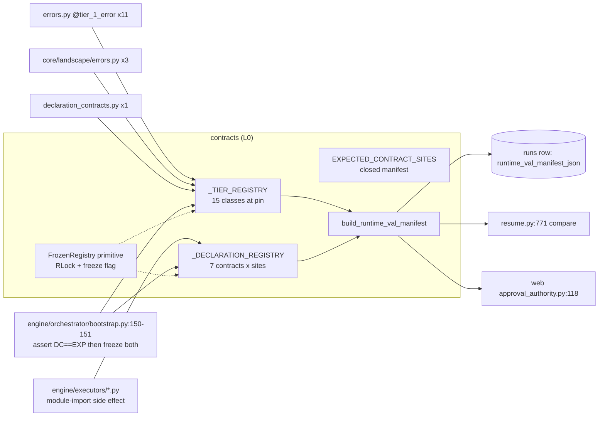

1. **Tier-1 registry** (`tier_registry.py:63-71`). MEASURED by probe after importing every `contracts`, `core` and `engine` submodule: 15 registered classes. 12 are in contracts (10 in `errors.py`, 1 `FrameworkBugError`, 1 `AggregateDeclarationContractViolation`) and 3 in `core/landscape/errors.py` (`LandscapeRecordError`, `LandscapeRecordNotFoundError`, `LandscapePostCommitError`). The registry admits only the prefixes `elspeth.contracts.`, `elspeth.engine.` and `elspeth.core.`, checking **both** the self-reported `caller_module` and `cls.__module__` (`:148-165`). Under pytest it also admits `tests.` (`:73-78`).
2. **Declaration-contract registry** (`declaration_contracts.py:1047-1055`). MEASURED by probe after importing `engine.*`: 7 contracts registered, exactly equal to `EXPECTED_CONTRACT_SITES`: `can_drop_rows`, `declared_output_fields`, `declared_required_fields`, `passes_through_input`, `schema_config_mode`, `sink_required_fields`, `source_guaranteed_fields`. Registration happens as an import side effect in `engine/executors/*.py`. `prepare_for_run()` (`engine/orchestrator/bootstrap.py:30-151`) diffs the registry against the manifest, raises on drift, and then freezes both registries.
3. **`_MANIFEST_BUILD_CACHE`** (`runtime_val_manifest.py:125`). A `ContextVar` memo that is live only during a single `build_runtime_val_manifest()` call.

**Dispatch semantics (ADR-010 §Semantics).** The engine runs the declaration dispatcher, not contracts, but contracts fixes the rules. Every applicable contract at a site runs. With 0 violations dispatch returns. With exactly 1 it re-raises that violation by identity (N6). With 2 or more it wraps them in `AggregateDeclarationContractViolation`, which is a *sibling* class of `DeclarationContractViolation`, not a subclass (`:784`). `contract_name` cannot be supplied by the caller: the dispatcher attaches it once, gated by a token (`:720-738`). A violation payload must match the class's `payload_schema` TypedDict exactly, with no unknown keys and all required keys present, *before* it is deep-frozen (`:669-702`). This deny-by-default rule is the primary secret defence. The regex scrubber is explicitly "last line of defence" (`secret_scrub.py:9-11`).

**Terminal model (ADR-019/038).** There are 14 legal `(TerminalOutcome, TerminalPath)` pairs and 2 non-terminal paths (`BUFFERED`, `ABANDONED`). `enums.py` checks at import time that every path is classified exactly once and that every outcome is used (`:285-305`, `:335-346`). A malformed edit therefore fails at import, before any test runs. `audit.TokenOutcome.__post_init__` (`audit.py:1411-1438`) enforces the XOR between `completed` and the outcome axis, and pair legality. Per-pair column constraints (`required`/`exact`/`forbidden` over `sink_name`, `batch_id`, `error_hash`) are enforced on **write** by `core/landscape/data_flow/outcomes.py:29,291-296` and on **read** by `core/landscape/model_loaders.py:589` via `validate_token_outcome_persisted_fields` (`audit.py:1554-1606`).

**PluginContext lifecycle.** `PluginContext` is a mutable `@dataclass(init=False)`. Its `config` is deep-frozen at construction (`plugin_context.py:216`). Authority tokens are checked with exact `type(...) is` comparisons (`:219-228`). Per-operation fields (`node_id`, `token`, `state_id`, `operation_id`, `contract`, `work_item`, …) are swapped in by the executors. MEASURED: there are 2 `plugin_context_scope(...)` call sites and 35 direct `ctx.<field> =` assignments in `src/elspeth`. `for_contract()` (`:253-276`) produces the detached copy handed to the row-pipelined batch runtime (`engine/executors/transform.py:493`). The copy still shares `_pending_quarantine_validation_errors` by reference.

**Concurrency model.** The two registries sit behind a single `RLock` each (`registry_primitive.py:45`) and are written only during bootstrap. The rest of the package is immutable value objects (`frozen=True, slots=True` plus `freeze_fields`/`deep_freeze`). The exceptions are `PluginContext`, the pending-quarantine list, and the two registries before they are frozen.

## Data & persistence

The package owns no tables and opens no files, databases or network connections. It does, however, fix the **shape** of what core persists:

- The `audit.py` dataclasses are the read-side contract for Landscape rows. The docstring says "model loader layer handles string→enum conversion" (`audit.py:3-4`), and the loaders in `core/landscape/model_loaders.py` build these dataclasses and re-validate them.
- `runtime_val_manifest` output is serialised into the run header by `core/landscape/run_lifecycle_repository.py:223-228` (canonical JSON, cached on the registry fingerprint). On resume it is compared again (`resume.py:771`). The manifest records source-AST hashes of contract classes, so any refactor of a registered contract or Tier-1 class, including a behaviour-neutral one, changes the recorded manifest and the resume-trust comparison. INFERRED from `_class_source_hash` (`runtime_val_manifest.py:735-752`) and its use in `_class_implementation_hash`.
- Version constants carried into persisted artefacts: `CANONICAL_VERSION = "sha256-rfc8785-v1"` (`hashing.py:28`), `SINK_EFFECT_PROTOCOL_VERSION = "sink-effect-v1"`, `_AUDIT_EXPORT_MANIFEST_SCHEMA = "elspeth.audit-export-manifest.v2"` and `_AUDIT_EXPORT_SERIALIZATION_VERSION = "audit-export-v2"` (`sink_effects.py:28,36,38`).
- The package reads ambient process state in two places: `security.py:54,71` reads `ELSPETH_FINGERPRINT_KEY` from `os.environ`, and `config/runtime.py:40-75` resolves filesystem paths (`Path.resolve`) against `INTERNAL_DEFAULTS["rate_limit"]["state_dir"] = "data"`, a CWD-relative default (`config/defaults.py:52-61`).

**DB constraint versus code:** MEASURED at `core/landscape/schema.py`. The `token_outcomes` table declares `outcome`, `path` and `completed` as plain columns, and its only CHECK is `ck_token_outcomes_error_hash_hex`. None of the ADR-019 invariants (the `completed`/`outcome` XOR, pair legality, per-pair discriminator columns) is a DB constraint. All of them are enforced in Python by this package's tables, on write (`outcomes.py`) and on read (`model_loaders.py`).

## Dependencies

- **Outbound (MEASURED): none inside ELSPETH.** An AST walk of all 96 files found 0 `elspeth.*` imports outside `elspeth.contracts`, whether module-level, lazy or `TYPE_CHECKING` (the control on `engine/` finds 675 such imports), 0 relative imports, and 0 `importlib`/`__import__` use. This agrees with `temp/import-matrix.md`, where `contracts` has no source row. A runtime probe confirms it: `import elspeth.contracts` loads no non-contracts `elspeth` module. Third-party dependencies are `pydantic` (6 modules), `rfc8785` (`hashing.py:22`), and lazy `pandas`/`numpy`/`sqlalchemy`. `contracts` is a true leaf.
  - String references to higher layers exist only as text: `tier_registry.py:75-76` (the allowlist prefixes) and `runtime_val_manifest.py:25,1325` (docstring and example).
- **Inbound (MEASURED, `temp/import-matrix.md`):** 35 source buckets import `contracts`, with 2,025 module-level, 147 lazy and 222 `TYPE_CHECKING` imports. The largest are `plugins.transforms` 371/17/19, `engine` 340/34/106, `web.composer` 251/8/2, `core.landscape` 239/1/26, `web.sessions` 126/5/3, `plugins.sinks` 94/7/5, `plugins.infrastructure` 90/21/28 and `web.execution` 84/5/0. The 13 `web.*` buckets together account for 674 module-level imports (33 %).
- **Web-only contracts (MEASURED, AST consumer classification):** 8 modules, 1,491 lines, are imported from outside contracts only by `web` and/or `composer_mcp`: `azure_ai_search`, `chargeable_admission`, `composer_audit`, `composer_interpretation`, `composer_planner_audit`, `composer_progress`, `session_operation`, `tool_calls`. `blobs.py` is 88 % web by import count: `web.*` 67 of 70 import sites, plus 1 each from `core` and `plugins` and the web root.
- **Private-name coupling (MEASURED):** 13 cross-package imports of 9 underscore-private contracts names. The ones that matter are `enums._LEGAL_TERMINAL_PAIRS` / `_NON_TERMINAL_PATHS` (engine, web), `audit._TERMINAL_PAIR_FIELD_CONSTRAINTS` (core, web), `runtime_val_manifest._assert_runtime_val_registries_frozen` (core), `sink_effects._create_restricted_audit_export_snapshot_reader` (core), `url._scrub_odbc_connect_value` (core), and the two dispatcher-only declaration helpers (engine). These are de-facto public API with private names.
- **Cycles:** none can involve this slice, because it has zero outbound edges. `FrameworkBugError` placement (`tier_registry.py:31`, re-exported in `errors.py:22-31`) is the only intra-package cycle-breaking device.

## Patterns observed

1. **Nominal over structural for anything that dispatches or admits (ADR-032).** The following all use owned ABCs or marker classes with `isinstance` checks: `AuditEvidenceBase` (`audit_evidence.py`), `DeclarationContract` (checked at `declaration_contracts.py:1200`), `SinkEffectContract` / `MemberSinkEffectCapability` / `RestagingSinkEffectCapability` (checked at `engine/orchestrator/preflight.py:85-403` and `engine/executors/sink_effects.py:731-735`), `BatchTransformRuntime` (`batch_runtime.py`, replacing the old runtime-checkable Protocol in `1b02b7b1f`), and `ScopedSecretResolverContract` (`secrets.py:250-261`). Authority tokens are checked with exact `type(x) is` comparisons (`plugin_context.py:219-222`, `sink_effects.py:142`).
2. **The runtime-checkable Protocols remain, but nothing in production uses them as a check.** There are 14 `@runtime_checkable` Protocols in contracts: `TransformProtocol`, 5 `Runtime*Protocol` in `config/protocols.py`, `PayloadStore`, `AuditExportContentStore`, `PluginAuditWriter`, `CallPayload`, `DiscriminatedPlugin`, `CollectionProbe`, `WebSecretResolver` and `ScopedWebSecretResolver`. MEASURED by an AST scan of every `isinstance`/`issubclass` call and every `match` class pattern: **0** production uses in `src/elspeth` or `elspeth-lints/src`, and **44** uses in `tests/`. The control found `issubclass(plugin_cls, BaseTransform)` at `plugins/infrastructure/manager.py:42`. So no runtime-checkable contract is a dispatch or security control at the pin. The decorators survive only to support test-side conformance assertions.
   **Runtime-checkable inventory (MEASURED at the pin; "prod" is `src/elspeth` plus `elspeth-lints/src`, "tests" is `tests/`):**

   | Protocol | Defined at | Prod `isinstance`/`issubclass` | Test uses | What the code actually uses for dispatch or admission |
   |---|---|---:|---:|---|
   | `TransformProtocol` | `plugin_protocols.py:326` | 0 | 15 | "not a `GateSettings`" negative nominal dispatch (`dag_navigator.py:299-303`, `token_traversal.py:1177-1186`) |
   | `RuntimeRetryProtocol` | `config/protocols.py:182` | 0 | 4 | typing only |
   | `RuntimeRateLimitProtocol` | `config/protocols.py:232` | 0 | 3 | typing only |
   | `RuntimeConcurrencyProtocol` | `config/protocols.py:265` | 0 | 5 | typing only |
   | `RuntimeCheckpointProtocol` | `config/protocols.py:278` | 0 | 2 | typing only |
   | `RuntimeTelemetryProtocol` | `config/protocols.py:301` | 0 | 4 | typing only |
   | `PayloadStore` | `payload_store.py:42` | 0 | 0 | typing only |
   | `AuditExportContentStore` | `audit_export.py:800` | 0 | 0 | typing only |
   | `PluginAuditWriter` | `audit_protocols.py:88` | 0 | 3 | typing only; authority comes from the required token kwargs |
   | `CallPayload` | `call_data.py:40` | 0 | 1 | typing only |
   | `DiscriminatedPlugin` | `discriminated.py:15` | 0 | 2 | attribute probe `cast(Any, cls).discriminated_variants` (`web/catalog/knob_schema.py:555`), MRO scan (`plugins/infrastructure/base.py:1585-1595`) |
   | `CollectionProbe` | `probes.py:43` | 0 | 3 | typing only |
   | `WebSecretResolver` | `secrets.py:216` | 0 | 2 | typing only |
   | `ScopedWebSecretResolver` | `secrets.py:241` | 0 | 0 | nominal `ScopedSecretResolverContract` ABC is the control (`secrets.py:250-261`) |

   Non-runtime-checkable Protocols (35 others; AST count 49 Protocol classes total, 14 runtime-checkable; e.g. `SourceProtocol`, `SinkProtocol`, `BatchTransformProtocol`, `SinkEffectProtocol`, the four phase contexts, `BlobServiceProtocol`, `ComposerToolRecorder`, the settings-side `*SettingsProtocol`s) are annotation-only by construction. Instrument: an AST scan of every `isinstance`/`issubclass` call and every `match` class pattern. Positive control: the scan finds `issubclass(plugin_cls, BaseTransform)` (`manager.py:42`) and `isinstance(location, TransformResult)` (`textract_document_analysis.py:714`).
3. **A closed vocabulary pinned by import-time self-checks.** The `TerminalPath` classification (`enums.py:283-305`), the `DispatchSite` Literal paired with the StrEnum (`declaration_contracts.py:94-110`), `ALLOWED_MIME_TYPES = frozenset(get_args(AllowedMimeType))` (`blobs.py:42`), and the manifest checked against the registry at bootstrap.
4. **Frozen value objects with Tier-1 `__post_init__` validation.** Most DTOs are `@dataclass(frozen=True, slots=True)` and use `freeze_fields` / `deep_freeze` for container fields. `enforce_freeze_guards` and `enforce_frozen_annotations` exist under `config/cicd/`.
5. **Capability objects.** `RestrictedAuditExportSnapshotReader` refuses construction, mutation, deepcopy and pickle (`sink_effects.py:862-973`). Its state uses name-mangled slots, and only the internal factory `_create_restricted_audit_export_snapshot_reader` (`:1071`) can build it. This is an in-process misuse guard, not an isolation boundary.
6. **"Move the contract down."** When a value type is needed below the web layer, the package adds it to L0 instead of letting core or plugins import `web.*` (`blobs.py:5-9`). This keeps the leaf property, at the cost of web-domain concepts accumulating in L0 (guided write fences, session forks, storage quotas, composer interpretation events).
7. **Contracts carry behaviour, not only declarations.** The package includes a bytecode- and AST-hashing manifest builder, a streaming HMAC-signed export deriver, bounded blob verification, URL sanitisation, regex secret scrubbing and path confinement. "Leaf" here means "no upward imports", not "declarative only".
8. **Metadata decorators as static-analysis anchors.** `@trust_boundary(tier=3, source_param=…, test_ref=…, test_fingerprint=…)` is a runtime passthrough that validates its own arguments at decoration time. `trust_tier.tier_model` and the `enforce_trust_boundary_*` gates consume it.

### Error taxonomy by trust tier (`errors.py`, read in full)

Every exception class in `errors.py` carries either `@tier_1_error(...)` or a `# TIER-2:` marker comment. `config/cicd/enforce_tier_1_decoration` exists to police this. The effective classification is:

| Tier / role | Classes | Handling contract |
|---|---|---|
| **Tier-1, framework/audit corruption** (registered, never absorbed by `on_error`) | `FrameworkBugError`, `AuditIntegrityError`, `GuidedCustodyIntegrityError`, `OrchestrationInvariantError`, `PassThroughContractViolation`, `DeclaredRequiredInputFieldsViolation` (ADR-013), `DeclaredOutputFieldsViolation` (ADR-011), `SourceGuaranteedFieldsViolation` (ADR-016), `SinkRequiredFieldsViolation` (ADR-017), `SchemaConfigModeViolation` (ADR-014), `SinkTransactionalInvariantError` (ADR-010 F3), `AggregateDeclarationContractViolation` (in `declaration_contracts.py`), plus 3 `Landscape*Error` in core | `except TIER_1_ERRORS: raise` before any broad catch |
| **Tier-2, plugin contract bug (row-level)** | `PluginContractViolation` (base, deliberately *not* Tier-1), `ZeroEmissionSuccessContractViolation`, `UnexpectedEmptyEmissionViolation` (a Tier-2 `DeclarationContractViolation`, ADR-012) | Routed via `on_error` at the transform seam; aborts at sinks and aggregation flush (S01-C11) |
| **Tier-2, coordination control flow (clean abandon)** | `SchedulerLeaseLostError`, `RunLeadershipLostError`, `RunMembershipLostError`, `RunWorkerEvictedError`, `FollowerSeatDeadError` | Zero-mutation rollback; the drain loop abandons |
| **Tier-2, operator-interpretable refusals** | `JoinRefusedError`, `AbandonRefusedError`, `WriteLockHeldError`, `EmptyResumeStateError` (a subclass of the Tier-1 `OrchestrationInvariantError` but semantically Tier-2, so callers must catch it *first*, `errors.py:1343-1369`), `IncompleteSourceResumeError`, `GracefulShutdownError` | Clean exit with a message carrying `run_id` |
| **Tier-2, retry/transient** | `PluginRetryableError`, `CapacityError` (+ `CAPACITY_ERROR_CODES = {429, 503, 529}`), `MaxRetriesExceeded`, `RuntimePreflightFailedError` (`AuditEvidenceBase`) | RetryManager / AIMD |
| **Tier-2, config/authoring** | `PipelineLoweringError(ValueError)`, `ContractMergeError(ValueError)`, `CoalesceCollisionError`, `SinkEffectCapabilityError(ValueError)`, `CommencementGateFailedError`, `DependencyFailedError`, `RetrievalNotReadyError`, `DuplicateDocumentError`, `TelemetryExporterError` | Refuse before any audit mutation, or fail the run |
| **Tier-3, external data (quarantine)** | `ContractViolation` → `MissingFieldViolation`, `TypeMismatchViolation` (keeps `actual_value` out of the message), `ExtraFieldViolation`; `violations_to_error_reason()` | Row quarantine / `TransformResult.error` |

The inheritance hazard is deliberate and documented. `EmptyResumeStateError` and `GuidedCustodyIntegrityError` subclass broader classes, so a handler that catches the parent absorbs the child unless the child is caught first. `AggregateDeclarationContractViolation` is intentionally *not* a subclass of `DeclarationContractViolation`, so a generic `except DeclarationContractViolation` does not swallow it (`declaration_contracts.py:787-790`).

## Invariants & how they are enforced

| Invariant | Enforcement | Evidence |
|---|---|---|
| contracts imports nothing above L0 | **Lint rule**: `trust_tier.tier_model` `LAYER_HIERARCHY = {"contracts": 0, "core": 1, "engine": 2}` (everything else is L3). `TYPE_CHECKING` crossings are separate, allowlistable warnings. **Measurement**: 0 outbound at the pin | `elspeth-lints/src/elspeth_lints/rules/trust_tier/tier_model/rule.py:409-420,449-465` |
| Only core, engine or contracts may define Tier-1 exceptions | **Code**: two-sided prefix check (`caller_module` and `cls.__module__`). **Lint**: `audit_evidence.tier_1_decoration` requires a literal `__name__` | `tier_registry.py:148-165`, `:101-114` |
| No registration after bootstrap | **Code**: `FrozenRegistry.write_unfrozen` raises `FrameworkBugError` once frozen. Freezing happens in `prepare_for_run` | `registry_primitive.py:67-79`; `engine/orchestrator/bootstrap.py:150-151` |
| Registered declaration contracts == manifest, per site | **Code** at bootstrap (raises `RuntimeError`). **Lint**: `manifest.contract_manifest` MC3a/b/c | `bootstrap.py:30-149`; `declaration_contracts.py:1066-1071` |
| Violation payloads carry only declared keys | **Code**: `_validate_payload_against_schema` before deep-freeze; the contract/violation `payload_schema` identity is checked at registration | `declaration_contracts.py:669-702,1235-1241` |
| A contract name cannot be spoofed; an aggregate is raised only via the dispatcher | **Code**: module-private token object gates one-shot attachment | `declaration_contracts.py:114-123,720-738,837-871` |
| `TIER_1_ERRORS` sees late registrations | **Code**: PEP 562 `__getattr__` returns a fresh tuple | `errors.py:1919-1930` |
| ADR-019/038 pair legality and completed/outcome XOR | **Code**: import-time assertions plus `TokenOutcome.__post_init__` plus write/read validators. **No DB constraint** | `enums.py:283-346`; `audit.py:1411-1438,1554-1606`; `core/landscape/schema.py` (`token_outcomes`: only the error_hash CHECK) |
| Audit error text and tracebacks are scrubbed | **Code**: `ExecutionError.__post_init__` runs `scrub_text_for_audit`, the per-line traceback scrubber, and `scrub_payload_for_audit(context)`. Best-effort regex coverage | `errors.py:170-193`, `44-81`; `secret_scrub.py:49-85` |
| `AuditEvidenceBase` subclasses cannot be instantiated abstract (the CPython fast path bypasses ABCMeta) | **Code**: an `__init_subclass__` wrapper around `__init__` | `audit_evidence.py:53-66` |
| Frozen DTO containers are really frozen | **Code**: `freeze_fields`/`deep_freeze`. **Gates**: `config/cicd/enforce_freeze_guards`, `enforce_frozen_annotations` | e.g. `declaration_contracts.py:272-283` |
| Plugins cannot mutate run config | **Code**: `deep_freeze(raw_config)` | `plugin_context.py:212-216` |
| Mutating plugin audit writes carry authority | **Protocol signature**: required keyword-only tokens on all 10 mutators. **Code**: `require_*_token()` raises `FrameworkBugError` | `audit_protocols.py`; `plugin_context.py:278-294` |
| Runtime-VAL manifest built only from frozen registries | **Code** | `runtime_val_manifest.py:1715-1725` |
| Recorded contract classes are source-available | **Code**: `FrameworkBugError` if `inspect.getsource` fails | `runtime_val_manifest.py:735-748` |
| Dispatch-site names are valid | **Code** at decoration time, plus the Literal/StrEnum pair (prose: "keep in sync") | `declaration_contracts.py:94-110,162-165` |

## Baseline delta — ARCHITECTURE.md (and ADRs) says / tree says

| Claim (source) | What the pinned tree shows | Evidence |
|---|---|---|
| Contracts is about 33,000 lines (ARCHITECTURE.md:182) | 34,196 lines, 96 files | `find … \| xargs cat \| wc -l` |
| "ZERO outbound dependencies" (ARCHITECTURE.md:869,1137) | **Holds** (MEASURED 0 at every import kind; runtime probe loads no non-contracts module) | AST walk; import probe |
| Only `TransformProtocol` is runtime-checkable, "because the engine `isinstance`-discriminates transforms during DAG traversal" (ARCHITECTURE.md:441; same in `plugin_protocols.py:4-7`, and `:94-97` says its "isinstance() machinery already verifies…") | The rationale is stale. The engine removed that dispatch deliberately (`engine/dag_navigator.py:299-302`, `engine/token_traversal.py:1177-1184`, elspeth-8783933d99). There are 0 production `isinstance(…, TransformProtocol)`, and 15 in tests. The claim is also narrow: contracts has **14** runtime-checkable Protocols (13 outside plugin_protocols), and none is used as a check in production | AST isinstance scan (control positive) |
| ADR-006: strict 4-layer model `contracts → core → engine → plugins`, CI-enforced (ARCHITECTURE.md:1019) | The lint encodes 3 numbered layers (contracts 0, core 1, engine 2). Plugins, web, cli, mcp, tui, telemetry and testing are all "implicitly L3", so the rule cannot express plugins-vs-web or web-internal layering | `tier_model/rule.py:409-420` |
| `TransformContext` key fields include a "checkpoint API" (ARCHITECTURE.md:465 table); contexts docstring "get/set/clear_checkpoint for crash recovery" | No checkpoint methods exist on any context or on `PluginContext`. The docstrings in `contexts.py:140` and `plugin_context.py:7,104,214` are vestigial (the blob checkpoint families were deleted per ADR-029) | `grep -n checkpoint contexts.py plugin_context.py` |
| Context protocol table (ARCHITECTURE.md:458-467) | Missing members: `require_member_token`, `require_work_item`, `aggregation_batch`, `batch_token_ids` (TransformContext); `require_coordination_token`, `operation_id`, `shutdown_event` (SourceContext); `llm_call_governance`, `coordination_token`, `require_*_token`, `record_readiness_check`, `concurrency_config` (LifecycleContext) | `contexts.py:80-276` |
| "Engine executors mutate PluginContext fields between steps" (ARCHITECTURE.md:469) | Holds, in two styles: 35 direct assignments plus 2 `plugin_context_scope` blocks, and a `for_contract()` detached copy for the batch runtime | grep counts; `plugin_context.py:253,640` |
| ADR-048 "(Proposed)" (ARCHITECTURE.md:1059; ADR file status line 4) | The contracts side is already implemented: required keyword-only tokens on every `PluginAuditWriter` mutator, and exact-type token checks in `PluginContext` | `audit_protocols.py` AST; `plugin_context.py:117-128,219-228` |
| ADR-025 multi-source: "plural by contract and by code" | `plugin_protocols.py:10` "Source … (one per run)" and `:147` "There is exactly one source per run" still say singular | file lines |
| ADR-038 adds a second non-terminal path | `TerminalOutcome` docstring says "`completed=False` (only `BUFFERED` today)" (`enums.py:192`). The code (`:272-278`) and `TokenOutcome` (`audit.py:1434-1438`) already treat `ABANDONED` the same way | file lines |
| `contracts/__init__.py:9-10`: "TYPE_CHECKING imports from core exist for type annotations only" | 0 `TYPE_CHECKING` imports from core (all 45 are intra-contracts) | AST walk |
| ADR-010: Tier-1 classes declared in contracts | 15 live at the pin, 3 of them in `core/landscape/errors.py` (not covered by the baseline). One is `GuidedCustodyIntegrityError` (`errors.py:993-1004`), which belongs to the guided lane now being retired | registry probe |
| **Omitted by baseline:** the runtime-VAL manifest (code-identity hashing recorded per run and compared on resume and in web approval) | Material to resume trust and to web approval authority; not mentioned in ARCHITECTURE.md | `runtime_val_manifest.py`; `resume.py:771`; `approval_authority.py:114-118` |
| **Omitted by baseline:** sink-effect protocol v1 and the audit-export snapshot/manifest v2 contracts (3,283 lines together) | Only the sequence diagram names `SinkEffectCoordinator`; the contracts are undocumented at architecture level | `sink_effects.py`, `audit_export.py` |
| **Omitted by baseline:** web-domain types in L0 (blobs, auth, composer audit/interpretation/progress, sessions, chargeable admission) | At least 8 web-only modules (1,491 lines) plus `blobs.py` (88 % web consumers). The baseline describes contracts as "Shared data types and protocols" for core, engine, plugins and telemetry only (dependency graph at ARCHITECTURE.md:855-863) | consumer AST classification |

## Concerns

| ID | Severity | Concern | Evidence (file:line at pin) | New / previously reported |
|---|---|---|---|---|
| S01-C1 | Medium | **Secret-scrubber gaps for supported-provider credential shapes.** MEASURED by probe: `scrub_text_for_audit` lets through AWS secret access keys in both `aws_secret_access_key=…` and `AWS_SECRET_ACCESS_KEY: …` form (`\bsecret[_-]?key` cannot match after `_`, and `access_key` is not in the list). It also lets through a bare Anthropic key `sk-ant-api03-…` (`sk-[A-Za-z0-9]{20,}` stops at the hyphen). Controls: `AKIA…`, `sk-<30 alnum>`, a real JWT and `x-api-key: sk-ant…` are all redacted, and plain text passes. AWS (Bedrock, S3, Textract) is a supported provider family. The payload-schema gate is the primary defence, but `ExecutionError.exception`/`traceback` and `RuntimePreflightFailedError` messages rely on this regex set alone | `secret_scrub.py:49-85`; consumed at `errors.py:176-178,1653` | NEW. Earlier scrubber-gap tickets (elspeth-3513644dd6, -650ecc3e58, -3956044fb7, all closed) did not cover these shapes |
| S01-C2 | Medium | **No DB-level guard for the ADR-019/038 terminal invariants.** Pair legality, the `completed` XOR `outcome IS NULL` rule, and the per-pair discriminator columns are enforced only by Python tables in contracts, on write and on read. `token_outcomes` has one CHECK (error_hash hex). A second writer path, a manual SQL repair, or a PostgreSQL operator edit can persist rows the model loader then refuses, which makes the run unreadable instead of preventing the bad write | `enums.py:253-346`; `audit.py:1473-1606`; `core/landscape/schema.py` `token_outcomes_table` | NEW (cross-slice with core.landscape) |
| S01-C3 | Medium | **Web-domain drift into L0.** The "move the contract down" policy keeps the leaf property but makes contracts the dumping ground for web vocabulary. Examples: `BlobGuidedOperationWriteFence` and `GuidedCustodyIntegrityError` (Tier-1) for a guided lane being retired, session-fork IDs, storage quotas, composer interpretation, progress and planner audit, and chargeable admission. The tier_model lint treats all of this as L0, so nothing stops a web-only type from being consumed by engine code, and nothing records which web slice owns which contracts module | `blobs.py:5-9,155`; `errors.py:993-1004`; consumer classification above | NEW (guided removal context: 01-discovery §7) |
| S01-C4 | Low | **Vestigial `@runtime_checkable` on 14 Protocols.** With 0 production `isinstance` checks, the decorator only enables test-side conformance checks. It also keeps the ADR-032 hazard (a structural check waiting to be reused as a gate) and props up stale rationale prose (`plugin_protocols.py:4-7,94-97`; `DiscriminatedPlugin` is runtime-checkable, but `web/catalog/knob_schema.py:555-572` probes attributes directly) | AST isinstance scan; `discriminated.py:15` | Related to closed elspeth-9c53dae4ce and elspeth-c4916d0115 (the latter was **fixed in tree** by `1b02b7b1f` but the tracker row is still `triage`) |
| S01-C5 | Low | **Private names used as cross-layer API.** 13 imports of 9 `_`-prefixed contracts names from core, engine and web, including `_LEGAL_TERMINAL_PAIRS`, `_TERMINAL_PAIR_FIELD_CONSTRAINTS` and `_create_restricted_audit_export_snapshot_reader`. Refactor tooling and readers treat these as internal, but they are load-bearing for accounting (`web/execution/accounting.py:13,95,156`), for outcome writes, and for counter classification | AST private-import scan | NEW |
| S01-C6 | Low | **Stale or incorrect docstrings on central contracts.** The checkpoint API that no longer exists (`contexts.py:140`, `plugin_context.py:7,104,214`). "exactly one source per run" (`plugin_protocols.py:10,147`). "only BUFFERED today" (`enums.py:192`). `record_call` documents "Returns … None if landscape not configured" but raises `FrameworkBugError` (`plugin_context.py:379` vs `:386-392`). The claim that "TYPE_CHECKING imports from core exist" is false (`__init__.py:9-10`). The empty `if TYPE_CHECKING: pass  # Placeholder` (`audit.py:20-21`). Three dangling design-doc references (`contexts.py:17`, `discriminated.py:4-5`, `trust_boundary.py:43`) point to files archived or removed in `70cdbeb2f` (MEASURED: 3 of 24 doc paths referenced in contracts are missing) | as cited | NEW. The same class of issue as R44 (`azure_ai_search.py:3-4`, PREVIOUSLY-REPORTED web-review R44) |
| S01-C7 | Low | **Test-only members in the Tier-1 audit vocabulary.** `TransformErrorCategory` includes `test_error`, `property_test_error`, `simulated_failure`, `deliberate_failure` and `intentional_failure`, and `TransformActionCategory` includes `"test"`. The only `src` users are `elspeth/testing/__init__.py:252,283,303,784` (2 of the 6 values). The other 4 have no `src` user. A production transform can therefore record `reason="simulated_failure"` in the legal record and type-check | `errors.py:366,602-606` | NEW |
| S01-C8 | Low | **The resume-trust manifest requires source-available deployments.** `_class_source_hash` raises `FrameworkBugError` when `inspect.getsource` fails, so a pyc-only or zipapp image would fail `build_runtime_val_manifest()` at run start. The manifest also hashes the AST of contract classes, so a behaviour-neutral refactor of any registered contract or Tier-1 class changes resume-trust identity (INFERRED; not exercised) | `runtime_val_manifest.py:735-752,1666-1690` | NEW (INFERRED consequence; code MEASURED) |
| S01-C9 | Low | **`contracts/types.py` shadows the stdlib `types` module** whenever `src/elspeth/contracts` is `sys.path[0]`, for example when a script is run from that directory. MEASURED: running `python -c` with cwd set to contracts failed with `ImportError: cannot import name 'WrapperDescriptorType' from 'types'` | `types.py` | NEW |
| S01-C10 | Low | **The Tier-1 allowlist changes with `"pytest" in sys.modules`.** The set of modules allowed to register is decided once at import from the presence of pytest (`tests.` prefix). The declaration-registry test helpers use the same gate (`declaration_contracts.py:1314-1322`). Behaviour thus depends on an ambient module import, not on configuration. It is harmless in production images that do not import pytest | `tier_registry.py:73-78` | NEW |
| S01-C11 | Low | **Acknowledged asymmetry in `PluginContractViolation` handling.** The transform seam routes it via `on_error`, while sinks and aggregation flush abort. The docstring says "that asymmetry is tracked, not designed" | `errors.py:1657-1668` | PREVIOUSLY-REPORTED (self-documented in code; elspeth-181db83da7 cited) |
| S01-C12 | Low (config) | The rate-limit persistence-path confinement is enforced only per run, not at WebSettings boot | `config/runtime.py:55-75` | PREVIOUSLY-REPORTED (web-review R51 / be-02#1) |

Other web-review findings that cite contracts files are web-slice issues where contracts only provides the vocabulary: R08 (`auth.py:100-128`), R35/R36 (`composer_interpretation.py`), R44/R46 (`azure_ai_search.py`). They belong to the web slices and are not repeated here.

## Complexity & tech-debt hotspots

- **Largest functions (AST, lines):** `audit_export.derive_audit_export_bundle` 265 (`:1160`), `audit_export._stream_audit_export_bundle_to_spool` 261 (`:1503`), `runtime_val_manifest._normalize_dependency_value` 143 (`:1190`), `_callable_dependency_hashes` 141 (`:1412`), `trust_boundary.trust_boundary` 135 (`:126`), `url.SanitizedWebhookUrl.from_raw_url` 133 (`:506`), `data.check_compatibility` 130 (`:196`), `runtime_val_manifest._try_normalize_code_constant` 128, `schema._normalize_field_spec` 124, `url.SanitizedDatabaseUrl.from_raw_url` 123, `run_result._check_status_invariant` 120.
- **Largest classes:** `PluginContext` 535, `SchemaContract` 430, `SchemaConfig` 353, `PipelineRow` 262, `TransformResult` 250, `TokenUsage` 238, `TransformProtocol` 227, `TransformErrorReason` 226 (a TypedDict with about 110 optional keys, the "one bag for every plugin" shape).
- **Fused responsibilities:**
  - `errors.py` combines 5 concerns in 2,337 lines: the audit DTO, the reason TypedDicts, coordination control-flow exceptions, the declaration violations, the Tier-3 schema violations and the RAG/capacity/telemetry errors.
  - `runtime_val_manifest.py` is a small bytecode and AST normaliser (1,782 lines of `dis`/`inspect`/closure walking) inside the leaf.
  - `audit_export.py` + `sink_effects.py` implement a full export-integrity protocol, including HMAC and spooling.
- **Vestigial or dead code:**
  - `DiscriminatedPlugin` has no production importer except a `cast` in `elspeth-lints`.
  - `reorder_primitives.py` is consumed only by `plugins/infrastructure` (a plugin-private primitive living in L0).
  - The placeholder `TYPE_CHECKING` block at `audit.py:20-21`.
  - The runtime-checkable decorators (C4).
  - The guided-lane types (`BlobGuidedOperationWriteFence`, `GuidedCustodyIntegrityError`) are removal-inventory candidates under the 2026-09-22 guided-retirement ruling.
- **Suppressions:** 18 `# type: ignore` (runtime_val_manifest 3, declaration_contracts 3, tier_registry 2, schema 2, and 1 each in 8 other files). 0 `noqa`.
- **TODO/FIXME/XXX/HACK:** 0 in contracts and 0 in all of `src/elspeth`. The instrument was positive-controlled on a synthetic file (2 hits).

## Test map

- `tests/unit/contracts/`: 132 `test_*.py` files, 46,127 lines, with sub-directories `config/`, `sink_contracts/`, `source_contracts/` and `transform_contracts/`.
- `tests/property/contracts/`: 6 files, 2,062 lines. `tests/integration/contracts/`: 1 file, 224 lines.
- 1,357 test files across `tests/` import `elspeth.contracts`, so contracts is exercised indirectly almost everywhere.
- Named anchors seen in the source:
  - `tests/unit/contracts/test_plugin_context_recording.py` (pinned by the `plugin_context.py:487-489` invariant).
  - `tests/unit/contracts/test_sink_effect_contract.py` (the `@trust_boundary` `test_ref` targets, e.g. `sink_effects.py:265,298,973`).
  - `test_plugin_protocol_fields.py` (Transform/BatchTransform member parity, `plugin_protocols.py:653`).
  - `tests/unit/contracts/test_discriminated.py`.
  - `tests/unit/scripts/test_check_contracts.py` (the `check-contracts` scanner scope).
- **Gaps (by name heuristic, then import check):** `batch_runtime.py`, `reorder_primitives.py` and `tool_calls.py` have no test file importing their module path. `batch_runtime` is reachable through the package re-export. There is no dedicated unit file for `sink_effects.py` naming (it is covered as `test_sink_effect_contract.py`), `coordination.py` (173 importing test files), `security.py` (5), or `contexts.py` (25). There is no test asserting the secret-scrubber shapes in S01-C1, and no DB-level test for S01-C2, because the constraint does not exist.
- **CI gates that scan this slice:**
  - `check-contracts` (`scripts/check_contracts.py`, 1,977 lines, with the `config/cicd/contracts-whitelist.yaml` ratchet and the soft-mapping census). Note its check 2 excludes `src/elspeth/contracts` itself.
  - `elspeth-lints` `trust_tier.tier_model` (layer rule), `manifest.contract_manifest`, and `audit_evidence.tier_1_decoration`.
  - `config/cicd/enforce_freeze_guards`, `enforce_frozen_annotations`, `enforce_audit_evidence_nominal`, `enforce_tier_1_decoration` and `enforce_trust_boundary_honesty`.

## Confidence

**Medium-High.**

**Read in full at the pin:** `__init__.py`, `errors.py` (all 2,337 lines), `declaration_contracts.py` (all 1,377), `tier_registry.py`, `audit_evidence.py`, `registry_primitive.py`, `plugin_protocols.py` (lines 1-1055), `contexts.py`, `plugin_context.py`, `hashing.py`, `security.py`, `batch_runtime.py`, `discriminated.py`, `tool_calls.py`, `reorder_primitives.py`, `config/__init__.py`, `config/protocols.py` (1-60, 170-346), and `config/defaults.py`.

**Read in part:**
- `enums.py` (1-60, 180-346 plus the outline)
- `audit.py` (1-170, 1385-1610 plus the outline)
- `sink_effects.py` (1-175, 820-1100, 1415-1480 plus the outline)
- `runtime_val_manifest.py` (1-140, 700-760, 1638-1782 plus the outline)
- `blobs.py` (header plus outline)
- `secret_scrub.py` (1-128)
- `trust_boundary.py` (1-80)
- `config/runtime.py` (40-100 plus the outline)
- `coordination.py` (header plus outline)
- `results.py`, `events.py`, `schema.py`, `schema_contract.py`, `url.py`, `audit_export.py` (headers, outlines, largest functions)

**Not read:** `schema.py` internals, `schema_contract.py`/`PipelineRow` internals, `export_records.py`, `composer_*` modules beyond consumer classification, `union_merge.py`, `barrier_scalars.py`, `token_usage.py`, `value_source.py`, `plugin_semantics.py` and `coalesce_metadata.py`.

**MEASURED by running an instrument:**
- outbound imports (AST, positive-controlled on `engine/`)
- runtime leaf property (import probe)
- the runtime-checkable inventory and its production `isinstance` uses (AST, positive control `BaseTransform`)
- Tier-1 registry membership (15) and declaration registry == manifest (7) via import probes
- private-name imports
- web-only consumer classification
- `PluginAuditWriter` token requirements
- scrubber coverage (probe with positive and negative controls)
- dangling doc refs
- largest functions and classes
- TODO count (synthetic control)
- suppression counts
- test counts

**INFERRED (labelled in the text):** the resume-trust consequence of source hashing (C8), and the operational consequence of C2.

**Risk to accuracy:** inbound counts are taken from `temp/import-matrix.md`, which buckets absolute imports only. The web-only classification counts direct module imports, not names reached through the `elspeth.contracts` package facade, so it is a lower bound. The retired code index index was not used. It is about 1 day stale, and AST measurement at the pin was preferred.

## Validation corrections

- [validator] Package-root module count "95" -> **91** (root) + 5 (`config/`) = 96 (`find src/elspeth/contracts -name '*.py' -printf '%h\n' | sort | uniq -c` at the pin -> 91 / 5). Corrected in Location and Internal architecture.
- [validator] Baseline citation ARCHITECTURE.md:440 -> **:441** (the `TransformProtocol` runtime-checkable claim; `grep -n isinstance-discriminat ARCHITECTURE.md`).
- [validator] Baseline citation ARCHITECTURE.md:445 -> **:465** (the `TransformContext` "checkpoint API" row), and the context-protocol table range 444-465 -> **458-467** (`#### Plugin Context Protocols` heading at :458, `LifecycleContext` row at :467).
- [validator] Baseline citation ADR-048 "(Proposed)" ARCHITECTURE.md:1058 -> **:1059** (`sed -n 1059p ARCHITECTURE.md`; S03 and S04 already cite :1059).


---

# S02 — Core (non-Landscape): Settings, DAG, Schema-Shape, Canonical, Expression Parser, Payload Store, Checkpoint, Security, Retention, Rate Limit

**Location:** `src/elspeth/core/` excluding `core/landscape/`. That is `config.py`,
`dag/`, `schema_shape.py`, `templates.py`, `expression_parser.py`, `canonical.py`,
`payload_store.py`, `security/`, `secrets.py`, `checkpoint/`, `rate_limit/`,
`retention/`, `blobs_inline.py`, `llm_pricing.py`, `llm_profiles.py`,
`audit_export_content_store.py`, `operations.py`, `logging.py` and 14 small helpers.
All paths below are relative to the pinned worktree
`.claude/worktrees/arch-analysis-pin` (`release/0.8.1` @ `85ebf2739`, verified with `git log -1`).

**Measured size:** **55 files, 26,755 lines** (MEASURED).

```
cd src/elspeth/core && find . -name '*.py' -not -path './landscape/*' | xargs wc -l | tail -1   → 26755 total
find . -name '*.py' -not -path './landscape/*' | wc -l                                           → 55
per sub-package (cat | wc -l): dag 8,451 · checkpoint 2,406 · security 1,187 · rate_limit 542 · retention 523
core top-level *.py: 28 files, 13,646 lines
```

**Responsibility:** This slice is the runtime-neutral layer between `contracts`
(the leaf) and `engine`/`plugins`/`web`. It holds the operator Settings model
and its lowering helpers, DAG construction and build-time contract
validation, canonical hashing, the safe expression language, content-addressed
payload storage, checkpoint/resume admission, secret fingerprinting and
loading, SSRF defenses, rate limiting, payload retention, and the fail-closed
DB schema-drift comparator shared by both databases.

---

## Key components

Every file over 300 lines is listed individually. The rest are grouped at the end.

| File | Lines | Role |
|---|---:|---|
| `config.py` | 3,253 | Pydantic `ElspethSettings` tree: 21 frozen `extra="forbid"` models, including `SourceSettings`, `TransformSettings`, `GateSettings`, `CoalesceSettings`, `RowUnionSettings`, `CollectorSettings`, `ScopeSettings`, `QueueSettings`, `SinkSettings`, `LandscapeSettings`/`LandscapeExportSettings`, `SecretsConfig`, `RateLimitSettings`, `TelemetrySettings`. Also the pure lowering helpers `_lower_llm_profile_nodes`, `_expand_env_vars` and `_expand_config_templates`; `load_bounded_pipeline_yaml` (SafeLoader, no aliases, ≤10k nodes, depth ≤64, ≤2 MiB); audit redaction (`resolve_config` → `_fingerprint_config_for_audit`, `_sanitize_dsn`, `sanitize_node_config_for_audit`). Read 100%. |
| `schema_shape.py` | 2,596 | **Not pipeline-schema algebra.** This is a fail-closed, dialect-aware comparator between reflected SQLAlchemy metadata and declared metadata (`collect_metadata_shape_issues`, :606). It carries its own SQL tokenizer and Pratt parser (`_tokenize_sql` :1700, `_SqlExpressionParser` :1782), CHECK/index/default AST canonicalization, and a PostgreSQL `pg_catalog` builtin-identity proof query (:161). Callers are `core/landscape/database.py:900,1538` and `web/sessions/schema.py:505`. Read the entry, column/FK/check paths and parser; sampled the equivalence helpers (≈45%). |
| `templates.py` | 2,045 | Jinja2 AST field extraction (`extract_jinja2_fields` :141, `extract_jinja2_field_usage` :109, `_with_details` :1821, `_with_names` :1975). About 60 private helpers track row aliases, macros, call blocks and container carriers so that dynamic row access is reported for fail-closed callers. Structure mapped and public API read; internals sampled (≈15%). |
| `dag/builder.py` | 2,009 | `build_execution_graph`, **one function spanning lines 181–2009 (1,829 lines)**. It computes deterministic node IDs (`canonical_json` → sha256[:12]), adds nodes for sources, sinks, queues, transforms, aggregations, gates, coalesce, row_union and collectors, wires fork branches, closes whole rosters (rule 2), builds the producer/consumer registries, matches connections, emits DIVERT edges, populates pass-through schemas, runs the PHASE-2 validation call, then row_union guards, the group-binding registry, bound regions (rules 3–6, 9), the step map, and freezes metadata. Read 100%. |
| `dag/schema_validation.py` | 1,689 | Build-time edge contract/type validation: `validate_edge_compatibility` :40 runs 10 ordered passes. Also `get_effective_producer_schema`, the coalesce and row_union compatibility checks, and the sink-required, output-collision, declared-input, string-typed-input, typed-producer-extras, forgiven-field and observed-producer type passes. Read 100%. |
| `dag/graph.py` | 1,632 | `ExecutionGraph`: a NetworkX `MultiDiGraph` wrapper with 17 construction-time setters guarded by `_assert_build_metadata_mutable`, `validate()` :321 (7 structural rules), branch tracing, getters, and thin delegators to the extracted policy modules. Read 100%. |
| `checkpoint/recovery.py` | 1,473 | `RecoveryManager` (the resume work-set, row replay, token reconstruction and contract integrity) plus three shared "advisory = enforcing" gates: `check_run_status_resumable` :132, `check_source_lifecycle_resumable` :225 and `check_group_satisfiability_resumable` :416. Defines `NonResumableRunError` :106. Read 100%. |
| `expression_parser.py` | 1,099 | Whitelist AST expression language: `_ExpressionValidator` :183, `_ExpressionEvaluator` :539, and visitor/type coupling asserted at import (:532, :763). `ExpressionParser` :782 adds static analyses (`is_boolean_expression`, `is_provably_non_routable`, `has_string_amplification_risk`, `static_field_reads`). Read 100%. |
| `dag/guarantees.py` | 769 | ADR-007/009 guarantee propagation. `EffectiveGuaranteeVote(fields, participated, closed)` :28, `walk_effective_guarantee_vote` :178, `walk_definite_emitted_fields` :418 (the extras direction), `resolve_guaranteed_field_type` :570. Read 100%. |
| `blobs_inline.py` | 672 | Discovery, validation and substitution of inline blob-content markers in pipeline option trees. Caps: 256 KiB per ref, 1 MiB aggregate (:63-64). Header and structure read; ≈20% sampled. |
| `dag/bound_regions.py` | 631 | SESE bound-region computation and spec §7 rules 3 (well-nestedness plus depth cap), 4 (bidirectional SESE), 5 (openers bound in region) and 6 (no aggregations in regions). `derive_escalation_fixpoint_bound` = 1000 + 8·depth. Read 100%. |
| `llm_pricing.py` | 542 | Provider cost extraction and LiteLLM catalogue pricing. Calls `configure_litellm_pricing()` at import (:29). Structure plus the first 60 lines read. |
| `retention/purge.py` | 514 | `PurgeManager`: expired-versus-active payload-ref set difference over 10 ref columns (:140-176), deletion, then fenced reproducibility-grade downgrade. Read ≈75%. |
| `dag/models.py` | 492 | Leaf module: `GraphValidationError`, `EdgeContractError`, `GraphValidationWarning`, `BranchInfo`, `NodeInfo`. `NodeInfo.__post_init__` is 157 lines of per-node-type field-scope guards. Also `_GateEntry`. Read 100%. |
| `checkpoint/serialization.py` | 480 | `checkpoint_dumps`/`checkpoint_loads`: type-preserving JSON with `__elspeth_type__` envelopes (datetime/Decimal/date/time/bytes/UUID/tuple/escaped_dict). Rejects NaN/Inf and duplicate keys. **Runs on the happy path as the Landscape token-payload codec.** Read 100%. |
| `secrets.py` | 479 | `is_secret_field` name heuristic (:73), secret-ref marker parsing, resolution and redaction tree walks. Header, predicate and structure read. |
| `security/web.py` | 462 | SSRF defense: scheme allowlist, `BLOCKED_IP_RANGES`, DNS resolution in a bounded pool, and `SSRFSafeRequest` IP pinning. Header and structure read. |
| `audit_export_content_store.py` | 408 | Filesystem immutable content store for audit-export snapshots (fd-anchored, `O_NOFOLLOW`, private perms, orphan markers). Header and structure read. |
| `rate_limit/limiter.py` | 372 | pyrate-limiter wrapper with in-memory or SQLite buckets and a clock adapter. Installs a process-global `threading.excepthook` suppression hook (:48-99). Lines 1–133 read. |
| `canonical.py` | 340 | Normalizes pandas/numpy/datetime/Decimal/bytes, then delegates to `contracts.hashing`; also `compute_full_topology_hash` :231 and the Tier-3 `sanitize_for_canonical`. Read 100%. |
| `dag/coalesce_merge.py` | 328 | Build-time coalesce schema merge (union/select/nested). The per-field algorithm is shared with the runtime through `contracts.union_merge`. Read ≈55%. |
| `payload_store.py` | 320 | `FilesystemPayloadStore`: unkeyed SHA-256 content addressing, `base/ab/<hash>`, fd-anchored symlink-safe IO, atomic temp+rename+fsync, timing-safe integrity checks. Read 100%. |
| `security/secret_loader.py` | 319 | `EnvSecretLoader`, `KeyVaultSecretLoader`, `CachedSecretLoader`, `CompositeSecretLoader`. Header and structure read. |
| `dag/group_bindings.py` | 317 | `GroupBindingRegistry`: one registry of FORK/EXPAND bound groups, with a runtime-mutable `_expand_groups` index inside a frozen dataclass. Read 100%. |
| `dag/coalesce_warnings.py` | 309 | Non-fatal DIVERT→coalesce warnings. First 90 lines read. |
| **Group: config helpers** (`dependency_config.py` 143, `dynaconf_normalization.py` 147, `template_materialization.py` 185, `commencement_gate_expression.py` 72, `llm_profiles.py` 290, `llm_provider_validation.py` 84, `url_validation.py` 52, `prompt_artifact.py` 33, `litellm_policy.py` 8) | 1,014 | Commencement-gate/dependency models, Dynaconf key lowercasing, file-backed template materialization, LLM profile models and lowering, provider URL policies. `commencement_gate_expression.py`, `llm_provider_validation.py`, `url_validation.py`, `prompt_artifact.py` and `litellm_policy.py` read 100%; the others read in part. |
| **Group: small infrastructure** (`__init__.py` 106, `clock.py` 36, `events.py` 121, `ids.py` 13, `identifiers.py` 14, `regex_worker.py` 23, `schema_identity.py` 102, `operations.py` 222, `logging.py` 241) | 878 | Eager package facade, clock protocols, sync EventBus/NullEventBus, uuid4 IDs, a re-export shim of `contracts.identifiers`, the regex process-pool worker, the store identity/epoch table, the `track_operation` audit context manager, and structlog configuration. All read 100% except `logging.py` (≈30%). |
| **Group: small sub-package files** (`dag/__init__` 17, `dag/wiring.py` 29, `dag/schema_factory.py` 80, `dag/row_union_warnings.py` 149, `checkpoint/__init__` 49, `checkpoint/compatibility.py` 141, `checkpoint/manager.py` 263, `security/__init__` 121, `security/config_secrets.py` 285, `rate_limit/__init__` 10, `rate_limit/registry.py` 160, `retention/__init__` 9) | 1,313 | All read 100% except `row_union_warnings.py` (60 lines) and `rate_limit/registry.py` (not read). |

---

## Public interface / entry points

This slice has no HTTP routes and no CLI commands. It is a library. The main
surfaces, with measured callers where relevant:

- **Settings and lowering.** `ElspethSettings` and its section models. The
  settings module exports `resolve_config()` (the audit-safe
  `model_dump(mode="json")` with fingerprinted secrets), `sanitize_node_config_for_audit()`
  (called by `core/landscape/data_flow/graph.py:28` and lazily by
  `data_flow_repository.py:564`), `validate_runtime_node_name` / `validate_sink_name`
  / `RuntimeNodeName`, used by composer authoring, and `load_bounded_pipeline_yaml`.
  The loading orchestration itself lives outside this slice in
  `src/elspeth/config_loading.py` (`load_settings` :228,
  `load_settings_from_config_dict` :307, `load_settings_from_yaml_string` :365).
  It imports **six underscore-private names** from `core.config`
  (`config_loading.py:17-26`: `_DYNACONF_INTERNAL_KEYS`, `_expand_config_templates`,
  `_expand_env_vars`, `_lower_llm_profile_nodes`, `_lowercase_schema_keys`,
  `_reject_file_backed_template_options_for_in_memory_loader`). MEASURED.
- **DAG.** `ExecutionGraph.from_plugin_instances(...)` (`graph.py:747`) is a
  facade over `builder.build_execution_graph`, followed by a **separate**
  `graph.validate()` call. Measured callers of `from_plugin_instances`:
  `cli.py:810,1603,1841,2674,2690` and `web/execution/preflight.py:661`. Each is
  followed by `graph.validate()` (`cli.py:824,1617,1855,2688,2704`;
  `preflight.py:722`). The runtime reads the builder products through getters:
  `get_route_resolution_map`, `get_branch_first_nodes`, `get_group_bindings`,
  `get_bound_regions`, `escalation_fixpoint_bound`, `get_node_step_map`, and
  `get_collector_transform_map`.
- **Hashing.** `canonical_json`, `stable_hash`, `compute_full_topology_hash`
  (`canonical.py:197,218,231`) and `sanitize_for_canonical`. The Landscape
  repositories consume these (35 module-level `core.landscape → core` import
  rows, measured below).
- **Expressions.** `ExpressionParser(expr, allowed_names=...)` has 15 real
  construction sites outside `expression_parser.py`. Measured by grep of
  `ExpressionParser(`: 19 hits outside the module, less 3 `_SqlExpressionParser`
  false positives in `schema_shape.py` and 1 docstring hit (`web/composer/state.py:3522`).
  Sites include `engine/executors/gate.py`, `engine/triggers.py`,
  `engine/commencement.py`, `core/config.py` (3), `core/commencement_gate_expression.py`,
  `plugins/transforms/value_transform.py` (2), `reference_join.py`,
  `web/composer/state.py` (3), `web/composer/guided/deferred_intents.py` and
  `web/composer/tools/generation.py`.
- **Payload store.** `FilesystemPayloadStore(base_path)` implements
  `contracts.PayloadStore`.
- **Checkpoint.** `CheckpointManager.create_checkpoint(draft=, coordination_token=)`,
  `RecoveryManager.can_resume/get_resume_point/get_resume_workset/...`, and the
  shared gate functions used by `engine/orchestrator/resume.py` (e.g.
  `get_unprocessed_row_data_by_source` at `resume.py:694`).
- **Security.** `secret_fingerprint` / `get_fingerprint_key` /
  `fingerprint_key_available` are eager re-exports from `contracts.security`.
  Loaders, `load_secrets_from_config` and the SSRF helpers are lazy exports
  through the module `__getattr__` (`security/__init__.py:70-98`).
- **Schema drift.** `collect_metadata_shape_issues(inspector, metadata, dialect=, present_tables=)`,
  plus `schema_identity.create_schema_identity_table` / `insert_schema_identity` /
  `read_schema_identities` / `schema_identity_mismatch` for the
  `elspeth_schema_identity` singleton.
- **Operations.** `track_operation(recorder, run_id, node_id, operation_type, ctx)`
  (`operations.py:87`) is the source/sink/preflight operation lifecycle.

---

## Internal architecture

### Configuration lowering (settings → validated model → audit copy)

The pipeline is split across `config_loading.py` (orchestration) and
`core/config.py` (the pure steps). MEASURED from `config_loading.py:228-304`
and `:307-362`:

```mermaid
flowchart LR
  Y[YAML file or web dict] --> D["Dynaconf (file path only)\nenvvar_prefix=ELSPETH"]
  D --> L[_lowercase_schema_keys\nDynaconfKeyNormalizer\npreserves options/routes/branches]
  Y -->|dict path| L
  L --> U[unknown top-level key rejection\nvs ElspethSettings.model_fields]
  U --> P[_reject_sensitive_plugin_env_placeholders]
  P --> LP["_lower_llm_profile_nodes\n(profile alias → private provider opts,\napi_key → ${VAR}, profile_alias marker)"]
  LP --> E["_expand_env_vars (file path; dict path opt-in)"]
  E --> T["_expand_config_templates (file path only;\ndict path rejects template_file etc.)"]
  T --> S[ElspethSettings(**raw)\nfrozen, extra=forbid, model validators]
  S --> R["resolve_config() → model_dump(json)\n→ _fingerprint_config_for_audit\n(HMAC of name-heuristic secret fields,\nDSN password scrub)"]
```

- Section-level invariants live in validators. Examples: node-name charset and
  length ≤38 so generated IDs fit `NODE_ID_MAX_LENGTH` (`config.py:73-78`);
  reserved labels `continue`/`fork`/`on_success` and the `__` prefix; gate
  boolean conditions must route on `true`/`false` (`:902-943`); scope/collector
  pairing (`:2233-2273`); global node-name uniqueness (`:2308-2341`); the
  audit-export resource algebra (`:1656-1699`); Key Vault URL SSRF hardening
  (`:348-423`).
- Deep immutability is deliberately **not** applied to settings, because
  `MappingProxyType` breaks `deepcopy` (`config.py:1-16`). It is applied at
  `graph.finalize_node_configs()` (`graph.py:291`, `builder.py:1697`).

### DAG construction and validation

`build_execution_graph` (`builder.py:181`) is a strictly ordered, single-pass
imperative builder with nested closures (`node_id`, `_assign_schema`,
`register_producer`/`register_consumer`). The order is load-bearing and
documented inline. Two examples: the divert warnings must run before the
rule-9 closer DIVERT edges (`:1680-1684`), and rule 5 must run before rule 6
so its message wins (`:1935-1941`).

```mermaid
flowchart TD
  A[sources/sinks/queues nodes] --> B[transforms/aggregations/gates nodes]
  B --> C[coalesce/row_union/collector nodes + scope checks]
  C --> F[fork wiring: coalesce/row_union/sink/unbound-consumer]
  F --> R2[rule 2 whole-roster closure]
  R2 --> PC[producer & consumer registries → namespace validation]
  PC --> M[match producers→consumers, gate continue fallthrough]
  M --> RR[deferred gate routes → route_resolution_map completeness]
  RR --> TS[terminal on_success edges; dangling-connection check]
  TS --> DV[DIVERT edges: quarantine, on_error, failsink]
  DV --> TO[topological processing order]
  TO --> PS[pass-through schema population + coalesce merge]
  PS --> V2["PHASE 2: validate_edge_compatibility (10 passes)"]
  V2 --> W[divert warnings] --> FZ[finalize_node_configs deep_freeze]
  FZ --> RU[row_union guards: downstream barrier/agg, branch-internal agg, chain rooting]
  RU --> GB[GroupBindingRegistry] --> BR["bound regions: rule 3 nesting+depth, rule 4 SESE, rule 5 openers, rule 6 no aggs"]
  BR --> R9[rule 9 closer on_error DIVERT edges]
  R9 --> SM[step map, pipeline nodes] --> FR[_freeze_build_metadata]
  FR -. caller must separately call .-> VAL["graph.validate(): acyclic, ≥1 source, ≥1 sink,\nreachability, fan-in-needs-queue, unique out-labels,\ngate→sink route-label completeness"]
```

- **Node identity** is `f"{prefix}_{name}_{sha256(canonical_json(config))[:12]}"`
  (`builder.py:223-263`). Checkpoint resume depends on it; the hash is pinned
  by `tests/unit/core/dag/canonical_hash_corpus.json`. Coalesce and row_union
  configs carry an explicit `branch_order` list so that reordering branches
  changes the node ID (`builder.py:550-556,632-637`).
- **Where state lives.** `ExecutionGraph` owns the NetworkX graph plus 17
  metadata maps. After `_freeze_build_metadata()`, every setter raises. The one
  exception is `GroupBindingRegistry._expand_groups`, which remains
  runtime-mutable by design (`group_bindings.py:104-109`, `graph.py:910-920`).
  It is fed by `TokenManager.expand_token` and by `RowProcessor`
  re-derivation. Concurrency is not handled internally: the registry has no
  lock. Its callers are the engine's processor threads, which S05/S06 must
  confirm.
- **Validation algebra** (`schema_validation.py:40-120`, `guarantees.py`).
  There are three independent walks over the same topology:
  (1) presence/guarantee votes with `participated` and `closed` axes (lower and
  upper bounds; `guarantees.py:28-63`);
  (2) definite-emits, the extras direction, where fan-in takes a union
  (`:418-526`);
  (3) nearest-ancestor type resolution with unanimity and abstention
  (`:570-769`).
  Each pass rejects only where the per-row runtime failure is certain and
  otherwise abstains to per-row enforcement. The passes deliberately run in a
  fixed order so the pre-existing error keeps its priority.
- **Mirrored authority.** Every one of these walks names a counterpart in
  `web/composer/state.py`: `_connection_propagation_vote`,
  `_connection_definite_emits`, `_producer_emit_profile`, `_row_union_definite_emits`,
  `_edge_field_type_conflict`, and Rule A `locked_input_extras`
  (`guarantees.py:218-224,429,466`; `schema_validation.py:643-646`). Parity is
  governed by `config/cicd/runtime_rejection_parity.yaml`, which adjudicates
  339 raise sites (158 mirrored, 83 not_authorable, 76 structural, 9 abstains,
  13 unmirrored; MEASURED), and by
  `tests/integration/pipeline/test_composer_runtime_agreement.py`.

### Checkpoint and resume

`CheckpointManager` writes one `checkpoints` row per sink-durability boundary
inside `fenced_leader_transaction` (the ADR-030 epoch fence is the first
statement; `manager.py:136-181`). Buffered tokens are **not** in the
checkpoint: they live in the scheduler journal's BLOCKED rows (ADR-029,
`manager.py:84-91`). `RecoveryManager.can_resume` chains six checks: status
(with dead-leader takeover for a RUNNING run whose seat expired), latest
checkpoint, exact `format_version`, full-topology hash, source lifecycle
completeness, group satisfiability, and contract integrity
(`recovery.py:714-789`). The same shared functions are re-run by the enforcing
`ResumeCoordinator.resume()` entry ("advisory = enforcing" parity,
`recovery.py:132-148`). The work set is derived from token outcomes rather
than row index (`recovery.py:1106-1284`). Rows whose incomplete tokens are all
barrier-buffered are excluded. Replayed rows are re-validated through the
source schema so types survive canonical-JSON degradation (`:667-712`).

### Concurrency model

The slice is synchronous. The only threads are the SSRF DNS pool
(`security/web.py:91,180-233`) and pyrate-limiter's leaker thread
(`rate_limit/limiter.py`). Cross-process safety is delegated to the database:
leader fencing for checkpoints and grade updates, and UNIQUE constraints.
`PurgeManager` holds no lock between `find_expired_payload_refs` and
`purge_payloads` (see concern S02-C09).

---

## Data & persistence

| Store | Owner in slice | Writer / invariants | Enforcement |
|---|---|---|---|
| `checkpoints` table (Landscape) | `checkpoint/manager.py` | One row per (run_id, sequence_number); `barrier_scalars_json` ≤10 MB (`:19,33-49`); `format_version` must equal `Checkpoint.CURRENT_FORMAT_VERSION` (`compatibility.py:141`); topology hash is the full-DAG hash. The column is still named `upstream_topology_hash`, aliased by the `full_topology_hash` property (`contracts/audit.py:1183,1204`). | Code pre-check (`manager.py:142-154`) plus a DB UNIQUE backstop (per docstring `:112-115`; the schema itself belongs to S03), epoch fence, and an exact-version code check. |
| `elspeth_schema_identity` table (Landscape **and** Sessions) | `schema_identity.py` | Singleton row with (application_id="elspeth", store_kind ∈ {landscape, session}, schema_epoch>0). | **DB CHECK constraints** (`schema_identity.py:36-39`) plus code-side mismatch classification without coercion (`:61-102`). |
| Reflected DB shape (both stores) | `schema_shape.py` | Declared metadata versus reflected columns, PKs, FKs, CHECKs, uniques, indexes and SQLite AUTOINCREMENT. Only narrow reflection equivalences are tolerated. | Code (fail-closed) at startup and readiness, called from `landscape/database.py:900,1538` and `sessions/schema.py:505`. This is how "no migrations, bump the epoch" is policed. |
| Payload blobs | `payload_store.py` | `base_path/ab/<sha256>` with dirs 0700, temp files 0600 + `O_EXCL`, `O_NOFOLLOW`/`O_DIRECTORY` fd anchoring, file and dir fsync, integrity re-hash on store (dedup) and on retrieve with `hmac.compare_digest`. | Code only. No DB linkage; refs live in Landscape `*_ref` columns. |
| Payload retention | `retention/purge.py` | Deletes refs present only in expired runs (10 ref columns across rows, operations, calls ×2 joins, routing_events, tokens, aggregation_result_outputs), then downgrades `REPLAY_REPRODUCIBLE→ATTRIBUTABLE_ONLY` under export leadership. | Code. MEASURED: the schema's other payload-shaped columns are `coalesce_effects.expected_token_data_ref`, which equals the same run's `tokens.token_data_ref` (`landscape/scheduler/restore_read_model.py:828`), and the `audit_export_*` refs, which belong to a separate store. |
| Audit-export content | `audit_export_content_store.py` | Under `.elspeth/audit-export-content-store` (the relative root is enforced at `config.py:1576-1589`); immutable puts; orphan markers. | Code (settings validator plus fd-anchored IO). |
| Rate-limit buckets | `rate_limit/` | pyrate `SQLiteBucket` at `rate_limit.persistence_path`, or in-memory. | Code. The path is not validated in the settings model (R51). |
| Process environment | `security/config_secrets.py`, `litellm_policy.py` | Key Vault secrets are injected into `os.environ` only after every fetch succeeds (two-phase, `config_secrets.py:223-284`). `LITELLM_LOCAL_MODEL_COST_MAP` is set with `setdefault` when `llm_pricing` is imported. | Code. |

**Schema epochs.** This slice owns the identity-table **shape** and the
comparator; the epoch numbers themselves are Landscape/Sessions constants
(S03/S14).

---

## Dependencies

All rows are from `temp/import-matrix.md` (module-level / lazy / TYPE_CHECKING)
unless marked as my own measurement. The matrix's bucket `core` equals this
slice's top-level files; the sub-packages are separate buckets.

**Inbound (who imports this slice)** — MEASURED from matrix rows:
- `engine` → core 44/3/20, core.checkpoint 9/2/6, core.dag 6/0/14, core.rate_limit 0/0/2.
- `core.landscape` → core **35/1/0**, core.checkpoint **2/6/0**. These are the
  canonical, ids, config (`sanitize_node_config_for_audit`), schema_identity,
  schema_shape, payload_store and checkpoint serialization imports; the
  symbols are listed below.
- `plugins.*` → core: infrastructure 8/2/1 (+ core.dag 0/2/1, core.security
  4/3/0), llm 4, sinks 4, sources 2, transforms 16/5 (+ core.security 4).
- `web.*` → core: composer 34/6 (+ core.dag 2/1), execution 18/3/1
  (+ checkpoint 2/1, dag 8/0/1, rate_limit 0/1), sessions 7/2 (+ dag 1),
  root 8 (+ checkpoint 1), acceptance 3, catalog 2, plugin_policy 2
  (+ security 1), secrets 1 (+ security 3), shareable_reviews 2, auth 1
  (+ security 1).
- UI and other: `cli` → core 1/16/1, checkpoint 1/4, dag 1, rate_limit 0/2/1,
  retention 0/1, security 1; `config_loading` → core 1; `cli_formatters` → core
  1; `composer_mcp` → core 1; `cli_helpers` → core TC 1.
  `mcp`, `tui`, `telemetry` and `testing` → core (non-landscape): **0 rows**.

**Outbound**
- To `contracts` only, among first-party buckets outside core: core 33/2/4,
  core.checkpoint 15, core.dag 41/0/5, core.rate_limit 1/0/2, core.retention 4,
  core.security 2/1. **Zero rows to engine, plugins, web, cli or telemetry**
  (the matrix states this for every `core*` bucket).
- Into `core.landscape`: core.checkpoint → landscape **9/0/0**, core.retention
  → landscape 4/0/1, core → landscape TC 1 (`operations.py:30`).
- Third-party, from my own reading: pydantic, SQLAlchemy Core,
  networkx (`dag`, `canonical`), numpy and pandas (`canonical`,
  `checkpoint/serialization`), jinja2 (`templates`), PyYAML (`config`,
  `template_materialization`), pyrate-limiter, structlog, and lazily azure-*
  (`secret_loader`, `config_secrets`). `dynaconf` is used only in
  `config_loading.py`.

**Symbols carrying the intra-core SCC** (core ↔ core.checkpoint ↔ core.landscape ↔ core.dag).
MEASURED with an AST walk of every `core/**/*.py` cross-sub-package import,
controlled against the matrix counts (e.g. core→core.checkpoint mod=1 and
core→core.security lazy=4 both match):

| Edge | Kind | Site(s) | Symbol(s) |
|---|---|---|---|
| core → core.checkpoint | **module** | `core/__init__.py:9` | `CheckpointManager, RecoveryManager, ResumeCheck, ResumePoint` (package-facade re-export) |
| core → core.dag | **module** | `core/__init__.py:38` | `ExecutionGraph, GraphValidationError, ...` (facade) |
| core → core.dag | TC | `canonical.py:39` | `ExecutionGraph` (for `compute_full_topology_hash`) |
| core → core.landscape | TC | `operations.py:30` | `ExecutionRepository` |
| core.dag → core | module | `dag/builder.py:32` | `canonical_json` |
| core.dag → core | TC ×6 | `builder.py:53`, `graph.py:59`, `group_bindings.py:57`, `coalesce_warnings.py:20`, `row_union_warnings.py:25`, `wiring.py:12` | `*Settings` classes from `core.config` |
| core.checkpoint → core / dag | module | `checkpoint/compatibility.py:10-11` | `compute_full_topology_hash`, `ExecutionGraph` |
| core.checkpoint → core.landscape | **module ×9** | `checkpoint/manager.py:15-17`; `checkpoint/recovery.py:43-48` | `LandscapeDB`, `fenced_leader_transaction`, `checkpoints_table`, `RecorderFactory`, `RunCoordinationRepository`, `BarrierJournalRepository`, `SchedulerEventStore`, `collector_barrier_key`, 11 schema tables |
| core.landscape → core.checkpoint | **module** | `landscape/data_flow/tokens.py:32`, `landscape/execution_repository.py:66` | `checkpoint_dumps`, used as the happy-path token-payload codec |
| core.landscape → core.checkpoint | lazy ×6 | `landscape/run_coordination_repository.py:855,1027,1035,1062`; `landscape/scheduler/payload_codec.py:33,46` | `NonResumableRunError`; `checkpoint_dumps` / `checkpoint_loads` |
| core.landscape → core | module ×35 | e.g. `landscape/database.py:32,39`, `journal.py:58`, `data_flow/graph.py:28` | `canonical_json`/`stable_hash`, `generate_id`, `schema_identity.*`, `collect_metadata_shape_issues`, `FilesystemPayloadStore`, `sanitize_node_config_for_audit` |
| core.retention → core.checkpoint | module | `retention/purge.py:22` | `NonResumableRunError` |

**Reading.** The genuine two-way sub-package dependency is **checkpoint ↔
landscape**. On one side, `checkpoint` is a Landscape client (manager and
recovery). On the other, Landscape uses `checkpoint.serialization` as its
general type-preserving row-payload codec, and reuses
`checkpoint.recovery.NonResumableRunError` as a coordination refusal type.
Neither of those two symbols is checkpoint-specific. Separately,
`core/__init__.py` eagerly re-exports checkpoint, dag and config, so importing
**any** `elspeth.core.<leaf>` loads the whole cluster. MEASURED:
`import elspeth.core.ids`, a 13-line module, loads 174 `elspeth.*` modules in
0.73 s, including `core.landscape.database`, `core.checkpoint.recovery`,
pandas, networkx and SQLAlchemy. The control, `import elspeth.contracts.hashing`,
loads 64 modules and not Landscape.

---

## Patterns observed

- **Frozen `extra="forbid"` Pydantic models with parse-time validators**
  for every settings section. Cross-section rules use `model_validator(mode="after")`.
  The authoring surfaces reuse the same validators (`validate_runtime_node_name`,
  `RuntimeNodeName`) instead of restating them.
- **`@trust_boundary(tier=3, ...)` metadata** marks every honest Tier-3 parse
  site. Each carries an invariant, `test_ref` and `test_fingerprint`. Examples:
  `config.py:2480,2549,2649,2736,2789,3022`, `canonical.py:302`, and the
  expression-validator helpers. These feed the elspeth-lints trust-tier gate.
- **"Abstain unless certain" build-time validation.** Each DAG pass rejects
  only a proven 100%-fatal shape and otherwise defers to per-row executor
  preflight, with explicit `participated`/`closed` vote axes and monotonicity
  arguments written in the docstrings (`guarantees.py:28-63`,
  `schema_validation.py:394-438`).
- **"Advisory = enforcing" shared gate functions** for resume admission
  (`recovery.py:132,225,416`). One implementation serves `can_resume()` and the
  resume entry guard.
- **Fail-closed dispatch guards**: import-time visitor/type coupling asserts
  in the expression parser (`expression_parser.py:518-536,763-767`); the
  evaluator's `visit` raises on any unhandled node (`:744-760`); the
  schema-shape comparator's parse-incomplete fallback (`("raw", tokens)`,
  `schema_shape.py:1789-1792`) compares unequal unless the text is identical.
- **fd-anchored filesystem IO** (`O_NOFOLLOW`/`O_DIRECTORY`, inode
  re-verification, atomic temp+`os.replace`+fsync) in `payload_store.py` and
  `audit_export_content_store.py`.
- **Extraction-with-facade.** Policy was moved out of `graph.py` into
  `schema_validation`, `guarantees`, `coalesce_warnings`, `row_union_warnings`
  and `schema_factory` (elspeth-b2c6ab6db8). `ExecutionGraph` keeps delegators
  with the historical names; `graph.py:1500-1632` is 13 pass-through methods.
- **Module-level functions take `graph: ExecutionGraph` and read the private
  `graph._graph`.** `schema_validation.py`, `guarantees.py` and
  `coalesce_warnings.py` all do this: they are logically methods, extracted as
  functions.
- **Two envelope vocabularies for type preservation**: canonical
  (`__elspeth_canonical_type__`, hashing, lossy) and checkpoint
  (`__elspeth_type__`, round-trip). Each module documents why it is not the
  other (`checkpoint/serialization.py:27-32`).
- **Ticket-ID-annotated rationale comments** throughout, in the
  `elspeth-xxxxxxxxxx` form, with no TODO/FIXME. MEASURED: 0 hits across all
  of `src/`. The instrument was controlled on a synthetic file, where it
  matched 2 of 2.

---

## Invariants & how they are enforced

| Invariant | Enforcement | Evidence |
|---|---|---|
| NaN/±Inf never enters a hash or a checkpoint | code (raise), both read and write sides | `canonical.py:66-83,98-101,151-154`; `serialization.py:205-228,433-446,351-355` |
| Node IDs are deterministic across builds (resume identity) | code + a pinned test corpus | `builder.py:223-263`; `tests/unit/core/dag/canonical_hash_corpus.json`, `test_canonical_hash_corpus.py` |
| One run_id = one configuration (resume refuses any topology change) | code (full-DAG hash compare) | `compatibility.py:85-120`; `canonical.py:231-267` |
| Checkpoint write only by the current leader, only for the token's run | code (ADR-048 run check) + DB epoch fence | `manager.py:127-141` |
| Build metadata is immutable after construction | code (flag + setter guard); node config `deep_freeze` | `graph.py:953-961,291-295` |
| NodeInfo field-scope per node type (e.g. `declared_output_fields` TRANSFORM-only) | code (`__post_init__` raises) | `dag/models.py:305-461` |
| Gate→sink MOVE edges have route labels; unique out-labels per node; explicit queue fan-in | code in `graph.validate()`, **which the caller must invoke** | `graph.py:321-467` |
| Bound regions: well-nested, depth ≤ `max_bound_region_depth`, SESE, no aggregations, openers bound | code (builder) + `runtime_rejection_parity.yaml` dispositions | `bound_regions.py:195-631`, `builder.py:1916-2002` |
| Expression language cannot call, import, or read attributes other than `name.get` | code (whitelist validator + fail-closed evaluator) | `expression_parser.py:139-180,492-509,744-760` |
| Expression errors are typed (`ExpressionSyntax/Security/EvaluationError`) | **code, not total**: raw `RecursionError` escapes for deep ASTs (S02-C02) | measured probe below |
| Secrets never persisted raw to Landscape config | code, **name-heuristic** (`is_secret_field`) + DSN placement rule; dev-mode bypass `ELSPETH_ALLOW_RAW_SECRETS=true` | `config.py:2752-2855,3071-3232`; `secrets.py:73-83` |
| Every free-form settings mapping is fingerprinted | test pin (annotation-driven discovery) | `config.py:3111-3126` → `tests/unit/core/test_config.py::TestAuditRedactionSectionCoverage` (cited, not run) |
| Payload content matches its hash | code (re-hash on read and on dedup store) | `payload_store.py:227-238,282-287` |
| Payload paths cannot escape the store | code (regex `fullmatch` + resolve containment + fd anchoring) | `payload_store.py:33,172-209,68-123` |
| Store identity/epoch match exactly | **DB CHECK** + code classification | `schema_identity.py:36-39,86-102` |
| Declared DB shape equals reflected shape | code (fail-closed comparator) | `schema_shape.py:606-653` |
| Key Vault client only aimed at approved hosts | code (settings suffix floor + optional deployment allowlist) | `config.py:282-299,396-423`; `config_secrets.py:62-99` |
| Composer Stage-1 rejects what runtime rejects | CI manifest (raise-site granularity) + integration test | `config/cicd/runtime_rejection_parity.yaml` (339 sites, 13 known-unmirrored) |

---

## Baseline delta — ARCHITECTURE.md says / tree says

| Claim in ARCHITECTURE.md (or ADR) | What the pinned tree shows | Evidence |
|---|---|---|
| "**Core** ~23,400 … excludes `core/landscape`, `core/checkpoint`, `core/rate_limit`" (L181, L189-190) | 23,807 lines, which is +1.7%. Close. | `find … -not -path './landscape/*' -not -path './checkpoint/*' -not -path './rate_limit/*' \| xargs cat \| wc -l` → 23807 |
| "**Checkpoint** ~2,400"; "**Rate Limiting** ~500" (L179-180) | 2,406 and 542 | `cat checkpoint/*.py \| wc -l`; `cat rate_limit/*.py \| wc -l` |
| "ExpressionParser `core/expression_parser.py` ~652" (L245) | **1,099 lines** (+69%) | `wc -l` |
| ExpressionParser "used by config validation" (L245); engine component diagram L217/229 | Also the runtime gate executor, triggers, commencement gates, `value_transform`, `reference_join`, composer state (3 sites) and the composer preview; 15 construction sites outside the module | `grep -rn "ExpressionParser("` |
| Checkpoint is a separate container from Core (L127, L179) | Checkpoint is inside the core SCC. Its `serialization` module is Landscape's happy-path payload codec, and `NonResumableRunError` is Landscape's coordination refusal type. | SCC table above |
| Dependency graph: `Core --> Contracts` only (L805-863); "Import Hierarchy UI → Engine/Plugins/Telemetry → Core → Contracts" | Holds outward: 0 core→engine/plugins/web rows. **Omits** the intra-core SCC and the eager `core/__init__.py` facade that loads Landscape, pandas and networkx on any `elspeth.core.*` import (174 modules, 0.73 s). | matrix §SCC; import probe |
| Schema Contract Validation Flow: "Phase 1 (Contract) … Phase 2 (Types) … at DAG construction" (L925-930) | 10 ordered edge passes (`schema_validation.py:40-120`) with participation/closedness semantics, **plus** 7 structural bound-region/group-binding rules (§7 rules 1–6, 9) and row_union guards in the builder. None of the second group appears in the baseline. | `schema_validation.py:40-120`; `builder.py:1699-2002`; `bound_regions.py` |
| Example: `extract_jinja2_fields("Total: {{ quantity * price }}")` → `["quantity", "price"]` (L935-940) | **Returns `frozenset()`.** Only `row.*`-namespaced references are extracted, and the result type is frozenset, not list. `"{{ row.quantity * row.price }}"` → `frozenset({'quantity','price'})`. | MEASURED probe |
| "**Payload Store** … Content-addressable blob storage **with retention**" (L184) | The store has no retention logic. Retention is `core/retention/purge.py` (`PurgeManager`, 523 lines), which the baseline names nowhere. | `payload_store.py`; `retention/purge.py` |
| Core = "Configuration, canonical, DAG, payload store" (L129, L181) | Missing from the baseline: `schema_shape.py` (2,596, the DB drift comparator shared by **both** stores), `templates.py` (2,045, a fail-closed policy input), `schema_identity.py` (epoch identity table), `security/web.py` (SSRF), `blobs_inline.py`, `audit_export_content_store.py`, `llm_pricing.py`/`llm_profiles.py`, `retention/`, and `operations.py` | file table above |
| ADR-006 strict layering `contracts → core → engine → plugins` | Holds for core outbound (0 upward rows). The matrix shows `config_loading` (a UI-tier module) importing six **private** `core.config` functions, so the config loader is split across two layers. | `config_loading.py:17-26` |
| ADR-025 §1-2 "singular `source:` shape is deleted, not deprecated" | Settings reject it (`config.py:2275-2294`). The builder still carries a legacy display branch for a single source named `"source"`. | `builder.py:1414` |
| ARCHITECTURE L1072 "Canonical JSON: RFC 8785 (rfc8785 package)" | `canonical.py` normalizes, then delegates to `contracts.hashing`. I did not verify the rfc8785 dependency inside `contracts` (S01). | `canonical.py:32-34` (INFERRED) |

---

## Concerns

Severity is my assessment. Status is NEW, or PREVIOUSLY-REPORTED with the reference.

| ID | Sev | Concern | Evidence (file:line at pin) | Status |
|---|---|---|---|---|
| S02-C01 | Medium | **The intra-core SCC is carried by two misplaced symbols and an eager facade.** (a) `checkpoint.serialization` is Landscape's general token-payload codec, while `checkpoint.manager`/`recovery` are Landscape clients, which forms a two-way sub-package dependency. (b) `NonResumableRunError` is defined in `checkpoint/recovery.py` but raised or caught by Landscape coordination and by retention. (c) `core/__init__.py` eagerly re-exports checkpoint and dag, so importing any leaf loads Landscape, pandas and networkx (MEASURED: 174 modules, 0.73 s for `elspeth.core.ids`). Consequences: no core leaf can be imported alone; the sub-packages cannot be layered or tested in isolation; slow cold imports for CLI and web. | `core/__init__.py:9,38`; `landscape/data_flow/tokens.py:32`; `landscape/execution_repository.py:66`; `landscape/scheduler/payload_codec.py:33,46`; `landscape/run_coordination_repository.py:855,1027,1035,1062`; `retention/purge.py:22`; `checkpoint/manager.py:15-17`; `checkpoint/recovery.py:43-60,106` | SCC existence PREVIOUSLY-REPORTED (01-discovery §5.1, import-matrix); **carrier symbols and import-cost measurement NEW** |
| S02-C02 | Medium | **The expression parser's typed-error contract is not total.** The recursive `_ExpressionValidator.visit` raises a raw `RecursionError` on inputs that `ast.parse` accepts. MEASURED: `'-'*1000+'1'` (1,001 chars) and a 3,000-term `row["a"] + …` chain. `GateSettings(...)` surfaces `builtins.RecursionError`, not a pydantic `ValidationError`, so it bypasses every `except ExpressionSyntaxError/SecurityError` and `ValueError` handler. The composer tool batch deliberately re-raises `RecursionError`, so an LLM-authored condition would abort the turn rather than return a repairable error (INFERRED). There is no expression length or depth cap. The parity manifest cannot see this because it enumerates constructed raise sites, and no test covers parser recursion (0 files pair `RecursionError` with ExpressionParser, against 7 files that mention ExpressionParser). | `expression_parser.py:492-509,830-867`; `config.py:791-807`; `web/composer/tools/tool_batch.py:2147,2491` | NEW |
| S02-C03 | Medium | **The string-amplification guard exists only on the preview path.** `has_string_amplification_risk()` has one caller, the composer preview. Runtime gate, trigger and commencement evaluation of an accepted condition such as `row['s'] * 1000000 == 'x'` is unguarded: the parser accepts it (MEASURED, risk flag True), and allocation is linear in row data × literal. Conditions are operator- or LLM-authored config. | `expression_parser.py:990-1016`; sole caller `web/composer/tools/generation.py:2825`; runtime eval `engine/executors/gate.py` (not read, S06) | NEW (impact INFERRED) |
| S02-C04 | Medium | **Graph construction and structural validation are separate steps the caller must remember.** `build_execution_graph` never calls `graph.validate()` (reachability, queue fan-in, gate→sink label completeness, unique out-labels). All six production callers do so by hand. The engine package docstring example omits the call. Web preflight also calls `validate_edge_compatibility()` a second time, although the builder already ran all 10 passes. `validate()` silently skips its route-label check when the sink map is empty (a test-graph accommodation). | `builder.py:1675,2004-2009` (no validate); `cli.py:824,1617,1855,2688,2704`; `web/execution/preflight.py:722-723`; `engine/__init__.py:24-33`; `graph.py:436-437` | NEW |
| S02-C05 | Medium | **Dual authority for validation semantics: DAG walks and composer walks.** Every guarantee, extras and type walk in `core/dag` names a hand-maintained twin in `web/composer/state.py`. Drift control is a raise-site manifest (13 unmirrored of 339; 8 in `core/config.py`, 3 in `bound_regions.py`, 2 in `schema_validation.py`) plus an agreement test. The manifest proves disposition coverage, not semantic equality, and it states "A passing gate means … NOT Stage 1 mirrors everything". | `guarantees.py:218-224,429-472,556-561`; `schema_validation.py:643-646`; `bound_regions.py:33-47`; `config/cicd/runtime_rejection_parity.yaml:1-24` | PREVIOUSLY-REPORTED (the manifest itself; elspeth-96e2dd023f; elspeth-2ed41f0a4a) |
| S02-C06 | Low | **Audit secret redaction keys on a suffix-based field-name heuristic.** MEASURED false negatives: `Ocp-Apim-Subscription-Key`, `secret-key`, `access-token`, `apikey`, `passwd`, `pwd`. A second, segment-based classifier for HTTP headers exists in plugins, so two authorities answer "is this a credential name". Reachability for settings options is INFERRED low: plugin `headers` options are column-header maps, not HTTP headers. | `secrets.py:32-83`; `config.py:2770-2786`; `plugins/infrastructure/clients/fingerprinting.py:115-121` | NEW |
| S02-C07 | Low | **Three predicates for "fingerprint key available", plus the dev-mode env var parsed in two places.** They are: the contracts predicate, a try/except `ValueError`, and an inline env check that also accepts the key from the Key Vault mapping. | `config.py:2849-2853` vs `:2953-2959`; `security/config_secrets.py:156-158` (inline check); `config.py:3089,3153` | NEW |
| S02-C08 | Low | **The config loader is split across two modules through private names.** `config_loading.py` imports six `_`-prefixed functions and constants from `core.config`. `core/config.py` keeps alias shims; `_merge_dicts_preserving_env_override` has **0 users** in src or tests (MEASURED). Two comments cite `_plugin_bearing_sections()` as being in `core/config.py`, but it is in `config_loading.py:29`. | `config_loading.py:17-26`; `config.py:59-64`; `blobs_inline.py:52`; `web/blobs/service.py:2198` | NEW |
| S02-C09 | Low | **Retention find-then-delete window.** `find_expired_payload_refs` and `purge_payloads` are separate calls with no lock or re-check. Content-addressed dedup in `store()` returns an existing hash without rewriting the file. So a run that starts after the ref query and stores byte-identical content could have its blob deleted afterwards. Its replay/explain would then fail with `PayloadNotFoundError`, and its grade would not be downgraded, because `_find_affected_run_ids` is computed from the old state. | `retention/purge.py:178-295,401-514`; `payload_store.py:223-242` | NEW (INFERRED; not reproduced) |
| S02-C10 | Low | **Dead or vestigial code in resume and the builder.** `RecoveryManager.get_unprocessed_row_data` has **0 production callers** (1 test file; MEASURED, grep controlled on the test hit). `verify_contract_integrity` returns a "legacy single-source" contract. `get_resume_workset` builds the delegation/terminal subqueries twice. The builder has a legacy `"source"` display branch. `graph.py` keeps a `# noqa: F401` compat re-export that exists only for tests. | `recovery.py:850-953,1178 vs 1207-1219,1468-1473`; `builder.py:1414`; `graph.py:53-55` | NEW |
| S02-C11 | Low | **Stale in-code documentation that misleads readers.** `ExpressionParser` docs say commencement gates allow `env`, but that was removed (elspeth-83261b699c). `config.py:947` cites "dag.py line ~1320". `graph.py:431,1125` and `builder.py:1668` cite line numbers that no longer hold. `blobs_inline.py:7` says "first slice implements pure discovery only". The `templates.py` module docstring calls itself a "DEVELOPMENT HELPER" that does not affect runtime, but `extract_jinja2_field_usage` is a fail-closed policy input. The `RecoveryManager` docstring describes sequence-based resume; the code is token-outcome-based. | `expression_parser.py:791,837` vs `commencement_gate_expression.py:10-13`; `config.py:947`; `blobs_inline.py:7`; `templates.py:1-31` vs `web/plugin_policy/coverage.py:283`, `plugins/transforms/llm/base.py:558`; `recovery.py:640-644` | NEW |
| S02-C12 | Low | **`PayloadStoreSettings.backend` is a free `str`.** The only supported value, "filesystem", is enforced at five or more scattered CLI sites instead of the settings boundary (`Literal`). | `config.py:1935`; `cli.py:1517,1649,2513,3210,3619` | NEW |
| S02-C13 | Low | **Import-time and process-global side effects.** Importing `llm_pricing` mutates `os.environ`, and the limiter swaps `threading.excepthook`. Both are reversible and narrowly scoped, but they are hidden coupling for library consumers and tests. | `llm_pricing.py:29`; `litellm_policy.py:6-8`; `rate_limit/limiter.py:48-99` | NEW |
| S02-C14 | Low | **Duplicated name-validation bodies.** There are 7 node `validate_name` validators; 6 restate the charset, length, reserved-label and `__`-prefix rules, and only `TransformSettings` delegates to `validate_runtime_node_name`. The sources and queues field validators in `ElspethSettings` add two more restated copies. The copies have already diverged: `ScopeSettings.validate_name` has no `__`-prefix check. | `config.py:680,769,1065,1260,1354,1415,1489` (validators); `startswith("__")` at `:689,778,1074,1269,1363,2369,2386` and absent near `:1415-1424` | NEW |
| S02-C15 | Low | Boolean `max_tokens` is coerced to `1` on `LLMProfileSettings`, which `core/config.py` batch lowering reuses. | `llm_profiles.py:130`; `config.py:2718` | PREVIOUSLY-REPORTED (web-review **R42**) |
| S02-C16 | Low | `RateLimitSettings.persistence_path` has no settings-level validation. | `config.py:1885` | PREVIOUSLY-REPORTED (web-review **R51**) |
| S02-C17 | Medium | `resolve_config()` persists the engine-default `rate_limit` while web runs are governed by the operator's `execution_rate_limit`. The core function is correct; the fault is at the web fold site. | `config.py:3235-3253`; `web/execution/service.py:3629-3636` | PREVIOUSLY-REPORTED (web-review **R12**) |
| S02-C18 | Low | `calculate_missing_provider_cost` returns `(None, 'not_available')` for both an unknown catalogue entry and malformed usage. | `llm_pricing.py:414-450` | PREVIOUSLY-REPORTED (web-review **R41**) |

---

## Complexity & tech-debt hotspots

Largest units, MEASURED by an AST span walk over the slice. Top of the list:

| Unit | Lines | Note |
|---|---:|---|
| `dag/builder.py:181 build_execution_graph` | **1,829** | One function holding about 20 sequential phases, 4 closures and about 30 local registries. The order is load-bearing and enforced by comments. This is the single largest cognitive hotspot in the slice. |
| `dag/graph.py:79 ExecutionGraph` | 1,554 (class) | 17 setters, 20+ getters, 13 delegators, plus branch tracing. It is a god object partly hollowed out by the b2c6ab6db8 extraction. |
| `checkpoint/recovery.py:637 RecoveryManager` | 837 (class) | `get_resume_workset` alone is 179 lines. |
| `retention/purge.py:77 PurgeManager` | 438 (class) | |
| `config.py:2034 ElspethSettings` | 417 (class) | Cross-section model validators plus restated source/queue name rules (S02-C14). |
| `expression_parser.py` validator/evaluator/parser | 327 / 222 / 318 | |
| `dag/coalesce_warnings.py:83 warn_divert_coalesce_interactions` | 227 | |
| `dag/guarantees.py:178 walk_effective_guarantee_vote` | 188 | Four node-kind arms, each carrying its own soundness argument. |
| `security/config_secrets.py:117 load_secrets_from_config` | 169 | |
| `dag/models.py:305 NodeInfo.__post_init__` | 157 | Mostly guard prose. |

Other observations:
- **Fused responsibilities.** `config.py` fuses the schema models, YAML
  bounding, env expansion, LLM profile lowering, secret fingerprinting and DSN
  scrubbing, and audit-copy construction (3,253 lines). `schema_shape.py`
  embeds a full SQL expression lexer and parser for drift detection.
- **Comment density.** Many rationale comments run to 20–40 lines
  (`builder.py:885-957,1770-1824`; `bound_regions.py:323-361`). They serve as
  an audit trail, but they raise the cost of change and have already gone
  stale in places (S02-C11).
- **Vestigial code** is listed in S02-C10. **No TODO/FIXME** anywhere in `src/`
  (controlled grep). There are 14 `noqa`/`type: ignore` markers in the slice;
  the one `noqa` is a test-only compat re-export (`graph.py:54`).

---

## Test map

MEASURED from the `tests/` tree at the pin: file counts from `find`, lines
from `cat | wc -l`.

| Tests | Files | Lines | Covers |
|---|---:|---:|---|
| `tests/unit/core/dag/` | 22 | 12,303 | builder legs, bound regions, group bindings, graph validation, the canonical node-ID hash corpus, declared input/string fields, forwarding extras, observed-producer types |
| `tests/unit/core/test_*.py` (top level) | 55 | 40,255 | config (incl. aggregation, collectors/scopes, alignment, layering, name uniqueness, single-source rejection), `test_dag*.py` (11 files: coalesce optionality, contract validation, gate/queue/row_union propagation…), canonical (+ mutation gaps), payload store, templates (+ dual), schema_shape, schema_identity, blobs_inline, audit-export store, llm pricing/profile, operations, logging, events, expression-related `test_edge_validation.py` |
| `tests/unit/core/checkpoint/` | 6 | 3,190 | compatibility, manager, recovery, the group-satisfiability gate, serialization, public API |
| `tests/unit/core/security/` | 9 | 3,678 | config_secrets, secret_loader, fingerprint, DB-URL query credentials, SSRF network failures, webhook URL sanitization, the facade |
| `tests/unit/core/rate_limit/` · `retention/` | 2 · 1 | 1,278 · 1,468 | |
| `tests/property/core/` | 25 | n/m | DAG properties and complex topologies, step map, checkpoint and serialization properties, config functions, connection-name fuzz, payload store, rate limiter (state machine, fairness), retention monotonicity, templates, fingerprint |
| `tests/property/canonical/` | 3 | n/m | hash determinism, NaN rejection, freeze/hash equivalence |
| Parity | — | — | `tests/integration/pipeline/test_composer_runtime_agreement.py`; `config/cicd/runtime_rejection_parity.yaml` (CI gate) |

Test files that import each module, by grep of `elspeth.core.<mod>`:
expression_parser 9, schema_shape 3, checkpoint.recovery 40, security.web 22,
dependency_config 9, template_materialization 3, dynaconf_normalization 1,
commencement_gate_expression 1, llm_provider_validation 1.

**Notable gaps.**
- (a) Expression parser resource bounds: no test for recursion depth,
  expression size, or string amplification at runtime (S02-C02/C03).
- (b) There is no test that `build_execution_graph` output is only safe after
  `validate()`. The two-step contract is enforced by convention (S02-C04).
- (c) Retention concurrency with a live `store()`: not searched exhaustively,
  and none found in the 1 retention unit file plus 1 property file by name
  (S02-C09).
- (d) `schema_shape.py` (2,596 lines, with its own SQL parser) is referenced by
  3 test files. PostgreSQL behaviour is exercised only under the
  `testcontainer` marker, which the default suite deselects. The share of the
  expression-equivalence branches exercised was not measured.

---

## Confidence

**Medium-High.**

- **Read 100%:** `config.py`, `dag/builder.py`, `dag/graph.py`,
  `dag/schema_validation.py`, `dag/guarantees.py`, `dag/bound_regions.py`,
  `dag/group_bindings.py`, `dag/models.py`, `dag/wiring.py`,
  `dag/schema_factory.py`, `expression_parser.py`, `canonical.py`,
  `payload_store.py`, `checkpoint/*` (all 5), `security/__init__.py`, most of
  `security/config_secrets.py`, `commencement_gate_expression.py`,
  `schema_identity.py`, `events.py`, `clock.py`, `ids.py`, `identifiers.py`,
  `regex_worker.py`, `url_validation.py`, `prompt_artifact.py`,
  `litellm_policy.py`, `llm_provider_validation.py`, `operations.py`.
- **Substantially read (≥50%):** `retention/purge.py`,
  `dag/coalesce_merge.py`, `schema_shape.py` (entry, column, sqlite, tokenizer,
  equivalence core).
- **Sampled (header, structure, public API):** `templates.py`, `blobs_inline.py`,
  `audit_export_content_store.py`, `llm_pricing.py`, `llm_profiles.py`,
  `secrets.py`, `security/web.py`, `security/secret_loader.py`,
  `rate_limit/limiter.py`, `dag/coalesce_warnings.py`,
  `dag/row_union_warnings.py`, `dependency_config.py`,
  `dynaconf_normalization.py`, `template_materialization.py`, `logging.py`.
- **Not read:** `rate_limit/registry.py`.
- **Dependency claims** come from `temp/import-matrix.md` plus my own AST walk,
  cross-checked row by row for the core buckets. Behavioural claims marked
  MEASURED come from `python -c` probes against the pin with
  `elspeth.__file__` confirmed inside the worktree.
- **Prior reviews** consulted: the web-review issues R12, R41, R42 and R51 are
  cited. The 2026-09-07 web-split analysis references these files only in
  ownership CSVs, and no concern there overlapped.
- **retired code index** was not used, because the matrix plus grep covered the caller
  questions.

---

## Risk Assessment

**Implementation Risk (acting on this record):** Low for documentation
corrections. Medium for any restructuring of the SCC carriers (S02-C01): it
touches Landscape imports on the happy path, and payload-codec bytes are
audit-relevant. **Reversibility:** Easy for code and docs moves. Any change to
the `checkpoint_dumps` byte format or to node-ID hashing is **Difficult**,
because it invalidates stored token payloads and resume identity.

| Risk | Severity | Likelihood | Mitigation |
|---|---|---|---|
| Deep or long gate condition crashes a composer turn or config load (C02) | Medium | Low (needs a pathological authored expression) | Cap expression length and AST depth in `ExpressionParser.__init__`; map `RecursionError` to `ExpressionSyntaxError` |
| Runtime memory blow-up from string repetition in gate conditions (C03) | Medium | Low | Apply `has_string_amplification_risk` at settings validation, or bound it at evaluation |
| A new caller builds a graph without `validate()` (C04) | Medium | Medium over time | Fold `validate()` into the builder or into `from_plugin_instances` |
| Composer/runtime verdict drift (C05) | Medium | Medium | Existing manifest; semantic equality is not proven |
| Retention deletes a newly re-referenced blob (C09) | Low-Med | Low (needs concurrent purge and identical content) | Re-check the active-reference set inside the delete loop, or lock |

## Information Gaps

- Whether any shipped plugin option accepts a free-form HTTP header map. This
  would raise S02-C06 to Medium. I checked `headers` option definitions; I did
  not audit all 162 plugin files.
- The runtime thread model around `GroupBindingRegistry._expand_groups`
  (unlocked mutable dict), which is S05/S06 territory.
- Whether the web composer tool layer caps tool-argument size before a gate
  condition reaches `ExpressionParser`. That determines whether S02-C02 is
  reachable from the LLM.
- Exact PostgreSQL coverage of `schema_shape.py`'s expression-equivalence
  branches. The testcontainer suite was not run.
- `rate_limit/registry.py`, which was not read.

## Caveats & Required Follow-ups

- S02-C09 and the web-side impact of S02-C02/C03 are **INFERRED from code**,
  not reproduced. Reproduce them before prioritising.
- Line numbers are valid at `85ebf2739` only; `core/config.py` and
  `dag/builder.py` churn frequently.
- This record does not assess `core/landscape` (S03/S04), the engine consumers
  of these APIs (S05/S06), or `config_loading.py` beyond the lowering sequence
  (S09).
- Recommended next steps, in order:
  1. S05/S06: confirm the engine's use of `validate()`-dependent invariants and
     the `_expand_groups` threading.
  2. S03: decide where the payload codec and `NonResumableRunError` belong,
     since that decides whether the SCC can be broken.
  3. X2: fold C02/C03 into the expression-safety invariant review.
  4. Correct ARCHITECTURE.md using the baseline-delta table.

## Validation corrections

- [validator] "22 external construction sites" of `ExpressionParser` -> **15 real construction sites outside `expression_parser.py`**. The 22 equals 19 grep hits outside the module plus 3 inside it. Of the 19 outside, 3 are `_SqlExpressionParser` (`schema_shape.py:2003,2004,2006`) and 1 is a docstring (`web/composer/state.py:3522`). `web/composer/state.py` therefore has 3 construction sites, not 4. Evidence: `grep -rn 'ExpressionParser(' src/elspeth | grep -v core/expression_parser.py` at the pin. Corrected in Public interface and in the baseline-delta row. The baseline conclusion (the parser is used far beyond config validation) is unaffected.
- [validator] Minor, no edit: the cold-import probe gives 175 `sys.modules` entries starting with `elspeth` (174 `elspeth.*` plus the `elspeth` package) and `elspeth.core.landscape.database` loaded. Timing measured 0.63 s against the stated 0.73 s, which is ordinary variance. The claim stands.


---

# S03 — Landscape database, schema and repository facades (`core/landscape` top level)

**Location:** `src/elspeth/core/landscape/*.py`, the 34 top-level modules. The
three sub-packages `data_flow/`, `execution/` and `scheduler/` hold the
component implementations behind the facades. They are sampled here only where
a top-level facade delegates to them.
**Pin:** detached worktree `.claude/worktrees/arch-analysis-pin` at `85ebf2739`
(release/0.8.1). Every path below is relative to `src/elspeth/core/landscape/`
unless it says otherwise.

**Measured size:**

```
$ ls core/landscape/*.py | wc -l                          -> 34
$ cat core/landscape/*.py | wc -l                         -> 19,798   (this slice)
$ find core/landscape -name '*.py' | xargs cat | wc -l    -> 38,953   (package; sub-packages = 19,155)
```

The package total matches `01-discovery-findings.md` §2. ARCHITECTURE.md:176
gives about 37,400.

**Responsibility:** This slice owns the Landscape audit store. It defines the
47-table SQLAlchemy Core schema (epoch 43), opens and validates SQLite,
SQLCipher and PostgreSQL engines as `Tier1Engine`, and composes the repository
graph through `RecorderFactory`. It also owns three safety mechanisms: the
leader and membership fences with the database-clock deadline guard
(ADR-030/047/048), the transaction-owned JSONL journal outbox, and the
snapshot-bound audit exporter.

---

## Key components

Line counts come from `wc -l` at the pin. "Read" means read in full; "sampled"
means the entry points plus at least three functions.

| File | Lines | Role | Depth |
|---|---:|---|---|
| `schema.py` | 2,717 | Defines 47 `Table`s on one `MetaData`, `SQLITE_SCHEMA_EPOCH = 43` (:449), dialect-exact CHECK compilers (:47-218), the epoch history (:245-448), shared SQL predicates (`pending_sink_bundle_clause` :979, `blocked_barrier_hold_clause` :1030, `active_worker_fence_clause` :1332, `claim_verb_fence_clause` :1358), and the SQLite and PostgreSQL export-seal triggers (:1978-2152) | read |
| `run_lifecycle_repository.py` | 2,185 | `RunLifecycleRepository` (a 1,945-line class): `begin_run` (:293, 213 lines) with the epoch-1 seat mint, `complete_run`/`finalize_run`, run-source records, secret, preflight and readiness evidence, export status, and the ADR-038 abandonment sweep | sampled (:1-510, and the signature census of every mutation verb) |
| `database.py` | 2,141 | `LandscapeDB`: engine setup, SQLite PRAGMA configuration and probe, write intent via `BEGIN IMMEDIATE`, the SQLCipher creator, the schema validator (`_REQUIRED_*` registries), epoch and identity stamping, read-only handles, and journal path derivation | read |
| `run_coordination_repository.py` | 1,756 | ADR-030 substrate: `verify_and_extend_leader_fence`, `verify_membership_fence`, `fenced_leader_transaction`, `fenced_member_transaction`, `fenced_heartbeat_transaction`, the seat mint, takeover, export and reconciliation acquisition, release, heartbeat, eviction, departure, follower admission, and the ledger writer | read :1-1260; the rest via the signature census |
| `exporter.py` | 1,263 | `LandscapeExporter` (997-line class): snapshot-bound, streaming, optionally HMAC-signed record stream. `_iter_records` is 314 lines | sampled (:1-690 and the record-type census) |
| `execution_repository.py` | 1,231 | `ExecutionRepository`, a "compatibility facade" over `execution/*`. It still holds `complete_aggregation_result` (:835-1191, 356 lines of direct SQL) | sampled |
| `query_repository.py` | 942 | `QueryRepository`, read-only lineage and investigation queries through `ReadOnlyDatabaseOps` | structure only (0 `conn.execute`; everything goes through `_ops`) |
| `model_loaders.py` | 930 | 24 stateless `*Loader` classes that turn SQL rows into strict contract objects and crash on bad Tier-1 data | sampled |
| `journal.py` | 880 | `LandscapeJournal`: sidecar JSONL journal backed by the `sidecar_journal_outbox` table | read |
| `scheduler_repository.py` | 782 | `TokenSchedulerRepository`, a pure delegating facade over `scheduler/*` (0 direct SQL) | sampled |
| `data_flow_repository.py` | 711 | `DataFlowRepository`, a pure delegating facade over `data_flow/*` (0 direct SQL) | sampled |
| `factory.py` | 593 | `RecorderFactory`, the composition root, plus `LandscapeRead/WriteRepositories` capability views and read-only port wrappers | read |
| `export_read_model.py` | 547 | `ConnectionBoundExportReadModel` and `open_export_read_transaction` (REPEATABLE READ on PostgreSQL, explicit BEGIN on SQLite) | sampled |
| `lineage.py` 351, `reproducibility.py` 346, `auth_audit_repository.py` 294, `export_mappers.py` 263, `plugin_audit_writer.py` 255 | 1,509 | `explain()`, reproducibility grade after purge, the non-run `auth_events` writer, sink-effect export mappers, and the plugin-facing `PluginAuditWriterAdapter` (method count pinned by lint) | sampled heads |
| `run_status_projection.py` 216, `lease_deadlines.py` 186, `row_data.py` 150, `run_start_admission.py` 129, `__init__.py` 129 | 810 | Terminal-counter projection, the ADR-047 precommit deadline guard, payload retrieval results, the web run-start permit, and the public re-exports | `lease_deadlines` and `run_start_admission` read; others sampled |
| 13 files under 125 lines each (`lineage_text`, `batch_lineage`, `sink_effect_diagnostics`, `_database_ops` 90, `database_clock` 82, `formatters`, `serialization`, `item_fencing` 62, `errors` 56, `ports` 29, `_helpers` 15, and others) | ~800 | Small helpers. `database_clock.py`, `_database_ops.py`, `item_fencing.py`, `errors.py`, `ports.py` and `_helpers.py` were read in full | mixed |

---

## Public interface and entry points

This slice has no HTTP routes or CLI commands of its own. Callers reach it as a
library.

**Package API.** `core/landscape/__init__.py:61-128` exports `RecorderFactory`,
`LandscapeDB`, `LandscapeRead/WriteRepositories`, the four facade repositories,
`LandscapeExporter`, `explain`, `compute_grade` and `update_grade_after_purge`,
plus model classes re-exported from `contracts`.

**Most-imported modules from outside the package.** Measured with
`grep -rnoE 'from elspeth\.core\.landscape(\.[a-z_]+)* import'`, excluding
`core/landscape/` itself:

| Module | External import statements |
|---|---:|
| `factory` | 45 |
| `schema` | 44 |
| `database` | 32 |
| package root | 21 |
| `execution_repository` | 16 |
| `run_coordination_repository` | 9 |
| `data_flow_repository` | 9 |
| `scheduler` sub-package | 8 |
| `errors` | 6 |
| `scheduler_repository` | 5 |

**Construction surfaces.**

- `LandscapeDB(url, passphrase=…, dump_to_jsonl=…)` and `LandscapeDB.from_url(url, *, create_tables, read_only, dump_to_jsonl_worker_suffix, …)` (`database.py:973`, `:1876`).
- `LandscapeDB.in_memory()` (`:1826`), for tests (StaticPool).
- `RecorderFactory(db, payload_store=…)`, `.writable(db)` and `.read_only(db)` (`factory.py:308-593`).

**Transaction primitives** that other packages call directly:

- `begin_write(engine)` (`database.py:251`).
- `LandscapeDB.write_connection()`, `read_only_connection()` and `connection()` (`:2081-2141`).
- `fenced_leader_transaction`, `fenced_member_transaction` and `fenced_heartbeat_transaction` (`run_coordination_repository.py:468/569/133`).
- `fenced_item_transaction` (`item_fencing.py:17`).
- `read_landscape_decision_time` and `read_landscape_transaction_time` (`database_clock.py:24/46`).
- `record_issued_deadline` (`lease_deadlines.py:149`).

**Protocols and ports:**

- `LandscapeConnectionProvider` (`ports.py:11`).
- `DatabaseOpsConnectionProvider` (`_database_ops.py:19`).
- `ExportReadModel` (`exporter.py:87`).
- `contracts.audit_protocols.PluginAuditWriter`, implemented by `PluginAuditWriterAdapter`.

---

## Internal architecture

### Composition root

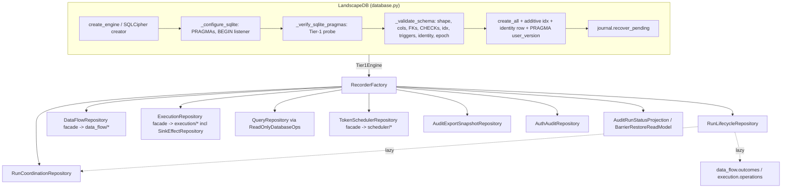

- **Two construction paths.** `RecorderFactory.__init__` (`factory.py:412-510`)
  builds the writable graph. `_build_read_repositories` (`:331-410`) builds a
  parallel read graph. Both instantiate the same 20 stateless loaders
  (`model_loaders.py` has no `__init__` or `self._` state; measured by grep).
  In the read path, `ReadOnlyDatabaseOps` is passed where the repositories'
  type says `DatabaseOps`, through `cast(DatabaseOps, read_ops)`
  (`factory.py:335`). Write verbs are hidden by the `*ReadRepository` wrappers
  (`:60-205`), which forward `*args, **kwargs` and return `Any`.
- **Guards on read-only handles.** The scheduler and coordination repositories
  are not constructed on a read-only handle (`factory.py:500`, `:505`); their
  properties raise instead. `audit_export_snapshots` is always constructed
  (`:510`), but its property refuses read-only handles (`:553-557`).
- **Three facades over sub-packages** ("compatibility facade … call sites can
  migrate incrementally"):
  - `data_flow_repository.py:1-14` and `scheduler_repository.py:1-21` are pure
    delegators: 0 `conn.execute` each (measured).
  - `execution_repository.py:1-15` claims the same, but has 14 direct
    `.execute(` calls. They are concentrated in `complete_aggregation_result`
    (:835-1191) and group-member resolution.
  - The migration has barely started outside the package: 8 external call
    sites use `ExecutionRepository` component attributes (`.node_states.`,
    `.calls.`, `.sink_effects.` and others), and 0 use scheduler component
    attributes. Instrument: `grep -rnoE` over `src/elspeth` excluding
    `core/landscape/`.

### Transaction and concurrency model (MEASURED from `database.py` and `run_coordination_repository.py`)

**SQLite (writable engines):**

- A `connect` listener sets `journal_mode=WAL`, `synchronous=NORMAL`,
  `foreign_keys=ON` and `busy_timeout=5000`. A second listener sets
  `isolation_level=None`. A `begin` listener emits `BEGIN IMMEDIATE` when the
  connection carries `WRITE_INTENT_OPTION`, and a plain `BEGIN` otherwise
  (`database.py:1087-1146`).
- `_verify_sqlite_pragmas` reads the PRAGMAs back and raises
  `AuditIntegrityError` on any drift (`:1148-1201`).
- Repository constructors re-probe with `verify_sqlite_tier1_pragmas` as a
  guard against a bare engine cast to `Tier1Engine` (`:110-140`;
  `run_coordination_repository.py:620`; `scheduler_repository.py:103`).

**SQLite (read-only engines):** these open through a `mode=ro` URI, adding
`immutable=1` only when no `-wal` file exists and the directory is not writable
(`:1848-1874`). They set `PRAGMA query_only=ON`. They register **no** `begin`
listener, so pysqlite runs SELECTs in autocommit (`:1105-1110`).

**PostgreSQL:**

- `begin_write` sets an option that nothing on PostgreSQL reads.
- Serialization comes from row locks: `SELECT … FOR UPDATE` on the seat
  (`run_coordination_repository.py:147`, `:794-802`), plus fence UPDATEs that
  write a column back to itself (`leader_epoch = leader_epoch`, `:449-457`;
  `status='active'`, `:541-549`).
- Heartbeat and forensic writes get
  `SET LOCAL lock_timeout/statement_timeout` (`:119-130`).
- Read-only connections run `SET TRANSACTION READ ONLY`
  (`database.py:2133-2134`).

**StaticPool (`:memory:`, tests only):** a per-engine `RLock` serializes use of
the one shared connection (`database.py:200-247`). Production QueuePool engines
take no application-level lock.

**Three fences (ADR-030 D4, restored by the ADR-048 amendment).** Each is the
first statement of its transaction:

| Fence | Where | Predicate | Token |
|---|---|---|---|
| Leader | `verify_and_extend_leader_fence` (:422) | UPDATE `run_coordination` WHERE run_id, leader_worker_id and leader_epoch match; rowcount must be 1; then a fresh-clock renewal | `CoordinationToken` |
| Member | `verify_membership_fence` (:511) | UPDATE `run_workers` SET status='active' WHERE status='active' | `WorkerMembershipToken` |
| Item | `fenced_item_transaction` (`item_fencing.py:17-62`) | Member fence, then UPDATE `token_work_items` matching work_item_id, attempt, owner and LEASED | `WorkerMembershipToken` plus `TokenWorkItem` |

On a fence miss, `fenced_*_transaction` rolls back and then writes a
best-effort `fence_refusal` ledger row on a fresh connection. The write never
raises and returns `BestEffortEventOutcome` (`:304-393`, `:494-508`).

### ADR-047 clock and deadline machinery (MEASURED)

**Clock readers:**

- `read_landscape_decision_time(conn)` takes a fresh sample after locking:
  `clock_timestamp()` on PostgreSQL, or `strftime('%Y-%m-%d %H:%M:%f','now')`
  on SQLite (ms resolution) (`database_clock.py:24-43`).
- `read_landscape_transaction_time` returns transaction-start time (whole
  seconds on SQLite).
- Unknown dialects raise `NotImplementedError`.

**Deadline registration and the commit guard:**

- Every deadline issuance calls
  `record_issued_deadline(conn, key, expires_at, window)` (`lease_deadlines.py:149-171`).
  It refuses savepoints and non-UTC values, and sets the reserve to
  `min(1 s, 0.1·W)`.
- An engine-level `commit` listener, `_check_deadlines_before_commit`
  (`:114-128`), re-samples database time. It raises `LeaseDeadlineExpiredError`
  and physically rolls the DBAPI connection back (`rollback_failed_commit`,
  `:87-111`) if any issued deadline has used up its reserve.
- The guard is installed at engine setup (`database.py:1049`, `:1958`). When a
  journal attaches, it is re-ordered to run after the journal
  (`journal.py:226` → `install_deadline_guard(after_journal=True)`).

**Process-clock uses that remain.** Each one is a *forensic* stamp, which the
ADR permits:

- `fence_refusal` `recorded_at=datetime.now(UTC)` (`run_coordination_repository.py:505`, `:607`).
- `_helpers.now()` for `runs.started_at` (`run_lifecycle_repository.py:373`).
- Journal record timestamps and outbox `created_at` (`journal.py:254`, `:327`).

### Journal outbox (`journal.py`, read in full)

**Capture.** The `after_cursor_execute` hook buffers every
INSERT/UPDATE/DELETE/REPLACE on a per-connection stack. Savepoints push and pop
buffers (`:239-283`).

**Precommit.** The engine `commit` event serializes the batch (uuid4
`batch_id`, ordinal, size) into one `sidecar_journal_outbox` row inside the
committing transaction (`:297-337`).

**Postcommit.** `engine.dialect.do_commit` is monkey-patched (`:201-219`). After
the DBAPI commit it drains the owner's outbox on the same DBAPI connection:

1. Take the lock: `BEGIN IMMEDIATE` on SQLite, or
   `pg_advisory_xact_lock(owner_key)` on PostgreSQL (`:374-388`).
2. Append each batch to the JSONL file with `fsync` of the file and the parent
   directory (`:576-639`).
3. `DELETE` the acknowledged outbox rows (`:421-427`).

Startup runs `recover_pending` (`database.py:1029`, `:1980`).

**Idempotency and file safety:**

- `_batch_is_fully_published` repairs only an exact torn-tail prefix. Any other
  corruption raises `AuditIntegrityError` (`:488-569`).
- The file must be `0600`, the directory `0700`, both owned by the current
  user. The file opens with `O_NOFOLLOW`, and the parent is `lstat`-checked for
  symlinks (`:641-731`).

**At N>1 workers**, each worker has its own file, derived from
`worker_id`'s hex suffix (`database.py:2034-2070`). These files are declared
**forensic-only**. The authoritative order is `run_coordination_events.seq`
(`journal.py:13-32`).

### Export pipeline (sampled)

- `LandscapeExporter` binds one immutable snapshot per public call
  (`_public_export_scope`, `exporter.py:387-416`). It streams through
  `stream_audit_export_bundle_to_spool` with a discard spool (`:243-264`,
  `:451-502`) and emits an optional HMAC per record plus a final manifest.
- The derivation config must agree with `sign=` in both directions
  (`:596-616`).
- The default read model is built from a full **writable**
  `RecorderFactory(db)` (`:366`). The only production caller is
  `engine/orchestrator/audit_export_effects.py:360-369`, which supplies its own
  snapshot-bound read model.
- Sealed snapshots (`audit_export_snapshots` and `…_chunks`) are protected by
  DB triggers on both dialects (see Data & persistence). The writer lives in
  `execution/audit_export_snapshots.py`, outside this slice.

---

## Data & persistence

### Measured schema facts

```
$ PYTHONPATH=<pin>/src python -c "import elspeth.core.landscape.schema as s; print(len(s.metadata.tables), s.SQLITE_SCHEMA_EPOCH)"
47 43
```

(`elspeth.__file__` was verified to resolve inside the pin.)

The 47 tables and their column counts (largest first): `sink_effects` 39,
`audit_export_snapshots` 32, `token_work_items` 31, `runs` 21, `calls` 18,
`scheduler_events` 18, `node_states` 17, `nodes` 16, `validation_errors` 15,
`operations` 14, `coalesce_effects` 14, `run_web_plugin_policy` 14, … down to
`elspeth_schema_identity` 4.

**Tables absent from ARCHITECTURE.md's 46-table list (:304-334):**

- `run_start_admissions` (schema.py:564, epoch 39).
- `batch_outputs`. It is drawn in the diagram, but no code writes it (see
  Concerns).

**Table census of source references outside `schema.py`** (`grep -rlw
<name>_table src`; controls: `batch_members_table` 5 files, `runs_table` 23
files):

- Every table object is referenced by at least one other module, **except
  `batch_outputs_table` (0 files)**.
- `run_coordination_table` and `run_coordination_events_table` appear only in
  `run_coordination_repository.py`.
- `sidecar_journal_outbox_table` appears only in `journal.py`.

### Epoch and identity mechanics (`database.py`, read)

**Epoch markers.** The epoch is stored in two places: `PRAGMA user_version`
(SQLite only) and the cross-dialect `elspeth_schema_identity` singleton
(application, store_kind='landscape', epoch). The identity table is created by
`core/schema_identity.create_schema_identity_table` (schema.py:451).

**No migrations.** There is no Alembic and no in-place migration. The code:

- rejects a non-zero older epoch that still has Landscape tables (`:1428-1442`);
- rejects a newer epoch (`:1418-1427`);
- stamps a fresh file only after `create_all` (`:1444-1454`).

The operator message is "uninstall … delete/recreate … reinstall"
(`:1756-1761`). The comment at `schema.py:470` still says a `node_id` width
change "requires an Alembic migration". No Alembic exists.

**Validator layers** (all dialects, `:1456-1761`):

1. Foreign tables are refused.
2. `collect_metadata_shape_issues` compares the full reflected metadata shape,
   including structural CHECK text (`core/schema_shape.py`).
3. `_REQUIRED_COLUMNS`: 345 entries, 342 unique. It includes every column of
   the epoch-26, 27 and 32 tables, added programmatically at `:517-539`.
4. `_REQUIRED_FOREIGN_KEYS` (14, single-column).
5. `_REQUIRED_COMPOSITE_FOREIGN_KEYS` (44, run-scoped).
6. `_FORBIDDEN_FOREIGN_KEYS` (1: `node_states.resume_checkpoint_id →
   checkpoints`).
7. `_REQUIRED_CHECK_CONSTRAINTS` (80 names).
8. `_REQUIRED_INDEXES` (35).
9. The six export triggers.

All registry sizes were measured by importing `database.py` at the pin. PostgreSQL triggers are matched on relation,
   function and `tgtype` bits through `pg_catalog`, not
   `information_schema` (`:1650-1669`).
10. ADR-019 stale-shape probes (`:940-967`).

Only `auth_events` and `run_attributions` may be missing as tables, and only
`ix_tokens_run_id` may be missing as an index. Both are "additive" exceptions
(`:815-817`).

`probe_schema_shape` (`:879-916`) is a non-mutating classifier returning
EMPTY, FOREIGN, INCOMPLETE, DIVERGENT or MATCHES. It is used by `web/schema_probe.py`.

### Invariants the DB enforces

**Run-scoped composite FKs** (e.g. `tokens(row_id, run_id) → rows`,
schema.py:795). These are the mechanism behind ARCHITECTURE.md's claim that
identity and recovery are run-scoped.

**Lifecycle CHECKs:**

- `ck_sink_effects_lifecycle`: a four-state closed tuple (`:1773-1811`).
- `ck_coalesce_effects_lifecycle`.
- `ck_aggregation_results_mode_shape_parent`.
- `ck_run_coordination_seat_liveness_paired` (`:1138-1141`).
- `ck_run_workers_evicted_at_paired`.
- `ck_token_work_items_lease_owner_required_when_leased` (`:926-930`).

**Closed vocabularies:**

- Enum-derived IN lists for `TokenWorkStatus`, `SchedulerEventType`,
  `FrameKind` and `RunSourceLifecycleState` (`_enum_in_check`, `:230-236`).
- A hand-written `auth_events.event_type` with 23 values (`:2671-2684`),
  deliberately not derived from the Literal so that changing what the DB
  admits costs an epoch bump.

**Digest shape CHECKs (epoch 43).** These are dialect-exact compilers: `GLOB`
on SQLite, `~` regex on PostgreSQL (`:47-218`). They cover 64-, 32- and 16-hex
digests and `sha256:<16hex>`.

**Partial unique indexes:**

- One terminal outcome per token (`ix_token_outcomes_terminal_unique`, `:841-847`).
- Per-parent `call_index` uniqueness (`:2253-2269`).
- The artifact idempotency key (`:2311-2318`).

**Seal and immutability triggers on the export snapshot tables** (SQLite
`:1978-2055`, PostgreSQL `:2057-2152`):

- A chunk's predecessor chain and cumulative totals are checked on insert.
- A snapshot insert requires a complete chunk graph.
- UPDATE and DELETE on a sealed snapshot or its chunks abort.

**Deferred composite FKs** make the snapshot/chunk and effect/member cycles
insertable in one transaction (`:1658-1673`, `:1851-1866`).

### Invariants enforced only in code

- **Row identity fabrication ban.** `schema.py:737-746` itself documents that
  this lives in an exception string at one write boundary.
- **Group-opener uniqueness for COLLECT release.** This is "EVENTUALLY-sustained".
  The comment at `schema.py:1278-1290` describes a crash window that stays open
  until the WS4 settlement-seam wiring lands.
- **Terminal-run immutability.** This lives in `run_lifecycle_repository.py:140-156`
  and in the takeover backstop at `run_coordination_repository.py:816-831`.
  There is no DB trigger.

---

## Dependencies

All counts are from `temp/import-matrix.md` as module-level / lazy /
TYPE_CHECKING. `core.landscape` is the whole package; the matrix does not split
out this slice.

**Inbound (who imports `core.landscape`):**

| Importer | Counts |
|---|---|
| engine | 61 / 5 / 33 (39 files by my grep) |
| web.execution | 18 / 5 / 1 |
| cli | 0 / 17 / 1 |
| mcp | 13 / 21 / 0 |
| web.(root) | 9 / 0 / 0 |
| web.acceptance | 9 / 0 / 0 |
| core.checkpoint | 9 / 0 / 0 |
| web.auth | 6 / 0 / 0 |
| web.sessions | 5 / 0 / 0 |
| core.retention | 4 / 0 / 1 |
| tui | 4 / 0 / 0 |
| plugins.infrastructure | 2 / 0 / 3 |
| web.audit_readiness | 2 |
| plugins.sinks, plugins.sources, web.composer, web.coordination | 1 each |
| core | 0 / 0 / 1 |
| cli_helpers | TYPE_CHECKING 1 |

**Direct `schema.py` importers outside the package: 25 modules** (MEASURED):

| Package | Modules |
|---|---|
| engine/orchestrator | 4: `abandon`, `resume`, `source_iteration`, `source_lifecycle_recorder` |
| mcp/analyzers | 4 |
| web/execution | 7 |
| core/checkpoint | 2 |
| web/sessions | 2 |
| web/_acceptance_common | 2 |
| core/retention/purge | 1 |
| web/composer/tutorial_service | 1 |
| web/schema_probe | 1 |
| web/coordination/membership_authority | 1 (only `SQLITE_SCHEMA_EPOCH`, recorded per web instance at :127) |

A DML scan found only one external writer: `core/checkpoint/manager.py`, which
writes `checkpoints` inside `fenced_leader_transaction`. An apparent hit in
`web/coordination/membership_authority.py` was a false positive on the
Sessions table `web_instances_table`, found by reading the file. Every other
external importer uses the schema module for **reads**.

**Outbound:**

| Target | Counts | What is imported |
|---|---|---|
| contracts | 239 / 1 / 26 | |
| core | 35 / 1 / 0 | measured as `core.canonical` 18, `core.ids` 12, `core.schema_identity` 2, `core.config` 2 (`sanitize_node_config_for_audit`, `data_flow_repository.py:564` and `data_flow/graph.py:28`), `core.schema_shape` 1, `core.payload_store` 1 |
| core.checkpoint | 2 / 6 / 0 | detailed below |

Third-party: SQLAlchemy Core, structlog, and `sqlcipher3` (optional,
imported lazily at `database.py:1245`).

**Symbols that carry the `core ↔ core.landscape ↔ core.checkpoint` cycle**
(MEASURED):

- landscape → checkpoint, module level:
  - `execution_repository.py:66` imports `checkpoint_dumps`.
  - `data_flow/tokens.py:32` imports `checkpoint_dumps`.
- landscape → checkpoint, lazy:
  - `scheduler/payload_codec.py:33/46` imports `checkpoint_dumps` and
    `checkpoint_loads`.
  - `run_coordination_repository.py:855/1027/1035/1062` imports
    `NonResumableRunError`. The comment at :852-854 names the cycle as the
    reason the import is local.
- checkpoint → landscape:
  - `core/checkpoint/recovery.py:43-48` imports `LandscapeDB`,
    `RecorderFactory`, `RunCoordinationRepository`, scheduler types and
    schema.
  - `core/checkpoint/manager.py:15-17` imports `LandscapeDB`,
    `fenced_leader_transaction` and `checkpoints_table`.
- core → landscape: `core/operations.py:30` imports `ExecutionRepository`
  (TYPE_CHECKING only).

Moving `checkpoint_dumps/loads` (a serializer) and `NonResumableRunError` (an
error type) to `contracts`, or to a neutral core module, would break the
package cycle. **INFERRED**; not attempted.

---

## Patterns observed

1. **Tier-1 branded engine.** `Tier1Engine = NewType(...)` is minted only by
   `LandscapeDB.engine` (`database.py:55`, `:1763-1781`). It is backed by a
   runtime PRAGMA re-probe in the repository constructors.
2. **Registries of expected shape instead of migrations.** The `_REQUIRED_*`
   tuples plus a full metadata-shape comparison fail closed on drift. Epoch
   bumps are delete-and-recreate boundaries.
3. **Dialect-exact SQL through `@compiles` elements**, so a CHECK that
   PostgreSQL reflects differently still round-trips structurally
   (`schema.py:47-218`). This was motivated by the one-element-IN defect
   elspeth-d0e62aea41 (AGENTS.md).
4. **Fence-first transactions and value-returning outcomes.** Refusals such as
   `SeatReleaseOutcome` and `BestEffortEventOutcome` are declared enums rather
   than swallowed exceptions.
5. **Same-transaction event ledgers.** Coordination events (`seq`
   AUTOINCREMENT) and scheduler events (seq since epoch 38) are the replay
   order. `recorded_at` is forensic only.
6. **Capability views.** `LandscapeReadRepositories` and
   `LandscapeWriteRepositories` use `__slots__`, and `PayloadStoreReadRepository`
   hides `store` and `delete` (`factory.py:207-305`).
7. **Compatibility facades over cohesive components**, with the migration
   stalled (see Concerns).
8. **Error taxonomy.** Every error is `AuditIntegrityError`-rooted:
   `LandscapeRecordError`, `…NotFoundError` and `…PostCommitError` are narrow
   Tier-1 markers registered with `@tier_1_error` (`errors.py:13-17,37-41,45-49`).
   `SinkEffectLeaseLiveError` (`errors.py:26`) is *not* itself registered; it
   is Tier-1 only by inheritance from `LandscapeRecordError`.
9. **Redaction-safe DB errors.** `_safe_database_error_message` reports only
   the exception type (`_database_ops.py:14-16`; 14 call sites). There are
   exceptions; see C06.

---

## Invariants and how they are enforced

| Invariant | Enforcement | Evidence |
|---|---|---|
| Audit DB is WAL + FK + busy_timeout, or the open fails | Code: PRAGMA probe raises `AuditIntegrityError`. Tests: `test_database_pragma_probe.py`, `test_pragma_discipline.py` | `database.py:1148-1201` |
| Writers take the SQLite write lock at BEGIN | Code: `begin` listener plus `WRITE_INTENT_OPTION`. Test: `test_write_intent_begin.py` | `database.py:1129-1146` |
| Schema matches code exactly, and older epochs are refused | Code: `_validate_schema`, epoch and identity sync. Tests: `test_schema_epoch_and_required_columns.py` (pins `SQLITE_SCHEMA_EPOCH == 43` at :52), `test_database_schema_probe.py` | `database.py:1376-1761` |
| Run-scoped identity (no cross-run contamination) | DB: composite FKs. Code: validator `_REQUIRED_COMPOSITE_FOREIGN_KEYS`. Test: `test_token_ownership_run_scope.py` | schema.py, passim; `database.py:565-661` |
| One terminal outcome per token | DB: partial unique index | schema.py:841-847 |
| Leased work item has an owner | DB CHECK (literal pinned to `TokenWorkStatus.LEASED.value`). Test: `test_token_work_items_lease_owner_check.py` | schema.py:926-930 |
| Leadership proven before any run-scoped write (ADR-048) | Code: typed-token signatures and fence-first transactions. Test gate: `tests/unit/architecture/test_web_landscape_mutation_fencing.py`, 19,221 lines, whose docstring says "every … must have an empty violation set" | See the conformance note below |
| Authority "now" is database time (ADR-047) | Code: `database_clock` and `lease_deadlines`. Test gate: `tests/unit/core/landscape/test_database_clock_authority.py`, 8,206 lines, an AST scanner | See the conformance note below |
| Sealed export snapshots are immutable | DB triggers on both dialects. Code: validator requires trigger names, and on PostgreSQL the catalog binding | schema.py:1978-2152; `database.py:1634-1670` |
| Journal batches published exactly once, in order, per owner | Code: outbox, owner lock, torn-tail repair. Tests: `test_journal.py`, `testcontainer/core/test_journal_postgres.py` | `journal.py:365-569` |

**ADR-048 conformance (INFERRED, not gate-verified).** An AST census of every
mutation-named public method on the top-level repositories (`record_*`,
`create_*`, `begin_*`, `complete_*`, `mark_*` and similar) shows that every
run-scoped mutation verb takes an exact `CoordinationToken` or
`WorkerMembershipToken` keyword. That covers 12 of 13 `RunLifecycleRepository`
mutators, 13 of 13 `DataFlowRepository`, 19 of 19 `ExecutionRepository`
signatures (including 4 `complete_node_state` overloads), 20 of 20
`TokenSchedulerRepository`, and 8 of 8 `PluginAuditWriterAdapter`.

The exceptions without a token all have documented reasons:

- `begin_run`: the epoch-1 creation exception named in the gate docstring
  ("Until Task 8B").
- The four leadership-acquisition verbs, which *mint* tokens.
- `record_fence_refusal`: best-effort attribution.
- The six `AuthAuditRepository` writes: a non-run table
  (`_database_ops.py:72-76`, "non-run repositories own their closed table
  writes").

One instrument hit, `adopt_blocked_barrier_item`'s optional `membership`, was
a false positive: it is a `BatchMembershipSpec` (`scheduler_repository.py:629-647`).

This census is far from the 11-of-90 state that ADR-048 records at
`d8bf089be`. However, **I did not run either gate module**: the brief limits
execution to a `python -c` probe. So "the gate is green" is not established
here.

**ADR-047 conformance (INFERRED).** The same limit applies. Statically:

- Every seat, member and item deadline read in the files I read comes from
  `read_landscape_decision_time` *after* a lock statement
  (`run_coordination_repository.py:406`, `:633`, `:688`, `:812`, `:1024`,
  `:1155`).
- The remaining process-clock reads are forensic stamps, as the ADR allows.

---

## Baseline delta: what ARCHITECTURE.md (and ADRs) say vs what the tree says

| Claim | Pinned tree | Evidence |
|---|---|---|
| "46 tables; SQLite schema epoch 38" (ARCHITECTURE.md:183, :267, :300, :304) | **47 tables, epoch 43**. Epochs 39-43 postdate the 2026-09-11 baseline: run-start permit, residual usage and quota columns, prompt-artifact anchor, admission evidence v2, digest shape CHECKs | `python -c` probe; schema.py:423-449. Not previously reported (grep for `46 tables\|epoch-38` in `docs/reviews` and `docs/plans`: 0 hits) |
| 46-table list (ARCHITECTURE.md:304-334) | Missing `run_start_admissions` (schema.py:564). Lists `batch_outputs`, which is dead (C02) | table census |
| `docs/architecture/landscape.md` | Internally inconsistent: "46" tables (:23), "epoch 38" (:25), "41 tables" (:109), "recreated at epoch 35" (:185) | file lines |
| Component diagram (ARCHITECTURE.md:256-289) names six repositories plus DB, Schema, Exporter and Journal | Omits `RunCoordinationRepository` (35 imports tree-wide including intra-package; 9 external), `AuthAuditRepository`, `AuditExportSnapshotRepository`, `RunStartAdmissionRepository`, `AuditRunStatusProjection`, `BarrierRestoreReadModel`, the ADR-047 modules (`database_clock`, `lease_deadlines`, `item_fencing`), and the three sub-packages holding 19,155 lines (49% of the package) | `factory.py:40-45`, `:443-510` |
| "ExecutionRepository delegates effect lifecycle" to "SinkEffectRepository" | True: `execution/sink_effects.py`, composed at `execution_repository.py:184-190`. But the facade also carries 356 lines of its own SQL | C03 |
| Every repository "Uses for operations" `LandscapeDB`, and the Exporter "Reads through" `QueryRepository` | The Exporter reads through `ConnectionBoundExportReadModel` on its own connection (`export_read_model.py:520-544`) or through a `RecorderFactoryExportReadModel` adapter, not directly through `QueryRepository`. 25 external modules import `schema` directly for raw reads | `exporter.py:149-240`, `:366`; schema-importer census |
| "Exporter: Complete audit export, including effect streams and attempts" (ARCHITECTURE.md:301); `exporter.py:3` "complete audit data" | Effect streams and attempts are exported (`exporter.py:956-972`). But `run_sources`, `coalesce_effects(+members)`, `aggregation_results(+outputs, members)`, `run_coordination_events`, `run_workers`, `preflight_results` and `run_start_admissions` are never read by the export path. The run record also omits `runtime_val_manifest_json`, `source_schema_json` and the OpenRouter catalog anchor | C01 |
| Journal "Commits outbox rows with audit writes" | True, and the tree adds more: a postcommit drain that fsyncs inside the patched `do_commit`, per-worker files, and forensic-only status at N>1 | `journal.py:1-33`, `:201-219` |
| ADR-048 "(Proposed)" (ARCHITECTURE.md:1059; ADR header :4 "4 red ids … 84 API violations") | The signature census shows near-complete threading, and the gate docstring now asserts empty violation sets. **The ADR status and review-evidence header are stale relative to the code**; gate verdict not run | census above; gate `test_web_landscape_mutation_fencing.py:1-8` |
| ADR-047 review evidence "4 red ids … 180 findings" | The gate's docstring still says "This test intentionally starts RED"; its current verdict was not measured | `test_database_clock_authority.py:1-12` |
| ADR-041 profile `postgresql-16` | No code checks the PostgreSQL server version. `grep server_version` over `src` finds 0 files; control `postgresql` finds 52 | grep |
| Dialects: SQLite, SQLCipher, PostgreSQL | Confirmed. SQLCipher uses a creator with `PRAGMA key` first (`database.py:1222-1334`); PostgreSQL uses `SET TRANSACTION READ ONLY`, advisory locks and `pg_catalog` trigger checks. An unsupported dialect is accepted at open and fails late (`read_only_connection` raises at `:2135-2136`; the clock raises `NotImplementedError`) | as cited |
| Baseline omits the StaticPool test lock, write intent / `BEGIN IMMEDIATE`, the read-only `mode=ro`/`immutable` open, and the non-mutating `probe_schema_shape` | Present | `database.py:200-275`, `:848-916`, `:1848-1874` |
| Landscape ~37,400 LOC (ARCHITECTURE.md:176) | 38,953 | measured |

---

## Concerns

| ID | Severity | Concern | Evidence (file:line at pin) | New / previously reported |
|---|---|---|---|---|
| C01 | High | **The "complete" audit export omits several evidence tables.** Per-source schema contracts, lifecycle and field resolution (`run_sources`) are left out, even though the deleted run-level contract moved there (`run_lifecycle_repository.py:345-354`). Also omitted: coalesce effect receipts, aggregation result receipts, coordination and worker ledgers, preflight results, the run-start admission, and run-level `runtime_val_manifest_json`, `source_schema_json` and the OpenRouter catalog anchor. No exclusion rationale was found in `contracts/export_records.py` or `test_exporter.py`. The DB stays authoritative, so severity drops to Medium if exports are not the portable legal artifact | Record-type census `exporter.py:642-1232`; grep over exporter, export_read_model and export_mappers: 0 hits each for `run_sources`, `coalesce_effect`, `aggregation_result`, `run_coordination_events`, `run_workers`, `preflight`, `run_start_admission` (controls: `auth_event` 26, `sink_effect_attempt` 16); `RunExportRecord` fields at `contracts/export_records.py:64-75` | NEW |
| C02 | Medium | **`batch_outputs` is a dead table.** It is created, validated and diagrammed, but nothing writes or reads it. It also has only a single-column FK to `batches`, with no `run_id` scoping, unlike every sibling. `BatchOutput` (`contracts/audit.py:1144`) is re-exported by `core/landscape/__init__.py` but unused | schema.py:2455-2463, :2474; `grep -rlw batch_outputs_table src` finds 0 files outside schema (control `batch_members_table` 5) | NEW |
| C03 | Medium | **`ExecutionRepository` is not the pure facade its docstring claims.** `complete_aggregation_result` is 356 lines of in-facade SQL: 14 `.execute` calls, FOR UPDATE on 3 tables, and 3 receipt tables. The facade migration has also stalled: 8 external component-attribute call sites, 0 for scheduler. The flat delegators are the real API | `execution_repository.py:1-15` vs :835-1191; `data_flow_repository.py` and `scheduler_repository.py` 0 `.execute` each | NEW |
| C04 | Medium | **Stale architecture baseline for the audit store.** Epoch 38 vs 43, 46 vs 47 tables, and a component list missing coordination, admission, auth audit, snapshot registry and the ADR-047 modules. `landscape.md` contradicts itself (46 / 41 / epoch 35 / 38). ADR-048 is still "Proposed" with a d8bf089be red count | ARCHITECTURE.md:183, :267, :300, :304; `docs/architecture/landscape.md:23,25,109,185`; ADR-048:4-6 | NEW (the SSO review measured L43 at `2026-09-23-identity-sso-completion.md:465` but flagged only the Sessions drift) |
| C05 | Medium | **Journal postcommit work runs inside the patched `dialect.do_commit`.** A second `BEGIN IMMEDIATE` or advisory-lock transaction, file fsync, directory fsync and DELETE all happen after the real commit. `OSError` is deferred, but an `AuditIntegrityError` from `_batch_is_fully_published` or outbox corruption propagates out of `do_commit` *after* the audit transaction committed. The caller then sees a failed commit for data that is durable (INFERRED from control flow; not exercised). It also adds two fsyncs and a lock re-acquisition per journaled write transaction | `journal.py:204-219`, :365-444, :524-560 | NEW (INFERRED) |
| C06 | Low | **Raw DB exception text is embedded in Tier-1 errors.** SQLAlchemy `StatementError` text carries SQL and bound parameters (`settings_json` for `begin_run`). This contrasts with the redaction-safe helper used at 14 other sites. Topical: HEAD `85ebf2739` is the "redaction-safe error codes" merge | `run_lifecycle_repository.py:503`; `data_flow/tokens.py:1207`; cf. `_database_ops.py:14-16` | NEW |
| C07 | Low | **The epoch-43 claim "every digest column carries a shape CHECK" is not fully true.** Unchecked: `scheduler_events.event_id` and `run_coordination_events.event_id`, both documented as sha256 (schema.py:1063-1070, :1185-1187), and `tokens.token_data_ref` (a sha256 payload ref, :789). By contrast, `coalesce_effects.expected_token_data_ref` (:1520) and `aggregation_result_outputs.token_data_ref` (:2429) are checked. No census test pins the digest-column set (`test_schema_epoch_and_required_columns.py:51-52` only asserts the epoch value) | schema.py:444-449 comment vs the columns cited | NEW |
| C08 | Low | **The export snapshot on a read-only SQLite handle is not a DB snapshot.** `open_export_read_transaction` relies on the writable-engine `begin` listener (comment at `export_read_model.py:530-533`). Read-only engines register none (`database.py:1105-1110`), so pysqlite runs the export's SELECTs in autocommit. `_database_ops.execute_fetchall_many` works around exactly this (`_database_ops.py:62-66`). Today it is latent: the only exporter caller is writable (`engine/orchestrator/audit_export_effects.py:360`) | as cited | NEW (INFERRED) |
| C09 | Low | **Two parallel repository-construction paths plus a type-lying cast.** `_build_read_repositories` duplicates `__init__`'s 20 loaders and 5 repositories and casts `ReadOnlyDatabaseOps` to `DatabaseOps`. The read wrappers forward `*args, **kwargs` and return `Any`, which erases typing on the read port. The drift risk has already surfaced: the read `DataFlowRepository` gets no `node_state_repository` (`factory.py:359-368` vs :464-474) | `factory.py:331-410`, :412-510 | NEW |
| C10 | Low | **Validator hygiene.** `_REQUIRED_COLUMNS` has 3 duplicate pairs (345 entries, 342 unique; measured): `token_work_items.lineage_path_json` (`database.py:421`, :437), `token_lineage_frames.member_key` (:309, :443) and `group_records.member_count` (:310, :448). `_REQUIRED_FOREIGN_KEYS` holds a single-column `validation_errors.row_id → rows` entry, although its own comment says run-scoped contracts belong in the composite list and the schema FK is composite (`database.py:543-547` vs schema.py:2532-2536). The `_validate_schema` docstring says non-SQLite validates only table existence, but the code validates everything on all dialects (:1459-1462). The comment "requires an Alembic migration" is stale (schema.py:470). The epoch history lists 15 and 17 twice (schema.py:283-300) | as cited | NEW |
| C11 | Low | **Audit principals are silently truncated to 256 characters.** Two distinct OIDC subjects sharing a 256-character prefix become indistinguishable, and nothing marks the truncation | `auth_audit_repository.py:27-43` | NEW (INFERRED impact) |
| C12 | Low | **No enforcement of the ADR-041 `postgresql-16` profile.** Any PostgreSQL version is accepted | grep: 0 `server_version` (control 52 `postgresql`) | NEW |
| C13 | Medium (cross-slice) | **The `auth_events` vocabulary is closed and hand-pinned, so the audit gaps found in web/auth need a Landscape epoch bump to fix.** There is no credential-created or password-reset event type | schema.py:2671-2684 | PREVIOUSLY-REPORTED (R08, R09 in `docs/reviews/2026-09-23-release-0.8.1-web-review/issues/`); the Landscape-side consequence is NEW |

**Designed exceptions, not concerns** (recorded so that later readers do not
raise them again):

- Forensic `datetime.now(UTC)` and `_helpers.now()` stamps (ADR-047 permits).
- Token-free `begin_run` (gate-documented epoch-1 exception).
- Token-free `auth_events` writes (non-run table).
- `reset_prepared_initialization` DELETEs setup evidence for a *prepared*
  admission only after proving no execution evidence exists
  (`run_start_admission.py:62-110`).
- Best-effort `fence_refusal` rows.

---

## Complexity and tech-debt hotspots

Measured with an `ast` walk over the key files:

| Symbol | Lines | Note |
|---|---:|---|
| `RunLifecycleRepository` (class) | 1,945 | Fuses run lifecycle, sources, secrets, preflight, export status, permit observation and the abandonment sweep. Lazily builds the coordination, outcomes and operations repositories, reaching into `coordination._finalize_leader_registration_on` (private, `run_lifecycle_repository.py:478`) |
| `RunCoordinationRepository` (class) | 1,144 | |
| `ExecutionRepository` (class) | 1,087 | Contains `complete_aggregation_result`, 356 lines |
| `LandscapeExporter` (class) | 997 | `_iter_records` 314 lines, `_iter_row_batch_records` 214 lines |
| `QueryRepository` (class) | 881 | |
| `begin_run` | 213 | |
| `_acquire_run_leadership_on` / `_acquire_terminal_leadership_on` | 146 / 122 | ~80% structurally duplicated: the seat CAS, eviction, worker row and two events are repeated (`run_coordination_repository.py:783-928` vs :999-1120) |
| `schema.py` | 2,717 | One module holding all 47 tables, the compilers and the triggers. The epoch history comment alone is ~205 lines |
| `database.py` validator registries | ~540 | `:277-817` |

**Test-side hotspots** (outside this slice's code, but they gate it):

- `tests/unit/architecture/test_web_landscape_mutation_fencing.py`: 19,221 lines, 1.0 MB.
- `tests/unit/core/landscape/test_database_clock_authority.py`: 8,206 lines.

Both are AST scanners with frozen digests (e.g. `_CLOCK_BOUNDARY_DIGEST` at
:159), so every refactor of this slice pays a re-pin cost.

**Other hotspots:**

- **Vestigial code:** `batch_outputs` (C02); the re-exported `BatchOutput`.
- **TODO/FIXME:** none found in the top-level files. The "WS4 integration item"
  eventual invariant is a documented open crash window (schema.py:1278-1290).
- **Monkey-patching:** `engine.dialect.do_commit` is monkey-patched by the
  journal (`journal.py:219`, `# type: ignore[method-assign]`).

---

## Test map

Counted with `find` and `grep -rl 'elspeth.core.landscape'`:

| Directory | Scope | Size |
|---|---|---|
| `tests/unit/core/landscape/` | Unit | 137 test files, 87,935 lines, incl. `repository_integration/` |
| `tests/integration/` | Files importing `core.landscape` | 105 |
| `tests/e2e/` | Files importing `core.landscape` | 36 |
| `tests/testcontainer/` | PostgreSQL proofs | 35 |
| `tests/property/` | Files importing `core.landscape` | 19 |

**Notable dedicated suites:**

- `test_database_pragma_probe.py`, `test_pragma_discipline.py`,
  `test_write_intent_begin.py`
- `test_database_sqlcipher.py`: skips without `sqlcipher3`; CI installs
  `libsqlcipher-dev` at `.github/workflows/ci.yaml:113` and elsewhere; the
  module is available in the venv.
- `test_schema_epoch_and_required_columns.py`, `test_database_schema_probe.py`
- `test_journal.py`
- `test_lease_deadline_guard.py`, `test_run_coordination_*`, `test_*fencing*`
- `test_audit_export_snapshot_schema.py`, `test_exporter.py`
- `testcontainer/core/test_journal_postgres.py`,
  `test_lease_deadline_guard_postgres.py`,
  `test_audit_export_snapshot_postgres.py` and 32 others.

**Gaps (MEASURED by absence of a match):**

- No test asserts a closed digest-column census (C07).
- No test asserts the export covers a declared table set; nothing names
  `run_sources`, `coalesce_effects` or `aggregation_results` in `test_exporter.py` (C01).
- No test for a failure on the journal postcommit drain path (C05, INFERRED:
  not searched exhaustively).
- `batch_outputs` appears only in `tests/helpers/state_engine.py` and
  `tests/unit/contracts/test_declaration_contracts.py`.

---

## Confidence

**Medium-High.**

**Read in full:**

- `schema.py` (all 2,717 lines)
- `database.py` (all 2,141)
- `factory.py`
- `journal.py`
- `database_clock.py`, `lease_deadlines.py`, `item_fencing.py`
- `_database_ops.py`, `ports.py`, `errors.py`, `_helpers.py`
- `run_start_admission.py`, `__init__.py`
- `run_coordination_repository.py:1-1260`

**Sampled:**

- `run_lifecycle_repository.py:1-510`
- `exporter.py:1-690`, plus its record census
- `execution_repository.py:1-200` and `:835-880`, plus an execute census
- `scheduler_repository.py:1-118` and `:625-700`
- `data_flow_repository.py:1-80`
- `model_loaders.py:1-141`
- `export_read_model.py:1-84` and `:520-547`
- heads of `run_status_projection.py`, `auth_audit_repository.py` and
  `plugin_audit_writer.py`

**Not read:** `query_repository.py` (structure only), `lineage.py`,
`reproducibility.py`, `export_mappers.py`, `row_data.py`, `batch_lineage.py`,
`sink_effect_diagnostics.py`, `formatters.py`, `lineage_text.py`,
`serialization.py`, and the sub-packages, which belong to other slices.

**Measured by instrument:**

- Table count and epoch (`python -c`, provenance verified).
- Table reference census, with controls.
- External importer and DML census. One false positive was caught by reading
  the file.
- Mutation-verb token census via AST. One false positive (`BatchMembershipSpec`)
  was resolved by reading.
- Function sizes via AST.
- Export table coverage, with controls.

**Not measured:** the pass/fail state of the ADR-047 and ADR-048 gate tests. The
brief forbids running pytest beyond a probe, so both conformance verdicts are
INFERRED from static reading.

---

## Risk Assessment

**Implementation risk:** Medium. **Reversibility:** Moderate. Every schema fix
is an epoch bump: delete-and-recreate plus a coordinated Sessions cut-over
window.

| Risk | Severity | Likelihood | Mitigation |
|---|---|---|---|
| An auditor relies on an export that lacks source contracts, receipts or coordination history (C01) | High | Medium | Declare the export's table coverage and pin it in a test, or add the record types |
| A commit is reported as failed although it is durable, on journal corruption (C05) | Medium | Low | Move the drain after `do_commit` returns, or convert integrity faults on the drain into deferred alarms |
| Fixing R08, R09 or C07 forces a Landscape epoch bump (44) and recreates stores | Medium | High, if fixed | Batch the fixes into one prepared residual window, as epochs 39 and 40 did |
| Stale baseline leads reviewers to wrong conclusions (C04) | Low | High | Regenerate the numbers with the `landscape.md:34-37` probe |

## Information Gaps

- **Gate verdicts for ADR-047 and ADR-048.** Would move both conformance rows
  from INFERRED to MEASURED.
- **Whether the export omissions are a deliberate scope decision.** No ADR or
  spec found; a ruling would downgrade C01.
- **Runtime behaviour of the journal drain under corruption.** Needs a fault
  injection test.
- **PostgreSQL server versions actually deployed.** Relevant to C12.
- **The `query_repository.py`, `lineage.py` and `reproducibility.py` internals.**
  Not read.

## Caveats and Required Follow-ups

1. Run both gate modules (`test_database_clock_authority.py` and the four named
   ids in `test_web_landscape_mutation_fencing.py`) with the pin on
   `PYTHONPATH`, then re-label the conformance rows.
2. Confirm with the maintainer whether the audit export is the legal portable
   artifact before ranking C01 High.
3. Before filing C07 or C10, re-read `core/schema_shape.py`. The full-shape
   comparison may already cover part of the registry duplication.
4. This entry does not assess the sub-packages (`data_flow/`, `execution/`,
   `scheduler/`: 19,155 lines). Their slice owners should verify the facade
   delegation claims from the component side.

## Validation corrections

- [validator] Pattern 8 said `SinkEffectLeaseLiveError` is "registered with `@tier_1_error`" -> it is **not decorated**. It is Tier-1 only because it subclasses the registered `LandscapeRecordError`. Evidence: `core/landscape/errors.py:26` has no decorator. A registry probe after importing every `contracts`/`core`/`engine` submodule lists exactly 3 `core.landscape.errors` members of `TIER_1_ERRORS` (`LandscapeRecordError`, `LandscapeRecordNotFoundError`, `LandscapePostCommitError`), which agrees with S01's registry count of 15.
- [validator] Severity of C01 (High) retained. The 0-hit greps reproduce, and the controls give `auth_event` 26 and `sink_effect_attempt` 16. The one `admission` hit in the export path is the web plugin-policy `admission_decision_json` (`exporter.py:746-750`), not `run_start_admissions`. The module docstring itself promises "complete audit data … suitable for compliance review and legal inquiry" (`exporter.py:3-4`).


---

# S04 — Landscape Ledgers (durable scheduler, sink-effect ledger, data-flow lineage)

**Location:** `src/elspeth/core/landscape/execution/`, `src/elspeth/core/landscape/scheduler/`, `src/elspeth/core/landscape/data_flow/`
(read at the detached pin `.claude/worktrees/arch-analysis-pin`, `release/0.8.1` @ `85ebf2739`). The compatibility facades that compose these
packages (`scheduler_repository.py`, `execution_repository.py`, `data_flow_repository.py`), plus `item_fencing.py` and the relevant tables in `schema.py`,
sit outside the slice paths. They were read only as far as the slice needs.

**Measured size:** 33 files, **19,155 lines** (MEASURED:
`find src/elspeth/core/landscape/{execution,scheduler,data_flow} -name '*.py' | xargs wc -l`). By package (per-directory `wc -l | tail -1`,
sums to the total): execution 8,337 / 14 files · scheduler 6,519 / 12 · data_flow 4,299 / 7 (counts include each `__init__.py`). These three packages are 49 % of `core/landscape` (38,953 lines per 01-discovery).

**Responsibility:** The Tier-1 audit and recovery ledgers of the Landscape. They cover the durable token scheduler and its barrier journal (ADR-026/029/030),
the recoverable sink-effect publication ledger, and the row/token/outcome/lineage audit aggregates (ADR-019/038/042). Every write is fenced to a
leader or member coordination token (ADR-048) and stamped against the Landscape database clock wherever a lease decision is involved (ADR-047).

---

## Key components

| File | Lines | Role |
|---|---:|---|
| `data_flow/tokens.py` | 2,161 | `RowTokenRepository`, one 2,040-line class. Handles source row+token creation, the fenced ingest insert, and atomic fork/coalesce/expand/collect lineage writes (children + `token_parents` + `token_lineage_frames` + parent terminal outcomes + `group_records` + `coalesce_effects`). Largest methods: `expand_token` 335, `coalesce_tokens` 294, `collect_tokens` 233, `fork_token` 140. |
| `scheduler/restore_read_model.py` | 1,371 | `BarrierRestoreReadModel`: the read-only crash-window policy for journal restore (committed coalesce/aggregation residuals, group roster/loss reads, lineage-journal consistency). It reads 15 tables across every aggregate (imports at :51-67). |
| `execution/node_states.py` | 1,320 | `NodeStateRepository`: node_state begin/complete (single, batched, coalesce-parent), routing events with store-first reason materialisation, and source-completion witness writes. |
| `scheduler/barrier.py` | 1,242 | `BarrierJournalRepository`: the F1 atomic `complete_barrier` (:93-490, 398 lines), legacy partial-release wrappers, the fenced adoption CAS `adopt_blocked_barrier_item` (:923-1083), the marker reset (:1171-1242), and barrier-hold reads. |
| `execution/sink_effect_lifecycle.py` | 1,091 | `SinkEffectLifecycle`: preparation claim, plan bind, lease acquire/heartbeat/takeover, attempts (intent/returned/response_lost) and per-member results. Each verb is one leader-fenced transaction. |
| `data_flow/outcomes.py` | 996 | `TokenOutcomeRepository`: ADR-019 `(outcome, path)` field policy, the ADR-038 abandonment-contradiction refusal, I1c/I3 cross-table invariants, the I1a/I1b run-end sweeps, plus two module-level "guarded" writers used by the barrier. |
| `scheduler/leases.py` | 984 | `SchedulerLeaseRepository`: CAS claims (READY, PENDING_SINK), the liveness-aware expired-lease recovery sweep, heartbeat, and the peer-lease probe. |
| `execution/sink_effect_reservation.py` | 981 | `SinkEffectReservation`: deterministic effect identity, token/state witness locking, target streams, members, the export association, and the stable `sink_write` operation. |
| `scheduler/dispositions.py` | 980 | `SchedulerDispositionRepository`: lease-owner-CAS `mark_*` verbs (BLOCKED/TERMINAL/FAILED/PENDING_SINK, ±atomic READY children), strict post-sink terminalisers, and the TS-14 outcome-witness repair. |
| `execution/audit_export_snapshots.py` | 930 | `AuditExportSnapshotRepository`: sealed chunked audit-export snapshot registry with graph verification. Sampled only (outline + `_verify_snapshot_graph` signature). |
| `execution/calls.py` | 888 | `CallAuditRepository`: external call audit rows with a process-local `call_index` allocator and a collision remap at insert. |
| `execution/sink_effect_finalization.py` | 843 | `SinkEffectFinalization`: the single atomic commit covering node_states COMPLETED, artifact, operation, token outcomes, member dispositions, stream head and effect FINALIZED, with bounded witness-restart retries. |
| `execution/batches.py` | 589 | `BatchRepository` + `add_batch_member_guarded` (DRAFT-only conditional INSERT, token-first lock order). |
| `data_flow/graph.py` | 470 | `GraphAuditRepository`: nodes/edges registration and output-contract evolution. Sampled. |
| `execution/sink_effect_identity.py` | 434 | Pure functions: bounded lineage resolution (depth 256, 4,096 nodes, 1,024 parents, 64 KiB) and deterministic pipeline/export effect identity. |
| `scheduler/queue.py` | 460 | `SchedulerQueueRepository`: READY enqueue, enqueue-and-claim, and the fenced leader INGEST that composes the data-flow and execution facades on one connection (:349-460). |
| `data_flow/errors.py` | 389 | `ErrorAuditRepository`: validation/transform error rows. Sampled. |
| `scheduler/group_losses.py` | 358 | `group_losses` ledger: in-transaction record, adoption-context authentication, the fenced replay-cursor mark, and escalation staging. |
| `scheduler/read_model.py` | 344 | `SchedulerReadModel` + `unresolved_work_predicate` / `unquiesced_work_predicate` (RM-01/02/03/04 truths). |
| `scheduler/work_items.py` | 339 | Deterministic `work_item_id`, `collector_barrier_key`, row hydration, reference validation, and idempotent/exact insert helpers. |
| Group of 10 small files (+3 `__init__.py`) | ≤315 each | `execution/`: `sink_effects.py` 315 (package facade), `operations.py` 309 (incl. the TS-19 sweep), `artifacts.py` 238, `source_completion_recovery.py` 215, `sink_effect_attempt_results.py` 157. `scheduler/`: `events.py` 246, `payload_codec.py` 99, `fencing.py` 47. `data_flow/`: `ownership.py` 158, `serialization.py` 99. Plus three `__init__.py`. |

## Public interface / entry points

No HTTP routes or CLI commands; this is a persistence layer. Other subsystems reach it through three surfaces:

1. **Compatibility facades (primary).** `TokenSchedulerRepository` (`scheduler_repository.py`, 782 lines, 44 flat delegators, composed at :99-116),
   `ExecutionRepository` and `DataFlowRepository`, all built by `RecorderFactory` (`factory.py:15,44` imports slice types directly). The facade docstring
   says "new code should prefer the component attributes (`.queue`, `.leases`, …)". MEASURED: **0** component-attribute calls exist outside
   `scheduler_repository.py`. Control: the same regex matches the facade's own `.leases.claim_ready(` delegation at :320.
2. **Direct deep imports that bypass the facades** (MEASURED, sub-package import walk):
   - `engine/executors/sink.py:64-65`, `engine/executors/sink_effects.py:57,62`: `sink_effect_attempt_results`, `sink_effect_identity`, `SinkEffectRepository`.
   - `engine/orchestrator/audit_export_effects.py:53,56`, `engine/orchestrator/export.py:342,412` (lazy): snapshot repo and identity functions.
   - `engine/processor.py:98,161-162`, `engine/journal_restore.py:43,47`, `engine/barrier_coordination.py:50,65`, `engine/coalesce_executor.py:49`,
     `engine/row_union_executor.py:51`, `engine/scheduler_drain.py:67`, `engine/executors/collector.py:45`: `BarrierRestoreReadModel`,
     `collector_barrier_key`, `collector_scoped_completion_conflict` (mostly `TYPE_CHECKING`).
   - `core/checkpoint/recovery.py:46-47`: `BarrierJournalRepository`, `SchedulerEventStore`, `collector_barrier_key`.
   - `web/_aws_ecs_acceptance/bedrock.py:42`: `serialize_row_payload`.
   All of these reach pure functions, read models, or the sink-effect repository. None writes `token_work_items` directly.
3. **Mutation verbs.** Every mutation takes a keyword-only `CoordinationToken` (leader) or `WorkerMembershipToken` (member/item), and the verb's
   first database effect is the matching fence (`fenced_leader_transaction`, `fenced_write` = `fencing.py:25-47`, `fenced_member_transaction`,
   `fenced_item_transaction`). Leader-only verbs: all sink-effect verbs, `complete_barrier`, adoption, `claim_pending_sink`, `recover_expired_leases`,
   the pending-sink terminalisers, and group-loss adoption/staging. Member verbs: `enqueue_ready*`, `claim_ready`, `heartbeat_lease`, `mark_*`,
   `begin/complete_node_state`.

## Internal architecture

### Durable token scheduler (ADR-026, ADR-030)

State lives in `token_work_items` (one row per `(run, token, node|<terminal>, attempt)`, PK = `sha256("{run}:{token}:{node|<terminal>}:{attempt}")`,
`work_items.py:31-34`). Every transition appends a `scheduler_events` row on the same connection through one shared `SchedulerEventStore`
(`scheduler_repository.py:110`).

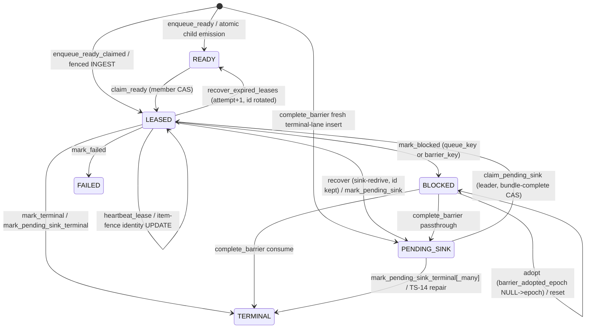

- **Claim.** `claim_ready` (`leases.py:99-154`) discovers the next READY row in the order `(ingest_sequence, step_index, created_at, work_item_id)`,
  then `claim_ready_row` (:156-325) takes the membership row lock `FOR SHARE` (:47-79, serialising against eviction, elspeth-6903f82511), locks the item
  `FOR UPDATE`, re-samples the DB clock, and CASes `READY→LEASED`. A rowcount of 0 is re-probed to separate "row raced away" (return `None`) from
  "evicted" (`RunWorkerEvictedError`).
- **Recovery.** `_rotate_expired_leases` (:554-803) is liveness-aware. It reaps only when the owner is registry-dead (absent, non-active, or heartbeat
  older than grace) or the lease is past the stall budget, and it excludes the caller's own leases and heals NULL-owner wedges. It locks memberships
  before items in sorted order and does one `UPDATE … CASE` per sweep. A transform lease rotates `attempt+1` and `work_item_id`. A sink-redrive lease
  (complete bundle) returns to PENDING_SINK with its identity kept. It emits `RECOVER_EXPIRED_LEASE` events and, for stalled-but-live owners,
  `worker_stalled` coordination events in the same transaction.
- **Dispositions.** `_transition_on` (`dispositions.py:821-980`) is the one CAS for `mark_*`. Its predicate is run + status + lease owner +
  `pending_sink_name IS NULL` (:849), which prevents a sink-redrive lease from being consumed by a transform disposition. Group-loss specs commit in
  the same transaction (:978). A PENDING_SINK park keeps `lease_owner` with NULL expiry (the "attributed park", :246-252), so the strict post-sink
  terminalisers (:311-574) CAS on that owner and the leader epoch.
- **Barrier journal (ADR-029 + ADR-030 §E).** The drain marks a barrier arrival BLOCKED with `barrier_blocked_at` (DB time, :872). The leader's
  per-iteration intake lists rows with `barrier_adopted_epoch IS NULL` (`barrier.py:1138-1169`) and adopts each through `adopt_blocked_barrier_item`
  (:923-1083). In one leader-fenced transaction that does the epoch CAS, plus (aggregation arm) `batch_members` and a BUFFERED outcome *backdated* to
  `barrier_blocked_at`. A firing group completes through `complete_barrier` (:93-490), which validates the consumed/handed-off sets against the durable
  BLOCKED set in both directions. The universe can be narrowed by `scope_row_id` and `intake_snapshot_token_ids` (late arrivals recorded in event
  context). The same transaction terminalises consumed rows, records terminal outcomes, transitions passthroughs to PENDING_SINK, inserts fresh
  terminal-lane PENDING_SINK rows and READY continuations, and records group losses.
- **Group-loss ledger (ADR-042 §E.5 successor).** `group_losses` is append-only, idempotent on `(run, closer, group, member)`, and written in the
  disposing transaction (`group_losses.py:82-179`). The leader replays unadopted rows, then marks `adopted_epoch` (:292-323). Takeover restore reads
  the full ledger (:266-290).
- **Concurrency model.** SQLite relies on `BEGIN IMMEDIATE` (whole-file write slot; `FOR UPDATE`/`FOR SHARE` are no-ops). PostgreSQL relies on
  explicit row locks in a documented global order: memberships → items; tokens → node_states → artifacts (`outcomes.py:138-165`); token-first before
  batch (`batches.py:33-60`). No scheduler transaction is held across plugin I/O (state-engine `architecture.md` "Scope").

### Sink-effect ledger (reserve → prepare → in-flight → finalize)

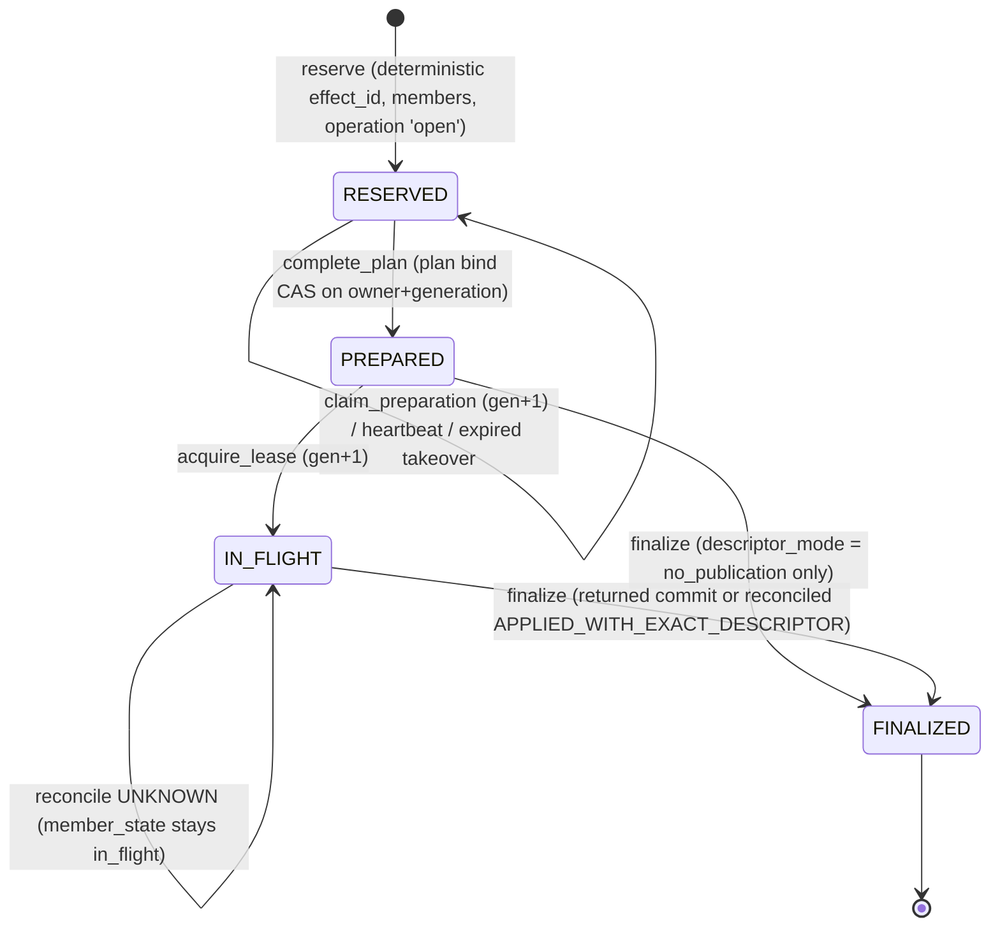

- **Reserve** (`sink_effect_reservation.py:289-552`). The optimistic witness is read outside the fence, then re-validated under a shared `runs` lock
  (must be RUNNING, :342-348), per-token `FOR UPDATE`, and per-current-state `FOR UPDATE` (:350-381). Members already bound are partitioned into
  finalized/open. New members get one deterministic effect, its member rows, a stable `sink_write` operation, and (for replacing targets) a
  stream-tail CAS.
- **Lifecycle** (`sink_effect_lifecycle.py`). Each verb locks the stream, the effect and its predecessor (`_lock_effect`, :954-988), decides lease
  liveness in SQL against a fresh DB sample (`lease_is_live`, :83-97), and bumps `generation` on every ownership change. Attempts are write-ahead:
  `begin_attempt` inserts INTENT (:578-660), then `record_attempt_result` → RETURNED or `mark_response_lost` → RESPONSE_LOST. Each outcome also
  writes a `calls` row under the locked operation.
- **UNKNOWN handling.** `complete_member_result` maps a reconcile `UNKNOWN` to `member_state=in_flight` (:766-771). The effect stays IN_FLIGHT and
  cannot finalize. The closed vocabulary is NOT_APPLIED → commit once, APPLIED_WITH_EXACT_DESCRIPTOR → finalize without commit, UNKNOWN → retain
  durable sink debt. MEASURED at the schema: `ck_sink_effects_lifecycle` (`schema.py:1779-1810`) requires `reconcile_kind IS NULL` in
  reserved/prepared/in_flight and allows only NULL or `applied_with_exact_descriptor` in finalized. The values `unknown` and `not_applied` that
  `ck_sink_effects_reconcile_kind` (:1835) admits are therefore unwritable on the effect row. UNKNOWN evidence lives only in `sink_effect_attempts`
  and member state.
- **Finalize** (`sink_effect_finalization.py:136-395`) runs one leader-fenced transaction in global lock order: tokens → node_states (complete) →
  stream + linked effects. It validates authority (owner, generation, live lease; failsink-to-primary linkage; predecessor finalized) and the plan/
  descriptor/evidence byte-equality against the returned attempt. It then registers the artifact, completes the operation, records outcomes, stamps
  members, advances the stream head (CAS on predecessor), and sets FINALIZED. A replay after commit returns the finalized winner (:704-773).
  `_WitnessChanged` restarts at most 3 times (:68, :146-170).
- **Run abandonment (TS-19).** `OperationRepository.fail_open_effect_operations_for_run` (`operations.py:219-281`) fails `open` effect operations
  inside the terminal run transaction. The `sink_effects` row keeps its last non-final state, because the lifecycle CHECK has no failed/abandoned state.

### Data flow: rows, tokens, outcomes, group lineage (ADR-019, ADR-038, ADR-042)

- **Ingest.** The fenced INGEST (`queue.py:349-460`) composes `DataFlowRepository.insert_row_with_token_on`, the step-0 source COMPLETED node_state
  and the initial enqueue-and-claim on one connection, so a deposed leader leaves no orphan `rows` row.
- **Lineage.** Fork/expand/coalesce/collect write child `tokens`, dense-ordinal `token_parents`, and full-path `token_lineage_frames` (outermost
  first) in one transaction with the parent's terminal outcome (`tokens.py:243-274`). `token_lineage_frames` is the sole lineage read authority
  (ADR-042 §3). `is_release_group` (:83-119) reads the written `group_records.closes_group_id` fact and raises on a missing group row.
- **Outcomes.** There are two writer families.
  - (a) The repository path `record_token_outcome_on` / `record_token_outcomes_on` (`outcomes.py:552-735`) runs: ADR-019 field policy →
    token-first locks → run ownership → ADR-038 decided-vs-ABANDONED refusal → I1c/I3 cross-table witnesses → insert.
  - (b) The barrier-composed `record_buffered_outcome_guarded` / `record_terminal_outcomes_guarded` (:898-996) run only the field policy. The
    barrier caller supplies ownership and duplicate-terminal checks (`barrier.py:290-315`); composite FKs supply run ownership.

## Data & persistence

**Tables written (MEASURED, AST walk of DML call sites in the slice):**

| Table(s) | Writer module(s) |
|---|---|
| `token_work_items` | `scheduler/{work_items,leases,dispositions,barrier}.py` (+ `item_fencing.py:43-54` identity UPDATE, outside the slice) |
| `scheduler_events` · `group_losses` | `scheduler/events.py` · `scheduler/group_losses.py` |
| `sink_effects`, `sink_effect_members`, `sink_effect_streams` | `execution/sink_effect_{reservation,lifecycle,finalization}.py` |
| `sink_effect_attempts` · `sink_effect_export_snapshots` | `sink_effect_lifecycle.py` · `sink_effect_reservation.py` |
| `operations` | `execution/operations.py`, `sink_effect_reservation.py`, `sink_effect_finalization.py` |
| `calls` | `execution/calls.py`, `sink_effect_lifecycle.py:1029-1060` (two allocators) |
| `node_states`, `routing_events` · `artifacts` · `batches`, `batch_members` | `execution/node_states.py` · `execution/artifacts.py` · `execution/batches.py` (+ `data_flow/tokens.py:1607` batch expansion claim) |
| `audit_export_snapshots`, `…_chunks` | `execution/audit_export_snapshots.py` (plus DDL triggers `schema.py:1978-2152`) |
| `rows`, `tokens`, `token_parents`, `token_lineage_frames`, `group_records`, `coalesce_effects`, `coalesce_effect_members` | `data_flow/tokens.py` |
| `token_outcomes` | `data_flow/outcomes.py`, `data_flow/tokens.py` |
| `nodes`, `edges` · `validation_errors`, `transform_errors` | `data_flow/graph.py` · `data_flow/errors.py` |

**Schema epoch:** `SQLITE_SCHEMA_EPOCH = 43` (`schema.py:449`). Live metadata has **47 tables** (MEASURED, `python -c` over
`elspeth.core.landscape.schema.metadata` with `PYTHONPATH` = pin; `elspeth.__file__` confirmed inside the pin). No in-place migration exists:
SQLite refuses any `0 < epoch < 43` store that has Landscape tables (`database.py:1428-1441`), and PostgreSQL refuses any schema-identity mismatch
(`database.py:1347-1353`).

**Invariants in DB vs code (MEASURED, live-metadata probe of CHECK/UNIQUE/FK per table; positive control = `sink_effects` shows `ck_sink_effects_lifecycle`):**

| Table | DB-enforced | Code-only |
|---|---|---|
| `token_work_items` | status ∈ `TokenWorkStatus` (:931); LEASED ⇒ non-empty owner (:919-930); 4 composite FKs; `(run,token,node,attempt)` unique; terminal-lane partial unique (:968-976) | transition graph; PENDING_SINK bundle completeness (`pending_sink_bundle_clause` :979-1027, used inside every CAS); BLOCKED ⇒ queue_key or barrier_key (`dispositions.py:110-114`); LEASED ⇒ `lease_expires_at` non-null |
| `sink_effects` | 18 CHECKs incl. a per-state column-shape lifecycle CHECK (:1779-1810), stream shape, descriptor mode, deferred member/snapshot FKs | the transition *order* (the CHECK constrains shapes, not edges); generation monotonicity |
| `scheduler_events` | event/status vocabularies, attempt ≥ 0, AUTOINCREMENT `seq` | append-only (no trigger); `event_id` deliberately non-unique (:1068-1075) |
| `group_losses` | natural-key unique (`uq_group_losses_natural`, :1322-1330), token FK | append-only; reason ≤64 (`group_losses.py:35-41`, schema-derived) |
| `node_states` | only hash-shape CHECKs; `(token,node,attempt)` and `(token,step,attempt)` unique | **status vocabulary; terminal immutability** (`notin_(terminal_values)` predicate, `node_states.py:547-554`) |
| `token_outcomes` | one completed outcome per token (partial unique, :841-847); composite FKs | **`(outcome,path)` legality, `completed ∈ {0,1}`, ADR-038 contradiction** |
| `batches`, `operations`, `calls` | FKs / hash shapes only | **status vocabularies**, DRAFT-only membership (`batches.py:33-148`) |
| audit-export snapshots | SQLite + PostgreSQL triggers: chain validation and immutability (`schema.py:1978-2152`) | — |

## Dependencies

The package matrix (`temp/import-matrix.md`) buckets all of `core.landscape` together, which is too coarse for this slice. The rows below come from an
AST sub-package import walk at the pin (MEASURED; control: `execution_repository.py:72 → execution` must appear, and it does).

- **Inbound** (importer → sub-package, module-level/lazy/TYPE_CHECKING):
  - `engine.executors → execution` 4/0/0; `engine.orchestrator → execution` 2/2/0.
  - `engine.processor → scheduler` 2/0/1; `engine.{barrier_coordination, journal_restore}` 1+1/0/1+1; five other engine modules TYPE_CHECKING-only.
  - `core.checkpoint → scheduler` 2/0/0; `web._aws_ecs_acceptance → scheduler` 1/0/0.
  - Intra-landscape: facades, `factory.py`, and `run_lifecycle_repository.py → data_flow` 2 + `execution` 1.
  - Package-level cross-check: the matrix rows `engine → core.landscape` 61/5/33 and `mcp → core.landscape` 13/21/0 are consistent.
    `mcp`, `tui` and `web.*` reach this slice only through the facades or `core.landscape.__init__`, except for the one acceptance import.
- **Outbound:** `contracts` (every sub-package; heaviest are `contracts.scheduler`, `.sink_effects`, `.coordination`, `.errors`); `core.canonical`;
  `core.ids`; Landscape siblings (`schema`, `database`, `database_clock`, `run_coordination_repository` for the fences, `model_loaders`,
  `_database_ops`, `lease_deadlines`, `item_fencing`); `core.checkpoint` (data_flow module-level 1, scheduler lazy 2).
- **Intra-slice edges (MEASURED).** Together these make the three sub-packages one strongly connected set; they are not layered:
  - `execution → scheduler`: `source_completion_recovery.py:17` (`payload_codec`).
  - `scheduler → execution`: `barrier.py:36` (`add_batch_member_guarded`).
  - `scheduler → data_flow`: `barrier.py:33`.
  - `execution → data_flow`: `sink_effect_finalization.py:37-38`.
  - `data_flow → execution`: TYPE_CHECKING, `tokens.py:67`.
  - `scheduler → facades` (lazy): `queue.py:394-395`, which imports `DataFlowRepository`/`ExecutionRepository` for exact-type checks. Its comment
    names the cycle it avoids.
- **Cross-package cycle carriers touching this slice:**
  - `core.landscape ↔ core.checkpoint`. `data_flow/tokens.py:32` imports `core.checkpoint.serialization.checkpoint_dumps` at module level, while
    `scheduler/payload_codec.py:31-33,45-46` *defers* the same import with a comment naming this very cycle. Reverse edge:
    `core/checkpoint/recovery.py:46-47` imports `BarrierJournalRepository`, `SchedulerEventStore`, `collector_barrier_key`. This is one of the arms
    that makes `core*` one SCC in the package matrix.

## Patterns observed

- **Facade + cohesive components** (legacy issue tracker elspeth-ef9c36d767, -c227effc89, -b194136580). God classes were split into one module per aggregate
  behind unchanged facades. All production callers still use the flat delegators (0 component-attribute uses, MEASURED).
- **Optimistic witness outside, exact re-validation inside the fence.** Used in reserve (`reservation.py:319-381`), finalize
  (`finalization.py:182-243`, bounded restart), and audit-export reserve (`reservation.py:554-589`).
- **Connection-accepting `_on` helpers** compose several aggregates into one caller transaction (`enqueue_ready_claimed_on`,
  `record_token_outcomes_on`, `complete_node_states_completed_many`, `add_batch_member_guarded`). Their safety depends on the caller having fenced
  the connection. Both callers of `enqueue_ready_claimed_on` (`queue.py:216,439`) and of `claim_ready_row` (`leases.py:141`, `queue.py:337`) are
  inside a member or leader fence (MEASURED).
- **Deterministic identities everywhere.** `work_item_id`, `effect_id` / `artifact_id` / idempotency key / member ids (`_labeled_hash`),
  `attempt_id` (`lifecycle.py:130-141`) and `call_id`. The effect identity is computed twice: by the engine (`sink_effect_identity.py:273-346`) and by
  the repository (`sink_effect_reservation.py:110-161`, with limits hard-coded at :125). Parity is test-pinned
  (`tests/unit/core/landscape/test_sink_effect_reservation.py:127`).
- **Clock discipline (ADR-047).** Every lease/claim/expiry decision reads `read_landscape_decision_time` after its locks, and the scheduler stamps
  `updated_at`/events with DB transaction time. Execution and data_flow audit rows (`node_states.started_at/completed_at`, `token_outcomes.recorded_at`,
  attempt `started_at/completed_at`, `prepared_at`, `finalized_at`) use the process clock `_helpers.now()` (MEASURED: 42 call sites across 11 slice
  files). ADR-047:224-226 permits this for forensic timestamps. Two process-clock columns are nonetheless load-bearing:
  - `complete_plan` *selects* the bound inspect attempt by process-clock `completed_at` (`lifecycle.py:268-277`).
  - `get_attempts` / `get_attempts_for_run` order the call witness by `started_at` (`lifecycle.py:668`, `sink_effects.py:306-310`).
  A synthesised `created_at` (`barrier.py:480`, DB time minus N µs) is load-bearing for claim order (`leases.py:124-133`).
- **Test seams in production code.** `_after_*_lock` / `_after_commit` no-op hooks. `_backend_pid` issues `SELECT pg_backend_pid()` on every
  lock-seam call on PostgreSQL (`reservation.py:357,369,381`; `lifecycle.py:987`; `finalization.py:237,256,470`), even though the hooks are inert
  in production.
- **Fail-closed Tier-1 posture.** Every rowcount mismatch or divergent replay raises `AuditIntegrityError` / `LandscapeRecordError`, and diagnostics
  redact payload fields (`work_items.py:28,62-68`).

## Invariants & how they are enforced

| Invariant | Enforcement |
|---|---|
| Every Landscape mutation takes one exact, keyword-only authority token whose fence is the first DB effect (ADR-048) | **Test (whole-tree AST gate)** `tests/unit/architecture/test_web_landscape_mutation_fencing.py` (19,221 lines; pins the DML inventory, caller set, and transaction first-effect) + runtime `isinstance` checks (`fencing.py:14-22`, `queue.py:397-406`) |
| LEASED ⇒ owner present | **DB CHECK** `schema.py:919-930` |
| Claim/disposition CAS, owner match, no self-reap, sink-redrive subtype | **Code** SQL predicates (`leases.py:212-233,595-598`; `dispositions.py:841-852`) |
| Claimant membership serialised against eviction | **Code** `FOR SHARE` on `run_workers` (`leases.py:47-79`). The lenient N=0 arm of `claim_verb_fence_clause` (`schema.py:1358-1388`) is unreachable from `claim_ready` because `fenced_member_transaction` verifies membership first (`run_coordination_repository.py:570-603`) |
| PENDING_SINK carries a complete redrive bundle | **Code** `pending_sink_bundle_clause` in every claim/CAS/recovery predicate; not a CHECK |
| Barrier completion exhaustive over the durable ∩ snapshot set | **Code** `barrier.py:342-438` |
| No double BUFFERED on adoption | **Code** adoption CAS marker only (`barrier.py:995-1047`; `token_outcomes` has no non-terminal uniqueness, stated at :943-946) |
| One completed outcome per token | **DB** partial unique index (`schema.py:841-847`) |
| `(outcome,path)` legality; decided ≠ ABANDONED | **Code** `_validate_outcome_fields` (`outcomes.py:276-320`), `_refuse_abandonment_contradiction` (:249-273). The latter is repository path only |
| Terminal node_state immutable | **Code** only (`node_states.py:547-578`) |
| Sink-effect per-state column shape | **DB CHECK** `ck_sink_effects_lifecycle` |
| Effect finalized only with live lease + exact returned evidence + predecessor finalized | **Code** `finalization.py:473-539,594-671` |
| Audit-export snapshot sealed/immutable | **DB triggers** (both dialects) |
| Group loss idempotent; conflicting token ⇒ corruption | **DB** unique + **Code** post-insert compare (`group_losses.py:147-168`) |
| Scheduler events replay order | **DB** AUTOINCREMENT `seq`; readers order by `seq` (`events.py:219`) |

## Baseline delta — ARCHITECTURE.md says / tree says

| Baseline claim (ARCHITECTURE.md, ADRs, state-engine hub) | Pinned tree shows | Evidence |
|---|---|---|
| ARCHITECTURE.md: "Schema — 46 tables and epoch-38 invariants" (:267, :300) | **47 tables, epoch 43**; `run_start_admissions` absent from the baseline table list (:310-331) | MEASURED live metadata probe; `schema.py:449,564` |
| ARCHITECTURE.md "Terminal states" table (:590-603): COMPLETED/ROUTED/FORKED/CONSUMED_IN_BATCH/… single-axis | Tree is ADR-019 two-axis: `outcome ∈ {success,failure,transient,NULL}` × `path`; the single-axis names are retired | `schema.py:815-827`; `outcomes.py:276-320` |
| ARCHITECTURE.md component table maps `SchedulerRepository` / `ExecutionRepository` / `DataFlowRepository` to single files | Each is a facade over a sub-package (scheduler 12 files / 6,519 lines, execution 14 / 8,337, data_flow 7 / 4,299); the sub-packages are not shown | MEASURED `wc -l`; package `__init__` docstrings |
| ADR-026 cites `scheduler_repository.py (2163 LOC)` with line ranges (:82, :122, :135, :979-1008, :1729-1833) | Facade is 782 lines; every cited line range is stale. The logic lives in `scheduler/{leases,dispositions,barrier}.py` | `wc -l`; `scheduler_repository.py:1-20` |
| ADR-026 D4 and the state-engine hub: tokenless harnesses use `recover_expired_leases_legacy_unfenced`; "legacy unfenced recovery is separately named" | Removed in `75448fe17`. Only the strict leader-fenced `recover_expired_leases` exists. Stale text remains in ADR-026, ADR-048 and `docs/specs/2026-08-22-worker-affinity-…DRAFT.md` | MEASURED `git log -S`, positive control `leases.py:484` |
| ADR-026 "What this is NOT": every scheduler transition writes a `scheduler_events` row (G29 closed) | The adoption CAS (`barrier.py:995-1003`) and marker reset (:1235-1240) mutate `token_work_items` with **no** event; `SchedulerEventType` has no ADOPT/RESET member | `contracts/scheduler.py:26-39` |
| ADR-026 D9: scrubbed payload "retains the payload's identity via the hash" | `payload_hash` = sha256 of an *anchor* string, not the payload: `work_item_id` (`dispositions.py:151`), `token_id` (:369) or `barrier_key` (`barrier.py:529`, so all rows consumed by one barrier share one hash) | `payload_codec.py:69-71` |
| ADR-029 §E.5 and amendment: durable loss truth is `coalesce_branch_losses` | Table retired; the successor is `group_losses` (ADR-042). ADR-029 carries no supersession note; code comments still use the old name (`engine/token_traversal.py:50,423`) | `group_losses.py:1-2` |
| ADR-048 status "Proposed" (and ARCHITECTURE.md:1059 "(Proposed)") | Fully threaded and gate-enforced: every slice mutation verb takes an exact token | fencing gate header; `sink_effects.py:52-60` |
| State-engine `architecture.md` "Write ownership": `token_work_items` mutations confined to 4 scheduler files | Also `item_fencing.py:43-54`, an identity `UPDATE … SET status='leased'` used as a row lock | MEASURED AST DML walk |
| State-engine hub "Current verdict: **Not complete**", baseline `2b4b04a8a`, epoch 32, 73 legs all `unknown` | The hub is 11 epochs and ~5 weeks behind the pin; the proof state at the pin is unassessed. Missing coverage: the hub is not referenced from ARCHITECTURE.md's Landscape section | `docs/architecture/state_engine/README.md`, `proof-matrix.md` |
| ARCHITECTURE.md omits | the sink-effect state machine and UNKNOWN semantics, the barrier adoption epoch, the group-loss ledger, the TS-19 abandonment sweep, the DB-clock doctrine, and the ~15-table cross-aggregate restore read model | — |

## Concerns

| ID | Sev | Concern | Evidence (pin) | Status |
|---|---|---|---|---|
| S04-C1 | Medium | Barrier adoption (`NULL→epoch`) and marker reset (`epoch→NULL`) are state changes on `token_work_items` that write **no `scheduler_events` row**. For coalesce adoptions (`membership=None`, no BUFFERED outcome) the adoption *fact* is only inferable from the PENDING hold node_state that `accept()` writes afterwards (`barrier.py:1180-1184`). Its *epoch and timing*, and any reset, survive only as the column's current value. This contradicts ADR-026's G29-closed claim. MEASURED. | `barrier.py:995-1003`, `:1235-1242`; `contracts/scheduler.py:26-39` | NEW |
| S04-C2 | Medium | Status / terminal-state vocabularies of the core audit tables are **code-only**: `node_states.status` and terminal immutability, `token_outcomes (outcome,path,completed)`, `batches.status`, `operations.status`. The scheduler and sink-effect tables, by contrast, carry vocabulary and lifecycle CHECKs. A direct-SQL or alternate-writer path can persist an illegal state that only a loader catches on read. The hash-column census (2026-09-21) scoped itself to hash columns only. MEASURED. | metadata probe; `schema.py:1405-1449,808-847`; `node_states.py:547-578` | NEW |
| S04-C3 | Medium (INFERRED) | `complete_plan` binds the latest RETURNED INSPECT attempt ordered by process-clock `completed_at` with **no `generation` predicate**. After a preparation takeover, a new owner's plan can cite the deposed generation's inspection (`inspection_attempt_id` → `precondition_hash`). The state-engine doc requires "must not bind a plan from a stale preparation generation". The takeover test uses a no-inspection plan. Not executed. | `sink_effect_lifecycle.py:262-280`; `tests/unit/core/landscape/test_sink_effect_lifecycle.py:268-302` | NEW |
| S04-C4 | Medium | `SourceCompletionReconciler` repairs "pre-fix TS-02 images" (a LEASED root item at attempt 1 / step 1 with no source COMPLETED witness). It still runs a full LEASED-root scan and validation on every resume (`processor.py:4171`).<br>**Old stores (MEASURED):** the fix landed at epoch 29 (`a85b29c4e`), and both dialects refuse every non-43 store.<br>**Current code (INFERRED):** no path produces the image. `process_row` composes the ingest (`processor.py:2734`). `_record_source_and_start_traversal` writes the witness *before* its separate enqueue-and-claim (:2658-2665). The ECS acceptance harness creates a root row+token and then `enqueue_ready_claimed` (`web/_aws_ecs_acceptance/bedrock.py:752-777`), but at `step_index=0`, which the reconciler would *refuse* (`source_completion_recovery.py:48-53`) rather than repair.<br>This is effectively unreachable compatibility code, not unfinished intent. It is a maintainer removal decision. | `source_completion_recovery.py:124-215`; `database.py:1347-1353,1428-1441`; `git show a85b29c4e:…schema.py` → epoch 29 | NEW |
| S04-C5 | Low | The three sub-packages are one import SCC (execution↔scheduler↔data_flow), and `queue.py` lazily imports the facades that compose it. `data_flow/tokens.py:32` imports `core.checkpoint` at module level while `payload_codec.py:31-33` defers the same import to dodge the cycle. MEASURED. | see Dependencies | NEW |
| S04-C6 | Low | The ADR-038 decided-vs-ABANDONED refusal is applied on the repository writer path only; the barrier-guarded writers skip it. It is reachable only if a barrier completes after non-resumable run finalization, which the leader fence should prevent (INFERRED). | `outcomes.py:614,686` vs `:898-996` | NEW |
| S04-C7 | Low | Sink-effect ledger has no terminal non-published state. After TS-19 the `operations` row says `failed`, but `sink_effects` stays reserved/prepared/in_flight (possibly with a lapsed lease), and `reconcile_kind='unknown'/'not_applied'` are admitted by one CHECK yet unwritable per the lifecycle CHECK (dead vocabulary). Readers must join `operations` and `sink_effect_attempts` to learn an effect's fate. | `schema.py:1772,1779-1810,1835`; `operations.py:219-281` | NEW |
| S04-C8 | Low | Production round-trips for inert test seams. On PostgreSQL, `_backend_pid()` runs `SELECT pg_backend_pid()` per member-token lock and per state lock in reservation (2N extra round trips per N-member batch) and at each finalize/lifecycle lock seam. Reservation also runs one `FOR UPDATE` per token and per state instead of chunked locks. | `sink_effect_reservation.py:350-381,961-965`; `lifecycle.py:987,1076-1080`; `finalization.py:819-823` | NEW |
| S04-C9 | Low | Two `calls` writers with different `call_id` schemes and allocators: `call_{operation_id}_{n}` with a process-local counter + collision remap (`calls.py:169-230`), and sha256 `sink-effect-call-v1` with `max+1` under the operation lock (`lifecycle.py:1029-1060`). Safe under the shared operation lock (INFERRED), but it is one table with two identity grammars. | as cited | NEW |
| S04-C10 | Low | Stale or vestigial text and code: the `peer_active_leases` docstring says the deployment-shape ADR is "not yet authored" and "returns () for every supported deployment" (ADR-030 Accepted, N>1 shipped); the facade's `_ready_work_item_values` test seam (1 test user); `after_rows = after_rows` (`node_states.py:706`); a redundant `if rows:` after `if not rows: raise` (`dispositions.py:358-361`); the `begin_node_state` docstring documents a non-existent `run_id` arg (:119). | `leases.py:961-967`; `scheduler_repository.py:250-292` | NEW |
| S04-C11 | Low | A group-loss reason conflict (first record wins) is only `logger.warning`-ed. The divergence is audit-relevant but never reaches Landscape, contrary to audit primacy. | `group_losses.py:169-178` | NEW |

No review under `docs/reviews/` (pin) or `docs/arch-analysis-2026-09-07-web-split/` covers these paths. MEASURED: `grep -rl` for the three paths
returned only the web-split file-ownership CSV/txt, and the 79-issue web review has no finding anchored in this slice (R12 concerns
`web/execution/service.py`). The state-engine hub's open proof lanes (`elspeth-29a7f5a21a`, `elspeth-efb47cb5fd`) are the tracker owners for the
unproven process-death and PostgreSQL cells, and they overlap C3.

## Complexity & tech-debt hotspots

Largest units (MEASURED, AST node spans):

- `RowTokenRepository` 2,040 lines (`tokens.py:122`). Its methods are `expand_token` 335, `coalesce_tokens` 294, `collect_tokens` 233,
  `fork_token` 140, `finalize_coalesce_effect` 116.
- `BarrierRestoreReadModel` 1,246 lines. Its methods are `list_committed_aggregation_output_receipts` 225, `list_committed_aggregation_residuals`
  224 (two per-child queries inside a loop, :1054-1065), and `get_committed_coalesce_residual` 142.
- `NodeStateRepository` 1,238 lines; `CallAuditRepository` 819; `TokenOutcomeRepository` 807 (`_validate_cross_table_invariants` 149);
  `record_call` 164.
- `complete_barrier` 398 lines, `_rotate_expired_leases` 250.

Fused responsibilities:

- `tokens.py` writes 9 tables across the lineage, outcome, group, coalesce-effect and batch aggregates.
- `restore_read_model.py` sits in `scheduler/` but reads 15 tables of every aggregate.
- `sink_effect_finalization.py` instantiates private `NodeStateRepository` / `TokenOutcomeRepository` / `ArtifactRepository` copies (:117-134)
  outside factory composition, and calls another class's private `_validate_outcome_fields` (:174).

Vestigial or dead code: C4, C10, the `legacy_artifact_query` arm (`outcomes.py:384-409`) for the retired non-effect sink path (INFERRED), and the N=0
lenient fence arm (see the Invariants table). A TODO/FIXME scan found none in the slice (MEASURED:
`grep -rnE "TODO|FIXME|XXX" core/landscape/{execution,scheduler,data_flow}` returned 0). The same grep returns 0 across all of `src/elspeth`, so
the markers appear to be absent tree-wide. The instrument itself was controlled: it matches a planted `# TODO` probe file and hits
`docs/maintainer/toolchain.md`. Debt markers in this slice live in prose (legacy issue tracker ids, "legacy" docstrings), not in TODO comments.

## Test map

MEASURED: files importing slice modules or facades:

| Directory | Files |
|---|---:|
| `unit/core` | 54 |
| `unit/engine` | 33 |
| `e2e/recovery` | 11 |
| `testcontainer/core` (PostgreSQL) | 9 |
| `integration/pipeline` | 9 |
| `unit/architecture` (incl. the 19,221-line fencing gate) | 3 |
| `property` (incl. `test_scheduler_work_item_lifecycle_state_machine.py`, `test_sink_effect_identity_properties.py`) | 4 |

Notable coverage:

- Sink-effect process-death and deployment-profile matrices (`e2e/recovery/test_sink_effect_*`).
- The PostgreSQL lock-order, decision-clock, eviction-serialisation and read-model truth-table suites (`testcontainer/core/*`).
- The barrier process-death matrix.

Gaps:

- Cross-generation inspect-attempt selection (C3).
- No test asserts a `scheduler_events` row for adoption/reset (C1; consistent with there being none).
- The state-engine hub reports all 73 legs `unknown` with the PostgreSQL/AWS and live-provider lanes unexecuted, at its stale baseline.
- No test was run for this analysis.

## Confidence

**High** for architecture, state machines, fencing and DB-vs-code enforcement.

- **Read fully:** `fencing`, `payload_codec`, `work_items`, `events`, `queue`, `leases`, `dispositions`, `barrier`, `group_losses`, `read_model`,
  `sink_effects`, `sink_effect_lifecycle`, `sink_effect_reservation`, `sink_effect_finalization`, `source_completion_recovery`; `outcomes.py` 1-996;
  `item_fencing.py`.
- **Read in part:** `sink_effect_identity.py` 100-434; `tokens.py` 1-330 and 1356-1465; `node_states.py` 1-180 and 460-764; `restore_read_model.py`
  1-240 and 700-1100; `batches.py` 33-150; `operations.py` 219-281; the relevant `schema.py` tables; ADR-026/029/042/047/048 decision sections; the
  state-engine hub `architecture.md`, `proof-matrix.md`, `README.md`.
- **Outline only:** `calls.py`, `audit_export_snapshots.py`, `graph.py`, `errors.py`, `ownership.py`, `serialization.py`,
  `sink_effect_attempt_results.py`; `tokens.py` fork/coalesce/collect bodies; `restore_read_model.py` 240-700 and 1100-1371.
- **Every dependency and count claim is MEASURED** (sub-package AST walk, live-metadata probe, DML walk, each with a stated control).

Caveats and information gaps:

- **Unexecuted:** C3, C6, C9, the current-code half of C4 (a caller walk over `processor.py` entry points and the ECS acceptance harness; not
  exhaustive over test/harness callers), and the per-child N+1 cost are INFERRED from code; no test or PostgreSQL run was executed.
- **retired code index not consulted:** its index is stale (≈`ee04378f8`), so every caller claim here comes from greps and the AST walk at the pin.
- **Runtime behaviour** (lock contention, the real clock skew between hosts in the AWS single-leader profile, and whether UNKNOWN debt ever wedges
  a run's completion) is not knowable statically. Engine-side handling of UNKNOWN and IN_FLIGHT debt at run close belongs to the engine slice.
- **Risk:** Implementation risk of acting on these findings is Medium (fixes touch Tier-1 schema/epoch and fenced verbs). Reversibility is
  Moderate, since every schema change is an epoch bump with no migration.
- **Required follow-ups:**
  1. Maintainer ruling on C1 (add ADOPT/RESET event types, which is an epoch bump for the `event_type` CHECK).
  2. Confirm C3 with a two-generation inspect test.
  3. Decide on C4 removal.
  4. Decide whether C2's vocabularies warrant CHECKs (epoch bump).
  5. Refresh the stale ADR text (026 line refs + legacy verb, 029 table name, 048 status) and the state-engine hub baseline.

## Validation corrections

- [validator] `payload_codec.py:78-80,92-93` (the deferred `checkpoint_dumps`/`checkpoint_loads` imports that dodge the cycle) -> **`:31-33,45-46`**. Lines 78-99 are `token_from_journal_item`, which contains no import (`cat -n core/landscape/scheduler/payload_codec.py` at the pin). Corrected in Dependencies and in S04-C5.
- [validator] `payload_codec.py:116-118` (the ADR-026 D9 scrubbed-payload anchor hash) -> **`:69-71`** (`scrubbed_row_payload_json`). The file is only 99 lines, so the original citation was out of range. The substance (sha256 of an anchor, not of the payload) is confirmed, and the anchor call sites `dispositions.py:151,369` and `barrier.py:529` match.
- [validator] Baseline citation ARCHITECTURE.md (:265, :299) -> **(:267, :300)** (the component diagram "46 tables and epoch-38 invariants" is at :267, and the Schema row is at :300; `grep -n '46 tables\|epoch-38' ARCHITECTURE.md`).


---

# S05 — Engine Orchestration (run lifecycle, resume/recovery, leader/follower coordination)

**Location:** `src/elspeth/engine/orchestrator/` (42 modules) plus the engine-root modules
`bootstrap.py`, `commencement.py`, `journal_restore.py`, `scheduler_drain.py`, `work_items.py`,
`scheduler_work_codec.py`, `dependency_resolver.py`, `spans.py`, `retry.py`, `clock.py`,
`_best_effort.py`, `error_boundary.py`. All paths are relative to `src/elspeth/engine/` at the pin
(`release/0.8.1` @ `85ebf2739`, detached worktree `.claude/worktrees/arch-analysis-pin`).

**Measured size:** 18,994 lines in 54 files. `orchestrator/` accounts for 14,820 lines (42 files)
and the 12 engine-root modules for 4,174.

```
$ cd <pin>/src/elspeth/engine && ls orchestrator/*.py | wc -l      -> 42
$ cat orchestrator/*.py | wc -l                                    -> 14820
$ cat bootstrap.py commencement.py journal_restore.py scheduler_drain.py work_items.py \
      scheduler_work_codec.py dependency_resolver.py spans.py retry.py clock.py \
      _best_effort.py error_boundary.py | wc -l                     -> 4174
$ wc -l <all 54 files>                                             -> 18994 total
```

**Responsibility:** This slice owns one pipeline run from admission to terminal record. It covers
the fresh-run lifecycle (begin → register → drain → sink → finalize → export), crash resume
from the durable scheduler journal and checkpoints, the one-leader/claim-only-follower worker
shape (ADR-030/041) with its heartbeat, seat and fencing discipline, pre-run commencement gates
and dependency pipelines, operator abandonment of leaderless runs (ADR-038), and
audit-derived terminal status. Telemetry is emitted only after the Landscape write succeeds.

---

## Key components

Every file over 300 lines has its own row. The smaller files are grouped at the end.

| File | Lines | Role |
|---|---:|---|
| `orchestrator/resume.py` | 1,537 | `ResumeCoordinator` (934-line class, `:556`). It runs three read-only entry guards (status `:986-994`, checkpoint currency and topology `:1010-1039`, implementation compatibility `:1041-1047`, group satisfiability `:1056-1058`), then takes the **seat CAS as the first durable act** (`:641`, `:827-844`). It computes the post-CAS work set (`:689`), repairs batches (`:846-864`), runs the resume loop (`:180-456`) and finalizes from the audit trail (`:866-924`). `handle_incomplete_batches` is at `:1492-1537`. |
| `scheduler_drain.py` | 1,194 | `SchedulerDrainCoordinator` (921-line class, `:274`). `drain_claims` (424 lines, `:422-845`) is the claim → process → disposition loop over `token_work_items`. It has four disposition arms: BLOCKED `:735-757`, PENDING_SINK `:759-797`, FAILED `:798-816` and TERMINAL `:817-834`. It also runs leader maintenance (evict before reap, `:350-409`), pending-sink crash recovery (`:847-895`), the per-claim lease heartbeat (`:1048-1098`) and the `ProcessorMode` enum (`:88-110`). |
| `journal_restore.py` | 1,004 | Validating hydrators for crash resume: `CoalesceJournalRestorer` `:95`, `CollectorJournalRestorer` `:445` and `AggregationJournalRestorer` `:808`. Each validates the journal's BLOCKED rows against audit-derived inputs, raises `AuditIntegrityError` on any disagreement, and returns frozen state that the executor applies. |
| `orchestrator/preflight.py` | 943 | A mixed module. It holds the sink-effect capability admission authority (a process-local weak-key receipt registry, `:117-148`, `:426-514`, `:535-553`), `assemble_and_validate_pipeline_config` (`:589`), and value-source compliance and catalog checks (`:674-943`). It is imported by web, composer, plugins and CLI (see Dependencies). |
| `orchestrator/source_iteration.py` | 860 | `SourceIterationDriver`: the per-source row loop (`run_main_processing_loop` `:475-860`) inside `track_operation(source_load)` (`:527-537`). It holds the quarantine fast path with timeout sweeps (`:661-727`), the idle-timeout pump (`:561-572`), the source lifecycle states LOADING/EXHAUSTED/INTERRUPTED/LOADED (`:547-554`, `:814-846`) and progress events. |
| `orchestrator/run_lifecycle.py` | 777 | `RunLifecycleCoordinator` is the fresh-run owner. The DATABASE phase (`:155-283`) mints the epoch-1 seat together with `begin_run`. `run()` (`:407-777`) orders the heartbeat, the run span, finalize, checkpoint delete, export and seat release. The crash-behaviour contract is written in its docstring (`:7-17`). |
| `orchestrator/follower.py` | 643 | `FollowerProcessor` drains through claims only (`:163-486`). `build_follower_processor` (`:489-643`) builds a `ProcessorMode.FOLLOWER` RowProcessor through the shared builder with **`settings=None`** (`:613`). |
| `orchestrator/outcomes.py` | 639 | Accumulates row outcomes into `pending_tokens` (`:300`), handles coalesce and row-union timeouts and EOF flushes (`:448-639`), and reconciles diversions (`:219`). Sampled (function list only). |
| `spans.py` | 633 | `SpanFactory` (`:213`): OpenTelemetry or TelemetryManager delivery with a no-op fallback, a cross-thread `trace_scope` for resume and follower paths (`:273`), and run/source/row/transform/gate/aggregation/sink spans. Sampled (header and definitions). |
| `orchestrator/heartbeat.py` | 565 | `RunHeartbeatThread` (daemon, `:243`). One BEGIN IMMEDIATE beat covers `run_workers` and the seat. The loop latches `coordination_lost` and `fatal` and never raises on its own stack. Lock contention counts as BUSY, meaning liveness is unknown (`:93-131`, `:481-514`). `stop()` is bounded and raises `TimeoutError` rather than release a seat mid-beat (`:254-275`). |
| `orchestrator/audit_export_effects.py` | 557 | Snapshot preparation and effect execution for the post-run audit export. Sampled (function list only). |
| `orchestrator/leader_drain.py` | 544 | `LeaderDrainCoordinator.execute_run` (`:101-421`) runs, in order: seq-0 checkpoint → graph registration → plugin on_start → runtime preflights → sequential multi-source ingest → peer-lease wait → unresolved-work invariant → sink flush → follower PENDING_SINK drain → deferred-invariant sweep. `run_end_of_input_barrier_flush` (`:435-544`) is the §D intake/trigger/flush fixpoint. |
| `orchestrator/export.py` | 501 | Landscape export phase and `resume_audit_export` (`:364`). Sampled (function list only). |
| `orchestrator/processor_factory.py` | 496 | `build_row_processor` (359 lines, `:138-496`) is the single RowProcessor assembly point for LEADER, resume and FOLLOWER, with mode gates at `:207`, `:234`, `:293`, `:323`, `:391` and `:421`. |
| `orchestrator/core.py` | 408 | The `Orchestrator` facade (`:86`). `__init__` wires 11 collaborators (`:102-183`). Public `run` (`:215`), `resume` (`:350`) and `join_run` (`:390`) each delegate to exactly one coordinator. Test-seam delegators are bound at call time. |
| `orchestrator/sink_flush.py` | 401 | `SinkFlushCoordinator`: grouped `SinkExecutor.write` per pending outcome (`:130-332`), checkpoint-progress and scheduler-terminalization callbacks (terminalization batched in 64s, `:59-85`), and a shutdown checkpoint followed by `GracefulShutdownError` (`:390-401`). |
| `orchestrator/run_status.py` | 368 | Audit-derived terminal status and counters (`:133-251`), the live-vs-audit parity assertion (`:292-340`), the bound-group settlement post-condition (`:40-72`) and the CLI exit-code map (`:343-368`). |
| `orchestrator/validation.py` | 352 | Route, error-sink, quarantine and failsink destination validators. Sampled (function list only). |
| `orchestrator/ports.py` | 329 | About 20 narrow `Protocol` ports onto RowProcessor. None is `runtime_checkable` (measured: 0 hits in the slice). |
| `orchestrator/schema_reconstruction.py` | 329 | Rebuilds pydantic source schemas from `run_sources.schema_json` for typed resume. Not read. |
| `orchestrator/ceremony.py` | 326 | `RunCeremony`: telemetry and EventBus emission, INTERRUPTED/FAILED finalize-then-emit ceremonies (`:213-326`), and `safe_flush_telemetry`, which lets Tier-1 errors through (`:169-211`). |
| Smaller orchestrator modules (21 files, 11–293 lines) | 4,037 | `checkpointing.py` (293; `CheckpointCoordinator`), `abandon.py` (282; `elspeth abandon`), `aggregation.py` (263), `run_state.py` (256), `landscape_registration.py` (251), `quarantine_router.py` (248), `cleanup.py` (247), `graph_registration.py` (238), `graph_wiring.py` (230), `run_context_factory.py` (222), `idle_timeout_pump.py` (206), `leader_follower_drain.py` (174), `join_admission.py` (174), `counter_classification.py` (170), `bootstrap.py` (151; `prepare_for_run`), `source_lifecycle_recorder.py` (130), `runtime_preflight.py` (109), `value_source_validation.py` (81), `__init__.py` (72; lazy PEP 562 exports), `implementation_compatibility.py` (55), `shutdown.py` (62), `authority_guard.py` (32), `plugin_types.py` (11). |
| Engine-root small modules | 1,343 | `work_items.py` (281; the `WorkItem` cursor), `dependency_resolver.py` (220; `depends_on`), `scheduler_work_codec.py` (157), `retry.py` (158; tenacity `RetryManager`), `commencement.py` (145; gate evaluation), `bootstrap.py` (141; `resolve_preflight`), `clock.py` (119), `_best_effort.py` (94), `error_boundary.py` (28). |

---

## Public interface / entry points

**Python API (the only kind of surface this slice exposes; it has no HTTP routes):**

| Symbol | Where | Callers (measured by grep over `src/`) |
|---|---|---|
| `Orchestrator(db, …).run(config, graph, settings, payload_store=…, run_id=…, run_start_permit=…, pre_effect_guard=…, check_coordination_latch=…)` | `orchestrator/core.py:215` | `cli.py` (run and the `_orchestrator_context` family; `settings=config` at `cli.py:1559`, `:1676`, `:2648`), `web/execution/service.py:3648` (constructs one Orchestrator per run; `settings=settings` at `:3711`, `:3720`) |
| `Orchestrator.resume(resume_point, config, graph, …)` | `core.py:350` | `cli.py` (`elspeth resume`), `web/execution/service.py` (ACA handoff and resume) |
| `Orchestrator.join_run(run_id, settings)` → `WorkerMembershipToken` | `core.py:390` | `cli.py:159`, `cli.py:4111` (`elspeth join`) **only** |
| `build_follower_processor(...)` → `FollowerProcessor.run(ctx)` | `orchestrator/follower.py:489` | `cli.py:4211`/`:4243` **only**; the web tier never spawns followers |
| `inspect_leaderless_run` / `abandon_leaderless_run` | `orchestrator/abandon.py:168`, `:247` | `cli.py` (`elspeth abandon`). The web orphan reaper (`web/app.py:355`) duplicates the same CAS → `complete_run(INTERRUPTED)` mechanism inline. |
| `prepare_for_run()` | `orchestrator/bootstrap.py:30` | `run_lifecycle.py:477`, `resume.py:1066`, `web/coordination/approval_authority.py`, `web/_aws_ecs_acceptance/bedrock.py` |
| `resolve_preflight(config, settings_path, probes=, runner=)` | `engine/bootstrap.py:18` | `cli.py` (two sites) |
| `preflight.{assemble_and_validate_pipeline_config, require_sink_effect_admission, execution_sinks_for_runtime, check_config_value_sources, validate_value_source_compliance, …}` | `orchestrator/preflight.py` | `web/execution/{service,validation,preflight}.py`, `web/composer/tools/_common.py`, `plugins/infrastructure/runtime_factory.py`, `cli.py` (8 import sites) |
| `run_status.cli_completion_for` | `run_status.py:343` | `cli.py` (exit-code taxonomy 0/1/2/3) |
| `export.{audit_export_resume_refusal, resume_audit_export}` | `export.py:307`, `:364` | `cli.py` |
| `PipelineConfig`, `RunResult`, `ExecutionCounters`, `RouteValidationError`, `RowPlugin` | `orchestrator/types.py`, `__init__.py:50-59` | CLI, web.execution, `testing/` |

**CLI verbs whose engine lives here** (defined in `cli.py`, outside this slice): `run`, `resume`,
`join`, `abandon`, and the export resume path.

**Runtime protocols consumed:** `TelemetryManagerProtocol` (`ports.py:27`), `EventBusProtocol`,
`PipelineRunner` (injected for `depends_on`, so the engine does not import L3), `CollectionProbe`
(injected for gates), and `RecorderFactory` repositories (`run_lifecycle`, `run_coordination`,
`scheduler`, `execution`, `data_flow`, `query`, `run_status_projection`, `barrier_restore`).

---

## Internal architecture

### Composition (facade and coordinators)

`Orchestrator.__init__` (`core.py:102-183`) builds one object graph for each Orchestrator
instance. `RunCeremony` (telemetry and EventBus), `CheckpointCoordinator`,
`SourceIterationDriver`, `ProcessorFactory`, `RunContextFactory`, `SinkFlushCoordinator`,
`ResumeCoordinator`, `GraphRegistrationService`, `LeaderDrainCoordinator`,
`RunLifecycleCoordinator` and `JoinAdmissionService` each own one phase (per the `core.py:1-27`
docstring, confirmed by reading every delegator). The facade passes
`_initialize_database_phase` / `_execute_run` / `_register_graph_nodes_and_edges` into the
coordinators as **bound methods at call time** so that monkeypatches still intercept them
(`core.py:300-304`). That is a production-code concession to tests.

**Mutable per-instance state:** `CheckpointCoordinator._sequence_number` and `_active_graph`
(`checkpointing.py:51-52`). An Orchestrator instance is therefore single-run by convention.
MEASURED: web builds a fresh instance per run (`web/execution/service.py:3648`). Nothing in code
enforces this (INFERRED from reading `core.py`; there is no guard).

### Fresh-run lifecycle (leader)

```mermaid
sequenceDiagram
  participant C as Caller (CLI/web)
  participant RL as RunLifecycleCoordinator
  participant L as Landscape repos
  participant HB as RunHeartbeatThread
  participant LD as LeaderDrainCoordinator
  participant T as Telemetry
  C->>RL: run(config, graph, settings, payload_store,…)
  RL->>RL: export-resource fail-fast; prepare_for_run(); catalog-sha required
  RL->>L: begin_run(leader_worker_id) — mints seat epoch 1 atomically
  RL->>L: record_secret_resolutions(token)
  RL->>T: RunStarted (timestamp = run.started_at)
  RL->>RL: pre_effect_guard(); record_preflight_results(token)
  RL->>HB: start()  (beats run_workers + seat, 15s / 80s window)
  RL->>LD: execute_run(..., check_coordination_latch, before_plugin_effects)
  LD->>L: checkpoint seq-0; register nodes/edges; on_start; runtime preflights
  loop each source (YAML order), each row
    LD->>LD: process_row → scheduler drain (claims/dispositions)
  end
  LD->>LD: EOF barrier fixpoint; wait peer leases; unresolved-work invariant
  LD->>L: flush_and_write_sinks (ALL pending tokens, post-loop)
  LD->>L: drain follower PENDING_SINK; sweep_deferred_invariants_or_crash
  RL->>L: assert bound groups settled; derive status+counters FROM AUDIT
  RL->>RL: assert_terminal_counter_parity(live, audit)
  RL->>L: finalize_run(status) (grade + fenced complete_run)
  RL->>L: delete_checkpoints(token)
  RL->>T: RunFinished
  RL->>L: export phase (fenced export-status writes) [optional]
  RL->>HB: stop(); RL->>L: release_seat; HB.raise_fatal_failure()
  RL-->>C: RunResult (audit-derived) + RunSummary event
```

Evidence: `run_lifecycle.py:441-493`, `:218-232`, `:264`, `:267-276`, `:514-520`, `:541-545`,
`:574-591`, `leader_drain.py:136-421`, `run_lifecycle.py:603-632`, `:635-663`, `:667-677`,
`:683-699`.

**Crash and exception arms** (`run_lifecycle.py:701-777`). `GracefulShutdownError` leads to the
INTERRUPTED ceremony; `_RunFailedWithPartialResultError` and any other `Exception` lead to the
FAILED ceremony, or to a PARTIAL summary if the run had already finalized and a later step such
as export failed. Every arm calls `_heartbeat.stop()` first. Every arm then asks
`caller_authority.release_on_loss(...)`, which releases the seat and re-raises without writing a
terminal state when the *caller* (web) lost ownership (`authority_guard.py:6-32`). The finalize
and the `release_seat` share one `best_effort` block, so a failed finalize leaves the seat to
lapse. `finally` stops the heartbeat again, closes the run span, flushes telemetry and re-raises
any latched heartbeat fatal.

### Run-status and seat state machine

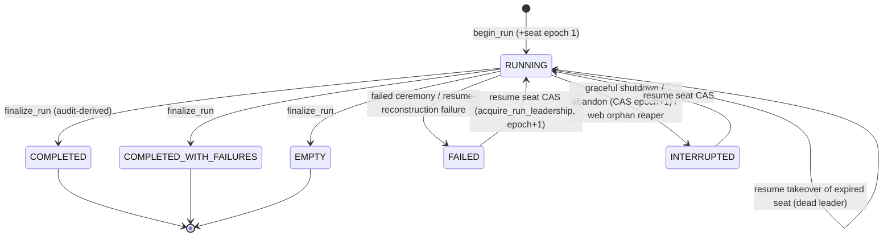

The three success states are immutable. The resume entry guard refuses them (`resume.py:986-994`)
and the takeover CAS backs that up (per the comment at `resume.py:67-73`). Tokens left undecided
when a non-resumable run finalizes FAILED or INTERRUPTED receive `(NULL, ABANDONED)` **inside**
`complete_run` (`core/landscape/run_lifecycle_repository.py:747-748`; the abandon docstring
`abandon.py:14-22`). The audit derive refuses to count an ABANDONED record on any live path
(`run_status.py:204-218`).

### Resume / recovery

1. **Read-only entry guards, before any mutation** (`resume.py:956-1058`): run status via the
   shared `check_run_status_resumable`; the supplied checkpoint must be the latest (`:1021-1031`);
   topology hash against the live graph (`:1032-1039`); implementation compatibility
   (`:1041-1047`); bound-group satisfiability (`:1056-1058`).
2. `prepare_for_run()` and `rebase_sequence(...)` (`:1066-1068`).
3. **Stage 1, read-only snapshot** (`_load_resume_audit_snapshot`, `:734-825`): refuses on
   runtime-VAL manifest drift (`:770-779`), refuses on source-lifecycle incompleteness
   (`:792-796`), and loads the per-source schema, contract and lifecycle maps.
4. **Stage 2, first durable act: the seat CAS** (`:641` → `acquire_run_leadership`,
   `entry_point="resume"`, `:839-844`). A loser is refused with zero mutation.
5. `pre_effect_guard` (`:643-648`). The latest checkpoint is re-read **under** leadership and the
   snapshot is rebuilt if the checkpoint moved (`:650-682`).
6. **Stage 2.5: the work set is computed post-CAS** (`:689`), followed by unprocessed-row
   payloads (`:694-699`).
7. **Stage 3: batch repair** (EXECUTING→FAILED→retry, FAILED→retry; `:846-864`, `:1492-1537`).
8. The heartbeat starts (`:1107-1109`). A quiescence gate decides between early finalize and the
   processing path (`:1156-1179`).
9. `process_resumed_rows` (`:1329-1489`). It builds the processor with `barrier_restore`, and the
   journal BLOCKED rows are rehydrated through `journal_restore.py`. Rows with incomplete
   fork/expand/coalesce children continue mid-DAG; other rows restart whole from the source
   payload (`:360-384`). The EOF fixpoint and the sink flush follow.
10. `_finalize_successful_resume` (`:866-924`) repeats the fresh-run tail: settle groups, derive
    from audit, finalize, delete checkpoints, stop the heartbeat, release the seat.

### Multi-worker shape (ADR-030/041)

- **Leader:** exactly one seat holder per run (`run_coordination`, `leader_epoch`). It minted the
  seat at `begin_run`, or took it through the CAS on resume or abandon. It carries a
  `CoordinationToken` by value into every fenced write (ADR-048 §3, e.g. `checkpointing.py:1-15`,
  `run_lifecycle.py:522-524`).
- **Follower:** admitted through `join_run` → `admit_follower` in one BEGIN IMMEDIATE
  (`join_admission.py:95-174`) after a filesystem write preflight for SQLite, DB and WAL/SHM
  (`:42-93`). It carries a `WorkerMembershipToken` and **no** epoch fence. It runs `claim_ready`
  only: no source, sink I/O, barrier trigger evaluation, checkpoints, or maintenance
  (`follower.py:1-26`, `scheduler_drain.py:375-381`). The follower hands sink work over as
  PENDING_SINK rows, and the leader drains them after its own sink writes
  (`leader_drain.py:330-359`, bounded at 3×80 s, `leader_follower_drain.py:146`).
- **Liveness:** each worker runs its own `RunHeartbeatThread` (15 s beat and 80 s window, MEASURED
  at `contracts/coordination.py:51`, `:59`). The drain thread polls the latch at row and claim
  boundaries (`source_iteration.py:798-799`, `resume.py:420-421`, `scheduler_drain.py:480-481`).
  The leader evicts dead non-leader members before it reaps their leases, every 64 drains
  (`scheduler_drain.py:80`, `:350-409`).
- **Peer-lease wait:** before the unresolved-work invariant the leader waits for follower LEASED
  items, bounded by `peer_lease_wait_budget_seconds()` (`leader_follower_drain.py:98-133`).
- **Where followers run:** the only route to follower mode is `elspeth join` (CLI), and it builds
  a `sqlite:///` URL or validates an existing SQLite URL (`cli.py:4032`, `:4035`). The web tier
  hosts only leaders.

### Concurrency model

| Thread | Owner | Shares state via |
|---|---|---|
| Drain thread (caller's thread) | Source loop, RowProcessor, sink writes, ceremonies | — |
| `RunHeartbeatThread` (daemon) | `heartbeat.py:243` | `threading.Event` latches plus one-shot reason/exception slots (`:218-241`) |
| `IdleTimeoutPump` worker | `source_iteration.py:561-572` | A park handshake serializes flushes against the drain thread (`idle_timeout_pump.py`, not read in full) |
| RowProcessor worker pool (`max_workers`) | `processor_factory.py:479` | Outside this slice (S06) |
| Other OS processes | Followers, a competing resume, or abandon | Only through the DB: CAS, epoch and membership fences, lease owners |

`shutdown_handler_context` installs SIGINT/SIGTERM handlers only on the main thread
(`shutdown.py:42`). Web runs on worker threads and supplies its own `shutdown_event`. After the
first signal the handlers restore `default_int_handler`/`SIG_DFL`, so a second signal raises
`KeyboardInterrupt` or kills the process (`shutdown.py:49-54`).

### Where state lives

Durable state lives only in the Landscape: runs, run_coordination and run_workers, token_work_items
(the journal), checkpoints (topology hash plus barrier *scalars* only), batches, token_outcomes and
node_states. In-memory state: `pending_tokens` (every sink-bound token accumulated until the
post-loop sink flush, see concern C03), `ExecutionCounters` (live, demoted to a parity check),
executor barrier memory (rebuilt from the journal on resume), and the checkpoint sequence number.

---

## Data & persistence

This slice **owns no tables**. It writes only through `RecorderFactory` repositories, with the one
exception noted under concern C07.

| Store / table (Landscape) | Written by (slice site) | Fence |
|---|---|---|
| `runs` (begin, export_status, terminal) | `run_lifecycle.py:220`, `:354-402`; `ceremony.py:239`, `:305`; `resume.py:883`; `abandon.py:273` | Leader epoch. The terminal UPDATE carries an in-statement quiescence `NOT EXISTS (READY/LEASED/BLOCKED/PENDING_SINK)` for success statuses (`run_lifecycle_repository.py:741-746`) |
| `run_coordination` (seat) and `run_workers` (members) plus coordination events | `begin_run` (epoch 1), `acquire_run_leadership` (resume `:839`, prepared restart `run_lifecycle.py:248`, abandon `abandon.py:239`), `release_seat`, `worker_heartbeat`, `admit_follower`, `depart_worker`, `evict_worker` | CAS on epoch and membership. A heartbeat updates both rows in one transaction (`heartbeat.py:46-49`) |
| `token_work_items` (the scheduler journal) | `scheduler_drain.py` enqueue, claim and `mark_*` (`:532`, `:708`, `:768-834`, `:979`, `:1151-1189`) | `member_token` plus `expected_lease_owner` |
| `checkpoints` | `checkpointing.py:99-131` (seq 0), `:133-193`, `:253-281`, `:283-293` (delete) | Leader epoch (ADR-030 §C.4 row 5) |
| `batches` | `resume.py:1492-1537` | Leader token |
| `run_sources` (lifecycle, schema contract) | `source_lifecycle_recorder.py`, `landscape_registration.py:217-251` | Leader token |
| `secret_resolutions`, `preflight_results` | `run_lifecycle.py:286-305` | Leader token |
| `operations` (source_load) | `source_iteration.py:529-536` | — |

**Schema epoch:** MEASURED `SQLITE_SCHEMA_EPOCH = 43` (`core/landscape/schema.py:449`). The
comments in this slice cite historical epochs: "Epoch 21" (`run_lifecycle.py:213`) and
"post-epoch-20" (`journal_restore.py:171`). This slice does not touch the Sessions DB.

**Invariants enforced by DB statements, not by code:** seat CAS single-winner, epoch fences on
every leader write, membership fences on follower dispositions, lease-owner CAS on item
dispositions, and the success-status quiescence arm. The code in this slice only *presents*
tokens; the enforcement is in `core.landscape` (slice S03/S04).

---

## Dependencies

The import matrix buckets all of `engine/` together (`temp/import-matrix.md`). Attribution to
this slice comes from my own grep of `from elspeth.engine` outside `engine/` (output reproduced
in the Public-interface table).

**Inbound (matrix rows with dst = `engine`, runtime counts are module-level/lazy):**
- `cli → engine` 1/28 (+2 TC). Every slice verb: `Orchestrator`, `preflight.*`,
  `abandon.*`, `follower.build_follower_processor`, `export.*`, `run_status.cli_completion_for`,
  `engine.bootstrap.resolve_preflight`, `_best_effort`.
- `web.execution → engine` 6/2. `orchestrator.core.Orchestrator`, `preflight`, `types`,
  `value_source_validation`.
- `web.acceptance → engine` 2/0. `orchestrator.prepare_for_run`, plus `_error_hash`, which is
  outside the slice.
- `web.composer → engine` 1/0. `orchestrator.preflight.check_config_value_sources`
  (`web/composer/tools/_common.py`).
- `web.coordination → engine` 0/1 (lazy). `orchestrator.bootstrap.prepare_for_run`.
- `plugins.infrastructure → engine` 1/1. **Both edges land in this slice:**
  `orchestrator.preflight.validate_value_source_compliance` and a second preflight import in
  `plugins/infrastructure/runtime_factory.py`.
- `plugins.sinks → engine` 1/0. `engine._error_hash` (not in this slice).
- `testing → engine` 0/5 (+3 TC). `orchestrator.types`.

**Outbound (matrix rows with src = `engine`, whole engine):** `contracts` 340/34/106 TC;
`core.landscape` 61/5/33; `core` 44/3/20; `core.checkpoint` 9/2/6; `core.dag` 6/0/14;
`core.rate_limit` 0/0/2; `elspeth(pkg)` 1/0/0. That last edge is MEASURED to be
`orchestrator/landscape_registration.py:26` `from elspeth import __version__`, and
`src/elspeth/__init__.py` pulls in only `importlib.metadata`. **Engine has zero edges to
plugins, web or CLI** (matrix §5.1). This slice keeps the L2 boundary by injection:
`PipelineRunner` and `CollectionProbe` (`engine/bootstrap.py:36-40`), and the OpenRouter catalog
SHA is required from the caller (`run_lifecycle.py:482-493`).

**Cycles.** At package level, `engine` is in no SCC (matrix). Inside `engine/`, an AST walk of
**module-level runtime imports only** (TYPE_CHECKING excluded) found **zero SCCs**. The same walk
recorded non-zero fan-in, for example `orchestrator.run_state` ←11 and `orchestrator.types` ←11,
so it does see edges. Lazy imports such as `follower.py:551-558` and `resume.py:757` were outside
its scope. The discovery matrix's `core` SCC, found with the same technique, is the package-level
positive control.

**Private cross-package symbols** (MEASURED grep of `import _` in the slice):
`resume.py:73` `_IMMUTABLE_SUCCESS_RUN_STATUSES` (from `core.landscape.run_lifecycle_repository`),
`export.py:315` `_EXPORT_TERMINAL` (from `core.landscape.export_read_model`),
`counter_classification.py:25` `_LEGAL_TERMINAL_PAIRS` and `_NON_TERMINAL_PATHS` (from
`contracts.enums`), plus the private *method* call `snapshot.recovery._restore_barrier_scalars(...)`
at `resume.py:678`.

---

## Patterns observed

- **A facade over phase coordinators.** Each public entry delegates to exactly one coordinator.
  The files carry extraction-history docstrings that cite legacy issue tracker ids (`elspeth-9e71ae82a4`,
  `-6630fb3e31`, `-b53a093321`, `-107a29d02e`).
- **Tokens passed by value.** The leader `CoordinationToken` or follower `WorkerMembershipToken`
  travels as a keyword argument into each fenced write and is never re-read mid-run (ADR-048 §3;
  `checkpointing.py:1-15`, `sink_flush.py:350-352`).
- **Audit is the single bookkeeper.** Terminal status and counters are *derived* from
  `token_outcomes` after all writes commit (`run_status.py:133-251`). The live counters survive
  only as a strict parity assertion (`:292-340`).
- **Check-then-act is accepted only where a CAS arbitrates.** The resume entry guard and the
  abandon preflight are both advisory; the seat CAS is the arbiter (`resume.py:980-985`,
  `abandon.py:171-174`).
- **Latches instead of cross-thread raises.** The heartbeat thread publishes Event plus one-shot
  slots and the drain thread raises at boundaries (`heartbeat.py:367-389`, `:352-365`).
- **Best-effort ceremony that still lets Tier-1 errors through.** One broad-except helper
  (`_best_effort.py:73-91`) re-raises `TIER_1_ERRORS` first (`:75-76`). `error_boundary.py:19-28`
  crashes through on programming errors.
- **Advisory and enforcing surfaces share one implementation**, for example
  `check_source_lifecycle_resumable` in both `can_resume` and `resume()` (`resume.py:788-796`),
  and `check_group_satisfiability_resumable` in the resume guard and the end-of-run post-condition
  (`run_status.py:40-72`).
- **Validate-then-freeze restorers.** `journal_restore.py` validates all rows before it builds any
  state, and the executor applies frozen dataclasses (`journal_restore.py:15-23`, `:152-154`).
- **Production concessions to tests:** call-time bound seams (`core.py:300-304`), the
  `derive_resume_terminal_status_from_audit` alias (`run_status.py:254-256`, 41 references tree
  wide), `MockClock` in a production module (`clock.py:44`), `_step_beat` (`heartbeat.py:560`), a
  `CoordinationSnapshot.worker_role` default of `"leader"` kept "for backward-compat with tests"
  (`heartbeat.py:418-420`; the default is at `contracts/coordination.py:181`), and "compatibility
  re-exports" (`clock.py:4`).

---

## Invariants & how they are enforced

| Invariant | Enforcement | Evidence |
|---|---|---|
| Telemetry after the Landscape write (RunStarted, RunFinished, INTERRUPTED/FAILED) | **Code ordering, prose-documented, holds** | `run_lifecycle.py:264→267-276`; `:614→627-632`; `ceremony.py:239→242`, `:305→308`. Scope: `PhaseChanged` and `ProgressEvent` are operational events with no preceding audit write, which is acceptable. |
| Seat minted atomically with the run row; the first durable act of resume and abandon is the CAS | DB transaction in the repository, sequenced in code | `run_lifecycle.py:213-232`; `resume.py:637-641`; `abandon.py:252-254` |
| A deposed leader cannot finalize, checkpoint or delete checkpoints | **DB epoch fence** (first statement of the fenced transaction) | `ceremony.py:227-235`; `run_lifecycle.py:318-324` |
| Heartbeat stops before every `release_seat` | **Prose plus hand-replication** at about 10 sites | `run_lifecycle.py:7-15`, `:667`, `:703`, `:717`, `:747`, `:770`; `resume.py:893`, `:1264`, `:1279`, `:1304`, `:1318`; `follower.py:329-332` (PREVIOUSLY-REPORTED `elspeth-c303579ac1`) |
| No success stamp over residual scheduler work | **DB statement** (`NOT EXISTS` quiescence arm), plus a code invariant before sink flush | `run_lifecycle_repository.py:741-746`; `leader_drain.py:284-290`; `resume.py:448-454` |
| EOF barrier flush only when the journal is quiesced; bounded fixpoint | Code assertion (`OrchestrationInvariantError`) | `leader_drain.py:470-478`, `:480-544` |
| Terminal status is a pure function of audit; live counters match | Code assertion. A test pins field completeness, **but pins a constant the function does not use** (C05) | `run_status.py:292-340`; `tests/unit/engine/orchestrator/test_run_status.py:205-215` |
| Every bound group settled at end of run | Code assertion via the shared gate | `run_status.py:40-72`; `run_lifecycle.py:608`; `resume.py:881` |
| Resume refuses a stale or topology-changed checkpoint and VAL-manifest drift | Code assertion before the CAS; checkpoint currency re-checked under leadership | `resume.py:1010-1039`, `:770-779`, `:650-682` |
| Declaration-contract registry equals the manifest, then is frozen before any row | Code assertion at bootstrap plus an elspeth-lints `manifest.contract_manifest` rule | `orchestrator/bootstrap.py:74-151` |
| Follower never does sink I/O, maintenance or trigger evaluation | `ProcessorMode.FOLLOWER` gates in the builder and drain; RowProcessor validates wiring (S06) | `processor_factory.py:207`, `:234`, `:421-424`; `scheduler_drain.py:375-381` |
| No PostgreSQL followers (ADR-041) | **CLI only**: `elspeth join` builds or validates a SQLite URL. The engine's `join_run` skips its preflight for non-SQLite and proceeds | `cli.py:4032`, `:4035`; `join_admission.py:59-61` (C09) |
| Commencement gates are validated before dependency pipelines run; the audited condition is redacted | Code ordering plus redaction | `engine/bootstrap.py:54-63`; `commencement.py:86` |
| `depends_on` paths stay under the parent directory; depth ≤ 3; no cycles | Code (`ValueError`) | `dependency_resolver.py:67-90`, `:93-143` |

---

## Baseline delta — ARCHITECTURE.md says / tree says

| ARCHITECTURE.md (or ADR) claim | Pinned tree shows | Evidence |
|---|---|---|
| Orchestrator `orchestrator/` ~14,055 LOC (`ARCHITECTURE.md:234`) | 14,820 lines in 42 files (+5.4 %) | `cat orchestrator/*.py \| wc -l` |
| SpanFactory ~298 LOC (`:243`); RetryManager ~146 (`:242`) | `spans.py` 633; `retry.py` 158 | `wc -l` |
| SchedulerDrainCoordinator LOC "—" (`:239`) | 1,194 lines; a 424-line `drain_claims` | `wc -l`; AST census |
| The Engine component diagram (`:201-228`) lists Orchestrator as one box | The as-built split is about 11 coordinators plus RunHeartbeatThread, FollowerProcessor, JoinAdmissionService, the abandon engine, journal restorers, commencement and dependency resolution. **None appears in the baseline component table.** | `core.py:102-183` |
| Sequence diagram: `complete_run(status)`, then `emit(RunFinished)` (`:532-533`) | The terminal status is *derived from audit* first (`run_lifecycle.py:609`). Then parity, then `finalize_run` (grade computed, then fenced `complete_run`), then checkpoint delete, then RunFinished, then export, then seat release | `run_lifecycle.py:603-677` |
| Key audit points 1–6 (`:539-545`) | Several durable acts are missing from the list: seat mint at `begin_run`, secret-resolution and preflight-result writes, the seq-0 run-start checkpoint, run_sources lifecycle writes, the deferred-invariant sweep and the bound-group post-condition | `run_lifecycle.py:220-305`; `leader_drain.py:146`, `:373` |
| Sequence diagram shows sinks after the row loop | **Holds** (sink writes are post-loop). The consequence the baseline does not record: all sink-bound tokens are held in memory until then (C03) | `leader_drain.py:299`, `:343`; `resume.py:1452` (the only three call sites) |
| "Telemetry Pattern: Events emitted AFTER Landscape recording" (`:547`, `:802`) | **Holds** for run-level events | `run_lifecycle.py:266-276`, `:625-632`; `ceremony.py:239-247` |
| "Resume Safety ✅ Low Risk — Full topology hash" (`:1122`) | This understates the as-built design: three read-only entry guards, a VAL-manifest check, source-lifecycle and group-satisfiability gates, the seat CAS as first durable act, a post-CAS work set, and a checkpoint re-read under leadership | `resume.py:956-1068`, `:587-732` |
| ADR-038: ABANDONED written only by `complete_run` for a non-resumable run (`:603`) | **Holds.** Abandon routes through the CAS then fenced `complete_run(INTERRUPTED)`, and the audit derive refuses ABANDONED on live paths | `abandon.py:247-282`; `run_status.py:204-218` |
| ADR-030 row (`:1043`): one host, WAL SQLite, one leader plus claim-only followers | **Holds** for SQLite followers via CLI. The ADR-041 amendment (PG single-leader, ACA sequential handoff) is honoured by *absence of a web follower path*, not by an engine refusal | `join_admission.py:59-61`; `cli.py:4032-4035` |
| ADR-047: every liveness and expiry decision reads DB time | **Holds** for the seat and lease verbs. The scheduler's `available_at` is stamped by the repository (`scheduler_drain.py:520-523`, `:1143-1147`). Journal restore uses `scheduler.database_now()` (`barrier_coordination.py:1703`), although the `journal_restore.py:22` docstring still says "caller-supplied wall clock". The lease-heartbeat *cadence throttle* uses process time, which is legitimate (`scheduler_drain.py:1089-1091`) | cited |
| Missing from the baseline | `elspeth join` / `abandon` verbs, commencement gates and `depends_on` pre-run pipelines, the audit-derived terminal status (ADR-030 §D), the heartbeat and latch model, and the prepared-permit restart path (`RunStartAdmissionRepository`, `run_lifecycle.py:233-260`, `:554-557`) | — |

---

## Concerns

| ID | Severity | Concern | Evidence (file:line at pin) | Status |
|---|---|---|---|---|
| C01 | **High** | **Followers run without the expand-width fence.** `build_follower_processor` has no `settings` parameter and passes `settings=None`, so `max_expand_group_width` becomes `None`. Both enforcement sites then skip, and the comment claiming "settings is None only on repository-level direct constructions" is false. A row whose expansion exceeds 100k members is refused on the leader but minted unbounded on a follower. The outcome depends on which worker claimed the row, and the OOM the fence exists to prevent comes back. MEASURED: 0 tests intersect follower with expand width. Nothing else bounds it at build time (`elspeth-4e973b1347` is still open). | `follower.py:613`; `processor_factory.py:471-474`; `token_traversal.py:284-285`; `engine/tokens.py:608`; `core/config.py:2160-2173` | **NEW.** Same class as `elspeth-3c086dd3c1` (empty follower maps). The ADR-030 text is silent on retry and width (grep: 0 relevant hits) |
| C02 | Medium | **Followers never retry.** The FOLLOWER mode gate means no `RetryManager` is built (`processor_factory.py:207`, "follower passes settings=None anyway"). A transient transform failure, for example an LLM 429, is retried when the leader claims the row and becomes a single-attempt failure when a follower claims it. Row outcomes, and so run status, depend on scheduling. This is undocumented in ADR-030. | `processor_factory.py:206-208`; `follower.py:613`; `processor.py:2329-2350` (single attempt when `None`) | **NEW** |
| C03 | Medium | **Every sink-bound token is held in memory until the source loop ends.** `accumulate_row_outcomes` appends to `pending_tokens`, and `flush_and_write_sinks` is called only after the last source is exhausted (and in resume only after the loop). Memory therefore grows O(rows) with output-row payloads, and post-sink checkpoint progress also bunches at the end. INFERRED link to the maintainer's 10k stress observation ("RSS +213 MB in post-last-row finalisation", memory note 09-21). Not measured here. | `leader_drain.py:299`, `:343`; `resume.py:1452` (the only call sites, grep-controlled); `outcomes.py:89`; `source_iteration.py:752-763` | **NEW** as an architectural record. No tracker hit for "pending_tokens" or "memory" |
| C04 | Medium | **Follower wiring is assembled outside the engine.** `cli.py` hand-builds the follower `PipelineConfig`, `PluginContext`, aggregation `node_id` assignment and on_start lifecycle, separately from the leader's `RunContextFactory`. The follower `PluginContext` has no `coordination_token` and no `llm_call_governance`. Earlier drift bugs of this class were `elspeth-6b6a62af1f` and `-df7daf5667` (closed) and `-3c086dd3c1` (triage). | `cli.py:4200-4270`; compare `run_context_factory.py:149-160` | PREVIOUSLY-REPORTED (class): `elspeth-07b2031e41` (closed, processor half only); `elspeth-3c086dd3c1` |
| C05 | Low | **The parity-field completeness test guards a constant, not the function.** `_PARITY_STRICT_FIELDS` and `_PARITY_EXCLUDED_FIELDS` are defined and pinned against `ExecutionCounters` by a test, but `assert_terminal_counter_parity` compares its own hard-coded tuple. A new counter added to the constant would pass the test and still not be compared. | `run_status.py:276-289` vs `:303-315`; grep shows the constants referenced only at `run_status.py:276-277` and `test_run_status.py:209-210` | **NEW** |
| C06 | Low | **Fresh-run and resume paths handle `BaseException` differently.** A fresh run catches only `Exception`. A second SIGINT (`KeyboardInterrupt`) therefore bypasses every ceremony arm: the run stays RUNNING, no terminal event is written, and the seat lapses after 80 s. Resume catches `BaseException` and stamps FAILED. Both outcomes can be resumed, but the operator-visible end state differs by path. | `run_lifecycle.py:742`; `resume.py:1298`; `shutdown.py:49-54` | **NEW** |
| C07 | Low | **`abandon.py` is the only engine module that runs raw SQL against Landscape tables.** It imports `token_outcomes_table`, `token_work_items_table` and `tokens_table` and issues `select` on its own connection, going around the repository layer every other slice module uses. MEASURED: `grep _table engine/` hits only this file. | `abandon.py:35`, `:48`, `:130-165` | **NEW** |
| C08 | Low | **The pre-heartbeat window has no terminal handling.** `pre_effect_guard` and `_record_preflight_results` run after the seat mint but outside the `try` and before `_heartbeat.start()`. A `pre_effect_guard` failure releases the seat and re-raises (`except BaseException: release_seat`, `:514-519`), but it writes no FAILED ceremony, so the run row stays RUNNING. A `_record_preflight_results` failure (`:520`) has no handler at all: the run stays RUNNING with an unbeaten seat and no FAILED ceremony until takeover. | `run_lifecycle.py:514-520`, `:541-545`, `:562` | **NEW** |
| C09 | Low | **The ADR-041 refusal of followers on PostgreSQL is enforced only by the CLI.** `JoinAdmissionService._join_preflight` returns early for non-SQLite URLs, and `admit_follower` has no dialect refusal (grep: none). The engine API would admit a PostgreSQL follower. | `join_admission.py:59-61`; `cli.py:4032-4035` | **NEW** |
| C10 | Low | **Private cross-package coupling.** Four private symbol imports and one private method call reach into `core.landscape`, `core.checkpoint` and `contracts`. | `resume.py:73`, `:678`; `export.py:315`; `counter_classification.py:25` | **NEW** |
| C11 | Low | **Finalizers outside the lifecycle skip the reproducibility grade.** Abandon, the web orphan reaper and web reconciliation call `complete_run` without a grade, while engine ceremonies use `finalize_run`, which computes one. The grade stays whatever `begin_run` wrote. | `abandon.py:273`; `web/app.py:355`; `web/execution/service.py:2468`, `:2532`; `run_lifecycle_repository.py:2161-2162`, `:780-787` | **NEW** |
| C12 | Low | **A heartbeat fatal raised on the success path produces a split end state.** `_heartbeat.raise_fatal_failure()` runs after finalize COMPLETED and seat release. It falls into `except Exception` with `run_completed=True`, which emits a PARTIAL `RunSummary` and calls `release_seat` a second time inside `best_effort` (whether that second call raises or no-ops was not checked). The result is a COMPLETED Landscape record, a PARTIAL EventBus summary and a raised Tier-1 error. Failing closed is correct, but the summary contradicts the record. | `run_lifecycle.py:674-677`, `:742-765` | **NEW** |
| C13 | Low | **`heartbeat_degraded` fires on every tick past the threshold, not once at the crossing.** | `heartbeat.py:513-514` | PREVIOUSLY-REPORTED `elspeth-58b3967ea7` (confirmed) |
| C14 | Low | **PostgreSQL statement or query timeouts (57014) are treated as fatal non-contention.** Only 55P03 and 40P01 count as BUSY. | `heartbeat.py:126-131` | PREVIOUSLY-REPORTED `elspeth-6feb133948` (triage). Related: `elspeth-7bee0f29f0` (nothing reacts to sustained heartbeat failure) |
| C15 | Low | **Dead follower seams.** `_SEAT_DEAD_GRACE_SECONDS` is defined and never read, and the docstring (`:38-42`) still describes a grace period. `FollowerProcessor._clock` is assigned and never read. | `follower.py:132`, `:231` (each grep hit is the definition only) | PREVIOUSLY-REPORTED `elspeth-ed6841d381` (triage), `elspeth-c801d0266d` (open) |
| C16 | Low | **Resume emits no progress events.** The code calls this a "known gap — T24 follow-up". A tracker search for "T24" found no live ticket. | `resume.py:205`, `:1367` | **NEW** (untracked, code-acknowledged) |
| C17 | Low | **Commencement and dependency residue.** `depends_on` accepts only `COMPLETED`, so an `EMPTY` or `COMPLETED_WITH_FAILURES` dependency blocks the parent. The dependency `settings_hash` is a raw-YAML canonical hash, not comparable with `runs.config_hash` (`stable_hash(resolve_config(...))`, `join_admission.py:165`). Gate expressions are parsed twice. `detect_cycles` lets a raw `FileNotFoundError` escape. | `dependency_resolver.py:196`, `:146-151`; `commencement.py:69-145` | Partly PREVIOUSLY-REPORTED: `elspeth-224fab9702`, `-eaed4c4375`, `-19a8be09c7`, `-c99d43790e`, `-aae0944509`. The COMPLETED-only policy and the hash-recipe mismatch are **NEW** |
| C18 | Low | **Stale or misleading docstrings that reach behaviour.** `heartbeat.py:3` says "currently only the N=1 leader", but followers use the same thread. `leader_drain.py:453-455` says the "leader waits, claiming what it can" loop "lands with slices 4/5", which is already landed. `preflight.py:20` cites `core.py:1746-1777`, but core.py has 408 lines. `scheduler_drain.py:445` places `_make_checkpoint_after_sink_factory` in core.py; it is in `checkpointing.py:195`. `journal_restore.py:3` says "both stateful barriers" when there are three restorers. `source_iteration.py:596-597` refers to a "legacy run-level singleton", which has been deleted per `run_lifecycle.py:200-202`. `retry.py:9-14` describes "Integration Point (Phase 5)" as future work. | cited | **NEW** |

Not re-cited because the pin appears to have fixed them: `elspeth-4ee0c9c18d` (an unfenced
`recover_expired_leases` before refusal). At the pin,
`_drain_preexisting_pending_sinks` calls `_require_coordination_token()` (`scheduler_drain.py:869`)
before the recover call (`:879`), but the private RowProcessor entry lives in S06. The GH issue
*"Partial failed-aggregation terminalisation wedges every resume on membership mismatch"*
(`cross-X4-existing-evidence.md:55`) belongs to this slice's resume path and was not
independently re-verified.

---

## Complexity & tech-debt hotspots

Measured with an AST census of all 54 files, taking `end_lineno - lineno + 1`:

| Size | Kind | Where | Note |
|---:|---|---|---|
| 934 | class | `orchestrator/resume.py:556` `ResumeCoordinator` | Mixes guards, CAS, work set, loop wiring and ceremonies |
| 921 | class | `scheduler_drain.py:274` `SchedulerDrainCoordinator` | |
| 781 | class | `orchestrator/source_iteration.py:80` `SourceIterationDriver` | |
| 643 | class | `orchestrator/run_lifecycle.py:135` `RunLifecycleCoordinator` | |
| 424 | function | `scheduler_drain.py:422` `drain_claims` | Four disposition arms, relinquish discriminator, exception taxonomy |
| 402 | function | `orchestrator/resume.py:926` `resume` | |
| 386 | function | `orchestrator/source_iteration.py:475` `run_main_processing_loop` | Quarantine arm duplicates the timeout-sweep trio (`:688-711` vs `:743-782`) |
| 371 | function | `orchestrator/run_lifecycle.py:407` `run` | Three near-identical except arms (`:701-765`) |
| 359 | function | `orchestrator/processor_factory.py:138` `build_row_processor` | Six mode gates |
| 321 | function | `orchestrator/leader_drain.py:101` `execute_run` | |

- **Fused responsibilities.** `preflight.py` (943 lines) combines a sink-effect admission
  capability authority, pipeline assembly for web and composer, and value-source/catalog
  compliance. It is effectively a shared library that web, composer, plugins and CLI import from
  `engine/orchestrator/`. `resume.py` combines the module-level loop, the coordinator and
  `handle_incomplete_batches`.
- **Duplicated ceremony shape.** The stop → release_on_loss → best_effort(finalize + release)
  sequence appears three times in `run_lifecycle.py` and three times in `resume.py`
  (`elspeth-c303579ac1`). The timeout-sweep trio (aggregation, coalesce, row_union) appears in
  four places (`source_iteration.py:688-711`, `:743-782`; `resume.py:260-276`, `:328-409`;
  `_process_idle_timeout_flushes` `:160-199`).
- **Vestigial or compatibility code:** the `derive_resume_terminal_status_from_audit` alias
  (`run_status.py:254-256`); `runs.source_schema_json` as a "single-source legacy shape" awaiting
  G6 `elspeth-2e2f2184ab` (`run_lifecycle.py:195-209`); the `CoordinationSnapshot.worker_role`
  default of "leader" (`contracts/coordination.py:181`); compatibility re-exports in `clock.py`;
  dead `if coordination_token is not None` guards after an explicit None check
  (`resume.py:1273`, `:1295`, `:1309` vs `:1093`).
- **Suppressions:** `# noqa: F401` side-effect imports (`core.py:34`, `orchestrator/bootstrap.py:19`),
  `# type: ignore[attr-defined]` on plugin class attributes (`preflight.py:339`, `:749`) and
  `# noqa: SIM115` (`audit_export_effects.py:385`).
- **Invariant checks written as `assert`** (removed under `-O`): `resume.py:630-631`, `:666-667`,
  `:989`, `:1034`, `:1045-1046`, `:1112`; `abandon.py:268`; `dependency_resolver.py:204`.
- **TODO/FIXME:** **0** across all of `src/elspeth`. The instrument was controlled: the same grep
  finds hits in `elspeth-lints/src` and `tests/`. Deferred work is instead written as prose
  ("known gap", "lands with").
- **Magic bounds:** `MAX_WORK_QUEUE_ITERATIONS = 100_000` counts dequeues per drain call and raises
  a bare `RuntimeError`, not an owned error type (`scheduler_drain.py:79`, `:478-479`, `:873-877`).
  The follower sink-drain bound is `3 × 80 s` (`leader_follower_drain.py:146`), and the batch
  terminalization size is 64 (`sink_flush.py:77`).

---

## Test map

Counts are of test files that reference slice modules (`grep -rl … | awk` by tier/area, at the
pin):

| Reference | Test files by area |
|---|---|
| `elspeth.engine.orchestrator` | unit/engine 54 · integration/pipeline 48 · e2e/recovery 17 · unit/web 8 · integration/audit 8 · unit/plugins 6 · unit/core 6 · integration/plugins 6 · e2e/pipelines 6 · integration/core 5 · unit/contracts 4 · performance/scalability 4 |
| `scheduler_drain` | unit/engine 11 · integration/pipeline 3 · unit/architecture 1 |
| `journal_restore` | unit/engine 4 |
| Heartbeat / follower / join / abandon symbols | unit/engine 7 · e2e/recovery 6 · unit/core 2 · integration/engine 2 · integration/cli 2 · testcontainer/core 1 |
| PostgreSQL proofs touching slice verbs | `testcontainer/core/test_heartbeat_takeover_postgres.py`, `test_run_coordination_release_postgres.py`, `test_run_start_admission_postgres.py`, `test_barrier_adoption_reset_postgres.py`, `test_enqueue_membership_fence_postgres.py`, and others (10 files found) |

`tests/unit/engine/orchestrator/` has 45 files, roughly one per module, for example
`test_run_lifecycle.py`, `test_resume_entry_guard.py`, `test_run_heartbeat_thread.py`,
`test_follower_processor.py`, `test_abandon_leaderless_run.py` and
`test_terminal_pair_counter_parity.py`. Engine-root modules have dedicated unit files
(`test_scheduler_drain_characterization.py`, `test_journal_restore.py`, `test_commencement.py`,
`test_dependency_resolver.py`, `test_spans.py`, `test_retry.py`, `test_clock.py`,
`test_best_effort.py`, `test_error_boundary.py`, `test_work_items.py`,
`test_scheduler_work_codec.py`, `test_bootstrap_preflight.py`).

**Gaps (measured):**
- No test combines follower mode with the expand-width fence or with retry. `grep` for
  `max_expand|expand_width` returns 5 files, and none of them mentions a follower (C01, C02).
- `test_run_status.py:205` pins the parity *constant*, not the function's comparison list (C05).
- Several process-death, peer-lease and resume tests are flaky under xdist (`elspeth-0077cb7789`,
  per AGENTS.md; not re-measured).
- Open tracker items for state-engine follower proofs: `elspeth-6f6bbbec00` (exercise a real
  follower build drain), `elspeth-966d230d15`, `elspeth-5ef5d0abd1`, `elspeth-fac74a7dce`.

---

## Confidence

**High** for lifecycle, resume, heartbeat, leader/follower and ABANDONED/abandon claims.
**Medium** for the peripheral modules.

- **Read in full:** `orchestrator/core.py`, `run_lifecycle.py`, `leader_drain.py`,
  `leader_follower_drain.py`, `follower.py`, `join_admission.py`, `heartbeat.py`,
  `authority_guard.py`, `shutdown.py`, `resume.py`, `ceremony.py`, `run_status.py`, `abandon.py`,
  `checkpointing.py`, `sink_flush.py`, `source_iteration.py`, `run_context_factory.py` (40-222),
  `orchestrator/bootstrap.py`, `processor_factory.py` (150-496), `__init__.py`; engine root
  `scheduler_drain.py`, `journal_restore.py`, `bootstrap.py`, `commencement.py`,
  `dependency_resolver.py`, `retry.py`, `clock.py`, `_best_effort.py`, `error_boundary.py`.
- **Sampled:** `preflight.py` (1-60, 110-170, 420-600, plus the function list),
  `spans.py` (header and definitions), `work_items.py` (header), `scheduler_work_codec.py`
  (definitions), `landscape_registration.py` (217-251), `graph_registration.py` (57-120), and
  `types.py`, `run_state.py`, `ports.py` (definition lists).
- **Not read beyond definition lists:** `outcomes.py`, `export.py`, `audit_export_effects.py`,
  `aggregation.py`, `validation.py`, `quarantine_router.py`, `idle_timeout_pump.py`,
  `cleanup.py`, `counter_classification.py`, `schema_reconstruction.py`,
  `implementation_compatibility.py`, `runtime_preflight.py`, `value_source_validation.py`,
  `source_lifecycle_recorder.py`, `graph_wiring.py`. Claims about them rest on how their callers
  use them.
- **Cross-checked outside the slice:** `cli.py` join and follower wiring (4010-4270),
  `core/landscape/run_lifecycle_repository.py` (725-787, 2137-2162), `contracts/coordination.py`
  (51, 59, 181), `core/config.py:2160-2173`, `token_traversal.py:275-300`, `core/landscape/schema.py:449`
  and `web/execution/service.py:3646-3720`.
- **Instruments and controls:** the grep for sink-flush call sites matched the three known sites;
  the TODO grep was controlled against `elspeth-lints` and `tests`; the `_table` grep matched
  `abandon.py`; the SCC walk recorded non-zero edges; the follower dead-code greps matched their
  definitions. Tracker state comes from archived tool command (read-only CLI; MCP timed out).
  retired code index was not used, because grep plus the measured matrix were enough and its index is
  stale.
- **Not measured:** the runtime memory profile for C03, the actual behaviour of an over-wide
  expansion on a live follower for C01, and the live PostgreSQL join path for C09. Each is an
  inference from static reading.

## Validation corrections

- [validator] C01 evidence `tokens.py:608` was ambiguous: `core/landscape/data_flow/tokens.py:608` is `fork_token`. -> **`engine/tokens.py:608`**, the TokenManager expand-width backstop (`if self._max_expand_group_width is not None and len(expanded_rows) > …`). Severity High is retained. The fact is confirmed: `follower.py:613` passes `settings=None`, `processor_factory.py:474` then yields `max_expand_group_width=None`, and both `token_traversal.py:285` and `engine/tokens.py:608` skip on `None`. Test gap confirmed: 5 test files match `max_expand|expand_width`, and 0 of them mention `follower`.
- [validator] C08 said a preflight failure leaves "an unbeaten seat" for both steps. That is only half right: **a `pre_effect_guard` failure releases the seat and re-raises** (`run_lifecycle.py:514-519`, `except BaseException: factory.run_coordination.release_seat(...)`). Only `_record_preflight_results` (`:520`) is unhandled. Both paths still leave the run row RUNNING with no FAILED ceremony. The row text is corrected, and the severity stays Low.


---

# S06 — Engine Row Processing (RowProcessor, traversal, executors, barrier family)

**Location:** `src/elspeth/engine/processor.py`, `engine/token_traversal.py`,
`engine/barrier_coordination.py`, `engine/coalesce_executor.py`,
`engine/coalesce_policy.py`, `engine/row_union_executor.py`, `engine/tokens.py`,
`engine/dag_navigator.py`, `engine/triggers.py`, `engine/batch_adapter.py`,
`engine/aggregation_result.py`, `engine/executors/` (20 modules). All paths are
read at the detached pin `.claude/worktrees/arch-analysis-pin` (`release/0.8.1` @ `85ebf2739`).

**Measured size:** **24,168 lines in 31 files** (MEASURED).
Command: `wc -l src/elspeth/engine/processor.py src/elspeth/engine/executors/*.py src/elspeth/engine/{barrier_coordination,coalesce_executor,coalesce_policy,row_union_executor,tokens,token_traversal,dag_navigator,triggers,batch_adapter,aggregation_result}.py`
gives a total of 24168. `executors/` alone is 10,011 lines (`wc -l executors/*.py | tail -1`).
The slice is 56 % of `engine/` (43,284 lines per `01-discovery-findings.md` §2).

**Responsibility:** Drives one source row, and every token minted from it, through
the DAG under a durable scheduler claim. It runs each node kind's executor with
audit-guarded node states, and holds tokens at the four barrier kinds
(aggregation, coalesce, row_union, collector) through a journal-first
adopt/flush/restore protocol. It settles every member loss and terminal
disposition into the Landscape before any in-memory consequence runs.

**Boundary note (MEASURED from imports):** The traversal *drain loop* lives in
`engine/scheduler_drain.py` (1,194 lines), the work-item cursor in
`engine/work_items.py` (281), the scheduler codec in `scheduler_work_codec.py`,
and the per-kind journal restorers in `journal_restore.py`. None of these files is
in this slice, but the slice depends on all four at module level (see
Dependencies). I read `work_items.py` fully and sampled `scheduler_drain.py`
(lines 600–680 and 890–940) only where the slice's behaviour depended on them.

---

## Key components

| File | Lines | Role |
|---|---:|---|
| `processor.py` | 5,549 | `RowProcessor` (one class, lines 389–5549, 5,161 lines). It is the façade and the continuation hub: construction and wiring, source ingest (`process_row`), the resume entry points (`process_existing_row`, `resume_incomplete_token`), aggregation flush routing, member-loss settlement, barrier completion (`_complete_*_fire`, `complete_coalesce_merge`), and restore callbacks. Also `DAGTraversalContext`, `CollectorRelease`, `_FlushContext`, `make_step_resolver`, and `classify_resume_start`. |
| `barrier_coordination.py` | 2,701 | `BarrierIntakeCoordinator`: the journal-first intake pass, per-kind adoption, group-loss replay, and escalation. `BarrierRecoveryCoordinator`: resume restore of all four barrier kinds from the journal. `restore_from_journal` is one 914-line function. |
| `executors/sink_effects.py` | 1,773 | `SinkEffectCoordinator`: reservation → preparation claim → inspection/plan CAS → lease + heartbeat thread → commit/reconcile → atomic finalize. It has 9 deterministic crash seams (`SinkEffectExecutionSeam`). |
| `coalesce_executor.py` | 1,694 | `CoalesceExecutor`: pending map keyed by `(coalesce_name, fork_group_id)`, merge plan (`build_coalesce_merge`), late-arrival and completed-key cache with a Landscape fallback, and timeout/flush/loss evaluation. |
| `executors/sink.py` | 1,490 | `SinkExecutor.write`: opens or reuses per-token sink node states, runs the primary effect through `SinkEffectCoordinator`, partitions accepted from diverted rows, and handles failsink or discard diversions. The orchestrator constructs it (`orchestrator/sink_flush.py:194`), not `RowProcessor`. |
| `token_traversal.py` | 1,274 | `TokenTraversalEngine`: the per-token node loop (`process_single_token`) plus the transform, gate, fork, error, and terminal handlers. It reaches the processor's private members at call time. |
| `executors/collector.py` | 1,123 | `CollectorExecutor`: EXPAND-group closer. Roster accounting, arrival and loss, `_close_group` → fail / plugin-free close / `_execute_flush`, journal restore, and the post-restore flush sweep. |
| `executors/aggregation.py` | 1,010 | `AggregationExecutor`: per-node batch state and `TriggerEvaluator`, `open_batch_membership`, `accept_adopted_row`, and `execute_flush` (a guarded plugin call with durable result receipts), plus journal restore. |
| `executors/transform.py` | 980 | `TransformExecutor.execute_transform`: preflight (lifecycle, field collision, pre-emission contracts, input schema), sync or row-pipelined batch invocation, post-emission contracts, output schema, hashing, and contract evolution. Also `record_transform_error_with_routing`. |
| `row_union_executor.py` | 783 | `RowUnionExecutor`: a require_all, N→N, pass-through barrier. It releases the original tokens in declared order and pops their FORK frame (ruling 27). |
| `tokens.py` | 697 | `TokenManager`: `create_initial_token`, `create_quarantine_token`, `fork_token`, `coalesce_tokens`, `collect_tokens`, `expand_token`, `record_empty_expansion`. It is the lineage-frame algebra over `DataFlowRepository`. |
| `executors/gate.py` | 529 | `GateExecutor.execute_config_gate`: ExpressionParser evaluation, route dispatch (FORK / SINK / PROCESSING_NODE / DISCARD), and routing events. |
| `executors/state_guard.py` | 511 | `NodeStateGuard`: a context manager that guarantees every opened node state reaches a terminal status. It stamps `state_id` on propagating exceptions, and has an abandon carve-out for lease loss. |
| `triggers.py` | 452 | `TriggerEvaluator`: count, timeout, and condition triggers, first-to-fire-wins. Latches are recomputed over durable arrival instants so they do not depend on adoption order. |
| `executors/pass_through.py` | 426 | `PassThroughDeclarationContract` and `verify_pass_through` (ADR-009). |
| `executors/schema_config_mode.py` | 404 | `SchemaConfigModeContract`. |
| `dag_navigator.py` | 364 | `DAGNavigator`: pure topology queries and a single closer registry for the jump-target sink walk. |
| `executors/can_drop_rows.py` | 358 | `CanDropRowsContract` (post-emission and batch-flush). |
| `batch_adapter.py` | 329 | `SharedBatchAdapter` and `RowWaiter`: route row-pipelined batch-transform results by `(token_id, state_id)`. |
| Smaller executors (≤300 lines) | 1,176 | `declared_output_fields` 277, `sink_required_fields` 256, `declaration_dispatch` 242, `declared_required_fields` 177, `source_guaranteed_fields` 169, `types` 104 (`GateOutcome`, `MissingEdgeError`), `batch_contract_validation` 103, `declaration_contract_bootstrap` 29, `declaration_flags` 26, `__init__` 24. |
| `coalesce_policy.py` | 208 | `decide_coalesce`: a pure policy matrix (require_all/first/quorum/best_effort × ARRIVAL/TIMEOUT/FLUSH/LOSS). |
| `aggregation_result.py` | 106 | Quarantine-index validation and per-member terminal and receipt-action derivation. |

---

## Public interface / entry points

The slice exposes no HTTP routes and no CLI commands. Its callers are
`engine.orchestrator.*`, `engine.scheduler_drain` (TYPE_CHECKING only), and
`elspeth.testing` (MEASURED: see Dependencies).

**Called by the orchestrator (`RowProcessor`, built in `orchestrator/processor_factory.py:447`):**
- Ingest and traversal: `process_row` (processor.py:2763), `process_existing_row` (2887), `process_token` (2978), `resume_incomplete_token` (3034), `drain_scheduled_work` (4149), `drain_follower_ready_work` (5288, FOLLOWER mode only), and `complete_coalesce_merge` (5144, the timeout/EOF coalesce fire).
- Barrier housekeeping: `run_barrier_intake` (5263), `handle_timeout_flush` (1974), `check_aggregation_timeout` (1175), `get_aggregation_buffer_count`, `get_barrier_scalars` (1206, checkpoint scalars), `has_blocked_barrier_work`, `mark_blocked_barrier_terminal` (4261), `take_pending_group_losses`, and `record_group_member_terminals`.
- Quiescence and diagnostics: `has_scheduled_work`, `has_unresolved_scheduler_work`, `count_unquiesced_scheduler_work`, `has_peer_active_leases`, `peer_lease_wait_budget_seconds`, `reap_expired_peer_leases`, `summarize_*`.
- Sink handoff: `mark_sink_bound_scheduler_terminal[_many]` (5347–5371), and `resolve_sink_step`.
- Properties: `token_manager`, `row_union_executor`, `collector_executor`, `coordination_token`, `run_id`.

**Executors used directly by the orchestrator:** `SinkExecutor` (`orchestrator/sink_flush.py:176-194`), `SinkEffectCoordinator` (`orchestrator/audit_export_effects.py:543`, for audit-export effects), and `CoalesceExecutor`, `RowUnionExecutor`, `CollectorExecutor` (constructed in `processor_factory.py:246-339` and injected into `RowProcessor`).

**Contract dispatch sites (`executors/declaration_dispatch.py`):** `run_pre_emission_checks` (called from `transform.py:426`), `run_post_emission_checks` (`transform.py:550`), `run_batch_flush_checks` (`processor.py:1423/1446/1475`), and `run_boundary_checks` (source side: `processor.py:2825`; sink side: `SinkExecutor`). The manifest gate is in `orchestrator/bootstrap.py:prepare_for_run`. It asserts set-equality of the registered `(contract, site)` pairs against `EXPECTED_CONTRACT_SITES`, then freezes the registry.

---

## Internal architecture

### Object graph and construction (processor.py:418-957)

`RowProcessor.__init__` takes about 40 parameters and builds the following. It
validates the role at construction: a LEADER must hold a `CoordinationToken`
and no member token; a FOLLOWER must hold a `WorkerMembershipToken` and no leader
token or `run_coordination` (lines 726-807).
- `DAGNavigator` (built from `DAGTraversalContext`) and `WorkItemFactory`.
- `TokenManager`, which shares the processor's `GroupBindingRegistry` instance so that runtime EXPAND-group registration is visible to the settlement walk.
- `TransformExecutor`, which receives `before_terminal_audit=self._heartbeat_active_claim` so every terminal audit write is fenced on lease ownership.
- `GateExecutor` and `AggregationExecutor`.
- `SchedulerWorkCodec`, one encoder shared by ingest, enqueue, READY emission, and rehydrate.
- `BarrierIntakeCoordinator`, which is injected with 13 processor callables (flush, fire-completion, terminals, telemetry, cursor derivation).
- `SchedulerDrainCoordinator(processor=self, ...)`.
- `TokenTraversalEngine(self)`.
- `BarrierRecoveryCoordinator(...)`, run immediately on resume (`barrier_restore is not None`).

Three shared mutable structures are handed **by reference** to the coordinators:
`_live_barrier_holds` (token_id → `_LiveBarrierHold`), `_pending_group_losses`
(staged `GroupLossSpec`s), and the `GroupBindingRegistry`. Line 827 states that
"RowProcessor is single-threaded per row, so no concurrent access". Concurrency
is **inter-process** (ADR-030 leader/follower workers fenced in the DB) plus
**intra-row** (row-pipelined batch transforms through `SharedBatchAdapter`, and
the sink-effect heartbeat thread).

### Traversal state machine

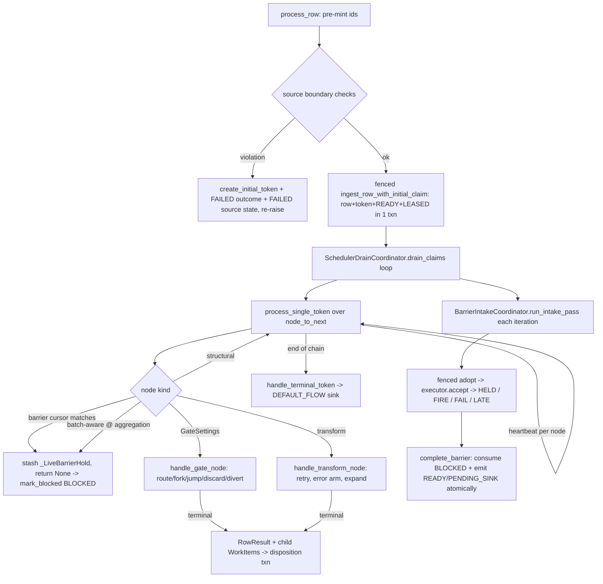

- **Per-node dispatch** (token_traversal.py:1131-1271). Barrier checks run first, in a fixed order: coalesce → row_union → collector (`_maybe_*_token`). Next comes structural skip (`resolve_plugin_for_node → None`). Then a nominal `isinstance(plugin, GateSettings)` split; the complement is the transform arm (elspeth-8783933d99, ADR-032). Aggregation nodes are detected by `is_batch_aware and node_id in _aggregation_settings`. Follower processors hold at `_follower_barrier_node_ids` (1241-1251).
- **Cycle guard:** `max_inner_iterations = len(node_to_next) + 1` (1129).
- **Ordering guard:** `validate_barrier_ordering` rejects a work item whose cursor sits downstream of its barrier (all three barrier kinds at entry, 1121-1126). After a gate jump, only coalesce and row_union are checked (763-775). The long rationale at 653-761 explains why collector is excluded.
- **Error arms.** Retryable exceptions and `PluginContractViolation` become routable `TransformResult.error` values (processor.py:2162-2282, 2318-2488). `TIER_1_ERRORS` re-raise. `handle_transform_error_status` then either quarantines (`discard`, or rule-9 error-routable closer) with a direct `record_token_outcome`, or returns `ON_ERROR_ROUTED` for the sink path to record (token_traversal.py:386-499).
- **Expansion arm** (token_traversal.py:224-380). The expand-width fence refuses a group wider than `max_expand_group_width` before any mint (284-301). A declared scope opener gives its children a collector cursor only (323-345). An undeclared expansion carries the coalesce and row_union cursor onto branch children (352-369). An empty expansion mints a `member_count=0` group record for openers (234-238) and filter-drops the parent.

### Barrier family (ADR-030 §E journal-first; ADR-029 journal-as-truth)

All four kinds share one protocol:

1. **Arrive (in-claim, recording nothing durable).** The processor stashes the live token and returns `None` (processor.py:2147-2160 for aggregation, 3227-3232 for coalesce, 3262-3267 for row_union, 3332-3337 for collector). The drain then marks the journal row BLOCKED under a `barrier_key`: the aggregation node id, the coalesce or row_union name, or the compound `collector:<name>:<group_id>` produced only in `_barrier_key_for_blocked_item` (5443-5474).
2. **Adopt (next intake pass, leader-only).** `run_intake_pass` (barrier_coordination.py:377-451) lists intake-pending rows (`barrier_adopted_epoch IS NULL`) and partitions them by key. It resolves the token *before* the fenced verb, so a bad row is refused without mutation. It then calls `adopt_blocked_barrier_item` (a CAS). Only on `adopted=True` does it feed executor memory, with a backdated arrival: the live monotonic witness, or database time minus `barrier_blocked_at` per ADR-047 (326-375). Aggregation evaluates its trigger right after each adoption (484-521).
3. **Fire.** Firing is one atomic `complete_barrier` transaction that consumes the firing group's BLOCKED rows (the snapshot is the adopted set) and emits READY continuations and/or PENDING_SINK rows (processor.py:4685-4917, 5106-5142). The failure arms use `mark_blocked_barrier_terminal`.
4. **Losses.** Losses are recorded before anyone is notified. `_settle_member_losses` (processor.py:3527-3636) walks the lineage innermost-first to the first bound frame, stages one `GroupLossSpec`, and then notifies in memory. Coalesce and row_union are notified in-claim. Collector is staged only; its notification replays at intake because the collector needs a `PluginContext` (3889-3902). Staged specs commit with the claim's disposition transaction or the flush's `complete_barrier`.
5. **Escalation.** A group failure consumes its outer member. There are two writers of the same natural key: the in-claim `_record_group_member_terminals(group_failed=True)` → `_settle_member_losses(escalated=True)` (processor.py:3687-3837), and the intake-side `_stage_pending_escalations` (barrier_coordination.py:1568-1611). Both use the constant `GROUP_FAILED_REASON`.
6. **Restore.** `BarrierRecoveryCoordinator.restore_from_journal` (1673-2586) runs a duplicate-acceptance sweep and a journal↔lineage-frame consistency check. It partitions by key and rejects key-namespace collisions. It reconciles crash windows: committed aggregation/coalesce residual receipts, failed-flush orphans, row_union released/residual/failed-closure rows, and coalesce holdless rows. It merges the durable `group_losses` ledger over the checkpoint scalars ("the ledger wins", 2381-2423), then restores coalesce → row_union → collector → aggregation. `_flush_restored_collector_groups` (865-919) closes any collector roster that was already complete, on the first intake pass after restore.

**Per-kind differences (MEASURED):**

| | aggregation | coalesce | row_union | collector |
|---|---|---|---|---|
| Group key | node id (one open batch) | `(name, fork_group_id)` | `(name, fork_group_id)` | `(name, expand group_id)` |
| Durable memory at adopt | `batch_members` + BUFFERED outcome | CAS marker only | CAS marker only | CAS marker only |
| Hold node_state | none per member (one flush guard) | per-branch OPEN at accept | per-branch OPEN at accept | per-member OPEN at accept, plus a flush guard on the *opener* token (collector.py:965-983) |
| Member terminal writer | processor / aggregation expansion | settlement seam (executor direct write retired, except the crash-cleanup path at coalesce_executor.py:1328) | **executor direct** (row_union_executor.py:582, 642) | settlement seam, except the quarantine write (collector.py:1072) |
| Output | passthrough continuation / expanded children | new merged token (`join_group_id`) | original tokens, FORK frame popped | fresh release tokens in a new release group |

### Token identity through fork, expand, coalesce, and collect (tokens.py)

- `fork_token` (298-367) delegates to `data_flow.fork_token`. That call is atomic (children + `group_records` FORK + parent `(TRANSIENT, FORK_PARENT)`) and idempotent on replay through `_reconcile_fork_replay` (core/landscape/data_flow/tokens.py:614-630). Every child must carry an innermost FORK frame.
- `expand_token` (560-680) enforces the width backstop and requires a locked contract. It mints children with an EXPAND frame and registers the group on the binding registry only for declared openers (652-654).
- `coalesce_tokens` (369-475) requires every parent to share a `row_id`. It anchors on the first parent's own FORK frame through `innermost_own_frame` (skipping collector release-group frames, META-38). It truncates each parent through `truncate_at_closer_frame`, and requires all remaining paths to be equal. It then calls `finalize_coalesce_effect` to write the effect receipt.
- `collect_tokens` (477-558) does a strict pop of the closer's EXPAND frame and mints the release tokens under `(*base_path, EXPAND(release_group_id, child_token_id))`.
- Resume re-drives existing token ids and bumps `resume_attempt_offset = max_attempt + 1` (processor.py:3082-3089). `classify_resume_start` pins the arm order MERGED → EXPAND_CHILD → FORK_CHILD (358-386).

### Sink effect coordinator (executors/sink_effects.py)

The coordinator runs `reserve` → sort by stream predecessor → for each effect:
`_prepare` (preparation claim + inspection + plan CAS) → `_lease` → a daemon
heartbeat thread at TTL/3 (117-188) → close abandoned attempts → reuse a returned
commit / reconcile (an UNKNOWN reconcile raises `SinkEffectUnknownError`) /
restage / commit → `refresh_and_check` → atomic `_finalize` (559-727). Lease and
predecessor waits share one TTL-derived budget (403-518). Capability dispatch is
nominal: `MemberSinkEffectCapability` and `RestagingSinkEffectCapability` are
concrete classes (contracts/sink_effects.py:1443, 1467), not runtime-checkable
Protocols.

---

## Data & persistence

The slice owns **no tables and no schema**. It writes only through
`core.landscape` repositories, all under ADR-048 fences: leader
(`coordination_token`), member (`WorkerMembershipToken`), or item (work-item claim).

| Store (table) | Written by (slice call site) |
|---|---|
| `rows`, `tokens`, `token_parents`, `token_lineage_frames`, `group_records` | `TokenManager` → `data_flow.create_row_with_token / fork_token / expand_token / coalesce_tokens / collect_tokens / record_empty_expansion`. On the happy path, `process_row` composes `rows` + `tokens` + the initial scheduler row through `scheduler.ingest_row_with_initial_claim` (processor.py:2712-2761). |
| `node_states` | `NodeStateGuard` (transform, gate, aggregation flush, collector flush), direct `begin/complete_node_state` in the barrier executors, and `record_completed_node_state` for the source (processor.py:2490-2532). |
| `token_outcomes` | `record_token_outcome[_leader]` (processor.py, token_traversal.py, row_union_executor.py, collector.py:1072, coalesce_executor.py:1328, transform.py:284, sink.py:482/1263). |
| `routing_events`, `transform_errors` | `GateExecutor._record_routing` and DIVERT (gate.py:371, 485-529); `record_transform_error_with_routing` (transform.py:76-149). |
| `batches`, `batch_members`, aggregation result receipts | `AggregationExecutor` (`create_batch`, `update_batch_status`, `complete_aggregation_result` via guard, `complete_batch`). Receipts are read back at restore (the "epoch-32 result receipt", processor.py:4704-4710, INFERRED from comment). |
| `coalesce_effects` / members | `finalize_coalesce_effect` (tokens.py:453-458). |
| `group_losses` | Staged `GroupLossSpec` riding `complete_barrier` / `mark_blocked_barrier_terminal` / the claim disposition; `stage_escalation_loss` (barrier_coordination.py:1551-1566). |
| `token_work_items` (journal) | `ingest_row_with_initial_claim`, `adopt_blocked_barrier_item`, `complete_barrier`, `mark_blocked_barrier_terminal`, `adopt_group_losses`, `reset_adoption_marker_to_pending`, `mark_pending_sink_terminal[_many]`. |
| sink-effect ledger, artifacts | `SinkEffectCoordinator` → `SinkEffectRepository` (`reserve`, `heartbeat_lease`, attempts, finalize). |

**Invariants enforced by DB constraints (MEASURED in `core/landscape/schema.py`):**
- `node_states`: `UNIQUE(token_id, node_id, attempt)` and `UNIQUE(token_id, step_index, attempt)` (1441-1442).
- `token_work_items`: `UNIQUE(run_id, token_id, node_id, attempt)` (913).
- `ix_token_outcomes_terminal_unique` (842), the partial "one terminal per token" index. The code relies on it explicitly; see the Ruling-36 notes at collector.py:961-968.

**Invariants enforced only in code:** at most one staged loss per bound frame per claim (processor.py:3638-3660); single-token-per-member at closers (duplicate-arrival raises in all three executors); `WorkItem` holds at most one barrier cursor (work_items.py:79-101); barrier-key namespace disjointness (barrier_coordination.py:1731-1739).

**Schema epochs referenced in slice comments (INFERRED, not measured here):** epoch 11 `token_data_ref`, epoch 20 blob-restore retirement, epoch 21 coordination token, epochs 29/30 `row_union_name`, epoch 32 aggregation result receipt.

---

## Dependencies

Instrument: an AST walk over `src/elspeth` at the pin that classifies module-level,
lazy, and `TYPE_CHECKING` imports, treating the 31 slice modules as one bucket
(scratchpad `deps.py`). The package-level matrix row `engine → *`
(`temp/import-matrix.md`) contains this slice. It shows `engine → contracts`
340/34/106, `core.landscape` 61/5/33, and **0 rows to plugins, web, or cli**.

**Outbound (MEASURED, module / lazy / TC):**
- `contracts`: 513 / 25 / 22
- `core.landscape`: 38 / 0 / 9
- `core`: 28 / 0 / 1
- `core.dag`: 9 / 0 / 0
- `core.checkpoint`: 2 / 0 / 0
- Intra-engine, outside the slice: `scheduler_drain` 10/0/0, `clock` 10/0/6, `work_items` 7/0/0, `spans` 7/0/0, `_error_hash` 8, `journal_restore` 3, `_best_effort` 2, `retry` 1, `scheduler_work_codec` 1.
- `engine.orchestrator` 1/0/2: `dag_navigator.py:23` imports `orchestrator.plugin_types` at module level, and `processor.py:103-104` imports `plugin_types` and `ports` under TYPE_CHECKING.
- No plugins, web, or cli imports (consistent with the matrix).

**Inbound (MEASURED):**
- `engine.orchestrator`: 12 / 7 / 12, from 14 modules (`processor_factory`, `sink_flush`, `outcomes`, `resume`, `leader_drain`, `core`, `bootstrap`, `graph_wiring`, `ports`, `run_state`, `run_context_factory`, `source_iteration`, `export`, `audit_export_effects`).
- `engine.scheduler_drain`: 0 / 0 / 1.
- `elspeth.testing`: 0 / 2 / 2 (`testing/__init__.py:60,67,407,580` import `engine.batch_adapter.ExceptionResult` and `engine.tokens.TokenInfo`, both re-exports).
- Control: grepping `plugins`, `web`, `cli*`, `composer_mcp`, `testing`, `mcp`, `tui`, `telemetry`, `core`, and `contracts` for `elspeth.engine.<slice module>` imports finds only the `testing` lines. The web/plugins → engine rows of the matrix land on `engine.orchestrator.*`, `engine.bootstrap`, and `engine._error_hash`, not on this slice.
- `contracts/runtime_val_manifest.py:25,1325` names `"elspeth.engine.executors.pass_through"` as a **string** (manifest coupling from the leaf package to an engine module path; not an import).

**Cycles touching the slice:**
- *Slice ↔ engine.orchestrator.* orchestrator → slice (runtime), and slice → `orchestrator.plugin_types` (module-level in `dag_navigator.py:23`). It is benign at import time: `engine/orchestrator/__init__.py` resolves lazily through `import_module`. Probe: `import elspeth.engine.dag_navigator` leaves `elspeth.engine.processor` and `orchestrator.core` unloaded (MEASURED via `python -c`).
- *Object-level cycles* (not import cycles): `RowProcessor ↔ TokenTraversalEngine` (the engine reads 33 distinct `self._processor._<private>` members, 76 occurrences) and `RowProcessor ↔ SchedulerDrainCoordinator` (`processor=self`, 4 distinct private members). `BarrierIntakeCoordinator` receives 13 bound methods of the processor.
- `processor.py` imports `scheduler_drain` (10 names) and `scheduler_drain` imports `RowProcessor` only under TYPE_CHECKING, so there is no import cycle.

---

## Patterns observed

1. **Record-then-notify / journal-first.** A durable fact commits before any in-memory consequence. Examples: barrier arrivals, loss staging, the empty-aggregation loss replay after `complete_barrier` (processor.py:4801-4809), and the collector sweep outcome retention (barrier_coordination.py:906-919).
2. **Validate-before-mutate.** Every restore path follows it, including `CollectorExecutor.restore_from_journal` (collector.py:713-719) and `RowUnionExecutor.restore_from_journal`. The partial exception is noted in C4.
3. **Nominal dispatch (ADR-032).** Code uses `isinstance(plugin, GateSettings)` with the complement as transform, and concrete capability classes for sink effects and `BatchTransformRuntime`. It does not dispatch on runtime-checkable Protocols.
4. **Guard objects for terminality.** `NodeStateGuard` auto-fails the state on any exception, stamps the `state_id` on the exception for later DIVERT attribution, and leaves the state OPEN on lease loss.
5. **Extraction by delegation.** The processor was split into components 3 and 4 of the god-class split (elspeth-c49f33d6e4, elspeth-e76a186916), but test-patched private names were kept as thin delegates on `RowProcessor` (5476-5549). The result is a narrow class API over a very wide private surface.
6. **Deterministic crash seams and fault hooks.** `SinkEffectExecutionSeam` has nine seams (sink_effects.py:74-85).
7. **Offensive invariants with long prose.** Comments are dense: `processor.py` has 487 comment lines, `token_traversal.py` 304 of 1,274, and `collector.py` 296 of 1,123 (MEASURED by `grep -cE '^\s*#'`). Many comments carry ruling and ticket citations. Zero `TODO`/`FIXME` in the slice (MEASURED; control: the same grep finds TODOs in `tests/` and `elspeth-lints/`).
8. **Telemetry after the audit record,** usually wrapped in `best_effort`. Unwrapped calls are safe because `TelemetryManager.handle_event` contains observer exceptions (telemetry/manager.py:434-448).

---

## Invariants & how they are enforced

| Invariant | Enforcement |
|---|---|
| Every token reaches exactly one terminal outcome | DB partial unique index (schema.py:842) + code (`_complete_aggregation_flush` exact terminal plan, processor.py:4745-4779) + run-end backstop `assert_bound_groups_settled_from_audit` (elspeth-76e936568e, closed) |
| One node_state per (token, node, attempt) | DB `UNIQUE` (schema.py:1441-1442); callers must thread `resume_attempt_offset` (see C1) |
| Leader-only barrier adoption and flush | Code: `_require_coordination_token` raises (processor.py:5233-5242; barrier_coordination.py:315-324) + DB-fenced verbs |
| Wrong-mode processor rejected | Code at construction (processor.py:762-806) |
| Aggregations never inside a bound region; undeclared multi-row, unbound fork, and row_union-closing fork never inside a bound region | **Build-time** (`core/dag/bound_regions.py:406-580`: rules 5/6), plus runtime fail-fast at processor.py:1871-1888 |
| Gate jump cannot bypass coalesce/row_union | Code (token_traversal.py:762-775); collector covered only by build rule 4 (prose at 653-761) |
| One staged loss per bound frame per claim | Code (processor.py:3638-3660); tests `test_group_loss_claim_guard.py`, `test_settle_member_seam.py` |
| Declaration contracts registered exactly as manifest | Code at bootstrap (`orchestrator/bootstrap.py:prepare_for_run`) + AST drift test `test_declaration_contract_bootstrap_drift.py` |
| Collector barrier_key single producer | Code + test `test_collector_barrier_key_interlock.py` (pins call sites) |
| Coalesce/row_union completion survives FIFO eviction | Landscape fallback `_check_landscape_for_completion` (coalesce_executor.py:719-747; row_union_executor.py:740-764) |
| Trigger latches are independent of adoption order | Code (`triggers.py:117-190`, member-time recompute) |

---

## Baseline delta — ARCHITECTURE.md says / tree says

| ARCHITECTURE.md (or ADR) claim | Pinned tree | Evidence |
|---|---|---|
| Component table: `tokens.py` ~393, `dag_navigator.py` ~250, `coalesce_executor.py` ~1,054, `triggers.py` ~301, `batch_adapter.py` ~226, `executors/` ~5,506 "(6 node-kind modules)" (ARCHITECTURE.md:235-248) | 697 / 364 / 1,694 / 452 / 329; `executors/` = **10,011 lines, 20 modules** (6 node-kind + 7 declaration contracts + dispatch/bootstrap/flags + state_guard + batch validation + types) | `wc -l` (Measured size) |
| Engine component diagram lists Processor, Navigator, TokenManager, Executors, SchedulerDrain, SinkEffect, Triggers (ARCHITECTURE.md:203-229) | **Missing:** `BarrierIntakeCoordinator` / `BarrierRecoveryCoordinator` (2,701), `TokenTraversalEngine` (1,274), `RowUnionExecutor` (783), `CollectorExecutor` (1,123), `coalesce_policy` (208), `NodeStateGuard`, and the declaration-contract dispatcher, which together are about 7,000 lines | files above |
| `Rel(processor, triggers)`, `Rel(processor, expression)` | The processor never touches `TriggerEvaluator` or `ExpressionParser`. `AggregationExecutor` owns the triggers (aggregation.py:198-203) and triggers fire from the intake coordinator (barrier_coordination.py:487). `GateExecutor` owns the parser cache (gate.py:185-193). | cited lines |
| Pipeline flow: `Processor→Landscape: create_row`, `create_token`, then a transform loop (ARCHITECTURE.md:508-517) | Pre-minted ids → source boundary checks → **one fenced transaction** (row + token + READY + LEASED claim) → a claim/drain loop with per-node lease heartbeats | processor.py:2803-2885; token_traversal.py:1143 |
| Fork/join sequence: branch tokens `accept` in-claim, then `update_outcome(A, COALESCED)` (ARCHITECTURE.md:611-642) | Arrivals **never** accept in-claim: stash → BLOCKED → next-iteration fenced adoption → accept. Parent completions ride `coalesce_tokens` + `finalize_coalesce_effect`, and the merged continuation is emitted atomically with the consumption. | processor.py:3217-3232; barrier_coordination.py:523-688; tokens.py:442-458 |
| Terminal states table (COMPLETED, ROUTED, FORKED, CONSUMED_IN_BATCH, …; "BUFFERED … becomes COMPLETED on flush") (ARCHITECTURE.md:590-603) | The runtime vocabulary is `TerminalOutcome{SUCCESS,FAILURE,TRANSIENT}` × `TerminalPath` (16 members, including FILTER_DROPPED, GATE_DISCARDED, GATE_ERROR_DISCARDED, ON_ERROR_ROUTED, UNROUTED, SINK_FALLBACK_TO_FAILSINK, SINK_DISCARDED, BATCH_CONSUMED, EXPAND_PARENT). BUFFERED becomes (TRANSIENT, BATCH_CONSUMED), (FAILURE, QUARANTINED_AT_SOURCE), passthrough continuation, or (SUCCESS, FILTER_DROPPED). | `python -c` enum dump; aggregation_result.py:54-70; processor.py:4761-4779 |
| ADR-028: coalesce "over fork siblings of a single `row_id`"; a future Barrier abstraction targets aggregation + coalesce | Coalesce, row_union, and collector are keyed by **group id** (spec §5 re-key; `fork_group_id` / EXPAND `group_id`). There are **four** barrier kinds. The unification that exists is at the **coordinator** level (one intake, one restore, one settlement seam), not a shared executor base class. | coalesce_executor.py:4-6, 829-839; barrier_coordination.py:421-440 |
| `docs/architecture/barrier-machinery.md:54`: restore is `engine/processor.py — _restore_barriers_from_journal` | That method does not exist; restore lives in `BarrierRecoveryCoordinator.restore_from_journal` | grep for `_restore_barriers_from_journal` over src: 0 hits (control: `def restore_from_journal` hit at barrier_coordination.py:1673); doc last touched c0494681d 2026-07-06 |
| Row-union and collector described as barriers that "survive crash recovery" (ARCHITECTURE.md:654-676) | True for pending groups. **Not** true across the collector `collect_tokens → complete_barrier` crash seam, which is explicitly unwired (C2). | barrier_coordination.py:2556-2561 |
| Missing coverage | The baseline omits: the ADR-030 leader/follower processor modes; the settlement/escalation seam and `group_losses`; the expand-width fence; the declaration-contract dispatch sites (listed only in the ADR table); `NodeStateGuard`; the sink-effect crash seams | — |

---

## Concerns

Every concern below is NEW unless marked. The review search covered
`docs/reviews/**` and `docs/arch-analysis-2026-09-07-web-split/**` for all slice
paths and class names. That search found only file-ownership CSVs and one
unrelated finding; control: the same grep matched `coalesce_policy` in the
web-review R27 issue. Tracker rows were checked through the legacy issue tracker CLI (read-only).

| ID | Sev | Concern | Evidence | Status |
|---|---|---|---|---|
| C1 | **High** (runtime effect INFERRED) | `GateExecutor` opens its `NodeStateGuard` at the default `attempt=0` with no `resume_checkpoint_id`. It ignores `token.resume_attempt_offset` and the claim's `attempt_offset`. Every other executor threads the offset. **Crash-recovery path:** `resume_incomplete_token` (FORK_CHILD re-runs the branch from its first node; EXPAND_CHILD re-drives downstream), or a lease-recovered claim whose cursor precedes a gate the prior attempt already opened a state at. In either case the gate is re-evaluated at attempt 0 and the insert collides with `UNIQUE(token_id,node_id,attempt)` / `(token_id,step_index,attempt)`, aborting recovery. MEASURED: `grep -n attempt executors/gate.py` returns 0 lines. Positive controls: transform.py:786, coalesce_executor.py:871/943, row_union_executor.py:470/627, collector.py:349, sink.py:592, aggregation.py:693. The drain threads the offset to transforms only (scheduler_drain.py:645 → token_traversal.py:1254-1265). Not proven by execution. | gate.py:322-330; schema.py:1441-1442; processor.py:3082-3089, 3148-3158 | NEW |
| C2 | Medium | Crash between the collector flush (`collect_tokens` commits the release group, member holds COMPLETED) and `complete_barrier`/seam terminals is unrecoverable. Restore drops the residual BLOCKED rows **from memory only**, so the adopted BLOCKED journal rows stay forever, the released tokens never get READY rows, and survivors lack (SUCCESS, COALESCED) terminals. The aggregation and coalesce twins have residual receipts; the collector does not. | barrier_coordination.py:2556-2561 ("Phase 2 and is NOT wired here"); journal_restore.py:624-636 | PREVIOUSLY-REPORTED (legacy issue tracker elspeth-461284ca2f, open P2; epic elspeth-c9c459c1bc) |
| C3 | Medium | `CollectorExecutor.notify_empty_group` has **no production caller**. The spec says an empty expansion at a declared opener under `require_all` must fail the group with `empty_expansion` (docs/specs/2026-08-21-barrier-scopes-full-nesting-spec.md:497). In the tree the opener just records a `member_count=0` group and filter-drops (SUCCESS, FILTER_DROPPED), so the require_all verdict is never rendered (unwired intent, not dead debt). MEASURED: grep over `src/` finds only the definition and prose; retired code index `entity_callers_list` finds only a test wrapper. | collector.py:519-556; token_traversal.py:227-264 | NEW (adjacent: elspeth-51de12e275, the two-transaction M=0 write) |
| C4 | Medium | `BarrierRecoveryCoordinator.restore_from_journal` is a single 914-line function. Its docstring promises "ALL derivations complete (and raise) before any executor restore call mutates state". That holds for executor memory, but four **durable** journal releases run inside the derivation phase: `mark_blocked_barrier_terminal` at 1949, 2110, 2186, 2346. A later `AuditIntegrityError` therefore leaves partial committed reconciles. The handling is also asymmetric: a coalesce reset-count mismatch logs a warning (2469-2476), while the same mismatch for row_union raises (2501-2504). | barrier_coordination.py:1673-2586 | NEW |
| C5 | Medium | God-class residue. `RowProcessor` is 5,161 lines with a 540-line `__init__` (about 40 parameters). The "extracted" engines depend on the processor's private surface: `TokenTraversalEngine` uses 33 distinct `_processor._*` members (76 references). `BarrierIntakeCoordinator` takes 13 processor callables plus shared mutable dict/list references. The seams exist for test patching (processor.py:5476-5482), which locks the private names in place. | token_traversal.py passim; processor.py:861-930 | NEW (baseline "Large Files: Medium" covers size only) |
| C6 | Low | Intake escalation `_enclosing_bound_frame` resolves frames with `binding_for` only, with no META-9.1 `_rederive_expand_binding` fallback. The processor walk has that fallback (processor.py:3368-3373). After takeover, an enclosing declared-EXPAND frame not yet re-registered resolves to None, and the note is discarded as "outermost". Risk is mitigated because the in-claim escalated walk writes the same natural key, and the run-end backstop fails closed. | barrier_coordination.py:1495-1519, 1598-1601 | NEW (INFERRED) |
| C7 | Low | The "single settlement seam" claim is incompletely enumerated. The processor docstring lists two excluded classes (processor.py:3552-3579). It omits the row_union executor's direct terminal writes (row_union_executor.py:582, 642, which are deliberate per the META-9.3 sibling vocabulary, enums.py:320-323) and the collector quarantine write (collector.py:1072). Row_union survivors are hashed on the raw cause (`row_union_branch_lost`, …), not `scope_group_failed`. | cited lines | NEW (documentation drift) |
| C8 | Low | Arms that are unreachable under build rules are kept as live code. `_FlushContext` coalesce/row_union derivation (`_derive_coalesce_from_tokens`, `_derive_row_union_from_scheduler`, processor.py:1237-1282) and the `coalesce_*` parameters of `_process_batch_aggregation_node` cannot fire, because aggregations are banned in every bound region (ruling 25). `released_row_union_items`' collector cursor (4952-4961) cannot fire, because a fork closing at a row_union inside a region is rejected (bound_regions.py:535-546). These are defensive but untestable from built graphs. | cited lines | NEW (INFERRED from build rules) |
| C9 | Low | Stale load-bearing prose. token_traversal.py:736-751 says `dag_navigator.py` contains no "collector". It has 24 occurrences (MEASURED), and P0 elspeth-b6a0a85a15 closed 2026-08-27. token_traversal.py:1238 cites "line 4241"; the arm is now scheduler_drain.py:754. work_items.py:57,193 say "processor.py's DAGNavigator". processor.py:3565 and collector.py:1052 cite `coalesce_executor.py:~1264`; the write is at 1328. barrier-machinery.md:54 names a deleted method. | cited lines | NEW |
| C10 | Low | `DAGNavigator.is_fork_gate_node` returns True for **every** `GateSettings` node, not just `fork_to` gates. The name overstates what it checks. It is harmless today because `create_continuation` with a barrier name is reached only from the fork handler. | dag_navigator.py:78-80, 177-187; work_items.py:245-257 | NEW |
| C11 | Low | Production `assert` used for type narrowing, which is stripped under `-O`: coalesce_executor.py:351, 430, 1170; sink_effects.py:663. There is also one existing lint suppression, `# noqa: UP037` at transform.py:209. | cited lines | NEW |

---

## Complexity & tech-debt hotspots

Largest functions (MEASURED with an AST scan of the slice; total lines with docstring lines in brackets):

| Lines | Function |
|---:|---|
| 914 (24) | `barrier_coordination.py:1673 BarrierRecoveryCoordinator.restore_from_journal` |
| 540 (109) | `processor.py:418 RowProcessor.__init__` |
| 290 | `token_traversal.py:501 handle_gate_node` (about 110 of these lines are one comment block, 653-761) |
| 289 | `executors/transform.py:692 execute_transform` |
| 267 | `token_traversal.py:118 handle_transform_node` |
| 257 | `executors/sink.py:685 _write_primary_effect` |
| 219 | `executors/gate.py:265 execute_config_gate` |
| 219 | `token_traversal.py:1056 process_single_token` |
| 213 | `executors/sink.py:981 _handle_failsink_effect_diversions` |
| 204 | `coalesce_executor.py:1138 _execute_merge` |
| 184 | `barrier_coordination.py:1168 _replay_group_losses` |
| 170 | `processor.py:1803 _route_transform_results` |

Largest classes: `RowProcessor` 5,161; `SinkEffectCoordinator` 1,492; `BarrierIntakeCoordinator` 1,403; `SinkExecutor` 1,379; `CoalesceExecutor` 1,251; `BarrierRecoveryCoordinator` 1,088; `CollectorExecutor` 992.

- **Fused responsibilities:** `processor.py` still combines ingest, resume dispatch, aggregation-flush routing, member-loss settlement and escalation, four barrier fire completions, committed-residual recovery (4374-4683), and scheduler key derivation (5407-5474).
- **Shared-state coupling:** `_pending_group_losses` is mutated by the processor, the drain coordinator, and the intake coordinator. Slice deletion at processor.py:4806 assumes nothing was appended between the snapshot and the deletion. That holds under the single-threaded assumption.
- **Suppression/marker inventory** (MEASURED `grep` for `# noqa|type: ignore|pragma: no cover`): barrier_coordination 14, sink_effects 7, sink 5, processor 3, transform 1, schema_config_mode 1. Most are `pragma: no cover` on guard arms.
- **Deliberately incomplete work:** the collector residual restore (C2), the unwired empty-group failure (C3), and the "Phase 2" deferrals tracked under elspeth-c9c459c1bc.

---

## Test map

Counts are test files whose source names the module (`grep -rlE 'elspeth\.engine\.<mod>\b'`). They are a **lower bound**, because executors imported through the `elspeth.engine.executors` package are not attributed per module.

| Module | unit | integration | e2e | property | testcontainer |
|---|---:|---:|---:|---:|---:|
| processor | 25 | 12 | 7 | 2 | 1 |
| coalesce_executor | 10 | 3 | 2 | 1 | 0 |
| tokens | 11 | 2 | 3 | 1 | 0 |
| row_union_executor | 7 | 0 | 1 | 0 | 0 |
| barrier_coordination | 4 | 1 | 1 | 0 | 0 |
| executors.sink_effects | 8 | 7 | 2 | 0 | 0 |
| executors.sink | 5 | 6 | 1 | 0 | 1 |
| executors.declaration_dispatch | 16 | 1 | 0 | 1 | 0 |
| executors.collector | 4 | 0 | 2 | 0 | 0 |
| batch_adapter | 9 | 0 | 0 | 0 | 0 |
| triggers | 2 | 0 | 0 | 2 | 0 |
| token_traversal | 2 | 0 | 0 | 0 | 0 |
| dag_navigator | 2 | 0 | 0 | 0 | 0 |
| executors.gate | 1 | 0 | 0 | 0 | 0 |
| executors.transform / aggregation / state_guard | 2 / 2 / 3 | 0 / 1 / 0 | 0 / 1 / 0 | 0 | 0 / 1 / 0 |
| coalesce_policy | 1 | 0 | 0 | 0 | 0 |
| aggregation_result | 0 | 0 | 0 | 0 | 0 |

`tests/unit/engine/` holds 99 entries, including characterization suites (`test_token_traversal_characterization.py`, `test_scheduler_drain_characterization.py`), seam pins (`test_settle_member_seam.py`, `test_settle_collector_seam.py`, `test_first_bound_frame_rederivation.py`, `test_escalation_intake.py`), and resume pins (`test_resume_start_dispatch.py`, `test_resume_offset_propagation.py`).

**Gaps:**
- (a) No test re-drives a token through an already-visited **config gate** under resume or lease recovery. The lease tests found (`tests/integration/engine/test_long_plugin_lease_recovery.py`, `test_two_process_scheduler_contention.py`) mention "gate" only in prose (C1).
- (b) No production-path test for a require_all empty expansion at a declared opener (C3).
- (c) No takeover test across `collect_tokens → complete_barrier` (C2, per elspeth-461284ca2f).
- (d) `aggregation_result.py` has no direct unit test; it is exercised only through the aggregation and processor suites.
- The PostgreSQL testcontainer tier touches the slice through only 1–3 files.

---

## Confidence

**Medium-High.**

- **Read fully:** `processor.py` (all 5,549 lines), `token_traversal.py`, `barrier_coordination.py` (all 2,701), `coalesce_executor.py`, `coalesce_policy.py`, `row_union_executor.py`, `tokens.py`, `dag_navigator.py`, `triggers.py`, `batch_adapter.py`, `aggregation_result.py`, `executors/collector.py`, `executors/transform.py`, `executors/gate.py`, `executors/declaration_dispatch.py`, `declaration_contract_bootstrap.py`, `declaration_flags.py`, `executors/__init__.py`, and `engine/work_items.py`.
- **Sampled:** `executors/aggregation.py` (1-300, 469-800); `executors/sink.py` (1-200, 1298-1490); `executors/sink_effects.py` (1-460, 559-740); `executors/state_guard.py` (137-350); `scheduler_drain.py` (600-680, 890-940); `journal_restore.py` (595-660); `core/dag/bound_regions.py` (406-580); `core/landscape/data_flow/tokens.py` fork_token (556-700); `node_states.begin_node_state`.
- **Not read:** the seven declaration-contract modules beyond their outlines (`pass_through`, `can_drop_rows`, `schema_config_mode`, `declared_*`, `sink_required_fields`, `source_guaranteed_fields`); most of `sink.py` (`_write_primary_effect`, diversion handlers); `sink_effects.py` `_prepare`, `_finalize`, and member-effect internals; `executors/types.py`.
- **Dependencies:** MEASURED with an AST instrument, and controlled against the grep of non-engine packages.
- **C1 and C3** rest on MEASURED code asymmetry and missing callers. Their runtime consequences are INFERRED; no test was run, per the read-only brief.


---

# S07 — Plugin Infrastructure, Sources, Sinks and Provider-Neutral LLM Support

**Location:** `src/elspeth/plugins/infrastructure/`, `src/elspeth/plugins/sources/`,
`src/elspeth/plugins/sinks/`, `src/elspeth/plugins/llm/`, `src/elspeth/plugins/__init__.py`
(plus the root helper `src/elspeth/plugins/aws_s3_common.py`, which is the
matrix's `plugins` (root) bucket and is imported by both S3 plugins).

**Pin:** `release/0.8.1` @ `85ebf2739`, read only from
`<pin>`. Every `file:line`
below is at that pin. Claims are labelled **MEASURED** (I ran or read it) or
**INFERRED** (reasoned from what I read, not executed).

**Measured size (MEASURED):**

```
cd <pin>/src/elspeth/plugins
for d in infrastructure sources sinks llm; do find $d -name '*.py' | wc -l; find $d -name '*.py' | xargs cat | wc -l; done
```

| Sub-package | .py files | lines |
|---|---:|---:|
| `infrastructure/` | 48 | 15,258 |
| &nbsp;&nbsp;of which `clients/` (incl. `retrieval/`) | 15 | 6,193 |
| &nbsp;&nbsp;of which `batching/` | 4 | 1,116 |
| &nbsp;&nbsp;of which `pooling/` | 5 | 1,098 |
| &nbsp;&nbsp;of which `rasterize/` | 5 | 463 |
| `sources/` (incl. `sources/llm/`) | 14 | 7,765 |
| `sinks/` | 14 | 9,900 |
| `llm/` | 4 | 888 |
| root (`__init__.py`, `aws_s3_common.py`) | 2 | 60 |
| **Slice total** | **82** | **33,871** |

This is 50.7 % of `plugins/` (66,811 lines, the same figure as
`01-discovery-findings.md` §2). The rest is `plugins/transforms/`, which is
another slice.

**Responsibility:** Owns the plugin *framework*: pluggy hookspecs, discovery
and registry, the nominal base classes and config models, the schema factory,
runtime construction of plugin bundles, the audited external-call clients,
and the concurrency primitives. It also owns the two Tier-3 boundary families,
**sources** (ingress: parse, coerce, normalise, quarantine) and **sinks**
(egress: recoverable, fenced publication through the sink-effect protocol).

---

## Key components

Every file over 300 lines is listed. The rest are grouped.

| File | Lines | Role |
|---|---:|---|
| `infrastructure/base.py` | 2,480 | `BaseTransform` (class spans 1,389 lines, `base.py:194`), `BaseSink` (`:1597`), `BaseSource` (`:2095`). Enforces determinism declaration in `__init_subclass__` (`:618-693`, `:1870-1895`, `:2276-2300`); demotes the `input_schema` of self-created fields (`:1272-1329`); ADR-013 input declarations; lifecycle flags; the sink diversion log (`:1970-2002`); composer-assistance hooks. |
| `infrastructure/clients/http.py` | 1,147 | `AuditedHTTPClient`: httpx wrapper with call-index allocation, header, URL and param fingerprinting, response body caps, SSRF-pinned requests and manual redirect validation (`request_ssrf_safe` `:742`, `_follow_redirects_safe` `:960`). |
| `infrastructure/clients/llm.py` | 946 | `AuditedLLMClient.chat_completion` (`:434`, 513 lines, the largest function in the slice). Classifies provider errors, records Tier-3 response-shape failures before re-raising, and returns an audit-safe error vocabulary (`_AUDIT_SAFE_PROVIDER_ERROR` `:39`). |
| `infrastructure/clients/dataverse.py` | 934 | `DataverseClient`: a caller-records client. The source or sink calls `ctx.record_call()` after each HTTP call (`:6`, `:250`). |
| `infrastructure/config_base.py` | 797 | `PluginConfig` (frozen, `extra=forbid`, `from_dict` → `PluginConfigError`) `:234`; `DataPluginConfig` (schema required, `_plugin_component_type` enforced) `:384`; `PathConfig`, `SourceDataConfig`, `TabularSourceDataConfig`, `LocalFileSinkConfig`, `SinkPathConfig`, `TransformDataConfig`. |
| `infrastructure/pooling/executor.py` | 664 | `PooledExecutor`: semaphore, AIMD throttle, reorder buffer, single-flight `execute_batch` (`:221`, lock at `:260`). Only `LLMTransform` uses it (`transforms/llm/transform.py:1520`). |
| `infrastructure/clients/retrieval/azure_search.py` | 621 | `AzureSearchProvider`: reuses one `AuditedHTTPClient` and rescopes it per row via `update_call_context` (`:347`). |
| `infrastructure/clients/verifier.py` | 566 | `CallVerifier`: compares live responses with recorded ones. **No production consumer** (see C-01). |
| `infrastructure/batching/mixin.py` | 556 | `BatchTransformMixin`: row pipelining with a `RowReorderBuffer`, a worker pool and a non-daemon release thread (`:142-195`). |
| `infrastructure/clients/retrieval/chroma.py` | 552 | `ChromaSearchProvider`: SDK-direct and self-recording (`execution.record_call` at `:276`, `:338`, `:495`). |
| `infrastructure/runtime_factory.py` | 519 | `PluginBundle` (frozen, cross-checked `:41-83`); `instantiate_plugins_from_config` (`:86`); raw-config sink-effect eligibility gate (`:322`); export sink factory (`:473`). |
| `infrastructure/batching/row_reorder_buffer.py` | 442 | `RowReorderBuffer[T]`: FIFO release with backpressure, eviction and shutdown. |
| `infrastructure/discovery.py` | 398 | Folder-scan discovery (`PLUGIN_SCAN_CONFIG` `:287`), module identity binding, `create_dynamic_hookimpl` (`:363`). |
| `infrastructure/manager.py` | 344 | `PluginManager` (pluggy), duplicate-name detection, `create_*` with validation, and the `get_shared_plugin_manager` double-checked singleton (`:392`). |
| `infrastructure/validation.py` | 333 | Pre-instantiation config validation returning structured errors. Used by `PluginManager.create_*` only. |
| `infrastructure/clients/fingerprinting.py` | 326 | HMAC fingerprinting of headers, URLs and params through `core.security` (lazy imports `:145`, `:242`, `:299`). |
| `infrastructure/clients/replayer.py` | 305 | `CallReplayer`: returns recorded responses. **No production consumer** (see C-01). |
| `sources/aws_s3_source.py` | 1,479 | S3 CSV/JSON/JSONL source. Spooled streaming, bounded record scanner (`_RecordLimitExceeded` `:545`), profiled audit identity. |
| `sources/azure_blob_source.py` | 1,279 | Azure Blob CSV/JSON/JSONL source. Bounded in-memory download (`:546-564`) and its own CSV parser (`_load_csv` `:639`, 251 lines). |
| `sources/dataverse.py` | 1,047 | Dataverse OData source, `Determinism.EXTERNAL_CALL`. |
| `sources/json_source.py` | 760 | JSON/JSONL file source. Also exports helpers that both cloud sources import (`azure_blob_source.py:51`, `aws_s3_source.py:58`). |
| `sources/csv_source.py` | 715 | Reference Tier-3 CSV source (`_load_from_file` `:265`, 376 lines). |
| `sources/llm/source.py` | 698 | `LLMSource` (`name="llm"`, `NON_DETERMINISTIC`). Emits at most one row from one prompt and reuses the `transforms/llm` provider stack. |
| `sources/field_normalization.py` | 631 | Versioned header normalisation (`NORMALIZATION_ALGORITHM_VERSION="1.0.1"` `:27`), collision checks and `FieldResolution`. Pure stdlib apart from one lazy `contracts` import (`:555`). |
| `sources/llm/config.py` | 376 | Provider-discriminated LLM source configs. |
| `sources/text_source.py` | 324 | Line-oriented text source. |
| `sinks/_audit_export_bundle_effects.py` | 1,332 | Create-only audit-export CSV directory bundle: Linux `renameat2(RENAME_NOREPLACE)` publication, a filesystem-magic allowlist (`:71`, checked at `:1224`), pinned parent fds. |
| `sinks/aws_s3_sink.py` | 1,221 | Conditional-object S3 sink. Uses `_remote_object_effects` and has restaging capability. |
| `sinks/database_sink.py` | 1,126 | SQLAlchemy sink with a target-side effect ledger (`database_effect_ledger_table` `:132`) and a transactional commit (`:846`). |
| `sinks/azure_blob_sink.py` | 998 | Conditional-object Azure Blob sink. Uses `_remote_object_effects` and has restaging capability. |
| `sinks/_remote_object_effects.py` | 803 | Durable plan primitives for conditional remote objects: spool, checksum, `if_match`/`if_none_match` preconditions, reconciliation. |
| `sinks/_local_file_effects.py` | 781 | Durable plan primitives for local files: effect-addressed staging, inode-identity CAS under `flock`, reconciliation. |
| `sinks/chroma_sink.py` | 725 | Per-member effects (`MemberSinkEffectCapability`). |
| `sinks/dataverse.py` | 720 | Per-member upsert effects, `EXTERNAL_CALL`, `idempotent=True`. |
| `sinks/json_sink.py` | 629 | Local-file effects (JSON/JSONL, append or write, audit-export snapshots). |
| `sinks/csv_sink.py` | 604 | Local-file effects and the audit-export bundle (`inspect_effect` `:367` … `reconcile_effect` `:509`). |
| `sinks/document_sink.py` | 466 | Local-file effects. |
| `sinks/text_sink.py` | 389 | Local-file effects. |
| `llm/model_catalog.py` | 488 | OpenRouter catalogue: live snapshot at web lifespan, falls back to the bundled LiteLLM list. Registers the catalogue reader at import time. |
| `llm/config_validation.py` | 372 | Provider config validators shared by the LLM source and the LLM transform. |
| *Grouped, each ≤300 lines:* `hookspecs.py` 72, `schema_factory.py` 203, `templates.py` 216, `azure_auth.py` 261, `display_headers.py` 297, `probe_factory.py` 139, `output_paths.py` 78, `telemetry.py` 77, `sentinels.py` 68, `utils.py` 61, `preflight.py` 23, `results.py` 21 (re-exports), `clients/base.py` 266, `clients/json_utils.py` 99, `retrieval/{base,types,connection}.py`, `pooling/{config,throttle,reorder_buffer}.py`, `batching/ports.py`, `rasterize/{protocol,png,worker,renderer}.py`, `sinks/_diversion_attribution.py` 97, `sources/{null_source,blob_rows,_safe_validation_errors}.py`, `llm/pricing.py` 27 | ~3,900 | Support modules. |

---

## Public interface / entry points

No HTTP routes or CLI commands are defined in this slice. It exposes a
library surface.

**Registry (MEASURED, live probe with `PYTHONPATH=<pin>/src`, `elspeth.__file__`
confirmed inside the pin):** 9 sources (`aws_s3, azure_blob, blob_rows, csv,
dataverse, json, llm, null, text`), 38 transforms, and 9 sinks (`aws_s3,
azure_blob, chroma_sink, csv, database, dataverse, document, json, text`).
`http_fetch_transform_names()` = `{blob_fetch, web_scrape}`.
`untrusted_content_transform_names()` returns 8 names.

| Entry point | Consumers (MEASURED by grep at the pin) |
|---|---|
| `manager.get_shared_plugin_manager()` (`manager.py:392`) | 44 call sites tree-wide. CLI, web catalogue, web composer, runtime factory, validation. |
| `PluginManager.create_source/transform/sink` (`manager.py:316-383`) | **Web composer only**: `web/composer/state.py:1803,2104,2200,6282,6300`, `_semantic_validator.py:186,270`, `tools/generation.py:2963`, `guided/emitters.py:715`. Zero CLI or engine callers. |
| `runtime_factory.instantiate_plugins_from_config` / `make_sink_factory` / `validate_sink_effect_eligibility_from_raw_config` | `cli.py` (15), `cli_helpers.py` (4), `web/execution/{preflight,service,protocol}.py` (8). The engine only mentions it in comments (`engine/orchestrator/preflight.py:666`, `graph_registration.py:176`). |
| `BaseSource`, `BaseTransform`, `BaseSink`, `config_base.*`, `schema_factory.create_schema_from_config` | Every plugin in `plugins/transforms`, `plugins/sources` and `plugins/sinks`. The matrix row `plugins.transforms → plugins.infrastructure` has 165 module-level imports. |
| `AuditedHTTPClient`, `AuditedLLMClient` | Transforms (web_scrape, blob_fetch, azure/*, llm providers) and `AzureSearchProvider`. `AuditedLLMClient` is constructed in `transforms/llm/providers/azure.py:256,309` and `transforms/llm/providers/bedrock.py:302,341` (Azure and Bedrock providers). |
| Sink-effect methods `inspect_effect / prepare_effect / commit_effect / reconcile_effect` (plus member and restage capabilities) | Called by the engine's `SinkEffectCoordinator` (outside this slice) through the `contracts.sink_effects` protocol. |
| `BatchTransformMixin`, `OutputPort` | `transforms/llm/transform.py`, `transforms/azure/base.py`, `transforms/azure/document_intelligence.py`, `transforms/aws/textract_{document,inline}_analysis.py`. The engine drives them through `engine/batch_adapter.py`. |
| `plugin_preflight_mode()` (ContextVar, `preflight.py`) | 8 importers. Constructors defer credential setup while it is set. |

---

## Internal architecture

### Discovery and registration (MEASURED: read in full)

```mermaid
flowchart LR
  A[get_shared_plugin_manager] -->|first call, lock| B[PluginManager()]
  B --> C[register_builtin_plugins]
  C --> D[discover_all_plugins]
  D -->|PLUGIN_SCAN_CONFIG dirs, non-recursive| E[_discover_in_file]
  E -->|canonical name already in sys.modules?| F[reuse module]
  E -->|else| G[exec as elspeth.plugins._discovered.<parent>.<stem> + alias canonical]
  G --> H[issubclass BaseX, not abstract, non-empty .name]
  H --> I[create_dynamic_hookimpl → pm.register]
  I --> J[_refresh_caches: duplicate-name check per kind]
```

- The three hookspecs (`hookspecs.py:39-72`) return plugin **classes**. No
  external plugin has ever implemented them: registration is always through
  `create_dynamic_hookimpl` (`discovery.py:363-398`), which wraps the
  folder-scan result. pluggy is used as a registry. External entry-point
  plugins are not supported. The code states that plugins are system-owned
  (`base.py:12-13`).
- A missing optional extra is skipped only when the missing root module is in
  `OPTIONAL_PLUGIN_IMPORT_MODULES = {bs4, chromadb, html2text, jinja2}`
  (`discovery.py:18-25`, `:95-103`). Every other `ImportError` is raised.
- **Module identity (MEASURED, probe):** a file that has not already been
  imported canonically is executed under
  `elspeth.plugins._discovered.<parent_dir_name>.<stem>` and then aliased to
  its canonical name (`discovery.py:180-216`). As a result most registered
  classes report `__module__ == "elspeth.plugins._discovered.sources.csv_source"`
  etc. Only `json` (source) and `llm` (source) carry canonical module names,
  because another module imported them first.
- The registry is a double-checked-lock singleton (`manager.py:392-416`) that
  publishes only after registration succeeds. `web/audit_readiness/service.py:382`
  deliberately builds a *second* `PluginManager()` inside an `lru_cache`.

### Two construction paths (MEASURED)

1. **Runtime (CLI `run` and web execution):** `instantiate_plugins_from_config`
   (`runtime_factory.py:86-216`) calls `manager.get_X_by_name(plugin)` and then
   `cls(dict(options))` directly. It **bypasses** `validation.validate_*_config`,
   because every plugin validates its own config in `__init__` through
   `<Config>.from_dict(...)` (for example `csv_source.py:148`). It then injects
   `on_success` and `on_error` after construction (`:114`, `:121-122`),
   assigns `sink._on_write_failure` (`:180`), resolves each sink's effect mode
   through the adapter-owned `_resolve_sink_effect_mode`, builds a
   `SinkEffectRuntimeBinding` fingerprinted by `stable_hash(options)`, and
   finishes with `engine.orchestrator.preflight.validate_value_source_compliance`
   (`:210-215`). Aggregation and collector kinds are refused on the class
   attribute `is_batch_aware` *before* construction (`:134`, `:154`).
2. **Composer probes:** `PluginManager.create_*` runs `validate_*_config`
   (pydantic, structured errors) and then the constructor, so config is
   validated twice. `tests/unit/plugins/test_validation_path_agreement.py`
   guards agreement between the two paths.

### Plugin base-class contract (MEASURED: `base.py` read in full)

- **Determinism must be declared** in each class body, including intermediate
  ABCs, or `TypeError` is raised at class creation (`:678-693`, `:1880`,
  `:2285`).
- **Self-created field demotion (elspeth-d6eeb3a71d):** `input_schema` is a
  property. A class-body assignment is moved to `_declared_input_schema` by
  `__init_subclass__` (`:647-657`). A mixin that shadows the property fails at
  class creation (`:666-676`). Demotion covers
  `self_created_input_fields − consumed_input_fields` intersected with the
  declared model fields (`:1269-1270`), and keeps pydantic FieldInfo metadata
  so `FiniteFloat` NaN rejection survives (`:137-191`).
- **ADR-013 input declarations** are captured centrally by
  `_initialize_declared_input_fields` (`:723-757`), with a fixed-schema
  coherence check (`:759-851`).
- **Transform execution models** (docstring `:197-280`): synchronous
  `process`; streaming `accept` through `BatchTransformMixin`; batch-aware
  `process(list)`.
- **Sinks:** `write`, `flush` and `close` are abstract (`:1914-1945`), but see
  C-02. Recoverable publication is an explicit opt-in through the ClassVars
  `effect_protocol_version`, `supported_effect_modes` and
  `supported_effect_input_kinds` (`:1664-1667`), plus adapter-owned
  `_resolve_sink_effect_mode` (`:1670`).

### Source boundary (Tier-3 ingress; ADR-021 classifies every source as boundary)

Read in full: `csv_source.py`. Structure only: `aws_s3_source.py`,
`azure_blob_source.py`, `json_source.py`, `sources/llm/source.py`.

- Coercion happens only at the source. `create_schema_from_config(...,
  allow_coercion=True)` gives pydantic `strict=False` plus the
  `_ObservedPluginSchema` non-finite-float rejection (`schema_factory.py:172-188`,
  `:73-87`).
- Every parse failure produces `ctx.record_validation_error(...)` and then,
  unless the destination is `"discard"`, a `SourceRow.quarantined(...)` (for
  example `csv_source.py:506-536`). This pair repeats 12, 14 and 6 times in the
  CSV, Azure Blob and S3 sources (MEASURED `grep -c record_validation_error`).
- `csv.reader(strict=True)` is used, and parsing **stops** on `csv.Error`
  because the parser state is then untrustworthy (`csv_source.py:282-284`,
  `:503-537`). Headers are always normalised (`field_normalization.resolve_field_names`),
  and the original→final mapping is stored for audit via `get_field_resolution()`
  (`csv_source.py:646-665`).
- The first valid row locks the inferred `SchemaContract`. Later rows are
  checked against it, so type drift in extras is quarantined
  (`csv_source.py:583-621`). A source with zero valid rows still locks its
  contract (`:639-640`).
- `ValidationError` text is scrubbed of input values before it reaches audit
  (`_safe_validation_errors.safe_validation_error_text`, elspeth-a300402c58).

### Sink boundary: the recoverable effect protocol (MEASURED: both adapters read in full)

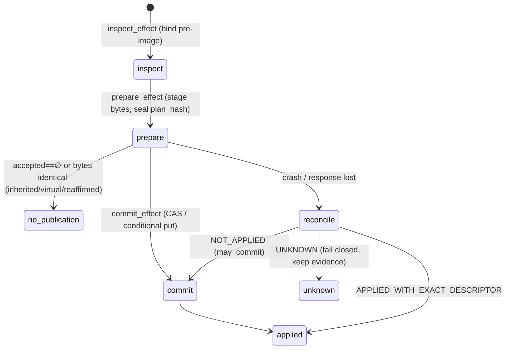

- **Local files** (`_local_file_effects.py`, used by csv, json, text and
  document): the body is streamed into `.{target}.elspeth-{effect_id}.stage`
  beside the target, fsynced, and bound by sha256, size and
  `st_dev:st_ino` (`:202-229`, `:401-569`). Commit takes a bounded `flock` on
  `.{target}.elspeth.lock` (`:609-627`), re-checks the target's pre-image and
  the staged inode, then runs `os.replace` and fsyncs the directory
  (`:642-689`). Reconcile returns APPLIED only when the target holds the exact
  staged inode and the stage is gone. It returns NOT_APPLIED when both the
  stage and the predecessor still match, and UNKNOWN otherwise (`:692-730`).
  Row limit 10 M, byte limit 1 GiB (`:40-41`).
- **Remote objects** (`_remote_object_effects.py`, used by aws_s3 and
  azure_blob): the body is staged under the spool at
  `ELSPETH_EFFECT_SPOOL_DIR` or `./.elspeth/sink-effect-spool/<provider>/<effect_id>.body`
  (`:335-348`), with a provider checksum (sha256 for S3, md5 for Azure,
  `:268`). There are five closed publication kinds (`:34`), a replace
  authority re-checked at commit (`require_commit_authority` `:664-682`), and
  a restage from durable member payloads when the spool body is lost
  (`:685-716`).
- **Diversions:** a sink calls `BaseSink._divert_row` while it serialises
  (`base.py:1970`; for example `csv_sink.py:446-477`). Each diverted ordinal
  carries `DiversionAttribution(ordinal, reason_hash, error_hash)`
  (`_diversion_attribution.py:30-40`), and `error_hash` is computed with
  `engine._error_hash.compute_error_hash` so the sink's value matches the
  engine's audit routing.

**Effect capability matrix (MEASURED, live probe):**

| Sink | Modes | Input kinds | Extra capability | Determinism | supports_resume |
|---|---|---|---|---|---|
| csv | append, write | pipeline_members, audit_export_snapshot | — | io_write | True |
| json | append, write | pipeline_members, audit_export_snapshot | — | io_write | False |
| text | append, write | pipeline_members | — | io_write | True |
| document | write | pipeline_members | — | io_write | False |
| database | append | pipeline_members | target-side ledger | io_write | True |
| aws_s3 / azure_blob | write | pipeline_members | Restaging | io_write | False |
| chroma_sink | overwrite | pipeline_members | Member | io_write | False |
| dataverse | upsert | pipeline_members | Member | external_call | False |

All 9 sinks declare `sink-effect-v1`.

### Audited clients: three recording patterns (MEASURED)

1. **Auto-recording** (`AuditedClientBase` subclasses: HTTP and LLM). Exactly
   one of `state_id` or `operation_id` is allowed (`clients/base.py:180-181`).
   Call indices come from the `CallRecorder` (`:227-243`) and are fenced by the
   member token and work item or by the coordination token. LLM call
   governance hooks run before and after each call (`:194-198`, `:282-285`).
2. **Caller-records**: `DataverseClient`, and the S3 and Azure sources, call
   `ctx.record_call()` themselves (for example `aws_s3_source.py:847`).
3. **Self-records through the repository**: `ChromaSearchProvider` calls
   `execution.record_call` directly (`retrieval/chroma.py:276`).

### Concurrency model

- `BatchTransformMixin` runs worker threads for *within-row* fan-out. The
  engine's `TransformExecutor` blocks per row, so rows are processed in
  sequence (`batching/mixin.py:50-57`). A non-daemon release thread emits in
  FIFO order. Worker and release failures are latched and re-raised on the
  next orchestrator call (`:270-295`).
- `PooledExecutor` runs within-row multi-query dispatch with AIMD pacing. Its
  `execute_batch` is single-flight (`pooling/executor.py:258-266`), which is
  safe only because rows are serialised above it (INFERRED from the two
  docstrings).
- `rasterize/` puts `pypdfium2` in a spawn-context single-worker process with
  `RLIMIT_CPU`, a memory limit and orphan cleanup (`worker.py:1-40`,
  `renderer.py:1-6`).
- `AuditedClientBase.update_call_context` mutates a shared client and says it
  is "safe because row processing is serial within a transform"
  (`clients/base.py:321-339`). The only caller is `AzureSearchProvider`, which
  runs under the synchronous `RetrievalTransformBase`, not the batching mixin.
  The claim therefore holds today (MEASURED: callers grep).

---

## Data & persistence

- **No Landscape tables are owned here.** The slice writes to the audit trail
  only through `CallRecorder` / `ExecutionRepository` protocols
  (`clients/base.py:106-110`) and `SourceContext` / `SinkContext`. Sink-effect
  rows (`sink_effect_streams`, `sink_effects`, `sink_effect_members`,
  `sink_effect_attempts`) belong to `core/landscape`. This slice supplies the
  bounded, credential-free `safe_evidence` mappings that those rows persist.
- **Versioned evidence schemas (string constants, not DB epochs):**
  `local-file-effect-plan-v1` / `local-file-effect-inspection-v1`
  (`_local_file_effects.py:44`, `:269`), `remote-object-effect-plan-v2` /
  `...-inspection-v1` (`_remote_object_effects.py:31-32`),
  `audit-export-directory-bundle-plan-v1` and the `audit_manifest.v2.json`
  manifest (`_audit_export_bundle_effects.py:49-52`), `sink-effect-v1` (the
  protocol version, from `contracts`). `NORMALIZATION_ALGORITHM_VERSION`
  (`field_normalization.py:27`) is written to the audit trail with each field
  resolution.
- **Filesystem state it owns:** staging and lock files next to local targets,
  `*.building` temp bodies (cleaned after one hour, at most 16 per sweep:
  `_local_file_effects.py:321-358`, `_remote_object_effects.py:362-400`), and
  the remote spool (mode 0700 set with `os.chmod` on the provider directory,
  `:413`).
- **External target state it owns:** `DatabaseSink`'s target-side effect
  ledger table (`database_sink.py:132-153`). The runbook requires the schema
  owner to provision it; the runtime role stays DML-only
  (`docs/runbooks/sink-effect-recovery.md` §Database sinks).
- **Process state:** the plugin-manager singleton; the `OpenRouter` catalogue
  cache (`llm/model_catalog.py`, primed at web lifespan); the
  `_PLUGIN_PREFLIGHT_MODE` ContextVar; `sys.modules` aliases created by
  discovery.
- **Where invariants are enforced:** almost entirely in code (plan-hash
  re-derivation, closed field sets, exact-type checks). The only DB-backed
  invariant here is the database sink's target-side ledger uniqueness.

---

## Dependencies

All counts come from `temp/import-matrix.md` as module-level / lazy /
TYPE_CHECKING, unless marked MEASURED-grep.

**Inbound**

- `plugins.transforms → plugins.infrastructure` 165/5/7, `plugins.sinks → plugins.infrastructure` 40/0/0, `plugins.sources → plugins.infrastructure` 32/0/0, `plugins.llm → plugins.infrastructure` 1/0/0.
- `web.composer → plugins.infrastructure` 10/24/1, `web.execution` 10/2/1, `web.sessions` 5/0/0, `web.plugin_policy` 3/0/0, `web.acceptance` 3/0/0, `web.catalog` 2/0/0, `web.(root)` 1/5/0, `web.audit_readiness` 0/1/0.
- `cli → plugins.infrastructure` 0/9/1, `cli_helpers` 3/0/0, `cli_plugins` 2/0/0, `config_loading` 0/1/0, `testing` 1/3/1.
- `web.composer → plugins.sources` 5/0/0, `web.execution → plugins.sources` 2/1/0, `web.acceptance → plugins.sinks` 1/0/0 and `→ plugins.sources` 1/0/0, `web.composer → plugins.llm` 0/1/0.
- **Engine → plugins = 0 rows.** The engine consumes plugin instances only
  through `contracts` protocols.

**Outbound**

- `plugins.infrastructure → contracts` 90/21/28, `→ core` 8/2/1, `→ core.security` 4/3/0, `→ core.landscape` 2/0/3, `→ core.dag` 0/2/1, **`→ engine` 1/1/0**, `→ plugins.sources` 0/1/0.
- `plugins.sinks → contracts` 94/7/5, `→ core` 4/0/0, `→ core.landscape` 1/0/0 (`_audit_export_bundle_effects.py:47` `CSVFormatter`), **`→ engine` 1/0/0**, `→ plugins` (root) 1/0/0 (`aws_s3_common`).
- `plugins.sources → contracts` 66/3/1, `→ core` 2/0/0, `→ core.landscape` 1/0/0 (`sources/llm/source.py:28` `PluginAuditWriterAdapter`), `→ plugins.llm` 1/0/0, **`→ plugins.transforms` 13/0/0**, `→ plugins` (root) 1/0/0.
- `plugins.llm → contracts` 6/0/0, `→ core` 4/0/0, `→ plugins.infrastructure` 1/0/0 (`pricing.py:6` `parse_json_strict`).

### Adjudication 1: `plugins.infrastructure → engine` and `plugins.sinks → engine` are PERMITTED

These are the exact imports (MEASURED grep, which matches the matrix counts):

| Edge | Import | Kind |
|---|---|---|
| infra → engine | `runtime_factory.py:24-27` `from elspeth.engine.orchestrator.preflight import validate_audit_export_sink_type_capability, validate_sink_effect_type_capability` | module-level |
| infra → engine | `runtime_factory.py:210` `from elspeth.engine.orchestrator.preflight import validate_value_source_compliance` | lazy |
| sinks → engine | `sinks/_diversion_attribution.py:11` `from elspeth.engine._error_hash import compute_error_hash` | module-level |

**Verdict: not a violation.** ADR-006 defines L0 contracts, L1 core, L2
engine and L3 plugins, with *downward-only* imports
(`docs/architecture/adr/006-layer-dependency-remediation.md:14-17`, `:80`). An
L3→L2 import goes downward. The enforcing lint agrees: `LAYER_HIERARCHY` maps
only `contracts/core/engine` (`elspeth-lints/.../tier_model/rule.py:409-413`),
treats everything else as L3, and skips L3 files entirely (`:2298-2300`
`if file_layer >= 3: return [], []`). `01-discovery-findings.md` §5.1 lists
these edges under the question of whether they cross the boundary. They do
not, and that framing should be corrected.

Two structural observations remain (neither is a defect):

- `engine/_error_hash.py` is **pure stdlib** (`hashlib` only, lines 21-41).
  Its 13 importers include `web/_aws_ecs_acceptance/bedrock.py:43` and this
  sink helper, and all of them import a module whose name marks it
  engine-private. `core/landscape/execution/sink_effect_finalization.py:81-99`
  cannot import upward from core, so it re-implements the attribution
  wire-shape check and `_is_lower_hex`. This is the placement-by-topic shape
  that ADR-006 fixed for `ExpressionParser` by moving it down a layer.
  `contracts` would be the natural home (INFERRED).
- `runtime_factory` says it is "L3-neutral plugin infrastructure"
  (`runtime_factory.py:3-5`). Importing it pulls in 9 `elspeth.engine.*`
  modules (MEASURED probe: `engine`, `engine.orchestrator`, `.preflight`,
  `.types`, `.validation`, `.value_source_validation`, `.plugin_types`,
  `.ports`, `.run_state`). It is an application-assembly module that lives in
  the plugin package.

### Adjudication 2: the `plugins.{sources ↔ transforms}` cycle is real at package level, with two unrelated arms and no module-level cycle

MEASURED grep. It matches the matrix: sources→transforms 13, transforms→sources 6 module-level and 3 lazy.

- **Arm A, sources → transforms (13 imports, all in `sources/llm/`):**
  `sources/llm/config.py:47-49` (`LLM_GUARANTEED_SUFFIXES`,
  `build_llm_source_output_schema_config`, `OutputFieldConfig`,
  `ResponseFormat`, `PromptTemplate`); `sources/llm/source.py:44-53`
  (`populate_llm_operational_fields`, `LangfuseTracer`,
  `create_langfuse_tracer`, `LLMAuditParent`, `LLMProvider`, `LLMQueryResult`,
  `classify_finish_reason_failure`, `AzureLLMProvider`, the **private**
  `_configure_azure_monitor`, `BedrockCredentials`, `BedrockLLMProvider`,
  `GatewayLLMProvider`, `OpenRouterLLMProvider`, `PromptTemplate`,
  `AzureAITracingConfig`, `TracingConfig`, `parse_tracing_config`, and three
  `validation` helpers).
- **Arm B, transforms → sources (6 module-level and 3 lazy, all `sources.field_normalization`):**
  `transforms/blob_json_expand.py:53`, `blob_csv_expand.py:32`,
  `json_explode.py:39`, `field_mapper.py:30`, `value_transform.py:31`,
  `line_explode.py:35`; lazy at `transforms/llm/base.py:149,646,774`.
- **Arm C, closing the runtime SCC with infrastructure:**
  `config_base.py:588` lazily imports
  `sources.field_normalization.check_declared_fields_reachable`. Also
  `sources/llm/config.py:14` imports `plugins.llm.config_validation`.
- **No module-level import cycle.** `field_normalization` imports nothing from
  `transforms`, and no `transforms` module imports `sources.llm` (MEASURED:
  `grep elspeth.plugins.sources transforms/` shows only field_normalization).
  The SCC exists because two unrelated dependencies meet at package
  granularity.
- **Root causes (INFERRED from the tree):**
  1. `plugins/llm/__init__.py` calls itself "Provider-neutral support shared by
     LLM sources and transforms", but only `pricing`, `config_validation` and
     `model_catalog` moved there. The provider stack, templates, tracing,
     langfuse and validation stayed in `transforms/llm/`
     (`transforms/llm/model_catalog.py` is a 30-line compatibility re-export).
     The LLM source (`1994bf969`) was built on the transform's stack.
  2. `field_normalization` is boundary vocabulary that the source, transform
     and config layers all need, but it lives under `sources/`.

### Latent discovery namespace collision (Low)

`discovery.py:180-181` builds the private module name from
`py_file.parent.name` only. Both `sources/llm/*.py` and `transforms/llm/*.py`
therefore become `elspeth.plugins._discovered.llm.<stem>` (MEASURED probe:
`_discovered.llm.config` is `sources/llm/config.py`, and
`_discovered.llm.transform` and `_discovered.llm.model_catalog` are from
`transforms/llm/`). No stem collides today (MEASURED: `comm -12` of the two
directory listings shows only `__init__.py`, which is excluded). Adding
`config.py` to `transforms/llm/` or `transform.py` to `sources/llm/` would
silently overwrite the `sys.modules` entry at `discovery.py:197-198`.

---

## Patterns observed

1. **Nominal typing for owned things, parsing for foreign things (ADR-032).**
   There are `isinstance` checks against concrete owned classes
   (`clients/base.py:201-213`, `sources/llm/source.py:268`) and exact-type
   gates (`type(x) is not int`) across the effect evidence parsers
   (`_local_file_effects.py:158-195`). `runtime_checkable` protocols are not
   used for dispatch.
2. **Class-creation-time contract enforcement:** determinism, the
   `input_schema` property, `_plugin_component_type` (`config_base.py:409-450`),
   and the discovery name check.
3. **Adapter-owned decisions with framework verification.** Sinks resolve
   their own effect mode (`_resolve_sink_effect_mode`). The framework only
   checks the returned type (`runtime_factory.py:186-187`) and capability
   (`engine.preflight`).
4. **Seal-then-verify evidence.** Every plan re-derives `plan_hash` from its
   own evidence on parse (`_local_file_effects.py:591-599`,
   `_remote_object_effects.py:635-642`) and fails closed on divergence.
5. **Crash-test seams as named no-op functions**, for example
   `_after_replace` (`_local_file_effects.py:638`) and the four
   `_before/_after_*` seams in `_audit_export_bundle_effects.py:952-966`.
6. **Composer teaching lives on plugin classes.** `get_agent_assistance` and
   `get_post_call_hints` return prose that names composer tools
   (`inspect_source`, `request_interpretation_review`): 13 references across
   6 source files and `base.py` (MEASURED grep). Plugins therefore know the
   composer's tool vocabulary.
7. **Record-then-raise at every Tier-3 failure** in the LLM client
   (`llm.py`, 8 or more `_record_call` + `raise` blocks inside
   `chat_completion`), so a malformed provider response still leaves an audit
   row.
8. **Tier-3 metadata decorators** (`@trust_boundary`, `@observation_boundary`)
   carry `test_ref` and `test_fingerprint` pins (`runtime_factory.py:254-265`,
   `llm/pricing.py:9-18`).

---

## Invariants & how they are enforced

| Invariant | Enforcement |
|---|---|
| Every plugin declares determinism in its own class body | Code: `TypeError` in `__init_subclass__` (`base.py:678`, `:1880`, `:2285`). Test: `test_determinism_declaration_contract.py`. |
| Plugin names are unique per kind | Code: `discovery.py:323-330` and again in `manager.py:217-237`. |
| Only sources coerce (`allow_coercion=True`) | **Convention only**: default `allow_coercion: bool = True` at `schema_factory.py:93` fails open. MEASURED: all 43 production call sites pass the argument explicitly; the 7 coercing sources pass True, all sinks and transforms pass False, and `blob_rows` passes False. No lint pins this. |
| Self-created fields are never required on input, and consumed ones stay required | Code: `base.py:1260-1324`. Tests: `test_self_created_input_demotion.py`, `tests/invariants/test_input_schema_config_is_captured.py`. |
| Build-time and runtime plugin-config validation agree | Test: `tests/unit/plugins/test_validation_path_agreement.py`. |
| A local publication is the exact planned inode | Code: CAS under `flock` plus post-replace identity check (`_local_file_effects.py:651-683`). |
| A remote replace needs a live authority | Code: `require_commit_authority` (`_remote_object_effects.py:664-682`). |
| Audit-export bundles never replace an existing tree | Code: `renameat2(RENAME_NOREPLACE)` (`_audit_export_bundle_effects.py:1046-1078`) plus a filesystem allowlist. Works on Linux only. |
| Accepted and diverted ordinals exactly partition the input rows | Code: `_local_file_effects.py:480-487`. Core re-checks attribution in `sink_effect_finalization.py:81-95`. |
| Exactly one audit parent (`state_id` XOR `operation_id`) per client | Code: `clients/base.py:180-181`. |
| Every external call is recorded | **Mixed.** Automatic for `AuditedClientBase` subclasses. Convention for caller-records clients (Dataverse, S3/Azure sources) and self-recording (Chroma). I found no lint or test that proves an unrecorded path cannot exist (INFERRED; not searched exhaustively). |
| HTTP error text in audit carries no raw URLs | Code: the `_record_call` override sanitises every `HTTPCallError` (`http.py:195-217`). This covers the raw `str(e)` messages built at `:605` and `:887`. |

---

## Baseline delta: what ARCHITECTURE.md says versus what the tree shows

| ARCHITECTURE.md (or ADR) claim | Pinned tree | Evidence |
|---|---|---|
| "Plugins ~65,400" lines (`ARCHITECTURE.md:175`) | 66,811 (`plugins/` total). This slice is 33,871. | MEASURED `wc -l` |
| §3.3 diagram "Sources (9 registered)" shows 6 components; "Sinks (9 registered)" shows 5 | The tables at `:446` and `:449` list all 9 and 9, which matches the live registry. The diagram omits `text, blob_rows, dataverse` (sources) and `chroma_sink, dataverse, document, text` (sinks). The document is internally inconsistent. | `ARCHITECTURE.md:365-400` vs `:446-449`; live probe |
| §3.3 places "Protocols", "Results" and "PluginContext" inside the Plugins subsystem | They live in `contracts/` (`plugin_protocols`, `results`, `plugin_context`, `contexts`). `plugins/infrastructure/results.py` is a 21-line re-export. | `results.py:1-21`; `ARCHITECTURE.md:469` itself says `contracts/plugin_context.py` |
| "Clients: 4 audited clients (HTTP, LLM, Replayer, Verifier)" (`:450`) | HTTP and LLM are live. **Replayer and Verifier have no production consumer.** There are 3 more external clients (`DataverseClient`, `AzureSearchProvider`, `ChromaSearchProvider`) with different recording patterns, which the baseline omits. | MEASURED grep (C-01); `clients/dataverse.py:6`; `retrieval/chroma.py:160,276` |
| `RunMode` "Stored in database (runs.run_mode)" (`contracts/enums.py:374`) and "replay/verify" modes | `run_mode` and `replay_from` are validated (`core/config.py:2077-2084`, `:2350`) and **read nowhere else**. `core/landscape` has no `run_mode` column. | MEASURED exhaustive grep; see C-01 |
| "PluginManager — pluggy-based discovery and registration" (`:445`) | pluggy is only a registry. All registration goes through generated `DynamicHookImpl`s built from a folder scan, and third-party entry-point plugins are not loaded. | `manager.py:163-182`, `discovery.py:363-398` |
| BaseSink lifecycle `on_start → write → flush → on_complete → close` (the `base.py:1602-1649` docstring and example) | All 9 sinks raise `RuntimeError("… requires the recoverable sink effect coordinator")` from `write()`. Publication happens only through `inspect/prepare/commit/reconcile_effect`. The engine never calls `sink.write` (control: the only engine hit is a docstring at `engine/executors/sink.py:559`). | MEASURED grep 9/9 (C-02) |
| ADR-006: 4-layer, downward-only, CI-enforced | Holds for this slice. plugins→engine edges are downward. The lint does not check L3 files at all, so *intra-L3* structure (plugins ↔ web, sources ↔ transforms) is unchecked by design. | `rule.py:409-413`, `:2298-2300` |
| ADR-021: sources and sinks are uniformly boundary | Holds as a classification (web audit-readiness predicate). The code matches it: every source coerces or quarantines at Tier-3, and every sink goes through fenced effects. | `csv_source.py`, `_local_file_effects.py` |
| Baseline omits the sink-effect adapter layer inside plugins (`_local_file_effects`, `_remote_object_effects`, `_audit_export_bundle_effects`, `_diversion_attribution`, about 3,000 lines together) | It mentions `SinkEffectCoordinator` (engine) and `SinkEffectRepository` (core), but not the adapter half that owns staging, CAS, spool, restage and reconcile semantics. | files listed |
| Baseline omits `plugins/llm/` (provider-neutral catalogue and pricing) and `rasterize/` (process-isolated PDF rendering) | Present: 888 and 463 lines. | MEASURED |

---

## Concerns

| ID | Severity | Concern | Evidence (file:line at pin) | New / previously reported |
|---|---|---|---|---|
| C-01 | **High** | **Replay and verify run modes are declared, validated and documented, but not wired.** `ElspethSettings.run_mode ∈ {live, replay, verify}` plus `replay_from` are validated, and nothing reads them afterwards. A config that sets `run_mode: replay` makes **live** external calls with no error (INFERRED from the absence of any consumer). `CallReplayer` and `CallVerifier` have zero production consumers, yet about 10 closed tracker bugs show they were hardened. Per the maintainer's "debt removal ≠ deleting unfinished intent" ruling, treat this as unfinished wiring, not as dead code. | `core/config.py:2077-2084,2345-2352`; `contracts/enums.py:371-383`; exhaustive grep of `run_mode\|RunMode` finds only config, enums and `web/composer/yaml_importer.py:119`; consumers of `CallReplayer\|CallVerifier` are only `clients/__init__.py` and tests | **NEW.** No open tracker row. Closed bugs elspeth-7dd8f1aaf1, -c4b3d7bfa1, -55dbfec615, -116d98f421, -d943c8f11a concern client internals only |
| C-02 | Medium | Sink contract drift: `BaseSink.write` and `flush` stay `@abstractmethod`, and the class docstring and example teach `write()`. Every built-in sink implements `write` as `raise RuntimeError`. The real contract (`inspect/prepare/commit/reconcile_effect`) is only a marker class (`SinkEffectContract`) with admission-time checks. A new sink author is shown the wrong interface. | `base.py:1597-1650,1914-1935`; 9/9 sinks raise (for example `csv_sink.py:515-517`, `database_sink.py:1073-1075`); `contracts/sink_effects.py:1434-1440` | NEW |
| C-03 | Medium | Three separate Tier-3 CSV/JSON parsers with different hardening: `csv_source` (file streaming), `azure_blob_source._load_csv` (bounded in-memory, 251 lines), `aws_s3_source._load_csv` (spooled, with a per-record character bound). Their `CSVOptions` and `JSONOptions` models differ (S3 is `frozen`, Azure is not). A fix to one boundary does not reach the others. | `azure_blob_source.py:88-135,639-890`; `aws_s3_source.py:82-120,545-575,1094-1193`; `csv_source.py:265-640` | NEW (tracker elspeth-0c64f334e5, closed, shows drift of this kind has already happened once) |
| C-04 | Medium | The remote-effect spool root depends on the process CWD (`./.elspeth/sink-effect-spool`) unless `ELSPETH_EFFECT_SPOOL_DIR` is set. Plans seal the absolute stage path, so a resume or recovery from another working directory fails closed with "stage is not the configured effect-addressed path" until the original CWD is restored. No deploy manifest sets the variable (MEASURED grep of `deploy/` and `Dockerfile`: the only hits are the code and two docs). | `_remote_object_effects.py:335-348,619-622`; `docs/runbooks/sink-effect-recovery.md` §Object stores | PREVIOUSLY-REPORTED in part: the runbook documents it; elspeth-501ce2e9e9 (closed) moved the default off `/tmp`; elspeth-4008eddcb6 (triage) covers spool-root permissions |
| C-05 | Medium | Plugin constructors double as validators. Runtime construction skips `validate_*_config` and depends on each `__init__` calling `from_dict`, while composer probes run the constructors. A constructor that raises something other than `PluginConfigError` can crash composer validation. | `runtime_factory.py:112-120`; `manager.py:316-383`; `web/composer/state.py:1803,2104` | PREVIOUSLY-REPORTED (elspeth-cb82aa6225, triage) |
| C-06 | Medium | External-call recording is enforced by three different mechanisms (automatic, caller-records, self-records). Only the first is structural. A new caller-records client path has no guard. | `clients/base.py:245-307`; `clients/dataverse.py:6,250`; `retrieval/chroma.py:160,276`; `aws_s3_source.py:847` | NEW (INFERRED risk) |
| C-07 | Medium | Jinja rendering has no CPU or memory bound. The module states the assumption "templates are authored by pipeline architects (trusted config), not end users", but on the web surface an LLM planner or a user authors prompt templates. The sandbox blocks attribute access, but nested loops are not bounded. | `infrastructure/templates.py:1-9` | NEW (INFERRED; the web-side bounds belong to another slice) |
| C-08 | Low | The sink attribution wire shape `{error_hash, ordinal, reason_hash}` and `_is_lower_hex` are defined twice, in plugins and core, because core cannot import plugins. The two can drift. | `sinks/_diversion_attribution.py:62-90`; `core/landscape/execution/sink_effect_finalization.py:81-99` | NEW |
| C-09 | Low | A layer-private stdlib module is imported across layers: `engine/_error_hash` has 13 importers, including a sink helper and web. | `sinks/_diversion_attribution.py:11`; `web/_aws_ecs_acceptance/bedrock.py:43` | NEW |
| C-10 | Low | `discovery.EXCLUDED_FILES` holds 24 names, and **20 of them match no file** in any scanned directory. They are infrastructure or legacy filenames (for example `aimd_throttle.py`, `pooled_executor.py`, `capacity_errors.py`, `hookimpl.py`). Exclusion is by filename across all scanned directories, so a future plugin file named `http.py` or `llm.py` would be skipped without any message. | `discovery.py:28-57`; MEASURED loop over `PLUGIN_SCAN_CONFIG` dirs | NEW |
| C-11 | Low | The `_discovered.<parent>.<stem>` namespace for `sources/llm` and `transforms/llm` can collide (latent; see Adjudication 2). | `discovery.py:180-198` | NEW |
| C-12 | Low | Private symbols are imported across modules: `runtime_factory.py:287` takes `core.config._ENV_VAR_PATTERN`; `sources/llm/source.py:47` takes `transforms.llm.providers.azure._configure_azure_monitor`; `probe_factory.py:12-15` takes `retrieval.connection._validated_chroma_http_client_args`. | cited lines | NEW |
| C-13 | Low | Three `capability_tags` docstrings are bare string expressions placed *after* `check_web_local_requirements`, so they document nothing. | `base.py:346-376`, `:1739-1747`, `:2184-2192` | NEW |
| C-14 | Low | `assert` in production control flow, which is stripped under `-O`: `runtime_factory.py:424`, `_local_file_effects.py:471`, `_remote_object_effects.py:726,757`. | cited lines | NEW |
| C-15 | Low | A second registry: `web/audit_readiness/service.py:382` builds its own `PluginManager()` and runs discovery again instead of calling `get_shared_plugin_manager()`. The module identity reuse in `discovery.py:174-175` keeps the classes identical. | cited | NEW (cross-slice; bbeffc7425 and 0a6010d468 concern only the shared singleton) |

Checked and dropped: HTTP error-message URL leakage (`http.py:605,887`) is
sanitised centrally at `http.py:209-214`. The `update_call_context`
shared-client race does not occur, because its only caller is synchronous.

---

## Complexity & tech-debt hotspots

MEASURED with an `ast` walk over the four directories.

| Function | Lines | Location |
|---|---:|---|
| `AuditedLLMClient.chat_completion` | 513 | `clients/llm.py:434` |
| `CSVSource._load_from_file` | 376 | `sources/csv_source.py:265` |
| `DataverseClient._execute_request` | 272 | `clients/dataverse.py:474` |
| `AzureBlobSource._load_csv` | 251 | `sources/azure_blob_source.py:639` |
| `DataverseSource._load_rows` | 227 | `sources/dataverse.py:770` |
| `CallVerifier.verify` | 210 | `clients/verifier.py:338` (unwired, C-01) |
| `AuditedHTTPClient.request_ssrf_safe` / `_follow_redirects_safe` | 194 / 188 | `clients/http.py:742/960` |
| `prepare_local_effect` | 169 | `sinks/_local_file_effects.py:401` |
| `JSONSink.prepare_effect` | 148 | `sinks/json_sink.py:418` |
| `prepare_remote_object` | 147 | `sinks/_remote_object_effects.py:464` |
| `instantiate_plugins_from_config` | 131 | `infrastructure/runtime_factory.py:86` |

Largest classes: `BaseTransform` 1,389 lines, `AuditedHTTPClient` 1,053,
`DatabaseSink` 944, `AzureBlobSource` 889, `DataverseSource` 774.

- **Fused responsibilities.** `BaseTransform` combines the execution
  contract, schema demotion, ADR-013 capture, invariant-probe hooks, catalogue
  prose and composer assistance. About 60 % of its 1,389 lines are
  explanatory comments. That keeps the reasoning auditable but makes the class
  the slice's main change magnet (INFERRED).
- **Repetition.** The `record_validation_error` + `quarantined` pair appears
  12, 14, 6, 6, 6 and 4 times per source. The `_record_call` + `raise` blocks
  in `chat_completion` repeat for each malformed-response branch.
- **Vestigial surfaces:** abstract `BaseSink.write/flush` (C-02); 20 dead
  `EXCLUDED_FILES` entries (C-10); `transforms/llm/model_catalog.py`, a
  30-line re-export shim that discovery still executes; `CallReplayer` and
  `CallVerifier` (C-01, unwired rather than dead).
- **TODO / FIXME:** 0 in `src/elspeth` (MEASURED; positive control: the same
  grep finds `TODO` in `tests/unit/cli/test_plugin_errors.py:347`).
  Suppressions (`noqa` or `type: ignore`) in the slice: 18, mostly the pluggy
  hookspec empty bodies and the discovery `.name` access.

---

## Test map

MEASURED `find … -name 'test_*.py' | wc -l` at the pin.

| Directory | Test files | Covers |
|---|---:|---|
| `tests/unit/plugins/` (all) | 230 | whole plugin tree |
| `tests/unit/plugins/infrastructure/` (+ `clients/`, `rasterize/`) | 27 | base semantics, demotion, runtime_factory, display headers, templates, telemetry, probe factory |
| `tests/unit/plugins/sinks/` | 23 | every sink, plus `test_local_file_sink_effects.py`, `test_remote_object_sink_effects.py`, `test_audit_export_bundle_effects.py` |
| `tests/unit/plugins/sources/` | 16 | every source, field normalisation, safe validation errors |
| `tests/unit/plugins/clients/` | 10 | HTTP, LLM, replayer, verifier, fingerprinting |
| `tests/unit/plugins/llm/` | 45 | mostly LLM transforms and providers (shared with the transforms slice) |
| `tests/unit/plugins/{batching,pooling}/` | 2 + 2 | mixin, reorder buffers, executor |
| `tests/unit/plugins/` root | ~35 | manager, discovery, hookimpl registration, validation-path agreement, base contracts, catalogue metadata |
| `tests/integration/plugins/` | 33 | including live provider lanes (`_azure_live.py`, `_dataverse_chroma_live.py`) and the state-engine lifecycle matrix |
| `tests/property/plugins/` | 14 | property tests |
| `tests/invariants/` | 14 | pass-through, input-schema capture, semantic satisfiability |
| Engine-side effect tests | — | `tests/unit/engine/test_sink_effect_spool_recovery.py`, `test_sink_effect_virtual_predecessor.py`, `integration/pipeline/test_audit_export_effect_recovery.py`, `testcontainer/core/test_audit_export_snapshot_postgres.py` |

**Gaps (MEASURED by module-path grep over `tests/`, which undercounts
indirect coverage):**

- `plugins.llm.pricing.observe_http_provider_cost` has 0 direct test
  references. It is reached indirectly through the OpenRouter and gateway
  providers.
- `infrastructure.sentinels`, `infrastructure.output_paths`,
  `clients.json_utils` and `plugins.llm.model_catalog` each have 1 test
  referencing them.
- No test asserts that `run_mode: replay` changes behaviour (C-01). The config
  alignment test lists `run_mode` and `replay_from` as known fields only
  (`tests/unit/core/test_config_alignment.py:437-441`).
- No test covers a spool-root change between prepare and recover (C-04 is
  documented, not tested; INFERRED from the test names).

---

## Confidence

**High** for architecture, adjudications and the listed concerns.
**Medium** for complexity judgements about files I only outlined.

- **Read in full:** `hookspecs.py`, `manager.py`, `discovery.py`, `base.py`
  (2,480 lines), `runtime_factory.py`, `schema_factory.py`,
  `clients/base.py`, `clients/__init__.py`, `_local_file_effects.py`,
  `_remote_object_effects.py`, `_diversion_attribution.py`, `preflight.py`,
  `results.py`, `utils.py`, `llm/pricing.py`, `aws_s3_common.py`, and the
  package `__init__`s.
- **Read in large part:** `csv_source.py` (headers, load, row loop,
  assistance), `config_base.py` (`PluginConfig`, `DataPluginConfig`),
  `batching/mixin.py` (init, accept, failure latch), `pooling/executor.py`
  (constructor, `execute_batch`), `clients/http.py` (constructor,
  `_record_call`, `_execute_request`, SSRF entry), `clients/llm.py`
  (constructor, `chat_completion` structure), `csv_sink.py` effect methods,
  and the `llm/model_catalog.py` docstring.
- **Outlined only** (signatures and grep): `aws_s3_source.py`,
  `azure_blob_source.py`, `json_source.py`, `dataverse.py` (source and sink),
  `text_source.py`, `blob_rows.py`, `sources/llm/*`, `database_sink.py`,
  `aws_s3_sink.py`, `azure_blob_sink.py`, `chroma_sink.py`, `json_sink.py`,
  `document_sink.py`, `text_sink.py`, `_audit_export_bundle_effects.py`,
  `replayer.py`, `verifier.py`, `fingerprinting.py`, `clients/dataverse.py`,
  `retrieval/*`, `rasterize/*`, `display_headers.py`, `azure_auth.py`,
  `templates.py` (header and visitor list).
- **Live probes** (the pin's `src` on `PYTHONPATH`, `elspeth.__file__`
  verified): the registry contents, `_discovered` module identities, the sink
  capability matrix, source metadata, and the engine modules loaded by
  importing `runtime_factory`.
- **Not done:** no pytest runs; the lint gate was not run; the retired code index index
  was not consulted (grep at the pin was authoritative and sufficient);
  sink-by-sink effect correctness beyond csv was not traced.

## Validation corrections

- [validator] Public interface said "`AuditedLLMClient` is constructed only in `transforms/llm/providers/azure.py:27`" -> it is constructed in `providers/azure.py:256,309` **and** `providers/bedrock.py:302,341`; `azure.py:27` is the import line (evidence: `grep -rn "AuditedLLMClient(" src/elspeth` at the pin; the other hits are docstring examples in `clients/__init__.py:12`, `clients/llm.py:303`, `core/landscape/execution/calls.py:134`). This also reconciles S07 with S08's "Azure and Bedrock go through `AuditedLLMClient`".


---

# S08 — Plugins B: Transforms (`plugins/transforms/`)

**Location:** `src/elspeth/plugins/transforms/` — top level (38 files) plus `llm/` (10 + `providers/` 5), `aws/` (13), `azure/` (8), `rag/` (6). All paths below are relative to the pinned worktree `.claude/worktrees/arch-analysis-pin` @ `85ebf2739` (`release/0.8.1`).

**Measured size:** 32,940 lines in 80 `.py` files, plus one directory guide, `AGENTS.md`. That is 49 % of `plugins/` (66,811 lines).
```
$ find src/elspeth/plugins/transforms -name '*.py' | xargs wc -l | tail -1   ->  32940 total
$ find src/elspeth/plugins/transforms -name '*.py' | wc -l                    ->  80
$ find src/elspeth/plugins/transforms -type f ! -name '*.py'                  ->  AGENTS.md
```

**Registry count (MEASURED through the discovery code path):** `discover_all_plugins()` returns **38 transforms**, 9 sources and 9 sinks.
```
PYTHONPATH=<pin>/src <repo>/.venv/bin/python -c "from elspeth.plugins.infrastructure.discovery import discover_all_plugins; ..."
elspeth.__file__ = <pin>/src/elspeth/__init__.py      (provenance checked)
sources 9 / transforms 38 / sinks 9                     (no optional-dependency skip warnings)
```

**Responsibility:** This slice holds every row-level and batch-level transform plugin. Each one takes a `PipelineRow` (or a buffered list of rows) and returns a `TransformResult`. Some rows are enriched by audited external calls (LLM, OCR, safety screening, retrieval, HTTP). Other transforms are pure deterministic reshaping or statistics. None of them owns any persistence of its own.

---

## Key components

Every file over 300 lines has its own row. Smaller files are grouped at the end.

| File | Lines | Role |
|---|---:|---|
| `llm/transform.py` | 2058 | `LLMTransform` (plugin `llm`) is the unified LLM transform. It holds the provider registry `_PROVIDERS` (azure / openrouter / bedrock / gateway, :226-234, cross-checked against `core.llm_provider_validation.LLM_PROVIDER_NAMES`). It has two strategies, `SingleQueryStrategy` (:256) and `MultiQueryStrategy` (:491), where multi-query runs sequentially or in parallel through `PooledExecutor`. It also carries the lifecycle, runtime preflight, the forward-invariant probe, about 100 lines of composer teaching hints (:1901-2003), and `get_post_call_hints` (:2007). |
| `llm/base.py` | 897 | `LLMConfig`, the shared Pydantic config. Eight after-validators enforce template/contract rules: required_input_fields declared (:592), no dynamic row access (:553), declared fields appear in the template (:667), variable bindings (:717, 167 lines), prompt-artifact hash anchor (:432), and single-mode structured-output rules (:487). It also holds the Jinja AST scan for `row.source_row.*` (:99) and repair texts shared with the composer (`MULTI_QUERY_UNDECLARED_COLUMNS_REMEDY` :72). |
| `llm/providers/gateway.py` | 929 | `GatewayConfig` and `GatewayLLMProvider`. HTTP transport to the ELSPETH LLM gateway. Checks the contract-major header, maps errors on `error.code` only, and sends one static error text (`_STATIC_GATEWAY_ERROR`). Preflight is `/readyz` plus a smoke completion. |
| `llm/providers/openrouter.py` | 664 | `OpenRouterConfig` and `OpenRouterLLMProvider`. Raw httpx through `AuditedHTTPClient`, followed by a separately recorded *logical* `CallType.LLM` row. Tier-3 body validator at :129-208. Client cache is reference-counted. |
| `llm/providers/azure.py` | 405 | `AzureOpenAIConfig` and `AzureLLMProvider`, a thin wrapper over `AuditedLLMClient` (openai SDK, `max_retries=0`, always `max_completion_tokens`). Also Azure Monitor tracing bootstrap as process-global mutable state (:333-405). |
| `llm/provider.py` | 396 | The `LLMProvider` protocol (`@runtime_checkable`, :364), the `LLMAuditParent` row/operation parent discriminator (:64), `FinishReason` / `UnrecognizedFinishReason`, the fail-closed finish-reason classifier (:250), and the `LLMQueryResult` DTO (:331). |
| `llm/multi_query.py` | 378 | `QueryDefinition` (authoring model), `QuerySpec` (frozen runtime spec), `OutputFieldConfig`, `ResponseFormat`, and `resolve_queries()`, which applies the cross-query rules. |
| `llm/providers/bedrock.py` | 361 | Bedrock through LiteLLM (`_LiteLLMSDKAdapter` exposes an SDK-shaped `.chat.completions.create`). Credentials are injected below the audited client, and error text is redacted to a static string. |
| `llm/langfuse.py` | 304 | Langfuse tracer (Active / NoOp factory). SDK failures are contained and logged; `TIER_1_ERRORS` are re-raised. |
| `llm/validation.py`, `templates.py`, `tracing.py`, `image_inputs.py` | 276/280/208/187 | Tier-3 JSON field extraction and the structured-response directive; the sandboxed Jinja `PromptTemplate` with template/variables/lookup hashes; tracing config parse; blob-ref → `ImagePart` resolution. |
| `llm/__init__.py` | 488 | Guaranteed and audit suffix vocabularies, output-schema builders, `build_llm_audit_metadata` (audit provenance → `success_reason.metadata`, not into the row). |
| `aws/textract_document_analysis.py` | 1111 | `aws_textract_document_analysis`: async S3-staged OCR. Pipelined (`BatchTransformMixin`). Idempotent `ClientRequestToken` derived from run/node/token/location (:674-704). Bucket-region verification by HeadBucket with per-bucket coalescing. Bounded polling (:864-954). Profiled audit identity bound with an HMAC fingerprint compare (:428-458). |
| `aws/textract_client.py` | 856 | `TextractClient` / `TextractInlineClient`, both `AuditedClientBase` subclasses that are **plugin-local**, not in `infrastructure/clients`. Counts SDK send attempts per thread; bounded semantic responses. |
| `aws/textract_result.py` | 797 | Tier-3 normalizer for the Textract block graph: pages, tables, forms, queries, signatures, layout, and child-graph cycle checks. |
| `aws/textract_inline_analysis.py` | 744 | `aws_textract_inline_analysis`: synchronous AnalyzeDocument on payload-store bytes (at most 5 MiB). |
| `aws/guardrails_client.py` | 640 | `BedrockGuardrailsClient` (an `AuditedClientBase`) and the strict `ApplyGuardrail` response parser (coverage, metrics, outputs). |
| `aws/textract_bucket_region.py` | 460 | `HeadBucketClient` (audited) and `BucketRegionCoordinator` (in-flight de-duplication). |
| `azure/document_intelligence.py` | 866 | `azure_document_intelligence`: POST 202 then an Operation-Location poll through `AuditedHTTPClient`. The poll host is pinned to the endpoint (`operation_location_host_matches`). Capacity retry is bounded by the poll deadline. |
| `azure/base.py` | 589 | `BaseAzureSafetyTransform`: pipelined field scanning, a per-`state_id` `AuditedHTTPClient` cache, a row-scoped capacity-retry loop, and the Azure-host allowlist for the subscription key (:59-85). |
| `azure/content_safety.py` / `prompt_shield.py` | 415 / 346 | Category thresholds that fail closed (unknown, duplicate or missing category → error); prompt-attack detection. |
| `rag/core.py` | 505 | `RetrievalOutputConfig` and `RetrievalTransformBase` (abstract): query build → search → format → four prefixed output fields; Welford telemetry accumulators. |
| `blob_json_expand.py` / `blob_csv_expand.py` / `blob_text_expand.py` | 956 / 813 / 559 | Payload-store (or row-field) text → one row per record (`creates_tokens=True`). |
| `blob_fetch.py` | 642 | SSRF-safe URL fetch → bytes stored in the payload store → `blob_ref`. |
| `web_scrape.py` | 1054 | SSRF-safe scrape → html2text/bs4 extraction, fingerprint, payload-store write of the processed content. |
| `pdf_rasterize.py` | 754 | PDF → page PNGs through `infrastructure.rasterize` (worker subprocess with RLIMIT). Pages are stored in the payload store. |
| `field_mapper.py`, `reference_join.py`, `json_explode.py`, `line_explode.py`, `type_coerce.py`, `value_transform.py`, `keyword_filter.py` | 802/708/613/540/550/541/373 | Deterministic reshaping. `reference_join` carries its table **in config** (`reference_content`), so the table content feeds node identity (:1-16). |
| 12 × `batch_*.py` + `report_assemble.py` | 340–606 each | Batch-aware (`is_batch_aware=True`) aggregation plugins: stats, top-k, drift, effect size, classifier metrics, paired preference, outlier annotator, replicate, and others. |
| Grouped small files (<300) | — | `passthrough` 119, `truncate` 286, `safety_utils` 45, `_batch_row_types` 77, `_scalar_buckets` 28, `blob_expand_contract` 37, `web_scrape_{errors,extraction,fingerprint}` 96/86/41, `azure/{ai_search 189, errors 10, document_intelligence_result 79}`, `aws/{_guardrail_transform 275, guardrail_profiles 157, guardrails_live_check 134, textract_config_shared 130, bedrock_content_safety 104, bedrock_prompt_shield 78, textract_regions 37}`, `rag/{transform 185, query 225, formatter 97, config 78}`, `llm/model_catalog.py` 30 (a compatibility re-export of `plugins.llm.model_catalog`). |

### Registered transforms (MEASURED: class attributes read from the discovered classes)

| plugin | determinism | batch-aware | creates_tokens | pipelined (`BatchTransformMixin`) | web_config_authority | content_trust | runtime preflight |
|---|---|---|---|---|---|---|---|
| `llm` | non_deterministic | – | – | yes | operator_profiled | untrusted | yes |
| `aws_textract_document_analysis` | external_call | – | – | yes | operator_profiled | untrusted | – |
| `aws_textract_inline_analysis` | external_call | – | – | yes | **user_configurable** | untrusted | – |
| `azure_document_intelligence` | external_call | – | – | yes | user_configurable | untrusted | – |
| `azure_content_safety` / `azure_prompt_shield` | external_call | – | – | yes | user_configurable_with_policy | trusted_internal | – |
| `aws_bedrock_content_safety` / `aws_bedrock_prompt_shield` | external_call | – | – | – | operator_profiled | trusted_internal | – |
| `azure_ai_search` | external_call | – | – | – | operator_profiled | untrusted | yes |
| `rag_retrieval`, `web_scrape`, `blob_fetch` | external_call | – | – | – | user_configurable | untrusted | – |
| `blob_{csv,json,text}_expand`, `pdf_rasterize` | io_read | – | **yes** | – | user_configurable | trusted_internal | – |
| `json_explode`, `line_explode` | deterministic | – | **yes** | – | user_configurable | trusted_internal | – |
| 12 `batch_*` + `report_assemble` | deterministic | **yes** | – | – | user_configurable | trusted_internal | – |
| `field_mapper`, `keyword_filter`, `passthrough`, `reference_join`, `truncate`, `type_coerce`, `value_transform` | deterministic | – | – | – | user_configurable | trusted_internal | – |

Totals: 38 transforms. 13 are batch-aware. 6 create tokens. 6 are pipelined through `BatchTransformMixin`. 5 are `operator_profiled`. 8 declare `content_trust=untrusted`. Capability tags: `llm` (1), `content_safety` (2), `prompt_shield` (2).

---

## Public interface / entry points

- **Plugin surface (primary).** Every transform is reached only through `PluginManager` / `discover_all_plugins()` (`plugins/infrastructure/discovery.py:287-291`, which scans `transforms`, `transforms/aws`, `transforms/azure`, `transforms/llm` and `transforms/rag` without recursing, so `llm/providers/` is never scanned). The engine calls:
  - `process(row, ctx) -> TransformResult` on synchronous transforms;
  - `connect_output(port)` + `accept(row, ctx)` on the 6 `BatchTransformMixin` transforms, which emit results in FIFO order;
  - `process(rows: list, ctx)` on batch-aware aggregations;
  - `on_start(LifecycleContext)`, `runtime_preflight(ctx)` where `requires_runtime_preflight`, `close()`, and the ADR-009 forward/backward invariant probe hooks (`probe_config`, `forward_invariant_probe_rows`, `execute_forward_invariant_probe`).
- **Composer / catalog class-level surface.** The composer and catalog read these class attributes without running the plugin: `get_config_model(config)`, `get_config_schema()` (for `llm` this is a discriminated `oneOf` over `_PROVIDERS`, `transform.py:1265-1320`), `discriminated_variants()`, `get_agent_assistance()`, `get_post_call_hints()` (a `@trust_boundary` over the composer options snapshot, `transform.py:2005-2050`), `output_semantics()`, `is_effective_blocking_control()`, `policy_capabilities`, `web_config_authority`, `content_trust`, and the `usage_when_*` / `example_use` texts.
- **Direct imports from outside the plugin system (MEASURED with a grep over `^\s*from elspeth.plugins.transforms`, excluding the slice itself):**
  - `plugins/sources/llm` reuses the LLM machinery wholesale: `llm.provider`, all 4 `providers.*`, `templates`, `validation`, `multi_query`, `tracing`, `langfuse`, and `llm/__init__`.
  - `web/composer` imports `llm.model_catalog` ×3, `llm.base` ×2, `providers.openrouter` and `field_mapper`.
  - `web/app.py`, `cli.py` ×2 and `web/_aws_ecs_acceptance` import `llm.model_catalog`. It is a re-export of `plugins.llm.model_catalog`, but web/CLI import the re-export and not the canonical module.
  - `web/config.py` and `web/plugin_policy` import `aws.textract_regions` and `aws.guardrail_profiles`.
  - `web/execution` imports `aws.textract_document_analysis`, and `web/provider_config_policy.py` imports `providers.openrouter`.
  - `web/_aws_ecs_acceptance` imports `aws.textract_client`, `guardrails_live_check` and `guardrail_profiles`.
- **No HTTP routes and no CLI commands** are defined in the slice.

## Internal architecture

### Unified LLM transform (the centre of mass)

```mermaid
flowchart LR
  subgraph build["__init__ (config time)"]
    A[raw options] -->|require_lowered_llm_profile_alias| B[strip profile_alias]
    B -->|_PROVIDERS[provider]| C[Provider Config.from_dict<br/>LLMConfig validators]
    C --> D{queries?}
    D -->|None| S[SingleQueryStrategy]
    D -->|set| M[MultiQueryStrategy<br/>+ PooledExecutor if pool_size>1]
  end
  subgraph start["on_start"]
    E[ctx.landscape / telemetry / limiter / payload_store] --> P[_create_provider → Azure|OpenRouter|Bedrock|Gateway]
  end
  subgraph row["_process_row (worker thread)"]
    R[row] --> BL[blank required input?] --> ST[strategy.execute]
    ST --> T[render template THEIR DATA] --> I[resolve image blobs] --> DIR[structured directive]
    DIR --> CALL[provider.execute_query<br/>audit_parent=LLMAuditParent.for_row]
    CALL --> FR[fail-closed finish_reason] --> FEN[strip fences] --> EX[extract_structured_fields Tier-3]
    EX --> OUT[row + response/_usage/_model<br/>audit hashes → success_reason.metadata]
  end
```

- **Construction** (`transform.py:1409-1638`). `require_lowered_llm_profile_alias` consumes the operator-profile admission marker and keeps only the plain alias string, as `profile_alias`. That key is stripped before provider-config validation because every provider config forbids extra fields. The provider class is chosen from `_PROVIDERS`, which is the single registry for config parsing, instantiation, JSON-schema discrimination (`get_config_schema`) and composer knob lowering (`discriminated_variants`). An import-time guard (`:233-234`) raises `FrameworkBugError` if `_PROVIDERS.keys() != LLM_PROVIDER_NAMES` (the core binding contract).
- **Strategy selection.** `queries is None` selects `SingleQueryStrategy`; otherwise `MultiQueryStrategy`.
  - Multi-query output fields are prefixed `<query>_<response_field>`, `<query>_<suffix>`, `<query>_<response_field>_{usage,model}`.
  - Single-query fields are unprefixed.
  - `declared_output_fields` and `_output_schema_config` are computed at construction so DAG validation sees the guaranteed set. For explicit schemas the output schema is **forced to `mode="flexible"`** (`llm/__init__.py:388-395, 466-472`).
- **Provider lifecycle.** Providers are built in `on_start`, because recorder, telemetry, limiter and `llm_call_governance` only exist then. The limiter bucket name is chosen by provider type (`transform.py:1734-1743`).
- **Row processing.** `accept()` hands rows to `BatchTransformMixin`. The concurrency model is: `max_workers = max_pending` (default 30) threads per LLM node, FIFO re-ordering, and `batch_wait_timeout = max_capacity_retry_seconds`. Multi-query can add a second level of concurrency: `PooledExecutor` (AIMD backoff) runs the queries of one row in parallel.
  - Parallel mode passes per-query audit metadata through a lock-protected side channel (`:1039-1080`). A missing entry raises `FrameworkBugError` (`:1147-1154`).
  - Sequential mode runs a bounded exponential local retry on retryable `LLMClientError` (`:889-1009`).
  - Multi-query is **atomic**: any query failure fails the row and records `discarded_successful_queries`.
- **Error taxonomy.**
  - `ContextLengthError` → `context_length_exceeded`.
  - A non-retryable `LLMClientError` → `llm_call_failed` / `multi_query_failed` (not retryable).
  - A retryable `LLMClientError` is **re-raised** so the engine retry (or the pool's AIMD) handles it.
  - Finish reasons fail closed: only `STOP` and an absent reason are accepted (`provider.py:250-269`).
- **Audit shape.** Prompts, responses, the returned model and usage are recorded as `calls` rows by the provider's audited client. The transform adds template, variables, lookup, system-prompt-source and parts hashes to `success_reason.metadata` (`llm/__init__.py:279-323`). Only `response`, `_usage` and `_model` go into the row (the AGENTS.md decision test).
- **Provider asymmetry (MEASURED from code).**
  - Azure and Bedrock go through `AuditedLLMClient`: one `CallType.LLM` row per attempt.
  - OpenRouter and Gateway go through `AuditedHTTPClient` (a transport row) **plus** a hand-recorded logical LLM row (`openrouter.py:516-591`, `gateway.py` `_record_logical_llm_success/_error`). So an OpenRouter or Gateway call produces two `calls` rows per request, and an Azure or Bedrock call produces one.
  - Client-cache strategies also differ. OpenRouter and Gateway use reference counting. Azure and Bedrock pop the cache entry in `finally` with no reference count. The Azure comment presents this as the fix for an OpenRouter bug.
- **Tracing.** Langfuse is an optional out-of-band exporter: row prompt and response content go to a third-party host. Azure AI tracing configures process-global OpenTelemetry once per process (`azure.py:346-405`).

### Cloud document and safety transforms

- **Pattern shared by the pipelined external-call transforms.** Textract (async and inline), Document Intelligence and the Azure safety pair all use:
  - `BatchTransformMixin`;
  - a per-`state_id` audited-client cache that is popped in `finally`;
  - an explicit row-scoped retry or poll deadline;
  - `batch_wait_timeout` computed as `max(configured, poll/retry budget + SDK headroom)`.
- **Textract async** (`textract_document_analysis.py`). The path is:
  1. read the location from row fields or from the static bucket + `key_prefix`;
  2. verify the bucket region: HeadBucket, de-duplicated per bucket by `BucketRegionCoordinator`, with the evidence attached to the success or error reason;
  3. `StartDocumentAnalysis` with a deterministic `ClientRequestToken` (`:674-704`), so an engine retry re-attaches to the same job;
  4. poll with backoff, cycle detection, page, block and byte bounds (`:864-954`);
  5. `normalize_textract_result` → facet fields.

  Shutdown is observed through `ctx.shutdown_event`.
- **Azure safety** (`azure/base.py`). Each configured field is analysed in turn. A missing or non-string explicit field fails closed. `"all"` mode scans only string fields. Capacity (429/503) is retried locally until the deadline. A network error becomes `PluginRetryableError`, which the engine retries.
- **Bedrock guardrails** (`aws/_guardrail_transform.py`) are synchronous `process()` transforms that call `BedrockGuardrailsClient.apply_guardrail`. The parser (`guardrails_client.py:286-397`) rejects partial coverage.

### RAG

`RetrievalTransformBase` (`rag/core.py`) is provider-neutral and synchronous. There are two subclasses with **different readiness mechanisms**:
- `rag_retrieval` (Chroma) runs its readiness check in `on_start` and records it with `ctx.record_readiness_check` (`rag/transform.py:87-169`).
- `azure_ai_search` uses the platform's `runtime_preflight` facility (`azure/ai_search.py:151`).

Provider skip evidence is read back from mutable attributes on the searcher (`last_skipped_count/_reasons`, `rag/core.py`). This is safe only because `process()` is not called concurrently (INFERRED: `grep ThreadPoolExecutor|threading.Thread(` over `engine/` finds only the heartbeat, idle-timeout pump and sink-effects threads).

### Deterministic and batch transforms

- **Batch-aware plugins** receive `list[PipelineRow]` when the aggregation trigger fires and return `success_multi` or a single aggregate row.
- **Type-aware bucketing.** `_scalar_buckets.py` keeps `True` and `1` in separate buckets.
- **Wrong-type handling.** `_batch_row_types.BatchRowTypeError` is the ruled way to report a wrong-type row value: the whole batch fails with a reason. Only `batch_stats` uses it (see Concerns C2).
- **Blob family.** The four blob plugins (`blob_fetch` → `blob_{csv,json,text}_expand`) share field-name defaults through `blob_expand_contract.py`.

### Where state lives

All state is per plugin instance and in memory:
- client caches keyed by `state_id` / `cache_key`;
- Welford accumulators in RAG;
- the bucket-region coordinator;
- the batch-mixin buffers.

Process-global state:
- `_azure_monitor_configured` (`azure.py:347`);
- the Langfuse client inside the tracer object.

Nothing in the slice persists state across runs.

## Data & persistence

- **No tables, no SQL, no schema epochs (MEASURED).** `grep -rn "sqlalchemy|import sqlite3|create_engine|MetaData(|Table(" plugins/transforms` returns 0 hits. Positive control: the same grep over `plugins/sinks` hits `database_sink.py`. `self._recorder.*` is never called directly for writes. The only `ctx.record_*` call is `ctx.record_readiness_check` (`rag/transform.py:163`). Every audit write goes through audited clients that receive the recorder (`execution=self._recorder` / `recorder=self._recorder`, 21 sites) or through `TransformResult` → the engine.
- **Payload-store writes: 3 sites.** `blob_fetch.py:541`, `pdf_rasterize.py:710`, `web_scrape.py:909`. That is exactly the AGENTS.md "2-3 transforms" ceiling for the Shifting-the-Burden warning.
- **Payload-store reads.** The blob expanders, `pdf_rasterize`, `aws_textract_inline_analysis` and `llm` image inputs (`image_inputs.py:98`) read from it. `IntegrityError` propagates as Tier 1. `PayloadNotFoundError` becomes a row error.
- **Where audit data lands:**
  - `calls` rows, written by the audited clients;
  - `node_states.success_reason_json` (audit provenance metadata);
  - error-reason JSON. Some reasons carry Tier-3 excerpts: `raw_response_preview` (500 chars) and `value` (200 chars) in `llm/validation.py:248-274`; `query` in the RAG `no_results` reason.
- **Invariants enforced in code rather than by DB constraints:**
  - `UNIQUE(parent, call_index)` depends on the repository's central `allocate_call_index` (`clients/base.py:41-47`). The plugin caches only avoid churn.
  - `calls.approved_prompt_artifact_hash` is populated only when `LLMConfig._validate_approved_prompt_artifact` (`base.py:431-452`) has proved that the hash matches the effective prompt.

## Dependencies

- **Outbound (MEASURED; `temp/import-matrix.md` rows `plugins.transforms → *`, module-level / lazy / TYPE_CHECKING):**
  - `contracts` 371 / 17 / 19
  - `plugins.infrastructure` 165 / 5 / 7
  - `core` 16 / 5 / 0
  - `plugins.llm` 10 / 0 / 0
  - `plugins.sources` 6 / 3 / 0
  - `core.security` 4 / 0 / 0

  There are **no** edges to `engine`, `web`, `core.landscape`, `cli` or `mcp`. My own grep confirms this. In detail, `core.*` edges are: `canonical` ×6, `templates` ×5, `url_validation` ×3, `llm_pricing` ×2, `expression_parser` ×2, `regex_worker`, `prompt_artifact`, `llm_provider_validation`, `llm_profiles`. The grep found no `from elspeth.engine|web` line; `core` lines matched, which serves as the control.
- **Inbound (MEASURED; import-matrix rows `* → plugins.transforms`):**
  - `plugins.sources` 13 / 0 / 0
  - `web.composer` 6 / 1
  - `web.acceptance` 5
  - `web.(root)` 4
  - `web.plugin_policy` 2
  - `cli` 0 / 2
  - `web.execution` 0 / 1

  The engine does not import the slice; it reaches transforms only through discovery (runtime composition).
- **Cycle carrier (MEASURED).** The package SCC `{plugins.sources, plugins.transforms}` exists on import-time edges. Every `transforms → sources` edge targets **one module, `plugins.sources.field_normalization`**:
  - `blob_json_expand.py:53`, `json_explode.py:39`, `value_transform.py:31`, `field_mapper.py:30`, `blob_csv_expand.py:32`, `line_explode.py:35` (module level);
  - `llm/base.py:149,646,774` (lazy).

  The reverse direction is the LLM source reusing `transforms.llm.*`. Moving `field_normalization` into `plugins.infrastructure` or `contracts` would break the SCC with no behaviour change (INFERRED design option).
- **Transform ↔ `plugins.llm` split.** `plugins/llm/` (S07) holds the provider-neutral `config_validation`, `pricing` and `model_catalog`. `transforms/llm/model_catalog.py` is a 30-line re-export, and it is the path web and CLI actually import (`web/app.py:55`, `web/composer/service.py:69`, `cli.py:1548,1670`, …).

## Patterns observed

1. **Registry-as-single-source-of-truth.** `_PROVIDERS` drives config parsing, instantiation, JSON-Schema `oneOf` and composer variants. It is guarded at import against the core provider-name set (`transform.py:226-234`). RAG has a parallel registry, `rag/config.PROVIDERS`.
2. **Deferred provider construction.** Clients are built in `on_start` and not in `__init__`, because the recorder, telemetry and governance are lifecycle-scoped. This lets the composer construct plugins offline (Stage-1 probes).
3. **Audited-client-per-parent caches** keyed by `state_id` or the operation id, popped per row. The implementations differ: reference-counted in OpenRouter/Gateway, pop-in-finally in Azure LLM, Bedrock, Azure safety and Textract.
4. **Tier-3 boundary functions decorated `@trust_boundary` / `@observation_boundary`**, with `invariant=` prose and sometimes `test_ref` + `test_fingerprint`. Examples: `openrouter.py:129-141`, `gateway.py:232-242, 321-333`, `provider.py:37-43, 296-306`, `transform.py:2007-2019`, `base.py:87-98`.
5. **Static, redacted exception text at provider egress.** Provider text never reaches web-visible messages: `_STATIC_GATEWAY_ERROR`, `_STATIC_BEDROCK_ERROR`, `_summarize_http_error_body`. The full bodies stay in the audited call payload.
6. **Forward-invariant probes that swap in a fake dependency.** `LLMTransform` swaps `_provider`. The Azure safety base and `RetrievalTransformBase` write to `self.__dict__` to override a method or attribute (`azure/base.py:271-297`, `rag/core.py`). These are dynamic-attribute sites that the whole-tree gates pin.
7. **The plugin layer owns the composer's teaching and repair text.** Composer-facing text lives in plugin classes:
   - `get_agent_assistance` hints (LLM: 30 hint strings);
   - `usage_when_*` texts;
   - `_UNDECLARED_ROW_FIELDS_REMEDY` / `MULTI_QUERY_UNDECLARED_COLUMNS_REMEDY`, which are imported by the composer so both layers show one remedy;
   - error messages that name composer tools (`patch_node_options`, `set_pipeline/upsert_node`: `base.py:658-660, 710-712`).
8. **Configuration-as-content for determinism.** `reference_join` keeps its table inline in config so the table content is hashed into node identity (`reference_join.py:1-16`).
9. **Fail-closed security screens.** Unknown, duplicate or missing Azure categories are errors. Threshold 6 is treated as a non-blocking control (`is_effective_blocking_control`). Explicitly configured scan fields that are missing fail the row.

## Invariants & how they are enforced

| Invariant | Enforcement |
|---|---|
| Transforms own no tables and write only through audited clients or `TransformResult` (closed interface) | **Convention and code review only.** Grep-verified at the pin (see Data). No lint rule was found. No in-tree statement was found either: grep for "closed interface", "row in, row out", "plugin-owned table" over `docs/architecture`, `ARCHITECTURE.md`, `AGENTS.md` and `plugins/` returned 0 hits. Positive control: "audit provenance" hits 3 files. |
| Provider registry equals the core provider-name contract | Code assertion at import (`transform.py:233`). |
| Only `STOP` or an absent finish reason is accepted | Code (`provider.py:250-269`); tests `tests/unit/plugins/llm/test_transform.py`. |
| `LLMQueryResult.content` is non-empty and `model` is non-empty | `__post_init__` (`provider.py:350-361`). |
| An LLM audit parent is exactly one of row or operation | `LLMAuditParent.__post_init__` (`provider.py:75-91`). |
| A template reading row fields declares `required_input_fields`, and multi-query columns are covered | Pydantic after-validators (`base.py:591-883`). |
| An approved prompt hash matches the effective prompt | Validator (`base.py:431-452`). |
| `source_file_hash` is current | `elspeth-lints` rule `plugin_contract/plugin_hashes`. Its **`PLUGIN_DIRS` omits `plugins/transforms/aws`** (`elspeth-lints/.../plugin_hashes/rule.py:23-31`), yet 4 AWS plugins declare hashes. |
| The Content Safety key is sent only to Azure hosts on :443 | Validator (`azure/base.py:59-85`). |
| A Textract resubmit is idempotent | Deterministic `ClientRequestToken` (`textract_document_analysis.py:674-704`); `TextractIdempotencyInvariantError` becomes `FrameworkBugError`. |
| Multi-query output keys do not collide | `resolve_queries` (`multi_query.py:324-376`). Partial: see C3. |
| A wrong-type row value in a batch fails the batch (not the run) | `BatchRowTypeError` in `batch_stats` only (C2). |

## Baseline delta — ARCHITECTURE.md says / tree says

| ARCHITECTURE.md (or ADR) claim | Pinned tree shows | Evidence |
|---|---|---|
| Plugins ≈ 65,400 lines (`ARCHITECTURE.md:175`) | `plugins/` 66,811. Transforms alone 32,940 / 80 files. | `find … | xargs wc -l` (above; 00-coordination.md) |
| Transforms "including LLM, RAG retrieval, web scrape, `blob_fetch`, `blob_csv_expand`, `azure_document_intelligence`, `aws_textract_document_analysis`, …" (`:447`) | 38 registered. Not named in the baseline: `aws_textract_inline_analysis`, `azure_ai_search`, `pdf_rasterize`, `blob_json_expand`, `blob_text_expand`, `reference_join`, `line_explode`, `truncate`, `keyword_filter`. The baseline correctly defers the count to the registry. | registry probe |
| Component diagram shows `LLMTransform` → `AuditedLLMClient` (`:392,428`) | Only Azure and Bedrock use `AuditedLLMClient`. OpenRouter and Gateway use `AuditedHTTPClient` plus a hand-recorded logical LLM call, which gives two `calls` rows per request. | `openrouter.py:385-455`, `gateway.py` `_record_logical_llm_*` |
| "Clients: 4 audited clients (HTTP, LLM, Replayer, Verifier)" (`:450`) | Three more `AuditedClientBase` subclasses live **inside this slice**: `TextractClient`/`TextractInlineClient`, `BedrockGuardrailsClient`, `HeadBucketClient`. | `aws/textract_client.py:343,437,700`; `aws/guardrails_client.py:431`; `aws/textract_bucket_region.py:243` |
| ADR-006 strict layering `contracts → core → engine → plugins` | Holds for this slice: 0 imports of engine, web or landscape. But `plugins.sources ↔ plugins.transforms` is an import-time SCC carried entirely by `field_normalization`. | import-matrix; grep above |
| Context system: LLM providers "Azure OpenAI, OpenRouter, AWS Bedrock" (`:76`) and the gateway as an external system | Four providers in `_PROVIDERS`, including `gateway`. `LLMTransform.get_agent_assistance` summary still names only three (`transform.py:1907`). | code |
| ADR-020: retire batch-LLM transforms in favour of unified `llm` | Done. There are no provider-specific LLM plugin files. Discovery `EXCLUDED_FILES` still lists the retired helper names `aimd_throttle.py` and `capacity_errors.py`, which exist nowhere (S07). | `discovery.py:47-51`; `find` |
| ADR-001: plugin-level concurrency is pool-based with FIFO | Holds, in two layers: `BatchTransformMixin` (≤30 workers per node) and `PooledExecutor` for multi-query. The nesting (rows × queries) is not described. | `transform.py:1712-1724, 1517-1520` |
| Missing coverage | The baseline does not describe: the operator-profile `web_config_authority` model and the Textract profiled audit identity; the payload-store/blob plugin family; the RAG readiness split; forward-invariant probes; the composer teaching text owned by plugins; the Langfuse / Azure Monitor egress of row content. | — |

## Concerns

| ID | Severity | Concern | Evidence (file:line at pin) | New / previously reported |
|---|---|---|---|---|
| C1 | **High** | A profile-only `azure_ai_search` node always fails composer Stage 1: the plugin is `OPERATOR_PROFILED` and only `llm` gets an inert probe stub. | `azure/ai_search.py:88,92`; `web/composer/_validation_probe.py:66` | PREVIOUSLY-REPORTED (web-review **R01**; elspeth-bc527113e7) |
| C2 | **High** | 10 batch-aware `batch_*` transforms plus `report_assemble` (11 plugins) still `raise TypeError` on a wrong-type row value. The slice's own `_batch_row_types.py:1-31` documents that this **aborts the run** (0 failed, traceback, exit 4). Only `batch_stats` was converted. MEASURED: `grep -c 'raise TypeError'` gives ≥1 in classifier_metrics, distribution_profile, drift_compare (2), effect_size, experiment_compare, outlier_annotator, paired_preference, replicate, threshold_summary, top_k and report_assemble; `BatchRowTypeError` appears only in `batch_stats`. | e.g. `batch_top_k.py:237-242`, `batch_drift_compare.py:281-282,309-310`, `report_assemble.py:278-279`; the aggregation executor has no TypeError conversion (`engine/executors/aggregation.py:461` is output-hash only) | PREVIOUSLY-REPORTED (elspeth-5887fb7928, status `fixing`; 1 of 12 batch-aware done; half 2 blocked on elspeth-d2e3f29d10) |
| C3 | **Medium** | In **multi-query** mode an `output_fields` suffix equal to `response_field` (or to `<response_field>_model`/`_usage`) is **accepted**. At runtime the typed extracted value is silently overwritten by the raw content or model string. Single-prompt mode rejects the same suffix (`base.py:512-524`), but `resolve_queries` reserves only `{usage, model, error}`. MEASURED with `OpenRouterConfig.from_dict`: suffix `llm_response` → ACCEPTED; `llm_response_model` → ACCEPTED; `usage` → REJECTED; single-mode `llm_response` → REJECTED (control). | `multi_query.py:347-352`; overwrite at `transform.py:811-817` then `populate_llm_operational_fields` (:819) | NEW |
| C4 | **Medium** | `TransformResult.error(retryable=True)` is inert. The engine never reads `TransformResult.retryable`; it retries only raised `PluginRetryableError` / `CapacityError`. MEASURED: `grep "\.retryable"` over `engine/` finds only exception reads (5); `grep "result\.retryable"` over `src/` finds only `llm/transform.py:984,1136`. Textract (async and inline) returns `poll_timeout` / transient service errors as `retryable=True` results, so they are **never retried** and go straight to error routing. The Azure safety base already documents this trap and raises instead (`azure/base.py:426-429`), as does Document Intelligence (`document_intelligence.py:599`). | `aws/textract_document_analysis.py:725,787,882,890,899,910`; `aws/textract_inline_analysis.py:542`; `contracts/results.py:262,477` ("should be retried") | NEW (the contract-level inertness may also be raised by S01/S06) |
| C5 | Medium | The source-hash lint skips `plugins/transforms/aws` although 4 AWS plugins declare `source_file_hash`. A stale hash there is never caught. | `elspeth-lints/src/elspeth_lints/rules/plugin_contract/plugin_hashes/rule.py:23-31` versus `discovery.py:289` | PREVIOUSLY-REPORTED (elspeth-81ce151db8) |
| C6 | Medium | The integer output-field validator accepts integral floats (`3.0`) and passes the **float** through into an `int`-declared column. | `llm/validation.py:69-72, 275` | PREVIOUSLY-REPORTED (elspeth-03e97ef3c3, confirmed live in 09-22 triage) |
| C7 | Medium | Posture asymmetry. `aws_textract_inline_analysis` is `USER_CONFIGURABLE` with `auth_mode: default_chain` (the host's ambient AWS identity) and an author-chosen region. Its async sibling is `OPERATOR_PROFILED` specifically so "a web author never chooses where a server credential is sent" (ai_search's wording, `ai_search.py:90-92`). `web/plugin_policy` has no inline-Textract special case (grep: only `aws_textract_document_analysis` appears). INFERRED; whether a web deployment actually enables this plugin is not measured. | `aws/textract_inline_analysis.py:98-102` (fields), `:251-265` (class attrs); registry probe | NEW (needs S19 confirmation) |
| C8 | Medium | Cross-provider audit shape differs. OpenRouter/Gateway write a transport `HTTP` call row **and** a logical `LLM` row per request; Azure/Bedrock write one `LLM` row. The baseline diagram shows only `AuditedLLMClient`. Consumers that count LLM calls per state (cost reports, `get_llm_usage_report`, call-cardinality contracts) must filter by `call_type`. | `openrouter.py:385-455, 516-591`; `azure.py:216-223` | NEW (related: elspeth-db49a254f8, LLM fan-out has no cross-node call-cardinality contract) |
| C9 | Low | Runtime preflight parameters differ by provider. Azure omits temperature and uses 2048 completion tokens for reasoning deployments. OpenRouter sends `temperature=0.0` with 256 tokens. Bedrock and Gateway send `temperature=0.0` with **32** tokens, which can exhaust on reasoning models or be rejected. INFERRED risk. | `azure.py:270-279`; `openrouter.py:593-602`; `bedrock.py:318-323`; `gateway.py` `_smoke_test_completion` (~:860-866) | NEW |
| C10 | Low | Transforms → web composer coupling through text. Plugin config error messages embed composer tool names (`patch_node_options`, `set_pipeline/upsert_node`). These are wrong on the planner surface, which lacks `patch_node_options`. | `llm/base.py:658-660, 710-712`; `MULTI_QUERY_UNDECLARED_COLUMNS_REMEDY` :72-80 | PREVIOUSLY-REPORTED (web-review **R31** for the composer copy; the plugin-owned copy is the same class) |
| C11 | Low | `plugins.sources ↔ plugins.transforms` import-time SCC, carried entirely by `plugins/sources/field_normalization.py` (9 import sites). | import-matrix SCC list; grep in Dependencies | PREVIOUSLY-REPORTED at package level (01-discovery §5.1); the single-module carrier is NEW |
| C12 | Low | Duplicated logic. `SingleQueryStrategy.execute` (212 lines) and `MultiQueryStrategy._execute_one_query` (255 lines) repeat the render → image → directive → call → finish → trace → extract pipeline. SSRF helpers (`_validate_cidr_entry`, `_parse_allowed_ranges`, `_final_response_ip`) are copied between `blob_fetch.py:60-205` and `web_scrape.py:78-437`. `_is_payload_hash` is copied ×3 (`blob_{csv,json,text}_expand.py:255/313/144`). The logical-LLM-call recording and reference-counted client cache are duplicated between OpenRouter and Gateway. | as cited | NEW |
| C13 | Low | Doc drift in the slice guide. `transforms/AGENTS.md:42-48` prescribes `recorder.store_payload(...)`, but no `def store_payload` exists anywhere in `src/` (MEASURED; control: `PayloadStore.store` exists at `contracts/payload_store.py:50`). `blob_expand_contract.py:32-34` says "`source` is the discriminator every expander in the family exposes", but `BlobTextExpandConfig` has no `source` field (`blob_text_expand.py:72-93`). The `get_agent_assistance` summary omits `gateway` (`transform.py:1907`). | as cited | NEW |
| C14 | Low | `transforms/__init__.py` eagerly imports `TypeCoerce` and `ValueTransform`, which have no importers (grep `from elspeth.plugins.transforms import`: 0 in src). Any `plugins.transforms.*` import (e.g. web importing `llm.model_catalog`) therefore executes those plugins and `field_normalization`. The registry probe shows these two are the only transforms loaded under canonical module names instead of `_discovered.*`. `rag/__init__.py:1-7` documents why eager package imports are hazardous for discovery. | `transforms/__init__.py:12-18` | NEW |
| C15 | Low | Tier-3 excerpts in error reasons. `raw_response_preview` (500 chars of LLM output), `value` repr (200 chars) and `available_fields` (LLM-chosen keys) are persisted into row error reasons, and the RAG `no_results` reason carries the full `query`. These are auditable, but they reach web-visible error surfaces unless redacted downstream. | `llm/validation.py:248-274`; `rag/core.py` `no_results_error_reason` | NEW (INFERRED exposure; related to elspeth-71a4a4845b, base64 image data URLs survive redaction) |
| C16 | Low | Content-trust labelling. The blob expanders and `pdf_rasterize` declare `content_trust=trusted_internal` although their bytes typically come from `blob_fetch` or `web_scrape` (remote, untrusted). Correctness therefore depends on upstream taint propagation. | registry probe table | PREVIOUSLY-REPORTED class (elspeth-ed9f5be337, untrusted-content admission does not propagate taint from source roots) |
| C17 | Low | `LLMProvider` is `@runtime_checkable`. It is used only in test `isinstance` asserts (4 test files), and production dispatch is nominal (`isinstance(self._config, AzureOpenAIConfig)`, `transform.py:1780-1843`). There is no live violation of ADR-032's "never a runtime_checkable Protocol as a control", but the decorator invites misuse. | `llm/provider.py:364`; grep `isinstance(.*LLMProvider)` → tests only | NEW |

## Complexity & tech-debt hotspots

MEASURED with an AST walk over the slice.

- **Largest functions (lines):**
  - `MultiQueryStrategy._execute_one_query` 255 (`llm/transform.py:586`)
  - `LLMTransform.__init__` 230 (`:1409`)
  - `SingleQueryStrategy.execute` 212 (`:277`)
  - `blob_text_expand.process` 196
  - `web_scrape.process` 171
  - `LLMConfig._validate_template_variable_bindings` 167 (`llm/base.py:717`)
  - `MultiQueryStrategy._execute_parallel` 166
  - `RetrievalTransformBase.process` 163
  - `OpenRouterLLMProvider.execute_query` 152
  - `json_explode.process` 149
  - `field_mapper.process` 144
  - `batch_replicate.process` 143
- **Largest classes (lines):**
  - `LLMTransform` 867, of which about 100 lines are composer hint prose
  - `AWSTextractDocumentAnalysis` 809
  - `LLMConfig` 735
  - `MultiQueryStrategy` 685
  - `WebScrapeTransform` 616
  - `BlobJSONExpand` 595
  - `AzureDocumentIntelligence` 586
- **Fused responsibilities.**
  - `LLMTransform` mixes runtime row processing, provider factory, schema/contract derivation, composer teaching (`get_agent_assistance`, `get_post_call_hints`) and invariant-probe harness.
  - `LLMConfig` mixes config shape with a Jinja static analyser and the composer repair-message catalogue.
- **Vestigial or dead code (MEASURED):**
  - `llm/validation.validate_json_object_response` is referenced only by `tests/unit/plugins/llm/test_validation.py`.
  - `tracing.validate_tracing_config` is documented as "retained for callers that import it" (`tracing.py:192-208`).
  - The eager `transforms/__init__` exports (C14).
  - `llm/__init__.__all__` omits `_build_llm_output_schema_config` and `build_llm_source_output_schema_config`, which `transform.py` and the LLM source import.
- **Duplicated knowledge.** `contracts/schema.py:77,1110-1116` hard-codes the LLM guaranteed suffixes and keys a heuristic on plugin name `"llm"` (a contracts-layer mirror of plugin behaviour; cross-slice S01).
- **TODO/FIXME/XXX/HACK markers:** 0 (MEASURED).
- **retired-code-index.** `entity_dead_list(scope=plugins/transforms)` returned 0 candidates with `scope_truncated=true`, so it is not informative.

## Test map

MEASURED with `find … -name 'test_*.py' | wc -l`.

| Directory | test files | Covers |
|---|---:|---|
| `tests/unit/plugins/transforms/` (top) | 43 of 70 | one file per deterministic, batch and blob transform (`test_batch_*` ×12 + 2 integration, `test_blob_*` ×4, `test_web_scrape*` ×5, `test_reference_join`, `test_pdf_rasterize`, …); forward/backward invariant probes; catalogue metadata |
| `tests/unit/plugins/transforms/aws/` | 12 | every AWS module except `textract_regions` and `textract_config_shared` (the latter is covered through 3 importers) |
| `tests/unit/plugins/transforms/azure/` | 10 | content safety, prompt shield, DI (+ result), ai_search. It also **houses** `test_blob_sink*` and `test_blob_source`, which belong to S07 (misplaced). |
| `tests/unit/plugins/transforms/rag/` | 5 | config, core, formatter, query, transform |
| `tests/unit/plugins/transforms/llm/` | 1 | `test_value_sources.py` only |
| `tests/unit/plugins/llm/` | 45 | the real LLM transform suite: all 4 providers, lifecycle, multi-query, templates, tracing, langfuse, image inputs, post-call hints, pricing. The directory does not mirror the source path. |
| `tests/integration/plugins`, `tests/property/plugins`, `tests/e2e` | 33 / 14 / 37 | 88 files across integration, property and e2e reference transforms by name (grep) |

Gaps (MEASURED as test files importing the module):
- `_scalar_buckets` 0, `_batch_row_types` 0 and `textract_regions` 0. They are exercised only indirectly.
- No test pins the multi-query suffix/`response_field` collision (C3).
- No test asserts that a Textract `poll_timeout` or transient service error is actually retried (C4).

Instrument control: the same grep finds `model_catalog` in 15 files.

## Confidence

**Medium-High.**

- **Read in full:** `llm/transform.py`, `llm/base.py`, `llm/provider.py`, `llm/multi_query.py`, `llm/validation.py`, `llm/templates.py`, `llm/__init__.py`, `llm/image_inputs.py`, `llm/model_catalog.py`, `providers/azure.py`, `providers/openrouter.py`, `providers/bedrock.py`, `azure/base.py`, `azure/content_safety.py`, `rag/transform.py`, `azure/ai_search.py` (to :140), `_batch_row_types.py`, `_scalar_buckets.py`, `blob_expand_contract.py`, `transforms/__init__.py`, `AGENTS.md`, and the relevant parts of `plugins/infrastructure/discovery.py`.
- **Read substantially:**
  - `providers/gateway.py` (:1-400 plus an outline of the rest)
  - `llm/langfuse.py`
  - `rag/core.py` (to row processing)
  - `aws/textract_document_analysis.py` (config, init, identity binding, on_start, idempotency, verification, polling)
  - headers and relevant lines of `batch_stats.py`, `reference_join.py` and `blob_text_expand.py`
- **Sampled by outline or grep only:** DI, prompt_shield, all other `aws/*` modules (function outlines), the blob_csv/json expanders, blob_fetch, web_scrape, pdf_rasterize, field_mapper, json/line_explode, type_coerce, value_transform, keyword_filter, truncate, passthrough, report_assemble, the other 11 batch transforms (TypeError sites only), `rag/{query,formatter,config}`, `tracing.py`, `safety_utils`, the `web_scrape_*` helpers.
- **Measurements run:**
  - registry and class-attribute probe
  - LLM multi-query collision probe (C3) with a single-mode control
  - `canonical_json` on `PipelineRow` (no issue)
  - import greps with controls
  - AST size scan
  - hash-lint `PLUGIN_DIRS`
  - `TransformResult.retryable` reader search
- **Existing evidence consumed:** web review R01, R06, R17, R31, R44, R45; `docs/reviews/2026-09-22-p1-triage.md`; legacy issue tracker `show elspeth-5887fb7928` (read-only).
- **Not done:** retired code index was used only once (not informative). I did not run tests.

---

### Risk Assessment

- **Implementation risk:** Medium.
- **Reversibility:** Easy. Every recommendation is local to plugin code or lint config.
- **Material risks:**
  - **C2, batch TypeError abort** (High × likely on dirty data). Mitigation: finish elspeth-5887fb7928.
  - **C4, inert `retryable=True`** (Medium × likely under Textract throttling or timeouts). Mitigation: raise `PluginRetryableError` as Azure DI does.
  - **C3, silent typed-field overwrite** (Medium × unlikely; needs an unusual suffix). Mitigation: reserve `response_field` and its suffixes in `resolve_queries`.
  - **C7, credential posture** (Medium impact × unknown likelihood). Mitigation: confirm the web allowlist, or make the plugin profiled.
  - **C5, unscanned hash drift** (Low × likely). Mitigation: add `transforms/aws` to `PLUGIN_DIRS`.

### Information Gaps

- Whether any web deployment's plugin allowlist enables `aws_textract_inline_analysis` (decides whether C7 is live).
- Whether `TransformResult.retryable` is consumed by any non-engine reader, such as MCP/TUI reporting or web error surfaces. I searched only `\.retryable` reads in `src/`.
- The runtime behaviour of reasoning models on the OpenRouter/Bedrock/Gateway preflight parameters (C9). I did not test this against live providers.
- The current legacy issue tracker status of elspeth-81ce151db8, 03e97ef3c3 and ed9f5be337. I cited them from the 09-22 triage doc, not a live query.

### Caveats & Required Follow-ups

1. Re-run the C3 probe and the C4 grep at the final synthesis HEAD before promoting either to a ticket.
2. S01/S06 should adjudicate whether `TransformResult.retryable` should be removed from the contract or honoured by the engine. The fix for C4 depends on that decision.
3. S07 should take the `field_normalization` relocation (C11) and the vestigial `EXCLUDED_FILES` entries.
4. S19 should confirm C7.
5. Line numbers are valid at `85ebf2739` only.

## Validation corrections

- [validator] Registered-transforms "Totals" line said "7 create tokens. 7 are pipelined … 7 are `operator_profiled`. 11 declare `content_trust=untrusted`" -> 6 create tokens (blob_csv/json/text_expand, pdf_rasterize, json_explode, line_explode), 6 pipelined (llm, both Textract, azure_document_intelligence, azure_content_safety, azure_prompt_shield), 5 `operator_profiled` (llm, aws_textract_document_analysis, aws_bedrock_content_safety, aws_bedrock_prompt_shield, azure_ai_search), 8 `untrusted` (evidence: live registry dump at the pin with `elspeth.__file__` inside the pin; the per-row table above was already consistent with 6/6/5/8, only the prose total was wrong). 13 batch-aware is correct.
- [validator] Public interface said "the 7 `BatchTransformMixin` transforms" -> 6 (same registry dump, `issubclass(cls, BatchTransformMixin)`).
- [validator] C2 lead said "11 batch-aware transforms plus `report_assemble`" -> 10 `batch_*` transforms plus `report_assemble` (11 plugins). `batch_data_quality_report` has no `raise TypeError` and `batch_stats` uses `BatchRowTypeError` (evidence: `grep -c 'raise TypeError'` per file at the pin). The entry's own MEASURED list already named exactly these 10 + report_assemble. Severity High retained: sites such as `batch_top_k.py:237-242` are reached by row values, and `_batch_row_types.py:12-13` documents the run abort. The "1 of 12" wording in the status column is the tracker's and was left unchanged.


---

# S09 — Operator Surfaces (CLI, config loading, TUI, Landscape MCP, Composer MCP, Telemetry, shipped testing kit)

**Location:** `src/elspeth/cli.py`, `cli_formatters.py`, `cli_helpers.py`, `cli_plugins.py`, `config_loading.py`, `tui/`, `mcp/` (incl. `analyzers/`), `composer_mcp/`, `telemetry/` (incl. `exporters/`), `testing/`. Every path is relative to `src/elspeth/` at the pin `.claude/worktrees/arch-analysis-pin` (`release/0.8.1` @ `85ebf2739`, confirmed with `git log -1`).

**Measured size:** 19,572 lines in 47 files. Instrument (run at the pin): `wc -l cli.py cli_formatters.py cli_helpers.py cli_plugins.py config_loading.py` plus `find <pkg> -name '*.py' | xargs wc -l` for each package.

| Unit | Lines | Files |
|---|---:|---:|
| `cli.py` + `cli_formatters.py` + `cli_helpers.py` + `cli_plugins.py` + `config_loading.py` | 5,739 (4,802 + 197 + 159 + 189 + 392) | 5 |
| `mcp/` (Landscape analysis server) | 4,841 | 10 |
| `telemetry/` | 3,872 | 15 |
| `tui/` | 2,334 | 10 |
| `composer_mcp/` | 1,850 | 4 |
| `testing/` | 936 | 3 |

**Responsibility:** These are the non-browser operator and auditor entry points: the `elspeth` Typer CLI (runs, recovery, lineage, account administration, deployment doctor, web launcher), the YAML settings loader shared with the web tier, the Textual lineage TUI, the two stdio MCP servers (read-only Landscape analysis, and composer-as-MCP), the telemetry egress subsystem (async manager and four exporters), and the test-factory kit shipped inside the wheel.

---

## Key components

| File | Lines | Role |
|---|---:|---|
| `cli.py` | 4,802 | Typer app with 17 leaf commands (live registry walk below). It holds a three-phase settings loader (`_load_settings_with_secrets`, :564-608), the sink-effect preflight chain (:81-160, :611-711), orchestrator setup and teardown (`_orchestrator_context`, :1327-1457), the programmatic sub-pipeline runner `bootstrap_and_run` (:1581-1689), and every command body. Most imports are function-level, which keeps `import elspeth.cli` free of `elspeth.web` (measured below). |
| `config_loading.py` | 392 | Application-level settings loaders. `load_settings` (Dynaconf + YAML, :228-304) is used by the CLI. `load_settings_from_config_dict` (:307-350) and `load_settings_from_yaml_string` (:365-392) are used by the web tier. All three run the env-placeholder guard `_reject_sensitive_plugin_env_placeholders_before_expansion` (:140-210), whose plugin sections and option set are derived from the settings model rather than listed. Carries 3 `@trust_boundary(tier=3)` declarations. |
| `cli_formatters.py` | 197 | EventBus handlers for console and JSON output (`PhaseStarted/Completed/Error`, `RunSummary`, `ProgressEvent`), with `subscribe_formatters` at :186-197. |
| `cli_helpers.py` | 159 | `resolve_database_url`, `resolve_run_id`/`latest`, and `resolve_audit_passphrase`, which reads the SQLCipher key from the env only and returns None without explicit `backend: sqlcipher`. It also re-exports `PluginBundle`, `instantiate_plugins_from_config` and `_make_sink_factory` at module level (:7-25). |
| `cli_plugins.py` | 189 | Typer-free helpers behind `plugins list` and `plugins inspect`. They are built on `web.catalog.service.CatalogServiceImpl`, imported at module level (:12-13). |
| `mcp/server.py` | 993 | Landscape MCP protocol layer. `_TOOLS` is a declarative registry of 32 tools (:122-538), each a `_ToolDef` with `_ArgSpec` and frozen schema. `_validate_tool_args` is the Tier-3 argument gate (:541-621). A `get_mcp_status` tool and degraded mode cover schema-incompatible databases (:648-688). `main()` handles argparse, `ELSPETH_DATABASE_URL` and `.db` auto-discovery (:893-989). |
| `mcp/analyzer.py` | 206 | `LandscapeAnalyzer` facade. It opens `LandscapeDB.from_url(..., read_only=True)` and `RecorderFactory.read_only` (:70-71) and delegates to the four analyzer modules. |
| `mcp/analyzers/queries.py` | 1,295 | CRUD and lineage reads plus the `query` tool. The SQL gate `_validate_readonly_sql` (:1202-1245) strips comments and literals, allows one statement, requires a SELECT/WITH prefix and applies a keyword blocklist. Execution runs under `db.read_only_connection()` with `fetchmany(limit ≤ 1000)` (:1248-1295). |
| `mcp/analyzers/reports.py`, `diagnostics.py`, `contracts.py` | 763 / 479 / 259 | Computed reports that use SQLAlchemy Core directly against `core.landscape.schema` tables (e.g. `reports.py:43-60`, `diagnostics.py:41-110`). They open connections through `db.connection()`, which is an alias of `read_only_connection()` (`core/landscape/database.py:2082-2092`). |
| `mcp/types.py` | 788 | TypedDict wire shapes for all analyzer returns. Outlined only, not read in full. |
| `composer_mcp/server.py` | 1,189 | Composer-as-MCP: 26 web composer discovery and mutation tools plus 6 session tools (32 in all, live count below). The audit envelope in `call_tool` (:733-1008) records every dispatch. `_build_stdio_server` (:1020-1068) wires runtime preflight (`web.execution.validation.validate_pipeline`). A Linux `PR_SET_PDEATHSIG` workaround covers an MCP SDK orphan busy-spin (:1083-1154). |
| `composer_mcp/session.py` | 380 | JSON-file sessions in a scratch directory. The session-ID regex blocks path traversal (:62, :110-124). Saves are compare-and-swap on a SHA-256 of the exact bytes (:208-261), locked in process and across processes with `flock` (:334-347), and written by fsync'd atomic replace (:387-403). |
| `composer_mcp/audit.py` | 258 | `JsonlEventRecorder` writes an append-only, fsync'd `{session}.events.jsonl` sidecar (:483-596) and buffers records until a session ID resolves (:513-551). `verify_events_sidecar_integrity` performs a byte-hash read-back (:599-661). |
| `telemetry/manager.py` | 900 | `TelemetryManager`: a bounded queue, a non-daemon export thread, a circuit breaker per exporter, BLOCK or DROP backpressure, delivery accounting, and an egress projection that strips row hashes (:50-78). |
| `telemetry/factory.py` | 242 | Discovers exporters through a private pluggy `PluginManager` ("elspeth" project name, :168-260). `create_telemetry_manager` returns None when telemetry is disabled (:263-323). |
| `telemetry/exporters/{otlp,azure_monitor,datadog,console}.py` | 620 / 505 / 430 / 252 | Built-in exporters, registered by `BuiltinExportersPlugin` (`exporters/__init__.py:555-561`). OTLP validates endpoint and resource identity (`otlp.py:44-96`). Only outlines, `export` and `configure` were read. |
| `telemetry/{filtering,circuit_breaker,protocols,serialization,…}.py` | 92 / 185 / 148 / 261 / … | Granularity filter `should_emit` (a `match` on event classes), a single-thread circuit breaker, and deliberately non-`runtime_checkable` exporter protocols (`protocols.py:27-68`, ADR-032). |
| `tui/screens/explain_screen.py` | 672 | `ExplainScreen` is a plain state holder, not a Textual `Screen`. It moves through `UninitializedState`, `LoadingFailedState` and `LoadedState` (:58-100) and loads through `RecorderFactory(db)` (:182, :492). |
| `tui/lineage_view.py` | 429 | Pure view-model builder `build_lineage_view_model` (:80). It orders nodes and edges and projects token, parent and outcome rows into `TuiLineageItem`s, using structural `_NodeLike`/`_EdgeLike` Protocols (:14-40) for static typing only. Outlined only. |
| `tui/widgets/node_detail.py` | 391 | `NodeDetailPanel.render_content` (:149, 149 lines) renders node state, errors and artifacts as text. `_validate_*` helpers parse stored error JSON into display TypedDicts. `_validate_coalesce_error` raises `AuditIntegrityError` on missing fields (:59-75), and `_parse_json_object` raises `TypeError` on a non-str or non-dict value (:105-112). Outlined, plus the error-validation site. |
| `tui/widgets/lineage_tree.py` | 317 | `LineageTree._build_tree` (:76, 137 lines) turns `LineageData`/`TuiLineageView` into a frozen `TreeNode` tree, which `get_tree_nodes` flattens (:225-275). Outlined only. |
| `tui/*` (rest) | 525 | `ExplainApp` (Textual App, `explain_app.py` 218 lines, read in full), `types.py` (273, TypedDicts), `constants.py`, `__init__`s. |
| `testing/__init__.py` | 866 | Production-type factories (`make_row`, `make_success`, `make_run_summary`, …) imported by 190 test files. |
| `testing/pytest_xdist_auto.py`, `rasterize_fakes.py` | 43 / 27 | pytest11 plugin that forces `-n auto`, and module-level rasterizer worker fakes that pickle across a process spawn. |

## Public interface / entry points

**Console scripts** (`pyproject.toml:256-263`): `elspeth = elspeth.cli:app`, `elspeth-mcp = elspeth.mcp:main`, `elspeth-composer = elspeth.composer_mcp:main`, and pytest11 `elspeth-xdist-auto = elspeth.testing.pytest_xdist_auto`.

**CLI command surface.** MEASURED from the live Typer registry (`typer.main.get_command(app)` walked recursively at the pin): 17 leaf commands.

| Command | cli.py | Dry-run default? | Notes |
|---|---|---|---|
| `run -s S [--execute] [--dry-run] [-f console\|json]` | :723-1021 | yes (needs `--execute`) | Exit codes: 0/1/2/3 from `cli_completion_for` (:1010-1021), 3 on graceful shutdown or eviction, 4 on Tier-1 or unknown errors. |
| `validate -s S` | :1729-1877 | n/a | Load settings with secrets, instantiate plugins, build the graph, validate. Errors are shown in Rich panels. |
| `explain --run R --database D [--row\|--token] [--sink] [--no-tui\|--json]` | :1025-1250 | n/a | `--database` is mandatory (:1098). Launches `tui.explain_app.ExplainApp` (:1235). |
| `resume RUN [--execute]` | :2958-3436 | yes | Two graphs (validation and execution) (:2652-2706), then `RecoveryManager.can_resume`, sink resume-mode switch before admission (:3058-3074), and output-target validation. |
| `export-resume RUN [--execute]` | :3440-3695 | yes | `engine.orchestrator.export.resume_audit_export`. |
| `abandon RUN [--execute]` | :3717-3926 | yes | Takes over a leaderless run and finalizes it (ADR-038). |
| `join RUN` | :3930-4450 | n/a | Multi-worker follower (ADR-030 §B.1). Builds `PipelineConfig` and the follower processor inline. |
| `purge [--database] [--payload-dir] [--retention-days] [--dry-run] [--yes]` | :2394-2601 | prompt | Implicitly loads `./settings.yaml` from the CWD (:2450). |
| `health [--json] [--check-web]` | :4454-4740 | n/a | Checks version, git SHA, `DATABASE_URL` connectivity, `/app/config` and `/app/output`, plugin counts, and `/api/health`. |
| `web [--port] [--host] [--auth] [--reload]` | :4744-4798 | n/a | Bridges its arguments into `ELSPETH_WEB__*` env vars, then `uvicorn.run("elspeth.web.app:create_app", factory=True)`. |
| `plugins list`, `plugins inspect TYPE NAME` | :1885-1950 | n/a | Goes through `cli_plugins` to `web.catalog`. |
| `composer users add\|remove\|bootstrap-admin` | :2104-2390 | `remove` prompts | Writes auth.db, the sessions DB and a Landscape auth-audit row through `web.auth`/`web.coordination` authorities. |
| `doctor deployment\|aws-ecs [--init-schema] [--json]` | :209-244 | n/a | `web.doctor` collectors. `--json` moves logs to stderr first (:176-186). |

Global callback `main` (:329-377) handles `--version`, `--no-dotenv`, `--env-file`, `--verbose` and `--json-logs`. It configures logging, then loads `.env` without overriding existing env vars (:254-280).

**Landscape MCP tools.** 33 (32 `_TOOLS` + `get_mcp_status`), counted from the live registry. `list_runs, get_run, get_run_summary, list_nodes, list_rows, list_tokens, list_group_records, list_group_losses, get_token_lineage, get_token_children, list_operations, list_artifacts, get_sink_effect_history, get_operation_calls, explain_token, get_errors, get_node_states, list_collisions, get_calls, query, get_dag_structure, get_performance_report, get_error_analysis, get_llm_usage_report, describe_schema, get_outcome_analysis, diagnose, get_failure_context, get_recent_activity, get_run_contract, explain_field, list_contract_violations`. Independent control: this session's harness lists exactly 33 `mcp__elspeth-landscape__*` tools.

**Composer MCP tools.** 32, counted with `len(_build_tool_defs())`. That is the web registry filtered to `_DISCOVERY_TOOLS | _MUTATION_TOOLS` (blob and secret tools excluded, `server.py:115-116, 209-221`), plus `new_session, save_session, load_session, list_sessions, delete_session, generate_yaml`. Independent control: the harness lists 32 `mcp__elspeth-composer__*` tools.

**Library APIs other subsystems call:**
- `config_loading.load_settings_from_config_dict` and `load_settings_from_yaml_string` are called from `web/execution/service.py:41` and `web/execution/validation.py:32`.
- `telemetry.create_telemetry_manager` is called from `web/execution/service.py:3627` (lazy) and `web/_aws_ecs_acceptance/bedrock.py:48`. `telemetry.errors`, `resource_identity` and `serialization` are imported by `web/config.py:30`, `web/operator_telemetry.py:31-32` and `web/_aws_ecs_acceptance/operator_telemetry.py:26-27`.
- `elspeth.testing` factories are used by 190 test files.
- The engine calls `cli.bootstrap_and_run` only through callback injection: `resolve_preflight(..., runner=bootstrap_and_run)` (cli.py:895, :1624; `engine/bootstrap.py:93`). A grep of `engine/`, `contracts/` and `core/` finds the name only in docstrings and comments (`engine/orchestrator/core.py:253`, `run_lifecycle.py:513`, `contracts/preflight.py:70`, `run_lifecycle_repository.py:1837`), which is consistent with matrix engine→cli = 0.

## Internal architecture

### CLI run path (fresh run)

```mermaid
flowchart TD
  A[run -s settings --execute] --> B[_preflight_raw_settings_sink_effects<br/>raw YAML, ${VAR} expanded, adapter eligibility :680]
  B --> C[_load_settings_with_secrets :564<br/>1 raw YAML → 2 Key Vault → env → 3 Dynaconf load_settings]
  C --> D[_require_marked_export :714]
  D --> E[instantiate_plugins_from_config preflight_mode=True :126]
  E --> F[ExecutionGraph.from_plugin_instances + validate :810]
  F --> G[_preflight_execution_sinks → admission receipt :621]
  G --> H[_ensure_output_directories :380 · resolve_audit_passphrase]
  H --> I[engine.bootstrap.resolve_preflight runner=bootstrap_and_run :895]
  I --> J[_execute_pipeline_with_instances :1460<br/>LandscapeDB.from_url · FilesystemPayloadStore · export content store]
  J --> K[_orchestrator_context :1327<br/>EventBus+formatters · RateLimitRegistry · TelemetryManager · CheckpointManager · Orchestrator]
  K --> L[Orchestrator.run → RunResult → cli_completion_for exit code]
```

- **Ordering invariant.** Sink-effect admission happens *before* any output, payload or database directory is created (comment :858-860). Resume switches sinks to append mode *before* admission so the receipt binds the mode that actually runs (:3058-3063, elspeth-fc9906e398).
- **Teardown discipline.** `_close_orchestrator_resources` (:1265-1304) and `_close_landscape_db` (:1307-1323) let Tier-1 errors propagate. Any other close failure is logged and suppressed while a pipeline exception is pending, and raised otherwise.
- **Exit-code taxonomy.** 0 = completed or empty, 1 = partial or refusal, 2 = failed (or seat-dead in `join`), 3 = interrupted or evicted, 4 = Tier-1 or unexpected framework error (:979, :1002, :3361, :4414).
- **Lazy-import architecture (MEASURED).** A controlled probe at the pin gave these counts of `elspeth.web*` modules in `sys.modules`: 0 after `import elspeth.cli`; 6 after `import elspeth.cli_plugins` (control, all `web.catalog*`); 118 after `import elspeth.composer_mcp.server`. So `web`, `composer users`, `doctor` and `plugins` pay the web import cost only when invoked. `plugins list` pulls `web.catalog` in through `cli_plugins`. The CLI reaches `web.*` at: `web.config`/`deployment_contract`/`doctor` (:172-174, :219, :238), `web.config.resolve_*_url` (:1967, :1981), `web.auth.audit`/`compartments` (:1991-1992), `web.schema_probe`/`sessions.engine` (:2043-2044), `web.coordination.*` (:2060-2061, :2191-2197, :2300-2306, :2365), `web.sessions.schema` (:2198, :2307), `web.auth.local`/`models`/`providers` (:2098, :2299, :4777), and the uvicorn factory string `elspeth.web.app:create_app` (:4792).

### Config loading

`load_settings` (config_loading.py:228-304) runs these steps:
1. File existence check.
2. Dynaconf with `envvar_prefix="ELSPETH"` and `merge_enabled`. Env vars override YAML (:255-261).
3. Re-read the file with `yaml.safe_load` so that only YAML-origin keys are checked for unknown top-level keys. Every falsy document other than an empty one is rejected (:272-285).
4. Filter to the model fields.
5. Env-placeholder guard.
6. `_lower_llm_profile_nodes(materialize=True)`.
7. `_expand_env_vars`.
8. `_expand_config_templates(settings_path=...)`.
9. `ElspethSettings(**raw)`.

The in-memory web loaders skip Dynaconf and reject file-backed template options. By default they do **not** expand `${VAR}`, because web YAML is user-controlled (:307-350). The guard derives plugin-bearing sections from `ElspethSettings.model_fields` (:29-57) and derives forbidden options as the union of `EmittedToOutput` markers and `output_naming_config_keys` across all three registries (:60-120). It fails loud on dual-kind names rather than fail-open (docstring :73-85).

### Landscape MCP server

- **stdio, single process.** `create_server` tries `LandscapeAnalyzer(read_only)` once. On `SchemaCompatibilityError` the server still starts, with `instructions=<failure>` and only the status tool listed (:691-728), so the failure reaches the client LLM.
- **Dispatch.** Tool name → `_validate_tool_args` (a new dict holding declared keys only, with enum, int bound (1..1000) and bool checks) → `defn.handler(analyzer, args)` → `json.dumps`. There is deliberately **no blanket catch** around the handler, so DB and Tier-1 errors surface as MCP protocol errors (:764-771).
- **Read-only enforcement, three layers:**
  1. Keyword and shape blocklist for `query` (queries.py:1202-1245).
  2. `read_only_connection()`, which sets `PRAGMA query_only=ON` on SQLite or `SET TRANSACTION READ ONLY` on PostgreSQL and fails closed on other dialects (`database.py:2116-2141`).
  3. The SQLite file is opened through a `mode=ro` URI when `read_only=True` (`database.py:1849-1865, 1932`), and writes are refused on read-only handles (`:2105-2109`).

### Composer MCP server

- **State.** Closure-held `state_ref`/`baseline_ref`/`session_checkout_ref`/`session_id_ref` lists (:687-717). There is a single composition per process.
- **Per call.**
  1. Canonicalize the arguments; on failure, record a sentinel and return ARG_ERROR (:753-766).
  2. Run the registry schema validation (`web.composer.tools._dispatch._validate_tool_arguments`).
  3. For `preview_pipeline` only, the runtime preflight goes through `RuntimePreflightCoordinator` single-flight in a worker thread (:824-850, :1047-1058).
  4. `_dispatch_tool` (:362-424) calls either the session tool or `web.composer.tools.execute_tool` with `PolicyCatalogView.for_trained_operator` and `PluginAvailabilitySnapshot.for_trained_operator` (:397-411). No deployment plugin-policy filtering applies.
  5. Read back the resulting state and redact storage paths (:889-930).
  6. In `finally`, build a `ComposerToolInvocation` and fsync it to the sidecar *before* the coroutine returns (:935-1008). A result that cannot be canonicalized becomes PLUGIN_CRASH and is re-raised after the row lands.
- **Composer invariant 1 holds in the `composer_mcp` dispatch layer I read.** The MCP client (an external LLM) authors every structural mutation. The server validates, redacts and persists, and authors no structure. Whether `execute_tool` internals ever author structure is for the composer-tools slice to judge.

### Telemetry

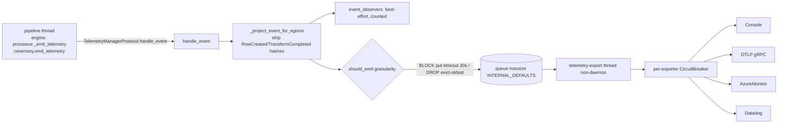

The engine depends on a port (`engine/orchestrator/ports.py:30`, `core.py:124,131`). Matrix engine→telemetry = 0 confirms the engine does not import the telemetry package. Only the export thread writes the circuit breaker. `flush()` joins the queue and then flushes the exporters. `close()` sends a sentinel (draining if needed), joins with a 5 s timeout, and closes the exporters.

### TUI

`ExplainApp.compose()` builds `ExplainScreen`, which loads **synchronously** through `RecorderFactory(db)`. It then renders a `Tree` and a `Static` detail panel. `r` reloads the screen state (`explain_app.py:196-214`). Selection detail loads `get_all_node_states_for_run(run_id)` and filters by node in Python (`explain_screen.py:230, 512`).

## Data & persistence

- **Landscape (read and write).** `run`, `resume`, `join`, `abandon` and `export-resume` write through the engine. `explain`, the TUI and `purge` open with `create_tables=False` (cli.py:1162, :2551). The MCP server opens `read_only=True`. The CLI's `explain` path does **not** use `read_only=True`, although the MCP server shows the handle supports it.
- **Every CLI `--database` override is SQLite-only.** It is built as `f"sqlite:///{db_path}"` after a file-existence check at 5 sites (cli.py:2496, :3084, :3535, :3804, :4032) and in `cli_helpers.resolve_database_url:63`. `run`, `resume`, `export-resume`, `abandon` and `join` fall back to `settings.landscape.url`, which can be PostgreSQL. `explain` *requires* `--database` (:1098), so it cannot open a PostgreSQL Landscape.
- **Sessions DB and auth.db.** `composer users *` opens both the way the web app does (`create_session_engine` + `postgres_engine_kwargs`, :2041-2046). It creates or validates the schema with `initialize_session_schema` *before* deleting a credential (:2216-2231). Retirement and bootstrap audit rows are written inside the authority transaction (:2017-2038, :2328-2351).
- **Composer MCP scratch directory.** Default `.composer-scratch/`. Holds `{id}.json` (mutable, CAS by SHA-256), `.{id}.lock`, and `{id}.events.jsonl` (append-only, fsync'd, kept after delete, `session.py:283-301`). There is no DB and no schema epoch.
- **Telemetry** persists nothing. The queue is in memory. Every exporter is off-box.
- **Payload store.** Filesystem only. Seven `FilesystemPayloadStore(...)` constructions in cli.py each repeat the "backend must be filesystem" check. `run` creates the store root with `mkdir(0o700)` plus an `O_NOFOLLOW` `fchmod` (:427-451).
- No schema epochs are owned by this slice. The DB schema invariants belong to S0x core/landscape and web.sessions.

## Dependencies

**Inbound.** MEASURED from `temp/import-matrix.md` and my grep:
- `web.execution → config_loading`: 2 module-level.
- `web.(root) → telemetry` 3, `web.acceptance → telemetry` 3, `web.execution → telemetry` 1 lazy. The grep located these at `web/config.py:30`, `web/operator_telemetry.py:31-32`, `web/_aws_ecs_acceptance/{bedrock.py:48, operator_telemetry.py:26-27}` and `web/execution/service.py:3627`.
- `cli → tui` 1 lazy (the `explain` TUI), `cli → cli_formatters/cli_helpers/cli_plugins/config_loading`, and `cli_helpers → config_loading` 1 lazy.
- **Nothing in `src` imports `cli`, `mcp`, `composer_mcp` or `tui`**, apart from the cli→tui edge. `grep "from elspeth.cli import"` finds 0 files in src and 44 in tests.
- `testing` has 0 src importers and 190 test-file importers.

**Outbound.** MEASURED, matrix rows:
- `cli` → contracts 6/9/5, core 1/16/1, core.checkpoint 1/4, core.dag 1, core.landscape 0/17/1, core.rate_limit 0/2/1, core.retention 0/1, core.security 1, engine 1/28/2, plugins.infrastructure 0/9/1, plugins.transforms 0/2, telemetry 0/2/1, tui 0/1, **web.(root) 0/9, web.auth 0/4/2, web.coordination 0/6/1, web.sessions 0/3** (module-level/lazy/TYPE_CHECKING).
- `cli_plugins` → contracts 1, plugins.infrastructure 2, **web.catalog 2 (module-level)**. `cli_helpers` → plugins.infrastructure 3 (module-level, re-exports only).
- `config_loading` → contracts 2, core 1, plugins.infrastructure 1 lazy.
- `mcp` → contracts 14/3, core.landscape 13/21. **No web, no engine.**
- `composer_mcp` → contracts 3, core 1, **web.(root) 1/1, web.catalog 2, web.composer 10, web.execution 4, web.plugin_policy 1**.
- `telemetry` → contracts 13/2/6, `elspeth(pkg)` 1 (`serialization.py:25` `__version__`).
- `tui` → contracts 4/1, core.landscape 4.
- `testing` → contracts 4/21/7, engine 0/5/3, plugins.infrastructure 1/3/1.

**Cycles and inversions touching this slice.**
- No package-level SCC contains any S09 package. `cli`, `mcp`, `composer_mcp`, `tui`, `telemetry` and `testing` are all outside the three SCCs in the matrix.
- **UI-over-UI inversions** make the web tier a library for other UIs:
  - `cli_plugins → web.catalog.{schemas.PluginKind, PluginSummary; service.CatalogServiceImpl}` (cli_plugins.py:12-13, module-level). `CatalogServiceImpl` itself depends only on contracts, core.secrets and plugins.infrastructure plus its own `web.catalog.*` siblings (`web/catalog/service.py:11-37`), so it is a UI-neutral service that lives inside the web package.
  - `composer_mcp → web.composer.tools.{_DISCOVERY_TOOLS, _MUTATION_TOOLS, _apply_merge_patch, execute_tool, get_tool_definitions, validate_composer_file_sink_collision_policy, RuntimePreflight}`, `web.composer.tools._dispatch._validate_tool_arguments`, `web.execution.{preflight, runtime_preflight, schemas, validation}`, `web.async_workers.run_sync_in_worker`, and `web.dependencies.create_catalog_service` (server.py:47-78, :1183). Four of the imported names are underscore-private.
  - `cli → web.*` 22 lazy edges (listed above).

## Patterns observed

- **Dry-run by default for every destructive verb.** `run` requires `--execute`, as do `resume`, `export-resume` and `abandon`. `purge` and `users remove` prompt unless given `--yes`.
- **Machine-readable dual output.** `--format json` / `--json` emit one JSON event per line with a fixed `event` discriminator (`interrupted`, `evicted`, `write_lock_held`, `not_resumable`, `joined`, `seat_dead`, `departed`, `fatal`, `error`, `execution_result`, …). Console-only banners are suppressed in JSON mode (e.g. :3088-3091, :4036-4040).
- **Advisory guidance never masks an exit contract.** `_emit_interrupted_resume_guidance` (:2709-2740), `_leaderless_abandon_hint_or_failure` (:2780-2789) and `_emit_leaderless_run_guidance` (:2800-2827) each catch and report their own failure.
- **Tier-1 errors are always re-raised ahead of broad handlers.** `except contract_errors.TIER_1_ERRORS: raise` appears before every `except Exception` in command bodies.
- **Declarative tool registries.** `mcp/server.py` `_TOOLS` is one source of truth for schema, validation and handler. The composer MCP reuses the web registry and validates its own session tools against Draft 2020-12 schemas checked against the metaschema at import (:198-206).
- **Audit envelope with a `finally` record.** Composer MCP dispatch is audited on success, ARG_ERROR and PLUGIN_CRASH paths. Durability comes first: an fsync before the MCP response is released.
- **Nominal typing and sentinel-`getattr` at the plugin boundary.** Telemetry protocols are not `runtime_checkable`, and `delivery_metrics` is probed with a sentinel `getattr` whose values are then validated (`manager.py:808-881`), per ADR-032.
- **Dependency inversion toward the engine.** `TelemetryManagerProtocol` (engine port) and `runner=` callback injection keep engine→cli and engine→telemetry at 0.
- **Near-duplicate command skeletons.** Each of `resume`, `export-resume`, `abandon`, `join` and `purge` re-implements settings-load, error-ladder, DB-URL resolution, passphrase, `LandscapeDB.from_url` and table-check (counts under *Complexity*).

## Invariants & how they are enforced

| Invariant | Enforcement |
|---|---|
| Landscape MCP cannot write | **Code, three layers**: keyword gate `queries.py:1202-1245`; `read_only_connection` `database.py:2116-2141`; `read_only=True` + `mode=ro` `analyzer.py:70`, `database.py:1849-1865`. Tests: `tests/unit/mcp` (15 files). |
| MCP result sets bounded (≤1000) | Code: `_MCP_INT_ARG_MAXIMUMS` (`server.py:51, 603-606`) plus the re-check in `query` (`queries.py:1270-1275`). There is no statement-time bound. |
| Composer MCP session IDs cannot traverse paths | Code: regex chokepoint in `_session_path` and `_lock_path` (`session.py:324-332`). |
| No lost update on composer MCP sessions | Code: SHA-256 byte CAS + thread lock + `flock` (`session.py:217-261, 334-347`). |
| Composer MCP audit durable before response | Code: `finally` + `os.fsync` (`server.py:935-1008`, `audit.py:593-596`). Pre-resolution records are knowingly lost on crash (`audit.py:516-529`). |
| Telemetry after audit ("audit primacy") | **Call-site ordering plus prose. No lint rule:** a grep of `elspeth-lints/src/elspeth_lints/rules/` for `primacy`/`audit.*before.*telemetry` has one hit, and that hit is a docstring in `tier_model/rule.py:2970` about stderr ordering. Control: `grep -rln layer` over the same tree hits `tier_model/rule.py`. Docstrings sit at `engine/processor.py:1019-1020`, `ceremony.py:53-54` and `manager.py:12`. `TelemetryManager` cannot enforce the ordering, since it receives events with no audit handle. Some client paths have tests that mention primacy (e.g. `tests/unit/plugins/clients/test_http_telemetry.py`). I found no test pinning engine-processor ordering (INFERRED from a keyword grep only). |
| Row-derived hashes never leave via telemetry | Code: `_project_event_for_egress` (`manager.py:50-78`) runs before observers and exporters. Only two event classes are projected. |
| Env placeholders never reach output-emitting options | Code plus `@trust_boundary` with test_ref and fingerprint (`config_loading.py:123-139`). The section list is derived. |
| SQLCipher key never from config or URL | Code: `cli_helpers.resolve_audit_passphrase` (:122-159). `elspeth-mcp` takes the key only through `--passphrase-env` (:975-985). |
| Import hierarchy "UI → Engine/Plugins/Telemetry → Core → Contracts" | **Prose only above L2.** The layer lint maps only `contracts`/`core`/`engine` to L0-L2 and treats everything else as L3 (`elspeth-lints/.../tier_model/rule.py:409-433`). It skips L3 files entirely (`:2298-2299`), so `cli→web`, `cli_plugins→web`, `composer_mcp→web`, `mcp`, `tui` and `telemetry` are unchecked. |
| CLI does not load the web tier at import | Code convention only (function-level imports). There is no test or lint guard; the measurement is mine. |

## Baseline delta — ARCHITECTURE.md says / tree says

| ARCHITECTURE.md / ADR claim | Pinned tree | Evidence |
|---|---|---|
| CLI "~4,900 LOC · User commands: `run`, `explain`, `validate`, `resume`" (ARCHITECTURE.md:170) | 4,802 lines and **17 leaf commands**, including 5 multi-worker/recovery verbs (`join`, `abandon`, `export-resume`, `purge`, `health`), account administration (`composer users add/remove/bootstrap-admin`), `doctor deployment/aws-ecs`, `web`, and `plugins list/inspect` | Live Typer registry walk (the Public interface section) |
| C4 container set: CLI, TUI, MCP Server, Telemetry, … (ARCHITECTURE.md:119-126) | **`composer_mcp` / `elspeth-composer` is absent** from ARCHITECTURE.md (0 grep hits). It is a 1,850-line surface that loads 118 `elspeth.web` modules | `grep -c "composer_mcp\|elspeth-composer" ARCHITECTURE.md` → 0; import probe |
| Dependency graph `UI --> Engine`, `UI --> Core` only; hierarchy `UI Layer → Engine/Plugins/Telemetry → Core → Contracts` (ARCHITECTURE.md:846-874) | UI surfaces depend on **the web package**: `cli→web.*` 22 lazy, `cli_plugins→web.catalog` 2 module-level, `composer_mcp→web.*` 18 module-level + 1 lazy. `elspeth plugins` loads 6 web modules. None of this is lint-checked | import-matrix rows; `rule.py:2298-2299` |
| Telemetry flow: `Orch/Proc/Exec/Clients → EventBus → TelemetryManager → Filter → Exporters` (ARCHITECTURE.md:740-786); `manager.py:4` "Receives telemetry events from EventBus" | The engine calls `TelemetryManagerProtocol.handle_event` **directly** (`engine/orchestrator/core.py:124`, `processor.py:1025-1026`, `ceremony.py:59-60`, `follower.py:565`). The `EventBus` carries only CLI formatter events (`cli.py:1413-1418`) | as cited |
| Backpressure `block`: "Wait for export completion (ensures all events delivered)" (ARCHITECTURE.md:799) | BLOCK waits **30 s** and then drops (`manager.py:489-496`). After `max_consecutive_failures` total failures, telemetry disables itself unless `fail_on_total_exporter_failure` (`:389-402`). An export-thread death disables it too (`:476-479`) | as cited |
| `lifecycle` granularity = "Run start/complete, phase transitions (~10-20 events/run)" (ARCHITECTURE.md:793) | Also always emitted: RUN/SOURCE `EngineSpanCompleted`, `DataverseLoadStatistics`, `RAGRetrievalStatistics`, `ChromaWriteStatistics`, `ResourceCleanupFailed`, and **any unknown event type** (fail-open, `filtering.py:389-415`) | as cited |
| Testing container "~900 · `elspeth-xdist-auto` pytest plugin shipped inside the package" (ARCHITECTURE.md:177) | 936 lines, of which **866 are production-type factories** (`testing/__init__.py`) imported by 190 test files. The xdist plugin (43 lines) is inert in-repo because `addopts` always passes `-n 12` (`pyproject.toml:466`), but it ships to every install through pytest11 (`:262-263`) | grep and read |
| MCP Server ~4,800 · "Read-only analysis API" (ARCHITECTURE.md:173) | 4,841 lines, 33 tools. Read-only is enforced three ways (see Invariants). The baseline does not mention the `query` raw-SQL tool or the degraded `get_mcp_status` mode | server.py:402-420, :658-688 |
| TUI ~2,300; Telemetry ~3,800 (ARCHITECTURE.md:172,178) | 2,334 and 3,872. Accurate | wc |
| Missing coverage | `config_loading.py`, the shared CLI and web settings loader and a Tier-3 trust boundary, has **0 mentions** in ARCHITECTURE.md. The composer-users/identity CLI and `doctor` are covered only in the deployment prose (:727) | `grep -c config_loading ARCHITECTURE.md` → 0 |

## Concerns

| ID | Sev | Concern | Evidence (file:line at pin) | New / previously reported |
|---|---|---|---|---|
| S09-C1 | **High** | **`TelemetryManager.flush()` hangs forever once the export thread dies with events still queued.** `_export_loop` stores the exception and keeps going on `TelemetryExporterError` (:234-237) and on `TELEMETRY_TRANSPORT_ERRORS` (:238-249). Any other exception from an exporter, including a third-party pluggy exporter, malformed `delivery_metrics`, or a Tier-1 error, hits the generic handler, which `break`s after one `task_done()` (manager.py:250-254). The remaining items are never marked done, and `flush()` calls an unbounded `self._queue.join()` whenever shutdown is not set (:675-676), *before* it can re-raise `_stored_exception`. `handle_event` has a dead-thread guard (:476-479); `flush` has none. `flush` sits on every run exit: `ceremony.safe_flush_telemetry` → `flush_telemetry` (ceremony.py:195-211) is called unconditionally inside the run's outer `finally` (`run_lifecycle.py:766-777`), in a resume-reconstruction `finally` (`resume.py:730-731`) and at `resume.py:1321`. The design at `ceremony.py:181-186` relies on `flush()` to surface Tier-1 errors that the export thread stored, and the unbounded `join()` sits in front of that re-raise, so the mechanism cannot fire. So the run or resume process (CLI, or the web execution worker at `web/execution/service.py:3627`) blocks indefinitely at end of run and the stored error is never surfaced. **MEASURED**: a probe at the pin (`SimpleNamespace` config, BLOCK mode, exporter raising `RuntimeError`) showed the export thread dead with `unfinished_tasks=2` and `flush()` still blocked after 3 s. `close()` is bounded (5 s join, :774) | NEW. legacy issue tracker searches "queue.join" and "flush hang" returned nothing relevant. elspeth-1e4ca5b1db (closed) is about flush *masking* run errors, not hanging. `tests/unit/telemetry/test_manager.py` has no export-thread-death test (its only `RuntimeError`s are observer failures, :288, :323) |
| S09-C2 | Medium | **The layering of operator surfaces is unguarded.** The baseline's UI→Engine→Core hierarchy is enforced only for contracts, core and engine (L0-L2). Every S09 package, and the web tier, is "L3, may import anything" (`rule.py:409-433, 2298-2299`). The UI-over-UI inversions (`cli_plugins→web.catalog` module-level, `composer_mcp→web.*` 18+1, `cli→web` 22 lazy) and the CLI's lazy-import discipline therefore have no gate. One module-level `web` import in `cli.py` would pull the web tier into every `elspeth run` without failing any check | cli_plugins.py:12-13; composer_mcp/server.py:47-78; import probe 0/6/118 | NEW |
| S09-C3 | Medium | **Composer MCP binds to web composer private internals** (`_DISCOVERY_TOOLS`, `_MUTATION_TOOLS`, `_apply_merge_patch`, `tools._dispatch._validate_tool_arguments`). It also mirrors the web audit envelope and dispatch semantics by hand (the `call_tool` finally block is 276 lines). The server serves web registry descriptions verbatim, so web-only teaching text reaches MCP clients (see be-14#1). A web-internal rename breaks `elspeth-composer` at import time, and teaching drift reaches it silently | server.py:56-65, :220, :723-730, :733-1008 | NEW for the private-symbol coupling. be-14#1 (refuted as a defect, fact confirmed) in `docs/reviews/2026-09-23-release-0.8.1-web-review/findings.json`. elspeth-5bc58eea77 (closed) hoisted part of the envelope |
| S09-C4 | Medium | **`elspeth explain` (and the TUI) cannot open a PostgreSQL Landscape.** `--database` is mandatory and always becomes `sqlite:///path` after a file-exists check. Every other `--database` override is SQLite-only in the same way. The ADR-041 PostgreSQL profile is reachable only through `elspeth-mcp --database postgresql://…` or through `settings.landscape.url` on the recovery verbs | cli.py:1098-1115; cli_helpers.py:54-63; cli.py:2496, 3084, 3535, 3804, 4032 | NEW |
| S09-C5 | Medium | **cli.py is a 4,802-line monolith with copy-shaped command bodies.** `join` 521 lines, `resume` 479, `run` 299, `health` 287. Counts in cli.py: 9 `_load_settings_with_secrets(` calls behind 7 `except SecretLoadError` ladders; 5 identical 12-kwarg `ExecutionGraph.from_plugin_instances` calls; 10 `LandscapeDB.from_url`; 7 `FilesystemPayloadStore(` with repeated backend checks. `join` builds `PipelineConfig` inline (:4230-4241) rather than through `_orchestrator_context` (:1398-1409), and `bootstrap_and_run` (:1581-1689) re-implements `run` and `_execute_pipeline_with_instances`. Drift between the run, resume, join and sub-pipeline paths is the risk | AST function sizes; grep counts (Complexity section) | NEW (the modernisation epic elspeth-82c3914f95 is done; it did not decompose the file) |
| S09-C6 | Medium | The `elspeth web` launcher calls `uvicorn.run` with no `proxy_headers`/`forwarded_allow_ips`, so under the nginx Compose profile every client shares one IP (affecting rate limiting and the auth audit) | cli.py:4791-4798 | PREVIOUSLY-REPORTED (R11, `docs/reviews/2026-09-23-release-0.8.1-web-review/issues/R11-…md`) |
| S09-C7 | Low | **Test-only production helpers.** `_preflight_follower_sink_effects` and `_join_after_follower_sink_preflight` are defined in cli.py but called only from tests (`tests/unit/engine/test_sink_effect_preflight.py:18-20`, `tests/unit/cli/test_cli_preflight.py:20`). Production `join` inlines its own sequence (:4010-4019, :4111). Tests pin a sequence production does not execute. Positive control: `_start_follower_plugin_lifecycle` is found at its production call :4274 | cli.py:81-93, :145-160 | NEW |
| S09-C8 | Low | `join` reports any non-refusal `join_run` exception as "Sink effect preflight failed", which is misleading after the preflight has already passed | cli.py:4131-4133 | NEW |
| S09-C9 | Low | The `join` docstring says leader-seat loss exits 3; the code exits 2 | cli.py:3958 vs :4321 | PREVIOUSLY-REPORTED (elspeth-edcd73fa07, triage) |
| S09-C10 | Low | `run --format json` exits 1 with no output for a valid `--dry-run` or a missing `--execute` | cli.py:853-856 | PREVIOUSLY-REPORTED (elspeth-0e9290c9e3, triage) |
| S09-C11 | Low | `_events_attempted += 1` runs on the pipeline thread outside `_dropped_lock`. The module docstring's claim that "all other metrics are only modified by the export thread" is false for it | manager.py:22-24, :466 | PREVIOUSLY-REPORTED (elspeth-d394baaec9, confirmed) |
| S09-C12 | Low | The telemetry egress filter fails open. Unknown event types are emitted at every granularity (filtering.py:411-415), and the hash-stripping projection covers only `RowCreated`/`TransformCompleted` (manager.py:57-78). A future content-bearing event class would export at `lifecycle` with nothing to catch it (INFERRED risk) | as cited | NEW |
| S09-C13 | Low | Datadog `configure` mutates process-global `os.environ` around `from ddtrace import tracer` and relies on ddtrace reading the env at import. In a long-lived web process that builds a manager per run, a second configuration with a different agent host would reuse the first import's settings, and the env mutation is not thread-safe (INFERRED from the code comment at :185-186) | telemetry/exporters/datadog.py:170-197 | NEW |
| S09-C14 | Low | OTLP and Azure Monitor carry byte-identical per-run trace-state bookkeeping (`_bind_trace_started_at`…`_reset_trace_registry`): the `diff` of otlp.py:475-525 against azure_monitor.py:411-462 differs only in the trailing next-method line | as cited | NEW |
| S09-C15 | Low | `cli_helpers` imports `plugins.infrastructure.runtime_factory` at module level only to re-export it for tests: 64 test imports of `instantiate_plugins_from_config` via `cli_helpers`, and 0 consumers of `_make_sink_factory` in `__all__`. Production cli.py imports the originals directly (:133, :1547) | cli_helpers.py:7-25 | NEW |
| S09-C16 | Low | `pytest_xdist_auto` is inert inside the repo (`addopts` `-n 12` means `numprocesses` is never None, `pyproject.toml:466`). Its docstring still describes `-n auto` defaulting. It ships through pytest11 into every environment that installs `elspeth` and changes downstream pytest runs that have xdist. This is a question for the maintainer, not a defect | testing/pytest_xdist_auto.py:1-43; pyproject.toml:262-263 | NEW |
| S09-C17 | Low | `health` is loosely coupled to the real deployment: DB connectivity uses the non-ELSPETH `DATABASE_URL` (set by `docker-compose.yaml:14`) rather than the settings' Landscape URL. The engine is never disposed. `str(e)` of connection errors is echoed. `/app/config` and `/app/output` are hard-coded and warn only | cli.py:4560-4625 | NEW |
| S09-C18 | Low | MCP `diagnose` flags "stuck runs" as RUNNING for more than 1 h and ignores leader-seat liveness (ADR-030). It uses string literals (`"failed"`, `"running"`, `"open"`) instead of enums. `get_node_states`' status enum is hand-listed rather than derived from `NodeStateStatus` (same values today) | diagnostics.py:57-107; server.py:362-366 vs contracts/enums.py:38-47 | NEW (elspeth-6e6094ba96, closed, was a different diagnose gap) |
| S09-C19 | Low | Non-interactive `elspeth-mcp` with no `--database` auto-selects a `.db` by filename heuristic and notes it only on stderr. `rglob("*.db")` walks the entire tree before the depth filter. `query` has no statement timeout, so fetchmany bounds rows but not execution (INFERRED) | mcp/server.py:801-809, :944-973; queries.py:1280-1283 | NEW |
| S09-C20 | Low | The TUI and `explain` load every node state for a run and filter in Python, which is unbounded for large runs. The TUI loads synchronously inside `compose()`. `explain` opens the Landscape writable (`create_tables=False`) where `read_only=True` exists | tui/screens/explain_screen.py:230, :512; cli.py:1162 | NEW |
| S09-C21 | Low | Two authorities for provider names: `bootstrap-admin` checks `get_args(AuthProviderType)` (:2261, :2309), while `web` checks `registered_provider_names()` and states that the registry is the authority (:4772-4782). Drift risk (INFERRED) | as cited | NEW |
| S09-C22 | Low | Hygiene issues. Stale line-number comments in `resume` ("line 1780", "line 1955", cli.py:3423-3424). Control-flow `assert`s in production are stripped under `-O` (cli.py:3153, 3593, 3843; composer_mcp/server.py:389, 820). `config_loading` imports 6 underscore-private functions from `core.config` (:17-26). The `mcp/__init__.py` docstring lists 11 tools against 33 live (:3-15). `mcp/__init__` wraps the `[mcp]`-extra ImportError but `composer_mcp/__init__` does not (:9-20) | as cited | NEW |

## Complexity & tech-debt hotspots

- **Largest functions.** MEASURED with an `ast` walk over all 47 files: `cli.join` 521 lines, `cli.resume` 479, `composer_mcp.server.create_server` 372 (it contains `call_tool` at 276), `cli.run` 299, `cli.health` 287, `cli.export_resume` 256, `cli.explain` 226, `mcp.analyzers.queries.list_collisions` 212, `cli.abandon` 210, `cli.purge` 208, `mcp.analyzers.diagnostics.diagnose` 194, `telemetry.manager._dispatch_to_exporters` 147, `telemetry.exporters.datadog.configure` 138.
- **Duplication counts in cli.py** (grep; the instrument's positive control is `_start_follower_plugin_lifecycle` found at :4274):

  | Pattern | Count |
  |---|---:|
  | `_load_settings_with_secrets(` calls | 9 |
  | `except SecretLoadError` ladders | 7 |
  | `ExecutionGraph.from_plugin_instances` calls | 5 |
  | `LandscapeDB.from_url` | 10 |
  | `f"sqlite:///{db_path}"` | 5 |
  | `FilesystemPayloadStore(` | 7 |
  | `required_tables` checks | 2 |
  | `PipelineConfig(` builds | 2 |

- **Fused responsibilities.**
  - `cli.py` mixes command parsing, orchestration setup, the sub-pipeline runner the engine calls back into (`bootstrap_and_run`), identity and account administration against the sessions DB, and the web launcher.
  - `composer_mcp/server.py` mixes protocol, dispatch, file-sink collision policy (:235-320) and a kernel workaround.
- **Vestigial or dead code.** `_join_after_follower_sink_preflight`, `_preflight_follower_sink_effects`, the `cli_helpers` re-exports, and the in-repo `pytest_xdist_auto` controller branch (S09-C7, C15, C16).
- **Documented workaround.** The `PR_SET_PDEATHSIG` guard (composer_mcp/server.py:1078-1154) is tracked by elspeth-7f99eba6ef, with deletion criteria in the docstring. It is Linux-only.
- **TODO/FIXME/XXX/HACK.** 0 hits across the slice. The grep's control is a positive hit under `web/frontend`.

## Test map

MEASURED as test-file count / total lines under each directory:

| Directory | Files | Lines | Covers |
|---|---:|---:|---|
| `tests/unit/cli/` | 25 | 9,193 | commands, preflight, explain TUI and command |
| `tests/integration/cli/` | 5 | 2,396 | |
| `tests/unit/mcp/` (incl. `analyzers/`) | 15 | 5,484 | |
| `tests/integration/mcp/` | 1 | 357 | |
| `tests/unit/composer_mcp/` | 5 | 3,270 | |
| `tests/unit/telemetry/` (incl. `exporters/`) | 16 | 10,258 | |
| `tests/integration/telemetry/` | 1 | 505 | |
| `tests/unit/tui/` | 6 | 2,078 | |
| `tests/unit/testing/` | 1 | 21 | |
| `tests/e2e/` | 37 | 19,272 | exercises CLI run and recovery paths |

Root-level unit tests also cover this slice: `test_cli_helpers_sink_factory.py`, `test_cli_orchestrator_teardown.py`, `test_ci_workflow_xdist.py`, and `tests/unit/core/test_config_loading_layering.py`. The `config_loading` trust boundaries are pinned in `tests/unit/core/test_config.py` through the `@trust_boundary` `test_ref`s.

**Notable gaps:**
- There is no test for telemetry export-thread death followed by `flush()` (S09-C1).
- There is no guard that `import elspeth.cli` stays free of `elspeth.web` (the import-probe result is mine alone).
- Follower-preflight tests target helpers production does not call (S09-C7).
- The PostgreSQL `explain` path is untested because it does not exist (S09-C4).

## Confidence

**High**, with the not-read list below as the caveat.

- **Read fully:** `cli.py` (all 4,802 lines), `config_loading.py`, `cli_helpers.py`, `cli_plugins.py`, `cli_formatters.py`, `mcp/__init__.py`, `mcp/analyzer.py`, `mcp/server.py`, `composer_mcp/*` (all four files), `telemetry/manager.py`, `factory.py`, `filtering.py`, `protocols.py`, `circuit_breaker.py`, `hookspecs.py`, `errors.py`, `resource_identity.py`, `exporters/__init__.py`, `tui/explain_app.py`, and `testing/pytest_xdist_auto.py`/`rasterize_fakes.py`.
- **Sampled:** `mcp/analyzers/queries.py` (header, SQL gate and `query`), `diagnostics.py` (`diagnose` head), `reports.py` (import and connection sites), the exporters (outlines, OTLP `export`, Datadog `configure`, the OTLP/Azure duplicated-block diff), `serialization.py` (head), `tui/screens/explain_screen.py` and the widgets (outlines and DB-access sites), and `testing/__init__.py` (head and outline).
- **Not read:** `mcp/types.py` bodies, the OTLP and Azure `_flush_batch` bodies, and `tui/lineage_view.py` bodies.
- **Measurement basis.** Every dependency claim comes from `temp/import-matrix.md` or from my own grep and import probes at the pin (`PYTHONPATH=<pin>/src`, with `elspeth.__file__` verified inside the pin). retired code index was not consulted.
- **What is MEASURED.** Command and tool counts come from live registries (Typer, `_TOOLS`, `_build_tool_defs`), cross-checked against the harness's MCP tool listings. S09-C1 is a MEASURED behaviour of the manager in isolation; its end-to-end effect on a real run is INFERRED from the call chain.

## Validation corrections

- [validator] Measured size said "19,372 lines in 44 files" (and Complexity said "an `ast` walk over all 44 files") -> 19,572 lines in 47 files. The per-unit table rows were already right; they sum to 5+10+15+10+4+3 = 47 files and 5,739+4,841+3,872+2,334+1,850+936 = 19,572 lines (evidence: re-ran the stated instrument at the pin; `(ls cli*.py config_loading.py; find mcp telemetry tui composer_mcp testing -name '*.py') | xargs cat | wc -l` -> 19572, `| wc -l` -> 47).
- [validator] `cli_plugins.py:171-172` cited as the module-level `web.catalog` import (Key components, UI-over-UI inversion bullet, S09-C2 evidence) -> `cli_plugins.py:12-13`. Line 171 is blank and 172 is `def _classes_for_kind` (evidence: `grep -n import src/elspeth/cli_plugins.py`).
- [validator] Import probe "120 `elspeth.web*` modules after `import elspeth.composer_mcp.server`" (lazy-import paragraph, baseline C4 row, S09-C2 "0/6/120") -> 118, stable across 3 runs at the pin. The 0 (cli) and 6 (cli_plugins) figures reproduce exactly. The conclusion is unchanged.
- [validator] `mcp/analyzer.py:128-129` cited for the `LandscapeDB.from_url(..., read_only=True)` / `RecorderFactory.read_only` open (Key components; Invariants cited `analyzer.py:128`) -> `analyzer.py:70-71` (evidence: `grep -n "read_only=True\|RecorderFactory.read_only" mcp/analyzer.py`).
- [validator] "10 `_load_settings_with_secrets(` calls" (S09-C5 and the Complexity table) -> 9 calls. The 10th grep hit is the `def` at cli.py:564. The other duplication counts (7 / 5 / 10 / 5 / 7 / 2) reproduce exactly.
- [validator] S09-C1 (High) was independently reproduced, so its severity stands: probe at the pin with an exporter raising `RuntimeError('boom')` in BLOCK mode left the export thread dead, `unfinished_tasks=2`, `_stored_exception=RuntimeError('boom')`, and `flush()` still blocked after 3 s. `_dispatch_to_exporters` lets non-transport exceptions propagate (manager.py, "Any other exception is a programming error and propagates"), and the run-exit call chain `run_lifecycle.py:766-777` -> `ceremony.safe_flush_telemetry` -> `flush_telemetry` -> `TelemetryManager.flush` was confirmed.


---

# S10 — Composer Core Loop (LLM tool loop, planner, CompositionState)

**Location:** `src/elspeth/web/composer/` — `service.py`, `state.py`, `protocol.py`, `pipeline_planner.py`,
`planner_authoring_aids.py`, `tool_batch.py`, `no_tool_policy.py`, `no_tool_finalize.py`, `llm_response_parsing.py`,
`prompts.py`, `progress.py`, `_compose_loop_carriers.py`, `reasoning.py`, `provider_{config,quota,telemetry,discovery_response}.py`,
`availability.py`, `boot_probe.py`, `bounded_json.py`, `_response_json.py`, `response_contracts.py`, `discovery_{cache,response}.py`
(all paths below are relative to `src/elspeth/web/composer/` unless prefixed). Every read is from the detached pin
`.claude/worktrees/arch-analysis-pin` @ `85ebf2739`.

**Measured size:** 24 files, **39,223 lines** (MEASURED:
`wc -l service.py state.py protocol.py pipeline_planner.py planner_authoring_aids.py tool_batch.py no_tool_policy.py no_tool_finalize.py llm_response_parsing.py prompts.py progress.py _compose_loop_carriers.py reasoning.py provider_*.py availability.py boot_probe.py bounded_json.py _response_json.py response_contracts.py discovery_*.py`).
That is 37.5 % of `web/composer/` (104,490, discovery §2).

**Responsibility:** Turn a chat message plus the current immutable `CompositionState` into an LLM-authored pipeline change.
It does this through one of two provider-driven authoring surfaces: a bounded one-shot **planner** for an empty topology,
or an iterative **tool loop**. It validates each candidate in two stages, gates completion behind repair turns and an
advisor model, and hands back a `ComposerResult` whose writes all go through the sessions service.

---

## Key components

| File | Lines | Role |
|---|---:|---|
| `service.py` | 11,377 | `ComposerServiceImpl` (2449–9542, 7,094 lines) plus module-level helpers. Holds the `compose()` entry, the surface selection, the loop driver P1–P5, planner orchestration and staging, the runtime-preflight cache, interpretation-review surfacing, the whole advisor subsystem, and LiteLLM transport. The fused responsibilities are decomposed below. |
| `state.py` | 9,064 | `CompositionState` (7112–9064), a frozen, versioned value object with `with_*`/`without_*` mutators that bump `version`, plus `to_dict`/`from_dict`. It also holds the Stage-1 validator `_validate_with_probe_cache` (7420–9064, **1,645 lines**) and `_check_schema_contracts` (4330–7108, **2,779 lines**). Spec types: `SourceSpec` 640, `NodeSpec` 679, `EdgeSpec` 1246, `OutputSpec` 1276, `ValidationEntry/Summary` 1508/1614. |
| `pipeline_planner.py` | 5,259 | `plan_pipeline` (3503) → `_plan_pipeline_inner` (3668–5235, **1,568 lines**). This is a bounded, discovery-only provider loop with a terminal `emit_pipeline_proposal` tool, repair budget, escape-hatch advisor model, cost, byte and call budgets, and candidate finalizer/acceptance seams. `_build_valid_pipeline_plan` (3325) validates, settles custody and seals a `PipelineProposal`. |
| `planner_authoring_aids.py` | 2,883 | Server-rendered worked `set_pipeline` exemplars (source custody, fork→coalesce 2249–2571, fork→row_union) and a catalog digest, model catalog and schema-contract evidence. These are fed to the planner as reviewed context and memoised per snapshot hash. |
| `tool_batch.py` | 2,722 | `run_tool_batch` (686–2713, **2,028 lines**), extracted "verbatim" from the loop's P3 (docstring 1–13). Provider tool-call admission, explicit-approve proposal staging, `set_pipeline` required-control finalization, `execute_tool` offload and per-call audit. |
| `protocol.py` | 1,716 | `ComposerService` Protocol (1540), `ComposerResult` with mechanical field-pairing invariants (195–460), `ComposerSettings` structural Protocol (1429), and the error carriers `ComposerConvergenceError`/`PluginCrashError`/`RuntimePreflightError`/`ToolArgumentError`. |
| `no_tool_policy.py` | 1,525 | Trusted-suffix wire shapes (`[ELSPETH-SYSTEM]` marker), the repair/handoff/advisor message constants, and `classify_pipeline_mutation_intent` (1275), a closed-grammar surface router. |
| `llm_response_parsing.py` | 887 | Provider metadata admission, the `ComposerLLMCall` record builder, and Anthropic cache-marker placement. |
| `prompts.py` | 669 | `build_messages` (492). Five-part cache-layout contract: stable system, catalog context, history, session state context, user message. |
| `progress.py` | 593 | `ComposerProgressRegistry` (73–336) and progress event factories. |
| `_compose_loop_carriers.py` | 432 | Frozen carriers between loop phases (`_CallModelOutcome`, `_DispatchOutcome`, `_PersistOutcome`, `_ClassifyOutcome`, `_TerminateOutcome`, admitted LLM/tool types). |
| `no_tool_finalize.py` | 393 | `finalize_no_tool_response` (60–393), the shared no-tool finalize tail. |
| **Peripheral (≤351 each, 12 files, 1,703 total)** | | `provider_discovery_response` (351: planner-surface disclosure envelopes), `boot_probe` (250: boot requests built by production builders), `provider_telemetry` (246), `availability` (156), `bounded_json` (154), `provider_quota` (134: ContextVar quota span around each provider attempt), `discovery_cache` (97), `reasoning` (93), `_response_json` (64), `discovery_response` (63), `response_contracts` (60), `provider_config` (35). |

### service.py decomposition (MEASURED by AST; the bucket assignment is by function name, so INFERRED classification)

| Fused responsibility | Lines | Where |
|---|---:|---|
| Advisor subsystem: `request_advisor_hint`, early and END checkpoints, sign-off validation, prompt-injection prescan, pipeline summarisation for the advisor | **~2,878** | 1436–1668, 7866–7915, 8228–9164, 9545–11377 (module level) |
| Compose-loop driver P1–P5 and no-tool terminate/finalize | 2,540 | 4084–4310, 5450–7713 |
| Planner orchestration and staging (freeform-empty, guided-full, guided-staged/tutorial) | 1,249 | 465–486, 4312–5448 |
| Interpretation-review surfacing, repair-message builders, and session-aware tool dispatch (`_dispatch_session_aware_tool` 7917–8165 and `_build_session_aware_kwargs` 8167–8226, ~309 lines; its only registered handler is `request_interpretation_review`, tools/sessions.py:3202–3204) | ~1,530 | 959–1433, 1952–2430, 2948–3217, 7917–8226 |
| Runtime preflight: cache, coordinator, preflight/proof/blob repair gates | 831 | 1821–1949, 2900–3360, 3540–3973 |
| Provider transport, completion admission, LLM audit sidecar | 744 | 607–956, 7802–7864, 9167–9542 |
| Construction, test seams, serialisation | 385 | 2469–2898 (`_run_one_turn_for_test` 2642) |
| Imports, alias re-exports, constants | ~1,220 | 1–620 (`no_tool_policy` alias block 423–459) |

The advisor is the largest bucket, and it is still inside `service.py` even though separate `advisor_*` modules exist
(`advisor_audit`, `advisor_decision`, `advisor_output`, `advisor_request`, imported at service.py:96–115). Earlier
extractions (`tool_batch`, `availability`, `turn_audit`, `no_tool_finalize`) left compatibility shims behind: the
`_compute_availability` monkeypatch target (9531–9542), the alias block (423–459), and "extracted verbatim" bodies that
still reach back through `ctx.service._*`.

---

## Public interface / entry points

`ComposerService` Protocol (protocol.py:1540–1716), implemented by `ComposerServiceImpl`. One instance is created per app
(MEASURED `web/app.py:1851`); `for_trained_operator` (service.py:2610) is the non-web composition root.

| Method | Production callers (MEASURED grep, control: `compose(` hits both routes) |
|---|---|
| `compose()` 4084 | `web/sessions/routes/messages.py:358`, `web/sessions/routes/composer/compose.py:203` |
| `plan_guided_pipeline()` 4513 | `web/sessions/routes/composer/guided.py:4276, 4770, 5451` |
| `plan_guided_full_pipeline()` 4353 | `web/sessions/routes/composer/guided_plan.py:519` |
| `surface_pending_interpretation_reviews()` 3118 | `pipeline_settlement.py:215, 422`; `web/execution/routes.py:970, 992`; internal 5823, 6562 |
| `explain_run_diagnostics()` 4037 | `web/execution/routes.py:1474` |
| `run_signoff_checkpoint()` 8826 | **none**. Only tests call it (`tests/unit/web/composer/test_run_signoff_checkpoint_*.py`). See C7. |

Other exported surfaces: `build_composer_loop_request_kwargs`, `composer_loop_tool_definitions` and `_litellm_acompletion`
(service.py:864–956) are reused by `boot_probe.py` and by `guided/chat_solver.py:90`. `plan_pipeline` and
`planner_tool_definitions` are reused by `boot_probe`. `CompositionState` is imported by 12 buckets (measured inbound
below). This slice exposes no HTTP routes, CLI commands or DB tables of its own. The routes live in `web/sessions/routes/**`
(S-routes slice).

---

## Internal architecture

### Surface selection (service.py:4152–4220)

`compose()` first checks availability, then chargeable admission (`_require_chargeable_admission` 4017), then opens
`composer_quota_scope` (provider_quota.py). It routes to the **planner** only when all of these hold: the state is
structurally empty, `classify_pipeline_mutation_intent(message) is EXPLICIT_MUTATION`, there is no `guided_terminal`, and
there is a session and a user_message_id. Every other request goes to the **compose loop**. The choice is logged as
`composer_authoring_surface_selected` (4170).

### The compose loop (service.py:7075–7713, a five-phase driver)

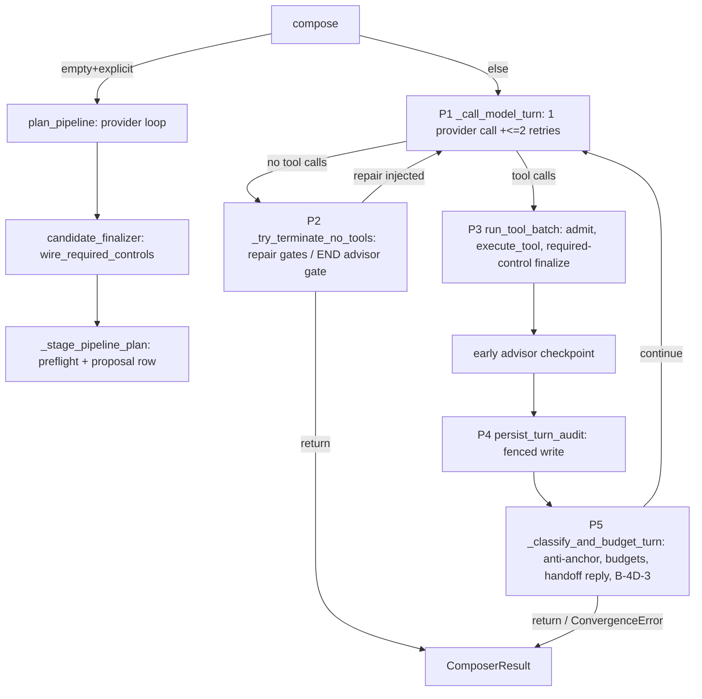

- **P1** `_call_model_turn` (5483): emits progress, calls `_call_llm_before_deadline` (9419; up to 3 attempts on
  `LiteLLMAPIError` with exponential backoff, `_LLM_API_MAX_ATTEMPTS=3` at 461), then enforces
  `composer_max_tool_calls_per_turn` (5450).
- **P2** `_try_terminate_no_tools` (6176). The gates run in order: pre-state interpretation repair → missing-review
  repair (rate-capped vague terms get a fallback) → uploaded-blob repair → proof repair → runtime-preflight repair
  (`_attempt_preflight_repair` 3838) → END advisor gate (`_evaluate_terminal_no_tool_advisor_gate` 6763) →
  `_surface_and_finalize_no_tools` (auto-surface of prompt-template and data-contract cards, the fail-closed orphan gate,
  finalize). All correctness repairs share `_MAX_REPAIR_TURNS = 2` (service.py:1697).
- **P3** `run_tool_batch` (tool_batch.py:686). Admits provider calls (`_admit_tool_batch` 223: value assertions, no
  Protocol `isinstance`), rejects reused tool-call ids (294), caps pending proposals under `explicit_approve` (743, 1241).
  Each call is dispatched through `dispatch_with_audit`. Sync tools run on `run_sync_in_worker(execute_tool, …)`
  (2362). State is rebound per successful call (2610).
- **P4** `_persist_turn_audit` → `turn_audit.persist_turn_audit`, which calls `persist_compose_turn_async`. This runs
  inside a shielded critical section (`_await_tool_turn_with_deferred_cancellation` 328–385), so client cancellation
  finishes the in-flight tool and publishes its audit prefix before the cancel resumes (7616–7622).
- **P5** `_classify_and_budget_turn` (5693). Anti-anchor hint (audited before it enters provider context, 5764–5783);
  a turn that is all cache hits is not charged. A staged review handoff triggers a reply-only provider call (5894–5921)
  or a trusted notice. Composition vs discovery budget: exhausting the composition budget gets one "B-4D-3" last-chance
  call (6002–6146); exhausting discovery raises `ComposerConvergenceError`.

**State lives in:**
- per-request locals: `llm_messages`, `discovery_cache`, `runtime_preflight_cache`, counters, `AntiAnchorTracker`,
  `BufferingRecorder` (7186–7263);
- the immutable `CompositionState` threaded through `_DispatchOutcome`;
- per-instance mutable fields on the shared singleton: `_schemas_loaded_by_session` 2607, `_cross_turn_repair_ledger`
  2551 (bounded, 3964), `_phase3_last_*` 2559–2563;
- a process-wide `RuntimePreflightCoordinator` that dedupes concurrent same-key preflights (2545).

**Concurrency model:** asyncio. Deadline handling is cooperative: it is checked before provider calls and after tool
batches, and only provider calls are cancellable via `wait_for` (docstring 7113–7122). Sync validation and DB work are
offloaded to workers. Quota custody is a `ContextVar` span per provider attempt (`quota_provider_calls`,
`admit_provider_attempt` → `begin_provider_attempt` / `finish_provider_attempt`), shielded settlement
(provider_quota.py `_settle`).

### Validation stages (ADR-040)

- **Stage 1:** `CompositionState.validate()` (state.py:7410), a pure function of the state with an owned
  `ValidationProbeCache`.
- **Stage 2:** the runtime-equivalent preflight `_runtime_preflight` → `web.execution.validation.validate_pipeline`
  (service.py:2900–2946), cached by (scope, version, content hash, settings hash, snapshot) and re-paid whenever blob refs
  are present (3263–3300).
- **Auto-commit** needs both `trust_mode == auto_commit` and a green Stage 2 (5134, 5179, 5218–5222).

### Planner (pipeline_planner.py)

The planner has discovery-only authority (docstring 1–9). The provider sees:
- the rendered skill as system;
- one canonical-JSON user message carrying intent, current state (projected), reviewed facts, authoring aids,
  schema-contract evidence and the information manifest (3776–3799).

Candidates go through `build_set_pipeline_candidate` twice: once on the raw provider payload, and again after
`canonicalize_authored_node_review_requirements` (3356–3391). Custody settles inline or is deferred for guided-full
(3422–3480). Guided-staged and tutorial use a **delta** terminal contract: the server materializes the source and output
shell from operator-reviewed facts, and nodes and edges come from the provider delta (service.py:4726–4760 →
`guided/planning.py:2021–2101`).

---

## Data & persistence

**This slice owns no table, schema or epoch.** MEASURED: `grep -lE 'Table\(|Column\(|MetaData\('` over the 24 slice files
exits 1 with no match. The known-positive control, `web/sessions/models.py`, matches. Every write goes through
`SessionServiceProtocol` under a fenced `SessionOperationContext`. The write sites it drives:
- `add_messages_atomic`: the planner evidence cohort in one transaction, service.py:4971.
- `add_message`: the anti-anchor audit row, 5774.
- `persist_compose_turn_async` (turn_audit.py:274).
- `create_pipeline_composition_proposal` / `reject_pipeline_composition_proposal` (5182, 5200).
- `create_pending_interpretation_event` (2026, 2413).
- `record_plugin_crash_breadcrumb` via `session_operation_authority.mutate` (4261–4265).
- `upsert_skill_markdown_history` (2889).
- the provider-attempt ledger (`begin/finish_provider_attempt`, provider_quota.py).
- advisor pass and terminal-publication audit (`advisor_audit.persist_*`, 100–101).

**Invariants enforced in code rather than DB:**
- `ComposerResult` field pairing (protocol.py:344–460).
- `repair_turns_used ∈ {0,1,2}` (protocol.py:417).
- `CompositionState.version >= 1` (state.py:7159).
- "persist planner evidence before proposal authority" (service.py:5112).
- `AuditIntegrityError` on malformed or unrelated LLM evidence attached to planner exceptions (5404–5414).

The one DB-enforced invariant this slice leans on is the blobs composite FK `(created_from_message_id, session_id)`,
cited at protocol.py:1591–1595 and owned by the sessions and blobs slices.

---

## Dependencies

**Package level (from `temp/import-matrix.md`):** `web.composer → contracts` 251/8/2, `→ web.(root)` 42/5/1,
`→ web.catalog` 31, `→ web.plugin_policy` 24, `→ web.sessions` 19/8/6, `→ web.execution` 16, `→ plugins.infrastructure`
10/24, `→ core` 34/6, `→ engine` 1. Inbound: `web.sessions → web.composer` **133/55/7**, `web.execution → web.composer`
23/5/1, `composer_mcp → web.composer` 10.

**Slice level (MEASURED, my AST script over the 24 files, counting import statements at every nesting level):**
- **Outbound:** contracts 83, other `web.composer` modules 68, `plugins` 29, `web.composer.tools` 26,
  `web.composer.guided` 18, `core` 15, `web.sessions` 15, `web.execution` 11, `web.catalog` 10, `web.plugin_policy` 8,
  `web.interpretation_state` 7.
- **Inbound:** `web.sessions` 46 (service, protocol, pipeline_planner, no_tool_policy, progress, provider_quota/telemetry,
  llm_response_parsing), other composer 30, `composer.tools` 28 (state, protocol), `composer.guided` 17 (including
  **service**), `web.execution` 16, `_aws_ecs_acceptance` 5, `web.app` 4, `composer_mcp` 3.

**Cycle carriers touching the slice (MEASURED file:line):**
- `composer ↔ sessions`: service.py:286 imports `web.sessions._persist_payload` at runtime. pipeline_planner.py:175
  imports `web.sessions.protocol.SessionOperationAuthority` at module level. Reverse: 46 imports from sessions.
- `composer ↔ coordination`: service.py:237–238 (`coordination.contracts`, `coordination.lifecycle`).
- `composer ↔ execution`: service.py:239–265 (`completion_gates`, `preflight`, `runtime_preflight`, `schemas`,
  `validation`). Reverse: execution imports `protocol`, `service`, `state` (16).
- `core loop ↔ guided lane` (in-package): state.py:79 imports `guided.state_machine.GuidedSession` at module level;
  pipeline_planner.py:76–77 imports `guided.deferred_intents` and `guided.planning`; prompts.py:21–23 imports guided.
  Reverse: `guided/chat_solver.py:90` imports `service._litellm_acompletion` and `_apply_endpoint_kwargs` at module level.
- `state ↔ _producer_resolver`: kept behind TYPE_CHECKING (state.py:82–84). `protocol → service`
  (`AdvisorCheckpointVerdict`) is also TYPE_CHECKING only (protocol.py:33).

---

## Composer invariant measurement (mandatory)

### (a) Server-side sites that construct or derive pipeline nodes, edges or options

Instrument: `grep -rnE '\bNodeSpec\(|\bSourceSpec\(|\bOutputSpec\(|\bEdgeSpec\(|\.with_(node|edge|output|source|named_source)\('`
over `web/`. It returned 12 files. The known-positive control is `required_controls.py:265`. The second instrument is a
`"server"` literal grep over `web/composer`, `web/sessions` and `web/execution` (26+ hits).

| # | Site (file:line) | What it builds | Provider call? | Classification |
|---|---|---|---|---|
| 1 | `sessions/routes/composer/proposals.py:168–173` | nothing: **rejects** any proposal row whose `composer_provider == "server"` | n/a | **Only `provider="server"` site in src.** It is a guard. MEASURED negative with a control: the same literal matches `emitter="server"` sites (guided.py:409 etc.) and `core/llm_profiles.py:177`. Every `composer_provider=` assignment (tool_batch.py:1284/1386/1583/1675/1695/2385, pipeline_planner.py:3756/4611, service.py:5192) takes `_availability.provider` or the planner's `effective_provider`. |
| 2 | `required_controls.py:753–911` `wire_required_controls`, reached from **five direct call sites across four seams**: planner finalizer service.py:465–486 (call 484) → pipeline_planner.py:4494; `set_pipeline` tool_batch.py:510–577 (call 529; function called 1288, 1390); incremental mutation tool_batch.py:580–619 (call 597; function called 2400) via `wire_required_controls_state` 914; explicit-approve proposal preview tool_batch.py:1596; proposal accept route `sessions/routes/composer/proposals.py:483` (S15) | **Inserts NodeSpecs and rewires edges** (prompt_shield / content_safety splices) into an LLM-authored candidate, with options from `planner_authoring_aids._direct_control_options` | No. Deterministic, 0 provider calls | **Server-derived structural insertion, the one place the server adds nodes.** The operator decision "auto-wire + disclose" is recorded as elspeth-f99655f540 (module docstring 1–33). Each insert stages a `required_control_auto_wired` pending review. It applies only to already-valid LLM candidates, is idempotent, and returns an identity no-op when the graph is covered. AGENTS.md exempts "required-control admission gates". Whether *insertion* (as opposed to admission) falls under that carve-out is **for the maintainer to confirm** (C1). |
| 3 | `guided/planning.py:2021–2101` `materialize_guided_authorized_candidate` (called service.py:4727) | source and output blocks built from operator-**reviewed** guided facts; nodes and edges from the provider delta | provider supplies nodes, edges and routes | Reviewed-fact binding, guided and tutorial only. The guided lane is being retired (discovery §7). |
| 4 | `planner_authoring_aids.py:2165–2701` exemplars (fork→coalesce, fork→row_union, source custody) | complete `set_pipeline` documents used as **teaching** in the planner prompt (`authoring_aids`, pipeline_planner.py:3720/3782) | goes *to* the provider, never to the user | Server-templated teaching structure. It is not a proposal, but a model can copy it verbatim. Domain kept disjoint from acceptance tests (docstring 17–24). |
| 5 | `service.py:1986–2245`, `_backend_surface_args_for_site` 2056 | interpretation-review **card drafts** (prompt-template text, model choice, server-computed source data-contract field list at 2084–2103 → `source_demand.build_source_data_contract_draft`) | no | Review-card content derived from existing state, no topology. |
| 6 | `tools/_common.py:3257, 3302–3327` | throwaway `CompositionState` scaffolds for profile prevalidation | no | Validation-only, never published. |
| 7 | `tools/{transforms,sources,outputs,sessions,secrets,blobs}.py` | state mutations from **LLM tool arguments** | provider-authored arguments | The authoring path (S11). |
| 8 | `yaml_importer.py` (8 sites), `sessions/routes/composer/state.py:506` | user-uploaded YAML; rebinding source `path`/`blob_ref` to a ready blob | user-authored | User input, not server synthesis. |
| 9 | `tools/state_responses.py:173–339` | Spec objects parsed from a state *response* payload | no | Read projection (admission). |

This slice (`service.py`, `pipeline_planner.py`, `tool_batch.py`) constructs **no** Spec directly. MEASURED: those files
return 0 hits from the grep above, while `required_controls.py` returns 3.

Server-authored text that is **not** structure: `PIPELINE_STAGED_*_MESSAGE` (service.py:5233–5248); the decline fallback
sentence (5399–5401); repair and handoff prompts (959–1433); `[ELSPETH-SYSTEM]` suffixes (no_tool_policy.py:36–84); the
anti-anchor hint; and the guided `_SYNTHETIC_UNAVAILABLE_MESSAGE` provider-outage text (`sessions/_guided_step_chat.py:288`).

### (b) Rootless / tutorial entry path, per TRANSITION

"Rootless" does not appear in src (MEASURED: 0 hits). The meaning below is INFERRED from commit `b073d248e` ("rootless
step-3 starting sketch is server-synthesized"), `_has_planner_intent` (guided.py:2245–2262) and 5400–5455: a guided
session with no author root brief, which is the tutorial's shape. The tutorial frontend drives the guided lane with
fixed per-stage prompts (`frontend/src/components/tutorial/tutorialMachine.ts:22–36`). The guided route bodies belong to
the guided slice; call sites below are MEASURED, and the transition→call mapping is from surrounding context
(sampled, not a full route read).

| Transition | Provider call? | Evidence | Structure authored by |
|---|---|---|---|
| F0 `compose()` admission/availability refusal | 0 | service.py:4123–4133 | none (raises) |
| F1 empty state + EXPLICIT_MUTATION → planner | **≥1** (`call_model`, `@quota_provider_calls`, pipeline_planner.py:3855–3866), plus an optional escape-hatch advisor-model turn (4256–4264) | service.py:4182–4203 | provider; then server required-control splice (row 2) |
| F1a planner staging (`_stage_pipeline_plan`) | 0 (deterministic preflight only) | service.py:5073–5255 | none; server-templated status message |
| F1b planner decline | 0 more | service.py:5383–5402 | model's text; server fallback sentence only if blank |
| F2 non-empty or ambiguous → loop P1 | **1** per iteration (+≤2 retries) | 5512–5523, 9471–9529 | provider |
| F3 P3 tool batch | 0, except `request_advisor_hint` (advisor model) and early checkpoint (7449) | tool_batch.py:1772; service.py:9117 | LLM tool arguments; server splice on valid results (row 2) |
| F4 P2 repair injection | 0, then loops back to F2 | 6227–6363 | none |
| F5 P2/P5 END advisor gate | **advisor** call | 6366, 6042 | none (verdict only) |
| F6 P5 staged-review reply-only turn | **1** with `tools=[]`, or 0 past the deadline (server notice) | 5894–5927, 5974–5978 | none |
| F7 P5 composition exhausted → B-4D-3 | **1** | 6007–6021 | provider |
| F8 finalize / return | 0 | 6468–6500 | none; trusted suffix only |
| G1 `/guided/start` (live or tutorial profile) | 0 | guided.py:1445; server turn emit 409/688 (hash-only payload) | none |
| G2 step-1 source chat | **1+** | `chat_solver.maybe_resolve_step_1_source_chat` 3175 → provider 3357 (no early return before the call) | provider (`resolve_source` tool) |
| G3 step-2 sink chat | **1+** | `maybe_resolve_step_2_sink_chat` 4249 → 4415 | provider |
| G4 step chat / deferred-intent chat | **1+** | `solve_step_chat` 4944; `maybe_manage_deferred_intent_chat` 2834 | provider |
| G5 respond: review-form accept/edit | 0 | server turns 5319/5364 | operator-reviewed facts |
| G6 step-2 finish → fresh candidate | **≥1** via `plan_guided_pipeline` | guided.py:5451. With no author intent it **refuses** (5400–5455: "fail the operation instead of inventing a goal") | provider delta + reviewed shell (row 3) |
| G7 step-3 correction / revision | **≥1** | guided.py:4276, 4770 | provider |
| G8 PROPOSE_PIPELINE / CONFIRM_WIRING turn emit | 0 | 4457, 5534, 4932: projections of the planner proposal | none |
| G9 accept → STEP_4_WIRE review | 0 | 4515–4563 (`build_step_4_wire_turn` over `guided_candidate_state(authority.proposal)`) | none (projection of the accepted proposal) |
| G10 settlement + review surfacing | 0 | pipeline_settlement.py:200, 215 | none (row 5 cards) |
| G11 guided-full | **≥1** | guided_plan.py:519 → service.py:4353 | provider + row 2 |
| T tutorial run (`POST /api/tutorial/run`) | 0 composer calls (it executes the pipeline) | tutorial_service.py:311 | none |

**Result:** every transition that yields pipeline topology passes through a provider call. The one server addition is the
required-control splice (row 2), which only runs on an already-accepted provider candidate. The gate protecting this is a
**per-walk** count: `tests/integration/web/composer/parity/conftest.py:121–135` raises when the real path makes *more*
provider calls than scripted. That catches *extra* calls. The b073d248e shape is the opposite: a server path that
replaces a provider call, making *fewer* calls.

MEASURED: `_ScriptedCompletion` has no unconsumed-response assertion. The only other use of the queue is
`replace_unconsumed_response`, and its guard at 150 only runs before the first call. Exact call-count assertions exist
only in the repair tests (`test_repair_and_deferral.py:304, 330, 358`). A bypass in the positive matrix would be caught
only indirectly: the committed graph must match the scripted provider payload (`test_fixture_matrix.py:26, 135`).
Grepping `parity/` found no per-transition provider-call assertion. The AGENTS.md "per-TRANSITION scrutiny" trigger is
therefore reviewer-enforced, not test-enforced.

### (c) Tutorial-conditioned branches

Instrument: `grep -rnE 'TUTORIAL_PROFILE|profile == .tutorial.|"tutorial"'` over `web/{composer,sessions,execution}`,
with guided.py:997 (`if guided.profile != TUTORIAL_PROFILE`) as the known positive. An earlier case-sensitive `if .*tutorial`
grep would have missed that site, so it is not relied on.

| Site | Condition | Behavioural effect |
|---|---|---|
| service.py:4649–4650 | `guided.profile == TUTORIAL_PROFILE` → `PlannerSurface.TUTORIAL_PROFILE`, `profile="tutorial"` | a label only; flows into the manifest hash |
| pipeline_planner.py:336, 3199, 3551, 4650 | `surface in {GUIDED_STAGED, TUTORIAL_PROFILE}` | **paired with GUIDED_STAGED every time**: the tutorial behaves as guided-staged |
| pipeline_planner.py:3541; capability_skill.py:175, 190, 213 | `profile ∈ {ordinary, tutorial}`; `_expected_profile(surface)` parity check | audit identity (capability manifest), enforced |
| pipeline_commit.py:388–391; sessions/service.py:2601, 12402; pipeline_settlement.py:200; proposals.py:739 | `{GUIDED_STAGED, TUTORIAL_PROFILE}` | settlement-route selection, paired with guided |
| sessions/routes/composer/guided.py:997 | `guided.profile != TUTORIAL_PROFILE` → 400 | gates the **tutorial-sample URL** route only |
| guided/profile.py:77 `TUTORIAL_PROFILE(coaching=True, bookends=True)` | read only at `_helpers.py:3697`, `guided_replay.py:333` | projected to the wire and consumed by the frontend; **no backend branch reads `.coaching` or `.bookends`** (MEASURED grep) |

Within the slice's own files: 0 tutorial mentions in state, protocol, tool_batch, no_tool_*, prompts,
llm_response_parsing, progress and every provider_* file (MEASURED `grep -ci`). **No tutorial-only authoring branch was
found.** The one tutorial-distinct value, `PlannerSurface.TUTORIAL_PROFILE`, changes audit identity and route selection,
not what the provider is asked or what the server builds.

---

## Patterns observed

- **Phase decomposition with frozen carriers** (`_compose_loop_carriers.py`), and offensive `InvariantError` guards on
  phase contracts (7342–7347, 7695–7700).
- **Extract-verbatim refactors** (`tool_batch`, `availability`, `turn_audit`): the extracted body keeps its
  `self.` → `ctx.service.` rewrite, and characterization tests pin it (tool_batch.py:9–13).
- **Deliberate private-symbol imports across modules:** `tool_batch` reads and writes `ctx.service._*`; `boot_probe`
  imports three service privates (boot_probe.py imports); `chat_solver` imports `_litellm_acompletion`;
  `required_controls` imports `planner_authoring_aids._*` (required_controls.py:52–58) and `plugin_policy.coverage._*`;
  `pipeline_planner` imports `prompts._state_referenced_plugins` (113).
- **Trust boundaries are explicit:** `@trust_boundary(tier=3, …, test_ref=…, test_fingerprint=…)` on provider-response
  and tool-argument parsers (service.py:530, 647; tool_batch.py:393). Provider objects are admitted by `getattr` plus
  value assertions, never by a Protocol `isinstance` (tool_batch.py:223–291, ADR-032).
- **Audit before influence:** anti-anchor hints, withheld replies and planner evidence are persisted before they affect
  the provider context or proposal authority.
- **"Precompute then close over"** async preflights for synchronous tools (service.py:4991–5000).
- **Same builders for production and boot probe**, so the boot probe cannot drift from production (boot_probe.py docstring).

## Invariants & how they are enforced

| Invariant | Enforcement |
|---|---|
| Provider-authored topology only (AGENTS #1) | code shape: 0 Spec construction in the loop, the `provider="server"` rejection guard (proposals.py:168), and the parity **per-walk** call-count harness; required-control splice is an explicit exception (prose/decision) |
| No tutorial-special paths (AGENTS #2, ADR-031) | prose and review only; no lint or test found that fails on a new `TUTORIAL_PROFILE` conditional |
| `message.startswith(raw_assistant_content)` augmentation | code (`_enforce_augmentation_prefix_invariant`, protocol.py:259–267) |
| `repair_turns_used ≤ 2` | code (protocol.py:417) plus a **prose** "keep aligned" comment against service.py:1697 |
| Planner evidence durable before proposal | code (5112, 4971 atomic) |
| Tool-call ids unique and fresh per session | code (tool_batch.py:269, 294–325) |
| Auto-commit needs a green Stage 2 | code (5179, 5218–5222) |
| Every `InterpretationKind` classified | import-time `RuntimeError` (protocol.py:70–74) |
| Skill bytes unchanged on disk | boot `assert_skill_hash_unchanged_on_disk` (2576–2583) |
| Registered tool present in redaction MANIFEST | code (tool_batch.py:826–828) |

---

## Baseline delta: what ARCHITECTURE.md says vs what the tree shows

| ARCHITECTURE.md / ADR claim | Pinned tree | Evidence |
|---|---|---|
| "Web app + Composer ~231,700 Python" (:171) | web 259,872; composer 104,490; this slice 39,223 | discovery §2; `wc -l` above |
| `web/composer/service.py ~10,298 LOC`, "Medium" priority (:1096, :1110) | **11,377** (+1,079), with 6 fused responsibilities | `wc -l`; decomposition table |
| Composer is one container box (:120) | two authoring surfaces (planner, loop), a planner escape hatch, an advisor model, two-stage validation, a provider quota ledger, and required-control auto-wire. **None of this is in the baseline.** | service.py:4152–4220, pipeline_planner.py, required_controls.py |
| Composer/MCP tool args are Tier 3 (:974) | confirmed: `@trust_boundary(tier=3)` on the response and argument parsers | service.py:530, 647; tool_batch.py:223 |
| ADR-040: three validation surfaces | confirmed: Stage 1 `state.validate` / Stage 2 `validate_pipeline` / executor | state.py:7410; service.py:2932 |
| ADR-027: temperature/seed omitted when None | confirmed | service.py:928–931 |
| ADR-031: no tutorial-only paths | holds for authoring. The tutorial is a distinct `PlannerSurface` value but always paired with GUIDED_STAGED | (c) table |
| ADR index "runs 000–048" (:1061–1062) | `docs/architecture/adr/049-tutorial-canary-baseline-is-configuration-relative.md` exists and is not mentioned in ARCHITECTURE.md (it *is* indexed, as Proposed, in `docs/architecture/adr/README.md:69`) | `ls docs/architecture/adr` |
| Session DB stores "durable guided operations" (:134) | still true, but guided is being retired, and the core loop has module-level guided coupling | state.py:79; pipeline_planner.py:76–77 |
| (omitted) LLM transport via LiteLLM with OpenRouter branding, usage opt-in, reasoning-effort carve-outs | lives in service.py and reasoning.py | service.py:781–956; reasoning.py |

---

## Concerns

| ID | Sev | Concern | Evidence | Status |
|---|---|---|---|---|
| C1 | Medium | Server-side **node insertion** into LLM candidates (`wire_required_controls`) at five direct call sites (planner finalizer, `set_pipeline`, incremental mutation, explicit-approve preview, proposal accept route), before proposal and auto-commit. It is disclosed, but AGENTS.md's carve-out reads "admission gates" and this is insertion. The invariant boundary needs an explicit ruling or an AGENTS.md wording change. | required_controls.py:753–911; service.py:465–486; tool_batch.py:510–619, 529, 597, 1596, 1288, 1390, 2400; sessions/routes/composer/proposals.py:483 | NEW as an invariant-classification question (the product decision is recorded as elspeth-f99655f540) |
| C2 | High | `service.py` fuses six responsibilities. The advisor alone is ~2,878 lines and is still in the service despite `advisor_*` modules. Growth since the baseline is +1,079. | decomposition table; service.py:8228–9164, 9545–11377 | Size PREVIOUSLY-REPORTED (ARCHITECTURE.md:1110); decomposition NEW |
| C3 | Medium | Very large single functions: `_check_schema_contracts` 2,779; `run_tool_batch` 2,028; `_validate_with_probe_cache` 1,645; `_plan_pipeline_inner` 1,568; `_compose_loop` 639; `_classify_and_budget_turn` 482. | AST outline (state.py:4330, 7420; tool_batch.py:686; pipeline_planner.py:3668; service.py:7075, 5693) | NEW |
| C4 | Medium | The core loop depends on the guided lane at module level (`state.py` → `guided.state_machine`; `pipeline_planner` → `guided.planning` / `deferred_intents`; `prompts` → `guided.*`; `guided.chat_solver` → `service` privates). This makes an in-package cycle, and guided retirement must cut through `CompositionState` itself. `TUTORIAL_PROFILE` rides on the guided-staged planner surface, so the tutorial goes with it. | state.py:79; pipeline_planner.py:76–77; prompts.py:21–23; guided/chat_solver.py:90; service.py:4513–4897 | NEW (cross-slice) |
| C5 | Medium | Cross-module private access: `tool_batch` writes `ctx.service._phase3_last_expected_current_state_id` (806) and reads `_settings`, `_model`, `_data_dir`, `_availability`; `boot_probe` imports `_capture_composer_llm_completion_fields`, `_litellm_acompletion`, `_MalformedLLMResponseError`; `required_controls` imports `planner_authoring_aids` and `coverage` privates. The provider transport is not a module of its own. | tool_batch.py:806, 1269–1285; boot_probe.py imports; required_controls.py:52–58, 88–97 | NEW |
| C6 | Low | Test-only seams `_phase3_last_*` are **written on every production turn** on the shared singleton. They are write-only in production: only `_run_one_turn_for_test` reads them, so concurrent overwrites harm only test observability. They still add production-path mutable state that exists purely for tests. | service.py:2559–2563, 2704–2706, 7434; tool_batch.py:806; turn_audit.py:265–294 | NEW |
| C7 | Medium | Protocol/implementation signature drift: `session_operation_context` was threaded into the implementation of `run_signoff_checkpoint` (recorded at `docs/agents/recent-code-hints.md:2216`) but not into the Protocol. A call made to the Protocol's signature therefore always fails: `_require_chargeable_admission` raises `ComposerAdmissionRefused` on a `None` context (service.py:4022) before `composer_quota_scope` (which would also raise) is reached. The method has **0 production callers**, and its docstring names a STEP_4_WIRE caller that does not exist. | protocol.py:1679–1706; service.py:8826–8864; provider_quota.py `composer_quota_scope` | NEW |
| C8 | Low | `_schemas_loaded_by_session` grows for the life of the process with no eviction (unlike the bounded repair ledger), and is per-replica, so the "schemas loaded" hint diverges across replicas and restarts. | service.py:2607, 7726–7746 vs 3964–3965 | NEW |
| C9 | Low | Stale identifiers in docstrings: `_classify_and_charge_turn` (9457), `_dispatch_terminate_phase` (7337), `_dispatch_classify_phase` (7690), `routes/composer.py:905` (7340, 7693; no such file). The classifier docstring cites `tool_batch.py:563/:965` where the real lines are 743 and 1245. | MEASURED def=0 for each | NEW |
| C10 | Low | The repair cap is coupled only by prose: `ComposerResult` hardcodes `<= 2` with a "keep aligned" comment instead of importing `_MAX_REPAIR_TURNS`. | protocol.py:403–422; service.py:1697 | NEW |
| C11 | Low | The surface router is a closed regex grammar over user prose, the same chokepoint class as the removed recipe router (`9700470e2`). It is safe today because both arms call the provider, but only the per-walk parity harness guards it. | no_tool_policy.py:1275–1312; parity/conftest.py:121–135 | NEW (observation) |
| C12 | Medium | Two parallel structural validators (Stage-1 `state.py`, which imports plugin configs directly, and Stage-2 runtime). Drift already produced a Stage-1-always-fails defect. | state.py:63–69; R01 | PREVIOUSLY-REPORTED (R01, R17, R18, R27 in `docs/reviews/2026-09-23-release-0.8.1-web-review/issues/`) |
| C13 | Medium | Withheld-reply rows are written in separate transactions from the compose turn. | service.py:3451, 5577 (reported at 5486) | PREVIOUSLY-REPORTED (R22) |
| C14 | Low–Med | Advisor copy and verdict defects: withheld-disclosure wording (R21), unreachable `None` arm (R24), blocker detail text (R16 — **refuted at the pin, K181**), surfacer stamps composer-llm provenance (R36). (R23, CATEGORY/STEPS regexes, is superseded at the pin: advisor replies are admitted as strict JSON, `_parse_advisor_checkpoint_guidance` service.py:9865–9890 → `advisor_output.parse_advisor_checkpoint_response`.) | service.py:11064–11070 (R21), 8585 (R24), 6906, 3078 | PREVIOUSLY-REPORTED (R16, R21, R24, R36) |
| C15 | Low–Med | Planner audit and feedback gaps: unadmitted prose row not bound to a call (R26), NUL in prose breaks the atomic write (R25), cost-unavailable misattribution (R41), model-catalog budget cut (R28/R29), and the detail allowlist drops the `llm_user_prompt_missing` query labels (R30). | pipeline_planner.py:4133, 1630, 4063, 2549–2560; planner_authoring_aids.py:1184 | PREVIOUSLY-REPORTED (R25, R26, R28, R29, R30, R41) |

## Complexity & tech-debt hotspots

- **Largest units (MEASURED AST):** see C3. Also `_attempt_preflight_repair` 136, `_evaluate_terminal_no_tool_advisor_gate`
  311, `_try_terminate_no_tools` 325, `plan_guided_pipeline` 385, `_advisor_blocked_result` 246,
  `_dispatch_session_aware_tool` 249, `_allowlisted_candidate_feedback` 231 (pipeline_planner.py:2501), and
  `fork_coalesce_exemplar_args` 323.
- **Vestigial or compatibility code:**
  - the `no_tool_policy` alias block (service.py:423–459);
  - the `ComposerAvailability` re-export (129);
  - the `_compute_availability` monkeypatch target (9531);
  - `_run_one_turn_for_test` plus the `_phase3_last_*` seams;
  - `run_signoff_checkpoint` (C7);
  - `_call_llm_with_audit` still admits raw LiteLLM objects "for a large established test seam" (9209–9224, 9262–9274).
- **Guided-retirement surface in this slice:** `plan_guided_pipeline` and `plan_guided_full_pipeline` (~545 lines),
  `guided_terminal` threading through `compose` / `_compose_loop` / `build_messages`, `CompositionState.guided_session`,
  and the `PlannerSurface.GUIDED_*` / `TUTORIAL_PROFILE` arms in the planner.
- **Documented residuals left open:** advisor elision across multi-turn repairs (7537–7543) and the known
  classifier-imprecision list (no_tool_policy.py `carries_build_action` docstring).

## Test map

Measured as the number of test files referencing each module (`grep -rlE 'web\.composer\.<m>\b|…'` over `tests/`):
- state 235; service 103; protocol 75; pipeline_planner 44; llm_response_parsing 25; tool_batch 24; progress 16;
  no_tool_policy 15; planner_authoring_aids 12; prompts 12; `_compose_loop_carriers` 9; discovery_cache 6;
  discovery_response 5; availability 4; boot_probe 4; provider_telemetry 4; provider_quota 3; response_contracts 3;
  bounded_json 2; no_tool_finalize 2 (plus `test_no_tool_finalize_*.py` via service); provider_discovery_response 2;
  reasoning 1; `_response_json` 1; provider_config 0 (docstring mention only).
- Directories: `tests/unit/web/composer/` has 251 entries (10 `test_compose_loop_*`, 7 planner, 10 advisor);
  `tests/integration/web/composer/` has 19 (including the `parity/` real-path matrix with 7 test files);
  `tests/property/web/composer/` has 5.
- **Gaps (MEASURED):**
  - no per-transition provider-call assertion (parity counts per walk), and no unconsumed-scripted-response assertion,
    so a *fewer*-calls bypass is caught only by graph equality;
  - no gate that fails on a new tutorial-conditioned branch;
  - `reasoning.py` (1 file: `test_reasoning_kwargs.py`) is thinly covered, and `provider_config.py` has **no** importing
    test file (the only test hit is a docstring mention at `integration/plugins/test_llm_provider_pipelines_live.py:22`);
  - `run_signoff_checkpoint` is tested but unused.

## Confidence

**Medium.** It is High for the invariant tables and the entry-path, loop and planner-orchestration structure. It is
lower for the advisor body and `_plan_pipeline_inner` internals, which were sampled rather than read. Read in full:
- `compose` / surface selection, `_compose_loop`, `_classify_and_budget_turn`, `_try_terminate_no_tools`, the planner
  orchestration (4312–5448), provider transport (781–956, 9167–9542), `__init__`, and interpretation surfacing
  (1952–2430) in service.py;
- tool_batch.py 1–860, 1236–1355, 2360–2713;
- pipeline_planner.py 1–200, 320–370, 3180–3210, 3325–3900 and the tutorial sites;
- `CompositionState` 7108–7527;
- protocol.py 1–120, 180–470, 1429–1716;
- availability, provider_config, provider_quota, boot_probe, reasoning, response_contracts and `_response_json` in full;
- required_controls.py 1–120, 753–1000.

Sampled or outline only:
- the advisor body (6763–7073, 7866–9164, 9545–11377);
- the middle of `run_tool_batch` (860–1236, 1355–2360);
- the `_plan_pipeline_inner` body beyond its site map;
- the state.py validation bodies;
- `no_tool_finalize.py`, `llm_response_parsing.py`, `progress.py`, `planner_authoring_aids.py` (header and exemplar heads);
- `provider_discovery_response.py`, `provider_telemetry.py`.

Guided-route transition mapping is from call-site greps plus ±10-line context, not full route reads. retired code index was not
used, because its index is stale relative to the pin and every claim here is from the pin.

## Validation corrections

- [validator] Peripheral row "13 files, 1,999 total" -> 12 files, 1,703 lines (`wc -l` of the 12 listed files at the pin; 39,223 total minus the 12 named key files = 1,703).
- [validator] Invariant (a) row 2 and C1 said `wire_required_controls` is reached from "three seams" -> five direct call sites across four seams: service.py:484, tool_batch.py:529, 597, 1596 (explicit-approve proposal preview) and sessions/routes/composer/proposals.py:483 (accept route) (`grep -n wire_required_controls` at the pin; agrees with S12 §C).
- [validator] C7 mechanism "fails because `composer_quota_scope` raises on `None`" -> fails first at `_require_chargeable_admission` (service.py:4022, `ComposerAdmissionRefused`); conclusion unchanged (service.py:8826–8864, 4017–4036; provider_quota.py:41–44).
- [validator] C14 listed R23 (CATEGORY/STEPS regexes) as a live defect -> superseded at the pin: strict JSON admission in `_parse_advisor_checkpoint_guidance` service.py:9865–9890 → `advisor_output.py:63–80`; `grep CATEGORY service.py` finds only the `_ADVISOR_CATEGORY_HEADERS` render table (10835). R24 cite 8521 -> 8585 (`_advisor_blocked_result` signature, `assistant_message: ... | None`); R21 text confirmed at 11064–11070.
- [validator] Test map "provider_config 1 (live-provider test)" -> 0 importing test files; the only hit is a docstring mention at tests/integration/plugins/test_llm_provider_pipelines_live.py:22.
- [validator] Baseline ADR-049 row clarified: not mentioned in ARCHITECTURE.md, but indexed as Proposed in docs/architecture/adr/README.md:69.


---

# S11 — Composer Tools (LLM tool registry, dispatch and tool planes)

**Location:** `src/elspeth/web/composer/tools/` (all 18 modules). Read from the pinned worktree
`.claude/worktrees/arch-analysis-pin` @ `85ebf2739` (release/0.8.1, the strict tool-contract S0 merge).

**Measured size:** 22,586 lines, 18 files, 447 functions.

```
$ find src/elspeth/web/composer/tools -type f | sort | xargs wc -l | sort -n
  113 discovery.py  150 _naming_disclosure.py  162 _generation_schema_response.py  183 __init__.py
  239 _registry.py  346 _generation_responses.py  358 outputs.py  391 declarations.py  473 secrets.py
  552 state_responses.py  626 schema_contract.py  1068 _dispatch.py  2108 transforms.py  2114 blobs.py
  2166 sources.py  3232 sessions.py  3971 _common.py  4334 generation.py            22586 total
```

The function count comes from an AST walk (`ast.walk`, counting `FunctionDef`/`AsyncFunctionDef` in `*.py`).
The package is 22 % of `web/composer/` (104,490 lines at the pin, per `01-discovery-findings.md` §2).

**Responsibility:** Declare, advertise, admit, dispatch and finalize every synchronous LLM-callable composer tool.
Each tool turns planner-supplied arguments into an immutable `CompositionState` transition, or a read-only
answer, wrapped in a validated `ToolResult` envelope. The package never generates, runs or persists the pipeline
itself.

---

## Key components

| File | Lines | Role |
|---|---:|---|
| `_common.py` | 3,971 | The shared-helper sink: 101 top-level defs (AST count). It holds the `ToolResult` envelope (`:986-1126`), `ToolContext` (`:3464-3583`), the failure, mutation and discovery result builders (`:1272-1635`), plugin prevalidation (`_prevalidate_plugin_options` `:2263-2417`), path allowlists S2 (`:2085-2193`), credential-literal rejection (`:1817-1919`) and plugin-policy explanations (`:1933-2070`). It also holds the interpretation-requirement ownership, canonicalization and echo normalization cluster (`:146-484`, `:2430-3030`), default LLM review auto-stagers (`:385-595`), graph-repair suggestion synthesis (`:721-915`), serializers (`:1656-1774`, `:3631-3971`), the guided-only authority DTOs (`ReviewedSourceAuthority` `:3374`, `PendingCustodyBlobView` `:3409`) and `normalize_tool_result_validation` (`:3592-3628`). |
| `generation.py` | 4,334 | Eight DISCOVERY tools: `get_plugin_schema`, `get_expression_grammar`, `explain_validation_error`, `get_plugin_assistance`, `get_audit_info`, `list_models`, `preview_pipeline`, `diff_pipeline`. Also the static validation-guidance catalogue (`_VALIDATION_ERROR_PATTERNS` is 1,071 lines, `:449-1519`; `_LEGACY_VALIDATION_ERROR_CODES` `:1528-1715`; `_DIRECT_VALIDATION_GUIDANCE` `:1740-1796`), `build_validation_guidance` (`:1934`), and observed-CSV "proof diagnostics" (`compute_proof_diagnostics` `:3898`, `_compute_proof_diagnostics_for_source` at 426 lines, `:3454`). |
| `sessions.py` | 3,232 | `get_pipeline_state` (DISCOVERY) and `set_pipeline` (MUTATION, the atomic full replacement). The 1,255-line `build_set_pipeline_candidate` (`:636-1890`) is the largest function in the slice. Also the async carve-out `request_interpretation_review` (`:3010-3196`) with dedup and rate caps, and the advisor-hint argument model (`:213`). |
| `sources.py` | 2,166 | Seven tools: `list_sources`, `set_source`, `patch_source_options`, `clear_source`, `set_source_from_blob(s)` (BLOB_MUTATION kind) and `inspect_source` (BLOB_DISCOVERY). Also blob-to-source resolution (`_resolve_source_blob` `:822`), MIME inference and derived CSV `guaranteed_fields` stamping (`:400-554`), and bounded CSV reading. |
| `blobs.py` | 2,114 | Eight blob tools: list/get/create/update/delete blob, `list_composer_blobs` and `wire_blob_inline_ref`. Covers blob custody (`_prepare_blob_create` `:1372` → `_persist_prepared_blob_create` `:1490`), synchronous `blobs_table` reads (`:459-590`), the operation-authority CAS (`_require_blob_tool_authority` `:1479`) and the LLM-authored prompt-surface guard (`:944`). |
| `transforms.py` | 2,108 | Nine tools: `list_transforms`, `list_sinks`, `upsert_node`, `splice_transform`, `upsert_edge`, `remove_node`, `remove_edge`, `set_metadata`, `patch_node_options`. Also the sink-edge ↔ scalar-route mirror (`:889-1032`) and splice topology derivation (`:856-1330`). |
| `_dispatch.py` | 1,068 | `execute_tool` (`:719-913`), `execute_discovery_tool_with_context` (`:916`), `get_tool_definitions` (`:310`) and `get_discovery_tool_definitions` (`:371`). Admits every call against the closed-root flat schema S (`:477-600`), which carries the S0 `SCHEMA_SHAPE`/`SCHEMA_BOUND` split (`:453-545`). `finalize_tool_result` (`:676`) applies the post-handler pipeline. The two inline carve-out definitions live at `:132` and `:220`, and the import-time registry, async, effects, trailing-tool and MANIFEST invariants at `:359-368` and `:984-1068`. |
| `schema_contract.py` | 626 | Directional compatibility walker (advertised JSON schema vs Pydantic model) for `set_pipeline` (runs in production inside `canonical_set_pipeline_schema` `:403`) and `upsert_node` (CI only, `:575`). |
| `state_responses.py` | 552 | Nominal `ResponseContract` for `get_pipeline_state` responses (`PIPELINE_STATE_RESPONSE_CONTRACT` `:552`). |
| `secrets.py` | 473 | `list_secret_refs`, `validate_secret_ref` and `wire_secret_ref` (deny-by-default `SecretWiringPolicy`, `:353-424`), plus inventory response admission (`:128-185`). |
| `declarations.py` | 391 | `ToolDeclaration` (the SSOT dataclass: construction-time invariants plus JSON-schema meta-validation, `:201-282`), `ToolKind` (6 kinds), `EffectDomain`/`ToolEffects`, and pure derivation helpers. |
| `outputs.py` | 358 | `set_output`, `remove_output`, `patch_output_options`. |
| Small modules | 1,034 | `_registry.py` (239: single aggregation site and derived maps), `__init__.py` (183: closed facade, 57 `__all__` names), `_naming_disclosure.py` (150: runtime naming rules disclosed into JSON schemas), `_generation_schema_response.py` (162) and `_generation_responses.py` (346) (response contracts), `discovery.py` (113: name predicates). |

**Measured tool registry** (import probe `PYTHONPATH=<pin>/src python -c "from elspeth.web.composer.tools import _registry"`,
`elspeth.__file__` confirmed inside the pin):

- 40 declared `ToolDeclaration`s plus 2 inline carve-outs (`request_advisor_hint`, `request_interpretation_review`)
  give **42 advertised** tools. The last one is `wire_secret_ref`, and `redaction.MANIFEST` has 42 keys.
- By kind: DISCOVERY 12, MUTATION 14, BLOB_DISCOVERY 5, BLOB_MUTATION 6, SECRET_DISCOVERY 2, SECRET_MUTATION 1.
  This matches the `get_tool_definitions` docstring (`_dispatch.py:313-315`) exactly.
- By plane: blobs 8, generation 8, transforms 9, sources 7, outputs 3, secrets 3, sessions 2.
- `cacheable=True`: 9, all DISCOVERY (list_sources/transforms/sinks, get_plugin_schema, get_expression_grammar,
  explain_validation_error, get_plugin_assistance, get_audit_info, list_models). `augments_on_failure=True`: 10.
  `blob_store_only`: create/update/delete_blob. `argument_effects`: `set_pipeline` only.
- `response_contract` is set on all 19 discovery-kind tools and on none of the 21 mutation-kind tools.

## Public interface / entry points

The package exposes no HTTP routes or CLI commands. Everything it offers is Python API.

- **Dispatch:** `execute_tool(tool_name, arguments, state, catalog, *, plugin_snapshot, …31 kwargs)`
  (`_dispatch.py:719`). It is synchronous. Production callers, measured by an AST scan of every
  `execute_tool` call or reference in `src/`:
  - `web/composer/tool_batch.py:1562` and `:2363` (the freeform compose loop, via `bounded(...)`);
  - `web/composer/pipeline_commit.py:527` (proposal commit replay);
  - `composer_mcp/server.py:399` (stdio MCP server);
  - `web/composer/guided/_discovery.py:205` and `:238`;
  - `web/sessions/routes/composer/proposals.py:454` (proposal accept route, via `run_sync_in_worker`).

  That is 7 production call sites. `web/sessions/routes/_helpers.py:139` also imports and re-exports `execute_tool`.

  `execute_discovery_tool_with_context` (`_dispatch.py:916`) is the read-only seam, called from
  `pipeline_planner.py:5046` and `service.py:4997`. The async handler `_SESSION_AWARE_TOOL_HANDLERS`
  (`sessions.py:3202`) is dispatched by the compose loop outside `execute_tool`.
- **Advertising:** `get_tool_definitions()` is re-wrapped for LiteLLM by `service.composer_loop_tool_definitions`
  (`service.py:864-902`). That function adds the web-only `{"pipeline": …}` envelope around `set_pipeline`, which
  `tool_batch.py:995-998` unwraps. The composer MCP server filters the same list (`composer_mcp/server.py:220`).
  `get_discovery_tool_definitions` has a single caller, `guided/chat_solver.py:4200` and `:4328`.
- **Candidate building without publish:** `build_set_pipeline_candidate` (`sessions.py:636`), used by the planner
  and the commit path; `canonicalize_authored_node_review_requirements` (`sessions.py:436`).
- **Schema contracts:** `canonical_set_pipeline_schema()` (`schema_contract.py:403`, called at
  `pipeline_planner.py:1002`, `:3893` and `guided/planning.py:1462`); `require_schema_valid_arguments` and
  `require_arguments_conform_to_schema` (`_dispatch.py:563` and `:574`, the MCP session tools).
- **Classification predicates:** `is_discovery_tool`, `is_mutation_tool`, `is_cacheable_discovery_tool`,
  `is_session_aware_tool` and the blob-only predicates (`discovery.py:81-113`). The `_registry` exports
  `response_contract_for` and `resolve_tool_effects` (`_registry.py:108` and `:127`) are consumed by the compose loop.
- **Catalogue:** `explain_validation_code`, `build_validation_guidance` and `compute_proof_diagnostics`
  (`generation.py:1886`, `:1934`, `:3898`), consumed by `pipeline_planner` and `web/execution/service.py` (lazy).

## Internal architecture

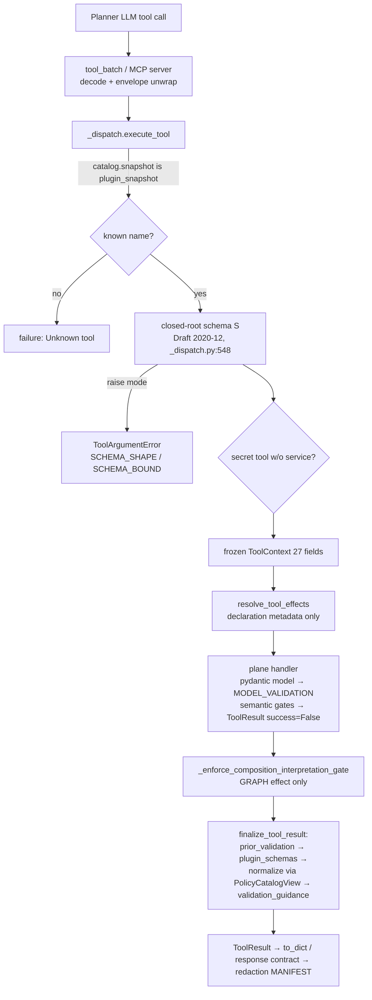

- **Registration topology** (`_registry.py:1-44`, `declarations.py:34-46`): each plane module owns a
  `TOOLS_IN_MODULE` tuple of `ToolDeclaration`s. `_registry.py` is the only aggregation site
  (`_REGISTERED_TOOLS` `_registry.py:94-102`) and derives every handler map and name set from it by pure functions
  (`declarations.py:301-391`). `discovery.py` builds predicates on top of those sets, and `_dispatch.py` sits on top
  of all of them. There is no mutable registry state: every map is a `MappingProxyType` and every set a `frozenset`.
- **Handler contract:** `ToolHandler = Callable[[dict, CompositionState, ToolContext], ToolResult]`
  (`_common.py:3586`). Handlers are pure state transitions over the immutable `CompositionState`, built with
  `with_node`, `with_edge`, `with_output` and `replace`. They read context (catalog, session engine, secret service,
  provenance) from the frozen `ToolContext`.
- **Two failure channels** (designed, and documented at `sessions.py:662-671`):
  1. Shape errors raise `ToolArgumentError`. The compose loop routes these as ARG_ERROR. S0 splits them into
     categories: S-gate `SCHEMA_SHAPE` for keywords in `WIRE_KEYWORD_ALLOWLIST` (`_dispatch.py:453-474`),
     `SCHEMA_BOUND` otherwise (`:531-535`), and `MODEL_VALIDATION` from Pydantic (`_common.py:1227-1236`, 14 sites).
  2. Semantic rejections return `ToolResult(success=False)` whose leading `ValidationEntry(component="rejected_mutation")`
     carries a closed `error_code`, `plugin_identity` and `rejected_component` (`_common.py:1284-1338`, `:1478-1535`).

  `set_pipeline` gathers up to 8 per-component rejections into one envelope (`sessions.py:202`, `:741-781`;
  `_merged_component_rejection_result` `_common.py:1544`).
- **Finalization order is load-bearing** (`_dispatch.py:676-693`): inject prior validation, then attach
  `plugin_schemas` from the structural `plugin_identity` (never parsed from message text, `_common.py:1373-1434`),
  then re-validate through the request `PolicyCatalogView`, which is snapshot-hash cached (`_common.py:3592-3628`),
  and only then attach `validation_guidance`. Guidance is computed after normalization so that codes the
  normalization adds are included.
- **Async carve-out:** `request_interpretation_review` has no `ToolDeclaration` because its handler takes 9 extra
  kwargs and 2 awaitables (`sessions.py:3221-3232`, deferred under ticket elspeth-f5da936747).
  `request_advisor_hint` is intercepted in `service.py` before dispatch. Two hand-maintained carve-out sets exist,
  `discovery._SESSION_AWARE_TOOL_NAMES` (1 name) and `_registry.ASYNC_TOOL_EFFECTS` (2 names), and
  `_dispatch.py:984-1058` holds them equal to the handler dict, the MANIFEST and the advertised list at import.
- **Concurrency:** handlers are synchronous and run off the event loop through `bounded(execute_tool, …)`
  (`pipeline_commit.py:524-527`). The only coroutine is `_handle_request_interpretation_review`. Blob writes
  serialize on a session-operation CAS (`authority.compare_and_swap`, `blobs.py:1479-1487`), the blob quota session
  lock and `_blob_custody_session_lock` (`blobs.py:1824`). The plane holds no locks of its own.

## Data & persistence

- **The slice owns no tables and no schema epoch.** `CompositionState` goes in and out immutable. Persisting the
  state, proposals and chat messages happens outside the slice (compose loop, `web.sessions`).
- **Writes (MEASURED by reading the call path):**
  - Blob rows and blob files, through `web.blobs.service._persist_blob_content` (`blobs.py:1490-1536`), from
    `create_blob`, `set_pipeline` `source.inline_blob` (`sessions.py:1893-1925`) and the inline source paths.
    Files land at `{data_dir}/blobs/{session_id}/{blob_id}_{filename}` (`blobs.py:1339-1344`).
  - `update_blob` goes through `BlobReplacementCoordinator` (lazy import from `web.coordination`, `blobs.py:1719-1735`).
  - `delete_blob` goes through `BlobServiceImpl` under `_blob_custody_session_lock` (`blobs.py:1818-1824`).
  - Interpretation events go through the injected `create_pending_interpretation_event` (`sessions.py:3141`); the
    sessions service owns that table.
- **Direct reads:** `blobs_table` via raw SQLAlchemy Core `engine.connect()` in `blobs.py:461`, `:509`, `:531`,
  `:541`, `:566` and `sources.py:1728`. Blob bytes are read from `storage_path` in `blobs.py:1950`,
  `sources.py:1670`, `:1700`, `:1821` and `generation.py:3551` (inspection and proof diagnostics).
- **What the DB enforces vs what code enforces:**
  - Blob row literals (status, creator, mime) have DB CHECKs that are re-checked on every read by
    `_guard_blob_row_literals` (`blobs.py:401`, `:434`).
  - The quota is a DB-locked sum (`_lock_session_for_blob_quota`).
  - Everything else is enforced in code: path allowlists S2, credential literals, secret wiring, plugin policy,
    interpretation ownership, and the MANIFEST ↔ registry parity at import (`_dispatch.py:1050-1067`).

## Dependencies

Instrument: an AST walk over all `src/elspeth/**/*.py` (frontend excluded), counting absolute `ImportFrom` into
or out of `elspeth.web.composer.tools`, classified as module-level, lazy (inside a function) or `TYPE_CHECKING`.
Positive controls:

- The walk reports the known lazy import `sessions.py:1572` as `web.composer.guided`, lazy, 1.
- The package matrix row `web.composer → engine | 1 | 0 | 0` (`temp/import-matrix.md:189`) is exactly this slice's
  `_common.py:54` (`from elspeth.engine.orchestrator.preflight import check_config_value_sources`), so the only
  web.composer→engine edge in the tree lives here.

Raw output is in `scratchpad/s11_imports.txt`.

- **Inbound** (MEASURED): 24 importer buckets and 106 symbol-imports. By bucket:
  - `web.composer.pipeline_planner` 7
  - `web.composer.service` 5
  - `web.composer.tool_batch` 4
  - `web.composer.guided` 4 modules: `_discovery`, `chat_solver`, `emitters`, `planning`
  - `web.sessions` 4: `service`, `routes/_helpers`, `routes/composer/guided`, `routes/composer/proposals`
  - `web.composer.pipeline_commit` 3
  - `web.execution.service` 3 lazy and 1 typing
  - `composer_mcp.server` 2
  - `web.composer.redaction` 1 lazy
  - about 13 other composer modules with 1–2 each

  Only 40 of the 106 symbol-imports go through the facade `elspeth.web.composer.tools`. **66 bypass it** into
  `_common` (21), `generation` (11), `_dispatch` (8), `sessions` (7), `_registry` (6), `state_responses` (6) and
  others. 20 external files import from a private (`_`-prefixed) submodule, and 23 import from some non-facade submodule (`grep "from elspeth.web.composer.tools\.(_common|_dispatch|…) import"`).
- **Outbound** (MEASURED, module-level unless noted):
  - `contracts` 60; `web.composer.state` 11; `web.composer.redaction` 10 plus 1 lazy; `web.composer.protocol` 8;
    `web.composer.response_contracts` 8
  - `web.interpretation_state` 7; `web.sessions` 7 (`protocol`, `models.blobs_table`); `core` 6; `plugins` 6 plus
    1 lazy; `web.catalog` 6; `web.provider_config_policy` 6
  - `web.plugin_policy` 4; `web.secrets` 4; `web.blobs` 3 plus 1 lazy (four private helpers from
    `web.blobs.service`, `blobs.py:62-70`); `web.execution` 3 (`schemas`, private `_validation_materialization`)
  - `web.coordination` 2 lazy; `engine` 1; `web.composer.guided` 1 lazy
- **Cycles touching this slice** (web SCC, `import-matrix.md:290`):
  - `tools ⇄ web.composer.redaction`: tools import the argument models and MANIFEST at module level
    (`_dispatch.py:1050`, `sessions.py:43`, `transforms.py:17`); redaction imports tools lazily.
  - `tools ⇄ web.sessions`: `web.sessions.service` and routes import tools, and tools import `sessions.protocol`
    and `sessions.models` (`_common.py:122`, `blobs.py:103`, `sources.py:105`).
  - `tools ⇄ web.execution`: tools import `execution.schemas.ValidationResult` (`_common.py:88`); `execution.service`
    imports tools lazily.
  - `tools → guided → tools`: `sessions.py:1572` imports lazily from guided, and 4 guided modules import tools.

  Inside the package, the documented `schema_contract → _dispatch → _registry → transforms` chain is kept acyclic
  by moving naming helpers into the leaf module `_naming_disclosure.py` (`_naming_disclosure.py:1-9`), and
  `_dispatch.py:1050` imports MANIFEST after the registry by design (`# noqa: E402`).

## Patterns observed

- **Declaration-as-SSOT with import-time proofs.** Each tool is one frozen `ToolDeclaration` checked at construction:
  JSON-schema meta-validation, a root object with `additionalProperties:false` (`declarations.py:245-259`), and
  kind-scoped flags. Derived registries, and import-time checks on uniqueness, trailing tool, async/sync split,
  effects ↔ advertised list and MANIFEST parity, turn drift into boot failures (`_dispatch.py:359-368`, `:984-1068`).
- **Two schemas per tool by design.** The LLM-facing `json_schema` (prose-rich) and the Pydantic argument model
  (security policy, mostly in `redaction.py`) are kept apart (`declarations.py:18-32`). Key-name parity is checked
  for every shipped tool (`tests/unit/web/composer/test_tool_model_wire_parity.py:23-31`). Type, requiredness and
  enum direction are checked only for `set_pipeline` (production) and `upsert_node` (CI) (`schema_contract.py:298`, `:575`).
- **Closed failure vocabulary and redaction-safe errors.** `ToolArgumentError` reduces `expected`/`actual_type` to
  closed text. A probe confirmed this: `expected="id of an existing LLM transform (known ids: ['a','b'])"`,
  `actual_type="unknown id 'zzz'"` became `'id of an existing LLM transform' | 'unknown id' | semantic_rule`.
- **Structural stamps over message parsing.** `plugin_identity` and `rejected_component` are stamped by the producer
  and read structurally. The message parser was deleted after three bypasses (`_common.py:1385-1397`).
- **Nominal admission (ADR-032).** `type(x) is …` exact checks on `ToolResult` payloads (`_common.py:940-982`),
  `ReviewedSourceAuthority` and `PendingCustodyBlobView` (`:3387-3460`), and `_validate_plugin_name`'s exact-`str`
  check (`:2022`). `@trust_boundary`/`@observation_boundary` decorators label the Tier-3 parameters
  (e.g. `sessions.py:627-635`, `_common.py:310-320`).
- **Echo tolerance.** Server-owned metadata that the planner echoes back verbatim is reduced before the ownership
  gates run, and a `server_owned_metadata_note` records it (`sessions.py:929-946`, `transforms.py:654-660`).
- **Repeated gate chains instead of a composed admission pipeline.** The per-node gate order (runtime-owned →
  canonicalize → default reviews → canonical check → credential → plugin policy → batch placement and required
  fields → prompt surface → prevalidate → provider policy (profile skip) → provider path → gate expression) is
  hand-inlined in `set_pipeline` (`sessions.py:1385-1547`), `upsert_node` (`transforms.py:661-778`) and
  `_prepare_transform_candidate` (`transforms.py:1878-2003`, used by splice and patch). Call counts:
  `_prevalidate_transform_for_context` sessions=1 / transforms=3; `_validate_aggregation_trigger` sessions=0 / transforms=2.
- **Nested-closure mega-function.** `build_set_pipeline_candidate` defines 7 closures, two of which shadow
  module-level names (`_failure_result` and `_plugin_policy_failure`, `sessions.py:685`, `:724`). The module keeps
  aliases (`_tool_failure_result = _failure_result`, `sessions.py:190-191`) to reach the shadowed originals.

## Invariants & how they are enforced

| Invariant | Enforcement | Evidence |
|---|---|---|
| Every dispatchable tool has a redaction MANIFEST entry, and vice versa | Import-time `RuntimeError` | `_dispatch.py:1050-1067`; probe: MANIFEST 42 = advertised 42 |
| Tool names unique across planes; async/sync handler split | Import-time assertion | `_registry.py:103`, `_dispatch.py:984-1021` |
| Only DISCOVERY tools are cacheable; response contracts only on discovery kinds | Construction-time `ValueError` | `declarations.py:202-230` |
| Every advertised root schema is closed (`additionalProperties:false`) | Construction-time check, plus `_closed_root_schema` at admission | `declarations.py:255-259`, `_dispatch.py:477-482` |
| Public dispatch admits arguments through schema S before any handler runs | Code, but **opt-in by flag** (`validate_arguments` / `raise_schema_argument_errors` default `False`; either one triggers S at `:848`) | `_dispatch.py:748-750`, `:848-856`; all 7 production call sites set at least one of the two flags (see Public interface), but not uniformly: `pipeline_commit.py:527` sets only `raise_schema_argument_errors`, `proposals.py:454` sets only `validate_arguments` + `require_data_dir_for_paths` |
| Catalog and plugin snapshot are one request authority | `ValueError("plugin_snapshot_catalog_mismatch")` | `_dispatch.py:832-833`, `:929-930` |
| No `interpretation_requirements` on outputs, and canonical invariant B on sources and nodes | Dispatcher gate on every successful GRAPH-effect result (not in `outputs.py`) | `_dispatch.py:696-716` → `_common.py:2799-2822` |
| Literal credentials never stored | Code (`collect_credential_field_violations`) in every mutating plane | `_common.py:1817-1919` (called 4× sessions, 3× transforms, 2× sources, 2× outputs) |
| Secret wiring is deny-by-default | Code (`secret_wiring_authorization_error`, where `None` policy means deny) | `secrets.py:353-424`, `_common.py:3496-3499` |
| Source and sink paths stay in the session subtree (S2) | Code: `Path.resolve` + `is_relative_to` | `_common.py:2085-2193` |
| Trailing tool stays `wire_secret_ref` (prompt-cache marker) | Import-time `RuntimeError` + test | `_dispatch.py:359-368` |
| Interpretation rate caps apply to `vague_term` only (ADR-037) | Code | `sessions.py:3126-3135`, `:2809-2813` |
| **Composer invariant 1 (no server-authored structure)** | **Prose and review only; no gate.** Assessed below | — |

**Composer invariant 1: assessment (MEASURED by reading every graph-constructing site in the slice).**

- `set_pipeline` constructs every `NodeSpec`, `EdgeSpec` and `OutputSpec` field for field from the validated planner
  payload (`sessions.py:1720-1818`). The server contributes only:
  - defaults: `on_error="discard"` for transform/aggregation (`:1735`), `on_write_failure="discard"` (`:1793`),
    and `on_validation_failure` `None`/`""`→`discard` (`_common.py:1812`);
  - option-level derivations: MIME-inferred reader options, only when the planner's own plugin matches
    (`sessions.py:1078-1079`); filename delimiter (`:1084`); blob `path`/`blob_ref` binding (`:1089-1096`); derived
    CSV `guaranteed_fields` for LLM-authored content only (`sources.py:506-554`); relative sink-path rooting (`:1572-1581`);
  - auto-staged review requirements (`_common.py:564-595`).

  None of these adds or reroutes a node, edge or output.
- `upsert_edge` and `upsert_node` keep the visual edge and the scalar route in sync (`transforms.py:905-992`). The
  scalar is written from the planner's edge, or the planner's edge is retargeted or removed. "Missing edges are
  never invented" (`transforms.py:955-956`).
- `splice_transform` derives the connection name `<id>_out` and the edge id `<edge>__splice__<id>`
  (`transforms.py:856-877`, `:1235-1269`) to carry out a planner-chosen insertion between planner-named nodes.
  This is mechanical application, not authorship.
- `_prevalidate_transform_for_context` builds a synthetic csv → node → json `CompositionState` purely as a
  validation probe (`_common.py:3301-3334`). It is never returned or persisted, so it counts as validation, which
  the invariant permits.
- **Boundary case (see C4):** `_duplicate_consumer_repair_suggestions` (`_common.py:779-907`) *synthesizes* a
  complete fork-gate node (`id=fork_<conn>`, `condition:"True"`, `routes:{true:fork,false:fork}`, server-minted
  `fork_to` branch names) plus rewritten consumer payloads, as a copyable `tool_sequence`. It runs on every
  `ToolResult.to_dict()` (`_common.py:1094-1097`). It is never applied to state; the planner must re-issue it
  through `upsert_node`. It reaches the planner, not the user as a proposal. The code does not violate the invariant
  as written, but it is the closest server-templated structure in the slice.
- **Invariant 2 (no tutorial paths):** no tutorial or guided-mode conditional exists in any handler. Of the 58
  `guided|tutorial` mentions in the slice, the tutorial ones are provenance comments (e.g. `_common.py:488-491`,
  `sessions.py:456`, `:1853`) sitting on generic code. The guided mentions are guided-only seams (see C3).

## Baseline delta — ARCHITECTURE.md says / tree says

| Claim in ARCHITECTURE.md / ADR / module prose | What the pinned tree shows | Evidence |
|---|---|---|
| Tier-3 diagram: "Composer / MCP Tool Args — *Coerce where possible*, validate at boundary, *quarantine failures*" (ARCHITECTURE.md trust-tier diagram, `ComposerArgs` node) | Tool arguments are **rejected, not coerced** (`@trust_boundary … invariant="…never coerces"`), and failures return a failed `ToolResult` or ARG_ERROR. There is no quarantine. Coercion happens only as named canonicalizations: `""`→discard, web_scrape header ASCII fold, relative sink-path rooting | `sessions.py:632`; `_common.py:1812`, `:529-561`; `sessions.py:1572-1581` |
| Diagram edge `ComposerArgs --> Transforms` | Arguments pass through schema S and the Pydantic model into `CompositionState`, then YAML generation. They never reach transform plugins directly | `_dispatch.py:848-899` |
| **Missing coverage:** ARCHITECTURE.md never mentions the tool registry, `execute_tool`, `ToolDeclaration`, the 42-tool surface or the redaction MANIFEST | `grep -n -i "execute_tool\|ToolDeclaration\|MANIFEST\|tool registry" ARCHITECTURE.md` returned 0 lines (the positive control `grep -i composer` returned 20+). The slice alone is 22,586 lines inside the single "Web app + Composer" box | ARCHITECTURE.md:120, `:171` |
| ADR-040 §3 placement rule: "The runtime defaults it → Stage 1 defaults it (at the construction boundary, so every path inherits)" | `on_error="discard"` is defaulted in the tool handlers, not at `NodeSpec` construction. Paths that build `NodeSpec` outside these handlers do not inherit it (INFERRED: not traced beyond the slice) | `sessions.py:1735`, `transforms.py:794`, `:884` |
| ADR-037: caps govern LLM `vague_term` churn only | Conforms | `sessions.py:3126`, `:2809-2813` |
| `_common.py` module docstring: "Layer: L3. Imports from L0 contracts and web.composer.state / protocol / catalog.protocol / execution.schemas surfaces only" | Also imports `engine.orchestrator.preflight`, `core.config`, `core.secrets`, `plugins.infrastructure.*`, `web.paths`, `web.plugin_policy.*`, `web.provider_config_policy`, `web.secrets.*`, `web.sessions.protocol`, `web.interpretation_state`, `web.validation`, `web.composer._producer_resolver`, `redaction`, `plugin_policy_disclosure` and `tool_result_envelope` | `_common.py:16-18` vs `:35-125` |
| `__init__.py`: "CLOSED LIST … external consumers import via this facade" | 66 of 106 external symbol-imports bypass the facade, including underscore names (`_failure_result`, `_validate_mutation_arguments`, `_validate_tool_arguments`, `_PreparedBlobCreate`, `_CLOSED_VALIDATION_ERROR_CODES`) | `__init__.py:18-34`; AST import scan |
| `declarations.py`: `ToolDeclaration` is the single source for per-tool registry facts | One approval-policy fact is hard-coded outside it: `name != "create_blob"` | `discovery.py:113` |
| `declarations.py:277-279`: `augments_on_failure` targets "rejection messages the augmentation walker matches against" | The walker no longer reads messages. It reads the structural `plugin_identity` | `_common.py:1385-1397` |
| `get_tool_definitions` docstring: "42 tools: 12+14+11(5+6)+3(2+1)+1+1" | Conforms (probe) | `_dispatch.py:313-315` |

## Concerns

| ID | Sev | Concern | Evidence (pin) | New / previously reported |
|---|---|---|---|---|
| C1 | Medium | `_common.py` is a 3,971-line, 101-def sink that mixes at least 8 responsibilities (see Key components). Its declared L3 layering is false, and it holds the slice's only `engine` import. MEASURED (AST, names per `from …_common import`): sessions 46, sources 33, transforms 30, outputs 16, blobs 13, generation 10, secrets 10. Any change there fans out to all 7 planes and 12 external importers | `_common.py:1-19`, `:35-125`, `:54` | NEW |
| C2 | Medium | The per-node admission gate chain is hand-copied into ≥3 handlers and has already drifted. `set_pipeline` never calls `_validate_aggregation_trigger` (0 calls vs 2 in transforms), so a malformed trigger is a mutation rejection on `upsert_node` but only a Stage-1 validation entry on `set_pipeline`. `_batch_aware_required_input_fields_error` receives `node_options` in `upsert_node` but `review_options` in `set_pipeline` | `transforms.py:724`, `:773-778`; `sessions.py:1385-1547`, `:1468`; `state.py:3664` | NEW. Same family as PREVIOUSLY-REPORTED R33 (web-review 2026-09-23, `upsert_node` vs `patch_node_options` digest asymmetry) |
| C3 | Medium | Freeform `set_pipeline` depends on the guided lane that is being retired: a lazy import `guided.stage_transitions.canonical_sink_local_paths` sits on the hot freeform path. Other guided-only seams in the slice: `get_discovery_tool_definitions` (only caller `guided/chat_solver.py`), the `ReviewedSourceAuthority`/`PendingCustodyBlobView` DTOs plus 2 `ToolContext` fields, and helpers documented as "guided proposal preparation". Deleting guided without moving `canonical_sink_local_paths` breaks freeform `set_pipeline` | `sessions.py:1572`; `_dispatch.py:371-414`; `_common.py:3374-3461`, `:3575-3583`; `blobs.py:494-515` | NEW (removal-inventory input) |
| C4 | Low (ruling needed) | Invariant-1 boundary case: the server templates a full fork-gate node (id, `condition:"True"`, routes, branch names) plus rewired consumer payloads into every failed envelope's `graph_repair_suggestions`. It is advisory and never applied to state, but it is server-derived pipeline structure handed to the planner. It needs an explicit maintainer ruling on whether this counts as "validation/rejection guidance" (permitted) or a "recipe/template" (banned) | `_common.py:779-907`, `:1094-1097` | NEW |
| C5 | Low | Dead production code kept alive by tests: `_check_blob_quota`, `_sync_get_blob_by_storage_path`, `_sync_get_blob_by_id`, `_assert_affected_llm_node` ("compatibility wrapper for older tests"), `validation_guidance_items`. Each has 0 production call sites (`grep "name("` excluding the def; positive control `_blob_storage_path` = 1). Per maintainer doctrine, decide deliberately whether these are unfinished intent or debt | `blobs.py:494`, `:517`, `:1347`; `sessions.py:2678`; `generation.py:1841` | NEW |
| C6 | Low | Secure behaviour depends on caller flags. `execute_tool` defaults `validate_arguments`, `require_data_dir_for_paths` and `raise_schema_argument_errors` to `False`. All 7 production sites reach schema S today (each sets at least one of the two admission flags), but the flag combination differs per site (`pipeline_commit.py:527` omits `validate_arguments` and `require_data_dir_for_paths`; `proposals.py:454` omits `raise_schema_argument_errors`), and a new caller silently skips schema S | `_dispatch.py:748-750`, `:819-827` | NEW |
| C7 | Low | The facade is not enforced: 20 external files import from private submodules, many of them underscore names (see Baseline delta). Only a dead-entry test guards `__all__` | `__init__.py:25-38`; `tests/unit/web/composer/test_tools_facade_surface.py` | NEW |
| C8 | Low | Four handler "docstrings" come after the first statement, so `__doc__ is None` and the text is a dead expression. AST scan found 4 hits: the 2 known sites plus 2 more | `generation.py:2032`, `:2332`, `:4127`, `:4270` | NEW |
| C9 | Low | Eleven file:line cross-references in prose are stale, e.g. `tools.py:5530-5540` (the file no longer exists) and `service.py:2480` ×7 (it now points into a constructor signature) | `sessions.py:651`, `:655`; `secrets.py:44`, `:55`; `sources.py:1030`, `:1033` | NEW |
| C10 | Low | Handlers still build repair prose that S0 reduction throws away. For example, the `known ids` list at `sessions.py:2372-2376` becomes `'id of an existing LLM transform'`, so that repair aid never reaches the model | Probe (see Patterns) | NEW (S0 works as designed; prose/contract drift) |
| C11 | Low | Per-mutation validation is repeated: `_post_mutation_invariant_error` → `validate()`, `_mutation_result` → `validate()`, then `normalize_tool_result_validation` → `catalog.validate_composition_state`. `to_dict()` also recomputes repair suggestions on every serialization. INFERRED cost, not measured | `_common.py:3727`, `:1625`, `:3621`, `:1094` | NEW |
| C12 | Low | The blob plane is a second synchronous data-access path next to `BlobServiceImpl`. It imports four private `web.blobs.service` helpers, queries `blobs_table` directly, and recomputes the storage layout "matching BlobServiceImpl" by convention | `blobs.py:62-70`, `:103`, `:1339-1344`; `sources.py:105` | NEW |
| C13 | Low | `_prevalidate_transform_for_context` returns `str \| None`, so callers hard-code `plugin_options_invalid` and structured policy codes are flattened | `_common.py:3295`; `sessions.py:1494`; `transforms.py:746` | PREVIOUSLY-REPORTED elspeth-42f8e9e66f (`docs/reviews/2026-09-22-p1-triage.md` §C3) |
| C14 | Low | The tool layer default-fills `on_error="discard"` (also an ADR-040 §3 placement delta, see Baseline delta) | `sessions.py:1735`; `transforms.py:794`, `:884` | PREVIOUSLY-REPORTED elspeth-0aace271b4 (p1-triage §C10) |
| C15 | Medium | Deferred-blob classification misses markers in multi-query `queries.<name>.template` | `blobs.py:725` region | PREVIOUSLY-REPORTED R17 (web-review 2026-09-23) |
| C16 | Low | `prompt_template_parts_required` guard can be bypassed by echoing unchanged parts, and the code is not in the guidance catalogue | `transforms.py:1658-1669` region | PREVIOUSLY-REPORTED R32, R34 |
| C17 | Info | `get_pipeline_state`'s description carries web-only `{"pipeline": <document>}` wrapping prose. MEASURED: the MCP server serves it verbatim while its `set_pipeline` is flat (`pipeline` ∉ properties) | `sessions.py:2339-2341`, `:2355-2356`; `composer_mcp/server.py:220` | PREVIOUSLY-REPORTED be-14#1, **refuted** (the "For the web…" qualifier makes it vacuous for MCP). Recorded only as an example of surface-specific prose in the shared registry |

## Complexity & tech-debt hotspots

- **29 functions of 100 lines or more** (AST measured). The largest:
  - `build_set_pipeline_candidate` 1,255 (`sessions.py:636`), which contains a 276-line nested `_legacy_source_rejection` (`:900`)
  - `_compute_proof_diagnostics_for_source` 426 (`generation.py:3454`)
  - `_assert_affected_component` 265 (`sessions.py:2411`)
  - `_execute_upsert_node` 223
  - `execute_tool` 195 (31 parameters, `_dispatch.py:719-752`)
  - `_execute_patch_node_options` 195
  - `_execute_patch_source_options` 191
- **Static data volume:** `_VALIDATION_ERROR_PATTERNS` is a 1,071-line regex/explanation/fix table (`generation.py:449-1519`),
  plus a 188-line `_LEGACY_VALIDATION_ERROR_CODES` (`:1528-1715`). Legacy codes resolve by first regex match, new
  codes by direct records, so two lookup disciplines coexist (`generation.py:1893-1896`).
- **Fused responsibilities:** `_common.py` (C1). `sessions.py` mixes full-replacement authoring, pipeline-state
  reads, async interpretation review, rate-limit policy and advisor argument models, and its name ("sessions
  plane") no longer describes its content.
- **Parallel envelope mechanisms:** the 19 discovery tools use nominal `ResponseContract`s
  (`state_responses.py`, `_generation_*`), while the 21 mutation tools still serialize through `ToolResult.to_dict`
  with free `data` (`_registry.py:108-109`: "unconverted declarations remain explicit"). This is a half-finished migration.
- **Hand-maintained carve-outs:** the async tools live outside `ToolDeclaration` (elspeth-f5da936747), with two
  inline schemas in `_dispatch.py:132-307` and two name sets. Parity checks keep them in sync.
- **Suppressions and TODOs:** 1 `# noqa: E402` (`_dispatch.py:1050`, by design), 0 `type: ignore`,
  0 TODO/FIXME/XXX/HACK (grep over `*.py`).

## Test map

- **152 test files import `elspeth.web.composer.tools`:** unit 124, integration 22, testcontainer 4, property 1,
  helpers 1 (`grep -rl … | cut -d/ -f1 | uniq -c`).
- Files per module (`grep -rl "tools.<mod>"`): `_common` 63, `generation` 31, `_dispatch` 22, `sessions` 16,
  `blobs` 10, `transforms` 9, `sources` 8, `_registry` 8, `schema_contract` 8, `declarations` 5, `discovery` 2,
  `secrets` 2, `state_responses` 2, `_generation_schema_response` 2, `outputs` 1, `_naming_disclosure` 0,
  `_generation_responses` 0. The modules with 0 are covered indirectly via
  `test_state_response_contracts.py` / `test_generation_response_contracts.py`.
- **Notable suites:**
  - `tests/unit/web/composer/test_tools.py` at **21,112 lines**, a monolith mirroring C1
  - `test_tool_declarations.py`, `test_tool_model_wire_parity.py` (key parity for every tool),
    `test_tool_dispatch_boundary.py`, `test_tool_argument_error_category.py` (S0), `test_tools_facade_surface.py`,
    `test_splice_transform_tool.py`, `test_request_interpretation_review_tool.py`
  - testcontainer: `test_composer_splice_concurrency.py`, `test_blob_read_custody_race.py`,
    `test_composer_blob_lease_progress.py`, `test_run_admission_custody_lock_postgres.py`
- **Gaps:**
  - No test or gate asserts invariant 1 at the tool layer, e.g. "no handler emits a node, edge or output the planner
    did not name".
  - Type and requiredness direction parity exists only for 2 of 42 tools.
  - `outputs.py` is imported directly by only 1 test file.
  - Dead helpers (C5) are still exercised by tests, which hides their production deadness.

## Confidence

**Medium-High.**

- **Read fully:** `__init__.py`, `_registry.py`, `declarations.py`, `discovery.py`, `_dispatch.py`, `secrets.py`, `outputs.py`.
- **Read `_common.py` in large segments** (lines 1-1840, 1788-2430, 3290-3735; about 75 %).
- **Read `sessions.py` 1-2420 and 2676-3232** (about 93 %), including all of `build_set_pipeline_candidate`.
- **Read in `transforms.py`:** 1-200 and 575-1475 (upsert_node, the sink mirror, splice, upsert_edge).
- **Sampled** `generation.py` (imports, catalogue headers, guidance builder, preview and diff), `sources.py`
  (imports, guarantee derivation), `blobs.py` (imports, sync DB, persistence, authority), and
  `schema_contract.py`, `state_responses.py`, `_naming_disclosure.py` and `_generation_*` (headers and key functions).
- **Not read:** the `generation.py` proof-diagnostics bodies (lines 2550-3900), `sources.py` blob-resolution bodies,
  `transforms.py` `patch_node_options` (1604-1800), the `blobs.py` update, delete and get-content bodies, and the
  `_common.py` interpretation canonicalization body (2430-3030). Concerns about those regions are either cited from
  prior reviews (R17, R32–R34) or left out.
- **Measured claims** (registry probe, AST import scan with positive controls, dead-symbol and misplaced-docstring
  scans with positive controls, grep counts, and a `ToolArgumentError` reduction probe) are marked MEASURED.
- **INFERRED claims:** the C11 performance cost; the ADR-040 inheritance consequence for paths outside the slice.
- **retired code index was not used.** Its index is stale (near `ee04378f8`), so every dependency claim comes from a fresh
  AST scan at the pin.

## Validation corrections

- [validator] Package share used the pre-pin `web/composer/` figure 103,642 -> 104,490 at the pin (`find web/composer -name '*.py' | xargs cat | wc -l`; discovery doc correction C1). The share still rounds to 22 %.
- [validator] `augments_on_failure=True`: 11 -> 10 (registry probe at the pin: `_registry._AUGMENTS_ON_FAILURE_TOOL_NAMES` = patch_node_options, patch_output_options, patch_source_options, set_output, set_pipeline, set_source, set_source_from_blob, set_source_from_blobs, splice_transform, upsert_node).
- [validator] `_registry.py` line citations pointed past end of file (239 lines): `_REGISTERED_TOOLS` `:277-285` -> `:94-102`; uniqueness assertion `:286` -> `:103` (`assert_unique_names`); "unconverted declarations remain explicit" `:291-297` -> `:108-109`.
- [validator] "22 external files import from a private submodule" -> 20 (AST scan and `grep -rlE "from elspeth\.web\.composer\.tools\.(_[a-z_]+)"` outside the package agree); 23 files import from any non-facade submodule. The 106/40/66 symbol-import split reproduces exactly.
- [validator] `execute_tool` production call-site inventory omitted `web/sessions/routes/composer/proposals.py:454` (accept route) -> 7 sites, not 5. All 7 reach schema S (either flag triggers it, `_dispatch.py:848`), but flags are not uniform: `pipeline_commit.py:527` passes only `raise_schema_argument_errors=True`; `proposals.py:454` passes `validate_arguments=True, require_data_dir_for_paths=True`. C6's conclusion is unchanged; severity unchanged (Low).


---

# S12 — Composer Governance (advisor gate, required controls, custody/redaction, proposal→commit, YAML, composer audit, tutorial run)

**Location:** `src/elspeth/web/composer/*.py` minus the S10 core-loop files, minus `guided/` and `tools/`,
plus `src/elspeth/web/composer/skills/`. All paths below are relative to the pinned worktree
`.claude/worktrees/arch-analysis-pin` at `release/0.8.1` @ `85ebf2739`.

**Measured size:** (MEASURED)

```
# S10 exclusion set: service state protocol pipeline_planner planner_authoring_aids tool_batch
#   no_tool_finalize no_tool_policy llm_response_parsing prompts progress _compose_loop_carriers __init__
cd src/elspeth/web/composer && ls *.py | (exclude S10) > s12files.txt   # 58 files
wc -l $(cat s12files.txt)            -> 22,786 lines of Python in 58 modules
find skills -type f | xargs wc -l    -> 1,716 lines (pipeline_composer.md 1,245; pipeline_capabilities.md 334; __init__.py 137)
```

The brief names 42 of these modules. The other 16 are the "remaining" composer modules: `provider_*`,
`boot_probe`, `availability`, `discovery_*`, `reasoning`, `bounded_json`, `error_codes`,
`response_contracts`, `_response_json`, `plugin_policy_disclosure` and `provider_config`. They
are included and marked *peripheral* below. S12 is 22 % of `web/composer/` (104,490 lines, per
the discovery findings).

**Overlap with S10 (validator note):** the exclusion set above is narrower than S10's Location. 12 of
these 58 files (`reasoning`, `provider_{config,quota,telemetry,discovery_response}`, `availability`,
`boot_probe`, `bounded_json`, `_response_json`, `response_contracts`, `discovery_{cache,response}`;
1,703 lines) are also counted in S10's 39,223. S12-exclusive content is 46 files / 21,083 lines.

**Responsibility:** The governance layer around the composer's LLM authoring loop. It admits and
audits advisor verdicts, auto-wires deployment-required controls, holds inline-content custody,
redacts every persisted tool call through a closed manifest, binds planner proposals to an exact
commit, lowers state to runtime YAML and imports it back, and runs the fixed-script tutorial
against the ordinary execution service.

---

## Key components

Every file over 300 lines is listed. Read depth: **F** = read in full, **P** = partial read
(entry points plus 3 or more functions), **D** = docstring and definition list only.

| File | Lines | Read | Role |
|---|---:|:-:|---|
| `redaction.py` | 4,802 | P | The composer redaction manifest. `MANIFEST` (`:3630`, rebound at `:4794`) maps every dispatchable tool to a `ToolRedaction`. There are two shapes: type-driven (a Pydantic `argument_model` with `Sensitive[...]` markers, walked by `walk_model_schema` `:853`/`_walk_type` `:908`) or declarative (`ToolRedactionPolicy` `:1146`, which enforces 5 construction invariants and needs a ≥32-char `HandlesNoSensitiveDataReason` `:1085`). Entry points: `redact_tool_call_arguments` `:2518`, `redact_tool_call_response` `:4084` (168-line function), `redact_source_storage_path` `:4254`, and the guided-snapshot path degraders `:4368-4755`. |
| `audit.py` | 1,364 | P | `BufferingRecorder` `:207` is an in-memory, lock-guarded buffer over five channels (tool invocations, LLM calls, chat turns, planner attempts, withheld replies). `dispatch_with_audit` `:950` enforces exactly one `record()` per dispatch, in `finally`. Also the envelope builders: `audit_envelope` `:320`, `llm_call_audit_envelope` `:381` (a public-field allowlist `:342-378` hides reasoning artefacts) and `planner_attempt_audit_envelope` `:393`. |
| `source_inspection.py` | 1,279 | D+P | Bounded blob inspection (8 KiB or 100 rows) for CSV, JSON, JSONL and text. It gives type hints and URL candidates, and derives header-mismatch and extra-column risks (`:1193`, `:1218`). Consumed by `tools/sources.py`, `tools/generation.py`, the guided lane and the sessions routes. |
| `required_controls.py` | 1,046 | **F** | **Server-side auto-wire of deployment-REQUIRED `prompt_shield` / `content_safety` controls.** `wire_required_controls` `:753` runs a bounded fixpoint over `plugin_policy.coverage.control_coverage_findings`, splicing control transform nodes in at `:559`, `:648` and `:749`. `wire_required_controls_state` `:914` does the same for owned state. `merge_required_control_affected_components` `:1000` refuses any inserted node that lacks its disclosure. |
| `yaml_importer.py` | 1,030 | P | Runtime YAML to `CompositionState`: `composition_state_from_runtime_yaml` `:953`. Size cap of 262,144 chars; alias rejection; a duplicate-key-refusing SafeLoader `:202`; sections are refused by name (`_DECLINED_SECTION_REASONS`), never dropped silently; `landscape` is the one intentional drop. Edges are rebuilt as `()`. Every node is re-stamped with default LLM review requirements `:1019`. |
| `yaml_generator.py` | 884 | P | `CompositionState` to the runtime dict/YAML through a per-node-kind lowering table, with a drift guard against `COMPOSER_NODE_TYPES` `:445-449`. The public projection (`generate_public_yaml` `:855`) strips storage and custody carriers. `public_export_redaction_header` `:834` is applied only at the download route. |
| `tutorial_service.py` | 839 | **F** | Handlers for `POST /api/tutorial/run`, `/cancel` and `DELETE /orphans`. It checks launch readiness (`_tutorial_launch_blocker` `:196`), runs through the ordinary `ExecutionService.execute` under an EXECUTE lease, polls the run to a terminal state, and projects output only from Landscape rows and hash-verified artefacts. |
| `pipeline_proposal.py` | 807 | P | `PipelineProposal` `:624` is an immutable, hash-verified envelope (`composer.pipeline-proposal-envelope.v3`). It holds either canonical `set_pipeline` arguments or a closed `owned_composition_state.v1` authority. Defines `PlannerSurface` `:67` {FREEFORM, GUIDED_FULL, GUIDED_STAGED, TUTORIAL_PROFILE}, `AbsentBase`/`PresentBase`, and `composition_content_hash` `:780`. |
| `state_claim_grounding.py` | 709 | D+P | Detects prose claims that contradict persisted state, with regex over closed field vocabularies. Appends an `[ELSPETH-SYSTEM]` correction suffix to assistant prose; it never changes state. Consumers: `no_tool_policy`, `no_tool_finalize` (S10). |
| `_semantic_validator.py` | 656 | D | Generic semantic-contract validator: walks consumers back to producers through `ProducerResolver`, then applies CONFLICT/UNKNOWN × FAIL/WARN policy (`validate_semantic_contracts` `:524`). |
| `pipeline_commit.py` | 606 | **F** (commit fn) | `prepare_pipeline_proposal_commit` `:366` (230 lines) revalidates a pending proposal against the current base and runs `set_pipeline` exactly once through `dispatch_with_audit`. It returns `PreparedPipelineCommit` or `RecoveredPipelineCommit` and never settles state. |
| `pipeline_custody.py` | 540 | P | Inline-blob custody. `prepare_pipeline_custody` `:201` swaps `source.inline_blob` for a deterministic UUID5 `blob_id`; `staged_pipeline_custody` `:320` and `finalize_*` `:279/:431` publish the blob only after the owning transaction commits; the audit projection `:75` replaces the inline content before any dispatch audit opens. |
| `implicit_decisions.py` | 522 | P | A state-derived disclosure report (`schema_version` 2) persisted into `composer_meta.implicit_decisions` by the sessions routes. |
| `source_demand.py` | 449 | P | Minimal source-field demand backtrace (delta-runs Stage-1 edge contracts) for the `source_data_contract` card. `stamp_source_options_with_guarantees` `:104` writes `schema.guaranteed_fields` once the user acknowledges the card. |
| `advisor_audit.py` | 420 | **F** | Durable advisor rows: `AdvisorCheckpointPassRecord` `:126` (145-line class, about 20 cross-field `AuditIntegrityError` invariants) and `AdvisorTerminalPublication`. Each is persisted **before** its telemetry mirror (`persist_advisor_checkpoint_pass` `:353`, `persist_advisor_terminal_publication` `:394`). |
| `_producer_resolver.py` | 404 | D | Producer map and walk-back primitive shared by the schema and semantic validators (`ProducerResolver` `:132`, the largest class in the slice at 273 lines). |
| `telemetry_phase8.py` | 363 | D | Composer-mode and tutorial OTel helpers over `_SessionsTelemetry`. |
| `provider_discovery_response.py` | 351 | D | *Peripheral.* Restricted discovery envelopes. |
| `_schema_response_grammar.py` | 339 | D | Canonical schema keyword grammar. |
| `turn_audit.py` | 334 | **F** | P4 of the compose loop: redacts every tool call through `MANIFEST`, then calls `persist_compose_turn_async` exactly once. It was "extracted verbatim" from `service.py`. |
| `inventory_response_contracts.py` | 318 | D | One immutable response contract for the three plugin inventories. |
| **Advisor small modules** | 451 | **F** | `advisor_decision.py` 37 (cause enum, and the decision union `AdvisorGatePassed \| AdvisorGateBlocked`); `advisor_request.py` 45 (one request builder shared by the boot probe and live checkpoints); `advisor_output.py` 190 (strict JSON admission and note sanitiser); `advisor_checkpoint_telemetry.py` 179 (the telemetry mirror). |
| **Audit/provenance small modules** | 581 | **F** | `audit_storage.py` 279 (redacted storage projection with hash recomputation); `control_messages.py` 119 (v2 provider-visible control rows); `withheld_replies.py` 67; `authority_hashing.py` 98 (row-union order projection); `tool_result_envelope.py` 100 (the closed ToolResult key registry); `tool_error_payloads.py` 39. |
| **Planner-support small modules** | 1,069 | F/D | `capability_skill.py` 281 (F: planner capability manifest and inventory pin); `anti_anchor.py` 189; `proposals.py` 128 (F: plain-language proposal summaries); `reviewed_source_authority.py` 264; `reviewed_output_projection.py` 53; `guided_blob_refs.py` 269; `_required_paths_validator.py` 263; `_validation_probe.py` 80. |
| **Tutorial small modules** | 277 | **F** | `tutorial_run_routes.py` 57, `tutorial_abandon_routes.py` 24, `tutorial_models.py` 74, `tutorial_sample.py` 53, `tutorial_telemetry.py` 69. |
| **Peripheral (brief-unnamed) modules** | 1,666 | D | `provider_quota.py` 134 (F), `boot_probe.py` 250, `provider_telemetry.py` 246, `error_codes.py` 279, `availability.py` 156, `bounded_json.py` 154, `discovery_cache.py` 97, `reasoning.py` 93, `_response_json.py` 64, `discovery_response.py` 63, `response_contracts.py` 60, `plugin_policy_disclosure.py` 35, `provider_config.py` 35. |
| `skills/` | 1,716 | P | `pipeline_capabilities.md` is the capability core; `pipeline_composer.md` is the freeform interaction overlay. `load_skill_with_hash` (`skills/__init__.py`) is `lru_cache`d, and `assert_skill_hash_unchanged_on_disk` fails when the file changes on disk after the cache is loaded. |

---

## Public interface / entry points

**HTTP routes owned here (MEASURED):** `web/app.py:1938-1939` mounts both routers.
- `POST /api/tutorial/run` goes to `run_tutorial_pipeline` (`tutorial_run_routes.py:24-35`) and is rate-limited per user.
- `POST /api/tutorial/cancel` goes to `cancel_tutorial_run`, which reuses `ExecutionService.cancel` (`tutorial_service.py:728-755`).
- `DELETE /api/tutorial/orphans` goes to `cleanup_tutorial_orphans` `:758`, which soft-renames pending-title sessions under a COMPOSE lease.
- `POST /api/tutorial/abandon` is a 204 telemetry beacon (`tutorial_abandon_routes.py:17-21`).

**Library APIs consumed by other slices (MEASURED importers):**

| API | Consumer(s) |
|---|---|
| `AdvisorGatePassed/Blocked`, `AdvisorBlockCause`, `AdvisorSignoffGateFact` | `service.py` (S10) mints them; `web/execution/completion_gates.py:28-34` (S16) persists and merges them into readiness. |
| `parse_advisor_checkpoint_response`, `sanitize_advisor_note`, `build_advisor_request_options` | `service.py:106-115` (S10) and `boot_probe.py:32-33`. |
| `wire_required_controls` / `_state` | `service.py:465-486` (planner finalizer), `tool_batch.py:529/597/1596` (S10 incremental tools), `sessions/routes/composer/proposals.py:483` (S15 accept route). |
| `MANIFEST`, `redact_tool_call_arguments/response` | `tools/_dispatch.py:1050-1067` (import-time set-equality with the tool registry); `turn_audit.py`, `audit_storage.py`, `tool_batch.py:810`. |
| `PipelineProposal`, `PlannerSurface`, `composition_content_hash` | 16 production importers, mostly `pipeline_planner` (S10), `sessions/service.py` and the guided routes. |
| `prepare_pipeline_proposal_commit` | `sessions/routes/composer/pipeline_settlement.py:256` and `.../guided.py:5025` (S15). |
| `generate_yaml` / `generate_public_yaml` / `generate_pipeline_dict` | 15 production importers, including `composer_mcp`, `shareable_reviews`, `_aws_ecs_acceptance/capture.py` and web execution. |
| `composition_state_from_runtime_yaml` | the sessions composer state route (1 production importer). |
| `merge_implicit_decisions_meta` | `sessions/routes/_helpers.py:105` and `sessions/routes/sessions.py:23`. |
| `BufferingRecorder`, `dispatch_with_audit` | 15 production importers. |

---

## Internal architecture

### A. Advisor END gate (control in `service.py` S10; contracts and audit in S12)

MEASURED from `service.py:6763-7074`, `advisor_output.py:63-80` and `completion_gates.py:208-400`.

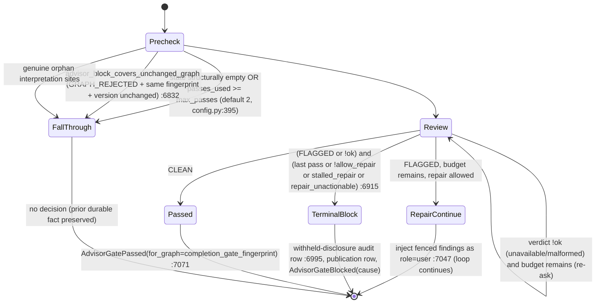

- **Structured output (MEASURED).** A checkpoint's reply is admitted only as strict JSON through
  `AdvisorCheckpointResponse` (`extra="forbid"`, `strict`, `frozen`; `advisor_output.py:27-52`).
  - The provider request carries `response_format=json_schema strict` (`advisor_request.py:39-44`).
    OpenRouter models also get `provider.require_parameters=True`.
  - Admission fails closed on two inconsistent combinations: a CLEAN verdict that carries a note or
    steps, and a FLAGGED verdict with empty findings (`:76-79`). Both come back as
    `schema_valid=True, response=None`, which is reported as `malformed`.
  - The prose CATEGORY/STEPS parser is gone (`_parse_advisor_checkpoint_guidance`,
    `service.py:9867-9891`).
- **Cause mapping (MEASURED, `service.py:8685-8690`).**
  - `flagged_final_pass` and `flagged_no_repair` map to `GRAPH_REJECTED`. Only this cause supports
    the unchanged-graph skip.
  - `flagged_unrepairable` maps to `MESSAGE_REJECTED`.
  - `unavailable` and `malformed` map to `UNAVAILABLE` and `MALFORMED` respectively.
- **The durable fact lives in S16, not here (MEASURED).** It is stored as
  `composer_meta.completion_gates` v2 in `web/execution/completion_gates.py`.
  - The graph fingerprint uses domain `elspeth.completion_gate_graph.v2` over
    metadata, sources, nodes, edges and outputs; version is excluded.
  - On read, `merge_completion_gates` withholds only `completion_ready`, and downgrades a stale
    fact to pending wording.
- **Two backend-authored prescans can FLAG without a provider call** (source=`prescan`; see
  `advisor_checkpoint_telemetry.py:24-33` and `advisor_audit.py:170-171`): the
  prompt-template-injection scan and the user-message scan.

### B. Proposal → commit (planner path)

```mermaid
flowchart LR
  P[pipeline_planner S10 terminal candidate] --> F["candidate_finalizer = _required_controls_candidate_finalizer (service.py:465)"]
  F --> C[pipeline_custody.prepare: inline_blob -> blob_id UUID5]
  C --> E["PipelineProposal.create (v3 draft_hash over pipeline+base+anchor+surface+repair_count+skill_hash+intents+supersedes)"]
  E --> R[(proposal row in sessions DB, tool_arguments_hash = composer_authority_hash)]
  R --> A["settle route (S15) -> prepare_pipeline_proposal_commit (pipeline_commit.py:366)"]
  A -->|base kind/state_id/content-hash check :396-406| X[BASE_CONFLICT]
  A --> V[build_set_pipeline_candidate: must be acceptable, no inline blob :495]
  V --> D["dispatch_with_audit(set_pipeline exact args) :558"]
  D --> H{candidate_hash == executor_hash?}
  H -->|no| M[PipelineCommitMismatchError]
  H -->|yes| OK[PreparedPipelineCommit + PipelineDispatchAuditBinding]
```

- MEASURED invariants in `prepare_pipeline_proposal_commit`:
  - The generic and guided settlement surfaces are mutually exclusive (`:388-393`).
  - The thawed arguments must hash to `row.tool_arguments_hash` (`:413`).
  - An owned-state authority must reproduce the exact proposed content hash (`:497-499`).
  - Exactly one audit invocation is captured, and it binds `tool_call_id` and the authority hash (`:572-576`).
  - The executor content hash is bound into the invocation (`:578`).
- The **generic tool-proposal** path (`composition_proposals`, staged by `tool_batch`) is summarised
  for the UI by `proposals.py:37` and settled in S15. On settlement the accept route re-runs
  `wire_required_controls_state` and revalidates (`sessions/routes/composer/proposals.py:481-507`).

### C. Required-control auto-wire (server-authored structure)

MEASURED, `required_controls.py`:
- `wire_required_controls` `:753` returns the **input object itself** on every no-op path. The
  finalizer contract depends on that identity, and it is pinned by `test_shared_planner_surfaces`.
- Otherwise it parses the candidate into a coverage-only `CompositionState` (`:294`) and runs a
  bounded fixpoint. The budget is `len(llm_sources) + 2*llm_nodes` (`:841`).
- Each splice builds a `transform` node with a deterministic id `{capability}_auto_{n}` (`:427`)
  and fresh streams (`_in`/`_out`). It rewires the neighbour's `input`/`on_success` and inserts the
  node (`:559`, `:648`, `:749`).
- Node options come from the planner aids' private exemplar table (`:437-466`). They include a
  `pipeline_decision` interpretation requirement with the server-staged user term
  `required_control_auto_wired`.
- Guards:
  - creditability is checked before insertion (`:468`);
  - a placeholder-endpoint selection is refused (`:824-833`);
  - a source with a non-discard `on_validation_failure` is refused per component (`:677-687`);
  - an unknown source plugin aborts the pass (`:796-803`).

### D. Composer audit write path

The compose loop fills `BufferingRecorder`. P4 (`turn_audit.persist_turn_audit`) then runs:
1. **Redaction.** Every tool call goes through `MANIFEST` (`set_pipeline` first goes through
   `inline_custody_manifest_redaction_input`, and afterwards through
   `inline_custody_audit_projection`). Unknown tools get a value-free `unknown_tool` sentinel.
2. **Persistence.** `sessions.persist_compose_turn_async` runs once per round, with an exact
   `SessionOperationContext` fence (`turn_audit.py:268-287`).

`audit_storage.redacted_tool_invocation_content_and_envelope` `:189` does the same projection for
the non-loop carriers. It **recomputes `arguments_hash`/`result_hash` over the redacted canonical
payloads**. It carries forward only the `set_pipeline` executor content hash
(`pipeline_content_hash_schema=composer.pipeline-dispatch-result.v1`, `:229-248`).

**Concurrency model (MEASURED).**
- Everything is async under a per-session operation lease. Blocking work goes through
  `run_sync_in_worker`.
- `BufferingRecorder` guards its five lists with `threading.Lock` (`audit.py:236`).
- Provider quota custody is task-local through `ContextVar`s (`provider_quota.py:35-37`). Each
  audited provider attempt is admitted with `begin_provider_attempt` before dispatch and settled
  under `asyncio.shield` (`:52-76`).

### E. Tutorial run

`run_tutorial_pipeline` performs these steps in order:
1. Check ownership.
2. Recheck the launch blockers against the principal's plugin snapshot. These cover the plugin set
   {csv|json source, json sink, web_scrape + llm + field_mapper, plus the deployment's selected
   controls}, the tutorial profile, plugin-policy stages and audit-readiness.
3. Acquire an EXECUTE lease.
4. Call `ExecutionService.execute` (the ordinary path).
5. Poll `get_run` every 0.25 s, up to the transport idle ceiling minus headroom.
6. Project the rows by reading Landscape `rows/artifacts/calls/validation_errors` read-only and
   re-hashing artefact bytes against `content_hash`/`size_bytes` (`tutorial_service.py:594-629`).

---

## Data & persistence

S12 owns **no tables**. It writes through the sessions service, the blobs service and the proposal
rows, into the Sessions DB. It reads the Landscape only for the tutorial projection. The session
schema epoch at the pin is `SESSION_SCHEMA_EPOCH = 66` (`sessions/models.py:362`). Its comment
history says 65 is "durable advisor gate notes become required" and 66 is "control-message v2 binds
origin and provider role" (`:357-361`).

**Envelopes S12 defines, all stored in `chat_messages.tool_calls` / `content` (MEASURED):**

| `_kind` / key | Schema id | Writer (file:line) | Content | Closure enforced by |
|---|---|---|---|---|
| `audit` (+`invocation`) | `ComposerToolInvocation.to_dict` | `audit.py:320`, `audit_storage.py:268` | Redacted args and result, hashes recomputed over the redacted payload | code: `_validated_canonical_mapping_pair` `audit_storage.py:63` |
| `llm_call_audit` | public field allowlist | `audit.py:381` | Metadata, hashes, usage and cost; no reasoning text | code allowlist `audit.py:342-378` |
| `planner_attempt_audit` | — | `audit.py:393` | Value-free attempt disposition | code |
| `chat_turn_audit` | — | `audit.py:537` | Guided chat-turn sidecar (hash-only) | code |
| `advisor_checkpoint_pass_audit` | — | `advisor_audit.py:318` | Closed vocabularies, counts, `findings_hash`; never findings text | `AdvisorCheckpointPassRecord.__post_init__` `:150-212` |
| `advisor_terminal_publication_audit` | — | `advisor_audit.py:323` | Branch, reason, preflight shape | `__post_init__` `:295-307` |
| `composer_withheld_reply` | `composer.withheld-reply.v1` | `withheld_replies.py:57`; persisted at `service.py:3472-3479` | Unpublished model prose goes in `content`; the envelope holds the sha256 | code; replay excluded by kind |
| `composer_control_message` | `composer.control-message.v2` | `control_messages.py:49` | Provider-visible anti-anchor or advisor-withheld text; the hash binds origin and role | `replay_composer_control_message` `:84-119` fails closed |
| `composer_meta.implicit_decisions` | `schema_version: 2` | `implicit_decisions.py:81-113` (merged by S15 routes) | Per-field provenance and alternatives | code |
| proposal payload | `composer.pipeline-proposal-envelope.v3` | `pipeline_proposal.py:711` | Exact pipeline, base, hashes | `from_dict` `:726` (strict field set and hash reverify) |

**DB constraints versus code (MEASURED by what I read, INFERRED as complete):** every envelope
closure above is enforced in Python (`__post_init__`, parsers, the replay decoder). None is a DB
CHECK. The one CHECK-guarded provenance column I have evidence for is `composer_skill_hash`; the
web review's refuted be-22#2 notes the DB CHECK on it. There is **no Landscape write** from the
composer. The composer's audit trail is Sessions-DB data by operator ruling ("session data, not
Landscape data", `turn_audit.py:42-43`).

**Blob custody:** bytes are prepared before the SESSIONS transaction, their metadata is committed
inside the originating message/proposal cohort, and the bytes are published only after commit
(`pipeline_custody.py:279-384`). The quota ceiling is stamped at plan time and re-enforced at
finalisation (`PipelineCustodyPreparation.max_storage_per_session`, `:146-162`, check at `:159-161`).

---

## Dependencies

The package-level matrix (`temp/import-matrix.md`) folds S12 into the `web.composer` bucket. The
slice-level numbers below come from my own AST walk (`scratchpad/deps.py`: absolute `elspeth.*`
imports, classified as module-level, lazy or TYPE_CHECKING, intra-S12 edges omitted). Positive
control: the walk reports `required_controls → planner_authoring_aids` (S10) as 1 module-level
edge, which matches `required_controls.py:53`.

- **Outbound (MEASURED, module/lazy/TC):**
  - contracts 93/3/1; S11 `composer.tools` 17/1/1; S10 `state` 14/2/1; `web.(root)` 13/2/1
    (`validation`, `interpretation_state`, `paths`, `config`, `async_workers`); core 11/2/0;
    `web.sessions` 10/0/2; `web.plugin_policy` 10/0/0.
  - S13 `composer.guided` 5/0/0: `guided.state_machine` from `redaction` and `yaml_generator`,
    `guided.profile` from service-adjacent code.
  - web.coordination 4/0/1; web.auth 5; web.catalog 4/0/1; web.execution 4; plugins 4/4/1;
    web.blobs 2; S10 `protocol` 3/0/1; S10 `service` 1/0/2 (the `boot_probe` private imports).
- **Inbound (MEASURED):**
  - `web.sessions` 48/8/2 is the heaviest.
  - S11 tools 31/1/0; S10 `service` 26/5/1; S10 `tool_batch` 20/2/1; S13 guided 20/1/1;
    S10 `pipeline_planner` 14/0/0; S10 `state` 1/**10**/1.
  - `web.execution` 7/2/0, including `completion_gates.py`, which imports `advisor_decision`.
  - `composer_mcp` 5/0/0; `web.(root)` 5/1/0 (`app.py` routers); `_aws_ecs_acceptance` 3.
  - The most-imported modules are `redaction` (26 importing modules), `pipeline_proposal` (16),
    `audit` (15), `yaml_generator` (15), `discovery_cache` (14) and `_producer_resolver` (18,
    mostly lazy from `state.py`).
- **Cycle carriers touching S12 (MEASURED):**
  - There are **zero module-level import-time SCCs** across all 360 `web/**` modules (2,018 edges,
    parent-package edges included).
  - Instrument control: adding one synthetic module-level edge `state → required_controls` produces
    a **35-module SCC**. That SCC contains `redaction`, `required_controls`, `yaml_generator`,
    `_producer_resolver` and `source_demand`, plus `tools/*`, `state`, `protocol` and
    `blobs.service`.
  - **Therefore the discovery doc's 15-bucket *import-time* SCC exists only through package
    aggregation** (MEASURED by difference). No module-level import cycle exists, so the
    web.* package cycle is a namespace/ownership tangle, not an import-order hazard. This
    qualifies discovery hypothesis 2. Instrument: `scratchpad/scc2.py`; control: `scc3.py`.
  - **With lazy (function-level) edges added** (TYPE_CHECKING still excluded,
    `scratchpad/scc_lazy.py`), two SCCs contain S12 modules (MEASURED):
    - a 12-module SCC: `state` ↔ `_producer_resolver`, `_semantic_validator`,
      `_validation_probe`, `source_demand`, `pipeline_proposal`, `guided.state_machine`,
      `interpretation_state`, `plugin_policy.coverage/validation` and `catalog.policy_view`;
    - a 53-module SCC containing `redaction`, `audit`, `pipeline_commit`, `pipeline_custody`,
      `discovery_*` and `reviewed_source_authority`, plus `tools/*`, `pipeline_planner`,
      `protocol`, `prompts` and `blobs.service`.
    **The laziness is load-bearing.** The concrete carrier is that `state.py` imports
    `_producer_resolver`/`_semantic_validator` inside functions or TYPE_CHECKING blocks at 11
    sites (`state.py:84, 2223, 2312, 2389, 2473, 2523, 2593, 2655, 4351, 8694, 8770`), while
    `_producer_resolver` imports `state` at module level (`_producer_resolver.py:29`).
  - S12 → `web.sessions` symbols:
    - `sessions.protocol` (`AuthoritativePipelineProposal`, `SessionOperationAuthority`) in
      `pipeline_commit.py:59` and `pipeline_custody.py:57`;
    - `sessions._persist_payload` in `turn_audit.py:34`;
    - `sessions.models` tables in `reviewed_source_authority.py:18`;
    - `sessions.telemetry._SessionsTelemetry` in `telemetry_phase8.py:80`;
    - `sessions.locking._run_lock_cleanup` in `pipeline_custody.py:56`;
    - `sessions.converters/ownership/protocol/titles` in `tutorial_service.py:58-66`.
- **Private-name coupling (MEASURED):** S12 makes **45 imports of private names or private
  modules**. 17 of them cross out of `web.composer`:
  - `pipeline_custody.py:35`: three `blobs.service._*` names;
  - `pipeline_custody.py:56`: `sessions.locking._run_lock_cleanup`;
  - `required_controls.py:91`: three `plugin_policy.coverage._*` predicates;
  - `advisor_output.py:13`: `web.validation._PII_WARNING_PATTERNS`;
  - `implicit_decisions.py:29`: `plugin_policy.validation._PROFILE_LOWERING_METADATA_OPTION_KEYS`;
  - `telemetry_phase8.py:80`: `sessions.telemetry._SessionsTelemetry`;
  - `turn_audit.py:34`: `sessions._persist_payload`.

---

## Patterns observed

- **Closed vocabularies checked at construction.** Nearly every durable record validates exact
  types and cross-field rules in `__post_init__` and raises `AuditIntegrityError`:
  `AdvisorCheckpointPassRecord` (about 20 rules), `PipelineProposal`, `ToolRedactionPolicy` (5),
  `ToolRedaction` (exactly one shape) and `PlannerCapabilityManifest`.
- **Audit first, then telemetry, then logs.** `persist_advisor_*` writes the row, then mirrors to
  OTel. Exporter failure is acknowledged on `composer.advisor_telemetry_failed`, and Tier-1 errors
  re-raise (`advisor_checkpoint_telemetry.py:43-55`).
- **Hash-bound authority.** The draft hash (v3), the authority hash (with row-union order
  projected, `authority_hashing.py:23`), the reviewed-anchor hash, the completion-gate fingerprint
  and the control-message v2 hash each carry a versioned domain string.
- **Fail-closed redaction.** Unknown response keys become a fixed sentinel. Unknown tools get
  `unknown_tool`. A declarative policy with `handles_no_sensitive_data=False` must list
  `known_response_keys`. The manifest/registry set-equality is an **import-time `RuntimeError`**
  (`tools/_dispatch.py:1059-1067`), backed by `test_adequacy_guard.py:117` and
  `test_tool_argument_wire_parity.py:85`.
- **Private imports kept as a deliberate single source of truth.**
  - `required_controls.py:48-51` and `:85-89` explain in comments why they import private helpers.
  - This trades encapsulation for no-drift. The trade is stated, not accidental.
- **God-class extraction without decoupling.**
  - `turn_audit.py` and `availability.py` say they were "extracted verbatim".
  - `turn_audit` reaches back through `cast(Any, service)` into
    `_redaction_telemetry`, `_serialize_response_via_walker` and
    `_state_payload_for_compose_turn`, and writes `service._phase3_last_*`
    (`turn_audit.py:147-148, 244-266`).
- **Identity-on-no-op finaliser contract** (`required_controls.py:784-789`) keeps downstream
  byte-exactness trivial.
- **Module-global rebinding of the manifest** (`redaction.py:3630` and again at `:4794`) is the
  spec's "extend by rebinding" rule. It means the binding a reader sees depends on how far through
  the module they have read.
- **Deterministic seams for data the LLM must not invent.** Tutorial sample URLs come from
  settings (`tutorial_sample.py:36-53`), and auto-wired control ids are deterministic.

---

## Invariants & how they are enforced

| Invariant | Enforcement | Evidence |
|---|---|---|
| Every dispatchable tool has a redaction entry | import-time `RuntimeError` + tests | `tools/_dispatch.py:1059-1067`; `tests/unit/web/composer/test_adequacy_guard.py:117` |
| No advisor findings text or model prose in advisor audit rows | code (`findings_hash` only) + docstring contract | `advisor_audit.py:26-27, 242` |
| Advisor row is committed before telemetry fires | code ordering | `advisor_audit.py:353-391` |
| CLEAN may carry no note or steps; FLAGGED needs findings | code (admission) | `advisor_output.py:76-79` |
| A gate decision must match the final graph fingerprint | code (`ValueError`) | `completion_gates.py:235` (S16) |
| A persisted gate envelope is v2 with a closed field set | code, Tier-1 parser + epoch fence | `completion_gates.py:253-323`; `sessions/models.py:362` |
| An auto-wired node always carries its disclosure | code (`AuditIntegrityError`) | `required_controls.py:1000-1030` |
| Auto-wire never raises on candidate content | trust-boundary decorators + `except` folds | `required_controls.py:282-363, 491-501` |
| Proposal settle binds exact args and one audit invocation | code | `pipeline_commit.py:413, 572-576` |
| Inline bytes never enter a dispatch audit | code (projection before the audit opens) | `pipeline_custody.py:75-100`; `turn_audit.py:197-205` |
| A YAML section is never dropped silently | code + `@trust_boundary` `test_ref` | `yaml_importer.py:84-189` |
| Generator lowering covers every node kind | runtime drift guard | `yaml_generator.py:445-449` |
| The prompt's skill hash equals the audited hash | code (fail when on-disk differs from cache) | `skills/__init__.py` `assert_skill_hash_unchanged_on_disk` |
| The planner capability core occurs exactly once and the schema matches the documented inventory | code (`AuditIntegrityError`) | `capability_skill.py:219-255` |
| Control-message replay is exact | code, fail-closed decoder | `control_messages.py:84-119` |
| Tutorial output comes only from audited artefacts | code (sha256/size re-check) | `tutorial_service.py:594-629` |
| **No server-authored pipeline structure (Composer invariant 1)** | **prose only (AGENTS.md)**; *violated by design* for required controls, see C1 | `required_controls.py:559/648/749` |
| **No tutorial-only authoring path (ADR-031)** | tests (`tests/integration/web/composer/parity/`, a `test_prompts.py:1476` docstring) + prose | measured below |

**ADR-031 measurement (MEASURED).**
- `grep -rniE tutorial` over non-`tutorial_*` composer modules finds 34 lines. The discriminating
  branches are:
  - `pipeline_planner.py:336, 3199, 3551, 4650` and `pipeline_commit.py:390`: every one is
    `surface in {GUIDED_STAGED, TUTORIAL_PROFILE}`. The tutorial never diverges from guided-staged.
  - `sessions/service.py:2601, 12402`: the same set pattern.
  - `capability_skill.py:190` / `service.py:4650`: the audit label `profile="tutorial"`, carried
    only in the hash manifest.
  - `service.py:4649`: surface selection from `guided.profile == TUTORIAL_PROFILE`.
  - `guided/profile.py` `TUTORIAL_PROFILE` is two booleans. They are consumed only by frontend
    projections (`sessions/guided_replay.py:333-334`, `sessions/routes/_helpers.py:3697-3698`).
- The single tutorial-only backend guard is `sessions/routes/composer/guided.py:997`. It serves
  sample URLs (data) and is not authoring.
- `_tutorial_launch_blocker` (`tutorial_service.py:196`) is a tutorial-only branch, but it is a
  run-admission rejection, which the AGENTS.md carve-out explicitly permits.
- Positive control: the grep did match `guided.py:997` and `capability_skill.py:175`.
- **Conclusion: no tutorial-only authoring logic exists at the pin.**

---

## Baseline delta — ARCHITECTURE.md says / tree says

| Claim in ARCHITECTURE.md (or ADR / AGENTS.md) | What the pinned tree shows | Evidence |
|---|---|---|
| "Web app + Composer … guided/freeform authoring" (`ARCHITECTURE.md:171`) | Guided is retired as a concept (discovery §7). The tutorial's authoring surface is still `GUIDED_STAGED`/`TUTORIAL_PROFILE` (`service.py:4649`). | `pipeline_proposal.py:67-74` |
| Session DB "stores Composer sessions, proposals, and durable guided operations" (`:134`) | It also holds the **entire composer audit trail**: eight `_kind` envelopes in `chat_messages.tool_calls`, plus `composer_meta.completion_gates` / `implicit_decisions` and the proposal envelope. This is the composer's legal record, and the baseline does not name it. | Data table above; `turn_audit.py:42-43` |
| AGENTS.md invariant 1 carve-out: "required-control admission **gates**" | The tree **authors nodes** (auto-wire splices control transforms with authored options). Node insertion is **documented but not ratified as an invariant exception**. It appears in the `required_controls.py` docstring (ticket `elspeth-f99655f540`), a passing mention in ADR-037, spec `docs/specs/2026-09-04-agentic-tool-interface-design.md:442` (which also names a second config-owned node authority: guided-correction predecessors, `service.py:4127`) and the user training guide (`docs/guides/composer-training-one-hour.md:49, 325`). No ADR or AGENTS.md carve-out covers it. | `required_controls.py:1-33, 753`; `grep -rn f99655f540 docs ARCHITECTURE.md AGENTS.md` → 0 hits; ADR-037:26 mentions `required_control_auto_wired` |
| ADR list (49 ADRs) | **No ADR covers the advisor END gate, structured checkpoint output or the redaction manifest.** They are specified only in plans, reviews, config descriptions and `docs/guides/redaction-policy-changes.md`. | `grep -lE "advisor (gate\|checkpoint)\|completion advisory\|END gate" docs/architecture/adr/*.md` → 0; control: `grep -l redaction` → 5 files |
| ADR-031 "same guided machinery every user exercises" | With guided retired for ordinary users, the tutorial becomes the **only** routine consumer of `GUIDED_STAGED`-class planning. The canary's reference population is gone. | ADR-031 context §1; discovery §7 |
| ADR-031 backend parity | Holds: no tutorial-only authoring branch (measured above). | ADR-031 measurement |
| Large-files item names `composer/service.py` ~10,298 | `service.py` is 11,377 lines and still holds the advisor gate control flow (`:6763-7074`, `:8579-11330`). Advisor contracts, audit rows and request/output admission were split into 4 `advisor_*` modules (S12), and `turn_audit.py`/`availability.py` say they were "extracted verbatim" from it. The advisor wording, prescan and checkpoint runner still live in S10 (MEASURED by grep for their defs). | `wc -l` |
| No mention of YAML import | A hardened import surface exists (`yaml_importer.py`, 1,030 lines). Round trip is **lossy by design**: edges → `()`, `metadata` declined, `landscape` dropped, three coalesce fields declined. | `yaml_importer.py:1-6, 35-42, 84-122, 1026` |
| No mention of the tutorial run endpoint | 4 `/api/tutorial/*` routes. The run goes through the normal `ExecutionService`, with no cached fast path. | `app.py:1938-1939`; `tutorial_service.py:311-331` |
| No mention of the composer boot probe | Boot validates advisor structured output with the production request builder. | `app.py:742-743`; `boot_probe.py:184, 248` |

---

## Concerns

| ID | Sev | Concern | Evidence (file:line at pin) | Status |
|---|---|---|---|---|
| C1 | **Medium** | **Invariant-1 ratification gap.** `required_controls` inserts transform nodes, with ids, streams, rewiring and options, into planner candidates and incremental states at every seam: `service.py:484`, `tool_batch.py:529/597/1596` and `proposals.py:483`. The AGENTS.md carve-out covers admission *gates*, not node authoring. Operator ticket `elspeth-f99655f540` ("auto-wire + disclose") is recorded in the module docstring, a spec (`docs/specs/2026-09-04-agentic-tool-interface-design.md:442`) and the training guide, but not in an ADR or the AGENTS.md carve-out. It is plan-recorded, not ratified. Mitigations present: mandatory disclosure card, disclosure-or-raise, identity no-op, placeholder refusal. | `required_controls.py:1-33, 427, 437-466, 559, 648, 749, 753-911` | NEW (MEASURED) |
| C2 | Medium | The advisor END gate, a completion-blocking governance control, has **no ADR**. Its design lives in plans, reviews, `config.py:395-411` field prose and code comments. "Operator decision pending" on advisor-budget unification is embedded in a config description. | `config.py:395-411`; ADR grep = 0 | NEW |
| C3 | Medium | Recovery persist erases the durable advisor fact (it reads the moving head). Still present at the pin. | `sessions/routes/_helpers.py:985-998` | PREVIOUSLY-REPORTED (web-review R14) — S15 owns it |
| C4 | Medium | A review-only save moves the head and orphans same-turn proposals. | Gate at `service.py:7071-7073`; save predicate in S15 | PREVIOUSLY-REPORTED (R03); not re-verified at pin |
| C5 | Low | Tutorial authoring rides the retiring guided lane (`TUTORIAL_PROFILE` → `GUIDED_STAGED` semantics), so guided infrastructure cannot be removed while the tutorial exists. ADR-031's canary now guards a surface no ordinary user runs. | `service.py:4556, 4649`; `sessions/routes/composer/guided.py:997` | NEW (INFERRED from the rulings in memory and discovery §7) |
| C6 | Low | `_MODEL_PROVIDER_ALTERNATIVES = ["openrouter","azure_openai"]` is disclosed to operators as "alternatives". The runtime vocabulary is `Literal["azure","openrouter","bedrock","gateway"]`, so `azure_openai` is not a valid value and bedrock/gateway are missing. | `implicit_decisions.py:70, 511-512` vs `plugins/transforms/llm/base.py:206` | NEW (MEASURED) |
| C7 | Low | Stale docstrings. (1) `yaml_generator.py:4` says `sort_keys=True`; the code uses `sort_keys=False` (`:745, :879`). (2) `service.py:10849` still describes "the advisor's `STEPS:` line" after the JSON cut-over. | as cited | NEW |
| C8 | Low | Advisor audit rows (`_persist_advisor_audit_row`), the withheld-disclosure row and withheld replies are each written by separate `add_message` calls. They sit outside the turn's atomic `persist_compose_turn_async` cohort. This is the same shape as R22, extended to advisor rows. | `advisor_audit.py:343-350`; `service.py:6992-6997, 3472-3479` | PREVIOUSLY-REPORTED shape (R22); extension NEW |
| C9 | Low | Stored tool-audit hashes are recomputed over the **redacted** projection. The Sessions-DB record therefore cannot attest to the raw arguments the LLM sent, except for `set_pipeline`'s executor content hash. `RejectionRecord.planner_payload` meanwhile persists the unredacted rejected payload in a separate sidecar. | `audit_storage.py:249-257`; `turn_audit.py:37-80` | NEW (design observation; operator ruling cited in code) |
| C10 | Low | Coupling debt: 17 private-name imports cross packages. `turn_audit` writes `service._phase3_last_*` through `cast(Any, service)`. `boot_probe` imports 3 private `service` symbols. | Dependencies § | NEW (MEASURED) |
| C11 | Low | `_advisor_blocked_result(assistant_message: … \| None)` has an unreachable `None` arm. | `service.py:8585` | PREVIOUSLY-REPORTED (R24), still present |
| C12 | Low | Tutorial orphan cleanup matches a browser-authored title string (`"First-run tutorial (in progress)"`) that is mirrored by hand in `copy.ts`. | `tutorial_service.py:70-78, 803` | PREVIOUSLY-REPORTED (web-split `06-deconfliction-list.md:236`) |
| C13 | Low | The model-facing disclosure says "did not clear" on outage blocks. | control row at `service.py:6992-6997` | PREVIOUSLY-REPORTED (R21); not re-verified |

**Status of prior findings at the pin (MEASURED):**
- **R02 is closed by the epoch-66 bump.** `sessions/models.py:362`. The 66 comment names
  control-message v2, but any bump fences epoch-65 stores.
- **R23 is superseded.** The JSON admission is at `service.py:9867-9891`.
- **R15 and R16 appear resolved.** The wording helper now says graph rejections re-review "after
  your next pipeline change", and the notice is always a `_PUBLISHED_` form
  (`service.py:11166-11250`). Only the text was read, not the tests.

---

## Complexity & tech-debt hotspots

Largest definitions, measured with an AST span over the S12 files:

| Lines | Definition |
|---:|---|
| 273 | `_producer_resolver.ProducerResolver` |
| 247 | `turn_audit.persist_turn_audit` |
| 230 | `pipeline_commit.prepare_pipeline_proposal_commit` |
| 216 | `audit.dispatch_with_audit` |
| 206 | `source_inspection._inspect_csv` |
| 175 | `redaction._correlate_guided_snapshot_storage_paths` |
| 168 | `redaction.redact_tool_call_response` |
| 160 | `redaction._walk_type` |
| 159 | `required_controls.wire_required_controls` |
| 154 | `pipeline_proposal.PipelineProposal` |
| 149 | `yaml_importer._nodes_from_runtime_list` |
| 145 | `advisor_audit.AdvisorCheckpointPassRecord` |

- **`redaction.py`, 4,802 lines, fuses four jobs:**
  1. the manifest and its adequacy scaffolding;
  2. 36 Pydantic `BaseModel` argument, response and "shadow" classes (`:1438-3398`, MEASURED by an awk count of class lines) that duplicate the tool wire schemas;
  3. the guided-snapshot path degrader and correlator (`:4368-4755`, guided-lane-specific and scheduled for retirement);
  4. state storage-path redaction.
- **Guided residue in S12.** The following remain until the tutorial moves off the guided lane:
  `guided_blob_refs.py` (269), `reviewed_source_authority.py` (264),
  `reviewed_output_projection.py` (53, "extracted from the retired recipe scaffolding"),
  `redaction` guided paths, and the `yaml_generator` guided blob reattach (`:487-650`).
- **TODO/FIXME:** 0 in S12 (MEASURED). Control: the same grep finds 19 in `tests/` and 0 across
  all of `src/`, consistent with a tree-wide ban. Deferred decisions live in prose instead
  (`config.py:410`).
- **No dead modules.** Every one of the 58 modules has at least one importer.

---

## Test map

The unit suite `tests/unit/web/composer/` has 251 entries (`ls | wc -l`). The per-module counts
are files that import each module (MEASURED by `grep -rlE "web\.composer\.<mod>"`):

| Module | Test files | Notes |
|---|---:|---|
| `redaction` | 77 | Plus the policy snapshot JSON; `test_adequacy_guard*`, `test_walk_model_schema` |
| `audit` | 67 | |
| `pipeline_proposal` | 45 | |
| `redaction_telemetry` | 40 | |
| `yaml_generator` | 24 | `test_yaml_importer.py:990` and `:1061` are round-trip tests, including re-import of `generate_public_yaml` |
| `advisor_*` | 17 | `test_advisor_checkpoint.py` holds the AST pin of a single `_run_advisor_checkpoint` call |
| `source_inspection` | 15 | |
| `source_demand` | 10 | |
| `pipeline_commit` | 8 | |
| `audit_storage` | 8 | No dedicated file |
| `yaml_importer` | 8 | |
| `capability_skill` | 8 | |
| `authority_hashing` | 7 | |
| `_producer_resolver` | 7 | |
| `tutorial_service` | 5 | Plus `tests/integration/web/test_tutorial_routes.py` |
| `required_controls` | 4 | `test_required_control_autowire.py` |
| `_semantic_validator` | 4 | |
| `pipeline_custody` | 3 | |
| `state_claim_grounding` | 3 | |
| `turn_audit` | 2 | |

- **Parity:** `tests/integration/web/composer/parity/` (7 files) drives freeform and guided through
  one real production stack. 63 test references to `TUTORIAL_PROFILE`.
- **Gaps (MEASURED):**
  - no test file names or imports `guided_blob_refs`; it is exercised only indirectly, through
    `test_yaml_generator` and `test_respond`;
  - `_validation_probe`, `_schema_response_grammar` and `_required_paths_validator` each have 1
    importing test file;
  - `withheld_replies` has 2;
  - no test pins "no auto-wired node without an ADR/AGENTS carve-out", which is a governance gap
    and not a code gap.
- **Out of scope for this map:** frontend e2e specs `tests/e2e/tutorial*.spec.ts` (7 files) and
  testcontainer (PostgreSQL) coverage of advisor rows and completion gates.

---

## Confidence

**Medium-High overall.**

- **High** for the advisor contracts, the audit rows and the gate state machine (`advisor_*` read in
  full, `service.py:6763-7074`, `completion_gates.py` in full, wording `:11200-11250`).
  `required_controls.py` was read in full. So were `tutorial_service.py`, `turn_audit.py`,
  `audit_storage.py`, `pipeline_commit` (commit function), `capability_skill.py`, `proposals.py`,
  `control_messages.py`, `withheld_replies.py`, `authority_hashing.py`,
  `tool_result_envelope.py` and `provider_quota.py`.
- **Medium** for `redaction.py`: header, policy classes, `redact_tool_call_arguments`, manifest
  head/tail and `redact_source_storage_path` were read; the `_walk_type` body,
  `redact_tool_call_response` and the guided degraders were not. Also Medium for
  `pipeline_proposal.py` (class and envelope read; owned-state restore helpers sampled) and for the
  generator/importer (entry points and key helpers).
- **Low (docstring or definitions only)** for `source_inspection`, `_semantic_validator`,
  `_producer_resolver`, `state_claim_grounding` (header and `_FIELD_READERS` scope),
  `implicit_decisions` (sampled), the skills prose and the 13 peripheral provider/discovery modules.
- **Dependency and SCC numbers** come from my own AST instruments with a positive control, and the
  package-level claims are consistent with `temp/import-matrix.md`.

**Risk Assessment:**
- **Implementation risk: Medium. Reversibility: Moderate.**
- The material risks are:
  - C1 (governance, Medium): an unratified server-authoring path sits beside a "non-negotiable"
    invariant. A future reviewer may "fix" it and break required-control coverage. Mitigate by
    recording the exception in an ADR and in the AGENTS.md carve-out text.
  - C3 (audit correctness, Medium): a durable block can be lost. Fix is in S15.
  - C9 (audit forensics, Low): the stored hashes attest to the redacted projection only.
  - C5 (maintenance, Low): guided retirement is blocked by the tutorial.

**Information gaps:**
- Whether the operator ruling behind `elspeth-f99655f540` is meant to count as an invariant-1
  exception. It is not in the docs; the tracker was not queried (legacy issue tracker MCP was down).
- The runtime behaviour and test status of R03, R21 and R22 at the pin (not re-run).
- The redaction walker's handling of nested containers (not read).
- The frontend's use of the tutorial sample URLs (S21/S22).

**Caveats & required follow-ups:**
1. X2 should adjudicate C1 against AGENTS.md and ADR-037.
2. S15 should confirm C3 and C4 at the pin.
3. Nothing here was executed. No pytest ran. The one Python use was AST parsing through
   `<repo>/.venv/bin/python`.
4. Line numbers are at `85ebf2739` and will drift on the live branch.

## Validation corrections

- [validator] Peripheral-modules row total 2,217 -> 1,666 for the 13 files it lists (`wc -l provider_quota.py boot_probe.py provider_telemetry.py error_codes.py availability.py bounded_json.py discovery_cache.py reasoning.py _response_json.py discovery_response.py response_contracts.py plugin_policy_disclosure.py provider_config.py` at the pin).
- [validator] "S10 exclusion set" did not match S10's Location: 12 files / 1,703 lines (`reasoning`, `provider_*` ×4, `availability`, `boot_probe`, `bounded_json`, `_response_json`, `response_contracts`, `discovery_*` ×2) are counted in both S10 (39,223) and S12 (22,786) -> S12-exclusive is 46 files / 21,083 lines. The 58-file / 22,786-line measurement itself reproduces. Overlap note added under Measured size.
- [validator] (no change) Verified at the pin: C13 / R21 wording is still present (service.py:11065 "did not clear" in `_ADVISOR_SIGNOFF_WITHHELD_DISCLOSURE`); R02 closure holds because both `SESSION_SCHEMA_EPOCH` (models.py:362) and `_COORDINATION_HARD_CUT_EPOCH` (schema.py:39) are 66; the zero module-level SCC claim and the 35-module control SCC both reproduce with an independent instrument.


---

# S13 — Guided Lane (retirement blast-radius inventory)

**Location:**
- Backend, composer side: `src/elspeth/web/composer/guided/` (20 `.py` + `skills/*.md`), `src/elspeth/web/composer/guided_blob_refs.py`
- Backend, sessions side: `src/elspeth/web/sessions/{_guided_step_chat,guided_audit,guided_operations,guided_payloads,guided_replay}.py`,
  `src/elspeth/web/sessions/routes/guided_operations.py`, `src/elspeth/web/sessions/routes/composer/guided*.py` (5 files)
- Frontend: `src/elspeth/web/frontend/src/components/chat/guided/` (59 files) plus the guided-named files in `api/`, `types/`, `stores/`, `components/{chat,inspector,tutorial}/`

**Pin:** `release/0.8.1` @ `85ebf2739`, detached worktree `.claude/worktrees/arch-analysis-pin`. All paths below are relative to `src/elspeth/` unless they start with `tests/`, `docs/` or `frontend/`.

**Measured size** (commands run at the pin):

| Area | Files | Lines | Instrument |
|---|---:|---:|---|
| `web/composer/guided/*.py` | 20 | 21,460 | `find web/composer/guided -name '*.py' \| xargs wc -l` |
| `web/composer/guided/skills/*.md` | 5 | 265 | `wc -l skills/*` |
| `web/composer/guided_blob_refs.py` | 1 | 269 | `wc -l` |
| `web/sessions/guided_*.py` + `_guided_step_chat.py` | 5 | 2,195 | `wc -l` |
| `web/sessions/routes/composer/guided*.py` | 5 | 10,582 | `wc -l` |
| `web/sessions/routes/guided_operations.py` | 1 | 724 | `wc -l` |
| **Guided-named Python, total** | **37** | **35,495** | sum of the rows above |
| Guided code *embedded in shared modules* (AST, defs whose name contains `guided`, lower bound) | 11 shared files | ≥ 9,638 | see "Complexity" below; `sessions/service.py` alone 6,234 |
| Frontend `components/chat/guided/` | 59 (32 prod, 27 test) | 9,304 prod + 10,820 test | `ls \| xargs cat \| wc -l` |
| Frontend guided-named prod files outside that dir | 7 | 4,193 | `guidedDecoder.ts` 2,368, `types/guided.ts` 850, `TutorialGuidedShell.tsx` 447, `guidedOperationRetry.ts` 383, others < 100 |
| Frontend guided-embedded shared files | 2 hotspots | `sessionStore.ts` 4,809 (744 `guided` hits), `ChatPanel.tsx` 3,897 (599 hits) | `grep -ci guided` (indicator only, not an inventory) |

**Responsibility:** A four-step, server-driven wizard (source, sink, transforms, wire) that authors a pipeline through typed turns, per-step LLM chat, a staged planner and hash-bound review checkpoints. Guided *mode* is retired as a user concept (maintainer, 2026-09-22), but the first-run tutorial still runs on this machinery, and a retry-safe operation ledger that grew inside it now also serves freeform state revert and session fork.

---

## Key components

Every file over 300 lines is listed. Files are read in full unless marked *sampled*.

| File | Lines | Role |
|---|---:|---|
| `web/composer/guided/chat_solver.py` | 5,017 | *Sampled.* Per-step chat LLM solver. Step 1 has a source/schema tool palette, Step 2 a sink resolver, and the other steps give advisory prose. Largest defs: `maybe_resolve_step_1_source_chat` (642 lines, :3175), `maybe_resolve_step_2_sink_chat` (597, :4249), `build_step_chat_context_block` (294, :2460) |
| `web/composer/guided/planning.py` | 4,598 | *Sampled.* Pure authority, redaction and projection helpers. It snapshots reviewed facts into `PipelineProposal`, builds the reduced planner context, and projects the private canonical pipeline into the `PROPOSE_PIPELINE` wire contract. `bind_guided_reviewed_components` 461 lines (:2643), `materialize_guided_authorized_candidate` 341 (:2021) |
| `web/composer/guided/protocol.py` | 2,900 | *Sampled.* Closed turn taxonomy (`TurnType`, 7 kinds), `GuidedStep`, `ControlSignal` (exit_to_freeform/reject/back/passthrough), the payload TypedDicts, and the legal-turn matrix (`legal_turn_types_for` :631, `validate_current_turn` :663). Hosts the shared constant `BLOB_REF_PATH_PREFIX = "blob:"` (:27). `_validate_propose_pipeline_payload` is 528 lines (:2307) |
| `web/composer/guided/deferred_intents.py` | 2,569 | *Sampled.* Wrong-stage intent: the LLM suggests a `DeferredIntentAction`, and the server validates it against the policy catalog and stage before it becomes durable audit-tier state. Also a coverage evaluator. `_constraint_conjunction_contradiction` is 295 lines |
| `web/composer/guided/state_machine.py` | 1,444 | **Read in full.** `GuidedSession`, the one persisted checkpoint (`GUIDED_SESSION_SCHEMA_VERSION = 11`, :51), with 19 exact keys (:65-87). Also `TerminalState/Kind/Reason`, `TurnRecord`, `SourceIntent`, `SinkIntent`, `DeferredStageIntent`, `GuidedProposalRef`, `ComponentTarget`, `GuidedCorrectionMessageRef`, `guided_reviewed_anchor_hash` and `reviewed_component_ledger` |
| `web/composer/guided/stage_transitions.py` | 1,367 | *Sampled.* Pure schema-8 RESPOND transitions for the source and sink stages. Hosts `canonical_sink_local_paths`, which the freeform tool path also uses |
| `web/composer/guided/emitters.py` | 917 | *Sampled.* Deterministic turn builders (no I/O, clock or uuid): `build_initial_step_1_turn`, `build_step_{1,2}_*`, `build_step_4_wire_turn` |
| `web/composer/guided/stage_subjects.py` | 739 | *Sampled.* Closed subjects and constraints (7 constraint classes) for deferred-stage intent |
| `web/composer/guided/{resolved,intent_management,audit,_discovery,prompts,errors,profile,_display,shape_repair_telemetry,connection_consumers}.py` | 2,406 | `resolved` = reviewed source/output facts. `audit` = guided events recorded as `ComposerToolInvocation`s (Errata C4, no new primitive). `profile` (read in full) = the `LIVE`/`TUTORIAL` `WorkflowProfile`. `errors` = `InvariantError` (imported by 6 non-guided modules). `prompts` loads `skills/*.md` |
| `web/sessions/routes/composer/guided.py` | 5,889 | *Sampled.* 8 HTTP handlers. **`post_guided_respond` is one 2,920-line async function (:2936-5855).** Also `post_guided_start` 463, `post_guided_convert` 331, `post_guided_reenter` 309, `get_guided` 262 |
| `web/sessions/routes/composer/guided_chat_atomic.py` | 2,573 | *Sampled.* Atomic schema-8 guided chat mutation. `post_guided_chat_schema8` is 1,309 lines (:1262) |
| `web/sessions/routes/composer/guided_chat_intent_management.py` | 1,017 | Not read. Deferred-intent apply and rewind from chat (docstring only) |
| `web/sessions/routes/composer/guided_plan.py` | 1,011 | Header and handler read. `POST /guided/plan`, the "guided-full" surface. `post_guided_plan` is 675 lines |
| `web/sessions/_guided_step_chat.py` | 1,128 | *Sampled.* Transient-LLM-failure wrapper: chat failure gives a synthetic "unavailable" message and never ends the session |
| `web/sessions/routes/guided_operations.py` | 724 | **Read in full.** Retry-safe operation lifecycle: lease, replay, takeover, settle, and the closed HTTP failure map. **Shared with freeform revert and fork** |
| `web/sessions/guided_replay.py` | 570 | *Sampled.* Pure projection of settlements onto strict responses. **Also hosts `project_composition_proposal`, the ordinary freeform proposal projection** |
| `web/sessions/guided_audit.py` | 367 | *Sampled.* Prepares bounded guided audit chat rows outside SQL |
| `web/sessions/guided_{operations,payloads}.py`, `routes/composer/guided_proposal_rebase.py`, `web/composer/guided_blob_refs.py` | 491 | Read in full, except rebase (docstring only). Request-hash codec, the CAS payload store round trip, the anchor-move assertion, and the reviewed blob-binding validators |
| `frontend/src/api/guidedDecoder.ts` | 2,368 | Not read. Strict exact-key decoder for every guided wire shape |
| `frontend/src/components/chat/guided/*` | 9,304 prod | Not read. Prod files over 300 lines: `guided.css` 2,644, `WireStageTurn.tsx` 829, `SchemaFormTurn.tsx` 816, `ProposePipelineTurn.tsx` 563, `MultiSelectWithCustomTurn.tsx` 469, `ReadOnlyPipelineGraph.tsx` 383, `guidedGraphProjection.ts` 333, `SingleSelectTurn.tsx` 317 |
| `frontend/src/types/guided.ts`, `stores/guidedOperationRetry.ts`, `components/tutorial/TutorialGuidedShell.tsx` | 850 / 383 / 447 | Wire types; the retry-custody store (**also used by freeform fork**); the tutorial's guided host (partly read) |

---

## Public interface / entry points

### HTTP routes (9)

MEASURED with `grep '@router\.'`, and cross-checked with retired code index `entity_http_route_list`, which returned the same 8 handlers in `guided.py`. The retired code index run status is `failed` and its line numbers are stale, so treat it as a pointer only. All routes mount under `/api/sessions`: `sessions/routes/composer/__init__.py:19` includes `guided.router`, and `guided.py:5889` includes `guided_plan_router`.

| Route | Handler | Tutorial path? | Other production callers |
|---|---|---|---|
| `GET /{id}/guided` | `get_guided` guided.py:695 | **Yes** (`TutorialGuidedShell.tsx`, `HelloWorldTutorial.tsx:164` via `store.startGuided`) | **Every session open and every fork**: `selectSession` (sessionStore.ts:1936) runs `fetchGuidedStateForSelect` (:1229, `getGuided(id, undefined, probe=true)`) at :1981, and fork does the same at :3071. A 400 means "freeform-only". So this route is on the **freeform** path (EMBED) |
| `GET /{id}/guided/tutorial-sample` | guided.py:960 | **Yes**. Returns 400 unless `guided.profile == TUTORIAL_PROFILE` (:997) | — |
| `POST /{id}/guided/start` | guided.py:1445 | **Yes** (`seedGuided(sessionId,"tutorial",TUTORIAL_TRANSFORMS_PROMPT)`, TutorialGuidedShell.tsx:192 → sessionStore.ts:3279) | `enterGuided` (guided default) sessionStore.ts:4282 |
| `POST /{id}/guided/start/{op}/reconcile` | guided.py:1321 | **Yes, on reload or retry.** `api.reconcileGuidedStartOperation` (sessionStore.ts:100) sits in `reconcileGuidedStartRetry` (:93). That is called from `selectSession` whenever a pending `guided_start` retry exists (:2060-2062; a tutorial start is a `guided_start`), and from `chatGuided` (:4240, :4322) | same |
| `POST /{id}/guided/respond` | guided.py:2935 | **Yes** (TutorialGuidedShell imports `respondGuided`; `ChatPanel`) | ChatPanel, sessionStore:3537 |
| `POST /{id}/guided/chat` | guided.py:5866 | **Yes**. Locked prompts go in through `ChatPanel lockedChatPrompt=` (TutorialGuidedShell.tsx:306), then `sendGuidedChat` → `chatGuided` (ChatPanel.tsx:843-854) | ChatPanel |
| `POST /{id}/guided/convert` | guided.py:1911 | No | `enterGuided` → `convertToGuided` (sessionStore.ts:4178), reached only through a saved **Guided default** preference |
| `POST /{id}/guided/reenter` | guided.py:1009 | Not on the scripted walk. **Tutorial-adjacent**: a learner who presses "Exit to freeform" (TutorialGuidedShell.tsx:59-66) gets the CommandPalette re-enter entry for that session | CommandPalette "Re-enter guided mode" (CommandPalette.tsx:160), `ModeSwitchButton` guided arm |
| `POST /{id}/guided/plan` | guided_plan.py:333 | No | **None.** 0 frontend callers (control: `guided/chat` is found in client.ts:1149). 12 test files |

### Python symbols consumed outside the slice

The next section gives the full edge list. The load-bearing exports are `GuidedSession` (an optional field on every `CompositionState`), `InvariantError`, `BLOB_REF_PATH_PREFIX`, `reserve_or_replay_guided_operation` and its family, `project_composition_proposal`, `validation_errors_for_composer_surface`, `canonical_sink_local_paths`, `guided_blob_refs.validate_*`, and `build_mode_transition_system_prompt`.

### User-facing entry points into guided mode at the pin (MEASURED)

1. **Saved Guided default preference.** The radio is disabled (`ComposerPreferencesPanel.tsx:107-123`), but a saved `"guided"` value still triggers `createSession` → `enterGuided()` (sessionStore.ts:1854-1858). The server still *accepts* `default_mode="guided"` (`preferences/service.py:129` `_VALID_MODES`), and the DB CHECK still admits it (`models.py` user_preferences, `default_composer_mode IN ('guided','freeform')`).
2. **CommandPalette "Re-enter guided mode"**, shown only for `exited_to_freeform` + `user_pressed_exit` sessions (CommandPalette.tsx:156-164).
3. **`ModeSwitchButton`**: the only production mount is `target="freeform"` (ChatPanel.tsx:3198), so its freeform→guided arm (`enterGuided(goal)`, ModeSwitchButton.tsx:120) is unreachable in production.
4. **The tutorial** (`HelloWorldTutorial` → `TutorialGuidedShell`).

---

## Internal architecture

```mermaid
flowchart LR
  subgraph FE[frontend]
    TGS[TutorialGuidedShell] --> CP[ChatPanel]
    CP --> SS[sessionStore guided actions]
    SS --> GOR[guidedOperationRetry store]
    SS --> DEC[guidedDecoder strict]
  end
  SS -- start/get/respond/chat/convert/reenter --> R[routes/composer/guided.py]
  R --> GO[routes/guided_operations.py\nreserve/replay/lease]
  R --> GSC[_guided_step_chat] --> CS[guided/chat_solver]
  R --> ST[guided/stage_transitions] & EM[guided/emitters]
  R --> SVC[SessionService guided methods\n(sessions/service.py)]
  R --> CSVC[ComposerService.plan_guided_pipeline\n(composer/service.py)]
  CSVC --> PL[guided/planning + deferred_intents] --> PP[pipeline_planner\nsurface=GUIDED_STAGED|TUTORIAL_PROFILE]
  SVC --> DB[(guided_operations*\ncomposition_states.composer_meta.guided_session)]
  GO --> SVC
  STATE[routes/composer/state.py revert] --> GO
  FORK[routes/sessions.py fork] --> GO
```

**Control flow.** Each mutating route follows one shape. (1) `reserve_or_replay_guided_operation` hashes the strict request DTO, excluding `operation_id` (`guided_operations.py` codec, schema `guided-operation-request.v1`). It then joins, replays, takes over, or claims under a DB lease (`_LEASE_SECONDS = 300`) plus a coordination `SessionOperationLease`. (2) The route enters `guided_operation_lease_guard`. Any exit that leaves the row non-terminal becomes a guard-authored `failed` event, and returning *without* settling is itself an `AuditIntegrityError` (routes/guided_operations.py:349-366). (3) Pure transitions and emitters compute the next `GuidedSession`. (4) SessionService settles atomically: a new `composition_states` row, the audit chat rows and payload refs, and the operation row made terminal together with a stored `response_hash`. (5) A replay re-projects the stored locators and **must** hash-equal the stored response before any `after_verified` write (`_replay_completed`, :183-202).

**State machine.** `GuidedStep` runs `STEP_1_SOURCE → STEP_2_SINK → STEP_3_TRANSFORMS → STEP_4_WIRE`, plus a terminal of `COMPLETED` (which needs `pipeline_yaml`) or `EXITED_TO_FREEFORM` (which needs a `TerminalReason`, currently only `USER_PRESSED_EXIT`), enforced in `TerminalState.__post_init__` (state_machine.py:274-286). Per-component sub-phases: `SourceIntent.phase ∈ {plugin_selection, plugin_options, inspection_review}` and `SinkIntent.phase ∈ {plugin_selection, plugin_options, field_review}`. An `active_proposal` is legal only at Step 3/`PROPOSE_PIPELINE` or Step 4/`CONFIRM_WIRING`, and only as the sole unanswered trailing turn (:1130-1144).

**Where state lives.** `GuidedSession` is not a column. It is serialised into `composition_states.composer_meta["guided_session"]` (`sessions/converters.py:11-17,62-74`), so in guided mode **every settlement (including a chat reply) mints a new composition version**. That is why `proposal.rebased` exists (`guided_proposal_rebase.py` docstring; sessions/protocol.py ~150-164). Operation lifecycle state lives in the three `guided_operation*` tables.

**Concurrency.** There are two layers. (a) In-process `asyncio.Lock` admission with a 10 s ceiling that answers `409 guided_operation_conflict` (`bounded_admission_guard`, :62-89). The docstring says this is "single-instance deployment... fast-answer UX boundary, not the integrity boundary". (b) The DB reserve plus the coordination-substrate session lease is the cross-process fence. Cancellation-safe cleanup comes from `asyncio.shield` plus `_join_shielded_task_after_cancellation` (:205-212), and integrity errors found during cleanup are re-raised, never logged away (:234-258).

**Planner coupling.** Step-3 planning is `ComposerService.plan_guided_pipeline` (composer/service.py:4513, 385 lines), which lazy-imports 13 `guided.planning` symbols (:4541). The surface is `TUTORIAL_PROFILE` when `guided.profile == TUTORIAL_PROFILE`, otherwise `GUIDED_STAGED` (:4649). MEASURED: all 4 `pipeline_planner.py` sites (:336, :3199, :3551, :4650) treat the two as one set, so the tutorial distinction is an audit label (`PlannerCapabilityManifest.profile`, capability_skill.py:175,190), not a behaviour branch. That is consistent with composer invariant 2 and ADR-049 decision 3.

---

## Data & persistence

### Tables that exist for the guided ledger (sessions DB; `web/sessions/models.py`)

| Table | Line | Notes |
|---|---:|---|
| `guided_operation_admission_blocks` | 1007 | Append-only negative admission barrier for `guided_start` reconciliation (CHECK `kind = 'guided_start'`, :1027). PG triggers forbid UPDATE and DELETE (:2024-2065) and reject a block for an existing operation (:2069-2091) |
| `guided_operations` | 1042 | Retry ledger. **CHECK `kind IN ('guided_start','guided_respond','guided_chat','guided_convert','guided_reenter','guided_plan','state_revert','session_fork')` (:1121)**, so 2 of 8 kinds are non-guided. Closed `failure_code` enum CHECK (mirrors `GuidedOperationFailureCode`, sessions/protocol.py:~190), JSON `unproducible_output_fields` and `failure_diagnostics`, 6 FKs, terminal-immutable PG trigger (:2000-2020) |
| `guided_operation_events` | 1232 | Ordered event log per operation with `failure_audit_cohort` JSON |

### Guided data inside shared tables

- `composition_states.composer_meta` JSON carries `guided_session` (schema 11) and `GUIDED_REPLAY_META_KEY`. Neither is DB-checked, so shape is enforced only by `GuidedSession.from_dict` (Tier-1 exact keys, bounded sizes; state_machine.py:1238-1381).
- `proposal_events` CHECK includes the guided-only `'proposal.rebased'` (:1348, added at epoch 50).
- `user_preferences`: `default_composer_mode IN ('guided','freeform')` and `tutorial_stage IN ('guided','run','audit','graduation')`. The *tutorial* stage is named `guided`, which is a naming collision the retirement must keep.
- `PlannerSurface` values (`guided_full`, `guided_staged`, `tutorial_profile`) are **not** DB-checked. MEASURED: `grep "guided_full\|guided_staged\|tutorial_profile"` over models.py returns 0 hits. They ride in proposal JSON and Python enums.
- The blob store depends on the ledger: `_require_live_guided_operation_write_fence` (blobs/service.py:505) SELECTs `guided_operations` for kinds `("guided_plan","guided_respond")` (:111), and `BlobForkWriteFence` (contracts/blobs.py:135) is a "guided-operation lease" used by session fork.

### Schema epochs

`SESSION_SCHEMA_EPOCH = 66` (models.py:362). MEASURED by parsing the epoch-history comment block (models.py:57-361): 40 documented epochs (independent check: `grep -cE '^#\s+[0-9]+ ?(->|:)'` = 42, minus the same two `5->6` false positives), of which **21 cite guided** (24, 25, 29-35, 37-42, 44, 46, 50, 55, 60, 64). The parser reported 23 because two version-transition lines (`5->6`) were false positives, removed by hand. There is **no decoder or migration** for any older guided schema ("pre-release hard cut", state_machine.py:47-50). So every retirement step that touches a CHECK or a persisted shape is an epoch bump plus a session-DB recreate.

### Invariants: DB vs code

DB: kind, status and failure_code closed enums; lease and attempt sanity; append-only and terminal-immutable triggers (PG only; SQLite relies on code). Code only: the entire `GuidedSession` shape, the reviewed-anchor hash binding `active_proposal` to reviewed facts (:1122-1129), and response-hash replay equality.

---

## Dependencies

All edges are MEASURED with an AST walk over `src/elspeth` (frontend excluded) at the pin, with relative imports resolved. Script: `edges.py` in the session scratchpad. The package matrix (`temp/import-matrix.md`) buckets guided inside `web.composer` and `web.sessions`, so it cannot separate this slice. Controls: a known positive (`sessions.service:153 → sessions.guided_audit`) is found, and `composer_mcp → web.composer` (10 in the matrix) yields 0 guided edges, as expected.

**Totals:** non-guided → guided **88 edges** (41 module-level, 41 lazy, 6 TYPE_CHECKING) from **22 modules**. Guided → non-guided **240** (204 / 33 / 3). Intra-guided 126.

### Inbound (non-guided → guided), classified for removal

Categories: **MISFILED** means shared infrastructure that lives under a guided name and that freeform needs. **EMBED** means a structural field or type that every state carries. **CONSUMER** means the importer is itself guided behaviour sitting in a shared file. **EXIT-BRIDGE** means freeform behaviour that only fires after a guided exit.

| Importer (edges) | What it takes | Category |
|---|---|---|
| `web.sessions.service` (38: 33 lazy, 4 mod, 1 tc) | `guided_audit`, `guided_payloads`, `guided_replay` (mod, :153-160); `BLOB_REF_PATH_PREFIX` (:58); ~30 lazy imports of protocol, state_machine, planning, errors, deferred_intents, emitters, profile, `guided_operation_request_hash` | CONSUMER (≥ 6,234 lines of guided methods), plus MISFILED `project_composition_proposal` and `validation_errors_for_composer_surface` |
| `web.sessions.routes._helpers` (9 mod) | audit emitters, `maybe_resolve_step_1_source_chat`, 11 emitters, `InvariantError`, profile, protocol, state_machine types, `_guided_step_chat`, `guided_replay` | CONSUMER (guided route helpers in the shared helper module); `project_composition_proposal` MISFILED |
| `web.composer.service` (9: 6 lazy, 1 mod, 2 tc) | `InvariantError` (:140, mod); planning, deferred_intents, profile, prompts, stage_subjects, state_machine (lazy :4540-4559) | `InvariantError` MISFILED; the rest CONSUMER (`plan_guided_pipeline`, `plan_guided_full_pipeline`) |
| `web.composer.prompts` (4) | `InvariantError`, `build_mode_transition_system_prompt`, `TerminalKind`, `TerminalState` | EXIT-BRIDGE (first freeform turn after a guided exit, prompts.py:566-599) |
| `web.sessions.protocol` (3) | deferred-intent action types, `TurnType`, `GUIDED_MAX_CHAT_TURNS`, `ComponentTarget` | CONSUMER (protocol types of the guided service methods) |
| `web.sessions.routes.sessions` (3) | `BLOB_REF_PATH_PREFIX`, `GuidedSession`, the ledger (`reserve_or_replay_guided_operation` etc.) | **MISFILED** (fork uses the ledger, sessions.py:1028-1031); EMBED (fork copies guided state) |
| `web.sessions.routes.composer.state` (2) | `InvariantError`, the ledger | **MISFILED** (`state_revert`, state.py:738-770) |
| `web.composer.redaction` (2), `web.composer.yaml_generator` (2), `web.composer.implicit_decisions` (2), `web.execution.service` (1 lazy) | `TerminalState`/`TerminalKind`, `guided_blob_refs` validators, `BLOB_REF_PATH_PREFIX` | Guided-custody checks inside the shared redaction, export, proof and execution paths. They must stay while any guided history (including tutorial or exited sessions) can exist. execution/service.py:1340-1345 deliberately includes EXITED_TO_FREEFORM history |
| `web.composer.pipeline_planner` (2) | `DeferredIntentClaimError`, `GuidedCandidateBindingRejected` | CONSUMER (the shared planner catches guided exceptions) |
| `web.composer.protocol` (2 tc) | `GuidedCorrectionTarget`, `GuidedRevisionAuthority`, `GuidedSession`, `TerminalState` | CONSUMER (typing) |
| `web.composer.state` (1 mod), `web.sessions.converters` (1 mod) | `GuidedSession` | **EMBED**: `CompositionState.guided_session: GuidedSession \| None` (state.py:7136). Every import of `composer.state` loads the `GuidedSession` closure (state_machine, stage_subjects, protocol, resolved, profile, errors). This is acyclic at import time (checked: `pipeline_proposal` imports `state` only under TYPE_CHECKING or lazily) |
| `web.composer.tools.sessions` (1 lazy) | `canonical_sink_local_paths` | **MISFILED** (freeform `set_pipeline` output-path rooting inside `build_set_pipeline_candidate`, tools/sessions.py:1566-1581) |
| `web.composer.source_inspection` (1) | `InvariantError` | MISFILED error type |
| `web.sessions.pending_interpretation` (1) | `validation_errors_for_composer_surface` | MISFILED helper |
| `web.sessions.proposal_blob_refs` (1) | `BLOB_REF_PATH_PREFIX` | MISFILED constant |
| `web.sessions.routes.messages` (1) | `_join_shielded_task_after_cancellation` | MISFILED generic asyncio helper |
| `web.sessions.schemas` (1) | `GUIDED_MAX_COMPONENTS_PER_KIND` | CONSUMER |
| `web.sessions.routes.composer` (1) | `from . import guided` | Router registration |

No `cli`, `composer_mcp`, `mcp`, `engine`, `core` or `plugins` module imports guided code (MEASURED; same scan).

### Outbound (guided → non-guided, 240 edges)

Top targets by module, MEASURED: `contracts.errors` 18, `web.sessions.protocol` 15, `contracts.freeze` 14, `contracts.trust_boundary` 12, `web.composer.state` 11, `web.sessions.routes` 9 (route files → `_helpers`), `web.plugin_policy.models` 8, `web.catalog.policy_view` 8, `core.canonical` 8, `contracts.hashing` 8, `web.composer.pipeline_proposal` 7. The heaviest emitters are `routes/composer/guided.py` (54), `guided/chat_solver.py` (24), `guided_plan.py` (21), `guided/emitters.py` (14).

**Layering fact (MEASURED):** no module under `web/composer/guided/` imports `web.sessions` or `web.coordination` (0 edges). Control: the same `composer\.guided[^_]` source filter with target `web\.composer\.state` returns 8 edges. The composer-side guided package therefore sits *below* sessions. The `web.sessions ↔ web.composer` SCC arm (matrix: 133 + 55 lazy) is partly this slice. `sessions.service` alone accounts for 38 of the guided-bound edges.

### Cross-package cycle symbols

`web.composer.state` → `guided.state_machine` (module-level), and `guided.planning` → `web.composer.state` (module-level), form an intra-`web.composer` cycle. It does not bite at import time because `state_machine`'s closure never reaches `state`. `web.sessions.service` ↔ `web.composer.guided` runs one way only (sessions → guided). The SCC-relevant symbols are `GuidedSession`, `InvariantError` and `BLOB_REF_PATH_PREFIX`.

---

## Patterns observed

- **Retry-safe operation ledger with hash-verified replay.** Every mutation is idempotent on `(session, operation_id)` with a request-hash binding. The generic lifecycle was built for guided, then reused for `state_revert` and `session_fork` without being renamed (`GuidedOperationKind`, sessions/protocol.py:167-176; frontend `guidedOperationRetry.ts:8-9,71-72`, sessionStore.ts:3016).
- **Tier-1 exact-dict codecs everywhere.** `_require_exact_dict` rejects extra and missing keys, `type(x) is` checks, bounded sizes on every collection (the `GUIDED_MAX_*` constants, state_machine.py:52-61), and `freeze_fields` on the containers.
- **Hash-only, CAS-bound audit.** Payloads are stored and read back byte-verified with `hmac.compare_digest` (guided_payloads.py). Turn records carry `payload_hash`/`response_hash`. Deferred-intent summaries are hash-sealed (`guided.deferred-summary.v1`).
- **Pure core, impure routes.** `stage_transitions`, `emitters` and `planning` state that they have no I/O; routes own policy lookup, persistence and HTTP mapping. The rule is honoured in the module docstrings, but the routes are enormous as a result.
- **Duplicated failure vocabulary kept "in lockstep" by prose.** `_SAFE_FAILURES` (routes/guided_operations.py:92-134) mirrors `_FREEFORM_PLANNER_FAILURE_HTTP` in `routes/_helpers.py`, with deliberate guided-only divergences ("highlighted", `unproducible_output_fields`).
- **Hand-mirrored FE/BE labels.** `_display.py` mirrors `pluginDisplayName.ts` (PREVIOUSLY-REPORTED, 09-07 web-split 06-deconfliction-list.md:133-134).
- **Strict frontend decoder.** `guidedDecoder.ts` rejects unknown keys, so any backend field addition is a coordinated release (PREVIOUSLY-REPORTED, 09-07 04-final-report.md:42).

---

## Invariants & how they are enforced

| Invariant | Enforcement |
|---|---|
| Replay returns byte-identical response or fails | code: `_replay_completed` hash equality (guided_operations.py:197-199) |
| A route must not return with its operation non-terminal | code: lease guard raises `AuditIntegrityError` (:366) |
| Operation kind/status/failure_code closed | DB CHECK (models.py:1121-1125) + `Literal`s (protocol.py:167-~215); paired by comment only |
| Terminal ops immutable; admission blocks append-only | PG triggers (models.py:2000-2091); SQLite: code only |
| `active_proposal` bound to exact reviewed facts | code: anchor hash (state_machine.py:1122-1129) |
| No tutorial-only behaviour | prose (AGENTS.md invariant 2, ADR-031) + MEASURED pairing of `TUTORIAL_PROFILE` with `GUIDED_STAGED` at every planner site; the only tutorial-conditional route is `tutorial-sample` (a data surface, guided.py:997) and the frontend `bookends` read (TutorialGuidedShell.tsx:274) |
| `GUIDED_SESSION_SCHEMA_VERSION` ↔ session epoch lockstep | prose/comment (state_machine.py:47-50, models.py epoch notes) |
| Guided wire shape FE/BE parity | tests: `tests/unit/web/composer/guided/test_gate_projection_fixture.py` + `gateProposalProjection.json`; strict decoder |
| Collector authoring (not covered by tutorial canary) | tests: `tests/unit/web/composer/guided/test_collector_guard.py` (exists at pin) + `frontend/tests/e2e/guided-collector.spec.ts` (ADR-031 amendment) |

---

## Baseline delta: ARCHITECTURE.md / ADRs vs the pinned tree

| Claim (baseline) | Pinned tree | Evidence |
|---|---|---|
| ARCHITECTURE.md:171 "Web app + Composer ... guided/freeform authoring" | Guided is retired as a mode (2026-09-22). Freeform is the only user mode, and the guided radio is disabled. The baseline has no retirement note | ComposerPreferencesPanel.tsx:107-123; maintainer ruling (session memory) |
| ARCHITECTURE.md:134 Session DB stores "durable guided operations" | True, but the "guided" ledger also stores freeform `state_revert` and `session_fork` operations. The baseline presents it as guided-only | models.py:1121; state.py:741,770; sessions.py:1031 |
| ADR-031 title/decision 2: the tutorial is "a canary for the **General** Guided Surface"; "the same guided machinery every user exercises" | After retirement no ordinary user exercises guided, so the tutorial canaries machinery **only it uses**. The premise of decisions 2-3 (tutorial-green shows the general surface is sound) is inverted: freeform, the real general surface, has no fixed-script canary | ADR-031 lines "Backend parity... every user exercises"; entry-point inventory above |
| ADR-049 decision 3: configuration-relative baseline via `PlannerCapabilityManifest` hashes | `PlannerCapabilityManifest.profile ∈ {ordinary,tutorial}` exists (capability_skill.py:175). **ADR-049 is `Status: Proposed`**, not Accepted | docs/architecture/adr/049…md:4 |
| AGENTS.md: guided collector "parity sweep across... binder, projection, wire cardinality, frontend union/decoder/renderers, teaching skills" | Still the standing text. Per the ruling memo it is not void until removal lands | AGENTS.md "Composer invariants" |
| Missing from baseline | `POST /guided/plan` ("guided-full" surface) has **zero** frontend callers but carries ≥ 1,011 route lines + `plan_guided_full_pipeline` (159) + `stage_guided_full_pipeline_proposal` (314) + a ledger kind + a blob write-fence kind | client.ts grep; composer/service.py:4353; sessions/service.py:11845; blobs/service.py:111 |
| Missing from baseline | `project_composition_proposal` (the ordinary proposal wire projection) lives in `sessions/guided_replay.py` | guided_replay.py:69; proposals.py (8 uses via `_composition_proposal_response`, _helpers.py:437) |
| Missing from baseline | 21 of 40 documented session epochs were driven by guided changes | models.py:57-361 parse |
| Missing from baseline | `CompositionState` carries `guided_session` for every session; `composer_meta` is the guided checkpoint store | state.py:7136; converters.py:11-17 |

---

## Concerns

| ID | Sev | Concern | Evidence | New / previously reported |
|---|---|---|---|---|
| S13-C1 | High | **Removal hazard: the "guided" operation ledger is shared infrastructure.** Freeform state revert and session fork (backend and frontend) run through `reserve_or_replay_guided_operation`, the `guided_operations` table and `guidedOperationRetry.ts`. Deleting "the guided lane" by name would break revert and fork. Error envelopes on those freeform paths are guided-branded (`guided_operation_terminal_failure`, `guided_operation_conflict`), and the frontend keys on them (guidedOperationRetry.ts:373, sessionStore.ts:3749) | routes/composer/state.py:738-770; routes/sessions.py:1028-1031; models.py:1121; blobs/service.py:505-520; sessionStore.ts:3016 | NEW |
| S13-C2 | High | **Retirement is structurally blocked by the tutorial.** The tutorial uses start, reconcile, get, respond, chat and tutorial-sample, which puts every wizard step, `chat_solver` (5,017), `planning`, `stage_transitions`, `emitters`, the step skills and the whole `components/chat/guided` renderer set on its path. The maintainer's stated option ("migrate the tutorial to freeform") is the only way to remove the ~35K backend lines. Until then, ADR-031's canary value applies to a surface no ordinary user runs | TutorialGuidedShell.tsx:2-25,192,306; sessionStore.ts:3256-3316; ChatPanel.tsx:843-854 | NEW (the ruling is in session memory; no doc at the pin records it) |
| S13-C3 | Medium | **Dead or near-dead guided surfaces still carry full cost.** `/guided/plan` has 0 production callers (1,011 + 159 + 314 lines, a ledger kind, a blob-fence kind, `PlannerSurface.GUIDED_FULL` arms in planner :3574/:3580 and sessions/service.py:7724). The `ModeSwitchButton` guided arm is unmounted. `/convert` is reachable only through a saved-but-unselectable preference | guided_plan.py:333; client.ts (no caller); ChatPanel.tsx:3198 | NEW |
| S13-C4 | Medium | **The server and DB still accept `default_composer_mode='guided'`.** The UI disable is cosmetic: an API client (or a stale saved value) still starts guided sessions for live users, so a "retired" mode stays live | PATCH body `default_mode: ComposerMode \| None` (preferences/models.py:136, `ComposerMode = Literal["guided","freeform"]` :55); the route handles a `"guided"` transition (preferences/routes.py:95-99); service.py:129,254; models.py user_preferences CHECK; sessionStore.ts:1854-1858 | NEW (memory records the saved-default behaviour; the server half is new) |
| S13-C5 | Medium | **Guided behaviour is embedded in shared god-files.** ≥ 6,234 lines (41 %) of `sessions/service.py`, ≥ 1,572 lines (31 %) of `sessions/protocol.py` and 590 lines of `composer/service.py` are inside guided-named defs, and `sessionStore.ts` / `ChatPanel.tsx` carry 744 / 599 guided references. The removal diff therefore lands mainly in files other slices own | AST measurement (Complexity section) | NEW (lower bound, name-based) |
| S13-C6 | Medium | **Misfiled shared symbols under guided names:** `InvariantError` (6 non-guided importers), `BLOB_REF_PATH_PREFIX` (sessions/service, routes/sessions, proposal_blob_refs, implicit_decisions), `canonical_sink_local_paths` (freeform tool), `project_composition_proposal` / `validation_errors_for_composer_surface`, and `_join_shielded_task_after_cancellation` (messages.py:97). Deleting the directory would break freeform | inbound edge table | NEW |
| S13-C7 | Medium | **`post_guided_respond` is a single 2,920-line async function**, and `post_guided_chat_schema8` is 1,309 lines. Neither can be reviewed or partially removed without first being decomposed | guided.py:2936-5855; guided_chat_atomic.py:1262 | NEW (size) |
| S13-C14 | Medium | **Every freeform session open calls a guided route.** `selectSession` and fork probe `GET /guided?probe=true` and treat the 400 as "freeform-only". Mode detection therefore depends on the guided surface, and removing or renaming the route without replacing the probe breaks session selection | sessionStore.ts:1229-1245, :1981, :3071; guided.py:695 | NEW |
| S13-C8 | Low | Every retirement step that edits a CHECK (the kind enum, `default_composer_mode`, `proposal.rebased`) is a `SESSION_SCHEMA_EPOCH` bump plus a session-DB recreate plus a bootstrap-admin redeploy. Doing them together cuts the recreate cost | models.py:57-362 | NEW |
| S13-C9 | Low | Docstring drift: `GuidedSession` says "closed schema version 10" and `to_dict` says "schema-10 keyset", but the constant is 11. `ReviewedComponentEntry` says "schema-8 checkpoint" | state_machine.py:936, 1203 vs :51; :1395 | NEW |
| S13-C10 | Low | `WorkflowProfile.coaching` is never read by any behaviour. It is only projected onto the wire (guided_replay.py:333, _helpers.py:3697) and decoded (guidedDecoder.ts:2015). `bookends` is read only by `TutorialGuidedShell.tsx:274` | grep, with profile.py as the positive control | NEW |
| S13-C11 | Low | Guided-lane defects found in the diff-hunk review and left to retirement: busy flag stuck (G1), CSV blank-header inspection deadlock (G2), dead `isTutorial` prop (G3), JSON textarea (G4), stale `fieldHasError` (G5), docstring (G6). G2 **also affects the tutorial** if its source ever has blank headers | docs/reviews/2026-09-23-release-0.8.1-web-review/issues/G1-G6 | PREVIOUSLY-REPORTED (G1-G6; also be-24#1, fe-07#1, be-21#3 → R41) |
| S13-C12 | Low | Two guided integration tests (`test_plural_sources_outputs`, `test_respond` Step-2 confirm_wiring 400) were recorded red at `07faf477e`. **Not verified at 85ebf2739** (no suite run, per the brief) | session memory `project_guided_mode_being_removed_2026-09-22` | PREVIOUSLY-REPORTED (memory only; UNVERIFIED) |
| S13-C13 | Low | `bounded_admission_guard` assumes "single-instance deployment (one container per org)". This conflicts with the multi-replica ACA/ECS direction. Integrity still holds through the DB fence, but the 409 UX boundary is per-process | routes/guided_operations.py:62-71 | NEW (INFERRED impact) |

---

## Removal blast radius: staged sequence

The maintainer's ruling leaves one fork open: "we won't be ripping out the full underlying infrastructure" **and** "we might migrate the tutorial to use freeform". Stages 0-2 are safe under either answer. Stage 3 depends on the answer.

### Tutorial load-bearing vs removable (module level)

| Module / surface | Tutorial load-bearing? | Basis |
|---|---|---|
| `state_machine`, `protocol`, `resolved`, `stage_subjects`, `errors`, `profile` | **Yes** (and EMBED via `CompositionState`) | MEASURED import closure |
| `chat_solver`, `_discovery`, `prompts` + `skills/*.md`, `_guided_step_chat`, `guided_chat_atomic` | **Yes** (`/guided/chat` is the tutorial's send path) | ChatPanel.tsx:843-854 |
| `emitters`, `stage_transitions`, `planning`, `audit`, `guided_audit`, `guided_payloads`, `guided_replay`, `guided_proposal_rebase`, `routes/guided_operations` | **Yes** | respond/start path |
| `deferred_intents`, `intent_management`, `guided_chat_intent_management` | **Reachable in principle, not scripted.** The tutorial walk is LLM-driven, so a frozen prompt could still mint a deferred intent; `plan_guided_pipeline` calls `evaluate_deferred_intent_coverage` unconditionally (composer/service.py:4540,4642) | INFERRED |
| Collector arms (projection, decoder, renderers) | Not covered by the tutorial (ADR-031 amendment) | ADR-031 |
| `guided_plan.py`, `plan_guided_full_pipeline`, `stage_guided_full_pipeline_proposal`, `PlannerSurface.GUIDED_FULL` | **No** | 0 callers |
| `/convert`, `/reenter`, `enterGuided`/`convertToGuided`/`reenterGuided`, CommandPalette re-enter, `ModeSwitchButton` guided arm, createSession guided-default arm | **No** | frontend call graph above |
| `composer/prompts.build_mode_transition_system_prompt`, EXIT-BRIDGE | **Yes** while the tutorial offers "Exit to freeform" (TutorialGuidedShell.tsx:59-66) | read |

### Stages

- **Stage 0: landed at the pin.** The preferences radio is disabled (the only UI entry, ruling D1).
- **Stage 1: close the user-facing entry points** (no tutorial dependency, no schema change needed). (a) Reject `default_mode="guided"` on write in `preferences/service.py`, and decide what happens to stored guided defaults (see Stage 4). (b) Delete the createSession guided-default arm (sessionStore.ts:1854-1858), `enterGuided`, `convertToGuided`, `reenterGuided`, the CommandPalette entry and the `ModeSwitchButton` guided arm. (c) Remove the `/convert` and `/reenter` handlers (331 + 309 lines) and `/guided/plan` (1,011 route lines, plus `plan_guided_full_pipeline` 159, `stage_guided_full_pipeline_proposal` 314, the `GUIDED_FULL` planner arms, and the `guided_plan` blob-fence kind). **Risks:** stored rows whose `kind` is `guided_convert`, `guided_reenter` or `guided_plan` replay through code that no longer exists, so either keep read-only replay or pair the change with Stage 4's recreate. About 12 `/guided/plan` test files and the `sessionStore.guided.test.ts` convert and reenter cases (5,412-line file) go red and must be deleted, not skipped.
- **Stage 2: relocate misfiled shared code** (behaviour-neutral renames; no tutorial dependency). Move the ledger to a neutral name (`composer_operations` / `reserve_or_replay_operation`, with neutral `error_type` strings on both sides). Move `project_composition_proposal` and `validation_errors_for_composer_surface` out of `guided_replay.py`; `_join_shielded_task_after_cancellation` to a coordination/async utility; `InvariantError` to the composer error hierarchy; `BLOB_REF_PATH_PREFIX` to `web/blobs` or `contracts/blobs`; `canonical_sink_local_paths` to a paths helper; and the `guided_blob_refs` validators to custody. **Risks:** the table rename is an epoch bump. The wire `error_type` rename is a coordinated FE/BE release because the decoder is strict. It also touches whole-tree AST gates, trust-tier allowlist bindings (signature churn, which is an honest release obligation) and 21 test files that exercise revert or fork through `guided_operation` names (e.g. `tests/unit/web/sessions/test_guided_operation_{revert,fork}_service.py`).
- **Stage 3: the wizard itself.** Blocked on the tutorial decision.
  - **3a (tutorial stays on guided, per the ruling's first clause):** stop here. Rename the concept ("tutorial wizard") so the AGENTS.md parity-sweep rule and ADR-031's "general surface" wording match reality, and amend ADR-031 to say it now canaries tutorial-only machinery. The freeform surface then needs its own frozen-input walk (ADR-031 "Consequences" already prescribes one per high-variance surface).
  - **3b (tutorial migrates to freeform):** a new frozen script on freeform comes first (ADR-031/049 rewritten, and a new baseline calibration because the red-attribution baseline resets). Then delete `web/composer/guided/`, the guided routes, the ~6.2K guided lines in `sessions/service.py`, the guided `sessions/protocol.py` types, `plan_guided_pipeline`, the EXIT-BRIDGE prompt, and the frontend `components/chat/guided/` + `guidedDecoder.ts` + `types/guided.ts`. The ChatPanel and sessionStore guided arms go too, and `CompositionState.guided_session` is removed. **Risks:** the custody checks in redaction, yaml export and execution proof that inspect guided history (execution/service.py:1340-1345 includes exited history on purpose) must go in the *same* epoch as the data they guard, or they become silently dead guards. `GET /guided` must lose its freeform `selectSession`/fork probe (sessionStore.ts:1981, :3071) in the same change, or every session open breaks. The `/tutorial/run` orchestration (`tutorial_service.py`, 839 lines) has no guided import and survives unchanged (MEASURED: 0 `guided` hits in `tutorial_*.py`).
- **Stage 4: schema cut** (one epoch, batched). Narrow the `guided_operations.kind` CHECK; remove `'guided'` from `default_composer_mode` (keep `tutorial_stage='guided'` or rename it together with the frontend `TutorialStage` union); remove `proposal.rebased` under 3b; drop `guided_operation_admission_blocks` under 3b. This means a session-DB recreate plus the bootstrap-admin runbook step. There is no migration path by design.

---

## Complexity & tech-debt hotspots

**Largest defs in the slice** (AST, `end_lineno - lineno + 1`): `post_guided_respond` 2,920; `post_guided_chat_schema8` 1,309; `post_guided_plan` 675; `maybe_resolve_step_1_source_chat` 642; `maybe_resolve_step_2_sink_chat` 597; `_validate_propose_pipeline_payload` 528; `post_guided_start` 463; `bind_guided_reviewed_components` 461; `GuidedSession` class 447 (its `__post_init__` alone is 221); `materialize_guided_authorized_candidate` 341.

**Guided code inside shared files** (AST; defs whose name contains `guided`; lower bound):

| File | Total | In guided-named defs | Largest |
|---|---:|---:|---|
| `web/sessions/service.py` | 15,006 | 6,234 (41 %) across 83 defs | `stage_guided_pipeline_proposal` 459, `_GuidedSessionMutations` 357, `settle_guided_fork_operation` 316, `stage_guided_full_pipeline_proposal` 314 |
| `web/sessions/protocol.py` | 5,051 | 1,572 (31 %) across 80 defs | `GuidedStateOperationCommand` 113 |
| `web/composer/service.py` | 11,377 | 590 (5 %) | `plan_guided_pipeline` 385, `plan_guided_full_pipeline` 159 |
| `web/composer/redaction.py` | 4,802 | 361 (7 %) | `_correlate_guided_snapshot_storage_paths` 175 |
| `web/sessions/schemas.py` | 1,193 | 306 (25 %) | `GuidedRespondRequest` 81 |
| `web/coordination/repository.py` | 5,900 | 279 (4 %) | `_ForkParentGuidedMutations` 153 |
| `web/composer/yaml_generator.py` | 884 | 135 (15 %) | `_reattach_guided_reviewed_blob_bindings` 70 |

**Fused responsibilities.** `routes/composer/guided.py` mixes HTTP, lease orchestration, planner settlement and state transition. A closure, `_settle_guided_planner_nonproposal`, is defined inside `post_guided_respond` (:3824) and called from three sites (:4297, :4794, :5482). Four comments ("Mirrors guided_plan.py's identical fallback", :3026, :4265, :4759, :5440) mark logic copied from `guided_plan.py`, which disappears once `/guided/plan` is removed. **Vestigial:** `WorkflowProfile.coaching` (C10), the `ModeSwitchButton` guided arm, `/guided/plan`, and the G3 dead prop. **TODO/FIXME:** not counted for this slice.

---

## Test map

MEASURED (grep and find at the pin; indicators, not a live pytest collection):

- Python test files mentioning `guided` (case-insensitive): **282 / 2,380**. By directory: unit/web 185, integration/web 62, testcontainer/web 6, unit/evals 4, unit/docs 4, unit/architecture 4, and 17 others.
- Test files that **import** a guided module: **174**. Files that call `/guided...` HTTP routes: **56**.
- Test files whose *path* contains `guided`: **107**, 88,388 lines, **1,974 `def test_`**. Of these, `tests/unit/web/composer/guided/` has 35 test files (32,415 lines) and `tests/integration/web/composer/guided/` has 40 (37,299 lines). Guided-named files also sit in `unit/web/sessions/` (13), `unit/web/sessions/routes/` (8), `testcontainer/web/test_guided_atomic_settlement_postgres.py`, `unit/architecture/test_guided_operation_replay_after_verified_sites.py`, and `helpers/guided_leases.py`.
- 21 test files that cover freeform revert or fork also reference `guided_operation`. Under Stage 2 they are rename targets, not deletions.
- Python test files mentioning both `tutorial` and `guided`: 61.
- Frontend: 195 TS/TSX files mention `guided`, of which 101 are test or spec files. The largest are `sessionStore.guided.test.ts` (5,412), `guidedDecoder.test.ts` (1,899), `client.guided.test.ts` (1,217), `WireStageTurn.test.tsx` (1,282) and `SchemaFormTurn.test.tsx` (1,210). 28 E2E files under `frontend/tests/e2e/` mention `guided`, including `composer-guided.spec.ts`, `guided-collector.spec.ts` (the ADR-031 compensating control), two `composer-guided-*live.staging` specs, and `tutorial.spec.ts` / `tutorial-reliability.staging.spec.ts`.
- **Gaps:** there is no freeform fixed-script canary equivalent to the tutorial (ADR-031 consequence). No test proves that revert and fork survive a ledger rename, because tests name the ledger "guided".

---

## Confidence

**Medium.** The edge inventory, the persistence surface and the route/caller map are measured with high confidence. The per-module tutorial classification is lower because the respond dispatch was not traced. Read in full: `state_machine.py`, `profile.py`, `routes/guided_operations.py`, `sessions/guided_operations.py`, `guided_payloads.py`, `guided_plan.py` (header plus handler start), ADR-031, and ADR-049 (to line 120). I read the relevant ranges of `models.py` (guided tables, CHECKs, epoch history), `converters.py`, `composer/service.py:4480-4600`, `prompts.py`, and TutorialGuidedShell/sessionStore/ChatPanel entry points. Every module docstring in the slice was read.

**Sampled (headers and AST def lists only):** `chat_solver.py`, `planning.py`, `deferred_intents.py`, `stage_transitions.py`, `emitters.py`, `stage_subjects.py`, `protocol.py` (symbol list plus header), `routes/composer/guided.py` (route decorators, profile sites), `guided_chat_atomic.py`, `_guided_step_chat.py`, `guided_replay.py`, `guided_audit.py`.

**Not read:** the body of `guided_chat_intent_management.py`, `guidedDecoder.ts`, most frontend turn renderers, and the respond-action dispatch inside `post_guided_respond`. So the claim that the tutorial never uses deferred-intent management, component edit or correction actions is INFERRED, not traced.

**Edge counts** come from my own AST walk (22 importers / 88 inbound / 240 outbound), with positive and negative controls. **Test and frontend counts** are grep indicators, not a pytest or vitest collection. **retired code index** served only as a route-list cross-check; its last run failed.

## Validation corrections

- [validator] Inbound-edge row for `web.composer.tools.sessions` described the `canonical_sink_local_paths` consumer as "freeform `set_output` path rooting" -> it is `set_pipeline` output-path rooting inside `build_set_pipeline_candidate` (tools/sessions.py:1566-1581; `grep -rn canonical_sink_local_paths` finds no use in tools/outputs.py). The MISFILED classification and the removal hazard are unchanged.
- [validator] C9 `ReviewedComponentEntry` "schema-8 checkpoint" cite :1396 -> :1395 (state_machine.py:1395).
- [validator] (no change) Reproduced exactly at the pin: size table (37 files / 35,495 lines), 9 routes, inbound edges 88 = 41 module-level / 41 lazy / 6 TYPE_CHECKING from 22 importers (independent AST walk), epoch history 40 epochs / 21 citing guided, guided-named def lines in shared files (sessions/service.py 6,234 of 15,006 = 41.5 %), `post_guided_respond` 2,920 lines, `/guided/plan` 0 frontend callers and 12 test files.


---

# S14 — Sessions domain (web/sessions minus routes/ and the guided helpers)

**Location:** `src/elspeth/web/sessions/*.py` at pin `85ebf2739`
(`.claude/worktrees/arch-analysis-pin`), excluding `routes/` (slice S15) and
`guided_audit.py`, `guided_operations.py`, `guided_payloads.py`,
`guided_replay.py`, `_guided_step_chat.py` (slice S13, 2,195 lines).

**Measured size:** 27 files, **32,480 lines**. The whole package is 58,542
lines; routes/ plus the guided files make up the other 26,062.

```
$ cd src/elspeth/web/sessions && ls *.py | grep -v -E '^(_?guided)' | xargs wc -l | sort -n | tail -1
  32480 total
```

**Responsibility:** Owns the Sessions database: its complete 47-table schema,
epoch-66 bootstrap and validation, engine PRAGMAs, and same-session locking.
It also owns the typed protocol vocabulary for session records and commands,
and `SessionServiceImpl`, the async facade every web domain calls for session,
chat, composition-state, proposal, interpretation, guided-operation, fork,
archive and run bookkeeping.

---

## Key components

| File | Lines | Role |
|---|---:|---|
| `service.py` | 15,006 | `SessionServiceImpl` (lines 4461–15006, **10,546 lines, 172 methods**), plus 3,764 lines of module-level helpers and capability classes (pipeline-proposal event payload builders/verifiers 571–1075, guided root/deferred-intent authority verifiers 1078–1456 and 2511–3075, fork blob-plan custody 1763–2087, ADR-019 counter normalisation 2090–2166, proposal rebase 2208–2314) and the mutation capability classes `_SessionComposerMutation*` and `_Guided*Mutation*` (3177–4405). The per-cluster decomposition is below. |
| `protocol.py` | 5,051 | Domain vocabulary: 84 plain classes (frozen records and commands), 24 exceptions, 15 `Protocol`s and 57 module constants/Literals. `SessionServiceProtocol` (3958–5051, **98 methods**, 1,094 lines) is the typed surface other packages depend on. The authority protocols are `SessionOperationAuthority` (3875, 13 methods), `SessionOperationMutationTransaction` (3781) and the facets `SessionOperation{Session,Composition,Interpretation,Run,Blob,ComposerCompletion}Mutations` (3426–3780). |
| `models.py` | 4,080 | SQLAlchemy Core `MetaData`. Declares all 46 session tables (the 47th, `elspeth_schema_identity`, comes from `core.schema_identity.create_schema_identity_table`, line 483). Also holds `SESSION_SCHEMA_EPOCH = 66` (362) with the epoch 1→66 history (45–361), `SESSION_DB_APPLICATION_ID = 0x454C5350` (480), the dialect-paired CHECK builders (373–468), the SQLite trigger DDL (2232–2441) and `POSTGRESQL_AUDIT_DDL_COHORT` (1857–2220). |
| `pending_interpretation.py` | 2,205 | Interpretation-review policy with no DML: resolvers per `InterpretationKind` (1010–1558), prompt patchers (647–1008), `_reviewed_content_identity` (414), `_SessionPendingInterpretationValidator` (1622, validation-only capability) and `_SessionPendingInterpretationPlanner` (1779, reconciliation planner). The docstring (1–5) says it "owns no engine, connection, transaction … the repository remains the sole DML owner". |
| `schemas.py` | 1,193 | Pydantic HTTP request/response models (56 classes; `GuidedRespondRequest` 814, `InterpretationEventResponse` 965, `InterpretationResolveRequest` 1046). Outlined only. |
| `archive_quarantine.py` | 1,153 | A crash-durable filesystem quarantine for a session's `blobs/<sid>` directory during archive: a manifest (schema `elspeth.session_archive_quarantine` v1), then prepare, stage, restore, purge and retire. It uses O_NOFOLLOW/O_DIRECTORY fds, fsyncs directories, and publishes with `renameat2(RENAME_NOREPLACE)` called through `ctypes` (1000–1037). |
| `schema.py` | 660 | `initialize_session_schema`, `probe_current_schema`, `explain_non_current_schema`, and `SessionSchemaAuthority`, the only stamper of the SQLite PRAGMAs and the identity row. Also the coordination hard-cut pin (`_COORDINATION_HARD_CUT_EPOCH = 66`, 39), `_REQUIRED_AUDIT_TRIGGERS` (14 names, 96–113), and the check that partial indexes are declared symmetrically across dialects (572–628). Read in full. |
| `telemetry.py` | 396 | `_SessionsTelemetry`, a frozen container of 21 OTel counters, and `build_sessions_telemetry` (fake counters when `meter=None`). The docstring (32–51) records that the old rule "sessions must not import composer" was retired. |
| `_auto_title.py` | 389 | Titles the session from its first message. Makes a direct LiteLLM call through composer's **private** `_litellm_acompletion` and `_apply_endpoint_kwargs` (42), passes the output through a fail-closed shape gate, and charges it to the token ledger. |
| `locking.py` | 387 | Same-session exclusion. `filesystem_session_lock` (flock sidecar under `data_dir`), `sqlite_process_session_lock` (process RLock plus a flock sidecar next to the DB), `transaction_session_lock` (SQLite lock held until commit/rollback; `pg_advisory_xact_lock` on PostgreSQL), `locked_session_transaction`, and `postgres_blob_custody_advisory_lock` (the only session-scoped PG advisory lock). Read in full. |
| 17 files ≤ 239 lines | 2,213 | `proposal_blob_refs.py` 239, `_persist_payload.py` 212 (async→sync DTOs), `inline_blob_preflight.py` 188, `proposal_blob_effects.py` 182, `engine.py` 175, `identity_repository.py` 173, `dead_site_supersession.py` 144, `sso_handoff_repository.py` 133, `audit_story_service.py` 98, `titles.py` 96, `converters.py` 87, `skill_markdown_history.py` 77, `state_envelope.py` 52, `ownership.py` 50, `audit_checkpoint.py` 31, `audit_story_models.py` 22, `__init__.py` 1. All were read in full except `proposal_blob_refs`, `inline_blob_preflight` and `proposal_blob_effects`, which were outlined. |

### SessionServiceImpl decomposition (MEASURED)

Instrument: an AST walk of `SessionServiceImpl` methods, each assigned to a
cluster by name regex. All 172 methods matched, so none were left
unclassified. The "transaction style" column comes from reading the sampled
methods.

| # | Cluster | Methods | Lines | Span (first–last def) | Transaction style |
|---|---|---:|---:|---|---|
| C1 | Construction, config properties, validation bridge (`_validate_patched_composition_state`, inline-blob preflight, `_run_sync`) | 15 | 310 | 4464–14660 | none, or short `engine.connect()` reads |
| C2 | Locking, fencing and authority proofs (`_session_write_lock`, `_session_process_locked_begin`, `_session_pair_locked_begin`, `_guided_database_now`, `_require_session_operation_context_on_connection`, `_session_mutations` / `_interpretation_mutations` facet factories) | 17 | 399 | 4711–14977 | the primitives the other clusters use |
| C3 | Guided operation lease lifecycle (reserve/get/reconcile/renew/bind/complete/fail) | 30 | 1,229 | 5019–9651 | `_guided_session_mutation_transaction` |
| C4 | Compose-turn persistence primitives (`_reserve_sequence_range`, `_insert_chat_message`, `_insert_composition_state`, `persist_compose_turn[_async]`) | 7 | 806 | 6256–7067 | direct DML under `_session_process_locked_begin` + `_session_write_lock` + fence proof |
| C5 | Session CRUD, archive, preferences | 8 | 548 | 7069–7623 | reads via `engine.begin()`; archive via `SessionOperationLease` + `authority.mutate` |
| C6 | Proposal lifecycle, tool and pipeline (create/settle/reject/accept, dispatch recovery, auto-commit revocation) | 14 | 939 | 7625–14673 | direct DML (`composition_proposals`, `proposal_events` are 100 % here) |
| C7 | Interpretation events (create pending, resolve, opt-out, no-surfaces, skill history) | 7 | 843 | 8519–9302 | direct lock + fence; DML delegated to the `coordination.repository._RepositoryInterpretationMutations` facet |
| C8 | Chat messages and transcripts (`add_message*`, `add_messages_atomic`, `get_messages`, rejection-event list) | 11 | 605 | 9369–14880 | direct DML |
| C9 | Audit-grade access log | 4 | 86 | 9857–9945 | delegated to `AuditAccessLogAuthority` |
| C10 | Composition-state save, commit and read | 11 | 386 | 9947–14862 | direct DML; reads via `engine.begin()` |
| C11 | Runs, admission, quota and recovery (create_run, permits, token usage, provider attempts, run events, orphan cancel, Landscape reconciliation) | 28 | 615 | 10277–14573 | **`self._session_operation_authority.mutate(context, fn)`**: the coordination authority owns the transaction |
| C12 | Guided state and pipeline-proposal settlement (revert, seed, save, settle, stage/decline/back-edit/reject/admit/dispatch/accept) | 17 | **2,866** | 10839–13749 | `_guided_session_mutation_transaction` |
| C13 | Session fork (`fork_session`, `settle_guided_fork_operation`) | 3 | 704 | 13831–14536 | `_session_pair_locked_begin` + fork creation transaction from coordination |
| | **Total** | **172** | **10,336** | | |

The service is a facade over **three transaction-ownership models**. The counts
are `grep -c` over `service.py`:

- 14 × `self._session_operation_authority.mutate(...)`: coordination owns the
  connection, the fence and the DML (runs, quota, archive).
- 40 × `self._session_process_locked_begin(...)` combined with
  `_session_write_lock`: the service owns the transaction and proves the fence
  row itself (`_require_session_operation_context_on_connection`, 4931).
- 36 × `_guided_session_mutation_transaction(...)`: guided capability objects.
- 3 × `_session_pair_locked_begin` (fork, which takes both session locks in
  UUID order).

**Guided share of service.py:** 1,658 module-level lines and 4,834 method lines
have "guided" in the name (or are `fork_session`, which runs on the guided
substrate, see C-01). That is **6,492 of 15,006 lines (43 %)**, and it is a
lower bound, because unnamed helpers also serve guided. 30 of the 35 lazy
`web.composer` imports in S14 go to `web.composer.guided.*`.

---

## Public interface / entry points

S14 exposes no HTTP routes; `routes/` is S15. What other code calls,
measured by an AST inbound census over `src/elspeth` excluding sessions itself:

| Module | Importing packages (statement count) | Main symbols |
|---|---|---|
| `protocol` | web.composer 19, web.coordination 9, web.execution 7, web.blobs 2, web.shareable_reviews 2, web.(root) 1, web.audit_readiness 1 | `SessionOperationAuthority` (13), `RunRecord` (9), `SessionServiceProtocol` (9), `SessionRunStatus` (6), `GuidedOperationFence` (5) |
| `models` | **web.coordination 19**, web.composer 3, web.execution 3, 7 others 1 each | the table objects themselves: `sessions_table` (15), `identities_table` (11), `runs_table` (9), `blobs_table` (7) |
| `locking` | web.coordination 7, web.blobs 1, web.composer 1 | `locked_session_transaction` (7) |
| `converters` | 6 packages | `state_from_record` |
| `schema` | `cli.py` 2 (lazy, `elspeth web`/`composer users`), web.(root) 4 (`app.py`, `doctor.py`, `schema_probe.py`, `external_state_startup.py`) | `initialize_session_schema`, `SessionSchemaError`; **`schema_probe.py:30` imports the private `_assert_schema_sentinels`, `_create_session_tables`, `_stamp_schema_sentinels`** |
| `engine` | `cli.py` 1, web.(root) 3, web.coordination 1 | `create_session_engine`, `session_unicode_lower` |
| `service` | `web/app.py:175`, `web/execution/recovery.py:39` (lazy) | `SessionServiceImpl` |
| `identity_repository` | web.(root), web.auth (lazy), web.coordination | `EnsureIdentityOutcome`; `coordination/identity_authority.py:68` imports the private `_IDENTITY_COLUMNS`, `_parsed_*`, `_row_to_record` |
| `pending_interpretation` | web.coordination 1 (`repository.py:1022`, lazy) | the **private** `_SessionPendingInterpretationPlanner` and `_SessionPendingInterpretationValidator` |
| `sso_handoff_repository` | `web/sso_wiring.py:75` | `SsoHandoffRepository` (implements `web.auth.sso` `HandoffStore`) |
| `archive_quarantine` | none outside sessions (only `service.py:140`) | |

Construction entry point: `web/app.py:1792-1818` builds `SessionServiceImpl`
with the operator-runtime telemetry (`app.py:1619`), the catalog/profile
registry, runtime preflight, the inline blob reader, the session operation,
audit-access and skill-history authorities, the replica `instance_id`, and the
Landscape recorders for quota-exceeded and approval-superseded.
`initialize_session_schema` runs at `app.py:1609` unless an external engine is
validated in validate-only mode (`app.py:1544-1555`).

---

## Internal architecture

### Layering inside and around the slice

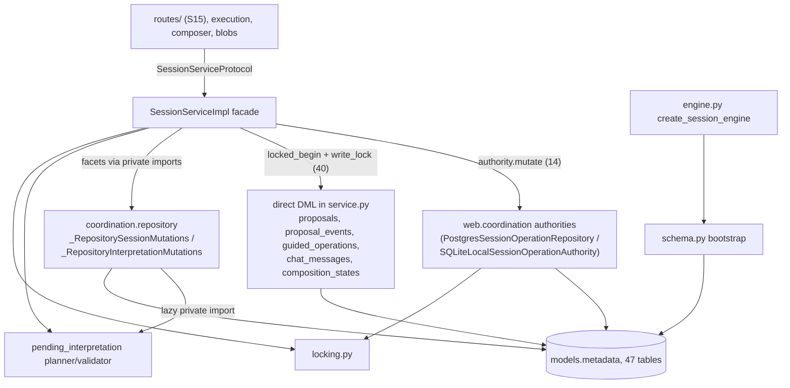

### Lock and fence order (MEASURED from locking.py and service.py 4711–5016)

1. `filesystem_session_lock(root, sid)` (locking.py:70) comes **first** if the
   operation touches the blob directory. Its docstring (73–76) says it must be
   acquired "before any database/session lock".
2. `process_session_lock`: on SQLite, a per-(db, session) `threading.RLock`
   plus an `flock` on `.<db>.session-locks/<sha256(sid)>.lock` (164–237). On
   PostgreSQL it is a no-op (241–253).
3. `engine.begin()`, which `create_session_engine` **replaces** with a
   write-intent variant. On SQLite that is `BEGIN IMMEDIATE`
   (engine.py:116-137), with `isolation_level=None` so pysqlite cannot emit
   its own deferred BEGIN (113).
4. `_session_write_lock(conn, sid)` (service.py:4801). It records
   `(id(conn), sid)` in a `ContextVar` so the allocators can assert the lock
   is held (4778-4798). The lock itself is the SQLite RLock held until
   commit or rollback through connection events (locking.py:287-333), or
   `pg_advisory_xact_lock(ELSPETH_SESSIONS_LOCK_CLASSID, hashtext(sid))` on
   PostgreSQL (256-261).
5. Fence proof. Using the **database** clock (`_guided_database_now`:
   `CURRENT_TIMESTAMP` on SQLite, `clock_timestamp()` on PostgreSQL,
   4828-4845), select the exact `session_operation_fences` row on
   (session, operation_id, lease_token, epoch, kind), unreleased and
   unexpired. A miss raises `SessionOperationFenceLost` or
   `GuidedOperationFenceLostError` (4931-4965).
6. Allocation and DML. `_reserve_sequence_range` and `_insert_composition_state`
   allocate `MAX()+1` under the held lock. The unique indexes
   `ix_chat_messages_session_sequence` and `uq_composition_state_version` are
   the real guard; the advisory lock only reduces contention (4733-4739).

Fork takes two session locks in sorted UUID order (4765-4776). Blob custody on
PostgreSQL uses a separate classid, so a lease renew never waits behind blob
filesystem I/O (locking.py:371-387).

### Concurrency model

The service is async. Every DB call runs synchronously in a worker through
`run_sync_in_worker` (service.py:4692). A worker that has already started is
shielded from caller cancellation, which gives the "commit wins" contract
(`persist_compose_turn_async`, 7021-7050): callers must not retry after
`CancelledError`. `persist_compose_turn` refuses to run on a thread that has
an event loop (6702-6716). Archive runs each lease-owned phase under nested
`asyncio.shield`, joins the phase before cancellation resumes, and
compare-and-swaps the fence between filesystem steps (7241-7296).

### State machines

**Interpretation events** (`interpretation_events.choice`,
models.py:1520-1523): `pending` goes to `accepted_as_drafted`, `amended`,
`abandoned` or `superseded`. `opted_out` rows are born resolved.
`auto_interpreted_opt_out` and `auto_interpreted_no_surfaces` sources must be
`opted_out` (CHECK 1540-1543). Each source has a row shape enforced by
source-keyed CHECKs (1573-1609). `resolved_at IS NULL` iff pending (1613).
Resolution is `resolve_interpretation_event` (service.py:8682, 461 lines):
preflight reads outside the lock, then one transaction that holds the lock and
fence, patches the prompt template, and writes a new `composition_states` row
with provenance `interpretation_resolve`. Dead-site supersession
(`dead_site_supersession.py`) moves pending rows to `superseded` in the same
transaction as any head advance. Its docstring (10-16) names three head
writers: one in `service.py` and two in `coordination/repository.py`.

**Proposals** (`composition_proposals.status`): `pending` goes to `committed`
or `rejected`. `committed` iff `committed_state_id` is set (models.py:984-991).
Lifecycle events are appended to `proposal_events`: created, accepted,
rejected, `trust_mode.changed`, `auto_commit.revoked`, `proposal.rebased`
(1346-1350). Pipeline proposals carry versioned payload schemas
(`pipeline_proposal_{created,accepted,rejected}.v1`, service.py:396-465), and
every settlement re-verifies them (914-1075).

**Session archive** (service.py:7210-7506): acquire an `ARCHIVE` lease, then
`decide_and_soft_archive` (coordination). If the session has durable history
it is soft-archived by setting `archived_at`. Otherwise (no durable history and
`data_dir` set) the sequence is: reconcile prior quarantine manifests, prepare,
stage, checkpoint, then `lease.consume_archive(restore_current,
finalize_consumed)`, which physically deletes the session row so FK cascades
remove its children. A cleanup failure after commit raises
`QuarantineCleanupError` without filesystem text (7380-7422).

### Why identity and SSO live in "sessions" (MEASURED)

Only their **tables** live here. Most of their **logic** does not:

- `identities`, `identity_roles`, `identity_relationships` and `sso_handoffs`
  are in `models.py` because the epoch-52 cutover moved ownership onto
  `identity_id` inside the session DB, in one cutover window
  (models.py:282-299). They received RESTRICT FKs at epoch 55 (315-332). There
  are **28 FK references into `identities`**: every owner column in
  `sessions`, `user_secrets`, `user_preferences`, approvals, reviews,
  `library_entries`, quotas and `token_usage_ledger`. That fan-in is the
  structural reason they share the database: FKs cannot cross databases.
- `identity_repository.py` holds only record types and row parsers. Its
  docstring (7-15) says it "takes no engine and opens no connection". All 15
  identity DML sites are in `web/coordination/identity_authority.py`.
- `sso_handoff_repository.py` is the exception: it holds an `Engine` and does
  its own DML. The single-use claim is one `UPDATE … RETURNING` on the
  database clock (111-120). It imports `web.auth.sso`, so sessions→auth has 19
  module-level statements while auth→sessions is TYPE_CHECKING-only (matrix
  row `web.auth | web.sessions | 0 | 0 | 1`), and there is no runtime cycle on
  this arm.
- Local **credentials** live in a third store, `data_dir/auth.db`
  (`web/app.py:1227`; `auth/local.py:314` "auth.db is CREDENTIALS ONLY").
  `identities` records admission state, not credentials.

---

## Data & persistence

**Store:** the Sessions DB (SQLite file with WAL, or PostgreSQL), separate from
Landscape and from `auth.db`. Probe:

```
$ PYTHONPATH=<pin>/src .venv/bin/python -c "import elspeth.web.sessions.models as m; ..."
EPOCH 66 0x454c5350
tables 47
{'CheckConstraint': 293, 'PrimaryKeyConstraint': 47, 'Index': 73, 'Column': 527,
 'ForeignKeyConstraint': 83, 'UniqueConstraint': 14}
```

The 293 CHECK objects include dialect-paired `ddl_if` twins, so the count of
distinct rules is lower.

| Domain | Tables (47) |
|---|---|
| Session content (10) | `sessions`, `chat_messages`, `composition_states`, `composition_proposals`, `proposal_events`, `proposal_blob_effect_receipts`, `interpretation_events`, `composition_rejection_events`, `composer_completion_events`, `skill_markdown_history` |
| Guided (3, retirement target) | `guided_operations`, `guided_operation_events`, `guided_operation_admission_blocks` |
| Runs (4) | `runs`, `run_events`, `run_execution_inputs`, `run_start_permits` |
| Multi-replica coordination (9) | `web_instances`, `session_operation_fences`, `session_read_admissions`, `websocket_tickets`, `composer_inflight_requests`, `composer_progress_snapshots`, `rate_limit_buckets`, `rate_limit_events`, `sessions_cleanup_claims` |
| Blobs (5) | `blobs`, `blob_deletion_cleanups`, `blob_replacement_cleanups`, `blob_run_links`, `blob_inline_resolutions` |
| Identity/SSO (4) | `identities`, `identity_roles`, `identity_relationships`, `sso_handoffs` |
| Workflow governance (5) | `approvals`, `approval_decisions`, `review_requests`, `review_attestations`, `library_entries` |
| Quota (3) | `quota_policies`, `token_usage_ledger`, `quota_provider_attempts` |
| Per-user (2) | `user_secrets`, `user_preferences` |
| Audit/identity (2) | `audit_access_log`, `elspeth_schema_identity` |

**Epoch policy:** there is no migration code. `initialize_session_schema`
(schema.py:150-181) creates, stamps and validates a fresh database. For an
existing one it checks the sentinels (SQLite `application_id` / `user_version`
plus exactly one `elspeth_schema_identity` row with store_kind `session` and
epoch 66, 312-367), then the full shape: table set, the `core.schema_shape`
collector, the 14 required triggers, the partial-index dialect symmetry, and
the coordination hard-cut pin (10 expiry indexes, a ban on a
"deleted-session" registry, 518-555). Any mismatch raises `SessionSchemaError`
with "delete the session DB and restart". The epoch history is at
models.py:57-361. **Epoch 56 has no numbered entry**: line 333 reads "Coupled
cut: …" with no number.

**Which modules write each table** (MEASURED. AST census of
`insert/update/delete(<x>_table)`, `sqlite_insert/postgresql_insert` and
`<x>_table.insert()` across `src/elspeth/web`. Positive control: the census
reports service.py's `insert(proposal_events_table)` at service.py:3254):

| Table | DML sites by module |
|---|---|
| `composition_proposals` | service.py 11 (100 %) |
| `proposal_events` | service.py 13, all INSERT |
| `guided_operations` | service.py 11, coordination/repository.py 1 |
| `chat_messages` | service.py 3 (1 INSERT, 2 UPDATE of `composition_state_id` in fork settlement 14389/14420), coordination/repository.py 1, run_diagnostics_authority 1 |
| `composition_states` | coordination/repository.py 3, service.py 2 |
| `sessions` | coordination/repository.py 8, service.py 4, run_diagnostics_authority 1 |
| `interpretation_events` | **coordination/repository.py 6 (4 INSERT, 2 UPDATE)**, dead_site_supersession.py 1 UPDATE, **service.py 0** |
| `session_operation_fences` | coordination/repository.py 10 (100 %) |
| `runs` | coordination only (repository 7, run_start_permit 2, run_recovery 2, run_cancellation 1) |
| `identities` | coordination/identity_authority.py 15 |
| `composition_rejection_events`, `composer_completion_events` | coordination/repository.py (INSERT only) |
| `audit_access_log`, `token_usage_ledger`, `run_events` | coordination authorities (INSERT only) |

The schema, the interpretation policy and the facade are in S14. The DML
authority for most tables has moved to `web.coordination` (the "P4-D6 family"
authorities). `service.py` still owns proposals, proposal events, guided
operations and the compose-turn chat and state inserts.

---

## Dependencies

### Outbound (MEASURED; my AST census split by file group, reconciled to the matrix)

`import-matrix.md` counts statements, not symbols. Split by file group
(module / lazy / TYPE_CHECKING):

| dst | **S14** | routes/ (S15) | guided (S13) | matrix total |
|---|---|---|---|---|
| web.composer | **23 / 35 / 7** | 93 / 20 / 0 | 17 / 0 / 0 | 133 / 55 / 7 ✓ |
| web.coordination | 15 / 1 / 1 | 25 / 4 / 0 | 0 | 40 / 5 / 1 ✓ |
| web.auth | 2 / 0 / 0 | 17 / 0 / 0 | 0 | 19 ✓ |
| web.(root) | 8 / 0 / 0 | 27 / 0 / 0 | 0 | 35 ✓ |
| web.plugin_policy | 1 / 5 / 4 | 6 / 2 / 0 | 1 | 8 / 7 / 4 ✓ |
| web.execution | 1 / 1 / 3 | 10 / 2 / 0 | 0 | 11 / 3 / 3 ✓ |
| contracts | 51 / 2 / 3 | 53 / 3 / 0 | 20 | 126 / 5 / 3 (≈; 2-stmt bucketing difference) |

**About the `web.sessions → web.composer` arm (133 + 55).** 70 % of its
module-level edges (93/133) come from **routes/**, not the domain. S14 itself
contributes 23 module-level and 35 lazy statements. In total, **89 of the 188
runtime statements (47 %) target `web.composer.guided.*`**.

The S14 symbols, by file:

- `service.py` module-level (11 statements):
  - `authority_hashing.{composer_authority_hash, project_composer_authority_payload}`
  - `guided.protocol.BLOB_REF_PATH_PREFIX`
  - `pipeline_commit.PipelineDispatchAuditBinding`
  - `pipeline_custody.{finalize_pipeline_custody_on_connection, staged_pipeline_custody}`
  - `pipeline_planner.PipelinePlanResult`
  - `pipeline_proposal.{AbsentBase, PresentBase, ProposalBase, PipelineProposal, PlannerSurface, composition_content_hash, is_owned_composition_state_authority, owned_composition_state_review_arguments, reviewed_anchor_hash}`
  - `provider_telemetry.record_settled_composer_{audit_message,provider_calls}`
  - `redaction.{assert_guided_custody_persistable, redact_tool_call_arguments, semantic_redacted_pipeline_arguments_hash}`
  - `redaction_telemetry.NoopRedactionTelemetry`
  - `telemetry_phase8.record_interpretation_opt_out`
  - `tools.is_blob_store_only_mutation_tool`
- `service.py` lazy (32 statements). 30 of them import
  `guided.{state_machine.GuidedSession/TurnRecord, protocol.GuidedStep/Turn/TurnType/validate_current_turn, errors.InvariantError, planning.*, profile.*, deferred_intents.*, intent_management.*, emitters.build_step_4_wire_turn}`.
  The other 2 are `state.ValidationEntry` (4663) and `audit.llm_call_audit_envelope` (10527).
- `protocol.py`:
  - module-level: `guided.deferred_intents.*Action`, `guided.protocol.TurnType`, `guided.state_machine.{ComponentTarget, GUIDED_MAX_CHAT_TURNS}`
  - lazy: `pipeline_planner.PipelinePlanResult` (2616), `pipeline_commit.PipelineDispatchAuditBinding` (2851)
- `pending_interpretation.py:26`: `source_demand.{build_source_data_contract_draft, parse_source_data_contract_accepted_fields, sample_header_for_source, source_data_contract_artifact_hash, stamp_source_options_with_guarantees}`
- `converters.py:23-25`: `guided.state_machine.GuidedSession`, `state.CompositionState`, `yaml_generator.{LoweredPipelineDocument, generate_pipeline_dict}`
- `_auto_title.py:41-42`: `llm_response_parsing.*` and the **private** `service._apply_endpoint_kwargs` and `service._litellm_acompletion`
- `proposal_blob_refs.py:13-14`: `BLOB_REF_PATH_PREFIX`, `is_owned_composition_state_authority`
- `schemas.py:33`: `GUIDED_MAX_COMPONENTS_PER_KIND`

The instrument is the scratchpad `imparm.py`, an AST walk over
`elspeth/web/sessions`. Its module and lazy totals of 133 and 55 equal the
matrix row.

### Inbound

See the Public interface table. Matrix rows into `web.sessions` (all files):
- web.coordination 40 / 4 / 1, web.(root) 23, web.composer 19 / 8 / 6,
  web.execution 13 / 2 / 2, web.blobs 7, web.shareable_reviews 6,
  web.audit_readiness 5, web.acceptance 1, web.preferences 1, web.secrets 1,
  web.auth TYPE_CHECKING only.
- `cli` 3 lazy.

### Symbols carrying the sessions ↔ coordination cycle (MEASURED)

- sessions → coordination, **private** names: `service.py:126-133` imports
  `_ForkCreationTransaction`, `_RepositoryInterpretationMutations`,
  `_RepositoryMutationState` and `_RepositorySessionMutations` from
  `coordination/repository.py`.
- coordination → sessions, **private** names: `coordination/repository.py:1022`
  (lazy) imports `_SessionPendingInterpretationPlanner` and
  `_SessionPendingInterpretationValidator`. `coordination/identity_authority.py:68`
  imports `identity_repository._IDENTITY_COLUMNS`, `_parsed_*` and
  `_row_to_record`.
- coordination → sessions, public names: `models.*_table` (19 statements) and
  `locking.locked_session_transaction` (7).
- Within sessions: `routes/sessions.py:52` imports the private
  `service._free_text_embeds_parent_blob` and `_value_references_parent_blob`,
  and `web/schema_probe.py:30` imports three private `schema._*` functions.

---

## Patterns observed

- **Capability objects with lifetime checks.** `_SessionComposerMutationState`
  (3177) uses name-mangled slots and an `__active` flag, and `_require_exact()`
  re-proves the fence **before every write** (3203-3213). The
  `_RepositoryMutationState` facets repeat this pattern.
- **Nominal typing at trust boundaries (ADR-032).**
  `type(x) is SessionOperationContext` checks appear throughout, and
  `_SessionPendingInterpretationValidator.__init__` accepts exact classes only
  (1656-1671).
- **Pre-release "delete the DB" policy, enforced mechanically.** An epoch
  sentinel, an identity row and full shape validation run at startup. There is
  no migration path by design (schema.py:1-7).
- **Dialect-paired DDL.** Every CHECK that needs dialect SQL is emitted twice
  with `ddl_if`. Partial indexes must declare both `sqlite_where` and
  `postgresql_where`, and startup verifies this (schema.py:572-628).
  Audit triggers exist as SQLite `RAISE(ABORT)` and as PL/pgSQL functions
  raising SQLSTATE 23000.
- **Governance comments inside the schema.** Closed enums carry "NO SILENT
  EXTENSION" blocks that require a spec amendment, a test and a ticket
  (models.py:900-910, 1516-1519, 1741-1744).
- **Error disposition by class with audit primacy.** `persist_compose_turn`
  handles `IntegrityError`, `OperationalError` and generic `SQLAlchemyError`
  differently, and only the `OperationalError` handler (6916-6973) branches on
  `plugin_crash_pending`.
- **Database clock for authority, process clock for content.** Fences, leases
  and SSO expiry use the database clock (4828-4845;
  sso_handoff_repository.py:77,110). Content `created_at` uses
  `datetime.now(UTC)` (4696-4697).
- **Durable filesystem protocols.** Archive quarantine uses write-temp, fsync,
  rename-noreplace and a parent-directory fsync, with every path opened
  O_NOFOLLOW.

## Invariants & how they are enforced

| Invariant | Enforcement |
|---|---|
| One sequence number per (session, chat message) and one version per (session, state) | **DB**: unique `ix_chat_messages_session_sequence` (models.py:754) and `uq_composition_state_version` (840). **Code**: the `_session_write_lock` ContextVar assertion (service.py:4778). **Test**: the AST gate `tests/unit/web/sessions/test_static_direct_writers.py` (3,459 lines, reviewed writer allowlist keyed by count) |
| Session engine PRAGMAs (FK=ON, WAL, busy_timeout) | **Code**: probe at startup (engine.py:149-173). **Lint**: `contract_invariants.session_engine_factory` (elspeth-lints, verified present) |
| Same-session custody on composite FKs (message↔state, proposal↔state, interpretation↔state) | **DB**: composite FKs onto `(id, session_id)` unique targets (models.py:714-732, 959-974, 1506-1510) |
| Resolved interpretation rows cannot change | **DB trigger**, but only on `accepted_value`, `resolved_at`, `actor` and `choice` (models.py:2240-2245, 1868-1872). The other columns rely on code (see C-06) |
| `chat_messages` append-only | **DB trigger** on `content` only (`BEFORE UPDATE OF content`, 2305). DELETE is blocked while the session row exists (2316-2322). `raw_content`, `tool_calls` and `composition_state_id` can be changed at the DB level, and fork settlement updates `composition_state_id` (service.py:14389, 14420) |
| `composer_completion_events` immutable | **DB triggers**, unconditional (2276-2298) |
| `proposal_events`, `composition_rejection_events`, `audit_access_log`, `run_events`, `token_usage_ledger` append-only | **Code only**, because no writer issues UPDATE/DELETE (measured census above). No trigger |
| The `interpretation_review_disabled` boolean agrees with the `opted_out` row | **Code only**. The in-code note F-35 says the trigger was deferred (models.py:551-565) |
| Closed enums (provenance, choice, kind, surface_origin, writer_principal, auth_provider_type) | **DB CHECK**, paired with Literals in `protocol.py` and `contracts/`. `_AUTH_PROVIDER_TYPE_CHECK` is pinned by `tests/unit/web/auth/test_provider_type_contract.py` (models.py:366-370) |
| Epoch and coordination hard cut agree | **Code**: `SESSION_SCHEMA_EPOCH == _COORDINATION_HARD_CUT_EPOCH` or startup fails (schema.py:534-535) |
| SSO handoff is single-use under concurrency | **DB**: a single conditional `UPDATE … RETURNING` (sso_handoff_repository.py:111-120). **Test**: `tests/testcontainer/web/test_sso_handoff_race_postgres.py` |
| Composition-state JSON columns are versioned | **Code**: `state_envelope.unwrap_state_column` raises `AuditIntegrityError` on a non-envelope value (state_envelope.py:44-52) |
| Only `SessionSchemaAuthority` stamps the sentinels | **Prose/code** (schema.py:249-262) plus the insert failing closed on the singleton PK |

---

## Baseline delta: what ARCHITECTURE.md says vs what the tree says

| Claim in ARCHITECTURE.md / ADR | Pinned tree | Evidence |
|---|---|---|
| `web/sessions/service.py` ~14,321 LOC; large files listed as a Medium improvement (ARCHITECTURE.md:1096, 1110) | **15,006** lines (+685). `SessionServiceImpl` alone is 10,546 lines with 172 methods | `wc -l`; the AST outline above |
| The Session DB "Stores Composer sessions, proposals, and durable guided operations" (ARCHITECTURE.md:134) | 47 tables in 10 domains, including identity/SSO, workflow governance, quotas and ledger, rate limits, websocket tickets, web-instance membership, run permits, blob custody, and user secrets/preferences | the metadata probe; models.py:485-4038 |
| The baseline gives the Audit DB a table count and epoch (46 tables / epoch 38, ARCHITECTURE.md:183) | **The Session DB has no table count or epoch in the baseline.** It is 47 tables at epoch 66, with application_id 0x454C5350 | models.py:362, 480 |
| Two stores: Landscape and Sessions (discovery 01 §3; baseline container view) | **A third store**: `data_dir/auth.db` holds local credentials only. The baseline does not mention it | web/app.py:1227; auth/local.py:314 |
| "The 0.8.0 AWS profile supports one web task at a time" (ARCHITECTURE.md:726) | The schema carries the full multi-replica substrate added at epoch 51: `web_instances` membership, per-session operation fences with lease tokens and epochs, cross-replica tickets, progress, rate limits and cleanup claims. `PostgresSessionOperationRepository` is selected on PostgreSQL | models.py:268-281, 587-687; service.py:4518-4521 |
| Layering is contracts → core → engine/plugins → UI (ADR-006); the web tier is one container | Inside the web tier, sessions ↔ coordination and sessions ↔ composer are mutual. `telemetry.py:32-51` records that the "sessions must not import composer" rule was retired as unenforced | the matrix plus the census above |
| Landscape epoch 38 (ARCHITECTURE.md:183) | Session epoch notes pair with Landscape epoch 37 (52), 40 (55) and **43 (63)**, so the baseline Landscape epoch is at least 5 behind. This is a cross-slice point | models.py:294, 329, 355 |
| (omitted) Session schema bootstrap/validation, trigger validation, the dialect-symmetry gate | They exist and run at every startup | schema.py:150-213, 369-430 |
| (omitted) Session archive quarantine (a crash-durable filesystem protocol, Linux only) | 1,153 lines, called only from `archive_session` | archive_quarantine.py; service.py:7210 |
| (omitted) The direct-writer AST gate for chat and state rows | A 3,459-line test with a committed allowlist literal | tests/unit/web/sessions/test_static_direct_writers.py |

---

## Concerns

| ID | Sev | Concern | Evidence (file:line at pin) | New / prior |
|---|---|---|---|---|
| C-01 | **High** | **Freeform session fork runs on the guided-operation substrate that is being retired.** `POST /sessions/{id}/fork` reserves a `guided_operations` row with `kind="session_fork"`. `fork_session` requires a `SessionForkParentAuthority` carrying a `guided_fence`, and settlement is `settle_guided_fork_operation`. Removing the guided tables, lifecycle (C3) and triggers along with the guided lane would break fork unless fork is re-homed first | routes/sessions.py:1028-1031, 1055, 1134; service.py:13925-13927, 14221; models.py:651 (`session_fork` fence kind); service.py:4847-4929 | NEW |
| C-02 | Medium | Session-table DML authority is split between `sessions/service.py` and `coordination/repository.py`, bound by **private-symbol imports in both directions**. It is the concrete carrier of the web SCC. Neither package can be understood or changed without the other, and the naming contract ("repository remains the sole DML owner", pending_interpretation.py:1-5) does not hold for chat, state or session rows | service.py:126-133; coordination/repository.py:1022; coordination/identity_authority.py:68; DML census table above | NEW (the SCC itself is in discovery 01 §5.1) |
| C-03 | Medium | God object. `SessionServiceImpl` is 10,546 lines, 172 methods and 13 clusters, with three transaction-ownership models (14 `authority.mutate` / 40 locked-begin / 36 guided-transaction). The guided share is ≥43 % of the file, and C12 alone is 2,866 lines | the AST outline and `grep -c` above | PREVIOUSLY-REPORTED (ARCHITECTURE.md:1096,1110 "Medium"; discovery 01 §8.3). The cluster map is NEW |
| C-04 | Medium | Archive quarantine requires Linux `renameat2(RENAME_NOREPLACE)` through `ctypes`, and fails closed on any other platform. Whether RENAME_NOREPLACE works on the shared-mount deployments (EFS/NFS `data_dir`) is **INFERRED as unverified**; no acceptance test was found. If unsupported, archiving a no-history session fails with `ArchiveQuarantineIntegrityError` | archive_quarantine.py:1000-1037; service.py:7461-7484 | NEW |
| C-05 | Low | 11 **read-only** service methods open `self._engine.begin()`, which `create_session_engine` replaces with `BEGIN IMMEDIATE` on SQLite. This contradicts the factory's stated intent that "bare read connections keep the lock-free deferred BEGIN". `get_session` (ownership path) and `get_current_state` (34 call sites) therefore take the RESERVED lock and queue behind writers under `busy_timeout=5000`. PostgreSQL is unaffected. The docstring at service.py:8705-8708 misstates the behaviour | engine.py:116-137 (intent 128-131); service.py:7105, 7172, 7814, 8181, 8504, 9808, 10211, 10235, 10615, 10774, 10793 | NEW |
| C-06 | Low | The `interpretation_events` immutability trigger covers only 4 columns, so `arguments_hash`, `approved_prompt_artifact_hash`, `llm_draft` and model provenance of a resolved, hash-sealed row can be changed at the DB level. Current writers do not do this (census: 2 UPDATEs in repository.py plus 1 dead-site UPDATE, all pending-row transitions, INFERRED from reading dead_site_supersession.py:131-143) | models.py:2240-2245, 1868-1872 | NEW |
| C-07 | Low | Five tables are append-only by convention but have **no DB trigger**: `proposal_events`, `composition_rejection_events`, `audit_access_log`, `run_events`, `token_usage_ledger`. The chat trigger covers `content` only | schema.py:96-113; census above | NEW |
| C-08 | Low | The "authoring validation + runtime preflight gives persisted `is_valid`" merge (elspeth-155947ca47) is **implemented twice**. The pending-interpretation copy discards `error_code` and `component` | service.py:4612-4683 vs pending_interpretation.py:1701-1753, 1762 | NEW |
| C-09 | Low | The process-lifetime lock registries `_SQLITE_SESSION_LOCKS` and `_FILESYSTEM_SESSION_LOCKS` are never evicted: one RLock per (db, session) ever touched. The only write is the insert (control: the grep matched line 160) | locking.py:29-31, 89, 160 | NEW |
| C-10 | Low | Epoch 66 (4f0e16c6c, control-message v2) fences out every epoch-65 store, which **incidentally** closes R02's early-65 exposure. The epoch history still does not name the completion_gates v2 grammar cut, and epoch 56 has no numbered entry | models.py:333, 356-361; schema.py:35-39; completion_gates.py:276-278 | PREVIOUSLY-REPORTED (R02, docs/reviews/2026-09-23-release-0.8.1-web-review); the closure status is NEW |
| C-11 | Low | Server-route interpretation surfaces are hashed with `actor="composer-llm"` | pending_interpretation.py:2089; service.py:8600 | PREVIOUSLY-REPORTED (R35) |
| C-12 | Low | `cost_unavailable` is not classified in the permanent/transient comment | protocol.py:184-195 | PREVIOUSLY-REPORTED (R39) |
| C-13 | Low | Two sources of truth for opt-out: the `sessions.interpretation_review_disabled` boolean and the `opted_out` row. A reconciling trigger is deferred | models.py:551-565 | PREVIOUSLY-REPORTED (in-code F-35) |
| C-14 | Low | Stale doc references. models.py:2976 cites a nonexistent `_validate_named_checks`. The models.py:3 header says "epoch-44 coordination". models.py:1853 cites a "release-0.7.1 one-shot migration", but models.py:2443 is the only consumer of the cohort. The epoch-51 note (273-276) says the progress tables were removed, yet epoch 54 re-added them. audit_story_service.py:22-26 says only the tutorial writes `llm_call_count`, but core writes it at every run completion (core/landscape/run_lifecycle_repository.py:907). `seeded_from_cache` is NOT NULL, default false (core/landscape/schema.py:537), so completed non-tutorial runs now get a story rather than the documented 404; there is no 500 path | as cited | PREVIOUSLY-REPORTED (the `_validate_named_checks` item: docs/reviews/2026-09-21-hash-column-check-census.md:128) / others NEW |
| C-15 | Low | HTTP and private-API leakage into the domain. `ownership.py` raises `fastapi.HTTPException` and reads `request.app.state`. `_auto_title.py` calls composer's **private** `_litellm_acompletion` and `_apply_endpoint_kwargs`, a provider call from sessions that bypasses the composer service surface (a UI title, not pipeline structure, so it does not violate the composer invariants) | ownership.py:19, 43-44; _auto_title.py:42 | NEW |
| C-16 | Info | 34 bare `assert` statements in service.py (e.g. 4642-4643, 7299-7300) and 1 in audit_checkpoint.py:25. The sampled ones narrow types after an exclusive check (4489-4492 coupling; closure re-narrows of `data_dir`); they are mypy idioms, not invariant guards | `grep -c -E '^\s+assert '` (control: 17 in test_locking.py) | NEW |
| C-17 | Info | `@runtime_checkable` on `SessionOperationAuthority` and `SessionForkCreationTransaction`. `isinstance` against them occurs only in `tests/unit/web/sessions/test_protocol.py`, so the decorator is inert in production, but it goes against the AGENTS.md/ADR-032 guidance for authority types | protocol.py:3827, 3874 | NEW (note only) |

## Complexity & tech-debt hotspots

- **Largest units** (AST): `SessionServiceImpl` 10,546; `SessionServiceProtocol` 1,094; `_SessionComposerMutations` 531 (service.py:3220); `resolve_interpretation_event` 461; `stage_guided_pipeline_proposal` 459; `_SessionPendingInterpretationPlanner` 427; `_GuidedSessionMutations` 357; `persist_compose_turn` 355; `settle_pipeline_composition_proposal` 324; `fork_session` 323; `settle_guided_fork_operation` 316; `stage_guided_full_pipeline_proposal` 314; `settle_guided_state_operation` 301; `archive_session` 297; `_restore_authoritative_pipeline_proposal` 192 (module-level).
- **Fused responsibilities:** C-02 and C-03. The facade also computes the principal plugin snapshot (`_session_principal_context`) and runs profile-aware and runtime validation (C1), so the persistence layer calls into `web.plugin_policy.validation` and runtime preflight (4640, 4657).
- **Guided removal inventory inside S14:** C3 and C12 (4,095 method lines); module-level guided verifiers (1,658 lines); 3 tables; 8 of the 14 required triggers (schema.py:104-111); `protocol.py` guided commands and results; lazy imports into `composer.guided` (30); `converters.py:23`, which restores `GuidedSession` from `composer_meta`; and `_strip_guided_profile_in_meta` (service.py:1634, 127 lines). **Fork (C-01) must be re-homed before any of this goes.**
- **Vestigial or legacy:** `tutorial_normalization` provenance is dormant (models.py:869-882). `_normalize_pre_adr019_session_counters` and `_legacy_disjoint_counter_shape_holds` (service.py:2101-2166) normalise pre-ADR-019 counter shapes, which sits uneasily with the "no old pathways" ruling (NEEDS CONFIRMATION). The `composition_states.source` column is kept as a "legacy singular compatibility column" beside `sources` (models.py:109-111; converters.py:46-47).
- **TODO/FIXME:** none measured by grep in the files read.

## Test map

MEASURED (`find`, `grep -rl 'elspeth\.web\.sessions'`):

| Tier | Files importing `elspeth.web.sessions` | Notes |
|---|---:|---|
| unit | 298 | `tests/unit/web/sessions/` has 120 test files (80,833 lines) plus 16 under `routes/`. Direct S14 modules: `test_service.py`, `test_schema.py`, `test_models.py`, `test_engine.py`, `test_locking.py`, `test_archive_quarantine.py`, `test_archive_secondary_failures.py`, `test_identity_repository.py`, `test_sso_handoff_repository.py`, `test_persist_compose_turn.py`, `test_static_direct_writers.py`, `test_interpretation_*`, `test_protocol.py`, `test_telemetry.py`, `test_titles.py`, `test_auto_title*.py`, `test_skill_markdown_history_authority.py` |
| integration | 75 | 34 of the 75 under `integration/web/composer/guided/` |
| testcontainer (PG) | 40 | includes `test_sso_handoff_race_postgres.py`, `test_session_mutation_fencing_postgres.py` (archive quarantine), `test_guided_atomic_settlement_postgres.py`, `test_identity_owner_schema_postgres.py`, `test_schema_probe_postgres.py` |
| property | 2 | |
| e2e | 1 | |

**Gaps (INFERRED; I did not run coverage):**
- No test was found that exercises archive quarantine on a network filesystem (C-04).
- No test was found that pins the read path to deferred BEGIN (C-05).
- No test was found that asserts resolved `interpretation_events` hash columns are immutable at the DB level (C-06).
- Unit coverage is heavily SQLite. The PostgreSQL behaviour of the fence and lock order depends on the 40 testcontainer files, which the default `pytest tests/` run excludes (AGENTS.md).

## Confidence

**Medium.**

Read in full: `schema.py`, `engine.py`, `locking.py`, `identity_repository.py`,
`sso_handoff_repository.py`, `dead_site_supersession.py`, `state_envelope.py`,
`skill_markdown_history.py`, `converters.py`, `titles.py`, `ownership.py`,
`audit_story_*.py`, `audit_checkpoint.py`, and the `__init__` and header
sections of `_auto_title.py`, `telemetry.py` and `_persist_payload.py`.

Sampled (about 1,500 of 15,006 lines of `service.py`): imports and constants
(1–478); the constructor, locking and fencing region (4461–5020);
`persist_compose_turn[_async]` (6650–7067); `archive_session` (7210–7506); the
head of `resolve_interpretation_event` (8682–8800); the runs, quota and
admission region (10277–10476); the head of `fork_session`; the facet
factories (14920–15006); and the `_SessionComposerMutation*` classes (3172–3320).

Also sampled: about 1,900 of 4,080 lines of `models.py` (header and epochs,
the sessions/coordination/chat/state/proposal/interpretation/completion
tables, and the trigger DDL); about 500 of 2,205 lines of
`pending_interpretation.py`; and `archive_quarantine.py` (outline plus the
rename core).

Outlined only (AST): `protocol.py` and `schemas.py` bodies. Not read: the
2,866-line guided settlement cluster C12 (S13 territory), the guided lease
lifecycle C3 internals, and most of `proposal_blob_refs`,
`proposal_blob_effects` and `inline_blob_preflight`.

All dependency, DML and table counts come from AST and metadata instruments
run at the pin, and the module and lazy import totals equal
`temp/import-matrix.md` exactly (133/55; coordination 40/5). retired code index was not
used (index stale); all claims were confirmed against the pin.

### Risk Assessment

Implementation risk of acting on this record: **Medium**. Reversibility:
**Moderate**.

- **Correctness (High severity, likely if unaddressed):** guided retirement
  would break fork (C-01). Mitigation: re-home the `session_fork` operation
  kind before deleting the guided tables.
- **Availability (Medium, SQLite deployments only):** read-path IMMEDIATE
  locks (C-05). Mitigation: move reads to `engine.connect()`.
- **Portability (Medium, unknown likelihood):** archive on NFS/EFS (C-04).
  Mitigation: an acceptance test on the real mount.
- **Maintenance (Medium, certain):** C-02 and C-03 make every change span
  sessions and coordination.

### Information Gaps

- Whether `renameat2(RENAME_NOREPLACE)` succeeds on the ECS EFS or ACA NFS
  `data_dir` (runtime; this would settle C-04).
- The measured SQLite contention cost of C-05 under load.
- Whether the pre-ADR-019 counter normalisers are dead after the epoch cuts.
- The internals of the guided cluster C12, left to S13.
- Why epoch 56 is unnumbered (historical).

### Caveats & Required Follow-ups

- The DML census matches only direct `insert/update/delete(<name>_table)` and
  `<name>_table.insert()` spellings. Raw SQL strings and aliased tables are not
  seen, so its negative claims (for example "service.py writes 0
  `interpretation_events` rows") hold only for those spellings.
- The guided-share figure is a name heuristic and a lower bound.
- The "INFERRED" labels on C-04 and C-06 need runtime confirmation.
- Recommended order: (1) S13 and S15 reconcile C-01 in the removal plan;
  (2) confirm C-04 on a real shared mount; (3) fix C-05; (4) decide the
  trigger coverage in C-06 and C-07 at the next epoch cut.

## Validation corrections

- [validator] "41 × `self._session_process_locked_begin(...)`" (transaction-model list, mermaid label, C-03) -> 40 call sites (evidence: `grep -c 'self._session_process_locked_begin(' service.py` = 40 at pin; the bare-name count of 42 includes the `def` at service.py:4759 and one non-call mention)


---

# S15 — Sessions HTTP Routes (`web/sessions/routes/`)

**Location:** `src/elspeth/web/sessions/routes/` (pin `release/0.8.1` @ `85ebf2739`, read from
`.claude/worktrees/arch-analysis-pin`). The package has three sub-areas: the `/api/sessions` router
(`__init__.py`, `sessions.py`, `messages.py`, `runs.py`, `interpretation.py`, `composer/`), the
workflow-governance routers (`workflow/`), and the shared helper module `_helpers.py`.
`guided_operations.py` and `composer/guided*.py` belong to S13 (guided lane, per `00-coordination.md`
row S13 "`guided_*`"). This entry lists their routes and coupling only.

**Measured size:** 24 files, **23,867 lines** (MEASURED:
`find src/elspeth/web/sessions/routes -name '*.py' | xargs wc -l`). Of these, **10,582 lines are S13-owned
guided files** (`guided.py` 5,889, `guided_chat_atomic.py` 2,573, `guided_chat_intent_management.py` 1,017,
`guided_plan.py` 1,011, `guided_proposal_rebase.py` 92), and `guided_operations.py` adds another 724. That
leaves **~12,560 lines in S15 proper**.

**Responsibility:** the FastAPI edge for Composer sessions. It authenticates the principal, enforces
session ownership (IDOR → 404), serialises session writers with an in-process lock plus a durable
session-operation lease, drives the composer compose loop and its failure and recovery persistence, and
projects Sessions-DB records onto wire schemas. It also mounts the identity-governance workflow routes
(approvals, reviews, library, mailbox, inspect, audit view).

---

## Key components

| File | Lines | Role |
|---|---:|---|
| `_helpers.py` | 4,010 | Shared sink. It holds 83 locally defined names: the in-process compose-lock registry, the `_track_compose_inflight` yield-dependency (heartbeat + request lease), the client-disconnect watcher, response projectors (`_state_response`, `_message_response`, tool-call outcome stamping), the audit-cohort persisters (`_persist_tool_invocations` / `_persist_llm_calls` / `_persist_turn_audit_cohort` / `_persist_run_diagnostics_llm_calls`), the four recovery handlers (convergence, plugin crash, runtime preflight, planner failure), `_state_data_from_composer_state` (authoring + runtime-preflight validation → `CompositionStateData`), `_verify_session_ownership`, and OTel counters. Its `__all__` has **269 names, 186 of them re-exports**, including stdlib modules and FastAPI symbols (MEASURED, AST script) |
| `sessions.py` | 1,337 | Session CRUD, `/_active`, and `fork_from_message` (361-line handler plus ~560 lines of pure fork blob-custody rewrite helpers, `_rewrite_fork_state_blob_custody` 183 lines) |
| `messages.py` | 1,284 | `POST /{id}/messages` (`send_message`, **1,063 lines**) and `GET /{id}/messages` (audit-grade opt-in view) |
| `composer/state.py` | 1,395 | Progress/preferences/state GETs, revert (guided-operation idempotency), YAML import (`seed_state_from_runtime_yaml`, reused by library fork), `e2e-seed`, YAML export (custody-verified public YAML + completion event) |
| `composer/compose.py` | 829 | `POST /{id}/recompose` (**740 lines**, a near-copy of `send_message`) |
| `composer/proposals.py` | 772 | List proposals/events, `accept` (404 lines; replays the composer tool via `execute_tool`), `reject` |
| `composer/pipeline_settlement.py` | 496 | Canonical pipeline-proposal settlement shared by manual accept and auto-commit (`settle_pipeline_proposal_under_compose_lock`, `settle_auto_commit_intent`) |
| `interpretation.py` | 339 | Interpretation-event resolve / list / opt-out / opt-out summary |
| `runs.py` | 199 | Session run list (Landscape accounting + discard summaries) and run audit story (opens Landscape read-only) |
| `workflow/library.py` | 461 | Library publish/browse/curate/fork (governance-gated, curator fast screen) |
| `workflow/approvals.py` | 408 | Approval request/inbox/sent/decide/withdraw |
| `workflow/reviews.py` | 325 | Review request/inbox/attest/cancel |
| `workflow/mailbox.py` | 297 | Mailbox summary/inbox/sent/approver directory/mark-seen |
| `workflow/audit_view.py` | 211 | Approver audit view. Raw SQLAlchemy selects over Landscape `run_attributions`/`runs`/`auth_events` |
| `workflow/inspect.py` | 97 | Audited cross-identity inspection of a composition state |
| `__init__.py` (+ `composer/__init__.py`, `workflow/__init__.py`) | 81 / 19 / 1 | `create_session_router()`, composer sub-router merge; `workflow/__init__.py` is a docstring only |
| *S13-owned, noted only:* `guided_operations.py` 724, `composer/guided.py` 5,889, `guided_chat_atomic.py` 2,573, `guided_chat_intent_management.py` 1,017, `guided_plan.py` 1,011, `guided_proposal_rebase.py` 92 | 11,306 | Guided lane plus the **generic idempotent-operation machinery** (`reserve_or_replay_guided_operation`), which non-guided routes also use (see Concerns C-03) |

---

## Public interface / entry points

### Mounting (MEASURED, `web/app.py:1924-1943`)

`create_app` calls `app.include_router` for `create_session_router()` (prefix `/api/sessions`) and,
**separately**, the six `workflow/` factories (`create_approvals_router`, `create_workflow_inspect_router`,
`create_workflow_audit_view_router`, `create_reviews_router`, `create_library_router`,
`create_mailbox_router`). The workflow routers use **absolute paths** (`/api/approvals/...`,
`/api/library/...`, `/api/sessions/{id}/approvals`) rather than the session prefix. The package uses
three router idioms:

1. **Closure registrars** `register_*_routes(router)` with nested handlers: `sessions.py`, `messages.py`,
   `runs.py`, `interpretation.py`.
2. **Module-level `router = APIRouter()`** merged by `composer/__init__.py:register_composer_routes`:
   `state`, `proposals`, `compose`, `guided`.
3. **Factory functions** `create_*_router()`: every `workflow/*` module.

### Route inventory (MEASURED)

Instrument: an AST walk of every `@<router>.{get,post,put,patch,delete,websocket,api_route}` decorator
under `routes/`. It found **61 routes**, which matches `grep -c` of decorator lines (61). Positive control:
the same script run over `web/execution/` finds `WEBSOCKET /ws/runs/{run_id}` (`execution/routes.py:1612`),
so the absence of websocket and streaming routes in this slice is a real negative. retired code index
`entity_http_route_list` returned **0**: the index is `unavailable` because the "latest analysis run
status is failed", so the AST inventory is the authority.

Auth column: **U** = `Depends(get_current_user)`; **O** = in-handler `_verify_session_ownership` (404 on
missing, archived, other user, or other auth provider, `_helpers.py:2788-2807`); **L** = in-process compose
lock; **S** = durable `SessionOperationLease` (kind in brackets); **RL** = `rate_limiter.check`;
**I** = `_track_compose_inflight` yield-dependency; **G** = workflow-governance gate; **GO** =
guided-operation idempotency (`reserve_or_replay_guided_operation`).

| # | Method | Path (under `/api/sessions` unless absolute) | Handler (file:line) | Lines | Auth / serialisation |
|---|---|---|---|---:|---|
| 1 | POST | `` | `create_session` sessions.py:792 | 32 | U |
| 2 | GET | `` | `list_sessions` sessions.py:826 | 18 | U (scoped by user + provider in service) |
| 3 | GET | `/_active` | `list_active_composer_requests` sessions.py:851 | 36 | U (registry filters by user; identity-inactive → 401) |
| 4 | GET | `/{id}` | `get_session` sessions.py:889 | 8 | U O |
| 5 | PATCH | `/{id}` | `update_session` sessions.py:899 | 29 | U O S[COMPOSE] |
| 6 | DELETE | `/{id}` | `delete_session` sessions.py:930 | 41 | U O + execution-service session lock; 409 while run active |
| 7 | POST | `/{id}/fork` | `fork_from_message` sessions.py:977 | 361 | U O GO(`session_fork`) + parent/child leases, ≤5 fence rejoins |
| 8 | POST | `/{id}/messages` | `send_message` messages.py:116 | 1,063 | U I RL O L S[COMPOSE] |
| 9 | GET | `/{id}/messages` | `get_messages` messages.py:1184 | 101 | U O; audit-grade flags write an access-log row |
| 10 | GET | `/{id}/runs` | `list_session_runs` runs.py:37 | 97 | U O |
| 11 | GET | `/{id}/runs/{run_id}/audit-story` | `get_run_audit_story` runs.py:139 | 61 | U O + run∈session check |
| 12 | POST | `/{id}/interpretations/{event_id}/resolve` | `resolve_interpretation` interpretation.py:65 | 159 | U O L S[COMPOSE] |
| 13 | GET | `/{id}/interpretations` | `list_interpretations` interpretation.py:229 | 17 | U O |
| 14 | POST | `/{id}/interpretations/opt_out` | `opt_out_of_interpretations` interpretation.py:251 | 52 | U O L S[COMPOSE] |
| 15 | GET | `/{id}/interpretations/opt_out_summary` | `opt_out_summary` interpretation.py:308 | 32 | U O |
| 16 | GET | `/{id}/composer-progress` | `get_composer_progress` state.py:529 | 21 | U O (+ registry re-check → 401/404) |
| 17 | GET | `/{id}/composer/preferences` | `get_composer_preferences` state.py:556 | 9 | U O |
| 18 | PATCH | `/{id}/composer/preferences` | `update_composer_preferences` state.py:571 | 47 | U O (deliberately **no** lease, state.py:586-589) |
| 19 | GET | `/{id}/state` | `get_current_state` state.py:621 | 22 | U O |
| 20 | GET | `/{id}/state/versions` | `get_state_versions` state.py:649 | 17 | U O |
| 21 | POST | `/{id}/state/revert` | `revert_state` state.py:672 | 143 | U O L GO(`state_revert`) |
| 22 | POST | `/{id}/state/yaml` | `import_state_yaml` state.py:856 | 9 (+127 in `seed_state_from_runtime_yaml`) | U O S[COMPOSE] then L |
| 23 | POST | `/{id}/state/e2e-seed` | `seed_state_for_e2e` state.py:1072 | 95 | settings flag else 404; U O S then L; `include_in_schema=False` |
| 24 | GET | `/{id}/state/yaml` | `get_state_yaml` state.py:1292 | 104 | U O S[COMPOSE] (it records a completion event, so it is a writer) |
| 25 | GET | `/{id}/proposals` | `list_composition_proposals` proposals.py:244 | 10 | U O |
| 26 | GET | `/{id}/proposal-events` | `list_proposal_events` proposals.py:260 | 9 | U O |
| 27 | POST | `/{id}/proposals/{pid}/accept` | `accept_composition_proposal` proposals.py:275 | 404 | U O L S[PROPOSAL] |
| 28 | POST | `/{id}/proposals/{pid}/reject` | `reject_composition_proposal` proposals.py:685 | 88 | U O L S |
| 29 | POST | `/{id}/recompose` | `recompose` compose.py:90 | 740 | U I RL O L S[COMPOSE] |
| 30–37 | GET/POST | `/{id}/guided`, `/guided/tutorial-sample`, `/guided/reenter`, `/guided/start/{op}/reconcile`, `/guided/start`, `/guided/convert`, `/guided/respond` (2,920-line handler), `/guided/chat` | `composer/guided.py:696…5867` | — | **S13**. U, O, L, GO; `/respond` and `/chat` add I |
| 38 | POST | `/{id}/guided/plan` | `post_guided_plan` guided_plan.py:334 | 675 | **S13**. U I RL L GO |
| 39 | POST | `/api/sessions/{id}/approvals` (absolute) | `request_approval` approvals.py:172 | 128 | U G O S[BLOB_READ]; authority transaction |
| 40–43 | GET/POST | `/api/approvals/inbox`, `/sent`, `/{aid}/decide`, `/{aid}/withdraw` | approvals.py:302–374 | 10–46 | U (G→empty or 409); participant authz inside `RepositoryApprovalAuthority`, refusals → non-disclosing 404 |
| 44 | GET | `/api/workflow/audit-view` | `workflow_audit_view` audit_view.py:156 | 54 | U G; approver scope else 404 |
| 45 | GET | `/api/workflow/inspect/{sid}/{state_id}` | `inspect_workflow_state` inspect.py:39 | 57 | U G; `AuditAccessLogAuthority.record_workflow_inspect` authorises **and** logs first |
| 46 | POST | `/api/sessions/{id}/library/publish` | `publish_entry` library.py:276 | 60 | `_governed_user` O S[COMPOSE] |
| 47 | GET | `/api/library` | `list_entries` library.py:338 | 24 | `_governed_user`; `view=queue` adds curator fast screen |
| 48–51 | POST | `/api/library/{eid}/accept`, `/reject`, `/deprecate`, `/recall` | library.py:364–394 | 8 each | `_curator` dependency (governance + live-curator screen → hidden 404) |
| 52 | POST | `/api/library/{eid}/fork` | `fork_entry` library.py:404 | 56 | `_governed_user`; creates session + seeds through `app.state.library_state_seeder` |
| 53–57 | GET/POST | `/api/workflow/mailbox/summary`, `/inbox`, `/sent`, `/approvers`, `/{aid}/seen` | mailbox.py:195–263 | 9–22 | U; G→empty/409 |
| 58–61 | POST/GET | `/api/sessions/{id}/reviews`, `/api/reviews/inbox`, `/api/reviews/{rid}/attest`, `/api/reviews/{rid}/cancel` | reviews.py:177–296 | 13–62 | U G (O on request only); addressee fence before state read on attest |

**Streaming and websockets:** none in this slice (MEASURED above). The run-stream websocket and its close
codes (4503 reconnect / 1011 hand-off to REST polling) live in `web/execution/routes.py:1611` and
`web/execution/websocket_close.py`. They belong to **S16**. The only "live" surface here is **polling**:
`GET /{id}/composer-progress` and `GET /_active`, fed by the progress registry that
`_track_compose_inflight` leases.

### Non-HTTP inbound symbols (MEASURED, grep over `src/`)

- `web/app.py:166-173` imports `create_session_router`, the six workflow factories, and
  `seed_state_from_runtime_yaml` (wired as `app.state.library_state_seeder`, `app.py:1634`).
- `web/execution/routes.py:114-118` imports **private** helpers `_get_session_compose_lock_registry`,
  `_litellm_error_detail`, `_persist_run_diagnostics_llm_calls`. The run-diagnostics route therefore shares
  the per-session compose lock (`execution/routes.py:1456`).
- Within the slice, `workflow/library.py:44` imports `ImportStateYamlRequest` and `LibraryForkMetaUpdates`
  from `composer/state.py`. `workflow/mailbox.py:34-36` imports **private** `_view`, `_request_view` and
  `_attestation_view` from sibling workflow modules.

---

## Internal architecture

### Request pipeline for a compose turn (`send_message`; `recompose` mirrors it)

```mermaid
sequenceDiagram
  participant C as Client
  participant D as FastAPI deps
  participant H as send_message
  participant R as ProgressRegistry (DB lease)
  participant S as SessionService
  participant K as ComposerService.compose
  C->>D: POST /api/sessions/{id}/messages
  D->>D: get_current_user
  D->>R: _track_compose_inflight: verify ownership, start_request lease, heartbeat task
  D->>H: (body)
  H->>H: rate_limiter.check (429 possible)
  H->>S: _verify_session_ownership (2nd time)
  H->>H: acquire in-process compose lock, then SessionOperationLease[COMPOSE]
  H->>S: add_message_with_transcript (user row + snapshot, one txn)
  H->>K: compose() inside _cancel_on_client_disconnect
  alt typed failure (convergence / plugin crash / preflight / planner / LiteLLM / admission)
    H->>S: _handle_* recovery: persist partial state + audit cohort
    H-->>C: 422/500/502/503/403 structured body
  else success
    H->>H: settle auto-commit intent OR save state (if version or advisor decision changed)
    H->>S: assistant row + _persist_turn_audit_cohort (one txn)
    H-->>C: MessageWithStateResponse (+ pending proposals)
  end
  D->>R: finally: cancel heartbeat, finish_request, metrics
```

Key mechanics (MEASURED by reading):

- **Two-level write serialisation.** Each session writer takes `_SessionComposeLockRegistry`, a
  `WeakValueDictionary[str, asyncio.Lock]` lazily attached to `app.state` (`_helpers.py:311-364`), **and** a
  durable `SessionOperationLease.acquire(...)`. The lease is a DB CAS that **fails fast** with
  `SessionOperationConflictError` and never waits (`coordination/repository.py:4799-4809`). That error maps
  to a global 409 (`session_operation_handlers.py:28-30`). The asyncio lock only serialises within one
  process. `app.py:1918-1921` forbids multi-worker processes and scales with PostgreSQL replicas, so the
  lease is what makes cross-replica serialisation work.
- **Acquisition order differs.** `send_message`, `recompose`, `resolve_interpretation` and `opt_out` take
  the lock and then the lease (`messages.py:145-154`; an `async with (a, b)` enters `a` before evaluating
  `b`). `seed_state_from_runtime_yaml` and `seed_state_for_e2e` take the lease and then the lock
  (`state.py:886-895`, `1090-1099`). `accept` takes the lock and then the PROPOSAL lease. Because acquire
  fails fast this cannot deadlock. It does mean a same-replica concurrent writer either queues or gets a
  409, depending on which route won.
- **Request lease plus heartbeat** (`_track_compose_inflight`, `_helpers.py:2442-2645`). The dependency
  runs before the handler body. It verifies ownership, calls `registry.start_request` (a DB write), and
  starts a 15 s renewal loop against a 60 s lease (`_COMPOSER_HEARTBEAT_SECONDS`,
  `_COMPOSER_REQUEST_LEASE_SECONDS`, which duplicates the authority's default, `_helpers.py:2338-2347`).
  When a renewal fails, the loop cancels the owner task with an identity marker. The marker becomes a
  structured 503, or the renewal defect is re-raised. The dependency also classifies the terminal status
  for OTel.
- **Client-disconnect watcher** (`_cancel_on_client_disconnect`, `_helpers.py:2209-2335`). A child task
  reads `request.receive()` and cancels the route task with a private marker on `http.disconnect`. The route
  turns this into a quiet HTTP 499 after cancelled-path bookkeeping. The compose call must stay awaited
  inline so that `attach_llm_calls` data riding on the `CancelledError` survives.
- **Audit-primacy disposition.** On the success path, a failure to persist tool/LLM audit rows raises
  `AuditIntegrityError` and increments `composer.audit.tool_row_tier1_violation_total`. On unwind paths
  (`plugin_crash_pending=True`) the failure is counted and slogged without masking the primary error
  (`_helpers.py:1761-2181`). The tool rows and LLM sidecars of a turn settle in **one**
  `add_messages_atomic` transaction (`_persist_turn_audit_cohort`, `_helpers.py:1988-2097`).
- **Recovery handlers** (`_handle_convergence_error` / `_handle_plugin_crash` /
  `_handle_runtime_preflight_failure`, `_helpers.py:3064-3656`) share one shape. They re-validate
  `partial_state` with `persist_invalid`, save it (catching `SQLAlchemyError` only), carry forward the
  durable advisor completion-gate fact via `_durable_completion_gates`, drain the audit cohort, and return a
  body with `partial_state` and `failed_turn`. `_handle_planner_failure` (`_helpers.py:2995-3061`) writes a
  closed-vocabulary `planner_failure_disposition` audit row and maps codes onto
  `_FREEFORM_PLANNER_FAILURE_HTTP`. It is kept in lockstep with the guided mapper by comment and by the
  shared predicate `planner_failure_is_policy_blocked`.
- **State persistence funnel.** Every composer-produced save goes through `_state_data_from_composer_state`
  (`_helpers.py:2648-2785`): authoring validation, then runtime preflight if needed (`validate_pipeline`
  run in a worker under `asyncio.wait_for`), then the `validation_lane="strict"` marker, implicit-decision
  meta, completion-gate resolution, and error normalisation.
- **Idempotent operations.** `fork_from_message` and `revert_state` (and every guided route) reserve or
  replay a durable operation row through `reserve_or_replay_guided_operation`, with response-hash
  verification and fence-loss rejoin.

### Where state lives

- **Durable:** everything goes through `request.app.state.session_service` (the Sessions DB). Workflow
  routes use the `approval_authority`, `review_authority`, `library_authority`, `identity_authority`,
  `workflow_scope_reader` and `audit_access_log_authority` objects on `app.state`. `runs.py` and
  `workflow/audit_view.py` open the Landscape DB directly and read-only.
- **Process-local:** the compose-lock registry (`app.state.session_compose_lock_registry`) and the OTel
  meters (module globals in `_helpers.py`).
- **Composer progress:** `app.state.composer_progress_registry`, either in-memory or the DB-backed
  `DatabaseComposerProgressRegistry`.

### Handler style

Handlers are **fat**. They orchestrate domain sequences themselves instead of delegating to one service
call. Measured examples: `send_message` 1,063 lines; `recompose` 740; `accept_composition_proposal` 404
(it calls `execute_tool` and `wire_required_controls_state` directly, `proposals.py:452-510`);
`fork_from_message` 361. The thin handlers are the reads (`get_session` 8, `list_proposal_events` 9) and
the whole `workflow/` package, which delegates to coordination authorities through `run_sync_in_worker`.

---

## Data & persistence

The routes own **no tables**; persistence is delegated. Write paths observed, with the row families
written through the services:

- **Sessions DB via `SessionServiceProtocol`:** `chat_messages` (roles `user`, `assistant`, `tool`,
  `audit`; `writer_principal` ∈ {`route_user_message`, `compose_loop`, `session_fork`}), `composition_states`
  (the `provenance` labels are `post_compose`, `convergence_persist`, `plugin_crash_persist`,
  `preflight_persist`, `session_seed`), `composition_proposals` and `proposal_events`,
  `interpretation_events`, the guided-operation rows (fork and revert), the composer-progress lease rows,
  and the audit-grade view access log (`record_audit_grade_view_async`, `messages.py:1233`).
- **Session-operation authority** `mutate` → `composer_completion.record_yaml_export`
  (`state.py:1362-1369`).
- **Landscape (read-only):** `runs.py:182-192` (`AuditStoryService`) and `workflow/audit_view.py:121-126`
  (raw selects on `run_attributions`, `runs`, `auth_events`). Both are pinned in the whole-tree Landscape
  access gate `tests/unit/web/test_landscape_access_guard.py:207-209`.
- **Invariants enforced by DB constraints but explained in route code:** the `ck_chat_messages_parent_role`
  / `ck_chat_messages_tool_call_id_role` biconditional drives the `tool` vs `audit` role choice
  (`_helpers.py:1774-1780`); `uq_chat_messages_tool_call_id` justifies the duplicate-rejection crash
  (`_helpers.py:606-613`); the `(created_from_message_id, session_id)` composite FK on blobs
  (`messages.py:368-377`).
- **Schema epochs:** no epoch constants live in this slice. The epoch-65 `completion_gates` v2 parse sites
  here (`messages.py:216`, `compose.py:135`, `_helpers.py:998/2760`) are PREVIOUSLY-REPORTED as unguarded
  under an early-65 store (R02).
- **Legacy bridge still present:** the pre-`sources` single `source` column is still read in
  `_plugin_policy_findings` (`_helpers.py:902-911`) and `_rewrite_fork_state_blob_custody`
  (`sessions.py:546-552`).

---

## Dependencies

### Outbound (MEASURED; my AST instrument over `routes/**/*.py`, counting absolute `elspeth.*` import statements as module-level / lazy / TYPE_CHECKING; web-root modules shown by name)

| dst | module-level | lazy |
|---|---:|---:|
| web.composer | 93 | 20 |
| contracts | 55 | 3 |
| web.sessions (domain, non-routes) | 42 | 6 |
| web.coordination | 25 | 4 |
| web.auth | 17 | 0 |
| web.execution | 10 | 2 |
| web.catalog | 9 | 0 |
| web root modules (`compartments` 9, `async_workers` 8, `config` 6, `interpretation_state` 2, `paths` 2) | 27 | 0 |
| web.plugin_policy | 6 | 2 |
| plugins (infrastructure) | 5 | 0 |
| web.blobs | 4 | 0 |
| core / core.landscape / core.dag | 2 / 3 / 1 | 1 / 0 / 0 |
| web.middleware, web.secrets, web.shareable_reviews | 1, 2, 1 | 1, 0, 0 |

Cross-check against `temp/import-matrix.md`: `web.sessions → web.composer` is 133 module-level + 55 lazy
for the whole `web.sessions` bucket. **93 / 133 (70 %) of the module-level edges and 20 / 55 of the lazy
edges come from `routes/`** (same statement-counting basis, but my instrument is separate, so read this as
approximate). The routes package is the heaviest single contributor to the sessions→composer arm of the
15-bucket web SCC. `import-matrix.md` itself does not split `routes/` out.

Coupling to `web.composer.guided` (MEASURED, grep of import lines): non-S13 modules import it from
`_helpers.py` (7 import statements: emitters, audit, state machine, protocol, profile, errors,
chat_solver), `sessions.py` (2), `composer/state.py` (1), plus the `guided_session` transition logic in
`messages.py` and `compose.py`.

### Inbound (MEASURED)

- `web.(root)`: `app.py` (8 import lines, listed above).
- `web.execution`: `execution/routes.py:114` (3 private helpers).
- **No other `src/` package imports `web.sessions.routes`.** Instrument: grep for
  `(from|import) elspeth\.web\.sessions\.routes` outside the package. It returned exactly the two files
  above; the grep also hit `app.py`, which serves as the positive control.
- Tests: 119 test files import the routes package (grep count). The largest groups are
  `unit/web/sessions` (52), `integration/web/composer` (28) and `unit/web/composer` (20).

### Symbols on cross-package cycles touching this slice

- `web.sessions.routes._helpers` → `web.composer.service._BadRequestLLMError` (a **private** class,
  `_helpers.py:131`), `ComposerService`, `execute_tool`, and `yaml_generator`. `web.composer` → `web.sessions`
  (19 + 8 in the matrix) closes the cycle.
- `web.execution.routes` → `web.sessions.routes._helpers` (3 private symbols), while `_helpers` →
  `web.execution.{accounting, completion_gates, schemas, validation}`. That is a direct two-module cycle
  between the execution and sessions route layers.
- `sessions.py:52` → `web.sessions.service._free_text_embeds_parent_blob` and
  `_value_references_parent_blob` (**private** service helpers).
- Lazy imports inside handlers break import-time cycles:
  `composer.service.surface_pending_interpretation_reviews_for_state`,
  `prepare_pending_interpretation_event_drafts_for_state` and
  `unsurfaceable_pending_interpretation_review_sites` (`state.py:132, 841, 929, 1121`),
  `litellm.exceptions` (`messages.py:345`), and `execution.discard_summary._sqlite_database_file_missing`
  (a **private** function, `runs.py:168`, also imported at module level by `audit_view.py:21`).

---

## Patterns observed

1. **Helper facade / star-like re-export sink.** `_helpers.py` re-exports 186 names it does not define,
   including `asyncio`, `json`, `sys`, `contextlib`, `APIRouter`, `Depends`, `HTTPException`, `UUID` and
   `Any` (`_helpers.py:3740-4010`). Sibling modules import FastAPI and stdlib names **from `_helpers`**
   (e.g. `composer/__init__.py:3` `from .._helpers import APIRouter`). Imports per consumer (MEASURED):
   messages 79, guided 74, compose 66, state 41, guided_chat_atomic 35, proposals 32, interpretation 28,
   sessions 27, guided_plan 25, `__init__` 23, runs 20, pipeline_settlement 11. **None of the `workflow/`
   modules use the facade**; they import FastAPI directly and take only `_verify_session_ownership`.
2. **IDOR → 404, not 403,** everywhere a session is addressed. Deliberately byte-identical 404 details stop
   the response from leaking whether a state or run exists elsewhere (`messages.py:169-194`,
   `runs.py:149-153`, `state.py:759-762`). Workflow routes turn participant and role refusals into the same
   non-disclosing 404 (`approvals.py:366-367`, `library.py:189-191`).
3. **Redacted error envelopes.** SQLAlchemy and LiteLLM failures expose only `type(exc).__name__`. Provider
   detail passes through `scrub_text_for_audit` and a 1,000-char cap, and only when
   `composer_expose_provider_errors` is set (`_helpers.py:758-807`). `slog` never receives `exc_info`.
4. **Closed vocabularies on the wire:** `_ToolCallOutcomeKind` (`StrEnum` mirrored in frontend
   `types/index.ts`), the planner failure codes, and the progress `reason` codes.
5. **Exact-type dispatch (ADR-032)** on owned types (`type(x) is ValidationResult`,
   `type(result) is GuidedSessionResult`). `@trust_boundary` / `@observation_boundary` decorators with
   `test_ref` and fingerprint mark Tier-3 parses (`_helpers.py:275-293, 1087-1105`; `state.py:245-256`;
   `proposals.py:131-137`).
6. **Offload discipline.** CPU-bound or synchronous work mostly goes through `run_sync_in_worker`, with
   `asyncio.wait_for` bounds (runtime preflight, review-debt check, Landscape reads, workflow authorities).
   The one exception is C-02.
7. **Cancellation-safe cleanup.** Shielded joins (`_join_shielded_task_after_cancellation`,
   `_await_fork_authority_adoption`, `_drain_proposal_lease_close`, `_await_with_deferred_cancellation`)
   guarantee that audit rows and lease closes finish while the request is cancelled.
8. **Two DI idioms:** `user: UserIdentity = Depends(get_current_user)  # noqa: B008` (**42** sites, older
   modules) versus `Annotated[UserIdentity, Depends(get_current_user)]` (**26** sites, workflow and
   `_track_compose_inflight`) (MEASURED, grep counts).
9. **Services come from `request.app.state` directly** instead of `Depends(get_session_service)`. This is
   stated as house convention in `interpretation.py:47-48`.

---

## Invariants & how they are enforced

| Invariant | Enforcement | Evidence |
|---|---|---|
| Every session-scoped route checks ownership and is non-disclosing | code (`_verify_session_ownership`, called per handler; no router-level dependency) | `_helpers.py:2788-2807`; the inventory above shows O on every `/{id}` route except `/_active` (user-scoped) |
| The compose transcript snapshot ends at the inserted user row | code: `AuditIntegrityError` | `messages.py:289-296` (send only; recompose checks "last conversational row is user" → 409, `compose.py:143-152`) |
| Turn audit rows (tools + LLM sidecars) are all-or-nothing | code (single `add_messages_atomic`) plus the Tier-1 raise on the success path | `_helpers.py:2060-2096` |
| Assistant turn-end row does not duplicate compose-loop prose | code (`composer_turn_end_assistant_row` identity flag + byte checks) | `_helpers.py:1494-1567`; test `tests/unit/web/sessions/routes/test_turn_end_assistant_row.py` |
| Augmentation-prefix (`content.startswith(raw_content)`) on the read path | code: `AuditIntegrityError` | `_helpers.py:1474-1486` |
| Tool-call "applied" labels come from durable rows, never from tool names | code | `_helpers.py:501-598`; test `test_tool_call_outcomes.py` |
| Recovery persists cannot erase a blocked advisor fact | code (`_durable_completion_gates`) — **known hole, R14** | `_helpers.py:981-998` |
| Guided custody failure on a recovery persist is not contained | code (deliberately not caught) + test | `_helpers.py:3160-3169`; `tests/unit/web/sessions/test_routes.py:16042` |
| `provider="server"` proposals are never accepted as valid provenance (composer invariant 1) | code | `proposals.py:168-173` |
| Guided and tutorial staged pipeline proposals cannot be accepted through the freeform accept route | code (409) | `pipeline_settlement.py:204-205` |
| Direct Landscape opens from routes are allowlisted | whole-tree test gate | `tests/unit/web/test_landscape_access_guard.py:207-209` |
| e2e-seed is off in production | settings flag + `include_in_schema=False` (prose/config only, no test assertion read) | `state.py:1067-1079` |
| Freeform ↔ guided planner-failure code parity | **prose/comment only**, plus the shared predicate `planner_failure_is_policy_blocked` | `_helpers.py:2831-2856, 2927-2935` |
| send_message ↔ recompose behavioural parity | **prose/comment only** ("recompose mirrors send_message exactly", `compose.py:218-220`) — already drifted (C-01) | — |

---

## Baseline delta — ARCHITECTURE.md says / tree says

| Claim in ARCHITECTURE.md / ADR | What the pinned tree shows | Evidence |
|---|---|---|
| One container "Web app + Composer … Authenticated authoring, validation, execution, and review" (`ARCHITECTURE.md:120, 171`) | The session HTTP edge alone is 23,867 lines in 24 files with 61 routes across 7 routers and 3 registration idioms. None of this is described. | `wc -l`; AST route inventory |
| "guided/freeform authoring" (`ARCHITECTURE.md:171`) | Guided is being retired (ruling 09-22), yet **10.6K route lines** are guided (S13). Non-guided routes (`fork`, `revert`) depend on the "guided operation" idempotency machinery, so retiring guided is not a pure deletion. | `sessions.py:1028-1034`, `state.py:738-747, 767-774` |
| Rate limiting = "pyrate-limiter … External call throttling" (`ARCHITECTURE.md:128, 180`) | The web tier also has a per-user `WebRateLimiter` on the composer-request routes (`send_message`, `recompose`, `guided/plan`, `guided/respond`), checked **inside** the handler after the in-flight lease is created. | `messages.py:138`, `compose.py:106`, `_helpers.py:2480-2493` |
| Session DB "Stores Composer sessions, proposals, and durable guided operations" (`ARCHITECTURE.md:134`) | It also stores fork/revert operations, composer progress leases, session-operation fences, interpretation events, the audit-grade view access log, and approvals, reviews and library (written through workflow routes) | route inventory above |
| Web → Landscape "Records authoring and web-run evidence" (`ARCHITECTURE.md:149`) | Two HTTP route modules **read the Landscape directly**, one with raw SQL over Landscape tables in the route file | `runs.py:182-192`, `audit_view.py:23-48, 121-126` |
| Not in baseline: the identity-governance workflow surface (approvals, reviews, library, mailbox, inspect, audit view) | 6 routers, 23 routes, gated by `settings.workflow_governance == "on"`, mounted at absolute paths from under `sessions/routes/workflow/` | `app.py:1930-1935` |
| Not in baseline: the request-lifecycle machinery (IDOR 404 policy, compose lock + session-operation lease, request lease heartbeat, disconnect → 499, heartbeat → 503) | Implemented in `_helpers.py` | `_helpers.py:311-364, 2184-2645` |
| Not in baseline: no streaming endpoints in the session API; composer progress is polled | Measured: 0 websocket/SSE routes in the slice | AST inventory + positive control |
| Large-file list (`ARCHITECTURE.md:1096, 1110`) names only `sessions/service.py`, `composer/service.py`, `processor.py` | `routes/composer/guided.py` (5,889) and `routes/_helpers.py` (4,010) are absent. The longest functions in the web tier include `post_guided_respond` (2,920 lines) and `send_message` (1,063). | function-size AST ranking below |
| Code comments reference `web/sessions/routes.py` | That file does not exist (the package split). There are **12 stale references in 9 source files**, e.g. `composer/protocol.py:631,1175`, `sessions/service.py:9966,10816,10824`, `interpretation.py:52`. | `ls` (absent) + grep count |

---

## Concerns

| ID | Sev | Concern | Evidence (file:line @ pin) | New / prior |
|---|---|---|---|---|
| C-01 | **Medium** | **`send_message` and `recompose` are ~82 % duplicated fat handlers that have already drifted in several places beyond R40.** (a) recompose has **no `GuidedCustodyIntegrityError` arm**, so a pre-persist custody refusal answers with the app-level no-`failed_turn` 500 instead of the failed-turn envelope that send_message builds; (b) recompose's cancel path uses `contextlib.suppress(CancelledError)` + `asyncio.shield`, which gives up after one extra cancel and leaves the persist running unjoined, whereas send_message loops in `_join_shielded_task_after_cancellation`; (c) recompose has no transcript-snapshot Tier-1 guard (it reads `get_messages` separately); (d) the COST_UNAVAILABLE progress copy differs (R40). No test exercises recompose custody (grep found only `test_recovery_partial_state_custody…`, which targets the recovery handlers). | difflib over non-comment lines: send 715 / recompose 622 / 547 matching, ratio 0.818; `messages.py:1035-1066` vs no arm in `compose.py` (grep of `GuidedCustodyIntegrityError`: 0 hits in compose.py); `messages.py:1104-1136` vs `compose.py:790-817`; `messages.py:289-296` vs `compose.py:142-152` | **NEW** for (a)(b)(c); (d) PREVIOUSLY-REPORTED (R40) |
| C-02 | **Medium** | **YAML export runs a synchronous, lock-taking DB transaction on the event loop.** `service.session_operation_authority.mutate(...)` is a plain `def` (`coordination/repository.py:5254`). It opens `locked_session_transaction`, which takes a per-session `threading.RLock` (SQLite) and begins a DB transaction, and the route calls it without `run_sync_in_worker`. A worker thread holding that session's RLock (e.g. a concurrent shareable BLOB_READ admission or an execution write) would block the entire event loop. It is the only such call in the slice (grep of `authority.mutate(` under `web/`: every other call site is in a service). | `state.py:1362-1369`; `sessions/locking.py:28-31, 280-283` | **NEW** |
| C-03 | **Medium** | **The guided-lane retirement is not a clean cut at this layer.** Freeform `fork_from_message` and `revert_state` run on `reserve_or_replay_guided_operation`, `GuidedOperationLease`, `guided_response_hash` and `settle_guided_fork_operation` (kinds `session_fork`, `state_revert`). `_helpers.py` imports 7 guided modules (emitters, state machine, chat solver) into the shared sink. `messages.py` and `compose.py` carry guided→freeform transition logic (`transition_consumed`). `messages.py:97` imports a generic cancellation helper from `guided_operations.py`. Removing S13 as a block would break fork and revert. | `sessions.py:46-51, 1028-1034, 1134`; `state.py:51-58, 738-806`; `_helpers.py:73-104`; `messages.py:220-227, 767-797`; `messages.py:97` | **NEW** (the retirement inventory target is noted in 01-discovery §7; this dependency is not recorded in the reviews searched) |
| C-04 | Medium | **Sessions and route layering is inverted and private-symbol coupled.** Routes hold domain orchestration: `accept` replays `execute_tool` and required-control wiring (`proposals.py:452-510`); fork holds ~560 lines of blob-custody rewrite logic (`sessions.py:145-705`); `audit_view.py` issues raw SQL against Landscape tables. Several **private** symbols cross modules: `execution/routes.py` → `_helpers._get_session_compose_lock_registry` / `_persist_run_diagnostics_llm_calls`; `sessions.py` → `sessions.service._free_text_embeds_parent_blob`; `_helpers` → `composer.service._BadRequestLLMError`; `runs.py` and `audit_view.py` → `execution.discard_summary._sqlite_database_file_missing`; `mailbox.py` → `approvals._view`. | as cited; outbound table above (routes are 70 % of `web.sessions → web.composer` module-level edges) | **NEW** as a routes-level finding (the web SCC is in 01-discovery §5.1) |
| C-05 | Medium | **`resolve_interpretation` swallows Tier-1 `AuditIntegrityError` into an unlogged coded 500.** The app-level handler would log `http_audit_integrity_error` with `exc_class` and `message` (`app.py:1343-1351`). The route instead converts it to `HTTPException(500, {"code": "interpretation_audit_integrity_error"})` and emits no slog, and the generic HTTPException handler logs only status and request id (`app.py:1990-2003`). Operators lose the raise-site message for a Tier-1 refusal. | `interpretation.py:205-212` | **NEW** |
| C-06 | Low | **The rate-limit check runs after the in-flight dependency has already written a progress lease.** FastAPI resolves `_track_compose_inflight` (ownership read, `registry.start_request` DB write, heartbeat task, metrics begin) before the handler body calls `rate_limiter.check`. A throttled request therefore still creates and finishes a lease row, and is counted `failed` (429 ∉ {408, 504, 499}) in `composer.request.terminal`. Ownership is also verified twice per compose request. The docstring "Rate limit check — before any work" is inaccurate. | `messages.py:124,137-140`; `compose.py:97,106-107`; `_helpers.py:2480-2493, 2616-2623` | **NEW** |
| C-07 | Low | Two different 409 envelopes for the same `SessionOperationConflictError`. Library publish returns `{"error_type":"session_operation_conflict","detail":"The session is being changed"}`; every other route gets the global flat `{"detail":"Session operation is already active"}`. | `library.py:310-314`; `session_operation_handlers.py:28-30` | NEW |
| C-08 | Low | YAML import records preflight telemetry as `source="compose"`, so import failures are indistinguishable from compose failures on `composer.runtime_preflight.total`. The vocabulary has `state_seed` and `yaml_export` but no `yaml_import`. | `state.py:967`; `_helpers.py:1163-1179` | NEW |
| C-09 | Low | `_is_composer_audit_tool_message` returns `True` for **every** `role="tool"` row. Every branch of the loop over `tool_calls` returns `True`, and so does the fall-through, so the `_kind` inspection is dead logic. Callers that want tool rows re-admit them explicitly (`_composer_conversation_or_tool_messages`). | `_helpers.py:1581-1595, 1625-1628` | NEW |
| C-10 | Low | Unbounded reads on hot GETs. `get_messages` loads the full transcript (`limit=None`) and paginates in memory (`messages.py:1248-1257`); `list_session_runs` has no pagination and does one `get_state_in_session` per run (`runs.py:89-91`); the audit story opens a fresh `LandscapeDB.from_url` per request with no PostgreSQL pool kwargs, unlike `landscape_access.open_landscape_db` (`runs.py:182-187`; `landscape_access.py:24-40`); the approver directory makes N+1 authority calls (`mailbox.py:165-172`). | as cited | NEW |
| C-11 | Low | `library.fork_entry` probes `app.state.library_state_seeder` via `except AttributeError`, against the house membership-test convention (`_helpers.py:352-364`). `raise seed_exc from archive_exc` also rewrites the primary failure's `__cause__` so it reads as caused by the cleanup failure. | `library.py:425-431, 450-457` | NEW |
| C-12 | Low | `_refused` in approvals derives the wire `error_type` by camel→snake-casing the Python exception class name, so renaming a class silently changes the public API. (Library uses an explicit `_ERROR_TYPES` table instead.) | `approvals.py:148-156` vs `library.py:58-68` | NEW |
| C-13 | Low | Documentation drift: 12 references to the non-existent `web/sessions/routes.py` in 9 source files, and "existing routes.py pattern (24+ call sites)" in `interpretation.py:52`. | grep count (see baseline table) | NEW |
| C-14 | Medium | A review-only save moves the head and orphans proposals staged in the same turn. | `messages.py:845-847`, `compose.py:591-593` | PREVIOUSLY-REPORTED (R03) |
| C-15 | Medium | A decision-only save (content-equal version bump) is invisible to the frontend readiness refresh. | `messages.py:842-872`, `compose.py:588-618` | PREVIOUSLY-REPORTED (R04) |
| C-16 | Medium | `_durable_completion_gates` reads the moving head, so a recovery persist after a mid-turn tool write erases the blocked advisor fact. | `_helpers.py:981-998`, callers `3184/3342/3591` | PREVIOUSLY-REPORTED (R14) |
| C-17 | Medium | The `completion_gates` v2 parse sites in these routes are outside any `try` and 500 on an early-epoch-65 store. | `messages.py:216`, `compose.py:135`, `_helpers.py:998/2760` | PREVIOUSLY-REPORTED (R02, disputed on exposure) |
| C-18 | Low | `cost_unavailable` still offers Retry, and malformed usage is reported as `COST_UNAVAILABLE`. | `_helpers.py:2894-2897` | PREVIOUSLY-REPORTED (R39, R41) |
| C-19 | Low | Server-route interpretation surfaces (revert, YAML import, e2e seed) are recorded with `actor='composer-llm'`. | `state.py:147-161, 969-976, 1148-1155` | PREVIOUSLY-REPORTED (R35) |

---

## Complexity & tech-debt hotspots

Largest functions in the package (MEASURED, AST `end_lineno - lineno + 1`, including nested closures):

| Lines | Function | Location | Owner |
|---:|---|---|---|
| 2,920 | `post_guided_respond` | composer/guided.py:2936 | S13 |
| 1,309 | `post_guided_chat_schema8` | composer/guided_chat_atomic.py:1262 | S13 |
| 1,175 | `register_message_routes` (closure wrapper) | messages.py:110 | S15 |
| 1,063 | `send_message` | messages.py:116 | S15 |
| 740 | `recompose` | composer/compose.py:90 | S15 |
| 675 | `post_guided_plan` | composer/guided_plan.py:334 | S13 |
| 549 | `register_session_routes` | sessions.py:789 | S15 |
| 404 | `accept_composition_proposal` | composer/proposals.py:275 | S15 |
| 361 | `fork_from_message` | sessions.py:977 | S15 |
| 256 | `settle_pipeline_proposal_under_compose_lock` | composer/pipeline_settlement.py:173 | S15 |
| 241 | `create_approvals_router` | workflow/approvals.py:168 | S15 |
| 204 | `_track_compose_inflight` | _helpers.py:2442 | S15 |

- **Fused responsibilities:** `_helpers.py` combines an import facade, telemetry, lifecycle concurrency
  primitives, wire projection, audit persistence, and recovery business logic in one 4,010-line module.
  `sessions.py` combines session CRUD with fork blob-custody rewriting.
- **Duplication:** send/recompose (C-01). The three recovery handlers have the same structure (INFERRED from reading
  them; I did not measure a ratio) and differ in status code, `provenance` label and telemetry source
  (`_helpers.py:3064-3656`). The
  `{ingress, chat_ingress_inputs}` composer-meta builder is repeated verbatim three times
  (`_helpers.py:3185-3190, 3343-3348, 3592-3597`).
- **Vestigial:** `_RUNTIME_PREFLIGHT_FAILED` is a legacy bare sentinel kept "for older tests"
  (`_helpers.py:1201-1213`); the dead loop in C-09; the legacy `source` column bridge; `pragma: no cover`
  "reservation is enabled" branches (`sessions.py:1041`, `state.py:775`).
- **Duplicated constants:** `_COMPOSER_REQUEST_LEASE_SECONDS = 60` copies the authority default because
  "the progress-registry protocol does not expose the lease length" (`_helpers.py:2340-2347`).
- **Lint suppressions:** 42 `# noqa: B008` sites (the older DI idiom). No other `noqa` in the slice. **0**
  `TODO`/`FIXME`/`XXX`/`HACK` markers (MEASURED grep); debt is tracked by ticket ids inside comments
  (e.g. `elspeth-7ae1732ab2`, `elspeth-940bfe3a0d`).

---

## Test map

(MEASURED by `ls`/`grep -rl` under `tests/`, route-path literal counts, which are indicative only.)

- `tests/unit/web/sessions/routes/`: **25** test files (heartbeat renewal, compose-lock registry,
  request telemetry, recompose heartbeat cancel, tool-call outcomes, trust-boundary helpers, turn-end row,
  guided route order/ops) plus `routes/composer/` (**12**: export blob reattach, proposal accept preflight,
  proposal stale base, state import integrity/JSON values/lease release, review-debt offload, YAML ingress,
  guided plan…).
- `tests/unit/web/sessions/test_routes.py`: the monolithic route test (16,202 lines, MEASURED `wc -l`; contains
  `test_recovery_partial_state_custody_integrity_failure_is_not_contained` at `:16042`).
- `tests/unit/web/workflow/`: 7 files (approval, mailbox, review, audit-view, inspect routes, governance
  schema violations, suite inventory); `tests/integration/web/test_library_workflow.py`.
- Whole-tree gates touching the slice: `tests/unit/web/test_landscape_access_guard.py` (direct
  `LandscapeDB.from_url` allowlist), `test_sessions_composer_attribute_contracts.py`, and the testcontainer
  proofs `test_cross_process_composer_postgres.py` and `test_composer_progress_quota_lock_order_postgres.py`.
- Path-literal reach (files containing the literal): `/messages` 39, `/fork` 40, `/runs` 35, `/proposals` 13,
  `/state/yaml` 12, `/interpretations` 10, `/composer-progress` 9, `/recompose` 7, `/state/revert` 4,
  `/e2e-seed` 4, `/_active` 2, `/api/library` 2, each mailbox/approvals/reviews path 2, `/api/workflow/audit-view` 1.
- **Gaps (MEASURED absence, grep with a positive control on the same files):** no test drives a recompose
  `GuidedCustodyIntegrityError` failed-turn (C-01a); no test asserts that the YAML export avoids blocking
  the loop (C-02); no test asserts rate-limit ordering against lease creation (C-06); `/state/revert` has
  only 4 files referencing it.

---

## Confidence

**Medium-High.**

- **Read in full:** `__init__.py`, `composer/__init__.py`, `workflow/__init__.py`, `_helpers.py` (all 4,010
  lines), `messages.py` (all), `interpretation.py`, `runs.py`, `workflow/approvals.py`, `workflow/library.py`,
  `workflow/audit_view.py`, `workflow/inspect.py`, and `composer/compose.py` (lines 1-260, 415-460,
  560-600, 740-829, plus a difflib comparison against send_message).
- **Read the central sections of:** `sessions.py` (1-150, 523-560, 700-1337), `composer/state.py` (1-260,
  520-1395), `composer/proposals.py` (1-520), `composer/pipeline_settlement.py` (1-70, 173-215, 425-496),
  `workflow/reviews.py` (1-60, 150-325), `workflow/mailbox.py` (1-40, 150-297).
- **Not read beyond route enumeration and import measurement:** S13 files (`guided*.py`,
  `guided_operations.py` except `_join_shielded_task_after_cancellation` at 205-212), `sessions.py`
  155-520 (fork rewrite helpers, sampled one), `state.py` 260-520 (import validators), and
  `proposals.py` 520-772.
- **Instruments.** Route inventory: AST, cross-checked against the grep count (61 = 61), with a websocket
  positive control. Imports: my own AST bucket count; the matrix does not split out `routes/`. retired code index
  HTTP-route classification was unavailable (failed index run). Every other claim cites file:line at the
  pin.
- **Inferred, not measured:** that C-02 blocks the loop *in practice*. That needs a concurrent same-session
  holder of the SQLite RLock; the code path is measured, but the contention was not reproduced. I ran no
  tests.

---

### Risk Assessment

**Implementation Risk (of acting on this record): Medium. Reversibility: Moderate.**

- **Correctness:** C-01 and C-02 are live behavioural risks; the rest are hygiene. Fixing C-01 by extracting
  a shared compose-turn coordinator touches the highest-traffic write path and its cancellation semantics.
  Use focused route tests plus the `-m testcontainer` suite.
- **Guided retirement (C-03):** removing S13 files without first moving `reserve_or_replay_guided_operation`
  and the fork settlement to a neutral module breaks fork and revert. This is a high-impact ordering risk
  for the retirement plan.
- **Security:** IDOR handling is consistent (404) across all 61 routes as read. No authz gap was found.
  The workflow authorities re-check authz under lock.
- **Performance:** C-02 (event-loop block) and C-10 (unbounded reads) grow with session size and replica
  load.

### Information Gaps

- Whether any worker path holds the per-session SQLite `RLock` concurrently with a YAML export (it
  determines C-02's real-world severity), and whether the PostgreSQL `locked_session_transaction` uses
  `SELECT … FOR UPDATE` waits that could also stall the loop.
- Runtime behaviour of `request.receive()` under the production ASGI stack behind a proxy (the disconnect
  watcher).
- The S13 inventory of which `guided_operations.py` symbols are guided-only and which are generic
  idempotency infrastructure.
- retired code index route and caller data (index run failed). Callers were measured by grep only.

### Caveats & Required Follow-ups

1. Re-verify C-01a/b and C-02 against the live `release/0.8.1` head before filing; the pin is `85ebf2739`.
2. Do not treat the 70 % routes share of `web.sessions → web.composer` as exact. My instrument and the
   matrix instrument differ in bucketing (web-root modules).
3. Suggested order: (a) S13 and the retirement planner confirm C-03's dependency list; (b) fix C-02 (wrap
   `mutate` in `run_sync_in_worker`, as `blobs/service.py` does from sync code); (c) consolidate the
   send/recompose coordinator (C-01) with a parity test; (d) log or un-catch the Tier-1 arm in
   interpretation resolve (C-05).
4. This entry does not assess the frontend consumers of these envelopes (S21/S22) or the execution
   websocket (S16).


---

# S16 — Web Execution (`web/execution/`)

**Location:** `src/elspeth/web/execution/` (34 modules, flat package, no sub-packages). All paths below are relative to `src/elspeth/web/execution/` unless given in full. Every line reference was read at the pinned detached worktree `.claude/worktrees/arch-analysis-pin` (`release/0.8.1` @ `85ebf2739`, confirmed with `git log -1`).

**Measured size:** 20,219 lines of Python in 34 files. Instrument: `find src/elspeth/web/execution -name '*.py' | xargs wc -l | sort -n`. That is about 7.8 % of `web/` (259,872). `service.py` (4,891) and `routes.py` (2,185) make up 35 % of the slice.

**Responsibility:** Turns a persisted composer `CompositionState` into an admitted, audited engine run. It owns:

- the authoritative runtime preflight (ADR-040 "Stage 2");
- the launch-admission gates (policy, paths, secrets, fan-out, approval binding, durable envelope);
- the single background executor that drives `Orchestrator.run/resume`;
- live and durable progress streaming;
- crash and replica recovery of web runs;
- the read-only Landscape projections a run is judged by: accounting, diagnostics, outputs, discards.

---

## Key components

Files over 300 lines are listed individually. The rest are grouped in the last rows. Line counts come from the `wc -l` command above (MEASURED).

| File | Lines | Role |
|---|---:|---|
| `service.py` | 4,891 | `ExecutionServiceImpl`, which covers admission (`execute` → `_execute_locked`), the worker (`_run_pipeline`), recovery (`recover_run`), approval compilation, proof-diagnostic merging, and failure diagnostics. It holds a `ThreadPoolExecutor(max_workers=1)` at `:1091`. |
| `routes.py` | 2,185 | `create_execution_router()`: 12 HTTP/WS endpoints defined as closures (`:926-2075`), the durable WS poller (`:2078-2185`), artifact snapshot/range streaming (`:186-587`), and IDOR-safe run ownership (`:598-621`). |
| `schemas.py` | 1,276 | Tier-1 strict pydantic wire models (`_StrictResponse`, `strict=True, extra="forbid"`, `:155-169`). It holds the canonical validation check vocabulary (`:34-137`), run accounting and status taxonomy validators (`:349-593`), `RunEvent` and its typed payload union (`:647-739`), and the diagnostics/outputs DTOs. |
| `_validation_authoring.py` | 1,104 | Stage-2 phases 1-11: plugin-policy lowering, path, network, resource, secret evidence, semantic contracts, batch options, interpretation review. |
| `_validation_materialization.py` | 889 | Phases 12-17: YAML materialisation, inline-blob refs, LLM retry/base_url/tracing policy, S3 endpoint/source policy, and the LLM prompt-surface blob-modality predicate. |
| `diagnostics.py` | 870 | Bounded Landscape diagnostics snapshot (`load_run_diagnostics_from_db`, 409 lines) and an LLM-safe redaction of it. |
| `_validation_diagnostics.py` | 813 | LLM-actionable repair text for edge contracts, and the identity / gate fan-out / static-prompt advisory finders. |
| `preflight.py` | 724 | Shared runtime helpers: `resolve_runtime_yaml_paths`, the frozen-snapshot plugin gate, the policy-bound sink factory, the audit-safe config swap (`_audit_safe_plugin_configs`, `audit_safe_resolved_config`), and `build_validated_runtime_graph`. |
| `fanout_guard.py` | 706 | LLM provider-call fan-out estimator and the 428 ack guard (`evaluate_execution_fanout_guard`, `:185-285`). |
| `_validation_runtime.py` | 686 | Phases 18-23: settings load, plugin instantiation, value-source compliance, graph structure, route targets, schema compatibility; plus the advisory builders. |
| `envelope.py` | 638 | Durable server-only `ExecutionEnvelope` / `RunExecutionInput`: capture, restore and fail-closed recovery admission. |
| `accounting.py` | 591 | ADR-019/038 token-outcome census, producing `RunAccounting` or a `RunAccountingCorruption` per run. |
| `validation.py` | 798 | `validate_pipeline` facade, the ordered phase driver `_validate_pipeline_impl` (`:457-736`), and the compiled-identity document. |
| `completion_gates.py` | 400 | The durable advisor sign-off gate envelope (`composer_meta.completion_gates` v2), plus parse and merge. |
| `progress.py` | 334 | `ProgressBroadcaster`: a thread to event-loop coalesced-drain bridge with bounded per-subscriber queues (1000). |
| `errors.py` | 320 | The typed admission exception family, mapped to HTTP statuses in `routes.py:1055-1301`. |
| `recovery.py` | 301 | `RunRecoveryCoordinator`: claims expired owners, projects terminal states from Landscape, or hands off to `recover_run`. |
| `_validation_model.py`, `_validation_ledger.py`, `_validation_pipeline.py` | 268 / 149 / 122 | Typed phase artifacts (`PhaseReport`/`PhaseFailure`/`PhaseTermination`), the ordered 23-check ledger, and the injection runner. |
| `outputs.py`, `preview.py`, `discard_summary.py`, `failure_samples.py` | 293 / 294 / 256 / 222 | Read-side Landscape projections: the artefact manifest, bounded preview, discard counts, and client-safe failure categories. |
| `secret_guard.py`, `retained_inputs.py`, `export_marking.py` | 190 / 116 / 41 | The secret→destination approval guard (428), content-addressed retained source copies, and operator export marking. |
| `protocol.py`, `runtime_preflight.py` | 199 / 114 | The `ExecutionService` protocol and `FrozenRunSettings`, plus the per-process in-flight preflight deduplicator. |
| `websocket_ticket.py`, `websocket_close.py`, `run_progress_reader.py`, `_semantic_helpers.py`, `__init__.py` | 97 / 104 / 85 / 143 / 0 | In-memory WS tickets, close-code enum, the DB-polled progress reader, and semantic-contract attribution helpers. |

---

## Public interface / entry points

**HTTP / WebSocket (MEASURED, `routes.py`).** Every endpoint authenticates through `get_current_user`, except the WS endpoint, which uses a one-use ticket.

| Method | Path | Line | Notes |
|---|---|---:|---|
| POST | `/api/sessions/{sid}/validate` | 932 | Takes a `BLOB_READ` session-operation lease. Runs the composer's `surface_pending_interpretation_reviews` repair pass before validating (`:969-998`), so `/validate` is not side-effect-free (R36). |
| POST | `/api/sessions/{sid}/execute` | 1009 | Returns 202 with `run_id`. Takes an `EXECUTE` lease that is **transferred** to the worker on success (`:1039-1051`, `:1302-1304`). Maps 14 exception types to 404/409/422/428/400/500. |
| GET | `/api/runs/{rid}` | 1309 | Status. For terminal runs it adds Landscape accounting, re-validates the attached discard summary, and returns 500 `run_integrity_error` on projection failure. |
| GET | `/api/runs/{rid}/diagnostics` | 1345 | Bounded snapshot (limit ≤100). Returns 503 when the store of a linked run is missing. |
| POST | `/api/runs/{rid}/diagnostics/evaluate` | 1389 | LLM explanation through `composer.explain_run_diagnostics` under a `COMPOSE` lease. Audit rows are persisted under the per-session compose lock (`:1444-1463`). Rate-limited. |
| POST | `/api/runs/{rid}/cancel` | 1533 | Persists durable cancel intent, then sets the local `threading.Event` (`service.py:2858-2870`). |
| GET | `/api/runs/{rid}/results` | 1551 | Terminal-only. Returns 409 while the run is non-terminal. |
| WS | `/ws/runs/{rid}?ticket=&after_sequence=` | 1611 | Two modes. See "Internal architecture". |
| GET | `/api/runs/{rid}/outputs` | 1838 | Full artefact manifest. |
| GET | `/api/runs/{rid}/outputs/{aid}/content` | 1882 | Allowlisted path → temp snapshot → SHA-256 plus size re-verified against Landscape → optional single `Range` (206). |
| GET | `/api/runs/{rid}/outputs/{aid}/preview` | 1982 | Head read of at most 256 KiB, with the same drift check. |
| POST | `/api/runs/{rid}/ws-ticket` | 2061 | Mints a short-lived, one-use ticket. |

**Python API consumed by other subsystems (MEASURED by the AST import walk described under Dependencies):**

- `ExecutionService` protocol (`protocol.py:87-199`). Implementation: `ExecutionServiceImpl`. Consumers: `web/app.py` (construction at `app.py:655-670`), `web/audit_readiness` and `web/shareable_reviews` (through `validate_state`), and the tutorial (`composer/tutorial_service.py:377`, direct `execute()`).
- `validate_pipeline` / `validate_pipeline_for_trained_operator` (`validation.py:415, 739`). Consumers: `composer/service.py:265`, `composer_mcp/server.py`, `sessions/routes/_helpers.py`, `web/app.py`.
- `RuntimePreflightCoordinator` / `RuntimePreflightKey` / `runtime_preflight_settings_hash`. Consumers: the composer's in-turn preflight and `composer_mcp`. The instance is shared at `app.py:1849-1858`.
- The `completion_gates.*` API (parse, merge, fingerprint, resolve, meta serialisation). Consumers: composer, sessions routes, audit_readiness, shareable_reviews.
- The `schemas.ValidationResult` family and check-name constants, used across composer, audit_readiness and sessions.
- `RunRecoveryCoordinator`, `ProgressBroadcaster`, `RepositoryRunProgressReader`, `WebSocketTicketStore`, all wired in `app.py:652-653, 858-866, 1869-1885`.

---

## Internal architecture

### Three request lanes

1. **Validate lane.** `/validate` → `ExecutionServiceImpl.validate_state` (`service.py:2797`) → `_authoritative_state_preflight` (`:1520-1547`). That runs `_authoritative_state_preflight_sync` in the shared async worker pool (`run_sync_in_worker`). The sync step calls `validate_pipeline` (the 23 ordered core checks plus 3 advisories) and then the bounded source proof (`compute_proof_diagnostics`, lazily imported from `composer.tools.generation`, `:1458-1518`). The result is merged with the persisted advisor gate facts (`merge_completion_gates`, `:1547`). Blob reads inside the worker are bridged back to the event loop with `_call_async`, which uses `run_coroutine_threadsafe(...).result(timeout=30.0)` (`:1576-1588`).
2. **Execute (admission) lane.** `/execute` → `execute()` (`:1654`) runs under a process-local per-session `asyncio.Lock` (`:1697`) → `_execute_locked` (`:1746-2311`). Every gate is **pre-run** and raises before `create_run`. After the run row exists, `execute()` starts a loss-watcher task (`:1708-1715`) and submits `_run_pipeline` to the single-thread executor (`:1717-1727`). `_on_pipeline_done` releases the lease (`:4694-4801`).
3. **Worker lane.** `_run_pipeline` (`:2874-4356`, 1,483 lines) runs on the executor thread. It re-admits under the start-permit protocol, resolves secrets and blobs in memory, builds the graph, opens Landscape, runs the orchestrator, then projects the terminal status and event. It is the only code off the event loop apart from the worker pool.

### Admission gate order in `_execute_locked` (MEASURED)

```mermaid
flowchart TD
  A[guard_external_effect :1759] --> B[one active run per session :1761]
  B --> C[state fetch + IDOR fold into StateAccessError :1780-1792]
  C --> D[parse completion_gates :1800 → 500 on corruption]
  D --> E[semantic contracts FAIL → 422 :1813-1835]
  E --> F[strict interpretation materialise → 422 :1851-1865]
  F --> G[source/sink/provider path mirrors :1871-1941]
  G --> H[authoritative preflight :1968-1983 → 422]
  H --> I[validate_plugin_policy re-lowering :1985-1992]
  I --> J[LLM retry-budget mirror on lowered state :2008-2043]
  J --> K[generate + path-resolve 2 YAMLs :2045-2057]
  K --> L[blob_ref ownership + canonical path :2068-2120]
  L --> M[secret approval guard 428 :2132-2143]
  M --> N[fanout guard 428 :2145-2153]
  N --> O[export policy check :2163-2174]
  O --> P[FrozenRunSettings :2175]
  P --> Q[approval binding if workflow_governance :2182-2199]
  Q --> R[retain inputs :2200 → approval again :2205-2222]
  R --> S[retain blob inputs :2223-2245]
  S --> T[implementation fingerprint + envelope :2246-2262]
  T --> U[create_run :2268 → shutdown Event :2281 → link blobs :2287]
```

### Worker start protocol (MEASURED, `service.py:2913-3006`)

1. When governance is on, the approval inputs are recompiled on the worker (`:2916-2926`).
2. If a cancel was already requested, a cancelled permit is materialised (`:2927-2931`).
3. `assess_run_start_admission` runs (`:2935-2944`). A refusal settles through `_settle_admission_refusal` (`:2429-2500`), which takes Landscape run leadership and a reconciliation seat.
4. The envelope is restored and `issue_run_start_permit` is called (`:2953-2984`).
5. `RunStartAdmissionRepository.observe` runs (`:2987-2990`).
6. Non-durable admission uses `assess_chargeable_operation` instead (`:2997-3006`).
7. After the config is resolved, `_require_current_binding_generation` (`:3424`) refuses a queued run whose credential or profile binding rotated while it waited.
8. The approval hash is checked again against the exact Landscape-bound config before any orchestrator I/O (`:3552-3570`).

### Run state machine (MEASURED from the status writes in `service.py` and `recovery.project_terminal`)

```mermaid
stateDiagram-v2
  [*] --> pending: create_run :2268
  pending --> running: update_run_status(running, landscape_run_id=run_id) :3481-3489
  pending --> cancelled: early cancel :3009-3041 / materialise cancelled permit
  pending --> failed: submit failure :2626-2653
  running --> completed: RunStatus mapping :819-824,:3766
  running --> completed_with_failures
  running --> empty
  running --> failed: row-shape FAILED :3796 or exception :4205
  running --> cancelled: GracefulShutdownError :4004-4046
  running --> recovery_required: _RunRecoveryRequired / NonResumable / envelope refused :3982-4002
```

The saga dimension (`admission_refusal_pending`, `cancel_pending`, `recovery_outputs_finalized`) is kept alongside status by the coordination repository. The worker settles it in `finally` only when outputs are finalized and a terminal event was persisted (`:4340-4355`). R13 and R50 are defects in exactly this settlement (see Concerns).

### Concurrency model (MEASURED)

- **One pipeline per process.** `ThreadPoolExecutor(max_workers=1)` (`service.py:1091`). Other admitted runs queue inside the executor while their sessions rows stay `pending`. Each queued run already has a live loss-watcher task (`:1708`). The watcher polls `get_run` every 0.25 s, backs off exponentially to a 5 s cap on transient DB errors, and escalates to error logs after 5 consecutive failures (`:229-252`, `:2655-2705`). It is the only path by which a cancel written by **another replica** reaches the worker.
- **Shared worker pool.** Preflight, blob reads, ticket consumption and Landscape projections go through `web/async_workers.run_sync_in_worker`. `elspeth-8c60e9b126` (open) records that pool as 16 threads with an admission capacity of 32. Preflight blob reads re-enter the event loop through `_call_async` (30 s timeout, `:1588`).
- **In-flight preflight deduplication.** `RuntimePreflightCoordinator` (`runtime_preflight.py:242-313`) is process-local. The shared task outlives a timed-out awaiter (`asyncio.shield` + `wait_for`, `:299-307`). The key includes `session_operation_context` (`:230`), so a verdict never crosses operations. The docstring states that cross-process safety comes from side-effect-free preflight mode, not from this lock.
- **Progress fan-out.** `ProgressBroadcaster` holds a `threading.Lock`, per-subscriber bounded `pending` deques and bounded `asyncio.Queue`s (maxsize 1000), and schedules at most one drain callback per subscriber (`progress.py:7-19, 145-194`). A terminal event clears the queue and is always enqueued (`:279-288`).

### Two streaming modes, selected by session-DB dialect (MEASURED, `app.py:1864-1885`)

| Dialect | Ticket authority | Stream | Ownership check |
|---|---|---|---|
| PostgreSQL | `RepositorySessionWebsocketTicketAuthority` (web.coordination) | `_poll_durable_run_progress` (`routes.py:2108-2185`): `RepositoryRunProgressReader.read_after` over `run_events` every 0.25 s, pages of ≤256 rows, `REPEATABLE READ` snapshot (`run_progress_reader.py:30`) | Per poll: run → session → identity `access_state == "active"` (`run_progress_reader.py:46-56`) |
| SQLite | In-memory `WebSocketTicketStore` (30 s TTL, `websocket_ticket.py:114`) | Replays persisted `run_events` after `after_sequence`, then drains the in-process broadcaster queue with a 60 s idle status recheck (`routes.py:1691-1806`) | Once, at connect (`service.verify_run_ownership`, `:2831-2856`) |

Both modes send the same `RunEvent` JSON and the close-code contract in `websocket_close.py:227-283`: 1000 / 1011 / 4001 / 4004 / 4503. Only `OperationalError` and pool `TimeoutError` are "transient" (4503). Every event is durably appended to `run_events` with a sequence number **before** it is broadcast (`service._persist_and_broadcast_run_event`, `:4574-4596`).

### ADR-040 Stage-2 validation as a typed phase pipeline (MEASURED)

`_validate_pipeline_impl` (`validation.py:457-736`) threads a chain of frozen artifacts:

`PolicyLoweredState → SecretValidatedState → AuthoredValidatedState → InterpretationValidatedState → MaterializedYaml → LoadedRuntime → InstantiatedRuntime → GraphedRuntime` (`_validation_model.py:122-268`)

Each phase returns `PhaseReport[T] | PhaseFailure`. `PhaseFailure.apply` finalises the `ValidationLedger` and raises `PhaseTermination` (`_validation_model.py:108-119`). `ValidationPipeline.run` converts only that exception (`_validation_pipeline.py:104-122`); ledger-ordering `RuntimeError`s propagate as a 500 (the W18 posture).

The ledger enforces a canonical 23-name prefix (`_validation_ledger.py:145-152`) in this order: plugin_enablement, operator_profile_options, required_control_availability/coverage, path_allowlist, web_scrape_network_policy, web_fetch_resource_policy, secret_refs, semantic_contracts, batch_transform_options, interpretation_review, blob_inline_refs, llm_retry_budget/base_url/tracing, aws_s3_endpoint_url/source, settings_load, plugin_instantiation, value_source_compliance, graph_structure, route_target_resolution, schema_compatibility (`schemas.py:102-129`).

After a failure, every later **blocking** name is emitted as a `validation.skipped_after_failure` check. That tail includes `state_exists`, `advisor_signoff` and `proof_diagnostics`, which the ledger never produces itself (`_validation_ledger.py:212-222`). `completion_gates.advisor_signoff_check_failed` exists to tell a skipped row apart from a real failure (`completion_gates.py:97-114`).

The compiled node identity is minted under the same audit-safe config swap the run uses, so preflight and run ids join (`validation.py:664-692`, elspeth-ba01834a57).

### Runtime plugin-policy binding (MEASURED)

1. The request-time `PluginAvailabilitySnapshot` is frozen into `FrozenRunSettings` (`protocol.py:25-41`).
2. `require_settings_plugins_available` runs before any plugin is constructed. It includes collectors (`preflight.py:240-283`).
3. Delayed sinks go through `make_policy_bound_sink_factory` (`:316-328`).
4. Profiled plugins (S3, Textract) are built from the lowered executable config. The graph is snapshotted with **authored** options swapped in (`_audit_safe_plugin_configs`, `:518-587`, which mutates `plugin.config` in place and restores it in `finally`). The persisted run config is `audit_safe_resolved_config` (`:590-654`).
5. The snapshot plus the boot policy become a `WebPluginPolicyEvidence` DTO (`service.py:503-531`). It is passed to `Orchestrator.run(web_plugin_policy_evidence=...)` (`:3735-3740`) and becomes the Landscape `run_web_plugin_policy` evidence.
6. Recovery re-admits only if the current snapshot equals the admitted one (`envelope.py:363-375`).

### Execution rate limit (MEASURED)

The operator-owned `WebSettings.execution_rate_limit` builds the run's `RateLimitRegistry` (`service.py:3629-3636`). A composition cannot carry `rate_limit`, so `settings.rate_limit` (the value persisted to Landscape and hashed into approval) stays at the engine default. That is R12 (see Concerns).

---

## Data & persistence

The slice **owns no tables** (MEASURED: no `Table(` definitions under `web/execution/`). It writes through other owners:

- **Sessions DB, through `SessionServiceProtocol` and fenced `session_operation_authority.mutate`:**
  - `runs`: create, status transitions, counters, `landscape_run_id`, recovery marks;
  - `run_events`, with a contiguous sequence enforced on read (`run_progress_reader.py:57-63`);
  - `run_execution_inputs` (`RunExecutionInput`, `envelope.py:177-196`);
  - blob↔run links, provider-attempt admission and settlement, the token ledger (`service.py:4358-4417`), and blob inline resolutions (`:3292-3299`).
- **Landscape.** Writes go through `Orchestrator` for the run. Lifecycle and coordination writes are made directly for refusal and cancel materialisation: `acquire_run_leadership` + `complete_run` (`:2460-2470`, `:2524-2534`), `materialize_cancelled_permit` (`:2538-2552`), and `fenced_leader_transaction` (`:2483`, `recovery.py:217`). These carry the coordination tokens ADR-048 requires. **Reads** go straight to schema tables with SQLAlchemy Core: `calls/node_states/nodes/operations` (`service.py:74, 838-869`), `artifacts` (`outputs.py:30`), `transform_errors` (`failure_samples.py:65`), and further tables in accounting, diagnostics and discard_summary. There are 10 `LandscapeDB.from_url` / `open_landscape_db` call sites (MEASURED grep: 6 `from_url` in accounting, discard_summary, outputs, diagnostics and recovery ×2; 4 `open_landscape_db` in service.py, which serve leadership/refusal writes as well as reads).
- **Filesystem:**
  - `data_dir/retained-run-inputs/<sha256><suffix>` (content-addressed source and blob copies, `retained_inputs.py`, `service.py:2203, 2237`);
  - `data_dir/.run-output-snapshots/` (temp download snapshots, unlinked after streaming, `routes.py:1957`);
  - the payload store for blob_rows staging (`service.py:3575-3597`).
- **Composer meta.** `composition_states.composer_meta.completion_gates` is `schema_version == 2` only (`completion_gates.py:277-278`). An unknown key, field or cause raises Tier-1 `ValueError`.
- **Schema epochs.** `RunExecutionInput` records `SESSION_SCHEMA_EPOCH`, `SQLITE_SCHEMA_EPOCH` and `WEB_COORDINATION_PROTOCOL_VERSION`. Recovery refuses on any mismatch (`envelope.py:592-594, 608-614`).
- **DB constraint vs code.** `RunEventType` mirrors the `ck_run_events_type` CHECK (`schemas.py:24-32`). This is a paired contract that only prose enforces. Terminal-field and accounting invariants are pydantic validators, not DB constraints (`schemas.py:524-593`).

---

## Dependencies

All counts are MEASURED. Package rows come from `temp/import-matrix.md` (module-level / lazy / TYPE_CHECKING). Symbol-level rows come from my own AST walk (`scratchpad/imp.py`). The walk classifies module-level, `if TYPE_CHECKING:` and function-body imports. **Control:** it re-derived the matrix rows exactly: execution→composer 23/5/1, composer→execution 16/0/1, execution→sessions 13/2/2, execution→coordination 12/6/0, sessions→execution 11/3/3, coordination→execution 2/0/1.

**Inbound (who imports `web.execution`):**

| From | mod / lazy / TC | What |
|---|---|---|
| `web.composer` | 16 / 0 / 1 | `schemas.ValidationResult` (7 modules) and check constants; `completion_gates.{CompletionGateFacts, merge_completion_gates, resolve_completion_gate_facts, completion_gate_fingerprint, advisor_block_covers_unchanged_graph, advisor_signoff_check_failed}` (`composer/service.py:239`); `runtime_preflight.*`, `preflight.runtime_preflight_settings_hash`, `validation.validate_pipeline` (`service.py:247-265`); `protocol.ExecutionService`, `errors.UnresolvedInterpretationPlaceholderError`, `outputs.filesystem_path_candidates` (`tutorial_service.py:49-51`); the **private module** `_validation_materialization.{is_llm_authored_prompt_surface_binding, llm_prompt_surface_field}` (`composer/tools/blobs.py:100`) |
| `web.sessions` | 11 / 3 / 3 | `_helpers`: accounting, completion_gates, `validate_pipeline`; `approvals`: errors, `StateAccessError`; `runs` and `audit_view`: **private** `discard_summary._sqlite_database_file_missing`; `schemas`: DiscardSummary/RunAccounting |
| `web.(root)` | 8 / 0 / 1 | `app.py`: service, routes, broadcaster, recovery, reader, ticket store, coordinator, `validate_pipeline` |
| `composer_mcp` | 4 / 0 / 0 | `server.py`: `validate_pipeline`, `runtime_preflight.*`, settings hash, `ValidationResult` |
| `web.audit_readiness` | 3 / 0 / 0 | **private** `schemas._StrictResponse` (models); completion_gates; secret-ref outcome codes |
| `web.shareable_reviews` | 2 / 0 / 0 | **private** `_StrictResponse`; `parse_completion_gates` |
| `web.coordination` | 2 / 0 / 1 | `websocket_ticket.WebSocketTicket`, `schemas.CancelledData`; TC `envelope.RunExecutionInput` |
| `web.acceptance` (package `web/_aws_ecs_acceptance/`) | 1 / 0 / 0 | **private** `service._build_web_plugin_policy_evidence` (`bedrock.py:54`) |

**Outbound (what `web.execution` imports), from the matrix:** contracts 84/5/0 · core 18/3/1 · core.landscape 18/5/1 · core.dag 8/0/1 · core.checkpoint 2/1 · core.rate_limit 0/1 · engine 6/2 · plugins.infrastructure 10/2/1 · plugins.sources 2/1 · plugins.transforms 0/1 · config_loading 2 · telemetry 0/1 · web.(root) 26/11 · web.composer 23/5/1 · web.plugin_policy 18 · web.sessions 13/2/2 · web.coordination 12/6 · web.secrets 6 · web.auth 5 · web.blobs 2/0/1 · web.catalog 2/0/2 · web.middleware 1.

**Symbols carrying the cross-package cycles:**

- **execution → composer** (23 module-level, 5 lazy, 1 TC):
  - `composer.state.CompositionState` is the bulk: 13 modules import it.
  - Private helpers: `composer.state._batch_aware_placement_error`, `_batch_aware_required_input_fields_error`, `_batch_distribution_profile_value_field_entries` (`_validation_authoring.py:29`), and `_coalesce_branch_connections`, `_coalesce_branch_names`, `_parse_template_names` (`_validation_diagnostics.py:22`, `fanout_guard.py:23`).
  - `composer._semantic_validator.validate_semantic_contracts` (`service.py:100`, `_validation_authoring.py:28`).
  - `composer._producer_resolver.published_success_connection` (`_validation_diagnostics.py:21`, `fanout_guard.py:22`).
  - `composer.yaml_generator.LoweredPipelineDocument` (`validation.py:45`).
  - `composer.advisor_decision.*` (`completion_gates.py:27`).
  - In routes: `composer.audit.BufferingRecorder`, `composer.protocol.{ComposerService, ComposerServiceError}`, and the **private** `composer.service._BadRequestLLMError` (`routes.py:42-44`).
  - Lazy: `composer.tools.generation.compute_proof_diagnostics`, `composer.yaml_generator.derive_guided_blob_refs_for_admission_proof`, `composer.guided_blob_refs`, `composer.tools.blobs.BlobToolRecord` (`service.py:1336-1338, 1458-1459`).
- **composer → execution:** listed in the Inbound table. The load-bearing arm is `completion_gates`. It is advisor/composer domain logic, and it lives in `execution` so readiness reads can merge it. `completion_gates.py:346-347` says it copies a composer predicate *without importing it* for this reason: "its tools registry imports this module through preflight".
- **execution → sessions:** `sessions.protocol.*`; **private** `sessions.routes._helpers.{_get_session_compose_lock_registry, _litellm_error_detail, _persist_run_diagnostics_llm_calls}` (`routes.py:114-118`); **private** `sessions.telemetry._SessionsTelemetry` (`service.py:201`); raw tables `sessions.models.{identities, run_events, runs, sessions}_table` (`run_progress_reader.py:10`).
- **execution → coordination:** `lifecycle.SessionOperationLease`, `approval_authority.{ApprovalBinding, ApprovalGateInputs, runtime_val_manifest_sha256}`, `contracts.{RecoveryRequiredReason, StartPermitState, SessionOperationFenceLost, ...}`, `quota_authority.TokenUsageEntry`, `websocket_ticket_authority`.
- **execution ↔ web.(root):** lazy `web.dependencies.create_catalog_service` (`validation.py:758`, `service.py:1113`); `web.paths`, `web.interpretation_state`, `web.async_workers`, `web.landscape_access`, `web.operator_telemetry`.
- **Private symbols from `core`:** `core.blobs_inline._NODE_COLLECTION_KEYS`, `_discover_blob_content_refs`, `_enforce_blob_content_ref_metadata`, `_resolve_blob_content_results`, `_substitute_blob_content_refs` (`service.py:60-68`, `envelope.py:36`); and the plugin-private `_bind_profiled_audit_identity` (`preflight.py:383, 438`).

---

## Patterns observed

1. **Fail-closed admission before any durable side effect.** Every gate in the admission flowchart above raises before `create_run` (`service.py:2268`). A typed exception family (`errors.py`) is mapped to structured HTTP envelopes in one route (`routes.py:1055-1301`). Catch order is subclass-first; the comments at `:1167-1170`, `:1209-1211` and `:1236-1238` mention a "catch-order discipline hook".
2. **IDOR folding.** A missing state, blob or run and a foreign one produce byte-identical 404s: `StateAccessError` (`protocol.py:55-73`), `BlobNotFoundError` raised for cross-session blobs (`service.py:2098-2099, 3214-3215, 3336-3337`), and run 404 "Run not found" (`routes.py:598-626`).
3. **The authored/executable split.** `FrozenRunSettings` carries two forms: `executable_config` (operator-private profile bindings) and `audit_safe_config` (authored). Only the authored form reaches Landscape, exports and approval hashes (`protocol.py:25-41`, `preflight.py:518-654`).
4. **The lease as a capability.** Every external effect calls `session_operation_lease.guard_external_effect()` first; there are dozens of sites in `_run_pipeline`. The lease is transferred to the worker (`routes.py:1302-1304`) and released only in `_on_pipeline_done`, through an uncancellable `_LeaseCompletionFuture` (`service.py:594-598, 4767-4801`).
5. **Offensive Tier-1 reads and structured degradation.**
   - Membership-then-subscript instead of `.get` on owned data (`service.py:2113`, `completion_gates.py:292-318`).
   - Outcome records instead of `None` for degraded audit reads: `_FailedNodeLookupOutcome`, `_RunStateProbeOutcome`, `_FailureSampleEnrichmentOutcome` (`:4851-4866`).
   - Narrow `(SQLAlchemyError, OSError)` catches on recovery paths (`:4447, 4467, 4508, 4532`).
6. **A split between operator and client diagnostics.** `_sanitize_error_for_client` (live SSE) returns a class name only. `_operator_failure_diagnostic` (`runs.error`) carries the class chain, the scrubbed and bounded message, the failing node and the structural frames (`service.py:601-797`). Pydantic `input_value` echoes are stripped (`:724-743`).
7. **Import-time drift guards** (see Invariants).
8. **Guard-then-acknowledge launch gates.** The secret and fan-out guards share one shape: evaluate → 428 carrying a deterministic `ack_token` → the client re-submits → the accepted guard is written as a comment into the run's YAML launch record (`secret_guard.py:101-179`, `fanout_guard.py:185-302`).
9. **Durable handoff for recovery.** The envelope stores references and secret *fingerprints* only. On restore it re-verifies the principal, policy, binding, implementation fingerprint, retained-input hashes and secret versions, then pins a `PinnedSecretResolver` (`envelope.py:346-421`).

---

## Invariants & how they are enforced

| Invariant | Enforcement | Evidence |
|---|---|---|
| Validation check vocabulary = `Literal` values = ordered tuple | import-time `AssertionError` | `schemas.py:136-137` |
| Core ledger is exactly the 23-name prefix ending at `schema_compatibility` | import-time raise; runtime ordering guards | `_validation_ledger.py:145-152, 258-271` |
| Runtime graph check aliases match `preflight.RUNTIME_GRAPH_VALIDATION_CHECKS` | module `assert`; the test re-derives it independently | `validation.py:156-162`, `preflight.py:48-52` |
| `RunEvent` type ↔ payload class mapping complete | import-time raise + after-validator | `schemas.py:716-739` |
| Diagnostic literals mirror `NodeStateStatus` / `TerminalOutcome` / `OPERATION_TYPE_VALUES` / `Operation._ALLOWED_STATUSES` | import-time raise | `schemas.py:862-880` |
| Terminal/non-terminal status sets are complementary | import-time raise | `schemas.py:1262-1276` |
| `completed` ⇒ closed accounting, succeeded>0, failed==0; `empty` ⇒ zero rows/tokens; token balance | pydantic model validators | `schemas.py:401-415, 547-593` |
| `accounting.rows_rejected == discard_summary.validation_errors` | validator, re-run on attach (not `model_copy`) | `schemas.py:814-842, 1231-1246`; `routes.py:1336-1342` |
| Stage 2 = the same code for `/validate` and `/execute` | shared `_authoritative_state_preflight` | `service.py:1520-1547, 1968-1983` |
| Plugin policy must not diverge between preflight and execution | `RuntimeError` on divergence | `service.py:1991-1992, 1298-1299` |
| Queued run refused if the binding generation rotated | `RuntimeError` | `service.py:1549-1553, 3424` |
| Approval hash equals the exact Landscape-bound config | recheck + `AuditIntegrityError` | `service.py:3552-3570` |
| `run_events` sequence contiguous from 1 | `AuditIntegrityError` on read | `run_progress_reader.py:57-63` |
| Artefact bytes equal the recorded SHA-256 and size before serving | 409 `artifact_content_drift` | `routes.py:235-245, 1953-1958` |
| `ExecutionServiceImpl` satisfies the protocol | mypy assignment `_: type[ExecutionService] = ...` | `service.py:4882` |
| Tier-3 parse sites declared | `@trust_boundary` / `@observation_boundary` + tier lint | `routes.py:355-366`, `preflight.py:67-82`, `validation.py:405-414`, `service.py:537-547` |
| Advisor block withholds `completion_ready` **only**, not execution | code + closed ruling (elspeth-4b3ac84038: "completion-only, not an execution veto") | `completion_gates.py:326-380` |
| `RunEventType` ↔ `ck_run_events_type` CHECK | prose comment only | `schemas.py:24-31` |

---

## Baseline delta — ARCHITECTURE.md / ADRs say vs the tree

| Baseline claim | Pinned tree | Evidence |
|---|---|---|
| Web is one container; `Rel(web, engine, "Validates and starts runs")`, `Rel(web, landscape, "Records authoring and web-run evidence")` (ARCHITECTURE.md:120, 147-150) | Execution is a 20K-line subsystem that also **takes Landscape run-coordination seats**, writes lifecycle rows directly for refusal and cancel, and opens the Landscape at 10 call sites. It is a peer writer as well as a caller of the engine. | `service.py:2460-2470, 2476-2495, 2524-2552`; `recovery.py:208-234`; grep of `from_url\|open_landscape_db` (MEASURED) |
| ADR-040 §1: Stage 2 = "settings load, plugin instantiation, graph build, path allowlists" | Stage 2 is **23 ordered core checks** (plugin policy ×4, path, network, resource, secrets, semantic, batch, interpretation, blob inline, LLM ×3, S3 ×2, settings, instantiation, value-source, graph, routes, schema), then 3 advisories, then bounded source proof (`proof_diagnostics`), then persisted advisor gates. | `schemas.py:34-135`; `_validation_ledger.py:145-152`; `validation.py:553-736`; `service.py:1498-1518, 1547` |
| "The 0.8.0 AWS profile supports one web task at a time"; ADR-041 "multi-replica scheduling remains unsupported" (ARCHITECTURE.md:726, 1054) | Execution already carries cross-replica machinery: DB-polled WS progress on PostgreSQL, DB tickets, a loss watcher that carries another replica's cancel, a `RunRecoveryCoordinator` that claims expired owners, and a durable envelope for handoff. There are 8 testcontainer files named `test_cross_process_*_postgres.py` (composer, engine_handoff, execution_handoff, progress, rate_limit, run_control, run_reconciliation, ticket). | `app.py:1864-1885`; `service.py:222-228, 2655-2705`; `recovery.py:129-301`; `ls tests/testcontainer/web` (MEASURED) |
| Not in the baseline: execution concurrency | `ThreadPoolExecutor(max_workers=1)`: **one pipeline per process**; other runs wait `pending` | `service.py:1036-1038, 1091` |
| Not in the baseline: launch approvals | 428 secret-wiring approval, 428 fan-out acknowledgement, 409 `workflow_governance` approval binding (compiled up to three times per run and rechecked once more) | `routes.py:1068-1157`; `service.py:2132-2153, 2182-2222, 2916-2926, 3552-3570` |
| Not in the baseline: durable run input and recovery | `ExecutionEnvelope` / `RunExecutionInput` with 15 `EnvelopeRecoveryReason`s; `run_events` replay with sequence cursors; `RunStreamCloseCode` contract | `envelope.py:49-65, 177-196`; `routes.py:1726-1741`; `websocket_close.py:227-283` |
| ARCHITECTURE.md:307 lists `run_web_plugin_policy` evidence | Present. Produced by `_build_web_plugin_policy_evidence` and passed to `Orchestrator.run`, with `admission_decision` added at worker start. | `service.py:503-531, 3735-3740` |
| "Some large files remain" lists sessions/composer/processor (ARCHITECTURE.md:1096, 1110) | Omits `execution/service.py` at 4,891 lines, whose `_run_pipeline` is **1,483 lines**. | AST measurement (below) |

---

## Concerns

Severity follows the task scale. MEASURED means the code path was read at the pin; INFERRED means impact or reachability is reasoned, not reproduced.

| ID | Sev | Concern | Evidence (pin) | Status |
|---|---|---|---|---|
| S16-C1 | Medium | **`/execute` maps policy and recovery refusals to 404.** The bare `except ValueError` arm (`routes.py:1295-1301`) says only "no composition state" reaches it. It also receives (a) `ExecutionEnvelopeRefused` (a `ValueError`, `envelope.py:67`) raised synchronously by `capture_execution_envelope` / `build_run_execution_input` in `_execute_locked` (`service.py:2247-2262`, from `envelope.py:304-319`: `LITERAL_CREDENTIAL`, `ENVIRONMENT_REFERENCE`, `SECRET_VERSION_UNAVAILABLE`), and (b) `ValueError("landscape.export.auth_events=deployment_snapshot is not permitted...")` (`service.py:2172`). All become 404 with the reason as `detail`. Separately, `BlobRowsSourceAdmissionError` (plain `Exception`, `errors.py:144`) raised pre-run at `service.py:2231`, and `InlineBlobPromptSurfaceAdmissionError` raised from `_approval_inputs_from_frozen` (`:1217`), are unmapped and become 500. Literal credentials on the *authored* state are already refused by preflight (`_validation_authoring.py:740-766`), so arm (a) is reachable only for lowered-state markers, `${VAR:-default}` markers, or a secret that vanishes mid-request (INFERRED). No test pins these statuses: a grep for `literal_credential_not_durable\|deployment_snapshot is not permitted` over `tests/` and the frontend returned 0 hits. The same grep instrument did find `BlobRowsSourceAdmissionError` in `test_service.py:5225`. | `routes.py:1295-1301`; `service.py:2172, 2231, 2247-2262` | NEW instance; class PREVIOUSLY-REPORTED (closed elspeth-e0318dc3c8, path/UUID 404→400; open elspeth-d2d0183e2d, AST drift test for this arm) |
| S16-C2 | Medium | **The fan-out guard does blocking file I/O on the event loop.** `evaluate_execution_fanout_guard` is called directly inside async `_execute_locked` (`service.py:2145-2148`). For each LLM transform it counts source rows by iterating the whole CSV/text file or calling `json.load` on the whole JSON file (`fanout_guard.py:537-621`). Every neighbouring sync step (`_approval_inputs_from_frozen`, `retain_execution_inputs`, `capture_execution_envelope`) is wrapped in `run_sync_in_worker`; this one is not. A large upload stalls every request in the process for that time. The running pipeline's `_call_async` bridges, which have a 30 s cap (`:1588`), would be affected second-hand. Impact is INFERRED; the location is MEASURED. | `service.py:2145-2148`; `fanout_guard.py:589-621` | NEW (tracker searches "fanout guard event loop" and "fanout" found only the cardinality ticket elspeth-db49a254f8) |
| S16-C3 | Medium | Operator `execution_rate_limit` governs the run, but Landscape and the approval hash record the engine-default `rate_limit`. | `service.py:3629-3636` | PREVIOUSLY-REPORTED (R12; R51 boot validation; R72 docs) |
| S16-C4 | Medium | A cancel after the permit leaves `saga_state=cancel_pending`, which is invisible to recovery when output finalization fails. Output blobs stay pending forever. | `service.py:4004-4046, 4340-4355` | PREVIOUSLY-REPORTED (R13) |
| S16-C5 | Medium | Unbounded `run_events` persistence: every progress event is a sessions-DB write before broadcast (`service.py:4574-4596`). The PostgreSQL poller runs `count/min/max` over **all** of a run's events every 0.25 s for every connected client (`run_progress_reader.py:57-63`, `routes.py:2155`). Read cost grows with run length × watchers (INFERRED). | as cited | PREVIOUSLY-REPORTED (elspeth-dc70f36c4c, confirmed/open, for the write side); read-side amplification NEW |
| S16-C6 | Medium | Lock-order deadlock between WS ticket/progress writers (session→identity) and run LLM-call admission (identity→session) on PostgreSQL. It reaches the run through `_admit_run_llm_call`. | `service.py:4358-4368` | PREVIOUSLY-REPORTED (R05) |
| S16-C7 | Low | The saga settlement in `finally` fires after a swallowed failed-status write, raises, and masks the original exception. | `service.py:4305-4316, 4340-4355` | PREVIOUSLY-REPORTED (R50) |
| S16-C8 | Low | **`DEPLOYMENT_CHANGED` / `GENERATION_DRIFT` is unreachable from web.** Both capture and restore pass `deployment_generation=implementation` (`service.py:2254-2255, 2599-2600`), so `restore_execution_envelope` always raises `IMPLEMENTATION_CHANGED` first (`envelope.py:372-375`). The recovery-reason mapping at `service.py:2612-2613` is dead in practice. | as cited | NEW |
| S16-C9 | Low | **The defence-in-depth path mirrors run *before* the authoritative preflight and lack its type guard.** `_execute_locked` passes raw option values to `resolve_data_path` (`service.py:1876-1880, 1893-1896, 1934-1937`). A non-string path therefore raises `TypeError` → 500 on `/execute`, while `/validate` returns a structured `path_allowlist` failure (`_validation_authoring.py:287-303`, whose docstring names exactly this crash). Reachability depends on the composer admitting a non-string path option (INFERRED). The path gate now exists in three copies: validation, the service mirror, and `resolve_runtime_yaml_paths`. | as cited | NEW |
| S16-C10 | Low | **Private-symbol coupling across package seams**, which hardens the web SCC. Inbound private use: `schemas._StrictResponse` (audit_readiness, shareable_reviews), `discard_summary._sqlite_database_file_missing` (sessions runs/audit_view), `service._build_web_plugin_policy_evidence` (`_aws_ecs_acceptance/bedrock.py:54`), `_validation_materialization.*` (`composer/tools/blobs.py:100`). Outbound private use: `composer.service._BadRequestLLMError`, three `sessions.routes._helpers._*`, `sessions.telemetry._SessionsTelemetry`, six `composer.state._*`, five `core.blobs_inline._*`, plugin `_bind_profiled_audit_identity`. `_StrictResponse` is also re-declared in `secrets/schemas.py:25` and `blobs/schemas.py:34`. | AST walk (MEASURED) | NEW (as an inventory) |
| S16-C11 | Low | **`completion_gates` is composer/advisor domain logic housed in execution.** It is the main composer→execution arm of the 2-way cycle, and it already forces a copy of a composer predicate to avoid an import cycle (`completion_gates.py:346-347`). The v2 envelope shipped without a session epoch bump (R02); its docstring is stale (R53); the decoder misses `note` (R54). | `completion_gates.py:27, 253-323, 346-361` | Placement NEW; defects PREVIOUSLY-REPORTED (R02/R53/R54/R15) |
| S16-C12 | Low | **Read-side Landscape loaders build a new SQLAlchemy engine per request** (`LandscapeDB.from_url` → `create_engine`, `core/landscape/database.py:1933`). `get_run_status` opens two per poll for terminal runs: accounting and discard summary (`routes.py:1322-1334`). On PostgreSQL that means a new pool and connection each time (INFERRED cost). | `accounting.py:80`; `discard_summary.py:47`; `diagnostics.py:443`; `outputs.py:280` | NEW (tracker search "per-request LandscapeDB" = 0 hits; the search is phrase-limited) |
| S16-C13 | Low | **A single execution worker means head-of-line blocking.** One long run delays every other user's admitted run in the process. `_require_current_binding_generation` (`:3424`) then refuses runs whose binding rotated while they waited. The queue depth is not surfaced; runs just show `pending`. | `service.py:1091` | Design as-built. Related closed: elspeth-9c989817e2 (batch_stats exhausting the single worker), elspeth-78b423516c |
| S16-C14 | Low | **Endpoints are ordered to keep tier-model AST fingerprints stable** (`routes.py:1829-1836`). AGENTS.md § Gotchas says never to reorder or distort code "merely to reduce signature churn". | `routes.py:1829-1836` | NEW (policy tension) |
| S16-C15 | Low | **The secret-guard ack token overclaims.** It is an unkeyed 32-hex truncation of `stable_hash(state.to_dict(), wirings)` (`secret_guard.py:153-159`), computable by any holder of the (client-readable) state. The docstring says it "can only be produced by a caller who was shown this exact wiring set" (comment at `service.py:2124-2126`). It is an acknowledgement, not an authenticator. The real control is that no LLM or MCP tool reaches `/execute` (INFERRED). | as cited | NEW |
| S16-C16 | Low | **`/validate` mutates state** through the composer repair surfacer, which stamps `composer_llm` provenance (R36). The preflight also inherits pool-capacity limits (elspeth-8c60e9b126). | `routes.py:944-1005` | PREVIOUSLY-REPORTED (R36; elspeth-8c60e9b126) |

Checked and found clean or by-design:

- **Advisor block not gating `/execute`** is an explicit ruling (elspeth-4b3ac84038, closed "completion-only").
- **Error handling on recovery paths** uses narrow catches with explicit outcome records.
- **Resource cleanup:** `finally` closes landscape_db, the rate-limit registry and telemetry (`service.py:4318-4355`); temp snapshots are unlinked twice (`routes.py:379-422`).
- **Logging** follows the class-name-only policy.
- **TODO/FIXME count is 0.** Control: a synthetic probe file matched, and `tests/` has hits.

---

## Complexity & tech-debt hotspots

Largest units, measured by an AST walk (`end_lineno - lineno + 1`):

| Unit | Lines | Note |
|---|---:|---|
| `service.py::ExecutionServiceImpl` | 3,805 | Admission, worker, recovery, approval, proof, token ledger and blob finalisation in one class. |
| `service.py::_run_pipeline` | 1,483 | Five `except` arms (`:3975-4317`) plus a `finally`. It has 7 local flags (`sink_effect_gate_passed`, `admission_refusal_pending`, `outputs_finalized`, `terminal_event_persisted`, ...) whose combination decides settlement. R13 and R50 both come from this flag algebra. |
| `routes.py::create_execution_router` | 1,150 | Every route is a closure inside one factory. |
| `service.py::_execute_locked` | 566 | 20 sequential gates (see flowchart). |
| `diagnostics.py::load_run_diagnostics_from_db` | 409 | |
| `accounting.py::load_run_accounting_map_from_db` | 361 | |
| `_validation_materialization.py::materialize_validation_yaml` | 305 | |
| `routes.py::execute_pipeline` | 293 | 14-arm exception→HTTP mapping. |
| `validation.py::_validate_pipeline_impl` | 280 | |

Fused or duplicated responsibilities (MEASURED):

- The **governance approval block is duplicated** verbatim at `service.py:2182-2199` and `:2205-2222`. The only difference is pre- versus post-retention paths. Approval inputs are compiled up to three times per governed run (`:2185`, `:2208`, `:2921`) and the hash is compared once more (`:3553`).
- **Blob-admission logic exists in three places:** approval compilation (`:1180-1232`), the inline-content worker path (`:3168-3299`) and blob_rows (`:3301-3417`). Each re-implements session-scoped lookup, modality refusal and substitution.
- The **pre-transfer lease close protocol** is re-implemented by each caller: `routes._close_execute_lease_before_transfer` (`routes.py:142-183`) and the tutorial's `_close_tutorial_execute_lease_before_transfer`. The service does not own it.
- **`StartPermitState` is imported conditionally** inside `if durable_admission:` (`service.py:2933`) and used at `:3566`. It is sound only because `approval_inputs is not None` implies `durable_admission`. That coupling is fragile.
- **`runtime_implementation_fingerprint`** hashes every `.py` under `src/elspeth` plus all installed distributions (`envelope.py:424-439`). A cheap probe measured it at **0.12 s over 875 files / 22.4 MB**. It runs at least twice per web run (`service.py:2246, 2571`). The cost is acceptable, but images must be immutable for it to be stable.
- A **per-session `asyncio.Lock` map** is pruned only on session deletion (`service.py:1607-1617`), so it grows with active sessions (INFERRED, minor).

---

## Test map

MEASURED: `find tests/unit/web/execution -name 'test_*.py' | wc -l` gives **53 files**, and `xargs cat | wc -l` gives **48,996 lines**. Test code is 2.4× the slice's production code. The largest files are `test_service.py` (12,297), `test_validation.py` (6,896), `test_routes.py` (3,306) and `test_websocket.py` (962).

Other test directories importing `elspeth.web.execution` (grep `-l`): `tests/unit/web/composer` (22), `unit/web/sessions` (18), `unit/web/shareable_reviews` (3), `unit/core/landscape` (3), `unit/architecture/test_web_landscape_mutation_fencing.py` and `test_session_db_mutation_authority.py` (whole-tree fencing gates), and `unit/elspeth_lints/test_execution_service_r6_explicit_results.py`.

- **Integration:** `tests/integration/web/test_execute_pipeline.py`, `test_preflight_per_class.py`, `test_gate_type_proof_admission.py`, `test_plugin_policy_end_to_end.py`, `test_source_validation_discard_accounting.py`, `workflow/test_governance_round_trip.py`, and `tests/integration/pipeline/test_composer_runtime_agreement.py` (the ADR-040 divergence registry).
- **Testcontainer (PostgreSQL):** `tests/testcontainer/web/test_cross_process_{composer, engine_handoff, execution_handoff, progress, rate_limit, run_control, run_reconciliation, ticket}_postgres.py` (8 files, `ls`), `test_chargeable_admission_postgres.py`, `test_session_operation_fence_postgres.py`, `test_landscape_write_gate_postgres.py`.

Gaps (MEASURED by grep, instrument controlled as described in S16-C1):

- No test pins the `/execute` HTTP status for envelope refusals, the export `deployment_snapshot` refusal, or a pre-run `BlobRowsSourceAdmissionError`.
- No test covers the fan-out guard's event-loop cost (S16-C2).
- R50 records no test for the degraded-status settlement path.
- R05 records that the provider-admission lock order is not exercised by testcontainer.

---

## Confidence

**Overall: Medium-High.**

- **Read fully (High confidence on control and data flow):** `service.py` (all 4,891 lines), `routes.py` (all 2,185), `schemas.py`, `validation.py`, `_validation_pipeline.py`, `_validation_ledger.py`, `_validation_model.py`, `preflight.py`, `envelope.py`, `recovery.py`, `progress.py`, `completion_gates.py`, `protocol.py`, `runtime_preflight.py`, `run_progress_reader.py`, `websocket_ticket.py`, `websocket_close.py`, `secret_guard.py`. Also the `app.py` wiring excerpts (`:380-440`, `:645-730`, `:850-880`, `:1860-1890`) and the composer tutorial execute call (`composer/tutorial_service.py:350-420`).
- **Sampled (Medium):**
  - `_validation_authoring.py`: `lower_plugin_policy`, `validate_path_policy`, `validate_secret_evidence`'s literal-credential check at `:740-766`; the rest outlined.
  - `fanout_guard.py`: `evaluate` and the row counters.
  - `outputs.py`: the loaders.
  - `diagnostics.py`: `load_run_diagnostics_for_settings`.
  - `accounting.py`: `RunAccountingBatch` and the settings loader.
  - `discard_summary.py`: the settings loader.
- **Outlined only (function list read, bodies not):** `_validation_materialization.py`, `_validation_runtime.py`, `_validation_diagnostics.py`, `failure_samples.py`, `preview.py`, `retained_inputs.py`, `export_marking.py`, `_semantic_helpers.py`, `errors.py`. Claims about them are limited to signatures and call sites.
- **Dependency claims** are MEASURED. The AST walk matched the matrix exactly on six rows. retired code index was not used: every claim here was measured on the pin directly, and its index is stale (`ee04378f8`).
- **Tracker and review cross-references:** the 09-23 web review issue files that cite `execution/` (R02, R04, R05, R12, R13, R15, R17, R18, R36, R50-R54, R72) and read-only archived tool command / `show`.
- **Not verified:** runtime behaviour. No tests were run. The impact claims in C2, C5, C12 and C13 are INFERRED.

## Validation corrections

- [validator] "11 `LandscapeDB.from_url` / `open_landscape_db` sites" (Data & persistence) and "reads schema tables at 11 open sites" (first baseline-delta row) -> 10 call sites (evidence: `grep -rnE "LandscapeDB\.from_url|open_landscape_db" src/elspeth/web/execution` returns 12 lines = 10 calls + the import at service.py:184 + the docstring at discard_summary.py:37; the 4 service.py `open_landscape_db` sites at :2453, :2520, :2987, :3524 also carry leadership/refusal writes, so "reads at 11 sites" was reworded)


---

# S17 — Web Coordination (Sessions-database write authorities, fences, leases, membership)

**Location:** `src/elspeth/web/coordination/` (27 `.py` files). All source was read from the pinned detached worktree
`.claude/worktrees/arch-analysis-pin` at `release/0.8.1` @ `85ebf2739` (`git status --short` there = 0 lines).

**Measured size:** 16,504 lines of Python in 27 files.

```
$ find src/elspeth/web/coordination -name '*.py' -not -path '*/__pycache__/*' | xargs wc -l | tail -1
 16504 total
$ find src/elspeth/web/coordination -name '*.py' -not -path '*/__pycache__/*' | wc -l
27
```

(A plain `find … -type f | xargs wc -l` gives 20,905, because it also counts stale `.pyc` files in `__pycache__/`. Do not use that figure.)

**Responsibility:** the package is the *handle-free write-authority layer for the Sessions database*. It owns the per-session
operation fence (lease + epoch + CAS), shareable read admissions, the async lease lifecycle, web-instance membership, the
cross-database run-start saga (pending run → permit → ownership rebind → recovery/cancel), and the database-backed "shared
surfaces" that let more than one web replica serve safely (rate limits, single-use WebSocket tickets, Composer progress). It
also hosts the typed sole writers for the identity / quota / approval / review / library / audit-access workflow tables.

> **The name is misleading.** "Coordination" here is not a scheduler or a leader election. The Landscape-side engine
> coordination (`core/landscape/run_coordination_repository.py`, ADR-030/047/048) is a separate thing. This package is the
> *Sessions-DB* half: it answers "who may mutate this session or this run right now, as judged by the Sessions database's
> clock". About 40 % of its lines (`identity_authority.py`, `quota_*`, `approval_*`, `review_authority.py`,
> `library_authority.py`, `workflow_scope_reader.py`) are workflow-governance writers. They are placed here because they share
> the same *handle-free sole-writer* discipline, not because they coordinate anything.

---

## Key components

| File | Lines | Role |
|---|---:|---|
| `repository.py` | 5,900 | **Core.** `_SessionOperationAuthorityRepository` (4551–5750, 1,199 lines) plus the PostgreSQL subclass `PostgresSessionOperationRepository` (5752–5791). Fence acquire / renew / CAS / release / archive-delete, `_admit_blob_read`, `mutate(context, fn)`, `mutate_fork_creation`, and the mutation *facets* handed to callbacks: `_RepositorySessionMutations` (591), `_RepositoryCompositionStateMutations` (821), `_RepositoryInterpretationMutations` (931, 574 lines), `_RepositoryRunMutations` (1508, 457 lines), `_RepositoryBlobMutations` (1968, **1,886 lines**), `_RepositoryMutationTransaction` (3857), the fork facets `_ForkChildSessionMutations` / `_ForkParentGuidedMutations` / `_ForkCreationTransaction` (3940–4550), and `_RepositoryComposerCompletionMutations` (5794). |
| `identity_authority.py` | 3,307 | Sole writer of `identities`, `identity_roles` and `identity_relationships`, plus one `quota_policies` insert arm. Admin-fenced (re-proves the admin actor at DB time on every call). `RepositoryIdentityAuthority` is 1,942 lines; `_ensure_identity_once` is 440 lines (1671). |
| `lifecycle.py` | 1,091 | `SessionOperationLease`: the async owner of one immutable `SessionOperationContext`. Acquire / adopt / adopt-fork-child are cancellation-safe, the renewal task runs every `min(lease/3, 30 s)`, owned child tasks are joined before release, and `consume_archive` is the terminal path. |
| `approval_authority.py` | 708 | Approval request / decide / withdraw, the `ApprovalBinding` contract, `evaluate_approval_gate`, and supersession. Audit callback runs before commit. |
| `quota_authority.py` | 652 | Sole writer of `token_usage_ledger` and `quota_provider_attempts`. Handles daily token totals, storage admission, and `*_on_connection` helpers that run on the caller's connection. |
| `composer_progress_authority.py` | 576 | PostgreSQL-only durable Composer request leases, inflight counts and progress snapshots (an "ACA shared surface"). |
| `library_authority.py` | 549 | Shared-library publish / curate / fork-source. Imports `composer.state` and `composer.yaml_generator`. |
| `review_authority.py` | 522 | Review requests and the append-only attestation ledger. |
| `quota_policy_authority.py` | 382 | Admin-audited quota policy set / revoke and identity quota status. |
| `membership_authority.py` | 309 | `RepositoryWebInstanceMembershipAuthority` is the sole writer of `web_instances` (register / heartbeat / begin_drain / stop), plus `WebInstanceIdentity`, `CompatibilityKey` derivation, and a private clock helper that 3 other modules reuse. |
| *Run saga group* | 1,047 | `run_start_permit_authority.py` 280 (permit assess/issue/observe, subject hash), `run_recovery_authority.py` 296 (global orphan discovery/cancel + Landscape reconciliation markers), `run_diagnostics_authority.py` 207, `run_cancellation_authority.py` 103, `chargeable_admission_authority.py` 161 (quota/principal admission inside a fenced txn). |
| *Membership / shared surfaces* | 492 | `membership_lifecycle.py` 222 (process-lifetime heartbeat driver), `websocket_ticket_authority.py` 140, `rate_limit_authority.py` 130. |
| *Governance readers / logs* | 467 | `audit_access_log_authority.py` 281, `workflow_scope_reader.py` 186. |
| *Contracts & plumbing* | 502 | `contracts.py` 185 (protocol v1, enums, fences, leak-safe errors), `database_clock.py` 87, `sqlite_authority.py` 59, `__init__.py` 49, `mutation_connection_registry.py` 46, `approval_lifecycle_authority.py` 39, `identity_lifecycle.py` 37. |

Row totals sum to 16,504 (checked). How deeply each file was read is recorded under Confidence.

---

## Public interface / entry points

This package exposes **no HTTP routes and no CLI commands**. The callers are listed below.

- **Composition root (`web/app.py`)**
  - Dialect dispatch: `SQLiteLocalSessionOperationAuthority` on SQLite and `PostgresSessionOperationRepository` on PostgreSQL (`app.py:1690-1703`).
  - `RegisteredWebInstanceMembership(RepositoryWebInstanceMembershipAuthority(...))` on PostgreSQL, otherwise `SingleProcessWebInstanceMembership` (`app.py:1821-1842`).
  - The PG-only shared surfaces (`app.py:1865-1877`): `SessionComposerProgressAuthority`, `RepositorySessionWebsocketTicketAuthority`, `RepositoryRateLimitAuthority`.
  - Matrix row `web.(root) → web.coordination`: 18 module-level imports.
- **`web.sessions`**
  - `service.py` holds the authority and calls `authority.mutate(context, fn)` (14 sites per slice-S14), `acquire` / `release`, `mutate_fork_creation` (`service.py:14207`) and `classify_archive_manifest` (`service.py:7308`).
  - 19 route modules import refusal/record types from the workflow authorities.
- **`web.execution`**
  - `SessionOperationLease` is the EXECUTE-lease owner for runs. It exposes `guard_external_effect` before every external side effect (`execution/service.py:1759, 2093, 2267, 2289, 2438, 2467, 2492, 2531`; `execution/recovery.py:231, 263`).
  - `tx.runs.*` saga verbs: `rebind_run_ownership` (`recovery.py:161`) and `mark_recovery_required` (`service.py:2342, 2384, 2623, 3996, 4063`).
- **The protocol surface** implemented here is *declared in `web/sessions/protocol.py`*:
  - `SessionOperationAuthority` (Protocol, `protocol.py:3875`)
  - `SessionOperationMutationTransaction` (`:3781`)
  - `SessionForkAuthority` (`:426`)
  - `WebInstanceRecord` (`:328`)
  - `RunStartPermitRecord` and `RunRecord`
- **Exported package API (`__init__.py:3-49`):**
  - protocol constants `WEB_COORDINATION_PROTOCOL_VERSION` and `PROTOCOL_BUMP_*`;
  - the enums `InstanceState`, `SessionOperationLeaseDisposition`, `StartPermitState`, `RunSagaState`, `CancellationSource`, `RecoveryRequiredReason` and `FenceLossReason`;
  - the value types `CompatibilityKey`, `RunOwnershipFence`, `SessionOperationContext` and `SessionOperationFence`;
  - the leak-safe errors;
  - `SessionOperationLease`.

---

## Internal architecture

### 1. The session-operation fence (one row per session)

`session_operation_fences` has exactly one row per retained session (PK `session_id`, FK → `sessions` ON DELETE CASCADE,
`models.py:628-654`). A `SessionOperationContext` = `{fence: (session_id, operation_id, lease_token, operation_epoch),
operation_kind}`. Kinds (`contracts/session_operation.py:10-18`): CREATE, COMPOSE, PROPOSAL, EXECUTE, ARCHIVE, PROGRESS,
BLOB_READ, SESSION_FORK.

- **Create:** `create_session_with_initial_fence` (`repository.py:4671`) inserts the session and an epoch-1 CREATE fence, then *releases it in the same transaction*. A session is born with a closed fence. PK collisions retry up to 8 times (`:178`).
- **Acquire (exclusive kinds):** `acquire` (`:4756`) runs under `_locked_transaction` and follows these steps:
  1. `SELECT sessions.archived_at FOR UPDATE`.
  2. Select the fence (PG: `FOR UPDATE`, `:5775-5778`).
  3. Read the DB clock.
  4. Conflict if the fence is live (`released_at IS NULL AND lease_expires_at > now`).
  5. If the fence has expired but was not released, take over only when `_expired_owner_allows_takeover` allows it.
  6. CAS-advance: `operation_epoch+1`, fresh `operation_id` + `lease_token` (a `secrets.token_urlsafe(32)` that must differ from the owner id, `:276-280`), `lease_expires_at = now + lease_seconds`, `released_at = NULL`. `rowcount != 1` → `STALE_EPOCH`.
- **Takeover rule, which differs per dialect:**
  - SQLite always permits local expiry takeover (`sqlite_authority.py:50-59`). A process/file lock already serialises writers, so there is no peer.
  - PostgreSQL permits takeover only if the *owner's* `web_instances.lease_expires_at <= database_now` (`repository.py:5780-5791`). An expired *operation* lease held by a *live* process therefore still conflicts. That is the cross-replica safety rule. The base class default is `False` (`:4646-4655`).
- **CAS / renew / release:**
  - `_exact_active_predicates` (`:4955-4968`) is the whole fence: session_id, operation_id, lease_token, epoch, kind, `released_at IS NULL`, `lease_expires_at > now`.
  - CAS is a no-op `UPDATE … SET operation_epoch = operation_epoch` under those predicates (`:4999-5021`).
  - On `rowcount != 1`, `_raise_fence_lost` classifies the failure into `FenceLossReason` (MISSING / STALE_EPOCH / TOKEN_MISMATCH / RELEASED / LEASE_EXPIRED / OWNER_INACTIVE).
  - `release` (`:5620`) is the only verb allowed after `archived_at` is set (`_lock_fence_for_release_and_read_database_time`, `:5041`).
  - `archive_delete` / `reconcile_archive_delete` / `classify_archive_manifest` (`:5650-5750`) make up the terminal ARCHIVE path. A half-present session/fence pair raises `AuditIntegrityError`.
- **Shareable reads (epoch 53):** `BLOB_READ` never touches the fence row.
  - `_admit_blob_read` (`:4845`) proves custody (the session exists, is not archived, and has a fence row) and inserts a `session_read_admissions` row keyed by a fresh operation id, stamped with the fence's *current* epoch as information only. It also sweeps expired read rows.
  - `_prove_read_admission` (`:4922`) deliberately does *not* compare epochs, so a writer's epoch advance cannot kill a live read (the validate route holds a read while its repair pass takes a COMPOSE).
- **Bounded mutation:** `mutate(context, fn)` (`:5254-5285`) follows these steps:
  1. Lock the session.
  2. Prove the fence and read the clock.
  3. CAS.
  4. Build a `_RepositoryMutationTransaction` whose facets reach the connection only through an **opaque token** in `mutation_connection_registry` (a thread-bound dict, `mutation_connection_registry.py:22-46`).
  5. Run the callback.
  6. Unregister the token in `finally`.

  The callback never receives the `Connection`, and any facet used after return, or from another thread, raises (`:34-41`).
- **Operation-kind authorisation lives in the facets:**
  - Run verbs require EXECUTE (`_RepositoryRunMutations._require_execute`, `:1516-1520`).
  - Composer completion events require COMPOSE (`:5814`).
  - Blob deletion is allowed for ARCHIVE/COMPOSE/PROPOSAL, replacement for COMPOSE/PROPOSAL, and creation for CREATE/COMPOSE/PROPOSAL (`:297-338`).

```mermaid
stateDiagram-v2
    [*] --> Released: create_session_with_initial_fence (epoch 1, CREATE, released in same txn)
    Released --> Live: acquire(kind) epoch+1, new op_id+token
    Live --> Live: renew (lease_expires_at = db_now + L) / CAS (no-op update)
    Live --> Released: release (released_at = db_now)
    Live --> ExpiredHeld: db_now >= lease_expires_at, released_at NULL
    ExpiredHeld --> Live: acquire by peer [SQLite: always; PG: owner web_instances lease expired] epoch+1
    ExpiredHeld --> ExpiredHeld: acquire by peer while owner membership live -> SessionOperationConflictError
    Live --> Deleted: archive_delete (ARCHIVE kind, exact live CAS) -> cascade
    Deleted --> [*]
```

### 2. Async lifetime (`lifecycle.py`)

`SessionOperationLease` wraps one context:

- Every DB call is sync and is dispatched through `run_sync_in_worker`.
- A renewal task wakes every `min(lease_seconds/3, 30 s)` (`:36, 106-116`). On the first failure it latches `_renewal_error`, sets `_lost_event` and cancels every owned child task (`:664-701`).
- `guard_external_effect()` (`:621-640`) checks the latch, performs an **authoritative sync CAS** (`authority.compare_and_swap`, which is `mutate(ctx, noop)`), then re-checks the latch. The renewal task is treated as an early warning only.
- `close()` joins the owned children, stops renewal, then releases. It releases only when no renewal loss was seen, and records the disposition (`RELEASED`, `LOST` or `UNKNOWN`).
- `consume_archive` is a separate terminal state machine with compensation (`restore_current`) and reconciliation (`CURRENT` vs `CONSUMED`, `:886-1024`).
- About 45 % of the file handles cancellation. `asyncio.shield` plus `_join_shielded_task_after_cancellation` means that an acquire, adopt or CAS that has reached the worker is always joined, and any context it minted is released, before a cancellation propagates.
- Exception hygiene: Tier-1 integrity errors survive as instances in a `BaseExceptionGroup`, while ordinary secondary errors become class-name notes, so provider/DB detail never rides out (`_preserve_failures`, `:44-69`).

### 3. Membership and the multi-replica rule

`RepositoryWebInstanceMembershipAuthority` (`membership_authority.py:174-310`) behaves as follows:

- `register` inserts a row, or reclaims its own id if that row is `stopped` or its lease has expired. A live row under the same id raises `WebInstanceRegistrationConflict` (`:228-241`).
- `heartbeat` renews `active`/`draining` rows. `begin_drain` moves `active` to `draining`. `stop` sets `stopped` and expires the lease *now*, so peers can take over at once.

`RegisteredWebInstanceMembership` (`membership_lifecycle.py:101-222`) registers the instance at lifespan start and heartbeats every `lease//3` seconds (`:45-49`). It retries only `OperationalError`, at most 5 times in a row (`:34, 161-176`). The heartbeat task's failure callback sets `draining` and requests process shutdown (`:142-146`). The registered `instance_id` is the same string the process fences with: `app.py:1813` passes `instance_id` to the session service, and `app.py:1835` registers `session_service.session_operation_owner_instance_id`.

Three sites read membership, and they read only `lease_expires_at`:

- `PostgresSessionOperationRepository._expired_owner_allows_takeover` (`repository.py:5780-5791`);
- `RepositoryGlobalRunRecoveryAuthority._session_allows_recovery` (`run_recovery_authority.py:107-136`);
- `_RepositoryRunMutations.rebind_run_ownership` (`repository.py:1691-1723`).

**No code path reads `state`, `deployment_generation` or the compatibility triple from a peer's row.** The instrument was a grep for `web_instances_table` across `src`. Its positive control: all four writer verbs and all three readers above appear, and nothing else does.

### 4. Cross-database run-start saga

`RunSagaState` values: draft → start_intent → start_permit_issued → baseline_checkpointed → running → {terminal, terminal_cancelled, recovery_required, cancel_pending, admission_refusal_pending} (`contracts.py:80-91`). All transitions happen inside EXECUTE-fenced `mutate` callbacks.

1. `create_pending_run` (`repository.py:1548`) creates the run, the execution-input envelope and the `run_start_permits` row in `pending`, rebinds ownership, and sets saga `start_intent`. It refuses a second active run per session (`RunAlreadyActiveError`).
2. `issue_start_permit` → `RepositoryRunStartPermitAuthority.issue` (`run_start_permit_authority.py:166-218`) re-assesses chargeable admission and the approval binding. It then writes a permit subject that binds the session op id and epoch, the owner instance, the envelope/topology/source-manifest digests, `deployment_generation`, `session_epoch`, `landscape_epoch` and `coordination_protocol`, together with `permit_subject_hash = stable_hash(subject)` (`:187-215`). On read-back, `_record` re-verifies the subject hash and the decision hash (`:232-280`). A policy-generation change between assess and start is refused as `POLICY_GENERATION_CHANGED` (`:98-114`).
3. **Run ownership = the session EXECUTE fence.**
   - `rebind_run_ownership` copies `fence.owner_instance_id`, `context.fence.operation_epoch` and `fence.lease_expires_at` onto `runs.owner_*` (`repository.py:1714-1722`).
   - On PostgreSQL it refuses to steal from a previous owner whose membership is still live (`:1701-1710`).
   - The permit's `run_owner_epoch` is the session operation epoch (`run_start_permit_authority.py:191`).
   - There is no independent run fence (see Concern C4).
4. **Recovery.**
   - `list_recoverable_run_records` (`run_recovery_authority.py:138-163`) discovers candidates optimistically, then rechecks each one under the session lock. A session is recoverable when its fence is released, or when the fence has expired and the owner's membership has also expired (PG).
   - `cancel_orphaned_run_records` cancels per candidate under that same rule.
   - `mark_landscape_reconciliation_outcomes` takes every involved session lock in sorted order (process lock + `pg_advisory_xact_lock`) inside one multi-session transaction (`:239-296`).
   - Callers must hold a fresh EXECUTE lease before projecting anything (`execution/recovery.py:161`).
5. **Cancellation.** `RepositoryRunCancellationAuthority.request` (`run_cancellation_authority.py:23-103`) is an *authenticated* durable intent that does not need the worker lease:
   - before the permit is issued, it goes straight to `terminal_cancelled` with a `cancelled` run event;
   - after the permit, it writes `cancel_pending`, and the worker settles it.

### 5. Shared surfaces for replicas (PostgreSQL only)

- Rate limit (`rate_limit_authority.py`) keys each bucket by an HMAC digest of the subject, never the raw subject. It serialises admission under a row lock and runs cleanup in a separate bounded `SKIP LOCKED` transaction.
- WebSocket tickets (`websocket_ticket_authority.py`) are stored only as a sha256 digest. They are single-use via a conditional `UPDATE … consumed_at IS NULL`, and they re-prove identity and session custody at consume time. Lock order is session → identity → ticket (`:23-31`).
- Composer progress (`composer_progress_authority.py`) keeps renewable request leases and bounded 16 KiB snapshots (`:29`). The writer manifest's ACA test pins these three modules together (`tests/unit/architecture/test_session_db_mutation_authority.py:11622-11648`).

### 6. Concurrency model

The model has three layers:

1. A process-local `threading.RLock` per `(db identity, session_id)`, plus a SQLite flock.
2. The DB transaction lock: `pg_advisory_xact_lock(ELSPETH_SESSIONS_LOCK_CLASSID, hashtext(session_id))` on PostgreSQL (`sessions/locking.py:241-285`).
3. Row `FOR UPDATE` on the `sessions` and fence rows.

Fork pairs take both session locks in sorted order and register the connection in a per-class active-pair registry (`repository.py:4555-4618`). Every lease, expiry and takeover decision reads the **Sessions DB clock** in the deciding transaction: `clock_timestamp()` on PG (not `now()`, which is frozen per transaction), `CURRENT_TIMESTAMP` on SQLite.

---

## Data & persistence

**This package owns no schema.** Every table it writes is declared in `web/sessions/models.py`. The writer manifest
(`tests/unit/architecture/test_session_db_mutation_authority.py`, 19,763 lines) assigns each table a policy authority, and this
package's classes implement most of them:

| Table (models.py) | Writer here | Notes |
|---|---|---|
| `session_operation_fences` (628) | `_SessionOperationAuthorityRepository` | CHECKs: nonblank ids, `lease_token <> owner_instance_id`, `operation_epoch > 0`, closed kind set incl. `'progress'` (644-653) |
| `session_read_admissions` (656+) | same | epoch 53; many rows per session |
| `web_instances` (590-622) | `RepositoryWebInstanceMembershipAuthority` | CHECK compat triple > 0, `state IN (active, draining, stopped)`; index `ix_web_instances_compatibility` (617-622) |
| `run_start_permits` (~2560-2625) | `RepositoryRunStartPermitAuthority`, `RepositoryRunCancellationAuthority` (update) | shape CHECKs tie `start_permitted` to non-null subject columns (2574-2597) |
| `runs` (`owner_instance_id/owner_epoch/owner_lease_expires_at` 2458-2497) | run facets, recovery, cancellation, permits | all-or-none ownership CHECK (2458-2461) |
| `sessions`, `composition_states`, `chat_messages`, `blobs*`, `interpretation_events`, `proposal_*`, `run_events`, `run_execution_inputs`, `composer_completion_events` | repository facets | shared with `sessions/service.py` writers per the manifest's operation arms |
| `identities`, `identity_roles`, `identity_relationships`, `quota_policies` (insert arm) | `RepositoryIdentityAuthority` | global scope, admin-fenced |
| `token_usage_ledger`, `quota_provider_attempts` | `quota_authority` | |
| `approvals`, `approval_decisions`; `review_requests`, `review_attestations`; `library_entries`; `audit_access_log` | respective authorities | audit callback runs before commit |
| `rate_limit_buckets/events`, `websocket_tickets`, `composer_inflight_requests`, `composer_progress_snapshots` | shared-surface authorities | PG-only |
| `sessions_cleanup_claims` (2789-2814) | **none** | Schema and manifest policy exist; there is no writer (Concern C3) |

- **Schema epoch.** `SESSION_SCHEMA_EPOCH = 66` (`models.py:362`) is pinned by `_COORDINATION_HARD_CUT_EPOCH = 66` (`sessions/schema.py:39, 534-535`). Startup refuses on mismatch. The hard-cut expiry-index set (`schema.py:40-50`) lists exactly this package's lease tables: web_instances, session_operation_fences, session_read_admissions, run_start_permits, websocket_tickets, composer_*, rate_limit_*, sessions_cleanup_claims.
- **Protocol version.** `WEB_COORDINATION_PROTOCOL_VERSION = 1` (`contracts.py:24`). It is persisted in `web_instances.coordination_protocol` and in every issued permit, and checked only when a run envelope is recovered (`execution/envelope.py:613-614`).
- **What the database enforces:** shape (nonblank, positive epochs, closed enums, all-or-none ownership columns) and FK cascade from `sessions`.
- **What code enforces:** exact-fence CAS, lease expiry against the DB clock, membership-gated takeover, the operation-kind grants on facets, permit subject/decision hash integrity, and "one active run per session", which is a code check backed by an `IntegrityError` → `RunAlreadyActiveError` mapping (`repository.py:1583-1605` (raise at :1590, :1605)).

---

## Dependencies

All counts are MEASURED from `temp/import-matrix.md` (AST, pin `85ebf2739`), shown as module-level / lazy / TYPE_CHECKING. An independent AST re-scan of the two sessions rows reproduced them exactly: coordination→sessions `mod 40, lazy 4, tc 1`; sessions→coordination `mod 40, lazy 5, tc 1`.

**Inbound** (who imports `web.coordination`):

| From | mod / lazy / tc |
|---|---|
| web.sessions | 40 / 5 / 1 |
| web.(root) | 18 / 0 / 0 |
| web.execution | 12 / 6 / 0 |
| web.blobs | 3 / 7 / 0 |
| web.composer | 6 / 2 / 1 |
| web.auth | 5 / 0 / 3 |
| cli | 0 / 6 / 1 |
| web.shareable_reviews | 3 / 0 / 0 |
| web.audit_readiness | 2 / 0 / 0 |
| web.middleware | 1 / 0 / 0 |

**Outbound:**

| To | mod / lazy / tc |
|---|---|
| contracts | 41 / 6 / 1 |
| web.sessions | 40 / 4 / 1 |
| web.(root) | 6 / 0 / 0 |
| web.composer | 4 / 0 / 0 |
| web.auth | 2 / 0 / 0 |
| web.execution | 2 / 0 / 1 |
| core.landscape | 1 / 0 / 0 |
| engine | 0 / 1 / 0 |

The individual upward edges, MEASURED by grep:

- `library_authority.py:24-25` → `composer.state`, `composer.yaml_generator`
- `repository.py:63` → `composer.redaction.assert_guided_custody_persistable`
- `composer_progress_authority.py:20` → `composer.progress`
- `websocket_ticket_authority.py:15` → `execution.websocket_ticket`
- `run_cancellation_authority.py:13` → `execution.schemas.CancelledData`
- `approval_authority.py:115` (lazy) → `engine.orchestrator.bootstrap.prepare_for_run`
- `membership_authority.py:30` → `core.landscape.schema.SQLITE_SCHEMA_EPOCH`
- `membership_authority.py:31, 37` → `web.config`, `web.deployment_profiles`

### The sessions ↔ coordination 40/40 cycle: which symbols carry it

MEASURED by an AST scan over this pin's `web/coordination` and `web/sessions`:

- **coordination → sessions** targets only the *lower half* of sessions:
  - `sessions.models`: 40 table symbols, including `SESSION_SCHEMA_EPOCH`.
  - `sessions.protocol`: 58 symbols. These are the `SessionOperationAuthority` Protocol it implements, the record dataclasses (`RunRecord`, `WebInstanceRecord`, `RunStartPermitRecord` …), `LEGAL_RUN_TRANSITIONS`, the fork authority types, and the guided fence types.
  - `sessions.locking`: `locked_session_transaction`, `process_session_lock`, `transaction_session_lock`.
  - Smaller targets: `sessions.converters`, `sessions.engine` (`session_unicode_lower`), `sessions.state_envelope`, `sessions.proposal_blob_effects`, `sessions.proposal_blob_refs`, `sessions.audit_checkpoint`, `sessions.identity_repository`.
  - **Private symbols crossing:** `identity_authority.py:68-76` imports `_IDENTITY_COLUMNS`, `_parsed_*` and `_row_to_record`. `repository.py` lazily imports `_SessionPendingInterpretationPlanner` and `_SessionPendingInterpretationValidator` from `sessions.pending_interpretation`.
- **sessions → coordination** comes from the *upper half*:
  - `sessions.service` (10 mod + 1 lazy) imports the concrete authorities, and also the **private** facet types `_ForkCreationTransaction`, `_RepositoryMutationState`, `_RepositorySessionMutations` and `_RepositoryInterpretationMutations` (`sessions/service.py:126-132`).
  - 19 route modules import workflow-authority refusal and record types (library 18 symbols, approval 16, review 12).
  - The hinge imports that make the lower-half modules bidirectional:
    - `sessions/protocol.py:62-63` imports `ApprovalGateInputs` (approval_authority) plus 14 `coordination.contracts` symbols;
    - `sessions/audit_checkpoint.py:8` and `sessions/_auto_title.py:43` import `coordination.quota_authority`;
    - `sessions/sso_handoff_repository.py:50` imports `coordination.database_clock`.
- **At module granularity there is no cycle.**
  - A module-level `from elspeth… import` graph over the two packages has 217 edges and 0 strongly connected components of size > 1.
  - The same holds for the whole of `web` at module granularity.
  - Positive control: the known edges `coordination.repository → sessions.models` and `sessions.service → coordination.repository` are both present.
  - Relative imports: there are 45 in the two packages. All of them sit inside `sessions/routes/*` and point to `.._helpers`, `..guided_operations` and similar. Coordination imports no route module, so those edges cannot close a cycle through coordination.
  - Conclusion: the 40/40 package SCC is a packaging artefact. Coordination sits *between* `sessions`' storage layer (models / protocol / locking) and its service/route layer. The same holds for the whole of `web` at module granularity, so the 15-bucket web SCC in the matrix is a packaging artefact too, not a module-level import cycle.

---

## Patterns observed

1. **Handle-free sole writer.** Each authority opens and owns its transaction. No `Connection` escapes (`identity_authority.py:30-37` states the rule), and the AST writer manifest enforces it (connection-escape detection, `test_session_db_mutation_authority.py:12703-13307`).
2. **Opaque connection tokens** (`mutation_connection_registry.py`). Facets resolve the connection per call through a thread-bound token that expires with the transaction. The same trick extends to fork pairs through a pair-bound token registry (`repository.py:192-265`).
3. **Database time only.** Every expiry and takeover decision reads the DB clock inside the deciding transaction. On PG, `clock_timestamp()` is used deliberately (`database_clock.py:54-66`).
4. **Exact-predicate CAS + typed loss classification.** An update succeeds only when `rowcount == 1`. Otherwise a second read classifies the loss into a leak-safe low-cardinality error (`contracts.py:157-185`) whose message carries no identifiers.
5. **Audit-before-commit callbacks.** Workflow authorities take a required `record` callback, and a failure rolls the Sessions write back (`approval_authority.py:1-7`, `identity_authority.py:16-21`). The defaults `refuse_unrecorded_*` fail closed (`sqlite_authority.py:32-33`).
6. **Exact-type (nominal) validation.** `type(x) is not T` is used throughout, consistent with ADR-032.
7. **Dialect specialisation by subclass hook.** `_locked_transaction`, `_select_fence` (PG adds `FOR UPDATE`) and `_expired_owner_allows_takeover`. The base `_locked_transaction` raises `NotImplementedError`, so no unlocked default exists (`repository.py:4631-4639`).
8. **Closure-captured registries.** `_build_fork_mutation_connection_controls` and `__build_locked_fork_pair_controls` hide the registry dicts in closures and delete the builders (`repository.py:258-265, 4617-4618`).

---

## Invariants & how they are enforced

| Invariant | Enforcement | Evidence |
|---|---|---|
| One fence row per session; a session is born with a released fence | code, in one txn, plus the PK/FK | `repository.py:4671-4750`; `models.py:628-636` |
| At most one live exclusive holder per session | code CAS on exact predicates under session lock + row lock | `repository.py:4790-4830, 4955-4968` |
| A live peer's work cannot be stolen on PG | code: takeover requires expired owner membership | `repository.py:5780-5791`, `run_recovery_authority.py:118-136`, `repository.py:1701-1710` |
| Lease token ≠ owner id | DB CHECK + code loop | `models.py:648`; `repository.py:276-280` |
| Expiry judged by DB clock | code (+ ADR-047 cross-reference, which says Sessions "already closed the same hole", ADR-047:161-165) | `database_clock.py:54-87` and 5 sibling copies (C5) |
| A read admission never blocks a writer, and a writer never kills a read | code (no fence row; epoch not compared) | `repository.py:4845-4953` |
| Facets unusable after the txn or off-thread | code (token registry) | `mutation_connection_registry.py:34-41` |
| Operation kind gates a facet verb | code | `repository.py:1516-1520, 5814`, frozensets `:297-338` |
| Permit subject integrity | code hash recompute on read | `run_start_permit_authority.py:245-262` |
| Every Sessions writer is a reviewed typed authority | **AST test (writer manifest)** | `tests/unit/architecture/test_session_db_mutation_authority.py` (133 reviewed identities for `repository.py`, 91 for `identity_authority.py`) |
| Lifecycle broad-except handlers are fail-closed | **judge-signed tier-model allowlist** | `config/cicd/enforce_tier_model/web.yaml:5641-5793` |
| Schema is at the coordination hard-cut epoch | startup check | `sessions/schema.py:39, 534-535` |
| Incompatible change ⇒ bump `WEB_COORDINATION_PROTOCOL_VERSION` | **prose only.** `PROTOCOL_BUMP_REQUIRED_CHANGES` has 3 src references, all declaration or export. | `contracts.py:1-9, 26-46` |
| Peers are protocol-compatible | **not enforced at runtime between peers.** Only the run-recovery envelope checks it, against the process's own constant. | `execution/envelope.py:613`; no reader of `web_instances.coordination_protocol` |

---

## Baseline delta — ARCHITECTURE.md says / tree says

| Claim in ARCHITECTURE.md (or ADR) | What the pinned tree shows | Evidence |
|---|---|---|
| One "Web app + Composer" container box; no coordination component (`ARCHITECTURE.md:120, 171`) | A 27-file, 16,504-line package holding about 20 authority classes, the fence protocol, membership and the run saga. None of it appears in the baseline. | `find … | xargs wc -l` above |
| Session Database "stores Composer sessions, proposals, and durable guided operations" (`ARCHITECTURE.md:134`); `Rel(web, sessiondb, "Persists sessions and fenced operations")` (:150) | The Sessions DB is also the **cross-replica coordination store**: `web_instances`, `session_operation_fences`, `session_read_admissions`, `run_start_permits`, `websocket_tickets`, `rate_limit_*`, `composer_inflight_requests`, `composer_progress_snapshots`, `sessions_cleanup_claims`, plus the identity/quota/approval/review/library governance tables | `sessions/schema.py:40-50`; `models.py` |
| **ACA:** "deferred pending cross-instance admission and fencing" (`ARCHITECTURE.md:732-735`) | **Three sources disagree.** (a) This package *implements* cross-instance admission and fencing: membership, membership-gated takeover, the permit saga and PG shared surfaces. (b) `docs/reference/deployment-platforms.md:120-139` says the ACA contract is implemented, supports Single/sticky mode with 2–4 replicas, the task closed 2026-09-10 on desktop acceptance, and there is no live cloud receipt. (c) ADR-030:19 (amended) and ADR-041:20 say "multiple web replicas remain unsupported". | files cited |
| "The 0.8.0 AWS profile supports one web task at a time" (`ARCHITECTURE.md:726`) | The code does not enforce this. PG always wires `RegisteredWebInstanceMembership` and `PostgresSessionOperationRepository`, so replica count is a deployment posture, not a runtime refusal | `app.py:1690-1703, 1821-1842` |
| ADR-047 governs the *Landscape* DB clock; it asserts the Sessions DB "already closed the same hole" (`047…:161-165`) | True in behaviour. But the Sessions side has **6 clock implementations** with divergent aware-non-UTC handling, and the consolidation it cites is incomplete (C5) | grep in C5 |
| (omitted) Web coordination protocol v1 and its compatibility triple | `WEB_COORDINATION_PROTOCOL_VERSION = 1` and `CompatibilityKey(session_epoch, landscape_epoch, coordination_protocol)` exist and are persisted per instance and per permit. They are specified only in `docs/specs/2026-07-26-finish-deferred-deployment-platforms-design.md:34-38, 235`; **no ADR** records the fence, read-admission, permit or membership design (grep over `docs/architecture/adr/` finds only engine-side membership) | `contracts.py:24, 133-141` |
| (omitted) Session-DB schema epoch | `SESSION_SCHEMA_EPOCH = 66`, pinned by the coordination hard cut | `models.py:362`; `schema.py:39` |
| (omitted) Writer-manifest architecture gate | A 19,763-line AST test is the primary enforcement of this package's design and is not mentioned in the baseline | `tests/unit/architecture/test_session_db_mutation_authority.py` |
| (omitted) Workflow-governance writers (identity, quota, approval, review, library) | They live in `web/coordination/`, not in `web/auth` or a workflow package | file table above |

---

## Multi-replica posture: is this the package that delivers it, and what is missing?

**Yes, this is the package.** Everything that makes a second PostgreSQL-backed web replica safe for *session* work is here, and it is implemented rather than stubbed:

- membership (register/heartbeat/drain/stop);
- membership-gated fence takeover;
- DB-clock leases;
- read admissions;
- the permit saga with its compatibility-bound subject;
- global recovery that uses the same takeover rule;
- durable authenticated cancellation;
- the shared rate limits, WebSocket tickets and Composer progress;
- a testcontainer suite of cross-process proofs: `tests/testcontainer/web/test_cross_process_{ticket,rate_limit,composer,progress,run_control,run_reconciliation,engine_handoff}_postgres.py`, `test_session_operation_fence_postgres.py`, `test_membership_authority_postgres.py` and `test_global_run_recovery_postgres.py`.

Each item below is MEASURED by grep. The positive control, `SessionOperationKind.EXECUTE`, returns 16 src hits.

1. **No runtime compatibility admission between peers.**
   - `web_instances` stores the triple and indexes it (`ix_web_instances_compatibility`, `models.py:617-622`), but no code reads it.
   - Takeover and recovery read only `lease_expires_at`.
   - Mixed-protocol overlap is prevented by the *deployment procedure* (a Single-revision cutover with the old revision at 0 replicas) and, for runs only, by the envelope check at recovery.
2. **Run-ownership fence contract declared, not implemented.**
   - `RunOwnershipFence` and `RunOwnershipFenceLost` have 0 constructors or raisers outside their definition and export.
   - `RunCoordinationRecord` (`sessions/protocol.py:357`) and `SessionOperationFenceRecord` (`:345`) have 0 uses.
   - Run ownership is instead the session EXECUTE fence epoch.
   - `runs.owner_lease_expires_at` has one writer (`repository.py:1720`, a snapshot copied at rebind time and never renewed) and 0 readers, although it carries an index (`models.py:2497`).
3. **Bounded cleanup claims declared, not implemented.**
   - `cleanup_claim` is a protocol-bump area (`contracts.py:26-38`, and the docstring lists "bounded cleanup claims").
   - `sessions_cleanup_claims` has a table (`models.py:2789`), an expiry index in the hard-cut set (`schema.py:50`) and a manifest policy naming `SessionCleanupClaimAuthority`.
   - But there is no writer and no such class, and `CleanupClaimLost` is never raised.
   - INFERRED: today's sweeps are safe per row because every candidate is re-proved under the session lock (`run_recovery_authority.py:165-205`). They are not *bounded* or *exclusive* across replicas, however.
4. **Unused vocabulary:** `RecoveryRequiredReason.AUTHORITY_LOST` (0 uses) and `SessionOperationKind.PROGRESS` (0 src uses, 3 test uses, still in the DB CHECK). `InstanceState.DRAINING` is written but never read for any takeover decision.
5. **Evidence gap, not a code gap:** no live cloud (ACA) receipt (`deployment-platforms.md:125-132`).
6. **Known correctness gaps on the multi-replica path:** R05 (40P01 lock cycle, no deadlock handler under `web/`) and R13 (`cancel_pending` runs are never recovered). Both are PREVIOUSLY-REPORTED and still present at the pin; see Concerns.

Per maintainer doctrine ("debt removal ≠ deleting unfinished intent"), items 2–4 read as **declared-but-unwired intent**, not dead code. Whether to wire them or retire them is a decision for the owner.

---

## Concerns

| ID | Severity | Concern | Evidence (pin) | New / previously reported |
|---|---|---|---|---|
| C1 | Medium | Lock-order cycle on PG. Ticket issue/consume and the Composer-progress writers lock `sessions` FOR UPDATE and then `identities`. Provider-attempt admission locks `identities` and then takes FOR KEY SHARE on `sessions` through an FK insert. The result is 40P01, and no deadlock handler exists under `web/`. | `websocket_ticket_authority.py:47-55, 105-113`; `composer_progress_authority.py:135-138`; `chargeable_admission_authority.py:36-43` | PREVIOUSLY-REPORTED (R05, `docs/reviews/2026-09-23-release-0.8.1-web-review/issues/R05-*`); unchanged at pin |
| C2 | Medium | A run cancelled after its permit (`cancel_pending`) whose output finalisation fails is never listed by recovery. The predicate admits only pending/running status or saga `running`/`admission_refusal_pending`. | `run_recovery_authority.py:145-161` (predicate at :147); `run_cancellation_authority.py:64` | PREVIOUSLY-REPORTED (R13); unchanged at pin |
| C3 | Medium | Protocol-v1 areas `cleanup_claim` and `run_ownership_fence` are declared (and gated by a "bump required" set) but have no implementation: there is no `sessions_cleanup_claims` writer, `CleanupClaimLost` and `RunOwnershipFence*` are never raised or constructed, and `RunCoordinationRecord` is unused. The protocol version therefore pins semantics that do not exist yet. | `contracts.py:1-9, 26-38, 146-185`; `models.py:2789`; `sessions/protocol.py:345, 357` | NEW |
| C4 | Medium | There is no runtime compatibility check between peers. `web_instances` persists `(session_epoch, landscape_epoch, coordination_protocol, deployment_generation)` and indexes it, but no code reads it, so a mis-sequenced rollout would let a protocol-N replica take over a protocol-M fence. For session work the protection is procedural only. Runs are protected at recovery (`envelope.py:613`). | `membership_authority.py:123-150, 191-242`; `models.py:596-622`; `repository.py:5780-5791` | NEW |
| C5 | Medium | There are 6 Sessions-DB clock implementations with divergent handling of aware non-UTC values: `database_clock.py:54` (converts), `repository.py:4657`, `run_recovery_authority.py:35`, `membership_authority.py:54` (these three stamp the value but do not convert it), `audit_access_log_authority.py:38`, and `rate_limit_authority.py:29` (PG-only, converts). There are also 9 inline `clock_timestamp()` calls in `composer_progress_authority.py` and a duplicate SQL map at `identity_authority.py:91`. The module docstring still says "three copies … tracked on C6". | `database_clock.py:8-45` | PREVIOUSLY-REPORTED (self-documented in `database_clock.py` / C6); the count has grown, which is NEW |
| C6 | Low–Medium | Heartbeat escalation is slower than the lease. The interval is `lease//3` (10 s at the default 30 s lease, `sessions/service.py:4480`), and escalation comes after 5 consecutive `OperationalError`s, about 50 s. The membership lease can therefore expire around 30 s, and peers may take over, while `/api/ready` still passes, because `draining` is set only in the task-failure callback. Session-fence renewals share the same DB and would also fail, which bounds the damage. INFERRED. | `membership_lifecycle.py:34, 45-49, 142-146, 150-176` | NEW |
| C7 | Low | `guard_external_effect` is a synchronous, lock-taking DB round-trip (`mutate(ctx, noop)`) on an object documented to keep DB work in the worker pool. `execution/service.py:2438` calls it inside `async def finish_cleanup`, which is scheduled on the event loop (`run_coroutine_threadsafe(finish_cleanup(), loop)`), so it blocks the loop. The other `_execute_locked` sites use `run_sync_in_worker`. | `lifecycle.py:1-8, 621-640`; `execution/service.py:2436-2440, 1759` | NEW (cross-slice S16) |
| C8 | Low | Private cross-module coupling: <br>• `identity_authority.py:65`, `websocket_ticket_authority.py:14` and `composer_progress_authority.py:21` import `_database_clock_value`, `_ensure_utc`, `_require_nonblank` and `_DATABASE_CLOCK_SQL` from `membership_authority`; <br>• `run_cancellation_authority.py:14` imports `_database_now` and `_run_record_from_row` from `run_recovery_authority`; <br>• `sessions/service.py:126-132` imports 4 `_Repository*` / `_Fork*` private facets; <br>• `identity_authority.py:68-76` imports `sessions.identity_repository` privates. | files cited | PREVIOUSLY-REPORTED (slice-S14 lines 99-100) for the sessions↔coordination private imports; NEW for the intra-package clock helpers |
| C9 | Low | Upward and sideways reach from a persistence layer into higher web packages and the engine: `library_authority` → `composer.yaml_generator`/`composer.state`, `repository` → `composer.redaction`, `composer_progress_authority` → `composer.progress`, and `approval_authority` → a lazy `engine.orchestrator.bootstrap.prepare_for_run`. This keeps the web package SCC connected at package level. | `library_authority.py:24-25`; `repository.py:63`; `composer_progress_authority.py:20`; `approval_authority.py:115` | NEW |
| C10 | Low | `runs.owner_lease_expires_at` is written once at rebind (a snapshot of the fence expiry at that moment), never renewed and never read, yet it is indexed. It looks like a live lease but is not one. | `repository.py:1714-1722`; `models.py:2497` | NEW |
| C11 | Low | Docstring drift: <br>• `_RepositoryComposerCompletionMutations` says "bound to one private BLOB_READ transaction", but the code requires COMPOSE; <br>• the `active_human_admin_ids` docstring says "advisory for display", but it is an authorisation input. | `repository.py:5795` vs `:5814`; `identity_authority.py:1476-1478` | NEW; PREVIOUSLY-REPORTED (R59) |
| C12 | Low | Opt-out interpretation rows from server routes are hashed with `actor='composer-llm'` through the repository facet. | `repository.py:1243-1268` | PREVIOUSLY-REPORTED (R35) |

---

## Complexity & tech-debt hotspots

Instrument: `ast` walk measuring `end_lineno - lineno + 1`.

- **Largest classes:**
  - `RepositoryIdentityAuthority` 1,942 lines (`identity_authority.py:1298`)
  - `_RepositoryBlobMutations` 1,886 (`repository.py:1968`)
  - `_SessionOperationAuthorityRepository` 1,199 (`:4551`)
  - `SessionOperationLease` 820 (`lifecycle.py:272`)
  - `_RepositoryInterpretationMutations` 574
  - `_RepositoryRunMutations` 457
  - `SessionComposerProgressAuthority` 359
  - `_ForkCreationTransaction` 324
- **Largest functions:**
  - `_ensure_identity_once` 440 (`identity_authority.py:1671`)
  - `create_or_reconcile_pending` 331 (`repository.py:1013`)
  - `bootstrap_admin` 161, `activate_identity` 154
  - `append_audit_messages` 153 (`run_diagnostics_authority.py:55`)
  - `prepare_blob_replacement` 145
  - `_consume_archive` 139
  - `chargeable_admission_authority.assess` 136
- **Fused responsibilities:**
  - `repository.py` is the fence protocol **and** every session-scoped facet (blobs 1,886 lines, interpretations, runs, fork, composer completion). The fence core is about 20 % of the file.
  - The package mixes three concerns: the fence/lease/membership/saga layer, the replica shared surfaces, and workflow-governance writers.
- **Guided-lane coupling. Split it before retiring guided mode (cross-slice S13):**
  - *Lane-specific, and a retirement candidate:* `_GUIDED_INLINE_CUSTODY_OPERATION_KINDS = {"guided_plan", "guided_respond"}` and `_RepositoryBlobMutations._require_guided_operation_write_fence` (`repository.py:343, 1985-2013`), plus the `assert_guided_custody_persistable` import (`:63`).
  - *Ledger infrastructure that must survive:* `guided_operations` rows serve as durable retry state for **SESSION_FORK**. The ordinary "edit message → fork" route `POST /{session_id}/fork` (`sessions/routes/sessions.py:973`) goes through `reserve_or_replay_guided_operation` → `mutate_fork_creation` (`repository.py:5521`), `_require_fork_guided_row` (`:5286`) and the fork facets (about 1,100 lines: `:3939-4550` + `:5106-5620`). Fork is a freeform-usable feature built on the "guided operations" ledger, so it must not be inventoried as removable with guided mode.
  - `grep -ci guided` hits per file: repository.py 144, quota_authority.py 2, library_authority.py 2, lifecycle.py 1.
- **Vestigial or unwired:** see the Multi-replica list, items 2–4.
- **TODO/FIXME:** 0 in the package. The instrument is a grep for `TODO|FIXME`; the same flags with `NotImplementedError|TODO` return 12 hits. The same grep also returns 0 across all of `src/elspeth`, so TODOs appear to be banned tree-wide.

---

## Test map

MEASURED as test files that import `elspeth.web.coordination`:

- **Total: 194 files** (unit 135, integration 19, testcontainer 34, e2e 1, property 1, helpers 4).
- **Dedicated unit dir** `tests/unit/web/coordination/`: 24 test files, 14,754 lines. It covers approval, identity (+directory), library, membership, quota (+policy, storage, CLI admission), review, run recovery, the R2 execute gate, the session operation fence, the lifecycle, SQLite authority, derived mutations, mutation facets, workflow inspect/scope, the database clock, contracts, and `composition_references_blob`.
- **Architecture gate:** `tests/unit/architecture/test_session_db_mutation_authority.py` (19,763 lines), with dedicated tests for:
  - membership (`:12238`)
  - global run recovery (`:12192`)
  - ACA shared surfaces (`:11622`)
  - run facets (`:12179`)
  - fork facets (`:11851`)
- **PostgreSQL contention proofs (testcontainer, 34):** fence, membership, cross-process ticket / rate limit / composer / progress / run control / reconciliation / engine handoff, global recovery, lock-order (`test_composer_progress_quota_lock_order_postgres.py`, `test_identity_rebound_lock_order_postgres.py`), identity last-admin race, and SSO handoff race.
- **Modules without a same-named unit test file:**
  - `rate_limit_authority`, `websocket_ticket_authority`, `run_start_permit_authority`, `run_cancellation_authority`, `chargeable_admission_authority`, `composer_progress_authority` and `audit_access_log_authority` are covered through the testcontainer and integration files, and each is referenced by 3–8 test files.
  - `membership_lifecycle` is referenced by 5.
- **Notable gaps:**
  1. No test drives the R05 cycle through `begin_provider_attempt`: per R05, the lock-order test pre-locks the session.
  2. No test covers a `cancel_pending` run with failed finalisation (R13).
  3. No test covers mixed compatibility keys across two registered instances, because there is no code to test (C4).
  4. No test covers the heartbeat-failure versus lease-expiry window (C6).
  5. PG tests run only in the `-m testcontainer` job. The default `pytest tests/` sees none of the 34.

---

## Confidence

**Medium-High on the fence, lease, membership and saga core; Medium on the workflow-governance writers.**

- **Read in full:**
  - `contracts.py`, `__init__.py`, `lifecycle.py` (1,091), `sqlite_authority.py`, `database_clock.py`, `mutation_connection_registry.py`
  - `membership_authority.py`, `membership_lifecycle.py`
  - `run_start_permit_authority.py`, `run_recovery_authority.py`, `run_cancellation_authority.py`
  - `rate_limit_authority.py`, `websocket_ticket_authority.py`
  - `identity_lifecycle.py`, `approval_lifecycle_authority.py`
  - `repository.py` lines 1–600, 1507–1830, 1985–2015, 4068–4100 and 4551–5900. That is the whole fence/authority class, the PG subclass, the run facet, and the completion facet.
- **Outline and header only** (module docstring, class/def list, imports):
  - `identity_authority.py` (3,307), `quota_authority.py`, `quota_policy_authority.py`, `approval_authority.py`, `review_authority.py`, `library_authority.py`, `audit_access_log_authority.py`, `workflow_scope_reader.py`, `run_diagnostics_authority.py`, `composer_progress_authority.py` (header + constructor), `chargeable_admission_authority.py` (first 45 lines)
  - The `repository.py` blob, interpretation and fork facets (about 3,000 lines): signatures and selected methods only.
- **Measured instruments:**
  - the import matrix, reproduced independently for the sessions rows;
  - the module-level SCC scan, positively controlled;
  - symbol-use greps, controlled by the `EXECUTE` hits;
  - `wc -l` without `__pycache__`;
  - AST function/class sizes.
- **Cross-checked against:** app wiring, the writer manifest, `deployment-platforms.md`, ADR-030/041/047, and the 09-23 web review (R05, R13, R35, R59 are still present at the pin).
- **Not done:** retired code index was not used (its index is stale, and every claim here comes from direct pin reads). No tests were run. Runtime behaviour (C1, C6) is reasoned, not measured.

## Validation corrections

- [validator] Test map "Total: 196 files (unit 137, integration 19, testcontainer 34, e2e 1, property 1)" -> 194 files (unit 135, integration 19, testcontainer 34, e2e 1, property 1, helpers 4) (evidence: `grep -rlE 'elspeth\.web\.coordination' tests --include=*.py` at the pin = 194, tier split by first path component; the original row also did not sum to its own total: 137+19+34+1+1 = 192)


---

# S18 — Web App Composition, Auth & Identity

**Location:** `src/elspeth/web/` — `app.py`, `config.py`, `auth/` (incl. `auth/providers/`), `secrets/`, `middleware/`, `preferences/`, `sso_wiring.py`, `key_derivation.py`, `dependencies.py`, `compartments.py`, `interpretation_state.py`, `paths.py`, `landscape_access.py`, `session_operation_handlers.py`, `process_recovery.py`, `async_workers.py`. Read at the pinned worktree `.claude/worktrees/arch-analysis-pin` (`release/0.8.1` @ `85ebf2739`).

**Measured size:** 20,922 lines in 46 `.py` files (MEASURED).

```
$ cd .../src/elspeth/web && wc -l app.py config.py sso_wiring.py key_derivation.py dependencies.py compartments.py \
      interpretation_state.py paths.py landscape_access.py session_operation_handlers.py process_recovery.py async_workers.py
  ... 8506 total        (12 root files)
$ find auth secrets middleware preferences -name '*.py' | xargs wc -l
  ... 12416 total       (34 package files, including 4 near-empty __init__.py)
```

`interpretation_state.py` (3,384 lines) is 16 % of the slice. It is composer-domain logic that happens to live at the web root (see C1). Leaving it out, the composition, auth and identity core is about 17.5K lines.

**Responsibility:** Builds and owns the FastAPI process: settings, startup and shutdown ordering, the middleware stack, error envelopes, and router mounting. It authenticates every browser and API caller (local credentials or one of four OIDC IdP profiles) into an ELSPETH-minted session token, and it owns the secret, key-derivation and per-user preference surfaces that the rest of the web tier consumes.

---

## Key components

| File | Lines | Role |
|---|---:|---|
| `app.py` | 2,407 | Composition root. `create_app` → `_create_app` (1,144-line function, app.py:1264), `lifespan`/`_service_lifespan` (app.py:579-935), 13 exception handlers, 5 middlewares, health/ready/status/metrics routes, SPA mount. Assigns 58 distinct `app.state.*` attributes (MEASURED `grep -o "app.state\.[a-z_]*\s*=" \| sort -u \| wc -l`), so `app.state` is the DI container. |
| `interpretation_state.py` | 3,384 | Structured interpretation-review state for composer-authored prompts (pipeline-decision terms, prompt shield, raw-HTML cleanup, multi-query prompt surface, review reconciliation). 151 top-level defs. Imported by 31 modules, 26 of them under `web/composer/**` or `web/execution/**` (MEASURED). |
| `auth/audit.py` | 2,027 | `AuthAuditRecorder` (a 1,235-line class, audit.py:726) owns one Landscape engine for `auth_events` writes. `AuthAuditWriter` Protocol (audit.py:197). `classify_authentication_failure` (audit.py:679). `_CompartmentStampedAuthAudit` stamps `compartment_id` on every row (audit.py:53-62). |
| `config.py` | 1,597 | `WebSettings` (frozen, `extra="forbid"`, `hide_input_in_errors`; 114 fields MEASURED via `len(WebSettings.model_fields)`), about 20 field/model validators, the hand-rolled `settings_from_env` loader (config.py:1529-1597), `configured_auth_settings` (the verdict matrix readiness and profiles read). |
| `auth/sso.py` | 1,459 | SSO walk: sealed transaction cookie, discovery, code redemption, userinfo, handoff, `complete_login`, `SsoAuthProvider`, `SsoRuntime`. Closed failure taxonomy of 13 categories (sso.py:229-245). |
| `auth/local.py` | 1,350 | `LocalAuthProvider`: bcrypt credentials in `auth.db` (raw `sqlite3`), email-verification outbox, token-audit-intent saga, the D12 admission wall (`_admitted_identity_id`, local.py:1214). |
| `auth/identity_admin_routes.py` | 871 | `/api/auth/admin/{identities,roles,relationships}` (11 routes). A live admin role is re-read per request (identity_admin_routes.py:343-364). Sampled. |
| `auth/routes.py` | 800 | `/api/auth/*` (10 routes): login, register, verify-email, token refresh, logout, config, me, and sso/start, callback and complete. |
| `auth/id_token.py` | 729 | `JWKSTokenValidator`: profile-pinned algorithms, JWKS cache with stale-serve, cold-start throttle and max-stale bound, nonce/azp checks, `parse_id_token_claims` boundary. |
| `auth/people_routes.py` | 560 | `/api/auth/admin/people` read surface (5 routes). Sampled. |
| `preferences/service.py` | 541 | Per-user composer preferences (mode, tutorial progress) in the sessions DB. Outlined only. |
| `secrets/user_store.py` | 440 | Fernet-encrypted user secrets, PBKDF2-HMAC-SHA256 at 480k iterations with a per-row salt (user_store.py:33,76-85). `RepositoryUserSecretAuthority` is the only writer. |
| `secrets/service.py` | 409 | `WebSecretService` (user→server chained resolution with a shadowing rule) and `ScopedSecretResolver` (binds `auth_provider_type`). |
| `sso_wiring.py` | 356 | Two-phase SSO assembly: `build_sso_wiring` (sync, in the factory) and `resolve_sso_runtime` (async, in lifespan). The D20 bootstrap seed and R3 rebound refusal live here (sso_wiring.py:215-265). |
| `async_workers.py` | 291 | Process-wide bounded thread pool (16 threads + 16 queued, 1 s admission wait) plus a 2+2 reserved pool for must-fire auth audits. |
| Grouped, <300 each | ~2,600 | `auth/{session_token 268, admin_routes 266, urls 247, providers/__init__ 216, providers/_mechanics 225, quota_routes 205, middleware 163, models 155, claims 124, protocol 66}`, `secrets/{routes 187, server_store 165, wiring_policy 157, schemas 89, ref_policy 32}`, `middleware/{rate_limit 203, request_id 132, instance_identity 62}`, `preferences/{models 161, routes 104}`, `paths 133`, `key_derivation 130`, `compartments 52`, `dependencies 51`, `landscape_access 41`, `session_operation_handlers 33`, `process_recovery 31` |

---

## Public interface / entry points

**Factory.** `elspeth.web.app:create_app(settings: WebSettings | None = None)` (app.py:1239). The CLI `elspeth web` launches it (`cli.py:4792`, per discovery). With `settings=None` it reads `ELSPETH_WEB__*` and configures process logging (app.py:1278-1284).

**HTTP routes owned by this slice: 40 on routers plus 4 app-level (MEASURED registry probe below).**

```
$ PYTHONPATH=<pin>/src python -c "…len(create_X_router().routes)…"
create_auth_router 10            /api/auth/{login,register,verify-email,token,logout,config,me,sso/start,sso/callback,sso/complete}
create_dev_admin_router 4        /api/auth/admin/users  GET|POST, /{user_id} DELETE, /{user_id}/reset-password POST
create_identity_admin_router 11  /api/auth/admin/{identities,roles,relationships} + activate|enable|disable|revoke
create_people_router 5           /api/auth/admin/people{,/capabilities,/labels,/identity/{id},/local/{username}}
create_quota_router 4            /api/workflow/quota/{me, identities/{id}, identities/{id}/revoke}
create_preferences_router 2      /api/composer-preferences GET|PATCH
create_secrets_router 4          /api/secrets GET|POST, /{name} DELETE, /{name}/validate POST
TOTAL 40
```

The app-level routes are `GET /api/health` (static ok, app.py:2234), `GET /api/ready` (cached readiness report inside a 4.5 s budget, app.py:2244), `GET /api/system/status` (unauthenticated disclosure of composer model, advisor model, instance id, deployment target, frontend build and classification banner, app.py:2268-2324), and `GET /metrics`. `/metrics` returns 404 unless `operator_metrics_bearer_token` is set, compares the bearer with `hmac.compare_digest`, and refuses a scrape that carries `run_id|session_id|user_id` labels (app.py:2336-2396).

**Routers mounted from other slices.** `create_app` mounts 14 more routers (app.py:1590, 1925-1944): catalog, approvals, workflow inspect and audit view, reviews, library, mailbox, sessions, tutorial run and abandon, blobs, execution, audit-readiness and shareable-reviews. The SPA `StaticFiles` mount at `/` comes last (app.py:2401-2405).

**Dependencies other slices consume.**
- `auth.middleware.get_current_user` is the single bearer gate: 108 `Depends(get_current_user)`/`await get_current_user(` sites; `get_current_user` appears in 33 files, 17 of them in `sessions/routes` (MEASURED grep).
- `web.config.WebSettings` is imported by 48 files, `web.auth.*` by 45, `web.async_workers` by 34, `web.secrets.*` by 21, `web.paths` by 15, `web.compartments` by 15 (MEASURED `grep -rln`).
- `middleware.rate_limit.{get_rate_limiter, get_write_rate_limiter, check_auth_rate_limit}`.
- `session_operation_handlers.register_session_operation_exception_handlers`, so test apps register the same 404/409 contract.
- `ScopedSecretResolver` is the resolver passed to execution, readiness and composer (app.py:1740).

**Protocols exposed.** `AuthProvider` / `CredentialAuthProvider` (auth/protocol.py), `AuthAuditWriter` (audit.py:197), `HandoffStore` and `AdmittedIdentity` (sso.py:531, 1144), `UserSecretAuthority` (user_store.py:112).

**Identity providers.** `('entra', 'google', 'local', 'oidc', 'vanguard')` (MEASURED `registered_provider_names()`). **There is no Cognito profile.** Cognito rides the generic `oidc` profile, whose optional `sso_endpoint_origins` exists because the Cognito hosted domain differs from the pool issuer (providers/__init__.py:155-167). The registry is asserted equal to the L0 `AuthProviderType` Literal at import time (providers/__init__.py:200-216).

---

## Internal architecture

### Startup ordering (composition root)

```mermaid
flowchart TD
  A[settings_from_env<br/>config.py:1529] --> B[resolve_deployment_state_mode<br/>deployment_startup_profile / instance_id]
  B --> C[profile.enforce_contract<br/>if external or aws-ecs  app.py:1307]
  C --> D[bootstrap_operator_telemetry + meters]
  D --> E[FastAPI lifespan=lifespan<br/>13 exception handlers + 5 middleware]
  E --> F{external-postgresql?}
  F -- yes --> G[create_session_engine + validate_only_schema]
  F -- no --> H[mkdir data_dir; open_landscape_db once<br/>then create+initialize sessions SQLite]
  G --> I[catalog + web plugin policy + profile registry]
  H --> I
  I --> J[RepositoryIdentityAuthority<br/>quota/approval/review authorities]
  J --> K[AuthAuditRecorder + build_sso_wiring]
  K --> L[auth provider: Local or SsoAuthProvider<br/>RuntimeError if SSO unwired]
  L --> M[preferences, session-op authority<br/>SQLite or Postgres]
  M --> N[blob service, secret stores, plugin snapshot factory]
  N --> O[SessionServiceImpl, membership, ComposerServiceImpl]
  O --> P[rate limiters: local or Shared]
  P --> Q[multi-worker refusal: WEB_CONCURRENCY / argv]
  Q --> R[include_router x21 + app routes + SPA mount]
  R -.lifespan.-> S[auth_audit_recorder.start]
  S --> T[blob inline custody reconcile]
  T --> U[resolve_sso_runtime<br/>SystemExit on discovery failure]
  U --> V[membership.start = join deployment]
  V --> W[ExecutionServiceImpl, ReadinessService,<br/>ShareableReviewService]
  W --> X[OpenRouter catalog prime ≤10s + composer boot probes ≤45s]
  X --> Y[RunRecoveryCoordinator.recover + periodic orphan task]
```

Ordering decisions the code states and enforces (MEASURED):
- **Identity authority before auth provider.** A local provider mints `sub = identity_id`, so it needs the identities substrate (app.py:1642-1646).
- **Duplicate secret-key guard.** The `secret_key` placeholder refusal runs twice: once in `WebSettings._enforce_secret_key_in_production` (config.py:1339-1359) and again as a `SystemExit` in `_create_app` (app.py:1592-1598). The second can only fire for a model built with `model_construct`.
- **SSO discovery before membership join.** "A boot that is going to fail here must not first announce itself to peers as a live owner" (app.py:626-647). Discovery failure becomes a `SystemExit` naming the break-glass override.
- **Loop-bound services in lifespan.** `ProgressBroadcaster`/`ExecutionServiceImpl` capture the running loop (app.py:649-670).
- **Boot budget.** 150 s platform startup = about 90 s DB + 60 s provider probes, split into 10 s for the OpenRouter prime and a 45 s shared composer-probe deadline with 5 s per planner request (app.py:193-222). A probe that rejects the config aborts boot (`ComposerBootConfigError` re-raised, app.py:828-830). A timeout or transport error is a logged "unverified" boot.
- **Shutdown ladder** (app.py:890-935): `process_recovery.begin_shutdown` → `membership.begin_drain` → cancel the orphan task → close the readiness runner → `execution_service.shutdown` → `membership.stop` → `operator_telemetry.shutdown` → `shutdown_async_workers`. Each step sits in a nested `finally`. The outer `lifespan` then runs the auth-audit and session-engine finalizers without replacing a primary error (app.py:579-594, 239-278).
- **Construction-failure cleanup.** `create_app` wraps `_create_app` and runs any registered `weakref.finalize` for the audit and session engines if construction raises (app.py:1239-1261).
- **Fatal background-task failure.** A failing orphan sweeper sets `instance_draining` and SIGTERMs the process through `ProcessRecovery.request_shutdown` (app.py:883-888; process_recovery.py:9-31). The sweeper retries only `OperationalError`, 5 consecutive times (app.py:377-468).

### Middleware stack (request order, outermost first)

Registration order is CORS (app.py:1501) → RequestId (1515) → BodySizeLimit (1524) → BrowserDocumentHeaders (1525) → InstanceIdentity (1532). `add_middleware` is LIFO, so the runtime order is:

`[Starlette ServerError] → InstanceIdentity → BrowserDocumentHeaders → BodySizeLimit → RequestId → CORS → [ExceptionMiddleware] → router`

- **InstanceIdentity** (pure ASGI) stamps `X-Elspeth-Instance` on every response, including synthesized 500s (instance_identity.py:36-62).
- **BrowserDocumentHeaders** (`BaseHTTPMiddleware`) adds CSP, `X-Frame-Options: DENY`, `Referrer-Policy: no-referrer` and `no-store` to `text/html` only (app.py:1023-1036).
- **BodySizeLimit** (`BaseHTTPMiddleware`, a `@trust_boundary` tier-3 site) returns 400 for a malformed `Content-Length` and 413 above 10 MB. It checks the header only, by design (app.py:938-1008).
- **RequestId** (pure ASGI) accepts a caller-supplied `X-Request-ID` matching `[A-Za-z0-9_-]{1,64}`, otherwise mints a UUID4. It binds the id into structlog contextvars and synthesizes a 500 carrying the id if the app raises before the response starts (request_id.py:69-132).
- **CORS**: `allow_origins=settings.cors_origins`, `allow_credentials=True`, all methods and all headers (app.py:1501-1507).

The comment "Body-size guard registered LAST so it runs OUTERMOST" (app.py:1517-1518) is stale: two middlewares were registered after it (C11). Because CORS is the innermost of the five, a 413 or 400 from BodySize carries no CORS headers, so a browser cannot read it cross-origin (INFERRED).

### Authentication model: three stores, one token

```mermaid
flowchart LR
  subgraph Browser
    SPA
  end
  subgraph ELSPETH process
    MW[get_current_user<br/>Bearer only] --> P{auth_provider}
    P -->|local| LP[LocalAuthProvider]
    P -->|entra/google/oidc/vanguard| SP[SsoAuthProvider]
    LP --> TI[SessionTokenIssuer<br/>HS256, HKDF key]
    SP --> TI
    TI -->|principal_is_active| IA[RepositoryIdentityAuthority]
  end
  LP -->|credentials only| AUTHDB[(auth.db<br/>SQLite 0600)]
  IA --> SESS[(sessions DB:<br/>identities, identity_roles,<br/>sso_handoffs, quota_policies)]
  AUD[AuthAuditRecorder] --> LS[(Landscape:<br/>auth_events)]
  SPA -->|Authorization: Bearer| MW
```

- **Session token** (auth/session_token.py). HS256 over `derive_session_token_key(secret_key)`. Claims are `sub=identity_id`, `username`, `provider`, `iss=elspeth`, `aud=public_base_url or "elspeth-local"`, `jti`, `iat`, `exp`. `decode` requires all six envelope claims (session_token.py:214-221) and rejects a token minted under a different provider (226-230). `authenticate` also consults `principal_is_active`, so revocation latency is one request (241-250). `refresh` carries the original `iat` and enforces a 168 h chain bound against its own verified decode (252-268). Lifetimes are constants (24 h / 168 h), not settings (session_token.py:84-92).
- **Local path.** Credentials, not identity, live in `auth.db` (D7, local.py:312-334). Three checks must all hold on every request, run in one worker hop: signature/envelope, admission (`principal_is_active`) and a current verified credential row (local.py:1284-1316). `_admitted_identity_id` is "THE SINGLE ADMISSION WALL" for all three issuance paths: login, open registration and email verification (local.py:1214-1240).
- **SSO path** (sso.py, sso_wiring.py). The backend is a confidential client and the browser never sees IdP endpoints or tokens (routes.py:160-164).
  - `start` takes no query parameters (anti open-redirect). It seals `{state, nonce, PKCE verifier, iat}` with AES-256-GCM in a `__Host-elspeth_sso_txn` cookie (Secure, HttpOnly, SameSite=Lax, 300 s), with AAD binding provider, redirect URI and version (sso.py:250-477).
  - `callback` runs cookie → constant-time state compare → IdP error → code, all before any remote call (sso.py:858-894). It then redeems the code with `client_secret_basic`, verifies the ID token (algorithm pinned per profile, RSA/EC keys only, nonce and azp checks), runs profile claim checks and optional userinfo bound by `sub`, then upserts, audits the `login`, and issues a 256-bit handoff code in the URL **fragment** (sso.py:1199-1314).
  - `complete` consumes the handoff with a single conditional UPDATE, re-checks admission, mints the token and audits `token_issued` before returning it (sso.py:1338-1386).
  - All three IdP fetches pass `follow_redirects=False` explicitly (sso.py:699, 1000, 1082; id_token.py:419-423). Discovery, token and userinfo bodies are size-bounded (sso.py:582, 835-836).
- **Profiles** are declarative `IdPProfile` records: issuer resolution, expected origins, claim checks, identity mapping, `required_settings`/`forbidden_settings` (derived), pinned algorithms, userinfo flag (providers/__init__.py:68-125). Per-IdP rules sit in `_mechanics.py`: Entra `tid` must match, Google needs `email_verified` plus an `hd` match, VANguard uses userinfo and maps `abn` to `organisation_id`.
- **D12 admission.** Every SSO first login lands `pending` (sso_wiring.py:239-252). The `sso_admin_subjects` seed activates an admin only while no human admin grant has ever existed (sso_wiring.py:215-238). Local auth admits instantly only under `registration_mode=open` (app.py:1199-1215).
- **Revocation.** No server-side token denylist exists; `logout` only writes an audit row (routes.py:519-538). A password reset does not revoke outstanding tokens (local.py:720-726). Disable, pending and dormancy take effect on the next request through `principal_is_active`.

### Concurrency model

- One uvicorn worker per container is refused otherwise: `WEB_CONCURRENCY` and argv `--workers`/`-w` are sniffed at boot (app.py:1890-1922). Replicas scale out through PostgreSQL (`RegisteredWebInstanceMembership`, `SharedRateLimiter`, DB-backed composer progress and websocket tickets, app.py:1829-1888). SQLite mode swaps in process-local equivalents.
- **Every authenticated request crosses the shared 16-thread pool.** `LocalAuthProvider.authenticate` and `SsoAuthProvider.authenticate` both call `run_sync_in_worker` (local.py:1306; sso.py:1411-1412). Admission is capped at 32 outstanding (16 running + 16 queued) with a 1 s wait, after which `AsyncWorkerAdmissionTimeoutError` (a `TimeoutError`, hence an `OSError`) is raised (async_workers.py:14-24, 76-84). Must-fire refusal audits get a separate reserved 2+2 pool (async_workers.py:34-73, 220-236).
- State lives in the sessions DB, the Landscape, `auth.db`, per-process caches (JWKS cache and lock, local rate-limit buckets, readiness cache), and module globals (the shared executor, fingerprint-breadcrumb rate limiters in secrets/service.py:31-38).

---

## Data & persistence

| Store | Owner in this slice | Tables / files | Enforcement |
|---|---|---|---|
| `data_dir/auth.db` (raw `sqlite3`, not SQLAlchemy) | `LocalAuthProvider` | `users`, `email_verification_tokens`, `email_verification_outbox`, `token_audit_intents` (local.py:389-449) | Schema is `CREATE TABLE IF NOT EXISTS` plus an ad-hoc `ALTER TABLE` column add (local.py:403-405): **no epoch**. The file is admitted only when it is a regular file, owner-only `0600`, `nlink==1`, opened `O_NOFOLLOW`, with an inode re-check after `sqlite3.connect` through `/proc/self/fd` (local.py:238-270, 345-365). Single-use verification tokens are enforced by a conditional UPDATE + rowcount (local.py:1069-1082). |
| `data_dir/email-verifications.jsonl` | `LocalAuthProvider` | append-only outbox, `flock`-serialised, idempotent by `delivery_id`, canonical-JSON byte-equality check, truncates a partial write (local.py:199-235) | code |
| Landscape `auth_events` | `AuthAuditRecorder` (writes through `core.landscape.auth_audit_repository`) | one row per auth/authority event, closed `AuthAuditEventType` vocabulary with a matching CHECK (contracts/auth.py:100-134), compartment stamped on every row (audit.py:59-62) | DB CHECK + code |
| sessions DB `user_secrets` | `RepositoryUserSecretAuthority` (the only writer) | Fernet ciphertext + salt, unique `(name, user_id, auth_provider_type)` with dialect-specific upsert (user_store.py:129-204) | DB unique + code |
| sessions DB `composer_preferences` | `PreferencesService` | per-user mode and tutorial progress | code (`CorruptPreferencesError` on read, service.py:87-129) |
| sessions DB `identities`, `identity_roles`, `sso_handoffs`, `quota_policies`, `web_instances` | **not owned here**. Written through `web.coordination.identity_authority` and `web.sessions.sso_handoff_repository` (S14/S17) | e.g. `ck_identities_access_state` = `access_state IN ('pending','active','disabled')` (sessions/models.py:3422, 3499) | DB CHECK. `sso.admit` treats a fourth value as a refusal (sso.py:1160-1174) |

**Token-audit-intent saga** (a cross-store consistency mechanism). `auth.db` and the Landscape share no transaction, so open registration and email verification first commit the credential change together with a `token_audit_intents` row, then write the Landscape audit, then clear the intent. An in-process audit failure triggers compensation fenced to the intent generation: delete the account, or restore the unverified state. A crash leaves an intent that a reclaim sweep, run at construction and on each registration or verification, resolves after 5 min by quarantining or restoring (local.py:483-629, 833-926, 1026-1138).

**Epoch binding.** `key_derivation.py` says the user-secret and binding-generation derivations "may not ship in a release that keeps an existing store" (key_derivation.py:21-36). Rotating `secret_key` therefore invalidates all session tokens, all user secrets (surfaced as a 409 `secret_decryption_failed`, app.py:2076-2096), and binding fingerprints.

---

## Dependencies

Buckets and counts come from `temp/import-matrix.md` (module-level / lazy / TYPE_CHECKING).

**Inbound (MEASURED from the matrix).**
- `web.auth` ← web.sessions 19/0/0, web.composer 5, web.execution 5, web.(root) 21, web.coordination 2, web.blobs 2, web.catalog 2, web.secrets 2, web.preferences 2, web.shareable_reviews 2, web.audit_readiness 2, `cli` 0/4/2 (lazy, for the `composer users` CLI).
- `web.secrets` ← web.composer 9, web.execution 6, web.(root) 6, web.sessions 3, web.plugin_policy 0/0/3.
- `web.middleware` ← web.(root) 3, web.auth 2, web.composer 1, web.execution 1, web.sessions 1+1, web.preferences 1, web.shareable_reviews 1.
- `web.preferences` ← web.(root) 2.
- `web.(root)` (which includes `config`, `app`, `interpretation_state`, `async_workers`, `paths`, `compartments`) ← web.composer 42/5/1, web.sessions 35, web.execution 26/11, web.auth 20/1/3, web.acceptance 8, web.coordination 6, web.secrets 6, `composer_mcp` 1/1, `cli` 0/9.

**Outbound (MEASURED from the matrix, plus an AST walk of this slice's four packages).**
- `web.auth` → contracts 15, core.landscape 6, core 1, core.security 1, web.(root) 20/1/3, web.coordination 5/0/3, web.middleware 2, web.sessions 0/0/1. The AST walk shows these edges go to `web.config` (9), `web.async_workers` (7), `web.validation` (5), `web.coordination.identity_authority` (4), `quota_policy_authority` (2), `quota_authority` (1), `approval_authority` (1), `web.middleware.rate_limit` (2), `web.deployment_contract` and `web.schema_probe` (1 each), `web.key_derivation` (1, lazy inside `sso._transaction_key`), and `web.sessions.identity_repository` (TYPE_CHECKING only).
- `web.secrets` → contracts 8, core.security 3, core 1, web.(root) 6, web.auth 2, **web.sessions 1** (`user_store.py:31` imports `sessions.models.user_secrets_table`).
- `web.middleware` → web.(root) 2 (`async_workers`, `deployment_profiles`), web.coordination 1 (`rate_limit_authority`).
- `web.preferences` → web.(root) 1, web.auth 2, **web.composer 2** (`telemetry_phase8`, `tutorial_telemetry`), web.middleware 1, web.sessions 1 (models).
- `app.py` alone accounts for most of web.(root)'s fan-out: web.sessions 23, web.auth 21, web.coordination 18, web.acceptance 11, web.composer 9, web.execution 8, web.secrets 6 (matrix rows web.(root)→*).

**Cross-package cycles touching this slice (MEASURED).**
1. **`web.auth` ↔ `web.coordination`.** The auth side imports `identity_authority` (`RepositoryIdentityAuthority`, `IdentityRebound`, `IdentityDormant`, `AdminBootstrapMode`, …, in sso_wiring.py:63-73 and admin_routes.py:28-32) plus quota/approval authorities. The coordination side imports `web.auth.models.IdentityClaims` (coordination/identity_authority.py:63) and `AuthenticationError, UserIdentity` (coordination/websocket_ticket_authority.py:13). Both are module-level, so this is a 2-package import-time SCC arm.
2. **`web.config` → `web.auth.providers` → (TYPE_CHECKING) `web.config`.** The runtime cycle is avoided on purpose (providers/__init__.py:32-34; _mechanics.py:17-26). `web.config` also imports `web.composer.reasoning`, `web.plugin_policy.profiles` and `web.secrets.wiring_policy` at module level (config.py:37-43). The settings model, which is the composition root's input, therefore pulls composer and plugin-policy code in at import time.
3. **`interpretation_state` ↔ `web.composer.state`.** `interpretation_state` imports `CompositionState`, `NodeSpec` and the **private** `_coalesce_branch_connections` and `_well_formed_query_entries` at module level (interpretation_state.py:44-52). `composer/state.py` imports `interpretation_state` back lazily at state.py:3716, 7625 and 8707 (C1).
4. `web.auth` does **not** import `web.sessions` at runtime (0/0/1). The design keeps that direction through injected callables (`AdmitIdentity`, `RetireIdentity`, `HandoffStore`, `AdmittedIdentity`, in local.py:43-66 and sso.py:531-566, 1144-1157). This holds only because `app.py` and `sso_wiring.py` (web.(root)) do the joining, and `sso_wiring` imports `web.sessions.sso_handoff_repository` directly (sso_wiring.py:75).

---

## Patterns observed

- **Composition root as a 1,144-line function, with `app.state` as the service locator.** Routes read collaborators off `request.app.state` (for example routes.py:195-201, secrets/routes.py:39-45). There is no FastAPI `Depends` provider layer: `dependencies.py`'s `get_settings`, `get_session_service` and `get_auth_provider` have 0 consumers in `src/` (MEASURED grep; control: `create_catalog_service` has 10 hits).
- **Settings → owned runtime type conversion at the boundary.** Examples: `RuntimeWebPluginConfig.from_settings`, `runtime_secret_wiring_policy`, `SsoWiring`→`SsoRuntime`, and `SessionTokenIssuer` built from settings and handed down. Deep modules (`sso.py`, `session_token.py`, `id_token.py`) never read `WebSettings` (sso.py:1447-1449; `SsoEndpointSettings` narrow Protocol, sso.py:721-736).
- **Closed taxonomies carried on the type, not in message prefixes.** `SsoLoginError.category` ClassVars (sso.py:77-245), `AccessPending`/`IdentityDisabled` classes (models.py:70-91), and the refusal-code derivation from the class name (identity_admin_routes.py:378-381). Partially unfinished: see C8.
- **Explicit ADR-032 tier-3 parse points.** 8 `@trust_boundary`/`@observation_boundary` sites in this slice: BodySizeLimit, `_structured_error_envelope`, `_trusted_request_origin`, `parse_token_response`, `parse_userinfo`, `parse_id_token_claims`, `_validate_jwks_document`, `_header_key_id`. Nominal `isinstance` against `@final` owned classes (`SsoRuntime`, sso.py:1434-1459; routes.py:199) and `type(x) is …` checks on wire values.
- **Purpose-separated key derivation.** HKDF-SHA256 with versioned `info` strings for 5 purposes: session token, user-secret master, plugin-binding generation, rate-limit subject (all from `secret_key`), and the SSO transaction key (from its own `sso_transaction_secret`). `shareable_link_signing_key` is deliberately independent (key_derivation.py:1-57).
- **Redaction discipline at every error surface.** 422 bodies keep only `type`/`loc`/`msg` (app.py:2160-2185). DB, secret and storage handlers log `exc_class` without `exc_info` (app.py:1963-1981, 2098-2158). IdP errors carry the class name only (sso.py:708-711, 1010-1012; id_token.py:555-563). `request_id` is injected at the single `StarletteHTTPException` boundary (app.py:2187-2232).
- **Must-fire audit ordering.** An audit row is written before the effect becomes visible: the `login` row before the handoff exists (sso.py:1301-1309), `token_issued` before the token is returned (sso.py:1384-1386), and identity-admin mutation audits run inside the authority transaction through callbacks (identity_admin_routes.py:550-570; app.py:1124-1143).
- **Fail-closed boot.** Blank-string rejection on every auth field (config.py:694-715), profile-registry-driven required and forbidden settings (config.py:1097-1113), all-or-none break-glass endpoints validated against the profile origin policy (config.py:1116-1175), weak-key refusal (config.py:1339-1385), unknown `ELSPETH_WEB__*` names refused (config.py:1545-1546), and the reserved `ELSPETH_WEB__DEPLOYMENT_AWS_REGION` (config.py:1543-1544).

---

## Invariants & how they are enforced

| Invariant | Enforcement |
|---|---|
| Only an admitted (`active`) identity can obtain or use a token | Code: `_admitted_identity_id` (local.py:1214-1240), `sso.admit` (sso.py:1160-1174), `principal_is_active` in `SessionTokenIssuer.authenticate`/`refresh` (session_token.py:241-268). DB CHECK on `access_state` (sessions/models.py:3499). |
| A token minted for one IdP or deployment is refused by another | Code: `provider` claim equality and `aud`/`iss` verification (session_token.py:214-230). SSO cookie AAD binds provider and redirect URI (sso.py:295-304). |
| The ID-token signature algorithm is never taken from the token header | Code: `_pinned_algorithms` restricts to RS/PS/ES (id_token.py:54-64), `_decode` passes only `self._algorithms` (id_token.py:696-704), `oct` JWKs are refused (id_token.py:593-607). |
| No IdP-supplied URL escapes the profile's origin set | Code: `validate_discovered_endpoints` (auth/urls.py:183+). Exact issuer match in discovery (sso.py:642-646). Redirects disabled on every IdP fetch. |
| A handoff mints at most one session | DB: single conditional UPDATE claim (`HandoffStore.consume` contract, sso.py:546-566). Test: `tests/testcontainer/web/test_sso_handoff_race_postgres.py`. |
| Registry and `AuthProviderType` agree | Import-time `RuntimeError` (providers/__init__.py:200-216). |
| Tuple-typed settings are JSON-decoded from env | Test: `TestJsonCollectionFieldsSync` pins `_JSON_COLLECTION_FIELDS` against tuple fields (tests/unit/web/test_app.py:2570-2586). **`_JSON_OBJECT_FIELDS` has no parity test** (MEASURED: 0 test references), so a new Mapping or nested-model field fails loudly at boot. |
| No plaintext secret value in any HTTP response | Prose invariant (secrets/routes.py:1-11) + response models without value fields (secrets/schemas.py). |
| Server secrets never expose `ELSPETH_*` env | Code, checked twice: `WebSettings` validator (config.py:924-931) and `ServerSecretStore.__init__`/`get_secret` (server_store.py:16-26, 52-57, 103-104). |
| Secret wiring is deny-by-default | Code: `secret_wiring_authorization_error` returns a denial unless an exact 4-tuple rule matches (wiring_policy.py:131-157). |
| One web worker per container | Code: boot refusal (app.py:1890-1922). |
| No CSRF protection is needed | **Prose only**: "bearer-token-only API (no cookies). If cookie-based sessions are added later, CSRF protection must be revisited" (routes.py:313-315). The one cookie (the SSO transaction cookie) is SameSite=Lax and state-compared. |
| `auth_events` compartment cannot be overridden by callers | Code: `AuditIntegrityError` (audit.py:59-62). |

---

## Baseline delta — ARCHITECTURE.md says / tree says

| ARCHITECTURE.md (or ADR) says | Pinned tree shows | Evidence |
|---|---|---|
| "Web app + Composer … ~231,700 Python" (ARCHITECTURE.md:171) | `web/` = 259,872 lines / 360 files. This slice alone is 20,922. | discovery §2; `wc -l` above |
| AWS deployment has a **Cognito** container, "Authorization code with PKCE" (ARCHITECTURE.md:704, 716) | No Cognito-specific code. Four IdP profiles (`entra`, `google`, `oidc`, `vanguard`) plus `local`; Cognito is configured as generic `oidc` with `sso_endpoint_origins`. PKCE S256 plus a sealed state/nonce cookie and a backend confidential client. | providers/__init__.py:128-181; sso.py:769-818 |
| "Single Web Task … The 0.8.0 AWS profile supports one web task at a time" (ARCHITECTURE.md:698, 726). ADR-041: "multi-replica scheduling remains unsupported" (ARCHITECTURE.md:1054) | The composition root wires multi-replica PostgreSQL coordination: `RegisteredWebInstanceMembership` (lease and drain), `SharedRateLimiter`, DB-backed composer progress and websocket tickets, the `X-Elspeth-Instance` header, and fence `owner_instance_id`. One worker per container remains the rule. | app.py:1821-1888; instance_identity.py |
| Trust Boundary diagram (ARCHITECTURE.md:945-990): Tier-3 = sources, APIs, documents, composer args | Omits every auth-side Tier-3 input: ID token, discovery doc, JWKS, token response, userinfo, callback query and cookie, `Content-Length`, `X-Request-ID`, env (`settings_from_env`). This slice carries 8 declared tier-3 boundary sites. | see Patterns list |
| Security summary: "HMAC fingerprinting, AST-based expression parsing (no eval), SQLCipher support" (ARCHITECTURE.md:1094) | Missing: HKDF purpose separation, HS256 session tokens with activity re-check, AES-GCM `__Host-` cookie, bcrypt with dummy-hash timing equalisation, Fernet+PBKDF2 user secrets, owner-only `auth.db` admission, `/metrics` bearer, CSP and framing headers. | key_derivation.py; session_token.py; sso.py:250-477; local.py:238-279; user_store.py:33-85 |
| Deployment view lists `sessions.db` and `landscape.db` as stores (ARCHITECTURE.md:690-720) | A third store, `data_dir/auth.db` (raw SQLite), exists whenever `auth_provider == "local"`, in **every** state mode including external-postgresql, plus a JSONL email outbox. | app.py:1226-1227, 1667-1669; local.py:389-449 |
| (no coverage) Identity/admission model | D12 pending-by-default, D20 bootstrap seed, R3 rebound, R5 last-admin, R9 dormancy, and the per-request `principal_is_active` revocation model have no architecture-doc presence. | sso_wiring.py:215-265; app.py:1119-1215 |

---

## Concerns

Severity is also the risk rating: Critical/High/Medium/Low for impact × likelihood at the pin.

| ID | Sev | Concern | Evidence (file:line at pin) | New / previously reported |
|---|---|---|---|---|
| C1 | Medium | `interpretation_state.py` (3,384 lines) is composer-domain review logic at the web root, and 26 of its 31 importers are composer/execution. It imports **underscore-private** `_coalesce_branch_connections` and `_well_formed_query_entries` from `composer.state`, which lazily imports it back in 3 places. The result is a two-file cycle carried by private symbols, and it inflates the web.(root)↔web.composer SCC arm. MEASURED. | interpretation_state.py:44-52; composer/state.py:3716, 7625, 8707 | NEW (cross-slice S10/S12) |
| C2 | Medium | Synchronous Landscape writes run **on the event loop** in the shared bearer gate and several auth routes: `record_auth_failure`, `record_login_failure`, `record_login_success_and_token_issued`, `record_token_issued` and `record_logout` are plain sync SQLAlchemy calls made directly from `async def` handlers. Under external-postgresql each is a network round trip that blocks every coroutine in the process. The same file offloads identity reads for exactly that reason (local.py:1297-1305), and the SSO routes use `run_auth_audit_in_worker`. Code path MEASURED; latency impact INFERRED. | auth/middleware.py:67; auth/routes.py:237, 326, 340, 508, 530, 760, 773; audit.py:792-932 | NEW |
| C3 | Medium | Worker-pool saturation on the auth path becomes a bare 500. `AsyncWorkerAdmissionTimeoutError` is an `OSError` with `errno=None` (MEASURED probe). `get_current_user` and `login` catch only `AuthenticationError`, so it reaches `handle_storage_unavailable`, which re-raises non-retryable errnos. Every authenticated route then answers 500 instead of 503 once 32 admissions are outstanding. `register` already special-cases this with tests; the shared dependency does not. | async_workers.py:76-84; auth/middleware.py:138-163; auth/local.py:1149, 1306; sso.py:1411; app.py:2128-2141; tests/unit/web/auth/test_routes.py:609-651 | NEW |
| C4 | Medium | Under local auth (`auth_provider == "local"`, app.py:1667-1668), `auth.db` is always a local `sqlite3` file under `data_dir`, even in external-postgresql mode. With `data_dir` on shared NFS or EFS and replicas > 1, the credential store is SQLite on a network filesystem (`fcntl` locks, `BEGIN IMMEDIATE`). The AWS acceptance capture even asserts `auth_provider_local` and `auth_db_exists`. | app.py:1226-1227; local.py:238-387; _aws_ecs_acceptance/capture.py:728-749 | PREVIOUSLY-REPORTED (`docs/reviews/2026-09-20-aca-cold-start-review.md` R3) |
| C5 | Medium | Over-limit auth failures skip their durable `auth_failure` row (counter only). The limiter keys on `request.client.host`, so behind a proxy without forwarded-IP trust every client shares one 20/min bucket and failure audit rows are dropped globally, not per attacker. | auth/middleware.py:40-75; middleware/rate_limit.py:191-203; config.py:452 | PREVIOUSLY-REPORTED (09-23 web review **R11**); the audit-drop consequence is a NEW extension |
| C6 | Medium | Local-account admin surface: deleting the dev-admin account lets the next registrant inherit credential administration (R07). Create and reset write no `auth_events` row (R08). The deletion audit row names no actor (R09). | auth/admin_routes.py:123-131, 184-222, 224-263 | PREVIOUSLY-REPORTED (09-23 web review R07, R08, R09) |
| C7 | Low | User-secret create, rotate and delete write **no audit row**. `AuthAuditEventType` has no secret event (MEASURED contracts/auth.py:100-128), and `secrets/routes.py` emits nothing. Only resolution-time fingerprints reach run evidence. | secrets/routes.py:91-150; contracts/auth.py:100-128 | NEW |
| C8 | Low | `classify_authentication_failure` still matches message **prefixes** for six categories, including arms for the deleted legacy bearer path ("group overage marker", "OIDC discovery document", "Missing tenant claim"). This is the drift its own comments and `models.AccessPending` call out. | auth/audit.py:698-722; models.py:70-80 | NEW |
| C9 | Low | Vestigial unverified JWT decode: `get_current_user` stores `jwt.decode(..., verify_signature=False)` on `request.state.auth_claims`, and nothing reads it (MEASURED grep: 1 write site, 0 reads). The refresh route comment says the chain bound moved off it (routes.py:483-487). | auth/middleware.py:126-136 | NEW |
| C10 | Low | The JWKS fetch is the one IdP read with **no response-size bound** (`client.get` + `.json()`). Discovery (256 KiB), token (64 KiB) and userinfo (64 KiB) are all streamed with a cap. | id_token.py:419-428 vs sso.py:582, 665-672, 835-836 | NEW |
| C11 | Low | CORS is `allow_credentials=True`, all methods and all headers, over an **unvalidated** `cors_origins` tuple: no wildcard refusal and no HTTPS or origin-shape check. The API is bearer-only, so credentials are unnecessary. `cors_origins` also doubles as the trust list for email-verification link origins (routes.py:263-294). Stale "registered LAST … OUTERMOST" comment (app.py:1517-1518). | app.py:1501-1507; config.py:229 | NEW |
| C12 | Low | The production CSP hard-codes `connect-src … ws://localhost:* wss://localhost:*` and `style-src 'unsafe-inline'`. Security headers apply to `text/html` only: no `nosniff` or HSTS on API responses (a proxy may add them; INFERRED). | app.py:1015-1036 | NEW |
| C13 | Low | A caller-supplied `X-Request-ID` (a safe charset is enforced, uniqueness is not) becomes `auth_events.request_id` and the SSO `login_request_id` join key. A client can therefore choose or duplicate audit correlation ids. Impact INFERRED. | middleware/request_id.py:98-106; auth/audit.py:600-602; sso.py:1308 | NEW |
| C14 | Low | `@runtime_checkable` on `AuthProvider` and `UserSecretAuthority`, with 0 `isinstance` uses in `src/` (MEASURED; control: `isinstance(authority, RepositoryRateLimitAuthority)` found). This is a latent ADR-032 hazard and inert today. | auth/protocol.py:17; secrets/user_store.py:111 | NEW |
| C15 | Low | User-secret crypto: Fernet ciphertext is not bound to its row (no AAD over `user_id`/`name`, salt stored alongside), so a DB-write attacker can swap rows between principals. PBKDF2 at 480k iterations re-stretches an already HKDF-derived 256-bit key on **every** decrypt, including `has_secret` availability probes (user_store.py:242-247, 435-440). INFERRED impact. | secrets/user_store.py:76-85, 321-333, 423-433 | NEW |
| C16 | Low | Key-strength checks are skipped whenever `host` is loopback **and** (`pytest` is imported **or** `ELSPETH_ENV=test`). A reverse-proxied production bind to `127.0.0.1` with a stray `ELSPETH_ENV=test` boots with the placeholder `secret_key`. | config.py:101-102, 1339-1385 | NEW (INFERRED likelihood low) |
| C17 | Low | Guided-mode residue in preferences (`_VALID_MODES` includes `"guided"`, opt-in telemetry) while guided mode is being retired. | preferences/service.py:129; preferences/routes.py:95-100 | NEW (removal inventory, S13) |
| C18 | Low | Config and operability items already reported: R51 (`execution_rate_limit.persistence_path` accepted at boot), R58 (`active_human_admin_count` orphaned, `dev_admin_*` event names), R72 (env-var reference stale). | config.py:511; people_routes.py:157; config.py:503 | PREVIOUSLY-REPORTED (09-23 web review R51, R58, R72) |

Design facts judged deliberate and not recorded as concerns: the Content-Length-only body guard (documented, app.py:957-960), the argv/`WEB_CONCURRENCY` worker sniff, no server-side token revocation (a documented future `jti` denylist, routes.py:519-527), and the 60 s boot-probe budget.

---

## Complexity & tech-debt hotspots

Largest units (MEASURED by AST end_lineno − lineno + 1):

| Unit | Lines | Note |
|---|---:|---|
| `auth/audit.py::AuthAuditRecorder` | 1,235 | ~30 near-identical `record_*` methods, one per event type. Each opens `_open_landscape`, builds request columns and delegates. A generated or table-driven shape would shrink it. |
| `config.py::WebSettings` | 1,222 | 114 fields spanning auth, SSO, composer and advisor tuning, plugin policy, profiles, quotas, telemetry, retention and shareable links. The composition root's input is also the composer's tuning surface. |
| `app.py::_create_app` | 1,144 | Fused: engine lifecycle, identity/auth wiring, services, rate-limit selection, worker sniffing, 13 handlers, 4 routes and router mounting. |
| `auth/local.py::LocalAuthProvider` | 1,078 | Credential store, outbox publisher, audit-intent saga, admission wall and token paths in one class. |
| `auth/id_token.py::JWKSTokenValidator` | 547 | `ensure_jwks` alone is 262 lines: four throttle and stale fast-paths, duplicated inside and outside the lock. |
| `auth/routes.py::create_auth_router` | 504 | 10 nested route closures. |
| `app.py::_service_lifespan` | 338 | Startup plus the nested-finally shutdown ladder. |
| `interpretation_state.py::MultiQueryPromptSurface` | 289 | Composer domain (C1). |

- **Dead or vestigial code:** `dependencies.get_settings`, `get_session_service` and `get_auth_provider` (0 consumers), `request.state.auth_claims` (C9), legacy prefix arms in the failure classifier (C8), the duplicate `secret_key` guard (app.py:1592-1598 vs config.py:1339-1359), and `jwks_*` settings comments that still say "(OIDC / Entra)" (config.py:604).
- **TODO/FIXME:** 0 in the slice and 0 in all of `src/elspeth` (MEASURED `grep -rn "TODO\|FIXME"`; positive control finds hits in `elspeth-lints/src/.../rotate.py` and `tests/unit/cli/test_plugin_errors.py`).
- **Hand-rolled env loader** (config.py:1426-1597). Collection and object fields are declared in two frozensets, and only the tuple set is test-pinned (see Invariants). The `null` literal clears optional scalars, and numeric coercion runs only for strict int/float fields.

---

## Test map

| Directory / file | Files (MEASURED `find … -name 'test_*.py' \| wc -l`) |
|---|---:|
| `tests/unit/web/auth/` | 31 |
| `tests/unit/web/secrets/` | 7 |
| `tests/unit/web/middleware/` | 4 |
| `tests/unit/web/preferences/` | 5 |
| `tests/unit/web/test_{app,config,config_reasoning_effort,config_shareable_link,key_derivation,key_derivation_wiring,sso_wiring,async_workers,process_recovery,dependencies,compartments,paths,landscape_access,landscape_access_guard,interpretation_state*,auth_audit_workers}.py` | 19 |
| `tests/integration/web/test_sso_configured_bootstrap.py`, `test_preferences_routes.py` | 2 |
| `tests/testcontainer/web/` (PostgreSQL; relevant: `test_sso_handoff_race_postgres.py`, `test_user_secret_authority_postgres.py`, `test_quota*_postgres.py`, `test_membership_authority_postgres.py`) | 43 in dir |
| `tests/testcontainer/core/test_auth_event_export_snapshot_postgres.py` | 1 |

Notable gaps (INFERRED from the file inventory; test bodies were not read beyond test_app.py:2570-2610 and test_routes.py:600-651):
- There is no `tests/integration/web/auth/` directory, so the full SSO walk against a fake IdP is exercised at unit level through `transport=` injection. There is no end-to-end browser SSO test in `tests/e2e`.
- No test was found for the C3 path (a saturated pool at `get_current_user`/`login`). Only `register` is pinned.
- No parity test covers `_JSON_OBJECT_FIELDS`.
- No test was found asserting the middleware order or that 413/400 responses carry CORS or instance headers. (Instance headers do: the middleware is outermost.)

---

## Confidence

**High** for the composition root, auth core, secrets and middleware. **Medium** for the admin route bodies, preferences service and `interpretation_state`.

- **Read fully:** `app.py` (all 2,407), `config.py` (all 1,597), `auth/{routes, local, sso, id_token, session_token, claims, models, protocol, middleware, providers/__init__, providers/_mechanics}`, `sso_wiring.py`, `key_derivation.py`, `async_workers.py`, `middleware/*`, `secrets/{user_store, service, server_store, routes, wiring_policy, ref_policy}`, `preferences/routes.py`, `dependencies.py`, `compartments.py`, `paths.py`, `landscape_access.py`, `session_operation_handlers.py`, `process_recovery.py`, and `auth/urls.py` up to line 202.
- **Sampled:** `auth/audit.py` (lines 1-200 and 550-950; the other ~1,100 lines, which are per-event `record_*` bodies, were outlined by `grep`), `auth/admin_routes.py` (1-160 and 160-266 read), `auth/identity_admin_routes.py` (header, guards and disable handler), and `people_routes.py`/`quota_routes.py` (route decorators only). `preferences/service.py` and `models.py` were outlined. `interpretation_state.py` was outlined (header, imports and 151 defs) and not analysed semantically. `secrets/schemas.py` was not opened.
- **Measured:** router route inventory, provider registry, `WebSettings` field count and the exception-class hierarchy (Python probes against the pin, `elspeth.__file__` verified inside the worktree); import edges (matrix plus an AST walk); consumer counts (grep with positive controls); function sizes (AST).
- **Not used:** retired-code-index. X4 records the index as stale (`ee04378f8`), its last run failed, and it hit the entity cap.
- **Information gaps:**
  - The runtime effect of C2 (event-loop stall duration under PG latency) and C3 (actual 500 rate at saturation) was not exercised.
  - JWKS throttle behaviour under a real IdP outage was not exercised.
  - Whether production proxies add HSTS or `nosniff` (C12) is deployment config owned by S20.
  - Whether any deployment sets `ELSPETH_ENV=test` (C16) is unknown.
  - The contents of `sessions.identity_repository`, `coordination.identity_authority` and `sso_handoff_repository` (S14/S17) were only cited, not read.
- **Risk summary:** Implementation risk **Medium**. The auth design is careful and heavily reasoned; the material risks are operational (C2, C3, C4, C5) and audit completeness (C6, C7), not token or crypto correctness. Reversibility is **Easy** for C2, C3 and C8-C14 (localised edits) and **Moderate** for C1 (moving the module and its 31 importers) and C4 (the credential store's backing needs a design decision).
- **Caveats and follow-ups:**
  1. Confirm C3 with a focused test: saturate the pool, then call any `Depends(get_current_user)` route.
  2. Decide whether `auth.db` should move into the sessions DB for external-state deployments (C4). The ACA review already proposes IdP-only.
  3. S10/S12 should adjudicate `interpretation_state` ownership (C1).
  4. This entry does not assess the identity authority's transaction semantics (S17) or the frontend token storage (S21).

## Validation corrections

- [validator] "20,922 lines in 47 `.py` files" / "35 package files" -> 46 files / 34 package files (evidence: `find auth secrets middleware preferences -name '*.py' | wc -l` = 34 at the pin, plus the 12 root files = 46; the 12,416 and 8,506 line totals are unchanged and correct)
- [validator] Baseline row "auth.db exists in every state mode" and C4 "auth.db is always a local sqlite3 file" -> qualified with "whenever/under `auth_provider == "local"`" (evidence: app.py:1667-1668 constructs `LocalAuthProvider`, and hence `auth.db`, only in the `auth_provider == "local"` branch; SSO deployments build `SsoAuthProvider` and never open `auth.db`). C4's severity is unchanged: the concern applies to local-auth multi-replica deployments, which the AWS acceptance capture asserts


---

## Continued catalog entries

[S19–S25 continue in the companion catalog](02-subsystem-catalog-s19-s25.md).
