# 03 — Architecture Diagrams (as built)

**Pinned tree:** `release/0.8.1` @ `85ebf2739`, read from the detached worktree
`.claude/worktrees/arch-analysis-pin` [00 §Analysis Configuration].
**Baseline:** `ARCHITECTURE.md` at the pin (last updated 2026-09-11) [01 §1].
**Date:** 2026-09-23.

This document is the diagram set for the as-built record. Every diagram is
drawn from the workspace sources (`01`, `02`, `temp/verified-concerns.md`,
`temp/cross-X*.md`, `temp/baseline-deltas.md`, `temp/import-matrix.md`) or from
a measurement at the pin, and every claim carries a source tag.

## How to read this document

- **Source tags.** `[K051]` is a verified concern cluster in
  `temp/verified-concerns.md`, which is the sole authority for concern
  severity and wording. `[S07 §Internal architecture]` is a section of catalog
  entry S07 in `02-subsystem-catalog.md`. `[X1 §6]` is a section of a
  cross-cut file. `[01 §5.1]` is a section of `01-discovery-findings.md`.
  `[measured: …]` is a command run at the pin for this document.
- **Tags inside diagrams.** A source tag cannot sit inside a Mermaid node
  label without breaking the syntax, so each diagram carries its tags three
  ways: `%% src:` comment lines inside the Mermaid block next to the nodes or
  edges they justify, a tagged caption, and a **Sources** list that maps each
  node group to its tag.
- **Severities** quoted here are the final severities in
  `temp/verified-concerns.md` / `.json`: 182 clusters, High 6 / Medium 92 /
  Low 79 / Refuted 5, after the R2 gap round added K149–K182
  [00 §Execution Log; measured: `Counter(final_severity)` over
  `temp/verified-concerns.json`]. The refuted clusters K010, K045, K163, K180
  and K181 are not cited as live concerns. No severity is taken from a slice
  row.
- **Reused diagrams** are adapted, not redrawn. Each one names its origin in
  its caption, and only the annotations are new.
- **Size.** Each Mermaid block stays at about 25 nodes or fewer. Larger views
  are split into numbered parts.
- **Colour** is declared per diagram, in a **Key.** line under each diagram
  that uses it. Colours do not carry a meaning across diagrams.

## Contents

1. C4 Level 1: system context
2. C4 Level 2: containers, with the web tier decomposed
3. C4 Level 3: components (composer; sessions and coordination; engine ×2; Landscape ×2)
4. Measured package dependency graph (layer view; package-cycle view)
5. Key sequences (composer turn; web run launch; crash-resume)
6. State machines (token terminal model; sink-effect lifecycle)
7. Deployment view and supported topology limits
8. Guided lane and tutorial coupling map
9. Diagram index

---

## 1. C4 Level 1: system context

**Caption.** ELSPETH as one system among its people and external systems.
Compared with the baseline Level 1 (operator, auditor, data sources and
destinations, LLM providers, gateway) [measured: `sed -n 61,106p ARCHITECTURE.md` at the pin],
the as-built system has four human roles and three more external families:
identity providers [S18 §Authentication model: three stores, one token],
observability back ends [S09 §Telemetry; S20 §Key components], and managed
document and safety services [S08 §Registered transforms].

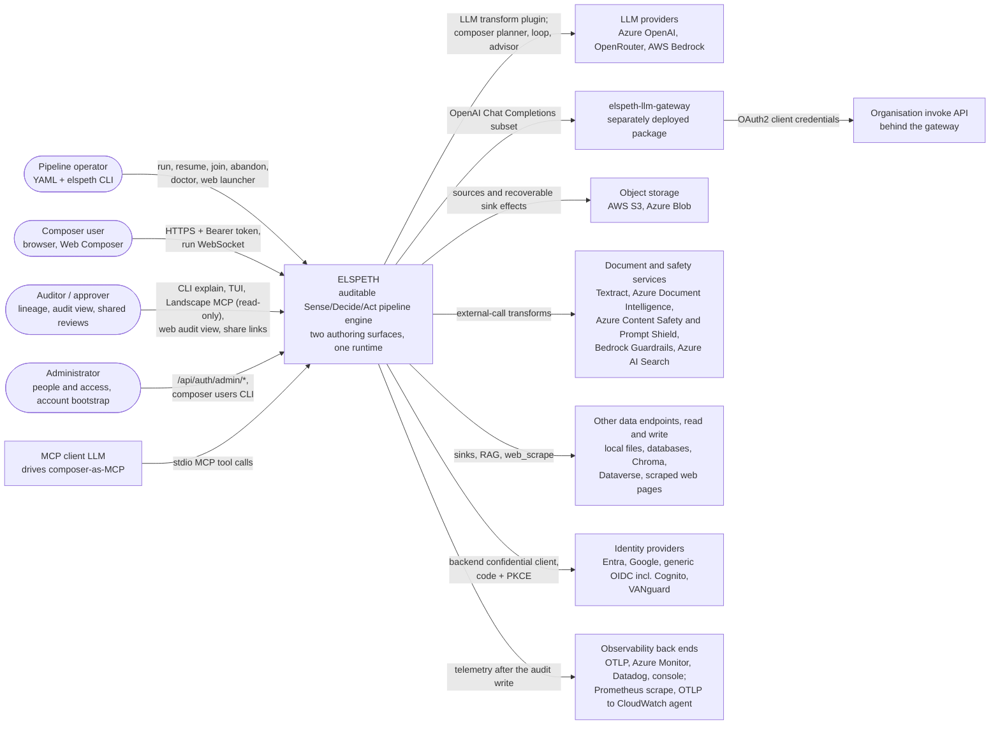
```mermaid
flowchart LR
    %% src: actors - operator [S09 §Public interface / entry points]; composer user [S18 §Authentication model: three stores, one token]
    %% src: auditor [S09 §Landscape MCP server; S15 §Public interface route 44; S19 §Shareable reviews]; admin [S18 §Key components people_routes; S09 CLI table composer users]
    OP(["Pipeline operator<br/>YAML + elspeth CLI"])
    CU(["Composer user<br/>browser, Web Composer"])
    AU(["Auditor / approver<br/>lineage, audit view, shared reviews"])
    AD(["Administrator<br/>people and access, account bootstrap"])

    EL["ELSPETH<br/>auditable Sense/Decide/Act pipeline engine<br/>two authoring surfaces, one runtime"]

    %% src: LLM providers [01 §3]; gateway [S25 §Responsibility; S25 §Gateway request flow]
    LLM["LLM providers<br/>Azure OpenAI, OpenRouter, AWS Bedrock"]
    GW["elspeth-llm-gateway<br/>separately deployed package"]
    UP["Organisation invoke API<br/>behind the gateway"]
    %% src: storage and sinks [S07 §Sink boundary effect capability matrix]; doc and safety services [S08 §Registered transforms]
    STO["Object storage<br/>AWS S3, Azure Blob"]
    DOC["Document and safety services<br/>Textract, Azure Document Intelligence,<br/>Azure Content Safety and Prompt Shield,<br/>Bedrock Guardrails, Azure AI Search"]
    DST["Other data endpoints, read and write<br/>local files, databases, Chroma,<br/>Dataverse, scraped web pages"]
    %% src: IdPs [S18 §Authentication model: three stores, one token]; Cognito as OIDC in ECS Scenario B [S20 §Deploy bundles]
    IDP["Identity providers<br/>Entra, Google, generic OIDC incl. Cognito,<br/>VANguard"]
    %% src: exporters [S09 §Telemetry]; operator metrics [S20 §Key components operator_telemetry]
    OBS["Observability back ends<br/>OTLP, Azure Monitor, Datadog, console;<br/>Prometheus scrape, OTLP to CloudWatch agent"]
    MCPC["MCP client LLM<br/>drives composer-as-MCP"]

    OP -->|"run, resume, join, abandon,<br/>doctor, web launcher"| EL
    CU -->|"HTTPS + Bearer token,<br/>run WebSocket"| EL
    AU -->|"CLI explain, TUI, Landscape MCP (read-only),<br/>web audit view, share links"| EL
    AD -->|"/api/auth/admin/*,<br/>composer users CLI"| EL
    MCPC -->|"stdio MCP tool calls"| EL
    EL -->|"LLM transform plugin;<br/>composer planner, loop, advisor"| LLM
    EL -->|"OpenAI Chat Completions subset"| GW
    GW -->|"OAuth2 client credentials"| UP
    EL -->|"sources and recoverable sink effects"| STO
    EL -->|"external-call transforms"| DOC
    EL -->|"sinks, RAG, web_scrape"| DST
    EL -->|"backend confidential client,<br/>code + PKCE"| IDP
    EL -->|"telemetry after the audit write"| OBS
```

**What this shows.** Every human role that has its own entry point, and every
family of external system ELSPETH calls. The four roles map to measured entry
points: the CLI verbs [S09 §Public interface / entry points], the
authenticated SPA [S21 §Auth and credential custody], the read-only Landscape
MCP server and the web audit view [S09 §Landscape MCP server; S15 §Public
interface], and the admin routes and `composer users` CLI [S18 §Key
components; S09 §Public interface / entry points]. The gateway is external
because it is a separate package that ELSPETH reaches over HTTP
[S25 §Responsibility]. Telemetry is drawn after the audit write because
audit primacy holds at the five sampled sites [X2b §B1].

**What it omits.** Deployment platforms (see §7), the composer's own
provider choice per call, and the transport of each source and sink. The
composer calls LLMs through a LiteLLM transport that lives inside
`composer/service.py` [S10 §Key components], which is not drawn as a separate
system.

**Annotations (verified concerns on this view).**

- `elspeth web` overwrites an SSO provider configured only through the
  environment with its `--auth` default, `local`. On ACA production (Entra)
  boot fails closed and the container crash-loops; on ECS upgrade mode (OIDC)
  the task boots silently on local auth with open registration behind an
  internet-facing ALB [K103, High].
- The gateway sidecar in ECS Scenario C cannot start because the task
  definition supplies 7 of the 13 required configuration names [K123, High].
- Share-link recipient views are not audited [K102, Medium].
- Web-authored Jinja templates reach a sandbox with no CPU or memory bound
  [K062, High].

**Sources.** Actors: [S09 §Public interface / entry points], [S18 §Authentication
model: three stores, one token], [S15 §Public interface / entry points],
[S19 §Internal architecture], [S23 §Key components]. External systems:
[01 §3], [S07 §Sink boundary], [S08 §Registered transforms], [S18 §Authentication
model], [S09 §Telemetry], [S20 §Key components], [S25 §Responsibility].

---

## 2. C4 Level 2: containers, with the web tier decomposed

**Caption.** The baseline gives "Web app + Composer" one container box
[S13 §Baseline delta; 01 §8.1]. At the pin the web tier is 259,872 lines of
Python (53 % of production Python) plus 69,903 lines of **production**
TypeScript/TSX in 259 files; a further 132,755 lines in 338 files are frontend
tests and are not counted here [01 §2; measured: `git ls-files '*.ts' '*.tsx'`
under `web/frontend`, split by `.test`/`.spec` suffix and test directories].
This revision draws its real domains, from the X1 package buckets
[X1 §6] and the slice partition [00 §Slice partition]. The brief asked for the
two databases (Landscape and Sessions). The tree has a **third store**,
`auth.db`, a SQLite file that holds local credentials only
[S18 §Authentication model: three stores, one token], so it is drawn as well.

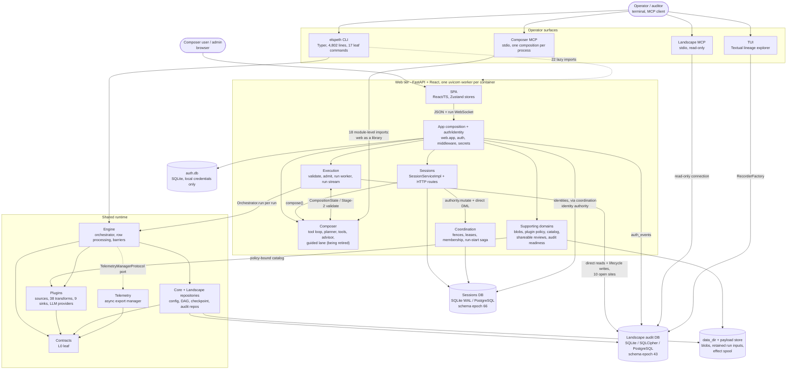
```mermaid
flowchart TB
    U(["Composer user / admin<br/>browser"])
    O(["Operator / auditor<br/>terminal, MCP client"])

    subgraph OPS["Operator surfaces"]
        CLI["elspeth CLI<br/>Typer, 4,802 lines, 17 leaf commands"]
        TUI["TUI<br/>Textual lineage explorer"]
        LMCP["Landscape MCP<br/>stdio, read-only"]
        CMCP["Composer MCP<br/>stdio, one composition per process"]
    end

    subgraph WEB["Web tier - FastAPI + React, one uvicorn worker per container"]
        SPA["SPA<br/>React/TS, Zustand stores"]
        APP["App composition + auth/identity<br/>web.app, auth, middleware, secrets"]
        COMP["Composer<br/>tool loop, planner, tools, advisor,<br/>guided lane (being retired)"]
        SESS["Sessions<br/>SessionServiceImpl + HTTP routes"]
        COORD["Coordination<br/>fences, leases, membership, run-start saga"]
        EXEC["Execution<br/>validate, admit, run worker, run stream"]
        SUP["Supporting domains<br/>blobs, plugin policy, catalog,<br/>shareable reviews, audit readiness"]
    end

    subgraph RT["Shared runtime"]
        ENG["Engine<br/>orchestrator, row processing, barriers"]
        PLG["Plugins<br/>sources, 38 transforms, 9 sinks, LLM providers"]
        CORE["Core + Landscape repositories<br/>config, DAG, checkpoint, audit repos"]
        CON["Contracts<br/>L0 leaf"]
        TEL["Telemetry<br/>async export manager"]
    end

    LDB[("Landscape audit DB<br/>SQLite / SQLCipher / PostgreSQL<br/>schema epoch 43")]
    SDB[("Sessions DB<br/>SQLite WAL / PostgreSQL<br/>schema epoch 66")]
    ADB[("auth.db<br/>SQLite, local credentials only")]
    FS[("data_dir + payload store<br/>blobs, retained run inputs,<br/>effect spool")]

    %% src: SPA to app [S21 §Run progress; S21 §Auth and credential custody]; routers [S18 §Startup ordering]
    U --> SPA
    SPA -->|"JSON + run WebSocket"| APP
    APP --> COMP & SESS & EXEC & SUP
    %% src: sessions routes call compose [S10 §Public interface / entry points]
    SESS -->|"compose()"| COMP
    %% src: three transaction models [S14 §Layering inside and around the slice]
    SESS -->|"authority.mutate + direct DML"| COORD
    SESS --> SDB
    COORD --> SDB
    %% src: execution <-> composer package cycle [X1 §6; K142]
    EXEC <-->|"CompositionState / Stage-2 validate"| COMP
    %% src: execution builds one Orchestrator per run [S05 §Public interface / entry points]
    EXEC -->|"Orchestrator.run per run"| ENG
    %% src: execution opens Landscape directly [S16 §Data & persistence]
    EXEC -->|"direct reads + lifecycle writes,<br/>10 open sites"| LDB
    %% src: three auth stores [S18 §Authentication model]
    APP --> ADB
    %% src: identity DML lives in coordination identity_authority [S14 §Why identity and SSO live in sessions]
    APP -->|"identities, via coordination<br/>identity authority"| SDB
    APP -->|"auth_events"| LDB
    SUP -->|"policy-bound catalog"| PLG
    %% src: engine ports and repos [S05 §Public interface; S09 §Telemetry]
    ENG --> PLG
    ENG --> CORE
    ENG -.->|"TelemetryManagerProtocol port"| TEL
    CORE --> LDB
    CORE --> FS
    SUP --> FS
    ENG & PLG & CORE & TEL --> CON
    %% src: operator surfaces [S09 §Internal architecture]; UI to web inversions [X1 §1.2; 01 §5.1]
    O --> CLI & TUI & LMCP & CMCP
    CLI --> ENG
    CLI -.->|"22 lazy imports"| WEB
    CMCP -->|"18 module-level imports:<br/>web as a library"| COMP
    LMCP -->|"read-only connection"| LDB
    TUI -->|"RecorderFactory"| LDB
```

**What this shows.** The web tier as seven domains rather than one box. Two
structural facts are visible:

- **Web talks to the Landscape by more routes than the baseline shows.**
  Execution opens the Landscape at 10 sites [S16 §Data & persistence], two
  sessions route modules read it directly [S15 §Where state lives], and auth
  audit writes `auth_events` [S18 §Authentication model]. The baseline has
  one "records evidence" edge [S15 §Baseline delta].
- **The CLI and the composer MCP server use the web package as a library.**
  The CLI has 22 lazy imports into web, and `composer_mcp` has 18
  module-level ones (17 into composer, execution, catalog and plugin policy,
  1 into the web root) [X1 §1.2; 01 §Validation corrections C8]. No layer
  rule governs either edge [K024].

**What it omits.** The frontend's internal structure (see [S21], [S22],
[S23]), the deployment and acceptance code [S20], and the per-domain
component detail (see §3). Edge counts are drawn only where a source measured
them.

**Annotations (verified concerns on this view).**

- The web packages form one package-level import cycle, but the module graph
  is acyclic [X1 §0; 01 §8.2]. Execution takes private `composer.state`
  helpers in 3 modules [K142, Medium].
- Session-table writes are split between `sessions/service.py` and
  `coordination/repository.py`, with private symbols crossing both ways
  [K034, Medium].
- `auth.db` is always a local SQLite file under `data_dir`, even in
  external-PostgreSQL mode; the replicated targets avoid this outside the
  application [K098, Low].
- *Catalog observation, not a verified cluster:* the sessions DB and the
  Landscape are two stores with no shared transaction. The run-start saga
  spans them [S17 §4. Cross-database run-start saga].

**Sources.** Web domains: [X1 §6], [00 §Slice partition], [01 §2]. Stores:
[S20 §Data & persistence] (epochs 66 and 43), [S18 §Authentication model],
[S16 §Data & persistence], [S03 §Key components]. Plugin counts: 38
transforms [S08 §Registered transforms], 9 sinks [S07 §Sink boundary]. CLI
size and verb count [S09 §Baseline delta]. One worker per container
[S18 §Concurrency model].

---
## 3. C4 Level 3: component diagrams

### 3a. Web composer: tool loop, tools, planner, advisor, state, validation authorities

**Caption.** One `ComposerServiceImpl` per app [S10 §Public interface / entry
points] routes each request to one of two surfaces. The **planner** runs only
when the state is structurally empty, the message classifies as
`EXPLICIT_MUTATION`, and there is no guided terminal; every other request goes
to the five-phase **compose loop** [S10 §Surface selection]. Both surfaces
reach the provider; the server validates, redacts, audits and gates, and
authors no structure except the sanctioned required-control splice
[X2b §B3; K023].

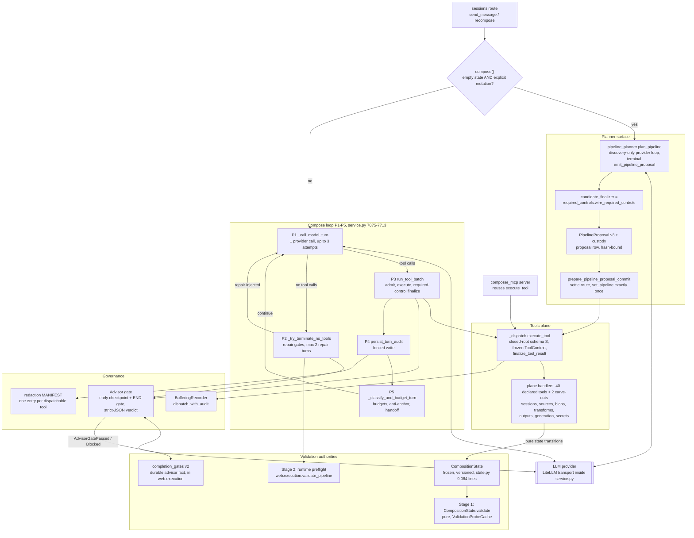
```mermaid
flowchart TD
    %% src: route entry [S15 §Request pipeline for a compose turn]
    RT["sessions route<br/>send_message / recompose"]
    %% src: surface selection [S10 §Surface selection]
    SEL{"compose()<br/>empty state AND explicit mutation?"}
    LLM[["LLM provider<br/>LiteLLM transport inside service.py"]]

    subgraph PLAN["Planner surface"]
        PL["pipeline_planner.plan_pipeline<br/>discovery-only provider loop,<br/>terminal emit_pipeline_proposal"]
        FIN["candidate_finalizer =<br/>required_controls.wire_required_controls"]
        PP["PipelineProposal v3 + custody<br/>proposal row, hash-bound"]
        CMT["prepare_pipeline_proposal_commit<br/>settle route, set_pipeline exactly once"]
    end

    subgraph LOOP["Compose loop P1-P5, service.py 7075-7713"]
        P1["P1 _call_model_turn<br/>1 provider call, up to 3 attempts"]
        P2["P2 _try_terminate_no_tools<br/>repair gates, max 2 repair turns"]
        P3["P3 run_tool_batch<br/>admit, execute, required-control finalize"]
        P4["P4 persist_turn_audit<br/>fenced write"]
        P5["P5 _classify_and_budget_turn<br/>budgets, anti-anchor, handoff"]
    end

    subgraph TOOLS["Tools plane"]
        DSP["_dispatch.execute_tool<br/>closed-root schema S, frozen ToolContext,<br/>finalize_tool_result"]
        PLN["plane handlers: 40 declared tools + 2 carve-outs<br/>sessions, sources, blobs, transforms,<br/>outputs, generation, secrets"]
    end

    subgraph GOV["Governance"]
        ADV["Advisor gate<br/>early checkpoint + END gate,<br/>strict-JSON verdict"]
        RED["redaction MANIFEST<br/>one entry per dispatchable tool"]
        BR["BufferingRecorder<br/>dispatch_with_audit"]
    end

    subgraph VAL["Validation authorities"]
        ST["CompositionState<br/>frozen, versioned, state.py 9,064 lines"]
        V1["Stage 1: CompositionState.validate<br/>pure, ValidationProbeCache"]
        V2["Stage 2: runtime preflight<br/>web.execution.validate_pipeline"]
        CG["completion_gates v2<br/>durable advisor fact, in web.execution"]
    end

    MCP["composer_mcp server<br/>reuses execute_tool"]

    RT --> SEL
    SEL -->|"yes"| PL
    SEL -->|"no"| P1
    PL <--> LLM
    PL --> FIN --> PP --> CMT
    %% src: settle route replays set_pipeline via dispatch_with_audit [S12 §B. Proposal to commit]
    CMT --> DSP
    P1 <--> LLM
    P1 -->|"tool calls"| P3
    P1 -->|"no tool calls"| P2
    P2 -->|"repair injected"| P1
    P2 --> ADV
    ADV <--> LLM
    P3 --> DSP --> PLN
    PLN -->|"pure state transitions"| ST
    P3 --> ADV
    P3 --> P4 --> P5
    P5 -->|"continue"| P1
    P4 --> RED
    DSP --> BR
    ST --> V1
    P2 --> V2
    ADV -->|"AdvisorGatePassed / Blocked"| CG
    MCP --> DSP
```

**What this shows.**

- **The two surfaces and the five loop phases** [S10 §The compose loop].
  P2 runs the correctness repairs (interpretation, missing review, uploaded
  blob, proof, runtime preflight) before the END advisor gate, and all of them
  share `_MAX_REPAIR_TURNS = 2` [S10 §The compose loop].
- **The tools plane is a registry of pure handlers.** Tool handlers take a
  `CompositionState` and return a new one; there is no mutable registry state,
  and 40 `ToolDeclaration`s plus 2 inline carve-outs are dispatched through the
  closed-root schema S [S11 §Key components; S11 §Internal architecture].
- **The advisor gate** admits only a strict-JSON verdict, maps flagged,
  unavailable and malformed outcomes to closed causes, and stores its durable
  fact as `composer_meta.completion_gates` v2 in `web.execution`, not in the
  composer [S12 §A. Advisor END gate].
- **Two validation authorities.** Stage 1 is a pure function of the state;
  Stage 2 is the runtime-equivalent preflight, cached by scope, version,
  content hash, settings hash and snapshot [S10 §Validation stages].
  Auto-commit needs a green Stage 2 [S10 §Validation stages].
- **Audit path.** Every tool call is redacted through `MANIFEST` and persisted
  once per round under an exact session-operation fence [S12 §D. Composer
  audit write path].

**What it omits.** Interpretation-review surfacing, the runtime-preflight
coordinator, the guided planner arms (see §8), provider quota custody, and
progress events. The advisor code is drawn as one component, but about 2,878
lines of it still sit inside `service.py` [S10 §service.py decomposition].

**Annotations (verified concerns).**

- **Stage 1 hand-mirrors the core DAG walks**, so parity between the two
  validation authorities is held by comments and a manifest [K002, Medium].
- **Required-control splice.** `wire_required_controls` inserts
  server-authored control transforms at exactly five call sites; an operator
  ticket sanctions it, but AGENTS.md wording names only "admission gates"
  [K023, Low; X2b §B3].
- `service.py` fuses six responsibilities [K074, Medium]; very large single
  functions include `_check_schema_contracts` (2,779 lines) and
  `run_tool_batch` (2,028) [K075, Medium]; `tools/_common.py` is a 3,971-line
  sink mixing at least 8 responsibilities [K079, Medium].
- A profile-only `azure_ai_search` node fails the raw
  `CompositionState.validate()` construction probe, because only `llm` has an
  inert probe stub. The profile-aware re-validation at the dispatch boundary
  hides this from web authors, but consumers that still call raw
  `state.validate()` never surface the source-data-contract review and pay a
  runtime preflight on prose-only turns [K001, Medium].
- Recovery handlers can erase a blocked advisor fact by reading the moving
  head [K007, Medium].
- The composer MCP server hand-mirrors the audit envelope and binds to
  composer internals [K071, Medium].

**Sources.** [S10 §Key components], [S10 §Surface selection], [S10 §The compose
loop], [S10 §Validation stages], [S10 §Planner], [S11 §Key components], [S11
§Internal architecture], [S12 §Key components], [S12 §A. Advisor END gate],
[S12 §B. Proposal to commit], [S12 §C. Required-control auto-wire], [S12 §D.
Composer audit write path], [S09 §Composer MCP server].

---

### 3b. Sessions and coordination: the authority stack

**Caption.** Adapted from the S14 layering diagram [S14 §Layering inside and
around the slice], extended with the S17 authorities [S17 §Internal
architecture]. `SessionServiceImpl` is a facade over **three
transaction-ownership models** (plus a pair-lock variant for fork): the
coordination authority owns the transaction (`authority.mutate`), the service
owns it and proves the fence itself, or a guided mutation transaction owns it
[S14 §SessionServiceImpl decomposition; K083].

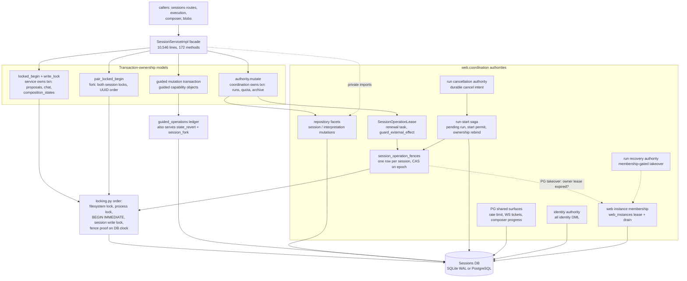
```mermaid
flowchart TD
    %% src: callers [S14 §Layering inside and around the slice]
    CALL["callers: sessions routes, execution,<br/>composer, blobs"]
    SVC["SessionServiceImpl facade<br/>10,546 lines, 172 methods"]

    subgraph TXN["Transaction-ownership models"]
        M1["authority.mutate<br/>coordination owns txn: runs, quota, archive"]
        M2["locked_begin + write_lock<br/>service owns txn: proposals, chat,<br/>composition_states"]
        M3["guided mutation transaction<br/>guided capability objects"]
        M4["pair_locked_begin<br/>fork: both session locks, UUID order"]
    end

    LOCK["locking.py order:<br/>filesystem lock, process lock,<br/>BEGIN IMMEDIATE, session write lock,<br/>fence proof on DB clock"]

    subgraph COORD["web.coordination authorities"]
        FEN["session_operation_fences<br/>one row per session, CAS on epoch"]
        LEA["SessionOperationLease<br/>renewal task, guard_external_effect"]
        FAC["repository facets<br/>session / interpretation mutations"]
        MEM["web instance membership<br/>web_instances lease + drain"]
        SAGA["run-start saga<br/>pending run, start permit, ownership rebind"]
        CAN["run cancellation authority<br/>durable cancel intent"]
        REC["run recovery authority<br/>membership-gated takeover"]
        SHR["PG shared surfaces<br/>rate limit, WS tickets, composer progress"]
        IDA["identity authority<br/>all identity DML"]
    end

    GL["guided_operations ledger<br/>also serves state_revert + session_fork"]
    SDB[("Sessions DB<br/>SQLite WAL or PostgreSQL")]

    CALL --> SVC
    SVC --> M1 & M2 & M3 & M4
    M1 --> FAC
    M1 --> LEA
    M2 --> LOCK
    M3 --> GL
    M4 --> LOCK
    %% src: facets imported privately both ways [K034]
    SVC -.->|"private imports"| FAC
    LEA --> FEN
    FEN --> LOCK
    %% src: PG takeover reads only owner lease_expires_at [S17 §3. Membership and the multi-replica rule]
    FEN -.->|"PG takeover: owner lease expired?"| MEM
    REC -.-> MEM
    SAGA --> FEN
    CAN --> SAGA
    LOCK --> SDB
    FAC --> SDB
    GL --> SDB
    SAGA --> SDB
    SHR --> SDB
    IDA --> SDB
    MEM --> SDB
```

**What this shows.**

- **The fence is the only cross-replica serialiser.** Every session writer
  takes a per-process lock *and* a durable lease that fails fast with a 409
  [S15 §Request pipeline for a compose turn]. On PostgreSQL an expired
  operation lease held by a live process still conflicts, because takeover
  requires the owner's `web_instances` lease to have expired
  [S17 §1. The session-operation fence].
- **Lock order** is filesystem lock, then process lock, then `BEGIN
  IMMEDIATE`, then the session write lock, then a fence proof on the database
  clock [S14 §Lock and fence order].
- **The run-start saga** spans the Sessions DB and the Landscape, and run
  ownership *is* the session EXECUTE fence; there is no independent run fence
  [S17 §4. Cross-database run-start saga].
- **The guided ledger is shared infrastructure.** Freeform fork and state
  revert run on it [K012, Medium].

**What it omits.** Interpretation-event and proposal state machines
[S14 §State machines], archive quarantine [S14 §State machines], blob custody
[S19 §Blob custody], and the approval, review and library authorities
[S18 §Startup ordering].

**Annotations (verified concerns).**

- `SessionServiceImpl` god object on three transaction models [K083, Medium];
  session-table DML split across two packages with private imports both ways
  [K034, Medium].
- PostgreSQL lock-order deadlock between WS ticket / progress writers and
  provider-attempt admission, with no 40P01 handling [K005, Medium].
- A cancel after the permit whose output finalisation fails is invisible to
  recovery [K006, Medium].
- No runtime compatibility check between peers: the `web_instances`
  epoch/protocol columns are written but never read [K093, Medium]. The
  exposure is narrower than that: a session or landscape epoch mismatch is
  caught at process start by the schema-identity check against the shared
  database, so only a `coordination_protocol` bump with no schema change is
  unguarded, and that case is latent while the protocol is still v1 [K093].
- At least seven Sessions-DB clock implementations (the cluster title says
  six): three convert aware timestamps to UTC and four stamp them unconverted
  [K094, Medium].
- Coordination protocol v1 declares `cleanup_claim`, which has nothing behind
  it, and `run_ownership_fence`, whose typed contract is dead code although
  run ownership itself is implemented through session-operation fences
  [K092, Low].

**Sources.** [S14 §SessionServiceImpl decomposition], [S14 §Layering inside and
around the slice], [S14 §Lock and fence order], [S14 §Why identity and SSO live
in sessions], [S17 §1–§5], [S15 §Request pipeline for a compose turn], [S13
§Data & persistence].

---

### 3c-i. Engine: orchestration

**Caption.** The `Orchestrator` facade wires 11 collaborators in `__init__`,
and each owns one phase; public `run`, `resume` and `join_run` each delegate to
exactly one coordinator [S05 §Composition]. The web tier hosts only leaders;
followers exist only through `elspeth join` [S05 §Multi-worker shape].

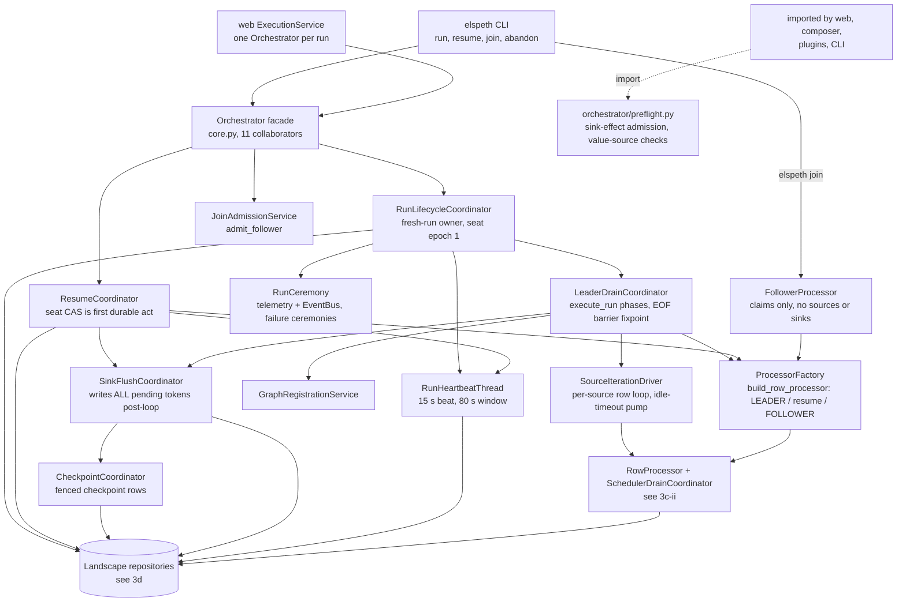
```mermaid
flowchart TD
    %% src: callers [S05 §Public interface / entry points]
    CLI["elspeth CLI<br/>run, resume, join, abandon"]
    WEX["web ExecutionService<br/>one Orchestrator per run"]
    OR["Orchestrator facade<br/>core.py, 11 collaborators"]

    RL["RunLifecycleCoordinator<br/>fresh-run owner, seat epoch 1"]
    RS["ResumeCoordinator<br/>seat CAS is first durable act"]
    JA["JoinAdmissionService<br/>admit_follower"]
    LD["LeaderDrainCoordinator<br/>execute_run phases, EOF barrier fixpoint"]
    SI["SourceIterationDriver<br/>per-source row loop, idle-timeout pump"]
    PF["ProcessorFactory<br/>build_row_processor: LEADER / resume / FOLLOWER"]
    SF["SinkFlushCoordinator<br/>writes ALL pending tokens post-loop"]
    CK["CheckpointCoordinator<br/>fenced checkpoint rows"]
    CE["RunCeremony<br/>telemetry + EventBus, failure ceremonies"]
    GR["GraphRegistrationService"]
    HB["RunHeartbeatThread<br/>15 s beat, 80 s window"]
    PRE["orchestrator/preflight.py<br/>sink-effect admission, value-source checks"]
    FP["FollowerProcessor<br/>claims only, no sources or sinks"]
    RP["RowProcessor + SchedulerDrainCoordinator<br/>see 3c-ii"]
    LS[("Landscape repositories<br/>see 3d")]
    EXT["imported by web, composer,<br/>plugins, CLI"]

    CLI & WEX --> OR
    OR --> RL & RS & JA
    RL --> LD
    %% src: resume runs its own loop, then EOF fixpoint + sink flush [S05 §Resume / recovery step 9]
    RS --> SF
    LD --> SI & GR & SF
    SI --> RP
    PF --> RP
    LD --> PF
    RS --> PF
    RL & RS --> HB
    RL --> CE
    SF --> CK
    %% src: preflight.py importers [S05 §Public interface / entry points]
    EXT -.->|"import"| PRE
    %% src: follower path is CLI-only [S05 §Multi-worker shape]
    CLI -->|"elspeth join"| FP
    FP --> PF
    RL & RS & CK & SF & HB --> LS
    RP --> LS
```

**What this shows.** The phase decomposition behind the facade [S05
§Composition], the three RowProcessor build modes from one factory
[S05 §Key components processor_factory], the leader-only heartbeat and seat
mechanics [S05 §Multi-worker shape], and `preflight.py` as a module that web,
composer, plugins and CLI all import [S05 §Key components preflight].

**What it omits.** Export and audit-export effects, abandon, the run-status
derivation, schema reconstruction for typed resume, and the spans factory
[S05 §Key components]. The fresh-run sequence is in §5b and resume is in §5c.

**Annotations (verified concerns).**

- Every sink-bound token is held in memory in `pending_tokens` until the
  source loop ends [K049, Medium].
- Followers run without the expand-width fence [K047, Medium] and never retry
  [K048, Medium], because `build_follower_processor` passes `settings=None`.
- Follower wiring is hand-assembled in `cli.py` outside `RunContextFactory`
  [K050, Low].
- A PostgreSQL follower join is not refused [K137, Low].
- *Catalog observation, not a verified cluster:* the facade passes bound
  methods at call time so monkeypatches still intercept them, a production
  concession to tests [S05 §Composition].

**Sources.** [S05 §Key components], [S05 §Public interface / entry points],
[S05 §Composition], [S05 §Multi-worker shape], [S05 §Concurrency model].

---

### 3c-ii. Engine: row processing, executors, barrier family, sink effects

**Caption.** `RowProcessor` builds the executors and coordinators and hands
three shared mutable structures to them by reference; concurrency is
inter-process (leader and follower workers fenced in the DB) plus intra-row
(row-pipelined batch transforms and the sink-effect heartbeat thread)
[S06 §Object graph and construction].

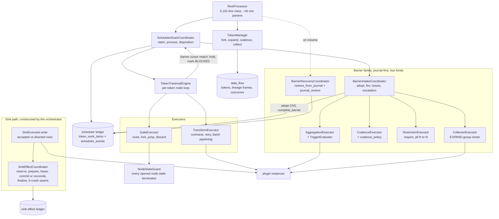
```mermaid
flowchart TD
    %% src: object graph [S06 §Object graph and construction]
    RP["RowProcessor<br/>5,161-line class, ~40 ctor params"]
    DR["SchedulerDrainCoordinator<br/>claim, process, disposition"]
    TT["TokenTraversalEngine<br/>per-token node loop"]
    TM["TokenManager<br/>fork, expand, coalesce, collect"]
    NSG["NodeStateGuard<br/>every opened node state terminates"]

    subgraph EXE["Executors"]
        TX["TransformExecutor<br/>contracts, retry, batch pipelining"]
        GT["GateExecutor<br/>route, fork, jump, discard"]
    end

    subgraph BAR["Barrier family: journal-first, four kinds"]
        AG["AggregationExecutor<br/>+ TriggerEvaluator"]
        CO["CoalesceExecutor<br/>+ coalesce_policy"]
        RU["RowUnionExecutor<br/>require_all N to N"]
        CL["CollectorExecutor<br/>EXPAND-group closer"]
        BI["BarrierIntakeCoordinator<br/>adopt, fire, losses, escalation"]
        BRC["BarrierRecoveryCoordinator<br/>restore_from_journal + journal_restore"]
    end

    subgraph SNK["Sink path, constructed by the orchestrator"]
        SE["SinkExecutor.write<br/>accepted vs diverted rows"]
        SEC["SinkEffectCoordinator<br/>reserve, prepare, lease, commit or reconcile,<br/>finalize, 9 crash seams"]
    end

    SCH[("scheduler ledger<br/>token_work_items + scheduler_events")]
    DF[("data_flow<br/>tokens, lineage frames, outcomes")]
    SEL[("sink-effect ledger")]
    PLG["plugin instances"]

    RP --> DR --> TT
    DR --> BI
    RP -.->|"on resume"| BRC
    TT --> TX & GT
    TT -->|"barrier cursor match: hold, mark BLOCKED"| DR
    %% src: GateExecutor opens a NodeStateGuard [K051]
    GT --> NSG
    TX --> PLG
    BI --> AG & CO & RU & CL
    AG & CL --> PLG
    RP --> TM
    TM --> DF
    DR --> SCH
    BI -->|"adopt CAS, complete_barrier"| SCH
    BRC --> SCH
    SE --> SEC --> SEL
    SE --> PLG
```

**What this shows.**

- **Journal-first barriers.** All four barrier kinds share one protocol:
  arrive and record nothing durable, get adopted by the leader's next intake
  pass through a CAS, fire in one atomic `complete_barrier` transaction, record
  losses before notifying anyone, and restore from the journal on resume
  [S06 §Barrier family].
- **Per-node dispatch order** is barrier checks, structural skip, a nominal
  `isinstance(plugin, GateSettings)` split, and the transform arm
  [S06 §Traversal state machine].
- **Sink effects** run reserve, prepare, lease with a heartbeat thread at
  TTL/3, commit or reconcile, then an atomic finalize; capability dispatch is
  nominal on concrete classes [S06 §Sink effect coordinator].

**What it omits.** Declaration-contract dispatch (pass-through, declared
output fields, can-drop-rows, schema-config mode) [S06 §Key components], the
batch adapter, the DAG navigator, and per-kind durable-memory differences
(tabulated in [S06 §Barrier family]).

**Annotations (verified concerns).**

- **`GateExecutor` opens its `NodeStateGuard` at attempt 0**, ignoring resume
  and claim offsets; the UNIQUE collision aborts crash recovery (reproduced end
  to end at the pin) [K051, High].
- A crash between the collector flush and `complete_barrier` is unrecoverable,
  because the collector has no residual receipt [K052, Medium].
- `CollectorExecutor.notify_empty_group` has no production caller [K053,
  Medium]; the collector closer runs no declaration-contract dispatch, unlike
  the aggregation flush for the same batch plugins [K132, Medium].
- RowProcessor god-class residue: extracted engines reach 33 private members
  [K055, Medium].
- 11 batch-aware plugins still raise `TypeError` on a wrong-type row value,
  aborting the run [K063, High].
- `TransformResult.error(retryable=True)` is inert [K065, Medium].

**Sources.** [S06 §Key components], [S06 §Object graph and construction], [S06
§Traversal state machine], [S06 §Barrier family], [S06 §Token identity through
fork, expand, coalesce, and collect], [S06 §Sink effect coordinator].

---

### 3d-i. Landscape: composition root and repositories

**Caption.** Adapted from the S03 composition-root diagram
[S03 §Composition root]. `LandscapeDB` opens, configures and validates the
engine, then `RecorderFactory` builds a writable graph and a parallel
read-only graph of repositories [S03 §Composition root].

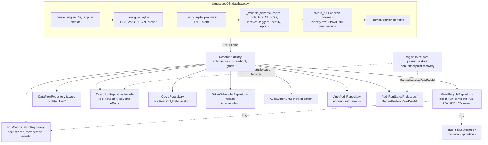
```mermaid
flowchart TD
    subgraph Open["LandscapeDB, database.py"]
        E["create_engine / SQLCipher creator"] --> C["_configure_sqlite: PRAGMAs, BEGIN listener"]
        C --> P["_verify_sqlite_pragmas: Tier-1 probe"]
        P --> V["_validate_schema: shape, cols, FKs, CHECKs,<br/>indexes, triggers, identity, epoch"]
        V --> K["create_all + additive indexes +<br/>identity row + PRAGMA user_version"]
        K --> J["journal.recover_pending"]
    end
    Open -->|"Tier1Engine"| F["RecorderFactory<br/>writable graph + read-only graph"]
    F --> RL["RunLifecycleRepository<br/>begin_run, complete_run, ABANDONED sweep"]
    F --> DF["DataFlowRepository facade<br/>to data_flow/*"]
    F --> EX["ExecutionRepository facade<br/>to execution/*, incl. sink effects"]
    F --> Q["QueryRepository<br/>via ReadOnlyDatabaseOps"]
    F --> SCH["TokenSchedulerRepository facade<br/>to scheduler/*"]
    F --> RC["RunCoordinationRepository<br/>seat, fences, membership, events"]
    F --> AE["AuditExportSnapshotRepository"]
    F --> AA["AuthAuditRepository<br/>non-run auth_events"]
    F --> PS["AuditRunStatusProjection /<br/>BarrierRestoreReadModel"]
    RL -.->|"lazy"| RC
    RL -.->|"lazy"| OUT["data_flow.outcomes /<br/>execution.operations"]
    %% src: engine deep imports bypass the facades [S04 §Public interface / entry points]
    ENG["engine executors, journal_restore,<br/>core.checkpoint.recovery"]
    ENG -.->|"deep imports bypass facades"| EX
    ENG -.->|"BarrierRestoreReadModel"| PS
```

**What this shows.** The open sequence (engine, PRAGMAs, probe, schema
validation, create and stamp, journal recovery), the 47-table schema behind it
(`SQLITE_SCHEMA_EPOCH = 43`) [S03 §Key components], and the repositories.
The scheduler and coordination repositories are not constructed on a
read-only handle [S03 §Composition root].

**What it omits.** The transaction model per dialect [S03 §Transaction and
concurrency model], the ADR-047 clock and deadline machinery [S03 §ADR-047
clock and deadline machinery], and the model loaders.

**Annotations (verified concerns).**

- The facade migration has stalled: `ExecutionRepository` is not the pure
  facade its docstring claims (`complete_aggregation_result` holds 356 lines
  of SQL) [K042, Low].
- The status vocabularies and terminal rules on `token_outcomes`,
  `node_states`, `batches` and `operations` have no DB CHECK; Python enforces
  them on write and on read [K026, Medium].
- `batch_outputs` is created and validated but never written or read [K041,
  Low].
- The audit-store baseline (epoch and table counts, component list) is stale
  [K027, Low].

**Sources.** [S03 §Key components], [S03 §Composition root], [S03 §Public
interface and entry points], [S04 §Public interface / entry points].

---

### 3d-ii. Landscape: ledgers, journal and export

**Caption.** The three sub-packages behind the facades hold the durable token
scheduler, the sink-effect ledger and the data-flow lineage. Every mutation
takes a leader `CoordinationToken` or a member `WorkerMembershipToken`, and
its first database effect is the matching fence [S04 §Public interface / entry
points].

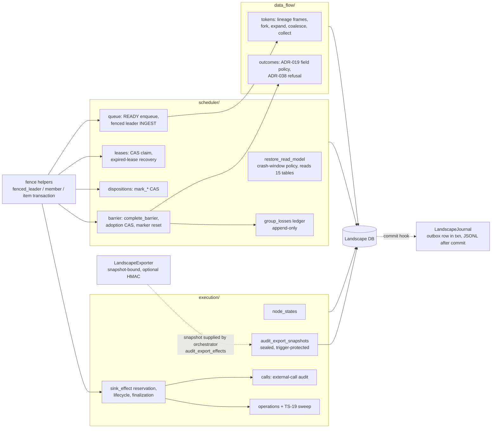
```mermaid
flowchart LR
    %% src: fences [S04 §Public interface / entry points]
    FEN["fence helpers<br/>fenced_leader / member / item transaction"]

    subgraph SC["scheduler/"]
        Q["queue: READY enqueue,<br/>fenced leader INGEST"]
        LE["leases: CAS claim,<br/>expired-lease recovery"]
        DI["dispositions: mark_* CAS"]
        BA["barrier: complete_barrier,<br/>adoption CAS, marker reset"]
        GLS["group_losses ledger<br/>append-only"]
        RRM["restore_read_model<br/>crash-window policy, reads 15 tables"]
    end

    subgraph EXC["execution/"]
        NS["node_states"]
        CA["calls: external-call audit"]
        SER["sink_effect reservation,<br/>lifecycle, finalization"]
        OPS["operations + TS-19 sweep"]
        AES["audit_export_snapshots<br/>sealed, trigger-protected"]
    end

    subgraph DFL["data_flow/"]
        TK["tokens: lineage frames,<br/>fork, expand, coalesce, collect"]
        OC["outcomes: ADR-019 field policy,<br/>ADR-038 refusal"]
    end

    JR["LandscapeJournal<br/>outbox row in txn, JSONL after commit"]
    EXP["LandscapeExporter<br/>snapshot-bound, optional HMAC"]
    LDB[("Landscape DB")]

    FEN --> Q & LE & DI & BA & SER
    Q --> TK
    BA --> OC
    BA --> GLS
    SER --> CA
    SER --> OPS
    SC & EXC & DFL --> LDB
    LDB -.->|"commit hook"| JR
    %% src: production caller supplies a snapshot-bound read model [S03 §Export pipeline; S04 §Public interface / entry points]
    EXP -.->|"snapshot supplied by orchestrator<br/>audit_export_effects"| AES
    AES --> LDB
```

**What this shows.** Where each ledger's state lives and how writes are
fenced [S04 §Key components]; the journal's capture, precommit outbox row and
postcommit drain [S03 §Journal outbox]; and the exporter binding one immutable
snapshot per public call [S03 §Export pipeline]. The scheduler and
sink-effect state machines are in §6.

**What it omits.** Per-table writer ownership [S04 §Data & persistence] and the
lock-order rules per dialect [S04 §Durable token scheduler].

**Annotations (verified concerns).**

- The "complete" audit export omits `run_sources`, coalesce and aggregation
  receipts, coordination and worker ledgers, preflight results and run-start
  admissions; the DB still holds them [K040, Medium].
- When the opt-in JSONL journal is on, the postcommit drain runs inside the
  patched `do_commit`, so an error there reports a failed commit for data that
  did commit (reproduced at the pin) [K043, Medium].
- Barrier adoption and marker reset write no `scheduler_events` row, so
  ADR-026's "records every transition" wording has drifted [K044, Medium].
- `SourceCompletionReconciler` repairs an image no current path produces
  [K046, Low].

**Sources.** [S04 §Key components], [S04 §Public interface / entry points], [S04
§Durable token scheduler], [S04 §Sink-effect ledger], [S04 §Data flow], [S03
§Journal outbox], [S03 §Export pipeline].

---

## 4. Measured package dependency graph

Both diagrams are adapted from the X1 package diagram [X1 §6], which counts
import-time (module-level) import statements from an AST walk of the pin
[X1 §2.1]. X1's single diagram (26 nodes, 35 edges) is split here into a
layer view and a package-cycle view so each stays readable. The edge counts
are X1's; nothing was re-measured for this document.

### 4a. Layer view: the enforced boundary and the unenforced top layer

**Caption.** The only machine-enforced layering is
`contracts (L0) < core (L1) < engine (L2) < everything else (L3)`, checked by
the `trust_tier.tier_model` rule `L1`, which also covers lazy imports and
reports 0 findings at the pin with working mutation controls [X1 §0 item 6;
X1 §5.1]. The rule skips L3 files entirely, so plugins, telemetry, the web
tier and every operator surface have no general import-direction gate
[K024, Medium].

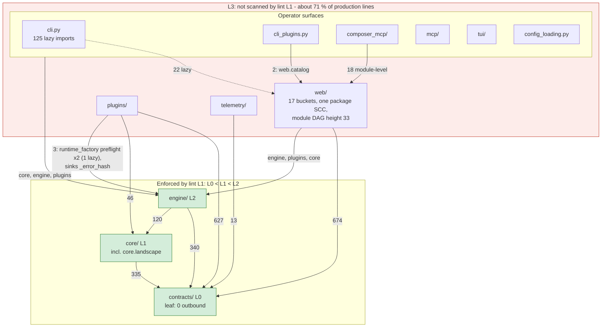
```mermaid
flowchart TB
    subgraph L3["L3: not scanned by lint L1 - about 71 % of production lines"]
        subgraph UI["Operator surfaces"]
            cli["cli.py<br/>125 lazy imports"]
            clip["cli_plugins.py"]
            cmcp["composer_mcp/"]
            mcp["mcp/"]
            tui["tui/"]
            cfgl["config_loading.py"]
        end
        WEB["web/<br/>17 buckets, one package SCC,<br/>module DAG height 33"]
        PLUG["plugins/"]
        tel["telemetry/"]
    end

    subgraph ENF["Enforced by lint L1: L0 < L1 < L2"]
        eng["engine/ L2"]
        CORE["core/ L1<br/>incl. core.landscape"]
        con["contracts/ L0<br/>leaf: 0 outbound"]
    end

    %% src: layer edge counts [X1 §6 edge-count sources]
    CORE -->|"335"| con
    eng -->|"340"| con
    eng -->|"120"| CORE
    PLUG -->|"627"| con
    PLUG -->|"46"| CORE
    %% src: plugins to engine edges [X1 §1.2]; adjudicated PERMITTED [S07 §Adjudication 1]
    PLUG -->|"3: runtime_factory preflight x2 (1 lazy),<br/>sinks _error_hash"| eng
    tel -->|"13"| con
    UI -->|"core, engine, plugins"| eng
    WEB -->|"674"| con
    WEB -->|"engine, plugins, core"| eng
    %% src: UI to web inversions [X1 §1.2; 01 §Validation corrections C8]
    clip -->|"2: web.catalog"| WEB
    cmcp -->|"18 module-level"| WEB
    cli -.->|"22 lazy"| WEB

    classDef enforced fill:#d4edda,stroke:#2e7d32
    class eng,CORE,con enforced
    style L3 fill:#fdecea,stroke:#c0392b
```

**Key.** Green fill = packages scanned by lint L1; red-tinted box = the L3
region the rule skips.

**What this shows.**

- **The lower layers hold as designed.** `contracts` has 0 outbound edges of
  any kind; `core` imports nothing from engine, plugins or web; `engine`
  imports nothing from plugins, web or the CLI [X1 §1.2; 01 §5.1].
- **The plugins-to-engine edges are a documentation disagreement, not a
  violation.** ADR-006 and the lint place plugins above engine, so the three
  edges are legal there; the ARCHITECTURE.md dependency graph draws engine and
  plugins as peers with no edge between them [X1 §1.1]. S07 adjudicated the
  edges as PERMITTED under ADR-006 [S07 §Adjudication 1], while X1 lists the
  model disagreement itself as undecided and recommends documenting it
  [X1 §7 R10]. Both are recorded here; neither source is overruled.
- **The top layer has no position in either baseline document.** Neither
  ARCHITECTURE.md nor ADR-006 places the web tier, the composer MCP server or
  the CLI-to-web relationship, and the lint lumps them all into L3
  [X1 §1.1]. `web/` is absent from the intended dependency graph although it is
  53 % of production Python [X1 §1.1].
- **`plugins → web` is unguarded**, with 0 edges today [X1 §5.2].

**What it omits.** Intra-package cycles (see 4b), lazy and TYPE_CHECKING
edges except the CLI's 22 lazy web imports, and the frontend, whose own
import graph has a 21-bucket runtime SCC and no boundary lint [K110, Medium].

**Annotations (verified concerns).**

- The L1 rule runs inside the deliberately red trust-tier job. On push CI it
  is never evaluated, because the step exits 2 while loading the allowlist
  before the layer scan; on a PR it runs, but on a standing corpus of about
  2,280 findings, so a new L1 finding would not change the result [K119,
  Medium]. The red state itself is deliberate and fail-closed [01 §7].
- *Cross-cut observation, not a verified cluster:* L1 keys layer membership
  on the top-level path segment, so any module at `src/elspeth/*.py` (for
  example `config_loading.py`) is L3 whatever its role [X1 §1.2].
- *Cross-cut observation, not a verified cluster:* ADR-006's two retained
  residuals have left `core`; the edge relocated to `config_loading.py`,
  which is a real improvement [X1 §1.2].

**Sources.** [X1 §0], [X1 §1.1], [X1 §1.2], [X1 §5.1], [X1 §5.2], [X1 §6], [S07
§Adjudication 1], [01 §5.1], [01 §Validation corrections C8], [K024], [K119].

---

### 4b. Package-cycle view: every cycle edge, with the module-level truth

**Caption.** These are X1's 21 red edges, the ones that lie on a package-level
cycle [X1 §6]. **The module-level import graph is acyclic**: 0 SCCs over 875
modules and 5,460 edges, confirmed by two independent Tarjan implementations,
and a one-edge mutation produces a 25-module SCC, so the instrument can see
cycles [X1 §0 item 1]. Every package cycle below is an aggregation effect of
vertical-slice packages whose modules span many DAG levels [X1 §0 item 2].

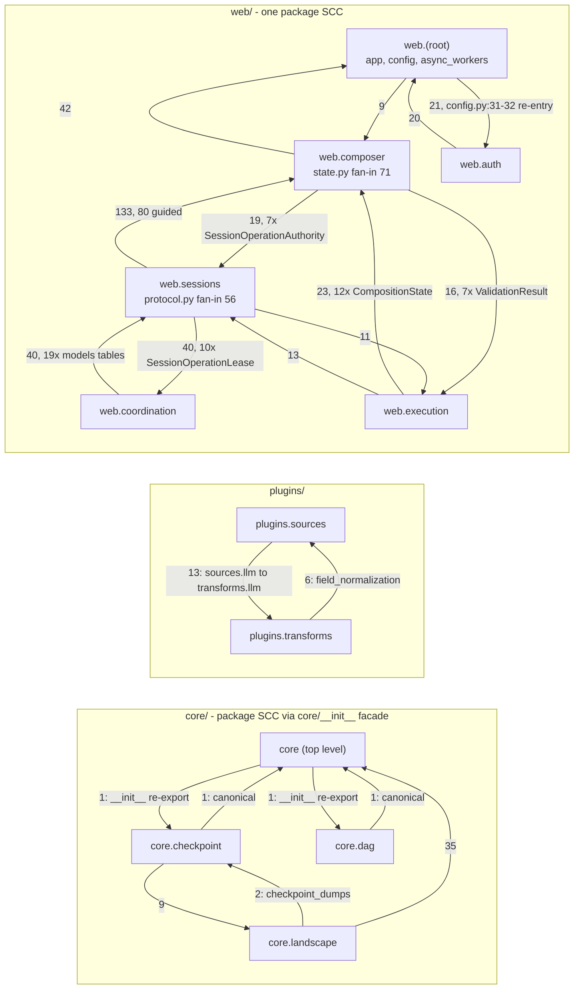
```mermaid
flowchart LR
    subgraph CORE["core/ - package SCC via core/__init__ facade"]
        core0["core (top level)"]
        cdag["core.dag"]
        cchk["core.checkpoint"]
        cland["core.landscape"]
    end

    subgraph PL["plugins/"]
        psrc["plugins.sources"]
        ptr["plugins.transforms"]
    end

    subgraph WEBC["web/ - one package SCC"]
        wroot["web.(root)<br/>app, config, async_workers"]
        wcomp["web.composer<br/>state.py fan-in 71"]
        wsess["web.sessions<br/>protocol.py fan-in 56"]
        wcoord["web.coordination"]
        wexec["web.execution"]
        wauth["web.auth"]
    end

    %% src: core arms [X1 §6; X1 §5.2 core sub-package row; K025]
    core0 -->|"1: __init__ re-export"| cchk
    cchk -->|"1: canonical"| core0
    core0 -->|"1: __init__ re-export"| cdag
    cdag -->|"1: canonical"| core0
    cchk -->|"9"| cland
    cland -->|"2: checkpoint_dumps"| cchk
    cland -->|"35"| core0
    %% src: plugins arms [X1 §6; S07 §Adjudication 2]
    psrc -->|"13: sources.llm to transforms.llm"| ptr
    ptr -->|"6: field_normalization"| psrc
    %% src: web arms [X1 §6; X1 §2.5]
    wsess -->|"133, 80 guided"| wcomp
    wcomp -->|"19, 7x SessionOperationAuthority"| wsess
    wcoord -->|"40, 19x models tables"| wsess
    wsess -->|"40, 10x SessionOperationLease"| wcoord
    wexec -->|"23, 12x CompositionState"| wcomp
    wcomp -->|"16, 7x ValidationResult"| wexec
    wauth -->|"20"| wroot
    wroot -->|"21, config.py:31-32 re-entry"| wauth
    wexec -->|"13"| wsess
    wsess -->|"11"| wexec
    wcomp -->|"42"| wroot
    wroot -->|"9"| wcomp
```

**What this shows.** Each package cycle and the statement counts on its arms
[X1 §6]. The web cycle is dominated by `web.sessions → web.composer` (133
module-level statements, 60 % of them into the guided lane) [K141, Low].
The auth/root cycle re-enters through exactly two edges in `web/config.py`
[K143, Low].

**What it omits.** The runtime (lazy-import) graph. With function-level
imports added there are 9 runtime SCCs (sizes 52, 35, 12 and 2×6); only 41 of
701 lazy imports are mechanical cycle-breakers [X1 §0 item 5]. Removing those
20 pairs leaves runtime SCCs of [17, 2] [K145, Low].

**Why it matters, and what not to target.**

- Grouped by *role* rather than by package (domain < service < routes <
  app), web is already 98.3 % layered: 33 of 1,931 web-internal edges point
  upward, and there are no service→routes, service→app or routes→app edges
  [X1 §2.7; K144, Low].
- Targeted package moves (deleting the guided lane, extracting
  `composer.state`, splitting `web.(root)`) each still leave a 15–18 bucket
  package SCC [X1 §0 item 4]. X1 recommends **not** setting "web package SCC =
  0" as a goal, and instead holding module acyclicity at 0 and driving role
  inversions and lazy cycle-breakers down [X1 §7].
- `web.execution ↔ web.composer` is Medium because execution takes private
  `composer.state` helpers [K142, Medium].

**Annotations (verified concerns).** [K025, Low] (intra-core SCC through
`checkpoint.serialization` and eager facades), [K034, Medium]
(sessions/coordination DML split), [K141, Low], [K142, Medium], [K143, Low],
[K144, Low], [K145, Low].

**Sources.** [X1 §0], [X1 §2.5], [X1 §2.7], [X1 §6], [X1 §7], [S07 §Adjudication 2].

---

## 5. Key sequences

### 5a. One composer turn

**Caption.** Composed from the S15 compose-turn sequence [S15 §Request
pipeline for a compose turn], the S10 surface selection and loop phases
[S10 §Surface selection; S10 §The compose loop], the S11 dispatch pipeline
[S11 §Internal architecture] and the S12 advisor gate [S12 §A. Advisor END
gate]. The provider authors every structural change; the server admits,
validates, repairs by prompting, gates and audits [X2b §B3].

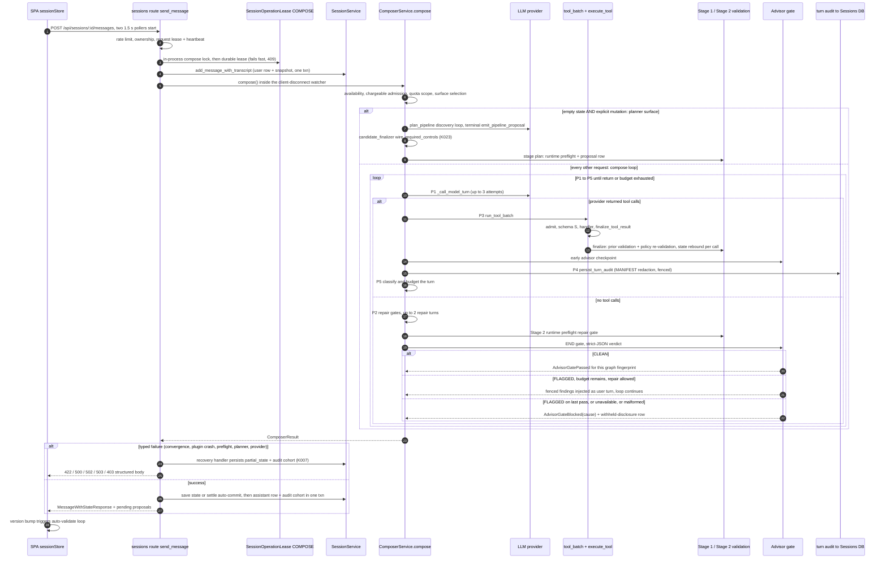
```mermaid
sequenceDiagram
    autonumber
    participant SPA as SPA sessionStore
    participant RT as sessions route send_message
    participant LE as SessionOperationLease COMPOSE
    participant SS as SessionService
    participant CS as ComposerService.compose
    participant LLM as LLM provider
    participant TL as tool_batch + execute_tool
    participant VA as Stage 1 / Stage 2 validation
    participant AD as Advisor gate
    participant AU as turn audit to Sessions DB

    %% src: [S21 §Composer turn data flow]
    SPA->>RT: POST /api/sessions/:id/messages, two 1.5 s pollers start
    %% src: [S15 §Request pipeline for a compose turn]
    RT->>RT: rate limit, ownership, request lease + heartbeat
    RT->>LE: in-process compose lock, then durable lease (fails fast, 409)
    RT->>SS: add_message_with_transcript (user row + snapshot, one txn)
    RT->>CS: compose() inside the client-disconnect watcher
    %% src: [S10 §Surface selection]
    CS->>CS: availability, chargeable admission, quota scope, surface selection
    alt empty state AND explicit mutation: planner surface
        CS->>LLM: plan_pipeline discovery loop, terminal emit_pipeline_proposal
        CS->>CS: candidate_finalizer wire_required_controls (K023)
        CS->>VA: stage plan: runtime preflight + proposal row
    else every other request: compose loop
        loop P1 to P5 until return or budget exhausted
            CS->>LLM: P1 _call_model_turn (up to 3 attempts)
            alt provider returned tool calls
                CS->>TL: P3 run_tool_batch
                TL->>TL: admit, schema S, handler, finalize_tool_result
                TL->>VA: finalize: prior validation + policy re-validation, state rebound per call
                CS->>AD: early advisor checkpoint
                CS->>AU: P4 persist_turn_audit (MANIFEST redaction, fenced)
                CS->>CS: P5 classify and budget the turn
            else no tool calls
                CS->>CS: P2 repair gates, up to 2 repair turns
                CS->>VA: Stage 2 runtime preflight repair gate
                CS->>AD: END gate, strict-JSON verdict
                alt CLEAN
                    AD-->>CS: AdvisorGatePassed for this graph fingerprint
                else FLAGGED, budget remains, repair allowed
                    AD-->>CS: fenced findings injected as user turn, loop continues
                else FLAGGED on last pass, or unavailable, or malformed
                    AD-->>CS: AdvisorGateBlocked(cause) + withheld-disclosure row
                end
            end
        end
    end
    CS-->>RT: ComposerResult
    alt typed failure (convergence, plugin crash, preflight, planner, provider)
        RT->>SS: recovery handler persists partial_state + audit cohort (K007)
        RT-->>SPA: 422 / 500 / 502 / 503 / 403 structured body
    else success
        RT->>SS: save state or settle auto-commit, then assistant row + audit cohort in one txn
        RT-->>SPA: MessageWithStateResponse + pending proposals
    end
    %% src: [S21 §State management]
    SPA->>SPA: version bump triggers auto-validate loop
```

**What this shows.**

- **Two-level write serialisation.** The in-process asyncio lock serialises
  only within one process; the durable lease makes cross-replica serialisation
  work and never waits [S15 §Request pipeline for a compose turn].
- **The loop phases** P1 (provider call), P3 (tool batch), P4 (fenced audit),
  P5 (budgets) and P2 (repair gates and END advisor gate) [S10 §The compose
  loop].
- **Advisor outcomes.** A CLEAN verdict passes, a FLAGGED verdict with budget
  and repair allowed re-enters the loop, and the remaining cases block with a
  closed cause; two backend-authored prescans can FLAG without a provider call
  [S12 §A. Advisor END gate].
- **Audit primacy on the turn.** Tool rows and LLM sidecars of a turn settle
  in one `add_messages_atomic` transaction, and a persistence failure on the
  success path raises `AuditIntegrityError` [S15 §Request pipeline for a
  compose turn].

**What it omits.** Interpretation-review surfacing, the anti-anchor hint, the
B-4D-3 last-chance call, the explicit-approve proposal staging, and
cancellation handling (a cancelled turn finishes its in-flight tool and
publishes its audit prefix first [S10 §The compose loop]).

**Annotations (verified concerns).**

- Recovery handlers read the moving head, so a recovery persist can erase the
  blocked advisor fact [K007, Medium].
- A review-only save moves the head and orphans same-turn proposals [K008,
  Medium]; a decision-only save is invisible to the frontend readiness refresh
  [K009, Medium].
- `send_message` and `recompose` are about 82 % duplicated and have drifted
  [K085, Medium].
- Withheld-reply rows are written in separate transactions from the compose
  turn [K078, Low].
- Advisor END gate is a completion-blocking control with no ADR [K082, Low].

**Sources.** [S15 §Request pipeline for a compose turn], [S10 §Surface
selection], [S10 §The compose loop], [S10 §Validation stages], [S11 §Internal
architecture], [S12 §A. Advisor END gate], [S12 §C. Required-control
auto-wire], [S12 §D. Composer audit write path], [S21 §Composer turn data flow].

---

### 5b. Web run launch: approval to engine to Landscape to run stream

**Caption.** Composed from the S16 admission gate order, worker start
protocol, run state machine and streaming modes [S16 §Internal architecture],
the S17 run-start saga [S17 §4. Cross-database run-start saga], the S05
fresh-run lifecycle [S05 §Fresh-run lifecycle] and the S21 close-code policy
[S21 §Run progress: WebSocket plus polling]. "Polling" means two different things here: on
PostgreSQL the **server** polls `run_events` to feed the WebSocket; after a
1000 or 1011 close the **browser** runs a store-owned REST recovery poll
[S16 §Two streaming modes; S21 §Run progress].

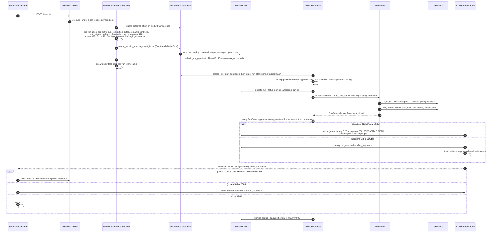
```mermaid
sequenceDiagram
    autonumber
    participant SPA as SPA executionStore
    participant ER as execution routes
    participant ES as ExecutionService event loop
    participant CO as coordination authorities
    participant SD as Sessions DB
    participant WK as run worker thread
    participant OR as Orchestrator
    participant LS as Landscape
    participant WS as run WebSocket route

    SPA->>ER: POST /execute
    ER->>ES: execute() under a per-session asyncio.Lock
    %% src: [S16 §Admission gate order in _execute_locked]
    ES->>CO: guard_external_effect on the EXECUTE lease
    ES->>ES: pre-run gates: one active run, completion_gates, semantic contracts,<br/>authoritative preflight, plugin policy, secret approval 428,<br/>fan-out 428, FrozenRunSettings, approval binding if governance on
    ES->>CO: create_pending_run, saga start_intent (RunAlreadyActiveError)
    CO->>SD: runs row pending + execution-input envelope + permit row
    %% src: one executor per process, unbounded FIFO queue [S16 §Concurrency model; K150]
    ES->>WK: submit _run_pipeline to ThreadPoolExecutor(max_workers=1)
    ES->>ES: loss-watcher task polls get_run every 0.25 s
    %% src: [S16 §Worker start protocol]
    WK->>CO: assess_run_start_admission, then issue_run_start_permit (subject hash)
    WK->>WK: binding-generation check, approval hash re-checked vs Landscape-bound config
    WK->>SD: update_run_status running, landscape_run_id
    %% src: [S05 §Fresh-run lifecycle]
    WK->>OR: Orchestrator.run(..., run_start_permit, web plugin-policy evidence)
    OR->>LS: begin_run mints seat epoch 1, secrets, preflight results
    OR->>LS: rows, tokens, node states, calls, sink effects, finalize_run
    OR-->>WK: RunResult derived from the audit trail
    WK->>SD: every RunEvent appended to run_events with a sequence, then broadcast
    alt Sessions DB is PostgreSQL
        WS->>SD: poll run_events every 0.25 s, pages of 256, REPEATABLE READ,<br/>ownership re-checked per poll
    else Sessions DB is SQLite
        WS->>SD: replay run_events after after_sequence
        WS->>WS: then drain the in-process broadcaster queue
    end
    WS-->>SPA: RunEvent JSON, deduplicated by event_sequence
    alt close 1000 or 1011 while the run still looks live
        SPA->>ER: store-owned 3 s REST recovery poll of run status
    else close 4503 or 1006
        SPA->>WS: reconnect with backoff from after_sequence
    else close 4001
        SPA->>SPA: logout
    end
    WK->>SD: terminal status + saga settlement in finally (K006)
```

**What this shows.**

- **Every admission gate runs before `create_run`** [S16 §Admission gate
  order]. The worker re-admits under the start-permit protocol and re-checks
  the approval hash against the exact Landscape-bound config before any
  orchestrator I/O [S16 §Worker start protocol].
- **One pipeline per process.** Other admitted runs queue in the executor with
  their rows still `pending`; the loss watcher is the only path by which a
  cancel written by another replica reaches the worker [S16 §Concurrency
  model; K150, Medium].
- **Event durability first.** Every event is appended to `run_events` with a
  sequence before it is broadcast [S16 §Two streaming modes].
- **Close-code contract.** 1000 / 1011 / 4001 / 4004 / 4503 on the server
  side [S16 §Two streaming modes], mapped to client actions in [S21 §Run
  progress]. The 1011 and 1000 hand-off to a store-owned recovery poll landed
  in `4792bdea2`, an ancestor of the pin [S23 §Internal architecture run
  monitoring].

**What it omits.** The validate lane, cancel, the ACA handoff resume path,
blob and retained-input handling, and the run state machine (pending,
running, completed, completed_with_failures, empty, failed, cancelled,
recovery_required) [S16 §Run state machine].

**Annotations (verified concerns).**

- `/execute` maps envelope and policy refusals to 404 through a bare
  `except ValueError`, and two admission errors are unmapped (500) [K089,
  Medium].
- The fan-out guard does blocking whole-file I/O on the event loop [K090,
  Medium].
- The run records the engine-default `rate_limit` in the Landscape and in the
  approval hash while the operator's `execution_rate_limit` actually governs
  the run [K003, Medium].
- A cancel after the permit whose output finalisation fails leaves the saga
  `cancel_pending` on a terminal status, invisible to recovery [K006, Medium].
- Each web process (replica) runs one pipeline at a time: every admitted run
  goes to one `ThreadPoolExecutor(max_workers=1)`, and other runs wait in its
  unbounded FIFO queue with their rows `pending`. The only admission bound is
  one active run per session; there is no per-user or global queue bound, no
  fairness, no run-duration cap and no queue signal, and nothing moves queued
  work to an idle ACA peer. The design is deliberate, but the baseline and
  operator docs do not state it [K150, Medium].
- On PostgreSQL, each open run socket's poller runs an unfiltered
  count/min/max over every `run_events` row of the run every 0.25 s, a cost
  that grows linearly with events per run. It is not unbounded in practice:
  progress events are throttled and the rows cascade-delete with the run
  [K091, Low].
- *Catalog observation, not a verified cluster:* run recovery has two poll
  owners, the store-owned recovery poll and a component-owned 3 s `loadRuns`
  loop in `InlineRunResults` that exists only while the Run tab is mounted
  [S23 §Key components; S23 §Internal architecture].

**Sources.** [S16 §Three request lanes], [S16 §Admission gate order], [S16
§Worker start protocol], [S16 §Run state machine], [S16 §Concurrency model],
[S16 §Two streaming modes], [S17 §4. Cross-database run-start saga], [S05
§Fresh-run lifecycle], [S21 §Run progress: WebSocket plus polling], [S23 §Internal architecture].

---

### 5c. Crash-resume through the durable scheduler

**Caption.** Composed from the S05 ten-step resume path [S05 §Resume /
recovery], the S02 checkpoint rules [S02 §Checkpoint and resume], the S06
barrier restore [S06 §Barrier family step 6] and the S04 lease-recovery
transitions [S04 §Durable token scheduler]. Buffered tokens are not in the
checkpoint; they live in the scheduler journal's BLOCKED rows [S02
§Checkpoint and resume]. The two defects that sit directly on this path are
drawn as notes.

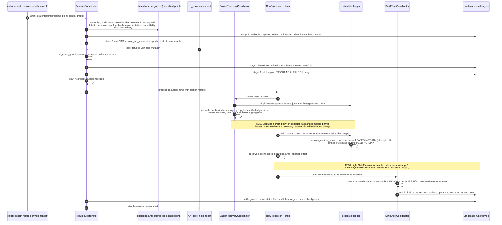
```mermaid
sequenceDiagram
    autonumber
    participant CA as caller: elspeth resume or web handoff
    participant RC as ResumeCoordinator
    participant RG as shared resume guards (core.checkpoint)
    participant SEAT as run_coordination seat
    participant BR as BarrierRecoveryCoordinator
    participant RP as RowProcessor + drain
    participant SCH as scheduler ledger
    participant SE as SinkEffectCoordinator
    participant LS as Landscape run lifecycle

    CA->>RC: Orchestrator.resume(resume_point, config, graph)
    %% src: [S05 §Resume / recovery steps 1-3; S02 §Checkpoint and resume]
    RC->>RG: read-only guards: status (dead-leader takeover if seat expired),<br/>latest checkpoint, topology hash, implementation compatibility,<br/>group satisfiability
    RC->>LS: stage 1 read-only snapshot, refuse runtime-VAL drift or incomplete sources
    %% src: [S05 §Resume / recovery step 4]
    RC->>SEAT: stage 2 seat CAS acquire_run_leadership, epoch + 1 (first durable act)
    SEAT-->>RC: loser refused with zero mutation
    RC->>RC: pre_effect_guard, re-read checkpoint under leadership
    RC->>LS: stage 2.5 work set derived from token outcomes, post-CAS
    RC->>LS: stage 3 batch repair: EXECUTING to FAILED to retry
    RC->>RC: start heartbeat, quiescence gate
    RC->>RP: process_resumed_rows with barrier_restore
    %% src: [S06 §Barrier family step 6]
    RP->>BR: restore_from_journal
    BR->>SCH: duplicate-acceptance sweep, journal vs lineage-frame check
    BR->>BR: reconcile crash windows, merge group_losses (the ledger wins),<br/>restore coalesce, row_union, collector, aggregation
    Note over BR,SCH: K052 Medium: a crash between collector flush and complete_barrier<br/>leaves no residual receipt, so every resume fails with did-not-converge
    %% src: [S04 §Durable token scheduler; S05 §Multi-worker shape]
    RP->>SCH: drain_claims: claim_ready, leader maintenance evicts then reaps
    SCH->>SCH: recover_expired_leases: transform lease LEASED to READY (attempt + 1),<br/>sink-redrive lease back to PENDING_SINK
    RP->>RP: re-drive existing token ids with resume_attempt_offset
    Note over RP,LS: K051 High: GateExecutor opens its node state at attempt 0,<br/>the UNIQUE collision aborts resume (reproduced at the pin)
    %% src: [S06 §Sink effect coordinator]
    RP->>SE: sink flush: reserve, close abandoned attempts
    SE->>SE: reuse returned commit, or reconcile (UNKNOWN raises SinkEffectUnknownError), or commit
    SE->>LS: atomic finalize: node states, artifact, operation, outcomes, stream head
    %% src: [S05 §Resume / recovery step 10]
    RC->>LS: settle groups, derive status from audit, finalize_run, delete checkpoints
    RC->>SEAT: stop heartbeat, release seat
```

**What this shows.**

- **Nothing durable happens before the seat CAS.** All entry guards are
  read-only, the seat CAS is the first durable act, and a losing resumer is
  refused with zero mutation [S05 §Resume / recovery].
- **The advisory and enforcing checks are the same functions.**
  `RecoveryManager.can_resume` and `ResumeCoordinator.resume()` run the same
  shared guards [S02 §Checkpoint and resume].
- **The journal is the truth for barriers.** Restore merges the durable
  `group_losses` ledger over the checkpoint scalars, then restores the four
  barrier kinds in a fixed order [S06 §Barrier family].
- **Lease recovery is liveness-aware.** It reaps only registry-dead owners or
  leases past the stall budget, rotates a transform lease to `attempt + 1`, and
  returns a sink-redrive lease to PENDING_SINK with its identity kept
  [S04 §Durable token scheduler].
- **Non-resumable runs are closed, not resumed.** Tokens left undecided when a
  non-resumable run finalizes FAILED or INTERRUPTED receive
  `(NULL, ABANDONED)` inside `complete_run` [S05 §Run-status and seat state
  machine; X2b §Part A row 038].

**What it omits.** The follower path (followers never resume; they are
admitted with `join_run` [S05 §Multi-worker shape]), audit-export resume, and
the web recovery coordinator's orphan sweep [S18 §Startup ordering].

**Annotations (verified concerns).**

- **[K051, High]** on the resumed gate node state; **[K052, Medium]** on the
  collector crash window. Both are on this exact path.
- Barrier adoption and marker reset write no `scheduler_events` row, so the
  adoption epoch survives only as a column value [K044, Medium].
- `restore_from_journal` is one 914-line function that runs durable releases
  inside its derivation phase [K054, Low].
- Unwired intent adjacent to this path: `run_mode` replay/verify and
  `replay_from` validate but are never consumed, and the call replayer and
  verifier have no production consumers [K056, High]. That needs a
  wire-or-remove decision, not silent deletion.

**Sources.** [S05 §Resume / recovery], [S05 §Run-status and seat state machine],
[S05 §Multi-worker shape], [S02 §Checkpoint and resume], [S04 §Durable token
scheduler], [S06 §Barrier family], [S06 §Token identity through fork, expand,
coalesce, and collect], [S06 §Sink effect coordinator], [X2b §Part A].

---

## 6. State machines

### 6a. Token terminal model (ADR-019 two-axis, ADR-038 ABANDONED)

**Caption.** The baseline's single-axis "terminal states" table (COMPLETED,
ROUTED, FORKED, CONSUMED_IN_BATCH …) is retired in the tree [S04 §Baseline
delta; S06 §Baseline delta]. A token's fate is a pair: a lifecycle answer
`TerminalOutcome` and a provenance answer `TerminalPath`. There are 3 outcomes,
16 paths, 14 legal terminal pairs and 2 non-terminal paths, `BUFFERED` and
`ABANDONED`, which pair with `outcome IS NULL` [measured:
`PYTHONPATH=<pin>/src .venv/bin/python -c "import elspeth.contracts.enums as e; …"`
printed `3 16 14 ['ABANDONED', 'BUFFERED']` with `e.__file__` inside the pin;
X2a §2 row 019]. `contracts/enums.py` checks at import that every path is
classified exactly once and every outcome is used [S01 §Internal
architecture].

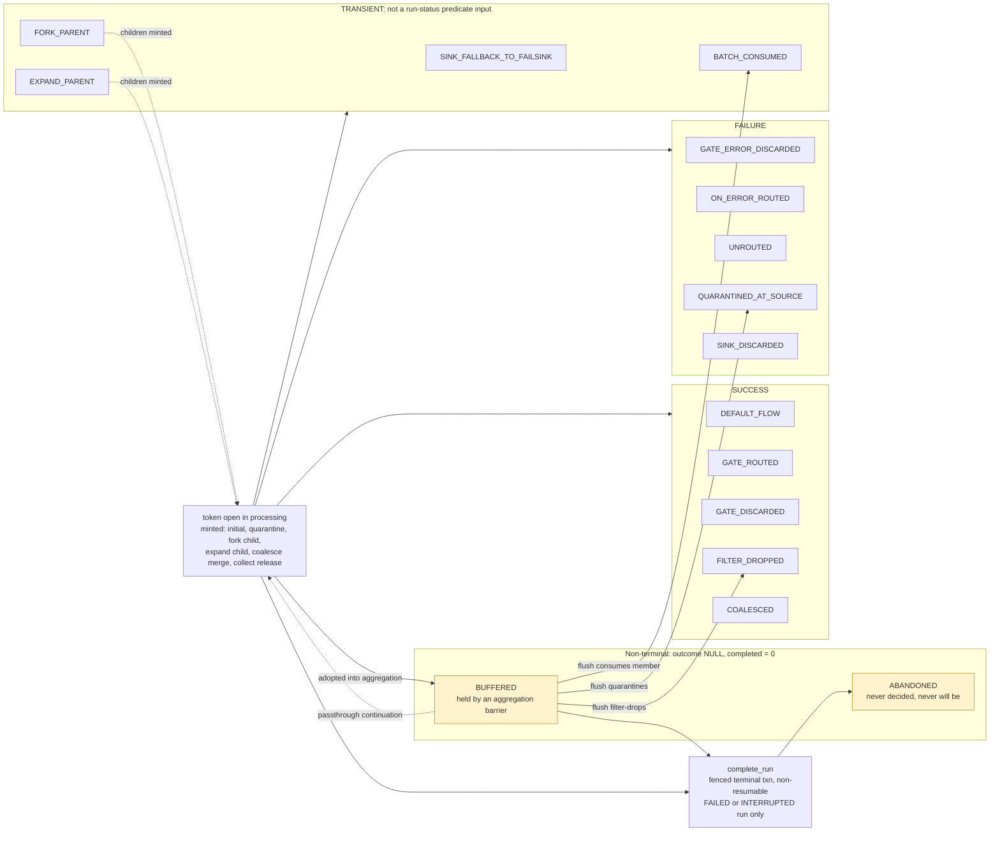
```mermaid
flowchart LR
    %% src: pairs [measured: enums import at the pin; X2a §2 row 019]; minting [S06 §Token identity through fork, expand, coalesce, and collect]
    OPEN["token open in processing<br/>minted: initial, quarantine, fork child,<br/>expand child, coalesce merge, collect release"]

    subgraph NT["Non-terminal: outcome NULL, completed = 0"]
        BUF["BUFFERED<br/>held by an aggregation barrier"]
        ABN["ABANDONED<br/>never decided, never will be"]
    end

    subgraph SUC["SUCCESS"]
        s1["DEFAULT_FLOW"]
        s2["GATE_ROUTED"]
        s3["GATE_DISCARDED"]
        s4["FILTER_DROPPED"]
        s5["COALESCED"]
    end

    subgraph FAI["FAILURE"]
        f1["GATE_ERROR_DISCARDED"]
        f2["ON_ERROR_ROUTED"]
        f3["UNROUTED"]
        f4["QUARANTINED_AT_SOURCE"]
        f5["SINK_DISCARDED"]
    end

    subgraph TRA["TRANSIENT: not a run-status predicate input"]
        t1["SINK_FALLBACK_TO_FAILSINK"]
        t2["FORK_PARENT"]
        t3["EXPAND_PARENT"]
        t4["BATCH_CONSUMED"]
    end

    CR["complete_run<br/>fenced terminal txn, non-resumable<br/>FAILED or INTERRUPTED run only"]

    OPEN --> SUC
    OPEN --> FAI
    OPEN --> TRA
    %% src: adoption writes a BUFFERED outcome backdated to barrier_blocked_at [S04 §Durable token scheduler]
    OPEN -->|"adopted into aggregation"| BUF
    %% src: BUFFERED exits [S06 §Baseline delta]
    BUF -->|"flush consumes member"| t4
    BUF -->|"flush quarantines"| f4
    BUF -->|"flush filter-drops"| s4
    BUF -.->|"passthrough continuation"| OPEN
    t2 -.->|"children minted"| OPEN
    t3 -.->|"children minted"| OPEN
    %% src: ADR-038 single writer [X2b §Part A row 038; S05 §Run-status and seat state machine]
    OPEN --> CR
    BUF --> CR
    CR --> ABN

    classDef nonterminal fill:#fff3cd,stroke:#b8860b
    class BUF,ABN nonterminal
```

**Key.** Amber fill = non-terminal paths (`outcome IS NULL`); dashed edges =
a token continues or children are minted rather than a terminal being reached.

**What this shows.**

- **The 14 legal pairs**: SUCCESS × 5 paths, FAILURE × 5, TRANSIENT × 4
  [measured: enums import at the pin, grouped output `FAILURE 5 …`,
  `SUCCESS 5 …`, `TRANSIENT 4 …`].
- **BUFFERED exits.** A buffered token becomes `(TRANSIENT, BATCH_CONSUMED)`,
  `(FAILURE, QUARANTINED_AT_SOURCE)`, a passthrough continuation, or
  `(SUCCESS, FILTER_DROPPED)` [S06 §Baseline delta].
- **ABANDONED has one writer.** Only `complete_run`, inside its fenced
  terminal transaction and only for a non-resumable FAILED or INTERRUPTED run,
  writes `(NULL, ABANDONED)`; the audit derive refuses to count ABANDONED on
  any live path [X2b §Part A row 038; S05 §Run-status and seat state machine].
  Resumable runs keep buffered tokens honestly open [S05 §Run-status and seat
  state machine].
- **Counter mapping (normative, conformant).** For example `GATE_ROUTED` →
  succeeded + routed_success, `ON_ERROR_ROUTED` → failed + routed_failure,
  `SINK_FALLBACK_TO_FAILSINK` → diverted, `FORK_PARENT`/`EXPAND_PARENT` →
  structural only, `BATCH_CONSUMED` → no counter [X2a §2 row 019].

**What it omits.** The per-pair column constraints (`required`, `exact`,
`forbidden` over `sink_name`, `batch_id`, `error_hash`) and the lineage frames
that accompany each fork, expand, coalesce and collect [S01 §Internal
architecture; S04 §Data flow].

**Annotations (verified concerns).**

- **No DB CHECK enforces the model.** Pair legality, `completed` XOR
  `outcome IS NULL` and the discriminator columns are enforced in Python on
  write and again on read, where the loader fails closed. The only DB-level
  terminal guard is the partial unique index `ix_token_outcomes_terminal_unique`
  (at most one terminal outcome per token) [K026, Medium].
- **The ADR-019 run-status predicate text is stale.** The engine counts
  quarantine as a clean terminal, so a run with zero succeeded and at least one
  quarantined row is COMPLETED_WITH_FAILURES rather than FAILED. This is
  intended behaviour introduced in `702d4c362`; the ADR was not amended
  [K130, Low].

**Sources.** [measured: enums import at the pin], [X2a §2 rows 018, 019], [X2b
§Part A row 038], [S01 §Internal architecture], [S04 §Durable token
scheduler], [S04 §Baseline delta], [S05 §Run-status and seat state machine],
[S06 §Baseline delta], [S06 §Token identity through fork, expand, coalesce,
and collect].

---

### 6b. Sink-effect lifecycle: the engine-side ledger

**Caption.** Reused verbatim from the S04 sink-effect ledger diagram [S04
§Sink-effect ledger]. Each verb locks the stream, the effect and its
predecessor, decides lease liveness in SQL against a fresh DB clock sample, and
bumps `generation` on every ownership change [S04 §Sink-effect ledger].

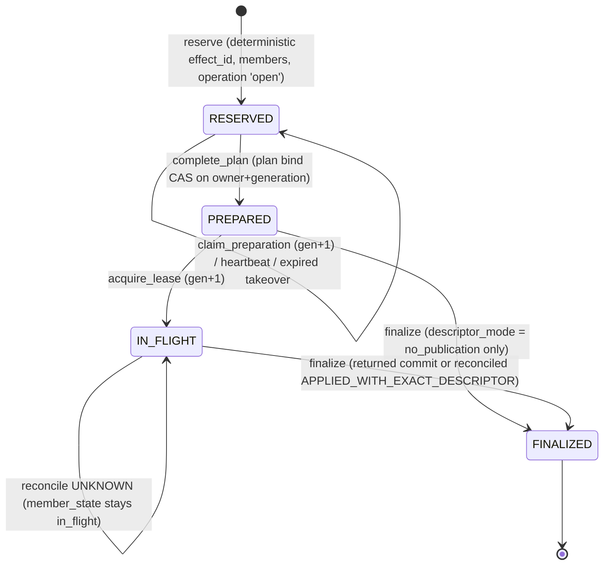
```mermaid
stateDiagram-v2
    %% src: adapted verbatim from [S04 §Sink-effect ledger]
    [*] --> RESERVED: reserve (deterministic effect_id, members, operation 'open')
    RESERVED --> RESERVED: claim_preparation (gen+1) / heartbeat / expired takeover
    RESERVED --> PREPARED: complete_plan (plan bind CAS on owner+generation)
    PREPARED --> IN_FLIGHT: acquire_lease (gen+1)
    PREPARED --> FINALIZED: finalize (descriptor_mode = no_publication only)
    IN_FLIGHT --> IN_FLIGHT: heartbeat / begin_attempt / record_attempt_result / takeover_expired (gen+1)
    IN_FLIGHT --> IN_FLIGHT: reconcile UNKNOWN (member_state stays in_flight)
    IN_FLIGHT --> FINALIZED: finalize (returned commit or reconciled APPLIED_WITH_EXACT_DESCRIPTOR)
    FINALIZED --> [*]
```

**What this shows.** Reserve, prepare, in flight and finalize, with attempts
written ahead as INTENT and then RETURNED or RESPONSE_LOST, each also writing a
`calls` row [S04 §Sink-effect ledger]. Finalize is one leader-fenced
transaction in global lock order that registers the artifact, completes the
operation, records outcomes, stamps members, advances the stream head and sets
FINALIZED; a replay after commit returns the finalized winner
[S04 §Sink-effect ledger].

**What it omits, and two structural facts it hides.**

- **UNKNOWN is unwritable on the effect row.** The lifecycle CHECK allows only
  NULL or `applied_with_exact_descriptor` for `reconcile_kind`, so UNKNOWN
  evidence lives only in `sink_effect_attempts` and member state
  [S04 §Sink-effect ledger].
- **There is no failed or abandoned effect state.** On run abandonment the
  TS-19 sweep fails the open `operations` row, but the `sink_effects` row keeps
  its last non-final state [S04 §Sink-effect ledger].

### 6c. Sink-effect protocol: the plugin-side adapter view

**Caption.** Reused from the S07 recoverable-effect diagram [S07 §Sink
boundary]. This is what a sink adapter does inside the engine-side states
above. All 9 built-in sinks declare `sink-effect-v1` [S07 §Sink boundary].

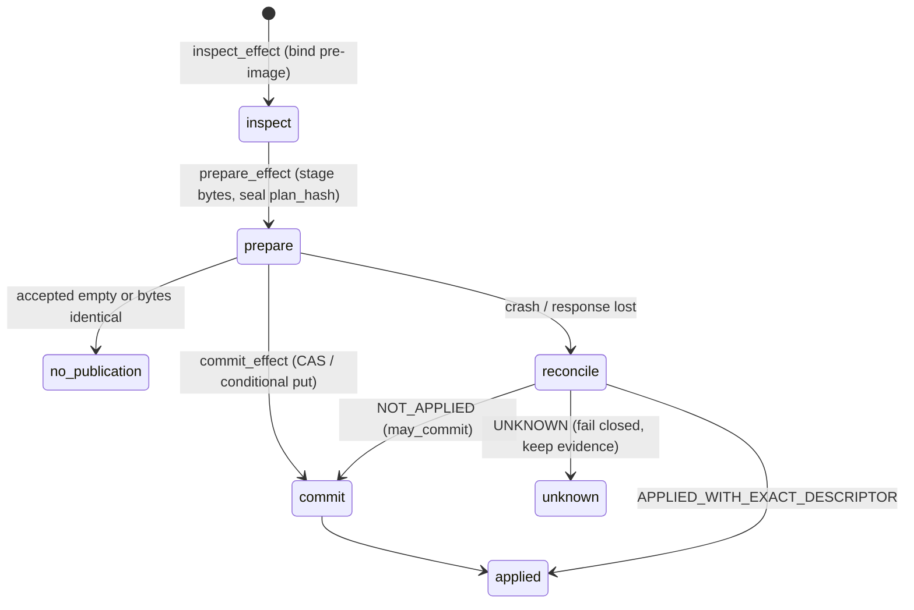
```mermaid
stateDiagram-v2
    %% src: adapted from [S07 §Sink boundary: the recoverable effect protocol], no_publication label shortened
    [*] --> inspect: inspect_effect (bind pre-image)
    inspect --> prepare: prepare_effect (stage bytes, seal plan_hash)
    prepare --> commit: commit_effect (CAS / conditional put)
    prepare --> no_publication: accepted empty or bytes identical
    commit --> applied
    prepare --> reconcile: crash / response lost
    reconcile --> applied: APPLIED_WITH_EXACT_DESCRIPTOR
    reconcile --> commit: NOT_APPLIED (may_commit)
    reconcile --> unknown: UNKNOWN (fail closed, keep evidence)
```

**What this shows.** Local-file sinks stage beside the target, bind by
sha256, size and inode, and commit with `os.replace` under a bounded `flock`;
remote-object sinks stage in a spool with a provider checksum and can restage
from durable member payloads if the spool body is lost [S07 §Sink boundary].

**Annotations (verified concerns on 6b and 6c).**

- The remote-effect spool root defaults to a CWD-relative path, so a resume
  from another CWD fails closed, and no deploy sets `ELSPETH_EFFECT_SPOOL_DIR`
  [K059, Low].
- `BaseSink.write` and `flush` remain abstract and taught by the docstring,
  while every built-in sink's `write` raises. The real contract is the typed
  `SinkEffectProtocol`, which `docs/contracts/plugin-protocol.md` documents
  correctly, and a sink written from the docstring is rejected loudly at
  preflight, so this is docstring and ABC drift [K057, Low].

**Sources.** [S04 §Sink-effect ledger], [S06 §Sink effect coordinator], [S07
§Sink boundary: the recoverable effect protocol].

---

## 7. Deployment view and supported topology limits

Adapted from the S20 deployment view [S20 §Deployment view], split into a
single-host view and a cloud view. Every bundle runs the same image and the
same `elspeth web` launcher [S20 §Public interface / entry points].

### 7a. Local development and single-host deployments

**Caption.** The CLI path runs on one host against a SQLite Landscape, with
optional claim-only followers admitted by `elspeth join` [S05 §Multi-worker
shape]. The web bundles for one host are Docker Compose and `linux-systemd`
[S20 §Deploy bundles]. In `sqlite-single` state mode the web process creates
its stores under `data_dir` at boot; in external-PostgreSQL mode it only
validates them [S20 §Boot sequence].

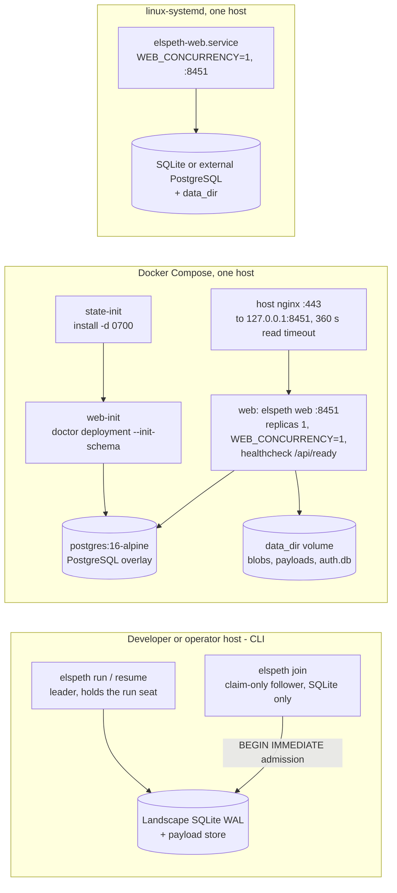
```mermaid
flowchart LR
    subgraph DEV["Developer or operator host - CLI"]
        LEAD["elspeth run / resume<br/>leader, holds the run seat"]
        FOL["elspeth join<br/>claim-only follower, SQLite only"]
        LSQ[("Landscape SQLite WAL<br/>+ payload store")]
    end

    subgraph CMP["Docker Compose, one host"]
        NGX["host nginx :443<br/>to 127.0.0.1:8451, 360 s read timeout"]
        SI["state-init<br/>install -d 0700"]
        WI["web-init<br/>doctor deployment --init-schema"]
        WEBC["web: elspeth web :8451<br/>replicas 1, WEB_CONCURRENCY=1,<br/>healthcheck /api/ready"]
        PGC[("postgres:16-alpine<br/>PostgreSQL overlay")]
        VOL[("data_dir volume<br/>blobs, payloads, auth.db")]
    end

    subgraph SYS["linux-systemd, one host"]
        SVC["elspeth-web.service<br/>WEB_CONCURRENCY=1, :8451"]
        SST[("SQLite or external PostgreSQL<br/>+ data_dir")]
    end

    %% src: [S05 §Multi-worker shape]
    LEAD --> LSQ
    FOL -->|"BEGIN IMMEDIATE admission"| LSQ
    %% src: [S20 §Deploy bundles]
    NGX --> WEBC
    SI --> WI --> PGC
    WEBC --> PGC
    WEBC --> VOL
    SVC --> SST
```

**What this shows.** The one-host leader and follower pack of ADR-030
[S05 §Multi-worker shape] and the two single-host web bundles [S20 §Deploy
bundles]. Schema creation for external state happens only out of band in
`doctor … --init-schema`, under a PostgreSQL advisory lock; STALE is never
repaired, and the operator is told to drop and recreate [S20 §Boot sequence].

**Annotations (verified concerns).**

- `elspeth web` launches uvicorn without `forwarded_allow_ips`, so behind the
  shipped host-nginx topology every client shares one per-IP auth bucket
  [K004, Medium].
- Local-auth `auth.db` is SQLite under `data_dir` even in external-PostgreSQL
  mode; only an application-level guard is missing [K098, Low].
- `elspeth explain`, the TUI and other `--database` overrides cannot open a
  PostgreSQL Landscape [K072, Medium].

### 7b. Cloud: AWS ECS/Fargate and Azure Container Apps

**Caption.** The AWS ECS profile runs one web task with zero overlap; the
Azure Container Apps (ACA) bundle runs a single revision with sticky sessions
and 2–4 replicas in its production parameters [S20 §Deployment view].
**ACA status is contested**: ARCHITECTURE.md says ACA support is deferred;
`docs/reference/deployment-platforms.md` says the contract is implemented with
desktop acceptance and no live cloud receipt; ADR-030 and ADR-041 say multiple
web replicas remain unsupported [baseline-deltas §slice-S17 ACA row; S17 §Baseline
delta]. It is drawn here as built, with that caveat.

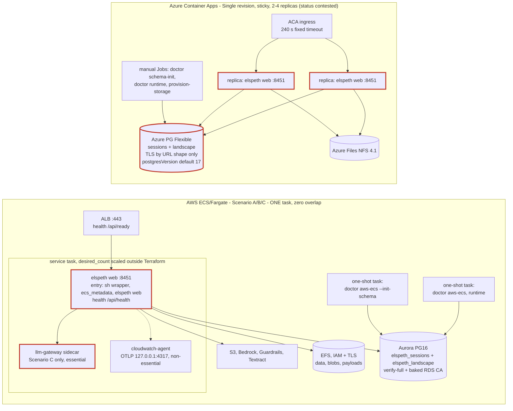
```mermaid
flowchart LR
    subgraph ECS["AWS ECS/Fargate - Scenario A/B/C - ONE task, zero overlap"]
        ALB["ALB :443<br/>health /api/ready"]
        subgraph TASK["service task, desired_count scaled outside Terraform"]
            WEB["elspeth web :8451<br/>entry: sh wrapper, ecs_metadata, elspeth web<br/>health /api/health"]
            CWA["cloudwatch-agent<br/>OTLP 127.0.0.1:4317, non-essential"]
            GW["llm-gateway sidecar<br/>Scenario C only, essential"]
        end
        AUR[("Aurora PG16<br/>elspeth_sessions + elspeth_landscape<br/>verify-full + baked RDS CA")]
        EFS[("EFS, IAM + TLS<br/>data, blobs, payloads")]
        AWSX["S3, Bedrock, Guardrails, Textract"]
        DOC1["one-shot task:<br/>doctor aws-ecs --init-schema"]
        DOC2["one-shot task:<br/>doctor aws-ecs, runtime"]
    end

    subgraph ACA["Azure Container Apps - Single revision, sticky, 2-4 replicas (status contested)"]
        ING["ACA ingress<br/>240 s fixed timeout"]
        R1["replica: elspeth web :8451"]
        R2["replica: elspeth web :8451"]
        %% src: postgresVersion default 17 [K154]
        FLEX[("Azure PG Flexible<br/>sessions + landscape<br/>TLS by URL shape only<br/>postgresVersion default 17")]
        NFS[("Azure Files NFS 4.1")]
        JOBS["manual Jobs: doctor schema-init,<br/>doctor runtime, provision-storage"]
    end

    %% src: [S20 §Deployment view]
    ALB --> WEB
    WEB --> AUR & EFS & AWSX
    WEB -.-> CWA
    WEB --> GW
    DOC1 --> AUR
    DOC2 --> AUR
    ING --> R1 & R2
    R1 & R2 --> FLEX & NFS
    JOBS --> FLEX

    classDef defect stroke:#c0392b,stroke-width:3px
    class WEB,GW,R1,R2,FLEX defect
```

**Key.** Red border = a verified concern sits on this node (listed under
Annotations below).

**What this shows.** The runtime topology of each cloud bundle [S20
§Deployment view], the one-shot doctor tasks and jobs that own schema
initialisation [S20 §Public interface / entry points], and the health surfaces
(`/api/health` liveness, `/api/ready` readiness with nine closed checks)
[S20 §Key components].

**What it omits.** The acceptance harnesses and their receipt stores [S20 §Key
components], Key Vault references, and the `kubernetes` profile, which exists
in `deployment_profiles.py` while K4–K7 are unimplemented [S20 §Deployment
view].

**Annotations (verified concerns; red-bordered nodes).**

- **ECS web** — `elspeth web` overwrites an environment-configured SSO
  provider with `local`; in ECS upgrade mode (OIDC) the task boots silently on
  local auth with open registration behind an internet-facing ALB [K103, High].
  Production ECS boot depends on the private `_aws_ecs_acceptance.ecs_metadata`
  module [K104, Low].
- **Gateway sidecar** — the Scenario C task definition supplies 7 of the 13
  configuration names the gateway requires, so the sidecar, the service task
  and the runtime doctor cannot start [K123, High].
- **ACA replicas** — the acceptance probe pins a 2/2 topology, while
  production is 2–4, so no live receipt can qualify production [K105, Medium].
  The ACA replica fence probe drives `/guided/respond` [K021, Low].
- **ACA PostgreSQL** — authenticated TLS is checked only for `aws-ecs`; on ACA
  it depends on URL shape [K106, Medium]. No runtime code reads the PostgreSQL
  server version. The ACA bicep defaults `postgresVersion` to 17 (16, 17 and
  18 allowed), while every PostgreSQL proof in the repo runs on
  `postgres:16-alpine`, so the default ACA deployment runs the lock,
  CHECK-reflection and DB-clock logic on a major version no test exercises,
  with no warning to the operator. The Aurora node is pinned to 16.13, but by
  Terraform at provisioning time, not at runtime [K154, Medium].
- **EFS and NFS data_dir** — archive quarantine requires Linux
  `renameat2(RENAME_NOREPLACE)`, unverified on EFS/NFS [K084, Medium].

### 7c. Supported topology limits (as built)

| Limit | How it is held | Source |
|---|---|---|
| One uvicorn worker per container | Code refuses boot on `WEB_CONCURRENCY>1` or `--workers>1`; bundles set `WEB_CONCURRENCY=1` | [S18 §Concurrency model; S20 §Invariants & how they are enforced] |
| Replicas scale out only through PostgreSQL | Membership leases, a shared rate limiter, DB-backed composer progress and WebSocket tickets; SQLite mode swaps in process-local equivalents | [S18 §Concurrency model; S17 §5] |
| ECS: one web task, no overlap | Infrastructure only (`ecs.tf`) plus prose | [S20 §Invariants & how they are enforced] |
| ACA: ≥2 replicas only in Single/sticky mode | Infrastructure and prose; runtime correctness from DB fences and leases | [S20 §Invariants & how they are enforced; S17 §1] |
| The web tier hosts leaders only | Absence of a web follower path; `elspeth join` is the only follower route | [S05 §Multi-worker shape; baseline-deltas §slice-S05 ADR-030 row] |
| Followers are one-host SQLite only | CLI URL check; the engine does not refuse a PostgreSQL follower | [S05 §Multi-worker shape; K137, Low] |
| External schema is never created or repaired at boot | Code plus a testcontainer test; doctor `--init-schema` is eligibility-gated and advisory-locked | [S20 §Boot sequence; S20 §Invariants & how they are enforced] |
| Sessions DB and Landscape must be distinct PostgreSQL targets | `postgres_logical_target_key` proves them distinct | [S20 §Key components] |
| PostgreSQL 16 profile (ADR-041) | Not checked at runtime: no code reads the server version. AWS Terraform pins Aurora PostgreSQL 16.13 at provisioning only; the ACA bicep defaults `postgresVersion` to 17 (16, 17, 18 allowed), while every PostgreSQL proof runs on `postgres:16-alpine` | [S03 §Baseline delta; K154, Medium] |
| Peer compatibility across a rolling deploy | Session and landscape epoch mismatches are caught at start by the schema-identity check; only a `coordination_protocol` bump with no schema change is unguarded, and that is latent while the protocol is still v1 | [K093, Medium] |
| Boot budget | 150 s platform startup: about 90 s DB plus 60 s provider probes | [S18 §Startup ordering] |
| ACA production topology | Not qualified: probe pinned to 2/2 | [K105, Medium] |

**Sources.** [S20 §Deployment view], [S20 §Deploy bundles], [S20 §Boot
sequence], [S20 §Key components], [S20 §Public interface / entry points], [S20
§Invariants & how they are enforced], [S18 §Concurrency model], [S18 §Startup
ordering], [S17 §Baseline delta], [S05 §Multi-worker shape], [baseline-deltas
§slice-S17 ACA row].

---

## 8. Guided lane and tutorial coupling map

**Caption.** Adapted from the S13 guided-lane diagram [S13 §Internal
architecture], extended with the freeform dependencies the verified concerns
confirm [K012–K022]. Guided *mode* is retired as a user concept and freeform
is the only authoring mode; the tutorial is kept and stays on the shared
backend as a fixed-script canary (ADR-031) [01 §7], and it runs on guided
infrastructure [K013, Medium]. ADR-031's canary premise is now stale: the ADR
justifies the tutorial as a canary for "the same guided machinery every user
exercises", no ordinary user drives that surface since the retirement ruling,
freeform (the only user authoring surface) has no fixed-script canary, and the
ADR has not been amended [K160, Medium]. The retirement ruling is tracked at the pin
(`docs/reviews/2026-09-22-p1-triage.md §0.2`) and keeps the guided
infrastructure deliberately for the tutorial, so retirement is **not**
structurally blocked; what the tutorial blocks is full infrastructure removal,
which is optional future work [K013, Medium].

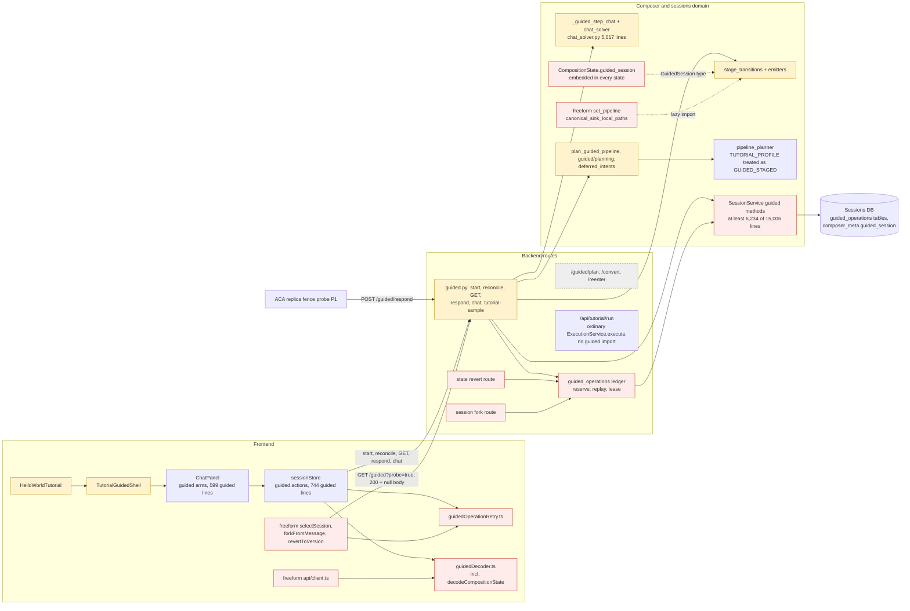
```mermaid
flowchart LR
    subgraph FE["Frontend"]
        HWT["HelloWorldTutorial"]
        TGS["TutorialGuidedShell"]
        CP["ChatPanel<br/>guided arms, 599 guided lines"]
        SS["sessionStore<br/>guided actions, 744 guided lines"]
        FFS["freeform selectSession,<br/>forkFromMessage, revertToVersion"]
        GOR["guidedOperationRetry.ts"]
        DEC["guidedDecoder.ts<br/>incl. decodeCompositionState"]
        FCL["freeform api/client.ts"]
    end

    subgraph RTS["Backend routes"]
        %% src: tutorial-sample serves public GitHub Pages fixture URLs at runtime [K161]
        RG["guided.py: start, reconcile, GET,<br/>respond, chat, tutorial-sample"]
        RDEAD["/guided/plan, /convert, /reenter"]
        RGO["guided_operations ledger<br/>reserve, replay, lease"]
        RREV["state revert route"]
        RFORK["session fork route"]
        TRUN["/api/tutorial/run<br/>ordinary ExecutionService.execute,<br/>no guided import"]
    end

    subgraph DOM["Composer and sessions domain"]
        %% src: chat_solver.py alone is 5,017 lines [K013]
        CHAT["_guided_step_chat + chat_solver<br/>chat_solver.py 5,017 lines"]
        STE["stage_transitions + emitters"]
        PLN["plan_guided_pipeline, guided/planning,<br/>deferred_intents"]
        PP["pipeline_planner<br/>TUTORIAL_PROFILE treated as GUIDED_STAGED"]
        SVC["SessionService guided methods<br/>at least 6,234 of 15,006 lines"]
        CST["CompositionState.guided_session<br/>embedded in every state"]
        FSP["freeform set_pipeline<br/>canonical_sink_local_paths"]
    end

    DB[("Sessions DB<br/>guided_operations tables,<br/>composer_meta.guided_session")]
    ACA["ACA replica fence probe P1"]

    %% src: tutorial path [S13 §HTTP routes (9)]
    HWT --> TGS --> CP --> SS
    SS -->|"start, reconcile, GET, respond, chat"| RG
    SS --> GOR
    SS --> DEC
    %% src: freeform probe [K020]; freeform decoder [K015]
    FFS -->|"GET /guided?probe=true, 200 + null body"| RG
    FFS --> GOR
    FCL --> DEC
    RG --> RGO
    RG --> CHAT
    RG --> STE
    RG --> PLN --> PP
    RG --> SVC
    %% src: freeform revert and fork on the ledger [K012]
    RREV --> RGO
    RFORK --> RGO
    RGO --> SVC --> DB
    %% src: embed and misfiled symbols [K014]
    CST -.->|"GuidedSession type"| STE
    FSP -.->|"lazy import"| STE
    %% src: ACA probe [K021]
    ACA -->|"POST /guided/respond"| RG

    classDef tut fill:#fff3cd,stroke:#b8860b
    classDef shared fill:#fdecea,stroke:#c0392b
    classDef dead fill:#eeeeee,stroke:#888888,stroke-dasharray:4 3
    class HWT,TGS,RG,CHAT,STE,PLN tut
    class GOR,DEC,RGO,SVC,CST,FSP,FFS,FCL,RREV,RFORK shared
    class RDEAD dead
```

**Key.** Amber = on the tutorial's scripted path; red = shared infrastructure
that freeform also depends on; grey dashed = no reachable production caller.

**What this shows.**

- **The tutorial path.** The tutorial uses start, reconcile, GET, respond,
  chat and tutorial-sample, plus the embedded guided ChatPanel [K013, Medium;
  S13 §HTTP routes (9)].
- **Freeform runs on guided infrastructure.** Freeform state revert and
  session fork are built on the guided-operation ledger, the
  `guided_operations` table (whose kind CHECK admits `state_revert` and
  `session_fork`) and `guidedOperationRetry.ts`; deleting the lane by name
  would break them, though nothing is broken today [K012, Medium].
- **Non-guided code imports guided-named modules.** `composer/state.py`
  imports `GuidedSession`, the freeform `set_pipeline` path lazily imports
  `canonical_sink_local_paths`, and shared symbols such as `InvariantError` and
  `BLOB_REF_PATH_PREFIX` live in guided-named modules; with the guided package
  blocked from import, core modules fail to import at all [K014, Medium]. On
  the frontend, the freeform client decodes composition state through
  `guidedDecoder.ts` [K015, Medium].
- **Mode detection depends on the guided route.** `selectSession`,
  `forkFromMessage` and `revertToVersion` call `GET /guided?probe=true`; a
  freeform session gets HTTP 200 with a null body (the 400 contract survives
  only in a stale comment). Without the route, selection would fall back to
  freeform with a warning, while fork hydration and revert would fail
  [K020, Low].
- **The tutorial distinction is an audit label, not a behaviour branch.**
  Every planner site treats `TUTORIAL_PROFILE` and `GUIDED_STAGED` as one set
  [S13 §Internal architecture]. The `/tutorial/run` orchestration has no
  guided import [S13 §Removal blast radius].
- **Dead surfaces.** `POST /guided/plan` has 0 production callers, the
  `ModeSwitchButton` guided arm is never mounted, and `/convert` has 0
  reachable callers; one piece of `guided_plan.py`
  (`_guided_full_failure_code`) is still used by the live `/guided/respond`
  [K017, Medium].

**What it omits.** The guided state machine (four steps and two terminals)
[S13 §Internal architecture], the 21 of 40 documented session epochs driven by
guided changes [S13 §Data & persistence], and the frontend's 27 real
`isTutorial` conditionals in 8 files [K139, Low].

**Tutorial load-bearing versus removable (module level).**

| Surface | On the tutorial path? | Freeform depends on it? | Source |
|---|---|---|---|
| `state_machine`, `protocol`, `resolved`, `stage_subjects`, `errors`, `profile` | Yes, and embedded via `CompositionState` | Yes (EMBED) | [S13 §Removal blast radius; K014] |
| `chat_solver`, `_discovery`, `prompts` + skills, `_guided_step_chat`, `guided_chat_atomic` | Yes: `/guided/chat` is the tutorial's send path | No | [S13 §Removal blast radius] |
| `emitters`, `stage_transitions`, `planning`, guided audit and payloads, `guided_replay`, the operations route | Yes: respond and start path | Yes: the ledger (revert, fork), `project_composition_proposal` | [S13 §Removal blast radius; K012; K014] |
| `deferred_intents`, `intent_management` | Reachable in principle, not scripted | No | [S13 §Removal blast radius] |
| `/guided/plan`, guided-full planner arms | No | No | [K017] |
| `/convert`, `/reenter`, `enterGuided` family, CommandPalette re-enter, `ModeSwitchButton` guided arm | No | No | [S13 §Removal blast radius; K017] |
| Server and DB acceptance of `default_composer_mode='guided'` | No | No; a saved Guided default still starts guided sessions for that user | [K018, Low] |

**Annotations (verified concerns).** [K012, Medium], [K013, Medium], [K014,
Medium], [K015, Medium], guided behaviour embedded in shared god-files
(at least 6,234 of 15,006 lines of `sessions/service.py`, about 1,572 of
5,051 of `sessions/protocol.py`, about 590 of 11,377 of `composer/service.py`)
[K016, Medium], [K017, Medium], [K018, Low], `post_guided_respond` is one
2,920-line async function [K019, Medium], [K020, Low], the ACA replica fence
probe drives `/guided/respond` and counts `guided_operations` rows [K021, Low],
evals repros and the website release test import guided modules [K022, Low].

- **The tutorial's scrape fixtures come from the public internet at run
  time.** `GET /guided/tutorial-sample` (the `tutorial-sample` route on the
  RG node) returns three URLs under `https://dta-au.github.io/elspeth`,
  published from `main` with no version in the URL. An egress-restricted
  deployment cannot run the tutorial: the `tutorial_sample_base_url` override
  is undocumented and a private mirror is refused by the `public_only` SSRF
  gate. A change to the site changes tutorial behaviour with no release, and
  the repo move to `dta-au` has already broken it once [K161, Medium].
- **The canary premise is stale.** See the caption: the tutorial canaries a
  planner surface (`TUTORIAL_PROFILE`) that no ordinary user drives, and
  freeform has no non-adaptive fixed-script canary [K160, Medium].

**Sources.** [S13 §Key components], [S13 §HTTP routes (9)], [S13 §Internal
architecture], [S13 §Data & persistence], [S13 §Dependencies], [S13 §Removal
blast radius], [S12 §E. Tutorial run], [S22 §Tutorial state machine], [01 §7],
[K012]–[K022].

---

## 9. Diagram index

| # | Diagram | Type | Nodes (approx.)¹ | Origin | Key concerns annotated |
|---|---|---|---:|---|---|
| 1 | System context | flowchart (C4 L1) | 15 | New; baseline L1 [measured: `sed -n 61,106p ARCHITECTURE.md`] extended | K103, K123, K102, K062 |
| 2 | Containers, web tier decomposed | flowchart (C4 L2) | 23 | New; buckets from [X1 §6] | K142, K034, K098, K024 |
| 3a | Web composer components | flowchart (C4 L3) | 22 | New, from [S10], [S11], [S12] | K002, K023, K074, K075, K079, K001, K007, K071 |
| 3b | Sessions and coordination authority stack | flowchart (C4 L3) | 18 | Adapted from [S14 §Layering] + [S17] | K083, K034, K005, K006, K093, K094, K092, K012 |
| 3c-i | Engine orchestration | flowchart (C4 L3) | 19 | New, from [S05] | K049, K047, K048, K050, K137 |
| 3c-ii | Engine row processing, barriers, sink effects | flowchart (C4 L3) | 19 | New, from [S06] | K051, K052, K053, K132, K055, K063, K065 |
| 3d-i | Landscape composition root | flowchart (C4 L3) | 18 | Adapted from [S03 §Composition root] | K042, K026, K041, K027 |
| 3d-ii | Landscape ledgers, journal, export | flowchart (C4 L3) | 17 | New, from [S04], [S03] | K040, K043, K044, K046 |
| 4a | Package layers, enforced vs unenforced | flowchart | 13 | Adapted from [X1 §6] | K024, K119, K110 |
| 4b | Package cycles | flowchart | 12 | Adapted from [X1 §6] (21 red edges) | K025, K034, K141, K142, K143, K144, K145 |
| 5a | One composer turn | sequence | 10 participants | Composed from [S15], [S10], [S11], [S12] | K007, K008, K009, K023, K078, K082, K085 |
| 5b | Web run launch to run stream | sequence | 9 participants | Composed from [S16], [S17], [S05], [S21] | K003, K006, K089, K090, K091, K150 |
| 5c | Crash-resume via durable scheduler | sequence | 9 participants | Composed from [S05], [S02], [S06], [S04] | K051, K052, K044, K054, K056 |
| 6a | Token terminal model | flowchart | 18 | New [measured: enums import at the pin] | K026, K130 |
| 6b | Sink-effect ledger lifecycle | state | 4 states | Verbatim from [S04 §Sink-effect ledger] | K059, K057 |
| 6c | Sink-effect adapter protocol | state | 7 states | Adapted from [S07 §Sink boundary], one label shortened | K059, K057 |
| 7a | Local and single-host deployment | flowchart | 11 | Adapted from [S20 §Deployment view] | K004, K098, K072 |
| 7b | Cloud deployment (ECS; ACA, contested) | flowchart | 15 | Adapted from [S20 §Deployment view] | K103, K104, K123, K105, K106, K154, K084, K021 |
| 7c | Supported topology limits | table | — | [S18], [S20], [S05], [S17] | K093, K105, K137, K154 |
| 8 | Guided lane and tutorial coupling map | flowchart | 23 | Adapted from [S13 §Internal architecture] | K012–K022, K139, K160, K161 |

¹ Node counts are declared node shapes per block, counted by a regex over
the extracted Mermaid source; all 19 blocks render with `mmdc` (exit 0), and a
deliberately broken block exits 1 with a parse error [measured: `mmdc -i
dNN.mmd -o dNN.svg` over the 19 blocks extracted from this file, plus a
negative control]. On a host whose Chromium sandbox is unavailable, `mmdc`
also needs `-p` with a puppeteer config passing `--no-sandbox`; the validation
gate re-ran it that way after its corrections: 19 blocks exit 0, the broken
control exits 1 [measured: `mmdc -q -p pp.json -i dNN.mmd -o dNN.svg`].

**Not drawn, and why.** The frontend component tree is left to the slice
entries [S21], [S22], [S23], because no single diagram of it stays under 25
nodes; its layering finding is carried as [K110]. The enforcement
architecture (lints, gates, CI jobs) has its own diagrams in [S24 §Internal
architecture] and is represented here only by the L1 boundary in 4a and
[K116]–[K119].

---

## Validation corrections

Applied by the 03 validation gate on 2026-09-23. The full report is
`temp/validation-03-diagrams.md`.

| # | Where | Was | Now | Reason |
|---|---|---|---|---|
| V1 | §3a annotations, K001 | "always fails Stage 1" | raw `CompositionState.validate()` fails; the profile-aware web path hides it; the residual defects are named | The verified claim says the "always fails Stage 1" headline is overstated [K001] |
| V2 | §3b annotations, K094 | "Six Sessions-DB clock implementations" | "At least seven … three convert, four do not" | The verified claim counts at least 7 [K094] |
| V3 | §3b annotations, K092 | both areas "declared but unimplemented" | `cleanup_claim` empty; `run_ownership_fence` typed contract dead, ownership implemented through fences | The verified claim says `run_ownership_fence` is only half dead [K092] |
| V4 | §5b annotations, K091 | "`run_events` persistence is unbounded" | linear per-poll cost, "not unbounded in practice" | The verified claim contradicts "unbounded" [K091] |
| V5 | §5b annotations | `[S23 §Concerns S23-C11]` listed as a verified concern | labelled as a catalog observation, re-tagged to S23 §Key components and §Internal architecture | S23-C11 is not a member of any verified cluster (S23 members are C1 to C8 only) |
| V6 | §6c annotations, K057 | "the real effect contract is a marker class" | the real contract is the typed `SinkEffectProtocol`; docstring and ABC drift | The verified claim says the marker-class wording overstates [K057] |
| V7 | §8 diagram, node CHAT | "_guided_step_chat + chat_solver 5,017 lines" | "chat_solver.py 5,017 lines", with a `%% src` tag | 5,017 is the size of `chat_solver.py` alone [K013] |
| V8 | §8 caption | "runs on guided infrastructure [01 §7]" | tagged [K013, Medium] | 01 §7 does not say the tutorial runs on guided infrastructure; K013 does |
| V9 | §2 diagram, EXEC to LDB edge | "direct reads, 10 open sites" | "direct reads + lifecycle writes, 10 open sites" | 4 of the 10 sites also carry leadership and refusal writes [S16 §Data & persistence] |
| V10 | §2, §3c-i, §4a annotation lists | non-K bullets under "Annotations (verified concerns)" | each labelled "catalog observation" or "cross-cut observation, not a verified cluster" | They are traceable facts, but they are not verified clusters |
| V11 | §4a annotations | `[AGENTS.md §Judge-signature stage via 01 §7]` | `[01 §7]` | Not an allowed tag form; 01 §7 states the fact |
| V12 | §6c block comment and §9 index row 6c | "verbatim" | "adapted, one label shortened" | The `no_publication` edge label differs from S07's |
| V13 | §9 footnote | `mmdc -i … -o …` recipe | adds the `--no-sandbox` puppeteer config needed on this host, and the re-run result | The recipe as written exits 1 on a sandbox-restricted host before parsing |

## Revision R2 (post-critic)

Applied 2026-09-24 after the completeness critic
(`temp/validation-completeness-critic.md`) and the R2 gap round (K149–K182).
The authority is `temp/verified-concerns.json` (182 clusters). No node was
added to any diagram, and no severity was changed.

| # | Id | Where | Was | Now |
|---|---|---|---|---|
| R2-1 | G1 | §2 caption | "plus 202,658 lines of TypeScript [01 §2]" | "plus 69,903 lines of **production** TypeScript/TSX in 259 files; a further 132,755 lines in 338 files are frontend tests", tagged [01 §2; measured] |
| R2-2 | G11 (K093) | §7c row "Peer compatibility across a rolling deploy" | "Not checked: epoch/protocol columns are written but never read" | Session and landscape epoch mismatches are caught at start by the schema-identity check; only a `coordination_protocol` bump with no schema change is unguarded, latent while the protocol is v1 [K093, Medium] |
| R2-3 | G11 (K093) | §3b annotations, K093 bullet | "written but never read" with no narrowing | The same narrowing appended to the bullet (the same overstatement as the §7c row) |
| R2-4 | K150 | §5b block (a `%% src` comment above the `ThreadPoolExecutor(max_workers=1)` message), the "One pipeline per process" bullet, and a new annotation bullet | Tagged [S16 §Concurrency model] only | Tagged [K150, Medium], with an annotation covering the per-replica unbounded FIFO queue, no per-user or global bound, no fairness or run-duration cap, no move of queued work to an idle ACA peer, and the undocumented baseline |
| R2-5 | K154 | §7b block (FLEX label gains "postgresVersion default 17", with a `%% src` comment), the §7b "ACA PostgreSQL" annotation, and the §7c "PostgreSQL 16 profile" row | No runtime-version detail, no ACA default | ACA defaults to PG 17 (16/17/18 allowed); every PG proof runs on `postgres:16-alpine`; AWS pins 16.13 at provisioning only [K154, Medium]. The FLEX label change is an existing node's label, not a new node |
| R2-6 | K160 | §8 caption and a new §8 annotation bullet | "stays … as a fixed-script canary (ADR-031)" with no qualifier | The canary premise is stale: no ordinary user drives the guided surface, freeform has no fixed-script canary, and the ADR is unamended [K160, Medium] |
| R2-7 | K161 | §8 block (a `%% src` comment on the RG node, which already draws `tutorial-sample`) and a new §8 annotation bullet | Not annotated | The tutorial fetches its scrape fixtures from public GitHub Pages at run time. Egress-restricted deployments cannot run it, and a site change alters the tutorial with no release [K161, Medium] |
| R2-8 | Authority counts | "How to read" severities line | "High 6 / Medium 84 / Low 56 / Refuted 2 … K010 and K045 are not cited" | 182 clusters, High 6 / Medium 92 / Low 79 / Refuted 5; K010, K045, K163, K180 and K181 are not cited as live [measured: `Counter(final_severity)` over the JSON] |
| R2-9 | K150, K154, K160, K161 | §9 index, "Key concerns annotated" for rows 5b, 7b, 7c and 8 | — | The new ids were added to those rows |

**Negative checks (nothing to change).**

- *G1, other size figures.* 03 has no other frontend or gateway line count.
  The SPA node, the GW node (§1, §7b) and the gateway annotations carry no
  size, so the gateway figure (3,230 `src` production + 5,757 `tests/` + 1,511 conformance/mock/scaffold lines [00 §Measured
  size]) has no place to be corrected [measured: before the edits, `grep -n -i
  'gateway\|frontend\|lines of'` over 03 found one frontend or gateway size,
  the §2 caption; the other "lines of" hits are Python file sizes. After the
  edits, `grep -n '202,658\|10,498\|3,230\|6,638\|TypeScript\|TS/TSX'` finds
  the corrected caption and this section only].
- *Refuted clusters.* None of K010, K045, K163, K180 or K181 is cited as a
  live concern anywhere in 03 [measured: `grep -n 'K163\|K180\|K181\|K010\|K045'`
  → outside this section, only the "How to read" line]. The §6a bullet listing the BUFFERED exits,
  including `(SUCCESS, FILTER_DROPPED)`, lists model-level legal exits
  [S06 §Baseline delta]. It does not repeat the refuted reachability claim
  that K163 corrects, so it was left unchanged.

**Rendering.** All 19 Mermaid blocks were re-extracted from this file and
rendered after the edits. The three changed blocks are 5b (block 12), 7b
(block 18) and 8 (block 19). Every block exited 0, and a deliberately broken
control block exited 1 with "Parse error on line 2". The changed label
("postgresVersion default 17") appears in the rendered 7b SVG [measured:
`mmdc -q -p pp.json -i dNN.mmd -o dNN.svg`, where `pp.json` passes
`--no-sandbox`].

**Edit method.** All prose and block edits used the Edit tool, except the
four §9 index cells (R2-9). Those were changed by one Python string
replacement, which asserted before replacing that each target string occurs
exactly once.

## Validation corrections (R2)

Applied by the R2 re-validation gate on 2026-09-24. The full report is
`temp/validation-R2-03-diagrams.md`.

| # | Where | Was | Now | Reason |
|---|---|---|---|---|
| VR2-1 | §8 caption, the sentence after the [K160] insertion | "The ruling that records this is tracked at the pin" | "The retirement ruling is tracked at the pin" | After R2-6 inserted the K160 sentence, "this" pointed at the stale canary premise, which `docs/reviews/2026-09-22-p1-triage.md §0.2` does not record. The ruling records the retirement of guided as a user mode [K013; K160] |

**Re-render after VR2-1.** The 19 blocks were re-extracted and rendered: all
exit 0, and a broken control block exits 1 with "Parse error on line 4"
[measured: `mmdc -q -p pp.json -i dNN.mmd -o dNN.svg`, `pp.json` passing
`--no-sandbox`]. VR2-1 is a caption edit only, so no block changed.
