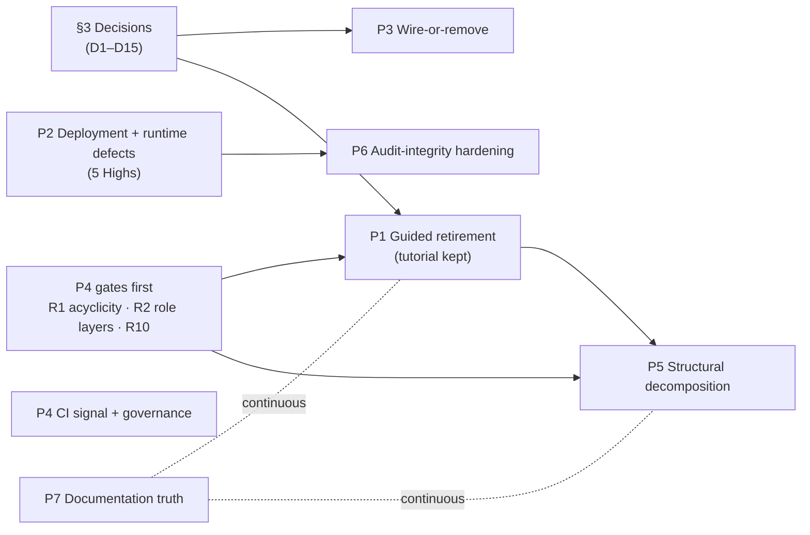

# 06 — Architect Handover: from the as-built record to improvement planning

**Pinned tree:** `release/0.8.1` @ `85ebf2739`, read from the detached worktree `.claude/worktrees/arch-analysis-pin` [measured: git -C <pin> rev-parse --short HEAD → 85ebf2739; git -C <pin> status --short | wc -l → 0].
**Readers:** the maintainer and the incoming developers.
**Purpose:** turn the as-built analysis into planned work. It maps the codebase for a new developer (§1), groups the verified concerns into seven improvement programmes in dependency order (§2), lists the decisions the maintainer must rule on before work starts (§3), lists the risks of doing the work (§4), and proposes a first ten tickets (§5). **No tickets have been created.** §5 is a list only.
**Date:** 2026-09-23 (revised 2026-09-24, R2). This document adds no new review and changes no severity. Concern severity and wording come only from `temp/verified-concerns.md` [VC §Method].
**Scope beyond the template.** The archaeologist handover template asks for a handover of findings, not a roadmap: it says the archaeologist should not rank issues as a recommendation or build roadmaps, and should offer architect consultation instead [critic G18]. §2's dependency-ordered programmes, §0's recommended order and §5's first ten tickets go beyond that template **at the analysis requester's direction** (the handover brief asked for them). Treat the ordering and the ticket list as the archaeologist's proposal, not an architect's plan. The next step this document offers is an architect review of it (see "Next step: architect consultation" near the end).

### Source tags

Every factual claim below carries one of these tags.

- `[K0NN]` is a cluster in `temp/verified-concerns.md`, the only authority for severity and wording. Paraphrases follow the cluster's *verified claim*, not the slice row's original text [VC §Method]. Refuted clusters are listed below.
- `[S07 §Responsibility]`, `[S07 §Concerns]`, `[S07 §Complexity]`, `[S07 §Test map]`, `[S07 §Baseline delta]` and `[S07 §header]` point to a section of that slice's entry in `02-subsystem-catalog.md`. `§header` means the entry's Location and Measured-size lines. `§Complexity` means "Complexity & tech-debt hotspots". `[S13 §Removal blast radius]` means S13's "Removal blast radius: staged sequence".
- `[X1 §7]`, `[X2a §3.7]`, `[X2b §G5]`, `[X2b §A.2]`, `[X3 §6]` and `[X4 §F]` point to sections of the cross-cut files in `temp/`.
- `[01 §N]` is `01-discovery-findings.md`, `[00 §…]` is `00-coordination.md`, `[05 §N]` is the validated `05-quality-assessment.md`, and `[VC §…]` is a header section of `temp/verified-concerns.md`.
- `[02 §Index]` is the index table of `02-subsystem-catalog.md`. `[S07 §Confidence]` is that slice entry's Confidence section. `[critic G7]` is gap G7 in `temp/validation-completeness-critic.md`.
- `K010`, `K045`, `K163`, `K180` and `K181` are the five **refuted** clusters; they appear only as refuted [VC §Outcome].
- `[ruling N]` is maintainer standing ruling N from the handover brief (2026-09). The numbering is: (1) architecture complete; (2) guided mode retired, tutorial kept on the shared backend as the ADR-031 canary; (3) no tech debt and no legacy pathways, no dual acceptance, no old rows; (4) unwired intent needs a wire-or-remove decision; (5) plugins are closed interfaces with no plugin-owned tables; (6) more developers are incoming; (7) the composer invariants, with K023 as an operator-sanctioned carve-out; (8) the trust-tier CI red is deliberate.
- `[measured: …]` is a command this handover ran at the pin.

Severity words next to a K-id (for example "K051 (High)") are the final severities in `verified-concerns.json` [VC §Outcome].

---

## 0. Executive summary

- **Scale.** Production Python is 489,459 lines in 875 files. `web/` is 53 % of it. The frontend adds **69,903 production TS/TSX lines in 259 files**, plus 132,755 test lines in 338 files [00 §Measured size][measured: git ls-files '*.ts' '*.tsx' under web/frontend at the pin, classified by `.test`/`.spec` suffix or a `tests/`, `test/`, `__tests__/`, `e2e/` directory → prod 69,903, test 132,755; the classifier reproduces the 202,658 total]. The 202,658 all-TS figure counts tests and must not be compared with production Python [critic G1].
- **Where the work goes.** Verification holds 182 clusters: 6 High, 92 Medium, 79 Low, 5 refuted, and 0 Critical [VC §Outcome]. K149–K182 came from the R2 gap round [VC §Method].
- **The six Highs.**
  - Four are supported-deployment or runtime defects (this handover's grouping; all six Highs are claim type *defect* [VC §Index], and each is tagged below):
    - K103 (High): `elspeth web` overwrites SSO with local auth [K103].
    - K123 (High): the Scenario C gateway sidecar cannot start [K123].
    - K051 (High): a resumed gate aborts crash recovery [K051].
    - K063 (High): one bad row in 11 batch plugins aborts the whole run [K063].
  - K062 (High) is an unbounded Jinja compile and render path on the authenticated web surface [K062].
  - K056 (High) is unwired intent: `run_mode: replay/verify` is accepted and silently runs live [K056].
- **Structure.** The module import graph is acyclic [X1 §0] and `contracts` is a true leaf [X1 §1.2]. Only `contracts < core < engine` is enforced, which leaves about 71 % of production lines ungated [K024]. With more developers arriving [ruling 6], gates come before refactors [X1 §7].
- **Guided retirement.**
  - Retirement is safe only as an extract-then-delete programme. Freeform fork and revert run on the guided-operations ledger [K012], and the tutorial runs on the guided lane [K013].
  - The ruling already keeps the tutorial's machinery, so retiring the *mode* is not blocked. Full infrastructure removal is optional future work [K013].
- **Documentation.** ARCHITECTURE.md omits `web/` from its dependency graph [X1 §1.1] and states wrong epochs and table counts [K027]. It also presents replay/verify and several deployment facts as current when they are not [K056][S20 §Baseline delta].

Recommended order: open P2 (deployment and runtime defects) and the P4 gates (X1 R1/R2) in parallel. Then run P1 (guided retirement), then P5 (structural decomposition). The gates-first and R3-after-guided-retirement order is X1's [X1 §7]; starting P2 in parallel is this handover's choice, since X1 does not cover defects. P3 decisions, P6 hardening and P7 documentation can run alongside, gated only by the decisions in §3.

The diagram encodes X1's recommended order (gates → small seams → split `sessions.protocol` → extract the domain model after guided retirement) [X1 §7] and the S13 stage order [S13 §Removal blast radius]. The P2 → P6 edge is this handover's sequencing choice. The P4 CI-signal and governance work has no ordering dependency in the sources and can start at any time.

---

## 1. How to read this codebase (a map for a new developer)

### 1.1 What it is, in one paragraph

ELSPETH is an auditable Sense/Decide/Act pipeline engine. A pipeline is a DAG of sources → transforms/gates/barriers → sinks, and every row, token, node state, external call, routing decision and sink effect is recorded in the **Landscape** audit database [01 §1]. There are two authoring surfaces over one runtime: version-controlled YAML run through the `elspeth` CLI, and the **Web Composer**, where an LLM tool loop authors the graph and server-side validation, custody and advisor gates check it [01 §1]. There are two primary databases: the Landscape and the Sessions DB [01 §3]. A third store, `data_dir/auth.db`, holds local credentials [S14 §Baseline delta][S18 §Baseline delta].

### 1.2 Entry points

| Command | Target | Source |
|---|---|---|
| `elspeth` | `elspeth.cli:app`: run, validate, resume, explain, doctor, web, join, abandon, composer users, and more (17 leaf commands) | [01 §4][S09 §Baseline delta] |
| `elspeth-mcp` | `elspeth.mcp:main`, the read-only Landscape analysis MCP server (33 tools) | [01 §4][S09 §Baseline delta] |
| `elspeth-composer` | `elspeth.composer_mcp:main`, composer-as-MCP. It is absent from ARCHITECTURE.md | [01 §4][S09 §Baseline delta] |
| `check-contracts` | `scripts.check_contracts:main` | [01 §4] |
| pytest11 plugin | `elspeth.testing.pytest_xdist_auto`, which does nothing under the default `addopts -n 12` | [01 §4][K032] |
| Web app | `elspeth.web.app:create_app` (`web/app.py:1239`), launched by `elspeth web` (`cli.py:4792`) | [01 §Validation corrections] |

The top-level package layout at the pin is `contracts/ core/ engine/ plugins/ telemetry/ testing/ tui/ mcp/ composer_mcp/ web/` plus `cli*.py` and `config_loading.py` [measured: ls <pin>/src/elspeth].

### 1.3 The 25 subsystems, three sentences each

Sizes are from each entry's measured header. The group validators re-checked 369 claims across the 25 catalog entries and found 52 wrong (14 %), all corrected in place; with the discovery document's own check (42 checked, 10 fixed) the Workflow A total is 411 checked and 62 wrong (15 %) [02 §Index][00 §Execution Log]. Claims outside that sample were not re-checked and may be wrong at a similar rate, so treat unverified figures as approximate.

**Core runtime (S01–S09)**

- **S01 Contracts (L0).**
  - It is the shared vocabulary every layer imports: audit DTOs and the terminal model, plugin and context protocols, the error taxonomy and Tier-1 registry, declaration contracts, sink-effect and audit-export capabilities, and canonical hashing [S01 §Responsibility].
  - It is 34,196 lines in 96 files and has 0 outbound imports [S01 §header][X1 §1.2].
  - Watch for the web-domain types drifting into L0 with no ownership record [K036], and the audit scrubber missing AWS and Anthropic keys, K035 (Medium) [K035].
- **S02 Core (non-Landscape).**
  - It sits between contracts and everything above. It holds the Settings model, DAG construction and build-time contract validation, canonical hashing, the safe expression language, the payload store and checkpoint/resume admission [S02 §Responsibility].
  - It is 26,755 lines in 55 files; `build_execution_graph` alone is 1,829 lines [S02 §header][05 §4.2].
  - The expression parser has no depth or amplification bound at runtime, K037/K038 (Medium). The composer mirrors the DAG walks by hand, K002 (Medium) [K037][K038][K002].
- **S03 Landscape DB, schema and facades.**
  - It owns the Landscape audit store: a 47-table SQLAlchemy Core schema at epoch 43, engine opening for SQLite, SQLCipher and PostgreSQL, the `RecorderFactory` composition root, the fences and the DB-clock deadline guard [S03 §Responsibility].
  - It is 19,798 lines across 34 top-level modules [S03 §header].
  - The "complete" export omits whole ledgers, K040 (Medium). Terminal and status invariants have no DB CHECKs, K026 (Medium) [K040][K026].
- **S04 Landscape ledgers.**
  - These are the Tier-1 audit and recovery ledgers: the durable token scheduler and barrier journal, the recoverable sink-effect ledger, and row/token/outcome lineage. Every write is fenced by a coordination token and stamped with DB time [S04 §Responsibility].
  - They are 19,155 lines in 33 files (execution 8,337, scheduler 6,519, data_flow 4,299) [S04 §header].
  - Barrier adoption and marker reset write no `scheduler_events` row, K044 (Medium) [K044].
- **S05 Engine orchestration.**
  - It owns one run from admission to terminal record: the fresh-run lifecycle, crash resume, the one-leader and claim-only-follower worker shape, commencement gates and abandonment [S05 §Responsibility].
  - It is 18,994 lines in 54 files [S05 §header].
  - Followers run without the expand-width fence and never retry, K047/K048 (Medium). Every sink-bound token is held in memory until the source loop ends, K049 (Medium) [K047][K048][K049].
- **S06 Engine row processing.**
  - It drives each row and its tokens through the DAG under a durable scheduler claim, running node executors with audit-guarded node states and holding tokens at four barrier kinds [S06 §Responsibility].
  - It is 24,168 lines in 31 files. `RowProcessor` is 5,161 lines, K055 (Medium) [S06 §header][K055].
  - `GateExecutor` ignores resume attempt offsets and aborts crash recovery, K051 (High) [K051].
- **S07 Plugin infrastructure, sources, sinks and LLM support.**
  - It owns the plugin framework (pluggy hookspecs, discovery, nominal base classes, audited external-call clients) and the two Tier-3 boundary families, sources and sinks [S07 §Responsibility].
  - It is 33,871 lines of the 66,811-line `plugins/` package [S07 §Baseline delta].
  - `run_mode: replay/verify` is accepted and never consumed, K056 (High). The Jinja sandbox is unbounded, K062 (High) [K056][K062].
- **S08 Transforms.**
  - Each transform takes a row (or a buffered batch) and returns a `TransformResult`, some through audited external calls. None owns its own persistence [S08 §Responsibility][ruling 5].
  - It is 32,940 lines in 80 files; discovery returns 38 transforms, 9 sources and 9 sinks [S08 §header].
  - Eleven batch plugins abort the run on one bad row, K063 (High) [K063].
- **S09 Operator surfaces.**
  - These are the non-browser entry points: the Typer CLI, the shared YAML settings loader, the Textual TUI, the two stdio MCP servers, the telemetry subsystem and the shipped test-factory kit [S09 §Responsibility].
  - They are 19,572 lines in 47 files; `cli.py` alone is 4,802 lines [S09 §header][measured: wc -l <pin>/src/elspeth/cli.py → 4802].
  - `elspeth explain` cannot open a PostgreSQL Landscape, K072 (Medium). Telemetry `flush()` can hang forever, K070 (Medium) [K072][K070].

**Web Composer backend (S10–S20)**

- **S10 Composer core loop.**
  - It turns a chat message plus the immutable `CompositionState` into an LLM-authored pipeline change, through either a one-shot planner or an iterative tool loop, with two-stage validation and an advisor gate [S10 §Responsibility].
  - It is 39,223 lines in 24 files. `service.py` is 11,377 lines and `state.py` is 9,064 [S10 §header][measured: wc -l composer/service.py composer/state.py → 11377, 9064].
  - It contains functions of 2,000+ lines, K075 (Medium), and a service that fuses six responsibilities, K074 (Medium) [K075][K074].
- **S11 Composer tools.**
  - It declares, admits, dispatches and finalises every LLM-callable tool. Each tool is an immutable `CompositionState` transition wrapped in a validated `ToolResult` [S11 §Responsibility].
  - It is 22,586 lines in 18 files, exposing 42 tools [S11 §header][S11 §Baseline delta].
  - `tools/_common.py` is a 3,971-line sink that every tool plane imports, K079 (Medium) [K079].
- **S12 Composer governance.**
  - It admits and audits advisor verdicts, auto-wires required controls, holds inline-content custody, redacts persisted tool calls, binds proposals to commits, lowers state to YAML and back, and runs the tutorial through the ordinary execution service [S12 §Responsibility].
  - It is 22,786 lines in 58 modules plus 1,716 lines of skills [S12 §header].
  - Required-control insertion is the one sanctioned server-authored structure, K023 (Low), and the advisor END gate has no ADR, K082 (Low) [K023][K082].
- **S13 Guided lane (retiring).**
  - It is a four-step server-driven wizard. The mode is retired, but the tutorial still runs on it, and its retry-safe operation ledger now also serves freeform revert and fork [S13 §Responsibility][ruling 2].
  - It is 35,495 lines of guided-named Python in 37 files, plus at least 9,638 lines embedded in shared modules [S13 §header].
  - It is the subject of programme P1 (§2.1). ADR-031's canary premise has been stale since the retirement, K160 (Medium), and the tutorial fetches its scrape fixtures from public GitHub Pages at runtime, K161 (Medium) [K160][K161].
- **S14 Sessions domain.**
  - It owns the Sessions DB (a 47-table schema at epoch 66), same-session locking, the typed session protocol and `SessionServiceImpl`, the async facade every web domain calls [S14 §Responsibility].
  - It is 32,480 lines in 27 files. `SessionServiceImpl` alone is 10,546 lines with 172 methods, K083 (Medium) [S14 §header][K083].
  - About 43 % of `sessions/service.py` is guided-named code [K083].
- **S15 Sessions HTTP routes.**
  - It is the FastAPI edge for composer sessions: authentication, IDOR-safe ownership, the compose lock plus durable lease, compose-loop failure persistence, and the identity-governance workflow routes [S15 §Responsibility].
  - It is 23,867 lines in 24 files, of which about 12,560 lines are S15 proper [S15 §header].
  - `send_message` and `recompose` are about 82 % duplicated and have drifted, K085 (Medium) [K085].
- **S16 Web execution.**
  - It turns a persisted `CompositionState` into an admitted, audited engine run. It owns the Stage-2 preflight, launch gates, the single background executor, progress streaming, recovery and read-only projections [S16 §Responsibility].
  - It is 20,219 lines in 34 files. It runs one pipeline per process (`ThreadPoolExecutor(max_workers=1)`) [S16 §header][S16 §Baseline delta].
  - `/execute` maps refusals to 404 and 500, K089 (Medium). The fan-out guard blocks the event loop, K090 (Medium) [K089][K090].
  - Other users' runs queue FIFO behind the one executor thread with no per-user or global bound, K150 (Medium) [K150].
- **S17 Web coordination.**
  - It is the handle-free write-authority layer for the Sessions DB: session-operation fences, leases, web-instance membership, the run-start saga, and the DB-backed shared surfaces that make multi-replica safe [S17 §Responsibility].
  - It is 16,504 lines in 27 files [S17 §header].
  - Peer compatibility columns are written but never read, K093 (Medium) [K093]. DML authority is split with `sessions/service.py`, K034 (Medium) [K034].
- **S18 Web app composition, auth and identity.**
  - It builds the FastAPI process: settings, startup order, middleware, error envelopes, local and OIDC authentication into an ELSPETH session token, secrets, key derivation and preferences [S18 §Responsibility].
  - It is 20,922 lines in 46 files [S18 §header].
  - Synchronous auth-audit writes on the event loop, K096 (Medium), and admission-timeout 500s, K097 (Medium) [K096][K097].
- **S19 Web supporting domains.**
  - These are blob custody, the plugin-policy compiler with per-principal snapshots, the plugin catalog projection, HMAC share-link tokens and audit readiness [S19 §Responsibility].
  - They are 15,823 lines in 36 files [S19 §header].
  - Share-link recipient views are not audited, K102 (Medium). A credential regex redacts dotted identifiers, K101 (Medium) [K102][K101].
- **S20 Deployment and operations.**
  - It turns `WebSettings` plus a deployment target into a fail-closed boot decision, exposes `/api/health` and `/api/ready`, provides `elspeth doctor`, and ships per-cloud acceptance harnesses inside the image [S20 §Responsibility].
  - It is 3,512 runtime lines plus 19,900 acceptance lines [S20 §header].
  - `elspeth web` overwrites SSO with local auth, K103 (High) [K103].

**Frontend (S21–S23)**

- **S21 Frontend data layer.**
  - It is the browser-side contract with the backend: typed fetch wrappers and wire decoders at the Tier-3 boundary, the run-progress WebSocket, twelve Zustand stores and hand-written mirrors of the backend schemas [S21 §Responsibility].
  - It is 22,894 production lines. `sessionStore.ts` is 4,809 lines [S21 §Baseline delta][05 §4.1]. A TS/TSX-only production/test classifier gives 22,418 production and 30,843 test lines for the slice's directories; the 476-line difference from the entry is not reconciled [measured: same classifier as §0, split by the 00 slice paths].
  - Unchecked `parseResponse<T>` casts bypass the strict decoder, K033 (Medium). Cross-tab logout is broken, K107 (Medium) [K033][K107].
- **S22 Frontend chat and tutorial.**
  - It renders the freeform transcript, the retiring guided wizard, the frozen-script tutorial and the single top-level "Awaiting your decision" panel. It is a view over the stores and never an authority over pipeline structure [S22 §Responsibility].
  - It is 64,663 lines in 146 files including tests [S22 §header]. Of the TS/TSX, 20,745 lines are production and 37,092 are test [measured: same classifier as §0, `components/{chat,tutorial,composer}`].
  - `ChatPanel` is a 3,094-line single function, K108 (Medium) [K108].
- **S23 Frontend workspace shell.**
  - It is the React 18 shell: authentication, hash routing, the three-pane workspace, the React Flow graph, run launch and monitoring, every modal surface, the `ui/` primitives and the Playwright E2E harness [S23 §Responsibility].
  - It is 100,417 lines in 333 files [S23 §Baseline delta]. Most of that is tests: of the TS/TSX, 26,740 lines are production and 64,820 are test [measured: same classifier as §0, every frontend path outside the S21 and S22 directories]. The three slice production figures sum to the 69,903 total.
  - It has no import-boundary rule and a 21-bucket SCC, K110 (Medium). One E2E spec fails every time, K113 (Medium) [K110][K113].

**Enforcement and satellites (S24–S25)**

- **S24 Enforcement architecture.**
  - It turns the invariants (trust tiers, layer direction, audit-evidence nominality, immutability, plugin contracts, CI hygiene) into machine checks on three surfaces: pre-commit, pytest whole-tree gates and GitHub Actions [S24 §Responsibility].
  - `elspeth-lints` is 44,283 non-fixture lines with 24 rules in 10 families (7 `Category` values) [S24 §header][K135][critic G12].
  - The deliberately red static-analysis job halts at a different red and skips 9 later gating steps, K116 (Medium) [K116].
- **S25 Satellites.**
  - These sit outside the wheel: the LLM compatibility gateway (a separately deployed translation service), the operator-run evals, the runnable examples catalogue, and the website that also hosts the tutorial's runtime fixtures [S25 §Responsibility].
  - The gateway is 10,498 lines of Python, of which 3,230 are `src` production, 5,757 `tests/` and 1,511 conformance/mock/scaffold tooling [critic-2 N1]; evals 7,028; examples 53 directories [S25 §header][00 §Measured size].
  - The Scenario C gateway sidecar cannot start, K123 (High) [K123].

### 1.4 Where the invariants live, and which gates enforce them

| Invariant | Where it lives in code | What enforces it | Enforcement gap |
|---|---|---|---|
| Layer direction `contracts(L0) < core(L1) < engine(L2) < rest(L3)` | Package layout | `trust_tier.tier_model` rule L1, which covers lazy imports; mutation controls fire [X1 §5.1] | L3 is not scanned, about 71 % of lines [K024]; not evaluated on push [K119] |
| `contracts` is a runtime leaf | `contracts/` | `tests/unit/contracts/test_leaf_boundary.py` [X1 §5.1] | none measured |
| Module-level acyclicity | Whole tree (0 SCCs over 875 modules) | **nothing** [X1 §5.2] | P4 step 1 (R1) |
| Web role layering (domain < service < routes < app) | 98.3 % true by filename heuristic [X1 §2.7] | **nothing** apart from two acceptance-package tests [X1 §5.1] | P4 step 2 (R2) |
| Terminal-outcome model (3 outcomes × 16 paths, 14 legal pairs, `completed` XOR `outcome IS NULL`) | Python tables in `contracts`, checked on write and on read [X2a §2] | Python only; one partial unique index at DB level [K026] | P6 step 1 |
| DB-clock authority (ADR-047) | `core/landscape` deadline issuance | `test_database_clock_authority.py` (126 reviewed identities) [X3 §3.2]; the gate passed 499 of 499 [X2b §Part A] | Sessions side has 7 clock implementations [K094] |
| Token fencing of Landscape mutations (ADR-048) | 89 of 91 mutation APIs take a required keyword-only token [X2b §Part A] | `test_web_landscape_mutation_fencing.py` (DML write set of 70) [X3 §3.2]; 721 of 721 [X2b §Part A] | ADR status decision (D7) [K028] |
| Sessions-DB writer authority | `web/coordination` typed writers | `test_session_db_mutation_authority.py` (295 reviewed writers) [X3 §3.2] | DML authority split across two packages [K034][K100] |
| Declaration contracts (7 contracts, 4 dispatch sites) | Registry frozen and checked at `prepare_for_run()` [X2a §2] | Bootstrap assertion that the manifest equals the registry [05 §8] | Collector closer never dispatches [K132] |
| Trust tiers (Tier-1 crash, Tier-3 validate at boundary) | Plugin and boundary code | R1–R9, `trust_boundary.*` honesty rules, masquerade gate [S24 §Baseline delta] | Trust-boundary rules never run in CI [K117] |
| Validate by trust domain (ADR-032) | 24 `runtime_checkable` Protocols, one used as a control [X2b §Part A] | Masquerade gate plus attribute-contracts gate [S24 §Baseline delta] | One drift site [K136] |
| Audit primacy (telemetry after the Landscape write) | Telemetry emit sites | Sampled 5 of 5 conformant [X2b §B1]; the sources name no dedicated gate | — |
| Composer invariant 1: no server-authored structure [ruling 7] | `provider="server"` appears only as a refusal [X2b §B3] | Measured by grep with a positive control [X2b §B3]; the sources name no dedicated gate | K023 carve-out not ratified in an ADR [K023] |
| Composer invariant 2: no tutorial-special paths [ruling 7] | Backend authoring path is parity-clean [X2b §A.2] | Measured by AST scan [X2b §A.2]; ADR-031 canary | 27 frontend `isTutorial` conditionals awaiting a ruling [K139] |
| Stage-1 vs runtime validation parity | `web/composer/state.py` mirrors `core/dag` | Raise-site manifest (339 sites, 13 unmirrored) plus an agreement test [K002] | Parity proves disposition coverage, not semantic equality [K002] |
| Mock discipline | Tests | `test_mock_discipline_baseline.py`, zero tolerance [X3 §3.2] | — |
| *Not mapped (R2):* whatever the state-engine plugin matrix, the two composer-redaction scripts, the pre-commit secret scanner and the telemetry-backfill trailer workflow enforce | CI and pre-commit wiring only | the five gates in P4.8 [critic G7] | never read or run in this analysis; P4.8 |

### 1.5 Traps for a new developer

1. **Read a pinned tree, and prove which code you imported.** The main checkout moved from `780ef0f56` to `85ebf2739` during this analysis because a sibling session merged, and several first-pass figures had been measured at the old commit [00 §Analysis Configuration][01 §Validation corrections]. Analysts put both source roots on `PYTHONPATH` and checked that `elspeth.__file__` and `elspeth_lints.__file__` resolved inside the pin before measuring [X3 §header][S08 §header].
2. **Whole-tree gates.**
   - 38 test files walk the tree through the sanctioned walker. Authority boundaries are closed-world manifests pinned in tests: Sessions-DB writers, Landscape DML, DB clocks and composer wire keys. The two largest pin files hold 38,984 lines [X3 §3.2].
   - Any change that touches a pinned site needs the manifest re-derived in the same commit, and a scoped local test run cannot certify it [X3 §3.2].
   - The walker regex misses `rglob("*")` plus a suffix filter, so 3 tests walk production source unguarded [K146].
3. **The trust-tier CI red is deliberate** [ruling 8][01 §7]. The details:
   - At the pin, the static-analysis job actually stops at the immutability step (a false positive at `chat_solver.py:374`) and skips 9 later gating steps, including the trust-tier step itself. The trust-boundary fingerprint mismatch is real drift hidden behind it [K116].
   - On push, the tier-model step exits 2 at allowlist load, so the layer rule is never evaluated [K119].
   - Signing cannot turn push CI green while signed entries exist [K120].
   - Merges are still blocked by `ci-success` [K117][K118].
4. **`--root src/elspeth` makes two lint rules vacuous locally.** `meta.no-new-bespoke-cicd-enforcer` and `manifest.test_to_source_mapping` are vacuous under that root. CI runs them with `--root .` [K121].
5. **The default `pytest tests/` excludes testcontainer.** `web.coordination`'s coverage lives mostly in the PostgreSQL-only job [X3 §8.1]. That job's 30-minute timeout is at about 87 % of budget [K147].
6. **Browser E2E never drives the composer LLM loop.** Provider keys are blanked and composer interactions are fixtures, so a green E2E says nothing about LLM authoring [K030].
7. **retired code index is stale.** Its "0 import cycles" is a null result from empty import edges, so do not cite it as evidence [X1 §0][X4 §D].
8. **Line-count claims drift fast.** The tree grew by about 34K lines in the 15 days before the pin [01 §2]. Re-measure before relying on any count after `85ebf2739` [X1 §Caveats & Required Follow-ups].

---

## 2. Improvement programmes

Each programme lists ordered steps. Each step names files, the K-ids it closes, its dependencies, a size basis and acceptance evidence. **Effort:** only X1 §7 gives day-scale sizes (S ≤ 1 day, M 2–5 days, L 1–3 weeks) [X1 §7]. For everything else the sources give line, file and test counts, and those are quoted as the size basis. **The sources contain no day estimates beyond X1 §7**, and this handover does not invent them.

### 2.1 P1 — Guided retirement, with the tutorial kept

**Goal.** Close the guided *mode* for users [ruling 2]. Re-home the shared infrastructure that freeform depends on. Keep the tutorial running on the shared backend as the ADR-031 canary [ruling 2]. The tutorial's machinery is kept by the ruling, so full infrastructure removal is optional future work (Stage 3b) [K013].

**What makes this hard (verified).**

- Freeform `POST …/state/revert` and `POST …/fork` run on the guided-operation ledger. Its pieces are `reserve_or_replay_guided_operation`, the `guided_operations` table whose kind CHECK admits `state_revert` and `session_fork`, `settle_guided_fork_operation`, and the frontend `guidedOperationRetry.ts` [K012].
- Non-guided backend code imports guided-named modules and misfiled shared symbols: `InvariantError`, `BLOB_REF_PATH_PREFIX`, `canonical_sink_local_paths`, `project_composition_proposal`, `validation_errors_for_composer_surface` and `_join_shielded_task_after_cancellation`. With the guided package blocked, core modules fail to import [K014].
- On the frontend, `decodeCompositionState` lives in `api/guidedDecoder.ts`, `lib/validationHumaniser.ts` takes constants from `chat/guided/pipelineGloss`, and `types/index.ts` imports `types/guided` [K015].
- Guided code is embedded in shared god-files: at least 41 % of `sessions/service.py`, 31 % of `sessions/protocol.py`, 744 lines of `sessionStore.ts` and 599 of `ChatPanel.tsx` [K016].
- Every freeform session open, fork and revert probes `GET /guided?probe=true`. Fork hydration and revert use "throw" mode, so both would fail if the route disappeared [K020].
- All of these are **latent removal hazards; nothing is broken today** [K012][K014][K015].
- **The canary premise has moved (R2).** ADR-031 is still titled and justified as a canary for "the same guided machinery every user exercises". After the retirement ruling, the tutorial canaries a planner surface no ordinary user drives, and freeform, now the only user surface, has never had a non-adaptive fixed-script canary (the composer battery is manual-fire and uses a live LLM). The retirement did not create the freeform gap; it moved it onto the primary surface. `guided-collector.spec.ts` still runs in CI at the pin [K160].
- **The canary depends on the public internet (R2).** The tutorial's three scrape fixtures come from `https://dta-au.github.io/elspeth/tutorial-site/…`, published from `main` with no version. The `tutorial_sample_base_url` override cannot point at a private mirror because the `public_only` SSRF gate refuses private addresses, and the override is not in operator documentation. This already broke every deployment once, when the repository moved (`elspeth-88219032db`, closed) [K161].

**Structural payoff, stated honestly.** Deleting the guided lane drops `sessions → composer` from 133 to 53 module-level statements and from 55 to 9 lazy ones. It **does not break any package cycle** by itself [X1 §7 R9]. Do not sell P1 as a layering fix.

**Steps (the S13 staged sequence)** [S13 §Removal blast radius]

**P1.0 — Stage 0 (landed at the pin).** The preferences radio is disabled [S13 §Removal blast radius]. The server and DB still accept `default_composer_mode='guided'`, and that interim state was chosen on purpose in `cebd2f263` [K018].

**P1.1 — Stage 1: close the user-facing entry points.**
- *Files:*
  - backend: `web/preferences/service.py` (reject `default_mode="guided"` on write) [S13 §Removal blast radius]; `preferences/models.py:136`, `:55` and `preferences/routes.py:95-99` [S13 §Concerns S13-C4]; the `/convert` (331 lines) and `/reenter` (309 lines) handlers [S13 §Removal blast radius]; `sessions/routes/composer/guided_plan.py` (1,011 lines), `plan_guided_full_pipeline` (159), `stage_guided_full_pipeline_proposal` (314), the `PlannerSurface.GUIDED_FULL` arms and the `guided_plan` blob-fence kind [S13 §Removal blast radius][K017].
  - frontend: the `createSession` guided-default arm (`sessionStore.ts:1854-1858`), `enterGuided`/`convertToGuided`/`reenterGuided`, the CommandPalette `reenter-guided` command and the `ModeSwitchButton` guided arm [S13 §Removal blast radius][K015][K017].
- *Prerequisite inside the step:* `_guided_full_failure_code` in `guided_plan.py` is still used by the live `/guided/respond`, so relocate it before deleting the file [K017].
- *Closes:* K017 (Medium) [K017] and the write-path half of K018 (Low) [K018]. It resolves the tracker P1 `elspeth-da0e3db919` [X4 §E] only after the settlement-path check X4 asks for (see the end of P1) [X4 §Caveats & Required Follow-ups].
- *Depends on:* decision D9 (what a stored Guided default becomes) [S13 §Removal blast radius].
- *Size basis:* about 2,124 route and service lines, the sum of the figures named above [S13 §Removal blast radius]. About 12 `/guided/plan` test files and the convert/reenter cases of the 5,412-line `sessionStore.guided.test.ts` go red and must be **deleted, not skipped** [S13 §Removal blast radius].
- *Rulings conflict:* S13 offers "keep read-only replay" for stored `guided_convert`/`guided_reenter`/`guided_plan` rows [S13 §Removal blast radius]. That conflicts with the no-legacy-pathways ruling [ruling 3]. The consistent option is to narrow the kind CHECK in a session-epoch bump (DB recreate), and to batch that bump with Stage 2's to cut recreate cost [S13 §Concerns S13-C8].
- *Acceptance evidence:* a PATCH of `default_mode: "guided"` is refused. There are 0 production callers of the removed routes (grep with a positive control). The tutorial E2E specs (`tutorial.spec.ts`, `tutorial-reliability.staging.spec.ts`) stay green [S13 §Test map].

**P1.2 — Stage 2: relocate misfiled shared code (behaviour-neutral renames).**
- *Files:*
  - Ledger rename: `guided_operations` → a neutral name such as `composer_operations`/`reserve_or_replay_operation`, with neutral `error_type` strings on both sides [S13 §Removal blast radius]. This covers `web/sessions/guided_operations.py`, `web/sessions/routes/guided_operations.py`, `routes/composer/state.py:738-770`, `routes/sessions.py:1028-1031`, `models.py:1121`, `blobs/service.py:505-520` and the frontend `guidedOperationRetry.ts:373` and `sessionStore.ts:3016, 3749` [S13 §Concerns S13-C1].
  - Symbol moves: `project_composition_proposal` and `validation_errors_for_composer_surface` out of `guided_replay.py`; `_join_shielded_task_after_cancellation` to a coordination or async utility; `InvariantError` to the composer error hierarchy; `BLOB_REF_PATH_PREFIX` to `web/blobs` or `contracts/blobs`; `canonical_sink_local_paths` to a paths helper; the `guided_blob_refs` validators to custody [S13 §Removal blast radius][K014].
  - Frontend: `decodeCompositionState` out of `api/guidedDecoder.ts`, the humaniser constants out of `chat/guided/pipelineGloss`, and shared types out of `types/guided` [K015].
  - Mode detection: replace the `GET /guided?probe=true` probe in `selectSession`, `forkFromMessage` and `revertToVersion` (`sessionStore.ts:1981, :3071`) **before** any route removal [K020][S13 §Removal blast radius].
  - L0 contracts: the guided fences and `GuidedCustodyIntegrityError` in `contracts/` [K036].
  - ACA fence probe P1: it drives `/guided/respond` and counts `guided_operations` rows (`replica_probes.py:206-212, 314, 634`, `controller.py:57, 299-305`), so update it with the rename [K021].
- *Closes:* K012 (Medium), K014 (Medium), K015 (Medium), K020 (Low), K021 (Low), and the guided half of K036 (Low) [K012][K014][K015][K020][K021][K036].
- *Depends on:* P4 R1/R2 gates in place, so the moves cannot introduce cycles [X1 §7]; P1.1.
- *Size basis:* 21 test files exercise fork and revert through `guided_operation` names, and they are rename targets, not deletions [S13 §Test map]. `test_guided_operation_replay_after_verified_sites.py` pins 8 expected sites [X3 §3.2].
- *Risks:* the table rename is an epoch bump. The wire `error_type` rename must ship as one coordinated frontend and backend release because the decoder is strict. The step also touches whole-tree AST gates and trust-tier allowlist bindings (signature churn, an honest release obligation) [S13 §Removal blast radius].
- *Test gap to close first:* no test proves that revert and fork survive a ledger rename, because the tests name the ledger "guided" [S13 §Test map].
- *Acceptance evidence:* with `web.composer.guided` blocked from import, `CompositionState`, the freeform tools, both service modules and `routes/messages` still import. (K014 used that probe to demonstrate the hazard [K014].) The 21 fork and revert test files pass under the new names [S13 §Test map]. Session selection makes no `/guided` request.

**P1.3 — Stage 3: the wizard itself — blocked on decision D2** [S13 §Removal blast radius].
- **3a (tutorial stays on guided, the ruling's current position)** [ruling 2][K013]:
  - Stop removing code here [S13 §Removal blast radius].
  - Rename the concept to "tutorial wizard" so the AGENTS.md parity-sweep rule and ADR-031's "general surface" wording match reality [S13 §Removal blast radius].
  - Amend ADR-031 to say it now canaries tutorial-only machinery [S13 §Removal blast radius]. K160 (Medium) is the verified form of this gap: the ADR has not been amended since the ruling [K160].
  - Add a frozen-input walk for the freeform surface, which ADR-031's Consequences already prescribes [S13 §Removal blast radius]. Without it, freeform has no machinery canary at all [K160].
  - Make the tutorial fixtures ship with the release, or make the override reach a private mirror and document it, so the canary does not depend on github.io egress or on unversioned site content [K161].
  - Under 3a, K016 (Medium), K019 (Medium) and the guided share of K108 (Medium) stay open as decomposition debt inside tutorial machinery [K016][K019][K108].
  - *Closes under 3a (R2):* K160 (Medium), once ADR-031 is amended and a freeform frozen walk exists, and K161 (Medium), once the fixtures no longer need public egress [K160][K161]. Both also apply under 3b, where the new frozen freeform script is the canary.
- **3b (tutorial migrates to freeform):**
  - A new frozen freeform script comes first. It needs ADR-031/049 rewritten and a new baseline calibration [S13 §Removal blast radius].
  - Then delete `web/composer/guided/`, the guided routes, about 6.2K guided lines in `sessions/service.py`, the guided `sessions/protocol.py` types, `plan_guided_pipeline`, the EXIT-BRIDGE prompt, the frontend `components/chat/guided/`, `guidedDecoder.ts` and `types/guided.ts`, the ChatPanel and sessionStore guided arms, and `CompositionState.guided_session` [S13 §Removal blast radius].
  - `tutorial_service.py` (839 lines) has no guided import and survives unchanged [S13 §Removal blast radius].
- *Closes under 3b:* K013 (Medium), K016 (Medium), K019 (Medium) and K022 (Low); it also reduces K083 (Medium) and K108 (Medium) [K013][K016][K019][K022][K083][K108].
- *Size basis (3b):* 35,495 guided-named Python lines in 37 files plus at least 9,638 embedded lines. The frontend has 9,304 production lines in `components/chat/guided/` plus 4,193 in 7 other guided-named files [S13 §header]. The 9,304 figure (32 production files) includes the 2,644-line `guided.css`; the TS/TSX alone is 6,660 lines in 31 files, and that is the figure comparable with the 69,903 production TS/TSX in §0 [measured: git ls-files in components/chat/guided at the pin, test files excluded, wc -l per file]. It **does include** seven helpers that no slice names individually: `nodeOptionDisplay.tsx` 161, `GuidedPendingStrip.tsx` 131, `guidedRationale.ts` 129, `behaviorSummary.ts` 101, `GuidedDecisionPendingIndicator.tsx` 70, `WireReviewList.tsx` 64 and `explainPrompt.ts` 50, 706 lines in all [critic G16][measured: git ls-files in components/chat/guided at the pin, test files excluded → 32 files, 9,304 lines; wc -l of each helper; control: a nonexistent name matches 0 files]. A file-by-file P1 inventory must list them. `components/admin/*` (People & access, ≈858 lines never named by a slice) is outside P1 [critic G16]. 107 guided-named test files hold 88,388 lines and 1,974 tests. 282 of 2,380 Python test files mention guided [S13 §Test map].
- *Risks (3b):* the custody checks in redaction, YAML export and execution proof that inspect guided history (`execution/service.py:1340-1345`) must be removed in the **same epoch** as the data they guard, or they become silently dead guards [S13 §Removal blast radius].
- *Removal inventory (3b):*
  - two evals repros hold 5 guided imports [K022];
  - `tests/unit/website/test_release_site_contract.py:11, :168` imports and asserts guided schema text [K022];
  - `website/get-started.html:106` publishes "The guided schema remains at 11" [K022];
  - `live_acceptance.py:103` names the guided surfaces [K022].

**P1.4 — Stage 4: schema cut (one epoch, batched)** [S13 §Removal blast radius].
- *Files:* the `guided_operations.kind` CHECK; `default_composer_mode` (remove `'guided'`); under 3b also `proposal.rebased` and `guided_operation_admission_blocks` [S13 §Removal blast radius].
- *Closes:* the DB half of K018 (Low) [K018].
- *Mechanics:* a session-DB recreate plus the bootstrap-admin runbook step. There is no migration path, by design [S13 §Removal blast radius][ruling 3].
- *Acceptance evidence:* a fresh store at the new epoch refuses a guided default and a retired kind. The tutorial and the freeform fork/revert suites pass.

**Frontend items that ride with P1:**
- The 27 real `isTutorial` conditionals in 8 files (28 behaviour-bearing sites counting the `readOnly` binding) need a ruling under invariant 2 (decision D3) [K139][X2b §G5].
- The ADR-031 compensating control `tests/e2e/guided-collector.spec.ts` goes with the guided lane, and ADR-031 names it [S23 §Baseline delta].
- `bounded_admission_guard` assumes a single-instance deployment, which conflicts with the multi-replica direction. This is catalog row S13-C13, a Low row that was never re-verified and belongs to no K cluster [S13 §Concerns][VC §Method].
- **K162 (Medium).** `dedupeGuidedUserMessages` (`guidedReplay.ts:31-61`) matches on trimmed content. A guided planner non-proposal settlement (an advisor decline of a step-3 revision, or a step-4 wiring correction) records the user's instruction in `chat_history` with no `chat_messages` twin, so a later identical freeform re-send is dropped from the rendered transcript. Reach needs a terminal guided session (the tutorial or a legacy session). The keyless match is tracked as `elspeth-c5adc9db18` [K162]. It closes with the guided replay code under 3b, or needs a keyed match under 3a.
- **K159 (Low).** `audit_readiness` detects "the tutorial" by composition shape (`_tutorial_candidate`, `web/audit_readiness/service.py:115-128`) and labels a "Tutorial required controls" row on any ordinary pipeline of that shape. It is diagnostic drift in a read-only projection, not an authoring-path violation, but ADR-031 still has to rule on it (with D3) [K159].

**Tracker rows gated on this programme:** the guided-lane P1s `1318049ffe`, `7578b41719`, `cc1f5e49d1`, `da0e3db919` and `f561d651c8` [X4 §E]. The S12 tutorial re-run `b56bc96c73` is related, but X4 does not list it as gated by the retirement [X4 §E]. X4 advises keeping `da0e3db919` and `f561d651c8` open until someone checks whether the tutorial's retained settlement path is affected [X4 §Caveats & Required Follow-ups].

---

### 2.2 P2 — Supported-deployment and runtime defects

**Goal.** Fix the five Highs outside P3 [VC §Outcome] and the Mediums that break or degrade a supported deployment or a run. None of these needs a maintainer decision first, except where noted.

**P2.A — Shipped deployments that fail to boot, or boot insecurely.**

1. **K103 (High): `elspeth web` overwrites the auth provider.**
   - *Facts:* `cli.py:4747` declares `auth: str = typer.Option("local", …)` and `cli.py:4789` writes `os.environ["ELSPETH_WEB__AUTH_PROVIDER"] = auth` unconditionally [measured: sed -n 4745,4749p and grep -n ELSPETH_WEB__AUTH_PROVIDER <pin>/src/elspeth/cli.py].
   - *Effect:* ACA/entra crash-loops while the doctor passes. ECS upgrade mode (oidc) **silently boots local auth with open registration behind an internet-facing ALB**, and readiness reports "local authentication configured" [K103]. The origin ticket was closed by the fix that introduced the unconditional write [K103].
   - *Files:* `src/elspeth/cli.py:4747, 4789`; `docs/guides/identity-providers.md:208`, whose claim that every setting comes from an `ELSPETH_WEB__…` env var is false for `auth_provider` under `elspeth web` [S20 §Baseline delta].
   - *Acceptance evidence:* with `ELSPETH_WEB__AUTH_PROVIDER=entra` (and `=oidc`) set and no `--auth`, the effective provider is unchanged. An explicit `--auth` still overrides. The ACA and ECS launchers boot on SSO.
2. **K123 (High): the Scenario C gateway sidecar cannot start.**
   - *Facts:* the sidecar gets 4 env vars plus 3 secrets, and `load_config` requires 13 names. The missing six are OAUTH_AUTH_METHOD, MAX_MESSAGES, MAX_TOOLS, MAX_STRING_CHARS, MAX_SCHEMA_BYTES and MAX_SCHEMA_DEPTH [K123].
   - *Files:* `deploy/aws-ecs/terraform/modules/scenario/ecs.tf:115-125`, `gateway/src/elspeth_llm_gateway/core/config.py:294-308`, `gateway/README.md:273` [K123].
   - *Acceptance evidence:* a test that parses the task definition's env and secret names and asserts they are a superset of `load_config`'s required set. The Scenario C task and runtime doctor reach HEALTHY.
   - *Related:* K124 (Medium), the conformance kit cannot qualify a real derived adapter [K124]; K125 (Low), adapter identity is only shape-checked (see P3) [K125]; K126 (Low), the base gateway image has no dependency lock [K126].
3. **K004 (Medium): uvicorn has no `forwarded_allow_ips`.** Behind nginx all clients share one 20/min bucket, and over-limit `auth_failure` audit rows are dropped for all clients at once [K004]. *Files:* the `uvicorn.run` call in `elspeth web` (`cli.py`), the Compose web overlay and the `Dockerfile`, none of which sets `FORWARDED_ALLOW_IPS` [K004].
4. **K105 (Medium): the ACA probe can only qualify a topology production never uses.** The strict model pins `minReplicas`/`maxReplicas` to `Literal[2]` and the production stage of `acceptance.sh` overrides the parameters to 2/2, while the production bicepparam and `workload.bicep` say 2–4 [K105]. *Files:* the ACA single-revision acceptance model, `acceptance.sh`, the production bicepparam [K105].
5. **K106 (Medium): PostgreSQL TLS is checked only when `deployment_target == aws-ecs`.** On ACA it depends on URL shape alone [K106]. *Files:* the provider-neutral external-PostgreSQL contract (`web/deployment_contract.py`) and the doctor's `session_tls`/`landscape_tls` proof behind `include_aws_checks` [K106][S20 §header].
6. **K084 (Medium): archive quarantine needs `renameat2(RENAME_NOREPLACE)`.** That is unverified on the EFS and Azure Files NFS `data_dir` that both clouds use [K084]. *Files:* the session archive-quarantine module (1,153 lines, called only from `archive_session`) [S14 §Baseline delta][K084].
7. **K072 (Medium): the operator tools cannot open a PostgreSQL Landscape.** `resolve_database_url` always builds `sqlite:///<path>` for `--database`, which affects `explain`/TUI and the `--database` overrides on purge, resume, export-resume, abandon and join [K072]. *Files:* `resolve_database_url` and those CLI verbs in `cli.py` [K072].
8. **Lows in the same area:** K098, local-auth `auth.db` is SQLite under `data_dir` even in external-postgresql mode [K098]; K104, production ECS boot runs `python -m elspeth.web._aws_ecs_acceptance.ecs_metadata` [K104]; K059, the spool root in `plugins/sinks/_remote_object_effects.py:336-344` is CWD-relative [K059].
9. **K154 (Medium, R2): no runtime check of the PostgreSQL server version.** ADR-041 qualifies only a `postgresql-16` profile, and every PostgreSQL proof runs on `postgres:16-alpine`. No startup, doctor or schema-probe path reads the server version, and the supported ACA bundle defaults `postgresVersion` to `'17'` (allowing 16–18). So the default ACA deployment runs the lock, CHECK-reflection and DB-clock logic on a major version no test exercises, without telling the operator. No PG 17 failure has been shown [K154]. *Files:* `deploy/azure-container-apps/environment.bicep:55-61`, `main.bicep:34`; the doctor and schema-probe paths in S20 [K154]. *Acceptance evidence:* the doctor or startup reports the server major version and refuses or warns outside the qualified set, and the ACA default matches a version the testcontainer suite runs (this may need an ADR-041 catalog revision for ACA, which the ADR's own amendment requires) [K154].
10. **Lows added by R2:** K153, the Landscape has no explicit dialect refusal, although an unsupported URL still fails at open with an incidental compile error [K153]; K177, `WebSettings.execution_rate_limit.persistence_path` is validated only per run, so a bad path passes boot and then fails every web run [K177].

**P2.B — Runtime Highs.**

1. **K051 (High): the gate executor aborts crash recovery.**
   - *Facts:* `GateExecutor.execute_config_gate` opens `NodeStateGuard` without `attempt` or `resume_checkpoint_id` [K051]. At the pin the guard call at `engine/executors/gate.py:322` passes `token_id`, `node_id`, `member_token`, `step_index`, `input_data` and `auto_fail_phase`, and no attempt [measured: sed -n 318,334p <pin>/src/elspeth/engine/executors/gate.py].
   - *Effect:* a resumed fork-child that re-runs a gate violates `node_states` attempt uniqueness and `Orchestrator.resume` aborts. This was reproduced end to end [K051]. The same class was fixed for `AggregationExecutor` (`elspeth-262911c26b`). The drain passes `attempt_offset` to transforms only [K051].
   - *Files:* `engine/executors/gate.py`; the scheduler drain's `attempt_offset` plumbing [K051].
   - *Acceptance evidence:* the fork-child resume reproduction passes. A second test covers the lease-recovered scheduler-claim path, which verification inferred but did not execute [K051].
2. **K063 (High): one bad row aborts the run in 11 batch plugins.**
   - *Facts:* 11 batch-aware plugins raise a bare `TypeError` on a wrong-type row value, so the run aborts (exit 4, "0 failed", `on_error` never fires). Only `batch_stats` converts through `BatchRowTypeError` [K063]. 11 files still contain `raise TypeError` [measured: grep -l 'raise TypeError' <pin>/src/elspeth/plugins/transforms/batch_*.py report_assemble.py | wc -l → 11].
   - *Files:* `plugins/transforms/batch_{classifier_metrics,distribution_profile,drift_compare,effect_size,experiment_compare,outlier_annotator,paired_preference,replicate,threshold_summary,top_k}.py`, `report_assemble.py` [K063].
   - *Tracked as:* P1 `elspeth-5887fb7928` (fixing), blocked by `elspeth-d2e3f29d10` (AggregationSettings.on_error structurally inert) [K063][X4 §E]. Land the blocker first.
   - *Acceptance evidence:* for each of the 11 plugins, a wrong-type row becomes a routed batch error, `on_error` fires and the run does not exit 4.
3. **K062 (High): unbounded Jinja compile and render.**
   - *Facts:* the shared Jinja2 sandbox has no CPU or memory bound, on the premise "trusted config, not end users", which the multi-user web surface falsifies [K062].
   - *Effect:* compile-time constant folding evaluates `a ** b` inside the web process during validation. One small authenticated request can stall a replica, including its health probes [K062].
   - *Files:* `plugins/infrastructure/templates.py:36-39`, `plugins/transforms/llm/base.py:416-426`, `llm/templates.py:113`, `web/app.py:1890-1921` [K062].
   - *Tracker mismatch:* the row `elspeth-bbc7000e61` is an open **P3** while verification rates the concern High. The tracker should absorb that [K062][05 §7].
   - *Do together with:* the expression-parser siblings K037 (Medium), a raw `RecursionError` at about 250 nesting levels, and K038 (Medium), the amplification guard running only on the composer preview. Both are tracked in `elspeth-221a140f9e` [K037][K038].
   - *Acceptance evidence:* a template containing a large integer power is refused or bounded within a set budget at compile time. `/api/health` stays responsive during the attempt. A 250-deep expression raises a typed error. `row['s'] * N` is refused or bounded at runtime gate evaluation.

**P2.C — Web availability and error mapping (Mediums).**
- **K086.** The `async def get_state_yaml` route (GET `/{session_id}/state/yaml`) calls the synchronous `session_operation_authority.mutate(...)` on the event loop without `run_sync_in_worker` [K086].
- **K090.** `evaluate_execution_fanout_guard` does whole-file reads inside async `_execute_locked` (`web/execution/service.py:2145-2148`; `web/execution/fanout_guard.py`) [K090][K142].
- **K096.** Synchronous Landscape auth-audit inserts run on the event loop in the async bearer gate's failure paths and in the local login, refresh, logout, `/me` and verify-email paths. The SSO, register and verify-email success paths already use `run_sync_in_worker`/`run_auth_audit_in_worker` [K096].
- **K097.** `AsyncWorkerAdmissionTimeoutError` from `run_sync_in_worker` (`ADMISSION_CAPACITY` 16 + 16, in `web/async_workers.py`) becomes a 500 on `get_current_user` and `POST /api/auth/login`. `/register` and SSO `finish_login` already map it to 503 [K097][S18 §header].
- **K005.** A PostgreSQL lock-order deadlock between the ticket and progress writers (sessions then identity `FOR UPDATE`) and `begin_provider_attempt` (identity `FOR UPDATE`, then `FOR KEY SHARE` on `sessions` through the `quota_provider_attempts.session_id` FK). No code under `web/` handles 40P01 [K005].
- **K006.** A cancel after the start permit whose `_finalize_output_blobs` fails skips `mark_recovery_outputs_finalized`, leaving `runs.saga_state='cancel_pending'` on a terminal status, where recovery never lists it [K006].
- **K070.** `TelemetryManager.flush()` blocks forever in `queue.join()` once the export thread dies with events queued (`telemetry/manager.py:250-256, 675-676`) [K070].
- **K089.** A bare `except ValueError` in `web/execution/routes.py:1295-1301` maps `ExecutionEnvelopeRefused` to 404. `BlobRowsSourceAdmissionError` (`service.py:2231`) and `InlineBlobPromptSurfaceAdmissionError` (`service.py:1217`) are unmapped and become 500 [K089].
- **K088.** `POST /{session_id}/interpretations/{event_id}/resolve` converts `AuditIntegrityError` into an unlogged coded 500 (`sessions/routes/interpretation.py:205-212`), bypassing the logging handler at `web/app.py:1329-1351` [K088].
- **K049.** Every sink-bound token, with its full `row_data`, is appended to `loop_ctx.pending_tokens` and written only after the last source is exhausted. The link to the 10k stress RSS growth is inferred, not measured [K049].
- **K091 (Low).** On PostgreSQL, `RepositoryRunProgressReader.read_after` runs an unfiltered `count/min/max` over the run's `run_events` every 0.25 s per socket. The cost grows linearly per poll but is not a scaling hazard [K091].
- **K150 (Medium, R2) — a decision, not a bug fix (D15).** Each web process or replica runs one pipeline at a time: `ExecutionServiceImpl` holds one `ThreadPoolExecutor(max_workers=1)` and `app.py:1890-1921` refuses more than one worker per container. Other admitted runs wait in an unbounded FIFO queue with their sessions `pending`. The only bound is one active run per session; there is no per-user or global queue limit, no fairness and no run-duration cap, and the baseline and operator docs do not say runs are serialised. On ACA (2–4 sticky replicas) a queued run never moves to an idle peer. The design is deliberate; the finding is head-of-line blocking plus doc drift [K150]. Decide in D15 whether to keep serial execution (and document it, with a queue signal and a per-user or duration bound) or to add execution concurrency. Any concurrency change touches the executor, the run-start saga and recovery, so it belongs with P5's execution work rather than a quick fix.
- **Lows added by R2:** K151, the composer per-user rate limit is checked only after `_track_compose_inflight` has admitted a request lease, under a comment that says "before any work" [K151]; K157, the telemetry granularity filter fails open for unknown event types at every level. It is deliberate and no current event class reaches the default arm, but no test forces a new class to be classified [K157].

**P2.D — Composer and session correctness (the web-review wave).** The multi-query LLM contract cluster is the strongest cross-source signal [X4 §E]. The tracker P1s `edb1b2deae` and `f1a365b714` are already in progress on it, so coordinate before starting [X4 §E].
- **Multi-query:**
  - K064: `resolve_queries` reserves only the bare suffixes (`plugins/transforms/llm/multi_query.py:347-359`), so an output field equal to `response_field` or its `_model`/`_usage` form is overwritten at `transform.py:814, 819`. The single-prompt guard at `base.py:513` returns early for queries (`base.py:498-509`) [K064].
  - K081: `ValidationProbeCache._construct` (`web/composer/state.py:2124-2129`) does not defer when `LLMConfig.queries`' union (`llm/base.py:215`) adds a non-marker error [K081].
  - K109: the frontend's `multiQuerySurfaceFromOptions` returns null without a node-level `prompt_template`, so `resolvePromptDisplaySegments` disables Approve (`components/chat/AcknowledgementCard.tsx:419`) [K109].
- **Advisor and head:**
  - K007: `_durable_completion_gates` (`sessions/routes/_helpers.py:981-998`) reads the moving head in the three recovery handlers (`:3184`, `:3342`, `:3591`) [K007].
  - K008: the `send_message` and `recompose` routes save a new `composition_states` row on a review-only turn, orphaning same-turn proposals [K008].
  - K009: a decision-only version bump (`sessions/routes/composer/compose.py:592` on recompose) is skipped by the frontend's content-only comparison, so `executionStore.validationResult` keeps a stale verdict [K009].
- **Other:**
  - K085: `send_message` and `recompose` are about 82 % duplicated. `recompose` lacks the `GuidedCustodyIntegrityError` arm and has a weaker cancel join [K085].
  - K060: plugin constructors act as validators. The validating `create_*` methods are at `plugins/infrastructure/manager.py:244-311`, and a plain `ValueError` from a constructor crashes `CompositionState.validate()` [K060].
  - K067: `plugins/transforms/llm/validation.py:69-70, 275` accepts and passes through integral floats [K067].
  - K001 (Medium): `prepare_validation_probe_options` stubs only `llm` (`web/composer/_validation_probe.py:66-79`). The dispatch boundary re-validates, so a web author does not see the false rejection. Two residual defects remain: `current_source_data_contract_demand` via `composer/source_demand.py:194`, and the cross-turn Stage-1 gate at `composer/service.py:3824` paying a full runtime preflight [K001]. Scope is decision D5.
- **Lows:**
  - K078: `_persist_withheld_reply` writes outside the turn's atomic cohort [K078].
  - K080: `set_pipeline` never calls `_validate_aggregation_trigger` (`tools/transforms.py:95` documents the split) [K080].
  - Added by R2: K167, the `llm` transform's agent-assistance summary names 3 providers and omits `gateway`, and the planner receives that text [K167]; K173, the interpretation-events refresh fence drops a successful older snapshot when the newer refresh fails, so a pending review card can stay hidden [K173]; K174, a `cost_unavailable` 503 still offers Retry, and each retry is another unpriceable provider call [K174]; K175, missing or malformed provider usage on the calculated-cost path is audited as `COST_UNAVAILABLE` (SUCCESS row, pricing-config copy) instead of `MALFORMED_RESPONSE` [K175]; K178, a proposal 409 conflict detail is dropped when a newer proposal-list snapshot supersedes the conflict refresh [K178].

**P2.E — Boundary hygiene (Mediums).**
- **K035.** `scrub_text_for_audit` (`contracts/secret_scrub.py:142-148`, `_scrub_value` `:166-186`) returns AWS secret access keys and bare `sk-ant-` keys unchanged [K035].
- **K101.** The `jwt` entry of `_CREDENTIAL_PATTERNS` (`web/validation.py:114-117`) rejects and redacts `customer.address.city` [K101].
- **K068.** `plugins/transforms/aws/textract_inline_analysis.py` inherits `USER_CONFIGURABLE` with `default_chain` credentials, and `web/plugin_policy/validation.py:43` names only the async sibling [K068].
- **K107.** Cross-tab logout is broken: there is no `storage` listener for `auth_token`, and `loadFromStorage` runs only on mount [K107].
- **K033.** `parseResponse<T>` ends in an unchecked cast (`frontend/src/api/client.ts:489`), and the strict `decodeCompositionState` is skipped on `sendMessage`/`recompose` (`:912`, `:926`) and `resolveInterpretation` (`:1849`) [K033]. The 09-07 web-split analysis's generated API types are still pending at the pin: `types/api.ts` is still hand-written [X4 §B].
- **Lows:** K115, `components/sidebar/ExecuteButton.tsx:55-75` fails open for unknown plugins [K115]; K111, `main.tsx` and `App.tsx` contain no ErrorBoundary [K111].
- **Lows added by R2:**
  - K158: `GET /api/system/status` (`web/app.py:2268-2323`) is unauthenticated and returns composer and advisor model names, missing credential env-var names (names only, never values), plugin-readiness rows and deployment identity. The open route is load-bearing (the SPA polls it before login, and the acceptance probes read it) and the docs describe it, so the fix is to trim the public view, not to auth-gate the route [K158].
  - K169: the frontend `generate-types` script targets port 8000 while every backend default is 8451, its output was never produced, and nothing checks the wire types. This is the mechanism behind K033's "generated API types still pending" [K169][K033].
  - K170: with `tracing.provider=langfuse` on a CLI/YAML LLM node, row-derived prompts and responses go verbatim to the Langfuse host. It is operator opt-in and documented in `docs/guides/tier2-tracing.md`; web-authored nodes may not configure tracing. The azure_ai half cannot be reached [K170].

**P2.F — People & access (admin) correctness (R2).**
- **K182 (Medium).** The "Finish removing" recovery for a half-deleted local account lives only in `SignInSection.tsx` component state (`useState` at `:39`, `:44`), so a reload or re-selection loses it. The server does not expose the half-state (`manage_credentials = account is not None`, `people_routes.py:223`), and the UI then tells the administrator that local accounts are managed elsewhere. A new comment at `:40-43` claims the fallback survives a reload, which is false. If the half-state is left, the next registration of that username binds to the live identity and inherits its roles, and `registration_mode` defaults to `"open"`. The server already supports finishing the removal by re-running DELETE; only the frontend drops it. The half-state needs a failure between two separate store commits, which is rare [K182]. This is web-review R19, the one of G9's three orphan review Mediums that verification confirmed (member `G9-R19`) [K182][critic G9].
- *Acceptance evidence:* after a simulated failure between the credential delete and the identity retirement, a reload still offers "Finish removing", driven by server state, and the comment is corrected [K182].
- *Related:* the local-account admin audit gaps in K011 (P6.6) [K011].

**Size basis for P2:** the sources give reach and file locations but no effort estimates [VC §Method].

---

### 2.3 P3 — Wire-or-remove decisions (unfinished intent vs debt)

Removing debt is not the same as deleting unfinished intent [ruling 4]. Each item below is a **decision** for the maintainer, with the evidence for both options. **Silent deletion is not recommended for any of them.** A decision to remove must also correct every document that describes the feature. A decision to wire must add the missing consumer and a test.

#### P3.1 — K056 (High): `run_mode: replay/verify`, `replay_from`, `CallReplayer`, `CallVerifier`

| | Evidence |
|---|---|
| **For wiring (intent exists)** | `ElspethSettings.run_mode` (live/replay/verify) and `replay_from` are declared at `core/config.py:2077-2084` and validated at `:2344-2351`. `CallReplayer` and `CallVerifier` are exported from `plugins/infrastructure/clients/__init__.py:61-77`. `docs/reference/configuration.md:68-69, 91-97` presents both modes as working. No ADR defers them [K056]. ARCHITECTURE.md lists "4 audited clients (HTTP, LLM, Replayer, Verifier)" [S07 §Baseline delta]. |
| **For removal (no consumer)** | No production code reads either field after validation. Nothing constructs the replayer or verifier, and `discovery.py:54-55` excludes their modules. The `RunMode` docstring cites a `runs.run_mode` column that does not exist. The config-alignment test does not mark the fields "PENDING – not wired" [K056]. |
| **Cost of the status quo** | A YAML/CLI pipeline with `run_mode: replay` or `verify` executes **as a live run**: real, billable external calls and live sink writes, with no warning, even when `replay_from` names a nonexistent run [K056]. The web composer drops both keys at import, so only YAML/CLI is affected [K056]. `settings_json` truthfully records `run_mode: replay`, but the calls are recorded as live [K056]. |
| **Files either way** | `core/config.py`, `contracts/enums.py:374`, `plugins/infrastructure/clients/{__init__,replayer,verifier}.py`, `plugins/infrastructure/discovery.py:54-55`, `docs/reference/configuration.md`, `tests/unit/core/test_config_alignment.py:438-447`, `web/composer/yaml_importer.py:117,119` [K056] |
| **Interim option (neither wire nor remove)** | Refuse any non-`live` `run_mode` at settings load until the decision lands. It is fail-closed and discloses the gap, but it changes behaviour for any config that sets it today (those currently run live) [K056]. |

#### P3.2 — Other unwired or declared-but-dead features

| K-id (severity) | Item | Evidence for wiring | Evidence for removal | Files |
|---|---|---|---|---|
| K053 (Medium) | `CollectorExecutor.notify_empty_group` | Spec §6.4 requires a `require_all` `empty_expansion` group failure, and the method exists [K053] | No production caller. No built-in opener returns `success_empty()`; the branch is reachable only from a pass-through opener plugin [K053] | `engine/executors/collector.py:519-556`, `engine/token_traversal.py:227-264` [K053] |
| K065 (Medium) | `TransformResult.error(retryable=True)` | The contract docstring says such results "should be retried", and the Textract composer hint promises engine retries [K065] | The engine never reads `retryable`; retry happens only on raised exceptions. Precedent: `elspeth-e45605209f` fixed a sibling by raising instead [K065] | `contracts` result type; `engine` RetryManager; `plugins/transforms/aws/textract_*` [K065] |
| K093 (Medium) | `web_instances` compatibility columns | The design spec rule says "Readiness fails if an active or draining peer has another generation or compatibility key". The columns are written and indexed [K093] | No production reader. Epoch mismatch is already caught at startup; only a `coordination_protocol` bump with no schema change is unguarded, and the protocol is still v1 [K093] | `web/coordination` membership and readiness [K093] |
| K092 (Low) | Coordination protocol-v1 areas `cleanup_claim`, `run_ownership_fence` | The areas are declared in protocol v1. `sessions_cleanup_claims` and `CleanupClaimLost` exist [K092] | Nothing writes the table or raises the error. The mutation-authority test names a nonexistent `SessionCleanupClaimAuthority`. The `RunOwnershipFence` types are unused, and run ownership is implemented through other fences [K092] | `web/coordination/`, the Sessions schema [K092] |
| K041 (Low) | `batch_outputs` table | Defined, created and shape-validated. `BatchOutput` is re-exported [K041] | Never written or read in production. It has no `run_id` and uses an unscoped FK. Sibling precedent: `run_events` was defined but never written (`elspeth-f72b21e297`) [K041] | `core/landscape/schema.py:2455-2474`, `contracts/audit.py:1144` [K041] |
| K099 (Low) | `PluginUnavailableReason.WEB_SURFACE_PROHIBITED` | 7 dispatch sites in 6 files. Tracker row `elspeth-2a970a590f` asserts it is "genuinely produced" [K099] | Its only producer was removed in `e7f6f1521`; 0 constructions [K099] | `web/plugin_policy/availability.py:86-91` and the dispatch sites [K099] |
| K077 (Low) | `ComposerService.run_signoff_checkpoint` | The Protocol and implementation both exist [K077] | 0 production callers. The guided `STEP_4_WIRE` caller its docstrings name does not exist, and the Protocol and implementation signatures have drifted [K077] | `web/composer/protocol.py:1679-1686`, `service.py:8826-8834` [K077] |
| K046 (Low) | `SourceCompletionReconciler` repair arm | The integrity-check half is live on every `drain_scheduled_work` [K046] | The repair half has no producer at epoch 43. "Removing it is a maintainer decision" [K046] | `core/landscape/scheduler` reconciler [K046] |
| K125 (Low) | Gateway adapter identity at preflight | The README says the provider "verifies" adapter identity [K125] | `_last_readyz_adapter_identity` is never read. `GatewayConfig` has no expected-identity field [K125] | `plugins/transforms/llm/providers/gateway.py:343-348, 542, 850` [K125] |
| K057 (Low) | `BaseSink.write`/`flush` abstract methods | The docstring and example teach them as the sink interface [K057] | No production caller. All 9 built-in sinks raise from `write()`. The real contract is `SinkEffectProtocol`, documented correctly in `docs/contracts/plugin-protocol.md` [K057] | `plugins/infrastructure/base.py:1597-1650, 1914-1935` [K057] |
| K135 (Low) | ADR-023 SARIF upload to Code Scanning | ADR-023 D2/D6 commit to it [K135] | Not implemented. SARIF is kept as a 7-day artifact only; the ADR records the gap [K135] | `.github/workflows/ci.yaml`, ADR-023 [K135] |
| K128 (Low) | evals composer-rgr library half | Tracked library files still ship [K128] | The harness itself was untracked on purpose (`136f2c703`). Three tracker rows target files not in the tree [K128] | `evals/lib/`, `.gitignore:125-127` [K128] |
| K031 (Medium) | NFR benchmarks (ADR-008/010) | ADR-010 calls "the CI benchmark" its enforcement mechanism [K031] | No CI job selects `performance`, `slow`, `stress` or the Hypothesis `nightly` profile. That leaves 118 ids unrun in CI [K031] | `.github/workflows/ci.yaml`, `tests/performance/` [K031] (decision D11) |

**Unfinished intent with no removal option:** K052 (Medium). The collector residual receipt is acknowledged in-tree as "Phase 2 and is NOT wired here" (`barrier_coordination.py:2556-2561`). A crash between the collector flush and `complete_barrier` makes every resume fail [K052]. It is scheduled in P6.

**Not unwired, by the verified claim:** K050's "missing" follower fields (`coordination_token`, `llm_call_governance`) are by design. The drift risk in the hand-assembled follower wiring remains [K050].

---

### 2.4 P4 — Multi-developer readiness (enforcement, CI and governance)

With more developers incoming [ruling 6], the structural risk is that every boundary holds today and nothing would turn red if one stopped holding [05 §3][K024]. Gates come first because they are cheap and they stop regression [X1 §7].

**P4.1 — R1: lock in module-level acyclicity (size S)** [X1 §7].
- *What:* an `elspeth-lints` rule or architecture test that runs Tarjan over module-level imports, including implicit `__init__` edges, and requires 0 SCCs. Two exceptions: a pinned list for the 19-module landscape/checkpoint facade cycle [K025], and a budget of 41 lazy cycle-breakers that may only shrink [K145][X1 §7].
- *Closes:* the "module-level acyclicity: nothing enforces" gap [X1 §5.2]; K145 (Low) becomes a tracked budget [K145].
- *Acceptance evidence:* the gate carries its own mutation test. Adding one reverse edge must produce a 25-module SCC and turn the gate red [X1 §0][X1 §Risk Assessment].

**P4.2 — R2: role-layer rule for web (domain < service < routes < app) (size S–M)** [X1 §7].
- *What:* a rule across the vertical packages, with an explicit allowlist of current violations. Verification counts 33 upward statements: 11 from two misfiled ACA modules, 2 from `shareable_reviews/__init__`, and 20 domain → service [K144].
- *Precondition:* give each web module an explicit role tag; do not rely on a filename rule [X1 §Caveats & Required Follow-ups].
- *Closes:* K144 (Low) as a burn-down; the web-internal half of K024 (Medium) [K144][K024].
- *Acceptance evidence:* the rule goes red when a service → routes edge is added (mutation control), and green at the pin with the allowlist.

**P4.3 — R10: adjudicate and document the layer model (size S)** [X1 §7].
- (a) Decide plugins-above-engine (ADR-006 and the lint) versus peers (ARCHITECTURE.md:874). This is decision D6 [X1 §1.1][01 §5]. It settles the 3 plugins → engine edges, one of which reaches the private `engine._error_hash` [X1 §1.2][X2a §2].
- (b) Give `web`, `composer_mcp` and `cli → web` a layer position [X1 §7].
- (c) Fix the dangling "CLAUDE.md Layer Dependency Rules" reference at `elspeth-lints/.../tier_model/rule.py:332` [X1 §5.1].
- (d) Run L1 as its own CI job outside the deliberately red trust-tier step, so a new upward import turns something green red [X1 §7][K119].
- *Closes:* K119 (Medium), and the policy half of K024 (Medium) [K119][K024].

**P4.4 — Frontend import boundaries.**
- Add a lint boundary rule for the 21-bucket directory-level SCC. The cycle is carried by only 7 upward edges from 4 files, 4 of them targeting `components/chat/guided/*` [K110].
- Gate ESLint, stylelint and `typecheck:workspace-e2e` in CI. Today they run nowhere [K112].
- *Closes:* K110 (Medium), K112 (Medium) [K110][K112].
- *Depends on:* P1.2's frontend relocations, which remove 4 of the 7 upward edges [K110].

**P4.5 — Restore CI signal behind the deliberate red** [ruling 8].
1. **K116 (Medium).** Three red steps sit beside the deliberate trust-tier step. Clear the two lint false positives (FG3 at `web/composer/guided/chat_solver.py:374`, and `old_outcome_string_compare` at `tests/integration/plugins/test_dataverse_statistics.py:79,102`). Fix the real drift, the trust-boundary fingerprint mismatch at `web/sessions/pending_interpretation.py:1783` [K116].
2. **K117 (Medium).** Give the trust-boundary honesty step (`ci.yaml:470-477`) and the parity harness (`ci.yaml:650-655`) an `if: always()` twin, as the other rule sets have. Today they never run [K117].
3. **K118 (Medium).** `state-engine-validation`, `azure-container-apps-bicep` and `supply-chain-audit` still declare `needs: [static-analysis]` [measured: grep -n 'needs: \[static-analysis\]' <pin>/.github/workflows/ci.yaml → lines 999, 1046, 1097]. The 2026-09-05 operator ruling deliberately kept them, so changing this is a re-ruling (decision D10) [K118].
4. **K120 (Low).** Since `64de4499d` stopped passing the HMAC key to push CI, required-mode trust-tier verification exits 2 at key load while any signed entry exists (1,277 do), so signing can no longer turn push CI green. The "until Phase 5 signs" comment at `ci.yaml:668` no longer describes a way out. Push CI was already red by design before that commit, and `64de4499d` is not yet on main [K120].
5. **K121 (Low).** Make the two root-sensitive rules fail when their paths are missing under `--root src/elspeth` [K121].
6. **K122 (Low).** Tier-model allowlist governance debt (201 stale, 10 expired signed entries, `per_file_rules` at its 37/37 ceiling) is per-commit hygiene by operator ruling. It is not ticketed [K122].

**P4.6 — Test-architecture gaps** [X3 §8].
- **K147 (Medium).** Re-size the Testcontainer job's `timeout-minutes: 30`. The job selects about 560 ids and took 26m08s on 2026-09-22 [K147]. Refresh the stale comments [K147]. At the pin the timeout is at `ci.yaml:905` and the stale comments are at `ci.yaml:880`, `:903-904` and `:926-927`. K147 cites each of the last three one line early [measured: grep -n 'timeout-minutes\|298\|four files under\|276 ids' <pin>/.github/workflows/ci.yaml → 880, 903, 905, 926].
- **K113 (Medium).** `tests/e2e/modal-flow.spec.ts:101-107` asserts a Fullscreen control that is never rendered on an empty session, so it fails every time in the required E2E job [K113].
- **K030 (Medium).** Browser E2E never drives the composer LLM loop. 5 specs are unconditionally skipped, and `tests/e2e/README.md:108-109` claims a `continue-on-error` that CI does not have. The tracked LLM stub is `elspeth-617e1ca703` [K030][X3 §Risk Assessment].
- **K031 (Medium).** Schedule the `performance`/`slow`/`stress`/`nightly` selections, or amend ADR-008/010 (decision D11) [K031][X3 §Caveats & Required Follow-ups].
- **K032 (Low).** There is no global pytest timeout, and the 8 process-killing `e2e/recovery` files carry no `mark.timeout` [K032].
- **K146 (Low).** Widen the walker-authority regex to catch `rglob("*")` plus a suffix filter [K146].
- **K148 (Low).** Fence the live Key Vault tests (`tests/e2e/external/test_keyvault.py`, `tests/integration/config/test_keyvault_fingerprint.py`) [K148].
- **K164 (Low, R2).** The wheel ships the `elspeth-xdist-auto` pytest11 entry point (`pyproject.toml:262-263`), so any non-CI venv holding both elspeth and pytest-xdist gets `-n auto` forced onto its own pytest runs. Move the plugin out of the shipped package or gate it to this repository [K164]. It sits beside K032's note that the same plugin does nothing under the default `addopts -n 12` [K032].
- **K127 (Medium).** Add ruff and mypy CI for `gateway/` and `evals/`. Strict mypy already finds 56 errors in `gateway/src` [K127].
- **K066 (Medium).** The plugin source-hash lint skips `plugins/transforms/aws`, and the Bedrock base class is missing from `_PLUGIN_BASE_CLASS_NAMES` [K066].
- **Coverage.** There is no per-package floor for `web/` (53 % of production Python). Mutation testing covers only `canonical.py` and `landscape/` and never gates [X3 §8.1].
- **Integration job.** The `integration` job is not in `ci-success.needs` (decision D12) [X3 §6].

**P4.7 — Governance** [X4 §F].
- Release branches are unprotected (F-09/F-10) [X4 §F].
- There is no CODEOWNERS file and 0 required approvals (F-07/F-08). The ruleset binds admins and requires a PR plus named checks, **on `main` only** [X4 §F].
- CONTRIBUTING has no PR process and there is no security-disclosure channel (F-11/F-24) [X4 §F].
- The CI injection of the operator HMAC key (F-01) is gone at the pin. Runner-local custody is unreviewed [X4 §F].
- An ownership record would also answer K036's "no structured ownership record" for web-only types in L0 [K036].
- *Acceptance evidence:* branch protection or a ruleset that covers `release/**`; a CODEOWNERS file that maps each subsystem in §1.3; a documented PR process and disclosure channel.

**P4.8 — Gate inventory: CI- and pre-commit-wired gates this analysis never assessed (R2).** S24's gate table and §1.4 do not name these, and S24 §Confidence lists the `scripts/state_engine_*` family as not read [critic G7][S24 §Confidence]. They are wired and therefore enforce something, but nobody in this analysis read them or ran them at the pin, so their coverage and correctness are unknown.

| Gate | Size | Wired at | What it appears to guard (from its wiring only) |
|---|---:|---|---|
| `scripts/state_engine_plugin_matrix.py` | 616 lines | `ci.yaml:1027` (`check tests/golden/state_engine/plugin_lifecycle_matrix.json`), inside the `state-engine-validation` job that K118 shows is skipped while static-analysis is red | the golden plugin-lifecycle matrix |
| `scripts/cicd/check_redaction_direction.py` | 144 lines | `composer-redaction-gate.yml:77` | composer redaction direction |
| `scripts/cicd/assert_redaction_label.py` | 136 lines | `composer-redaction-gate.yml:95` | composer redaction labelling |
| `scripts/git-hooks/pre-commit-secret-scan.sh` | 106 lines | `.pre-commit-config.yaml:63` | the secret scanner AGENTS.md describes |
| `.github/workflows/enforce-telemetry-backfill-trailer.yaml` | 45 lines | its own workflow, on pull requests to `main`, `master`, `RC*` and `release/**`; the local twin is installed by `scripts/git-hooks/install-commit-msg-dispatcher.sh` | the cohort-attribution trailer on PR commits that touch a telemetry-backfill cohort directory (its header comment) |

[measured: wc -l of each file at the pin; grep -n of each name in `.github/workflows/` and `.pre-commit-config.yaml` → the lines above; the `state-engine-validation:` job header is at `ci.yaml:996`, with `needs: [static-analysis]` at `:999`][S24 §Confidence][K118]. Beyond these five, 44 of 75 `scripts/` code files (10,580 lines) are never named anywhere in the analysis [critic G7].
- *What:* read each gate, record what it enforces in S24's gate table and in §1.4's invariant-to-gate map, and run it once at the pin. The state-engine matrix check also inherits K118's skip.
- *Acceptance evidence:* each of the five has a §1.4 row or an explicit "not an invariant gate" note, and each has a recorded pass or fail at a named commit.

**P4 closes (Medium):** K024, K030, K031, K066, K110, K112, K113, K116, K117, K118, K119, K127, K147 [K024][K030][K031][K066][K110][K112][K113][K116][K117][K118][K119][K127][K147].

---

### 2.5 P5 — Structural decomposition (after P1 and after the gates)

**Sequencing rule.** Land the R1/R2 gates first, sequence R3 and R5 after guided retirement, and move one seam per commit with the full-suite gate [X1 §Risk Assessment]. **Do not set "web package SCC = 0" as a target.** It stays at 15 or more buckets even after 134 modules move. The measurable targets are module acyclicity held at 0, role inversions trending to 0, and lazy cycle-breakers trending from 41 to 0 [X1 §7].

**Steps, in X1's recommended order** [X1 §7]

1. **R6: split `web.(root)` (size S–M).**
   - Move the composition roots and the two misfiled ACA modules to `web.app` [X1 §7].
   - Move `async_workers`, `validation`, `paths`, `compartments`, `config`, `deployment_contract` and `schema_probe` to `web.foundation` [X1 §7].
   - Move the IdP profile registry down with `config` [X1 §7].
   - *Closes:* K143 (Low), since only 2 re-entry edges (`web/config.py:31-32`) carry the cycle [K143][X1 §7].
2. **R7: move the private LLM-call helpers out of `composer.service` (size S).** The helpers are `_litellm_acompletion`, `_apply_endpoint_kwargs` and `_capture_composer_llm_completion_fields`. This removes the role inversions at `boot_probe.py:37`, `guided/chat_solver.py:90` and `sessions/_auto_title.py:42` [X1 §7][K144]. *Reduces:* K076 (Low) [K076].
3. **R8: promote the `blobs.service` private helpers to a `blobs.custody` module (size S).** This removes 5 role inversions [X1 §7]. It pairs with K100 (Medium): two packages write `blobs_table`, and the per-session quota SUM check is duplicated [K100].
4. **R5: split `sessions.protocol` (5,051 lines) (size M).** Split it into a record/contract half and an orchestration half. This breaks the 52-module runtime SCC [X1 §7].
5. **R4: session store plus a web contracts layer (size M).**
   - Move `sessions.{models, locking, engine, state_envelope, identity_repository, _persist_payload}`, `coordination.contracts` and the `SessionOperationAuthority` family to `web/store/` or `web/contracts/` [X1 §7].
   - *Closes:* K034 (Medium), the 40 ⇄ 40 cycle with private symbols crossing both ways [K034]. K141 (Low) shrinks [K141].
6. **R3: extract the web domain model (size L), after or together with P1.**
   - Move `composer.state` with `_producer_resolver`, `_semantic_validator`, `_validation_probe`, `source_demand`, `pipeline_proposal` and `interpretation_state`. Break `composer.state → composer.guided.state_machine` (`state.py:79`) first [X1 §7].
   - *Closes:* K142 (Medium), where execution takes private `composer.state` helpers [K142]; K095 (Low) [K095]. Removes 13 of the 41 lazy breakers in `state.py` [X1 §7].
7. **R11: small non-web cycles (size S–M each).**
   - Move `plugins.sources.field_normalization` to infrastructure, and relocate the LLM providers that `sources.llm` uses [X1 §7].
   - Move `checkpoint_dumps` out of `core.checkpoint`, and drop the eager `core/__init__.py:9,38` re-exports [X1 §7].
   - *Closes:* K025 (Low) [K025]. `elspeth.core` eagerness is tracked as `elspeth-42ae5b798a` [K025].

**God-file decompositions, each after the seam that feeds it:**

| Target | Verified facts | Sequenced after | K-ids |
|---|---|---|---|
| `web/sessions/service.py` (`SessionServiceImpl`) | 10,546 lines, 172 methods, three transaction-ownership models; about 43 % guided-named [K083] | P1.2 (fork re-homed before any guided removal) [S14 §Complexity] | K083 (Medium) |
| `web/composer/service.py` | Fuses six responsibilities; about 2.9–3.0K advisor lines, while the five `advisor_*` modules hold only 871 [K074] | R7 | K074 (Medium) |
| Composer mega-functions | `_check_schema_contracts` 2,779 lines, `run_tool_batch` 2,028, `_validate_with_probe_cache` 1,645, `_plan_pipeline_inner` 1,568 [K075] | R3 | K075 (Medium) |
| `web/composer/tools/_common.py` | 3,971 lines, 101 definitions; all 7 tool planes and 14 outside modules import it; its docstring states a false import surface [K079] | R3 | K079 (Medium) |
| `engine/processor.py` (`RowProcessor`) | 5,161 lines; `TokenTraversalEngine` reaches 33 private members; tests patch `_process_single_token` at 33 sites [K055] | — (the test seam must move first) [K055] | K055 (Medium) |
| `cli.py` | 4,802 lines; copy-shaped `join`/`resume`/`run`/`bootstrap_and_run` bodies [K073]; follower wiring hand-assembled outside `RunContextFactory` [K050] | P6.3 (follower wiring) | K073 (Medium), K050 (Low) |
| Sessions routes | Domain orchestration and ~560 lines of fork blob-custody helpers in routes; six cross-module private imports [K087] | R4 | K087 (Medium) |
| `ChatPanel.tsx` | One 3,094-line function, ~138 hook calls per render [K108] | P1.3 | K108 (Medium) |
| `GraphView.tsx` | A 943-line `useMemo` re-runs topology inference and dagre on selection [K114] | P4.4 | K114 (Medium) |
| Composer MCP server | Hand-mirrors the web audit envelope; MCP `set_pipeline` records lack the authority-argument binding [K071] | R3 | K071 (Medium) |
| Stage-1 vs runtime validation | Four inline copies of the QUEUE/ROW_UNION fan-in rule with no shared primitive [K002] | R3 | K002 (Medium) |

**Other Lows that close with P5:** K042 (stalled `ExecutionRepository` facade) [K042], K076 [K076], K095 [K095], K141 [K141], K143 [K143], K144 [K144], K145 [K145], K025 [K025].

---

### 2.6 P6 — Audit-integrity and correctness hardening

**P6.1 — K026 (Medium): DB-level CHECKs for terminal and status invariants.**
- *What:* add CHECKs for `token_outcomes` pair legality and `completed` XOR `outcome IS NULL`, the per-pair discriminators, and the `node_states`, `batches` and `operations` status vocabularies. Today only Python enforces them, on write and on read [K026].
- *Files:* `core/landscape/schema.py`; the `contracts` terminal tables [K026][S01 §Concerns][S04 §Concerns].
- *Mechanics:* a Landscape schema change lands as an epoch cut with no old rows [ruling 3].
- *Tests:* run the testcontainer PostgreSQL suite as well as the default selection. It is the only place PostgreSQL behaviour is proved, including the token-outcome atomicity trigger, and it runs only with `-m testcontainer` [X3 §4][X3 §6].

**P6.2 — K040 (Medium): export completeness.**
- *What:* the "complete, self-contained" export emits nothing for `run_sources`, the coalesce effects and members, `aggregation_results` and its children, `run_coordination`, `run_workers` and events, `preflight_results` or `run_start_admissions`. The run record also omits several columns [K040].
- *Files:* `core/landscape/exporter.py`, `export_read_model.py` [K040][S03 §Concerns].
- *Precedent:* four closed siblings were fixed one table at a time [K040]. A census test that fails for any schema table without an export record would stop recurrence.

**P6.3 — Worker equivalence (leader vs followers).**
- **K047 (Medium).** `build_follower_processor` hard-codes `settings=None` (`follower.py:489-501, 613`), so the expand-width fence is off on followers [K047].
- **K048 (Medium).** No `RetryManager` is built in FOLLOWER mode, so a row's outcome depends on which worker claims it [K048].
- **K050 (Low).** Route follower wiring through `RunContextFactory` [K050].
- **K137 (Low).** A PostgreSQL follower join is not refused [K137].
- *Files:* `engine/orchestrator/follower.py`, `processor_factory.py:471-474`, `cli.py:3987, 4230-4251` [K047][K048].
- *Acceptance evidence:* the same row and settings produce the same disposition on the leader and on a follower, for both expand width and a transient error.

**P6.4 — K132 (Medium): declaration-contract dispatch at the collector closer.** `CollectorExecutor._execute_flush` checks only the Pydantic schemas. It never dispatches the `batch_flush_check` contracts, so a mis-declared batch plugin passes silently under `collectors:` and raises under `aggregations:` [K132]. X2a proposes routing collector flushes through `run_batch_flush_checks` plus a parity test (same plugin, aggregation vs collector, same violation), or an explicit ADR-010 exemption [X2a §Risk Assessment].

**P6.5 — Recovery seams.**
- **K052 (Medium).** Add a collector residual receipt so a crash between `CollectorExecutor._execute_flush` and `complete_barrier` is recoverable. The gap is acknowledged at `engine/barrier_coordination.py:2556-2561` [K052].
- **K043 (Medium).** `LandscapeJournal.attach` replaces `engine.dialect.do_commit`, and drain errors other than `OSError` surface as a failed commit for data that is already durable [K043].
- **K044 (Medium).** `adopt_blocked_barrier_item` and `reset_adoption_marker_to_pending` write no `scheduler_events` row (`core/landscape/scheduler/barrier.py:995-1003, 1235-1240`). Either add the events or amend ADR-026's "records every transition" wording [K044][S04 §Baseline delta].
- **K054 (Low).** `BarrierRecoveryCoordinator.restore_from_journal` (914 lines) runs durable releases inside its "no mutation yet" derivation phase [K054][S06 §Baseline delta].

**P6.6 — Audit gaps on web surfaces.**
- **K003 (Medium).** Web runs build the `RateLimitRegistry` from `WebSettings.execution_rate_limit`, but record `resolve_config(settings)`, which carries the engine default, in `runs.settings_json` and the approval hash [K003].
- **K011 (Medium).** Local-account admin audit gaps: R07 (dev-admin grant by username; route guards), R08 (no `auth_events` row for create and reset; a new event type needs an epoch bump) and R09 (actor `"operator"` on deletion; `metadata_json`) [K011].
- **K102 (Medium).** `ShareableReviewService.resolve_token` (`GET /api/sessions/shared/{token}`) never uses `requesting_user_id` and writes no audit row, while comparable non-owner reads write `audit_access_log` [K102].
- **K088 (Medium).** See P2.C [K088].
- **K138 (Low).** `web/composer/tutorial_service.py:495` and `web/execution/recovery.py:52` open writable Landscape engines instead of `from_url(read_only=True)` [K138].
- **K140 (Low).** `list_collisions` in `mcp/analyzers/queries.py:913` reads `union_field_origins` with a default [K140].
- **K155 (Medium, R2).** ADR-034 inline-blob resolution provenance (field path, `blob_id`, sha256, byte length, MIME type, encoding, time) is written only to the Sessions DB table `blob_inline_resolutions` (`web/sessions/models.py:3165-3203`), keyed on the web `runs.id`, and nothing reads it apart from the insert's own idempotency check. The Landscape and its export hold the resolved text (in the run config and node `config_json`) but cannot show that it came from an inline blob, which blob or which option path. The sibling `secret_ref` resolutions do reach the Landscape (`secret_resolutions`, `core/landscape/schema.py:2625`). The Sessions DB is replaced at every session-epoch bump, so this provenance does not share the Landscape's lifecycle. The code matches ADR-034's wording ("a dedicated audit table"); the gap is against Landscape audit primacy [K155]. *Fix direction:* record the resolutions in the Landscape beside `secret_resolutions`, which is a Landscape epoch cut [ruling 3]. It is not K040, which covers Landscape tables the export omits [K155].
- **K149 (Low, R2).** Share-link resolve re-projects frozen snapshots through the current build's strict models, so a pre-upgrade snapshot returns 500 instead of 401 (web-review R52) [K149].
- **K172 (Low, R2).** Interpretation rows raised by server routes (state revert, YAML import, E2E seed) record `actor='composer-llm'` (`web/coordination/repository.py:1256`). On a session with interpretation review disabled, that wrong actor is sealed into the `arguments_hash` of an immutable born-resolved row. This is web-review R35, which three slices had each filed as an unverified Low [K172][critic G8].

**P6.7 — Boundary consolidation.**
- **K061 (Medium).** External-call recording uses three or four conventions: `AuditedClientBase` subclasses, caller-records (`DataverseClient` and the S3, Azure Blob and Dataverse sources), self-records (`ChromaSearchProvider`) and `LLMAuditParent.record_call`. None of them is structurally enforced [K061].
- **K058 (Medium).** `plugins/sources/csv_source.py`, `azure_blob_source.py` (`_load_csv` lines 639-889) and `aws_s3_source.py` have separate CSV parse loops with divergent hardening and duplicated options models [K058].
- **K094 (Medium).** Seven Sessions-DB clock implementations, including `web/coordination/database_clock.py:8-45`, `sessions/service.py:4827` and `identity_authority.py:91`, disagree on aware non-UTC handling [K094].
- **K136 (Low).** Replace the `runtime_checkable` Protocol gate at `plugins/sources/aws_s3_source.py:459, 461` with sentinel-getattr parsing [K136].
- **K039 (Low).** `build_execution_graph` never calls `ExecutionGraph.validate()`; every caller does it by hand, and `run_lifecycle.py` carries a stale comment [K039].
- **K069 (Low).** OpenRouter and Gateway write HTTP plus LLM rows, while Azure and Bedrock write one LLM row [K069].

**P6.8 — Composer construction-boundary honesty (ADR-040) (R2).**
- **K166 (Medium).** The composer tool layer fabricates `on_error="discard"` at 5 production sites: `tools/sessions.py:1735` (`set_pipeline`), `tools/transforms.py:794` (`upsert_node`), `:1991` (`splice_transform`, `on_error or "discard"`), `:884` (the splice projection dict) and `guided/planning.py:3460`. The runtime has no default here (`TransformSettings.on_error` and `AggregationSettings.on_error` are required), so ADR-040 §3 bullet 2 governs: "no default may be fabricated anywhere". The fix is to remove the default, not to move it into `NodeSpec.__post_init__`, which already declines to invent the value; Stage 1 already rejects a missing value [K166]. The claimed construction-boundary inheritance gap was refuted [K166].
- *Tracked as:* `elspeth-0aace271b4`, now `dta-au/elspeth#171` (open); ADR-040 is one more rule it breaks [K166].
- *Sequencing:* the `guided/planning.py` site goes with P1 under 3b; the four tool sites do not wait for P1.
- *Acceptance evidence:* a tool call that omits `on_error` yields the Stage-1 `transform_missing_on_error` or `aggregation_missing_on_error` rejection and no stored `"discard"`; the synthetic validation-only probe at `_common.py:3315` stays explicit [K166].

**P6 closes (Medium):** K003, K011, K026, K040, K043, K044, K047, K048, K052, K058, K061, K094, K102, K132, and from R2 K155 and K166 [K003][K011][K026][K040][K043][K044][K047][K048][K052][K058][K061][K094][K102][K132][K155][K166].

---

### 2.7 P7 — Documentation truth

ARCHITECTURE.md was last updated 2026-09-11 and is 1,171 lines long [measured: grep -n 'Last Updated' <pin>/ARCHITECTURE.md → line 5, 2026-09-11; wc -l → 1171]. The slice baseline sections record **264** delta rows against it and the ADRs, plus about 75 ADR conformance rows from X2a/X2b (51 + 24), collected in `temp/baseline-deltas.md` [00 §Execution Log][measured by the critic: sum of the "Delta rows" column of the file's index table = 264, and an independent per-section data-row count = 264; critic G2]. (The earlier figure of 275 came from a header-row miscount.) Group the refresh as follows.

**P7.1 — ARCHITECTURE.md refresh plan, grouped.**

| # | Group | What to change | Source |
|---|---|---|---|
| 1 | Size and inventory | ~455K/805 → 489,459/875 production Python; web ~231,700 → 259,872; add the frontend, which the baseline excludes, as **69,903 production TS/TSX lines in 259 files, with 132,755 test lines in 338 files stated separately**. Do not write 202,658 as the frontend's size: it counts test code and is 2.9× the production figure [critic G1][00 §Measured size]. State the gateway the same way (`src` 3,230 production; `tests/` 5,757; conformance/mock/scaffold 1,511) [00 §Measured size][critic-2 N1]; update contracts, landscape (38,953), ExpressionParser (~652 → 1,099), orchestrator (14,820) and the CLI's 17 commands | [01 §2][S02 §Baseline delta][S05 §Baseline delta][S09 §Baseline delta][S18 §Baseline delta][S21 §Baseline delta] |
| 2 | Container view | Replace the single "Web app + Composer" box with composer (loop, tools, governance), sessions, execution, coordination, auth/identity, supporting domains and deployment/acceptance. Add `composer_mcp`, the frontend, the enforcement subsystem (45.6K-line analyzer) and the satellites: gateway (a loopback sidecar in the ECS task), evals, examples and website (a runtime dependency of the tutorial) | [S10 §Baseline delta][S09 §Baseline delta][S17 §Baseline delta][S24 §Baseline delta][S25 §Baseline delta] |
| 3 | Dependency graph and layer model | Add `web` to the graph; record the UI → web inversions; state the plugins → engine position (D6); correct "CI-enforced layer dependencies" (L1 covers L0–L2 only and is not evaluated on push) | [X1 §1.1][S24 §Baseline delta][K024][K119] |
| 4 | Stores | Landscape: 47 tables at epoch 43, not 46/38 (add `run_start_admissions`; `batch_outputs` is dead [K041]). Sessions DB: 47 tables at epoch 66 across 10 domains, including the cross-replica coordination store. A third store, `auth.db`. Two unrelated filesystem stores. Fix the self-contradictory `docs/architecture/landscape.md` | [K027][S14 §Baseline delta][S17 §Baseline delta][S18 §Baseline delta][S19 §Baseline delta] |
| 5 | Runtime model | Terminal states → the ADR-019 two-axis model; ingest as one fenced transaction; fork/join through stash → BLOCKED → fenced adoption; sinks after the loop, with all sink-bound tokens held in memory; terminal status derived from audit; the missing engine components (`BarrierIntake/RecoveryCoordinator`, `TokenTraversalEngine`); telemetry is called directly, and BLOCK waits 30 s and then drops, so `ARCHITECTURE.md:799`'s "ensures all events delivered" is false [K156]; web execution runs one pipeline at a time per replica (D15) [K150] | [S04 §Baseline delta][S05 §Baseline delta][S06 §Baseline delta][S09 §Baseline delta][K049][K156][K150] |
| 6 | Plugins | Clients: Replayer/Verifier have no consumer (P3.1); three more audited clients exist; four LLM providers including the gateway; OpenRouter/Gateway audit through the HTTP client; 38 transforms; the sink `write`/`flush` contract (K057); `web_config_authority` operator profiles; the sink-effect adapter layer | [S07 §Baseline delta][S08 §Baseline delta][K056][K057][K069] |
| 7 | Deployment view | ACA is not "deferred": three sources disagree (D13). Cognito exists only in Scenario B upgrade mode. The "one web task" claim sits beside a multi-replica substrate the code wires. Add the ACA, Compose, systemd and K8s nodes, operator telemetry, and the ~20K-line acceptance harness shipped in the wheel. On PostgreSQL the multi-replica coordination layer is always wired and nothing refuses a second replica on targets documented as single-replica [K152]. ACA has Prometheus pull metrics only; the OTLP push exporter and the pipeline overlay are AWS-only [K168]. The supported PostgreSQL version differs by target (D13) [K154] | [S17 §Baseline delta][S18 §Baseline delta][S20 §Baseline delta][K152][K168][K154] |
| 8 | Security and trust boundary | Add the auth-side Tier-3 inputs (ID token, discovery doc, JWKS, callback); HKDF purpose separation, HS256 session tokens and AES-GCM cookies; composer tool arguments are **rejected, not coerced** | [S18 §Baseline delta][S11 §Baseline delta] |
| 9 | Improvement list and ADR index | The large-files list: update `sessions/service.py` (15,006) and `composer/service.py` (11,377); add `execution/service.py` (4,891), `routes/composer/guided.py` (5,889) and `routes/_helpers.py` (4,010). The ADR index "000–048" is missing ADR-049 | [S14 §Baseline delta][S10 §Baseline delta][S15 §Baseline delta][S16 §Baseline delta] |
| 10 | Guided and tutorial wording | "guided/freeform authoring" → freeform is the only mode, and the tutorial runs on guided machinery; the Session DB's "durable guided operations" also stores freeform revert and fork | [S13 §Baseline delta][S12 §Baseline delta][ruling 2][K012] |

**P7.2 — ADR status fixes and supersession banners.**

| ADR | Fix | Source |
|---|---|---|
| 003, 004 | Supersession banners (NullSource resume; terminal-only `on_success`) in the files and the ADR README index | [K131] |
| 019 | Amend the run-status predicate: quarantine counts as a clean terminal, and write `rows_coalesce_failed` into the formula | [K130] |
| 010 | A4: "six of seven" violation classes are Tier 1, or carve out ADR-012. The NFR clause follows D11. D2 omits that the Tier-1 registry owner allowlist adds `tests.` when pytest is imported (documented only in the module docstring) | [K133][K031][K165] |
| 021 | Record the widened boundary set (`IO_READ`) and `phase-7a-v3` | [K134] |
| 023 | The category table (24 rules in 10 families, 7 `Category` values) and the SARIF commitment (P3) | [K135][critic G12] |
| 001 | Per-worker single-threading; the `IdleTimeoutPump` writes audit records from its own thread | [K129] |
| 006 | Layer model per D6; the Violation #11 protocol; the dangling CLAUDE.md pointer | [X1 §5.1][K024] |
| 026, 029, 035, 037, 038 | Superseded prose (legacy unfenced recovery, `coalesce_branch_losses` → `group_losses`, the sixth `InterpretationKind` member with its mandatory assessment). ADR-026 D9 also contradicts itself: the scrubbed payload's `payload_hash` is sha256 of an anchor id (`work_item_id`, `token_id` or `barrier_key`), not of the payload, so it does not "retain the payload's identity" | [K029][X2b §G7][K044][K171] |
| 022 | D4 (snapshot re-projection) and D6 (any authenticated holder) versus the code | [S19 §Baseline delta][K102] |
| 030, 041 | The multi-replica statement against ACA (D13); PostgreSQL follower refusal; D5 read-only | [S17 §Baseline delta][K137][K138] |
| 031, 049 | Amend per D2 (3a: canary for tutorial-only machinery); ADR-049 is `Status: Proposed` [measured: grep -n Status <pin>/docs/architecture/adr/049-*.md → Proposed]. ADR-031 is still titled and justified as a canary for the general guided surface, unamended since before the retirement ruling, and it names no canary for freeform [K160] | [S13 §Baseline delta][K160] |
| 048 | **Not a doc fix.** "Proposed" is deliberate until Task 8B lands; decision D7 | [K028] |
| New | An ADR for the advisor END gate (and the pending budget-sharing decision, `web/config.py:410`); ratification of the K023 required-control insertion | [K082][K023] |

**P7.3 — Other stale documents.**
- `docs/architecture/barrier-machinery.md:54` names a method that does not exist [S06 §Baseline delta].
- The state-engine hub is 11 epochs behind [S04 §Baseline delta].
- `tests/e2e/README.md` claims `continue-on-error` [K030].
- There are 12 stale references to `web/sessions/routes.py` in 9 source files [S15 §Baseline delta].
- `docs/reference/configuration.md` run modes are affected by P3.1 [K056].
- `.pre-commit-config.yaml:243-245` says `check-contracts` is "EXPECTED to stay red", but it exits 0 [S24 §Baseline delta].
- `docs/guides/identity-providers.md:208` [S20 §Baseline delta].
- The completion_gates v2 history comments (K010 is refuted as a defect; only the stale comment remains) [K010].
- Added by R2:
  - `docs/guides/telemetry.md:74,79,82,430` and `docs/reference/configuration.md:2743` call BLOCK backpressure "complete telemetry"; it drops after a 30 s put timeout and on exporter failure, and the 30 s bound is documented nowhere [K156].
  - `contracts/azure_ai_search.py:3-4` says the private-binding set is "shared by the plugin", but only the web policy layer reads it [K176].
  - `docs/reference/environment-variables.md:161` still gives `COMPOSER_TIMEOUT_SECONDS=180.0` (the Docker guide uses 300.0), has no rows for the transport idle ceiling or headroom, and does not document `ELSPETH_WEB__EXECUTION_RATE_LIMIT` [K179].
  - The operator docs do not say that web runs are serialised per replica (D15) [K150].

---

## 3. Decision register (rulings needed before work starts)

| ID | Question | Options and evidence | Blocks | K-ids |
|---|---|---|---|---|
| D1 | **RULED 2026-09-24: keep (wired).** The maintainer accepted the wired replay/verify feature merged in `bc0f251c4` and holds his own bug list against it. Original question: wire or remove replay/verify? | See P3.1. Wiring needs a consumer for `run_mode`/`replay_from` plus the replayer and verifier. Removal must also delete the docs table and the enum docstring. An interim fail-closed refusal is possible [K056] | P3.1, P7.1 group 6 | K056 (High) |
| D2 | ADR-031 Stage 3: does the tutorial stay on guided (3a) or migrate to freeform (3b)? | The ruling keeps guided machinery for the tutorial [ruling 2][K013]. 3b needs a new frozen freeform script and baseline first [S13 §Removal blast radius]. After retirement, the tutorial canaries machinery only it uses [S13 §Baseline delta]. Either way, freeform needs its own frozen-input canary and ADR-031 needs amending [K160] | P1.3, P1.4 scope, P5 god-files | K013, K016, K019, K160 (Medium); K022 (Low) |
| D3 | Invariant 2 on the frontend: are the tutorial script branches allowed privilege or special paths? | 27 real `isTutorial` conditionals in 8 files (28 sites with the `readOnly` binding). The passthrough-suppression concern does **not** hold at the pin [K139]. The ruling was left to the maintainer [X2b §G5] | P1 frontend items | K139 (Low) |
| D4 | Ratify K023 required-control insertion | Five direct call sites insert server-authored control nodes. It is sanctioned only by operator ticket `elspeth-f99655f540` and cited in code comments. The AGENTS.md carve-out says "admission gates". ADR-037 documents auto-wired controls but not how they fit invariant 1 [K023][ruling 7] | P7.2 "New" | K023 (Low) |
| D5 | K001 residual scope | The web author does not see the raw Stage-1 rejection. Two residual defects remain: an unreachable source-data-contract review, and a paid full runtime preflight on prose-only turns. GH #195 generalises the probe stub beyond `llm` [K001] | P2.D | K001 (Medium) |
| D6 | Plugins-above-engine (ADR-006/lint) or peers (ARCHITECTURE.md:874)? | 3 plugins → engine edges exist, one to a private module [X1 §1.2][X2a §2] | P4.3, P7.1 group 3 | K024 |
| D7 | ADR-048: do Task 8B, or amend the "non-release" sunset text? | "Proposed" is deliberate until 8B. The exception text also shipped in 0.8.0, and the 0.8.1 changelog is silent [K028] | P7.2 | K028 (Low) |
| D8 | Remove the `SourceCompletionReconciler` repair arm? | No producer at epoch 43; the integrity half is live [K046] | P3.2 | K046 (Low) |
| D9 | What does a stored Guided default become? | The server and DB accept it today, on purpose (`cebd2f263`) [K018][S13 §Removal blast radius] | P1.1, P1.4 | K018 (Low) |
| D10 | Re-rule the `needs: [static-analysis]` on three jobs? | They are skipped on every run, so their verdicts never report. The 2026-09-05 ruling kept them [K118] | P4.5 | K118 (Medium) |
| D11 | NFR benchmarks: schedule them, or amend ADR-008/010? | 118 performance/slow/stress ids and the `nightly` profile are unrun in CI [K031] | P4.6, P7.2 | K031 (Medium) |
| D12 | Should the `integration` job gate `ci-success`? | It is outside `ci-success.needs`, although `build-push` requires the workflow to succeed [X3 §6] | P4.6 | — |
| D13 | What is the supported multi-replica / ACA statement? | Code implements cross-instance admission and fencing; `deployment-platforms.md` says ACA is implemented at 2–4 replicas; ADR-030/041 say multiple replicas are unsupported [S17 §Baseline delta]. The probe qualifies only 2/2 [K105]. Nothing refuses a second replica on single-replica targets [K152]. ACA's metrics plane is pull-only [K168]. ACA defaults to PostgreSQL 17 while every proof runs on 16 [K154] | P7.1 group 7, P2.A | K105 (Medium), K154 (Medium), K093, K152, K168 |
| D14 | Re-prioritise `elspeth-bbc7000e61` (P3 in the tracker, High verified)? | [K062][05 §7] | P2.B | K062 (High) |
| D15 (R2) | Web execution concurrency: keep one run at a time per replica, or add concurrency? | Serial execution is deliberate (`ThreadPoolExecutor(max_workers=1)`, one worker per container). Other users' runs queue FIFO with no per-user or global bound, fairness or duration cap, and on ACA a queued run never moves to an idle peer. Keeping it needs documentation plus a queue signal and some bound; changing it touches the executor, the run-start saga and recovery [K150] | P2.C, P7.1 group 5, P7.3 | K150 (Medium) |

---

## 4. Risk register (for doing the improvements)

| # | Risk | Where it bites | Rating (as given by the source) | Mitigation | Source |
|---|---|---|---|---|---|
| 1 | Moving `composer.state` or `sessions.protocol` (fan-in 71 and 56) collides with concurrent composer work and the whole-tree AST gates | P5 R3/R5 | Severity High, likelihood High (X1 risk table) | Land R1/R2 first; sequence after guided retirement; one commit per seam with the full-suite gate | [X1 §Risk Assessment] |
| 2 | Moving `SessionOperationAuthority` or locking touches authority fencing | P5 R4, P1.2 | Severity High, likelihood Medium (X1) | Treat as authority-preserving moves; run `test_session_db_mutation_authority.py`, `test_web_landscape_mutation_fencing.py` and the testcontainer suite | [X1 §Risk Assessment] |
| 3 | Promoting gratuitous lazy imports changes import-time cost | P5 | Medium / Medium (X1) | Leave `cli.py`, `mcp/__init__` and the import-cost guards alone | [X1 §Risk Assessment] |
| 4 | The 19-module landscape facade cycle breaks on an unrelated re-export change | P5 R11 | Medium / Low (X1) | Pin it in R1; remove the facade re-exports | [X1 §Risk Assessment][K025] |
| 5 | The R1 gate goes false-negative if the instrument drifts (`TYPE_CHECKING` variants, `importlib`) | P4.1 | Medium / Low (X1) | The gate carries its own 25-SCC mutation test. Dynamic imports (pluggy discovery) are invisible to the AST instrument | [X1 §Risk Assessment][X1 §Information Gaps] |
| 6 | Stored rows with kind `guided_convert`, `guided_reenter` or `guided_plan` replay through deleted code | P1.1 | — | Narrow the kind CHECK in an epoch bump batched with Stage 2 (no read-only replay, per ruling 3) | [S13 §Removal blast radius][ruling 3] |
| 7 | The ledger `error_type` rename breaks the strict frontend decoder | P1.2 | — | Ship frontend and backend as one coordinated release | [S13 §Removal blast radius] |
| 8 | Removing the `GET /guided` route before the freeform probe is replaced breaks every fork and revert | P1.2/P1.3 | — | Replace the probe first (K020) | [K020][S13 §Removal blast radius] |
| 9 | Guided-history custody checks become silently dead guards | P1.3b | — | Remove them in the same epoch as the data they guard | [S13 §Removal blast radius] |
| 10 | Each CHECK edit is an epoch bump plus DB recreate plus bootstrap-admin redeploy | P1, P6.1 | — | Batch the edits into one epoch | [S13 §Concerns S13-C8][ruling 3] |
| 11 | Trust-tier signature churn from moved code | P1.2, P5 | — | An honest release obligation; the operator signs at package completion | [S13 §Removal blast radius][ruling 8] |
| 12 | The Testcontainer job times out and blocks merges while P4/P6 add PostgreSQL proofs | P4, P6.1 | — | Re-size first (ticket 9) | [K147] |
| 13 | A change to the collector val dispatch or the ADR-019 predicate alters run status or failure semantics for existing pipelines | P6.4, P7.2 | Reversibility Moderate (X2a) | A parity test (aggregation vs collector) before changing semantics | [X2a §Risk Assessment] |
| 14 | Acting on unverified catalog Low rows | all | Validation found 52 of 369 re-checked catalog claims wrong (14 %; 62 of 411, 15 %, with the 01-discovery check), all corrected; unchecked claims may err at a similar rate. The 241 original Low catalog rows were never re-verified as a set. The R2 round checked only 36 items, which its sweep agent selected from the critic's gaps (delta rows, split web-review ids, orphan review Mediums), not from the Low rows as a whole: 31 confirmed (K149–K182 less the refuted three), 3 refuted, 2 merged as duplicates | Re-verify any catalog-only Low before ticketing it | [00 §Execution Log][VC §Method][VC §Outcome][critic G8] |
| 15 | Tracker drift: severity mismatch and attribution skew | planning | 36 % of tracker rows are unattributed to a subsystem | Rank by verified severity, not tracker volume; fix K062's priority (D14) | [X4 §Risk Assessment][K062] |
| 16 | A latency or cost change on the composer authoring path reintroduces server-authored structure or a tutorial path | P2.D, P5 composer work | — | Keep invariant 1 and 2 checks in review; K023 is the only sanctioned insertion | [ruling 7][X2b §B3] |
| 17 | Masked general-surface defect behind a frontend tutorial gate | D3 | Medium / Unknown (X2b) | Verification says the passthrough-suppression half does not hold at the pin; re-check only if D3 keeps script branches | [X2b §Risk Assessment][K139] |
| 18 | No test proves revert and fork survive the ledger rename | P1.2 | — | Write that test before the rename | [S13 §Test map] |

---

## 5. Suggested first 10 tickets (a list only; none created)

| # | Title | K-ids | Programme | Acceptance evidence |
|---|---|---|---|---|
| 1 | Fix `modal-flow.spec.ts` Fullscreen assertion on an empty session (a currently failing required E2E job) | K113 (Medium) | P4.6 | `tests/e2e/modal-flow.spec.ts:101-107` either seeds nodes or stops asserting the control. The required Frontend E2E job is green on that spec [K113] |
| 2 | `elspeth web` must not overwrite `ELSPETH_WEB__AUTH_PROVIDER` unless `--auth` is passed | K103 (High) | P2.A | With `ELSPETH_WEB__AUTH_PROVIDER=entra`/`oidc` and no `--auth`, the effective provider is unchanged and readiness reports it. Explicit `--auth` still overrides. Fix `cli.py:4747, 4789` and `identity-providers.md:208` [K103][S20 §Baseline delta] |
| 3 | Supply the six missing gateway env names to the Scenario C sidecar | K123 (High) | P2.A | A test asserts the `ecs.tf:115-125` env and secret names are a superset of `load_config`'s 13 required names. The sidecar reaches HEALTHY [K123] |
| 4 | `GateExecutor` opens `NodeStateGuard` with the resume attempt offset and `resume_checkpoint_id` | K051 (High) | P2.B | The fork-child resume reproduction passes; a lease-recovered claim test is added. `engine/executors/gate.py:322` [K051][measured: sed -n 318,334p gate.py] |
| 5 | Convert the 11 batch plugins to routable batch errors (unblock `d2e3f29d10` first) | K063 (High) | P2.B | Per plugin, a wrong-type row gives a routed batch error, `on_error` fires and the run does not exit 4 [K063] |
| 6 | Bound Jinja compile and render on the web surface; re-prioritise `elspeth-bbc7000e61` | K062 (High); siblings K037, K038 (Medium) | P2.B | A large-power template is refused or bounded at compile, and `/api/health` answers during the attempt. The tracker priority matches the verified severity [K062][K037][K038] |
| 7 | R1: module-acyclicity gate with a pinned 19-module facade exception and a 41-breaker lazy budget | K145, K025 (Low) | P4.1 | Green at the pin. Red when one reverse edge creates the 25-SCC mutation. Red when a new lazy cycle-breaker is added [X1 §7][K145][K025] |
| 8 | R2: web role-layer rule with explicit role tags and an allowlist of the 33 current upward statements | K144 (Low), K024 (Medium) | P4.2 | Green at the pin. Red on an injected service → routes edge [X1 §7][K144][K024] |
| 9 | Re-size the Testcontainer job timeout from measured durations and refresh the stale comments | K147 (Medium) | P4.6 | `timeout-minutes` is re-derived from recent run durations (26m08s on 2026-09-22 against a 30-minute cap). The comments at `ci.yaml:880, 903-904, 926-927` match the selection [K147][measured: grep -n <pin>/.github/workflows/ci.yaml; see P4.6] |
| 10 | Restore trust-boundary and parity-harness signal: `if: always()` twins, clear the two lint false positives, fix the fingerprint drift | K116, K117 (Medium) | P4.5 | The CI log shows the trust-boundary honesty step and the parity harness **executed** on a run where an earlier step is red. FG3 at `chat_solver.py:374` and `old_outcome_string_compare` no longer fire. The `pending_interpretation.py:1783` fingerprint matches [K116][K117] |

**Next in line (not in the ten):** D1 (K056) as a decision ticket [K056]; K040 export completeness [K040]; K132 collector dispatch [K132]; K047/K048 follower equivalence [K047][K048]; P1.1 Stage 1 once D9 is ruled [S13 §Removal blast radius]. From the R2 round: D15 as a decision ticket [K150]; K154 PostgreSQL version check [K154]; K155 inline-blob provenance into the Landscape [K155]; K161 tutorial fixture egress [K161].

---

## Confidence context

How much to trust each subsystem's description in §1.3 and the facts §2 builds on. *Explorer* is the rating in 02's index; *slice §Confidence* is the explorer's own wording at the head of its Confidence section, which is sometimes more nuanced than the index. *Validator* is the group validator's verdict with claims checked / claims found wrong [02 §Index]. *Read depth* names the main parts the explorer sampled, outlined or did not read [each slice's §Confidence]. Verified concerns (K-ids) were re-tested separately and do not inherit these ratings [VC §Method].

| Slice | Explorer | Slice §Confidence | Validator (checked / wrong) | Read depth: what was not read in full |
|---|---|---|---|---|
| S01 Contracts | Medium | Medium-High | APPROVED_WITH_CORRECTIONS (17/5) | `schema.py` and `schema_contract.py` internals, `export_records.py` and several small modules not read; `enums.py`, `audit.py` in part [S01 §Confidence] |
| S02 Core | High | Medium-High | APPROVED_WITH_CORRECTIONS (15/1) | `templates.py`, `blobs_inline.py` sampled; `rate_limit/registry.py` not read [S02 §Confidence] |
| S03 Landscape DB | Medium | Medium-High | APPROVED_WITH_CORRECTIONS (14/1) | `lineage.py` not read; `query_repository.py` structure only [S03 §Confidence] |
| S04 Landscape ledgers | High | High (architecture, state machines, fencing) | APPROVED_WITH_CORRECTIONS (14/3) | `tokens.py`, `node_states.py`, `restore_read_model.py` and others in part; N+1 cost inferred, no PostgreSQL run [S04 §Confidence] |
| S05 Engine orchestration | High | High core; Medium peripheral | APPROVED_WITH_CORRECTIONS (12/1) | `preflight.py`, `spans.py` sampled; `outcomes.py`, `export.py`, `audit_export_effects.py` definition lists only [S05 §Confidence] |
| S06 Engine row processing | Medium | Medium-High | APPROVED (14/0) | the seven declaration-contract modules outlined only; most of `sink.py` and `sink_effects.py` internals not read [S06 §Confidence][critic G5] |
| S07 Plugin infra, sources, sinks | High | High; Medium for outlined files | APPROVED_WITH_CORRECTIONS (15/1) | `aws_s3_source.py` outlined; sink effect correctness beyond csv not traced [S07 §Confidence] |
| S08 Transforms | Medium | Medium-High | APPROVED_WITH_CORRECTIONS (14/3) | DI, prompt_shield, `aws/*`, web_scrape, blob expanders, the other batch transforms (TypeError sites only) and `tracing.py` sampled [S08 §Confidence] |
| S09 Operator surfaces | High | High | APPROVED_WITH_CORRECTIONS (18/5) | `mcp/types.py`, the OTLP/Azure `_flush_batch` bodies and `tui/lineage_view.py` not read [S09 §Confidence] |
| S10 Composer core loop | Medium | Medium | APPROVED_WITH_CORRECTIONS (15/5) | the advisor body in `service.py`, the middle of `run_tool_batch`, `_plan_pipeline_inner` and the `state.py` validation bodies sampled or outlined [S10 §Confidence] |
| S11 Composer tools | Medium | Medium-High | APPROVED_WITH_CORRECTIONS (17/5) | `_common.py` about 75 %; `generation.py` proof-diagnostics bodies and `sources.py` blob-resolution bodies not read [S11 §Confidence] |
| S12 Composer governance | Medium | Medium-High | APPROVED_WITH_CORRECTIONS (21/2) | `source_inspection`, `_semantic_validator`, `_producer_resolver`, the skills prose and 13 peripheral modules at docstring depth; the redaction walker's nested-container handling not read [S12 §Confidence] |
| S13 Guided lane | Medium | Medium | APPROVED_WITH_CORRECTIONS (16/2) | `chat_solver.py`, `planning.py` and eleven more at header/AST depth; `guided_chat_intent_management.py`, `guidedDecoder.ts` and the `post_guided_respond` dispatch not read, so "the tutorial never uses deferred-intent management" is INFERRED and P1 depends on it [S13 §Confidence][critic G5] |
| S14 Sessions domain | Medium | Medium | APPROVED_WITH_CORRECTIONS (16/1) | about 1,500 of 15,006 lines of `sessions/service.py` and 1,900 of 4,080 of `models.py` sampled; `protocol.py`, `schemas.py` outlined [S14 §Confidence] |
| S15 Sessions routes | Medium | Medium-High | APPROVED (12/0) | the guided route files and parts of `sessions.py`, `state.py` and `proposals.py` not read; the event-loop blocking in C-02 is inferred [S15 §Confidence] |
| S16 Web execution | Medium | Medium-High | APPROVED_WITH_CORRECTIONS (13/1) | nine `_validation_*` and helper modules outlined only; C2, C5, C12, C13 impacts inferred [S16 §Confidence] |
| S17 Web coordination | Medium | Medium-High core; Medium governance writers | APPROVED_WITH_CORRECTIONS (13/1) | the workflow-governance writers at Medium depth [S17 §Confidence] |
| S18 App, auth, identity | High | High core; Medium admin routes | APPROVED_WITH_CORRECTIONS (12/2) | about 1,100 lines of `auth/audit.py` outlined; people/quota routes decorators only; `interpretation_state.py` outlined [S18 §Confidence] |
| S19 Supporting domains | Medium | Medium | APPROVED_WITH_CORRECTIONS (11/1) | about 1,100 of 4,455 lines of `blobs/service.py` read (deletion ledger, inline custody publication, fork cleanup not read) [S19 §Confidence] |
| S20 Deployment and ops | Medium | Medium-High | APPROVED (12/0) | 19 of 23 `_aws_ecs_acceptance` modules outlined; Terraform/bicep beyond the listed files not read; no live-cloud behaviour verified, which matters for the deployment Highs K103 and K123 [S20 §Confidence][critic G5] |
| S21 Frontend data layer | Medium | Medium-High | APPROVED_WITH_CORRECTIONS (16/3) | `sessionStore.ts`, `executionStore.ts` in part; `validationHumaniser.ts`, `guidedOperationRetry.ts`, `types/guided.ts`, several hooks and most tests not read [S21 §Confidence] |
| S22 Frontend chat and tutorial | High | High | APPROVED_WITH_CORRECTIONS (16/5) | the guided turn renderers only grepped; the other guided helpers and most CSS not read [S22 §Confidence] |
| S23 Frontend workspace shell | Medium | Medium (High shell/E2E; Low peripheral panels) | APPROVED_WITH_CORRECTIONS (15/3) | bodies of 13 peripheral components, most E2E spec bodies and the rest of the admin sections not read [S23 §Confidence] |
| S24 Enforcement | Medium | Medium-High | APPROVED_WITH_CORRECTIONS (17/1) | 19 of the 24 rule implementations at metadata depth; `cli.py` about 1,000 of 6,110 lines; 6 workflows at trigger level; the `scripts/state_engine_*` family not read; CI run history not queried [S24 §Confidence][critic G5] |
| S25 Satellites | High | High gateway; Medium evals, examples, website | APPROVED (14/0) | gateway tests sampled; eval scorer bodies not read; examples at structure level, none executed; website HTML not read [S25 §Confidence] |

Across the 25 entries the validators re-checked 369 claims and found 52 wrong (14 %), all corrected in place: the sum of the table's validator column [02 §Index]. The 411 checked / 62 wrong (15 %) figure in 00 and in 02's header also includes the 01-discovery check (42 / 10) [00 §Execution Log].

---

## Limitations

**What was analysed.** `src/elspeth/` (all Python packages and the React/TS frontend), `elspeth-lints/`, `gateway/`, `evals/`, `examples/`, `scripts/` gates, `.github/workflows/`, `deploy/`, and `tests/` at structure level, all read from the pin `85ebf2739` [00 §Analysis Configuration][00 §Slice partition: S24 adds `.github/workflows/`, S25 adds `examples/`]. Production Python is covered almost completely by name: 0.08 % of lines are never named in any deliverable [critic §2].

**What was NOT analysed, or analysed only thinly.**
- **Residual catalog error.** Validators re-checked 369 of several thousand catalog claims and found 52 (14 %) wrong; with the 01-discovery check the sample is 411 with 62 wrong (15 %) [02 §Index]. Claims outside that prioritised sample were not re-checked and may err at a similar rate. Treat an unverified count or line citation in §1.3 as approximate [02 header][00 §Execution Log].
- **Low concerns.** 57 of the 79 Low clusters rest on a single verifier, and 22 on two verifiers (4 of them with a neutral severity judge as well) [measured: count of `basis` by `final_severity` in verified-concerns.json → Low: single verifier 34, R2 single neutral verifier 23, agreeing votes 18, severity tiebreak 4]. The 241 original Low catalog rows were never re-verified as a set. The R2 round verified 36 items that its sweep agent selected from the critic's gaps: behavioural baseline-delta rows, web-review ids split across slices as Low rows, and orphan review Mediums. Only some of them came from Low rows [VC §Method][critic G8].
- **Medium concerns.** 75 of the 92 Mediums were confirmed by one verifier: 67 tier-B clusters and 8 from the R2 round. Only 17 had two verifiers or a neutral tiebreak [measured: same count → Medium: single verifier 67, R2 single neutral verifier 8, agreeing votes 14, severity tiebreak 3][VC §Method].
- **No planted-false-claim control.** No false claim was planted to test the verifiers, so the analysis cannot show that a verifier *would* refute a false claim. Each confirmation rests on the evidence its verdict cites, not on the confirmation rate [VC §Outcome].
- **Unread gate scripts.** Four CI- or pre-commit-wired scripts and one workflow were never read or run (P4.8), and 44 of 75 `scripts/` code files are never named [critic G7].
- **Test trees.** `tests/` was in scope as structure only. 54 % of frontend test lines and 53 % of gateway test lines are never named in any deliverable, and no test body there was examined beyond counts [critic G17][critic §2].
- **Frontend production files never named.** 49 production files (3,889 lines), including `components/admin/*` and the seven guided helpers counted inside P1's size basis [critic G16].
- **Read depth.** The thin areas are listed per slice in the confidence table above: S24's rule implementations, S20's acceptance harness and IaC, S06's declaration-contract modules, S03's `lineage.py`, and S13's respond dispatch [critic G5].
- **retired code index is stale.** Its index was not used as evidence; its "0 import cycles" is a null result from empty import edges, and several explorers state that they measured with their own AST instruments instead [X1 §0][X4 §D][S18 §Confidence][S20 §Confidence].
- **Not executed.** No full test suite, example, Terraform plan or live cloud deployment was run for this analysis. What was run is limited to the probes and reproductions the slices and verifiers cite, and S24's CI-form re-runs of 13 static-analysis steps [S20 §Confidence][S25 §Confidence][S24 §Confidence].
- **Out of scope.** `design/`, `tools/pdf`, `config/` beyond `config/cicd` and `docs-archive/` [critic G15].

**What to analyse deeper before acting.**
- Before ticketing any catalog-only Low row, re-verify it (risk 14).
- Before P1.3, trace the tutorial's use of the guided respond dispatch, which S13 inferred rather than read [S13 §Confidence].
- Before P4, read and run the five gates in P4.8, and read the 19 sampled rule implementations before claiming they enforce the invariants in §1.4 [critic G5][critic G7].
- Before trusting a K-id confirmed by one verifier as the basis of a large change, reproduce it at the current head.
- Re-index retired code index before citing it.

---

## Next step: architect consultation

This handover is an archaeologist's product. Its programme ordering and ticket list are proposals made at the requester's direction (see the scope note at the top). Two reviews are offered before work starts:

1. **Improvement planning:** route P1–P7, the §3 decision register and §5 to the `axiom-system-architect` pack (`/system-architect`) for an architect's review of priorities, sequencing and effort.
2. **Threat modelling:** route the security-relevant findings to `ordis-security-architect`: the auth and boundary items K103, K062, K004, K035, K101, K158 and K170, the governance gaps in P4.7, and the audit-integrity items K155 and K172.

Neither review has been run.

---

## Appendix A — Concern-to-programme index

Mediums by programme (92 in total; the R2 additions are marked †) [VC §Outcome]:

- **P1 (10):** K012, K013, K014, K015, K016, K017, K019, K160†, K161†, K162†. [VC §Outcome]
- **P2 (36):** K001, K004, K005, K006, K007, K008, K009, K033, K035, K037, K038, K049, K060, K064, K067, K068, K070, K072, K081, K084, K085, K086, K088, K089, K090, K096, K097, K101, K105, K106, K107, K109, K124, K150† (decision D15), K154†, K182†. [VC §Outcome]
- **P3 (3):** K053, K065, K093. K031 is decided in P3 and tracked in P4. [VC §Outcome]
- **P4 (13):** K024, K030, K031, K066, K110, K112, K113, K116, K117, K118, K119, K127, K147. [VC §Outcome]
- **P5 (14):** K002, K034, K055, K071, K073, K074, K075, K079, K083, K087, K100, K108, K114, K142. [VC §Outcome]
- **P6 (16):** K003, K011, K026, K040, K043, K044, K047, K048, K052, K058, K061, K094, K102, K132, K155†, K166†. [VC §Outcome]

Highs: K051, K062, K063, K103 and K123 are in P2; K056 is in P3 [VC §Outcome].

Lows (79) are placed where they close: P1 (K018, K020, K021, K022, K036, K139, K159†), P2 (K059, K078, K080, K091, K098, K104, K111, K115, K126, K151†, K153†, K157†, K158†, K167†, K169†, K170†, K173†, K174†, K175†, K177†, K178†), P3 (K041, K046, K057, K077, K092, K099, K125, K128, K135), P4 (K032, K120, K121, K122, K146, K148, K164†), P5 (K025, K042, K076, K095, K141, K143, K144, K145), P6 (K039, K050, K054, K069, K136, K137, K138, K140, K149†, K172†), and P7 (K023, K027, K028, K029, K082, K129, K130, K131, K133, K134, K152†, K156†, K165†, K168†, K171†, K176†, K179†) [VC §Outcome]. K069 also carries the critic's G4(b) double-`calls`-row item, merged into it by R2 [00 §Execution Log].

Refuted, not findings (5): K010 (R02; fixed as a side effect of the epoch-66 cut), K045 (plan binding is by design), K163 (an undeclared zero-emission success cannot reach `(SUCCESS, FILTER_DROPPED)`: the registered `CanDropRowsContract` blocks both arms), K180 (web-review R15, fixed before the pin by `4afd73169`) and K181 (web-review R16, fixed before the pin by `1809379f6`) [K010][K045][K163][K180][K181].

Placement check [measured: a script parsed this appendix's P-lists and compared them with `verified-concerns.json`; see Revision R2].

---

## Validation corrections

Independent validation gate, 2026-09-23, against the workspace sources and the pin `85ebf2739`. Full report: `temp/validation-06-handover.md`. Every change below was made in place. No severity was changed: all 183 `Kxxx (Severity)` mentions match `verified-concerns.json` (the instrument was mutation-controlled).

| # | Location | Was | Now | Reason |
|---|---|---|---|---|
| V1 | §0 "The six Highs" | "Four are supported-deployment or runtime defects [VC §Outcome]" | Marked as this handover's grouping, tagged `[VC §Index]` (claim type *defect* for all six) | §Outcome holds only the severity counts, not the grouping |
| V2 | §0, K062 bullet | tagged `[K103][K123][K051][K063][K062]` | `[K062]` | the four extra tags did not support the sentence |
| V3 | §0 "Structure" | "`contracts` is a true leaf [X1 §0]" | tagged `[X1 §1.2]` | X1 §0 does not state the leaf property; §1.2 does |
| V4 | §0 recommended order | whole order tagged `[X1 §7]` | X1's part (gates first, R3 after guided retirement) kept on `[X1 §7]`; P2-in-parallel marked as this handover's choice | X1 §7 does not mention defect work |
| V5 | §1.3 preamble | "a residual error rate of about 15 %" | 62 of 411 re-checked claims were found wrong and corrected; unchecked claims may err at a similar rate | the 15 % was the found-and-corrected rate in the sample, not a residual rate [00 §Execution Log] |
| V6 | P1 frontend items | "27 behaviour-bearing `isTutorial` conditionals" | "27 real conditionals (28 behaviour-bearing sites counting the `readOnly` binding)" | K139 counts 28 behaviour-bearing sites |
| V7 | P1 frontend items | "(S13-C13, Low, not re-verified)" | named as a catalog Low row that belongs to no K cluster | the brief forbids slice-row severities; this row has no verified severity |
| V8 | P1 tracker rows | `b56bc96c73` listed as gated on P1 | listed as related; X4 does not gate it | X4 §E names only the five S13 rows as gated by the retirement |
| V9 | P2.E K033 | "generated API types were never started [X4 §B]" | "still pending at the pin: `types/api.ts` is still hand-written" | X4 §B says pending, not never started |
| V10 | P4.5 item 4 (K120) | "so `build-push` cannot fire automatically after CI on main" | rewritten to the verified claim | K120's verified claim says push CI was already red before `64de4499d`, and that commit is not on main |
| V11 | P4.6 K147 | `ci.yaml:904`; comments at `902-903, 925-926` | `ci.yaml:905`; comments at `880, 903-904, 926-927` | measured at the pin; K147 itself cites these one line early |
| V12 | §5 ticket 9 | comments at `ci.yaml:880, 902-903, 925-926` | `880, 903-904, 926-927` | same measurement as V11 |
| V13 | P7.1 group 4 | "`batch_outputs` is dead", with no source for it in the row | tagged `[K041]` | K027 does not mention `batch_outputs` |
| V14 | P7.1 group 1 source cell | no source for "web ~231,700" | added `[S18 §Baseline delta]` | the ~231,700 figure is in S18's (and S10's and S19's) baseline delta |
| V15 | P6.1 files | `[K026]` only | added `[S01 §Concerns][S04 §Concerns]` | the file locations come from the member rows S01-C2 and S04-C2, not from the cluster text |
| V16 | P6.2 files | `[K040]` only | added `[S03 §Concerns]` | the file names come from member row S03-C01 |
| V17 | §4 risk 14 | "Residual catalog error about 15 %" | same rewording as V5 | same reason as V5 |
| V18 | §4 risk 15 | "36 % of tracker rows name no file" | "36 % of tracker rows are unattributed to a subsystem" | X4 §Risk Assessment's wording |

## Revision R2 (post-critic)

Revision of 2026-09-24 against `temp/validation-completeness-critic.md` (gaps G1–G18) and the R2 gap round, which took `temp/verified-concerns.json` to 182 clusters (High 6, Medium 92, Low 79, refuted 5). Every change below was made in place. No severity was changed; every severity word next to a K-id still matches `verified-concerns.json`.

| # | Id | Location | Change |
|---|---|---|---|
| R1 | G1 | §0 "Scale" | Frontend restated as 69,903 production TS/TSX lines (259 files) plus 132,755 test lines (338 files); 202,658 marked as all-TS including tests and not comparable with production Python. Measured at the pin with a classifier that reproduces the 202,658 total |
| R2 | G1 | §1.3 S21, S22, S23, S25 | Production/test splits added (S21 22,418 / 30,843, with the 476-line difference from the entry disclosed; S22 20,745 / 37,092; S23 26,740 / 64,820; the three sum to 69,903). Gateway split 3,871 / 6,627 |
| R3 | G1 | P7.1 row 1 | ARCHITECTURE.md is told to state 69,903 production + 132,755 test, and **never** 202,658 as the frontend size; the gateway is split the same way |
| R4 | G2 | P7 intro | 275 → 264 slice delta rows, plus about 75 ADR conformance rows |
| R5 | G6 | new "Confidence context" section | Per-subsystem table S01–S25: explorer confidence and validator verdict from 02's index, the slice's own §Confidence wording, and the main not-read areas |
| R6 | G6 | new "Limitations" section | What was analysed / not analysed / what to analyse deeper: the 15 % residual catalog error, 57 of 79 Low clusters on one verifier and the 241 original Low rows never re-verified as a set, 75 of 92 Mediums on one verifier, no planted-false-claim control, the unread gate scripts (G7), the frontend and gateway test trees (G17), the unnamed frontend files (G16), read depth (G5), retired code index stale, nothing executed at scale, scope exclusions (G15) |
| R7 | G7 | new P4.8; §1.4 | Inventory table of the four unnamed CI/pre-commit gate scripts and the telemetry-backfill trailer workflow, with sizes and wiring lines measured at the pin; the state-engine matrix check sits in the `state-engine-validation` job that K118 shows is skipped. A §1.4 row marks them as not mapped |
| R8 | G12 | §1.3 S24; P7.2 row 023 | "24 rules in 10 families (7 `Category` values)" |
| R9 | G16 | P1.3 size basis | Measured that the 9,304-line `components/chat/guided/` figure (32 production files) **includes** the seven unnamed helpers (706 lines, listed with sizes); `components/admin/*` noted as outside P1 |
| R10 | G18 | header; new "Next step: architect consultation" section | States that the programme ordering and the first ten tickets go beyond the archaeologist handover template at the requester's direction; offers `axiom-system-architect` (`/system-architect`) for improvement planning and `ordis-security-architect` for threat modelling |
| R11 | — | Source tags | Added `[02 §Index]`, `[Sxx §Confidence]`, `[critic Gn]`; the refuted list now names all five |
| R12 | — | §0 "Where the work goes"; diagram | 182 clusters (6 / 92 / 79 / 5 refuted); decisions D1–D15 |
| R13 | K160, K161 | §1.3 S13; P1 "What makes this hard"; P1.3 3a; D2; P7.2 row 031 | ADR-031 canary premise stale and freeform without a fixed-script canary (K160); tutorial fixtures fetched from public GitHub Pages (K161). Both placed in P1 and closed by the 3a (or 3b) canary work |
| R14 | K162, K159 | P1 frontend items | K162 (Medium) guided-replay dedupe hiding a freeform re-send; K159 (Low) audit-readiness tutorial shape detection |
| R15 | K150 | §1.3 S16; P2.C; new D15; P7.1 row 5; P7.3 | One run at a time per replica, framed as decision D15 about execution concurrency |
| R16 | K154, K153, K177 | P2.A items 9–10; D13; P7.1 row 7 | K154 (Medium) no PostgreSQL server-version check, with ACA defaulting to 17; Lows K153, K177 |
| R17 | K182 | new P2.F | People & access "Finish removing" recovery lost on reload (web-review R19) |
| R18 | K151, K157, K167, K173, K174, K175, K178, K158, K169, K170 | P2.C, P2.D, P2.E Lows | New R2 Lows placed; K170 covers critic G3 (tracing content egress) |
| R19 | K155, K149, K172 | P6.6 | K155 (Medium) inline-blob provenance only in the Sessions DB; K149 share-link 500; K172 wrong actor sealed into interpretation rows (web-review R35, critic G8) |
| R20 | K166 | new P6.8; P6 closes | Composer tool layer fabricates `on_error="discard"` against ADR-040 §3 bullet 2 |
| R21 | K164 | P4.6 | Wheel-shipped pytest11 plugin forces `-n auto` on third-party runs |
| R22 | K152, K156, K165, K168, K171, K176, K179 | P7.1 rows 5 and 7; P7.2 rows 010 and 026; P7.3 | Doc-drift Lows placed; K171 is critic G4(a) (ADR-026 D9 anchor hash) |
| R23 | K163, K180, K181 | Appendix A | Listed as refuted only (K180 = R15, K181 = R16, both fixed before the pin; this settles critic G9's R15/R16 contradiction) |
| R24 | — | §4 risk 14 | Reworded for the R2 round: the 241 original Low rows were never re-verified as a set; R2 checked 36 selected items (31 confirmed, 3 refuted, 2 merged) |
| R25 | — | §5 "Next in line" | Added D15, K154, K155, K161 |
| R26 | — | Appendix A | Rebuilt for 182 clusters: Mediums P1 10, P2 36, P3 3, P4 13, P5 14, P6 16 (= 92); 6 Highs; 79 Lows; 5 refuted |

**Placement check (instrument with controls).** A script parsed Appendix A's programme lists and compared them with `verified-concerns.json`: Medium 92 of 92 placed, High 6 of 6, Low 79 of 79, refuted 5 of 5, no duplicates, every Medium and High also named in the body, and 0 of 207 `Kxxx (Severity)` mentions mismatched (count taken after this section was written). The refuted-context check flags only this paragraph's own description of the K163 mutation. Mutation control on a copy: deleting K155 from the P6 list, relabelling `K150 (Medium)` as Low and adding a sentence calling K163 live were each reported (missing K155 plus a P6 count mismatch; one severity mismatch; one refuted-in-live-context hit).

## Validation corrections (R2)

Independent re-validation of the R2 revision, 2026-09-24, against `temp/validation-completeness-critic.md`, `00-coordination.md`, `temp/verified-concerns.json` / `.md` and the pin `85ebf2739`. Full report: `temp/validation-R2-06-handover.md`. Every change below was made in place; no severity, High or refuted cluster was changed.

| # | Location | Was | Now | Reason |
|---|---|---|---|---|
| VR1 | §1.3 preamble | "Validation re-checked 411 catalog claims and found 62 wrong (15 %)" | 369 claims across the 25 entries, 52 wrong (14 %); with the 01-discovery check (42 / 10), 411 / 62 (15 %) | The validator column of 02's index sums to 369 / 52, and so do the five group reports' tables; 369 + 42 = 411 and 52 + 10 = 62 exactly [measured: parse of 02 §Index and of the `validation-G1`…`G5` tables] |
| VR2 | Confidence context footer | "Across the 25 entries … 411 claims … 62 wrong (15 %)" | 369 / 52 (14 %) for the 25 entries; 411 / 62 includes 01-discovery | Same as VR1: the sentence contradicted the table directly above it |
| VR3 | Limitations, residual catalog error | "411 of several thousand catalog claims … 15 % wrong" | 369 / 52 (14 %); 411 / 62 (15 %) with 01-discovery | Same as VR1 |
| VR4 | §4 risk 14 | "15 % of 411 re-checked catalog claims"; "the 36 items the critic's sweep selected" | 52 of 369 (14 %; 62 of 411 with 01-discovery); the 36 items were selected by R2's sweep agent from the critic's gaps, not from the Low rows as a whole | VR1; VC §Method item 6 and 00's R2a entry say a sweep agent in `wf_8c2f2711-89f` selected the items, drawn from delta rows, split web-review ids and orphan review Mediums |
| VR5 | Limitations, Low concerns | "only the 36 items the R2 sweep selected were [re-verified]" (implying the 36 came from the 241 Low rows) | The 36 came from the critic's gaps, and only some were Low rows | VC §Method item 6 |
| VR6 | P1.3 size basis (3b) | "9,304 production lines in `components/chat/guided/` … (32 production files)" with no breakdown | Adds that 9,304 / 32 includes the 2,644-line `guided.css`; TS/TSX alone is 6,660 lines in 31 files, the figure comparable with §0's 69,903 | Re-measured at the pin; S13's table and S22's cross-check both say "including CSS", and the G1 principle forbids setting non-comparable lines beside production TS/TSX |
| VR7 | P4.8 table, telemetry-backfill workflow | pull requests to `main`, `RC*` and `release/**` | adds `master` | `enforce-telemetry-backfill-trailer.yaml:17` at the pin: `branches: [main, master, "RC*", "release/**"]` |
| VR8 | §3 D2, K-ids cell | "K013, K016, K019, K022, K160 (Medium)" | "K013, K016, K019, K160 (Medium); K022 (Low)" | K022 is Low in `verified-concerns.json` (and P1.3 3b already says so). The R2 placement check matched only single `Kxxx (Severity)` mentions, so grouped lists were never tested; a grouped-list regex found this one mismatch and no other |
| VR9 | Limitations, "What was analysed" | tagged `[00 §Analysis Configuration]` only | adds `[00 §Slice partition]` for `.github/workflows/` (S24) and `examples/` (S25) | 00's scope line does not list those two; the slice partition does |
