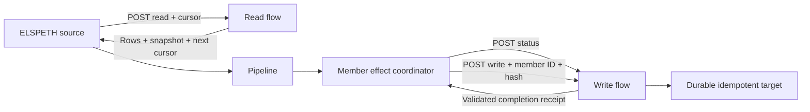

# Power Automate Sources and Sinks Implementation Plan

> **Implementation handoff:** REQUIRED SUB-SKILL: Use `superpowers:executing-plans` to implement this plan task by task, with failing behavior tests before production changes. Implementation and local merge are authorized. Per the operator instruction on 2026-10-01, this feature has no live-tenant acceptance step or opt-in live tests.

**Goal:** Add a `power_automate` source that reads rows from an HTTP-triggered flow and a `power_automate` sink that publishes rows through an HTTP-triggered flow, with auditable completion, offline replay, live source verification, and safe interrupted-write recovery.

**Architecture:** Use a closed JSON protocol over authenticated, SSRF-safe HTTPS POST. Source reads use bounded snapshot pagination and existing source validation/accounting. Sink publication uses the existing per-member effect coordinator, with a composition-supplied audited transport and authoritative remote status; trigger acceptance alone is insufficient.

**Tech stack:** Python 3.12+, Pydantic, httpx, `AuditedHTTPClient`, azure-identity, pytest/respx, Power Automate cloud flows, and a durable idempotent target.

**Revision base:** Inspected `release/0.8.1` at `d724cf75494f87665c76c47b73c0b8ab35fd47cf` on 2026-10-01. The earlier design was locally merged at `17a1b83dba3406d0e980f448c83e03095ac7558a`. Branch placement does not select a feature release. Confirm the implementation target before code or release-note changes.

**Confirmed scope:** HTTP-triggered flows for both source and sink, targeting `release/0.8.1`. Verify functionality through deterministic transport/authentication tests, durable flow emulation, process-death recovery and the repository gates. Tenant availability, licensing and throughput are operating prerequisites documented for users, not implementation acceptance gates.

**Prerequisites:** Read [CONTRIBUTING.md](../../CONTRIBUTING.md#whole-tree-gates-and-conventions-you-will-hit). Use a dedicated implementation worktree, its own environment, and both source roots in `PYTHONPATH`. Test recovery against a durable emulator satisfying the remote contract below. Document the inspectable/idempotent target users must provide.

## Scope and behavior

One registry name, `power_automate`, in both source and sink registries, with separate classes and configs. Shared authentication/protocol helpers stay internal. Do not add generic HTTP plugins, public ingress, flow administration, a custom connector, file transfer, arbitrary headers, asynchronous job polling, or audit-export support. Composer discovers ordinary plugins and the provider authors the graph; existing tutorial and authoring invariants apply.



| Mode | Source | Sink | Credential / recovery rule |
| --- | --- | --- | --- |
| LIVE | Reads and audits pages | Status before each initial write; validated member publication | Live credentials, exact origin and authority admission |
| Ordinary resume | Restores durable source data; zero source hooks/reads | Reconciles interrupted members using original IDs | Unchanged safe config; configured credential rotation refuses old-run resume |
| REPLAY | Archived rows/contracts/discards; zero source startup/read | Existing virtual sink | No Power Automate credential lookup, SDK, DNS, or HTTP |
| VERIFY | Reads source live once, verifies calls and ordered source decisions before downstream execution | Existing virtual sink | Source credentials only after archive/request admission; zero sink credentials or calls |
| AUDIT_EXPORT | Not applicable | Refused before lifecycle | No fallback to legacy `write()` |

Ordinary resume never restarts pagination. Add `snapshot_for_resume: bool = False` to the source. When true, existing `source_iteration.py`/`source_snapshot.py` materialize the finite source before downstream effects, with the existing 64-MiB snapshot cap and single-source restriction. Recovery examples use true. With false, an interrupted source before EOF remains `SOURCE_NOT_EXHAUSTED` and resume refuses. A retained remote snapshot enables live verification; it does not override engine resume admission.

## Configuration contract

This configuration matches `examples/power_automate/settings.yaml`. The hostname is a placeholder: use the exact origin of the current saved trigger URL. The fixed source schema guarantees selected sink fields.

```yaml
sources:
  records:
    plugin: power_automate
    on_success: publish
    options:
      on_validation_failure: quarantine
      auth:
        method: sas_url
        trigger_url_secret: "${POWER_AUTOMATE_READ_TRIGGER_URL}"
      allowed_origin: https://flows.example.test
      query: {dataset: approved_records}
      snapshot_for_resume: true
      page_size: 100
      max_pages: 1000
      max_rows: 100000
      timeout_seconds: 90
      max_request_body_bytes: 1048576
      max_response_body_bytes: 4194304
      schema: {mode: fixed, fields: ["record_id: str", "result: str"]}
sinks:
  publish:
    plugin: power_automate
    on_write_failure: quarantine
    options:
      auth:
        method: sas_url
        trigger_url_secret: "${POWER_AUTOMATE_WRITE_TRIGGER_URL}"
      allowed_origin: https://flows.example.test
      fields: [record_id, result]
      timeout_seconds: 90
      max_request_body_bytes: 1048576
      max_response_body_bytes: 1048576
      schema: {mode: flexible, fields: ["record_id: str", "result: str"]}
  quarantine:
    plugin: json
    on_write_failure: discard
    options:
      path: examples/power_automate/output/quarantine.jsonl
      format: jsonl
      mode: append
      schema: {mode: observed}
landscape:
  url: sqlite:///examples/power_automate/runs/landscape.db
```

| Field / decision | Exact v1 behavior |
| --- | --- |
| `auth.method=sas_url` | Entire unmodified designer URL in `auth.trigger_url_secret`; no separate `trigger_url`. Preserve encoded path/query; require a nonempty `sig` without double decoding it. |
| `auth.method=service_principal` | Require `tenant_id`, `client_id`, `client_secret`; credential-free `trigger_url` outside auth. |
| `auth.method=managed_identity` | Explicit `ManagedIdentityCredential`, required user-assigned `client_id`; no ambient credential chain or system-assigned fallback. Credential-free `trigger_url`. |
| OAuth audience | Public cloud only: `https://service.flow.microsoft.com/`; SDK scope `https://service.flow.microsoft.com/.default`. Reject authored scope/authority overrides. |
| Auth variants | Discriminated strict models; reject partial, mixed, or extra fields. SDK/token acquisition is lazy, never in constructors/catalog probes. |
| `allowed_origin` | Required normalized HTTPS origin, port 443, no userinfo/path/query/fragment/wildcard; actual URL must match before credentials attach. OAuth URL refuses credential-bearing query keys, not just `sig`. |
| Web origins | New operator `WebSettings.power_automate_allowed_origins`, default empty; source and sink origins must be approved by runtime web policy. An authored equality check alone is insufficient approval. |
| Web secrets | Existing exact secret/component/plugin/option-path wiring remains deny by default and independent of origin admission. |
| Selected sink `fields` | Ordered, nonempty, unique names; declare each required input field; export exactly those fields. No all-fields default or row-selected destination. |
| Source schemas | Existing fixed/flexible/observed modes, field normalization/renames, source-only coercion and contract locking; use existing `DataPluginConfig` field names. |
| `query` | JSON object; no secret locators/credential material; fixed for all pages. Schema and examples reject secret references in data/query. |
| Bounds | Strict integers, never booleans: page size 1–1000 (default 100), positive page/row limits (defaults 1000/100000), positive byte limits. Source response default 4 MiB; other bodies default 1 MiB. |
| Timeout | Finite 0 < seconds <= 110, default 90. One absolute deadline from dispatch through connection/TLS/write/streamed response/decode; credential lookup, SDK acquisition, DNS and limiter waits precede this budget and remain subject to their existing lifecycle limits. Timeout never proves remote cancellation. |
| Parser limits | URL <= 16384 UTF-8 bytes; snapshot/cursor/receipt/flow-run IDs <= 256/4096/256/256 bytes; JSON depth <= 64; all diagnostic codes closed/value-free. These are local design bounds. |

Live source/sink `.config` must be a detached **safe dictionary**, not the raw constructor mapping: call `sanitize_node_config_for_audit(..., plugin_name='power_automate')` before the base initializer. Keep runtime secrets in private typed bindings. Preserve the authored dictionary shape for durable equality; parsed operational defaults must not be silently inserted into `.config`. Sanitization renames fields to `trigger_url_secret_fingerprint` / `client_secret_fingerprint`; these are archived fields, not accepted live auth input.

Require the existing HMAC fingerprint key for secret-bearing live configs, even if the global development raw-secret switch is enabled. This plugin must not persist raw credentials under that switch. Managed-identity hermetic probes need no key or SDK because they carry no secret. Preserve global behavior for other plugins. A changed configured SAS URL/client secret/principal changes durable identity; old-run verify/resume refuses. Bearer renewal under the same admitted principal remains supported.

## Closed flow protocol

This is an ELSPETH integration protocol for flow authors, not a built-in Power Automate API. Use `protocol: "elspeth.power-automate.v1"`. Require HTTP 200 and `application/json` media type, allow optional charset, reject redirects, duplicate JSON keys, nonfinite numbers, excess depth and unknown envelope fields. Wire values must fit the RFC 8785 canonical audit domain: integer literals within ±9007199254740991 and Unicode without lone surrogates. Represent larger identifiers as strings; never silently coerce numbers. Unsupported canonical values refuse the whole response with a closed `invalid_json` code before yielding rows, while complete bounded decoded evidence remains audited. JSON schemas describe envelope/data shapes; the wire codec additionally checks these representation constraints. Parse to frozen owned DTOs. Retain complete bounded decoded response bytes and filtered/fingerprinted request/response metadata in the payload store through the explicit evidence seam below. This does not promise raw unsafe headers or reconstructable signed-URL transport. Diagnostics contain no raw cursor, URL query, row values, response body, or remote exception message.

### Read

```json
{"protocol":"elspeth.power-automate.v1","operation":"read","query":{"dataset":"approved_records"},"snapshot_id":"snapshot-42","cursor":null,"page_size":100}
```

```json
{"protocol":"elspeth.power-automate.v1","snapshot_id":"snapshot-42","rows":[{"record_id":"A1","result":"approved"}],"next_cursor":null}
```

`query` and page size stay identical. Snapshot is nonempty and constant across pages, matching a configured explicit snapshot from page one. Null requests a fresh snapshot; verification may fail if the flow cannot reproduce it. Flow retrieval is read-only and returns stable ordering. `next_cursor` is opaque, returned only to the same endpoint; it is never followed as a URL. Detect repeated cursors, including cycles longer than one page. Empty final result is valid; empty intermediate pages consume page budget. A page must contain <= requested page size. Count **all candidate rows**, including rejected rows, toward max rows. Reaching a bound with a continuation or receiving more rows than remaining budget aborts; never truncate to success. No automatic POST retry or hidden page recovery.

The `rows` container must be an array of arbitrary JSON candidates: scalar/null/list candidates are individual validation failures, not a malformed page. The page DTO and read-response JSON schema must permit them so the source can apply row policy. Malformed envelopes/snapshots fail the source. Thaw frozen valid mappings to their real JSON object shape before nominal row admission; never stringify malformed candidates or misclassify immutable mapping views. Each candidate gets its original source index; schema failures follow `on_validation_failure`, retain original payload evidence and correct quarantine/discard accounting. Teardown must close clients on success, failure, generator close, and cancellation. Check shutdown between pages and rows.

### Status and write

Delivery ID is the engine's lowercase 64-hex `member_effect_id`, stable across same-run resume and different for distinct members with identical data. `payload_sha256` hashes the canonical selected `data`, separately from the actual HTTP envelope bytes.

```json
{"protocol":"elspeth.power-automate.v1","operation":"status","delivery_id":"bbbbbbbbbbbbbbbbbbbbbbbbbbbbbbbbbbbbbbbbbbbbbbbbbbbbbbbbbbbbbbbb","payload_sha256":"aaaaaaaaaaaaaaaaaaaaaaaaaaaaaaaaaaaaaaaaaaaaaaaaaaaaaaaaaaaaaaaa"}
```

```json
{"protocol":"elspeth.power-automate.v1","operation":"write","delivery_id":"bbbbbbbbbbbbbbbbbbbbbbbbbbbbbbbbbbbbbbbbbbbbbbbbbbbbbbbbbbbbbbbb","payload_sha256":"aaaaaaaaaaaaaaaaaaaaaaaaaaaaaaaaaaaaaaaaaaaaaaaaaaaaaaaaaaaaaaaa","data":{"record_id":"A1","result":"approved"}}
```

```json
{"protocol":"elspeth.power-automate.v1","delivery_id":"bbbbbbbbbbbbbbbbbbbbbbbbbbbbbbbbbbbbbbbbbbbbbbbbbbbbbbbbbbbbbbbb","payload_sha256":"aaaaaaaaaaaaaaaaaaaaaaaaaaaaaaaaaaaaaaaaaaaaaaaaaaaaaaaaaaaaaaaa","state":"applied","receipt_id":"receipt-42","flow_run_id":"flow-run-42"}
```

The repeated letters illustrate valid shapes, not the hash of the example data. Define four exact response variants:

| State | Additional required fields | Forbidden fields / result |
| --- | --- | --- |
| `applied` | `receipt_id`, `flow_run_id` | No reason code; exact identity/hash plus durable complete-effect proof |
| `not_applied` | None | No receipt/reason; authoritative safe absence under dedup contract |
| `unknown` | None | No receipt/reason; coordinator UNKNOWN, no resubmission |
| `rejected` | `reason_code` | No receipt; code exactly `validation_failed`, `policy_denied`, or `target_conflict`; sticky terminal decision proving zero business effect |

Every variant includes exact protocol, delivery ID and hash. A mismatched hash or conflicting existing delivery is **unknown/error**, never `target_conflict` diversion; that rejection code is reserved for a proven no-effect business-target conflict. Rejections are durable and sticky. Write returns applied/rejected/unknown only; `not_applied` is status-only. Generic 4xx/5xx/auth failure is not a no-effect proof. HTTP 202/204, an empty 200, missing receipt, pending/accepted state, timeout or response loss is uncertain and never success/diversion.

The remote target is keyed atomically by delivery ID and stores the bound payload/hash and durable outcome. Duplicate matching write returns the stored result without repeating business effects; mismatched payload fails closed. Status reads only; it cannot claim the delivery, insert completion, or invoke the business action. Missing bookkeeping alone is insufficient for `not_applied`: a delayed old invocation may still execute. Require authoritative target read-back plus deduplication making any late/repeated same-ID write harmless; otherwise return unknown. Effects covered by `applied` must finish before Response. Separate receipt bookkeeping is acceptable only if exact target read-back can recover completion after bookkeeping loss. Generic email/payment/multi-step flows need equivalent dedup/fencing for every effect and are outside the demonstrated guarantee.

Retention must cover the supported resume window. Expired/inaccessible/conflicting evidence remains unknown. There are no SDK/client write retries. Engine reconciliation decides resubmission; flow connector retries must also satisfy deduplication. New independent runs have new delivery IDs and may repeat business actions; cross-run dedup is a target policy.

Current member lifecycle interprets diversion only in commit results. Map a proven sticky `rejected` status to `NOT_APPLIED`; then the idempotent write returns the same rejection with zero business effects, and commit produces exact diversion attribution. Test response loss after rejection. Do not add a new shared rejected lifecycle state.

## Owned interfaces and authority

New paths in this section are proposed; existing symbols refer to the revision base.

| Seam | Implementation decision |
| --- | --- |
| `contracts/sink_effect_http.py` | Nominal ABCs `SinkEffectHTTPPost`, `SinkEffectHTTPPostFactory`, marker `HTTPSinkEffectCapability`; frozen request/response/bind/environment DTOs. No httpx or plugin imports. |
| `SinkEffectHTTPPost.post_json(request)` | Request contains only deep-frozen JSON body; no URL/headers/timeout override. Response contains status, content type, bounded bytes, actual call ID and nonempty request/response refs. |
| `SinkEffectHTTPPostFactory.bind(context)` | Context carries owned recorder, run/operation, current coordinator token, telemetry/rate environment and `before_send`; sink sees only the scoped post capability. Binding performs zero I/O. |
| `SinkEffectRuntimeBinding` | Add optional `http_post_factory`; retain existing raw-options `config_fingerprint` because preflight compares raw options. Factory adds read-only `safe_config_fingerprint = stable_hash(sink.config)`. Bind both identities and exact factory object. |
| `RestrictedSinkEffectContext` | Add optional `http_post`, repr/compare excluded. Preparation/inspection/non-HTTP/virtual paths receive None. |
| `PipelineConfig` -> `sink_flush` -> `SinkExecutor` | Carry full named sink-effect bindings alongside existing modes; project delayed audit export consistently. Refuse a required missing/mismatched/swapped factory before lifecycle. |
| `SinkEffectCoordinator` | Bind transport **after** each status/commit `begin_attempt`, when current lease/heartbeat exists, never in the earlier preparation context. Add `_member_attempt_context`. |
| L3 `clients/power_automate.py` | Concrete endpoint-fixed factory/client; source operation client and live-only sink client. `state_id=None`, stable operation ID, current token; close each scoped client in finally. |
| Shared `AuditedHTTPClient` | Optional `before_send` callback in `_send_ssrf_safe_request` immediately before actual send, inside audited error handling, after rate-limiter waits and index allocation. |
| Shared HTTP audit policy | Closed owned `HTTPAuditPolicy.POWER_AUTOMATE_V1` selected by L3 composition only: decoded-body capture, value-free errors and deadline-aware dispatch. No authored callbacks or policy knobs. Default generic behavior remains unchanged. |

The guard first checks a coordinator-owned attempt-lifetime fence, then shutdown/latch and `heartbeat.refresh_and_check` with the fixed coordinator token, then `_guard_external_effect`. `_member_attempt_context` returns the restricted context plus a private revoke callback; reconcile/commit invoke revoke in finally immediately after the adapter callback. The sink never receives revoke authority. An effect lease can remain valid while later members execute, so lease checks alone cannot revoke a retained capability from an earlier member. Check before credential/DNS work, immediately before wire dispatch and after audited return. A retained capability fails after its callback finishes or after takeover. A packet already sent cannot be recalled: remote dedup remains necessary. Real recorded HTTP calls and existing synthetic member-result calls coexist under the same operation using the current allocator; prove distinct indices and payload refs. Audit/fence failure after remote success remains response-lost.

Use `request_ssrf_safe('POST', ..., follow_redirects=False)`, exact approved origin, DNS/IP pinning, bounded actual serialized request bytes and streamed/decompressed response bytes. No private-network exceptions. Preserve current URL bytes; same-origin 3xx also refuses with zero follow-up requests. Trusted Azure identity SDK traffic is separate; never record its client secret in raw audited form/JSON bodies. Select the scoped audit policy before the shared client can emit errors; wrapper-only catching is insufficient.

### Response evidence, errors and total deadline

Add frozen L0 `HTTPDecodedBodyEvidence` to `contracts/call_data.py`, with `body_b64`, `decoded_size`, `complete` and optional closed `incomplete_reason`; add optional `HTTPCallResponse.decoded_body`. The PA policy populates it independently of `HTTPResponseTransport`, which must stay ineligible for signed URLs/unsafe headers. Complete means exact decoded bytes within the cap, including whitespace/duplicate keys/malformed JSON, not compressed wire bytes. Capture before `_parse_response_body`; `_build_response_payload` embeds it in the actual response blob. Error/body-cap/decode/deadline paths retain at most a bounded prefix with `complete=False` and an explicit reason, never a fictitious complete body. No URL, auth/header, or exception text belongs in this DTO. Ordinary response serialization omits this field when absent. Apply strict DTO parsing to archive consumers; canonical PA verification requires valid complete capture, exact decoded-size consistency and payload integrity. Missing/corrupt/incomplete capture fails admission/verification; no fallback to the client's parsed `body`. Business payload evidence remains sensitive data under existing payload-store policy, distinct from value-free diagnostics.

Define `HTTPAuditPolicy` in new `contracts/http_policy.py`. In PA mode, shared `http.py` classifies transport, timeout/deadline, response encoding/limit, JSON/depth and refused-guard errors **before** constructing `HTTPCallError`, parse-failure diagnostic, telemetry or any logged exception. Codes are closed (`transport_failed`, `deadline_exceeded`, `response_too_large`, `invalid_encoding`, `invalid_json`, `depth_exceeded`, `authority_refused`); retain status/body evidence separately. Never call `str(external_exception)` for PA diagnostics. Catch external errors without value-bearing exception chaining; preserve nominal framework/audit/fencing errors as failures, never turn them into success or diversion. Azure SDK errors follow the same value-free rule in the auth wrapper. Inspect rendered CLI/web errors and log/telemetry as well as call blobs. Generic clients retain their current policy, checked by a positive control.

Implement the absolute deadline in new L3 `clients/deadline.py`: `HTTPDeadline` uses an injected monotonic clock and returns the strictly positive remaining budget or raises a fixed-code owned deadline error. `DeadlineHTTPTransport(httpx.BaseTransport)` adapts public `httpcore.ConnectionPool.handle_request` and streams into the existing audited capped consumer; fresh pool per pinned request, retries=0, no proxy, HTTP/1.1, TLS verification/SNI preserved. `DeadlineNetworkBackend(httpcore.NetworkBackend)` and owned `DeadlineNetworkStream(httpcore.NetworkStream)` recalculate remaining budget before **each** blocking connect/read/write/TLS operation. Use owned stdlib sockets: `recv`, an explicit send loop over the remaining memoryview, and TLS handshake. Before every socket/SSLSocket `send`, set timeout=min(phase timeout, remaining budget), advance by the returned count and check the deadline again; zero progress fails. Do not use `SSLSocket.sendall` or wrap a resetting third-party write loop. Apply the same remaining-budget rule to connect/read/handshake and check between decompression chunks. The target is a literal admitted pinned IP; preserve the original hostname for certificate/SNI. No private httpx `_pool`/socket mutation, background abandoned network threads, new DNS lookup or uncancellable worker timeout. Add `httpcore` as an explicit bounded dependency in `pyproject.toml`/`uv.lock` because its public interfaces are now directly used. Provide a nominal transport construction seam in `AuditedHTTPClient`, selected only for the PA policy; it must still own admission, one call index and all recording. A timeout after dispatch remains uncertain even if no response arrived.

Controls cover slow trickle where each chunk is under an inactivity timeout but cumulative time crosses the absolute deadline, a blocked read with only a small remaining budget, repeated short writes on both plain and TLS sockets, connect/TLS budget consumption, and deadline expiry before dispatch (zero send). Use fake-clock/backend tests plus a direct local socket test for actual blocking-read cancellation; production origin/IP checks remain unchanged.

Sink logical target is `power-automate://<normalized-origin-host>/binding/<stable_hash(safe-config)>`, never the raw signed URL. Prepare a PRECOMPUTED descriptor over the entire ordered group of selected canonical row data; every member returns that exact group descriptor. Bind field order, safe target/config, member IDs and per-member payload hashes into the plan. Re-derive and compare before status/write. Success member partitions accept all group ordinals; rejected member partitions accept all except itself and divert exactly itself with `build_diversion_attribution`. Coordinator derives final group dispositions from durable members, not the last partition returned. Set `supports_resume=True` with an explicit no-buffer `configure_for_resume`; no identity/config changes during that hook. Legacy `write`, group commit/reconcile must refuse publication; no buffered effects in flush/close.

### Offline construction and loading

`BaseSource`/`BaseSink` otherwise retain raw configs. Live safe initialization above is mandatory for direct archived node equality in `source_replay.py`. Never feed archived `_fingerprint` fields to live auth validators or invent placeholder credentials.

Create these nominal L3 types in `plugins/infrastructure/power_automate_nonlive.py`:

- `ArchivedPowerAutomateOptions`: component type/name, source run ID, exact safe audit options/hash and parsed frozen runtime spec, including strict archived auth variants.
- `DeferredPowerAutomateCredential`: exact CLI `${ENV_NAME}` plus expected archived fingerprint; no plaintext/SDK in the DTO. Resolution checks HMAC identity before egress.
- `PowerAutomateNonliveConstruction`: resolved mode/source-run ID and named admitted source/sink options; deferred credentials for VERIFY sources only.
- `LoadedNonliveSettings`: application result pairing settings with the construction DTO; no dynamic settings attributes.

Normal constructors and `from_archived_options(options, *, credential=None)` classmethods share a private owned initializer. REPLAY resolver is absent; VERIFY sink resolver/factory is absent. `instantiate_plugins_from_config(..., power_automate_nonlive=None)` requires this context in PA nonlive paths and exact reviewed builtin identity. DTO presence does not bypass engine run/config/node admission.

Modify loading before `_expand_env_vars`, before raw sink preflight and before secret-store/SDK work. `_admit_raw_cli_nonlive_run` first verifies completed archive settings hash/version/node hashes and raw literal mode/run identity. Capture exact locators without resolving, reject literals/default-bearing env expressions/forged fingerprint input. Compare every noncredential option, query, schema, routes and bound with admitted archive, normalizing ordinary defaults consistently; retain the exact archived safe dictionary for durable graph identity. Project only credential-bearing PA fields to their admitted safe counterparts. Run raw nonlive sink preflight against projected settings without env expansion. A common `load_nonlive_settings_from_config_dict` performs this projection for supported file/dict/YAML entry points and returns explicit construction context. Preserve other plugins' existing loader behavior and nonlive restrictions, including CLI Key Vault refusal.

Web Composer currently refuses `run_mode` and `replay_from` invocation fields. Preserve that boundary, including private worker refusal before raw preflight or secret resolution. Both Power Automate plugins participate in ordinary Web LIVE execution; this feature adds no public Web nonlive API or deferred web secret locator.

REPLAY may choose a different unused locator but cannot change safe identity/nonsecret config. VERIFY resolves source locator lazily and demands original credential fingerprint. Nonsecret execution inputs must be literal or follow existing admitted template rules; this work does not make arbitrary env-dependent configs offline-safe.

### Live source verification

Keep the call-mode session attached: source-load HTTP calls are required in VERIFY and `assert_complete` enforces consumption. Setting it to None bypasses admission and cannot pass completion safely.

Add L0 `contracts/source_read_verification.py`: closed enum `SourceReadVerificationPolicy.POWER_AUTOMATE_CANONICAL_JSON_V1` and nominal `CanonicalJSONSourceReadCapability`, implemented initially only by the reviewed PA source. L3 runtime composition assigns the closed policy only to the exact reviewed builtin. `prepare_verified_sources` registers the policy on the actual source-load operation before load and unregisters in finally through new `CallModeSession.register_source_read_http_verification` / `unregister_source_read_http_verification` methods. Require VERIFY, actual SOURCE node, operation type source_load, no row state; refuse arbitrary plugin/config comparators.

`AuditedCallModeSession.verify_call` applies this policy only to HTTP POST with exact protocol and `operation=read`, no redirects. Compare status, `application/json` media type, redirect count and **entire strictly parsed canonical JSON body from complete decoded-body evidence**, including raw rows, snapshot and cursor. Ignore volatile HTTP response headers, JSON key order/whitespace and raw byte-size differences for this explicit source policy; preserve bounded decoded bytes and safe metadata. Existing strict transform/other-source response comparison is unchanged. Existing ordered rows/contracts/quarantines/discards verification still runs before downstream startup. Missing calls or changed request/data still fail. Persist the fixed policy name in the source-load operation input metadata, alongside `source_plugin`; do not add metadata to the differences dictionary that determines `is_match` or create a new SQL verdict column.

OAuth: build the same non-auth request shape as the audited client, then `preflight_verify_http_managed_identity` **before** credential lookup/SDK/DNS; public safe config binds tenant/client. Check origin and validate/pin the endpoint before resolving/fingerprinting the client secret or acquiring a token, then use existing semantic bearer admission with the admitted call ID. SAS: admit archive/config first, resolve/fingerprint full URL, exact-origin check and `preflight_verify_http_request` before DNS/client egress. SAS URL lookup necessarily precedes validation of that URL; no SDK or flow send occurs before origin/IP admission. Do not use Dataverse's manually recorded operation helper, which excludes the shared client's DNS-pin shape. Existing strict DNS request admission may reject changed pin even for matching rows; document this condition.

## Task execution conventions

Dependency order: 1 -> 2 -> 3 -> 4 -> 5 -> 6 -> 7 -> 8 -> 9 -> 10 -> 11 -> 12. Source and sink plugin registration ship with their metadata/inventory pins, never with knowingly broken intermediate census/goldens. Task 10 may run earlier once 8–9 work. Tasks are logical commit units; within each, write tests, measure RED, implement, measure GREEN, then commit.

For every task:

1. Add the named behavior tests and their positive/negative controls.
2. Run its exact focused command; expect nonzero for the intended missing behavior, not fixture/environment failure. Read the completed log.
3. Implement the specified interfaces/algorithms and affected callers.
4. Re-run the command; expect recorded exit 0. Run affected architecture/contracts gates whenever their scanned inputs change.
5. Review complete touched files, stage only task paths, run branch-safety and commit the stated logical change. Do not commit suppressions or stale inventories.

Use this complete shell helper after creating/entering the implementation worktree; it checks import provenance and records unmasked process exits. All `plan_pytest` commands below use it. The test function names below are **new required tests**, not claims that they already exist.

```bash
cd "$(git rev-parse --show-toplevel)" || exit 1
export PYTHONPATH="$PWD/src:$PWD/elspeth-lints/src"
mkdir -p .claude/lanes/power-automate-implementation
.venv/bin/python -c 'import elspeth, elspeth_lints; print(elspeth.__file__); print(elspeth_lints.__file__)'
plan_pytest() {
    local label="$1"
    shift
    local log="$PWD/.claude/lanes/power-automate-implementation/${label}.log"
    local result
    .venv/bin/python -m pytest "$@" -n 0 > "$log" 2>&1
    result=$?
    printf 'exit=%s log=%s\n' "$result" "$log"
    cat "$log"
    return "$result"
}
```

For commits, `git status --short`, stage exactly the files from that task, inspect `git diff --cached --stat`, then `scripts/branch-safety-check.sh --intent commit --base <confirmed-target>` before `git commit`. Resolve the target in setup; the placeholder is intentionally not a hardcoded release decision. Do not rerun broad suites between every task; use task-focused controls and final integration gates.

### Task 1 — Freeze strict models and machine-readable flow contracts

**Create:** `src/elspeth/plugins/infrastructure/power_automate.py`, `tests/unit/plugins/infrastructure/test_power_automate.py`; `examples/power_automate/contracts/read.schema.json`, `write.schema.json`, `status.schema.json`, `response.schema.json` (proposed paths).

**RED:** tests `test_auth_variants_are_exclusive`, `test_bounds_reject_bools_and_nonfinite_timeout`, `test_duplicate_json_keys_are_rejected`, `test_envelope_variants_are_closed`, `test_data_hash_uses_canonical_selected_data`, `test_bad_origin_precedes_credentials`. For every state test missing/extra/incorrect identity fields. Assert URL preservation with percent-encoded path and length >255 bytes.

**Implement:** `PowerAutomateSourceConfig(DataPluginConfig)`, `PowerAutomateSinkConfig(DataPluginConfig)`, frozen runtime/auth/page/receipt variants, `parse_read_response`, `parse_effect_response`, `selected_data_hash`. Use existing strict-JSON/canonical helpers with explicit depth/byte checks, not a second permissive parser. Schemas use `additionalProperties:false` for envelopes and discriminated auth/state variants; row/data property maps allow business fields. Ensure the schema variants and parser accept exactly the same test corpus. Schema fixture files need no credential values.

Each config declares direct `_plugin_component_type` (`source`/`sink`) to satisfy the class-creation contract. `DataPluginConfig` supplies schema, not source routing/mapping: source explicitly declares validated required `on_validation_failure`, `field_mapping: NormalizedFieldMappingOption = None`, strict `snapshot_for_resume: bool=False`, and field reachability through `declared_source_schema_field_names` / `check_declared_fields_reachable(columns=None, field_mapping=...)`. Do not inherit file-only `SourceDataConfig` or introduce invented column/normalization options. Test unreachable fixed/flexible names and strict bool rejection of strings/0/1/null; preserve omitted defaults as absent in safe config. Read-response schema permits scalar candidate rows for individual quarantine.

Complete example acceptance test for the proposed parser API:

```python
import pytest
from elspeth.plugins.infrastructure.power_automate import (
    PowerAutomateProtocolError,
    parse_read_response,
)


def test_duplicate_json_keys_are_rejected():
    good = b'{"protocol":"elspeth.power-automate.v1","snapshot_id":"s1","rows":[],"next_cursor":null}'
    bad = b'{"protocol":"elspeth.power-automate.v1","snapshot_id":"s1","snapshot_id":"s2","rows":[],"next_cursor":null}'
    page = parse_read_response(good, page_size=100)
    assert page.snapshot_id == "s1"
    assert page.rows == ()
    with pytest.raises(PowerAutomateProtocolError, match="duplicate_key"):
        parse_read_response(bad, page_size=100)
```

**GREEN command:** `plan_pytest task01 tests/unit/plugins/infrastructure/test_power_automate.py`

**Done / commit:** all valid/invalid model and schema cases agree, diagnostics are value-free, parser/probe tests perform zero I/O. `feat: define Power Automate protocol and configuration`.

### Task 2 — Add nominal audited sink HTTP contracts and carry full bindings

**Create:** `src/elspeth/contracts/sink_effect_http.py`, `src/elspeth/contracts/http_policy.py`, `tests/unit/contracts/test_sink_effect_http.py`, `tests/unit/engine/test_sink_effect_http.py`.

**Also modify:** `src/elspeth/contracts/call_data.py` and its DTO round-trip tests for `HTTPDecodedBodyEvidence`/optional response capture; update affected call-payload inventories/goldens in this contract commit.

**Modify:** `contracts/sink_effects.py`; `plugins/infrastructure/runtime_factory.py`; `engine/orchestrator/types.py`, `preflight.py`, `core.py`, `sink_flush.py`; `engine/executors/sink.py`, `sink_effects.py`; `cli.py`; `web/execution/service.py`, `_validation_runtime.py` (all paths below `src/elspeth/`). Sweep every `PipelineConfig`, `assemble_and_validate_pipeline_config`, `SinkExecutor`, `SinkEffectCoordinator`, binding/admission constructor and fixture with `rg`; update actual callers, including primary/failsink/resume/follower/export paths.

**RED:** `test_http_sink_requires_matching_factory_before_lifecycle`, `test_admission_refuses_factory_swap`, `test_structural_http_impostor_is_refused`, `test_prepare_has_no_transport`, `test_virtual_and_export_paths_have_no_transport`. Existing non-HTTP behavior must remain green.

**Implement:** exact interfaces from Owned interfaces above, full binding map propagation, admission identity checks and safe-config hash checks. Keep L0 nominal classes dependency-clean and L2 free of L3 imports. Add engine-owned bind environment DTO for recorder/telemetry/rate registry; validate consistent optional combinations. Existing bindings have semantic None defaults. Power Automate export is rejected, never retrofitted to export adapter.

Representative runnable nominal negative control against the new contract:

```python
from elspeth.contracts.sink_effect_http import SinkEffectHTTPPostFactory


def test_structural_http_impostor_is_refused():
    class Impostor:
        def bind(self, context):
            return context

    assert not isinstance(Impostor(), SinkEffectHTTPPostFactory)
```

Also pass that impostor through real preflight and assert its precise refusal; the assertion alone does not prove admission.

**GREEN command:** `plan_pytest task02 tests/unit/contracts/test_sink_effect_http.py tests/unit/engine/test_sink_effect_http.py tests/unit/engine/test_sink_effect_preflight.py tests/unit/engine/test_replay_sink_effect.py tests/unit/plugins/infrastructure/test_runtime_factory.py tests/unit/architecture`

**Done / commit:** all composition paths retain exact factories, nonlive never binds, no architecture exception. `feat: compose audited HTTP capability for member sink effects`.

### Task 3 — Implement authenticated bounded transport and per-attempt guards

**Create:** `src/elspeth/plugins/infrastructure/clients/power_automate.py`, `deadline.py` in the same directory, `tests/unit/plugins/infrastructure/clients/test_power_automate_client.py`, `test_http_deadline.py` in the same test directory.

**Modify:** `src/elspeth/plugins/infrastructure/clients/http.py`, `src/elspeth/engine/executors/sink_effects.py`, `pyproject.toml`, `uv.lock`; tests `tests/unit/plugins/clients/test_http.py`, `test_audited_http_client.py`, new Task 2 engine tests. Reuse `clients/fingerprinting.py`, `core/security/web.py`, owned `CallRecorder`; do not introduce unaudited HTTP/independent Landscape writers.

**RED:** `test_guard_runs_after_limiter_wait_before_send`, `test_finalized_attempt_capability_cannot_send`, `test_source_and_sink_calls_have_correct_operation_refs`, `test_actual_and_synthetic_calls_have_distinct_indices`, `test_wrong_origin_and_private_ip_precede_auth`, `test_redirect_is_not_followed`, `test_raw_credentials_never_reach_evidence`, `test_oversized_compressed_response_is_refused`, `test_202_timeout_and_audit_failure_are_uncertain`.

**Implement:** lazy SAS/SP/MI source and sink transport; factories fixed to validated endpoint/auth/bounds. `_member_attempt_context` binds after begin_attempt for both reconcile/commit. Guard before work, after waits immediately before wire send and after return; shutdown/fence errors record correctly. Measure the actual httpx-compatible serialized envelope, not only canonical data length. Stream with total deadline and decoded-byte cap. Refuse recursive/compression/parser errors safely. Token expiration refreshes between calls under same principal; close credentials/clients deterministically. No constructor I/O, transport retries or redirect following.

**Controls:** expire/take over lease during a fake limiter wait and count zero sends; same live lease sends exactly once. Recognizable fake SAS, client secret and bearer values appear in input/transmission where intended and nowhere in stored node config/call blobs/descriptors/telemetry/error text. Include value-bearing SDK/httpx exceptions. Operation writer failure after remote commit must not become applied. Exercise encoded/long URLs and present/absent auth header fingerprints.

**Additional required evidence/error/deadline tests:** `test_sas_and_filtered_headers_retain_decoded_body_without_transport`, `test_compressed_and_invalid_json_capture_is_exact`, `test_missing_or_changed_capture_fails_canonical_verification`, `test_transport_exception_is_sanitized_before_audit`, `test_generic_client_policy_is_unchanged`, `test_slow_trickle_obeys_total_deadline`, `test_blocking_read_uses_remaining_budget`, `test_short_writes_do_not_reset_total_deadline`. Include malformed JSON >10000 bytes and duplicate keys, inspect real response blobs for exact complete capture and filtered metadata; refused/oversized/incomplete streams must record explicit incomplete evidence. Inspect non-URL fake secret/cursor in call errors, exception chain, CLI/web rendering and telemetry. No false claim of reconstructable raw HTTP replay.

**GREEN command:** `plan_pytest task03 tests/unit/plugins/infrastructure/clients/test_power_automate_client.py tests/unit/plugins/infrastructure/clients/test_http_deadline.py tests/unit/engine/test_sink_effect_http.py tests/unit/plugins/clients/test_http.py tests/unit/plugins/clients/test_audited_http_client.py tests/unit/plugins/infrastructure/clients/test_fingerprinting.py`

**Done / commit:** real bounded calls bind current attempts and authority; refused delayed send has zero egress; audit failures preserve uncertainty. `feat: add guarded Power Automate transport`.

### Task 4 — Build safe live and archived construction before page loading

**Modify:** shared config module from Task 1; `src/elspeth/config_loading.py`, `cli.py`, `plugins/infrastructure/runtime_factory.py`, `run_mode_capabilities.py`, `web/execution/_validation_runtime.py`, `web/execution/service.py`; extend `tests/unit/cli/test_run_mode_admission.py`, `tests/unit/core/test_config_loading_layering.py`, `test_secrets_config.py`, `tests/unit/plugins/infrastructure/test_runtime_factory.py`. Source/sink classmethods land with their classes in Tasks 6/7; add complete shared spec/initializer helpers now, with owned test plugin fixtures.

**RED:** `test_nonlive_projects_credentials_before_env_expansion`, `test_archive_hash_and_nonsecret_changes_fail_before_secrets`, `test_raw_sink_preflight_never_resolves_nonlive_secrets`, `test_live_safe_options_equal_archived_node_options`, `test_raw_secret_override_is_refused_for_durable_power_automate`, `test_verify_defers_source_credentials_and_omits_sink_credentials`. Use secret resolver/SDK/DNS/HTTP tripwires and assert no invocation, not merely absent HTTP responses.

**Implement:** typed archive/resolver/construction/loading result, early archive hash/version/node integrity checks, exact locator capture, safe projection and effective-option comparison described above. Raw live auth and archived auth have separate parsers. Carry explicit nonlive context through supported file/dict/YAML factory callers; refuse unsupported Web nonlive invocation before secrets. Keep runtime factory exact builtin dispatch and later source run admission checks. Adapt `_load_settings_with_secrets`, `_admit_raw_cli_nonlive_run`, `_raw_run_mode_before_secrets`, raw sink preflight in that order. No Key Vault relaxation, forged fingerprint acceptance, default-placeholder secrets or dynamic settings attributes.

**GREEN command:** `plan_pytest task04 tests/unit/cli/test_run_mode_admission.py tests/unit/core/test_config_loading_layering.py tests/unit/core/test_secrets_config.py tests/unit/plugins/infrastructure/test_runtime_factory.py tests/unit/engine/orchestrator/test_source_replay.py`

**Done / commit:** archive construction is credential-free; edited executable options fail before side effects; safe config hashes exactly match real graph admission. `feat: load archived Power Automate options without credentials`.

### Task 5 — Add scoped canonical source-read verification

**Create:** `src/elspeth/contracts/source_read_verification.py`, `tests/unit/engine/orchestrator/test_power_automate_source_verify.py`.

**Modify:** `src/elspeth/contracts/call_mode.py`, `src/elspeth/engine/orchestrator/call_mode_session.py`, `source_replay.py`; source transport from Task 3. Confirm the actual `CallModeSession` declaration with `rg` at implementation time; move the contract change to its declaring module if the tree has advanced. The revision-base declaration is in `contracts/call_mode.py`.

**RED:** `test_header_only_change_verifies_but_raw_evidence_is_retained`, `test_entire_page_data_snapshot_and_cursor_drift_fails`, `test_policy_cannot_authorize_transform_or_write`, `test_missing_required_source_call_fails_completion`, `test_altered_request_precedes_sdk_and_dns`, `test_renewed_bearer_preserves_bound_principal`, `test_sas_resolution_requires_archived_fingerprint`.

**Implement:** nominal source marker, closed operation policy registration with source/run/operation checks, finally unregistration, strict canonical JSON source response projection and explicit verdict policy evidence. Preserve all request admission/DNS pinning and required call consumption. Test both full source row verification and call verdicts; decoded-body evidence and safe metadata remain recorded. Do not loosen strict transform/other-source comparison or use arbitrary callbacks/config-controlled ignore lists.

**GREEN command:** `plan_pytest task05 tests/unit/engine/orchestrator/test_power_automate_source_verify.py tests/unit/engine/orchestrator/test_source_replay.py tests/unit/engine/orchestrator/test_run_modes.py tests/unit/plugins/clients/test_audited_http_client.py`

**Done / commit:** identical pages with changing flow headers verify, data/request changes fail and all scoped calls settle; existing strict negative cases remain failures as expected. `feat: verify canonical HTTP source pages with scoped policy`.

### Task 6 — Register the paginated source with complete metadata

**Create:** `src/elspeth/plugins/sources/power_automate.py`, `tests/unit/plugins/sources/test_power_automate_source.py`, source knob golden.

**Modify:** source registry/discovery via existing plugin hook; `plugins/infrastructure/run_mode_capabilities.py`; all applicable source pin files in the Inventory checklist below **in this commit**.

**RED:** `test_one_page_locks_source_contract`, `test_page_loop_preserves_order_and_snapshot`, `test_empty_final_and_intermediate_pages`, `test_cycles_and_page_row_caps_abort_without_truncation`, `test_all_candidate_rows_count_toward_limit`, `test_invalid_rows_have_exact_quarantine_lineage`, `test_schema_modes_renames_and_collision_rules`, `test_close_and_cancel_stop_pages`, `test_safe_live_and_archived_initializers_match`, `test_snapshot_flag_is_preserved`.

**Implement:** `PowerAutomateSource(BaseSource, CanonicalJSONSourceReadCapability)`; safe base initialization/from_archived_options, EXTERNAL_CALL determinism, accurate schema/guaranteed-field metadata and assistance, no startup credential allocation. Set `_normalizes_external_names=True`, `_field_mapping`, `_field_mapping_keys='normalized'`, `_on_validation_failure`, and initialize declared guaranteed fields/output schema/contract through existing helpers. JSON-native observed cells keep `observed_value_type=None`. Follow Dataverse source row normalization/coercion, `ContractBuilder`, `SourceRow`, quarantine patterns, but use shared SSRF transport. Implement one page first, then bounded cursor loop. Validate whole page envelope before yielding any rows from that page. Scalar/null/list invalid rows follow policy with exact original payload/index; malformed top-level envelope fails. Lock observed contracts on first valid row, not a rejected row; all-rejected/empty source preserves valid empty accounting. Explicitly declare snapshot_for_resume without implementing new resume pagination. Extend the currently CSV/JSON-only snapshot config parametrization to PA or provide equivalent strict tests in this source suite. Source text remains external data; never copy it into trusted catalog assistance/diagnostics. Source-to-LLM authoring preserves the existing always-on shield advisory; an inert source `content_trust` attribute is not a substitute.

**GREEN command:** `plan_pytest task06 tests/unit/plugins/sources/test_power_automate_source.py tests/unit/plugins/sources/test_source_snapshot_config.py tests/unit/plugins/sources/test_source_catalogue_metadata.py tests/unit/plugins/test_discovery.py tests/unit/plugins/test_catalog_reference_content.py tests/unit/web/catalog/test_knob_schema_golden.py`

**Done / commit:** real registration, configs/catalog/schema probes are hermetic and inventory-complete; pages and discarded lineage reconcile. `feat: add Power Automate HTTP source`.

### Task 7 — Register the member sink with exact receipt and partition behavior

**Create:** `src/elspeth/plugins/sinks/power_automate.py`, `tests/unit/plugins/sinks/test_power_automate_sink.py`, sink knob golden.

**Modify:** runtime factory exact class transport composition; sink registry/hooks, `run_mode_capabilities.py`; applicable sink pin files below **in this commit**.

**RED:** `test_status_precedes_initial_write`, `test_plan_binds_members_fields_payloads_and_safe_target`, `test_applied_requires_exact_receipt_and_descriptor`, `test_unknown_or_http_errors_never_divert`, `test_sticky_rejection_diverts_only_its_member`, `test_identical_rows_have_distinct_delivery_ids`, `test_resume_preserves_identity_and_refuses_rotation`, `test_group_descriptor_and_partition_are_exact`, `test_export_and_legacy_write_are_refused`.

**Implement:** `PowerAutomateSink(BaseSink, MemberSinkEffectCapability, HTTPSinkEffectCapability)`, one `write` effect mode for PIPELINE_MEMBERS only; mode resolution for fresh/resume/follower and export refusal. Select only declared fields, deep-freeze data, compute canonical payload/group descriptor and exact plan identity. Require current factory safe-config match, reject mutation. Implement member status/commit mapping from protocol table, sticky rejection path and `build_diversion_attribution`. No group publication or legacy write side door. Explicit no-buffer resume hook; flush/close perform zero effects.

**GREEN command:** `plan_pytest task07 tests/unit/plugins/sinks/test_power_automate_sink.py tests/unit/engine/test_sink_effect_executor.py tests/unit/engine/test_sink_effect_preflight.py tests/unit/engine/test_replay_sink_effect.py tests/unit/plugins/sinks/test_sink_catalogue_metadata.py tests/unit/web/catalog/test_knob_schema_golden.py`

**Done / commit:** supported lifecycle/profile claims match tested behavior; partial group rejection and safe identity are exact; no success without completed remote evidence. `feat: add recoverable Power Automate member sink`.

### Task 8 — Admit operator origins through the ordinary web policy

**Modify:** `src/elspeth/web/config.py`; `src/elspeth/web/plugin_policy/profiles.py`, `models.py`, `compiler.py`, `validation.py`, `availability.py`, `coverage.py`; web validation/execution callers as needed; `tests/unit/web/plugin_policy/test_compiler.py`, `test_validation.py`, `test_models.py`, `test_availability.py`, `test_coverage.py`; shared secret-wiring tests. Add `power_automate_allowed_origins` to `RuntimeWebPluginConfig`, compile policy, policy evidence/hash and snapshot comparisons, not only environment settings.

**RED:** `test_power_automate_origin_policy_defaults_to_deny`, `test_allowed_origin_and_secret_wiring_are_independent`, `test_policy_change_invalidates_old_execution_admission`, `test_both_source_and_sink_origins_are_checked_before_resolution`, `test_yaml_and_composer_use_same_policy`.

**Implement:** operator tuple of exact normalized HTTPS443 origins, no wildcard/private bypass; admit PA plugin only with approved authored origin. Recheck current policy at validation/execute and any supported nonlive/resume surface. Actual resolved SAS origin must still equal approved config before egress. Catalog assistance exposes configuration requirements without leaking approved secrets. No new graph synthesis/tutorial branch.

**GREEN command:** `plan_pytest task08 tests/unit/web/plugin_policy tests/unit/web/catalog/test_service.py tests/unit/web/catalog/test_knob_schema_golden.py`

**Done / commit:** authored `allowed_origin` cannot grant itself approval; operator origin or wiring change invalidates stale admission. `feat: enforce Power Automate web destination policy`.

### Task 9 — Prove actual pipeline replay, verify and snapshot-backed resume

**Create:** `tests/fixtures/power_automate.py`, `tests/integration/plugins/test_power_automate_pipeline.py`; extend `tests/integration/pipeline/test_run_mode_end_to_end.py`, `test_eof_resume_proof.py`, `test_resume_coverage_refusal.py`; `tests/integration/config/test_cli_resume_sink_capability.py` and web resume tests.

**RED:** `test_real_factory_pipeline_accounts_for_source_and_sink_failures`, `test_offline_replay_without_any_credentials`, `test_verify_same_snapshot_has_zero_sink_activity`, `test_verify_changed_snapshot_fails_before_downstream`, `test_snapshot_completes_before_first_sink_action`, `test_resume_restores_rows_without_source_hooks`, `test_streaming_or_oversized_snapshot_refuses_resume`.

**Implement fixture:** a respx-backed flow emulator with SQLite durable target keyed by delivery ID, independently recorded requests, stable page snapshots, sticky rejection, pending/expired/conflict states, delayed response and response-drop switches. Keep response serialization separate from engine hashing. Use parser -> real manager/factory -> graph -> engine -> Landscape, not only direct plugin method calls. All input rows are inspected through terminal outcome/accounting APIs.

**Tests:** unset SAS/SP env variables for replay; secret-store/credential/client/DNS constructors raise if touched. Replay retains safe config and rejects changed nonsecret options, altered archive hashes/node version/source hash, missing/corrupt payloads. Verify reads source once with changing request IDs and renewed bearer, compares whole ordered source decisions including discard/quarantine, and makes zero sink auth/HTTP calls on pass and failure. Snapshot true completes before downstream; cap/multiple sources/incomplete blob refuses before effects. Resume never reloads source. Nonlive resume remains refused.

**GREEN command:** `plan_pytest task09 tests/integration/plugins/test_power_automate_pipeline.py tests/integration/pipeline/test_run_mode_end_to_end.py tests/integration/pipeline/test_eof_resume_proof.py tests/integration/pipeline/test_resume_coverage_refusal.py tests/integration/config/test_cli_resume_sink_capability.py`

**Done / commit:** documented mode table holds through real entry points, not just fake adapters; exact source/terminal accounting measured. `test: prove Power Automate execution modes and source recovery`.

### Task 10 — Prove remote write recovery and process-death safety

**Create:** `tests/integration/pipeline/test_power_automate_effect_recovery.py`; extend `tests/e2e/recovery/test_sink_effect_process_death_matrix.py`, durable emulator from Task 9. Reuse current fault hooks/worker-death harness rather than another bespoke recovery engine.

**RED:** `test_remote_applied_response_lost_reconciles_without_second_effect`, `test_killed_worker_resumes_original_member_ids`, `test_partial_group_skips_finalized_members`, `test_rejection_response_lost_stays_diverted`, `test_delayed_old_write_missing_ledger_blocks_unsafe_resubmit`, `test_same_id_concurrent_write_is_deduplicated`, `test_expired_receipt_remains_unknown`, `test_post_send_audit_or_fence_failure_is_reconciled`.

**Implement tests:** persist target action then drop response; kill worker after action before local receipt; restart against same target/Landscape. Set source snapshot true. Measure original delivery IDs, payload hashes, target effect count and durable local disposition. Duplicate equal data in distinct members must produce distinct deliveries. Sticky rejection after response loss must divert once with no business action. Prepare positive/negative controls: disable remote dedup in an intentionally unsafe fixture and prove a same-ID duplicate causes a second action; the normal fixture must prevent it. A missing ledger plus pending/late invocation returns unknown and causes zero automatic resubmissions. Do not weaken production refusal to satisfy unsafe fixtures.

**GREEN command:** `plan_pytest task10 tests/integration/pipeline/test_power_automate_effect_recovery.py tests/e2e/recovery/test_sink_effect_process_death_matrix.py tests/unit/engine/test_sink_effect_http.py`

**Done / commit:** one durable action per original delivery under tested interruption/concurrency points; unknown is visibly non-success, guards and remote dedup each have controls. `test: prove Power Automate interrupted publication recovery`.

### Task 11 — Ship reference flows, examples and operator guidance

**Create:** `docs/reference/power-automate.md`, `examples/power_automate/settings.yaml`, `README.md`. Provide credential-free emulator instructions; no live-tenant test module or marker.

**RED / document checks:** parse the shipped YAML with actual settings/schema/plugin constructors; compare JSON-schema accepted/rejected fixtures to parsers; validate example references and run it against the emulator. A fake URL/config probe must make zero external calls. All automated tests use controlled transport/auth fixtures and make no tenant calls.

**Implement guide:** exact designer steps for separate read and status/write flows; request JSON schemas; operation switch and unknown-operation rejection; stable snapshot/page ordering; read-only status; atomic keyed target create/read-back; sticky rejection; Response placement after all claimed effects. Use a standard Dataverse reference table with unique alternate key on delivery ID and bound payload/hash/outcome/receipt/original-flow-run columns. Choose Web API `PATCH` at the alternate-key URL with `If-None-Match: *` (create only), or a proven duplicate-key create path; ordinary upsert can update an existing row and is not the primitive. Duplicate/precondition-failure performs authoritative read-back and returns the **original stored receipt and flow-run ID**, never the duplicate invocation's run ID. Insert complete delivery data/outcome/receipt atomically in that immutable row; response/bookkeeping loss recovers from it. Status has zero mutations and only reports safe absence under the keyed-create contract. Publish the allowed business-target rejection rule and its sticky durable storage; a conflicting delivery hash is unknown. Prove concurrency/late-request/receipt-loss behavior in Task 12. The reference target stores one immutable delivery record as the demonstrated business effect; arbitrary follow-on actions require separate safety proof.

Cover SAS and allowed SP/user-assigned MI setup, exact public audience/scope and allowed-principal object ID, existing secret wiring, operator approved origins, current trigger URL copy/rotation, fingerprint-key custody, configured rotation refusal for old-run resume/verify, snapshot/receipt retention, 64-MiB snapshot restriction, response caps/timeouts/unknown recovery, no retry guarantee, quota/DLP/license prerequisites. Include executable credential-free emulator instructions. Do not check in live IDs/connections/URLs or fake flow-export packages claiming importability.

**GREEN command:** `plan_pytest task11 tests/integration/plugins/test_power_automate_pipeline.py tests/unit/plugins/test_catalog_reference_content.py`

**Done / commit:** examples match runtime parsers, remote branches are buildable and documented, emulator instructions run without tenant credentials. `docs: document Power Automate source and sink operation`.

### Task 12 — Run integration gates and deterministic acceptance

**Files:** final task touches fixes only where a measured failure points; no generic cleanup. Use `scripts/full-suite-gate.sh`, current `.github/workflows/ci.yaml`, `.claude/lanes/power-automate-implementation/` for ignored logs. Confirm test-capacity ownership/load; one broad suite at a time.

**Gate commands, after focused task checks:**

```bash
cd "$(git rev-parse --show-toplevel)" || exit 1
export PYTHONPATH="$PWD/src:$PWD/elspeth-lints/src"
scripts/full-suite-gate.sh --stages ruff,mypy,contracts,pytest,testcontainer
scripts/full-suite-gate.sh --execute --detach --stages ruff,mypy,contracts,pytest,testcontainer
```

Read the printed completion path and `summary.txt`: every required hard stage exit 0 and `frozen=YES`; a running process/log tail is insufficient. PostgreSQL serial checks are required for the effect-authority integration. Run additional CI scanned inventories/source hashes/import/boundary rules from the current workflow, including plugin-contract rules. Capture full keyless diagnostic before and after, exits included:

```bash
cd "$(git rev-parse --show-toplevel)" || exit 1
export PYTHONPATH="$PWD/src:$PWD/elspeth-lints/src"
ELSPETH_JUDGE_METADATA_SIGNATURE_VERIFY_MODE=shape-only-when-key-missing \
    .venv/bin/elspeth-lints check --rules all --root src/elspeth \
    > .claude/lanes/power-automate-implementation/keyless-after.log 2>&1
lint_result=$?
printf 'keyless_exit=%s\n' "$lint_result"
```

Standing findings may keep that diagnostic nonzero; inspect touched findings and compare complete sets, never claim signed clearance. Operator-held-key signing is separate, after actual code churn settles; no agent key or hand-edited signatures.

**Deterministic acceptance:** gate SAS, SP and user-assigned MI separately with fake credentials and inspected transport requests; unallowed origin/principal changes must be refused under the configured contract. Read multipage/empty/retained snapshot; publish and independently inspect the durable emulator target; duplicate same ID concurrently; changed-hash conflict; intentionally lose response and reconcile; terminate around target/receipt bookkeeping; prove sticky rejection and expired/pending unknown. Verify matching/changed snapshots, bearer renewal, offline replay, same-run configured rotation refusal and fresh-run adoption of the current URL. Count requests/actions from the durable target and Landscape. These proofs cover the connector contract and engine behavior; do not label them tenant acceptance. Document regional feature availability/DLP/license/connector limits as operating requirements.

**Done / commit:** required frozen local gates pass; diagnostics reviewed with stated limits; every mode and recovery contract has deterministic acceptance evidence. Only then integrate reviewed implementation into `release/0.8.1` using branch-safety. Local merge, push, hosted CI, signing and deployment are separate statuses/actions. `test: complete Power Automate integration acceptance` if tracked test repairs result; no empty ceremony commit.

## Inventory checklist coupled to Tasks 6 and 7

Read the entire CONTRIBUTING new-plugin checklist at execution time. These current paths must be evaluated, with pins generated from their producers and actual runtime registries; do not guess totals or leave metadata for a later cleanup:

- `tests/unit/plugins/test_discovery.py`, `test_catalog_reference_content.py`, `test_validation_path_agreement.py`, `test_builtin_plugin_metadata.py`, config rejection/invariant probes, `tests/fixtures/catalog_reference.py`.
- `tests/unit/plugins/sources/test_source_catalogue_metadata.py`, `tests/unit/plugins/sinks/test_sink_catalogue_metadata.py`, source guaranteed/consumed field checks, `tests/invariants/test_input_schema_config_is_captured.py`, `test_transform_input_contract_is_satisfiable.py` where enumerated.
- `tests/unit/web/catalog/test_service.py`, `test_knob_schema_golden.py`; generate `tests/golden/web/catalog/knob_schema/source__power_automate.json` and `sink__power_automate.json` from the catalog service schema cache as described by the existing golden test.
- `config/cicd/contracts-whitelist.yaml`: constructor and hermetic probe entries. Use MI config with explicit fake client ID, no key/network/SDK needed. No lint exemptions for production parsing.
- `scripts/state_engine_plugin_matrix.py`, `tests/golden/state_engine/plugin_lifecycle_matrix.json`, `tests/unit/plugins/test_state_engine_plugin_matrix.py`; v2/v3 proof catalogs under `docs/architecture/state_engine/proof-catalog/`. `render-skeleton <golden>` intentionally yields UNCLASSIFIED entries/nonzero until demonstrated fields are populated; `check <golden>` must then exit 0. Do not use a nonexistent `--write` option.
- `scripts/cicd/plugin_hash.py` after final formatting; compute plugin hash entries through its shared producer API. Regenerate soft-mapping census with `.venv/bin/python -m scripts.check_contracts --write-census` only when scanned sites change. Review dynamic-attribute/import/wire/symbol inventories and regenerate touched fingerprints via documented producers in the same change; no aliases/padding/suppressions.

## Completion and remaining deployment inputs

The implementation is complete only when both ordinary authoring surfaces, bounded source accounting, exact sink receipts, source snapshot recovery, offline replay, scoped live verification, secret-leak controls, operator-origin admission, lifecycle inventories and required gates all match the task proofs. The reference target's status/dedup contract is a prerequisite for recoverability; a generic trigger acknowledgement or standalone receipt table is insufficient.

The local integration target is `release/0.8.1`. Approved endpoint origins, allowed principal IDs, callback URLs and target retention are user deployment inputs documented in the guide. Implementation requires no tenant access and provisions no external flows.

## Primary platform references

Checked on 2026-10-01; recheck when platform APIs change.

- [Microsoft: OAuth authentication for HTTP request triggers](https://learn.microsoft.com/en-us/power-automate/oauth-authentication): principal admission, exact public audience and regional availability.
- [Microsoft: flow limits and configuration](https://learn.microsoft.com/en-us/power-automate/limits-and-config): inbound response ceiling and actions continuing after Response; local 90/110-second limits are implementation choices.
- [Microsoft: troubleshooting trigger URL changes](https://learn.microsoft.com/en-us/troubleshoot/power-platform/power-automate/flow-run-issues/triggers-troubleshoot): current designer URLs and scale-unit segments; copy rather than synthesize URLs.
- [Microsoft: client credentials flow](https://learn.microsoft.com/en-us/entra/identity-platform/v2-oauth2-client-creds-grant-flow): resource-specific `/.default` scope; allowed principals and trigger authentication are tenant operating configuration.
- [Microsoft: Dataverse upsert behavior](https://learn.microsoft.com/en-us/power-apps/developer/data-platform/use-upsert-insert-update-record): existing-key update and create-only `If-None-Match` behavior for the reference target.
- [HTTPCore: public network backend interfaces](https://www.encode.io/httpcore/network-backends/), [connection pool configuration](https://www.encode.io/httpcore/connection-pools/): public transport composition seam for per-operation remaining-budget deadlines.
