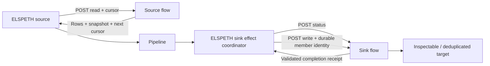

# Power Automate Sources and Sinks Implementation Plan

> **Implementation handoff:** Use `superpowers:executing-plans` to implement the tasks in dependency order, with failing behavior tests before production changes. This document plans the feature; no plugin implementation is included.

**Goal:** Add a `power_automate` source that retrieves rows from an HTTP-triggered flow and a `power_automate` sink that publishes result rows to an HTTP-triggered flow with auditable completion and recovery.

**Architecture:** Both plugins use a versioned JSON protocol over authenticated, SSRF-safe HTTPS POST. The source follows bounded cursor pagination and validates external rows through the existing source contract. The sink uses the existing per-member sink-effect coordinator, with separate read-only status and write operations; a successful trigger submission alone does not establish publication.

**Tech stack:** Python 3.12+, Pydantic, httpx, the existing audited HTTP client, azure-identity for Entra authentication, pytest/respx, Power Automate cloud flows, and a durable remote target or receipt store.

**Planning base:** `release/0.8.1`, commit `d900964059c04812402b4fa8ea5cc2b09c4bdae5`. This is the source inspection base, not a decision to release the feature in 0.8.1. Confirm the implementation branch and release before changing code or release notes.

**Confirmed scope:** The user selected HTTP-triggered flows for both source and sink. Authentication choices and default bounds below are proposals for review. Tenant availability, credentials, licensing, throughput, and remote recovery behavior have not been exercised.

**Prerequisites:** A dedicated implementation worktree with its own environment; both source roots exported in `PYTHONPATH`; provisioned test flows; a permitted authentication mode; a sink target whose effects can be inspected or deduplicated durably. Read [CONTRIBUTING.md](../../CONTRIBUTING.md#whole-tree-gates-and-conventions-you-will-hit) before implementation.

## Design choice and scope

| Approach | Benefit | Cost / limitation | Decision |
| --- | --- | --- | --- |
| Dedicated HTTP-triggered source and sink | Works with the user's existing flows and makes the protocol, errors, and recovery explicit | Flow authors must implement the protocol and sink completion contract | Recommended and user-confirmed direction |
| Generic HTTP plugins | Broader future reuse | Larger configuration surface; still needs remote-effect recovery and source semantics | Keep shared transport internal; do not introduce generic plugins in this feature |
| Flow pushes to an ELSPETH webhook, or direct Dataverse/SharePoint integration | Push avoids polling; direct integration can use native API semantics | Push requires a durable intake service; direct APIs do not execute the requested flows | Outside this plan |

The first version handles JSON data and synchronous completed effects. It does not add public ingress routes, flow administration, flow creation, a custom Power Platform connector, file transfer, arbitrary request headers, asynchronous job polling, or an export sink. Existing Composer tools discover the real plugins and the provider authors the pipeline; no server-authored graph or tutorial branch is needed.



## Current code seams

These paths were inspected at the planning base. New paths in the tasks are proposed additions.

| Existing path | Reuse / implication |
| --- | --- |
| `src/elspeth/plugins/sources/dataverse.py` | `BaseSource`, `DataPluginConfig`, field normalization, schema creation with source coercion, `ContractBuilder`, `SourceRow`, quarantine, lifecycle teardown |
| `src/elspeth/plugins/sinks/dataverse.py` | `BaseSink` plus nominal `MemberSinkEffectCapability`, durable member plans, partitions, receipt descriptors, reconciliation; its current `supports_resume=False` is not a capability to copy |
| `src/elspeth/contracts/sink_effects.py` | `SinkEffectPlan`, durable member IDs, `SinkEffectReconcileResult`, and restricted context carrying run, node, and operation IDs |
| `src/elspeth/engine/executors/sink_effects.py` | Reconciles each member before initial commit and after interruption; owns attempts, leases, fencing, audit completion, and unknown outcomes |
| `src/elspeth/plugins/infrastructure/clients/http.py` | `AuditedHTTPClient.request_ssrf_safe`, IP pinning, request/response recording, response streaming cap, forced header fingerprinting; disable redirect following |
| `src/elspeth/plugins/infrastructure/clients/fingerprinting.py` | Fingerprints bearer headers and sensitive URL queries including `sig`; response-header filtering |
| `src/elspeth/core/security/web.py` | Exact-origin admission and IP-pinned SSRF validation; no private-network bypass for these plugins |
| `src/elspeth/core/secrets.py`, `src/elspeth/core/config.py` | Credential field placement and config fingerprinting; an ordinary URL option containing `sig` is not protected merely by HTTP-call fingerprinting |
| `src/elspeth/web/secrets/wiring_policy.py` | Operator-authored exact secret/component/plugin/option authorization; leave deny-by-default intact |
| `src/elspeth/engine/orchestrator/source_replay.py`, `source_iteration.py`, `run_context_factory.py` | Replay restores archived rows without source startup/load; verify starts and loads the source live, compares before downstream effects, then consumes the verified buffer |
| `src/elspeth/plugins/infrastructure/run_mode_capabilities.py` | Explicit source and sink class tables must admit the new classes for replay/verify |

## Proposed configuration

One plugin name, `power_automate`, in both source and sink registries. Implement separate config and plugin classes. Shared nested authentication and transport settings belong in an internal infrastructure module, not in the Dataverse client or Blob authentication config.

Illustrative complete pipeline configuration using SAS URL authentication:

```yaml
sources:
  records:
    plugin: power_automate
    on_success: publish
    options:
      on_validation_failure: quarantine
      auth:
        method: sas_url
        trigger_url_secret: "${POWER_AUTOMATE_READ_URL}"
      allowed_origin: https://flow-endpoint.example.org
      query: {dataset: approved_records}
      snapshot_id: null
      page_size: 100
      max_pages: 1000
      max_rows: 100000
      timeout_seconds: 90
      max_request_body_bytes: 1048576
      max_response_body_bytes: 4194304
      schema: {mode: fixed, fields: ["record_id: str", "result: str"]}
sinks:
  publish:
    plugin: power_automate
    on_write_failure: quarantine
    options:
      auth:
        method: sas_url
        trigger_url_secret: "${POWER_AUTOMATE_WRITE_URL}"
      allowed_origin: https://flow-endpoint.example.org
      fields: [record_id, result]
      timeout_seconds: 90
      max_request_body_bytes: 1048576
      max_response_body_bytes: 1048576
      schema: {mode: flexible, fields: ["record_id: str", "result: str"]}
  quarantine:
    plugin: json
    on_write_failure: discard
    options:
      path: output/quarantine.jsonl
      format: jsonl
      schema: {mode: observed}
landscape:
  url: sqlite:///runs/landscape.db
```

The origin above is a documentation placeholder; use the actual HTTPS origin copied from the saved trigger URL. The fixed source schema guarantees the selected sink fields; test observed schemas separately rather than fabricating guaranteed fields from inference. Validate the final example through the real settings parser and plugin constructors.

- `auth.method` is `sas_url`, `service_principal`, or `managed_identity`; reject incompatible, partial, and extra fields. SAS takes the entire unmodified current trigger URL in `auth.trigger_url_secret`. Its `_secret` name deliberately uses existing placement, resolution, and config-fingerprinting semantics. Never persist it as an ordinary `url` field.
- OAuth modes take a credential-free `trigger_url` outside `auth`, with no `sig`, userinfo, or fragments. Service principal requires `auth.tenant_id`, `auth.client_id`, and provisioned `auth.client_secret`. Managed identity uses explicit `ManagedIdentityCredential` and a required user-assigned `auth.client_id` in this first version; do not use ambient developer credential fallback or an unbound system-assigned identity. Safe archived config equality must bind the tenant/client identity for semantic token renewal; a changed principal is a verify refusal.
- The first version targets the public cloud audience `https://service.flow.microsoft.com/`. Acquire the SDK token for that resource's `/.default` scope. Sovereign clouds require an explicit later audience/authority design, not arbitrary author-supplied scope or authority URLs. Test audience claims with a real flow before declaring support.
- `allowed_origin` is mandatory: HTTPS, exact normalized hostname and port 443, and equal to the resolved trigger URL's origin before credentials are attached. Treat it as a deployment-approved destination in web execution policy; do not let a row select an origin. Origin approval and secret wiring are separate checks.
- Keep the designer-generated path and query intact, including encoded slashes and scale-unit segments; do not synthesize a legacy URL from environment/flow IDs. Validate SAS presence without printing or double-decoding it. Allow current long URLs within a bounded configured URL length.
- `fields` is required, ordered, nonempty, and unique for the sink. Copy only those fields into `data`; bind them to declared required input fields. No templates, arbitrary row-selected endpoints, or implicit all-field export.
- `query` is a bounded JSON object, never a credential container. Positive integer page/row/body bounds are required. Timeout is finite, greater than zero, and at most 110 seconds; the default 90 seconds leaves headroom under the platform's response ceiling. This is a request timeout, not a promise that the remote flow stops when it expires.
- Network calls, authentication, and flow execution occur only in runtime lifecycle/load/effect methods. Configuration validation and hermetic catalog probes make zero external calls.

## Versioned wire contract

The protocol below is an ELSPETH integration contract to implement in the flows, not a built-in Power Automate API. Use `protocol: "elspeth.power-automate.v1"` everywhere. Parse JSON strictly with duplicate-key and non-finite-number rejection; reject unknown envelope fields. Convert successfully parsed envelopes into immutable owned types. Source row mappings remain external data until source schema validation.

### Source: read pages

```json
{"protocol":"elspeth.power-automate.v1","operation":"read","query":{"dataset":"approved_records"},"snapshot_id":null,"cursor":null,"page_size":100}
```

```json
{"protocol":"elspeth.power-automate.v1","snapshot_id":"snapshot-42","rows":[{"record_id":"A1","result":"approved"}],"next_cursor":null}
```

HTTP 200 and `application/json` are required. An empty final `rows` array is a valid empty result. `snapshot_id` must be a nonempty bounded string and stay identical across all pages; when configured, it must match from the first page. `next_cursor` is a bounded opaque string or null, never a URL to fetch. Send it back only to the same trigger endpoint. Do not log raw cursors.

Require the same query and page size throughout iteration, cap rows per page, detect repeated cursors, and fail if `max_pages` or `max_rows` is reached while more data remains. Empty intermediate pages may continue under the same bounds. Do not truncate and report success. Abort on malformed envelope/rows-container/snapshot; quarantine an individual malformed row under the existing source validation policy, preserving its original value in the payload store rather than in logs. Preserve page/row order and accurate accepted/discarded row accounting.

The flow must implement read-only retrieval with stable ordering and a snapshot across pages. `snapshot_id: null` requests a fresh snapshot; verify may then reject changed data. Configure a retained explicit snapshot for reproducible verification. ELSPETH does not silently reuse archived rows during live verify. Initially make one HTTP attempt per page; no automatic POST retry or hidden cursor recovery. Resume behavior is declared only after source compatibility and re-iteration proofs pass; a flow that cannot retain/re-read the snapshot is unsuitable for resumable reads.

### Sink: durable member write and status

Each selected row is one engine-coordinated member effect. The engine's `member_effect_id` is the delivery identity, stable across retries/resume and distinct for distinct pipeline members, even when their data is identical. Hash the exact selected `data` using ELSPETH canonical hashing. Bind target identity, selected field order, protocol, and payload hashes into the immutable effect plan.

```json
{"protocol":"elspeth.power-automate.v1","operation":"status","delivery_id":"member-effect-42","payload_sha256":"aaaaaaaaaaaaaaaaaaaaaaaaaaaaaaaaaaaaaaaaaaaaaaaaaaaaaaaaaaaaaaaa"}
```

```json
{"protocol":"elspeth.power-automate.v1","operation":"write","delivery_id":"member-effect-42","payload_sha256":"aaaaaaaaaaaaaaaaaaaaaaaaaaaaaaaaaaaaaaaaaaaaaaaaaaaaaaaaaaaaaaaa","data":{"record_id":"A1","result":"approved"}}
```

```json
{"protocol":"elspeth.power-automate.v1","delivery_id":"member-effect-42","payload_sha256":"aaaaaaaaaaaaaaaaaaaaaaaaaaaaaaaaaaaaaaaaaaaaaaaaaaaaaaaaaaaaaaaa","state":"applied","receipt_id":"receipt-42","flow_run_id":"flow-run-42"}
```

The hashes above illustrate the shape; compute real hashes from the actual payload. Status returns the same identity fields with one of `applied`, `not_applied`, `unknown`, or `rejected`. An applied response requires bounded nonempty receipt and flow-run identities. A rejected response also carries a bounded `reason_code` from a closed documented vocabulary; no freeform row-value-bearing error is persisted. Define separate exact envelope shapes for applied, rejected, not-applied, and unknown states.

- `status` is read-only and must not perform the business action, claim a delivery, or mark it completed. It runs before initial submission too. The flow must expose this branch even if write deduplication exists.
- `write` must durably bind delivery ID to payload hash before it can return a verified result. Duplicate ID and matching payload returns the existing result without repeating the business action; duplicate ID and different payload fails closed. The connector does not assume an HTTP `Idempotency-Key` header makes a flow idempotent.
- `applied` means all claimed business effects have completed with inspectable durable evidence before the Response action. No business actions that contribute to that receipt run after Response. HTTP 202, an empty 200/204, accepted/queued state, or a flow run ID alone is an ambiguous outcome, not sink success.
- A missing ledger entry after an attempted write is insufficient for `not_applied`: a delayed original invocation might still complete. Require an authoritative target read-back and remote deduplication that makes any later/repeated write safe. Pending, inaccessible, conflicting, expired, or otherwise unverifiable state returns `unknown` and blocks automatic resubmission.
- For a reference flow, use an idempotent target keyed by delivery ID, with authoritative read-back of the exact stored payload/hash. Derive the completion receipt from that target, so a crash between target update and separate receipt bookkeeping can still reconcile. A generic multi-step flow needs transactional publication or a downstream deduplication/fencing design for every effect; a receipt-table insertion before the action alone cannot prove exactly-once behavior.
- A definitive protocol-level rejection that proves no business effect occurred can divert the exact member through `on_write_failure`. Transport HTTP errors, authentication failures, generic 4xx/5xx, timeout, malformed receipts, payload conflicts, and response loss do not prove that condition; retain engine unknown/error handling.
- Under the current member lifecycle, reconciled results cannot safely encode a rejected member's diversion directly: reconciliation partitions are not consumed like commit-result partitions. Choose the bounded existing-contract path: terminal `rejected` status with proven no effect maps to `NOT_APPLIED`, then the idempotent write returns the same stored rejection and `commit_member_effect` produces a `SinkEffectCommitResult` with diversion attribution. It must repeat no business action. Test response loss after remote rejection and before local diversion recording. Do not disguise a rejection as an applied publication.
- There are no client/SDK write retries. The engine reconciles and decides whether to submit again. Power Automate's own connector retries must also be safe for the selected target. A new independent pipeline run has new delivery IDs and may repeat the action; business deduplication across runs is a separate target policy.
- Receipt retention must cover the supported resume window. After retention expires, unknown remains unknown. Restrict the advertised sink guarantee to the remote effect contract actually demonstrated.

### Transport, audit, and execution modes

Use `request_ssrf_safe("POST", ..., follow_redirects=False)` with a configured streaming response cap. Exact-origin validation and DNS/IP validation precede flow authentication/egress. A 3xx is audited and refused with zero follow-up calls, including same-origin redirects. Entra token acquisition follows the SDK's trusted identity endpoints; never send a client-secret token request through a raw audited JSON/form body that would persist that secret.

The source can construct an operation-bound audited client from its `SourceContext`. The sink cannot construct one solely from `RestrictedSinkEffectContext`, which contains IDs and time but no writer/telemetry/authority. Add a narrow, nominal audited POST capability to that context, bound afresh by `SinkEffectCoordinator._context(effect, coordination_token=...)` with current execution authority. Expose owned bounded request/response DTOs and transport audit references; keep plugin/httpx imports out of leaf contracts and raw recorder authority out of the sink. Respect ADR-006 throughout: L2 engine must not import the existing L3 HTTP client. The L3 composition module `plugins/infrastructure/runtime_factory.py` supplies a nominal L0 transport factory in `SinkEffectRuntimeBinding`; engine receives and binds that factory through its sink executor/coordinator. The factory implementation remains in L3 and constructs `AuditedHTTPClient` with `state_id=None`, the stable effect `operation_id`, and the current coordinator token. Transport configuration and trusted origin are fixed by the runtime binding, not by arbitrary per-call arguments. Update all binding/context constructors, entry points, and virtual sink adapters coherently; non-HTTP sinks have no HTTP capability, and nonlive virtual sinks never receive live transport. Do not retain a startup operation ID or lifecycle token, open an independent Landscape session, or widen the context into general mutation authority. Preserve existing synthetic effect-summary call rows; actual HTTP calls must coexist under the same operation with unique call indices and full payload references.

Source VERIFY requires archived HTTP-request admission before token acquisition or DNS. Use the common SSRF HTTP preflight path with `current_state_id=None` and the current source-load operation; do not copy the Dataverse-specific operation helpers that forbid DNS pins. Expiring OAuth bearer values need semantic authentication admission tied to the same endpoint and principal, followed by live token acquisition and ordinary audited request matching. The existing managed-identity non-auth comparison only removes Authorization; it does not independently bind a principal. Require archived equality of explicit identity config, and a changed-principal negative control for both supported OAuth methods. A stale/missing/ambiguous archived request must stop before credentials or egress.

Every flow call records method, credential-safe endpoint identity, safe header fingerprints, request JSON, bounded response/error, latency, and correct source/effect operation attribution. Payload rows and queries are audit data; diagnostic messages carry categories and IDs only. SAS URLs, bearer values, and client secrets must be absent from config snapshots, node config, descriptors, exported evidence, telemetry, exception text, and Composer output. Keep a credential-free endpoint identity separate from the authentication fingerprint so descriptors never contain a SAS URL.

| Mode | Source | Sink |
| --- | --- | --- |
| Live | Authenticated live page reads | Status/write calls under the real effect coordinator |
| Replay | Archived rows/discards; no startup, token acquisition, DNS, or HTTP | Archived virtual sink effects; no real status or write calls |
| Verify | Live snapshot read, compared to archived source evidence before downstream execution | Existing virtual verification sink; no real publication or status calls |

Register both concrete classes in nonlive admission tables and add credential-free offline replay tests. Preserve existing source contract and source-discard identity checks; do not retrofit source replay into transform HTTP replay behavior.

Credential-free replay also requires an explicit construction/admission path: the ordinary loader expands `${VAR}` before construction, and source replay compares `source.config` exactly with the archived safe node config. Skipping source hooks is insufficient. In REPLAY, load authoring settings without credential expansion/secret-store access, admit the archived config and unchanged nonsecret options, then construct the exact reviewed plugin class from a nominal archived-safe config value. Retain the archived authentication fingerprints in `source.config`/sink identity; do not insert a fake URL, require live secrets, or drop auth fields from identity comparison. Separate this constructor input from live credential-bearing config validation so an archived fingerprint can never be used as a live endpoint. VERIFY uses live source credentials after archived admission and a credential-free virtual sink. Any unsupported mode/credential combination must fail before side effects rather than silently skip comparison.

## Implementation tasks

Each task is a coherent implementation slice. Write the listed regressions first, run the named focused selection and record the failing exit, implement, rerun to an explicit zero exit, inspect the touched files in full, and commit only that slice after branch-safety checks. Keep required caller/inventory updates in the same slice; do not leave compatibility shims or deferred gate cleanup.

### Task 1 — Pin the flow protocol and config

**Create:** `src/elspeth/plugins/infrastructure/power_automate.py`; `tests/unit/plugins/infrastructure/test_power_automate.py`; flow contracts `docs/reference/power-automate.md` and `examples/power_automate/contracts/read.schema.json`, `write.schema.json`, `status.schema.json`, `response.schema.json`.

Define the authentication model, transport bounds, immutable envelope types, selected-field validation, and strict request/response parsers. Use existing strict JSON and canonical hashing helpers. Implement config-only probes. Test mutual exclusivity of SAS/OAuth options, malformed/secret-bearing OAuth URLs, wrong origins, duplicate fields/keys, invalid numeric bounds, invalid states, wrong ID/hash, and every required/extra envelope field. Assert zero network access for each config/parser rejection. Document the flow read/status/write branches and Response placement.

**Run:** `python -m pytest tests/unit/plugins/infrastructure/test_power_automate.py -n 0` using the worktree invocation below. **Done:** protocol/config round trips pass; every malformed input fails at the correct boundary with value-free diagnostics.

### Task 2 — Build authenticated audited transport and prove attribution

**Create:** `src/elspeth/plugins/infrastructure/clients/power_automate.py`; `src/elspeth/contracts/sink_effect_http.py`; `tests/unit/plugins/infrastructure/clients/test_power_automate_client.py`; `tests/unit/engine/test_sink_effect_http.py`.

**Modify:** `src/elspeth/contracts/sink_effects.py`, `src/elspeth/plugins/infrastructure/runtime_factory.py`, `src/elspeth/engine/executors/sink.py`, and `src/elspeth/engine/executors/sink_effects.py` for the composition-supplied factory, restricted capability, and current-token binding; update every affected binding/context constructor, entry point, and test fixture. **Reuse / inspect:** `src/elspeth/plugins/infrastructure/clients/http.py`, `fingerprinting.py`, `src/elspeth/contracts/contexts.py`, `audit_protocols.py`, and `src/elspeth/engine/orchestrator/call_mode_session.py`; change shared HTTP admission only if required for a measured auth-mode gap. Verify the new factory path with architecture import gates; a lazy L2-to-L3 import is still forbidden.

Implement typed transport factories for source calls and effect calls, deferred credential construction, token refresh between calls, exact-origin admission, IP pinning, no redirects, body caps, and sanitized errors. SAS must transmit the exact designer URL while its config and call evidence are protected. Test fake credential refresh, forced bearer fingerprints, SAS query fingerprints, wrong-origin and private-IP refusal before egress, encoded URLs over 255 characters, compressed oversized responses, malformed JSON, 202/3xx/401/403/429/5xx, and timeout without a second write. Inspect raw stored calls and config snapshots using recognizable fake secrets; include a known-positive secret value in the test input and demonstrate the audit rejects/leaves no raw value.

Prove source calls attach to the source-load operation and sink status/write calls attach to the stable sink-effect operation under current coordination fencing, including leader replacement and actual/synthetic call-index coexistence. A successful wire request followed by audit failure must remain an uncertain effect. Source verify tests must refuse altered archived requests before SDK/DNS and accept renewed OAuth credentials only under the intended semantic identity policy. Verify replay/virtual verify do not construct credentials or transports.

**Run:** `python -m pytest tests/unit/plugins/infrastructure/clients/test_power_automate_client.py tests/unit/engine/test_sink_effect_http.py tests/unit/engine/test_sink_effect_executor.py tests/unit/plugins/clients/test_http.py tests/unit/plugins/infrastructure/clients/test_fingerprinting.py -n 0`. **Done:** audited request bytes agree with the bounded payload; real operation attribution and negative controls pass. Run affected effect/coordination suites immediately and the integration gates in Task 7 because this slice changes shared contracts/engine code.

### Task 3 — Ship the source slice

**Create:** `src/elspeth/plugins/sources/power_automate.py`; `tests/unit/plugins/sources/test_power_automate_source.py`.

**Modify:** source admission in `src/elspeth/plugins/infrastructure/run_mode_capabilities.py` and the source catalog/inventory pins listed in Task 6.

Implement lifecycle, read requests, snapshot/cursor loop, shutdown checks, source row normalization/coercion/contracts, quarantine, accounting, and close. Test a single page first, then empty results, multiple pages, repeated cursor, empty intermediate pages, changed snapshot, invalid row, invalid envelope, page/row/byte limits, partial-page failure, normalization collisions, observed/fixed/flexible schema behavior, and teardown after failure. One missing required row field must produce the configured source outcome with correct audit lineage. Pagination limit exhaustion must yield a failed run, not successful truncation.

**Run:** `python -m pytest tests/unit/plugins/sources/test_power_automate_source.py tests/integration/plugins/sources/test_trust_boundary.py tests/unit/engine/orchestrator/test_source_replay.py -n 0`. **Done:** accepted and discarded rows reconcile against the engine's actual run accounting; source catalog probes stay hermetic.

### Task 4 — Ship the sink slice through the effect coordinator

**Create:** `src/elspeth/plugins/sinks/power_automate.py`; `tests/unit/plugins/sinks/test_power_automate_sink.py`.

**Modify:** sink admission in `src/elspeth/plugins/infrastructure/run_mode_capabilities.py` and the sink catalog/inventory pins listed in Task 6.

Implement `BaseSink` and `MemberSinkEffectCapability`: mode resolution, inspection, immutable plan preparation, exact member/payload verification, status reconciliation, commit, safe descriptor/receipt evidence, and lifecycle close. Legacy `write()` must not publish. Reject audit-export purpose. Use engine IDs, not a hash of row content as the delivery identity; return exact accepted/diverted partitions. Keep raw resolved credentials out of `sink.config`, whose safe form participates in durable effect identity; test admitted fingerprints and reference markers rather than relying on `repr=False`. Bind a stable credential-free logical target and prove how credential rotation interacts with existing config identity admission; do not promise rotation during resume if current config fingerprinting rejects it. Test initial status-before-write ordering, duplicate matching write, changed payload conflict, exact applied receipt, missing/unknown/pending status, rejected member diversion, missing receipt, and all transport outcomes. Test identical data in two different members receives distinct identities and resume keeps each original identity.

**Run:** `python -m pytest tests/unit/plugins/sinks/test_power_automate_sink.py tests/unit/engine/test_sink_effect_executor.py tests/unit/engine/test_sink_effect_preflight.py tests/unit/engine/test_replay_sink_effect.py -n 0`. **Done:** no publication succeeds without an applied receipt/read-back; uncertainty never silently turns into success or row diversion.

### Task 5 — Prove end-to-end recovery and execution modes

**Create:** `tests/integration/plugins/test_power_automate_pipeline.py`; `tests/integration/pipeline/test_power_automate_effect_recovery.py`; a durable fake-flow fixture `tests/fixtures/power_automate.py`.

**Modify:** `src/elspeth/plugins/infrastructure/runtime_factory.py`, `src/elspeth/plugins/infrastructure/run_mode_capabilities.py`, the new source/sink config construction paths, and `src/elspeth/cli.py` to support mode-aware archived-safe construction. Reuse `src/elspeth/config_loading.py`'s `load_settings_from_config_dict(..., expand_env_vars=False)` and YAML-string counterpart; adjust those loader/admission APIs only where needed to pass the explicit mode and archived-safe config, preserving every other plugin's behavior. Inspect `src/elspeth/web/execution/_validation_runtime.py` and all other runtime factory callers; update any entry point that supports nonlive runs. Add loader/construction regressions under `tests/unit/core/test_secrets_config.py` and the existing source replay/mode suites as appropriate.

**Reference:** `tests/integration/pipeline/test_sink_effect_recovery.py`, `test_builtin_sink_effect_recovery.py`, `tests/e2e/recovery/test_sink_effect_process_death_matrix.py`, and `tests/unit/engine/orchestrator/test_run_modes.py`.

First prove a one-page source → sink pipeline through actual settings, registration, graph, source-load operation, and effect coordinator. Extend the fake flow to commit durably and deliberately drop its HTTP response. Kill the publishing worker after the remote effect but before local completion, then resume using the existing process-death harness. Measure the durable remote target and Landscape: one target effect per delivery, applied local evidence after reconciliation, stable payload hashes and member identities, and no repeat business action. Add an intentionally unsafe missing-status-after-delayed-write fixture and prove it blocks resubmission; this is the negative control for the recovery gate.

Test invalid rows and sink diversions, remote rejection, auth expiry, partial publication, and response-store expiry. Include response loss after a terminal remote rejection: status proves no effect, the repeated write returns the same rejection without a business action, and local terminal disposition remains diverted. Implement and test the explicit archived-safe construction path before claiming offline replay: unset SAS URL and client-secret environment variables, deny secret-store access, and make credential/DNS/HTTP constructors raise. Replay must still preserve archived config identity and reject changed nonsecret options/corrupt archive. Verify with the same retained source snapshot and with changed rows. Verify must reject changed source data and make zero sink calls in either case. Source load/hooks are skipped on ordinary resume; prove recovery uses the existing durable source spool instead of re-reading a changing snapshot. Set the sink's `supports_resume` and implement its explicit no-buffer `configure_for_resume` only after the CLI and web resume paths pass; update lifecycle profile claims from actual behavior.

**Run:** `python -m pytest tests/integration/plugins/test_power_automate_pipeline.py tests/integration/pipeline/test_power_automate_effect_recovery.py tests/unit/engine/orchestrator/test_run_modes.py -n 0`. **Done:** durable effects and run dispositions measured through the real stores; nonlive and recovery negative controls fail for the intended reason when protection is removed.

### Task 6 — Complete catalog, inventories, and operator guidance

**Modify as applicable:** `tests/unit/plugins/test_discovery.py`; `tests/unit/plugins/test_catalog_reference_content.py`; `tests/unit/plugins/test_validation_path_agreement.py`; `tests/unit/plugins/sources/test_source_catalogue_metadata.py`; `tests/fixtures/catalog_reference.py`; `tests/unit/web/catalog/test_service.py`; `config/cicd/contracts-whitelist.yaml`; `scripts/state_engine_plugin_matrix.py`; `tests/golden/state_engine/plugin_lifecycle_matrix.json`; `tests/unit/plugins/test_state_engine_plugin_matrix.py`; proof catalogs under `docs/architecture/state_engine/proof-catalog/v2/` and `v3/`; scenario corpus pins if affected.

**Create:** `tests/golden/web/catalog/knob_schema/source__power_automate.json`, `sink__power_automate.json`; `examples/power_automate/settings.yaml`, `README.md`; live acceptance `tests/integration/plugins/test_power_automate_live.py` with an explicitly opt-in marker registered in `pyproject.toml`.

Generate counts from the runtime plugin registry, goldens from the catalog service, lifecycle entries from demonstrated behavior, and source hashes with `scripts/cicd/plugin_hash.py` after formatting. Do not guess inventory totals or add lint padding. Check the full new-plugin checklist in CONTRIBUTING, including config rejection/invariant probes, source/sink variants, v2/v3 proof mirrors, attribute/soft-mapping/wire inventories when touched, and trust-boundary test fingerprints. Add useful `PluginAssistance` explaining the real protocol and secret requirements. No Composer special path is required.

The guide includes SAS/Entra setup, operator secret wiring for `auth.trigger_url_secret` or `auth.client_secret`, endpoint approval, current URL copy/rotation, public-cloud audience, snapshot retention, status/write implementation, safe target deduplication, timeout/unknown recovery, quotas/DLP/licensing checks, and flow run-history retention limits. Document that arbitrary email/payment/multi-step flows cannot claim the same recovery guarantee as a proven idempotent target. Provide executable fake-flow setup plus a precise recipe for the reference target; any exportable flow definitions must omit tenant IDs, credentials, and live connection bindings.

**Run:** `python -m pytest tests/unit/plugins/test_discovery.py tests/unit/plugins/test_catalog_reference_content.py tests/unit/plugins/test_validation_path_agreement.py tests/unit/plugins/test_state_engine_plugin_matrix.py tests/unit/web/catalog/test_service.py tests/unit/architecture tests/integration/core/dag -n 0`. **Done:** registry-derived inventory, live/nonlive class admission, catalog/YAML examples, source hashes, and lifecycle claims agree.

### Task 7 — Integration gate and tenant acceptance

Run focused suites as above throughout implementation. Because this feature adds plugin registration, contracts and shared runtime effect behavior, the final implementation needs a frozen full pre-merge gate. Establish test-capacity ownership and check active suites/load first. Run one broad suite at a time. PostgreSQL serial tests are mandatory if context/engine authority, persistence, SQL, or locks changed; for the proposed sink integration, include them in final acceptance.

```bash
cd <implementation-worktree> && export PYTHONPATH="$PWD/src:$PWD/elspeth-lints/src"
cd <implementation-worktree> && .venv/bin/python -c 'import elspeth, elspeth_lints; print(elspeth.__file__); print(elspeth_lints.__file__)'
cd <implementation-worktree> && .venv/bin/python -m pytest <focused-paths-from-task> -n 0 > .claude/lanes/power-automate-focused.log 2>&1
```

Create the ignored lane directory first; capture the pytest exit code immediately in the same shell, and read the completed log. The `python` commands in individual tasks mean this explicit worktree/PYTHONPATH invocation. Do not pipe test output or infer completion from a log tail.

```bash
cd <implementation-worktree> && scripts/full-suite-gate.sh --stages ruff,mypy,contracts,pytest,testcontainer
cd <implementation-worktree> && scripts/full-suite-gate.sh --execute --detach --stages ruff,mypy,contracts,pytest,testcontainer
cd <implementation-worktree> && ELSPETH_JUDGE_METADATA_SIGNATURE_VERIFY_MODE=shape-only-when-key-missing PYTHONPATH="$PWD/src:$PWD/elspeth-lints/src" .venv/bin/elspeth-lints check --rules all --root src/elspeth > .claude/lanes/power-automate-keyless-lints.log 2>&1
cd <implementation-worktree> && scripts/branch-safety-check.sh --intent commit --base <confirmed-target-branch>
```

Use the printed completion path and read `summary.txt`; accept results only when each hard stage has its recorded zero exit and `frozen=YES`. Run every additional required CI architecture/boundary/source-hash check from the live CI configuration. Separately capture the keyless lint diagnostic's exit and full finding sets before/after; the known standing corpus may keep its exit nonzero. Do not call that diagnostic green: require no new unreviewed drift and resolution/adjudication of touched findings under current policy. Operator signatures are a separate operator-held-key clearance; agents do not sign or acquire the key. A new hard-gate failure remains an explicit integration blocker until fixed; a standing diagnostic baseline is reported with its limits.

Real-tenant acceptance uses a disposable source dataset and idempotent sink target. Exercise SAS and Entra separately; reject an unallowed principal; read multiple pages and an empty snapshot; publish and inspect exact target data; lose a response and reconcile; repeat the same delivery; conflict on changed payload; rotate credentials/current URL; verify matching/changed snapshots; and run offline replay. Record fixture size and request/effect counts from the actual flow history, target, and Landscape. Check applicable licenses, DLP permissions, endpoint access, and connector quotas before measuring throughput. No live-tenant success is claimed by mocked tests.

**Done:** required hard local/CI checks have frozen zero-exit evidence, the keyless diagnostic delta is reviewed without claiming signed clearance, tenant acceptance passes for advertised modes, uncertainty controls behave correctly, and the reviewed implementation is integrated to the confirmed local target. Push, deployment, signing, and tenant administration remain distinct actions.

## Acceptance criteria and implementation readiness

- Both plugins can be authored through ordinary YAML and the existing provider-driven Composer/catalog surface.
- Source pages are bounded, snapshot-consistent, schema-validated, auditable, and correctly accounted for; invalid envelope and incomplete pagination cannot become a successful run.
- Sink writes have durable member identity and payload binding, exact completion evidence, per-member disposition, and demonstrated safe reconciliation after response loss/process death.
- All credential-bearing paths, diagnostics, catalog probes, descriptors, and config/call evidence pass secret-leak negative controls.
- Replay works offline without credentials; verify re-reads only the source and never invokes the sink flow.
- Inventories, provenance hashes, lifecycle declarations, required integration gates, and operator guidance ship with the behavior.

**Planning recommendation:** Proceed with the bounded HTTP-flow design. Implementation readiness depends on two explicit proofs early in the work: operation-bound audited transport under restricted sink contexts, and a real remote target that satisfies safe status/deduplication semantics. Generic trigger acceptance or a standalone receipt ledger is insufficient evidence for recoverable publication. Release placement and production flow provisioning remain unconfirmed; this plan authorizes neither implementation nor tenant writes.

## Primary platform references

Checked on 2026-09-30. Recheck before implementation and live acceptance.

- [Microsoft: OAuth authentication for HTTP request triggers](https://learn.microsoft.com/en-us/power-automate/oauth-authentication): tenant/specific-principal/legacy-anyone modes, service-principal object IDs, exact public-cloud audience, and regional availability caveat.
- [Microsoft: flow limits and configuration](https://learn.microsoft.com/en-us/power-automate/limits-and-config): 120-second inbound response ceiling, connector-dependent payload/request quotas, and actions continuing after Response. This motivates bounded synchronous completion; local default limits are design choices.
- [Microsoft: troubleshooting trigger URL changes](https://learn.microsoft.com/en-us/troubleshoot/power-platform/power-automate/flow-run-issues/triggers-troubleshoot): affected legacy `logic.azure.com` URLs ceased working from November 2025; June 2026 adds scale-unit URL segments. Copy the current saved designer URL instead of rebuilding a hostname/path.
- [Microsoft: client credentials flow](https://learn.microsoft.com/en-us/entra/identity-platform/v2-oauth2-client-creds-grant-flow): resource-specific `/.default` scope and application identity acquisition. Exact Power Automate token acceptance still requires a real target-flow check.
