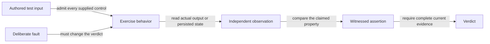

# Validation integrity: systems review

This review covers the eight requested validation tickets and the related
repairs tracked by `elspeth-1c4f6660cf`. The repair branch is
`fix/validation-triage-20260920`, based on `627b72cf1`. These are local test,
fixture, evaluator, and developer-tool changes; this note is not a release
acceptance record.

The strengthened value-preservation floor exposed a broken FieldMapper
probe: its strict configuration required a source field that only its
backward probe supplied. Its forward probe now supplies that same field.
The invariant and FieldMapper suites then passed all 558 tests.

The common defect is loss of evidence between the behavior under test and
the success signal. A passing test could mean that its assertion ran, that
every example returned early, that Python rejected an incomplete call, or
that an old result was reused. Those outcomes require different treatment.

## Measured failures and interventions

| Lost evidence | Reproduction before repair | Repair and retained control |
| --- | --- | --- |
| Expected model mistaken for observed state | Deleting or replacing persisted fork links left the fork invariant green. Removing one of three coalesce parents left its `>= 2` check green. | Record expectations from operation inputs; query actual token/parent rows; compare exact identities and cardinality. Corruption controls exercise the live invariants. |
| A copy or schema mistaken for the live value | Nested checks examined freshly thawed copies; override checks accepted corrupted values with unchanged keys. | Inspect live frozen containers and compare complete override payloads. Shallow-freeze and wrong-value controls challenge those checks. |
| No assertion mistaken for successful validation | All-error or empty-output probes passed presence/value sweeps; a hook that removed the sentinel defeated the underdeclaration sweep. | Require witnessed field/value comparisons or sentinel-bearing emissions over the sweep, while allowing individual legitimate error/filter examples. |
| A preliminary error mistaken for the intended guard | Four SourceRow tests passed with `__post_init__` disabled because required factory arguments were missing. | Supply every required construction field and assert the contract-specific `ValueError`; explicit signature tests retain their separate purpose. |
| Cleanup assumed rather than checked | Direct plugin/declaration mutations and finalizer-time leaks passed the registry fixture. | Snapshot inventories and shared identity, then compare after monkeypatch restoration; exercise real pytest teardown in subprocess controls. |
| Authored controls silently discarded | Unknown Chaos marker keywords and positional dictionaries produced a clean configuration. | Reject unconsumed arguments in both fixtures before configuration loading; preserve supported keyword/preset behavior. |
| Malformed evidence coerced into success | Mixed-case criteria missed matching text; non-object state and `is_valid="false"` could receive GREEN. | Normalize both phrase operands; require an object and a real boolean for state evidence. Preserve explicit, structured invalid-state allowances. |
| Historical or incomplete reports mistaken for current proof | Human output never yielded a score; reporter failures were swallowed; path aliases lowered thresholds; cached kills survived deletion of the catching assertion. | Read machine reports, scope by resolved module identity, propagate errors, and reject strict cached runs. A survivor listing no longer claims every mutant was killed. |

The original tickets are `elspeth-d190d4c64f`, `elspeth-b6b1541026`,
`elspeth-e4c429f1a2`, `elspeth-94e4daff86`, `elspeth-f7645faf56`,
`elspeth-8b675620af`, `elspeth-188480c789`, and `elspeth-85beab4f38`.

## Why these repairs act on the common cause

Increasing Hypothesis examples cannot strengthen a comparison of the model
with itself. Adding marker vocabulary cannot detect a misspelling that is
discarded before execution. Tightening a score threshold cannot make a
historical result describe today's tests. The effective interventions sit
at the observation, admission, and verdict boundaries.

The cache reproduction demonstrates accumulation directly: a strong test
produced 100% killed; removing its assertion and retaining the cache still
produced 100%; a fresh run of the weakened test produced 0%. Strict mode
now requires fresh execution. Non-strict cache reuse remains exploratory.

A broader reinforcing loop is plausible: misleading green results encourage
continued reliance on weak probes, delaying discovery of further defects.
That is an interpretation, not a measured history or a prediction of defect
rates. The demonstrated facts are the executable counterexamples above.

## Repair locations and verification

- [Token properties](../../tests/property/engine/test_token_properties.py)
  and [lifecycle state machine](../../tests/property/engine/test_token_lifecycle_state_machine.py).
- [Invariant harness](../../tests/invariants/test_pass_through_invariants.py),
  [registry fixtures](../../tests/invariants/conftest.py), and their negative controls.
- SourceRow contract and engine tests under `tests/unit/contracts/` and `tests/unit/engine/`.
- Chaos fixtures under `tests/fixtures/` and their tests under `tests/unit/fixtures/`.
- [Composer evaluator](../../evals/lib/composer_rgr_score.py)
  and [evaluator tests](../../tests/unit/evals/lib/test_composer_rgr_score.py).
- [Mutation wrapper](../../scripts/run_mutation_testing.py)
  and [wrapper tests](../../tests/unit/scripts/test_run_mutation_testing.py).

Each defect was challenged before repair and checked afterward with normal
and deliberately broken inputs. A green focused suite alone is not a claim
that the complete repository suite, PostgreSQL suite, or remote CI passed.
The combined gate records its own exits and frozen-tree status separately.

## Limits and remaining work

This is a bounded review of the implicated components, not an exhaustive
inventory of validation defects. The FieldMapper source change repairs its
test probe hook and regenerates its canonical source hash; it does not change
row processing or configuration behavior. Simulated corruptions do not
establish that production currently produces those corruptions.

Real mutmut 2.5.1 smoke tests worked with Python 3.12. The installed Pony
dependency failed while listing results under Python 3.13; the wrapper now
reports an error rather than success. The shared environment was not changed.
The wrapper's existing `--all` list also names retired Landscape files and
now reports those missing targets honestly; replacement mutation scope needs
its own selection.

The scheduled workflow has a separate existing issue, `elspeth-1563ede8c3`:
it swallows runner exits, assumes a directory-shaped cache, and ignores its
manual path input. This batch does not repair that workflow or change its
explicit advisory policy. Local wrapper correctness is not evidence of
scheduled-CI correctness.
