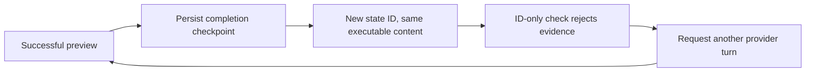

# Composer evidence identity review

This review follows the live convergence battery and the maintainer's request
to use systems thinking to find similar defects. The boundary under review is
the transition from mutable authoring state to persisted evidence and its
consumers. A record ID, executable content, an authorization context, and a
published output version answer different questions.

## Observed feedback

The cleanup case successfully previewed its final executable graph. Turn
settlement then created another state record, and a later metadata correction
created another. The harness treated those records as different executable
graphs, requested an unnecessary preview, and rejected that preview again.

This is a reinforcing retry loop: an attempted correction produces the new
identity that triggers another correction. Raising the turn budget would allow
more repetitions. The intervention is to bind each decision to the identity it
actually needs, while preserving independent validation and authorization.

## Confirmed findings

| Consumer | Incorrect assumption | Measured consequence | Required identity |
| --- | --- | --- | --- |
| Acceptance preview checker | Final record ID must equal preview record ID | Valid previews at v4/v5 rejected after equivalent v5/v7 checkpoints | Ordered executable sources, nodes, edges and outputs; actual preview input binding |
| Cross-turn repair ledger | Runtime preflight's versioned key is also the campaign key | Same version suppresses a repeat, but identical content at a new version injects another campaign | Authored content plus user, session, settings/plugin and interpretation context |
| Acceptance artifact downloader | Every historical artifact describes current bytes at its URI | First quarantine publication expects 24 bytes; successor correctly contains 34 bytes | Finalized tip of the recorded sink-effect succession chain |
| Narrative result display | Active run ID is the displayed completed run ID | Reopened completed history makes no fetch; switching runs can pair new run ID with old artifact | Explicit selected run ID and run-owned loaded result |
| Guided proposal checkpoint | Generic same-content saves do not affect proposal anchors | New checkpoint strands unchanged proposal; retrieval raises an integrity error | Atomically maintained proposal base with exact content and authority checks |

The first four fixes are committed through `e32366035` with controlled positive
and negative evidence in the task lane.
The guided reproduction creates a legitimate COMPOSE lease, saves exact content
with `post_compose` provenance, and confirms the stale anchor. The repair now
updates the lifecycle event and anchor atomically for content-preserving COMPOSE
checkpoints and ordinary PROPOSAL acceptance. Exact operation fences, immutable
review facts, rollback, and concurrent PostgreSQL confirmation/save controls
passed independent review. The two new stored reason codes require session epoch
68; the final integration gates remain outstanding.

The same search also found an information-feedback defect: Composer's
plugin-option warnings referred to `keyword_filter.keywords` and
`json_explode.field`, while the actual contracts use `blocked_patterns` and
`array_field`. A valid LLM configuration with individually templated `queries`
also received a false missing-template warning. The keyword case spent its
remaining discovery turns investigating the false warning. Its regex was
separately executed and matched correctly; JSON display escaping was not a bug.

## Boundaries retained

Exact IDs remain necessary for optimistic concurrency, executed-run state
ownership, and proposal application authority. Executable equivalence cannot
grant execution permission or carry advisor approval across changed requirements.
The preview checker still requires a successful conformant tool call and current
strict validation. The repair ledger limits nudges; it does not reuse runtime
validation verdicts. Artifact selection retains the complete history and the
content endpoint's size/hash verification. Narrative output must reject late
responses from a previous selected run.

Narrative downloads also select only an artifact whose existing preview passed
the backend's integrity verification. Historical publications remain visible in
the audit inventory; a rejected old descriptor cannot become the narrative's
download target merely because it appears first.

Existing frontend composition-content equality already handles some harmless
checkpoint changes correctly; this review does not replace every version check.
Refresh/disconnect survival remains explicitly outside this campaign.

## Evidence and completion

Reproductions and measured logs are under `.claude/lanes/session-ed3c015b/` in
the main checkout: `live-preview-oracle.md`, `artifact-drift-report.md`,
`systems-repair-ledger-repro.json`, `systems-frontend-identity.md`, and
`systems-guided-repro.json`. These contain diagnostic session details and are
not tracked. Final test, live battery, and release integration results will be
recorded in the companion session-convergence report.
