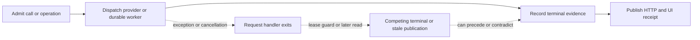

# Composer boundary ownership: systems diagnosis

Date: 2026-09-27. Baseline: local `release/0.8.1` commit
`1f14d49995f6ad66c75da25f78ad1a846347f0f6`. This records behavior
before the [boundary repair plan](../plans/2026-09-27-composer-system-boundary-repair.md)
was implemented. The [independent plan review](2026-09-27-composer-system-boundary-plan-review.md)
approved that plan for implementation; it did not verify a fix. The earlier
[provider boundary diagnosis](2026-09-27-composer-provider-boundary-gap.md)
covers the reported staging Sonnet 502 and planner 503 incidents, and the
[cancellation audit](2026-09-27-composer-cancellation-path-audit.md) covers the
prior sweep. Neither staging incident proves the local failures below occurred
in those sessions.

## Diagnosis in one sentence

Composer starts chargeable calls and durable writes in one task, then lets an
exception handler, lease guard, HTTP response, or frontend update finish them
under another owner. Those boundaries use different failure taxonomies and
different ideas of which result is current. The result can be an unsettled
provider attempt, a terminal operation missing its call evidence, an ambiguous
proposal receipt, or a user interface that regresses after the backend has
completed.

The strongest evidence is controlled local injection at named boundaries, with
positive and negative controls. It establishes reachable behavior at the
baseline commit. It does not establish staging frequency, a gateway root cause,
or the outcome of the repair now in progress.

The operator's triggering incidents are distinct: three Sonnet 502
`upstream_response_invalid` attempts became LiteLLM `BadGatewayError` and
escaped the freeform message route without a failed Composer reply; a later
planning call received local gateway 503, then an unsettled attempt caused
`AuditIntegrityError` to mask the provider failure. The canary planner branch
shared that accounting gap. The [earlier provider diagnosis](2026-09-27-composer-provider-boundary-gap.md)
traces these routes and their controlled exception classes. The additional
boundaries below show why repairing those two route catches alone would not
close the broader ownership problem.

## What accumulates and where feedback is delayed

| Stock or obligation | Inflow | Correct outflow | Observed or plausible escape |
| --- | --- | --- | --- |
| Admitted provider attempts awaiting terminal accounting | Provider admission before dispatch | One terminal quota/audit result, including unknown usage after a failed dispatch | Auto-title raw transport and unexpected first-party errors escaped with no settlement in controlled probes. A caller exception does not erase the admitted attempt. |
| Accepted freeform user intents awaiting an unambiguous receipt | `/messages` user-row insertion | One canonical user row tied to a stable client request identity, with exact retry reconciliation | Cancellation after real ingress commit lost the receipt; the same POST inserted a second user row because ingress had no exact request identity. |
| Successful provider results awaiting turn completion | Inline `composer.compose` returns | Owned continuation through state/transition, assistant, tool/LLM audit, response construction and terminal progress | Cancellation after individual real writes left durable prefixes while the route reported cancellation and released its lease. |
| Guided operations with recorded provider calls | Operation admission and each solver call | One fenced durable terminal operation plus its exact audit cohort and truthful progress | A second cancellation or cancellation in an ordinary failure arm let the lease guard write an empty cohort before the audit-aware writer finished. |
| Submitted proposal decisions and dependent review work | Reject/commit worker submission | Durable decision, exact replayable receipt, and required interpretation-review evidence | Reject committed after request cancellation; ordinary exact retry returned 409. Auto-commit could finish settlement before the post-commit surfacer ran. |
| Asynchronous frontend results eligible to publish | POSTs, REST reads, WebSocket messages, cancel acknowledgements | Publication by the current owner, with terminal run status preserved | Older same-session completions and later nonterminal events replaced newer or terminal state in controlled delivery-order tests. |

The accounting stock is measurable as `admitted - terminally settled` for the
same attempt identity. That equation is an invariant to query from the ledger,
not a count inferred from source text. An operation can be durably terminal
while its dependent audit or review evidence remains missing, so a terminal
row alone cannot certify that the obligation closed. Frontend results are
in-flight claims rather than durable rows; a session or run ID routes a result,
but does not prove that it still owns publication.

The dashed paths represent the reproduced ordering failures, not an additional
normal workflow. Provider latency and worker delays widen the interval between
admission and authoritative terminal evidence. During that interval, a second
cancellation, an independent lease guard, another REST poll, or a reconnect can
act on older information. The precise 29-second staging gateway delay is a
reported incident fact, not a measured parameter of this local model.

Two feedback mechanisms matter. First, the lease guard is meant to balance
unfinished operations by closing them when a request exits. If it cannot see
an already-submitted audit-aware writer, it can close the operation too early,
making its own cleanup compete with the writer and hide the missing audit
cohort. Second, temporary-unavailability copy for authentication or bad-request
failures invites an unchanged manual retry. More such retries would increase
admissions and quota pressure without fixing credentials or input. The code and
UI establish that path; user retry rates and any resulting staging load were
not measured. Similarly, polling increases opportunities for overlapping reads,
but a real-world retry/polling load loop has not been quantified.

## Boundary evidence at the baseline

The controls below used injected failures and deliberately reordered
completions. Counts in this table came from the probe output or database/API
read, as recorded in the ignored lane reports; they are not a source-code
inventory. All source links point to baseline locations and may move during
the repair.

| Boundary | Measured result and control | Consequence and limit |
| --- | --- | --- |
| Auto-title provider call | Injected SDK 502: admitted, one settlement. Injected raw `httpx.ConnectError`: admitted, zero settlements, escaped. `TypeError` negative control also escaped with zero settlements. See [`_auto_title.py`](../../src/elspeth/web/sessions/_auto_title.py) and the route's auto-title task join in [`messages.py`](../../src/elspeth/web/sessions/routes/messages.py). | A raw transport exception can leave quota pending and the route can rethrow the title task result after the main assistant reply is ready. The first-party `TypeError` shows an accounting gap too; it must settle before propagating, while retaining its first-party identity. The probe did not perform a live provider request. |
| Freeform ingress | A real route/file-backed SQLite probe cancelled after `add_message_with_transcript` committed: one user row remained, the lease had released, progress was idle, and exact same POST retry returned 200 with a **second** user row. See [`messages.py`](../../src/elspeth/web/sessions/routes/messages.py), [`service.py`](../../src/elspeth/web/sessions/service.py), and the request schema in [`schemas.py`](../../src/elspeth/web/sessions/schemas.py). | The current request has content and optional state but no stable retry identity. The probe establishes duplicate admission and ambiguous acceptance after lost HTTP delivery; it does not measure duplicate provider dispatch in that exact run. Joining only the write would keep custody but would not tell an exact transport retry from a deliberate second identical message. |
| Freeform post-provider continuation | Real route/file-backed SQLite probes paused after genuine state, assistant, and turn-audit commits, then cancelled. The child result was lost, the lease released, and progress reported cancelled while a durable prefix of the turn remained. See the direct awaits and completion publication in [`messages.py`](../../src/elspeth/web/sessions/routes/messages.py). | These probes used synthetic call audit without provider quota admission, so they do **not** establish pending-attempt behavior. The chain uses separate SQL writes and is not all-or-none; a real mid-chain failure remains possible. [`/recompose`](../../src/elspeth/web/sessions/routes/composer/compose.py) has analogous direct awaits by source trace, pending its own controlled reproduction. |
| Guided provider interpretation | An SDK API error returned synthetic unavailable; raw `ConnectError` escaped; SDK authentication and bad-request errors returned the same temporary-unavailability copy; `TypeError` escaped. See [`_guided_step_chat.py`](../../src/elspeth/web/sessions/_guided_step_chat.py), [`chat_solver.py`](../../src/elspeth/web/composer/guided/chat_solver.py), and [`GuidedChatHistory.tsx`](../../src/elspeth/web/frontend/src/components/chat/guided/GuidedChatHistory.tsx). | Four guided wrappers share a separate catch list that omits raw HTTP transport. The route projects an unavailable reason and the UI offers Retry for auth/bad-request. The solver may record a call while the route reports generic operation failure. The wrapper probe did not measure a full public route response. |
| Guided Chat audited failure | A fake provider recorded one failed call. Repeated cancellation while the audit writer was blocked produced a durable `failed/request_cancelled` operation, terminal guard event with cohort count **0**, persisted LLM audit count **0**, and later writer `GuidedOperationFenceLostError`. Cancelling the ordinary error arm's direct audited write produced the same empty-cohort result with a single cancellation. See [`guided_chat_atomic.py`](../../src/elspeth/web/sessions/routes/composer/guided_chat_atomic.py), [`guided_operations.py`](../../src/elspeth/web/sessions/routes/guided_operations.py), and [`service.py`](../../src/elspeth/web/sessions/service.py). | Real ASGI route and file-backed SQLite transactions reproduce competing terminal writers. One-cancellation and progress-sink-exception controls passed, showing why existing coverage missed the interleaving. These probes do not show a live staging occurrence. |
| Guided Chat successful settlement | Cancellation after the real successful transaction committed yielded a durable `completed` operation but `cancelled/client_cancelled` progress. See [`guided_chat_atomic.py`](../../src/elspeth/web/sessions/routes/composer/guided_chat_atomic.py). | The response path treated caller cancellation as evidence of operation cancellation after the durable state said otherwise. The latest progress snapshot is in memory and can diverge from durable truth. |
| Adjacent guided writes | [`guided_plan.py`](../../src/elspeth/web/sessions/routes/composer/guided_plan.py) and [`guided.py`](../../src/elspeth/web/sessions/routes/composer/guided.py) had directly awaited failure or success settlements. The diagnosis report identified analogous cancellation windows by source trace; the approved plan later added controlled probes for planner nonproposal, reviewed-state, generic RESPOND and reentry success. | The original lane report did **not** route-reproduce each analogous site. The plan and its review require branch-specific tests before claiming those paths repaired. Reentry admits no provider attempt; generic RESPOND has no local progress sink, so the outcome contract differs from Guided Chat. |
| Proposal rejection | Real ordinary reject transaction committed one terminal event, caller saw `CancelledError`, exact retry returned **409**. Canonical reject had the same first-receipt ambiguity but exact retry returned **200**. See [`proposals.py`](../../src/elspeth/web/sessions/routes/composer/proposals.py) and [`service.py`](../../src/elspeth/web/sessions/service.py). | A cancelled HTTP exchange cannot prove delivery of its receipt. Ordinary exact retry failed to reconcile a decision already made; canonical replay already had a strict terminal-evidence check. Neither probe showed duplicate events. |
| Pipeline preparation and review handoff | Injected owned `PipelineCommitError(code="TIMEOUT")`: public accept returned **422**, proposal stayed pending. Pausing after a real auto-commit transaction and cancelling yielded committed proposal and **zero** surfacer calls. Manual exact retry ran the surfacer. See [`pipeline_commit.py`](../../src/elspeth/web/composer/pipeline_commit.py) and [`pipeline_settlement.py`](../../src/elspeth/web/sessions/routes/composer/pipeline_settlement.py). | A server preparation timeout was presented as invalid input. The auto-commit probe had no review site, so it proves a missed handoff rather than a stuck review card. Manual exact retry and `/validate` can repair missing review evidence later; permanent orphaning is unproven. |
| Freeform Composer UI | Controlled A→B→A switch with a newer A POST let the older A result append `old-reply` and clear `isComposing` while the new A turn remained pending. Existing no-newer-turn A→B→A sync is a positive behavior to preserve. See [`sessionStore.ts`](../../src/elspeth/web/frontend/src/stores/sessionStore.ts). | Session ID checks identify the destination but not the latest same-session compose claim. Success, error, retry and post-POST sync publication need the same ownership rule. |
| Execution UI and socket | Reordered Vitest reads showed an older same-session `running` list replacing newer `completed`. Late `running` cancel acknowledgement and late progress WebSocket event each demoted terminal `cancelled` progress. Repeated open→4503 cycles waited 1 second each. See [`executionStore.ts`](../../src/elspeth/web/frontend/src/stores/executionStore.ts) and [`websocket.ts`](../../src/elspeth/web/frontend/src/api/websocket.ts). | Run ID and session ID checks alone do not enforce read order or terminal precedence. The 4503 backoff reset happened on socket open before any healthy event; this can make backend-unavailable reconnects more frequent than the advertised ladder. These are controlled client tests, not staging traffic measurements. |

## Underlying defect class and leverage points

The common defect is **authority loss across an asynchronous boundary**. The
physical provider call, the durable transaction, and the frontend publication
each have a different point at which the action becomes real. Current local
handlers sometimes substitute a catch list, `asyncio.shield(coroutine)`, a
session ID comparison, or a terminal status row for proof that the entire
obligation has finished. Those proxies are insufficient in the measured
interleavings. This is a structural explanation supported by several local
reproductions; it is not a claim that one code function causes every symptom.

Freeform ingress shows why custody and identity are separate parts of that
structure. The existing fenced insertion allocates a new sequence and user
row for each invocation. A stable client key would identify one intentional
send across transport retries; the database transaction would then bind that
key to exactly one accepted user row. Content matching is insufficient because
two identical intentional sends are legitimate. The current bodyless
`/recompose` selects the last conversational user row, so its recovery target
can also drift after navigation or a cross-tab send. This is a source-backed
identity risk, not a reproduced wrong-user recomposition.

The repair's leverage points are rules at the boundaries where authority is
created and transferred:

1. **Provider dispatch:** classify external failures at the physical call and
   carry a value-free disposition through quota/audit, durable operation,
   response and guidance. A first-party fault still needs terminal accounting
   after admission, but must not masquerade as a provider outage. Preserve
   unknown usage when no trustworthy response arrived.
2. **Durable worker custody:** retain and join a submitted task despite
   repeated caller cancellation before the lease guard can write an alternate
   outcome. Treat child failure and fence loss as evidence to resolve, not as
   permission to claim success. Include dependent progress or review writes in
   the owned obligation where they are required for a truthful receipt.
3. **Idempotent recovery:** use exact terminal event identity and attribution
   to reconcile a retry after an HTTP receipt is lost. A conflicting request
   still conflicts. An automatic commit needs its own completed post-commit
   handoff because replaying a new message is a new turn.
4. **Frontend publication:** distinguish the session/run routing key from the
   current request or stream owner. Fence older completions and make terminal
   run status absorbing for that run, while permitting authoritative enrichment
   of final accounting and reconciliation of genuinely conflicting terminal
   evidence. Reset reconnect delay only after a healthy stream signal or a
   deliberately defined stable-open interval.
5. **Freeform ingress and continuation:** bind a client-generated request UUID
   and its original content and nullable requested state to one canonical
   accepted user row in the fenced transaction. Keep the submitted ingress
   worker joined through commit or rollback. After inline provider composition
   returns, retain one child for the whole successful continuation through
   response construction and terminal progress while the lease and compose
   lock remain held. A client disconnect may lose HTTP delivery without
   changing a proven durable completion into `client_cancelled`. A partial SQL
   prefix remains a real integrity failure, not a completed turn.

These are outcome rules, not targets for fewer lint signatures, more catch
clauses, or a particular test count. Honest trust-tier signature churn is part
of implementing the clearest correct boundary; it must not shape behavior to
improve a metric. The repair must keep the Composer's provider-authored graph
and the tutorial's ordinary backend path.

## Testable invariants

- For every admitted provider attempt, queryable terminal accounting exists
  exactly once before the request or its owned worker claims completion.
  Transport, SDK gateway error, cancellation and first-party failure controls
  must retain distinct semantics; an absent response means unknown usage, not
  asserted zero tokens.
- Once a guided route has submitted an audit-aware terminal write, no guard
  may replace its cohort with an empty one while that write is outstanding.
  Durable status, recorded call evidence and any published terminal progress
  must agree. If settlement fails, surface integrity failure; do not present
  caller cancellation as proof that a committed operation was cancelled.
- Each proposal decision produces at most one terminal event. Exact retries
  of the same decision return its committed receipt after verifying terminal
  evidence; conflicting decisions return conflict. Server preparation timeout
  leaves the proposal pending with sanitized retry guidance. Required
  post-commit review evidence is surfaced under owned custody, with `/validate`
  retained as recovery for interruptions beyond request lifetime.
- A frontend result publishes only while its compose claim, read epoch or
  stream connection is current. For the same run, a nonterminal result cannot
  demote an observed terminal status. A distinct terminal conflict triggers
  bounded authoritative reconciliation, while later final metadata may enrich
  the terminal view. A repeated open→4503 sequence escalates reconnect delay
  until a healthy signal resets it.
- An intentional freeform send has one stable `client_request_id`, one
  canonical accepted user message and at most one provider dispatch. An exact
  accepted duplicate returns an acceptance receipt, **not** a claim that the
  whole composition completed; changed payload under the same key conflicts.
  Cancellation after acceptance but before provider dispatch stops dispatch.
  A deliberate `/recompose` names the expected user message and refuses to
  compose a different last conversational turn.
- Once inline provider composition succeeds, the route owns state, assistant,
  turn-audit, response and terminal progress obligations until their verified
  result or a visible integrity failure. Repeated caller cancellation cannot
  release the lease early or cause a second cancellation audit cohort. A
  completed durable receipt and a cancelled HTTP transport remain distinct
  facts in request metrics and in-flight reconciliation.

The [implementation plan](../plans/2026-09-27-composer-system-boundary-repair.md)
names the controlled RED/GREEN tests and whole-tree, PostgreSQL, frontend and
independent-review gates for these invariants. The completed implementation
and final cancellation-path audit must report their own measured outcomes;
this baseline diagnosis does not stand in for them.

The approved freeform acceptance contract is deliberately narrow. A required
UUID `client_request_id` is generated once per intentional send; a same-session
immutable ingress receipt stores its canonical message and original nullable
requested state. The fresh path inserts receipt and message atomically and
returns its same-transaction transcript. An exact duplicate returns structured
HTTP 409 `message_already_accepted` with the canonical message ID, without a
new user row, provider call or invented progress. Changed content or requested
state returns `message_idempotency_conflict`. The frontend keeps the key and
original payload for uncertain retries, reconciles the canonical row under
its generation fence, and only deliberately recomposes with a required
`expected_user_message_id`. The [Astra plan review](2026-09-27-composer-system-boundary-plan-review.md)
first rejected an unspecified ingress contract, then approved this concrete
revision. Its GO is permission to implement and test, not evidence that the
current source already satisfies the contract.

## Unresolved staging question

The reported staging Sonnet `502 upstream_response_invalid` and later local
gateway `503` establish provider-facing failures in two user sessions. They do
not identify why the Azure-hosted app and AWS-hosted model gateway produced
those responses. Candidate causes such as malformed upstream bytes, gateway
translation, network interruption, timeout or capacity remain hypotheses until
correlated gateway/request IDs, timing and response metadata are inspected at
the relevant hop. The local repair can make accounting and user guidance
correct for those failures without claiming to repair the upstream fault.
