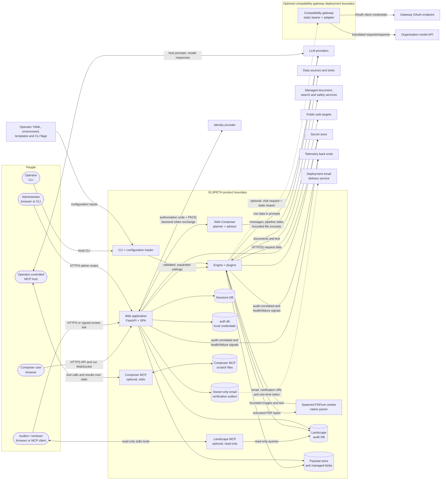

# 02 — Data flows and trust boundaries

**Status:** product baseline complete; Deployment record required ·
**Product source reviewed against:** `release/0.8.1` @
`487ac85a377f135e012bb206e3769cd65f6fadb8` (2026-10-01) ·
**Owner:** DTA Cloud Engineering

This document shows where data enters, moves through and leaves the ELSPETH
product boundary, and where its level of trust changes. It describes product
controls and explicit limitations; [04](04-threat-model.md) assesses the
threats, while [06](06-identity-and-access.md),
[07](07-secrets-and-key-management.md) and
[08](08-logging-audit-and-monitoring.md) provide control detail.

> **Sensitive when populated:** deployment hostnames, network ranges, account
> identifiers, provider names and endpoints belong in the controlled copy.
> Complete only the sections headed **Deployment record** for an installation.

## 1. Product context

The deployment platform surrounds this product diagram. Browser TLS
termination, network segmentation, platform egress, database accounts and
provider placement are recorded per deployment in § 7 [EV-003].

The Composer MCP server does not call an LLM. An operator-controlled MCP host
does so and may expose prompts, tool definitions, calls and results to its
configured provider. That host/provider boundary is therefore part of any
deployment that enables Composer MCP [EV-019].

## 2. Trust tiers

ELSPETH validates data according to who produced it
([ADR-032](../architecture/adr/032-validate-by-trust-domain.md),
[Platform Architecture § Trust Boundaries](../release/platform-architecture.md#trust-boundaries))
[EV-003].

| Tier | Covers | Product handling |
|---|---|---|
| Tier 1 — ELSPETH-authored | Audit records, checkpoints and internal state | Inconsistency is a product defect. ELSPETH stops rather than silently repairing or reinterpreting it |
| Tier 2 — validated pipeline data | Rows admitted by a source and moving between steps | Trusted to match the declared schema; value-dependent operations remain fallible and wrapped |
| Tier 3 — external | Browser and MCP requests, source rows, uploaded files, API/LLM/IdP responses | Parsed and validated at the boundary; invalid pipeline rows are quarantined and recorded rather than silently dropped |

Externally produced inputs in § 3 cross from Tier 3. Product boundary parsers
carry explicit trust-boundary metadata, and `elspeth-lints` checks that policy
[EV-608]–[EV-610].

## 3. Product flows

“Transport” below describes what the product enforces. Browser TLS terminates
at a deployment-controlled component (§ 7).

| # | Flow | From → To | Data | Trust crossing | Product control and limitation |
|---|---|---|---|---|---|
| F1 | Local sign-in | Browser → web | Username, password | Tier 3 → trusted identity | Admitted attempts that reach the handler verify bcrypt credentials and write success or classified failure evidence. The shared per-client limiter rejects excess requests with 429 before the handler, so those excess sign-in requests have no `auth_events` row. Failed bearer-token checks use the same limiter; over-limit audit writes on that separate path increment `auth_failure_audit.suppressed_total` [EV-103], [EV-106], [EV-304] |
| F2 | SSO sign-in | Browser ↔ web ↔ identity provider | Authorisation code, ID token and admitted identity claims | Tier 3 → trusted identity | Confidential backend client; code flow with PKCE; state, nonce and verifier sealed in a `__Host-` cookie; pinned ID-token algorithm; no redirects on IdP requests; one-time handoff in the URL fragment; first-time identities held pending unless the one-time first-administrator bootstrap admits a configured subject. IdP group and role claims grant no ELSPETH authority [EV-012], [EV-101], [EV-111] |
| F3 | Web API request | Browser → web | Requests, pipeline edits and declared request bodies | Tier 3 → trusted request | Protected API routes require an ELSPETH HS256 session token and re-check the identity's live state. Authentication bootstrap/configuration and public status/health/readiness routes are intentionally unauthenticated as inventoried in [EV-105]. A versioned bounded detector refuses recognised credential material in in-scope Web control fields before their mutation or audit side effects. Global middleware rejects malformed or over-10-MiB **declared** `Content-Length`; it does not read or prove the size of a body with no header. Route/field limits remain the content controls [EV-102], [EV-105], [EV-017], [EV-227] |
| F4 | Run progress | Web → browser WebSocket | Run status events | Trusted → user | Single-use, database-backed ticket bound to the user and run; session tokens in the WebSocket URL are refused [EV-401] |
| F5 | File upload | Browser → managed blob directory | User files for pipelines | Tier 3 → product-managed blob | Session-scoped storage, MIME allowlist, per-session quota and content hash. The product does not determine classification [EV-010], [EV-015] |
| F6 | Composer planning | Web → planner LLM | User messages, pipeline state, plugin catalogue and file excerpts up to 50,000 characters per tool read | Trusted → external provider | Operator selects model/endpoint; per-composition call, request-byte, token, cost and repair budgets; internal storage paths are redacted and recognised credential material in control-plane state and provider requests is refused before egress. Raw stored blob bodies and inline blob bodies at tool admission are data-plane content outside the detector; excerpts and source facts promoted into Composer/provider messages are guarded [EV-014], [EV-015], [EV-227], [EV-504], [EV-505] |
| F7 | Composer advice | Web → advisor LLM | Proposed pipeline and bounded context | Trusted → external provider | Separate operator-selected model and endpoint; same model refused unless the operator explicitly accepts correlated-review risk; calls audited [EV-504]–[EV-506] |
| F8 | Model response and tool call | LLM provider → web/engine | Tool calls and generated text | Tier 3 → validated product input | Closed schemas validate arguments before handlers run. Recognised credential material in response text, tool identifiers and arguments, reasoning and retained provider metadata is refused before rejected values can enter history, proposals, handlers, state or ordinary audit fields. A provider attempt may retain one fixed, value-free failure audit record. `auto_commit` applies valid mutations by default. Under `explicit_approve`, mutation tools become pending proposals except `create_blob`, which remains immediate so a later proposal can reference its allocated blob ID; `update_blob` and `delete_blob` still require approval. The user separately starts a validated run, and governed runs require approval [EV-227], [EV-402], [EV-403], [EV-510], [EV-511] |
| F9 | Source ingest | Source system → engine | Rows and documents | Tier 3 → Tier 2 | Source schema validation; invalid rows are quarantined with a recorded reason. Web authors reach profiled cloud sources only through operator policy [EV-013] |
| F10 | External-call transform | Engine → LLM, managed service or public web | Row data in prompts/requests, documents, URLs, headers and request bodies | Tier 2 → external provider/target | Operator profiles, application fetch controls and per-service rate limits; call request/response evidence is written before the result is consumed [EV-011], [EV-013], [EV-020], [EV-310] |
| F11 | Sink output | Engine → sink target | Pipeline results | Trusted → external target | Durable effect identity and plan are persisted before I/O; uncertain outcomes are reconciled rather than blindly repeated. ELSPETH provides no general sink-boundary redaction guarantee [EV-002], [EV-327] |
| F12 | Audit write/export | Engine/web → Landscape → export target | Audit records, payload references, hashes and signed-export material | Internal; then trusted → external export | Audit-first writes, canonical hashing, Tier-1 validation, immutable export snapshots and resumable export. Optional HMAC-signed export requires deployment key custody [EV-312]–[EV-318], [EV-327] |
| F13 | Secret resolution | Engine/web → secret store | Secret references and values | Internal/external secret boundary | Runtime resolution; fingerprint rather than value in audit; allowlisted server-secret names; encrypted user-secret store; no-value APIs and error scrubbing [EV-207]–[EV-218] |
| F14 | Telemetry | Web/engine → telemetry backend | Operational metrics/traces; at `full`, LLM/HTTP request and response payloads | Trusted → external backend | Audit-correlated domain telemetry is emitted after its audit write. `lifecycle` carries identifiers/counts; `rows` adds row activity but removes content hashes; `full` adds prompts, completions and HTTP bodies. Health/failure counters may describe suppressed or failed audit paths and never prove audit success [EV-321]–[EV-324], [EV-329] |
| F15 | Shareable review | Reviewer → web | Signed capability token | Tier 3 → authorised read | Separate HMAC key, constant-time verification, expiry, active sign-in, rate limit and digest-bound read-only snapshot. The token is a replayable bearer capability: any active identity holding it may reuse it until expiry, payload removal or global key rotation. It has no recipient binding, one-time use or per-token revocation, and re-minting does not invalidate older tokens; the nonce distinguishes mints but is not replay defence [EV-117] |
| F16 | Landscape analysis MCP | Auditor MCP client ↔ local server → Landscape | Tool calls, bounded query results and audit data | Local host boundary | Local stdio; read-only connection and tools. SQL accepts one `SELECT` or `WITH … SELECT` statement with a row cap [EV-319], [EV-330] |
| F17 | Public status/health | Anyone → web | Build/deployment identity, model names, banner and redacted health/readiness | Unauthenticated | `/api/system/status`, `/api/health` and `/api/ready` intentionally require no session token; readiness returns redacted checks [EV-105], [EV-328] |
| F18 | Local email verification | Browser → web → `auth.db` token/outbox tables → owner-only JSONL → deployment email process → recipient → verification route | Email address, local user ID, delivery ID, raw one-time token and verification URL | Tier 3 registration; trusted record → external delivery → Tier 3 claim | The lookup table holds only a hash, but the raw 24-hour bearer token and URL are durably persisted in both the `auth.db` outbox payload and mode-0600 JSONL. Claim is transactionally single-use, rate-limited and audit-coupled. It marks the local account verified; session-token issuance still passes the separate identity admission/active-state wall. ELSPETH supplies no mail transport; recipient correctness, mailbox/delivery confidentiality, outbox-reader identity and retention are deployment controls [EV-018] |
| F19 | Standalone Composer MCP | MCP host ↔ `elspeth-composer` ↔ scratch store; host ↔ its LLM provider | Tool definitions/calls/results, composition state, generated YAML and session/event files | MCP client Tier 3 → trained-operator tool authority; local filesystem boundary; optional host → provider egress | Local stdio only, with no application sign-in, per-user ownership or network listener. Blob/secret tools are excluded and arguments are schema-validated, but the host can discover and mutate every session in its shared scratch directory. CAS detects stale writes; sidecar hashes detect accidental inconsistency, not a filesystem actor that rewrites state and hashes coherently, and cross-process sidecar safety is out of scope. Dedicated single-tenant scratch/process identity and host-provider handling are deployment controls [EV-019] |
| F20 | Operator pipeline configuration and execution | Operator/configuration source → CLI loader → engine/plugins → configured sources and sinks | YAML, plugin names/options, paths/URLs, environment placeholders and resolved secrets, template bytes, run mode and flags | External configuration → validated settings → effectful operator authority | Safe YAML loading, closed/typed settings, pre-expansion credential/output guards, explicit `--execute`, graph/replay validation and sink-effect preflight reduce mistakes. Configuration is executable authority, not a sandbox: provenance, review, template/environment custody, working directory and the invoking OS account are deployment controls [EV-021] |
| F21 | Compatibility gateway | ELSPETH or compatible client → gateway → OAuth endpoint and organisation model API | Static inbound bearer, messages/tools/response schemas/model alias, OAuth client credentials/token and translated request/response | Client Tier 3 → gateway; executable adapter → secret-bearing process; gateway → external services | Strict bearer parsing/constant-time comparison, closed configuration, fixed HTTPS-or-loopback origins, bounded schemas/bodies, forbidden authority headers, no redirects, metadata-only logs and bounded errors constrain the wire path. A bearer holder obtains the configured upstream authority; the gateway has no end-user identity, and executable adapter code is trusted deployment code inside the process [EV-022] |
| F22 | Native PDF rasterisation | Uploaded/source PDF → hash-verified payload → parent transform → spawned one-document PDFium worker → temporary images/text → output | Attacker-controlled PDF bytes, rendered pixels and extracted text | Tier 3 bytes → native parser → Tier 2 output | Input/page/pixel/text bounds, spawned single-use worker, Linux CPU/address-space limits, wall timeout/kill, temporary-directory cleanup, output-path containment and renderer-identity hashing limit crashes and resource use. This is not an OS security sandbox; non-Linux lacks the rlimits, and native compromise inherits the worker/service account's environment, filesystem and network authority [EV-023] |

## 4. Outbound request controls

### 4.1 Public HTTP fetching

`blob_fetch` and `web_scrape` use the shared audited HTTP client and SSRF
policy [EV-011], [EV-020]:

- **Schemes and authority:** only HTTP/HTTPS; embedded credentials are
  refused.
- **Exact origins:** optional `http.allowed_origins` matches scheme, host and
  effective port on the first request and every permitted redirect. Refusal
  occurs before DNS.
- **Address policy:** `http.allowed_hosts` defaults to `public_only`. It blocks
  unspecified, loopback, private, carrier-grade NAT, unique-local, link-local,
  protocol-assignment, benchmark and reserved ranges, including supported
  IPv4-embedding forms. An operator may widen it to `allow_private` or exact
  CIDRs; a web author cannot.
- **Always-blocked destinations:** link-local and metadata ranges in both
  families and supported embedding forms, broadcast, multicast, the AWS IPv6
  metadata address and Azure WireServer remain blocked under every policy.
- **DNS rebinding:** ELSPETH resolves once, checks the address and pins the
  connection to it.
- **Redirects:** GET follows a bounded number of hops and revalidates each.
  POST redirects are rejected. Header-bearing GET requests cannot redirect
  across origins.
- **Headers:** only `Accept`, `Accept-Language`, `User-Agent` and
  `X-Requested-With` are accepted. Values are bounded and audit-fingerprinted;
  transport, framing, authentication and cookie headers are refused.
- **POST bodies:** `web_scrape` accepts one JSON object, an ordered URL-encoded
  form or an ordered multipart form of text/stored-blob parts. The default
  request-body cap is 1 MiB; the web-authoring ceiling is 10 MiB. POST failures
  are not automatically retried.
- **Response and time bounds:** 10 MiB and 30 seconds by default and as the
  web-authoring ceilings.
- **TLS:** certificate verification is always enabled.

These controls reduce server-side request forgery risk but do not supply
general network isolation. The deployment still owns platform egress policy,
destination approval and provider suitability.

### 4.2 Operator profiles for web-authored pipelines

The web plugin policy fails closed. Cloud integrations with operator profiles
bind private destination and authentication fields outside user authority; a
web author may set only the profile's bounded public options. A configured
plugin that requires a profile remains unavailable until the operator supplies
a valid one [EV-013], [EV-502], [EV-503].

### 4.3 Identity-provider requests

Discovery, token, userinfo and key requests use the provider profile's origin
policy. Discovery/token/userinfo requests do not follow redirects, and
response bodies are bounded [EV-012], [EV-101].

### 4.4 Deployment record — platform egress

| Item | Value |
|---|---|
| Platform controls | DEPLOYMENT-TODO: record security groups, firewall rules, egress proxy and private-network controls |
| Approved destinations | DEPLOYMENT-TODO: map each outbound flow to approved endpoints and owners |
| Enforcement layer | DEPLOYMENT-TODO: state whether the application, platform or both enforce each destination rule |

## 5. Data leaving the product boundary

Every destination must be suitable for the deployment's classification and
privacy obligations.

| Destination | Data that can leave | Trigger | Flow / evidence |
|---|---|---|---|
| Composer planner LLM | Messages, pipeline state, plugin catalogue and uploaded-file excerpts up to 50,000 characters per read | Composition and auto-title/planning activity | F6; [EV-014], [EV-015], [EV-512] |
| Composer advisor LLM | Proposed pipeline and bounded review context | Advisor/review checkpoints | F7; [EV-504]–[EV-506] |
| LLM plugins | Row fields rendered into prompts; image/blob data where configured | Run uses an LLM source/transform | F10; [EV-503], [EV-509], [EV-513] |
| Managed document/search/safety services | Documents, text and configured query material | Run uses the corresponding plugin | F10; [EV-013], [EV-514] |
| Public web targets | URL/query values, allowlisted header values, JSON/form fields, multipart text and stored-blob content | Run uses `blob_fetch` or `web_scrape` | F10; [EV-011], [EV-020] |
| Sink targets | Pipeline results; no general final-output redaction is guaranteed | Every sink effect | F11; [EV-002] |
| Identity provider | Sign-in redirects, code exchange and provider-scoped identity data; no pipeline data | SSO sign-in | F2; [EV-012] |
| Email delivery service | Email address, local user ID, verification URL and raw one-time token read from the outbox | `email_verified` local registration | F18; [EV-018] |
| Telemetry backend | `lifecycle`: identifiers/counts; `rows`: row activity without content hashes; `full`: LLM/HTTP request and response payloads including prompts, completions and bodies | Pipeline telemetry enabled; operational metrics configured | F14; [EV-322]–[EV-324] |
| Composer MCP host and its LLM provider | Tool definitions, calls/results, composition state, generated YAML and any context the host places in prompts | Optional Composer MCP use | F19; [EV-019] |
| Operator-configured sources, services and sinks | Paths, requests, row data, secrets and outputs selected by operator YAML/CLI | Operator executes F20 | F20; [EV-021] |
| Gateway OAuth and organisation model services | OAuth client identity/token, messages, tools, schemas and model responses | Optional gateway use | F21; [EV-022] |
| Audit export target | Audit records, hashes, payload references/content according to export configuration, signatures and manifest | Configured export or resume | F12; [EV-316], [EV-327] |

The Composer and `full` telemetry flows can send content outside ELSPETH before
or independently of a pipeline sink. Destination approval must therefore cover
authoring and observability paths as well as runtime plugins.

## 6. Trust changes inside the product boundary

| Boundary | Why it matters | Product control | Evidence |
|---|---|---|---|
| Sessions database ↔ Landscape | Authoring/identity state and audit evidence have different authorities | Separate settings and schemas; PostgreSQL startup checks require distinct targets | [EV-301], [EV-306], [EV-320] |
| Credentials ↔ identities | Local passwords must not become application role records | `auth.db` holds local credentials; identities and closed roles live in sessions | [EV-103], [EV-107] |
| Composer proposal ↔ committed pipeline | A model mutation must not apply twice, over newer state or after stale review | Proposal/base/head checks, operation fence and write lock; trust mode controls approval | [EV-403], [EV-510] |
| Payload ↔ audit metadata | Retention may remove content without erasing lineage | Payload references are hash-verified; purge retains Landscape hashes/rows | [EV-313], [EV-325], [EV-326] |
| Pipeline event ↔ telemetry projection | Operational visibility must not silently become a content export | Granularity filter; row-derived content hashes removed at `rows`; `full` is explicit | [EV-321], [EV-322] |
| Composer MCP process ↔ scratch directory | The host has trained-operator mutation authority over every session in a shared directory; another filesystem writer can disclose or coherently rewrite state/evidence | Session-ID path guard, schema validation and CAS; dedicated single-tenant directory/process custody is required because sidecars are neither cross-process safe nor cryptographic tamper evidence | [EV-019] |
| Operator configuration source ↔ expanded settings ↔ plugins | Tampered YAML, environment, templates or flags can acquire the invoking operator's file, network, secret and sink authority | Safe/strict parsing, targeted pre-expansion guards, explicit execution and effect preflight; provenance and OS-account authority remain deployment controls | [EV-021] |
| Gateway client ↔ adapter/process ↔ OAuth/upstream | A static bearer grants upstream use, while the selected adapter executes in the credential-bearing process | Strict/bounded wire contracts and fixed origins constrain requests; listener placement, bearer/OAuth custody and trusted adapter provenance remain deployment controls | [EV-022] |
| Engine parent ↔ native PDFium child | Hostile PDF bytes enter native code; child crash/resource isolation is weaker than hostile-code containment | Spawned one-task worker, Linux rlimits, timeout/kill, contained temporary outputs and measured renderer identity; deployment sandboxing and least privilege remain required | [EV-023] |

## 7. Deployment record — actual endpoints and boundary placement

Complete this table in the controlled copy for each installation.

| # | Flow | Actual endpoint / service | Transport protection and termination | Network / host control | Inside boundary? |
|---|---|---|---|---|---|
| F1–F5, F15, F17 | Browser to web | DEPLOYMENT-TODO: | DEPLOYMENT-TODO: | DEPLOYMENT-TODO: | DEPLOYMENT-TODO: |
| F2 | Identity provider | DEPLOYMENT-TODO: | DEPLOYMENT-TODO: | DEPLOYMENT-TODO: | DEPLOYMENT-TODO: |
| F6–F7 | Composer planner/advisor providers | DEPLOYMENT-TODO: | DEPLOYMENT-TODO: | DEPLOYMENT-TODO: | DEPLOYMENT-TODO: |
| F9–F11 | Enabled sources, transforms and sinks | DEPLOYMENT-TODO: | DEPLOYMENT-TODO: | DEPLOYMENT-TODO: | DEPLOYMENT-TODO: |
| F12 | Landscape, sessions and export target | DEPLOYMENT-TODO: | DEPLOYMENT-TODO: | DEPLOYMENT-TODO: | DEPLOYMENT-TODO: |
| F13 | Secret store | DEPLOYMENT-TODO: | DEPLOYMENT-TODO: | DEPLOYMENT-TODO: | DEPLOYMENT-TODO: |
| F14 | Telemetry backend and selected granularity | DEPLOYMENT-TODO: | DEPLOYMENT-TODO: | DEPLOYMENT-TODO: | DEPLOYMENT-TODO: |
| F16 | Landscape MCP host and database account | DEPLOYMENT-TODO: | DEPLOYMENT-TODO: | DEPLOYMENT-TODO: | DEPLOYMENT-TODO: |
| F18 | Email outbox reader and delivery service | DEPLOYMENT-TODO: | DEPLOYMENT-TODO: | DEPLOYMENT-TODO: | DEPLOYMENT-TODO: |
| F19 | Composer MCP host, scratch directory and host LLM provider | DEPLOYMENT-TODO: | DEPLOYMENT-TODO: | DEPLOYMENT-TODO: | DEPLOYMENT-TODO: |
| F20 | YAML/config repository, templates, environment/secret source, working directory and CLI host account | DEPLOYMENT-TODO: | DEPLOYMENT-TODO: | DEPLOYMENT-TODO: | DEPLOYMENT-TODO: |
| F21 | Gateway listener, image/adapter identity, bearer/OAuth custody, rate limit, OAuth/upstream origins and readiness reachability | DEPLOYMENT-TODO: | DEPLOYMENT-TODO: | DEPLOYMENT-TODO: | DEPLOYMENT-TODO: |
| F22 | PDFium version, platform, worker UID/capabilities, mounts, environment, network/syscall controls and untrusted-PDF policy | DEPLOYMENT-TODO: | DEPLOYMENT-TODO: | DEPLOYMENT-TODO: | DEPLOYMENT-TODO: |
