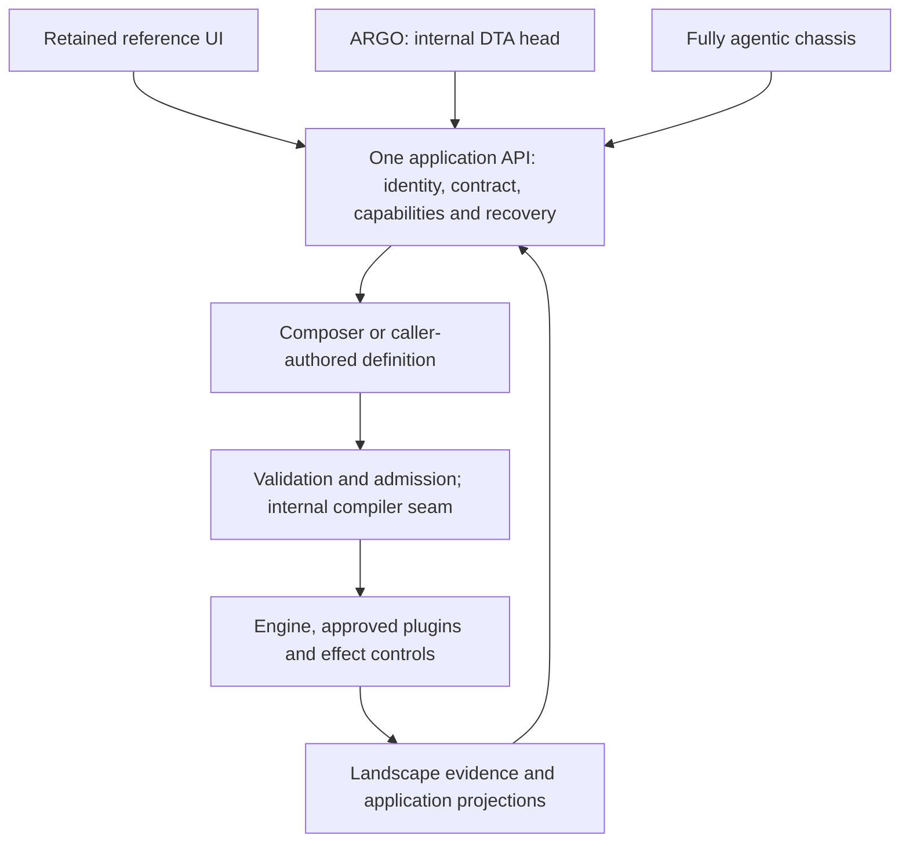

# ELSPETH application API: multi-head architecture and delivery spec

Updated: 2026-10-01. Status: future-facing design, with a source-validated
current baseline. Applies to development from `release/0.8.1` at
`487ac85a377f135e012bb206e3769cd65f6fadb8`; it is not a release certification.

This is the single forward design for the application API, web ownership split
and internal compiler seam. It consolidates the September application API seam,
August compiler facade sketch and web-split brief. The
[September ownership analysis](https://github.com/dta-au/elspeth/blob/2308eeccb78f41fcbae3eae3dd7968855f4cedb7/docs/arch-analysis-2026-09-07-web-split/04-final-report.md)
remains historical evidence, not a current allocation or route inventory.
The April compiled-pipeline design is historical; its portable sealed graph
proposal is not the initial implementation described here.

Superseded inputs are preserved in maintainer-local `docs-archive/`; that
directory is ignored, so maintained historical links use commit-pinned Git
sources rather than depend on local archive files.

The intended consumers are three alternate **heads** of the same ELSPETH system:

| Head | Purpose | Relationship to ELSPETH |
| --- | --- | --- |
| Current UI | Human authoring, review, execution and investigation | Remains in place as the reference interface; the web team develops and maintains its experience |
| ARGO | Internal DTA application head | Uses the shared application contract and its permitted capabilities; ARGO-specific integration and identity requirements must be supplied before implementation |
| Fully agentic chassis | An agent uses ELSPETH as an auditable workflow and plugin harness | Discovers permitted plugins, submits explicit work, observes and investigates runs, and acts only within admitted authority |

These are clients, not three engines. They need not have identical screens or
feature coverage. They must not acquire different definitions of valid
pipelines, approvals, run outcomes or audit evidence. ARGO's implementation,
hosting and protocol are not established by this repository review.

The delivery intent is to **harden the seam into an authoritative API, then
force the reference implementation to conform to it**. The existing UI informs
requirements and supplies regression cases; its stores, casts and incidental
backend shapes do not define the future contract. Publish the intended
contract, make the producer meet it, migrate the reference UI onto it, and gate
both sides' conformance. Alternate heads then consume that same boundary.

For a kickoff, read sections 1, 4, 7 and 10. Client engineers should start with
sections 3–6 and the examples in section 11. Compiler work is in section 8 and
is not a prerequisite for the first UX delivery or contract repairs.

## 1. Decisions and authority

1. Publish one application contract, with capability-oriented fragments, for
   all heads. Do not create an ARGO-only or agent-only execution authority.
2. Keep the current UI as the retained reference interface. New heads add
   clients; they do not trigger its retirement.
3. Harden and publish the API first; require the retained reference UI to
   conform as an ordinary client, without private protocol shortcuts. Transfer
   browser experience ownership in the existing repository and combined
   deployment. Repository extraction, separate assets, independent releases
   and a second public origin are distinct choices.
4. ELSPETH owns authorization, validation, plugin policy, execution admission,
   secret/blob custody, accounting and Landscape evidence. Clients own their
   interaction, orchestration intent, response admission and recovery.
5. In the Composer authoring path, the LLM authors pipeline structure and the
   tutorial uses the ordinary backend. No server-authored fallback graph or
   tutorial-only path is permitted. This does not prohibit caller-authored
   YAML or an external agent's explicit definition entering normal validation
   and execution admission. Record its actual origin; do not describe it as a
   Composer proposal. See [Composer invariants](../../AGENTS.md#composer-invariants-non-negotiable).
6. Keep strict wire admission. Treat shape or observable semantic changes as
   potentially breaking, including added fields in closed objects. Publish an
   explicit contract epoch; initially serve one epoch and coordinate upgrades.
   Negotiation detects incompatible pairs; it does not make independent
   releases safe by itself.
7. Publish HTTP and stream schemas together with executable semantic fixtures.
   Producer and reference-client conformance are mandatory release gates.
   Generated types do not replace runtime decoding or recovery tests.
8. Keep compiler work internal. Build on current execution envelopes and
   admission, not a competing bundle system. No client supplies a trusted
   Python graph, and no client-computed hash grants execution authority.
9. An agent can automate within its granted authority, but cannot manufacture
   a human approval, infer permission from discovery, bypass provider audit,
   or publish effects through an unaudited direct-plugin path.



The boxes describe authority and dependencies, not new microservices.
Head-specific adapters may translate an interaction into explicit API requests;
they must not become another source of runtime policy or graph validity.
Keep the service boundary independent of React, browser storage and FastAPI
request objects. HTTP/WS adapters perform transport admission, then call owned
application operations with explicit principal, target identity and inputs.
In-process adapters must use the same policy/effect services, not invoke web
handlers or reach into databases to bypass them.

## 2. Current implementation versus proposed contract

The paths below are selected source anchors, not an exhaustive inventory.
Historical route, strict-model and ownership counts are intentionally not
reused as current measurements.

| Concern | Current source anchor | Current position / proposed change |
| --- | --- | --- |
| HTTP composition root | [web/app.py](../../src/elspeth/web/app.py) | FastAPI exposes `/openapi.json`, with app version `0.1.0`; a published contract epoch and negotiation are proposed |
| Session authoring | [sessions/routes/](../../src/elspeth/web/sessions/routes/), [schemas.py](../../src/elspeth/web/sessions/schemas.py) | Messages/recompose, proposals and interpretation are current; Guided is retired |
| Client boundary | [client.ts](../../src/elspeth/web/frontend/src/api/client.ts), [compositionDecoder.ts](../../src/elspeth/web/frontend/src/api/compositionDecoder.ts) | Handwritten types, some strict decoders and unchecked successful-response casts coexist; generated, checked contracts are proposed |
| Identity and access | [auth/middleware.py](../../src/elspeth/web/auth/middleware.py), [identity models](../../src/elspeth/web/auth/models.py) | Current pipeline HTTP/WS access checks active human roles; browser login is not a machine-principal design |
| Plugin availability | [catalog/](../../src/elspeth/web/catalog/), [plugin_policy/](../../src/elspeth/web/plugin_policy/) | Policy-filtered catalog and availability snapshots exist; a complete agent discovery contract still needs publication |
| Execution and outputs | [execution/routes.py](../../src/elspeth/web/execution/routes.py), [schemas.py](../../src/elspeth/web/execution/schemas.py) | Launch, status, results, tickets, diagnostics and artifact access exist; their shapes and lifecycles need a reliable consumer contract |
| Durable execution inputs | [execution/envelope.py](../../src/elspeth/web/execution/envelope.py), [protocol.py](../../src/elspeth/web/execution/protocol.py) | Server-only envelopes, exact binding recovery and frozen inputs already exist; these are not public compiled bundles |
| Runtime assembly | [execution/preflight.py](../../src/elspeth/web/execution/preflight.py), [orchestrator/preflight.py](../../src/elspeth/engine/orchestrator/preflight.py) | Builds live plugins and graphs; normalized compilation is an internal refinement |
| In-process tools | [composer_mcp](../../src/elspeth/composer_mcp/), [mcp](../../src/elspeth/mcp/) | Composer tools and Landscape investigation exist in-process; they are not evidence of HTTP API or chassis parity |

The browser still derives some topology in `graphTopology.ts`; the future
contract should return authoritative connectivity and diagnostics so other
heads do not copy that algorithm. Existing parity checks stay until an
equivalent producer/consumer guarantee replaces them.

Current Composer message/recompose work is request-bound. An accepted message
is durable ingress, not a promise that provider work survives disconnect,
process death or cancellation. Durable asynchronous Composer operations are
planned separately, not shipped by this spec. Their
[detailed lifecycle design](2026-09-16-composer-async-operations-design.md)
must implement the shared operation semantics below; it does not establish a
second public API contract.

Known consumer repair: `getRunStatus` and `getRunResults` currently return the
session-list `Run` type although the backend has distinct `RunStatusResponse`
and `RunResultsResponse`. Correct those types and decoding before treating
them as an SDK example. The frontend type-generation script also targets
localhost:8000, whereas the maintained development API uses 8451; generated
output is not currently a tracked publication workflow.

## 3. Common identity, capability and freshness model

A head identifies the client application; a principal identifies who may act.
`head=agent` or `head=ARGO` confers no permission. Every protected request must
be admitted under a real principal and policy, with target ownership checked.

| Identity | Scope and use | Must not be confused with |
| --- | --- | --- |
| Principal and client authentication generation | Access, account-scoped state and fencing late responses after login/logout | Head name or a locally cached role |
| Session ID | Conversation and composition workspace | Arbitrary agent thread ID |
| Client request UUID | Identifies one message submission and its unchanged payload across uncertainty | HTTP `X-Request-ID`, a new action, or a universal mutation key |
| Canonical message ID | Persisted ingress and eligible recompose target | A transport response or progress-only ID |
| Composition state ID/version | Exact selected state and state-bound decisions | A global version across sessions or the latest tab contents |
| Proposal ID/base/draft hash | The mutation reviewed and its settlement | An accepted composition or a locally generated graph |
| Run ID | Application run locator | A Landscape run locator or source row/token ID |
| Stream sequence | Per-run delivery cursor and deduplication | Global ordering across runs |
| Fork/revert operation ID | Receipt-backed mutation identity for that operation | Message `client_request_id` |

Composer progress has its own `request_id`, associated in current message paths
with the canonical user-message row. Use each identity according to its
operation, rather than treating all “request IDs” as interchangeable.

Validation returns distinct `authoring_valid`, `execution_ready` and
`completion_ready` axes with structured blockers. Run uses execution readiness;
share-for-review uses completion readiness. Audit-readiness snapshots have
their own session/version freshness. Progress concerns an already launched run.
None is a universal “pipeline is green” flag.

A content edit invalidates earlier content-bound validation and review evidence.
The reference client also preserves appropriate evidence across
bookkeeping-only changes; do not replace that with an indiscriminate version
reset. See [subscriptions.ts](../../src/elspeth/web/frontend/src/stores/subscriptions.ts)
and [auditReadinessFreshness.ts](../../src/elspeth/web/frontend/src/lib/auditReadinessFreshness.ts).
The future contract should publish the relevant content identity and scope
with fixtures, not require each head to reproduce this classification.

### 3.1. Machine identity and delegation: required future work

Do not give ARGO or a chassis a browser user's password/token as the permanent
integration design. Current service principals are excluded from browser-login
claims, and pipeline access checks human roles. Machine access therefore needs
an explicit identity/admission change, not just a new SDK.

Before a new head is admitted, choose and implement its identity model.
Machine-credential requirements apply when it uses a machine principal;
ARGO is not assumed to do so. Decide:

- Whether ARGO acts as an authenticated human-facing delegated client, a
  service principal, or both; how delegated subject and acting client are
  represented and revoked.
- Which chassis operations may be autonomous, which require a human decision,
  and how approval is bound to the specific principal, state and effects.
- Issuer/audience, scopes, lifetime and revocation for machine credentials;
  tenant/deployment boundaries and policy-filtered resource ownership.
- Attribution of actor, delegated subject where applicable, client and
  head-supplied correlation to durable application and run evidence. Caller
  labels are untrusted metadata, not authority.
- HTTP and stream parity for those permissions; a WS ticket must not widen
  the access permitted by its issuing request.

This spec does not choose a new identity provider or claim a shipped service
credential route. ARGO integration details are a prerequisite for its adapter,
not a blocker to improving the reference UI.

### 3.2. Capability reporting

Publish a principal-scoped capability projection describing available
operations, relevant deployment features, plugin-policy snapshot identity and
structured unavailable reasons. This is proposed; no new bootstrap payload
below should be mistaken for an existing endpoint response.

Capabilities help a head choose an interaction. They do not waive admission:
permissions, quota, approvals, secret/profile bindings and plugin availability
can change between discovery and execution. The server rechecks each mutation.
A cached catalog is not permission to invoke a plugin.

## 4. Published contract and compatibility

### 4.1. One contract, owned fragments

The published contract owns wire shape and observable semantics. The backend
team maintains it and implements the producer; each head implements a consumer.
The contract is not a snapshot that automatically endorses every current
handler or browser assumption. Source review identifies the baseline, then
intentional design resolves gaps before a version is published.

Fragments cover identity, authoring, policy/catalog, data/secrets, execution,
evidence and governance; shared models have one definition, not copied
head-specific shapes. A fragment is ready for use only when it publishes:

- Closed owned request/response/event envelopes and explicit status/media types.
- Identity, side effects, ordering, readiness, idempotency and recovery rules.
- Structured refusal categories and permitted next actions.
- Producer-derived valid examples plus malformed and denied controls.
- Consumption tests in the reference client and the relevant alternate head.

Explicit extension maps such as plugin JSON Schema and option dictionaries
have their own admission rules; “strict” does not mean prohibiting every
plugin-defined property. Keep those extension points bounded and distinguish
them from owned envelope fields. Do not quietly tolerate unknown owned keys.

The reference UI must consume the published boundary for every covered
operation, including bootstrap, errors, validation and streaming. Delete
replaced wire mirrors, unchecked casts and browser-owned domain authority.
No access to internal Python models, private endpoint variants, guessed fields
or copied backend algorithms may be required for conformance. During staged
migration, mark uncovered fragments explicitly; do not claim the reference
implementation conforms until its full agreed application surface passes.

Do not claim full typing by counting decorators. Inventory the mounted
application's route registrations and effective schemas in a controlled
environment, including conditional features and deliberately excluded routes.
Development admin and metrics surfaces need an explicit classification; an
accidentally omitted public operation must fail publication checks.

### 4.2. Contract epoch and bootstrap

Use a monotonic integer application contract epoch `N`, separate from package
version, frontend build, session schema and execution-envelope version.
Initially advertise and serve one epoch. Keep existing route paths and use
`X-Elspeth-Api-Version: N` for protected application HTTP requests; this is a
proposed header, not current behavior.

Reject missing, malformed or unsupported declarations before application
mutation. Missing is not “latest.” Development should use the same declared
client behavior; explicit test setup replaces a silent dev-only acceptance
exception. This is an intentional coordinated cutover of all supported heads,
not a compatibility reader for pre-contract clients.

Version refusal must precede provider dispatch, secret resolution, upload
acceptance and effectful operation dispatch. Transport request limits and
correlation may run before negotiation; they confer no application authority.

There must be an unversioned, minimal bootstrap/error contract so an unknown
client can discover and report a mismatch. Publish it with the first epoch:

The target discovery operation is `GET /api/contract` with
`bootstrap_protocol: 1`, the supported application epochs and their artifact
locations. This is proposed, not a route currently implemented. Keep public
deployment/contract discovery separate from authenticated capabilities.

| Surface | Admission rule |
| --- | --- |
| Contract discovery/status and schema retrieval | Discover supported epochs and schema/stream identities without first knowing `N`; disclose no principal-private data |
| Login configuration and SSO redirect/callback | Precisely listed bootstrap operations with stable schemas; enforce their own credential/redirect controls; ordinary programmatic login/refresh requests declare the epoch after discovery |
| Protected application JSON and mutations | Require supported epoch plus normal authentication/authorization |
| Authenticated binary upload/download | Declare epoch on the HTTP handshake/request; document success bytes and JSON refusal media types |
| Browser run stream | Bind epoch, principal, run and protocol identity into the authenticated one-use ticket; validate before WS admission because browsers cannot set arbitrary WS headers |
| Operational health/readiness and metrics | Separate operational exposure policy, not a blanket exemption for application operations |
| Browser CORS preflight | Allow `OPTIONS` to negotiate permitted origins/headers; it performs no application mutation |

Define the exact bootstrap allowlist in source and contract checks. Do not
require authentication before the user can learn how to authenticate, or
require `N` before the client can discover `N`. Do not exempt all `/api/auth/*`
or ticket issuance from application admission merely for convenience.

The fixed bootstrap grammar has its own protocol identity and contains only
epoch/artifact discovery and bootstrap errors, not mutable principal
capabilities. An old-epoch WS ticket is refused after a deployment change,
not silently upgraded; renegotiate and obtain a new ticket.

An unsupported epoch produces HTTP 409 with a stable bootstrap refusal naming
the requested and supported epochs, with no mutation. Its discriminant is
`api_version_unsupported`; missing and malformed declarations have distinct
HTTP 400 refusals `api_version_missing` and `api_version_invalid`. This is
target behavior, not current server behavior.
Capability negotiation is distinct from epoch
agreement: an accepted epoch does not imply every optional operation is enabled.

Changing supported wire shape, enum values, required/null fields, refusal
semantics, idempotency or observable operation behavior requires reviewing and
advancing `N`. Canonicalize schema output so irrelevant generation ordering
does not create false changes. Prose-only clarification does not itself change
the epoch; changed observable behavior is not “prose-only.”

### 4.3. Artifact and gates

Proposed publication layout, not files already delivered:

```text
config/cicd/api_contract/
  openapi.v<N>.json
  streams.v<N>.json
  fixtures/<fragment>/...
src/elspeth/web/frontend/src/types/api.generated.ts
```

OpenAPI describes HTTP models, including polled Composer progress. It does not
describe WebSocket sequencing, ticket use or lifecycle recovery. Publish a
machine-readable discriminated run-event schema and protocol identity alongside
it. With three heads, stream publication is a first-class deliverable, not
deferred until a second consumer appears. AsyncAPI is optional tooling, not a
substitute for executable protocol fixtures or a prerequisite for UX work.

Generate committed TypeScript types from the tracked snapshot, not a developer's
live port. Other head adapters consume the same artifact; choose their client
language/tooling only when their requirements are known. Delete replaced
handwritten wire mirrors and obsolete import paths rather than adding shims.
Runtime decoders remain necessary and must match the selected epoch.

Publication gates should prove:

1. Canonical live mounted schema equals the tracked snapshot, with explicit
   inclusion/exclusion and known-positive/negative controls.
2. Supported shape or semantic fixture changes cannot ship under an unchanged
   epoch; compare against the named integration base, not an arbitrary local
   prior file.
3. Consumer generation is reproducible and its checked output has no drift.
4. Covered routes/events have correct success and refusal models and media
   types, including binary operations and bootstrap/version failures.
5. Producer fixtures are admitted by each covered consumer; wrong keys,
   discriminants, types and status-dependent required fields are refused
   without corrupting client state.
6. Stateful tests cover ordering, lost responses, conflicts, reconnect,
   authorization loss and effects. JSON round trips alone do not prove these.

Keep existing topology, semantic-edge, preference and catalog parity tests
until an equivalent artifact-based assertion replaces each guarantee.
No signature, plan seal or review-receipt package is needed for ordinary
repository contract hygiene; see [ADR-046](../architecture/adr/046-audit-grade-is-a-product-characteristic.md).

### 4.4. Refusals and boundary admission

Current errors mix string `detail`, nested structured objects, validation lists
and top-level `error_type`. A uniform closed error envelope is future work,
not the current protocol. Capture current fixtures as baseline/regression
evidence, then normalize supported errors for the first intentional published
contract. Do not canonize accidental heterogeneous shapes merely because the
reference client already handles them. Later envelope changes advance the epoch.

The normalized model must distinguish stable code/category, safe detail,
correlation identity, blockers/challenges and recovery instruction. It must not
expose secret values, provider credentials, private execution settings or
unbounded raw provider payloads. Schema/decode failures are client boundary
failures, not empty successful responses.

Use a discriminated family of owned error envelopes with `error_type`, safe
`message`, nullable transport `request_id`, and typed family-specific `details`.
Publish exact status/body pairs and all allowed variants. The bootstrap
version-refusal subset is independently decodable before epoch agreement.
Express retry/reconciliation instructions precisely; a generic `retryable`
boolean cannot authorize replaying a mutation. Boundary tests must include
redirects, bodyless/partial responses and binary success with JSON failure,
not demand a JSON response model for every legitimate HTTP operation.

| Category | Head behavior |
| --- | --- |
| Authentication or permission loss | Stop unauthorized activity; do not invalidate a newer login with an old response |
| Unsupported contract | Explain the pairing failure; no retries that mutate under an unknown contract |
| Already accepted / idempotency conflict | Reconcile saved action, or correct conflicting intent; do not generate another key to hide uncertainty |
| Stale state/proposal/evidence | Refresh and obtain a fresh decision, not force settlement |
| Session contention / active run | Observe existing operation/run; not interchangeable with stale proposal |
| Validation/readiness blocker | Present structured blockers; no auto-execute or fabricated fix |
| Required acknowledgement/approval | Obtain the required permitted decision, bound to its actual challenge and state |
| Rate/quota/provider availability | Apply the operation's documented backoff/recovery policy; a transient code does not make every POST replayable |
| Transport or decode uncertainty | Reconcile durable outcome before dependent mutations |
| Evidence unavailable or integrity failure | Preserve a named refusal; never render corrupt/missing evidence as successful empty output |
| Backend availability failure | Follow bounded read/recovery policy; keep distinct from integrity failure and mutation replay safety |

## 5. Capability map for all heads

This is a baseline integration map, not a claim that every route is public,
machine-enabled or already versioned. Source models describe today's wire;
the published target contract determines what remains or changes at cutover.
Path placeholders identify server-returned IDs, not client-invented locators.

| Fragment | Current examples | Shared contract requirement |
| --- | --- | --- |
| Identity and deployment | `GET /api/auth/config`, system status, current identity/admin surfaces | Bootstrap, principal, permitted operations, deployment feature policy and machine/delegation admission |
| Sessions and conversation | `GET/POST /api/sessions`, `GET/POST /api/sessions/{sid}/messages` | Canonical rows, request custody, selected state, pagination/order and late-response fences |
| Composer lifecycle | `POST .../recompose`, `GET .../composer-progress` | Eligible persisted user row; progress versus durable settlement; explicit uncertainty |
| State and proposals | `GET .../state`, `GET .../proposals`, proposal accept/reject, interpretation routes | Base/draft identity, authoritative settlement and distinct review concepts |
| Plugin discovery/policy | `/api/catalog/policy`, `/sources`, `/transforms`, `/sinks`, and plugin `/schema` under `/api/catalog` | Principal-filtered schemas/semantics, snapshot identity, unavailable reasons and effect constraints |
| Data and references | Blob upload/preview, YAML import/export, `/api/secrets` | Session-bound custody, reference scopes, size/media limits and redacted diagnostics |
| Validation and launch | `POST .../validate`, `POST .../execute` | State-bound readiness, conditional governance, explicit guards and admitted run identity |
| Observation and cancellation | `GET /api/runs/{rid}`, cancel, session run list, ws-ticket and `/ws/runs/{rid}` | Separate models, cursor/recovery, request versus terminal cancellation |
| Results and investigation | Results, diagnostics, outputs/preview/content | Accounting units, availability/retention, artifact identity and bounded authorized evidence |
| Review, publication and administration | Shareable reviews, workflow inspection/audit, Mailbox, Library, People/roles/limits | Frozen state and capabilities, governance lifecycle, least privilege and permission-loss handling |
| Experience services | Preferences and tutorial | Presentational preferences cannot change authority; tutorial uses normal authoring |

Authoring approvals, interpretation decisions, governance approvals and share
capabilities are not one “approve” operation. The Approvals workspace tab shows
interpretation history/values; accepting a proposal settles an authored
mutation; Mailbox workflows govern a frozen state. Shared inspection is an
authenticated read-only snapshot, not authority to edit or execute its session.

### 5.1. Backend projections instead of copied algorithms

Return resolved topology/connectivity, canonical identifiers, semantic edges,
blockers and policy explanations in a consumer projection. The backend owns
connection producers/consumers, fan-in, route meaning and validity. A head may
lay out nodes, group diagnostics and select views; it must not decide engine
connectivity or clear a server refusal with its own inferred graph.

Catalog metadata should explain admitted option schemas, secret/reference
slots, input/output contracts, determinism/effect characteristics and guidance
availability where implemented. Publication must derive plugin availability
from the live registry/policy, not regex inventories or head-maintained lists.
Guidance assists authors; it does not supply privileged pipeline structure or
replace validation.

## 6. Author, review, execute and recover

### 6.1. Current Composer-backed journey

1. Discover login configuration and authenticate. Protected HTTP calls use
   Bearer authentication today; the reference UI stores its token in browser
   storage. Machine admission is separate future work.
2. Create/select a session; load canonical messages, state and proposals. An
   empty session can have no composition state.
3. Submit `{content, client_request_id, state_id?}` to the messages route.
   Generate a UUID once for the action. Retain UUID and payload through an
   uncertain outcome. `state_id` records what the user saw; it does not override
   the backend head or confer mutation authority.
4. Poll Composer progress while work is live. The message response is
   `{message, state, proposals}`; null `state` means no new composition version,
   not “clear the graph.” Progress is a safe summary, not model reasoning.
5. Inspect pending proposals. Canonical pipeline acceptance sends the actual
   displayed `draft_hash`; refresh state/proposals after settlement or base
   conflict. Local optimistic state is not the committed result.
6. Validate the selected state. Read the relevant readiness axis and blockers,
   then require an explicit permitted Run decision.
7. Execute the selected state. Handle 409 active-run conflict, 422 blockers and
   428 guard challenges. Keep previously confirmed acknowledgement tokens
   across successive secret/fan-out challenges; do not synthesize them.
8. HTTP 202 gives `{run_id}`. Obtain a one-use WS ticket, observe the run,
   recover through REST as necessary, and inspect results/artifacts under
   the same access policy. Accepted launch is not completed execution.

An external definition follows the same validation/admission/run path after
ingress, without inventing a Composer conversation or provider-authored
proposal. The future submission contract must make origin, definition identity,
input binding and permitted authoring scope explicit.

### 6.2. Uncertain mutation outcomes

```mermaid
sequenceDiagram
  participant Head
  participant API
  Head->>API: Submit action with retained identity/payload
  API->>API: Persist ingress; begin admitted work
  Note over Head,API: Response lost or client aborts
  Head->>Head: Keep action identity; mark uncertain
  Head->>API: Reconcile canonical rows/state/proposals/progress
  API-->>Head: Durable outcome and current activity facts
  Note over Head,API: Retry only the documented eligible action
```

A failed request does not establish whether ingress occurred. Match the retained
client UUID to its canonical user row; a newer graph or unrelated assistant
reply is not its receipt. A missing match in one stale/failed read does not
prove nonacceptance. If uncertainty remains, retain a recovery state and
diagnose it instead of starting another authoring turn.

Current `message_already_accepted` returns the canonical user-message ID;
`message_idempotency_conflict` means the UUID was used with different content or
state. Recompose requires `expected_user_message_id` and only accepts the
eligible latest conversational user row. `recompose_user_message_mismatch`
requires refresh, not automatic retry of history.

Current post-abort recovery waits for successful progress reads with
`inflight_requests == 0` before resynchronization. A terminal-looking phase can
precede cleanup. A failed progress read triggers best-effort resync in the
reference helper; it is not proof of quiescence or settlement. Browser abort
does not undo saved work, and this behavior is not durable asynchronous recovery.

Future durable operations must publish a receipt, observable terminal outcome,
authorized cancellation and process-recovery policy. They must not replay
uncertain provider work merely because a worker restarted. Persisted custody
and provider/engine evidence must decide recovery, not the head's timeout.

### 6.3. Run observation and cancellation

| Event or response | Required consumer behavior |
| --- | --- |
| Launch response lost | Reconcile session runs/operation evidence before another launch; do not assume an active run is absent |
| Run stream disconnects | Obtain a fresh ticket, resume with per-run `after_sequence`, deduplicate `event_sequence` |
| Per-row `error` event | Present row-level failure; it is not a terminal run event |
| `completed`, `cancelled`, `failed` event | Reconcile authoritative status/results and associated evidence |
| Close without terminal evidence | REST recovery; current client reconnects for 1006/4503, uses REST for 1000/1011, stops retries for auth/unavailable 4001/4004 |
| Successful cancel request | Show cancellation requested until the backend reports terminal cancellation; `cancel_requested` can coexist with pending/running |
| Results unavailable while active | Keep observing the same run, not launch again |
| Late status/output after navigation | Fence publication by principal/session/run identity |

Preserve `completed_with_failures` and `empty` as distinct outcomes. Accounting
distinguishes source rows from emitted/terminal tokens; expansion/combination
means these are not universally equal. Null accounting means unavailable,
not zero. Terminal models have status-dependent evidence requirements; do not
replace them with a generic “success” badge or a session-list shape.

A WS `completed` envelope can carry `completed_with_failures` or `empty`; read
its explicit status. Current synthetic terminal snapshots can omit
`event_sequence`. Do not invent a cursor for them, sort by timestamps or infer
complete contiguous event history from a snapshot. Publish separate rules for
sequenced replay events and unsequenced terminal recovery snapshots. The
hardened stream contract retains that distinction explicitly: a terminal
snapshot never advances the cursor and requires status/results reconciliation.

Stream fixtures must cover ticket expiry/reuse, denied ownership, sequence
gaps/replay, snapshot/reconnect semantics, duplicates and terminal/REST races.
Tickets are credentials: do not log or persist them as agent evidence.

### 6.4. Data, import and sharing

Preserve the YAML `source_blob_ids` sidecar for blob-backed sources. Blob IDs
are session-scoped: same-session round trips can retain them; importing into
another owned session requires reuploading source bytes and rebinding the
target session's returned IDs. Ownership of both sessions does not permit
cross-session blob reuse. Inaccessible blobs are deliberately not-found;
not-ready blobs and invalid imported compositions are distinct outcomes.
A successful import response does not establish execution readiness.

Public YAML/export projections are not private executable configuration. They
remove storage/custody details and are not guaranteed executable on another
host without new bindings. Sharing gives frozen authorized inspection, not
live access to the owner's current workspace or credentials.

## 7. Fully agentic use: ELSPETH as an auditable plugin harness

The agentic head needs more than a chat endpoint. Its primary loop is discover,
submit, validate, admit, observe, investigate and decide the next explicit
action. Composer authoring is one optional service in that loop; an agent's own
definition is another input, not an exception to execution controls.

### 7.1. Shared operation surface

| Agent action | Required application capability | Authority retained by ELSPETH |
| --- | --- | --- |
| Discover a usable plugin | Policy-filtered registry identity, schemas, contracts, effects and guidance | Installed implementation, availability and permitted bindings |
| Supply workflow/data | Explicit definition or Composer request, source references and origin/correlation | Parse limits, custody, ownership, lowering and validation |
| Ask whether work is admissible | Structured readiness/diagnostics tied to exact inputs | Validation, quotas, required controls and approval policy |
| Execute an admitted action | State/definition-bound launch with explicit run mode and controls | Principal, plugin/effect policy, binding checks, run permits and audit |
| Monitor/cancel/recover | Operation/run locator, status, stream and reconciliation | Durable disposition and recovery decision; cancellation settlement |
| Inspect outputs/evidence | Bounded diagnostics, artifact manifests and authorized investigation | Redaction, evidence custody, retention and truthful completeness |
| Plan a next attempt | New explicit action linked to prior outcome | Admission of new work; no retrospective rewrite of the prior run |

Prefer engine-managed minimal pipelines for plugin work: a single transform
still needs admitted source/sink semantics, row accounting and audit. Do not
expose “instantiate this plugin and call it” as a shortcut around the engine.
If a dedicated single-plugin invocation API is later justified, it must map to
equivalent admitted engine execution and evidence, not a second runtime.

The first agent adapter may use documented HTTP operations once machine
identity is implemented. MCP or other tool transports can wrap the same
application services, but are not independent sources of policy. Do not force
every caller definition through Composer or claim current in-process MCP tools
already provide this remote harness contract.

### 7.2. Effect and budget controls

Validate before effectful work, but do not assume validation is inherently
I/O-free: current plugin constructors/preflight may perform setup or probes.
The contract must disclose which discovery/validation operations can contact
external systems, incur cost or require credentials. Future pure compilation
requires an enforceable implementation boundary, not a method name.

Before autonomous execution, define allowed plugins and effect classes,
credential/profile scope, source/output destinations, run/concurrency and
cost/rate limits, and required human decisions. Enforce them server-side.
An agent preference or claimed budget is not an enforced quota.

Replay/verify must retain their existing nonpublishing sink behavior. A failed
or cancelled run does not imply no effect occurred. Retry/recovery must consult
recorded effect disposition and current admission; never automatically replay
an uncertain publish, callback or provider attempt. New work has new identity
and provenance even when its definition is unchanged.

Current CLI run modes do not establish HTTP replay/verify support. Do not
advertise those modes to a remote head until the API implements and tests their
admission, lineage, source eligibility and effect restrictions.

### 7.3. Evidence available to the chassis

Expose enough authorized evidence for an agent to answer: what was submitted,
which implementation/bindings were admitted, what happened to each row/token,
which external calls/effects were observed, where outputs are, and whether
required evidence is retained. Make unavailable/redacted/purged evidence
explicit. Do not promise all raw inputs, credentials or provider payloads.

Current run diagnostics, output routes and Landscape records are starting
points, not a complete agent investigation API. Publish bounded selectors,
pagination, safe field policy and identity mapping before advertising that
capability. Carry agent task/turn/tool correlation as redacted caller metadata
where useful, while independently recording the authenticated actor and
server run identity. This extra attribution is proposed, not a claim that all
current routes accept such fields.

Distinguish read-only diagnostics GET from provider-backed
`POST /api/runs/{rid}/diagnostics/evaluate`. Optional model explanation is
separate audited work/cost; it cannot replace underlying evidence or be invoked
automatically as though it were a free read.

Auditability describes preserved observed evidence. It does not establish that
an agent's reasoning is correct, an external service is deterministic, a
compile-time reproducibility prediction is a completed-run grade, or that
purged payloads remain replayable. Retained runtime evidence sets that ceiling.

## 8. Internal compiler and execution boundary

### 8.1. Build on what exists

The August sketch is no longer a reliable implementation recipe. Current web
execution already freezes executable and audit-safe settings, retains inputs,
captures a server-only `ExecutionEnvelope` and `RunExecutionInput`, and checks
bindings on recovery. These models include principal/policy, implementation,
deployment, runtime, schema/protocol, source and secret-version identities.
An envelope can contain private profile/storage information; it is expressly
not a browser export DTO.

Current governed execution also binds approval to effective audit `config_hash`,
canonical version, model-catalog and runtime VAL manifest identities. Runtime
resume checks the recorded VAL manifest and checkpoint/full instantiated
topology. Export recovery has separate target-format/sink/effect admission.
Compiler work must preserve and rationalize these checks, not claim they are
missing or replace them with a body hash.

Current settings-file loading has trusted operator overrides, relative file
templates and controlled host expansion. In-memory/web loading deliberately
has different restrictions. Unification means sharing owned lowering and
validators while retaining those trust-domain policies, not making uploaded
YAML equivalent to an operator's local settings file.

### 8.2. Three distinct internal products

| Product | Contents | Trust and lifetime |
| --- | --- | --- |
| Normalized definition | Immutable structural defaults and permitted templates, explicit secret/source references, authoring origin, definition identity | Authoring input, not execution permission; no live Python objects or resolved credentials |
| Admitted execution inputs | Definition plus principal/policy, exact source/secret/profile bindings, run mode, runtime/catalog identities and required approval | Server-owned deployment/state-bound package; reuse current envelope/input recovery controls |
| Runtime assembly | In-memory resolved credentials, approved plugin instances, graph, leases and sink-effect capabilities | Rebuilt/rechecked for execution; never accepted over HTTP as trusted executable objects |

A proposed internal compile facade produces the first product and the
appropriate admission evidence for the second. It may later expose an opaque
server-owned `compile_id` if clients need reusable compiled definitions.
No compile endpoint, CLI `compile` command, `--bundle` flag or public
`CompiledPipeline` schema is introduced or claimed implemented by this spec.
Define those interfaces only against a concrete milestone and consumer need.

The initial direction is settings-based graph rebuild with verified bindings,
not portable graph DTO hydration. Cross-host bundles and sealed portable graph
execution are deferred; they require separate loader parity, trust,
implementation/dependency identity and input-custody evidence.

### 8.3. Distinct hash domains

| Identity | What it can establish | What it cannot establish |
| --- | --- | --- |
| Reference-only definition digest | Equality of normalized authored definition under a named canonical recipe | Equality of resolved credentials or current `runs.config_hash` |
| Effective audit `config_hash` | Runtime audit configuration after policy/materialization and secret fingerprinting | Executable plaintext settings or portability |
| Declared configuration/graph fingerprint | Current envelope's declared executable-config identity | Instantiated full topology |
| Full topology hash | Canonical instantiated nodes/edges under the engine recipe | Every dependency, authorization or effect-time condition |
| Runtime/implementation/catalog/source bindings | The specific facts covered by those manifests and retained-input identities | Unmeasured complete reproducibility or interchangeable hosts |

Never rename a declared config hash to “full topology” or substitute a
reference-only body digest for the effective audit config identity. The
executor derives observed runtime facts before recording them; it does not
copy an artifact's claims into Landscape as evidence.

### 8.4. Admission order and artifact trust

1. Parse bounded closed/versioned input. Check consistency against a
   server-owned compile record/digest, or independently authenticated external
   artifact if that is later supported. A caller can recompute every adjacent
   unkeyed hash; self-consistency is not authenticity or authorization.
2. Re-admit caller, ownership, plugin/policy availability, profile generation,
   runtime/schema/protocol and run-mode eligibility before plugin construction
   or effects. Identify applicable approval requirements. Any effectful
   constructor/preflight probe needs its applicable authorization, budget and
   audit admission before it runs; a later run permit cannot authorize that
   earlier effect retrospectively.
3. Resolve allowed secret slots under the admitted principal and requested/
   resolved scope, in memory only; verify pinned fingerprints. Check retained
   input/content identity and access. Do not persist expanded credentials.
4. Construct approved implementations under the defined preflight controls;
   build/validate the graph and compare the instantiated identities actually
   claimed by the admitted package. Preflight mode alone does not guarantee
   arbitrary plugin constructors are incapable of I/O.
5. Before durable effects, derive effective audit configuration after blob/path
   materialization and operator policy; compare its hash and approval tuple.
   Acquire current permits/leases/fences and effect admission.
6. Retain per-row enforcement, audited calls, sink settlement, cancellation,
   replay/verify restrictions and export recovery throughout execution.

Protect the manifest as well as the body if an artifact crosses a trust
boundary. Prefer server-owned references initially. Treat uploaded bundles as
untrusted authoring input unless a designed authentication/admission mechanism
proves otherwise. Product artifact signing, if required later, must not reuse
the operator-held trust-tier lint HMAC key.

### 8.5. Secrets, rotation and provenance

Preserve reference provenance before expansion: exact slot/path, reference
name, requested and resolved `user`/`server`/`org` scope, and admitted fingerprint.
Plaintext cannot reliably be inverted back into its reference after loading.
Audit-safe fingerprinted configuration is not the same representation as
reference-only configuration or public exported YAML.

Current audit fingerprinting covers collector and collection-probe sections as
well as other supported configuration areas, with a behavior-derived coverage
test. It still does not prove detection of arbitrary secret text in any unknown
field. A new artifact emitter must prove complete supported-slot coverage,
reject undeclared unsafe credential material and test newly introduced free-form
options. Do not ship a supposedly secret-safe export with a known coverage gap.

A definition that names a secret can survive rotation as authoring data. An
admitted execution package cannot silently keep claiming the old credential.
Current stores do not retrieve historical secret versions; changed/unavailable
fingerprints refuse recovery, and changed profile/binding generations refuse
queued execution. New bindings require new admission and any applicable approval.

Compilation means static admission under recorded assumptions. It does not
guarantee external availability, per-row validity, success, effect settlement
or retained replay evidence. Expected determinism may be reported as a
prediction; completed-run reproducibility remains a Landscape outcome and can
degrade when replay-critical payloads are purged.

## 9. Web split: tangible team ownership and first delivery

The web team owns `src/elspeth/web/frontend/`, not all Python under
`src/elspeth/web/`. The backend team retains Composer/provider behavior, API
models/services, identity, policy, custody, validation, execution and audit.
Both own integrated product acceptance, with one release owner.

| Web-owned layer | Responsibility | Backend dependency |
| --- | --- | --- |
| Boundary client/decoder | HTTP/WS transport, endpoint types and refusal admission | Published producer contracts and semantic fixtures |
| Feature lifecycle | Session/run/auth fences, retry descriptors, reconciliation and invalidation | Durable identities and operation semantics |
| View projection | Labels, grouping, selected tabs, progress and accessible status | Authoritative topology/readiness/accounting |
| Interaction/components | Navigation, reflow, keyboard/focus, forms and explicit decisions | No hidden backend authoring or permission decisions |

Useful starting files are `src/api/client.ts`, `src/hooks/useComposer.ts`,
`src/stores/sessionStore.ts`, `src/stores/executionStore.ts`,
`src/api/websocket.ts`, `src/components/workspace/`, `src/components/chat/`
and `src/components/tutorial/TutorialFreeformShell.tsx`, relative to the
frontend root. Existing stores are recovery references, not a published SDK.

### 9.1. Retained reference product scope

The reference interface remains supported while specialist ownership changes.
Its scope includes the authoring workspace (Workflow, Approvals, Spec, YAML,
Checks and Run), conversation/proposals/interpretation, run/artifact review,
tutorial, shared snapshots, Mailbox Inbox/Sent/Audit, Library publication and
curation, People/access/limits, catalog, preferences, secrets and YAML import.
The displayed Workflow tab still uses internal ID `graph`; labels are not
automatically persisted/deep-link identities.

Alternate heads can start with a smaller capability list, but must state
omissions explicitly. Their first author/run slice is not feature parity.
Human-required workflows need a supported way to complete the decision, not an
agent-generated approval. The current UI can provide that human surface while
the exact cross-head linking/authorization contract is implemented.

### 9.2. Local working loop and verification

Use the maintained [local web guide](../guides/web-local-development.md) for
configuration, provider setup, keys and account creation. Prerequisites are
Python 3.12+, uv, Node 24, npm 11 and OpenSSL. From an isolated checkout root:

```bash
uv sync --frozen --extra webui
npm --prefix src/elspeth/web/frontend ci
npm --prefix src/elspeth/web/frontend run build
```

After configuration, run the API and Vite in separate terminals:

```bash
uv run elspeth web --host 127.0.0.1 --port 8451
```

```bash
npm --prefix src/elspeth/web/frontend run dev
```

The browser uses localhost:5173, with `/api` and `/ws` proxied to 8451. Follow
[CONTRIBUTING.md](../../CONTRIBUTING.md) and worktree/import rules; use a properly
configured checkout environment, verify import origin and do not rebuild a
shared venv through a symlink.

The frontend provides `typecheck`, `lint`, `lint:css`, `test`, `build`,
`typecheck:workspace-e2e`, `test:e2e` and `test:e2e:install` npm scripts.
Choose affected checks during development and integrated checks at handoff.
Playwright requires Chromium/system dependencies and Python web dependencies;
its default seeded/unavailable-provider/mocked scenarios are not evidence of
live planner success. One authenticated account/storage-state file is shared
per checkout, so competing browser suites need separate checkouts.

For real-provider acceptance, reuse the tracked
[HTTP acceptance battery](../../scripts/composer_acceptance/README.md) and
the frontend `staging:tutorial-harness`
[browser entrypoint](../../src/elspeth/web/frontend/scripts/staging-tutorial-harness.mjs).
Supply `STAGING_BASE_URL`, `STAGING_USERNAME` and `STAGING_PASSWORD` through the
test environment, never tracked fixtures. These require explicitly configured
environment/accounts, may incur provider cost and mutate test sessions.
Historical local hardmode archives are not fresh-checkout dependencies.

Keep cross-language parity checks until replaced. Read the
[whole-tree gates](../../CONTRIBUTING.md#whole-tree-gates-and-conventions-you-will-hit)
before code changes. Bounded frontend/doc changes do not automatically require
the full Python suite; shared runtime/persistence changes have broader gates,
including PostgreSQL proofs where applicable. Capture completed exit codes;
report local tests, CI and deployed acceptance separately.

The existing cross-language anchors are
[topology parity](../../tests/unit/web/composer/test_graph_topology_parity.py),
[semantic-edge parity](../../tests/unit/web/composer/test_semantic_edge_contract_parity.py),
[preference decoding](../../tests/unit/web/composer/test_preferences_decoder_parity.py)
and [catalog vocabulary](../../tests/unit/web/catalog/test_audit_characteristic_vocabulary_parity.py).
Replace the guarantees, not just the source-reading mechanism.

### 9.3. Coordination and hosting

Coordinate API/schema/decoder changes, topology/catalog vocabulary, tutorial
persisted stages and pending-title cleanup, auth/recovery, Vite asset retention
and pruning, deploy beacons, Docker/static mounts and shared CI. Root Node tools
and the frontend are separate packages. Public `website/` ownership is a
separate scope choice; backend tests consume its tutorial corpus.

| Delivery choice | Evidence needed before adoption |
| --- | --- |
| Team ownership in current repository/release | Web-delivered feature, working setup, known consumer dependencies |
| Separate frontend assets under common origin | Identified build/pair, HTML/hashed assets, deep links, SSO, WS, old tabs and rollback |
| Independent release or repository | Consumable artifacts, replaced cross-tree gates, tested supported pairs and incompatible-pair detection |
| Second public origin | API/WS address configuration, allowed CORS/SSO origins, downloads/share URLs and real browser acceptance |

These are independent choices. The current Docker build embeds frontend assets
in the Python web package; relative HTTP URLs and page-host WS assume a common
origin. A build beacon identifies assets, not API compatibility. Retained chunks
do not make an old decoder understand a changed schema.

Copied share links currently resolve a server path against the browser origin
in `SaveForReviewDialog.tsx`; a new hosting topology needs an explicit canonical
origin. Rollback covers frontend/backend pairing and persistent changes, not
only the SPA files. Internal DTA hosting may have additional identity/network
constraints; do not infer them from the common-origin reference deployment.
Second-origin acceptance also verifies exposure of required response headers
(correlation, contract and policy snapshot), not merely permission to send
request headers.

## 10. Delivery packages and acceptance

The delivery sequence is **contract definition/hardening → producer conformance
→ mandatory reference-client conformance → integrated seam acceptance**.
Alternate heads adopt that admitted contract. Scope and migrate by fragment,
but do not label the seam complete while the reference UI depends on
undocumented/private behavior. Compiler work is a separate backend track, not
a contract/reference-client prerequisite. These are dependency packages, not
calendar estimates.

| Package | Concrete deliverable | Exit evidence |
| --- | --- | --- |
| A. Define and harden the API | Intentional fragment schemas/semantics, bootstrap/epoch, error/stream contract, capability boundaries and published artifacts | Current gaps resolved explicitly; artifacts and semantic fixtures describe intended behavior rather than endorse accidental encodings |
| B. Make the producer conform | Typed routes/application services, projection/error repairs, negotiation and producer gates | Mounted producer matches published contract; incompatible/unauthorized requests fail before effects; drift controls prove the gate works |
| C. Force reference-client conformance | Generated types, endpoint decoders, normalized refusal handling, HTTP/WS negotiation and server-authoritative projections | Reference UI uses only the public contract; replaced mirrors/casts/domain copies removed; all agreed fragments and lifecycle cases pass |
| D. Admit the integrated seam | Retained reference author/review/validate/run/recover/output journeys plus contract evolution demonstration | Positive/malformed/denied fixtures and real producer agree; no private escape path; local checks, CI and deployed acceptance distinguished |
| E. Transfer useful UX delivery | Web setup and one agreed keyboard/reflow/focus change within the hardened boundary | New developer delivers/tests independently; interaction does not silently author/run; reference product scope remains supported |
| F. ARGO adapter | Agreed DTA journeys, identity/delegation and capability consumer | Permitted/denied identities, network/SSO topology and recovery verified; omitted product capabilities explicit |
| G. Agent harness slice | Scoped machine principal, discovery, explicit workflow execution and investigation | Audited plugin work, quota/effect refusals, uncertain effect/recovery and correlation evidence verified without a raw-plugin bypass |
| H. Internal compiler refinement | Shared normalization/admitted inputs/runtime assembly | Existing envelope/approval/recovery rules retained; hash/secret/input/runtime drift and tampering controls fail closed |

Start A/B/C with the distinct run-list/status/results fragment as a concrete
conformance demonstrator, then cover the rest of the reference application's
agreed surface. Backend owns models/routes and valid/invalid producer fixtures;
web owns `src/api/client.ts`, relevant decoders/types and execution-store
consumption. Demonstrate the same run through list, status and results, then
reject malformed/status-inconsistent responses without corrupting the store.
Generation alone is not completion: remove the wrong shared `Run` cast and
verify unavailable accounting, active-run results refusal and late responses.

The next migration covers session/messages/proposals/progress and freshness in
`useComposer.ts`, `sessionStore.ts`, `compositionDecoder.ts`, subscriptions and
readiness helpers; then launch/refusals/tickets/events/recovery in
`executionStore.ts` and `websocket.ts`. Add producer/consumer/lifecycle checks
per fragment and keep the retained interface functioning at integration points.
Migration scaffolding must not become permanent compatibility shims.

Bounded styling/accessibility work and local setup may proceed concurrently;
they cannot replace or bypass C/D. A keyboard/focus/reflow candidate is not a
claim those interactions are defective. Compiler changes do not delay this
contract hardening and reference migration. ARGO/chassis use the admitted
semantics with their own scoped interaction and identity.

### 10.1. Acceptance cases that make the seam real

For conversation/review, demonstrate send, draft review, reload, a delayed
response after session switch and a lost response reconciled to the same user
row. Preserve auth-generation fences: an old 401 cannot log out a newer login.
Do not silently replace a reviewed hash or label stale local state as the new
accepted result after a failed reload.

For runs, demonstrate launch, dropped stream, recovery of the same run,
cancellation request versus outcome, nonterminal row errors, empty/discarded
output and completed-with-failures accounting. Late outputs cannot overwrite
another selected run. Test launch-response loss, active-run conflicts and
results-not-yet-available as distinct conditions.

For data/review/governance, explicitly size follow-on slices: reupload/rebind
between sessions; frozen shared inspection; decision on state A after state B
exists; competing/expired requests; publication withdrawal; permission loss
while an admin view is open; tutorial resume/abandon and preference-save failure.
One shared test login does not prove multi-principal authorization boundaries.

For machine heads, verify revocation, delegated subject versus actor, denied
plugin/credential/destination, exhausted quota, human-only control and retained
evidence boundaries. Autonomous retry cannot republish a sink or provider call
whose disposition is unknown. Fixtures establish consumer behavior; real
effect/accounting acceptance requires the configured engine/provider harness.

For compiler work, include malformed version/body/manifest, trusted-identity
tampering, private data exposure, new credential slots, scope ambiguity,
secret/profile rotation, altered retained bytes/blob ownership,
implementation/shared-dependency/catalog drift, policy/telemetry/export changes,
instantiated topology mismatch, approval changes, stale permits and supported
node kinds. Preserve replay/verify/export behavior. Hash round trips alone are
not secret-safety, authorization or effect proofs.

### 10.2. Working agreement and unresolved decisions

Name web, backend-contract and release contacts; agree the first user-visible
change and controlled development access. Track normal GitHub issues/PRs with
user action, expected/current behavior, endpoint shape, redacted response,
revision and session/state/run identities, missing projection, and acceptance.
No signed plan packages or extra approval chains are required.

Use agreed synthetic producer fixtures while a backend dependency is repaired,
but label fixture demonstrations and keep real integration attached to its
issue. A dependency is complete when the actual producer satisfies the consumer
case, not when the fixture was changed to make a screen pass.

Before machine implementation, settle ARGO's journeys/hosting and delegated
identity, chassis autonomous authority/budgets, human approval linkage and the
minimum investigation API. Before contract cutover, settle exact bootstrap
allowlist, normalized error models, publication tooling and supported-pair
rollout. Before compiler exposure, settle consumer need for reusable compile
IDs and artifact lifetime/trust. Do not resolve these by inventing current
capabilities. ARGO/chassis identity and compiler decisions do not block the
reference contract track. The contract/producer decisions do precede mandatory
reference conformance and integrated acceptance; only bounded setup/presentation
work can proceed alongside them without claiming seam completion.

Ownership handoff is ready when web engineers can deliver useful UX without
undocumented Python edits, recover the agreed journeys, diagnose through
published evidence and complete one intentional producer/consumer change.
The API seam is ready only when producer and reference UI satisfy the published
contract across the agreed surface; a buildable UI or recorded snapshot alone
does not satisfy that gate.
Machine-head readiness additionally requires its admitted identity and harness
acceptance. Independent-release readiness is a separate measured milestone.

## 11. Current wire examples

These synthetic examples illustrate current models, not live receipts or the
future normalized error envelope. Use server-returned locators/hashes/tokens.

Initial send to `POST /api/sessions/{sid}/messages`:

```json
{
  "content": "Read the uploaded CSV, keep rows where status is open, and write CSV.",
  "client_request_id": "a1111111-1111-4111-8111-111111111111"
}
```

A changed instruction is a new action/UUID. Retry of the unresolved same
submission retains its UUID and payload. Current accepted-ingress conflict:

```json
{
  "detail": {
    "error_type": "message_already_accepted",
    "client_request_id": "a1111111-1111-4111-8111-111111111111",
    "user_message_id": "b2222222-2222-4222-8222-222222222222",
    "request_id": "d4444444-4444-4444-8444-444444444444",
    "detail": "This message was already accepted. Refresh the session before retrying composition."
  }
}
```

Recompose the eligible persisted row, after reconciliation:

```json
{
  "expected_user_message_id": "b2222222-2222-4222-8222-222222222222"
}
```

Successful launch returns HTTP 202:

```json
{
  "run_id": "c3333333-3333-4333-8333-333333333333"
}
```

Illustrative nonterminal `GET /api/runs/{rid}` response:

```json
{
  "run_id": "c3333333-3333-4333-8333-333333333333",
  "status": "running",
  "started_at": "2026-10-01T00:00:00Z",
  "finished_at": null,
  "accounting": null,
  "error": null,
  "landscape_run_id": null,
  "discard_summary": null,
  "cancel_requested": false
}
```

The examples support shape checks; live endpoint, provider, authorization,
recovery and deployment acceptance are separate evidence. No product feature,
runtime suite or deployment is delivered by this documentation consolidation.

Documentation checks: selected source paths and independent API/compiler/web
readers informed this revision; local links and pinned historical Git targets
were checked, JSON/shell examples parsed, and message/recompose/run-status wire
examples admitted by current Pydantic models with malformed negative controls.
The state-engine documentation link check also passed after archival. These
checks validate the document and examples, not future implementation conformance.
